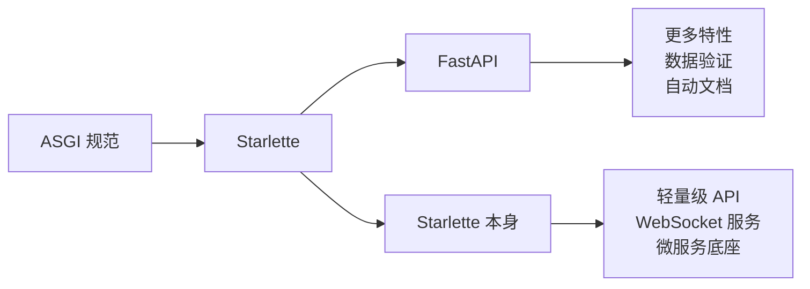
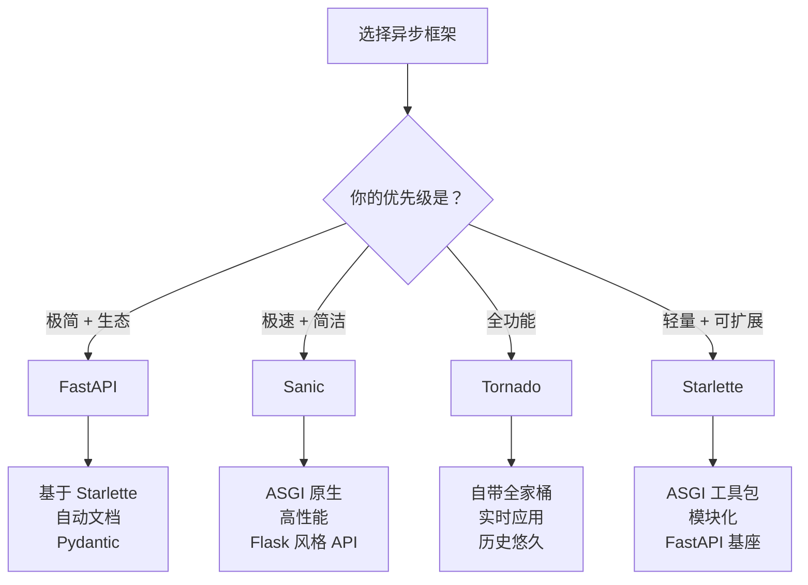
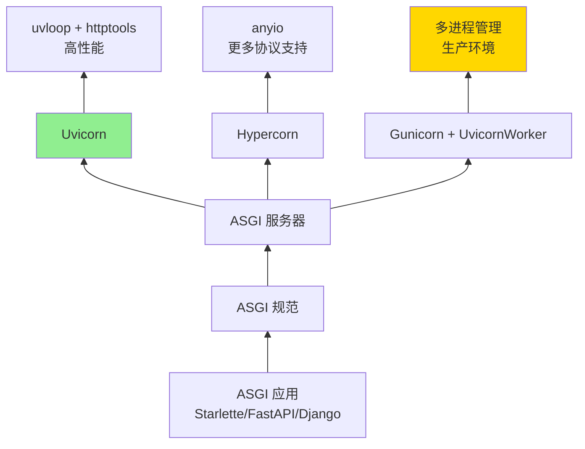

+++
title = "第23章 异步框架"
weight = 230
date = "2026-04-08T13:22:00+08:00"
type = "docs"
description = ""
isCJKLanguage = true
draft = false
+++

# 第 23 章：异步框架——让 Python 跑得像骑摩托

> 想象你是一家外卖店的老板。以前你雇了一个服务员，这个服务员很勤快但是有个毛病——每次去厨房催菜，必须站在厨房门口等厨师做完，才回来告诉你"菜好了"。你一看，这服务员大部分时间都在站着发呆啊！
>
> 异步编程就像是给这个服务员装上了对讲机。他发起一个做菜请求后，直接去忙别的事——擦桌子、收钱、招呼客人。等厨师通过对讲机说"菜好了"，他再回来取。这样一个服务员能同时"管理"好几个菜在做，服务效率蹭蹭往上涨。
>
> 这一章我们就来介绍 Python 异步生态中的四大金刚：**Starlette**、**Tornado**、**Sanic** 和 **Uvicorn**。它们各有各的绝活，有的是瑞士军刀，有的是重机枪，有的是赛车，让我们来一探究竟。

---

## 23.1 Starlette（ASGI 工具包）

### 23.1.1 什么是 ASGI？

在介绍 Starlette 之前，我们得先聊聊 **ASGI**。

**ASGI** 的全称是 Asynchronous Server Gateway Interface（异步服务器网关接口）。听起来很拗口，但我们可以把它想象成餐厅的点餐系统：

- **WSGI**（同步服务器网关接口）就像是你去一家老式餐厅，服务员站在你桌边等你点完菜，然后走到厨房门口等厨师做完，再端着菜回来。整个过程这个服务员都被"阻塞"在你这一桌。

- **ASGI**（异步服务器网关接口）则像是这家餐厅升级了——服务员用对讲机和厨房沟通，发起点餐请求后可以去照顾其他桌客人，等厨房通过对讲机通知菜好了，再去取。整个过程服务员不被绑定在一张桌子上。

> **ASGI vs WSGI**：WSGI 是同步的，一个请求占用一个 worker 直到完成；ASGI 是异步的，一个 worker 可以同时处理多个请求。打个比方，WSGI 是单车道，ASGI 是多车道高速路。

### 23.1.2 Starlette 是什么？

**Starlette** 是一个轻量级的 ASGI 工具包/框架。它就像是乐高积木——本身提供了一系列基础组件（路由、请求处理、模板、websockets 等），你可以自由组合来构建 Web 应用。

Starlette 不是"全家桶"式的框架，它更像是给你的异步 Web 开发提供一个坚实的技术底座。你可以用它快速搭建 API 服务、实时应用、后台任务系统等。

**Starlette 的特点**：

- **轻量级**：核心代码量不大，源码读起来相对轻松
- **高性能**：基于 ASGI，天生异步，处理高并发得心应手
- **模块化**：各个组件独立，要什么组装什么
- **兼容性**：可以和其他 ASGI 应用/框架无缝配合
- **功能丰富**：支持路由、请求/响应对象、模板引擎、会话管理、CORS、websockets 等

### 23.1.3 安装 Starlette

```bash
# 安装 Starlette
pip install starlette

# 如果需要额外的功能（如模板、websockets），可以安装完整版
pip install starlette[full]
```

### 23.1.4 第一个 Starlette 程序

让我们从一个经典的"Hello World"开始：

```python
from starlette.applications import Starlette
from starlette.routing import Route
from starlette.responses import JSONResponse
import uvicorn

# 定义一个异步的问候函数
async def homepage(request):
    """
    处理首页请求，返回 JSON 响应
    request 对象包含请求的所有信息（URL、参数、请求头等）
    """
    return JSONResponse({"message": "你好，异步世界！"})


# 定义另一个路由
async def greet(request):
    """
    /greet/{name} 路径会匹配这个函数
    {name} 是路径参数，可以通过 request.path_params 获取
    """
    name = request.path_params["name"]
    return JSONResponse({"message": f"欢迎光临，{name}！"})


# 创建应用并注册路由
# routes 列表定义了 URL 路径和对应处理函数的映射
routes = [
    Route("/", homepage),           # 根路径 -> homepage 函数
    Route("/greet/{name}", greet), # 带路径参数的路径，{name} 为占位符
]

app = Starlette(routes=routes)

# 启动服务器（开发模式）
if __name__ == "__main__":
    uvicorn.run(app, host="127.0.0.1", port=8000)
```

运行这个程序后，访问 `http://127.0.0.1:8000/`，你会看到：

```json
{"message": "你好，异步世界！"}
```

访问 `http://127.0.0.1:8000/greet/小明`，你会看到：

```json
{"message": "欢迎光临，小明！"}
```

::: tip
Starlette 的路由系统支持多种匹配方式：`/{param}` 匹配路径参数，`/search?q={query}` 匹配查询参数，还支持 HTTP 方法限定（GET、POST 等）。
:::

### 23.1.5 请求与响应对象

Starlette 提供了强大的请求解析和响应构建能力：

```python
from starlette.applications import Starlette
from starlette.routing import Route, Mount
from starlette.requests import Request
from starlette.responses import JSONResponse, HTMLResponse, PlainTextResponse
import uvicorn


async def query_params_demo(request: Request):
    """
    演示如何获取查询参数
    访问示例: /search?q=python&page=1
    """
    # request.query_params 是一个类似字典的对象
    # 支持 .get() 方法，带默认值，防止参数不存在时报错
    query = request.query_params.get("q", "未提供搜索词")
    page = request.query_params.get("page", "1")
    
    return JSONResponse({
        "搜索词": query,
        "页码": page,
        "模拟搜索结果": [f"结果 {i} - {query}" for i in range(1, 4)]
    })


async def post_data_demo(request: Request):
    """
    演示如何处理 POST 请求的 JSON 数据
    """
    # request.json() 是一个异步方法，用于解析请求体中的 JSON
    body = await request.json()
    
    username = body.get("username", "匿名用户")
    action = body.get("action", "什么都没做")
    
    return JSONResponse({
        "状态": "成功",
        "收到": f"{username} 进行了 {action}"
    })


async def headers_demo(request: Request):
    """
    演示如何读取请求头
    """
    user_agent = request.headers.get("user-agent", "未知浏览器")
    accept_language = request.headers.get("accept-language", "zh-CN")
    
    return JSONResponse({
        "你的浏览器": user_agent,
        "语言偏好": accept_language
    })


routes = [
    Route("/search", query_params_demo),   # GET 请求，查询参数演示
    Route("/action", post_data_demo),      # POST 请求，JSON 数据演示
    Route("/headers", headers_demo),       # 请求头演示
]

app = Starlette(routes=routes)

if __name__ == "__main__":
    uvicorn.run(app, host="127.0.0.1", port=8000)
```

运行后可以这样测试：

```bash
# 测试查询参数
curl "http://127.0.0.1:8000/search?q=starlette&page=2"

# 测试 POST 请求（需要发送 JSON）
curl -X POST http://127.0.0.1:8000/action \
     -H "Content-Type: application/json" \
     -d '{"username": "张三", "action": "点赞"}'
```

### 23.1.6 中间件系统

**中间件（Middleware）** 就像餐厅的服务流程——客人进门要经过迎宾、点餐、上菜、结账等多个环节，每个环节都可以做一些"通用处理"。

在 Web 应用中，中间件可以在请求处理前后执行一些通用逻辑，比如：

- 记录日志（每个请求都记一笔）
- 认证检查（是不是合法用户）
- CORS 处理（允许哪些域名访问）
- 请求限流（防止刷接口）

```python
from starlette.applications import Starlette
from starlette.routing import Route
from starlette.middleware import Middleware
from starlette.middleware.cors import CORSMiddleware
from starlette.middleware.trustedhost import TrustedHostMiddleware
from starlette.responses import JSONResponse
import uvicorn
import time


# 自定义中间件：记录请求日志
async def log_middleware(request, call_next):
    """
    记录每个请求的开始时间、处理耗时、访问路径
    """
    start_time = time.time()
    path = request.url.path
    method = request.method
    
    print(f"[日志] 收到请求: {method} {path}")
    
    # call_next(request) 调用下一个中间件或路由处理函数
    response = await call_next(request)
    
    # 处理完成后记录耗时
    duration = time.time() - start_time
    print(f"[日志] {method} {path} 处理耗时: {duration:.3f}秒")
    
    return response


# 自定义中间件：简单的请求限流
request_counts = {}  # 存储每个 IP 的请求计数

async def rate_limit_middleware(request, call_next):
    """
    简单限流：每个 IP 每秒最多 5 个请求
    """
    client_ip = request.client.host if request.client else "unknown"
    current_time = time.time()
    
    # 清理过期的记录（简单粗暴的实现，仅做演示）
    global request_counts
    cleaned = {ip: times for ip, times in request_counts.items()
               if current_time - times[-1] < 1}
    request_counts = cleaned
    
    # 检查是否超限
    if client_ip in request_counts:
        recent_requests = [t for t in request_counts[client_ip]
                         if current_time - t < 1]
        if len(recent_requests) >= 5:
            return JSONResponse(
                {"错误": "请求太频繁，请稍后再试！"},
                status_code=429
            )
        request_counts[client_ip] = recent_requests + [current_time]
    else:
        request_counts[client_ip] = [current_time]
    
    return await call_next(request)


async def homepage(request):
    return JSONResponse({"message": "中间件演示成功！"})


# 注册中间件
# 中间件按照从下往上的顺序执行（最后添加的最先执行）
middleware = [
    Middleware(TrustedHostMiddleware, allowed_hosts=["127.0.0.1", "localhost"]),
    Middleware(CORSMiddleware, allow_origins=["*"]),
    Middleware(log_middleware),
    Middleware(rate_limit_middleware),
]

app = Starlette(
    routes=[Route("/", homepage)],
    middleware=middleware
)

if __name__ == "__main__":
    uvicorn.run(app, host="127.0.0.1", port=8000)
```

### 23.1.7 WebSocket 支持

**WebSocket** 是一种让服务器和客户端保持长连接的技术，可以实现实时双向通信——就像对讲机，双方可以随时呼叫对方。

Starlette 原生支持 WebSocket，让我们来做个实时聊天演示：

```python
from starlette.applications import Starlette
from starlette.routing import Route, WebSocketRoute
from starlette.websockets import WebSocket
import uvicorn

# 存储所有连接的客户端
connected_clients = []


async def websocket_endpoint(websocket: WebSocket):
    """
    处理 WebSocket 连接
    """
    username = "匿名用户"  # 初始化，避免 finally 块中引用未定义的变量
    # 接受连接
    await websocket.accept()
    connected_clients.append(websocket)
    
    try:
        # 获取用户名（客户端连接后发送的第一个消息）
        username = await websocket.receive_text()
        print(f"[聊天] {username} 加入了群聊")
        
        # 广播用户加入消息
        for client in connected_clients:
            if client != websocket:
                await client.send_text(f"系统：{username} 加入了群聊")
        
        # 持续接收消息并广播
        while True:
            message = await websocket.receive_text()
            print(f"[聊天] {username}: {message}")
            
            # 广播消息给所有客户端
            for client in connected_clients:
                await client.send_text(f"{username}: {message}")
    
    except Exception as e:
        print(f"[聊天] 连接异常: {e}")
    
    finally:
        # 清理断开的客户端
        connected_clients.remove(websocket)
        print(f"[聊天] {username} 离开了群聊")
        
        # 广播用户离开消息
        for client in connected_clients:
            await client.send_text(f"系统：{username} 离开了群聊")


async def homepage(request):
    """
    返回一个简单的 HTML 聊天页面
    """
    html = """
    <!DOCTYPE html>
    <html>
    <head>
        <title>Starlette 实时聊天</title>
        <style>
            body { font-family: Arial; max-width: 600px; margin: 50px auto; }
            #messages { border: 1px solid #ddd; height: 300px; overflow-y: scroll; padding: 10px; }
            #input { width: 70%; padding: 10px; }
            button { width: 25%; padding: 10px; }
        </style>
    </head>
    <body>
        <h1>🌟Starlette 实时聊天</h1>
        <div id="messages"></div>
        <input id="msg" placeholder="输入消息..." />
        <button onclick="send()">发送</button>
        
        <script>
            const ws = new WebSocket('ws://127.0.0.1:8000/ws');
            let username = prompt('请输入你的昵称:') || '匿名用户';
            
            ws.onmessage = (event) => {
                const div = document.createElement('div');
                div.textContent = event.data;
                document.getElementById('messages').appendChild(div);
            };
            
            ws.onopen = () => ws.send(username);
            
            function send() {
                const input = document.getElementById('msg');
                ws.send(input.value);
                input.value = '';
            }
            
            document.getElementById('msg').onkeypress = (e) => {
                if (e.key === 'Enter') send();
            };
        </script>
    </body>
    </html>
    """
    from starlette.responses import HTMLResponse
    return HTMLResponse(html)


routes = [
    Route("/", homepage),
    WebSocketRoute("/ws", websocket_endpoint),
]

app = Starlette(routes=routes)

if __name__ == "__main__":
    print("打开浏览器访问: http://127.0.0.1:8000/")
    uvicorn.run(app, host="127.0.0.1", port=8000)
```

### 23.1.8 Starlette 在生态中的地位

Starlette 就像是厨房里的料理台——它本身可以做出一顿美味（轻量级 API 服务），但更多时候它是其他框架的"底层组件"。

最著名的例子就是 **FastAPI**——它正是基于 Starlette 构建的。FastAPI 在 Starlette 的基础上添加了：

- 自动 OpenAPI/Swagger 文档生成
- Pydantic 数据验证
- 依赖注入系统
- 更加友好的 API 设计

所以当你学会 Starlette 后，学习 FastAPI 将变得非常轻松——因为本质上你就是在学习如何更优雅地使用 Starlette。



---

## 23.2 Tornado（异步 Web 框架）

### 23.2.1 老前辈的故事

**Tornado** 是一个来自 Facebook 的"老前辈"——它诞生于 2009 年，比 Python 异步编程的黄金时代早了整整好几年。当年 FriendFeed（后被 Facebook 收购）用它来处理实时社交信息流，可以说 Tornado 是 Python 异步 Web 框架的"祖师爷"之一。

但是，Tornado 和我们之前介绍的 Starlette 有很大的不同。Tornado 是一个**自带电池**（batteries-included）的全栈框架——它不仅仅是一个 ASGI 工具包，而是包含了模板引擎、数据库连接池、认证系统、websocket 支持、甚至是一个 HTTP 客户端！用一个框架就能搞定前后端。

**Tornado 的特点**：

- **同步和异步混合**：Tornado 早期版本的异步是基于回调的，后来才添加了 `tornado.gen` 生成器风格和 `asyncio` 支持
- **自带模板引擎**：不用再装 Jinja2，Tornado 有自己的模板系统
- **长轮询和 WebSocket**：内置支持实时应用
- **非 ASGI**：Tornado 有自己的服务器实现，虽然也支持 ASGI，但它的核心不是基于 ASGI 的
- **协程支持**：全面支持 Python 协程（`async/await`）

### 23.2.2 安装 Tornado

```bash
pip install tornado
```

### 23.2.3 第一个 Tornado 程序

Tornado 的"Hello World"非常简洁：

```python
import tornado.ioloop
import tornado.web
import tornado.httpserver


class MainHandler(tornado.web.RequestHandler):
    """
    请求处理器类
    继承 RequestHandler 并重写 HTTP 方法（get, post 等）
    """
    def get(self):
        # self.write 用于写入响应内容
        self.write("你好，Tornado 世界！")


class GreetHandler(tornado.web.RequestHandler):
    """带路径参数的处理器"""
    def get(self, name):
        self.write(f"欢迎来到 Tornado，{name}！")


def make_app():
    """
    创建应用实例
    Application 类管理路由映射和配置
    """
    return tornado.web.Application([
        # 路由规则：(路径, 处理器类, 传递给处理器的参数)
        (r"/", MainHandler),
        (r"/greet/(\w+)", GreetHandler),  # (\w+) 会捕获路径段作为参数
    ])


if __name__ == "__main__":
    app = make_app()
    
    # 创建 HTTP 服务器
    # 单进程模式
    app.listen(8888)
    
    # 启动事件循环
    # 这行代码会阻塞，直到程序结束
    print("服务器运行中: http://127.0.0.1:8888/")
    tornado.ioloop.IOLoop.current().start()
```

运行后访问试试：

```
http://127.0.0.1:8888/         -> 你好，Tornado 世界！
http://127.0.0.1:8888/greet/小明 -> 欢迎来到 Tornado，小明！
```

### 23.2.4 模板引擎

Tornado 自带了一个简洁但强大的模板引擎，让我们用它来做个动态页面：

```python
import tornado.ioloop
import tornado.web
import tornado.template


class HomeHandler(tornado.web.RequestHandler):
    """首页处理器"""
    def get(self):
        # 准备数据
        items = ["Python", "JavaScript", "Go", "Rust"]
        user = {"name": "小明", "level": "超级管理员"}
        
        # render() 方法渲染模板并返回
        # 模板文件是 index.html
        self.render("index.html", items=items, user=user)


class ProfileHandler(tornado.web.RequestHandler):
    """用户资料页"""
    def get(self):
        username = self.get_argument("username", "游客")
        age = self.get_argument("age", "未知")
        
        self.render("profile.html", username=username, age=age)


# 加载模板目录
loader = tornado.template.Loader("./templates")

def make_app():
    return tornado.web.Application(
        [
            (r"/", HomeHandler),
            (r"/profile", ProfileHandler),
        ],
        template_path="./templates",  # 模板文件目录
        debug=True,  # 调试模式：修改模板后自动重载
    )


if __name__ == "__main__":
    app = make_app()
    app.listen(8888)
    print("模板演示: http://127.0.0.1:8888/")
    tornado.ioloop.IOLoop.current().start()
```

`templates/index.html` 内容：

```html
<!DOCTYPE html>
<html>
<head>
    <title>Tornado 模板演示</title>
</head>
<body>
    <h1>欢迎，{{ user["name"] }}！</h1>
    <p>你的等级：{{ user.level }}</p>
    
    <h2>编程语言列表</h2>
    <ul>
        
        <li>{{ item }}</li>
        
    </ul>
    
    <p><a href="/profile?username={{ user["name"] }}&age=25">查看个人资料</a></p>
</body>
</html>
```

`templates/profile.html` 内容：

```html
<!DOCTYPE html>
<html>
<head><title>个人资料</title></head>
<body>
    <h1>{{ username }} 的资料</h1>
    <p>年龄：{{ age }}</p>
    <p><a href="/">返回首页</a></p>
</body>
</html>
```

::: tip Tornado 模板语法
- `{{ 表达式 }}` 输出内容
- `...` 条件判断
- `...` 循环
- `...` 原样输出（不进行转义）
:::

### 23.2.5 异步请求处理

Tornado 的精髓在于异步处理。让我们对比一下同步和异步的处理方式：

```python
import tornado.ioloop
import tornado.web
import tornado.httpclient
import asyncio


# 同步方式（会阻塞！）
class SyncHandler(tornado.web.RequestHandler):
    """同步处理器 - 不推荐用于 IO 操作"""
    def get(self):
        # 假设我们调用一个慢速 API（阻塞 2 秒）
        # 在这 2 秒期间，这个请求会独占一个线程/worker
        import time
        time.sleep(2)  # 同步阻塞，坏事！
        
        self.write("同步方式完成（等了 2 秒）")


# 异步方式（推荐！）
class AsyncHandler(tornado.web.RequestHandler):
    """异步处理器 - 高效处理慢 IO"""
    async def get(self):
        # 使用 tornado 提供的异步 HTTP 客户端
        client = tornado.httpclient.AsyncHTTPClient()
        
        # await 会让出控制权，允许处理其他请求
        # 这个"等待"期间，服务器可以处理其他请求
        response = await client.fetch(
            "http://httpbin.org/delay/2"  # 这个 API 会延迟 2 秒响应
        )
        
        self.write(f"异步方式完成！响应状态：{response.code}")


# 使用 async/await 定义异步函数
async def fetch_data(url):
    """独立的异步函数"""
    client = tornado.httpclient.AsyncHTTPClient()
    response = await client.fetch(url)
    return response.body


class AsyncFunctionHandler(tornado.web.RequestHandler):
    """使用独立异步函数的处理器"""
    async def get(self):
        # 并行请求两个 API
        client = tornado.httpclient.AsyncHTTPClient()
        
        # 使用 asyncio.gather 并行执行多个协程
        results = await asyncio.gather(
            client.fetch("http://httpbin.org/get"),
            client.fetch("http://httpbin.org/ip"),
        )
        
        self.write(f"并行请求完成！获取了 {len(results)} 个响应")


def make_app():
    return tornado.web.Application([
        (r"/sync", SyncHandler),
        (r"/async", AsyncHandler),
        (r"/parallel", AsyncFunctionHandler),
    ])


if __name__ == "__main__":
    app = make_app()
    app.listen(8888)
    print("异步演示: http://127.0.0.1:8888/")
    print("  /sync    - 同步方式（会阻塞）")
    print("  /async   - 异步方式")
    print("  /parallel - 并行请求")
    tornado.ioloop.IOLoop.current().start()
```

### 23.2.6 WebSocket 实时聊天

Tornado 原生支持 WebSocket，让我们用它做个实时聊天室：

```python
import tornado.ioloop
import tornado.web
import tornado.websocket
import tornado.template
import json


# 存储所有连接的客户端
clients = set()


class ChatHandler(tornado.web.RequestHandler):
    """聊天页面"""
    def get(self):
        self.render("chat.html")


class ChatWebSocket(tornado.websocket.WebSocketHandler):
    """
    WebSocket 处理器
    维护客户端长连接，实现双向实时通信
    """
    
    def open(self):
        """新客户端连接时调用"""
        clients.add(self)
        print(f"[聊天] 新连接，当前在线: {len(clients)} 人")
    
    def on_message(self, message):
        """
        收到消息时调用
        将消息广播给所有客户端
        """
        # 解析消息（假设是 JSON 格式）
        try:
            data = json.loads(message)
            username = data.get("username", "匿名")
            text = data.get("message", "")
            
            print(f"[聊天] {username}: {text}")
            
            # 广播消息给所有人
            broadcast_msg = json.dumps({
                "type": "message",
                "username": username,
                "message": text,
                "online_count": len(clients)
            })
            
            for client in clients:
                client.write_message(broadcast_msg)
        
        except json.JSONDecodeError:
            # 非 JSON 格式，直接广播原文
            for client in clients:
                client.write_message(message)
    
    def on_close(self):
        """客户端断开时调用"""
        clients.remove(self)
        print(f"[聊天] 连接断开，当前在线: {len(clients)} 人")
        
        # 通知其他人
        broadcast_msg = json.dumps({
            "type": "system",
            "message": "一位朋友离开了聊天室"
        })
        for client in clients:
            client.write_message(broadcast_msg)


def make_app():
    return tornado.web.Application(
        [
            (r"/", ChatHandler),
            (r"/ws", ChatWebSocket),
        ],
        template_path="./templates",
        static_path="./static",
    )


if __name__ == "__main__":
    app = make_app()
    app.listen(8888)
    print("=" * 50)
    print("Tornado WebSocket 聊天室")
    print("打开浏览器访问: http://127.0.0.1:8888/")
    print("=" * 50)
    tornado.ioloop.IOLoop.current().start()
```

`templates/chat.html`：

```html
<!DOCTYPE html>
<html>
<head>
    <title>Tornado 聊天室</title>
    <style>
        body { font-family: Arial; max-width: 700px; margin: 30px auto; }
        #messages { 
            border: 1px solid #ccc; 
            height: 350px; 
            overflow-y: auto; 
            padding: 15px;
            background: #f9f9f9;
        }
        .message { margin: 8px 0; }
        .system { color: #888; font-style: italic; }
        .username { font-weight: bold; color: #2196F3; }
        #input-area { display: flex; gap: 10px; margin-top: 10px; }
        #username { width: 100px; }
        #message { flex: 1; padding: 10px; }
        button { padding: 10px 20px; }
        #status { color: #4CAF50; font-size: 12px; margin-top: 5px; }
    </style>
</head>
<body>
    <h1>💬 Tornado 聊天室</h1>
    <div id="messages"></div>
    <div id="status">连接状态: 未知</div>
    <div id="input-area">
        <input id="username" placeholder="昵称" />
        <input id="message" placeholder="输入消息..." />
        <button onclick="send()">发送</button>
    </div>
    
    <script>
        const ws = new WebSocket('ws://127.0.0.1:8888/ws');
        
        // 生成随机昵称
        document.getElementById('username').value = '用户' + Math.floor(Math.random() * 999);
        
        ws.onopen = () => {
            document.getElementById('status').textContent = '连接状态: ✅ 已连接';
            document.getElementById('status').style.color = '#4CAF50';
        };
        
        ws.onclose = () => {
            document.getElementById('status').textContent = '连接状态: ❌ 已断开';
            document.getElementById('status').style.color = '#f44336';
        };
        
        ws.onmessage = (event) => {
            const data = JSON.parse(event.data);
            const div = document.createElement('div');
            div.className = 'message';
            
            if (data.type === 'system') {
                div.innerHTML = `<span class="system">${data.message}</span>`;
            } else {
                div.innerHTML = `<span class="username">${data.username}:</span> ${data.message}`;
            }
            
            document.getElementById('messages').appendChild(div);
            document.getElementById('messages').scrollTop = document.getElementById('messages').scrollHeight;
        };
        
        function send() {
            const msg = document.getElementById('message').value.trim();
            if (!msg) return;
            
            const data = {
                username: document.getElementById('username').value || '匿名',
                message: msg
            };
            
            ws.send(JSON.stringify(data));
            document.getElementById('message').value = '';
        }
        
        document.getElementById('message').onkeypress = (e) => {
            if (e.key === 'Enter') send();
        };
    </script>
</body>
</html>
```

### 23.2.7 Tornado vs Starlette

| 特性 | Tornado | Starlette |
|------|---------|-----------|
| **定位** | 全栈框架 | 轻量级 ASGI 工具包 |
| **发布时间** | 2009 年 | 2018 年 |
| **模板引擎** | 内置 | 需要额外安装 |
| **生态** | 自成体系 | FastAPI 等基于它 |
| **学习曲线** | 较陡（历史包袱） | 平缓（设计现代） |
| **适用场景** | 需要全功能的实时应用 | 微服务、API、 lightweight WebSocket |

::: tip 选哪个？
- 如果你需要快速构建一个包含模板、数据库、认证的完整 Web 应用，**Tornado** 自带全家桶
- 如果你做微服务、API、或者想学习现代异步 Web 开发，**Starlette/FastAPI** 更合适
- 如果你在做 AI 应用的后端，**FastAPI** 几乎是标配（基于 Starlette）
:::

---

## 23.3 Sanic（高速异步框架）

### 23.3.1 速度的信仰

如果说 Tornado 是"老前辈"，Sanic 就是一个"速度狂魔"。

**Sanic** 是 Python 异步 Web 框架中的"赛车手"。它的名字来源于一个游戏角色（Sanic Hegehog，暗讽索尼克），主打的就是一个快！官方口号就是"Build Fast. Run Fast."（快速构建，快速运行）。

Sanic 的设计目标很明确：**在保持 Python 优雅的同时，提供极致的性能**。它基于 ASGI 规范，使用了和 Starlette 类似的路由系统，但在性能优化上做了更多努力。

**Sanic 的特点**：

- **超高并发**：单进程轻松处理数万并发连接
- **简洁的 API**：比 Flask 更 Pythonic，比 Tornado 更现代
- **原生异步**：从设计之初就是异步的，没有历史包袱
- **蓝图系统**：Flask 式的蓝图（Blueprint）来组织代码
- **插件生态**：丰富的官方和社区插件
- **WebSocket 原生支持**：内置 WebSocket 处理

### 23.3.2 安装 Sanic

```bash
pip install sanic
```

### 23.3.3 第一个 Sanic 程序

Sanic 的"Hello World"简洁到令人发指：

```python
from sanic import Sanic
from sanic.response import json

# 创建应用实例
app = Sanic("my_first_sanic_app")


# 使用 @app.route 装饰器定义路由
# 是不是很像 Flask？但这是异步的！
@app.route("/")
async def index(request):
    """
    所有路由处理函数都应该是 async 函数
    request 对象包含请求信息
    """
    return json({"message": "Sanic 太快了，快到模糊！"})


@app.route("/greet/<name:str>")
async def greet(request, name: str):
    """路径参数直接作为函数参数，类型自动转换"""
    return json({"message": f"你好 {name}，Sanic 向你致敬！"})


@app.route("/add/<a:int>/<b:int>")
async def add(request, a: int, b: int):
    """路径参数支持类型：str, int, number, alpha"""
    return json({"result": a + b})


if __name__ == "__main__":
    # run() 方法启动服务器
    # 单行启动，无需 uvicorn！
    app.run(host="127.0.0.1", port=8000, reload=False)
    # reload=True 开启自动重载（开发模式）
```

运行后测试：

```bash
curl http://127.0.0.1:8000/
# {"message":"Sanic 太快了，快到模糊！"}

curl http://127.0.0.1:8000/greet/小明
# {"message":"你好 小明，Sanic 向你致敬！"}

curl http://127.0.0.1:8000/add/100/200
# {"result":300}
```

### 23.3.4 请求处理

Sanic 提供了丰富的方式来处理各种请求：

```python
from sanic import Sanic
from sanic.response import json, text, html, file

app = Sanic("request_demo")


# ============== 查询参数 ==============
@app.route("/search")
async def search(request):
    """
    获取查询参数 ?q=python&page=1
    request.args 是 dict，values() 返回列表
    """
    query = request.args.get("q", "未提供")
    page = request.args.get("page", "1")
    
    return json({
        "搜索": query,
        "页码": page,
        "结果": [f"{query} 结果 {i}" for i in range(1, 4)]
    })


# ============== POST JSON 数据 ==============
@app.route("/submit", methods=["POST"])
async def submit(request):
    """
    处理 JSON POST 请求
    request.json 包含解析后的 JSON 数据
    """
    data = request.json or {}
    
    username = data.get("username", "匿名")
    action = data.get("action", "发呆")
    
    return json({
        "状态": "成功",
        "用户名": username,
        "动作": action
    })


# ============== 表单数据 ==============
@app.route("/form", methods=["POST"])
async def handle_form(request):
    """
    处理 HTML 表单提交 (application/x-www-form-urlencoded)
    """
    name = request.form.get("name", "未填写")
    email = request.form.get("email", "未填写")
    
    return json({
        "姓名": name,
        "邮箱": email
    })


# ============== 请求头 ==============
@app.route("/headers")
async def show_headers(request):
    """
    获取请求头
    """
    ua = request.headers.get("user-agent", "未知")
    auth = request.headers.get("authorization", "无")
    
    return json({
        "用户代理": ua,
        "认证信息": auth
    })


# ============== 返回 HTML ==============
@app.route("/html")
async def return_html(request):
    """直接返回 HTML"""
    html_content = """
    <!DOCTYPE html>
    <html>
    <head><title>Sanic HTML 演示</title></head>
    <body>
        <h1>🎉 Sanic 可以直接返回 HTML！</h1>
        <p>太方便了，不用单独配模板引擎。</p>
    </body>
    </html>
    """
    return html(html_content)


# ============== 返回文件 ==============
@app.route("/download")
async def download_file(request):
    """
    返回文件下载
    """
    # 第一个参数是文件路径，第二个是下载时的文件名
    return await file("example.txt", filename="下载的文件.txt")


if __name__ == "__main__":
    # Sanic 内部使用 uvicorn 作为服务器
    # 你也可以手动指定用 uvicorn 运行：
    # uvicorn.run(app, host="127.0.0.1", port=8000)
    app.run(host="127.0.0.1", port=8000)
```

### 23.3.5 蓝图（Blueprint）组织代码

随着项目变大，我们不可能把所有路由都写在 `app.py` 里。Sanic 提供了 **蓝图（Blueprint）** 来模块化组织代码——这和 Flask 的蓝图如出一辙。

```python
# ============== main.py ==============
from sanic import Sanic
from sanic.response import json

# 导入各个蓝图
from api import api_bp
from admin import admin_bp

app = Sanic("blueprint_demo")

# 注册蓝图，指定 URL 前缀
app.blueprint(api_bp, url_prefix="/api")
app.blueprint(admin_bp, url_prefix="/admin")

@app.route("/")
async def index(request):
    return json({"message": "主应用首页"})


if __name__ == "__main__":
    app.run(host="127.0.0.1", port=8000)
```

```python
# ============== api.py ==============
from sanic import Blueprint

# 创建蓝图
api_bp = Blueprint("api", url_prefix="/v1")


@api_bp.route("/users")
async def list_users(request):
    """用户列表 API"""
    return {"users": ["张三", "李四", "王五"]}


@api_bp.route("/users/<user_id:int>")
async def get_user(request, user_id: int):
    """获取单个用户"""
    return {
        "id": user_id,
        "name": f"用户{user_id}",
        "email": f"user{user_id}@example.com"
    }
```

```python
# ============== admin.py ==============
from sanic import Blueprint

admin_bp = Blueprint("admin")


@admin_bp.route("/dashboard")
async def dashboard(request):
    """管理后台仪表盘"""
    return {"status": "ok", "pending_tasks": 42}


@admin_bp.route("/settings")
async def settings(request):
    """管理后台设置"""
    return {"theme": "dark", "language": "zh-CN"}
```

访问测试：

```
http://127.0.0.1:8000/api/v1/users     -> {"users":["张三","李四","王五"]}
http://127.0.0.1:8000/api/v1/users/123 -> {"id":123,"name":"用户123","email":"user123@example.com"}
http://127.0.0.1:8000/admin/dashboard  -> {"status":"ok","pending_tasks":42}
```

### 23.3.6 中间件

Sanic 的中间件系统和 Flask 很像，但支持异步：

```python
from sanic import Sanic
from sanic.response import json
import time

app = Sanic("middleware_demo")


# ============== 请求中间件 ==============
@app.middleware("request")
async def log_request(request):
    """
    请求中间件：在处理请求之前执行
    可以修改 request 对象
    """
    request.ctx.start_time = time.time()
    print(f"[中间件] 收到 {request.method} 请求: {request.path}")


# ============== 响应中间件 ==============
@app.middleware("response")
async def add_headers(request, response):
    """
    响应中间件：在返回响应之前执行
    可以修改 response 对象
    """
    # 添加自定义响应头
    response.headers["X-Powered-By"] = "Sanic"
    response.headers["X-Process-Time"] = str(time.time() - request.ctx.start_time)
    
    print(f"[中间件] {request.path} 处理完成")


# ============== 全局异常处理 ==============
@app.exception(Exception)
async def handle_exception(request, exception):
    """
    全局异常处理器
    任何未捕获的异常都会来到这里
    """
    return json(
        {"错误": str(exception)},
        status=500
    )


@app.route("/")
async def index(request):
    return json({"message": "正常运行"})


@app.route("/error")
async def trigger_error(request):
    """故意触发错误的路由"""
    raise ValueError("这是一个故意的错误！")


if __name__ == "__main__":
    app.run(host="127.0.0.1", port=8000)
```

### 23.3.7 WebSocket

Sanic 对 WebSocket 的支持也很优雅：

```python
from sanic import Sanic
from sanic.response import json

app = Sanic("websocket_demo")

# 存储连接的客户端
clients = []


@app.websocket("/ws")
async def chat(request, ws):
    """
    @app.websocket 装饰器定义 WebSocket 端点
    """
    clients.append(ws)
    
    try:
        # 持续接收消息
        async for message in ws:
            print(f"[聊天] 收到: {message}")
            
            # 广播给所有客户端
            disconnected = []
            for client in clients:
                try:
                    await client.send(f"广播: {message}")
                except Exception:
                    disconnected.append(client)
            
            # 清理断开的连接
            for client in disconnected:
                clients.remove(client)
    
    except Exception as e:
        print(f"[聊天] 连接异常: {e}")
    
    finally:
        clients.remove(ws)
        print(f"[聊天] 客户端断开，当前在线: {len(clients)}")


@app.route("/")
async def index(request):
    return json({"message": "WebSocket 聊天服务器", "endpoint": "/ws"})


if __name__ == "__main__":
    app.run(host="127.0.0.1", port=8000)
```

### 23.3.8 性能对比小实验

Sanic 之所以敢称"快"，是有底气的。做一个简单的压力测试对比：

```python
# 准备几个框架的"Hello World"，然后用 ab 或 wrk 测试
# 这里先展示代码，具体测试自己动手哦！

# Sanic 版本
from sanic import Sanic
from sanic.response import text

sanic_app = Sanic("bench")
@sanic_app.route("/")
async def index(request):
    return text("Hello")

# Flask 版本（同步，仅作对比）
# from flask import Flask
# flask_app = Flask("bench")
# @flask_app.route("/")
# def index():
#     return "Hello"

# 性能测试命令（Linux/Mac）
# pip install wrk
# wrk -t4 -c100 http://127.0.0.1:8000/

# 预期结果（大致，取决于硬件）
# Sanic:  30,000+ 请求/秒
# Flask:   5,000  请求/秒
# 差距约 6-10 倍！
```

::: tip 实测注意
实际性能差距取决于很多因素（CPU、网络、请求复杂度）。对于简单的"Hello World"，Sanic 的优势最明显；复杂的业务逻辑中，各框架差距会缩小。
:::



---

## 23.4 Uvicorn（ASGI 服务器）

### 23.4.1 服务器与框架的关系

在讲 Uvicorn 之前，我们先来厘清一个概念：**Web 框架** 和 **Web 服务器** 有什么区别？

**Web 框架**（Framework）负责：
- 定义路由映射
- 处理请求/响应对象
- 提供模板、ORM、认证等功能
- 让你用优雅的方式写业务逻辑

**Web 服务器**（Server）负责：
- 监听端口，接收 HTTP 请求
- 管理进程/线程/协程池
- 处理协议（HTTP、WebSocket）
- 高并发、负载均衡、热更新

打个比方：

- **框架** 像餐厅的**菜单和后厨流程**——告诉厨师怎么做菜
- **服务器** 像餐厅的**前台和管理系统**——接待客人、分配桌位、保证运转

Python 的传统组合是 **Flask/Django + Gunicorn**。在异步时代，**Starlette/FastAPI + Uvicorn** 是新标配。

### 23.4.2 Uvicorn 是什么？

**Uvicorn** 是一个基于 ASGI 规范的 Python 异步 HTTP 服务器。它使用 uvloop（基于 libuv 的高性能事件循环）+ httptools（Node.js 核心 HTTP 解析器的 Python 移植）实现，性能非常出色。

**Uvicorn 的特点**：

- **ASGI 原生**：专为 ASGI 应用设计（如 Starlette、FastAPI、Django 3.0+）
- **超高性能**：事件循环 + HTTP 解析都用了 C 扩展
- **热重载**：开发模式下修改代码自动重载
- **WebSocket 支持**：原生支持 ASGI 的 WebSocket 协议
- **Gunicorn 集成**：可以用 Gunicorn 作为进程管理器
- **uvloop 加持**：使用和 Node.js 相同的快速事件循环

### 23.4.3 安装 Uvicorn

```bash
# 基本安装
pip install uvicorn

# 如果想用 uvloop 和 httptools 加速（强烈推荐！）
pip install uvloop httptools

# 如果想用 Gunicorn 作为进程管理器
pip install gunicorn
```

### 23.4.4 基本使用

Uvicorn 的使用非常简单：

```python
# ============== app.py ==============
from starlette.applications import Starlette
from starlette.routing import Route
from starlette.responses import JSONResponse

async def homepage(request):
    return JSONResponse({"message": "Uvicorn 驱动世界！"})

app = Starlette(routes=[Route("/", homepage)])
```

然后用 uvicorn 启动：

```bash
# 基本启动（推荐）
uvicorn app:app --host 127.0.0.1 --port 8000

# 指定应用和主机
uvicorn main:app --host 0.0.0.0 --port 8000

# 开发模式（自动重载）
uvicorn app:app --reload

# 指定 workers 数量（多进程）
uvicorn app:app --workers 4

# 显示访问日志
uvicorn app:app --log-level info

# 指定日志格式
uvicorn app:app --log-config logging.conf
```

### 23.4.5 命令行参数详解

Uvicorn 提供了丰富的命令行选项：

```bash
# 常用参数
uvicorn app:app              # 基本：app 是文件名，app 是应用实例
  --host 0.0.0.0             # 绑定地址，0.0.0.0 表示所有网络接口
  --port 8000                # 端口号
  --reload                   # 开发模式：代码修改自动重载
  --workers 4                # 工作进程数（仅在 Linux/Mac）
  --loop auto                # 事件循环：auto, asyncio, uvloop
  --http auto                # HTTP 协议：auto, h11, h2
  --lifespan on              # 生命周期事件：on, off, auto
  --log-level info           # 日志级别：debug, info, warning, error, critical
  --timeout-keep-alive 5     # Keep-Alive 超时（秒）
  --ssl-keyfile key.pem      # HTTPS 密钥文件
  --ssl-certfile cert.pem    # HTTPS 证书文件

# 进阶参数
  --proxy-headers            # 信任代理（如 Nginx）的 X-Forwarded-* 头
  --forwarded-allow-ips="*"  # 允许转发的 IP（用逗号分隔）
  --limit-concurrency 1000   # 最大并发连接数
  --limit-max-requests 10000 # 单 worker 最大请求数（超过后重启，防止内存泄漏）
  --backlog 2048             # 待处理连接队列大小
  --no-access-log           # 禁用访问日志（默认开启）

# 文件配置
  --factory                  # app 是工厂函数：app() 而不是 app
  --app-dir .                # 应用目录
  --config py:app_factory    # 从 Python 模块加载配置
```

### 23.4.6 配置文件

除了命令行，你也可以用 Python 代码或 YAML/JSON 配置文件：

```python
# ============== config.py ==============
# uvicorn 的配置文件必须命名为 uvicorn_config.py 或 pyproject.toml 中的 [tool.uvicorn]

config = {
    "app": "app:app",
    "host": "127.0.0.1",
    "port": 8000,
    "reload": True,
    "workers": 1,
    "log_level": "info",
    "access_log": True,
}

# 配置文件方式（了解即可，推荐用 pyproject.toml）
```

```bash
# 推荐方式：在 pyproject.toml 中配置
# [tool.uvicorn]
# app = "app:app"
# host = "127.0.0.1"
# port = 8000
# reload = true
# workers = 4
```

### 23.4.7 与 Gunicorn 配合

在生产环境中，单进程往往不够用。**Gunicorn** 是一个成熟的多进程管理器，可以管理多个 Uvicorn worker：

```bash
# 安装 gunicorn 和 uvicorn worker
pip install gunicorn 'uvicorn[standard]'

# 启动（使用 uvicorn.workers.UvicornWorker）
gunicorn app:app \
    --workers 4 \
    --worker-class uvicorn.workers.UvicornWorker \
    --bind 0.0.0.0:8000
```

```
原理图：

                    Nginx（反向代理/负载均衡）
                         ↓
        ┌───────────────┼───────────────┐
        ↓               ↓               ↓
   Gunicorn        Gunicorn        Gunicorn
   (Worker 1)      (Worker 2)      (Worker 3)
   Uvicorn         Uvicorn         Uvicorn
   (单进程)         (单进程)         (单进程)
      ↓               ↓               ↓
   异步处理        异步处理         异步处理
```

### 23.4.8 生命周期事件

Uvicorn 支持 **lifespan**（生命周期）事件，可以在应用启动和关闭时执行代码：

```python
# ============== lifespan_demo.py ==============
from starlette.applications import Starlette
from starlette.routing import Route, Lifespan
from starlette.responses import JSONResponse

# 存储应用状态
app_state = {}


async def startup():
    """
    应用启动时执行的异步函数
    初始化数据库连接、缓存等
    """
    print("🚀 应用正在启动...")
    app_state["initialized"] = True
    app_state["start_time"] = "2024-01-01 00:00:00"
    print("✅ 启动完成！")


async def shutdown():
    """
    应用关闭时执行的异步函数
    清理资源、保存状态
    """
    print("👋 应用正在关闭...")
    # 关闭数据库连接、关闭缓存等清理工作
    print("🧹 清理完成！再见！")


async def homepage(request):
    return JSONResponse({
        "message": "生命周期事件演示",
        "initialized": app_state.get("initialized", False),
        "start_time": app_state.get("start_time", "未知")
    })


# 定义 lifespan 事件
lifespan = Lifespan(
    on_startup=[startup],
    on_shutdown=[shutdown]
)

app = Starlette(
    routes=[Route("/", homepage)],
    lifespan=lifespan
)

# 运行：
# uvicorn lifespan_demo:app --reload
```

运行效果：

```
🚀 应用正在启动...
✅ 启动完成！
INFO:     Uvicorn running on http://127.0.0.1:8000
# ... 处理请求 ...
# Ctrl+C 按下
👋 应用正在关闭...
🧹 清理完成！再见！
INFO:     Shutting down
```

### 23.4.9 HTTPS 支持

在本地测试 HTTPS 时，可以生成自签名证书：

```bash
# 生成自签名证书（仅用于测试！）
openssl req -x509 -newkey rsa:4096 -keyout key.pem -out cert.pem -days 365 -nodes

# 使用 HTTPS 启动
uvicorn app:app --ssl-keyfile key.pem --ssl-certfile cert.pem
```

然后访问：`https://127.0.0.1:8000/`（浏览器会提示证书不受信任，测试而已）。

### 23.4.10 性能优化技巧

```bash
# 1. 使用 uvloop（需要安装）
pip install uvloop httptools
# Uvicorn 会自动检测并使用

# 2. 多 workers（充分利用多核）
uvicorn app:app --workers $(nproc)  # Linux 获取 CPU 核心数

# 3. 绑定 Unix socket（比 TCP 稍快）
uvicorn app:app --unix-socket /tmp/uvicorn.sock

# 4. Gunicorn + Uvicorn（生产推荐）
gunicorn app:app \
    --workers 4 \
    --worker-class uvicorn.workers.UvicornWorker \
    --bind unix:/tmp/uvicorn.sock \
    --max-requests 10000 \
    --max-requests-jitter 1000

# 5. 限流保护
uvicorn app:app --limit-concurrency 1000

# 6. 超时设置
uvicorn app:app \
    --timeout-keep-alive 5 \
    --limit-max-requests 10000
```

### 23.4.11 Uvicorn 在 ASGI 生态中的位置



---

## 本章小结

这一章我们一起探索了 Python 异步 Web 生态的四大明星：

| 框架/服务器 | 定位 | 特点 | 适用场景 |
|-------------|------|------|----------|
| **Starlette** | ASGI 工具包 | 轻量、模块化、可扩展 | 微服务、API 底座、FastAPI 基础 |
| **Tornado** | 全栈异步框架 | 自带电池、实时应用、老前辈 | 需要模板+数据库+WebSocket 的完整应用 |
| **Sanic** | 高速异步框架 | 极致性能、Flask 风格 API | 高并发 API、游戏后端、实时服务 |
| **Uvicorn** | ASGI 服务器 | 高性能、热重载、生产可用 | 驱动 Starlette/FastAPI/Django 3.0+ |

**核心要点回顾**：

1. **ASGI 是未来**：相比 WSGI，ASGI 支持真正的异步处理，一个 worker 可以处理海量并发

2. **Starlette 是地基**：FastAPI 基于 Starlette 构建，学好 Starlette 就掌握了 FastAPI 的精髓

3. **Tornado 是老前辈**：虽然历史包袱较重，但自带全家桶，适合不想折腾的场景

4. **Sanic 追求速度**：如果你需要极致的 QPS，Sanic + Uvicorn 是强力组合

5. **Uvicorn 是发动机**：它不处理你的业务逻辑，它负责高效地接收请求、调用你的应用、返回响应

6. **async/await 是关键**：所有异步框架都用 `async def` 定义路由处理器，用 `await` 等待异步操作

7. **生产部署建议**：开发用 Uvicorn 热重载，生产用 Gunicorn + UvicornWorker 多进程，Nginx 做反向代理

> 记住：**框架是厨艺，服务器是前台**。好厨师需要好前台配合，才能让餐厅运转得风生水起！

---

*下一章我们将深入 FastAPI，掌握 Python 异步 API 开发的"瑞士军刀"！*
