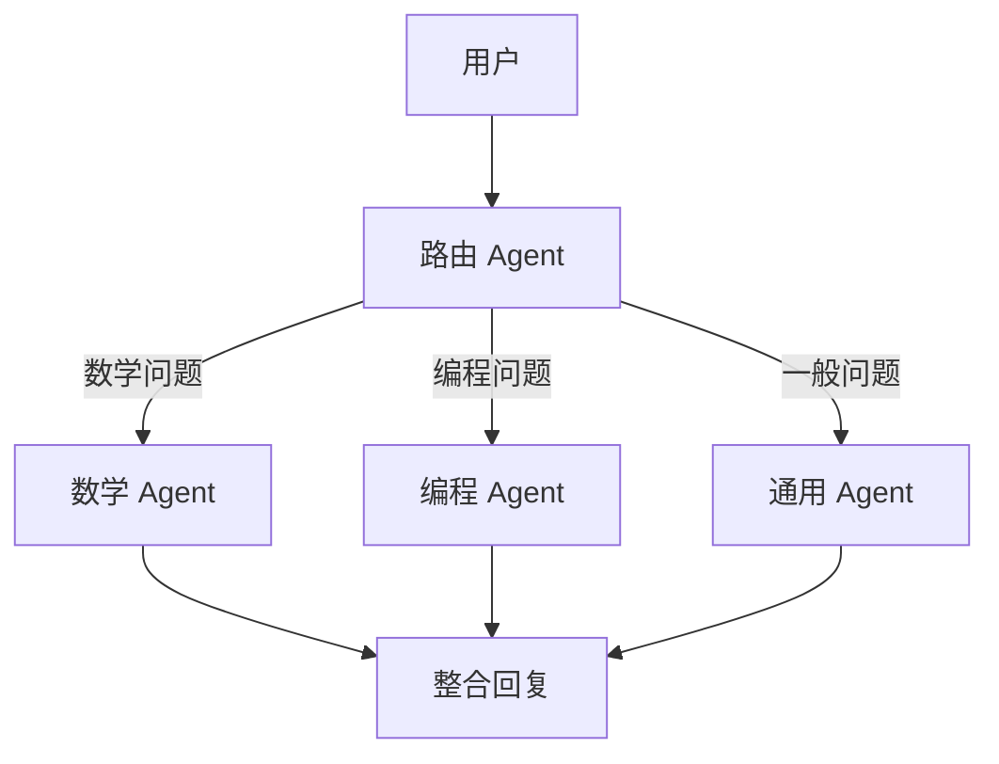

+++
title = "第25章 AI框架"
weight = 250
date = "2026-04-08T13:22:00+08:00"
type = "docs"
description = ""
isCJKLanguage = true
draft = false
+++

# 第 25 章 AI 框架：让你的 Python 变身为 AI 超人

> 💬 旁白：想象一下，你刚刚学会了 Python 基础，能写点循环、函数、类，感觉自己像个程序员了。结果打开 AI 时代的新闻一看——什么 LangChain、LangGraph、LlamaIndex、Hugging Face……脑袋直接宕机。别怕，这一章就是给你准备的"AI 框架速成班"，保证你学完可以跟别人吹牛说自己"精通 AI 应用开发"了。

在这一章开始之前，先回答一个灵魂拷问：**为什么需要 AI 框架？**

想象你要做一道菜。你可以自己去菜市场买菜、回来生火、切菜、调味……但如果你有一整套厨房工具（电饭煲、空气炸锅、破壁机），做菜就会快很多。AI 框架就是 Python 的"AI 厨房套装"——它们把大模型调用、记忆管理、工具调用、RAG（检索增强生成）等复杂操作封装成简单的接口，让你不用从零造轮子，直接站在巨人的肩膀上。

---

## 25.1 LangChain 全解

### 25.1.1 什么是 LangChain？

**LangChain** 是一个开源框架，核心目标是帮助开发者**链式调用**（Chain）大语言模型（LLM），从而构建复杂的 AI 应用。你可以把它理解为一个"AI 流水线工厂"——原材料（用户输入）进去，成品（AI 回复）出来，中间的加工步骤你可以自由拼接。

> 💡 **专业术语解释**：LangChain 中的 "Chain" 并不是区块链的"链"，而是指"一系列操作的串联"。就像流水线一样，一个步骤的输出作为下一个步骤的输入。

LangChain 诞生于 2022 年底，由 Harrison Chase 创建，在 ChatGPT 发布后迅速走红。它的核心组件包括：
- **Models**：支持调用各种大模型（OpenAI GPT、Anthropic Claude、开源模型等）
- **Prompts**：提示词模板管理
- **Indexes**：文档加载和索引
- **Memory**：对话记忆管理
- **Chains**：将多个组件串联成流水线
- **Agents**：让 AI 能够"使用工具"自主决策

### 25.1.2 安装 LangChain

```bash
pip install langchain langchain-openai langchain-community
```

```python
# 安装完成后，简单验证一下能否导入
import langchain
print(langchain.__version__)  # 打印版本号，例如：0.3.0
```

### 25.1.3 你的第一个 LangChain 程序

先从最简单的开始——让 LangChain 调用 OpenAI 的 GPT 模型。

```python
# 导入 LangChain 的 OpenAI 包装器
from langchain_openai import ChatOpenAI

# 创建模型实例（需要设置 OPENAI_API_KEY 环境变量）
llm = ChatOpenAI(model="gpt-4o", temperature=0.7)

# 让模型生成内容
response = llm.invoke("给我讲一个关于程序员的笑话")
print(response.content)
# 输出示例：为什么程序员总是分不清万圣节和圣诞节？
# 因为 Oct 31（八进制31）= 25（十进制）= Dec 25（十二月二十五日）
# 谐音梗？不，是进制转换——程序员专属幽默（扣钱警告）
```

> ⚠️ **新手注意**：这里的 `temperature` 参数控制回复的"创意程度"。0 表示几乎固定的回复（适合精确任务），1 表示非常随机（适合创意写作）。数值太高小心 AI 跟你聊哲学聊到天亮。

### 25.1.4 PromptTemplate：提示词模板

在真实项目中，你通常不会直接写死提示词，而是用**模板**来动态生成。

```python
from langchain_core.prompts import PromptTemplate

# 定义一个模板，{topic} 和 {style} 是占位符
template = PromptTemplate.from_template(
    "用{style}风格写一篇关于{topic}的短文，要求300字以内。"
)

# 用不同的参数填充模板
prompt1 = template.invoke({"topic": "量子计算", "style": "幽默"})
prompt2 = template.invoke({"topic": "太空探索", "style": "严肃"})

# 分别调用模型
response1 = llm.invoke(prompt1)
response2 = llm.invoke(prompt2)

print("幽默版：", response1.content[:50], "...")
print("严肃版：", response2.content[:50], "...")
```

### 25.1.5 LCEL：LangChain Expression Language

LangChain 的一大杀器是 **LCEL**（LangChain Expression Language），一种链式调用语法，让你像搭积木一样组合各种组件。LCEL 使用 `|` 管道运算符，把前一个组件的输出传给下一个。

```python
from langchain_openai import ChatOpenAI
from langchain_core.prompts import PromptTemplate
from langchain_core.output_parsers import StrOutputParser

# 创建各个组件
llm = ChatOpenAI(model="gpt-4o")
prompt = PromptTemplate.from_template("把下面这句话翻译成{language}：{sentence}")
parser = StrOutputParser()  # 解析输出为纯字符串

# 用 LCEL 语法串联成链
chain = prompt | llm | parser

# 调用链
result = chain.invoke({"language": "法语", "sentence": "Hello, world!"})
print(result)  # Bonjour, le monde!
```

这段代码的流程是：`prompt` 先填充模板 → 传给 `llm` 生成回复 → 传给 `parser` 解析成字符串。简洁又优雅！

> 💡 LCEL 的设计哲学是：**每个组件都是一个"函数"**，可以接收输入、返回输出。管道 `|` 就是函数组合（function composition）。这就是函数式编程的魅力！

### 25.1.6 Memory：给 AI 装上记忆

普通 AI 对话是"失忆"的——每次都是全新开始。LangChain 的 **Memory** 组件让 AI 能够记住对话历史。

```python
from langchain_openai import ChatOpenAI
from langchain_core.messages import HumanMessage, AIMessage, SystemMessage
from langchain_community.chat_message_histories import ChatMessageHistory
from langchain_core.runnables.history import RunnableWithMessageHistory

llm = ChatOpenAI(model="gpt-4o")

# 创建一个简单的内存存储（实际项目用 Redis 等）
message_history = ChatMessageHistory()

# 定义对话历史抓取函数
def get_session_history(session_id):
    return message_history

# 包装成带记忆的链
chain = llm

# 带记忆的调用
with_message_history = RunnableWithMessageHistory(
    chain,
    get_session_history,
    input_messages_key="input",
    history_messages_key="history",
)

# 第一次对话
response1 = with_message_history.invoke(
    {"input": "我叫张三，我喜欢打篮球。"},
    config={"configurable": {"session_id": "user-123"}}
)
print(response1.content)  # 很高兴认识你，张三！

# 第二次对话（AI 应该记得我叫张三）
response2 = with_message_history.invoke(
    {"input": "我叫什么名字？"},
    config={"configurable": {"session_id": "user-123"}}
)
print(response2.content)  # 你叫张三，你还喜欢打篮球。
```

> 😂 **笑点**：如果你不小心用同一个 session_id 和别人聊天，AI 就会同时记住两个人的秘密——这可不是 Bug，这是 feature（如果你喜欢三角恋剧情的话）。

### 25.1.7 Agents：让 AI 自己动起来

**Agent** 是 LangChain 里最酷的特性之一——它让 AI 不只是被动回复，而是能**主动决策、使用工具**。一个 Agent 可以：
1. 理解用户意图
2. 决定是否需要调用工具（如搜索、计算）
3. 执行工具获取结果
4. 基于结果决定下一步

```python
from langchain_openai import ChatOpenAI
from langchain.agents import AgentType, initialize_agent, Tool
from langchain.tools import WikipediaQueryRun, WolframAlphaQueryRun
from langchain_community.utilities import WikipediaAPIWrapper, WolframAlphaAPIWrapper

llm = ChatOpenAI(model="gpt-4o")

# 创建工具
wikipedia = WikipediaQueryRun(api_wrapper=WikipediaAPIWrapper())
wolfram = WolframAlphaQueryRun(api_wrapper=WolframAlphaAPIWrapper())

# 注册工具
tools = [
    Tool(name="Wikipedia", func=wikipedia.run, description="搜索维基百科"),
    Tool(name="WolframAlpha", func=wolfram.run, description="进行数学计算和科学查询"),
]

# 初始化 Agent
# 注意：initialize_agent 是旧版 API（v0.3 以前），新版推荐使用 create_agent
# 旧版通过 langchain-community 仍然可用，暂不影响功能
agent = initialize_agent(
    tools,
    llm,
    agent=AgentType.CHAT_CONVERSATIONAL_REACT_DESCRIPTION,
    verbose=True  # 打印思考过程
)

# 让 Agent 自己决定是否需要查资料
result = agent.invoke({"input": "Python 语言的创始人是谁？请告诉我他的生日。"})
print(result["output"])
```

Agent 的思考过程大概是这样的（`verbose=True` 时会打印）：
```
🤔 我需要查找 Guido van Rossum 的信息
🔍 调用 Wikipedia 工具
📄 搜索结果：Guido van Rossum，荷兰程序员，Python 之父，生日是 1956 年 1 月 31 日
✅ 回复用户
```

### 25.1.8 LangChain 生态全景

```
┌─────────────────────────────────────────────────┐
│                  LangChain 生态                   │
├─────────────────────────────────────────────────┤
│  ┌──────────┐  ┌──────────┐  ┌────────────────┐ │
│  │ langchain │  │langchain- │  │  langchain-     │ │
│  │  core     │  │  community│  │  openai         │ │
│  │ (核心)     │  │ (社区)     │  │ (OpenAI适配器)  │ │
│  └──────────┘  └──────────┘  └────────────────┘ │
│  ┌──────────┐  ┌──────────┐  ┌────────────────┐ │
│  │langgraph  │  │langsmith  │  │  langserve     │ │
│  │ (图式Agent)│  │ (观测平台) │  │ (部署服务)      │ │
│  └──────────┘  └──────────┘  └────────────────┘ │
└─────────────────────────────────────────────────┘
```

> 💡 **langchain-core** 是所有其他包的基础，它定义了 LangChain 的核心抽象（Runnable、Chain、Prompt 等）。其他包都是插件。

---

## 25.2 LangGraph（图式 AI Agent）

### 25.2.1 为什么需要 LangGraph？

LangChain 虽然强大，但用它构建**复杂的多步骤 Agent** 时，代码容易变成一团乱麻——状态管理、分支逻辑、循环控制都混在一起。

**LangGraph** 应运而生：它把 AI Agent 的工作流程建模成一个**有向图**（Directed Graph），每个节点是某个操作（如调用模型、查数据库），边是操作之间的流转关系。

> 💡 **有向图**：想象一张地铁线路图，站点是节点，轨道（有方向）是边。列车只能沿着轨道的方向行驶，这就是"有向图"。

LangGraph 的核心优势：
- **可视化**：流程变成图，一目了然
- **可控性**：支持条件分支、循环、死循环检测
- **持久化**：可以随时暂停、恢复、持久化状态
- **多 Agent 协作**：多个 Agent 可以组成网络协同工作

### 25.2.2 安装 LangGraph

```bash
pip install langgraph
```

### 25.2.3 核心概念：三剑客

LangGraph 有三个核心概念：

1. **State（状态）**：一个字典，整个图共享状态，就像游戏存档
2. **Node（节点）**：一个 Python 函数，接收当前状态，返回更新后的状态
3. **Edge（边）**：连接节点的线，定义状态如何流转

```python
# 一个最简单的 LangGraph 示例
from langgraph.graph import StateGraph, END
from typing import TypedDict

# 1. 定义状态结构
class MyState(TypedDict):
    messages: list[str]  # 对话历史
    mood: str            # 心情

# 2. 定义节点（函数）
def node_1(state):
    return {"messages": state["messages"] + ["节点1：收到输入"], "mood": "happy"}

def node_2(state):
    return {"messages": state["messages"] + ["节点2：处理完成"], "mood": "excited"}

# 3. 构建图
graph = StateGraph(MyState)
graph.add_node("start", node_1)
graph.add_node("end", node_2)

# 4. 定义边的连接
graph.add_edge("start", "end")  # start 完成后自动流向 end

# 5. 编译图
compiled_graph = graph.compile()

# 6. 运行图
result = compiled_graph.invoke({"messages": [], "mood": "neutral"})
print(result)
# {'messages': ['节点1：收到输入', '节点2：处理完成'], 'mood': 'excited'}
```

### 25.2.4 条件分支：让 AI 做选择题

真实场景中，AI 需要根据情况走不同的路径——这就是**条件边**（Conditional Edge）。

```python
from langgraph.graph import StateGraph, END
from typing import TypedDict

class AgentState(TypedDict):
    user_input: str
    response: str
    needs_search: bool

def route_or_direct(state: AgentState) -> str:
    """根据输入决定下一步：需要搜索还是直接回复"""
    keywords = ["最新", "今天", "新闻", "2024", "2025", "2026"]
    if any(kw in state["user_input"] for kw in keywords):
        return "search"
    return "direct_reply"

def direct_node(state):
    return {"response": "这个问题太简单了，我直接回答你！"}

def search_node(state):
    return {"response": "正在联网搜索，请稍候……（假装这里有搜索结果）"}

def analyze_node(state):
    return {"response": "我分析了你的问题，觉得应该这样回答……"}

# 构建图
graph = StateGraph(AgentState)
graph.add_node("direct", direct_node)
graph.add_node("search", search_node)
graph.add_node("analyze", analyze_node)

# 普通边：direct -> analyze
graph.add_edge("direct", "analyze")

# 条件边：根据 needs_search 决定走哪条路
graph.add_conditional_edges(
    "search",
    route_or_direct,
    {
        "direct": "direct",
        "search": "search",  # 如果还是需要搜索，就循环搜索（实际项目要加死循环保护）
    }
)

graph.add_edge("analyze", END)
graph.set_entry_point("search")  # 入口是 search 节点

compiled = graph.compile()

result = compiled.invoke({"user_input": "今天天气怎么样？", "response": "", "needs_search": True})
print(result["response"])  # 正在联网搜索，请稍候……

result2 = compiled.invoke({"user_input": "什么是Python？", "response": "", "needs_search": False})
print(result2["response"])  # 我分析了你的问题，觉得应该这样回答……
```

### 25.2.5 多 Agent 协作：Agent 网络

LangGraph 最强大的特性之一是支持**多 Agent 协作**。就像一个公司有多个部门，每个部门（Agent）负责不同的任务。



```python
from langgraph.graph import StateGraph, END, START
from typing import TypedDict, Literal

class MultiAgentState(TypedDict):
    task: str
    result: str
    agent: str

def router(state):
    task = state["task"].lower()
    if "数学" in task or "计算" in task or "积分" in task:
        return "math"
    elif "代码" in task or "python" in task or "编程" in task:
        return "code"
    else:
        return "general"

def math_agent(state):
    return {"result": f"[数学 Agent] 已计算：2+2={2+2}", "agent": "math"}

def code_agent(state):
    return {"result": f"[编程 Agent] 已写代码：print('Hello')", "agent": "code"}

def general_agent(state):
    return {"result": f"[通用 Agent] 已回答您的问题", "agent": "general"}

def combine_results(state):
    return {"result": f"{state['result']}（所有 Agent 已协作完成）"}

graph = StateGraph(MultiAgentState)
graph.add_node("math", math_agent)
graph.add_node("code", code_agent)
graph.add_node("general", general_agent)
graph.add_node("combine", combine_results)

# 条件路由
graph.add_conditional_edges(
    START,
    router,
    {"math": "math", "code": "code", "general": "general"}
)
graph.add_edge("math", "combine")
graph.add_edge("code", "combine")
graph.add_edge("general", "combine")
graph.add_edge("combine", END)

compiled = graph.compile()

# 测试不同类型的问题
for task in ["解方程 x²=4", "写一段 Python 代码", "今天吃什么好"]:
    result = compiled.invoke({"task": task, "result": "", "agent": ""})
    print(f"任务「{task}」-> Agent: {result['agent']}, 结果: {result['result']}")
```

### 25.2.6 状态持久化：随时存档

LangGraph 支持把状态保存到磁盘或数据库，这样 Agent 就可以**暂停后恢复**。

```python
from langgraph.graph import StateGraph, END
from langgraph.checkpoint.memory import MemorySaver
from typing import TypedDict

class GameState(TypedDict):
    score: int
    level: int

def play_game(state):
    new_score = state["score"] + 10
    return {"score": new_score, "level": state["level"] + 1}

graph = StateGraph(GameState)
graph.add_node("game", play_game)
graph.add_edge("game", "game")  # 循环（游戏继续）

# 用 MemorySaver 作为检查点存储器
checkpointer = MemorySaver()
compiled = graph.compile(checkpointer=checkpointer)

# 创建一个可配置的线程
config = {"configurable": {"thread_id": "game-session-001"}}

# 第一轮
result = compiled.invoke({"score": 0, "level": 1}, config)
print(f"第{result['level']}关结束，得分：{result['score']}")  # 第2关结束，得分：10

# 模拟暂停，然后恢复（下一轮调用同一个 thread_id）
result2 = compiled.invoke(None, config)  # 传入 None，用之前的状态继续
print(f"第{result2['level']}关结束，得分：{result2['score']}")  # 第3关结束，得分：20
```

> 😂 **游戏玩家注意**：想象一下这个场景——你玩 RPG 游戏，打 Boss 前突然老婆喊你吃饭，你按一下"存档"。吃完饭回来读档，继续打——这就是 LangGraph 的状态持久化。只不过你的 AI Agent 不会喊老婆，因为它没有老婆（扎心了）。

---

## 25.3 LlamaIndex（知识检索框架）

### 25.3.1 什么是 LlamaIndex？

**LlamaIndex**（原名 GPT Index）是一个专门用于**检索增强生成**（RAG, Retrieval-Augmented Generation）的框架。它的核心作用是：把大量文档知识"喂"给 AI，让 AI 能够基于这些文档回答问题。

> 💡 **RAG 是什么？**：RAG = Retrieval（检索）+ Augmented（增强）+ Generation（生成）。简单说就是：先从文档库中找到相关片段，再把这些片段和问题一起交给 LLM 生成答案。这样 LLM 就能回答"它本来不知道"的问题了，比如你公司的内部文档。

打个比方：
- **没有 RAG** 的 AI：就像一个学富五车但没带书的学者，考他任何问题都只能靠脑子里的知识。
- **有 RAG** 的 AI：就像学者手里拿着一堆参考资料，可以随时翻书回答问题。

### 25.3.2 安装 LlamaIndex

```bash
pip install llama-index llama-index-llms-openai
```

### 25.3.3 快速上手：加载文档并查询

```python
from llama_index.core import VectorStoreIndex, SimpleDirectoryReader

# 1. 加载文档（支持 PDF、TXT、Markdown、Word 等）
documents = SimpleDirectoryReader("./docs").load_data()

# 2. 构建索引（LlamaIndex 会把文档切成小块，向量化存储）
index = VectorStoreIndex.from_documents(documents)

# 3. 创建查询引擎
query_engine = index.as_query_engine()

# 4. 提问！
response = query_engine.query("这份文档的核心观点是什么？")
print(response.response)  # AI 基于文档内容回答
```

### 25.3.4 文档加载器：支持哪些格式？

LlamaIndex 有丰富的文档加载器：

```python
from llama_index.core import SimpleDirectoryReader

# 支持的格式（通过对应 loader）
# SimpleDirectoryReader 自动识别以下格式：
readers = SimpleDirectoryReader(
    input_dir="./data",
    recursive=True,           # 递归扫描子目录
    exclude_hidden=True,      # 排除隐藏文件
)

# 如果需要更精细的控制，可以指定特定 loader
from llama_index.core import Document

doc = Document(
    text="这是一段文本内容",
    metadata={"source": "手动创建", "page": 1}
)
```

> 💡 **隐藏文件规则**：Linux/Mac 的隐藏文件以 `.` 开头（如 `.gitignore`），Windows 的隐藏文件有特殊属性。`exclude_hidden=True` 会帮你跳过这些文件，除非你真的想索引 `.env` 文件（**千万别**，里面有密钥！）。

### 25.3.5 向量索引：文档的"指纹"

LlamaIndex 底层使用**向量索引**来快速检索相关内容。每个文档片段会被转换成一个高维向量（embedding），相似的内容在向量空间中距离更近。

```python
from llama_index.core import VectorStoreIndex, Document
from llama_index.core.node_parser import SentenceSplitter

# 创建文档
doc = Document(text="Python是一种高级编程语言。Java也是一种高级语言。", metadata={"source": "test"})

# 使用句子分割器，把文档切成小块
parser = SentenceSplitter(chunk_size=50, chunk_overlap=10)
nodes = parser.get_nodes_from_documents([doc])

# 构建向量索引
index = VectorStoreIndex(nodes)

# 查询
query_engine = index.as_query_engine()

# 问一个涉及文档内容的问题
response = query_engine.query("Python 是什么语言？")
print(response.response)
```

> 💡 **chunk_size 和 chunk_overlap**：就像切披萨——`chunk_size` 是每块的大小，`chunk_overlap` 是相邻两块之间的重叠部分。重叠是为了防止重要信息被切在两块中间导致丢失。通常 `chunk_size` 设为 500-1000 个 token，`chunk_overlap` 设为 `chunk_size` 的 10-20%。

### 25.3.6 不同类型的索引

LlamaIndex 支持多种索引类型，适用于不同场景：

| 索引类型 | 适用场景 | 特点 |
|---------|---------|------|
| VectorStoreIndex | 通用问答 | 速度快，效果好 |
| SummaryIndex | 需要遍历所有节点 | 适合小型数据集 |
| KeywordTableIndex | 关键词精确匹配 | 适合有明确关键词的查询 |
| KGIndex | 知识图谱问答 | 适合关系型问题 |

```python
from llama_index.core import VectorStoreIndex, KeywordTableIndex, SummaryIndex
from llama_index.core.schema import IndexDict

# VectorStoreIndex（默认，最常用）
vector_index = VectorStoreIndex.from_documents(documents)

# KeywordTableIndex（基于关键词）
keyword_index = KeywordTableIndex.from_documents(documents)

# SummaryIndex（把所有节点都存下来）
summary_index = SummaryIndex.from_documents(documents)

# 不同索引创建不同查询引擎
vector_query = vector_index.as_query_engine(similarity_top_k=3)  # 返回最相关的3个片段
keyword_query = keyword_index.as_query_engine()
summary_query = summary_index.as_query_engine(response_mode="tree_summarize")
```

### 25.3.7 QueryEngine：查询的引擎室

**QueryEngine** 是 LlamaIndex 的查询核心，它负责：
1. **检索**（Retrieval）：从索引中找到相关节点
2. **合成**（Synthesis）：把相关节点和问题组装成提示词，调用 LLM 生成答案

```python
from llama_index.core import VectorStoreIndex, SimpleDirectoryReader
from llama_index.core.retrievers import VectorRetriever

# 加载文档并构建索引
documents = SimpleDirectoryReader("./docs").load_data()
index = VectorStoreIndex.from_documents(documents)

# 自定义检索器（返回更多结果）
retriever = VectorRetriever(
    index=index,
    similarity_top_k=5,  # 返回 top-5 最相关的块
    vector_store=index.vector_store,
)

# 创建查询引擎
query_engine = index.as_query_engine(
    retriever=retriever,
    response_mode="compact",    # compact: 压缩答案
    # response_mode 还有: refine(精炼)、tree_summarize(树形总结)
)

# 查询
response = query_engine.query("Python 的创始人是谁？")
print(f"答案：{response.response}")
print(f"来源节点数：{len(response.source_nodes)}")
```

### 25.3.8 LlamaIndex + LangChain：双剑合璧

把 LlamaIndex 的知识检索和 LangChain 的链式调用结合，效果拔群！

```python
from llama_index.core import VectorStoreIndex, SimpleDirectoryReader
from langchain_openai import ChatOpenAI

# 1. 用 LlamaIndex 构建知识索引
documents = SimpleDirectoryReader("./knowledge_base").load_data()
index = VectorStoreIndex.from_documents(documents)

# 2. 用 LangChain 的 LLM 作为查询引擎的后端
llm = ChatOpenAI(model="gpt-4o")

# 3. 组合！
query_engine = index.as_query_engine(llm=llm)

# 4. 查询公司内部知识库
response = query_engine.query("我们公司的年假政策是什么？")
print(response.response)
```

---

## 25.4 Hugging Face Transformers

### 25.4.1 Hugging Face 是什么？

**Hugging Face**（昵称 HF）是一家 AI 公司，也是一个**生态平台**，旗下的 Transformers 库是世界上最流行的开源机器学习库之一。Hugging Face 的 Slogan 是"Building the future of AI, together"——他们真的在这么做。

> 😂 **笑点**：很多人以为 Hugging Face（抱脸）是一个奇怪的翻译，其实这是他们的 Logo——一个卡通脸的轮廓。想象一下第一次跟老板汇报："我们计划下周上线抱脸模型。"老板：？？？

Hugging Face 的核心贡献：
- **Transformers 库**： thousands of 预训练模型（BERT、GPT、T5、Llama 等）
- **Hugging Face Hub**：模型共享平台，超过 100 万个模型
- **Datasets 库**：海量开源数据集
- **Gradio & Spaces**：AI 应用演示平台（Gradio 我们后面单独讲）

### 25.4.2 安装 Transformers

```bash
pip install transformers torch
```

> ⚠️ **注意**：Transformers 依赖 PyTorch 或 TensorFlow（二选一）。推荐 PyTorch，性能更好，生态更活跃。如果只用 CPU，可以安装 CPU 版本的 PyTorch 节省空间：`pip install torch --index-url https://download.pytorch.org/whl/cpu`

### 25.4.3 Pipeline：一行代码搞定 AI 任务

Transformers 最厉害的功能是 **Pipeline**——一行代码就能完成分类、问答、文本生成、翻译、情感分析等各种任务。

```python
from transformers import pipeline

# 1. 情感分析（输入一句话，输出是正面还是负面）
classifier = pipeline("sentiment-analysis")
result = classifier("I love learning Python, it's amazing!")
print(result)
# 输出：[{'label': 'POSITIVE', 'score': 0.9998}]

# 2. 问答系统（给定上下文和问题）
qa = pipeline("question-answering")
context = "Python was created by Guido van Rossum in 1991."
question = "Who created Python?"
result = qa(question=question, context=context)
print(f"答案：{result['answer']}，置信度：{result['score']:.2%}")
# 答案：Guido van Rossum，置信度：99.75%

# 3. 文本生成
generator = pipeline("text-generation", model="gpt2")
output = generator("Once upon a time in a distant galaxy", max_length=50, num_return_sequences=2)
for i, text in enumerate(output):
    print(f"版本{i+1}：{text['generated_text']}")
```

### 25.4.4 AutoModel：自动加载预训练模型

Pipeline 是给新手用的快捷方式，但如果要更精细的控制，就要用 **AutoModel** 和 **AutoTokenizer**。

```python
from transformers import AutoTokenizer, AutoModel

# 加载模型和分词器
model_name = "bert-base-chinese"
tokenizer = AutoTokenizer.from_pretrained(model_name)
model = AutoModel.from_pretrained(model_name)

# 对中文文本进行编码
text = "深度学习真有趣！"
inputs = tokenizer(text, return_tensors="pt")  # return_tensors="pt" 返回 PyTorch 张量

print("输入 IDs:", inputs["input_ids"])
print("注意力掩码:", inputs["attention_mask"])
# 输入 IDs: tensor([[ 101, 1310, 4995,  ... , 102]])
# 101 和 102 是 BERT 的特殊标记（[CLS] 和 [SEP]）

# 前向传播
import torch
with torch.no_grad():
    outputs = model(**inputs)

print("输出张量形状:", outputs.last_hidden_state.shape)
# torch.Size([1, 7, 768]) - 1个句子，7个token，768维向量
```

> 💡 **分词器（Tokenizer）**：LLM 不认识文字，只认识数字。分词器负责把文字切成"词块"（token），然后查表转换成数字 ID。不同的模型有不同的分词规则，比如 BERT 用 WordPiece，GPT 用 BPE（Byte Pair Encoding）。

### 25.4.5 模型共享：Hugging Face Hub

Hugging Face Hub 就像 GitHub，但存储的是**模型权重**。你可以下载别人训练好的模型，也可以上传自己的模型。

```python
from huggingface_hub import snapshot_download

# 下载模型到本地缓存
model_path = snapshot_download(repo_id="microsoft/resnet-50")

# 也可以用命令行下载
# huggingface-cli download microsoft/resnet-50
```

```python
# 加载别人分享的模型
from transformers import AutoModelForImageClassification

model = AutoModelForImageClassification.from_pretrained(
    "microsoft/resnet-50",
    cache_dir="./model_cache"  # 指定缓存目录
)
```

### 25.4.6 预训练模型的神仙打架

Hugging Face Hub 上有超过 100 万个模型，新手容易选择困难。以下是一些常用场景的推荐：

| 任务 | 推荐模型 | 说明 |
|------|---------|------|
| 中文文本分类 | `hfl/chinese-roberta-wwm-ext` | 哈工大出品，中文预训练模型 |
| 英文文本生成 | `gpt2` / `meta-llama/Llama-2-7b` | GPT-2 小巧实用，Llama-2 性能强劲 |
| 机器翻译 | ` Helsinki-NLP/opus-mt-zh-en` | 免费的英中翻译模型 |
| 文本嵌入 | `sentence-transformers/all-MiniLM-L6-v2` | 速度快，效果好 |
| 代码生成 | `bigcode/starcoder2-3b` | 开源代码模型 |

```python
from transformers import pipeline

# 中文情感分析（用中文预训练模型）
classifier = pipeline("sentiment-analysis", model="hfl/chinese-roberta-wwm-ext")
result = classifier("这部电影太好看了，强烈推荐！")
print(result)  # [{'label': 'positive', 'score': 0.99...}]

# 英文翻译成中文
translator = pipeline("translation_en_to_zh", model="Helsinki-NLP/opus-mt-en-zh")
result = translator("Python is a great programming language.")
print(result[0]['translation_text'])  # Python 是一门很棒的编程语言。
```

### 25.4.7 微调模型：让通用变专业

预训练模型是"通才"，但通过**微调**（Fine-tuning）可以让它变成某个领域的"专才"。

```python
from transformers import Trainer, TrainingArguments, AutoModelForSequenceClassification
from datasets import load_dataset

# 1. 加载数据集
dataset = load_dataset("yelp_review_full", split="train[:1000]")
dataset = dataset.train_test_split(test_size=0.1)

# 2. 加载预训练模型（添加标签数量）
model = AutoModelForSequenceClassification.from_pretrained(
    "bert-base-uncased",
    num_labels=5  # Yelp 评分是 1-5 星
)

# 3. 定义训练参数
training_args = TrainingArguments(
    output_dir="./results",
    num_train_epochs=3,
    per_device_train_batch_size=16,
    per_device_eval_batch_size=64,
    evaluation_strategy="epoch",
    logging_dir="./logs",
)

# 4. 创建 Trainer
trainer = Trainer(
    model=model,
    args=training_args,
    train_dataset=dataset["train"],
    eval_dataset=dataset["test"],
)

# 5. 开始训练！
trainer.train()
```

> 😂 **笑点**：微调一个模型需要 GPU，需要时间，需要数据集，还需要耐心。最气人的是，你调了三天三夜，结果发现直接用 prompt engineering 效果一样好——这时候建议深呼吸，然后继续调，因为已经回不了头了。

---

## 25.5 Gradio（AI 应用 UI 快速构建）

### 25.5.1 Gradio 是什么？

**Gradio** 是一个用于快速构建机器学习 Web UI 的 Python 库。它的核心理念是：**只需要几行代码，就能把 AI 模型变成一个可交互的网页**。

> 💡 Gradio 由 Alex Wang 创立，后来被 Hugging Face 收购，现在是 HF 生态的核心组件之一。

想象你要展示你的 AI 项目给投资人看——总不能让他们看你的 Jupyter Notebook 吧？Gradio 就是你的"一键网页化"神器。

### 25.5.2 安装 Gradio

```bash
pip install gradio
```

### 25.5.3 你的第一个 Gradio 应用

```python
import gradio as gr

def greet(name, intensity):
    """简单的问候函数"""
    return f"你好，{name}！{'🌟' * int(intensity)}"

# 创建一个界面
demo = gr.Interface(
    fn=greet,
    inputs=["text", gr.Slider(1, 5, step=1, label="热情程度")],
    outputs="text",
    title="AI 问候生成器",
    description="输入你的名字，AI 会热情地跟你打招呼！",
)

# 启动服务
demo.launch()
```

运行后，Gradio 会启动一个本地 Web 服务器，打开浏览器就能看到一个漂亮的交互界面，你可以输入名字、滑动热情程度，然后看到 AI 的回复。

> 💡 **本地访问地址**：默认是 `http://localhost:7860`。如果是在服务器上运行，加 `server_name="0.0.0.0"` 才能从外部访问。

### 25.5.4 常见组件一览

Gradio 提供了丰富的 UI 组件：

```python
import gradio as gr
import numpy as np

def process_all(
    text_input,      # 文本输入
    number_input,    # 数字输入
    slider_value,    # 滑块
    checkbox_value,  # 复选框
    dropdown_value,  # 下拉菜单
    image_input,     # 图片输入
):
    return {
        "文本": f"收到：{text_input}",
        "数字": number_input * 2,
        "滑块": slider_value ** 2,
        "选择": f"你选了：{dropdown_value}",
    }

demo = gr.Interface(
    fn=process_all,
    inputs=[
        "text",                          # 文本框
        gr.Number(label="数字输入"),      # 数字输入框
        gr.Slider(0, 100, value=50),     # 滑块
        gr.Checkbox(label="同意条款"),    # 复选框
        gr.Dropdown(["Python", "Java", "Go", "Rust"], label="语言"),  # 下拉菜单
        gr.Image(type="numpy"),          # 图片上传
    ],
    outputs=gr.JSON(label="处理结果"),
)

demo.launch()
```

### 25.5.5 Blocks：更灵活的布局

`Interface` 是快捷方式，但 `Blocks` 让你可以像搭积木一样**自由布局** UI。

```python
import gradio as gr

with gr.Blocks(title="AI 助手") as demo:
    gr.Markdown("# 🤖 我的 AI 小助手")
    
    with gr.Tabs():
        with gr.TabItem("文本生成"):
            text_input = gr.Textbox(lines=3, placeholder="输入提示词...")
            text_output = gr.Textbox(lines=5)
            gen_btn = gr.Button("生成", variant="primary")
            gen_btn.click(fn=lambda x: f"✨ {x}（AI 加工完毕）", inputs=text_input, outputs=text_output)
        
        with gr.TabItem("图片生成"):
            img_input = gr.Image(type="pil")
            img_output = gr.Image(type="pil")
            process_btn = gr.Button("美化图片")
            process_btn.click(fn=lambda img: img, inputs=img_input, outputs=img_output)
        
        with gr.TabItem("关于"):
            gr.Markdown("""
            ## 这个应用
            
            用 Gradio 搭建，超级简单！
            """)
    
    gr.Footer("Made with ❤️ by Gradio")

demo.launch()
```

### 25.5.6 Gradio + LangChain：AI 对话界面

把 LangChain 的链式调用和 Gradio 的 UI 结合，就是一个完整的 AI 对话应用。

```python
import gradio as gr
from langchain_openai import ChatOpenAI

llm = ChatOpenAI(model="gpt-4o")

def chat_with_ai(message, history):
    """Gradio 的 Chatbot 回调函数"""
    # history 是 [(user_msg, bot_msg), ...] 的列表
    # 把历史消息转换成 LangChain 的格式
    from langchain_core.messages import HumanMessage, AIMessage
    langchain_history = []
    for user_msg, bot_msg in history:
        langchain_history.append(HumanMessage(content=user_msg))
        langchain_history.append(AIMessage(content=bot_msg))
    langchain_history.append(HumanMessage(content=message))
    
    # 调用模型
    response = llm.invoke(langchain_history)
    return response.content

demo = gr.ChatInterface(
    fn=chat_with_ai,
    title="🤖 AI 聊天机器人",
    description="基于 LangChain + Gradio 构建的智能助手",
    examples=[
        ["你好"],
        ["给我讲个笑话"],
        ["Python 和 Java 有什么区别？"],
    ],
    theme="soft",
)

demo.launch()
```

> 😂 **笑点**：你把这个 Demo 发给朋友，他们肯定会说"哇，好厉害！"然后问你要不要做 SaaS 创业。你说不要，他们就说"可惜了，这么好的项目"。然后就没有然后了。

### 25.5.7 部署到 Hugging Face Spaces

Gradio 和 Hugging Face Spaces 无缝集成，你可以把应用免费部署到 HF 的服务器上！

```python
import gradio as gr

# 只需要把这个文件推到 HF Space 仓库
# Space 的 README.md 需要指定 Space SDK 为 gradio

demo = gr.Interface(...)

# Hugging Face Spaces 会自动调用 demo.launch()
# 在 Spaces 中不需要指定端口，但可以指定 share=True 来创建临时公网链接
if __name__ == "__main__":
    demo.launch(share=True)  # share=True 生成临时公网链接
```

---

## 25.6 Streamlit（数据应用快速构建）

### 25.6.1 Streamlit 是什么？

**Streamlit** 是一个用于构建**数据应用**的 Python 框架。和 Gradio 更侧重 AI 模型交互不同，Streamlit 更通用，特别适合**数据分析、可视化、仪表盘**等场景。

> 💡 Streamlit 由 Thiago Teixeira 等人于 2018 年创立，2022 年被 Snowflake 收购。它的设计哲学是：**不需要写 HTML、CSS、JavaScript，用纯 Python 就能创建美观的 Web 应用**。

### 25.6.2 安装 Streamlit

```bash
pip install streamlit
```

### 25.6.3 你的第一个 Streamlit 应用

```python
import streamlit as st

# 设置页面标题
st.set_page_config(page_title="我的数据分析工具", page_icon="📊")

# 标题
st.title("📊 欢迎使用数据分析工具")

# 侧边栏配置
with st.sidebar:
    st.header("设置")
    chart_type = st.selectbox("选择图表类型", ["折线图", "柱状图", "散点图"])
    data_range = st.slider("数据范围", 1, 100, 50)

# 主区域
st.header("数据展示")

import pandas as pd
import numpy as np

# 生成示例数据
data = pd.DataFrame({
    "日期": pd.date_range("2024-01-01", periods=30),
    "销售额": np.random.randn(30).cumsum() * 100 + 1000,
    "访问量": np.random.randint(100, 1000, 30),
})

st.dataframe(data.head(10))  # 显示数据表格

# 画图
if chart_type == "折线图":
    st.line_chart(data.set_index("日期")["销售额"])
elif chart_type == "柱状图":
    st.bar_chart(data.set_index("日期")["访问量"])
else:
    st.scatter_chart(data, x="销售额", y="访问量")

# 显示指标
col1, col2, col3 = st.columns(3)
col1.metric("总销售额", f"¥{data['销售额'].sum():,.0f}")
col2.metric("平均访问量", f"{data['访问量'].mean():,.0f}")
col3.metric("数据行数", len(data))
```

运行方式：
```bash
streamlit run app.py
```

Streamlit 会自动打开浏览器，显示一个漂亮的仪表盘界面。侧边栏可以调整参数，主区域会实时更新图表。

> 😂 **笑点**：Streamlit 的实时更新既是优点也是"惊吓"。你想改个小参数，结果整个页面疯狂闪烁——别慌，这是 Streamlit 在"re-running"。就像你室友在你专注工作时突然问"你觉得我穿这件好看吗"——突然的打断，但结果往往还行。

### 25.6.4 页面布局：列和容器

```python
import streamlit as st

# 侧边栏
with st.sidebar:
    st.title("导航")
    page = st.radio("选择页面", ["首页", "数据分析", "设置"])
    
    if page == "首页":
        st.info("这是首页内容")
    elif page == "数据分析":
        st.info("这里是分析模块")

# 多列布局
col1, col2, col3 = st.columns([2, 1, 1])  # 比例 2:1:1

with col1:
    st.header("主内容")
    st.write("这里放主要内容")

with col2:
    st.header("次要")
    st.write("辅助信息")

with col3:
    st.header("快捷操作")
    st.button("操作1")
    st.button("操作2")

# 展开器
with st.expander("点击展开更多选项"):
    st.write("这里有更多详细信息...")
    st.image("https://via.placeholder.com/300", caption="示例图片")
```

### 25.6.5 缓存：加速数据加载

Streamlit 默认每次交互都会重新运行整个脚本。对于耗时的数据加载操作，用 `@st.cache` 可以缓存结果。

```python
import streamlit as st
import time

@st.cache_data(ttl=3600)  # 缓存1小时
def load_big_data():
    """模拟加载大数据集（耗时操作）"""
    time.sleep(3)  # 假装在加载...
    import pandas as pd
    return pd.DataFrame({"A": range(1000), "B": range(1000)})

@st.cache_resource
def load_model():
    """缓存模型（模型加载很耗时）"""
    from transformers import pipeline
    return pipeline("sentiment-analysis", model="distilbert-base-uncased-finetuned-sst-2-english")

st.title("🚀 缓存示例")

st.info("下面的数据是缓存的，不会每次都重新加载！")
data = load_big_data()
st.dataframe(data.head())

st.info("模型也是缓存的，加载一次就够了！")
model = load_model()
result = model("I love Streamlit!")
st.json(result)
```

> 💡 **缓存策略**：
> - `@st.cache_data`：缓存函数返回的数据（适合耗时的数据处理）
> - `@st.cache_resource`：缓存资源对象（适合模型加载、数据库连接等）
> - `ttl`：过期时间（秒），防止缓存数据过于陈旧

### 25.6.6 Session State：跨请求保持状态

Streamlit 是"事件驱动"的——每次交互都会重新运行脚本。如果需要**保持跨请求的状态**，用 `st.session_state`。

```python
import streamlit as st

# 初始化 session state
if "counter" not in st.session_state:
    st.session_state.counter = 0
if "history" not in st.session_state:
    st.session_state.history = []

def increment():
    st.session_state.counter += 1
    st.session_state.history.append(f"点击了 +1 按钮")

def decrement():
    st.session_state.counter -= 1
    st.session_state.history.append(f"点击了 -1 按钮")

st.title("🧮 计数器应用")
st.write(f"当前计数：**{st.session_state.counter}**")

col1, col2 = st.columns(2)
with col1:
    st.button("➕ 加 1", on_click=increment)
with col2:
    st.button("➖ 减 1", on_click=decrement)

# 显示历史
if st.session_state.history:
    with st.expander("📜 查看操作历史"):
        for i, action in enumerate(st.session_state.history, 1):
            st.write(f"{i}. {action}")
```

### 25.6.7 Gradio vs Streamlit：怎么选？

| 特性 | Gradio | Streamlit |
|------|--------|-----------|
| 定位 | AI 模型交互界面 | 数据应用/仪表盘 |
| 学习曲线 | 更简单 | 稍复杂 |
| 布局自由度 | 有限（Interface/Blocks） | 更高（行列布局） |
| 社区生态 | Hugging Face 生态 | Snowflake 生态 |
| 适用场景 | AI 演示、聊天机器人 | 数据分析、机器学习仪表盘 |
| 自定义程度 | 中等 | 高（支持 HTML/CSS/JS） |

```python
# 如果你在犹豫，用这个决策树：
# 你的项目主要是 AI 模型演示/聊天 -> Gradio
# 你的项目主要是数据分析/可视化 -> Streamlit
# 你的项目两者都需要 -> 混用或者考虑 FastAPI + React
```

---

## 本章小结

这一章我们介绍了 Python AI 生态中最流行的六大框架，它们各有专长，形成了一个完整的 AI 应用开发生态：

### 框架对比一览

| 框架 | 核心定位 | 最强场景 | 上手难度 |
|------|---------|---------|---------|
| **LangChain** | LLM 应用编排 | 链式调用、Agent、Memory | ⭐⭐⭐ |
| **LangGraph** | 图式 Agent 工作流 | 复杂多步骤决策、多 Agent 协作 | ⭐⭐⭐⭐ |
| **LlamaIndex** | 知识检索（RAG） | 文档问答、私有知识库 | ⭐⭐⭐ |
| **Hugging Face Transformers** | 预训练模型库 | 模型调用、微调、部署 | ⭐⭐ |
| **Gradio** | AI 应用 UI | AI 演示、交互界面、快速原型 | ⭐ |
| **Streamlit** | 数据应用 UI | 数据仪表盘、分析工具、展示 | ⭐⭐ |

### 核心概念回顾

1. **LangChain** 的核心是 **LCEL 管道语法** `|` 和 **Agent 架构**，让你能链式调用 LLM 并赋予它使用工具的能力。
2. **LangGraph** 把 Agent 工作流建模为**有向图**，支持条件分支、循环和状态持久化，适合构建复杂的多步骤 AI 系统。
3. **LlamaIndex** 专注于**检索增强生成（RAG）**，通过向量索引把文档知识高效地"喂"给 AI，解决 AI"知识过时"和"知识不足"的问题。
4. **Hugging Face Transformers** 是**预训练模型宝库**，Pipeline 一行搞定常见任务，AutoModel 支持精细控制，Hub 让模型共享前所未有地简单。
5. **Gradio** 用最少的代码为 AI 模型构建**交互式 Web UI**，是 AI 演示和快速原型的不二之选。
6. **Streamlit** 让数据分析师也能独立做**数据 Web 应用**，缓存机制和 Session State 让它能处理真实的生产场景。

### 实战建议

- **入门顺序**：Gradio/Streamlit → Hugging Face Transformers → LangChain → LlamaIndex → LangGraph
- **组合使用**：LangChain + LlamaIndex（知识库问答）、LangChain + Gradio（对话界面）、Hugging Face + Gradio（模型演示）
- **性能注意**：大模型调用慢，记得加 loading 提示和超时处理；文档索引要控制 chunk_size 避免信息丢失

> 🎉 恭喜你完成了 AI 框架的学习！现在你已经掌握了构建 AI 应用的核心工具箱。从简单的 Gradio 界面，到复杂的 LangGraph 多 Agent 系统，你都可以搞定了。唯一限制你的，就是想象力了——以及 GPU 显存。
