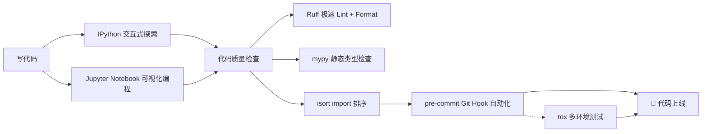
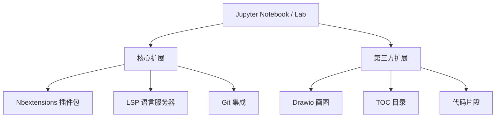
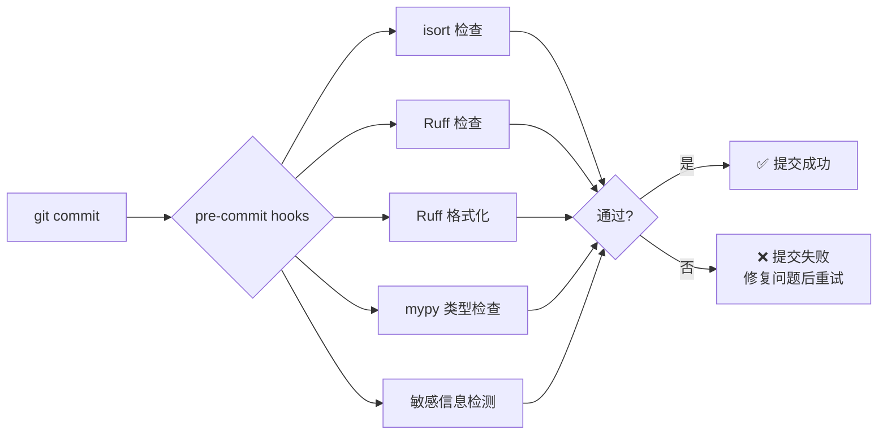
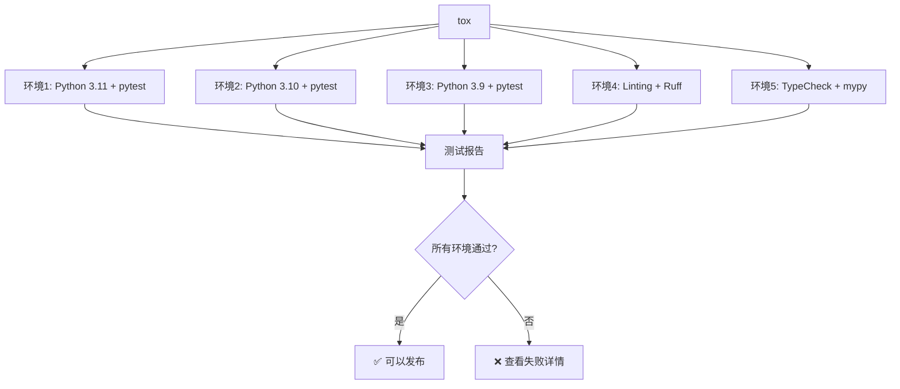

+++
title = "第27章 开发工具"
weight = 270
date = "2026-04-08T13:22:00+08:00"
type = "docs"
description = ""
isCJKLanguage = true
draft = false
+++

# 第二十七章：开发工具链——让代码飞起来的秘密武器

> 🎭 温馨提示：阅读本章前，请确保你已经能写出"Hello World"，否则你可能会被工具们的骚操作震惊到说不出话。

想象一下，你是一个刚拿到驾照的新手司机，开着一辆连收音机都没有的老爷车，而隔壁老王开的是特斯拉——自动辅助驾驶、语音控制、座椅加热一应俱全。开发工具链就是 Python 世界里的"特斯拉套装"。没有它们，你也能开车（写代码），但有它们，你能开得更快、更稳、更舒服，甚至能边开车边喝咖啡。

本章我们将介绍七大神器：**IPython**、**Jupyter Notebook/Lab**、**mypy**、**Ruff**、**isort**、**pre-commit**、**tox**。它们各司其职，从交互式编程、类型检查、代码格式化、Git 钩子到多环境测试，覆盖了现代 Python 开发的全流程。



---

## 27.1 IPython（增强交互式 Python）

你有没有遇到过这种情况：凌晨两点，你想知道 `Python` 的某个内置函数到底是怎么工作的，于是在脑子里反复推演它的行为，然后...推演错了。`IPython` 就是为了解决这种"想太多"的问题而诞生的——它是 Python 交互式解释器的超级赛亚人版本。

**IPython** 是 Python 标准交互式解释器（那个让你输入 `python` 后出现的 `>>>` 大黑框）的增强版。它提供了自动补全、内省、魔法命令等特性，让你在交互式环境中探索代码时如虎添翼。

### 27.1.1 自动补全

在标准 Python 解释器里，你可能需要记住每一个函数、变量、模块的完整拼写——这是对人类记忆力的不尊重。IPython 的自动补全功能可以让你在输入时按 `Tab` 键，智能提示所有可能的补全选项。

**安装 IPython：**

```bash
# pip 安装，Python 世界的老规矩
pip install ipython
```

**启动 IPython：**

```bash
# 在终端输入 ipython，回车，你将进入一个全新的世界
ipython
```

```python
# 启动后你会看到类似这样的欢迎界面：
# Python 3.x.x  |  IPython 8.x.x  |  Type '?' for help

# 假设你输入了某个模块
import os

# 输入 "os." 然后按 Tab 键，IPython 会列出 os 模块下所有的属性和方法
# 就像这样：
# os.name          os.getcwd()      os.listdir()     os.path.join()
# ... 等等，太多了列不完
```

::: tip 自动补全的骚操作
输入一部分名字，然后按 `Tab`。比如输入 `os.pa` 然后按 `Tab`，IPython 会帮你补全成 `os.path`。如果你输入 `pri` 然后按 `Tab`，它会列出所有以 `pri` 开头的内置函数，比如 `print`、`property` 等。
:::

**变量补全也支持：**

```python
# 定义一些变量
my_variable = 42
my_list = [1, 2, 3]
my_dict = {"name": "Python", "age": 30}

# 输入 "my" 然后按 Tab，IPython 会列出 my_variable, my_list, my_dict
# 妈妈再也不用担心我拼写错误了！
```

```python
# 还有一个更骚的功能：通配符补全
# 输入 "*split" 然后按 Tab，IPython 会列出所有包含 "split" 的名字
# 比如 'rsplit', 'split', 'splitlines', 'splitext'
# 这在你想不起某个方法的全名时简直是救命稻草
```

### 27.1.2 内省

**内省（Introspection）** 是一个听起来很玄学的词，但它的概念很简单：程序在运行时能够检查对象的类型、属性、方法等自身信息的能力。你可以把它理解成"程序自我体检"——就像去医院做全身检查，看看你这个"对象"到底有哪些"器官"（属性和方法）。

**在 IPython 中内省一个对象：**

```python
# 使用 ? 查看对象的文档字符串（docstring）
print?
```

```python
# 查看 print 函数的信息
print?
# 输出类似：
# Docstring:
# print(value, ..., sep=' ', end='\n', file=sys.stdout, flush=False)
# Prints the values to a stream, or to sys.stdout by default.
# ...
# Type:      builtin_function_or_method
```

```python
# 使用 ?? 查看函数的源代码（如果可以的话）
print??
```

```python
# 查看一个自定义函数的信息
def greet(name):
    """向某人打招呼"""
    return f"Hello, {name}!"

greet?
# Docstring:      向某人打招呼
# Call signature: greet(name)
# Type:           function
```

```python
# 使用 %pinfo 魔法命令（magic command）查看详细信息
%pinfo print
# 或者更简洁的方式：直接在对象后面加 ?
```

```python
# 使用 dir() 查看对象的所有属性和方法
# dir() 是 Python 内置函数，但 IPython 让它的输出更好看
my_list = [1, 2, 3]

dir(my_list)
# ['__add__', '__class__', '__class_getitem__', '__contains__',
#  '__delattr__', '__delitem__', '__dir__', '__doc__', '__eq__',
#  '__format__', '__ge__', '__getattribute__', '__getitem__',
#  '__hash__', ... 省略若干 ...
#  'append', 'clear', 'copy', 'count', 'extend', 'index',
#  'insert', 'pop', 'remove', 'reverse', 'sort']
```

```python
# type() 查看对象的类型
type(my_list)
# <class 'list'>

type(42)
# <class 'int'>
```

```python
# isinstance() 检查对象是否是某个类型的实例
isinstance(my_list, list)
# True

isinstance(my_list, dict)
# False
```

```python
# inspect 模块（Python 标准库）进行更深入的内省
import inspect

# 查看函数的签名
inspect.signature(greet)
# <Signature (name: str)>

# 查看函数所在的源代码文件
inspect.getfile(greet)
# '/path/to/your/file.py'

# 查看函数的源代码
print(inspect.getsource(greet))
# def greet(name):
#     """向某人打招呼"""
#     return f"Hello, {name}!"
```

::: tip 内省的哲学意义
内省能力是 Python"一切皆对象"哲学的延伸。既然所有东西都是对象，那自然就可以检查它们。想象一下，如果你说"我今天想吃火锅"，然后按一个按钮就能看到火锅的所有配料、口味、甚至卡路里——这就是内省的感觉。
:::

### 27.1.3 魔法命令

**魔法命令（Magic Commands）** 是 IPython 特有的超级命令，以 `%` 或 `%%` 开头。它们让 IPython 拥有了远超标准 Python 解释器的能力——比如计时、执行外部脚本、显示图片、运行 Shell 命令等等。

单 `%` 开头的是**行魔法命令（Line Magic）**，作用于一行代码；双 `%%` 开头的是**单元格魔法命令（Cell Magic）**，作用于整个代码单元格。

```python
# ============================================
# 计时相关魔法命令
# ============================================

# %timeit - 精确测量代码执行时间（会运行多次取平均值）
%timeit [x**2 for x in range(1000)]
# 10000 loops, best of 3: 43.2 µs per loop  （微秒级，速度惊人）
```

```python
# %%timeit - 测量整个单元格的执行时间
%%timeit
result = 0
for i in range(10000):
    result += i
result
# 1000 loops, best of 3: 523 µs per loop
```

```python
# %time - 单次执行时间（适合慢速操作）
%time sum(range(10000))
# Wall time: 312 µs
```

```python
# ============================================
# 代码执行相关魔法命令
# ============================================

# %run - 运行外部 Python 文件，并在 IPython 中导入
# 假设同级目录下有一个 hello.py 文件：
# def say_hello():
#     print("Hello from another file!")

%run hello.py
# Hello from another file!  （输出会被显示）
# 现在 say_hello 函数已经在当前命名空间中可用了
say_hello()
# Hello from another file!
```

```python
# %load - 加载外部代码到当前单元格（相当于复制粘贴，但更优雅）
# %load hello.py
# 执行后会变成：
# # %load hello.py
# def say_hello():
#     print("Hello from another file!")
```

```python
# %cpaste - 粘贴多行代码（避免缩进问题）
# 执行 %cpaste 后，你可以粘贴代码，以 "--" 结束
%cpaste
# Pasting code; enter '--' alone on the line to stop.
# >>> for i in range(3):
# ...     print(i)
# ...
# --
# 0
# 1
# 2
```

```python
# ============================================
# 系统/Shell 相关魔法命令
# ============================================

# !cmd - 执行 Shell 命令（反引号是 IPython 的特殊语法）
!pip list | head -5
# Package    Version
# pip        23.x.x
# setuptools 68.x.x
```

```python
# %alias - 创建命令别名
%alias myls ls -la
myls
# total 48
# drwxr-xr-x  3 user  staff   102 Apr  8 10:00 .
# -rwxr-xr-x  1 user  staff  1024 Apr  8 10:00 hello.py
```

```python
# %cd - 切换目录
%cd /tmp
# /private/tmp

%cd -
# 切换回上一个目录
```

```python
# %pwd 和 %ls - 查看当前目录和文件列表
%pwd
# '/private/tmp'

%ls
# hello.py   temp.txt
```

```python
# ============================================
# 代码编辑相关魔法命令
# ============================================

# %edit - 打开编辑器编辑函数/变量
# %edit greet
# 会打开你的默认编辑器，保存后自动重新加载函数

# %history - 查看命令历史
%history
# 1: import os
# 2: my_list = [1, 2, 3]
# 3: dir(my_list)
# 4: greet?
```

```python
# ============================================
# 可视化和输出相关魔法命令
# ============================================

# %matplotlib - 开启 matplotlib 集成（在 Jupyter 里更常用）
# %matplotlib inline
# 让 matplotlib 图表直接显示在 IPython 输出中

# %config - 配置 IPython 本身
%config IPCompleter.greedy=True
# 开启贪婪模式补全（会提示更多选项）
```

```python
# ============================================
# 调试相关魔法命令
# ============================================

# %debug - 事后调试（当代码报错后，输入这个进入调试模式）
# 假设我们运行了出错的代码
def divide(a, b):
    return a / b

divide(1, 0)
# ZeroDivisionError: division by zero

%debug
# 进入 pdb 调试器：
# ipdb> p a      # 打印变量 a
# 1
# ipdb> p b      # 打印变量 b
# 0
# ipdb> q        # 退出调试器
```

```python
# %pdb - 设置自动调试模式（代码出错时自动进入调试器）
%pdb on
# Automatic pdb calling has been turned on
```

```python
# ============================================
# 其他实用魔法命令
# ============================================

# %who 和 %whos - 查看当前命名空间中的变量
a = 1
b = "hello"
c = [1, 2, 3]

%who
# a   b   c

%whos
# Variable   Type     Data/Info
# ---------------------------
# a          int      1
# b          str      'hello'
# c          list     [1, 2, 3]
```

```python
# %reset - 清除命名空间
# %reset -f    # 强制清除，不需要确认

# %bookmark - 目录书签
%bookmark pyhome ~/Documents/Python
%cd pyhome
# /Users/you/Documents/Python
```

::: tip 魔法命令的精髓
魔法命令本质上是 Python 函数，只是披上了一件语法糖衣。`%timeit` 实际上是一个叫 `timeit.main()` 的函数，`%pwd` 实际上是 `os.getcwd()`。它们让你在交互式环境中操作更便捷——不用每次都输入完整的函数调用。
:::

---

## 27.2 Jupyter Notebook / JupyterLab

**Jupyter Notebook** 是 Python 数据科学家和科研工作者的最爱——它允许你在一个基于浏览器的文档中混合编写代码、运行结果、解释文本、数学公式、甚至图表。想象一下，写一份数学作业，左边是你的推导过程（Markdown），右边是你的计算代码，底部是运行结果，一切井井有条。这就是 Jupyter Notebook。

**JupyterLab** 是 Jupyter Notebook 的进化版，提供了更强大的界面和更多的功能扩展性。可以把它理解成 Jupyter Notebook 的"Pro Max Ultra"版本。

### 27.2.1 安装与启动

**安装 Jupyter Notebook：**

```bash
# pip 安装
pip install notebook

# 或者如果你用 conda
conda install jupyter notebook
```

**安装 JupyterLab：**

```bash
# 推荐直接安装 JupyterLab，它是未来的方向
pip install jupyterlab

# 或者用 conda
conda install jupyterlab
```

**启动 Jupyter Notebook：**

```bash
# 在终端输入
jupyter notebook
# 然后浏览器会自动打开 http://localhost:8888
# 你会看到一个文件浏览器界面
```

**启动 JupyterLab：**

```bash
jupyter lab
# 浏览器打开 http://localhost:8888/lab
```

```python
# ============================================
# Jupyter 的基本操作
# ============================================

# 在单元格中输入代码，然后按 Shift + Enter 运行
# 这是一个代码单元格
print("Hello, Jupyter!")
# Hello, Jupyter!

# 上面这句话会在单元格下方显示输出
```

```python
# Jupyter 支持多种单元格类型
# 两种主要类型：
# 1. Code（代码）：运行 Python 代码
# 2. Markdown：编写格式化的文本说明

# 在单元格上按 M 可以切换到 Markdown 模式
# 按 Y 可以切换回代码模式
```

::: tip Jupyter 的核心概念
Jupyter 中的每一个文档叫做 **Notebook**（扩展名 `.ipynb`），它由多个 **Cell（单元格）** 组成。每个单元格可以存放代码、Markdown 文本或原始文本。代码单元格可以独立运行，这意味着你可以只运行某个特定单元格，而不用从头跑到尾。这对于数据分析和实验性编程来说简直是神器。
:::

### 27.2.2 快捷键

Jupyter 的快捷键分为**命令模式**和**编辑模式**两种。命令模式（按 `Esc` 进入）下，键盘按键用于导航和操作单元格；编辑模式（按 `Enter` 进入）下，键盘用于编辑单元格内容。

**命令模式快捷键（按 Esc 进入）：**

```markdown
# 单元格操作
Enter        # 进入编辑模式
Esc          # 进入命令模式
H            # 显示所有快捷键（帮助）
A            # 在当前单元格上方插入新单元格
B            # 在当前单元格下方插入新单元格
DD           # 删除当前单元格（按两次 D）
Z            # 撤销删除
Y            # 将单元格转为代码类型
M            # 将单元格转为 Markdown 类型
R            # 将单元格转为原始文本（Raw）
```

```markdown
# 移动和选择
上箭头 / K      # 选择上一个单元格
下箭头 / J      # 选择下一个单元格
空格（命令模式） # 向下滚动
Shift + 空格    # 向上滚动

# 运行和中断
Shift + Enter   # 运行当前单元格，并选择下一个
Ctrl + Enter    # 运行当前单元格，但保持选中
Alt + Enter     # 运行当前单元格，并在下方插入新单元格
Ctrl + C        # 中断当前运行的内核
00（两次 0）    # 重启内核
```

```markdown
# 其他实用快捷键
L            # 显示/隐藏单元格行号
S            # 保存 Notebook
X            # 剪切单元格
C            # 复制单元格
V            # 粘贴单元格
P            # 打开命令面板（Command Palette）
```

**编辑模式快捷键（按 Enter 进入）：**

```markdown
# 基本编辑
Tab               # 代码补全 / 缩进
Shift + Tab       # 显示函数/对象的文档（内省）
Ctrl + /         # 注释/取消注释选中行
Ctrl + A         # 全选
Ctrl + Z         # 撤销
Ctrl + Shift + Z # 重做
Delete            # 删除选中字符
```

```markdown
# 代码执行
Shift + Enter    # 运行代码，跳到下一个单元格
Ctrl + Enter     # 运行代码，留在当前单元格
```

```markdown
# 高级编辑
Ctrl + Shift + P   # 打开命令面板
Alt + 鼠标拖动     # 多光标编辑
Ctrl + D          # 删除整行
Ctrl + U          # 撤销当前行
Ctrl + Home       # 跳到单元格开头
Ctrl + End        # 跳到单元格末尾
Ctrl + 左/右箭头  # 按单词跳跃光标
```

```python
# ============================================
# Jupyter 魔法命令（和 IPython 共享）
# ============================================

# Jupyter 里可以直接使用 IPython 的所有魔法命令
%timeit sum(range(10000))
# 10000 loops, best of 3: 86.2 µs per loop

# %%writefile - 将单元格内容写入文件
%%writefile my_module.py
def add(a, b):
    """两数相加"""
    return a + b

# 运行后，当前目录下会生成 my_module.py 文件
```

```python
# %load - 加载外部文件到单元格
# %load my_module.py

# %run - 运行外部脚本
# %run my_script.py
```

```python
# %matplotlib inline - 在 Notebook 中显示图表
%matplotlib inline
import matplotlib.pyplot as plt

plt.plot([1, 2, 3, 4], [1, 4, 9, 16])
plt.title("Jupyter 里的第一个图表！")
plt.show()
# 图表会直接显示在 Notebook 下方
```

```python
# %config InlineBackend.figure_format = 'retina'
# 高清图表（视网膜屏幕）

# %%html - 渲染 HTML 内容
%%html
<marquee>欢迎来到 Jupyter 的世界！</marquee>
```

::: tip 快捷键之王
当你熟练掌握 Jupyter 快捷键后，你的双手几乎不需要离开键盘。写代码、运行、切换Markdown、插入单元格——全部一气呵成。那种流畅感，就像弹钢琴一样优美。推荐按 `H` 查看所有快捷键，然后每天学一个，一周后你就是 Jupyter 达人。
:::

### 27.2.3 插件配置

Jupyter Notebook 和 JupyterLab 都有丰富的扩展（Extension）生态，可以极大地提升你的生产力。

**JupyterLab 扩展安装：**

```bash
# 首先安装 node.js（JupyterLab 扩展需要）
# 然后安装扩展管理器
pip install jupyterlab-lsp
# LSP = Language Server Protocol，提供更强大的代码补全和诊断

# 安装常用扩展
pip install jupyterlab-git        # Git 版本控制界面
pip install jupyterlab-drawio     # 画流程图
pip install @jupyterlab/toc       # 目录导航
```

```bash
# 启用扩展
jupyter server extension enable jupyterlab-git
jupyter lab build
```

**Jupyter Notebook 扩展（nbextensions）：**

```bash
# 安装 nbextensions
pip install jupyter_contrib_nbextensions
jupyter contrib nbextension install --user
```

```bash
# 安装后访问 http://localhost:8888/nbextensions
# 你会看到一堆可选的扩展：
# - Table of Contents（目录）
# - ExecuteTime（显示每个单元格运行时间）
# - Variable Inspector（变量检查器）
# - Collapsible Headings（可折叠的标题）
# - Autopep8（代码格式化）
# - Snippets（代码片段）
```

```python
# ============================================
# Jupyter 扩展推荐
# ============================================

# 1. jupyter-cache：加速 Notebook 运行
#    将单元格输出缓存起来，重新打开时不用重新运行

# 2. jupyterlab-lsp：代码补全增强
#    支持跳转到定义、查找引用、实时错误诊断

# 3. nbdime：Notebook 差异化显示
#    让 Git 能正确显示 .ipynb 文件的变更
# pip install nbdime
# nbdime config-git --enable
```

```bash
# ============================================
# Jupyter 配置
# ============================================

# 生成 Jupyter 配置文件
jupyter notebook --generate-config
# 会生成 ~/.jupyter/jupyter_notebook_config.py

# 在配置文件中可以设置：
# c.NotebookApp.notebook_dir = '/path/to/default/directory'
# c.NotebookApp.port = 8889  # 改默认端口
# c.NotebookApp.password = 'sha1:xxxxx'  # 设置密码
```

#### Jupyter 生态图



---

## 27.3 mypy（静态类型检查）

**mypy** 是 Python 世界里最流行的静态类型检查器。等等，Python 不是动态类型语言吗？没错，但 mypy 允许你在 Python 代码中添加**类型注解（Type Annotations）**，然后在运行之前检查类型错误——就像 TypeScript 之于 JavaScript。

**静态类型检查**是什么意思？动态类型语言（如 Python）在**运行时**才发现类型错误——比如你把字符串和数字相加，程序跑起来才会崩溃。静态类型检查器（如 mypy）在**运行前**（编译时或分析阶段）就能发现这些问题，让你提前修复，而不是等到用户遇到错误才后悔莫及。

**mypy** 是 Python 官方创建的团队开发的，它的创始人是 Python 之父 Guido van Rossum 的同事。它让 Python 拥有了"编译时检查"的能力，但又不需要你改变 Python 的动态特性——类型注解是可选的，不加也能跑。

**安装 mypy：**

```bash
pip install mypy
```

**基本使用：**

```bash
# 对单个文件进行类型检查
mypy my_script.py

# 对整个项目进行类型检查
mypy src/

# 如果没有问题，mypy 不会输出任何内容（静默即成功）
```

```python
# ============================================
# 类型注解基础
# ============================================

# 函数参数和返回值可以加类型注解
def greet(name: str) -> str:
    """问候函数，参数是字符串，返回值也是字符串"""
    return f"Hello, {name}!"

# 调用时，mypy 会检查传入的参数类型和返回类型是否匹配
result = greet("Python")  # 正确：传入 str，返回 str
print(result)
# Hello, Python!
```

```python
# 如果你传错类型，mypy 会在静态检查时警告你
# greet(42)  # 错误：42 是 int，不是 str
# 运行这段代码本身不会报错（Python 是动态语言），
# 但 `mypy script.py` 会输出：
# error: Argument 1 to "greet" has incompatible type "int"; expected "str"
```

```python
# 变量类型注解
age: int = 25
name: str = "Alice"
height: float = 1.75
is_active: bool = True
scores: list[int] = [90, 85, 88]  # Python 3.9+ 语法
```

```python
# ============================================
# mypy 的类型系统
# ============================================

# 基本类型：int, float, str, bool, bytes
x: int = 42
y: float = 3.14
z: str = "hello"
flag: bool = True

# 复杂类型
from typing import List, Dict, Tuple, Optional, Union, Any

# List - 列表
names: List[str] = ["Alice", "Bob", "Charlie"]

# Dict - 字典
scores: Dict[str, int] = {"Alice": 90, "Bob": 85}

# Tuple - 元组（固定长度和类型）
point: Tuple[int, int] = (10, 20)

# Optional - 可选值（可以是 None）
middle_name: Optional[str] = None  # 相当于 Union[str, None]

# Union - 联合类型（多种可能）
result: Union[int, str] = "success"  # 可能是 int 也可能是 str

# Any - 任意类型（禁用类型检查，不推荐）
anything: Any = 42
anything = "string"  # mypy 不会报错，但使用 Any 就没有意义了
```

```python
# ============================================
# mypy 配置
# ============================================

# 在项目根目录创建 mypy.ini 或 pyproject.toml 配置
# 例如 pyproject.toml 中添加：

# [tool.mypy]
# python_version = "3.11"
# warn_return_any = true
# warn_unused_configs = true
# disallow_untyped_defs = false  # 不强制要求所有函数都有类型注解
# ignore_missing_imports = true  # 忽略第三方库的类型提示缺失
```

```bash
# 在 CI/CD 中集成 mypy
# .github/workflows/test.yml 示例：
# steps:
#   - uses: actions/checkout@v3
#   - name: Set up Python
#     uses: actions/setup-python@v4
#     with:
#       python-version: '3.11'
#   - name: Install dependencies
#     run: pip install mypy
#   - name: Run mypy
#     run: mypy src/
```

```python
# ============================================
# 实战：完整的类型注解示例
# ============================================

from typing import List, Optional

class Person:
    """一个人，有姓名和年龄"""

    def __init__(self, name: str, age: int) -> None:
        self.name: str = name
        self.age: int = age

    def greet(self) -> str:
        """生成问候语"""
        return f"Hi, I'm {self.name} and I'm {self.age} years old."

    def birthday(self) -> None:
        """过生日，年龄加一"""
        self.age += 1
        print(f"Happy birthday! Now {self.age} years old.")
        # Happy birthday! Now 26 years old.

def find_person_by_name(people: List[Person], name: str) -> Optional[Person]:
    """在人群中按名字查找人"""
    for person in people:
        if person.name == name:
            return person
    return None

# 使用示例
people = [
    Person("Alice", 25),
    Person("Bob", 30),
]

found = find_person_by_name(people, "Alice")
if found:
    print(found.greet())
    # Hi, I'm Alice and I'm 25 years old.
```

```bash
# 运行 mypy 检查
# $ mypy person.py
# Success: no issues found  （一切正常！）

# 如果我们写一些类型错误：
# Person("Bob", "thirty")  # 错误：第二个参数应该是 int
# $ mypy person.py
# error: Argument 2 to "Person" has incompatible type "str"; expected "int"
```

::: tip mypy 的哲学
mypy 允许你写 Python 代码时享受动态语言的灵活性，同时在关键地方添加类型注解来获得静态检查的安全性。就像给一座房子装监控——你不需要每个角落都装，但在重要区域（入口、金库、婴儿房）装上会让你安心很多。
:::

---

## 27.4 Ruff（极速 Lint + Format）

**Ruff** 是 2023 年 Python 生态最火爆的工具之一——它用 Rust 编写，速度比传统 Python Linter 快 10-100 倍。它同时提供了 **Lint（代码风格检查）** 和 **Format（代码格式化）** 功能，一个工具搞定两件事，堪称 Python 开发者的瑞士军刀。

**Lint** 是什么？Lint 最初来源于 C 语言的 lint 程序，用于检查代码中的"毛刺"（lint）——也就是潜在的错误、风格问题、未使用的变量等。现在泛指所有静态代码分析工具。

**Format** 是什么？格式化代码，让代码风格统一。比如 PEP 8 规范要求每行不超过 79 个字符、缩进用 4 个空格等。Format 工具可以自动帮你把代码"排版"成标准格式。

**安装 Ruff：**

```bash
pip install ruff
```

**基本使用：**

```bash
# 检查代码问题（lint）
ruff check .

# 自动修复问题
ruff check --fix .

# 格式化代码
ruff format .

# 或者一步到位：检查 + 修复 + 格式化
ruff check --fix . && ruff format .
```

```python
# ============================================
# Ruff 配置
# ============================================

# 在 pyproject.toml 中添加：
# [tool.ruff]
# # 目标 Python 版本
# target-version = "py311"
#
# # 启用特定规则的集合
# # E:   pycodestyle errors（错误）
# # W:   pycodestyle warnings（警告）
# # F:   Pyflakes（逻辑错误）
# # I:   isort（导入排序）
# # UP:  pyupgrade（语法升级）
# # B:   flake8-bugbear（常见 bug）
# # C4:  flake8-comprehensions（推导式优化）
# select = ["E", "W", "F", "I", "UP", "B", "C4"]
#
# # 忽略某些规则
# ignore = ["E501"]  # 行太长（通常用 black 格式化时会自动处理）
#
# # 行长度限制
# line-length = 88  # 与 Black 兼容
#
# # 固定导入顺序
# known-first-party = ["my_module"]
# force-single-line = false
```

```python
# ============================================
# Ruff 规则示例
# ============================================

# Ruff 能检测很多常见问题，下面是一些常见规则：

# F401: 导入但未使用的模块
import os  # ruff 会警告：'import os' imported but unused

# E302: 两个空行分隔函数定义
def func1():
    pass

def func2():  # ruff 会警告需要两个空行
    pass

# E501: 行太长
# Ruff 会警告超过 line-length 限制的行

# UP035: 有更现代的语法替代
# isinstance(x, (int, float)) 可以写成 isinstance(x, int | float)
```

```bash
# ============================================
# Ruff 与其他工具的对比
# ============================================

# Ruff vs Flake8
# Flake8 是一个 Python 写的 Linter，速度较慢
# Ruff 用 Rust 重写了 Flake8 的所有规则，速度快 10-100 倍

# Ruff vs Black
# Black 是一个代码格式化工具（只管格式，不管 lint）
# Ruff 既有 lint 也有 format，功能更全面
# Ruff format 兼容 Black 的风格

# Ruff vs Pylint
# Pylint 功能更全面但配置复杂，速度很慢
# Ruff 更快、更简单，但规则集相对较少
```

::: tip 为什么 Ruff 这么快？
Ruff 用 Rust 编写，Rust 是系统级编程语言，没有 Python 的运行时开销。同样的功能，Rust 程序通常比 Python 程序快几十到上百倍。但 Ruff 的真正亮点在于，它并不是完全重写——它重用了 Python 生态中现有的解析器（主要是 `pyast`）和规则定义，这让它的规则质量和 Python 社区几十年的积累保持一致。
:::

---

## 27.5 isort（import 排序）

**isort** 是一个专门负责 **import 排序** 的工具。它的作用很简单：把你 Python 文件中的 `import` 语句自动排好序，让 `import os` 永远在 `import sys` 前面，让 `from collections import defaultdict` 永远在 `from datetime import datetime` 前面。

为什么 import 排序这么重要？因为在团队协作中，每个人可能按照自己的习惯写 import——有人喜欢先写标准库，有人喜欢先写第三方库，有人喜欢把相关的 import 写在一起。时间久了，一个文件里可能有几十个 import，乱七八糟。isort 就是来拯救"import 强迫症患者"的。

**安装 isort：**

```bash
pip install isort
```

**基本使用：**

```bash
# 检查 import 顺序是否正确（不修改文件）
isort --check-only my_module.py

# 检查并显示差异
isort --diff my_module.py

# 自动排序
isort my_module.py

# 对整个项目运行
isort .
```

```python
# ============================================
# isort 排序规则
# ============================================

# 假设你有这样一个混乱的 import 文件：

import sys
from typing import List, Dict
import os
from my_module import helper, utils
import pandas as pd
from datetime import datetime
import numpy as np
from collections import defaultdict, OrderedDict
import requests
from my_module import (
    models,
    views,
)
from django.conf import settings
import http
import json

# 运行 isort 后，会变成：

```python
import json
import sys
from collections import defaultdict, OrderedDict
from datetime import datetime
from typing import Dict, List

import numpy as np
import pandas as pd
import requests
from django.conf import settings
from my_module import helper, models, utils, views
```

```python
# ============================================
# isort 配置
# ============================================

# 在 pyproject.toml 中添加：
# [tool.isort]
# profile = "black"  # 与 Black 格式化工具兼容
# line_length = 88   # 与 Black 保持一致
# known_first_party = ["my_module"]
# skip_gitignore = true
# force_single_line = false
# combine_as_imports = true
```

```bash
# ============================================
# isort 与 Git 集成
# ============================================

# 在 pre-commit hook 中使用 isort（下一节会详细讲）
# .pre-commit-config.yaml:
# repos:
#   - repo: https://github.com/pycqa/isort
#     rev: 5.12.0
#     hooks:
#       - id: isort
#         name: isort (python)
```

```bash
# CI 中检查 import 顺序
# 如果 CI 中运行 isort --check-only 并且发现不一致，
# 说明有人的编辑器没有配置 isort，自动格式化会失败
isort --check-only --diff .
# 没有任何输出 = 检查通过
```

::: tip isort 的哲学
isort 遵循一个简单但重要的原则：**import 的顺序应该标准化，而不是争论出来的**。你不需要和你的同事争论"应该先 import 标准库还是第三方库"，isort 已经帮你定好了规则（三段式：标准库 > 第三方 > 本地）。你们要做的只是运行 isort，让它自动搞定。
:::

---

## 27.6 pre-commit（Git Hook 自动化）

**pre-commit** 是一个 Git Hook 管理工具。等等，**Git Hook** 是什么？**Git Hook** 是 Git 在特定事件（如提交代码、推送代码）发生时自动运行的脚本。比如你每次 `git commit` 之前，可以自动运行一个脚本来检查代码格式是否正确、是否所有测试都通过了。这就是 pre-commit hook（提交前钩子）。

但 Git Hook 的问题是：它们存储在 `.git/hooks/` 目录下，这是本地的，不受版本控制。换句话说，如果你想让你团队里的每个人都启用同一个 hook，你得手动告诉每个人"去配置这个 hook"，这很麻烦。

**pre-commit** 解决了这个问题：它通过一个配置文件（`.pre-commit-config.yaml`）来定义所有要运行的 hooks，然后将这个文件和代码一起提交到 Git 仓库中。团队中的每个人只需要运行一次 `pre-commit install`，之后所有的 hooks 就会自动同步。

**安装 pre-commit：**

```bash
pip install pre-commit
```

**基本使用：**

```bash
# 在项目中初始化 pre-commit
pre-commit install
# pre-commit installed at .git/hooks/pre-commit
# 以后每次 git commit 都会自动运行 hooks

# 手动运行所有 hooks（不通过 git commit）
pre-commit run --all-files

# 运行特定 hook
pre-commit run isort --all-files

# 跳过某些文件
pre-commit run --all-files --exclude ".*\.pyc"
```

```yaml
# ============================================
# .pre-commit-config.yaml 示例
# ============================================

# .pre-commit-config.yaml
# 放在项目根目录，和 .git 同一级

repos:
  # 1. isort - import 排序
  - repo: https://github.com/pycqa/isort
    rev: 5.12.0  # 版本号
    hooks:
      - id: isort
        name: isort (python)
        args: ["--profile", "black"]  # 传入参数

  # 2. Ruff - Lint + Format
  - repo: https://github.com/astral-sh/ruff-pre-commit
    rev: v0.1.0
    hooks:
      - id: ruff
        args: ["--fix"]  # 自动修复
      - id: ruff-format
        name: ruff format

  # 3. mypy - 静态类型检查（注意：mypy 在提交时运行可能较慢）
  - repo: https://github.com/pre-commit/mirrors-mypy
    rev: v1.7.0
    hooks:
      - id: mypy
        additional_dependencies: [types-requests]

  # 4. Python 语法检查
  - repo: https://github.com/pycqa/pygrep-primary
    rev: v1.0.0
    hooks:
      - id: python-check-blanket-noqa  # 检查 blanket noqa 注释
      - id: python-check-mock

  # 5. 防止提交密码等敏感信息
  - repo: https://github.com/pre-commit/pre-commit-hooks
    rev: v4.5.0
    hooks:
      - id: trailing-whitespace  # 去除尾部空格
      - id: end-of-file-fixer    # 确保文件以换行符结尾
      - id: check-yaml           # 检查 YAML 格式
      - id: check-added-large-files  # 防止提交大文件
      - id: detect-secrets       # 检测敏感信息
```

```bash
# ============================================
# pre-commit 的工作流程
# ============================================

# 1. 开发者写代码
echo "print('Hello')" > hello.py

# 2. git add 和 git commit
git add hello.py
git commit -m "Add hello.py"

# 3. pre-commit 自动触发，按顺序运行所有 hooks：
#    - isort 检查 import 顺序
#    - ruff 检查代码问题
#    - ruff-format 格式化代码
#    - mypy 检查类型
#    - detect-secrets 检查敏感信息

# 4a. 如果所有 hooks 通过 → 提交成功 ✓
# 4b. 如果有 hooks 失败 → 提交被阻止，需要修复问题后重新提交 ✗
```

```bash
# pre-commit 只运行改动的文件（增量运行）
# 这大大加快了速度
# 如果你想强制运行所有文件：
pre-commit run --all-files

# 卸载 pre-commit hooks
pre-commit uninstall
```

::: tip pre-commit 的精髓
pre-commit 把"代码质量检查"从一项手动任务（你得记得每次都运行）变成了一项自动化任务（Git 帮你记得）。它的核心理念是：**把检查集成到开发流程中，比事后检查更有效**。想象一下，如果你的代码每次提交前都会自动检查一遍——问题在进入仓库之前就被发现并修复了，而不是等到 CI/CD 流水线失败才追悔莫及。
:::



---

## 27.7 tox（多环境测试）

**tox** 是 Python 世界里用于**多环境测试**的自动化工具。它的作用是：让你的代码在多个不同的 Python 版本和依赖配置下运行测试，确保代码具有良好的兼容性。

为什么需要多环境测试？因为 Python 有 Python 2 和 Python 3，Python 3 又有 3.8、3.9、3.10、3.11、3.12 等多个版本。你的代码可能在 Python 3.11 上运行正常，但在 Python 3.8 上因为用了某个新语法而崩溃。tox 可以让你在多个环境里并行测试，而不需要手动搭建每个环境。

**安装 tox：**

```bash
pip install tox
```

**基本概念：**

```ini
# tox 配置文件：tox.ini
# 放在项目根目录

[tox]
# 定义测试环境
envlist = py311, py310, py39, py38, linting

[testenv]
# 安装的依赖（测试时安装）
deps =
    pytest
    pytest-cov
    requests

# 测试命令
commands =
    pytest tests/ -v

# 测试环境特定配置
[testenv:linting]
deps =
    ruff
    mypy
commands =
    ruff check .
    mypy src/
```

```bash
# ============================================
# tox 基本使用
# ============================================

# 在项目根目录运行 tox
tox

# 它会：
# 1. 创建虚拟环境（每个 envlist 一个）
# 2. 在每个环境中安装依赖
# 3. 在每个环境中运行测试命令
# 4. 汇总结果

# 只运行特定环境
tox -e py311

# 只运行 linting 环境
tox -e linting

# 跳过环境创建，直接使用已有的环境
tox --skip-pkg-install

# 查看所有可用环境
tox list
```

```python
# ============================================
# 完整示例：项目结构
# ============================================

# 假设你有这样的项目结构：
# my_project/
# ├── tox.ini
# ├── pyproject.toml
# ├── src/
# │   └── my_module.py
# └── tests/
#     └── test_my_module.py
```

```ini
# tox.ini 完整配置示例

[tox]
envlist = py311, py310, py39, linting, typecheck
isolated_build = True  # 使用 PEP 517/518 隔离构建

[testenv]
# 公共依赖
deps =
    pytest>=7.0
    pytest-cov>=4.0
    requests>=2.28
# 每个环境测试时都执行的命令
commands =
    pytest tests/ -v --cov=src --cov-report=term-missing

# 覆盖默认的 testenv 配置
[testenv:linting]
deps =
    ruff>=0.1.0
commands =
    ruff check src/ tests/
    ruff format --check src/ tests/

[testenv:typecheck]
deps =
    mypy>=1.7
    types-requests
commands =
    mypy src/

[testenv:docs]
# 构建文档
deps =
    sphinx
    sphinx-rtd-theme
commands =
    sphinx-build docs/ docs/_build/
```

```bash
# ============================================
# tox 与 CI/CD 集成
# ============================================

# GitHub Actions 示例
# .github/workflows/test.yml

# name: Test
# on: [push, pull_request]
# jobs:
#   build:
#     runs-on: ubuntu-latest
#     strategy:
#       matrix:
#         python-version: ['3.8', '3.9', '3.10', '3.11']
#     steps:
#       - uses: actions/checkout@v3
#       - name: Set up Python ${{ matrix.python-version }}
#         uses: actions/setup-python@v4
#         with:
#           python-version: ${{ matrix.python-version }}
#       - name: Install tox
#         run: pip install tox
#       - name: Run tox
#         run: tox -e py$(echo ${{ matrix.python-version }} | tr -d .)
```

```bash
# ============================================
# tox 的高级用法
# ============================================

# 使用 conda 环境
# [testenv:py311]
# basepython = python3.11
# setenv =
#     CONDA_PKGS_DIR = {homedir}/conda/pkgs

# 使用并行执行
# tox -p  # 并行运行所有环境

# 跳过环境
# tox --skip-env linting

# 重新创建环境（强制重新安装）
# tox -r -e py311
```

::: tip tox vs 其他工具
tox 的主要竞争对手是 `nox`（同样支持多环境，但使用 Python 配置而非 INI 格式）。nox 更灵活，tox 更简单。另外，现代 CI 服务（如 GitHub Actions）本身也支持矩阵式测试（一次运行多个 Python 版本），所以 tox 在简单场景下的必要性有所下降。但 tox 在本地多环境测试和复杂依赖场景下仍然是首选工具。
:::



---

## 本章小结

本章介绍了 Python 开发工具链中的七大神器，它们分别解决不同阶段的问题：

| 工具 | 用途 | 核心价值 |
|------|------|----------|
| **IPython** | 增强的交互式 Python 解释器 | 自动补全、内省、魔法命令，让探索代码像聊天一样自然 |
| **Jupyter Notebook/Lab** | 可视化编程环境 | 代码+文档+图表三合一，数据分析和实验的利器 |
| **mypy** | 静态类型检查器 | 运行时错误提前发现，代码更健壮 |
| **Ruff** | 极速 Lint + Format | Rust 编写，快 10-100 倍，一个工具搞定检查和格式化 |
| **isort** | import 排序工具 | 自动化 import 顺序标准化，告别"import 强迫症" |
| **pre-commit** | Git Hook 自动化管理 | 把质量检查集成到每一次提交中，团队协作更规范 |
| **tox** | 多环境测试自动化 | 一次测试多个 Python 版本，确保代码兼容性 |

这些工具不是必须全部掌握的"负担"，而是可以根据项目需求灵活选择的**武器库**。建议从小处着手：先尝试 IPython 改善交互体验，再逐步引入 mypy 检查类型问题，然后是 Ruff + isort 保证代码风格，最后用 pre-commit 和 tox 实现自动化。工具是为效率服务的，不要为了用工具而用工具。
