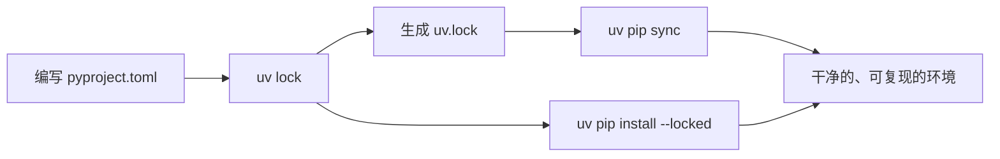
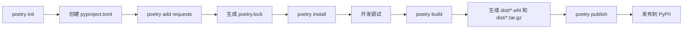
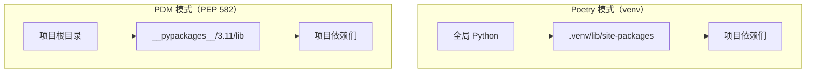
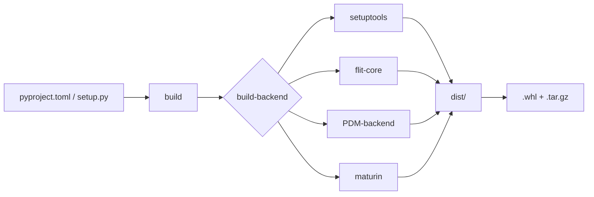

+++
title = "第28章 包构建"
weight = 280
date = "2026-04-08T13:22:00+08:00"
type = "docs"
description = ""
isCJKLanguage = true
draft = false
+++

# 第二十八章：Python 包管理兵器谱——从 pip 到 build，一条龙服务

> 💡 **前置知识**：本章聊的是 Python 包的安装、管理、打包、发布，涉及 pip、uv、Poetry、PDM、build、twine 等工具。建议先读完前面的"虚拟环境"章节，对 `venv` 有了基本概念再来。准备好了？那咱们开始！

想象一下：你写了一个超厉害的 Python 程序，能自动把猫猫图片变成梵高风格。你兴冲冲地发给朋友，结果朋友电脑上一跑——报错了。不是你的代码有问题，而是他的 Python 环境里缺了一堆依赖包。报错信息密密麻麻，看得人头皮发麻。

这就是 Python 包的**依赖地狱**。

好消息是，Python 生态里有大量工具来帮你驯服这只野兽。从老牌的 pip，到新晋网红 uv，再到专业化程度极高的 Poetry、PDM，再到打包发布专用的 build 和 twine——今天这一章，咱们就来一场**包管理工具全景巡礼**，保证你出门能跟人吹半天。

---

## 28.1 pip 进阶用法——你以为你真的会 pip？

pip 可能是你接触的第一个 Python 包管理工具，但你确定你真的了解它吗？很多人只会 `pip install`，遇到问题就两眼一抹黑。让我们一起来升级你的 pip 技能树。

### 28.1.1 pip install / uninstall / freeze / show——四件套走天下

先从最基础的四个命令说起。别急着跳过，说不定有你不知道的骚操作！

**pip install**——安装包

这是你最熟悉的老朋友。但你知道吗？`pip install` 有多种打开方式：

```python
# 安装指定版本的包（版本号用 == 分隔）
pip install requests==2.28.0

# 安装大于等于某个版本的包（常用！保护伞符号 ^）
pip install requests>=2.28.0

# 安装兼容版本（适用于遵循语义化版本的库）
# requests ^2.28.0 表示 2.28.0 <= 版本 < 3.0.0
pip install requests>=2.28.0,<3.0.0

# 从 requirements.txt 批量安装（项目必备！）
pip install -r requirements.txt

# 从 GitHub 直接安装（开发版用到哭）
pip install git+https://github.com/psf/requests.git

# 安装成"可编辑"模式（开发时改代码不用重装！）
# 适用于你自己的项目，等于把这个包链接到你的环境里
pip install -e .

# 安装时指定额外索引源（国内镜像加速）
pip install numpy -i https://pypi.tuna.tsinghua.edu.cn/simple
```

> 💡 **什么是 requirements.txt？** 这是一个纯文本文件，每行写一个依赖包和版本号。类似于购物清单，让别人一键安装所有依赖。它的格式长这样：
> ```
> requests>=2.28.0
> pandas>=1.4.0
> matplotlib>=3.5.0
> ```

**pip uninstall**——卸载包（手起刀落）

当你发现某个包是个坑，或者不需要了，就要用到卸载：

```python
# 卸载一个包（会问你确认，-y 跳过确认）
pip uninstall requests

# 批量卸载（适合清理环境）
pip uninstall -y requests pandas matplotlib

# 配合 freeze 使用可以批量删除（骚操作）
# 先导出当前所有包：pip freeze > requirements.txt
# 然后卸载所有：pip uninstall -r requirements.txt -y
```

**pip freeze**——导出当前环境的依赖清单

这个命令超级有用！想象你要把项目分享给同事，或者部署到服务器，`pip freeze` 能帮你把所有安装过的包及其精确版本号都列出来：

```python
# 导出到文件（标准操作！）
pip freeze > requirements.txt

# 查看输出（长这样）
# certifi==2023.7.22
# charset-normalizer==3.2.0
# idna==4.2.1
# requests==2.31.0
# urllib3==2.0.4

# 进阶：只导出非标准库的包（排除 pip 自己的依赖）
pip freeze --exclude-editable

# 进阶：按格式输出
# --local 只显示本地项目的依赖
```

> 💡 **freeze 和 requirements.txt 的关系**：freeze 生成的就是 requirements.txt 的内容。requirements.txt 是约定俗成的文件名，你也可以叫它 `prod-requirements.txt`、`dev-requirements.txt` 等。

**pip show**——查看包的"身份证"

想知道某个包有没有安装、装在哪、版本多少、依赖谁？`pip show` 就是包的档案馆：

```python
# 查看单个包的详细信息
pip show requests

# 输出大概是这个样子：
# Name: requests
# Version: 2.31.0
# Summary: Python HTTP for Humans.
# Home-page: https://requests.readthedocs.io
# Author: Kenneth Reitz
# Author-email: me@kennethreitz.org
# License: Apache 2.0
# Location: c:\users\longx\appdata\local\programs\python\python311\lib\site-packages
# Requires: certifi, charset-normalizer, idna, urllib3
# Required-by: pandas, matplotlib

# 只显示特定字段（脚本里常用）
pip show requests | findstr Version

# 或者用 -f 显示所有字段
pip show -f requests
```

> 💡 **Requires vs Required-by**：Requires 是这个包依赖谁（上游），Required-by 是谁依赖这个包（下游）。搞清这个关系，debug 依赖冲突时你就心里有数了。

### 28.1.2 pip list / pip check——环境盘点与体检

**pip list**——列出所有已安装的包

想看看当前环境里装了哪些包？`pip list` 就是你的包清单：

```python
# 列出所有包（按字母排序）
pip list

# 格式简洁版
pip list --format=columns

# 只列出可编辑模式安装的包（自己开发的）
pip list --editable

# 查找以某字符串开头的包（快速定位）
pip list | findstr pandas

# 按格式输出（可被 pip freeze 那种格式消费）
pip list --format=freeze
```

**pip check**——检查依赖完整性（健康体检）

这个命令很多人不知道，但它超级实用！它会检查你当前环境里所有包的依赖是否都满足，有冲突就报警：

```python
# 检查依赖完整性（不报任何消息就是没问题！）
pip check

# 示例输出（有问题的情形）：
# django-cors-headers 3.13.0 has requirement django>=3.2, but you have django 2.2.16
# matplotlib 3.5.1 has requirement numpy>=1.21.0, but you have numpy 1.19.5

# 配合 list 用的技巧：检查所有包是否有新版本
pip list --outdated
# 输出大概是：
# pip          23.1.2    23.2.1    升级提示
# requests      2.28.0    2.31.0   ← 这个就有新版本
```

> 💡 **什么时候用 pip check？** 当你接手一个老项目、或者 Python 升级后担心依赖不兼容时，先跑一下 `pip check`，它会告诉你哪些包需要更新或降级。

### 28.1.3 pip download / cache——离线缓存两件套

**pip download**——下载但不安装（离线安装必备）

这个命令会把包的 wheel 或源码包下载到本地，方便在没有网络的环境里安装：

```python
# 下载某个包及其依赖到当前目录
pip download requests

# 下载到指定目录
pip download requests -d ./wheels

# 同时下载所有依赖（！重要！）
pip download requests --no-deps  # 不下载依赖
pip download requests --with-deps  # 把依赖也下下来

# 下载特定平台的包（交叉编译/打包用）
pip download requests --platform win_amd64 --python-version 3.11 --only-binary=:all:

# 导出 requirements 格式的下载清单
pip download -r requirements.txt --dest ./wheels
```

> 💡 **wheel 是什么？** wheel 是 Python 包的二进制分发格式（`.whl` 文件），类似于 apt 的 `.deb` 或 yum 的 `.rpm`。相比源码包（`.tar.gz`），wheel 安装更快（不需要编译），而且预编译了平台相关的部分。

**pip cache**——包缓存管理（磁盘空间保卫战）

pip 默认会缓存下载过的包，避免重复下载。但时间久了，缓存可能占用大量磁盘空间：

```python
# 查看 pip 缓存目录在哪里
pip cache dir
# 输出：~\AppData\Local\pip\cache (Windows)

# 查看缓存占了多少空间（人性化的概览）
pip cache size
# 输出：Pip cache information: 1.2GB, 2345 packages

# 列出缓存里的包
pip cache list

# 列出特定包的缓存
pip cache list requests

# 删除所有缓存（清理磁盘！谨慎使用）
pip cache purge

# 删除特定包的缓存
pip cache remove requests
```

> 💡 **缓存的好处**：同一个包同一个版本，第二次安装时直接用缓存，速度飞快。坏处嘛……磁盘空间会悄悄膨胀。如果你的 SSD 比较小，定期 `pip cache purge` 是个好习惯。

---

## 28.2 uv——极速新一代包管理（卷王来了！）

> 💡 **uv 是什么？** uv 是由 Rust 编写的极速 Python 包管理器，由 Astral 公司（也是 Ruff 的开发公司）打造。它的安装速度比 pip 快 10-100 倍，支持 Python 版本管理、虚拟环境创建、依赖锁定等全部功能。堪称包管理界的"特斯拉"。

如果你被 pip 的龟速折磨过，uv 就是你的救星。它的速度有多快？官方 benchmark 显示，uv 的依赖解析速度是 pip 的 26 倍，安装速度是 10 倍以上。更重要的是，它完全兼容 pip 的生态，你不用重新学 API。

### 28.2.1 uv python install——Python 版本管理大师

以前你想在电脑上装多个 Python 版本，得用 pyenv（Linux/macOS）或 python官网下载。uv 让你一条命令搞定所有 Python 版本管理：

```bash
# 查看当前已安装的 Python 版本
uv python list

# 安装指定版本的 Python
uv python install 3.11

# 安装最新稳定版
uv python install 3.12

# 安装特定小版本（精准控版本）
uv python install 3.11.7

# 卸载某个 Python 版本
uv python uninstall 3.10.0

# 查看可用（但未安装）的 Python 版本
uv python list --only-installed
```

> 💡 **为什么需要管理多个 Python 版本？** 不同项目可能需要不同版本。比如老项目用 3.8，新项目用 3.12。而且 Python 每年 10 月发布新版本，你需要及时尝鲜（或者被迫兼容老版本）。

### 28.2.2 uv venv / pip install / sync / lock——一条龙管理

**创建虚拟环境**——uv venv

```bash
# 在当前目录创建名为 .venv 的虚拟环境（默认用系统最新 Python）
uv venv

# 指定 Python 版本
uv venv --python-version 3.11

# 指定目录名
uv venv my-env

# 指定虚拟环境位置
uv venv /path/to/my-env
```

**安装包**——uv pip install（飞一般的速度）

```bash
# 安装单个包
uv pip install requests

# 批量安装（支持 requirements.txt）
uv pip install -r requirements.txt

# 安装特定版本
uv pip install "requests>=2.28"

# 安装可编辑模式（开发用）
uv pip install -e .

# 同步模式：只安装 lock 文件里锁定的版本（团队协作必备！）
uv pip install --locked

# 升级某个包
uv pip install --upgrade requests
```

**sync**——让环境与 lock 文件完全同步

```bash
# 根据 uv.lock 安装恰好需要的包（不多不少）
uv pip sync

# 同步到指定 lock 文件
uv pip sync uv.lock

# 删除 lock 文件里没有的包（清理环境）
uv pip sync --clean
```

**lock**——生成锁定文件（版本锁定神器）

```bash
# 生成/更新 uv.lock（锁定所有依赖的精确版本）
uv lock

# 查看 lock 文件内容（里面是 toml 格式）
cat uv.lock

# 升级所有包到最新兼容版本
uv lock --upgrade

# 升级特定包
uv pip install --upgrade-package requests
```

> 💡 **lock 文件是什么？** lock 文件（`uv.lock` 或 `Pipfile.lock`）记录了每个依赖包的**精确版本号**以及它们的**依赖的依赖**。有了 lock 文件，无论谁、在什么时候、用什么环境安装，最终得到的依赖树都是完全一致的。避免了"在我电脑能跑"的神奇问题。

uv 的典型工作流是这样的：



### 28.2.3 uv run——一行命令搞定一切

这是 uv 最酷的功能！`uv run` 可以在**不预先创建虚拟环境**的情况下，直接运行 Python 脚本或命令。它会自动处理依赖：

```bash
# 直接运行脚本（自动安装缺失的依赖！）
uv run python app.py

# 直接运行 Python 命令
uv run python -c "import requests; print('Hello uv!')"

# 运行带依赖的脚本（自动创建临时的 .venv）
uv run --with pandas python analysis.py

# 运行带有多个额外依赖的脚本
uv run --with requests --with beautifulsoup4 python scraper.py

# 直接运行安装好的工具（如 pytest）
uv run pytest tests/

# 以特定 Python 版本运行
uv run --python 3.11 python app.py
```

> 💡 **uv run 的原理**：当你 `uv run python app.py` 时，uv 会自动创建一个临时虚拟环境，根据脚本的 import 推断需要哪些包（或者用 `--with` 显式指定），安装它们，然后运行。运行结束后，临时环境可以保留（下次更快）也可以清理掉。堪称"随用随走"。

uv 的另一个杀手锏：**跨平台锁文件**。如果你用 macOS 开发，同事用 Windows，`uv.lock` 可以在两个平台上生成相同的依赖树（只要包支持该平台）。

---

## 28.3 Poetry——现代依赖管理的瑞士军刀

> 💡 **Poetry 是什么？** Poetry 是一个现代化的 Python 依赖管理和打包工具。它用 `pyproject.toml` 作为中心配置文件（不是传统的 `requirements.txt`！），支持依赖分组、版本锁定、虚拟环境管理、打包发布等全套功能。它的设计哲学是"一个工具做所有事"。

Poetry 的出现解决了一个核心问题：requirements.txt 太简陋了——它只能列出顶层依赖，无法表达开发依赖和生产依赖的区别，无法锁定传递依赖的精确版本（直到 pip-tools 出现）。

### 28.3.1 poetry init / add / install——项目管理三板斧

**poetry init**——初始化项目

```bash
# 在当前目录初始化一个新的 Poetry 项目
poetry init

# 交互式创建（会让你填项目名、版本、描述、作者等）
# Package name []: my-awesome-project
# Version []: 0.1.0
# Description []: 这个项目能改变世界
# Author []: Your Name <you@example.com>
# License []: MIT
# Python []: ^3.11

# 非交互式创建（CI/CD 脚本里用）
poetry init --no-interaction \
  --name my-awesome-project \
  --python "^3.11" \
  --description "改变世界就靠它了"
```

这会在目录里生成一个 `pyproject.toml` 文件，内容大致是这样：

```toml
[tool.poetry]
name = "my-awesome-project"
version = "0.1.0"
description = "这个项目能改变世界"
authors = ["Your Name <you@example.com>"]

[tool.poetry.dependencies]
python = "^3.11"

[tool.poetry.dev-dependencies]
```

**poetry add**——添加依赖（一键搞定）

这是 Poetry 最常用的命令，比 pip install 强大多了：

```bash
# 添加生产依赖（默认）
poetry add requests

# 添加特定版本
poetry add "requests>=2.28"

# 添加开发依赖（测试、文档等只有开发人员需要）
poetry add --dev pytest black

# 添加依赖组（Poetry 1.2+ 语法）
poetry add requests --group http  # 创建名为 http 的依赖组

# 添加有特定 Python 版本要求的依赖
poetry add "typing-extensions" --python "^3.8"

# 添加 GitHub 上的包
poetry add git+https://github.com/sdispater/pendulum.git

# 添加本地路径的包
poetry add --path ../my-local-package

# 升级某个包到最新版（先修改版本号，再运行 poetry lock）
poetry add requests
```

**poetry install**——安装依赖

```bash
# 根据 pyproject.toml 安装所有依赖
poetry install

# 只安装生产依赖（不加 --no-dev 的话默认都装）
poetry install --no-dev


# 同步模式（让虚拟环境与 lock 文件一致）
poetry install --sync
```

安装时会自动创建或更新 `poetry.lock` 文件。

### 28.3.2 poetry build / publish——打包发布一条龙

**poetry build**——构建分发包

```bash
# 构建 wheel 和 source tarball（标准操作！）
poetry build

# 只构建 wheel（二进制分发）
poetry build --format wheel

# 只构建源码包（tar.gz）
poetry build --format sdist

# 构建产物默认在 dist/ 目录下
```

> 💡 **wheel vs sdist**：wheel（`.whl`）是编译好的二进制包，安装快，但不能看到源码（除非是纯 Python 的）。sdist（`.tar.gz`）是源码包，安装时需要编译，但能看到所有源代码。发布到 PyPI 时两种都建议生成。

**poetry publish**——发布到 PyPI

```bash
# 发布到 PyPI（正式仓库）
poetry publish

# 发布到 TestPyPI（测试用，不会污染正式索引）
poetry publish --repository testpypi

# 发布时跳过输入密码（需要先配置 token）
poetry publish --token my-token

# 构建后不发布（只生成文件）
poetry build && poetry publish --dry-run
```

> ⚠️ **发布前必读**：第一次发布前，你需要在 https://pypi.org 注册账号，并在本地配置 API token（不能用用户名密码了）。配置方式：
> ```bash
> # 添加 token（推荐）
> poetry config pypi-token.pypi my-token-xxxx
> ```
> 或者创建 `~/.pypirc` 文件。

Poetry 的完整工作流：



---

## 28.4 PDM——PEP 582 包管理（激进分子！）

> 💡 **PDM 是什么？** PDM 是 "Python Development Master" 的缩写，是一个支持 PEP 582 规范的包管理器。PEP 582 是 Python 官方提出的一种"本地 site-packages"机制——项目依赖不装在全局 Python 环境里，而是装在项目根目录的 `__pypackages__/` 文件夹下。这样就**不需要手动创建虚拟环境**了，天然隔离！
> 
> 激进一点说：PDM 认为 `venv` 是一种历史遗留的妥协方案，PEP 582 才是未来。

PDM 的核心创新是 `__pypackages__` 目录。它的工作方式是这样的：

```
my-project/
├── __pypackages__/      # ← 所有依赖都在这里（自动生成）
│   └── 3.11/
│       ├── lib/
│       └── include/
├── pyproject.toml        # ← 依赖定义在这里
├── pdm.lock              # ← 锁定文件
├── main.py
└── .gitignore            # ← 别忘了忽略 __pypackages__/
```

**PDM 的核心命令**：

```bash
# 初始化项目（类似 poetry init）
pdm init

# 交互式初始化
pdm init --name my-project --python 3.11

# 添加依赖
pdm add requests
pdm add "requests>=2.28" --dev  # 开发依赖

# 安装所有依赖（根据 pyproject.toml）
pdm install

# 安装脚本运行时自动安装依赖（类 uv run）
pdm run python app.py

# 更新 lock 文件
pdm lock

# 更新所有包
pdm update

# 更新单个包
pdm update requests

# 清理 PDM 缓存目录（已下载的 wheel 文件等）
pdm cache clear

# 构建包
pdm build
```

PDM 和 Poetry 的最大区别在于**依赖隔离的方式**：



PDM 还支持**PEP 621 标准**（一种在 `pyproject.toml` 中声明项目元数据的规范），这意味着 PDM 生成的文件可以被其他工具（pip、build、twine）直接使用。

```toml
# pyproject.toml (PEP 621 格式，PDM 和其他工具都能用)
[project]
name = "my-awesome-project"
version = "0.1.0"
description = "改变世界的项目"
requires-python = ">=3.11"
dependencies = [
    "requests>=2.28",
]

[project.optional-dependencies]
dev = ["pytest", "black"]

[build-system]
requires = ["setuptools>=61.0"]
build-backend = "setuptools.build_meta"
```

---

## 28.5 build 与 twine——打包发布双雄

> 💡 **build 是什么？** build 是 Python 官方推荐的（PEP 517/518/621 的一部分）构建系统前端。它是一个**与世无争的构建器**——你告诉它"给我打包"，它就忠实地调用 setuptools、flit-core、PDM-backend 或者你指定的后端来干活。它不关心依赖管理，只负责"把东西变成 wheel 和 sdist"。
>
> **twine 是什么？** twine 是一个专门用于**将构建产物上传到 PyPI** 的工具。它只做一件事：安全地把 dist/ 目录下的文件上传到仓库。

这两个工具是"打包-发布"流水线的上下游，通常配合使用。

### build——构建你的包

```bash
# 安装 build
pip install build

# 在项目根目录运行（会自动找 pyproject.toml 或 setup.py）
python -m build

# 只构建 wheel
python -m build --wheel

# 只构建源码包
python -m build --sdist

# 指定输出目录
python -m build --outdir ./dist

# 构建时跳过依赖检查（加速，但可能出问题）
python -m build --no-isolation
```

build 的工作流程：



### twine——上传到 PyPI

```bash
# 安装 twine
pip install twine

# 上传到正式 PyPI
twine upload dist/*

# 上传到 TestPyPI（测试环境）
twine upload --repository testpypi dist/*

# 指定 API token（更安全）
twine upload --username __token__ --password pypi-xxxx dist/*

# 上传时显示详细信息
twine upload --verbose dist/*

# 检查 dist/ 目录里的包是否合法（上传前必做！）
twine check dist/*

# 指定其他仓库
twine upload --repository-url https://my-private-pypi.com/dist/ dist/*
```

> ⚠️ **twine check 是上传前的安全阀**：在把包上传到 PyPI 之前，先跑一下 `twine check dist/*`，它会检查包的元数据是否合法、是否遵循 PyPI 的规范。如果有问题会在上传前就报错，而不是等到 PyPI 返回尴尬的错误信息。

**build + twine 完整流水线**：

```bash
# 1. 清理旧的 dist 目录
rm -rf dist/

# 2. 构建（生成 wheel 和 sdist）
python -m build

# 3. 检查构建产物（上传前的体检）
twine check dist/*

# 4. 上传到 PyPI（发布！）
twine upload dist/*
```

### 构建后端的选择（setuptools / flit-core / PDM-backend）

`pyproject.toml` 里的 `[build-system]` 指定用哪个后端构建：

```toml
# setuptools（最老牌，功能最全，但配置较繁琐）
[build-system]
requires = ["setuptools>=61.0", "wheel"]
build-backend = "setuptools.build_meta"

# flit-core（极简主义，作者是 urllib3 的维护者）
[build-system]
requires = ["flit_core>=3.2"]
build-backend = "flit_core.buildapi"

# PDM backend（PDM 用户专用）
[build-system]
requires = ["pdm-backend"]
build-backend = "pdm.backend"
```

> 💡 **选哪个？**
> - setuptools：兼容性最好，老项目、复杂项目用。
> - flit-core：简单项目、无需扩展的纯 Python 库用。配置最少。
> - pdm-backend：已经是 PDM 用户的话，顺手用。
> - maturin：支持 Rust 原生扩展，成熟稳定。

---

## 本章小结

恭喜你！一口气读完了 Python 包管理的"兵器谱"。我们来总结一下这一章的核心要点：

### 包管理器对比一览

| 工具 | 定位 | 核心能力 | 速度 | 适用场景 |
|------|------|----------|------|----------|
| **pip** | 标准库外置包管理 | 安装/卸载/查看/冻结 | 慢 | 所有场景的起点 |
| **uv** | 超极速新一代包管理 | Python 版本管理 + 包管理 + lock | 极快 | 追求效率、现代化团队 |
| **Poetry** | 现代化依赖+打包管理 | 依赖锁定 + 虚拟环境 + 打包发布 | 中等 | 完整项目生命周期管理 |
| **PDM** | PEP 582 实现者 | 本地 site-packages + 依赖管理 | 快 | 讨厌 venv 繁琐的人 |
| **build** | 构建前端 | 调用各后端生成 wheel/sdist | — | 打包时一次性使用 |
| **twine** | PyPI 上传工具 | 安全上传到 PyPI | — | 发布时一次性使用 |

### 关键概念回顾

1. **依赖锁定（lock）**：lock 文件记录了**精确到补丁级别**的依赖版本，解决"在我电脑能跑"的世纪难题。uv 用 `uv.lock`，Poetry 用 `poetry.lock`，PDM 用 `pdm.lock`。
2. **虚拟环境（venv）**：Python 的依赖隔离机制。每个项目有自己独立的包空间，互不干扰。
3. **wheel（`.whl`）**：Python 的二进制分发格式，安装飞快。
4. **sdist（`.tar.gz`）**：Python 的源码分发格式，跨平台通用但需要编译。
5. **PyPI**：Python Package Index，Python 包的官方仓库，全世界最大的 Python 包集散地。
6. **build-system**：定义了"如何构建你的包"，常用的有 setuptools、flit_core、pdm_backend。
7. **PEP 582**：一种实验性的本地包管理规范，PDM 是其主要实现者。

### 实战建议

- **个人小项目 / 脚本**：`uv run` 一把梭，随用随走。
- **团队协作项目**：`uv` + lock 文件，或 `Poetry` + poetry.lock，确保大家环境一致。
- **要发布到 PyPI 的库**：用 `build` + `twine`，或者 `Poetry` / `PDM` 自带的打包发布功能。
- **老项目维护**：pip + requirements.txt 够用，但如果项目复杂，迁移到 Poetry 或 uv 是值得的。

> 🎉 **彩蛋**：你发现了吗？这一章我们提到了很多"XX 的 lock 文件"。它们的作用都一样——**锁死依赖版本，让环境可复现**。记住这个核心目的，你就理解了整个包管理生态 80% 的设计哲学！

下一章我们将聊聊 Python 的测试——毕竟代码写完了，得知道它到底能不能工作！🐍
