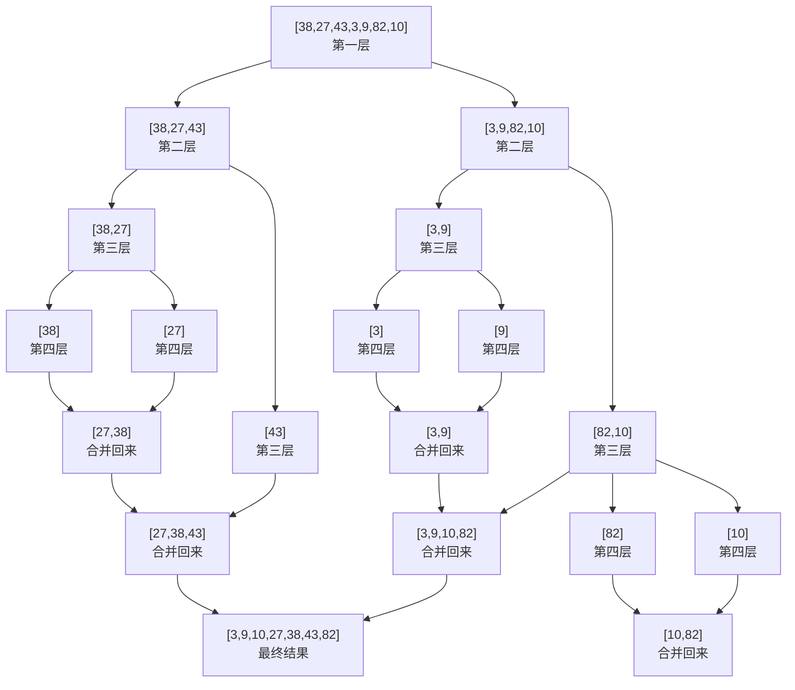
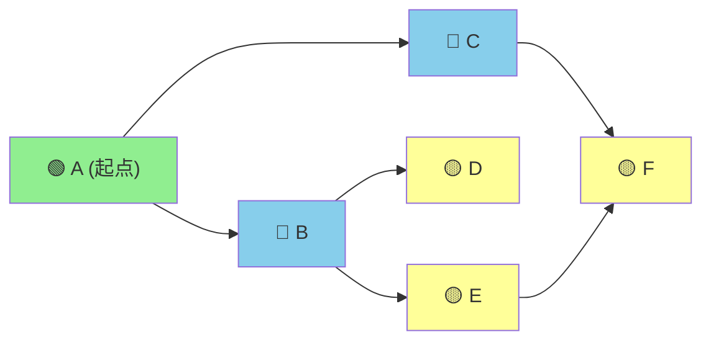
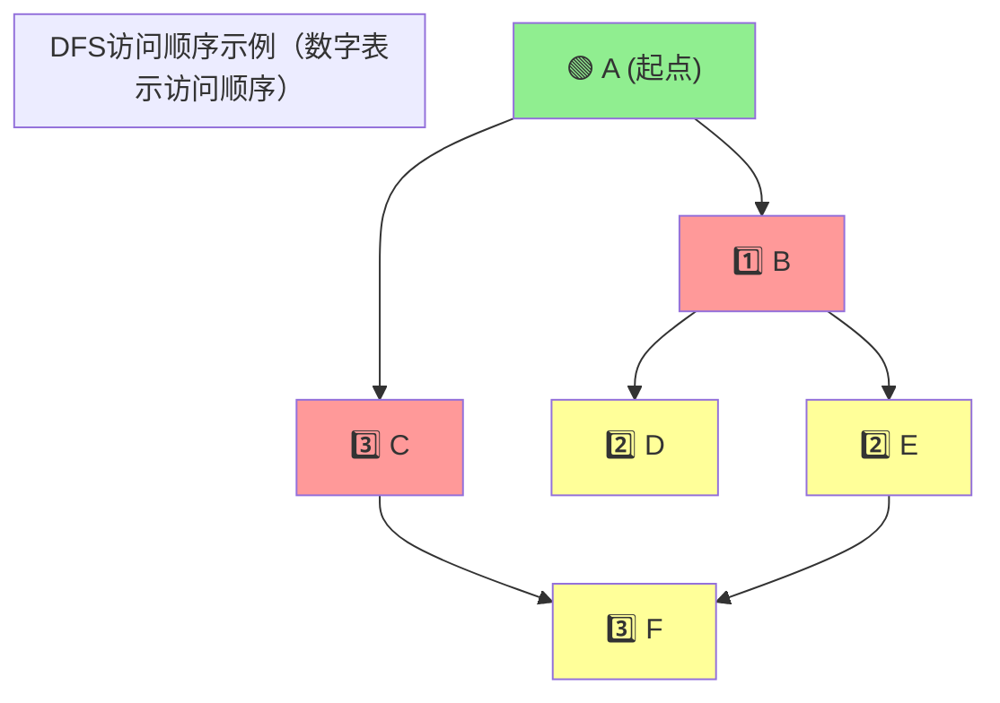

+++
title = "第29章 算法"
weight = 290
date = "2026-04-08T13:22:00+08:00"
type = "docs"
description = ""
isCJKLanguage = true
draft = false
+++

# 第二十九章：算法——程序员的"武松打虎"指南

> 🐯 警告：本章内容可能让你对算法产生无法治愈的兴趣，从此沉迷于刷题无法自拔，老婆孩子热炕头？不存在的，只有LeetCode。

欢迎来到算法的世界！如果你觉得编程是"写代码"，那算法就是"写好代码"背后的灵魂。打个比方，写代码像是做饭，算法就是菜谱——同样的食材，有人做出米其林，有人做出黑暗料理，全看菜谱（算法）够不够硬核。

算法，说白了就是"解决问题的套路"。计算机科学家们花了几十年研究这些套路，有些套路像太极拳（慢但稳），有些像闪电鞭（快但猛），今天我们就来一一拆解，让你从"萌新"进化成"套路王"。

---

## 29.1 排序算法

排序，就是把一堆乱七八糟的数据整理成"按顺序排排坐"的过程。想象你有一堆乱糟糟的扑克牌，排序就是把它们从A到K排好。排序算法是算法世界里的"Hello World"，几乎每个程序员面试都会被问："来，手写一个快排吧！"（面试官微笑.jpg）

### 29.1.1 冒泡排序

**冒泡排序**是排序界的"憨厚老大哥"——思想简单，代码简洁，但效率嘛...你懂的，就像它的名字一样，气泡慢慢往上冒，每轮把最大的"冒"到最右边去。

**核心思想**：从左到右两两比较，如果左边比右边大，就交换位置，像气泡一样把大的逐步"冒"到最右边。

**为什么叫冒泡**？因为最大的元素像气泡一样，会经过一轮比较后"浮"到数组末端。想象一下水底的泡泡往上冒，最大的先到水面。经典！

```python
def bubble_sort(arr):
    """
    冒泡排序：两两比较，大的往后走
    时间复杂度：O(n²) — 稳如老狗，但慢如蜗牛
    空间复杂度：O(1) — 不占额外空间，环保！
    """
    n = len(arr)
    for i in range(n):
        # 标志位：如果某一轮没有发生交换，说明已经有序，可以提前结束
        swapped = False
        for j in range(0, n - i - 1):
            # 两两比较
            if arr[j] > arr[j + 1]:
                arr[j], arr[j + 1] = arr[j + 1], arr[j]  # 交换位置
                swapped = True
        print(f"第 {i + 1} 轮排序后: {arr}")  # 打印每轮结果
        # 没有交换？说明已经排好了，收工！
        if not swapped:
            break
    return arr


# 测试一下！
data = [64, 34, 25, 12, 22, 11, 90]
print("原始数组:", data)
# 原始数组: [64, 34, 25, 12, 22, 11, 90]
bubble_sort(data)
print("排序后:", data)
# 排序后: [11, 12, 22, 25, 34, 64, 90]
```

**冒泡排序的幽默解读**：想象食堂打饭，大家乱成一锅粥，冒泡排序的策略是——每次找一个最高的同学，让他跟右边的人比，如果右边的人更高就换位，然后继续比。这样一轮下来，最高的同学会慢慢"飘"到队伍最右边（食堂打饭的队尾）。最坏情况要比较 n-1 轮，每轮比较 n-i-1 次，总复杂度 O(n²)，食堂大妈看了会沉默，面试官看了会流泪——倒不是感动，是替你觉得慢。

**冒泡排序的适用场景**：教学演示、小规模数据（n<1000）、面试手写环节。生产环境？除非你的电脑比秦始皇的还好，否则还是用别的吧。

### 29.1.2 选择排序

**选择排序**是个"挑食的小孩"——每一轮从待排序的部分中**选择**出最小（或最大）的元素，放在已排序序列的末尾。就像你整理衣柜，每轮都从乱的那堆里挑一件最想丢掉的放到整理好的那边。

**核心思想**：在未排序序列中找最小元素，放到已排序序列的末尾。重复直到所有元素都有了自己的位置。

```python
def selection_sort(arr):
    """
    选择排序：每一轮选个"最能打的"，放到正确位置
    时间复杂度：O(n²) — 无论数据长什么样，都要慢慢挑
    空间复杂度：O(1) — 原地操作，空间占用极少
    """
    n = len(arr)
    for i in range(n):
        # 假设当前位置是最小值
        min_idx = i
        for j in range(i + 1, n):
            if arr[j] < arr[min_idx]:
                min_idx = j
        # 把找到的最小值换到第 i 个位置
        arr[i], arr[min_idx] = arr[min_idx], arr[i]
        print(f"第 {i + 1} 轮选择后: {arr}")
    return arr


data = [64, 25, 12, 22, 11]
print("原始数组:", data)
# 原始数组: [64, 25, 12, 22, 11]
selection_sort(data)
print("排序后:", data)
# 排序后: [11, 12, 22, 25, 64]
```

**选择排序的幽默解读**：想象你有一抽屉乱七八糟的袜子，选择排序的策略是：第一轮遍历所有袜子，找出最喜欢的那只（最小的），放到抽屉最左边；第二轮从剩下的袜子里再找最喜欢的，放到左边第二个...以此类推。你确实每次都选到了"最优解"，但问题是——每选一次都要把抽屉翻个底朝天，时间复杂度 O(n²)，你妈看了会问："找袜子需要这么久吗？"

> 💡 **选择排序小贴士**：选择排序的交换次数最多只有 n 次（每轮最多换一次），所以当写入操作很昂贵（比如要写硬盘）时，它反而比冒泡排序更优秀！这叫什么？这叫"我虽然慢，但我省墨"。

### 29.1.3 插入排序

**插入排序**是个"扑克牌玩家"——摸到一张牌，就把它插到手里已排序区域的正确位置。想象你打斗地主，摸牌的时候左手已经按顺序理好了，每次摸到新牌就往合适的位置一插，完美！

**核心思想**：将数组分为"已排序区"和"未排序区"，从未排序区逐个取出元素，在已排序区找到正确位置插入。

```python
def insertion_sort(arr):
    """
    插入排序：摸牌插牌，边摸边理
    时间复杂度：O(n²)（最坏），O(n)（最好，即已排序）
    空间复杂度：O(1)
    """
    for i in range(1, len(arr)):
        # 当前要插入的"新牌"
        key = arr[i]
        # 已在左手（已排序区）的元素从右往左比较
        j = i - 1
        print(f"摸到新牌: {key}，开始寻找插入位置，当前左手: {arr[:i]}")
        while j >= 0 and arr[j] > key:
            arr[j + 1] = arr[j]  # 元素往后挪，空出位置
            j -= 1
        # j+1 就是新牌的归宿
        arr[j + 1] = key
        print(f"插入完成: {arr[:i+1]}")
    return arr


data = [12, 11, 13, 5, 6]
print("原始数组:", data)
# 原始数组: [12, 11, 13, 5, 6]
insertion_sort(data)
print("排序后:", data)
# 排序后: [5, 6, 11, 12, 13]
```

**插入排序的幽默解读**：插入排序就像整理书架——你手里有一排已经按高矮排好的书（已排序区），现在要插入一本新书。你会从右往左比较，找到第一个比你矮的书，把新书插到它后面。运气好的时候（数据基本有序），插入排序几乎不需要动；运气不好的时候（数据完全逆序），每本书都要往后挪，累死你。

> 💡 **插入排序的杀手锏**：它对**近乎有序**的数据表现极好！时间复杂度可以接近 O(n)。所以如果你知道数据"差不多有序"，插入排序就是你的首选。这就像打牌时如果你的手牌本来就比较整齐，摸牌插牌就轻松多了。

### 29.1.4 归并排序

**归并排序**是个"团队协作大师"——贯彻分而治之的思想：先把大问题拆成小问题，小问题解决了再合并答案。就像一个连长说："一班去守左边的山头，二班去守右边的，完成后我们汇合！"

**核心思想**：**分**——把数组从中间劈成两半，递归地对左右两半排序；**治**——把两个有序的半边合并成一个有序的整体。

```python
def merge_sort(arr):
    """
    归并排序：分而治之，各个击破
    时间复杂度：O(n log n) — 稳定高效
    空间复杂度：O(n) — 需要额外空间合并
    """
    if len(arr) <= 1:
        return arr

    # 分：找到中点，一分为二
    mid = len(arr) // 2
    left = merge_sort(arr[:mid])   # 递归排序左半边
    right = merge_sort(arr[mid:])  # 递归排序右半边

    # 治：合并两个有序数组
    return merge(left, right)


def merge(left, right):
    """合并两个有序数组"""
    result = []
    i = j = 0

    print(f"    合并: left={left}, right={right}")

    while i < len(left) and j < len(right):
        if left[i] <= right[j]:
            result.append(left[i])
            i += 1
        else:
            result.append(right[j])
            j += 1

    # 把剩余的接上去（必定有且只有一个数组还有剩余）
    result.extend(left[i:])
    result.extend(right[j:])
    print(f"    合并结果: {result}")
    return result


# 测试
data = [38, 27, 43, 3, 9, 82, 10]
print("原始数组:", data)
# 原始数组: [38, 27, 43, 3, 9, 82, 10]
sorted_data = merge_sort(data)
print("排序后:", sorted_data)
# 排序后: [3, 9, 10, 27, 38, 43, 82]
```

**归并排序的幽默解读**：想象一个班级要按身高排队，班主任的策略是——先让每两个人自己排好（基本单位合并），然后每四个人的小组排序，再八个，再十六个...最后全班一起排。班主任自己不需要一个个比，他只需要把两个已排好的小组"对齐"比较就行了。这就像合并两个已经按字母排序的名单——你不需要重新扫一遍，直接双指针往下一扫就行了！

### 29.1.5 快速排序

**快速排序**是排序界的"当红炸子鸡"——快排快排，名副其实的快！面试问到排序，十次有九次会考快排。手写快排几乎是程序员的"入门礼"，就像学吉他要会弹《小星星》一样。

**核心思想**：从数组中挑一个元素作为"基准"（pivot），然后把数组分成两部分——小于基准的在左边，大于基准的在右边，再递归对两边快排，最终拼起来就是有序数组。

```python
def quick_sort(arr):
    """
    快速排序：选基准，分左右，递归排序
    时间复杂度：O(n log n)（平均），O(n²)（最坏）
    空间复杂度：O(log n)（递归栈）
    """
    if len(arr) <= 1:
        return arr

    # 选择基准（这里选中间的元素）
    pivot = arr[len(arr) // 2]
    print(f"基准值: {pivot}, 待排序: {arr}")

    # 分成三部分：小于基准、等于基准、大于基准
    left = [x for x in arr if x < pivot]
    middle = [x for x in arr if x == pivot]
    right = [x for x in arr if x > pivot]

    print(f"  左边: {left}, 中间: {middle}, 右边: {right}")

    # 递归排序左右，然后拼接
    return quick_sort(left) + middle + quick_sort(right)


# 测试
data = [10, 7, 8, 9, 1, 5]
print("原始数组:", data)
# 原始数组: [10, 7, 8, 9, 1, 5]
sorted_data = quick_sort(data)
print("排序后:", sorted_data)
# 排序后: [1, 5, 7, 8, 9, 10]
```

**快速排序的幽默解读**：快速排序就像"荷兰国旗问题"的日常版——给你一堆红白蓝三种颜色的国旗，要求按颜色排好。你随机挑一个人当"基准"（比如白旗），然后让所有人排队：比白旗浅的站左边，比白旗深的站右边，一样深的站中间。排好后，你再对左边和右边的人群分别用同样的方法处理。整个过程就像瘟疫一样——哦不，像病毒一样扩散（递归），直到每个区域只有一个人为止。

> 💡 **快排的生存智慧**：基准选得好，快排快到爆；基准选得烂，快排变成"慢排"。想象每次你选基准都选到了最大值或最小值，那分出来的数组就是一边重一边轻，递归直接退化成 O(n²)。所以工业界一般用"三数取中"法选基准——取首、中、尾三个数的中位数作为基准，稳如老狗。

### 29.1.6 堆排序

**堆排序**是个"数据结构综合派"——它用到了堆这种数据结构。什么是堆？堆就是一种**完全二叉树**（想象一个每层都塞满、最后一层从左往右排列的三角形），并且满足**堆属性**：父节点要么比孩子都大（最大堆），要么比孩子都小（最小堆）。

**核心思想**：先把数组建成一个最大堆，然后反复"弹出"堆顶（最大值），每次弹出来后把最后一个元素放到堆顶，再调整堆（heapify），直到堆空。

```python
import heapq  # Python自带堆模块，但手写更能理解原理


def heap_sort(arr):
    """
    堆排序：利用堆的性质进行排序
    时间复杂度：O(n log n) — 稳定高效
    空间复杂度：O(1) — 原地排序
    """
    n = len(arr)

    # 第一步：构建最大堆（从最后一个非叶子节点往前调整）
    # 叶子节点不需要调整，所以从 (n//2 - 1) 开始
    for i in range(n // 2 - 1, -1, -1):
        heapify(arr, n, i)

    print(f"构建好的最大堆: {arr}")

    # 第二步：逐个提取元素
    for i in range(n - 1, 0, -1):
        arr[0], arr[i] = arr[i], arr[0]  # 把堆顶（最大值）移到末尾
        print(f"交换后 [堆顶 {arr[i]} 到位]: {arr}")
        heapify(arr, i, 0)  # 重新调整剩余的堆

    return arr


def heapify(arr, heap_size, root_index):
    """
    堆化：从上往下调整，保持最大堆性质
    父节点 index -> i
    左孩子 -> 2*i + 1
    右孩子 -> 2*i + 2
    """
    largest = root_index
    left = 2 * root_index + 1
    right = 2 * root_index + 2

    # 如果左孩子比根大
    if left < heap_size and arr[left] > arr[largest]:
        largest = left

    # 如果右孩子更大
    if right < heap_size and arr[right] > arr[largest]:
        largest = right

    # 如果最大的不是根，需要调整
    if largest != root_index:
        arr[root_index], arr[largest] = arr[largest], arr[root_index]
        # 递归往下调整
        heapify(arr, heap_size, largest)


# 测试
data = [12, 11, 13, 5, 6, 7]
print("原始数组:", data)
# 原始数组: [12, 11, 13, 5, 6, 7]
heap_sort(data)
print("排序后:", data)
# 排序后: [5, 6, 7, 11, 12, 13]
```

**堆排序的幽默解读**：堆排序就像"抢凳子"游戏的终极版。想象一群人围着一圈坐，凳子数量比人数少一把。每个凳子上坐的人都要比两边相邻凳子上的人高（或低，看你建的是最大堆还是最小堆）。游戏开始时音乐响起，人们抢凳子，音乐停时没抢到的人出局，然后去掉一个凳子，继续抢...每轮淘汰一个，最终留下来的就是"冠军"（最大值）。这游戏的精髓是什么？不能一个人闷头抢，要时刻维护"堆"的性质，让最高的人始终在"堆顶"（能第一个看到凳子空了没）。

**堆与完全二叉树的关系**：堆用数组就能表示，根本不需要真的建一棵树。索引 i 的节点，父节点是 (i-1)//2，左孩子是 2*i+1，右孩子是 2*i+2。Python 的 `heapq` 模块默认是最小堆，想当最大堆用？把元素取负就行了！

### 29.1.7 时间复杂度对比

光说不练假把式，光练不说傻把式。让我们来看看这六种排序算法的"成绩单"：

| 算法 | 平均时间复杂度 | 最坏时间复杂度 | 最好时间复杂度 | 空间复杂度 | 稳定性 |
|------|--------------|--------------|--------------|----------|------|
| 冒泡排序 | O(n²) | O(n²) | O(n) | O(1) | ✅ 稳定 |
| 选择排序 | O(n²) | O(n²) | O(n²) | O(1) | ❌ 不稳定 |
| 插入排序 | O(n²) | O(n²) | O(n) | O(1) | ✅ 稳定 |
| 归并排序 | O(n log n) | O(n log n) | O(n log n) | O(n) | ✅ 稳定 |
| 快速排序 | O(n log n) | O(n²) | O(n log n) | O(log n) | ❌ 不稳定 |
| 堆排序 | O(n log n) | O(n log n) | O(n log n) | O(1) | ❌ 不稳定 |

> 📝 **名词解释**：
> - **时间复杂度**：随着数据规模 n 增长，算法执行时间的增长趋势。O(n²) 就是"数据量翻倍，时间翻四倍"；O(n log n) 就是"数据量翻倍，时间大约翻一倍多"。
> - **空间复杂度**：算法除了输入数据外，额外占用的内存空间。
> - **稳定性**：排序后相等元素的相对位置是否保持不变。稳定意味着"相等元素的江湖地位不变"，不稳定则可能发生"颠倒"。

**选择指南**（口诀）：

- **数据少+基本有序** → 插入排序，你是我的眼
- **数据多+要求稳定** → 归并排序，稳定如一
- **数据多+追求速度** → 快速排序，快如闪电（但记得基准选好）
- **不想多占空间** → 堆排序，空间效率之王
- **面试手写** → 快排或归并，随便挑，反正面试官都认识

---

## 29.2 查找算法

排序是"整理"，查找就是"搜索"。想象你在图书馆找一本书，或者在字典里查一个单词——查找算法就是解决这类问题的套路。

### 29.2.1 顺序查找

**顺序查找**（也叫线性查找）是最简单的查找方式——一个一个地找，从头查到尾。就像你在宿舍楼下喊人："张三！李四！王五..."一个个点名，总会找到的（或者发现人不在）。

**核心思想**：遍历整个数组，逐个比较，找到目标就返回下标，没找到就返回 -1。

```python
def sequential_search(arr, target):
    """
    顺序查找：老实人策略，一个一个找
    时间复杂度：O(n) — 最坏情况要查遍全数组
    空间复杂度：O(1)
    """
    for i, num in enumerate(arr):
        print(f"正在检查第 {i + 1} 个元素: {num}...")
        if num == target:
            print(f"找到了！目标 {target} 在索引 {i} 处！🎉")
            return i
    print(f"遗憾！目标 {target} 不在这个数组里...")
    return -1


# 测试
data = ['苹果', '香蕉', '橙子', '葡萄', '西瓜']
print("=" * 40)
result = sequential_search(data, '橙子')
# 正在检查第 3 个元素: 橙子...
# 找到了！目标 橙子 在索引 2 处！🎉

print("=" * 40)
result = sequential_search(data, '桃子')
# 遍历完所有元素
# 遗憾！目标 桃子 不在这个数组里...
```

**顺序查找的幽默解读**：想象你在一个没有索引的Excel文件里找一个单元格的内容，你能怎么办？只能一个一个往下拉，一个个看。不聪明，但管用（而且当你根本不知道数据排没排好序的时候，这是唯一的选择）。这就像你去相亲角找对象——你没有对方的联系方式，只能一个个摊位走过去看，看到合适的就停下来。效率感人，但机会均等。

> 💡 **顺序查找的生存场景**：当数据量很小（<100），或者数据**无序**（根本没法用二分），或者你只需要查找一次——顺序查找就够了。省去了排序的时间，直接上手查。

### 29.2.2 二分查找

**二分查找**（Binary Search）是查找界的"学霸"——它利用了数据已排序的特性，每次把搜索范围缩小一半，效率极高。想象你在猜价格游戏里猜商品价格："500？""低了！""750？""高了！""625？""低了！"...每次都排除掉一半，这就是二分查找的精髓。

**核心思想**：在**有序数组**中，先看中间元素，如果中间元素正好是目标，命中！如果比目标大，就去左半边继续找；如果比目标小，就去右半边继续找。每一步都把搜索范围缩小一半。

```python
def binary_search(arr, target):
    """
    二分查找：每次砍一半，快到飞起
    时间复杂度：O(log n) — 10亿数据最多只要查30次！
    空间复杂度：O(1)
    前提：数组必须有序！
    """
    left, right = 0, len(arr) - 1

    while left <= right:
        mid = (left + right) // 2  # 中间位置
        print(f"搜索范围: [{left}, {right}], 中间位置: {mid}, 中间值: {arr[mid]}")

        if arr[mid] == target:
            print(f"🎯 找到了！目标 {target} 在索引 {mid} 处！")
            return mid
        elif arr[mid] < target:
            print(f"  {arr[mid]} < {target}，目标在右半边，继续！")
            left = mid + 1
        else:
            print(f"  {arr[mid]} > {target}，目标在左半边，继续！")
            right = mid - 1

    print(f"遗憾！目标 {target} 不在数组中...")
    return -1


# 测试
data = [1, 3, 5, 7, 9, 11, 13, 15, 17, 19, 21]
print("有序数组:", data)
print("=" * 50)
result = binary_search(data, 13)
# 搜索范围: [0, 10], 中间位置: 5, 中间值: 11
#   11 < 13，目标在右半边，继续！
# 搜索范围: [6, 10], 中间位置: 8, 中间值: 17
#   17 > 13，目标在左半边，继续！
# 搜索范围: [6, 7], 中间位置: 6, 中间值: 13
# 🎯 找到了！目标 13 在索引 6 处！

print("=" * 50)
result = binary_search(data, 6)
# 搜索范围: [0, 10], 中间位置: 5, 中间值: 11
# ...
# 遗憾！目标 6 不在数组中...
```

**二分查找的幽默解读**：想象你在翻字典查一个单词，比如"algorithm"。你不会傻到从第一页一页一页翻——你会先随手翻开字典中间，发现是M开头的单词，太靠后了；然后翻到前半本的中点，是G开头的，还是靠后；再往前...如此反复，每次都把搜索范围减半。数学上可以证明，100万条数据最多只需要20次"翻字典"操作就能找到目标！这就是二分的威力——**对数级别的增长，慢个鬼**。

```python
# 二分查找的递归版本
def binary_search_recursive(arr, target, left, right):
    """递归版本的二分查找"""
    if left > right:
        return -1

    mid = (left + right) // 2

    if arr[mid] == target:
        return mid
    elif arr[mid] < target:
        return binary_search_recursive(arr, target, mid + 1, right)
    else:
        return binary_search_recursive(arr, target, left, mid - 1)
```

> 📝 **二分查找的注意事项**：
> 1. **数组必须有序**！无序数组用二分等于大海捞针——你在一个乱序的图书馆里用二分的思路翻字典，翻到神经错乱也找不到。
> 2. **`left <= right` 还是 `left < right`**？记住循环条件是 `<=`，因为当 left == right 时还可能有答案（只有一个元素的区间）。
> 3. **`mid = (left + right) // 2`** 还是 `(left + right) / 2`？对于大数求和可能溢出，但在 Python 里整数可以无限大，所以没这个问题。

---

## 29.3 递归与分治

递归是算法世界里最重要的思想之一，可以说是"程序员的瑞士军刀"。不会递归，就像厨师不会用刀——能做饭，但效率低得感人。

**递归**：函数调用自己。听起来很荒谬？但这就是递归的魅力——大问题可以拆成同类型的子问题，子问题再拆成更小的子问题，直到子问题简单到可以直接解决（这叫**基准情形**）。

### 29.3.1 递归三要素

不是所有的递归都叫好递归，一个优雅的递归必须满足三个要素：

```python
# 递归三要素示例：计算阶乘
def factorial(n):
    """
    递归三要素：
    1. 【基准情形】最小问题，直接返回答案
    2. 【递归调用】大问题变小问题，调用自身
    3. 【递归返回】子问题的答案组合成大问题的答案
    """

    # 要素1：基准情形 — 0! = 1，这是递归的终点
    if n == 0 or n == 1:
        return 1

    # 要素2：递归调用 — n! = n * (n-1)!
    result = n * factorial(n - 1)

    # 要素3：返回结果 — 子问题答案组合成当前问题的答案
    return result


# 测试
print(f"5! = {factorial(5)}")  # 5! = 120
print(f"0! = {factorial(0)}")  # 0! = 1
```

**递归三要素详解**：

1. **基准情形（Base Case）**：递归的"出口"，如果没有基准情形，递归会无穷无尽，直到栈溢出（Stack Overflow）——对，就是那个程序员问答网站的名字。基准情形就是简单到不需要递归就能直接得到答案的情况，比如阶乘的 n=0 或 n=1，比如二叉树的空节点。

2. **递归调用（Recursive Case）**：把问题"缩小"，调用自身去解决更小的同一问题。比如计算 n!，就调用 factorial(n-1) 去计算 (n-1)!。记住，**每次递归调用都必须让问题规模缩小**，否则就是在原地转圈圈。

3. **答案返回（Return）**：子问题的答案必须能组合成当前问题的答案。如果子问题的解不能帮你解决当前问题，那递归就是在做无用功。

> 💡 **递归的幽默解读**：递归就像你在图书馆找书，书架上有个牌子写着"索引在B区"，B区又有个牌子写着"索引在C区"...如此往复，直到你找到一个写着"索引在这里"的小抽屉。这就是递归调用——层层深入，直到找到基准情形。然后你再逐层返回，把每一层的信息汇总，最终拿到完整的索引。这和《盗梦空间》有点像——每层梦境都有自己的任务，最后要一层层回到现实世界（基准情形）。什么？你说你看不懂《盗梦空间》？那你应该更能理解递归——因为你正在经历的就是递归！

### 29.3.2 汉诺塔问题

**汉诺塔**是递归思想的"经典营销案例"——一个古老的传说，三根柱子，若干圆盘，要把所有圆盘从A柱移到C柱，规则是每次只能移动一个圆盘，大盘子不能压在小盘子上。这个问题难倒了几代人，直到递归出现，人们才发现——哦，原来这么简单！

```python
def hanoi(n, source, target, auxiliary):
    """
    汉诺塔问题：经典的递归问题
    目标：把 n 个盘子从 source 柱子，借助 auxiliary 柱子，移到 target 柱子

    核心思想：
    1. 把上面的 n-1 个盘子从 source 移到 auxiliary（借助 target）
    2. 把最大的盘子从 source 移到 target
    3. 把 n-1 个盘子从 auxiliary 移到 target（借助 source）
    """
    if n == 1:
        # 基准情形：只有一个盘子，直接搬
        print(f"把第 1 个盘子从 {source} 移到 {target}")
        return

    # 步骤1：把上面 n-1 个盘子从 source 移到 auxiliary（target 当跳板）
    hanoi(n - 1, source, auxiliary, target)

    # 步骤2：把最大的盘子（第 n 个）从 source 移到 target
    print(f"把第 {n} 个盘子从 {source} 移到 {target}")

    # 步骤3：把 n-1 个盘子从 auxiliary 移到 target（source 当跳板）
    hanoi(n - 1, auxiliary, target, source)


# 测试：3个盘子的汉诺塔
print("=" * 50)
print("【汉诺塔 - 3个盘子】")
print("=" * 50)
hanoi(3, 'A', 'C', 'B')
# 把第 1 个盘子从 A 移到 C
# 把第 2 个盘子从 A 移到 B
# 把第 1 个盘子从 C 移到 B
# 把第 3 个盘子从 A 移到 C
# 把第 1 个盘子从 B 移到 A
# 把第 2 个盘子从 B 移到 C
# 把第 1 个盘子从 A 移到 C
```

**汉诺塔的幽默解读**：汉诺塔的递归解法妙在"借力打力"。你想把一摞盘子从A搬到C？没问题，先把上面n-1个搬到B，然后把最大的那个搬到C，最后把B上的n-1个搬到C就行了。什么？你说你还是不懂？那就对了，连爱因斯坦都说："上帝不掷骰子，但汉诺塔确实把人类逼疯过。"

> 💡 **汉诺塔的步数**：n 个盘子需要移动 2^n - 1 步。3个盘子需要7步，4个需要15步，5个需要31步，10个需要1023步...所以如果你想在汉诺塔游戏里破解世界纪录，起码得准备2^64 - 1步——这是18446744073709551615步，约等于"宇宙热寂之前搬不完"步。

```python
# 计算n个盘子的移动步数
def hanoi_steps(n):
    return 2 ** n - 1


for i in range(1, 11):
    print(f"{i} 个盘子需要 {hanoi_steps(i)} 步")
# 1 个盘子需要 1 步
# 2 个盘子需要 3 步
# 3 个盘子需要 7 步
# ...
# 10 个盘子需要 1023 步
```

### 29.3.3 归并排序详解

还记得前面提到的归并排序吗？现在我们已经掌握了递归三要素，来深入看看归并排序的递归之美。

```python
def merge_sort_verbose(arr, depth=0):
    """
    带日志的归并排序，看清楚递归的每一步
    """
    indent = "  " * depth
    print(f"{indent}[递归深度 {depth}] 开始排序: {arr}")

    # 基准情形：只有一个或零个元素，本身就是有序的
    if len(arr) <= 1:
        print(f"{indent}[基准情形] 元素 {arr} 已就绪，无需排序")
        return arr

    # 递归情形：分而治之
    mid = len(arr) // 2
    print(f"{indent}[分割] 左半边: {arr[:mid]}, 右半边: {arr[mid:]}")

    left = merge_sort_verbose(arr[:mid], depth + 1)
    right = merge_sort_verbose(arr[mid:], depth + 1)

    # 合并两个有序数组
    merged = merge_two_arrays(left, right)
    print(f"{indent}[合并] {left} + {right} = {merged}")

    return merged


def merge_two_arrays(left, right):
    """合并两个有序数组"""
    result = []
    i = j = 0

    while i < len(left) and j < len(right):
        if left[i] <= right[j]:
            result.append(left[i])
            i += 1
        else:
            result.append(right[j])
            j += 1

    result.extend(left[i:])
    result.extend(right[j:])

    return result


# 测试
data = [38, 27, 43, 3, 9, 82, 10]
print("原始数组:", data)
print("=" * 60)
sorted_data = merge_sort_verbose(data)
print("=" * 60)
print("排序后:", sorted_data)
```

运行结果会清晰地展示递归的"深度优先"特性——先一路分到底，然后逐层合并回来。



> 📝 **归并排序的递归理解**：归并排序的递归树就像一棵倒挂的树——从根节点开始分叉（分），一直分到叶子节点（基准情形，每个数组只有一个元素），然后从叶子节点开始往上合并（治）。分的过程是"先递归后返回"（深度优先），合并的过程是"从叶子到根"逐层汇总。

---

## 29.4 动态规划

**动态规划**（Dynamic Programming，简称DP）是算法界的"灭霸"——掌握它的人可以说"我不是针对谁，我是说在座的各位..."。很多人听到DP就头疼，因为它的核心思想虽然简单，但应用起来千变万化，让人防不胜防。

**动态规划的定义**：把一个复杂问题分解成重叠的子问题，先求解子问题，再利用子问题的答案构建最终答案。"动态"指的是问题像楼梯一样有阶段性地推进，"规划"指的是"找最优解"。

**什么时候用DP**：如果一个问题的解可以由子问题的解构建，并且子问题会重复出现（重叠子问题），那就可以用DP。这就像你算斐波那契数列时，第5项会用到第4项和第3项，而第4项又会被第3项"蹭蹭"——子问题重复了，用DP记忆化一下就能省大量计算。

### 29.4.1 斐波那契数列

**斐波那契数列**是动态规划的"Hello World"。斐波那契数列长这样：0, 1, 1, 2, 3, 5, 8, 13, 21, 34...规律是：F(0)=0, F(1)=1, F(n)=F(n-1)+F(n-2)。

```python
# 方法1：纯递归（不看不知道，一看吓一跳）
def fib_recursive(n):
    """纯递归：简单直接，但时间复杂度爆炸"""
    if n <= 1:
        return n
    return fib_recursive(n - 1) + fib_recursive(n - 2)


# 方法2：记忆化递归（DP的递归版本）
def fib_memoized(n, memo=None):
    """记忆化递归：用字典存储已计算的结果，避免重复计算"""
    if memo is None:
        memo = {}

    if n in memo:
        return memo[n]

    if n <= 1:
        return n

    memo[n] = fib_memoized(n - 1, memo) + fib_memoized(n - 2, memo)
    return memo[n]


# 方法3：DP表格法（DP的迭代版本）
def fib_dp_table(n):
    """自底向上：用表格存储每个子问题的答案"""
    if n <= 1:
        return n

    # dp[i] 表示第 i 个斐波那契数
    dp = [0] * (n + 1)
    dp[0] = 0
    dp[1] = 1

    for i in range(2, n + 1):
        dp[i] = dp[i - 1] + dp[i - 2]

    return dp[n]


# 方法4：空间优化（只保留前两个数）
def fib_optimized(n):
    """空间复杂度 O(1) 的版本"""
    if n <= 1:
        return n

    prev, curr = 0, 1
    for _ in range(2, n + 1):
        prev, curr = curr, prev + curr

    return curr


# 测试
n = 10
print(f"斐波那契数列前 {n + 1} 项:")
for i in range(n + 1):
    print(f"F({i}) = {fib_dp_table(i)}")
# F(0) = 0, F(1) = 1, F(2) = 1, F(3) = 2, F(4) = 3,
# F(5) = 5, F(6) = 8, F(7) = 13, F(8) = 21, F(9) = 34, F(10) = 55

print(f"\n第 10 项: {fib_dp_table(10)}")  # 55
print(f"第 100 项: {fib_optimized(100)}")  # 354224848179261915075
```

**斐波那契数列的幽默解读**：斐波那契数列在自然界中广泛存在——向日葵的花盘、菠萝的鳞片、松果的排列...都遵循斐波那契规律。有人说这是宇宙的终极密码，也有人说这是大自然的"偷懒策略"——因为按照斐波那契排列，能让种子/鳞片在最紧凑的空间里分布得最均匀。就像程序员写代码——不是为了炫技，而是因为这样"最省"。

> 💡 **斐波那契数列的时间复杂度对比**：
> - 纯递归：O(2^n) ——指数级灾难，算第40项就要等好几年
> - 记忆化递归：O(n) ——"我记住了"，不再重复算
> - DP表格法：O(n) ——自底向上，一步步填表
> - 空间优化版：O(n) 时间，O(1) 空间 ——最优解

### 29.4.2 背包问题

**背包问题**是动态规划的"经典出道题"。想象你是个小偷，背了一个容量为W的背包，去偷东西。商店里有n件商品，每件商品有价值v和重量w。你要在不超过背包容量的前提下，偷走价值最高的商品组合。这就是0-1背包问题（每件物品只能偷0个或1个，不能拆开偷）。

```python
def knapsack(weights, values, capacity):
    """
    0-1 背包问题：经典的动态规划问题
    weights: 各物品的重量列表
    values: 各物品的价值列表
    capacity: 背包容量

    时间复杂度：O(n * capacity)
    空间复杂度：O(n * capacity)
    """
    n = len(weights)

    # dp[i][w] 表示：只考虑前 i 个物品，背包容量为 w 时的最大价值
    dp = [[0] * (capacity + 1) for _ in range(n + 1)]

    print("开始动态规划...")
    for i in range(1, n + 1):
        print(f"\n考虑第 {i} 件物品 (重量={weights[i-1]}, 价值={values[i-1]}):")
        for w in range(capacity + 1):
            # 不选第 i 件物品
            dp[i][w] = dp[i - 1][w]

            # 选第 i 件物品（前提：背包能装下）
            if weights[i - 1] <= w:
                candidate = dp[i - 1][w - weights[i - 1]] + values[i - 1]
                if candidate > dp[i][w]:
                    dp[i][w] = candidate

            if w == capacity:
                print(f"  容量 {w}: {dp[i][w]}")
            else:
                print(f"  容量 {w}: {dp[i][w]}", end=" | ")
        print()

    return dp[n][capacity]


# 测试
weights = [2, 3, 4, 5]   # 物品重量
values = [3, 4, 5, 6]    # 物品价值
capacity = 5             # 背包容量

print("=" * 60)
max_value = knapsack(weights, values, capacity)
print("=" * 60)
print(f"\n背包能装的最大价值: {max_value}")
# 最大价值为 7（选重量2价值3 + 重量3价值4，或者选重量5价值6）
```

**背包问题的幽默解读**：背包问题在现实中太有用了——你出差只能带一个行李箱，电脑和游戏机只能选一个带，你妈和你女朋友同时约你今晚见面，你只能去一个地方...人生就是一场背包问题。你想带的东西太多，但容量有限，怎么办？DP告诉你："别急，一个个考虑，每个决策都要权衡——选这个还是选那个？最优解就藏在这些权衡里。"

> 📝 **0-1背包 vs 完全背包**：
> - 0-1背包：每件物品只能选一次（偷或不偷）
> - 完全背包：每件物品可以选无限次（随便拿，只要背包装得下）
> 区别仅在状态转移方程的一行代码，但答案可能完全不同！

### 29.4.3 最长公共子序列

**最长公共子序列**（Longest Common Subsequence，简称LCS）是字符串处理中的经典问题。给定两个字符串，找出它们的最长公共子序列的长度。子序列是指从原字符串中**不改变顺序**地删除一些（或不删除）字符后得到的新序列。

```python
def lcs(str1, str2):
    """
    最长公共子序列问题
    时间复杂度：O(m * n)
    空间复杂度：O(m * n)

    dp[i][j] 表示：str1[0..i-1] 和 str2[0..j-1] 的最长公共子序列长度
    """
    m, n = len(str1), len(str2)

    # dp表初始化
    dp = [[0] * (n + 1) for _ in range(m + 1)]

    print(f"字符串1: '{str1}' (长度 {m})")
    print(f"字符串2: '{str2}' (长度 {n})")
    print()

    # 填表
    for i in range(1, m + 1):
        for j in range(1, n + 1):
            if str1[i - 1] == str2[j - 1]:
                # 字符匹配，LCS长度 +1
                dp[i][j] = dp[i - 1][j - 1] + 1
            else:
                # 字符不匹配，取前面计算的最大值
                dp[i][j] = max(dp[i - 1][j], dp[i][j - 1])

    # 打印dp表
    print("DP表格:")
    print("    ", end=" ")
    for j in range(n + 1):
        if j == 0:
            print("  ε", end=" ")
        else:
            print(f" {str2[j-1]}", end=" ")
    print()
    for i in range(m + 1):
        if i == 0:
            print("  ε", end=" ")
        else:
            print(f"{str1[i-1]} ", end=" ")
        for j in range(n + 1):
            print(f" {dp[i][j]}", end=" ")
        print()

    return dp[m][n]


# 测试
str1 = "ABCDGH"
str2 = "AEDFHR"
print("=" * 50)
result = lcs(str1, str2)
print("=" * 50)
print(f"\n最长公共子序列长度: {result}")  # 3 ("ADH")

print("\n" + "=" * 50 + "\n")

str1 = "AGGTAB"
str2 = "GXTXAYB"
result = lcs(str1, str2)
print(f"最长公共子序列长度: {result}")  # 4 ("GTAB")
```

**最长公共子序列的幽默解读**：LCS在生物信息学中大名鼎鼎——DNA序列比对就是用它！想象两个物种的基因序列，科学家想知道它们有多相似，就用LCS来找出共同的"祖先片段"。这也解释了为什么你和你家猫有相似的基因——你们都是"地球人"，共享一个远古祖先！所以LCS不仅是算法题，更是揭示生命奥秘的钥匙。（虽然面试官考你LCS的时候可不会这么解释，他只会说："手写LCS。"

> 💡 **LCS的应用场景**：
> - **Git的diff命令**：比较两个版本代码的差异，就是找最长公共子序列
> - **论文查重**：把两份论文扔进LCS，能找出相似段落
> - **DNA比对**：生物学家用它来找物种间的亲缘关系
> - **输入法联想词**：你打"你好"，输入法猜你下一个字要打"啊"（虽然经常猜错）

---

## 29.5 图论算法

图（Graph）是计算机科学中最重要的数据结构之一。顾名思义，图就是由**节点**（也叫顶点）和**边**组成的数据结构——就像你的微信好友关系，你是一个节点，你的好友也是节点，你们之间的好友关系就是边。

**图的基本概念**：

- **有向图 vs 无向图**：有向图的边有方向（微信关注，A关注B不代表B关注A），无向图的边没有方向（Facebook好友，A是B好友B就是A好友）
- **带权图 vs 无权图**：边的"长度"是否固定
- **邻接表 vs 邻接矩阵**：图的两种存储方式

```python
# 用邻接表表示一个无向图
graph = {
    'A': ['B', 'C'],      # A 连接 B 和 C
    'B': ['A', 'D', 'E'], # B 连接 A、D、E
    'C': ['A', 'F'],      # C 连接 A 和 F
    'D': ['B'],           # D 连接 B
    'E': ['B', 'F'],      # E 连接 B 和 F
    'F': ['C', 'E']       # F 连接 C 和 E
}
```

### 29.5.1 BFS（广度优先搜索）

**BFS**（Breadth-First Search）就像水波纹扩散——从起点出发，先访问所有邻居，再访问邻居的邻居，一圈一圈往外扩散。它利用**队列**（Queue）这种数据结构，先到先服务。

**核心思想**：用一个队列来管理待访问的节点。每次从队列头部取出一个节点，访问它，然后把它的所有未访问邻居加入队列尾部。

```python
from collections import deque


def bfs(graph, start):
    """
    广度优先搜索（BFS）
    适用场景：找最短路径、层次遍历、社交网络中"n度好友"查询

    时间复杂度：O(V + E)，V是顶点数，E是边数
    空间复杂度：O(V)
    """
    visited = set()  # 记录已访问的节点
    queue = deque([start])  # 队列初始化，放入起点
    visited.add(start)

    traversal_order = []  # 记录访问顺序

    print(f"BFS 从 '{start}' 开始:")
    step = 0

    while queue:
        step += 1
        node = queue.popleft()  # 从队列头部取出
        traversal_order.append(node)
        print(f"  第 {step} 步: 访问节点 '{node}'")

        # 遍历所有邻居
        for neighbor in graph.get(node, []):
            if neighbor not in visited:
                visited.add(neighbor)
                queue.append(neighbor)
                print(f"    → 发现未访问邻居 '{neighbor}'，加入队列")

    print(f"\n访问顺序: {' → '.join(traversal_order)}")
    return traversal_order


# 测试
graph = {
    'A': ['B', 'C'],
    'B': ['A', 'D', 'E'],
    'C': ['A', 'F'],
    'D': ['B'],
    'E': ['B', 'F'],
    'F': ['C', 'E']
}

print("=" * 50)
bfs(graph, 'A')
# BFS 从 'A' 开始:
#   第 1 步: 访问节点 'A'
#     → 发现未访问邻居 'B'，加入队列
#     → 发现未访问邻居 'C'，加入队列
#   第 2 步: 访问节点 'B'
#     → 发现未访问邻居 'D'，加入队列
#     → 发现未访问邻居 'E'，加入队列
#   第 3 步: 访问节点 'C'
#     → 发现未访问邻居 'F'，加入队列
#   第 4 步: 访问节点 'D'
#   第 5 步: 访问节点 'E'
#   第 6 步: 访问节点 'F'
#
# 访问顺序: A → B → C → D → E → F
```

**BFS的幽默解读**：BFS就像你往水里扔了一块石头，涟漪一圈一圈扩散出去。假设你在某人的朋友圈里找一个人（比如你前女友的现男友的老婆的前男友），BFS告诉你："先查你的一度好友，没有的话再查二度好友，三度好友...按层级来。"这样找能保证——如果你们真的认识，一定是通过最少的人认识的。BFS是社恐患者的救星，哦不对，是"最短路径搜索器"。

> 💡 **BFS找最短路径**：BFS的一个重要性质是，从起点到任意节点，第一次到达该节点的路径就是最短路径。这在迷宫问题、社交网络" degrees of separation "等问题中非常有用。



### 29.5.2 DFS（深度优先搜索）

**DFS**（Depth-First Search）就像一个人走进迷宫——先一条路走到黑，遇到死胡同就回头（回溯），然后尝试另一条路。DFS利用**栈**（Stack）或者递归实现。

**核心思想**：从起点开始，尽可能"深"地探索一条路径，直到无路可走，然后回溯到最近的岔路口，换条路继续。

```python
def dfs_recursive(graph, node, visited=None):
    """
    深度优先搜索（DFS）- 递归版本
    时间复杂度：O(V + E)
    空间复杂度：O(V)（递归栈）
    """
    if visited is None:
        visited = set()

    visited.add(node)
    print(f"  访问节点: '{node}'")

    # 深度优先：递归访问所有未访问的邻居
    for neighbor in graph.get(node, []):
        if neighbor not in visited:
            dfs_recursive(graph, neighbor, visited)

    return visited


def dfs_iterative(graph, start):
    """
    深度优先搜索（DFS）- 迭代版本（用栈）
    """
    visited = set()
    stack = [start]
    traversal_order = []

    print(f"DFS 从 '{start}' 开始（迭代版本）:")
    step = 0

    while stack:
        node = stack.pop()  # 从栈顶取出
        if node not in visited:
            visited.add(node)
            traversal_order.append(node)
            step += 1
            print(f"  第 {step} 步: 访问节点 '{node}'")

            # 注意：这里是逆序加入，因为栈是LIFO
            for neighbor in reversed(graph.get(node, [])):
                if neighbor not in visited:
                    stack.append(neighbor)

    print(f"\n访问顺序: {' → '.join(traversal_order)}")
    return traversal_order


# 测试
graph = {
    'A': ['B', 'C'],
    'B': ['A', 'D', 'E'],
    'C': ['A', 'F'],
    'D': ['B'],
    'E': ['B', 'F'],
    'F': ['C', 'E']
}

print("=" * 50)
print("【DFS 递归版本】")
print("=" * 50)
dfs_recursive(graph, 'A')

print("\n" + "=" * 50)
print("【DFS 迭代版本】")
print("=" * 50)
dfs_iterative(graph, 'A')
```

**DFS的幽默解读**：DFS就像你玩RPG游戏时探索地图——先往东走，走到死胡同（没路了），然后按暂停，回退到上一个岔路口，往南走...又死胡同了？再回退，往北走...终于找到宝藏了！这就是DFS的核心思想：**不撞南墙不回头，撞了南墙就换路**。想象你是《盗墓笔记》里的吴邪，每次下斗都是DFS——一直往下挖，遇到粽子（死胡同）就撤，换条路继续挖。

> 💡 **BFS vs DFS对比**：
> - BFS像"水面波纹"，层层扩散，适合找**最短路径**
> - DFS像"一条道走到黑"，适合**穷举搜索**、**拓扑排序**、**连通分量**
> - 两者时间复杂度相同，区别只是访问顺序不同



### 29.5.3 最短路径（Dijkstra）

**Dijkstra算法**（迪杰斯特拉算法，念成"迪杰斯特拉"就好，别念成"迪卡塔尔"）是图论中的"当红炸子鸡"——用于在带权图中找从一个起点到所有其他节点的最短路径。它是GPS导航、网络路由等应用的理论基础。

**核心思想**：贪心策略。从起点开始，每次选择当前未处理的、距离起点最近的节点，然后"松弛"它的邻居距离。

```python
import heapq


def dijkstra(graph, start):
    """
    Dijkstra最短路径算法
    适用于：带权图，边权非负
    时间复杂度：O((V + E) log V) — 使用优先队列优化

    graph: 邻接表形式的带权图
    返回: {节点: 到起点的最短距离}
    """
    # 到各节点的最短距离，初始为无穷大
    distances = {node: float('inf') for node in graph}
    distances[start] = 0

    # 优先队列：(距离, 节点)
    pq = [(0, start)]
    # 记录已确认最短距离的节点
    visited = set()

    print(f"Dijkstra 从 '{start}' 开始:")
    step = 0

    while pq:
        step += 1
        current_dist, current_node = heapq.heappop(pq)

        # 如果已经处理过，跳过
        if current_node in visited:
            continue

        visited.add(current_node)
        print(f"  第 {step} 步: 处理节点 '{current_node}', 当前距离: {current_dist}")

        # 松弛当前节点的所有邻居
        for neighbor, weight in graph.get(current_node, []):
            if neighbor not in visited:
                new_dist = current_dist + weight
                if new_dist < distances[neighbor]:
                    distances[neighbor] = new_dist
                    heapq.heappush(pq, (new_dist, neighbor))
                    print(f"    → 更新 '{neighbor}' 距离: {new_dist}")

    return distances


# 测试 - 带权图
#       A ---2--- B
#       |       / \
#       1     3   1
#       |   /       \
#       C---4------- D
#        \         /
#         2-----1

graph_weighted = {
    'A': [('B', 2), ('C', 1)],
    'B': [('A', 2), ('C', 3), ('D', 1)],
    'C': [('A', 1), ('B', 3), ('D', 4), ('E', 2)],
    'D': [('B', 1), ('C', 4), ('E', 1)],
    'E': [('C', 2), ('D', 1)]
}

print("=" * 60)
distances = dijkstra(graph_weighted, 'A')
print("=" * 60)
print("\n从 A 出发的最短距离:")
for node, dist in distances.items():
    print(f"  A → {node}: {dist}")
# A → A: 0
# A → B: 2
# A → C: 1
# A → D: 3 (A→B→D: 2+1=3 或 A→C→D: 1+4=5，取小的3)
# A → E: 3 (A→C→E: 1+2=3 或 A→D→E: 3+1=4，取小的3)
```

**Dijkstra算法的幽默解读**：Dijkstra算法就像你在城市里打车，GPS会帮你算最短路线。每次你到一个新地方（当前节点），GPS会问你："从这里到附近各个地方各要多少钱？"（松弛邻居），然后它会重新评估到各个目的地的最短路线。算法保证每次处理的节点，都是目前已知的**全局最近**的未处理节点——这就保证了找到的一定是最短路径。当然，如果边权是负数，这算法就废了——因为"贪心"的前提是"走一步算一步"，边权一旦可能是负的，你今天走近路可能明天就亏了，算法就"贪"不动了。

> 💡 **Dijkstra vs BFS**：BFS实际上是Dijkstra的特殊情况——当所有边权都是1时，Dijkstra就退化成了BFS。所以BFS是Dijkstra的"简化版"或Dijkstra是BFS的"升级版"。

---

## 29.6 贪心算法

**贪心算法**（Greedy Algorithm）是一种"活在当下"的算法思想——每一步都做**当前看起来最优**的选择，不考虑全局，不后悔，不回头。虽然它不一定能得到全局最优解，但很多问题用贪心确实能得到最优解，而且实现简单，效率极高。

**贪心算法的核心**：
1. **局部最优选择**：每一步都选当前最好的选项
2. **无后效性**：一旦做出选择，以后的步骤不再受之前选择的影响
3. **最终得到全局最优**（对于某些问题）

**什么样的问题可以用贪心**：当问题的最优解包含子问题的最优解，且每一步的局部最优都能传递到全局最优时，就可以用贪心。这类问题有个专门的名字：**贪心选择性质**。

```python
# 贪心算法示例1：找零钱问题（假设货币系统合理）
def make_change(amount):
    """
    用最少硬币找零 — 假设有面值为 1, 5, 10, 20, 100 的硬币
    """
    coins = [100, 20, 10, 5, 1]  # 按从大到小排序
    result = {}

    for coin in coins:
        if amount >= coin:
            count = amount // coin
            result[coin] = count
            amount -= coin * count

    print(f"找零方案: {result}")
    return result


print("【找零问题】")
make_change(68)  # 应该得到：3个20, 1个5, 3个1
# 找零方案: {100: 0, 20: 3, 10: 0, 5: 1, 1: 3}


# 贪心算法示例2：活动选择问题
def activity_selection(activities):
    """
    活动选择问题：给定一组活动，每个活动有开始和结束时间，
    选择最多不重叠的活动

    贪心策略：每次选择结束时间最早的活动（这样能为后面的活动留更多时间）
    """
    # 按结束时间排序
    sorted_activities = sorted(activities, key=lambda x: x[1])

    selected = []
    current_end = 0  # 当前已选择活动的结束时间

    print("活动列表（按结束时间排序）:")
    for i, (name, start, end) in enumerate(sorted_activities):
        print(f"  {name}: {start}~{end}")

    print("\n选择过程:")
    for i, (name, start, end) in enumerate(sorted_activities):
        if start >= current_end:
            selected.append(name)
            current_end = end
            print(f"  ✓ 选择 '{name}' (开始={start}, 结束={end})")

    print(f"\n选择的最多活动: {selected}")
    return selected


print("\n【活动选择问题】")
activities = [
    ('A', 0, 6),
    ('B', 3, 4),
    ('C', 1, 2),
    ('D', 5, 9),
    ('E', 5, 7),
    ('F', 8, 10),
]
activity_selection(activities)
# 选择: C, B, E, F（或其他最多组合）
```

**贪心算法的幽默解读**：贪心就像找对象——你总是选择当前遇到的"最优解"，不纠结过去，不考虑未来。"这个人比我之前见过的都好，先交往着，以后遇到更好的再说！"——这就是贪心的人生哲学。问题是，如果你一直遇到更好的就换，最终可能错过真爱（全局最优解）。所以贪心算法只适用于"你的眼光刚好能看出最优解"的问题。对于货币系统合理的找零钱问题，贪心确实能得到最优解；但如果货币系统是 [1, 3, 4]，贪心可能翻车——比如找零6元，贪心会选4+1+1（3个硬币），但最优解是3+3（2个硬币）。

```python
# 贪心失效的例子
def coin_change_greedy_fail(amount):
    """贪心在某些货币系统下会失败"""
    # 如果只有 [1, 3, 4] 面值的硬币
    coins = [4, 3, 1]  # 按贪心策略从大到小排

    count = 0
    result = []
    for coin in coins:
        while amount >= coin:
            amount -= coin
            count += 1
            result.append(coin)

    print(f"贪心结果: {result}，用了 {count} 个硬币")
    return count


print("\n【贪心可能翻车的例子】")
print("amount = 6, coins = [1, 3, 4]")
print("贪心策略: ", end="")
coin_change_greedy_fail(6)
# 贪心: 4 + 1 + 1 = 6，用了 3 个硬币
# 但最优解: 3 + 3 = 6，只用 2 个硬币！


def coin_change_dp(amount):
    """动态规划得到最优解"""
    dp = [float('inf')] * (amount + 1)
    dp[0] = 0

    for i in range(1, amount + 1):
        for coin in [1, 3, 4]:
            if i >= coin:
                dp[i] = min(dp[i], dp[i - coin] + 1)

    return dp[amount]


print(f"DP最优解: {coin_change_dp(6)} 个硬币")
# DP最优解: 2 个硬币
```

> 📝 **贪心 vs 动态规划**：
> - **贪心**：每步只考虑当前最优，可能错失全局最优（但有些问题确实能得到全局最优）
> - **动态规划**：考虑所有子问题，综合得出最优解（必定得到全局最优，但复杂度更高）
> - **判断标准**：如果一个问题能用贪心得到最优解，那它一定满足"贪心选择性质"和"最优子结构"。不确定的时候，用DP准没错——虽然慢一点，但稳。

```python
# 贪心算法示例3：霍夫曼编码（数据压缩的基础）
def huffman_coding(frequencies):
    """
    霍夫曼编码：用贪心思想构造最优前缀码
    频率高的字符用短码，频率低的字符用长码，实现数据压缩

    这也是为什么 ZIP 压缩能工作的核心技术！
    """
    import heapq

    # 把所有字符放入优先队列（频率小的优先）
    heap = [[freq, [char, ""]] for char, freq in frequencies.items()]
    heapq.heapify(heap)

    print("霍夫曼编码过程:")
    while len(heap) > 1:
        # 取出频率最小的两个节点
        left = heapq.heappop(heap)
        right = heapq.heappop(heap)

        # 给它们的码字加前缀
        left[1][1] = "0" + left[1][1]
        right[1][1] = "1" + right[1][1]

        # 合并（频率相加），重新放回队列
        merged = [left[0] + right[0], [left[1], right[1]]]
        heapq.heappush(heap, merged)
        print(f"  合并节点: 频率={merged[0]}")

    # 返回构建好的霍夫曼树（优先队列中唯一的元素）
    return heap[0]


def flatten_codes(node, prefix=""):
    """把霍夫曼树展平为字典"""
    if isinstance(node[1], str):
        return {node[1]: prefix or "0"}
    codes = {}
    codes.update(flatten_codes(node[1][0], prefix + "0"))
    codes.update(flatten_codes(node[1][1], prefix + "1"))
    return codes


print("\n【霍夫曼编码】")
frequencies = {'A': 45, 'B': 13, 'C': 12, 'D': 16, 'E': 9, 'F': 5}
huffman_tree = huffman_coding(frequencies)
codes_dict = flatten_codes(huffman_tree)
print("\n编码结果:")
for char, code in sorted(codes_dict.items()):
    print(f"  {char}: {code} (频率: {frequencies[char]}%)")
# A: 0 (45%)
# F: 1000 (5%)
# ...
# 霍夫曼编码保证了：高频字符短码，低频字符长码，总编码长度最短！
```

---

## 本章小结

恭喜你！终于把算法这座大山翻过来了。让我们回顾一下今天学到了什么：

### 📌 排序算法

| 算法 | 时间复杂度 | 特点 |
|------|----------|------|
| 冒泡排序 | O(n²) | 简单粗暴，面试常客 |
| 选择排序 | O(n²) | 交换次数少，适合写操作昂贵的场景 |
| 插入排序 | O(n²)/O(n) | 对近乎有序数据表现极好 |
| 归并排序 | O(n log n) | 稳定高效，分治思想典范 |
| 快速排序 | O(n log n) | 实际应用最快，面试必考 |
| 堆排序 | O(n log n) | 原地排序，空间效率之王 |

**实战建议**：数据量小选插入，数据量中选快排，需要稳定选归并，不清楚就堆排。

### 📌 查找算法

- **顺序查找**：O(n)，简单粗暴，无序数据的不二之选
- **二分查找**：O(log n)，数据必须有序，一刀切一半，快到飞起

### 📌 递归与分治

**递归三要素**：基准情形（出口）、递归调用（缩小规模）、答案返回（组合子问题）

- 汉诺塔：递归的经典教学案例，2^n - 1 步的视觉冲击力
- 归并排序：分治思想的完美体现，"分"到极致再"治"

### 📌 动态规划

**什么时候用DP**：重叠子问题 + 最优子结构

- **斐波那契数列**：DP入门，从O(2^n)优化到O(n)的经典案例
- **背包问题**：选或不选，每个决策都影响未来
- **最长公共子序列**：字符串处理的利器，Git diff的技术基础

### 📌 图论算法

- **BFS（广度优先搜索）**：一圈一圈扩散，找最短路径的不二之选
- **DFS（深度优先搜索）**：一条道走到黑，穷举搜索的标配
- **Dijkstra算法**：带权最短路径，GPS导航的理论基础

### 📌 贪心算法

**核心理念**：每步最优，不保证全局最优（但某些问题确实能得到全局最优）

- 找零钱（货币系统合理时）
- 活动选择（结束时间早优先）
- 霍夫曼编码（数据压缩的核心）

---

> 🏆 **学习算法的终极奥义**：算法不是背的，是理解的。背题库能过一面，但过不了二面（手写红黑树除外，那是真的勇士）。理解每种算法的"为什么"——为什么快排快？为什么DP能解？什么时候用贪心？——这才是从"会做题"到"会解决问题"的关键。
>
> 记住：**算法虐我千百遍，我待算法如初恋**。总有一天你会发现，这些看似无聊的排序、查找、DP，其实是你解决真实问题的屠龙刀。练好算法，走遍天下都不怕！
>
> 下章见，朋友们！ 🚀
