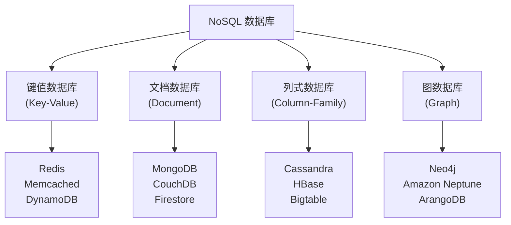
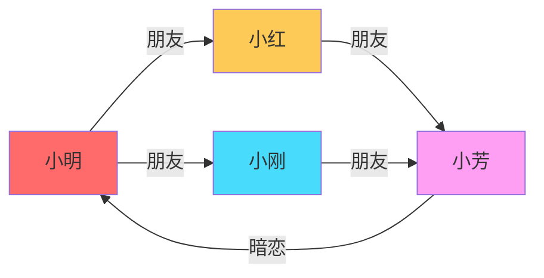
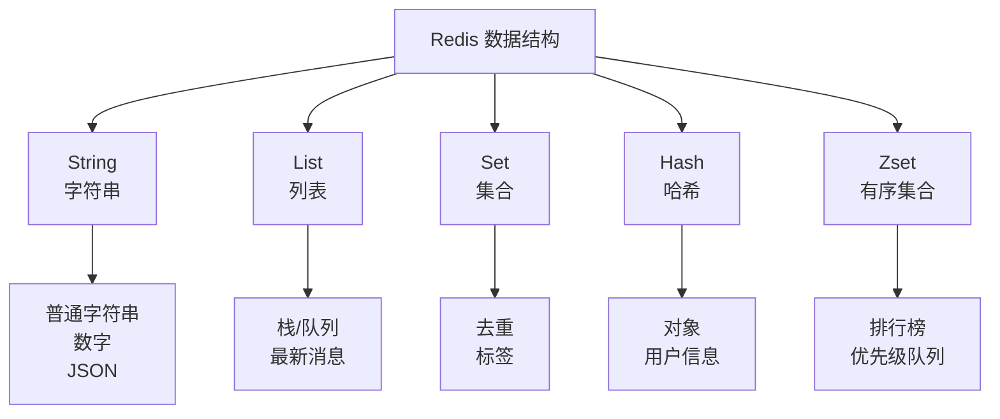
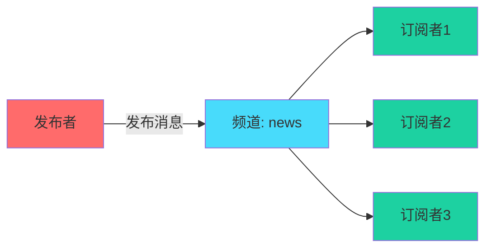
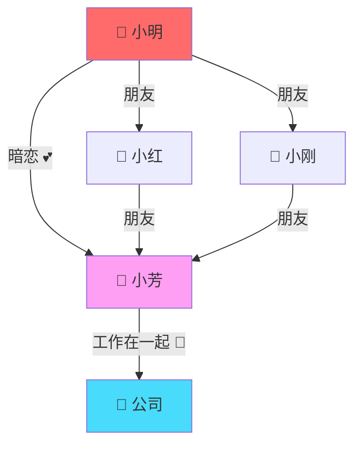

+++
title = "第31章 NoSQL"
weight = 310
date = "2026-04-08T13:22:00+08:00"
type = "docs"
description = ""
isCJKLanguage = true
draft = false
+++

# 第三十一章 NoSQL：数据存储的"神仙打架"

> "世界上只有两种数据库：一种是还在用的，一种是已经翻车的。"
> —— 数据库江湖传说

想象一下，你是一个图书馆管理员。传统的关系型数据库就像是一个超级严谨的图书馆：每本书都有固定的位置、固定的分类、固定的编号。你想找一本书？好，先查目录，再按编号去找，一切都井井有条。

但是有一天，有人冲进来说："给我找所有跟'爱情'和'机器人'同时相关的书，还要按出版时间排序！"这时候，传统图书馆管理员可能得翻遍整个卡片柜……

NoSQL 数据库就是这个图书馆里的"超级英雄"——它们用完全不同的方式组织数据，让你在面对"疯狂"查询时依然能够优雅地找到答案。

## 31.1 NoSQL 概述

### 31.1.1 什么是 NoSQL

**NoSQL**（Not Only SQL）是一类不使用传统关系模型的数据库系统。它们的"崛起"要从 2000 年代末说起——那时候互联网数据爆炸，Facebook、Google 这些巨头每天产生海量的数据，传统的 SQL 数据库虽然可靠，但在扩展性上经常"掉链子"。

> **小白疑问**：NoSQL 是不是完全不用 SQL？
> 答：不完全是！"NoSQL"更准确的理解是 "Not Only SQL"，意思是"不仅仅是 SQL"。很多 NoSQL 数据库其实也支持 SQL 查询，只是它们不强制使用关系模型。

NoSQL 的核心优势：

| 特性 | SQL 数据库 | NoSQL 数据库 |
|------|-----------|-------------|
| 数据模型 | 关系模型（表、行、列） | 灵活多样的模型 |
| 扩展性 | 垂直扩展（升级服务器） | 水平扩展（增加服务器） |
| 事务 | 支持 ACID，强一致性 | 部分支持（如 MongoDB 事务），或提供可调一致性 |
| 查询语言 | SQL | 各有各的查询方式 |
| 适用场景 | 结构化数据、业务系统 | 大数据、高并发、灵活模型 |

用一个不恰当的比喻：
- **SQL 数据库** = 严谨的老教授，什么都要按规矩来
- **NoSQL 数据库** = 随性的艺术家，怎么方便怎么来

### 31.1.2 NoSQL 数据库分类

NoSQL 数据库家族庞大，按数据模型可以分为四大门派：



#### 1. 键值数据库（Key-Value Store）

**原理**：就像一个超级大的字典（Dictionary），每个 key 唯一对应一个 value。你知道 key，就能 O(1) 时间找到 value，快得跟闪电似的。

**代表**：Redis、DynamoDB、Memcached

**使用场景**：
- 缓存（把经常访问的数据放这儿）
- 会话管理（用户登录状态）
- 购物车（电商网站）
- 排行榜（游戏积分）

> **趣记**：键值数据库就像自助寄存柜。你存东西时领一个号码牌（key），取东西时凭号码牌来拿，简单粗暴又高效！

#### 2. 文档数据库（Document Store）

**原理**：数据以**文档**（Document）为单位存储，文档通常是 JSON 或 BSON 格式。每个文档可以有不同的字段，就像每个人的"自我介绍"可以完全不同。

**代表**：MongoDB、CouchDB、Firestore

**使用场景**：
- 内容管理系统（博客、新闻）
- 用户画像（每个用户属性不同）
- 实时分析
- 物联网数据存储

```json
// MongoDB 文档示例：一个"二次元宅男"的数据库记录
{
  "name": "小明",
  "age": 22,
  "hobbies": ["打游戏", "追番", "买手办"],
  "collection": {
    "手办数量": 47,
    "最喜欢": "血小板"
  },
  "今日心情": "明天老婆出血小板剧场版，开心！"
}
```

> **趣记**：文档数据库就像你的衣柜。T恤、裤子、袜子随便塞，每件衣服（文档）都可以有不同的"属性"，不用非得按固定格式摆放。

#### 3. 列式数据库（Column-Family Store）

**原理**：按**列**（Column）存储数据，而不是按行。听起来反直觉？想象一下 Excel：传统数据库按行读取（一个人的所有信息），列式数据库按列读取（一列所有人的年龄）。

**代表**：Cassandra、HBase、DynamoDB（也是列式的）

**使用场景**：
- 日志分析
- 时间序列数据（物联网传感器、金融行情）
- 大数据分析
- 需要高写入性能的场景

> **小白疑问**：为什么要按列存？
> 答：假设你想统计"所有用户的平均年龄"，行式数据库要读每个人的所有信息，而列式数据库直接读取"年龄"这一列——数据更紧凑，读取更快，压缩率更高！

#### 4. 图数据库（Graph Database）

**原理**：用"图"（Graph）的概念存储数据，节点（Node）代表实体，边（Edge）代表关系。就像你的微信好友关系网络——每个人是节点，好友关系是边。

**代表**：Neo4j、Amazon Neptune、ArangoDB

**使用场景**：
- 社交网络（推荐好友、分析影响力）
- 知识图谱
- 欺诈检测
- 路由优化（导航、物流）



> **趣记**：图数据库就是"六度空间理论"的完美实现——你和马斯克之间只隔着六个朋友关系！

---

## 31.2 Redis（内存数据库）

### 31.2.1 安装与 redis-py 使用

Redis 是"NoSQL界的网红"，全称 **REmote DIctionary Server**（远程字典服务器）。它是一个**内存数据库**，数据都存在内存里，所以读写速度飞快——每秒能处理上百万次操作！

> **警告**：Redis 是"内存怪兽"！如果你的数据比内存还大……要么加内存，要么哭。

#### 安装 Redis

**Windows 用户**（小声）：官方不推荐 Windows，但你可以用 WSL2 或者 Docker：

```bash
# Docker 启动 Redis（推荐）
docker run -d -p 6379:6379 --name my-redis redis:latest
```

**Linux/macOS 用户**：

```bash
# macOS
brew install redis
brew services start redis

# Ubuntu/Debian
sudo apt-get install redis-server
sudo systemctl start redis
```

验证 Redis 启动成功：

```bash
redis-cli ping
# 如果回复 PONG，说明 Redis 在正常工作！
```

#### Python 连接 Redis

安装 redis-py（Redis 的 Python 客户端）：

```bash
pip install redis
```

连接 Redis 并进行基本操作：

```python
import redis

# 建立连接（默认 host=localhost, port=6379）
r = redis.Redis(host='localhost', port=6379, db=0, decode_responses=True)

# 测试连接：ping 一下
result = r.ping()
print(result)  # True

# 存储一个字符串
r.set('nickname', '小明的宝藏')
value = r.get('nickname')
print(value)  # 小明的宝藏

# 设置过期时间（秒）- 模拟"限时优惠"
r.setex('flash_sale', 60, '打五折！')  # 60秒后自动消失

# 查看剩余时间
ttl = r.ttl('flash_sale')
print(f'还剩 {ttl} 秒')  # 还剩 XX 秒

# 批量存储
r.mset({'food': '火锅', 'drink': '奶茶', 'dessert': '蛋糕'})
values = r.mget(['food', 'drink', 'dessert'])
print(values)  # ['火锅', '奶茶', '蛋糕']

# 删除键
r.delete('dessert')
exists = r.exists('dessert')
print(exists)  # 0（不存在了）
```

> **小白疑问**：为什么叫"字典服务器"？
> 答：Redis 内部存储数据的基本方式就是"键-值对"（Key-Value），这跟 Python 的字典（Dictionary）完全一样！所以叫"远程字典服务器"——只是这个字典大得可以放在服务器上，让很多人同时用。

### 31.2.2 数据结构（String / List / Set / Hash / Zset）

Redis 之所以强大，不仅因为快，还因为它的"值"可以是多种数据结构！普通键值数据库的值只能是字符串，但 Redis 的值可以是：



#### 1. String（字符串）

最基本的数据类型，可以存储任何字符串（包括序列化的 JSON）：

```python
import redis
import json

r = redis.Redis(decode_responses=True)

# 基本操作
r.set('greeting', '你好，世界！')
print(r.get('greeting'))  # 你好，世界！

# 数字操作（Redis 会智能识别数字字符串）
r.set('counter', 100)
r.incr('counter')        # +1 → 101
r.incrby('counter', 5)   # +5 → 106
r.decrby('counter', 3)   # -3 → 103
print(r.get('counter'))  # 103

# 存储 Python 对象（序列化）
user = {
    'name': '小明',
    'level': 99,
    'items': ['圣剑', '复活草', '金苹果']
}
r.set('player:1', json.dumps(user))
saved_user = json.loads(r.get('player:1'))
print(saved_user['items'])  # ['圣剑', '复活草', '金苹果']
```

#### 2. List（列表）

可以理解为一个**双向链表**，支持在头尾插入、按索引访问。常用于消息队列、最新动态等功能：

```python
r = redis.Redis(decode_responses=True)

# 清空测试（每次运行前清理）
r.delete('chatroom')

# 从右边（尾）插入消息
r.rpush('chatroom', '小明: 有人一起开黑吗？')
r.rpush('chatroom', '小红: 我我我！')
r.rpush('chatroom', '小刚: 等我5分钟！')

# 查看列表长度
length = r.llen('chatroom')
print(f'群里有 {length} 条消息')  # 群里有 3 条消息

# 查看所有消息
messages = r.lrange('chatroom', 0, -1)  # 0 到 -1 表示全部
for msg in messages:
    print(msg)
# 小明: 有人一起开黑吗？
# 小红: 我我我！
# 小刚: 等我5分钟！

# 从左边（头）插入
r.lpush('chatroom', '系统: 欢迎来到游戏群！')
print(r.lrange('chatroom', 0, -1))
# ['系统: 欢迎来到游戏群！', '小明: 有人一起开黑吗？', ...]

# 按索引获取
first_msg = r.lindex('chatroom', 0)
print(f'第一条消息: {first_msg}')  # 第一条消息: 系统: 欢迎来到游戏群！

# 模拟消息队列（BLPOP 阻塞式弹出）
# r.blpop('queue', timeout=5)  # 队列为空时阻塞等待
```

> **趣记**：List 的 LPUSH/RPOP 组合 = **栈**（后进先出）；LPUSH/LPOP 组合 = **队列**（先进先出）。想象餐厅取餐：最后做好的披萨放在最上面（LPUSH），服务员从上面取（LPOP）——这就是栈！如果是排队买奶茶，那就是队列。

#### 3. Set（集合）

**无序**、**唯一**（自动去重）。适合存储标签、共同好友等场景：

```python
r = redis.Redis(decode_responses=True)

# 清空测试
r.delete('tags:python', 'tags:javascript', 'users:1:friends', 'users:2:friends')

# 存储文章标签
r.sadd('tags:python', 'FastAPI', 'Django', '爬虫', '机器学习')
r.sadd('tags:javascript', 'React', 'Vue', 'Node.js', '爬虫')

# 获取所有标签
tags = r.smembers('tags:python')
print(tags)  # {'FastAPI', 'Django', '爬虫', '机器学习'}

# 检查是否存在
is_member = r.sismember('tags:python', '爬虫')
print(f'爬虫在 Python 标签里吗？{is_member}')  # True

# 获取集合大小（有多少标签）
count = r.scard('tags:python')
print(f'Python 有 {count} 个标签')  # Python 有 4 个标签

# 求交集（两门语言都涉及的标签）
common = r.sinter('tags:python', 'tags:javascript')
print(f'两门语言共同的标签: {common}')  # {'爬虫'}

# 模拟"共同好友"功能
r.sadd('users:1:friends', 'Alice', 'Bob', 'Charlie', 'David')
r.sadd('users:2:friends', 'Bob', 'David', 'Eve', 'Frank')

mutual = r.sinter('users:1:friends', 'users:2:friends')
print(f'共同好友: {mutual}')  # {'Bob', 'David'}

# 随机抽取一个（抽奖算法）
winner = r.srandmember('users:1:friends')
print(f'恭喜 {winner} 中奖！')
```

#### 4. Hash（哈希）

存储**对象**的神器！相当于 Python 的 `dict`，每个 hash 可以存储多个字段：

```python
r = redis.Redis(decode_responses=True)

# 清空测试
r.delete('user:1001')

# 存储用户信息（Hash 就像一个"小表格"）
r.hset('user:1001', mapping={
    'name': '小明',
    'age': '22',
    'city': '北京',
    'balance': '9999.99'
})

# 获取单个字段
name = r.hget('user:1001', 'name')
print(f'用户名: {name}')  # 用户名: 小明

# 获取所有字段和值
user_info = r.hgetall('user:1001')
print(user_info)
# {'name': '小明', 'age': '22', 'city': '北京', 'balance': '9999.99'}

# 检查字段是否存在
exists = r.hexists('user:1001', 'email')
print(f'有邮箱吗？{exists}')  # False

# 增加余额（ hincrbyfloat 适用于数字类型字段）
r.hincrbyfloat('user:1001', 'balance', 0.01)
print(r.hget('user:1001', 'balance'))  # 10000.0

# 删除字段
r.hdel('user:1001', 'city')

# 获取所有字段名
fields = r.hkeys('user:1001')
print(f'字段列表: {fields}')  # ['name', 'age', 'balance']
```

> **小白对比**：Hash vs String（存 JSON）
> - `set('user', json.dumps({...}))`：一次操作整个对象，读写都要序列化/反序列化
> - `hset('user', field, value)`：可以单独操作某个字段，更灵活
> - 简单理解：String = 把你家整个打包，Hash = 把东西一件件摆出来

#### 5. Zset（有序集合）

每个元素都有个**分数**（score），Redis 按分数排序。常用于**排行榜**功能：

```python
r = redis.Redis(decode_responses=True)

# 清空测试
r.delete('game:leaderboard')

# 添加玩家分数
r.zadd('game:leaderboard', {
    '小明': 9800,
    '小红': 10200,
    '小刚': 8700,
    '学霸': 15000,
    '肝帝': 12500
})

# 获取排名（0 是第一名）
rank = r.zrevrank('game:leaderboard', '小明')  # zrevrank 是降序排名
print(f'小明的排名: 第 {rank + 1} 名')  # 第 3 名（因为有学霸和肝帝在他前面）

# 获取前3名
top3 = r.zrevrange('game:leaderboard', 0, 2, withscores=True)
print('🏆 前3名:')
for i, (name, score) in enumerate(top3, 1):
    print(f'  {i}. {name}: {int(score)}')
# 1. 学霸: 15000
# 2. 肝帝: 12500
# 3. 小明: 9800

# 获取指定分数区间的玩家（8000-11000分）
range_players = r.zrangebyscore('game:leaderboard', 8000, 11000, withscores=True)
print('8000-11000分的玩家:', [(n, int(s)) for n, s in range_players])

# 查询某人的分数
score = r.zscore('game:leaderboard', '小红')
print(f'小红分数: {int(score)}')  # 10200

# 小红超常发挥，加分！
r.zincrby('game:leaderboard', 500, '小红')
print(f'更新后小红排名: 第 {r.zrevrank("game:leaderboard", "小红") + 1} 名')
```

> **游戏公司**：排行榜用 Zset 实现？太对了！Redis 的 Zset 是有序集合，所有操作都是 O(log N) 级别，加分、查排名都是毫秒级响应。某游戏公司："我们的服务器能同时支持100万人查排行榜！"——就靠 Redis。

### 31.2.3 事务与管道

#### 事务（Transaction）

Redis 的事务跟关系型数据库的事务不太一样——它是**命令批量执行**，不保证原子性（不会自动回滚）。用 `MULTI` 开始，`EXEC` 执行：

```python
import redis

r = redis.Redis(decode_responses=True)

# 模拟转账：小明 -> 小红，扣100，加100
# 正常流程
r.delete('account:xm', 'account:xh')
r.set('account:xm', 1000)
r.set('account:xh', 500)

# 开启事务
pipe = r.pipeline()
pipe.get('account:xm')
pipe.get('account:xh')
results = pipe.execute()
print(f'转账前 - 小明: {results[0]}, 小红: {results[1]}')
# 转账前 - 小明: 1000, 小红: 500

# 真正的转账操作（管道方式）
pipe2 = r.pipeline()
pipe2.decrby('account:xm', 100)  # 小明扣100
pipe2.incrby('account:xh', 100)  # 小红加100
pipe2.execute()

print(f'转账后 - 小明: {r.get("account:xm")}, 小红: {r.get("account:xh")}')
# 转账后 - 小明: 900, 小红: 600
```

> **警告**：Redis 事务不自动回滚！如果中途命令出错，**已执行的部分不会撤回**，所以复杂业务逻辑建议用 Lua 脚本或者用 `WATCH` 实现乐观锁。

#### 管道（Pipeline）

管道是 Redis 的**性能优化**！正常情况下，每次命令都是一次"请求-响应"。管道可以一次性发送多个命令，Redis 批量处理后再一起返回结果，大幅减少网络往返次数（RTT）：

```python
import redis
import time

r = redis.Redis(decode_responses=True)

# 模拟场景：插入1000个用户信息
r.delete('pipeline:test')

# ❌ 不使用管道：1000次网络往返
start = time.time()
for i in range(1000):
    r.hset(f'user:{i}', mapping={'name': f'用户{i}', 'score': i})
no_pipeline_time = time.time() - start
print(f'不用管道耗时: {no_pipeline_time:.2f}秒')

# ✅ 使用管道：1次网络往返
start = time.time()
pipe = r.pipeline()
for i in range(1000):
    pipe.hset(f'user:{i}', mapping={'name': f'用户{i}', 'score': i})
pipe.execute()
pipeline_time = time.time() - start
print(f'使用管道耗时: {pipeline_time:.2f}秒')

print(f'管道加速: {no_pipeline_time / pipeline_time:.1f}x')
# 加速效果感人！
```

> **小白理解**：想象你要寄100封信给同一栋楼。不使用管道 = 跑一次楼梯，寄一封，再跑一次……使用管道 = 一次性拿100封信，下楼一次，全寄了！

### 31.2.4 发布/订阅

Redis 的 **Pub/Sub**（Publish/Subscribe）是一种**消息传递模式**。发布者往"频道"发消息，订阅者监听频道，收到消息后处理。



**典型使用场景**：
- 聊天应用（群聊、实时消息）
- 消息通知系统
- 实时数据广播（股票行情、比赛得分）
- 微服务间的异步通信

```python
import redis
import threading

# 两个场景：一个发布者，一个订阅者

# === 订阅者代码 ===
def subscriber():
    r = redis.Redis(decode_responses=True)
    pubsub = r.pubsub()
    
    # 订阅频道（可以订阅多个）
    pubsub.subscribe('news', 'sports', 'jokes')
    print('📡 订阅者已启动，等待消息...')
    
    # 监听消息
    for message in pubsub.listen():
        if message['type'] == 'message':
            channel = message['channel']
            content = message['data']
            print(f'📩 [{channel}] {content}')

# === 发布者代码 ===
def publisher():
    r = redis.Redis(decode_responses=True)
    
    # 发布消息到频道
    messages = [
        ('news', '突发！Python 6.0 发布了！'),
        ('sports', '中国乒乓球队又夺冠了！'),
        ('jokes', '为什么程序员总是分不清万圣节和圣诞节？因为 Oct 31 = Dec 25'),
        ('news', '等等，刚才那条是愚人节玩笑...'),
    ]
    
    for channel, msg in messages:
        r.publish(channel, msg)
        print(f'📤 已发布到 [{channel}]: {msg}')

# 启动订阅者线程
sub_thread = threading.Thread(target=subscriber, daemon=True)
sub_thread.start()

# 等待订阅者就绪
import time
time.sleep(0.5)

# 发布消息
publisher()
```

> **趣记**：Pub/Sub 就像电视台和观众。电视台（发布者）在 CCTV-1（频道）播出新闻，观众（订阅者）调到 CCTV-1 就能看到。问题是——如果你在换台（订阅中）的时候播了什么，你就看不到了（不保证送达）！

> **补充**：Redis Pub/Sub 是"fire-and-forget"（发完即忘）模式，消息不持久化。如果订阅者掉线了，期间的消息就丢了。对于需要可靠消息传递的场景，建议用 Redis 的 Stream 数据结构（一种更强大的消息队列）。

---

## 31.3 MongoDB（文档数据库）

### 31.3.1 安装与 pymongo 使用

MongoDB 是**文档数据库**的"扛把子"，数据以 **BSON**（Binary JSON）格式存储。它不像关系数据库那样需要预先定义表结构（Schema），每个文档（Document）可以有不同的字段，非常灵活！

> **趣记**：MongoDB 的名字来自 "huMONGOus"（巨大的），确实，它能存储巨量数据。发音是"MONG-OH-DEE"，不是"MANGO-DB"（虽然 mango 也挺好吃的）。

#### 安装 MongoDB

**Docker 方式（最简单）**：

```bash
docker run -d -p 27017:27017 --name my-mongo mongo:latest
```

**本地安装**：
- Windows：去官网下载.msi 安装包
- macOS：`brew install mongodb-community`
- Ubuntu：`sudo apt install mongodb`

#### Python 连接 MongoDB

安装 pymongo（MongoDB 的 Python 驱动）：

```bash
pip install pymongo
```

连接并基本操作：

```python
from pymongo import MongoClient

# 连接 MongoDB（默认 localhost:27017）
client = MongoClient('mongodb://localhost:27017/')

# 创建/切换数据库（如果不存在会自动创建）
db = client['my_first_mongodb']

# 创建/获取集合（Collection，相当于表）
collection = db['users']

# 清空测试数据
collection.delete_many({})

# ========== 插入文档 ==========

# 插入一个文档（相当于 SQL 的 INSERT）
user = {
    'name': '小明',
    'age': 22,
    'hobbies': ['游戏', '动漫', '编程'],
    'address': {
        'city': '北京',
        'district': '海淀区'
    }
}
result = collection.insert_one(user)  # insert_one 返回 InsertOneResult
print(f'插入的文档 ID: {result.inserted_id}')

# 插入多个文档
users = [
    {'name': '小红', 'age': 20, 'hobbies': ['唱歌', '跳舞']},
    {'name': '小刚', 'age': 25, 'hobbies': ['篮球', '足球'], 'score': 95},
    {'name': '小芳', 'age': 19, 'hobbies': ['绘画', '游戏'], 'score': 88},
]
result = collection.insert_many(users)
print(f'插入了 {len(result.inserted_ids)} 个文档')

# ========== 查询文档 ==========

# 查找一个（返回第一条）
first_user = collection.find_one({'name': '小明'})
print(f'找到用户: {first_user["name"]}, 年龄: {first_user["age"]}')

# 查找所有（返回游标）
all_users = collection.find({'age': {'$gte': 20}})  # 年龄 >= 20
print('20岁及以上的用户:')
for user in all_users:
    print(f'  - {user["name"]}, {user["age"]}岁')

# 统计数量
count = collection.count_documents({})
print(f'总用户数: {count}')

# ========== 更新文档 ==========

# 更新一个
collection.update_one(
    {'name': '小明'},
    {'$set': {'age': 23, 'status': 'active'}}
)
updated_user = collection.find_one({'name': '小明'})
print(f'小明更新后年龄: {updated_user["age"]}')

# 更新多个（给所有年龄 < 22 的用户加个标签）
collection.update_many(
    {'age': {'$lt': 22}},
    {'$set': {'tag': '年轻人'}}
)

# ========== 删除文档 ==========

# 删除一个
collection.delete_one({'name': '小刚'})

# 删除所有带 tag 的
collection.delete_many({'tag': '年轻人'})

# 最终剩余用户
remaining = list(collection.find())
print(f'剩余用户数: {len(remaining)}')
for u in remaining:
    print(f'  - {u["name"]}')
```

> **小白疑问**：MongoDB 里的"_id"是什么？
> 答：`_id` 是每个文档的主键（Primary Key），自动生成，类型是 ObjectId。类似 SQL 的自增 ID，但更强大——它是"分布式友好"的，包含了时间戳、机器标识等信息，在分片集群环境下也能保证唯一性。

### 31.3.2 CRUD 操作

MongoDB 的 CRUD（Create, Read, Update, Delete）非常灵活，因为它基于**文档**，可以直接存储嵌套对象、数组等复杂结构。

#### 高级查询

```python
from pymongo import MongoClient, ASCENDING, DESCENDING

client = MongoClient('mongodb://localhost:27017/')
db = client['school']
students = db['students']

# 插入测试数据
students.delete_many({})
students.insert_many([
    {'name': '张三', 'math': 85, 'english': 92, 'class': 'A'},
    {'name': '李四', 'math': 96, 'english': 88, 'class': 'A'},
    {'name': '王五', 'math': 72, 'english': 95, 'class': 'B'},
    {'name': '赵六', 'math': 88, 'english': 76, 'class': 'B'},
    {'name': '钱七', 'math': 91, 'english': 89, 'class': 'A'},
])

# ========== 各种查询条件 ==========

# 比较运算符: $gt, $gte, $lt, $lte, $ne, $eq
high_math = list(students.find({'math': {'$gte': 90}}))
print('数学90分以上的同学:')
for s in high_math:
    print(f'  {s["name"]}: {s["math"]}')

# 逻辑运算符: $and, $or, $not
# 语文 > 85 且 数学 > 85 的同学
good_students = list(students.find({
    '$and': [
        {'math': {'$gt': 85}},
        {'english': {'$gt': 85}}
    ]
}))
print('数学和英语都 > 85:')
for s in good_students:
    print(f'  {s["name"]}')

# 数组查询: $in, $all, $size
students.insert_many([
    {'name': '孙八', 'tags': ['学霸', '班干部']},
    {'name': '周九', 'tags': ['学霸', '体育健将', '班干部']},
    {'name': '吴十', 'tags': ['学渣']},
])
# 找有"学霸"标签的学生
scholars = list(students.find({'tags': '学霸'}))
print('学霸们:', [s['name'] for s in scholars])

# 嵌套字段查询
print('\n嵌套查询示例（假设有地址信息）:')
users = db['users']
users.delete_many({})
users.insert_one({
    'name': '小明明',
    'address': {'city': '北京', 'street': '中关村大街1号'}
})
found = users.find_one({'address.city': '北京'})
print(f'住在北京的: {found["name"]}')

# 排序（1 升序，-1 降序）
print('\n按数学成绩排名:')
ranked = students.find().sort('math', DESCENDING)
for i, s in enumerate(ranked, 1):
    avg = (s.get('math', 0) + s.get('english', 0)) / 2
    print(f'  {i}. {s["name"]}: 数学{s.get("math", "N/A")}, 英语{s.get("english", "N/A")}, 均分{avg:.1f}')

# 分页查询（skip + limit）
print('\n分页：第2页，每页2条')
page2 = students.find().sort('math', DESCENDING).skip(2).limit(2)
for s in page2:
    print(f'  {s["name"]}: {s.get("math", "N/A")}')
```

#### 高级更新

```python
from pymongo import MongoClient, UpdateOne

client = MongoClient('mongodb://localhost:27017/')
db = client['game']
players = db['players']

# 清空并插入测试数据
players.delete_many({})
players.insert_many([
    {'name': '小明', 'level': 50, 'gold': 1000, 'items': ['木剑', '血瓶']},
    {'name': '小红', 'level': 30, 'gold': 500, 'items': ['匕首']},
    {'name': '小刚', 'level': 99, 'gold': 50000, 'items': ['圣剑', '复活草', '龙鳞']},
])

# $set - 更新字段
players.update_one({'name': '小明'}, {'$set': {'level': 51}})

# $inc - 增减字段
players.update_one({'name': '小明'}, {'$inc': {'gold': 100}})  # 金币 +100

# $push - 向数组添加元素
players.update_one({'name': '小明'}, {'$push': {'items': '铁剑'}})

# $pull - 从数组删除元素
players.update_one({'name': '小刚'}, {'$pull': {'items': '复活草'}})

# $addToSet - 添加（不重复）
players.update_one({'name': '小明'}, {'$addToSet': {'items': '铁剑'}})  # 已有，不会重复添加
players.update_one({'name': '小明'}, {'$addToSet': {'items': '盾牌'}})

# $rename - 重命名字段
players.update_one({'name': '小刚'}, {'$rename': {'gold': 'coins'}})

# 批量更新（高效！）
# 给指定的玩家每人发100金币
bulk_updates = [
    UpdateOne({'name': '小明'}, {'$inc': {'gold': 100}}),
    UpdateOne({'name': '小红'}, {'$inc': {'gold': 100}}),
]
result = players.bulk_write(bulk_updates)
print(f'批量更新: 修改了 {result.modified_count} 个文档')

# 展示最终结果
print('\n最终玩家数据:')
for p in players.find():
    print(f'  {p["name"]}: Lv.{p["level"]}, 金币:{p.get("gold", p.get("coins", "N/A"))}, 物品:{p.get("items", [])}')
```

### 31.3.3 聚合管道

MongoDB 的 **Aggregation Pipeline**（聚合管道）是它的"超级武器"。你可以把数据像流水线一样经过多个处理阶段，每个阶段对数据进行转换、过滤、分组、排序等操作，最终得到想要的结果。


**比喻**：想象一个汉堡生产线：
1. `$match`：只接收面包（过滤不要的数据）
2. `$group`：把相同类型的配料分组
3. `$project`：决定最终放哪些配料（投影）
4. `$sort`：按大小排序
5. `$limit`：只取前10个

```python
from pymongo import MongoClient

client = MongoClient('mongodb://localhost:27017/')
db = client['ecommerce']
orders = db['orders']

# 清空并插入测试数据
orders.delete_many({})
orders.insert_many([
    {'product': 'iPhone', 'category': '手机', 'price': 8000, 'quantity': 2, 'region': '华东'},
    {'product': 'MacBook', 'category': '电脑', 'price': 15000, 'quantity': 1, 'region': '华北'},
    {'product': 'AirPods', 'category': '配件', 'price': 1200, 'quantity': 5, 'region': '华东'},
    {'product': 'iPad', 'category': '平板', 'price': 5000, 'quantity': 3, 'region': '华南'},
    {'product': '小米手机', 'category': '手机', 'price': 3000, 'quantity': 10, 'region': '华南'},
    {'product': '联想电脑', 'category': '电脑', 'price': 8000, 'quantity': 2, 'region': '华北'},
    {'product': '充电线', 'category': '配件', 'price': 50, 'quantity': 20, 'region': '华东'},
    {'product': '三星手机', 'category': '手机', 'price': 6000, 'quantity': 5, 'region': '华北'},
])

# ========== 示例1：按商品类别统计销售额 ==========
print('=== 示例1：按类别统计销售额 ===')
pipeline1 = [
    # 阶段1: 计算每笔订单的销售额
    {'$addFields': {'total': {'$multiply': ['$price', '$quantity']}}},
    # 阶段2: 按类别分组
    {'$group': {
        '_id': '$category',
        'total_sales': {'$sum': '$total'},
        'order_count': {'$sum': 1}
    }},
    # 阶段3: 按销售额降序排序
    {'$sort': {'total_sales': -1}},
    # 阶段4: 重命名输出字段
    {'$project': {
        '_id': 0,
        'category': '$_id',
        'total_sales': 1,
        'order_count': 1
    }}
]

for result in orders.aggregate(pipeline1):
    print(f"  {result['category']}: 销售额 ¥{result['total_sales']:,}, 订单数 {result['order_count']}")

# ========== 示例2：找出销售额超过3万的地区 ==========
print('\n=== 示例2：销售额超过3万的地区 ===')
pipeline2 = [
    {'$addFields': {'total': {'$multiply': ['$price', '$quantity']}}},
    {'$group': {
        '_id': '$region',
        'total_sales': {'$sum': '$total'}
    }},
    {'$match': {'total_sales': {'$gt': 30000}}},
    {'$sort': {'total_sales': -1}}
]

for result in orders.aggregate(pipeline2):
    print(f"  {result['_id']}: ¥{result['total_sales']:,}")

# ========== 示例3：计算平均订单价值 ==========
print('\n=== 示例3：计算平均订单价值 ===')
pipeline3 = [
    {'$addFields': {'total': {'$multiply': ['$price', '$quantity']}}},
    {'$group': {
        '_id': None,  # None 表示不分组，整体作为一组
        'avg_order_value': {'$avg': '$total'},
        'max_order': {'$max': '$total'},
        'min_order': {'$min': '$total'},
        'total_revenue': {'$sum': '$total'}
    }},
    {'$project': {
        '_id': 0,
        'avg_order_value': {'$round': ['$avg_order_value', 2]},
        'max_order': 1,
        'min_order': 1,
        'total_revenue': 1
    }}
]

result = list(orders.aggregate(pipeline3))[0]
print(f"  平均订单价值: ¥{result['avg_order_value']:,}")
print(f"  最高订单: ¥{result['max_order']:,}")
print(f"  最低订单: ¥{result['min_order']:,}")
print(f"  总收入: ¥{result['total_revenue']:,}")

# ========== 示例4：$lookup（关联查询，类似 SQL 的 JOIN） ==========
print('\n=== 示例4：$lookup 关联查询 ===')

# 创建两个集合：订单和客户
customers = db['customers']
customers.delete_many({})
customers.insert_many([
    {'_id': 'C001', 'name': '张三', 'vip_level': 'gold'},
    {'_id': 'C002', 'name': '李四', 'vip_level': 'silver'},
    {'_id': 'C003', 'name': '王五', 'vip_level': 'gold'},
])

order_customers = db['order_customers']
order_customers.delete_many({})
order_customers.insert_many([
    {'order_id': 'O001', 'customer_id': 'C001', 'product': 'iPhone', 'amount': 8000},
    {'order_id': 'O002', 'customer_id': 'C002', 'product': 'MacBook', 'amount': 15000},
    {'order_id': 'O003', 'customer_id': 'C001', 'product': 'AirPods', 'amount': 1200},
    {'order_id': 'O004', 'customer_id': 'C003', 'product': 'iPad', 'amount': 5000},
])

# 关联查询：把订单和客户信息合并
lookup_pipeline = [
    {
        '$lookup': {
            'from': 'customers',           # 要关联的集合
            'localField': 'customer_id',   # 本集合的字段
            'foreignField': '_id',         # 关联集合的字段
            'as': 'customer_info'          # 输出字段名
        }
    },
    {'$unwind': '$customer_info'},  # 展开数组（lookup 结果是数组）
    {
        '$project': {
            '_id': 0,
            'order_id': 1,
            'product': 1,
            'amount': 1,
            'customer_name': '$customer_info.name',
            'vip_level': '$customer_info.vip_level'
        }
    }
]

print("  订单及客户信息:")
for order in order_customers.aggregate(lookup_pipeline):
    vip_tag = '👑' if order['vip_level'] == 'gold' else ''
    print(f"    {order['order_id']}: {order['product']} ¥{order['amount']:,} - {order['customer_name']} {vip_tag}")
```

> **小白疑问**：聚合管道为什么要叫"管道"？
> 答：数据从左边进去，经过一系列"管道"处理，从右边出来。每一节管道可以对数据做不同操作，多个管道串联起来就形成了完整的处理流水线。很像 Unix 的 `|` 管道符！

---

## 31.4 其他 NoSQL 数据库

### 31.4.1 Elasticsearch（全文搜索）

**Elasticsearch**（简称 ES）是一个基于 **Lucene** 的**全文搜索和分析引擎**。它最擅长的就是：从海量文本中快速找到你想要的内容。

> **趣记**：Elasticsearch 的 Logo 是一个五颜六色的"狗爪印"（误）。实际上它代表分布式、多个节点协同工作的意思。但如果你搜索"ES"太多次，你的输入法可能会以为你在找"ES"……

**核心概念**：
- **Index（索引）**：相当于关系数据库的"数据库"
- **Document（文档）**：相当于关系数据库的"行"
- **Type（类型）**：在 Index 下的分类（ES 7.x 后已废弃，默认为 `_doc`）
- **倒排索引（Inverted Index）**：ES 搜索的核心，就像书的目录——不是从内容找关键词，而是从关键词找到内容所在位置

**典型使用场景**：
- 搜索引擎（百度、Google 那种）
- 日志分析（ELK 栈：Elasticsearch + Logstash + Kibana）
- 应用性能监控
- 安全分析

```python
# 安装：pip install elasticsearch
# 注意：ES 需要运行中的集群，以下代码为 API 演示

from elasticsearch import Elasticsearch

# 连接 ES（默认 localhost:9200）
es = Elasticsearch(['http://localhost:9200/'])

# 检查集群健康状态
health = es.cluster.health()
print(f"集群状态: {health['status']}")  # green/yellow/red

# ========== 索引操作 ==========

# 创建索引（设置分词器）
es.indices.delete(index='blog', ignore=[400, 404])  # 先删除（如果存在）
es.indices.create(index='blog', body={
    'settings': {
        'number_of_shards': 1,
        'number_of_replicas': 0,
        'analysis': {
            'analyzer': {
                'my_analyzer': {
                    'type': 'standard',  # 此处使用 standard 分词器，生产环境可换 IK 等中文分词器
                }
            }
        }
    },
    'mappings': {
        'properties': {
            'title': {'type': 'text', 'analyzer': 'standard'},
            'content': {'type': 'text', 'analyzer': 'standard'},
            'author': {'type': 'keyword'},  # keyword 不分词，精确匹配
            'publish_date': {'type': 'date'},
            'views': {'type': 'integer'}
        }
    }
})
print('索引 blog 创建成功')

# ========== 文档操作 ==========

# 插入文档
doc = {
    'title': 'Python 异步编程完全指南',
    'content': '本文详细介绍 asyncio、aiohttp、await、async 等关键字的用法...',
    'author': '小明',
    'publish_date': '2024-01-15',
    'views': 5000
}
result = es.index(index='blog', id=1, body=doc)
print(f'文档创建: {result["result"]}')

# 批量插入
bulk_docs = [
    {'title': 'Redis 缓存实战', 'content': 'Redis 是高性能的内存数据库...', 'author': '小红', 'views': 3000},
    {'title': 'MongoDB 入门', 'content': 'MongoDB 是最流行的 NoSQL 文档数据库...', 'author': '小刚', 'views': 2500},
    {'title': 'Python 异步编程', 'content': 'asyncio 是 Python 异步编程的核心库...', 'author': '小明', 'views': 8000},
]

# 构造 bulk 格式
bulk_body = []
for doc in bulk_docs:
    bulk_body.append({'index': {'_index': 'blog'}})
    bulk_body.append(doc)
es.bulk(body=bulk_body)
print('批量插入完成')

# ========== 搜索操作 ==========

# 全文搜索：搜索包含"Python 异步"的文章
query = {
    'query': {
        'multi_match': {
            'query': 'Python 异步',
            'fields': ['title^2', 'content'],  # title 权重更高
            'type': 'best_fields'
        }
    },
    'highlight': {
        'fields': {
            'title': {},
            'content': {'fragment_size': 100}
        }
    },
    'sort': [{'views': 'desc'}]
}

results = es.search(index='blog', body=query)
print(f'\n找到 {results["hits"]["total"]["value"]} 篇相关文章:')
for hit in results['hits']['hits']:
    print(f'  - [{hit["_source"]["author"]}] {hit["_source"]["title"]}')
    print(f'    匹配片段: {hit.get("highlight", {})}')
    print(f'    得分: {hit["_score"]:.2f}, 阅读量: {hit["_source"]["views"]}')

# ========== 聚合分析 ==========

# 按作者统计文章数和总阅读量
agg_query = {
    'size': 0,  # 不返回文档，只返回聚合结果
    'aggs': {
        'by_author': {
            'terms': {'field': 'author'},
            'aggs': {
                'total_views': {'sum': {'field': 'views'}},
                'avg_views': {'avg': {'field': 'views'}}
            }
        }
    }
}

agg_results = es.search(index='blog', body=agg_query)
print('\n各作者统计:')
for bucket in agg_results['aggregations']['by_author']['buckets']:
    print(f"  {bucket['key']}: {bucket['doc_count']} 篇文章, "
          f"总阅读 {int(bucket['total_views']['value'])}, "
          f"平均 {int(bucket['avg_views']['value'])}")
```

### 31.4.2 Neo4j（图数据库）

**Neo4j** 是最流行的**图数据库**，它用"图"的结构存储数据。核心概念超级简单：
- **节点（Node）**：代表实体（人、地点、物品……）
- **关系（Relationship）**：连接两个节点，表示它们之间的联系
- **属性（Property）**：节点和关系都可以有属性



**为什么需要图数据库？**
假设你想找"小明 -> 小芳的共同好友的朋友圈子里，有谁暗恋小芳？"这种多跳关系，用 SQL 要写几十行 JOIN，用图数据库只要几行：

```cypher
MATCH (xiaoming:Person {name:'小明'})-[:FRIEND*1..2]-(friend)-[:FRIEND]-(mutual)
WHERE (friend)-[:CRUSH]->(mutual)
RETURN mutual.name
```

```python
# 安装：pip install neo4j
from neo4j import GraphDatabase

# 连接 Neo4j（默认 bolt://localhost:7687）
# 注意：需要先安装并启动 Neo4j，创建数据库和用户
uri = 'bolt://localhost:7687'
username = 'neo4j'
password = 'your_password'

driver = GraphDatabase.driver(uri, auth=(username, password))

def execute_query(query, parameters=None):
    """执行查询的辅助函数"""
    with driver.session() as session:
        result = session.run(query, parameters)
        return list(result)

# ========== 创建数据 ==========

# 清除测试数据
execute_query('MATCH (n) DETACH DELETE n')

# 创建人物节点
execute_query('''
CREATE 
  (xiaoming:Person {name: '小明', age: 22, job: '程序员'}),
  (xiaohong:Person {name: '小红', age: 21, job: '设计师'}),
  (xiaogang:Person {name: '小刚', age: 23, job: '产品经理'}),
  (xiaofang:Person {name: '小芳', age: 22, job: '运营'}),
  (laowang:Person {name: '老王', age: 35, job: 'CTO'}),
  (company:Company {name: '某某科技', type: '互联网'})
''')

# 创建关系
execute_query('''
MATCH 
  (xm:Person {name: '小明'}),
  (xh:Person {name: '小红'}),
  (xg:Person {name: '小刚'}),
  (xf:Person {name: '小芳'}),
  (lw:Person {name: '老王'}),
  (c:Company {name: '某某科技'})
CREATE
  (xm)-[:FRIEND]->(xh),
  (xm)-[:FRIEND]->(xg),
  (xh)-[:FRIEND]->(xf),
  (xg)-[:FRIEND]->(xf),
  (xf)-[:FRIEND]->(lw),
  (xf)-[:WORKS_AT]->(c),
  (lw)-[:WORKS_AT]->(c),
  (xm)-[:CRUSH]->(xf),
  (lw)-[:MANAGES]->(c)
''')

print('数据创建完成！')

# ========== 查询示例 ==========

# 查询1：小明的所有朋友
print('\n=== 小明的朋友 ===')
result = execute_query('''
MATCH (xiaoming:Person {name: '小明'})-[:FRIEND]-(friend)
RETURN friend.name AS name, friend.job AS job
''')
for record in result:
    print(f"  {record['name']} - {record['job']}")

# 查询2：小芳的朋友圈（朋友的朋友）
print('\n=== 小芳的朋友圈 ===')
result = execute_query('''
MATCH (xf:Person {name: '小芳'})-[:FRIEND*1..2]-(someone)
WHERE xf <> someone
RETURN DISTINCT someone.name AS name, someone.job AS job
''')
for record in result:
    print(f"  {record['name']} - {record['job']}")

# 查询3：谁在"某某科技"工作？
print('\n=== 某某科技的所有员工 ===')
result = execute_query('''
MATCH (person:Person)-[:WORKS_AT]->(c:Company {name: '某某科技'})
RETURN person.name AS name, person.job AS job
''')
for record in result:
    print(f"  {record['name']} - {record['job']}")

# 查询4：社交网络分析 - 找出"中间人"（认识不直接相连的两个人）
print('\n=== 社交网络中的"中间人" ===')
result = execute_query('''
MATCH (a:Person)-[:FRIEND]-(middle)-[:FRIEND]-(b:Person)
WHERE a.name < b.name
  AND NOT (a)-[:FRIEND]-(b)
WITH a, middle, b, count(*) AS commonFriends
WHERE commonFriends >= 1
RETURN a.name AS person1, middle.name AS broker, b.name AS person2, commonFriends
ORDER BY commonFriends DESC
''')
for record in result:
    print(f"  {record['person1']} 和 {record['person2']} 的中间人是 {record['broker']}（共同好友: {record['commonFriends']}）")

# 查询5：小明能否通过朋友认识 CTO？
print('\n=== 小明到 CTO 的关系路径 ===')
result = execute_query('''
MATCH path = shortestPath(
  (xm:Person {name: '小明'})-[:FRIEND*]-(cto:Person {job: 'CTO'})
)
RETURN path
''')
for record in result:
    # 解析路径
    path = record['path']
    nodes = list(path.nodes)
    relationships = list(path.relationships)
    
    print('  路径:', ' -> '.join([n['name'] for n in nodes]))
    print('  关系:', ' -- '.join([r.type for r in relationships]))

driver.close()
print('\n完成！')
```

> **趣记**：图数据库最厉害的地方在于"关系"查询。
> 
> 想象你在一个派对上，想找"朋友的朋友的朋友……直到找到 CTO"——这种事 SQL 做起来要命，关系稍微复杂一点就是灾难。但图数据库里，关系就是一条条"边"，找起来跟顺着绳子爬一样简单。

---

## 本章小结

### 核心要点回顾

| 知识点 | 关键内容 |
|--------|----------|
| **NoSQL 概述** | NoSQL = Not Only SQL，分为键值、文档、列式、图四大类 |
| **Redis** | 内存数据库，5种数据结构：String/List/Set/Hash/Zset，支持管道和 Pub/Sub |
| **MongoDB** | 文档数据库，BSON 格式存储，聚合管道功能强大 |
| **Elasticsearch** | 全文搜索引擎，倒排索引，适合海量文本检索和分析 |
| **Neo4j** | 图数据库，用节点和边存储关系，擅长社交网络分析 |

### NoSQL 数据库选择指南

```
我需要……
│
├─ 高性能缓存、会话管理、实时排行榜
│   └─ ✅ Redis（内存数据库，O(1) 读写）
│
├─ 存储灵活结构的文档（如用户画像、日志）
│   └─ ✅ MongoDB（文档数据库，无 Schema 约束）
│
├─ 海量数据写入、时间序列、写入密集型
│   └─ ✅ Cassandra/HBase（列式数据库，高写入）
│
├─ 全文搜索、日志分析、数据可视化
│   └─ ✅ Elasticsearch（ELK 栈核心）
│
├─ 社交关系、知识图谱、推荐系统
│   └─ ✅ Neo4j（图数据库）
```

### 面试加分项

> **面试官问**：Redis 为什么这么快？
> **答**：三个原因——① 数据存在内存，读写是纳秒级；② 单线程模型避免了锁竞争；③ I/O 多路复用（epoll），一个线程处理大量并发连接。

> **面试官问**：MongoDB 的聚合管道用过吗？
> **答**：用过！我们用它做数据统计，MongoDB 7.x 的聚合管道性能已经很强大了，支持 `$lookup` 做关联查询，能替代大部分 JOIN 场景。

> **面试官问**：关系型数据库和 NoSQL 如何选择？
> **答**：不是非此即彼！**关系型数据库**适合强一致性、结构化数据（订单、账户）；**NoSQL** 适合高扩展、灵活模型、读写密集型。实际项目中，SQL + NoSQL 混合使用才是主流——比如 MySQL 存交易数据，Redis 做缓存，MongoDB 存日志，各司其职。

---

*"数据是新的石油，但 NoSQL 让钻井变得更简单！"* 🚀
