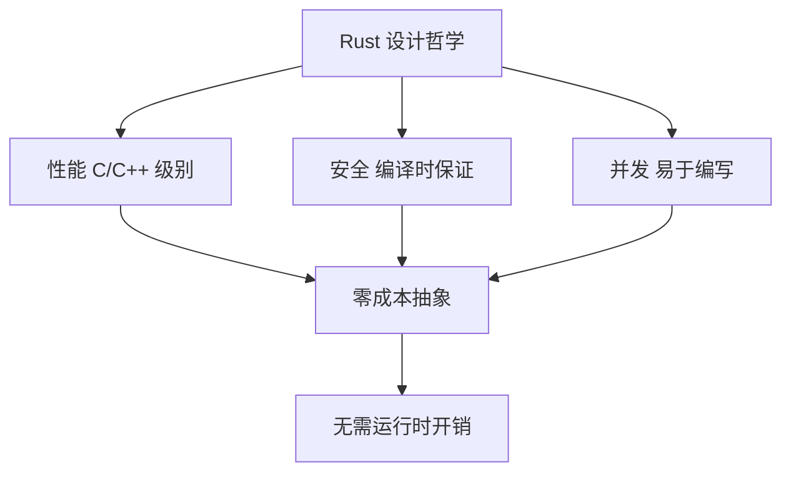
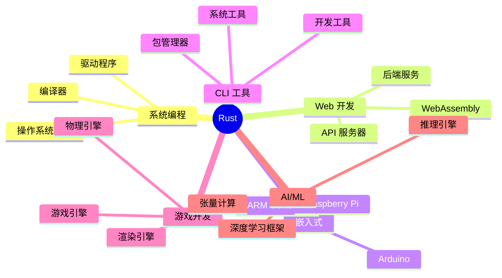
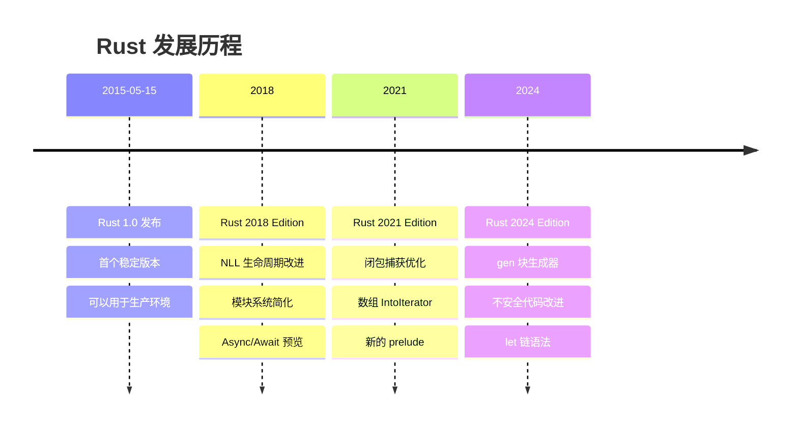
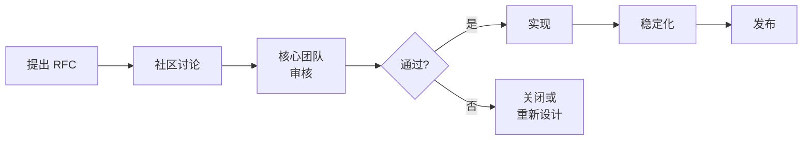
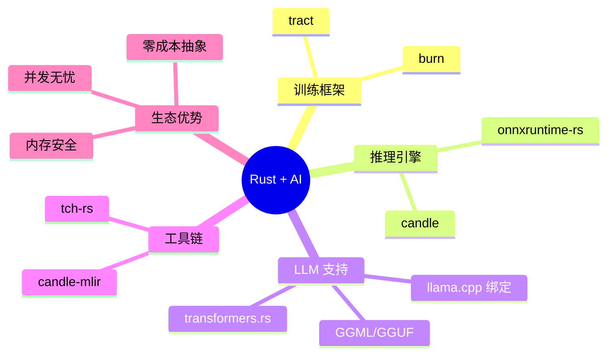
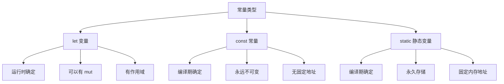
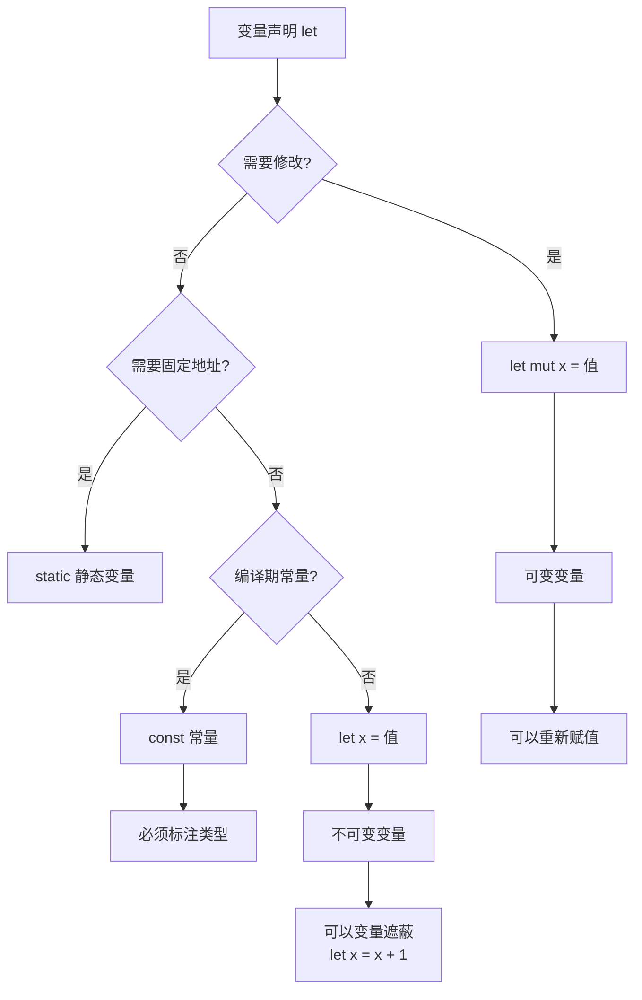
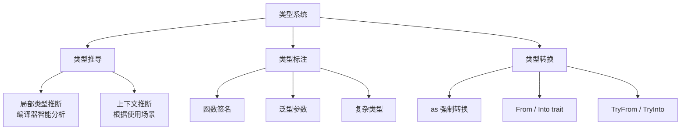
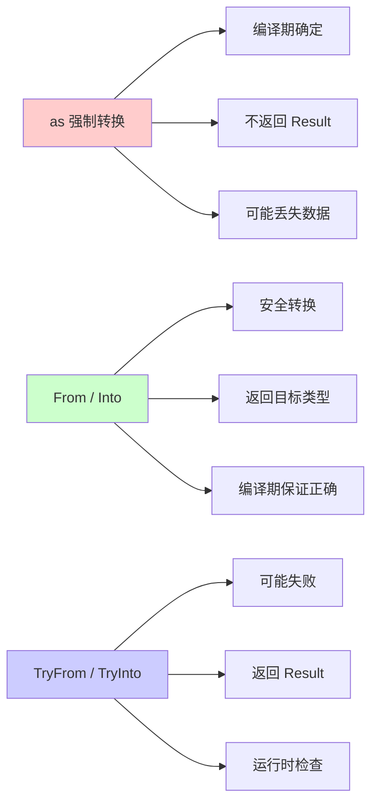

+++
title = "第 1 章 Rust 语言基础"
weight = 10
date = "2026-03-27T17:24:46+08:00"
type = "docs"
description = ""
isCJKLanguage = true
draft = false
+++

# Chapter-01 Rust 语言基础

## 1.1 初识 Rust

### 1.1.1 Rust 的设计目标：性能、安全、并发

想象一下，如果你是一个编程语言的创造者，你会想要什么？

- **性能快如闪电** ⚡ —— 最好能和 C/C++ 肩并肩，毕竟谁不想让自己的程序跑得飞快呢？
- **安全第一** 🔒 —— 不想写出那些让人半夜惊醒的内存漏洞、悬垂指针、空指针异常...
- **并发无忧** 🔮 —— 多线程程序写起来简单，不会动不动就死锁或者数据竞争

恭喜你，Rust 就是为了解决这三个问题而生的！

Rust 是一门系统编程语言，但它并不像它的前辈 C 那样"裸奔"，也不像 Java 那样依赖运行时垃圾回收器（Garbage Collector，简称 GC）。Rust 选择了第三条路——**编译时就把所有安全问题解决了**，让你在运行程序时既享受接近 C 的性能，又不用担心那些讨厌的内存错误。

> 简单来说，GC 就像是雇了一个清洁工在你家里随时打扫，但这个清洁工有时候会突然跳出来说"停！别动！"（程序暂停），而且还要消耗额外的内存和 CPU。Rust 呢？它直接在盖房子的时候就把设计图纸改好了，房子盖好之后根本不需要清洁工，因为根本不会产生垃圾！

Rust 通过**所有权系统**（Ownership）、**借用检查器**（Borrow Checker）和**生命周期**（Lifetime）这些编译时机制，实现了：
- 内存安全：永远不会有空指针、悬垂指针、数据竞争
- 线程安全：编译期保证没有数据竞争
- 零成本抽象：抽象不会带来运行时开销

```rust
// 来感受一下 Rust 的魅力！
// 这段代码在编译时就保证了内存安全，运行时不需要任何额外的安全检查

fn main() {
    let s1 = String::from("hello"); // 创建一个 String
    let s2 = s1; // 所有权从这里转移到 s2

    // 编译错误！s1 已经无效了！
    // Rust 编译器会说："嘿，s1 已经把所有权交给 s2 了，你不能再用 s1 了！"
    // println!("{}", s1); // ❌ 编译报错！

    println!("{}", s2); // ✅ s2 才是合法所有者
}
```

```rust
// 如果你想借用一下（不获取所有权）？用引用！
fn main() {
    let s1 = String::from("hello");
    let len = calculate_length(&s1); // & 表示借用，不获取所有权

    println!("'{}' 的长度是 {}", s1, len); // ✅ s1 仍然有效！
}

fn calculate_length(s: &String) -> usize {
    s.len() // 返回长度，不消耗 s
}
```

mermaid


### 1.1.2 Rust 的竞争优势（对比 C/C++/Java/Go/Python/JavaScript）

在这个编程语言的江湖里，Rust 可以说是"含着金汤匙出生"的富二代。为啥？因为它站在巨人的肩膀上，把前辈们的优点都学了过来，还顺手续上了各自的缺点！

#### Rust vs C/C++

C 和 C++ 是编程语言界的"老大哥"，性能确实牛，但写代码的时候就像在雷区里跳舞 💃。一个不小心踩到内存漏洞，整个程序可能就崩了。

| 对比项 | C/C++ | Rust |
|--------|-------|------|
| 内存安全 | ❌ 手动管理，容易出错 | ✅ 编译期保证 |
| 抽象能力 | ⚠️ 有限 | ✅ 零成本抽象 |
| 编译时间 | ✅ 快 | ⚠️ 较慢（但换来安全）|
| 学习曲线 | ⚠️ 陡峭 | ⚠️ 更陡峭（但值得）|

```c
// C 语言：程序员的噩梦
char *strdup(const char *s) {
    char *p = malloc(strlen(s) + 1); // 如果 malloc 失败了怎么办？
    if (p) {
        strcpy(p, s); // 复制字符串
    }
    return p; // 调用者需要 free，否则内存泄漏
}

// C++：智能指针好了一点，但还是可能翻车
#include <memory>
std::string* create_string() {
    return new std::string("hello"); // 谁负责 delete？
}
```

```rust
// Rust：让编译器替你操心
fn create_string() -> String {
    String::from("hello") // 创建就完事，出了作用域自动释放
}

fn main() {
    let s = create_string();
    println!("{}", s); // 函数返回后 s 会被自动清理
}
```

#### Rust vs Java/Go

Java 有 GC，Go 有 goroutine，看起来都很美好对吧？但 GC 带来的程序停顿（Stop-The-World）和 goroutine 的调度开销，有时候也挺让人头疼的。

```java
// Java：GC 可能会在关键时刻喊停！
public class MemoryGame {
    private String data; // 这个 data 可能在 GC 时被移动
    // ...
    // 突然，GC 来了："所有人停一下！我要打扫卫生！"
    // 你的程序: 😱 卡了 100ms！
}
```

```go
// Go：goroutine 很棒，但...
func worker(ch <-chan int, done <-chan struct{}) {
    for {
        select {
        case <-ch:
            // 处理数据
        case <-done:
            return // 收到结束信号，正常退出
        }
    }
}
// 注意：goroutine 泄漏在 Go 中是真实存在的问题——
// 如果没人关闭 channel，也没发送结束信号，worker 可能永远阻塞。
// 好的实践是使用 context.Context 或显式的 done channel。
// 注：Go 的 channel 设计是线程安全的，不会产生 data race
```

```rust
// Rust：编译时就告诉你所有问题！
use std::thread;

fn worker(ch: &std::sync::mpsc::Receiver<i32>) {
    while let Ok(data) = ch.recv() { // recv 会阻塞直到有数据或 channel 关闭
        println!("收到数据: {}", data);
    }
}

fn main() {
    let (tx, rx) = std::sync::mpsc::channel();
    
    // 编译保证：所有权的借用检查让 data race 不可能存在！
    let handle = thread::spawn(move || { // move 关键字强制闭包获取所有权
        worker(&rx);
    });
    
    tx.send(42).unwrap();
    handle.join().unwrap();
}
```

#### Rust vs Python/JavaScript

Python 和 JavaScript 是脚本语言，写起来确实爽，但性能嘛...和 Rust 比起来差了 10-100 倍！

```python
# Python：简单粗暴，但慢
def sum_numbers(n):
    total = 0
    for i in range(n):
        total += i
    return total

# 这个循环在 Python 里要跑好几秒...
# 如果 n 是 10 亿，那你就去喝杯咖啡吧 ☕
```

```rust
// Rust：同样的逻辑，快到飞起！
fn sum_numbers(n: i64) -> i64 {
    (0..n).sum() // 编译器和 CPU 一起优化，跑了！
}

fn main() {
    let result = sum_numbers(1_000_000_000);
    println!("结果是: {}", result); // 瞬间完成！
}
```

| 语言 | 性能 | 内存安全 | 并发易用性 | 学习曲线 |
|------|------|----------|------------|----------|
| Rust | ⭐⭐⭐⭐⭐ | ⭐⭐⭐⭐⭐ | ⭐⭐⭐⭐ | ⭐⭐⭐⭐ |
| C/C++ | ⭐⭐⭐⭐⭐ | ⭐ | ⭐⭐ | ⭐⭐⭐⭐ |
| Go | ⭐⭐⭐⭐ | ⭐⭐⭐⭐⭐ | ⭐⭐⭐⭐⭐ | ⭐⭐⭐ |
| Java | ⭐⭐⭐ | ⭐⭐⭐⭐⭐ | ⭐⭐⭐⭐ | ⭐⭐⭐ |
| Python | ⭐ | ⭐⭐⭐⭐⭐ | ⭐⭐ | ⭐ |
| JavaScript | ⭐ | ⭐⭐⭐⭐⭐ | ⭐⭐⭐ | ⭐ |

### 1.1.3 Rust 的应用场景：系统编程 / Web 后端 / WASM / 嵌入式 / CLI 工具 / 游戏 / AI

Rust 这门语言，简直就是个"全能选手"！它的应用场景多得让人眼花缭乱，让我来给你数数：

#### 🖥️ 系统编程

Rust 天生就是为系统编程而生的！Linux 内核已经在 2022 年开始支持 Rust 编写驱动了，Windows 也在用 Rust 写各种组件。

```rust
// 一个简单的系统级程序
use std::ptr;

unsafe {
    // 直接和硬件对话！这是 C 程序员的专属技能
    let null_ptr: *const i32 = ptr::null();
    // println!("{}", *null_ptr); // 注释掉这行，别真跑，会炸！
}
```

#### 🌐 Web 后端

Rust 的 Web 框架生态越来越丰富了！Actix、Axum、Rocket... 性能秒杀一众对手！

```rust
// 使用 Actix-web 框架创建一个 Web 服务
use actix_web::{web, App, HttpServer, HttpResponse};

async fn index() -> HttpResponse {
    HttpResponse::Ok().body("你好，Rust Web!")
}

#[actix_web::main]
async fn main() -> std::io::Result<()> {
    HttpServer::new(|| {
        App::new().route("/", web::get().to(index))
    })
    .bind("127.0.0.1:8080")?
    .run()
    .await
}
```

#### 🐟 WASM（WebAssembly）

Rust 可以编译成 WASM，在浏览器里跑！性能接近原生代码！

```rust
// 编译到 WASM 可以在浏览器里运行
#[no_mangle]
pub extern "C" fn add(a: i32, b: i32) -> i32 {
    a + b
}
```

#### 🔧 嵌入式开发

STM32、Arduino、Raspberry Pi Pico... Rust 都能玩！

```rust
// 嵌入式 Rust 示例（需要在 Cargo.toml 添加相关依赖）
#![no_std]
#![no_main]

use panic_halt as _;

#[arduino_uno::entry]
fn main() -> ! {
    let peripherals = arduino_uno::Peripherals::take().unwrap();
    let mut pin = peripherals.PORTB.split().pb5.into_output();
    
    loop {
        pin.set_high().unwrap();
        arduino_uno::delay::delay_ms(1000);
        pin.set_low().unwrap();
        arduino_uno::delay::delay_ms(1000);
    }
}
```

#### 💻 CLI 工具

Rust 写的 CLI 工具既快又小！ripgrep（grep 替代品）就是用 Rust 写的！

```rust
// 一个简单的 CLI 工具
use std::env;

fn main() {
    let args: Vec<String> = env::args().collect();
    
    if args.len() < 2 {
        eprintln!("用法: {} <名字>", args[0]);
        std::process::exit(1);
    }
    
    println!("你好，{}！欢迎来到 Rust 的世界！", args[1]);
}
```

#### 🎮 游戏开发

Rust 的性能非常适合游戏开发！社区里有 Amethyst、Bevy 等游戏引擎！

#### 🤖 AI/机器学习

burn、candle 等新兴 AI 框架都是用 Rust 写的，未来可期！

```rust
// 使用 candle 库做简单的张量计算（示例）
use candle::{Tensor, Device};

fn main() -> candle::Result<()> {
    let device = Device::Cpu;
    
    // 从切片创建一维张量
    let t1 = Tensor::from_slice(&[1.0f32, 2.0, 3.0], &device)?;
    let t2 = Tensor::from_slice(&[4.0f32, 5.0, 6.0], &device)?;
    
    // 张量相加
    let sum = t1.add(&t2)?;
    
    println!("{:?}", sum); // Tensor dty=float32 [3] device=cpu [ 5. ,  7. ,  9. ]
    
    Ok(())
}
```

mermaid


### 1.1.4 Rust 发展历史：2015 → 2018 → 2021 → 2024 Edition

Rust 的发展历程，就像一个程序员的成长之路 —— 从青涩到成熟，从默默无闻到声名鹊起！

#### 📅 2015 年 5 月 15 日：Rust 1.0 发布！

这一天，Rust 正式发布了 1.0 版本，标志着 Rust 终于可以用于生产环境了！🎉

还记得当时的宣传语吗？"Rust: 一个能让每个人写出安全、并发、极速代码的语言！"

#### 📅 2018 年：Rust 2018 Edition

这是 Rust 的第一个"Edition"，带来了很多激动人心的特性：
- **NLL（非词法生命周期）**：借用检查器变得更智能了！
- **模块系统简化**：`extern crate` 不再需要了
- **Async/Await 预览**：Rust 2018 Edition 预览了 async/await 语法（当时还需要 `#![feature(async_await)]` 在 nightly 编译器下使用）。stable 的 async/await 最终在 **Rust 1.39**（2019年11月）才正式稳定！

```rust
// Rust 2018 Edition 预览版（需要 nightly + feature flag）
#![feature(async_await)]

async fn get_answer() -> i32 {
    42
}

// 2018 年之前？不存在的！你只能这样写：
extern crate futures;

use futures::future::ok;

fn main() {
    let _ = ok::<i32, ()>(42);
}
```

#### 📅 2021 年：Rust 2021 Edition

2021 Edition 带来了更多改进：
- **闭包捕获优化**：闭包现在只捕获实际用到的变量
- **IntoIterator for arrays**：数组可以直接迭代了
- **新的 prelude**：多了 `try` 块等特性

```rust
// Rust 2021: 数组的 IntoIterator
fn main() {
    let arr = [1, 2, 3, 4, 5];
    
    // 以前要这样写
    for i in arr.iter() {
        println!("{}", i);
    }
    
    // Rust 2021 直接写
    for i in arr {
        println!("{}", i); // 1, 2, 3, 4, 5
    }
}
```

#### 📅 2024 年：Rust 2024 Edition

这是最新的 Edition，代表了 Rust 的最新水平！主要变化包括：
- **gen 块（生成器）**：更强大的异步编程
- **unsafe extern blocks**：更安全的 FFI
- **let 链**：`let x = foo() && bar()` 这样的写法

```rust
// Rust 2024: let 链语法
fn foo() -> bool {
    println!("foo 被调用");
    true
}

fn bar() -> bool {
    println!("bar 被调用");
    true
}

fn main() {
    // let 链：所有条件都为真才执行
    let x = 5;
    if let true = foo() && bar() && (x > 3) {
        println!("条件都满足了！");
    }
    // foo 被调用
    // bar 被调用
    // 条件都满足了！
}
```

mermaid


### 1.1.5 Rust 2024 Edition 的设计目标与核心变化

Rust 2024 Edition 可不是简单的修修补补，这是 Rust 社区经过多年酝酿的重磅升级！

#### 🎯 设计目标

1. **让 Rust 更易学**：降低学习曲线，让新手也能快速上手
2. **提高生产力**：减少样板代码，让开发者更专注于业务逻辑
3. **增强安全性**：继续深化编译时安全检查
4. **为未来铺路**：为 gen 块、类型级数字等高级特性打下基础

#### 🔥 核心变化一览

##### 1. gen 块（生成器）

这是 Rust 异步编程的重大飞跃！想象一下，你写 async/await 的时候，背后其实是编译器把代码"翻译"成状态机。gen 块让这个过程更透明、更强大。

```rust
// Rust 2024: gen 块（需要 #![feature(gen_blocks)]）
#![feature(gen_blocks)]

use std::ops::{Generator, GeneratorState};

fn simple_gen() -> impl Generator<Yield = (), Return = ()> + 'static {
    move || {
        println!("第一步");
        yield;
        println!("第二步");
        yield;
        println!("第三步");
    }
}

fn main() {
    let mut gen = simple_gen();
    // 调用 resume() 来驱动生成器（GeneratorState::Yielded 表示暂停点）
    // 注：gen 块的 API 可能随 nightly 版本变化，以上代码仅供参考
    match gen.resume() {
        GeneratorState::Yielded(_) => println!("暂停在 yield 点"),
        GeneratorState::Complete(()) => println!("生成器结束"),
    }
}
```

##### 2. let 链（Let Chains）

这是很多人期待已久的特性！让条件判断变得更自然。

```rust
// Rust 2024: let 链
fn process_data(data: Option<Vec<i32>>) {
    // 以前要嵌套 match 或 if let
    // 现在可以直接写 let 链
    if let Some(nums) = data && !nums.is_empty() && nums.len() > 5 {
        println!("数据长度: {}", nums.len());
    }
}

fn main() {
    process_data(Some(vec![1, 2, 3, 4, 5, 6, 7])); // 数据长度: 7
    process_data(Some(vec![1, 2])); // 什么都不输出
    process_data(None); // 什么都不输出
}
```

##### 3. 更安全的 unsafe 代码

Rust 2024 对 unsafe 代码进行了更好的集成，让 Rust 和 C 的互操作更安全。

```rust
// Rust 2024: unsafe extern blocks 更安全
unsafe extern "C" {
    // 编译器会检查函数签名！
    fn c_function(x: i32) -> i32;
}

fn main() {
    unsafe {
        let result = c_function(42);
        println!("C 函数返回: {}", result);
    }
}
```

##### 4. 类型级数字（初窥）

虽然还没完全稳定，但 Rust 2024 为类型级数字奠定了基础！

```rust
// 类型级数字的概念（需要 nightly Rust）
#![feature(generic_const_exprs)]

struct ArrayWrapper<const N: usize>([u8; N]);

fn main() {
    let wrapper = ArrayWrapper([0u8; 16]); // 编译保证长度是 16！
    println!("数组长度: {}", wrapper.0.len()); // 数组长度: 16
}
```

### 1.1.6 Rust 社区文化与治理模式（RFC 流程 / T-compiler / T-lang）

Rust 能有今天，离不开一个超级给力的社区！🌟

#### 🏛️ RFC 流程 —— 每个人都可以参与！

RFC（Request For Comments，请求评论）是 Rust 变更的标准流程。任何人都可以提交 RFC！



**RFC 生命周期：**

1. **起草阶段**：作者写 RFC 文档
2. **社区讨论**：在 GitHub 上热烈讨论
3. **最终决定**：核心团队拍板
4. **实现阶段**：志愿者或工作组实现
5. **稳定化**：经过测试后进入稳定版本

> 有趣的是，Rust 的很多重大特性（比如 async/await、生成器）都是通过 RFC 流程反复讨论、修改多年的产物。这种开放透明的流程确保了每个决定都是深思熟虑的！

#### 🛠️ T-compiler（编译器团队）

T-compiler 是 Rust 编译器开发的核心团队，负责：
- rustc 编译器的维护和优化
- 编译器错误的改进（让错误信息更友好！）
- 性能优化

```rust
// Rust 编译器错误信息越来越友好了！
fn main() {
    let x = 5;
    // x = 6; // 试试取消这行注释，编译器会告诉你怎么改！
    println!("{}", x);
}
```

#### 📚 T-lang（语言团队）

T-lang 负责 Rust 语言的设计和演进，包括：
- 新特性的设计和审核
- 语言规范的编写
- Edition 之间的兼容性

#### 🎪 社区文化

Rust 社区有几个独特的文化：

1. **Rustacean**：Rust 社区成员的自称，来源于"crustacean"（甲壳类动物）+ "Rust"

2. **Motto**：Rust 的官方座右铭是 "Empowering everyone to build reliable and efficient software"（赋能每个人构建可靠高效的软件）。社区还有一句非官方名言："Force through sound reasoning not authority"（用有力的推理而非权威），体现了 Rust 社区重视技术论证而非权威的文化。

3. **友善互助**：无论你是新手还是老鸟，社区都会热情帮助

4. **文档至上**：Rust 有一个传统，"如果它没文档，它就不存在"！

```rust
// Rust 的文档测试文化：文档里的代码示例会自动运行！
/// 将两个数字相加
///
/// # Examples
///
/// ```
/// assert_eq!(add(2, 3), 5);
/// ```
pub fn add(a: i32, b: i32) -> i32 {
    a + b
}
```

### 1.1.7 Rust 在 AI 领域的崛起（LLM 应用 / burn / candle）

AI 时代，Rust 正在大放异彩！🤖

#### 🔥 为什么 AI 框架纷纷选择 Rust？

1. **性能**：训练和推理都需要极致性能
2. **内存安全**：AI 程序往往运行很长时间，内存泄漏是灾难性的
3. **并发**：多 GPU、多线程训练需要强大的并发支持
4. **互操作**：需要和 Python、C++ 等 AI 生态深度集成

#### 📦 burn —— Rust 深度学习框架

burn 是用纯 Rust 编写的深度学习框架，目标是成为 Rust 生态的 PyTorch！

```rust
// burn 示例：创建一个简单的线性层（简化示例）
use burn::nn::Linear;
use burn::tensor::Tensor;

// 定义模型结构
pub struct MyModel {
    linear: Linear,
}

impl MyModel {
    // 注意：burn 0.13+ 的 Linear::new 直接接收维度参数
    pub fn new(input_features: usize, output_features: usize) -> Self {
        MyModel {
            linear: Linear::new(input_features, output_features),
        }
    }

    pub fn forward(&self, x: Tensor) -> Tensor {
        x.matmul(self.linear.weight()) + self.linear.bias()
    }
}

// 注意：burn 生态发展迅速，API 可能随版本变化
// 实际使用时请参考最新官方文档
```

#### 🕯️ candle —— 轻量级 ML 框架

candle 是另一个纯 Rust 的 ML 框架，由 Hugging Face 开发，轻量且高效！

```rust
// candle 示例：矩阵运算
use candle::{Tensor, DType, Device};

fn main() -> candle::Result<()> {
    let device = Device::Cpu;
    
    // 创建矩阵
    let a = Tensor::randn(0.0, 1.0, [3, 4], &device, DType::F32)?;
    let b = Tensor::randn(0.0, 1.0, [4, 2], &device, DType::F32)?;
    
    // 矩阵乘法
    let c = a.matmul(&b)?;
    
    println!("输出形状: {:?}", c.shape()); // [3, 2]
    
    Ok(())
}
```

#### 🤝 LLM 部署

Rust 在 LLM 部署方面也有独特优势：

1. **llama.cpp**：用 C/C++ 写的高效推理引擎，有 Rust 绑定
2. **transformers.rs**：Hugging Face Transformers 的 Rust 移植
3. **artificial-prompt**：Rust 的提示词工程库

```rust
// 使用 candle-transformers 运行 GPT-2 模型（简化示例）
//
// candle-transformers 加载 GPT-2 大致步骤：
// 1. 创建 Device (Cpu 或 Cuda)
// 2. 加载 Config 和模型权重 (Gpt2::load)
// 3. 加载 Tokenizer
// 4. 对输入文本进行 tokenize
// 5. 调用 model.generate() 生成文本
//
// 由于需要下载预训练权重（约 500MB），此处不做完整演示
// 感兴趣的读者可以参考 candle-transformers 官方 examples：
// https://github.com/huggingface/candle/blob/main/candle-examples/examples/yarn-llama2/main.rs
```

#### 🌟 Rust + AI 的未来

Rust 在 AI 领域的优势越来越明显：



> 想象一下，用 Rust 写一个自己的 ChatGPT 替代品，性能比 Python 快 10 倍，内存占用只有十分之一 —— 这不是梦，这是正在发生的事情！🌙

在这一章中，我们探索了：

1. **Rust 的设计哲学**：性能、安全、并发三管齐下，零成本抽象让你既有高级语言的便利，又有系统级语言的性能。

2. **Rust 的竞争优势**：和 C/C++ 比安全，和 Go/Java 比性能，和 Python/JavaScript 比速度，学习曲线虽然陡峭但绝对值得。

3. **Rust 的应用场景**：从系统编程到 Web 开发，从嵌入式到 AI，Rust 几乎无所不能。

4. **Rust 的发展历史**：从 2015 年的 1.0 到 2024 年的最新 Edition，Rust 一直在进化。

5. **Rust 2024 Edition**：gen 块、let 链、更安全的 unsafe，让 Rust 变得更加强大。

6. **Rust 社区文化**：开放的 RFC 流程、友善的社区，让 Rust 不仅是语言更是一种文化。

7. **Rust 在 AI 领域的崛起**：burn、candle 等框架让 Rust 成为 AI 开发的新选择。

下一章我们将深入 Rust 最独特的特性 —— **所有权系统**！这是 Rust 的核心，也是让 Rust 区别于其他语言的关键所在。准备好了吗？让我们继续探索 Rust 的奇妙世界！🚀

### 1.2 变量与可变性

在大多数编程语言里，变量就像是一个贴了便签的盒子，你可以随时把里面的东西换掉。但是在 Rust 里，这个盒子有点特别 —— 默认情况下，它被焊死了，你只能看，不能改！

等等，这听起来很反人类？别急，让我慢慢给你解释为什么 Rust 要这么做...

#### 1.2.1 变量声明：let 的基本用法

在 Rust 里，声明变量就用 `let` 关键字。这和 JavaScript、Python 里的习惯差不多，但含义可完全不同！

```rust
fn main() {
    // 基本的变量声明
    let x = 42; // x 是 i32 类型，值是 42
    println!("x = {}", x); // x = 42
    
    // 显式类型标注（有时候编译器需要你告诉它类型）
    let y: i64 = 1_000_000_000; // 用下划线分隔数字，更易读！
    println!("y = {}", y); // y = 1000000000
    
    // 字符串变量
    let name = "Rust";
    println!("你好，{}！", name); // 你好，Rust！
}
```

> 小技巧：数字中间的下划线 `_` 只是为了人类好读，编译器会直接忽略它。`1_000_000_000` 和 `1000000000` 在 Rust 眼里是一模一样的！

#### 1.2.2 不可变性：为什么默认不可变（安全 + 并发）

好，现在重点来了！为什么 Rust 默认变量是不可变的？

**原因一：安全**

想象一下，如果一个变量可以随时改变，你可能会遇到这种灾难：

```rust
fn main() {
    let numbers = vec![1, 2, 3, 4, 5];
    
    // 假设这是一个很长的函数...
    let first = numbers.get(0);
    let second = numbers.get(1);
    
    // 某个程序员（可能是三个月后的你）在这里偷偷改了 numbers
    // numbers = vec![1, 2]; // 天哪！
    
    // 你以为 first 和 second 还是原来的值，结果...
    println!("第一个: {:?}", first); // 可能不是你预期的了！
}
```

不可变性意味着：**一旦赋值，就不会被偷偷改掉**。你可以放心地信任一个变量。

**原因二：并发安全**

这是 Rust 最厉害的地方！在多线程程序里，数据竞争（Data Race）是最头疼的问题之一。但如果数据不可变，那就根本不可能发生数据竞争！

```rust
use std::thread;

fn main() {
    let data = vec![1, 2, 3]; // 不可变数据
    
    // 线程1：读取 data
    let handle1 = thread::spawn(move || {
        println!("线程1 看到的数据: {:?}", data);
        // data.push(4); // 编译错误！data 是不可变的！
    });
    
    // 线程2：读取 data
    let handle2 = thread::spawn(move || {
        // 线程2 也可以安全地读取，因为没人能改它
        // data 是 Copy 类型，所以可以复制一份给线程
    });
    
    handle1.join().unwrap();
    handle2.join().unwrap();
}
```

**原因三：编译器优化**

不可变的变量，编译器可以放心地做各种优化。比如：
- 把变量放到寄存器里，而不是内存
- 消除冗余计算
- 内联函数调用

#### 1.2.3 可变变量：let mut

好吧好吧，我知道有些时候你就是需要改变变量的值。Rust 也很体贴，给你准备了 `mut` 关键字！

```rust
fn main() {
    let mut counter = 0; // 加了 mut，就可以改变了！
    
    println!("计数器初始值: {}", counter); // 计数器初始值: 0
    
    counter = counter + 1; // 修改它！
    println!("计数器加1后: {}", counter); // 计数器加1后: 1
    
    // 翻倍！
    counter = counter * 2;
    println!("计数器翻倍后: {}", counter); // 计数器翻倍后: 2
}
```

> 划重点：`mut` 不是 "mutable" 的缩写，而是 "mutability"（可变性）的标志。就像交通信号灯的 `mut` 标记一样，告诉你"这里可以变"！

但是要记住，即使加了 `mut`，你也只能在变量创建后的作用域里改变它：

```rust
fn main() {
    let x = 10;
    // x = 20; // 编译错误！x 是不可变的！
    
    let mut y = 10;
    y = 20; // ✅ 没问题！y 是 mut
    
    let z = 30;
    y = z; // ✅ 没问题！都是 i32 类型，y 是 mut 的
    // 注意：y = z 能通过是因为 y 是 mut，跟 z 是多少没关系
}
```

#### 1.2.4 常量：const

如果说 `let` 是"可信任的变量"，那 `const` 就是"永恒的真理" —— 编译时就确定，运行时绝不改变！

```rust
// 常量必须标注类型！
const MAX_SIZE: usize = 100;
const PI: f64 = 3.141592653589793;
const GREETING: &str = "你好，Rust！";

fn main() {
    println!("最大尺寸: {}", MAX_SIZE); // 最大尺寸: 100
    println!("圆周率: {:.10}", PI); // 圆周率: 3.1415926535
    println!("{}", GREETING); // 你好，Rust！
}
```

**常量 vs 不可变变量：**

| 特性 | `let` 变量 | `const` 常量 |
|------|-----------|-------------|
| 确定时机 | 运行时也可确定 | ✅ 编译期必须确定 |
| 可变性 | ✅ 可加 `mut` 变可变 | 永远不可变 |
| 内存位置 | 堆或栈 | ✅ 通常在常量区 |
| 作用域 | ✅ 有作用域 | 编译期就固定（但可局部声明）|

```rust
fn main() {
    // const 可以在任何作用域，包括全局
    const LEVEL: i32 = 99;
    
    let level = 100;
    if level > LEVEL {
        println!("升级了！"); // 升级了！
    }
}
```

#### 1.2.5 静态变量：static

`static` 变量和 `const` 很像，但有一个关键区别：**它们有固定的内存地址**！

```rust
static mut COUNTER: i32 = 0;

fn increment() {
    unsafe {
        // 裸指针赋值，不创建引用，符合新版规则
        *&raw mut COUNTER += 1;
    }
}

fn main() {
    increment();
    increment();

    unsafe {       
        // println!("计数器值: {}", COUNTER);  // 会隐式创建 &i32 共享引用；
        // Rust 2024 认为：可变静态变量 + 共享引用 = 未定义行为（多线程下会数据竞争）。
        // 裸指针读取
        println!("计数器值: {}", *&raw const COUNTER);
    }
}
```

> 警告：访问 `static mut` 变量是不安全的，因为多线程同时修改可能导致数据竞争。所以 Rust 强制你用 `unsafe` 块访问它。如果你不需要可变访问，可以用 `static`（隐含不可变）或者 `static` + `Mutex`。

```rust
use std::sync::Mutex;

static COUNTER: Mutex<i32> = Mutex::new(0);

fn main() {
    *COUNTER.lock().unwrap() += 1;
    *COUNTER.lock().unwrap() += 1;
    
    println!("计数器: {}", *COUNTER.lock().unwrap()); // 计数器: 2
}
```

**三种"常量"的区别：**



#### 1.2.6 变量遮蔽：Variable Shadowing

这是 Rust 一个非常酷的特性！变量遮蔽允许你用同一个名字声明一个新变量，旧的就"消失"了（被遮蔽了）。

```rust
fn main() {
    let x = 5;
    println!("x = {}", x); // x = 5
    
    let x = x + 1; // 新的 x 遮蔽了旧的 x
    println!("x = {}", x); // x = 6
    
    let x = x * 2;
    println!("x = {}", x); // x = 12
    
    // 类型也可以变！
    let spaces = "   "; // 字符串
    let spaces = spaces.len(); // 变成了 usize！
    println!("空格数: {}", spaces); // 空格数: 3
}
```

这和 `mut` 的区别在哪里？

```rust
fn main() {
    let mut s = String::from("hello");
    s = String::from("world"); // ✅ 可以，因为 s 是可变的
    
    let s = String::from("hello");
    let s = String::from("world"); // ✅ 也可以，但这是遮蔽
    // 区别：第一个 s 被销毁了，不是因为它可变
}
```

**变量遮蔽的应用场景：**

```rust
fn main() {
    // 场景1：类型转换
    let value = "42";
    let value: i32 = value.parse().unwrap();
    let value: f64 = value as f64;
    println!("最终值: {}", value); // 最终值: 42
    
    // 场景2：作用域内的重定义
    let x = 10;
    println!("外层 x = {}", x); // 外层 x = 10
    
    {
        let x = 20; // 这里是新的 x
        println!("内层 x = {}", x); // 内层 x = 20
    }
    
    println!("外层 x = {}", x); // 外层 x = 10
}
```

#### 1.2.7 内联多重赋值与解构赋值

Rust 支持很优雅的多重赋值和解构！

```rust
fn main() {
    // 多重赋值
    let (a, b) = (1, 2);
    println!("a = {}, b = {}", a, b); // a = 1, b = 2
    
    // 解构元组
    let (name, age, score) = ("小明", 25, 98.5);
    println!("{} 今年 {} 岁，成绩是 {}", name, age, score);
    // 小明 今年 25 岁，成绩是 98.5
    
    // 解构数组
    let [first, second, third] = [1, 2, 3];
    println!("{}, {}, {}", first, second, third); // 1, 2, 3
    
    // 解构嵌套
    let ((x1, y1), (x2, y2)) = ((1, 2), (3, 4));
    println!("({}, {}) 和 ({}, {})", x1, y1, x2, y2); // (1, 2) 和 (3, 4)
}
```

**函数返回元组实现多重返回值：**

```rust
fn min_max(numbers: &[i32]) -> (i32, i32) {
    let min = *numbers.iter().min().unwrap();
    let max = *numbers.iter().max().unwrap();
    (min, max)
}

fn main() {
    let data = vec![3, 1, 4, 1, 5, 9, 2, 6];
    let (min, max) = min_max(&data);
    
    println!("最小值: {}, 最大值: {}", min, max); // 最小值: 1, 最大值: 9
}
```

#### 1.2.8 Rust 2024 新增：let 链语法

这是 Rust 2024 Edition 带来的新语法！let 链让你可以在 `let` 语句里直接写条件表达式！

```rust
fn get_length(s: Option<String>) -> usize {
    // 以前要这样写：
    // if let Some(s) = s {
    //     s.len()
    // } else {
    //     0
    // }
    
    // Rust 2024: let 链！
    let Some(s) = s else {
        return 0;
    };
    
    s.len()
}

fn main() {
    println!("{}", get_length(Some("hello".to_string()))); // 5
    println!("{}", get_length(None)); // 0
}
```

**let 链的更多用法：if let + 条件**

```rust
fn classify_number(n: i32) -> &'static str {
    // 配合条件判断的 let 链
    if let Some(name) = &["positive", "zero", "negative"].get(if n > 0 { 0 } else if n < 0 { 2 } else { 1 }) {
        name
    } else {
        "unknown"
    }
}

fn main() {
    println!("{}", classify_number(-5)); // negative
    println!("{}", classify_number(0)); // zero
    println!("{}", classify_number(4)); // positive
}
```

**let...else 模式：**

```rust
fn main() {
    // let...else 是 let 链的一部分
    let Some(value) = Some(42) else {
        panic!("没有值！");
    };
    
    println!("值为: {}", value); // 值为: 42
    
    // 更复杂的匹配
    let (Ok(a), Ok(b)) = (Ok(10), Ok(20)) else {
        return;
    };
    
    println!("a + b = {}", a + b); // a + b = 30
}
```

---

mermaid


---

### 1.3 基本数据类型

如果说 Rust 是一座大厦，那数据类型就是这块大厦的砖瓦。每一种类型都有自己的性格和用途，搞清楚它们，你写代码就能事半功倍！

#### 1.3.1 整数类型

整数就是没有小数点的数字。Rust 的整数家族可大了，让我来给你介绍一下：

##### 1.3.1.1 有符号整数：i8 / i16 / i32 / i64 / i128

有符号整数可以表示正数、负数和零。名字里的 "i" 就是 "integer"（整数）的意思，后面的数字表示**位数**（bits）。

```rust
fn main() {
    let a: i8 = 127;    // 8位有符号，范围: -128 ~ 127
    let b: i16 = 32767; // 16位有符号，范围: -32768 ~ 32767
    let c: i32 = 2147483647; // 32位有符号，范围: -2147483648 ~ 2147483647
    let d: i64 = 9223372036854775807; // 64位有符号
    let e: i128 = 170141183460469231731687303715884105727; // 128位有符号！
    
    println!("i8 最大值: {}", i8::MAX); // i8 最大值: 127
    println!("i16 最大值: {}", i16::MAX); // i16 最大值: 32767
    println!("i32 最大值: {}", i32::MAX); // i32 最大值: 2147483647
    println!("i64 最大值: {}", i64::MAX); // i64 最大值: 9223372036854775807
    println!("i128 最大值: {}", i128::MAX); // i128 最大值: 170141183460469231731687303715884105727
}
```

> 为什么 i8 的最大值是 127？因为 8 位只能表示 256 个值，其中一半给负数，一半给正数和零。-128 到 -1 是 128 个，0 是 1 个，1 到 127 是 127 个，加起来正好 256 个！

##### 1.3.1.2 无符号整数：u8 / u16 / u32 / u64 / u128

无符号整数只能表示非负数（零和正数）。"u" 就是 "unsigned"（无符号）的意思。

```rust
fn main() {
    let a: u8 = 255;    // 8位无符号，范围: 0 ~ 255
    let b: u16 = 65535; // 16位无符号，范围: 0 ~ 65535
    let c: u32 = 4294967295; // 32位无符号，范围: 0 ~ 4294967295
    let d: u64 = 18446744073709551615; // 64位无符号
    let e: u128 = 340282366920938463463374607431768211455; // 128位无符号
    
    println!("u8 最大值: {}", u8::MAX); // u8 最大值: 255
    println!("u16 最大值: {}", u16::MAX); // u16 最大值: 65535
    println!("u32 最大值: {}", u32::MAX); // u32 最大值: 4294967295
    println!("u64 最大值: {}", u64::MAX); // u64 最大值: 18446744073709551615
    println!("u128 最大值: {}", u128::MAX); // u128 最大值: 340282366920938463463374607431768211455
}
```

**有符号 vs 无符号的选择：**

```rust
fn main() {
    // 如果你的数可能是负数，用有符号！
    let temperature: i32 = -10; // 零下10度
    let altitude: i32 = 8848; // 珠穆朗玛峰高度（米）
    
    // 如果你的数永远是正数，用无符号！
    let age: u8 = 25; // 年龄不会是负数
    let population: u64 = 1400000000; // 人口
    let bytes: usize = 1024; // 字节数
    
    println!("温度: {}°C", temperature); // 温度: -10°C
    println!("年龄: {}岁", age); // 年龄: 25岁
}
```

##### 1.3.1.3 平台相关整数：isize / usize

这两个是"跟着平台走"的整数类型。在 64 位系统上就是 64 位，在 32 位系统上就是 32 位。

```rust
fn main() {
    println!("isize 大小: {} 位", std::mem::size_of::<isize>() * 8); // 64 位
    println!("usize 大小: {} 位", std::mem::size_of::<usize>() * 8); // 64 位
    
    // 典型用途：数组索引
    let arr = [1, 2, 3, 4, 5];
    let index: usize = 2;
    println!("arr[{}] = {}", index, arr[index]); // arr[2] = 3
    
    // usize 用于表示内存大小
    let memory_size: usize = std::mem::size_of::<String>();
    println!("String 类型占用 {} 字节", memory_size); // String 类型占用 24 字节（64位系统）
}
```

> 为什么数组索引要用 usize？因为数组的长度不可能是负数！而且它的大小正好能表示这台机器能访问的最大内存地址。

##### 1.3.1.4 整数取值范围速查表

| 类型 | 位数 | 有符号范围 | 无符号范围 |
|------|------|-----------|-----------|
| i8 / u8 | 8 | -128 ~ 127 | 0 ~ 255 |
| i16 / u16 | 16 | -32,768 ~ 32,767 | 0 ~ 65,535 |
| i32 / u32 | 32 | -2,147,483,648 ~ 2,147,483,647 | 0 ~ 4,294,967,295 |
| i64 / u64 | 64 | -9,223,372,036,854,775,808 ~ 9,223,372,036,854,775,807 | 0 ~ 18,446,744,073,709,551,615 |
| i128 / u128 | 128 | 约 ±1.7×10³⁸ | 0 ~ 约3.4×10³⁸ |
| isize / usize | 平台相关 | 64位系统: ±9.2×10¹⁸ | 64位系统: 0 ~ 1.8×10¹⁹ |

##### 1.3.1.5 整数默认类型推导规则

当你没有显式指定类型时，Rust 编译器会根据上下文推导类型。整数默认是 `i32`，为什么呢？

```rust
fn main() {
    // 没有类型标注？编译器会根据上下文推导
    let a = 42; // 推导为 i32
    let b = 100u8; // 显式指定 u8
    let c = 200u16; // 显式指定 u16
    let d = 300u32; // 显式指定 u32
    let e = 400u64; // 显式指定 u64
    
    println!("a 是 i32: {}", a); // a 是 i32: 42
    println!("b 是 u8: {}", b); // b 是 u8: 100
    
    // 函数参数的类型推导
    let result = sum(1, 2); // 1 和 2 都是 i32，所以函数参数也是 i32
    println!("1 + 2 = {}", result); // 1 + 2 = 3
}

fn sum(a: i32, b: i32) -> i32 {
    a + b
}
```

**为什么默认是 i32 而不是 i64？**

```rust
fn main() {
    // i32 是 Rust 的"万能选手"！
    // 原因1：大多数场景下 32 位整数够用
    let population: i32 = 1400000000; // 中国人口，够用！
    
    // 原因2：i32 在 64 位 CPU 上效率最高（一次操作处理完）
    // 原因3：历史原因，保持和 C 语言的兼容性
}
```

##### 1.3.1.6 整数的进制表示

Rust 支持多种进制表示法，还有贴心的字节分隔符！

```rust
fn main() {
    // 十进制（默认）
    let decimal = 98_765; // 下划线分隔，更易读！
    println!("十进制: {}", decimal); // 十进制: 98765
    
    // 十六进制：0x 开头
    let hex = 0xFF; // 255
    let hex2 = 0xDEADBEEF; // 3735928559
    println!("十六进制: {:#x}", hex); // 十六进制: 0xff
    println!("十六进制: {:#x}", hex2); // 十六进制: 0xdeadbeef
    
    // 八进制：0o 开头
    let octal = 0o77; // 63
    println!("八进制: {:#o}", octal); // 八进制: 0o77
    
    // 二进制：0b 开头
    let binary = 0b1010; // 10
    println!("二进制: {:#b}", binary); // 二进制: 0b1010
    
    // 字节表示（u8专用）
    let byte = b'A'; // 65
    println!("字节: {}", byte); // 字节: 65
    
    // 字节数组字面量
    let bytes = b"hello"; // [104, 101, 108, 108, 111]
    println!("字节数组: {:?}", bytes); // 字节数组: [104, 101, 108, 108, 111]
}
```

**进制转换小工具：**

```rust
fn main() {
    let num = 255;
    
    println!("十进制: {}", num); // 十进制: 255
    println!("十六进制: {:x}", num); // 十六进制: ff
    println!("八进制: {:o}", num); // 八进制: 377
    println!("二进制: {:b}", num); // 二进制: 11111111
    
    // 带前缀的格式化输出
    println!("0x{:02X}", num); // 0xFF（大写，带前导零）
    println!("0b{:08b}", num); // 0b11111111（8位二进制）
}
```

#### 1.3.2 浮点类型

浮点数就是带小数点的数。Rust 有两种浮点类型：

##### 1.3.2.1 f32：32 位单精度（IEEE 754）

```rust
fn main() {
    let pi: f32 = 3.14159;
    let e: f32 = 2.71828;
    
    println!("π ≈ {}", pi); // π ≈ 3.14159
    println!("e ≈ {}", e); // e ≈ 2.71828
    
    // f32 的精度
    println!("f32 精度: {} 位尾数", std::mem::size_of::<f32>() * 8); // 32 位
}
```

##### 1.3.2.2 f64：64 位双精度（Rust 默认浮点类型）

```rust
fn main() {
    let pi = 3.141592653589793; // 默认 f64！
    let e = 2.718281828459045;
    
    println!("π ≈ {:.15}", pi); // π ≈ 3.141592653589793
    println!("e ≈ {:.15}", e); // e ≈ 2.718281828459045
    
    // 显式标注 f64
    let pi: f64 = 3.14159;
    println!("显式 f64: {:.10}", pi); // 显式 f64: 3.1415900000
}
```

> 默认浮点类型是 f64 而不是 f32，是因为现代 CPU 对 64 位浮点运算的优化非常好，有时候 f64 甚至比 f32 更快！

##### 1.3.2.3 特殊浮点值：NaN / Infinity / -Infinity / -0.0

浮点数有一些特殊值，你需要知道它们的存在：

```rust
fn main() {
    // NaN（Not a Number）
    let nan = f64::NAN;
    println!("NaN: {}", nan); // NaN
    println!("是 NaN 吗？: {}", nan.is_nan()); // 是 NaN 吗？: true
    
    // 无穷大
    let inf = f64::INFINITY;
    let neg_inf = f64::NEG_INFINITY;
    println!("正无穷: {}", inf); // 正无穷
    println!("负无穷: {}", neg_inf); // 负无穷
    println!("是无穷吗？: {}", inf.is_infinite()); // 是无穷吗？: true
    
    // 负零
    let neg_zero = -0.0;
    println!("负零: {}", neg_zero); // -0
    println!("是 -0 吗？: {}", neg_zero.is_sign_negative()); // 是 -0 吗？: true
    
    // 浮点数运算产生的特殊值
    println!("1.0 / 0.0 = {}", 1.0 / 0.0); // 1.0 / 0.0 = Infinity
    println!("-1.0 / 0.0 = {}", -1.0 / 0.0); // -1.0 / 0.0 = -Infinity
    println!("0.0 / 0.0 = {}", 0.0 / 0.0); // 0.0 / 0.0 = NaN
    println!("sqrt(-1.0) = {}", (-1.0_f64).sqrt()); // sqrt(-1.0) = NaN
}
```

##### 1.3.2.4 浮点精度问题与安全比较

这是浮点数最"坑人"的地方！由于浮点数的表示方式，有些数无法精确表示：

```rust
fn main() {
    // 经典的精度问题
    let a = 0.1 + 0.2;
    println!("0.1 + 0.2 = {}", a); // 0.1 + 0.2 = 0.30000000000000004
    println!("a == 0.3: {}", a == 0.3); // a == 0.3: false
    
    // 原因：0.1 在二进制里是无限循环小数！
    // 计算机只能存储有限的位数，所以产生了误差
    
    // 正确比较方式：允许一定的误差
    let epsilon = 1e-10; // 允许的误差
    println!("误差范围内相等？: {}", (a - 0.3).abs() < epsilon); // 误差范围内相等？: true
    
    // 使用标准库的方法
    println!("几乎相等？: {}", (a - 0.3).abs() < f64::EPSILON); // 几乎相等？: true
}
```

> **警告：永远不要用 `==` 比较浮点数！** 要用 `abs(a - b) < epsilon` 或者用 `f32::EPSILON` / `f64::EPSILON`。

##### 1.3.2.5 NaN 的判定

```rust
fn main() {
    // NaN 的特性：它不等于任何数，包括它自己！
    let nan = f64::NAN;
    println!("NaN == NaN: {}", nan == nan); // NaN == NaN: false
    
    // 判断 NaN 的正确方式
    println!("is_nan(): {}", nan.is_nan()); // is_nan(): true
    
    // NaN 在比较运算中的行为
    println!("NaN < 0: {}", nan < 0.0); // NaN < 0: false
    println!("NaN > 0: {}", nan > 0.0); // NaN > 0: false
    println!("NaN <= 0: {}", nan <= 0.0); // NaN <= 0: false
    println!("NaN >= 0: {}", nan >= 0.0); // NaN >= 0: false
    println!("NaN == 0: {}", nan == 0.0); // NaN == 0: false
    
    // 所以判断一个浮点数是否是 NaN 的唯一方式
    fn is_nan(x: f64) -> bool {
        x != x // 如果 x 是 NaN，这永远为 true！
    }
    
    println!("自定义 is_nan: {}", is_nan(nan)); // 自定义 is_nan: true
}
```

#### 1.3.3 布尔类型

布尔类型是最简单的类型，只有两个值：`true` 和 `false`。

##### 1.3.3.1 bool 的两个值

```rust
fn main() {
    let is_rust_awesome = true;
    let is_java_perfect = false;
    
    println!("Rust 很棒: {}", is_rust_awesome); // Rust 很棒: true
    println!("Java 完美: {}", is_java_perfect); // Java 完美: false
    
    // bool 占 1 字节（虽然是 1 bit 就够了）
    println!("bool 大小: {} 字节", std::mem::size_of::<bool>()); // bool 大小: 1 字节
}
```

##### 1.3.3.2 布尔运算

```rust
fn main() {
    let a = true;
    let b = false;
    
    // 与运算：&&（两个都为 true 才为 true）
    println!("true && true = {}", a && a); // true && true = true
    println!("true && false = {}", a && b); // true && false = false
    
    // 或运算：||（至少一个为 true 就为 true）
    println!("true || false = {}", a || b); // true || false = true
    println!("false || false = {}", b || b); // false || false = false
    
    // 非运算：!（取反）
    println!("!true = {}", !a); // !true = false
    println!("!false = {}", !b); // !false = true
    
    // 短路求值：&& 和 || 都会短路
    let result = b && {
        println!("这行永远不会打印！");
        true
    };
    println!("b && ... = {}", result); // b && ... = false
}
```

##### 1.3.3.3 布尔作为整数条件

在 Rust 里，`if` 条件必须是布尔类型，不像 C 语言可以用整数！

```rust
fn main() {
    // C 语言的写法在 Rust 里行不通！
    // let x = 1;
    // if (x) { ... } // 编译错误！Rust 不会自动转换！
    
    // 正确写法
    let x = 1;
    if x != 0 {
        println!("x 不为零"); // x 不为零
    }
    
    // 或者用 bool
    let condition = x > 0;
    if condition {
        println!("x 是正数");
    }
    
    // 三元运算符在 Rust 里是这样的：
    let y = if x > 0 { 1 } else { -1 };
    println!("y = {}", y); // y = 1
}
```

##### 1.3.3.4 bool 的方法

```rust
fn main() {
    let b = true;
    
    // 转换为字符串
    println!("to_string(): {}", b.to_string()); // to_string(): true
    
    // 转换为_owned（克隆）
    let owned: String = b.to_owned();
    println!("to_owned(): {}", owned); // to_owned(): true
    
    // 注意：bool 没有 as_str() 方法！
    // 下面这行会编译错误：
    // let s: &str = b.as_str(); // 错误：bool 没有 as_str 方法
    
    // 如果你需要 &str，用这个方法：
    let s: &str = if b { "true" } else { "false" };
    println!("作为 &str: {}", s); // 作为 &str: true
}
```

#### 1.3.4 字符类型

Rust 的 `char` 是 Unicode 标量值，这可比很多语言高级多了！

##### 1.3.4.1 char 是 Unicode 标量值

```rust
fn main() {
    // char 是 4 字节（32 位），可以表示任何 Unicode 字符
    let c1 = 'a';
    let c2 = '中';
    let c3 = '😀'; // emoji 也没问题！
    
    println!("char 大小: {} 字节", std::mem::size_of::<char>()); // char 大小: 4 字节
    println!("c1 = {}", c1); // c1 = a
    println!("c2 = {}", c2); // c2 = 中
    println!("c3 = {}", c3); // c3 = 😀
    
    // char 的范围：U+0000 ~ U+10FFFF（不含代理对）
    println!("char 最小值: U+{:04X}", char::MIN as u32); // char 最小值: U+0000
    println!("char 最大值: U+{:06X}", char::MAX as u32); // char 最大值: U+10FFFF
}
```

> **注意**：Rust 的 char 不包括 UTF-16 的代理对（surrogate pairs），因为它直接使用 Unicode 标量值。所以 '😀' 作为一个 char 是完全没问题的！

##### 1.3.4.2 字符字面量语法

```rust
fn main() {
    // 普通字符
    let c1 = 'a';
    let c2 = 'Z';
    
    // 转义字符
    let newline = '\n';  // 换行
    let tab = '\t';      // 制表符
    let backslash = '\\'; // 反斜杠
    let single_quote = '\''; // 单引号
    let double_quote = '\"'; // 双引号
    let carriage_return = '\r'; // 回车
    
    // Unicode 转义
    let heart = '\u{2764}'; // ❤ (U+2764)
    let emoji = '\u{1F600}'; // 😀 (U+1F600)
    let chinese = '\u{4E2D}'; // 中 (U+4E2D)
    
    println!("换行符可视化：{}end", newline); // 换行符可视化：
                                              // end
    println!("心形：{}", heart); // 心形：❤
    println!("表情：{}", emoji); // 表情：😀
    println!("中文：{}", chinese); // 中文：中
}
```

##### 1.3.4.3 字符与字节的区别

```rust
fn main() {
    let ch = 'A';
    let byte = b'A'; // 注意：byte 字面量返回的是 u8，不是 char！
    
    println!("char '{}' 占 {} 字节", ch, std::mem::size_of_val(&ch)); // char 'A' 占 4 字节
    println!("byte '{}' 占 {} 字节", byte, std::mem::size_of_val(&byte)); // byte 'A' 占 1 字节
    
    // char 可以转换成 u32（Unicode 码点）
    println!("'A' 的 Unicode 码点: U+{:04X}", ch as u32); // 'A' 的 Unicode 码点: U+0041
    println!("'中' 的 Unicode 码点: U+{:04X}", '中' as u32); // '中' 的 Unicode 码点: U+4E2D
    println!("'😀' 的 Unicode 码点: U+{:04X}", '😀' as u32); // '😀' 的 Unicode 码点: U+1F600
    
    // 从码点创建 char
    let ch_from_code = char::from_u32(0x2764).unwrap();
    println!("U+2764 对应的字符: {}", ch_from_code); // U+2764 对应的字符: ❤
}
```

##### 1.3.4.4 Unicode 基本多语言平面与辅助平面

```rust
fn main() {
    // BMP（基本多语言平面）：U+0000 ~ U+FFFF
    // 包含大多数常用字符
    let bmp_chars = ['A', '中', 'あ', '가', 'א', '🔤'];
    println!("BMP 字符：");
    for c in &bmp_chars {
        println!("  '{}': U+{:04X}", c, *c as u32);
    }
    // 'A': U+0041
    // '中': U+4E2D
    // 'あ': U+3042
    // '가': U+AC00
    // 'א': U+05D0
    // '🔤': U+1F524
    
    // 辅助平面：U+10000 ~ U+10FFFF
    // 这些字符需要代理对表示（如 UTF-16），但在 Rust 里就是一个 char！
    let emoji = '😀';
    println!("\n辅助平面字符：");
    println!("  '{}': U+{:06X}", emoji, emoji as u32); // '😀': U+01F600
    
    // 代理对（Surrogate Pair）说明
    // UTF-16 用两个 16 位值表示辅助平面字符
    // 高代理：0xD800 ~ 0xDBFF
    // 低代理：0xDC00 ~ 0xDFFF
    // 但在 Rust 的 char 里，你不需要关心这些！
}
```

##### 1.3.4.5 char 的方法

```rust
fn main() {
    let c = 'A';
    
    // 判断方法
    println!("is_alphabetic: {}", c.is_alphabetic()); // is_alphabetic: true
    println!("is_numeric: {}", c.is_numeric()); // is_numeric: false
    println!("is_alphanumeric: {}", c.is_alphanumeric()); // is_alphanumeric: true
    println!("is_whitespace: {}", c.is_whitespace()); // is_whitespace: false
    println!("is_ascii: {}", c.is_ascii()); // is_ascii: true
    println!("is_uppercase: {}", c.is_uppercase()); // is_uppercase: true
    println!("is_lowercase: {}", c.is_lowercase()); // is_lowercase: false
    
    // 转换方法
    println!("to_ascii_lowercase: {}", c.to_ascii_lowercase()); // to_ascii_lowercase: a
    println!("to_ascii_uppercase: {}", c.to_ascii_uppercase()); // to_ascii_uppercase: A
    println!("to_lowercase: {:?}", c.to_lowercase().collect::<String>()); // to_lowercase: a
    println!("to_uppercase: {:?}", c.to_uppercase().collect::<String>()); // to_uppercase: A
    
    // 转义
    let escaped = c.escape_unicode();
    println!("escape_unicode: \\u{:04X}", c as u32); // escape_unicode: \u{0041}
    
    // 数字值（如果 is_numeric 为 true）
    let digit = '5';
    println!("digit to i32: {}", digit.to_digit(10).unwrap()); // digit to i32: 5
    
    // 判断是否在 ASCII 范围内
    println!("is_ascii: {}", 'A'.is_ascii()); // is_ascii: true
    println!("is_ascii (中文): {}", '中'.is_ascii()); // is_ascii (中文): false
}
```

#### 1.3.5 单元类型

单元类型 `()` 是一个神奇的存在 —— 它表示"什么都没有"或者"完成"。

##### 1.3.5.1 () 的含义与使用场景

```rust
fn main() {
    // () 读作"unit"，表示空值或者无意义的值
    
    // 函数没有返回值时的隐含类型
    fn say_hello() {
        println!("你好！");
    }
    
    let result = say_hello(); // 返回 ()
    println!("返回值: {:?}", result); // 返回值: ()
    
    // 单元类型的唯一值
    let empty: () = ();
    println!("单元类型: {:?}", empty); // 单元类型: ()
    
    // if 表达式要求类型一致
    let x = if true {
        println!("true 分支");
    } else {
        println!("false 分支");
    };
    println!("if 表达式的值: {:?}", x); // if 表达式的值: ()
}
```

##### 1.3.5.2 never 类型（!）

`!` 叫做"never type"，表示一个函数永远不会返回。

```rust
fn main() {
    // never type：!
    // 特点：
    // 1. 永远不返回（发散函数）
    // 2. 可以强制转换为任何类型（因为"永远不会有值"）
    
    // 标准库的 panic! 返回 !
    fn fail() -> ! {
        panic!("这个函数永远不会返回！");
    }
    
    // 死循环也返回 !
    fn loop_forever() -> ! {
        loop {
            println!("死循环中...");
            // std::thread::sleep(std::time::Duration::from_secs(1));
        }
    }
    
    // std::process::exit 也返回 !
    fn exit_process() -> ! {
        // std::process::exit(0);
    }
    
    // never type 的用法示例：loop 表达式
    let x: i32 = loop {
        println!("循环中...");
        break 42; // break 可以返回 42
    };
    println!("loop 返回的值: {}", x); // loop 返回的值: 42
}
```

> **Infallible** 是 Rust 1.47+ 为 `!` 提供的一个别名，用于在泛型中更清晰地表达"这个类型不可能失败"。

```rust
// Infallible 的使用
fn main() {
    // Option::unwrap 对 Some 返回 T，对 None 调用 panic!（返回 !）
    // 但 Option::ok_or 期望返回 Result<T, E>
    // 所以 None 的情况要用 never type 填充
    
    let some_value: Option<i32> = Some(42);
    let result: Result<i32, !> = some_value.ok_or(()); // ok_or 接受一个 E，但这里是 !
    
    println!("Result: {:?}", result); // Result: Ok(42)
    
    // Result<T, !> 意味着"这个 Result 永远不会是 Err"！
}
```

##### 1.3.5.3 语句与表达式的区别

Rust 里有个独特的概念：**几乎所有东西都是表达式！**

```rust
fn main() {
    // 表达式返回值，语句不返回
    let x = 5; // 语句，不返回值
    let y = { // 表达式，返回值
        let z = 10;
        z + 5 // 注意：这里没有分号！有分号就变成语句了！
    };
    println!("y = {}", y); // y = 15
    
    // if 是表达式，可以返回值！
    let condition = true;
    let value = if condition { 100 } else { 200 };
    println!("value = {}", value); // value = 100
    
    // if...else 链也是表达式
    let num = 3;
    let result = if num > 0 {
        "正数"
    } else if num < 0 {
        "负数"
    } else {
        "零"
    };
    println!("{} 是{}", num, result); // 3 是正数
    
    // loop 也是表达式！
    let count = loop {
        break 42; // break 后面跟的值就是 loop 的返回值
    };
    println!("count = {}", count); // count = 42
    
    // match 也是表达式！
    let grade = 'B';
    let description = match grade {
        'A' => "优秀",
        'B' => "良好",
        'C' => "及格",
        _ => "其他",
    };
    println!("等级 {}: {}", grade, description); // 等级 B: 良好
}
```

> **重要规则**：在 Rust 里，表达式后面加 `;` 就变成了语句，语句不返回值！所以如果你想让一个块表达式返回值，就**不要在最后一条表达式后面加分号**！

#### 1.3.6 类型系统

Rust 有一个强大但又不是完全强制的类型系统。

##### 1.3.6.1 类型推导机制

```rust
fn main() {
    // Rust 会根据上下文自动推导类型
    let x = 42; // 推导为 i32
    let y = 3.14; // 推导为 f64
    let z = "hello"; // 推导为 &str
    let flag = true; // 推导为 bool
    
    // 变量可以用类型标注来"强化"推导
    let x: i64 = 42; // 显式指定为 i64
    
    // 复杂上下文
    let v: Vec<i32> = vec![1, 2, 3]; // 推导为 Vec<i32>
    
    // 函数参数类型推导
    fn identity<T>(x: T) -> T { x }
    let result = identity(42); // T = i32
    println!("result = {}", result); // result = 42
}
```

##### 1.3.6.2 类型注解的必要性场景

```rust
fn main() {
    // 场景1：空向量需要类型标注
    let v1: Vec<i32> = Vec::new(); // 必须标注！
    let v2 = vec![1, 2, 3]; // 不用标注，因为有初始值
    
    // 场景2：函数参数
    fn process(x: i32) -> i32 { x * 2 }
    
    // 场景3：复杂类型
    let p1: (i32, &str, bool) = (42, "hello", true);
    let m1: std::collections::HashMap<String, Vec<i32>> = std::collections::HashMap::new();
    
    // 场景4：类型转换
    let x: f64 = 42_i32 as f64; // 必须显式转换
    
    // 场景5：数值字面量需要消除歧义
    let y = 42u8; // 显式指定 u8
    let z = 1.5f32; // 显式指定 f32
    let w = 0xFFu8; // 十六进制的 u8
    
    println!("v1 长度: {}", v1.len()); // v1 长度: 0
    println!("x = {}", x); // x = 42
    println!("y = {}", y); // y = 42
}
```

##### 1.3.6.3 类型推断的边界

有时候编译器也不知道你想要什么类型，这时候你必须显式标注：

```rust
fn main() {
    // 错误示例：无法推断类型
    // let v = Vec::new(); // 编译错误：无法推断类型！
    
    // 正确做法：添加类型标注
    let v: Vec<i32> = Vec::new();
    
    // 另一个例子
    // let m = std::collections::HashMap::new(); // 编译错误！
    let m: std::collections::HashMap<&str, i32> = std::collections::HashMap::new();
    
    // 数值类型也可以让编译器困惑
    // let x = "42".parse(); // 编译错误：不知道要转换成什么类型！
    let x: i32 = "42".parse().unwrap(); // 正确
    println!("x = {}", x); // x = 42
}
```

mermaid


---

### 1.4 类型转换

类型转换就像是给数据"换装"——内容不变，但表现形式变了。Rust 的类型转换分为两类：**安全转换**（用 `as`）和**可能失败的转换**（用 `From/Into/TryFrom/TryInto`）。

#### 1.4.1 强制类型转换（as）

`as` 关键字用于编译器能够自动完成的安全转换。这类转换不会失败，所以不需要处理错误。

##### 1.4.1.1 整数之间的转换

```rust
fn main() {
    // 小整数转大整数：扩展
    let small: i8 = 100;
    let big: i32 = small as i32; // 零扩展（无符号）或符号扩展（有符号）
    println!("i8 -> i32: {} -> {}", small, big); // i8 -> i32: 100 -> 100
    
    let negative: i8 = -50;
    let big_negative: i32 = negative as i32;
    println!("负数 i8 -> i32: {} -> {}", negative, big_negative); // 负数 i8 -> i32: -50 -> -50
    
    // 大整数转小整数：截断
    let big: i32 = 300;
    let small: i8 = big as i8; // 高位被截断！
    println!("i32 -> i8 (300): {} -> {}", big, small); // i32 -> i8 (300): 300 -> 44
    
    // 有符号转无符号
    let signed: i32 = -1;
    let unsigned: u32 = signed as u32;
    println!("i32 -> u32 (-1): {} -> {}", signed, unsigned); // i32 -> u32 (-1): -1 -> 4294967295
    // 解释：-1 的二进制补码表示是全 1，转成无符号就是最大值！
    
    // 无符号转有符号
    let unsigned: u8 = 200;
    let signed: i8 = unsigned as i8;
    println!("u8 -> i8 (200): {} -> {}", unsigned, signed); // u8 -> i8 (200): 200 -> -56
    // 解释：200 的二进制是 11001000，作为有符号数就是 -56
}
```

> **警告**：整数转换可能产生"意外"结果，特别是有符号和无符号之间转换时。编译器不会阻止你，但你要自己负责！

##### 1.4.1.2 浮点与整数之间的转换

```rust
fn main() {
    // 浮点转整数：向零取整！
    let pi = 3.99;
    let truncated: i32 = pi as i32;
    println!("f64 -> i32 (3.99): {} -> {}", pi, truncated); // f64 -> i32 (3.99): 3.99 -> 3
    
    let negative_pi = -3.99;
    let truncated_neg: i32 = negative_pi as i32;
    println!("f64 -> i32 (-3.99): {} -> {}", negative_pi, truncated_neg); // f64 -> i32 (-3.99): -3.99 -> -3
    // 注意：是向零取整，不是向下取整！
    
    // 整数转浮点
    let int: i32 = 42;
    let float: f64 = int as f64;
    println!("i32 -> f64: {} -> {}", int, float); // i32 -> f64: 42 -> 42
    
    // 特别注意：超过 i32 范围的浮点转 i32
    let big_float = 1e10_f64;
    let converted: i32 = big_float as i32;
    println!("大浮点 -> i32: {} -> {}", big_float, converted); // 大浮点 -> i32: 10000000000 -> -2147483648
    // 未定义行为！不要这样用！
    
    // 安全做法：使用 checked 方法
    let safe: Option<i32> = big_float as i32 as Option<i32>; // 不行这样
    // 正确做法：
    if big_float >= i32::MIN as f64 && big_float <= i32::MAX as f64 {
        let safe_int = big_float as i32;
        println!("安全转换: {}", safe_int);
    } else {
        println!("值太大，无法安全转换！");
    }
}
```

##### 1.4.1.3 char 与整数的转换

```rust
fn main() {
    // 整数转 char
    let code = 65_u32;
    let ch = code as char;
    println!("u32 -> char (65): '{}'", ch); // u32 -> char (65): 'A'
    
    let chinese_code = 0x4E2D_u32;
    let chinese = char::from_u32(chinese_code).unwrap();
    println!("中文: '{}'", chinese); // 中文: '中'
    
    // char 转整数
    let ch = 'A';
    let code = ch as u32;
    println!("char -> u32 ('A'): {} -> {}", ch, code); // char -> u32 ('A'): A -> 65
    
    // char 的范围是 0 ~ 0x10FFFF，可以安全转成 u32
    let emoji = '😀';
    let emoji_code = emoji as u32;
    println!("emoji -> u32: U+{:04X}", emoji_code); // emoji -> u32: U+01F600
    
    // 但 char 不能转成 i8、i16 等小整数！
    // let small: i8 = 'A' as i8; // 编译错误！char 是 4 字节！
    let small: i32 = 'A' as i32; // 必须用足够大的整数
    println!("char -> i32: {}", small); // char -> i32: 65
}
```

##### 1.4.1.4 转换时的截断与溢出行为

```rust
fn main() {
    // as 不做溢出检查！
    let big: i32 = 1000;
    let small: u8 = big as u8; // 直接截断高字节
    println!("1000 as u8 = {} (实际是 232)", small); // 1000 as u8 = 232
    
    // 有符号数的位模式保持不变，只是解释方式变了
    let signed: i32 = -1;
    let unsigned: u8 = signed as u8;
    println!("-1 as u8 = {}", unsigned); // -1 as u8 = 255
    // -1 的 i32 位模式是 0xFFFFFFFF
    // 转成 u8 就是 0xFF = 255
    
    // 浮点转整数：NaN 变成 0
    let nan = f64::NAN;
    let from_nan = nan as i32;
    println!("NaN as i32 = {}", from_nan); // NaN as i32 = 0
    
    // 无穷大转整数
    let inf = f64::INFINITY;
    let from_inf = inf as i32;
    println!("Infinity as i32 = {}", from_inf); // Infinity as i32 = -2147483648
}
```

##### 1.4.1.5 指针与整数之间的转换

这是 unsafe Rust 的领域，但 `as` 可以完成这类转换：

```rust
fn main() {
    // 指针转整数
    let s = String::from("hello");
    let ptr = s.as_ptr();
    let addr = ptr as usize;
    println!("字符串指针地址: {:#x}", addr); // 字符串指针地址: 0x...
    
    // 整数转指针
    let addr: usize = 0x7ffd1234;
    let ptr = addr as *const i32;
    println!("重建的指针: {:?}", ptr); // 重建的指针: 0x7ffd1234
    
    // 注意：这种转换在 safe Rust 里只能用，但解读指针内容需要 unsafe
    unsafe {
        // 假设我们知道这个地址有数据...
        // let value = *ptr; // 危险！可能崩溃！
    }
}
```

##### 1.4.1.6 bool 与整数的转换

```rust
fn main() {
    // bool 转整数
    let true_val = true;
    let false_val = false;
    
    println!("true as i32 = {}", true as i32); // true as i32 = 1
    println!("false as i32 = {}", false as i32); // false as i32 = 0
    
    println!("true as u8 = {}", true as u8); // true as u8 = 1
    println!("false as u8 = {}", false as u8); // false as u8 = 0
    
    // 整数转 bool：非零为 true，零为 false
    let one = 1i32;
    let zero = 0i32;
    let negative = -1i32;
    
    println!("1 as bool = {}", one as bool); // 1 as bool = true
    println!("0 as bool = {}", zero as bool); // 0 as bool = false
    println!("-1 as bool = {}", negative as bool); // -1 as bool = true
}
```

#### 1.4.2 From / Into Trait

`From` 和 `Into` 是 Rust 标准库提供的类型转换 traits。它们是"可能成功也可能失败"的转换。

##### 1.4.2.1 From trait 定义

```rust
// From trait 的定义（简化版）
pub trait From<T> {
    fn from(value: T) -> Self;
}
```

##### 1.4.2.2 Into trait 定义

```rust
// Into trait 的定义（简化版）
pub trait Into<T> {
    fn into(self) -> T;
}

// 实际上，如果实现了 From<T>，Into<T> 会自动获得默认实现
impl<T, U> Into<U> for T where U: From<T> {
    fn into(self) -> U {
        U::from(self)
    }
}
```

> 也就是说，**实现 `From` 就自动获得 `Into`**。通常我们只需要实现 `From`。

##### 1.4.2.3 标准库内置实现

```rust
fn main() {
    // String <-> &str
    let s1: String = String::from("hello");
    let s2: String = "hello".to_string();
    let s3: &str = &s1;
    let s4: &str = String::from("hello").as_str();
    println!("String: {}, &str: {}", s1, s3); // String: hello, &str: hello
    
    // String <-> Vec<u8>
    let s = String::from("hello");
    let bytes: Vec<u8> = s.into(); // String -> Vec<u8> (UTF-8 字节)
    println!("UTF-8 字节: {:?}", bytes); // UTF-8 字节: [104, 101, 108, 108, 111]
    
    // 注意：Vec<u8> -> String 需要 UTF-8 验证
    let valid_bytes = vec![104u8, 101u8, 108u8, 108u8, 111u8];
    let valid_string = String::from_utf8(valid_bytes).unwrap();
    println!("从字节恢复: {}", valid_string); // 从字节恢复: hello
    
    // 无效的 UTF-8
    let invalid_bytes = vec![255u8, 254u8]; // 不是有效的 UTF-8
    let result = String::from_utf8(invalid_bytes);
    println!("无效 UTF-8 结果: {:?}", result.is_err()); // 无效 UTF-8 结果: true
    
    // String <-> Vec<char>
    let s = String::from("hello");
    let chars: Vec<char> = s.chars().collect();
    println!("字符数组: {:?}", chars); // 字符数组: ['h', 'e', 'l', 'l', 'o']
    
    // 反过来
    let chars = vec!['你', '好'];
    let s: String = chars.into_iter().collect();
    println!("从字符: {}", s); // 从字符: 你好
}
```

##### 1.4.2.4 TryFrom / TryInto（可能失败的转换）

```rust
use std::convert::TryFrom;
use std::convert::TryInto;

fn main() {
    // TryFrom/TryInto 返回 Result，因为转换可能失败
    
    // 示例1：小整数转大整数不会失败
    let small: i32 = 100;
    let big: i64 = small.into(); // 安全转换
    println!("小转大: {} -> {}", small, big); // 小转大: 100 -> 100
    
    // 示例2：大整数转小整数可能失败
    let big: i32 = 1000;
    let result: Result<u8, _> = big.try_into();
    println!("1000 try_into u8: {:?}", result); // 1000 try_into u8: Err(...)
    
    let small_ok: i32 = 200;
    let result: Result<u8, _> = small_ok.try_into();
    println!("200 try_into u8: {:?}", result); // 200 try_into u8: Ok(200)
    
    // 示例3：字符串转数字
    let text = "42";
    let num: i32 = text.parse().unwrap(); // 从 &str 到 i32
    println!("字符串转数字: {} -> {}", text, num); // 字符串转数字: 42 -> 42
    
    // 失败的解析
    let bad_text = "forty-two";
    let result: Result<i32, _> = bad_text.parse();
    println!("无效字符串解析: {:?}", result.is_err()); // 无效字符串解析: true
    
    // 示例4：&str <-> &String（永远成功）
    let s: &String = &String::from("hello");
    let s_ref: &str = s.into(); // &String -> &str
    println!("&String -> &str: {}", s_ref); // &String -> &str: hello
}
```

##### 1.4.2.5 自定义类型的 From 实现

```rust
// 定义一个自定义类型
struct Kilometers(f64);
struct Miles(f64);

// 为 Miles 实现 From<Kilometers>
impl From<Kilometers> for Miles {
    fn from(km: Kilometers) -> Self {
        Miles(km.0 * 0.621371) // 公里转英里
    }
}

// 为 Kilometers 实现 From<Miles>
impl From<Miles> for Kilometers {
    fn from(miles: Miles) -> Self {
        Kilometers(miles.0 * 1.60934) // 英里转公里
    }
}

fn main() {
    let distance_km = Kilometers(100.0);
    
    // 使用 From
    let distance_miles: Miles = distance_km.into();
    println!("100公里 = {:.2}英里", distance_miles.0); // 100公里 = 62.14英里
    
    // 反向转换
    let distance_km2: Kilometers = distance_miles.into();
    println!("62.14英里 = {:.2}公里", distance_km2.0); // 62.14英里 = 100.00公里
    
    // 使用 .into() 的类型推断
    let miles = Miles(50.0);
    let km: Kilometers = miles.into();
    println!("50英里 = {:.2}公里", km.0); // 50英里 = 80.47公里
}
```

mermaid


---

### 1.5 运算符

运算符就是那些让你可以对数据做运算的符号。在 Rust 里，运算符和其他语言差不多，但还是有一些独特的细节需要注意。

#### 1.5.1 算术运算符

##### 1.5.1.1 加减乘除

```rust
fn main() {
    let a = 10;
    let b = 3;
    
    println!("加法: {} + {} = {}", a, b, a + b); // 加法: 10 + 3 = 13
    println!("减法: {} - {} = {}", a, b, a - b); // 减法: 10 - 3 = 7
    println!("乘法: {} * {} = {}", a, b, a * b); // 乘法: 10 * 3 = 30
    println!("除法: {} / {} = {}", a, b, a / b); // 除法: 10 / 3 = 3
    // 注意：整数除法是向零取整，不是向下取整！
    
    // 负数除法
    let neg_a = -10;
    println!("负数除法: {} / {} = {}", neg_a, b, neg_a / b); // 负数除法: -10 / 3 = -3
    // 向零取整：-10/3 = -3.33...，向零取整就是 -3
    
    // 浮点除法
    let float_a = 10.0_f64;
    let float_b = 3.0_f64;
    println!("浮点除法: {} / {} = {:.6}", float_a, float_b, float_a / float_b);
    // 浮点除法: 10 / 3 = 3.333333
}
```

##### 1.5.1.2 取模

```rust
fn main() {
    let a = 10;
    let b = 3;
    
    println!("取模: {} % {} = {}", a, b, a % b); // 取模: 10 % 3 = 1
    // 10 = 3 * 3 + 1，所以余数是 1
    
    // 负数取模
    let neg = -10;
    println!("负数取模: {} % {} = {}", neg, b, neg % b); // 负数取模: -10 % 3 = -1
    // 取模结果的符号和被除数一致
    
    // 浮点取模
    let float_a = 10.5_f64;
    let float_b = 3.2_f64;
    println!("浮点取模: {:.2} % {:.2} = {:.2}", float_a, float_b, float_a % float_b);
    // 浮点取模: 10.50 % 3.20 = 1.10
}
```

##### 1.5.1.3 溢出行为

这是 Rust 和其他语言最不一样的地方！Rust 对整数溢出的处理非常严格：

```rust
fn main() {
    // Rust 整数溢出行为：
    // Debug 模式：panic！（程序崩溃）
    // Release 模式：wrapping（环绕）
    
    let a: u8 = 255;
    let b: u8 = 1;
    
    // Debug 模式下，这行会 panic！
    // let result = a.wrapping_add(b); // 正确做法：用 wrapping 方法
    let result = a.wrapping_add(b);
    println!("255 + 1 (wrapping): {}", result); // 255 + 1 (wrapping): 0
    
    // Rust 提供了多种溢出处理方法：
    
    // wrapping_*：环绕
    println!("wrapping_add: {}", 255u8.wrapping_add(1)); // 0
    println!("wrapping_sub: {}", 0u8.wrapping_sub(1)); // 255
    
    // saturating_*：饱和（到达边界后不再变化）
    println!("saturating_add: {}", 255u8.saturating_add(1)); // 255
    println!("saturating_sub: {}", 0u8.saturating_sub(1)); // 0
    
    // checked_*：返回 Option，有溢出时返回 None
    let result: Option<u8> = 255u8.checked_add(1);
    println!("checked_add: {:?}", result); // None
    let result: Option<u8> = 100u8.checked_add(50);
    println!("checked_add (正常): {:?}", result); // Some(150)
    
    // overflowing_*：返回 (result, overflowed_bool)
    let (result, overflowed) = 255u8.overflowing_add(1);
    println!("overflowing_add: result={}, overflowed={}", result, overflowed);
    // overflowing_add: result=0, overflowed=true
}
```

##### 1.5.1.4 默认溢出行为

```rust
fn main() {
    // Debug 模式（cargo run）：
    // -O0 优化级别
    // 溢出时会 panic!
    // rustc 会插入溢出检查代码
    
    // Release 模式（cargo run --release）：
    // -O2 优化级别
    // 溢出时 wrapping（环绕）
    // 性能更好，但不安全！
    
    let x: u8 = 200;
    let y: u8 = 100;
    let z = x + y; // 在 Debug 模式会 panic，Release 模式得到 44
    
    println!("如果看到这行，说明没溢出"); // Release 模式下会执行
}
```

##### 1.5.1.5 溢出行为控制

```rust
// Cargo.toml 中配置
/*
[profile.dev]
overflow-checks = true  # 默认，Debug 模式启用溢出检查

[profile.release]
overflow-checks = false # 默认，Release 模式禁用溢出检查
*/

fn main() {
    // 如果你想在 Debug 模式也使用 wrapping：
    let a = 200u8;
    let b = 100u8;
    
    // 方法1：使用 wrapping 方法
    let result = a.wrapping_add(b);
    
    // 方法2：编译器指令（不推荐）
    #[allow(arithmetic_overflow)]
    let result = a + b; // 编译器不会警告，但行为是 wrapping
    
    // 方法3：显式标注
    let result = a.overflowing_add(b);
}
```

#### 1.5.2 位运算符

位运算符直接操作二进制位，是系统编程的利器！

##### 1.5.2.1 按位与、或、异或

```rust
fn main() {
    let a: u8 = 0b1100_1010; // 202
    let b: u8 = 0b0111_0101; // 117
    
    // 按位与：&
    // 相同位置都是1才为1，否则为0
    let and = a & b;
    println!("a & b = {:#010b} = {}", and, and); 
    // a & b = 0b01000000 = 64
    
    // 按位或：|
    // 相同位置有一个是1就为1
    let or = a | b;
    println!("a | b = {:#010b} = {}", or, or);
    // a | b = 0b11111111 = 255
    
    // 按位异或：^
    // 相同位置相同为0，不同为1
    let xor = a ^ b;
    println!("a ^ b = {:#010b} = {}", xor, xor);
    // a ^ b = 0b10111111 = 191
    
    // 异或的特性：自己和自己异或等于0
    let self_xor = a ^ a;
    println!("a ^ a = {}", self_xor); // 0
    
    // 异或可以用于交换两个变量（不需要临时变量）
    let mut x = 5;
    let mut y = 10;
    x = x ^ y;
    y = x ^ y; // y = (x ^ y) ^ y = x
    x = x ^ y; // x = (x ^ y) ^ x = y
    println!("交换后: x={}, y={}", x, y); // x=10, y=5
}
```

##### 1.5.2.2 左移右移

```rust
fn main() {
    let a: u8 = 0b0001_0101; // 21
    
    // 左移：<<
    // 往左移动指定位数，低位补0
    let left = a << 2;
    println!("{:#010b} << 2 = {:#010b} = {}", a, left, left);
    // 00010101 << 2 = 01010100 = 84
    
    // 右移：>>
    // 往右移动指定位数，高位补0（无符号）
    let right = a >> 2;
    println!("{:#010b} >> 2 = {:#010b} = {}", a, right, right);
    // 00010101 >> 2 = 00000101 = 5
    
    // 有符号数的右移：算术右移，高位补符号位
    let neg: i8 = -8; // 二进制补码：11111000
    let arith_right = neg >> 2; // 11111110 = -2
    println!("-8 >> 2 = {}", arith_right); // -2
    
    // 左移可能溢出（丢弃高位）
    let overflow: u8 = 0b1100_0000;
    let shifted = overflow << 2; // 0b00000000 = 0
    println!("0b11000000 << 2 = {}", shifted); // 0
    
    // 应用：快速乘以2的幂
    let n: u32 = 5;
    let mul_power = n << 3; // n * 2^3 = n * 8 = 40
    println!("5 << 3 = {}", mul_power); // 40
    
    // 应用：快速除以2的幂
    let div_power = n >> 2; // n / 2^2 = n / 4 = 1
    println!("5 >> 2 = {}", div_power); // 1
}
```

##### 1.5.2.3 按位取反

```rust
fn main() {
    let a: u8 = 0b0001_0101; // 21
    
    // 按位取反：!
    // 所有位取反：0变1，1变0
    let not = !a;
    println!("!{:#010b} = {:#010b} = {}", a, not, not);
    // !00010101 = 11101010 = 234
    
    // 有符号数的按位取反
    let b: i8 = 5; // 00000101
    let not_b = !b; // 11111010 = -6
    println!("!5 = {}", not_b); // !5 = -6
    // 规律：!x == -x - 1
    
    // 验证
    println!("!-5 = {}", !-5i8); // !-5 = 4
    println!("-5 - 1 = {}", -5 - 1); // -5 - 1 = -6? 不对...
    
    // 更简单的理解：!x = -x - 1
    let x: i8 = 42;
    println!("!{} = {} = -{} - 1", x, !x, x);
    // !42 = -43 = -42 - 1
}
```

#### 1.5.3 比较运算符与逻辑运算符

##### 1.5.3.1 相等性比较

```rust
fn main() {
    // == 和 !=
    println!("1 == 1: {}", 1 == 1); // true
    println!("1 != 2: {}", 1 != 2); // true
    println!("'a' == 'a': {}", 'a' == 'a'); // true
    println!("\"hello\" == \"world\": {}", "hello" == "world"); // false
    
    // 浮点数比较要小心！
    let a = 0.1 + 0.2;
    println!("0.1 + 0.2 == 0.3: {}", a == 0.3); // false！
    println!("0.1 + 0.2 = {}", a); // 0.30000000000000004
    
    // 自定义类型的相等性需要实现 PartialEq trait
}
```

##### 1.5.3.2 大小比较

```rust
fn main() {
    // <, >, <=, >=
    println!("3 < 5: {}", 3 < 5); // true
    println!("3 > 5: {}", 3 > 5); // false
    println!("3 <= 3: {}", 3 <= 3); // true
    println!("5 >= 5: {}", 5 >= 5); // true
    
    // 字符比较：按 Unicode 码点比较
    println!("'a' < 'b': {}", 'a' < 'b'); // true (97 < 98)
    println!("'中' > 'a': {}", '中' > 'a'); // true (0x4E2D > 0x61)
    
    // 字符串比较
    println!("\"abc\" < \"abd\": {}", "abc" < "abd"); // true
    
    // 实现大小比较需要实现 PartialOrd trait
}
```

##### 1.5.3.3 逻辑与或非

```rust
fn main() {
    let t = true;
    let f = false;
    
    // 逻辑与：&&
    println!("true && true = {}", t && t); // true
    println!("true && false = {}", t && f); // false
    println!("false && true = {}", f && t); // false
    println!("false && false = {}", f && f); // false
    
    // 逻辑或：||
    println!("true || true = {}", t || t); // true
    println!("true || false = {}", t || f); // true
    println!("false || true = {}", f || t); // true
    println!("false || false = {}", f || f); // false
    
    // 逻辑非：!
    println!("!true = {}", !t); // false
    println!("!false = {}", !f); // true
}
```

##### 1.5.3.4 短路求值行为

```rust
fn main() {
    // && 和 || 都会短路求值！
    
    // &&：左边为 false，右边不执行
    let result = false && {
        println!("这行永远不会打印！");
        true
    };
    println!("false && ... = {}", result); // false && ... = false
    
    // ||：左边为 true，右边不执行
    let result = true || {
        println!("这行永远不会打印！");
        false
    };
    println!("true || ... = {}", result); // true || ... = true
    
    // 利用短路求值实现条件执行
    let x = 5;
    if x > 0 && x < 10 {
        println!("x 在 0 到 10 之间"); // 这行会执行
    }
    
    // 利用 || 设置默认值
    let name = Some("Alice");
    let display_name = name.as_deref().unwrap_or("Anonymous");
    println!("显示名称: {}", display_name); // 显示名称: Alice
}
```

##### 1.5.3.5 比较运算符的链式写法

**重要提醒**：Rust **不支持**链式比较！

```rust
fn main() {
    let x = 5;
    
    // 错误写法（不会编译）：
    // if 0 < x < 10 { } // 编译错误！
    
    // 正确写法：
    if 0 < x && x < 10 {
        println!("x 在 0 和 10 之间"); // x 在 0 和 10 之间
    }
    
    // Python 等语言支持链式比较：
    // 0 < x < 10 在 Python 里是合法的
    // Rust 要求你显式写出每个比较
    
    // 多个条件组合
    let a = 10;
    let b = 20;
    let c = 30;
    
    if a < b && b < c && c > 25 {
        println!("a < b < c 且 c > 25"); // a < b < c 且 c > 25
    }
}
```

#### 1.5.4 赋值运算符

##### 1.5.4.1 基本赋值

```rust
fn main() {
    let mut x = 10;
    x = 20; // 基本赋值
    println!("x = {}", x); // x = 20
    
    // 赋值是表达式，返回 ()
    let y = {
        x = 30; // 这个赋值的值是 ()
        x
    };
    println!("y = {}", y); // y = 30
}
```

##### 1.5.4.2 复合赋值

```rust
fn main() {
    let mut x = 10;
    
    x += 5; // 等价于 x = x + 5
    println!("x += 5: {}", x); // x += 5: 15
    
    x -= 3;
    println!("x -= 3: {}", x); // x -= 3: 12
    
    x *= 2;
    println!("x *= 2: {}", x); // x *= 2: 24
    
    x /= 4;
    println!("x /= 4: {}", x); // x /= 4: 6
    
    x %= 4;
    println!("x %= 4: {}", x); // x %= 4: 2
    
    // 位运算复合赋值
    let mut flags: u8 = 0b1010_0000;
    flags &= 0b0000_1111; // 清除高四位
    println!("flags &= 0b00001111: {:#010b}", flags); // flags &= 0b00001111: 00000000
    
    flags = 0b1010_0000;
    flags |= 0b0000_1111; // 设置低四位
    println!("flags |= 0b00001111: {:#010b}", flags); // flags |= 0b00001111: 10101111
    
    flags = 0b1010_0000;
    flags ^= 0b1111_0000; // 翻转
    println!("flags ^= 0b11110000: {:#010b}", flags); // flags ^= 0b11110000: 01010000
    
    flags = 0b1010_0000;
    flags <<= 2;
    println!("flags <<= 2: {:#010b}", flags); // flags <<= 2: 10000000
    
    flags = 0b1010_0000;
    flags >>= 2;
    println!("flags >>= 2: {:#010b}", flags); // flags >>= 2: 00101000
}
```

##### 1.5.4.3 多重赋值

```rust
fn main() {
    // Rust 不支持 C 风格的多重赋值：
    // int a, b;
    // a = b = 5; // C 里合法
    
    // Rust 写法：
    let mut a = 0;
    let mut b = 0;
    a = 5;
    b = a; // 必须分开写
    
    // 解构赋值
    let (mut c, mut d) = (1, 2);
    c = d;
    println!("c = {}, d = {}", c, d); // c = 2, d = 2
}
```

#### 1.5.5 const 泛型运算符（Rust 1.51+）

这是 Rust 1.51 引入的强大特性！允许在泛型中使用常量作为参数。

##### 1.5.5.1 const 泛型上的比较运算符

```rust
// 这个特性在 stable Rust 中需要开启
// #![feature(generic_const_exprs)]

fn main() {
    // 编译期可以确定大小的数组
    let arr = [1, 2, 3, 4, 5];
    println!("数组长度: {}", arr.len()); // 数组长度: 5
    
    // Rust 1.51+ 支持 const泛型参数
    // struct ArrayWrapper<const N: usize> { ... }
}
```

##### 1.5.5.2 const 泛型上的算数运算符

```rust
// 示例：编译期计算的数组大小
fn main() {
    // 假设我们有一个固定大小的矩阵
    const ROWS: usize = 3;
    const COLS: usize = 4;
    const SIZE: usize = ROWS * COLS; // 编译期计算！
    
    println!("矩阵大小: {} x {} = {}", ROWS, COLS, SIZE);
    // 矩阵大小: 3 x 4 = 12
    
    // 数组需要编译期确定的大小
    let _matrix: [[f64; COLS]; ROWS] = [
        [1.0, 2.0, 3.0, 4.0],
        [5.0, 6.0, 7.0, 8.0],
        [9.0, 10.0, 11.0, 12.0],
    ];
}
```

##### 1.5.5.3 [u8; N] 中的 N 作为类型级数字

```rust
fn main() {
    // 数组类型签名中的 N 就是类型级数字
    fn print_array<const N: usize>(arr: [i32; N]) {
        println!("数组长度: {}, 内容: {:?}", N, arr);
    }
    
    let arr1 = [1, 2, 3];
    print_array(arr1); // 数组长度: 3, 内容: [1, 2, 3]
    
    let arr2 = [1, 2, 3, 4, 5, 6];
    print_array(arr2); // 数组长度: 6, 内容: [1, 2, 3, 4, 5, 6]
    
    // N 在编译期就知道了！
}
```

mermaid
```mermaid
flowchart TD
    A[运算符] --> B[算术运算符]
    A --> C[位运算符]
    A --> D[比较运算符]
    A --> E[逻辑运算符]
    A --> F[赋值运算符]
    
    B --> B1[+ - * / %]
    B --> B2[溢出处理方法]
    
    C --> C1[& | ^]
    C --> C2[<< >>]
    C --> C3[!]
    
    D --> D1[< > <= >=]
    D --> D2[== !=]
    D --> D3[链式比较需用 &&]
    
    E --> E1[&&]
    E --> E2[||]
    E --> E3[![]
    
    F --> F1[=]
    F --> F2[+= -= *= ...]
```

---

### 1.6 控制流

控制流就是程序的"交通规则"——告诉程序什么时候该走哪条路，什么时候该掉头，什么时候该绕圈圈。Rust 的控制流语句非常强大，而且还有一个独特的优点：**几乎所有控制流语句都是表达式！**

#### 1.6.1 条件分支

##### 1.6.1.1 if 基本语法

```rust
fn main() {
    let number = 7;
    
    if number < 5 {
        println!("数字小于5");
    }
    
    if number > 5 {
        println!("数字大于5"); // 这行会执行
    }
    
    // if 条件必须是 bool！
    // 下面这样不行：
    // if number { } // 编译错误！
    
    // 必须写成：
    if number != 0 {
        println!("数字不是0");
    }
}
```

##### 1.6.1.2 else if 链

```rust
fn main() {
    let grade = 85;
    
    if grade >= 90 {
        println!("等级: A"); // 不执行
    } else if grade >= 80 {
        println!("等级: B"); // 执行！
    } else if grade >= 70 {
        println!("等级: C");
    } else if grade >= 60 {
        println!("等级: D");
    } else {
        println!("等级: F");
    }
    
    // 注意：else if 的组合方向
    // 下面的写法是正确的：
    if grade >= 90 {
        println!("A");
    } else if grade >= 80 {
        println!("B");
    } else {
        if grade >= 70 {
            println!("C");
        } else {
            println!("D 或 F");
        }
    }
}
```

##### 1.6.1.3 if 作为表达式

这是 Rust 和 C 语言最大的区别之一！在 Rust 里，`if` 是表达式，可以返回值！

```rust
fn main() {
    let condition = true;
    
    // if 作为表达式返回值
    let value = if condition { 100 } else { 200 };
    println!("value = {}", value); // value = 100
    
    // else 是必须的！如果 condition 可能为 false，就必须有 else
    let value2 = if condition { 42 }; // 编译错误！缺少 else！
    
    // 如果 if 的分支返回类型不同呢？
    let value3: i32 = if condition { 100 } else { 200 }; // 都是 i32，没问题
    println!("value3 = {}", value3); // value3 = 100
    
    // 所有分支必须返回相同类型！
    // 下面这样不行：
    // let value = if condition { 100 } else { "hello" }; // 编译错误！
}
```

**实战用法：**

```rust
fn main() {
    // 代替三元运算符
    let x = if true { 1 } else { 2 };
    
    // 在 let 语句中使用
    let abs_value = if -5 < 0 { -5 } else { 5 };
    println!("绝对值: {}", abs_value); // 绝对值: 5
    
    // 配合块表达式使用
    let result = {
        let a = 10;
        let b = 20;
        if a > b { a } else { b }
    };
    println!("较大值: {}", result); // 较大值: 20
}
```

##### 1.6.1.4 if let 简化单分支模式

当只想匹配一个模式时，`if let` 比完整的 `match` 更简洁：

```rust
fn main() {
    // Option 匹配
    let some_value: Option<i32> = Some(42);
    
    // 完整写法
    match some_value {
        Some(n) => println!("有值: {}", n),
        None => println!("没有值"),
    }
    
    // if let 简化写法
    if let Some(n) = some_value {
        println!("有值（if let）: {}", n); // 有值（if let）: 42
    }
    
    // if let ... else
    if let Some(n) = some_value {
        println!("有值: {}", n);
    } else {
        println!("没有值");
    }
}
```

#### 1.6.2 match 模式匹配

`match` 是 Rust 最强大的控制流工具！它允许你根据一个值匹配不同的模式。

##### 1.6.2.1 match 基本语法

```rust
fn main() {
    let x = 3;
    
    match x {
        1 => println!("是一"),
        2 => println!("是二"),
        3 => println!("是三"), // 执行这行
        4 => println!("是四"),
        5 => println!("是五"),
        _ => println!("其他数字"), // 默认分支
    }
}
```

##### 1.6.2.2 match 必须穷尽所有情况

这是 Rust 编译器的强制要求！如果你的 `match` 没有覆盖所有可能，编译器会报错！

```rust
fn main() {
    let x: u8 = 5;
    
    // 错误示例：没有处理所有情况
    // match x {
    //     1 => println!("one"),
    //     2 => println!("two"),
    // }; // 编译错误！u8 有 256 个可能的值！
    
    // 正确做法1：使用通配符 _
    match x {
        1 => println!("one"),
        2 => println!("two"),
        _ => println!("其他"), // 捕获所有未匹配的情况
    }
    
    // 正确做法2：列出所有可能（适合枚举）
    enum Direction {
        North,
        South,
        East,
        West,
    }
    
    let dir = Direction::North;
    match dir {
        Direction::North => println!("向北"),
        Direction::South => println!("向南"),
        Direction::East => println!("向东南"),
        Direction::West => println!("向西"),
        // 枚举的所有变体都被覆盖了，不需要 _
    }
}
```

##### 1.6.2.3 通配符 _ 捕获剩余情况

```rust
fn main() {
    let score = 'B';
    
    match score {
        'A' => println!("优秀"),
        'B' => println!("良好"),
        'C' => println!("及格"),
        _ => println!("其他等级"), // 捕获 D, F 等
    }
    
    // _ 可以和其他模式组合
    let num = 42;
    match num {
        1..=10 => println!("1到10之间"),
        11..=20 => println!("11到20之间"),
        _ => println!("超出范围"),
    }
}
```

##### 1.6.2.4 匹配多个值

```rust
fn main() {
    let c = 'a';
    
    match c {
        'a' | 'e' | 'i' | 'o' | 'u' => {
            println!("{} 是元音字母", c); // 执行！
        }
        'a'..='z' => {
            println!("{} 是辅音字母", c);
        }
        _ => {
            println!("{} 不是英文字母", c);
        }
    }
}
```

##### 1.6.2.5 范围匹配

```rust
fn main() {
    let score = 85;
    
    match score {
        90..=100 => println!("等级: A"),
        80..=89 => println!("等级: B"), // 执行！
        70..=79 => println!("等级: C"),
        60..=69 => println!("等级: D"),
        _ => println!("等级: F"),
    }
    
    // 字符范围
    let grade = 'C';
    match grade {
        'A'..='C' => println!("通过了！"), // 执行！
        'D'..='F' => println!("需要补考"),
        _ => println!("无效等级"),
    }
}
```

##### 1.6.2.6 匹配守卫（Match Guard）

在模式后面加一个 `if` 条件：

```rust
fn main() {
    let num = Some(7);
    
    match num {
        Some(x) if x > 5 => println!("大于5的数: {}", x), // 执行！
        Some(x) if x <= 5 => println!("小于等于5的数: {}", x),
        None => println!("没有值"),
        _ => println!("其他情况"),
    }
    
    // 匹配守卫的用途：更复杂的条件
    let x = 4;
    let y = true;
    
    match x {
        // 只有 x 是 4 且 y 为 true 时才匹配
        n if n == 4 && y => println!("x是4且y为真"),
        n if n == 4 && !y => println!("x是4但y为假"),
        _ => println!("其他情况"),
    }
}
```

##### 1.6.2.7 @ 绑定

`@` 允许你在匹配的同时绑定变量名：

```rust
fn main() {
    let score = 85;
    
    match score {
        // 匹配 80..=89 这个范围，同时绑定到变量 grade
        grade @ 80..=89 => {
            println!("等级: {}，在 B 范围内", grade);
        }
        grade @ 90..=100 => {
            println!("等级: {}，在 A 范围内", grade);
        }
        grade => {
            println!("等级: {}，需要努力", grade);
        }
    }
    
    // @ 在解构中的使用
    struct Point {
        x: i32,
        y: i32,
    }
    
    let p = Point { x: 10, y: 10 };
    
    match p {
        // 匹配 x 在 0..20 之间，同时绑定整个点
        point @ Point { x: 0..=20, y: _ } => {
            println!("点在左侧区域: x={}", point.x);
        }
        Point { x, y } => {
            println!("点: ({}, {})", x, y);
        }
    }
}
```

##### 1.6.2.8 match 作为表达式

```rust
fn main() {
    // match 作为表达式，可以返回值
    let number = 3;
    let description = match number {
        1 => "一",
        2 => "二",
        3 => "三", // 返回这个
        4 => "四",
        5 => "五",
        _ => "其他",
    };
    println!("数字{}是{}", number, description); // 数字3是三
    
    // match 表达式要求所有分支返回相同类型！
    let result: i32 = match number {
        1 => 100,
        2 => 200,
        _ => 0,
    };
    println!("result = {}", result); // result = 0
}
```

##### 1.6.2.9 match 嵌套与解构

```rust
fn main() {
    // 嵌套 match
    let nested = Some(Some(Some(42)));
    
    match nested {
        Some(Some(Some(n))) => println!("嵌套值: {}", n), // 执行！
        _ => println!("其他情况"),
    }
    
    // 解构元组
    let tuple = (1, 2, 3);
    
    match tuple {
        (first, second, third) => {
            println!("元组解构: {}-{}-{}", first, second, third);
        }
    }
    
    // 解构数组
    let arr = [1, 2, 3, 4, 5];
    
    match arr {
        [first, second, ..] => {
            println!("前两个: {} 和 {}", first, second);
        }
    }
}
```

#### 1.6.3 循环

Rust 有三种循环：`loop`、`while` 和 `for...in`。

##### 1.6.3.1 loop 无限循环

```rust
fn main() {
    let mut count = 0;
    
    loop {
        println!("计数: {}", count);
        count += 1;
        
        if count >= 3 {
            println!("退出循环");
            break; // break 退出循环
        }
    }
    
    println!("最终计数: {}", count); // 最终计数: 3
}
```

##### 1.6.3.2 while 条件循环

```rust
fn main() {
    let mut number = 1;
    
    while number <= 5 {
        println!("while 计数: {}", number);
        number += 1;
    }
    
    println!("循环结束，number = {}", number); // number = 6
}
```

##### 1.6.3.3 for...in 迭代循环

```rust
fn main() {
    // 遍历数组
    let arr = [10, 20, 30, 40, 50];
    
    for element in arr {
        println!("数组元素: {}", element);
    }
    
    // 遍历 Range
    for i in 1..=5 {
        println!("Range 1..=5: {}", i); // 1, 2, 3, 4, 5
    }
    
    // 遍历迭代器
    for (index, value) in arr.iter().enumerate() {
        println!("索引{}的值是{}", index, value);
    }
    
    // 反向遍历
    for i in (1..=5).rev() {
        println!("反向: {}", i); // 5, 4, 3, 2, 1
    }
}
```

##### 1.6.3.4 break 退出循环

```rust
fn main() {
    let mut count = 0;
    
    // break 可以带返回值给 loop 表达式
    let result = loop {
        count += 1;
        
        if count >= 10 {
            break count * 2; // 这个值会赋给 result
        }
    };
    
    println!("result = {}", result); // result = 20
}
```

##### 1.6.3.5 continue 跳到下一轮

```rust
fn main() {
    for i in 1..=10 {
        if i % 2 == 0 {
            continue; // 跳过偶数
        }
        println!("奇数: {}", i); // 1, 3, 5, 7, 9
    }
}
```

##### 1.6.3.6 循环标签

当有多层循环时，可以用标签指定要 break 或 continue 哪一层：

```rust
fn main() {
    'outer: for i in 1..=3 {
        for j in 1..=3 {
            println!("i={}, j={}", i, j);
            
            if i == 2 && j == 2 {
                // 跳出外层循环
                break 'outer;
            }
        }
    }
    
    println!("外层循环已退出");
    
    // continue 配合标签
    'outer2: for i in 1..=3 {
        for j in 1..=3 {
            if j == 2 {
                continue 'outer2; // 跳到外层循环的下一次迭代
            }
            println!("continue: i={}, j={}", i, j);
        }
    }
}
```

##### 1.6.3.7 while let 模式

```rust
fn main() {
    // while let 循环
    let mut stack = vec![1, 2, 3];
    
    while let Some(top) = stack.pop() {
        println!("弹出: {}", top);
    }
    
    // 对比：传统写法
    let mut stack = vec![1, 2, 3];
    loop {
        match stack.pop() {
            Some(value) => println!("弹出: {}", value),
            None => break,
        }
    }
}
```

#### 1.6.4 if let 与 while let

##### 1.6.4.1 if let 简化单分支 if

```rust
fn main() {
    // Option 匹配
    let maybe_number: Option<i32> = Some(42);
    
    if let Some(n) = maybe_number {
        println!("有值: {}", n); // 有值: 42
    }
    
    // Result 匹配
    let result: Result<i32, &str> = Ok(100);
    
    if let Ok(value) = result {
        println!("成功: {}", value); // 成功: 100
    }
}
```

##### 1.6.4.2 if let...else 变体

```rust
fn main() {
    let maybe_name: Option<&str> = Some("Alice");
    
    if let Some(name) = maybe_name {
        println!("你好，{}！", name);
    } else {
        println!("你好，陌生人！");
    }
    
    // 更复杂的匹配
    let dice_roll = 3;
    
    if let 1 | 2 = dice_roll {
        println!("输了一点数");
    } else if let 3 | 4 | 5 = dice_roll {
        println!("赢了点数！"); // 执行！
    } else {
        println!("最大值！");
    }
}
```

##### 1.6.4.3 while let 循环模式

```rust
fn main() {
    // 持续解包直到 None
    let mut values = vec![Some(1), Some(2), None, Some(4)];
    
    while let Some(value) = values.pop() {
        println!("处理值: {:?}", value);
    }
    // 处理值: Some(4)
    // 处理值: None
    // 处理值: Some(2)
    // 处理值: Some(1)
}
```

##### 1.6.4.4 常见用法：Option / Result 解包

```rust
fn main() {
    // Option 解包
    let config = Some("config.json");
    
    if let Some(filename) = config {
        println!("读取配置: {}", filename);
    }
    
    // Result 解包
    let result: Result<i32, &str> = Ok(42);
    
    if let Ok(value) = result {
        println!("成功: {}", value);
    } else {
        println!("失败");
    }
}
```

##### 1.6.4.5 matches! 宏

`matches!` 宏让你可以像写 match 一样测试一个值：

```rust
fn main() {
    let value = 5;
    
    // 使用 matches! 宏
    let is_small = matches!(value, 1..=5);
    println!("value 在 1..=5 范围内: {}", is_small); // value 在 1..=5 范围内: true
    
    // 枚举匹配
    enum Color {
        Red,
        Green,
        Blue,
    }
    
    let color = Color::Red;
    let is_red = matches!(color, Color::Red);
    println!("是红色: {}", is_red); // 是红色: true
    
    // 带条件的匹配
    let num = 10;
    let is_positive_small = matches!(num, x if x > 0 && x < 20);
    println!("是正的小数字: {}", is_positive_small); // 是正的小数字: true
}
```

mermaid
```mermaid
flowchart TD
    A[控制流] --> B[条件分支]
    A --> C[match 模式匹配]
    A --> D[循环]
    
    B --> B1[if]
    B --> B2[else if]
    B --> B3[if let]
    
    C --> C1[基本 match]
    C --> C2[match guard]
    C --> C3[@ 绑定]
    C --> C4[穷尽检查]
    
    D --> D1[loop 无限循环]
    D --> D2[while 条件循环]
    D --> D3[for...in 迭代]
    D --> D4[break / continue]
    D --> D5[循环标签]
    D --> D6[while let]
```

---

### 1.7 函数

函数是组织代码的基本单位。在 Rust 里，函数是"一等公民"——可以像变量一样传递、返回、赋值。Rust 的函数有很多独特之处，让我来一一揭晓！

#### 1.7.1 函数定义与调用

##### 1.7.1.1 fn 关键字定义函数

```rust
fn main() {
    // 调用函数
    greet();
    add(5, 3);
}

// 定义函数
fn greet() {
    println!("你好！");
}

// 带参数的函数
fn add(a: i32, b: i32) {
    let sum = a + b;
    println!("{} + {} = {}", a, b, sum);
}
```

##### 1.7.1.2 参数类型标注（必须显式标注）

和很多语言不同，Rust **要求**你标注参数的类型：

```rust
// 错误：参数必须有类型
// fn wrong(x) { } // 编译错误！

// 正确
fn correct(x: i32, y: f64, z: &str) {
    println!("x={}, y={}, z={}", x, y, z);
}

fn main() {
    correct(42, 3.14, "hello");
}
```

##### 1.7.1.3 返回值类型标注

```rust
// 返回值类型用 -> 指定
fn add(a: i32, b: i32) -> i32 {
    a + b
}

fn main() {
    let result = add(5, 3);
    println!("5 + 3 = {}", result); // 5 + 3 = 8
}

// 没有返回值的函数返回 ()
fn print_and_return(x: i32) -> () {
    println!("x = {}", x);
    // 隐含返回 ()
}

// 也可以显式写 ()
fn another_no_return() -> () {
    println!("没有返回值");
}
```

##### 1.7.1.4 无返回值函数的隐含 ()

```rust
fn main() {
    let result = returns_nothing();
    println!("返回值是: {:?}", result); // 返回值是: ()
}

fn returns_nothing() {
    println!("我只是打印，不返回值");
    // 隐含 return ()
}
```

#### 1.7.2 函数参数

##### 1.7.2.1 值传递参数（Copy 类型按位复制，其他移动）

```rust
fn main() {
    let x = 5; // i32 是 Copy 类型
    take_copy(x);
    println!("x 仍然是: {}", x); // x 仍然是: 5，x 没被影响！
    
    let s = String::from("hello"); // String 是移动类型
    take_ownership(s);
    // println!("{}", s); // 编译错误！s 的所有权已经转移！
}

fn take_copy(n: i32) {
    println!("复制进来的值: {}", n);
}

fn take_ownership(s: String) {
    println!("获得所有权: {}", s);
} // s 在这里被 drop
```

##### 1.7.2.2 引用传递参数

如果你不想转移所有权，可以用引用：

```rust
fn main() {
    let s = String::from("hello");
    
    // 不可变引用
    let len = calculate_length(&s);
    println!("'{}' 的长度是 {}", s, len); // s 仍然有效！
}

fn calculate_length(s: &String) -> usize {
    s.len()
} // s 是引用，函数结束后 s 被丢弃，但原始数据不受影响
```

```rust
fn main() {
    let mut s = String::from("hello");
    
    // 可变引用
    modify(&mut s);
    println!("修改后的字符串: {}", s); // 修改后的字符串: hello, world!
}

fn modify(s: &mut String) {
    s.push_str(", world!");
}
```

##### 1.7.2.3 可变数量参数

Rust **不直接支持**可变数量参数（variadic parameters），但可以用其他方式实现：

```rust
fn main() {
    // 方法1：使用 Vec
    fn sum_vec(values: Vec<i32>) -> i32 {
        values.iter().sum()
    }
    println!("vec 求和: {}", sum_vec(vec![1, 2, 3, 4, 5])); // vec 求和: 15
    
    // 方法2：使用 slice
    fn sum_slice(values: &[i32]) -> i32 {
        values.iter().sum()
    }
    let arr = [1, 2, 3, 4, 5];
    println!("slice 求和: {}", sum_slice(&arr)); // slice 求和: 15
    
    // 方法3：使用泛型和迭代器
    fn sum<T: IntoIterator<Item = i32>>(values: T) -> i32 {
        values.into_iter().sum()
    }
    println!("迭代器求和: {}", sum([1, 2, 3, 4, 5])); // 迭代器求和: 15
}
```

##### 1.7.2.4 默认参数

Rust **不直接支持**默认参数，但可以用几种方式模拟：

```rust
fn main() {
    // 方法1：使用 Option
    fn greet(name: Option<&str>) {
        match name {
            Some(n) => println!("你好，{}！", n),
            None => println!("你好，陌生人！"),
        }
    }
    
    greet(Some("Alice")); // 你好，Alice！
    greet(None); // 你好，陌生人！
    
    // 方法2：使用 Builder Pattern
    struct Greeting {
        name: Option<String>,
        prefix: String,
    }
    
    impl Greeting {
        fn new() -> Self {
            Greeting {
                name: None,
                prefix: "你好".to_string(),
            }
        }
        
        fn with_name(mut self, name: &str) -> Self {
            self.name = Some(name.to_string());
            self
        }
        
        fn with_prefix(mut self, prefix: &str) -> Self {
            self.prefix = prefix.to_string();
            self
        }
        
        fn build(&self) -> String {
            match &self.name {
                Some(n) => format!("{}，{}！", self.prefix, n),
                None => format!("{}，陌生人！", self.prefix),
            }
        }
    }
    
    let g1 = Greeting::new().with_name("Bob").build();
    let g2 = Greeting::new().with_prefix("欢迎").build();
    println!("{}", g1); // 你好，Bob！
    println!("{}", g2); // 欢迎，陌生人！
}
```

#### 1.7.3 返回值

##### 1.7.3.1 早期返回

```rust
fn main() {
    let result = find_first_even(&[1, 3, 5, 6, 7]);
    println!("第一个偶数: {:?}", result); // 第一个偶数: Some(6)
}

fn find_first_even(numbers: &[i32]) -> Option<i32> {
    for &n in numbers {
        if n % 2 == 0 {
            return Some(n); // 找到就提前返回
        }
    }
    None // 没找到
}
```

##### 1.7.3.2 末尾表达式隐含返回

在 Rust 里，**函数最后一个表达式的值会自动返回**（不需要 `return`，也不能加分号）：

```rust
fn main() {
    let result = add(5, 3);
    println!("5 + 3 = {}", result); // 5 + 3 = 8
}

fn add(a: i32, b: i32) -> i32 {
    a + b // 没有分号！这就是返回值！
    // 如果加了分号：a + b; 就会变成语句，返回 ()
}

// 另一个例子
fn max(a: i32, b: i32) -> i32 {
    if a > b {
        a // 返回 a
    } else {
        b // 返回 b
    }
}
```

##### 1.7.3.3 发散函数：fn foo() -> !

发散函数（diverging function）永远不返回：

```rust
fn main() {
    // 发散函数的返回类型是 !
    let x: i32 = forever();
    // 上面这行永远不会执行到！
}

fn forever() -> ! {
    loop {
        println!("死循环中...");
        // std::thread::sleep(std::time::Duration::from_secs(1));
    }
}

// panic! 也是发散函数
fn fail() -> ! {
    panic!("程序崩溃！");
}

// std::process::exit 也是
fn exit_program() -> ! {
    std::process::exit(0);
}
```

##### 1.7.3.4 -> ! 的使用场景

```rust
fn main() {
    // 场景1：表示程序不会正常返回
    fn read_file(path: &str) -> Result<String, !> {
        if path.is_empty() {
            panic!("路径不能为空");
        }
        Ok(std::fs::read_to_string(path).unwrap())
    }
    
    // 场景2：在 match 中穷尽所有情况
    let x: i32 = 5;
    let y: &'static str = match x {
        1 => "one",
        2 => "two",
        _ => {
            println!("未知数字: {}", x);
            // 如果 x 是其他值，程序会 panic 并退出
            panic!("未处理的数字");
        }
    };
}
```

#### 1.7.4 方法与关联函数

##### 1.7.4.1 impl 块定义方法

```rust
struct Rectangle {
    width: u32,
    height: u32,
}

// 为 Rectangle 实现方法
impl Rectangle {
    // 方法
    fn area(&self) -> u32 {
        self.width * self.height
    }
    
    // 另一个方法
    fn can_hold(&self, other: &Rectangle) -> bool {
        self.width > other.width && self.height > other.height
    }
}

fn main() {
    let rect = Rectangle { width: 30, height: 50 };
    
    println!("面积: {}", rect.area()); // 面积: 1500
}
```

##### 1.7.4.2 &self 参数（不可变借用）

```rust
fn main() {
    let s = String::from("hello");
    
    // &self 表示不可变借用
    let len = s.len();
    println!("'{}' 的长度是 {}", s, len); // 'hello' 的长度是 5
}

impl String {
    fn len(&self) -> usize {
        // &self 让你可以读取 self，但不修改它
        // 等价于 fn len(self: &String)
        42 // 简化实现
    }
}
```

##### 1.7.4.3 &mut self 参数（可变借用）

```rust
struct Counter {
    value: u32,
}

impl Counter {
    fn new() -> Self {
        Counter { value: 0 }
    }
    
    // 可变方法
    fn increment(&mut self) {
        self.value += 1;
    }
    
    fn get(&self) -> u32 {
        self.value
    }
}

fn main() {
    let mut counter = Counter::new();
    
    counter.increment();
    counter.increment();
    counter.increment();
    
    println!("计数器值: {}", counter.get()); // 计数器值: 3
}
```

##### 1.7.4.4 self 参数（获取所有权，消耗 self）

```rust
struct Person {
    name: String,
}

impl Person {
    // 获取所有权的方法，消耗 self
    fn into_string(self) -> String {
        self.name
    }
    
    // 借用
    fn name_length(&self) -> usize {
        self.name.len()
    }
}

fn main() {
    let person = Person { name: "Alice".to_string() };
    
    // 获取所有权后，person 就不存在了
    let name_string = person.into_string();
    // println!("{}", person.name); // 编译错误！person 已经被消耗了！
    
    println!("名字: {}", name_string); // 名字: Alice
}
```

##### 1.7.4.5 关联函数（Associated Functions）

关联函数是不带 `self` 参数的函数，通常用作构造函数：

```rust
struct Point {
    x: f64,
    y: f64,
}

impl Point {
    // 关联函数（不是方法，因为没有 self）
    fn new(x: f64, y: f64) -> Point {
        Point { x, y }
    }
    
    // 工厂函数：创建原点
    fn origin() -> Point {
        Point { x: 0.0, y: 0.0 }
    }
    
    // 静态方法（关联函数的另一种称呼）
    fn distance_from_origin(&self) -> f64 {
        (self.x * self.x + self.y * self.y).sqrt()
    }
}

fn main() {
    let p1 = Point::new(3.0, 4.0);
    let p2 = Point::origin();
    
    println!("p1 到原点的距离: {:.2}", p1.distance_from_origin()); // p1 到原点的距离: 5.00
    println!("p2 到原点的距离: {:.2}", p2.distance_from_origin()); // p2 到原点的距离: 0.00
}
```

##### 1.7.4.6 构造函数模式

```rust
struct User {
    name: String,
    email: String,
    age: u32,
}

impl User {
    // 构造函数：创建新用户
    fn new(name: &str, email: &str, age: u32) -> Self {
        User {
            name: name.to_string(),
            email: email.to_string(),
            age,
        }
    }
    
    // 带默认值的构造函数
    fn with_defaults(name: &str) -> Self {
        User {
            name: name.to_string(),
            email: format!("{}@example.com", name),
            age: 0,
        }
    }
}

fn main() {
    let user1 = User::new("Alice", "alice@example.com", 25);
    let user2 = User::with_defaults("Bob");
    
    println!("用户1: {} <{}> ({}岁)", user1.name, user1.email, user1.age);
    // 用户1: Alice <alice@example.com> (25岁)
    println!("用户2: {} <{}> ({}岁)", user2.name, user2.email, user2.age);
    // 用户2: Bob <Bob@example.com> (0岁)
}
```

##### 1.7.4.7 多 impl 块

同一个类型可以有多个 `impl` 块：

```rust
struct Rectangle {
    width: u32,
    height: u32,
}

// 第一块：构造函数
impl Rectangle {
    fn new(width: u32, height: u32) -> Self {
        Rectangle { width, height }
    }
}

// 第二块：方法
impl Rectangle {
    fn area(&self) -> u32 {
        self.width * self.height
    }
    
    fn perimeter(&self) -> u32 {
        2 * (self.width + self.height)
    }
}

// 第三块：更多方法
impl Rectangle {
    fn can_hold(&self, other: &Rectangle) -> bool {
        self.width > other.width && self.height > other.height
    }
}

fn main() {
    let rect = Rectangle::new(30, 50);
    
    println!("面积: {}", rect.area()); // 面积: 1500
    println!("周长: {}", rect.perimeter()); // 周长: 160
    
    let smaller = Rectangle::new(20, 40);
    println!("能容纳 smaller 吗？{}", rect.can_hold(&smaller)); // 能容纳 smaller 吗？true
}
```

mermaid
```mermaid
flowchart LR
    A[函数 fn] --> B[普通函数]
    A --> C[方法 impl]
    
    B --> B1[自由函数]
    B --> B2[关联函数<br/>fn new()]
    B --> B3[发散函数<br/>fn -> !]
    
    C --> C1[&self<br/>不可变借用]
    C --> C2[&mut self<br/>可变借用]
    C --> C3[self<br/>获取所有权]
    
    style C1 fill:#90EE90
    style C2 fill:#FFB6C1
    style C3 fill:#FFA500
```

---

### 1.8 格式化输出

打印输出是调试程序的最基本技能。Rust 提供了功能强大的格式化宏，让你可以优雅地控制输出的每一个细节。

#### 1.8.1 print! / println! / eprint! / eprintln! / format!

##### 1.8.1.1 格式化宏的基本用法

```rust
fn main() {
    // println! = print + 换行
    println!("我会换行");
    
    // print! = 不换行
    print!("我不会换行");
    print!("，我接着上面");
    println!(); // 手动换行
    
    // eprint! / eprintln! 输出到 stderr
    eprintln!("这是错误信息！");
    
    // format! 返回 String，不打印
    let s = format!("{} + {} = {}", 1, 2, 3);
    println!("格式化字符串: {}", s); // 格式化字符串: 1 + 2 = 3
}
```

##### 1.8.1.2 占位符详解

```rust
fn main() {
    // {} - Display trait，大多数类型用这个
    println!("{}", 42); // 42
    println!("{}", "hello"); // hello
    println!("{}", [1, 2, 3]); // [1, 2, 3]
    
    // {:?} - Debug trait，用于调试输出
    println!("{:?}", 42); // 42
    println!("{:?}", "hello"); // "hello"（带引号）
    println!("{:?}", [1, 2, 3]); // [1, 2, 3]
    
    // {:#?} - 多行 Debug
    let nested = vec![
        vec![1, 2],
        vec![3, 4],
    ];
    println!("{:#?}", nested);
    // [
    //     [
    //         1,
    //         2,
    //     ],
    //     [
    //         3,
    //         4,
    //     ],
    // ]
    
    // :p - 指针地址
    let s = String::from("hello");
    println!("{:p}", &s); // 0x7f...
    
    // :b / :o / :x / :X - 二/八/十六进制
    println!("{:b}", 255); // 11111111
    println!("{:o}", 255); // 377
    println!("{:x}", 255); // ff
    println!("{:X}", 255); // FF
    
    // :e / :E - 科学计数法
    println!("{:e}", 1234567.89); // 1.23456789e6
    println!("{:E}", 1234567.89); // 1.23456789E6
}
```

##### 1.8.1.3 位置参数与命名参数

```rust
fn main() {
    // 位置参数：{0}, {1}, {2}...
    println!("{0} {1} {0}", "Hello", "World");
    // Hello World Hello
    
    // 命名参数：{name}
    println!("{name} is {age} years old", name = "Alice", age = 30);
    // Alice is 30 years old
    
    // 混合使用
    println!("{0} has {count} {item}", "Alice", count = 5, item = "apples");
    // Alice has 5 apples
}
```

##### 1.8.1.4 宽度指定

```rust
fn main() {
    // 右对齐（默认）
    println!("{:>10}", "hi"); //       hi（10个字符宽度，右对齐）
    
    // 左对齐
    println!("{:<10}", "hi"); // hi      （左对齐）
    
    // 居中对齐
    println!("{:^10}", "hi"); //    hi   （居中）
    
    // 数字的宽度
    println!("{:5}", 42); //    42
    println!("{:05}", 42); // 00042（用0填充）
    
    // 浮点数的宽度
    println!("{:8.2}", 3.14159); //     3.14
    
    // 字符串的宽度
    println!("{:>20}", "right"); //              right
    println!("{:.<20}", "left"); // left................
    println!("{:─^20}", "center"); // -----center------
}
```

##### 1.8.1.5 精度控制

```rust
fn main() {
    // 浮点数精度
    println!("{:.2}", 3.14159); // 3.14
    println!("{:.3}", 3.14159); // 3.142
    println!("{:.10}", 1.0); // 1.0000000000
    
    // 字符串截断
    println!("{:.5}", "hello world"); // hello
    
    // 动态精度（需要参数）
    println!("{:.prec$}", 3.14159, prec = 3); // 3.142
    
    // 整数精度（作为最小位数）
    println!("{:.6}", 42); // 000042
}
```

##### 1.8.1.6 填充字符

```rust
fn main() {
    // 默认填充是空格
    println!("{:10}", "hi"); //       hi
    
    // 指定填充字符
    println!("{:━>10}", "hi"); // ━━━━━━━hi
    println!("{:0>10}", 42); // 0000000042
    
    // 填充字符只能用单个字符
    println!("{:加>10}", "解"); // 加加加加加加加解
}
```

##### 1.8.1.7 符号指示

```rust
fn main() {
    // :+ 强制显示正负号
    println!("{:+}", 42); // +42
    println!("{:+}", -42); // -42
    
    // : （空格）在正数前加空格，负数前加负号
    println!("{: }", 42); //  42
    println!("{: }", -42); // -42
    
    // # 与其他格式配合
    println!("{:#x}", 255); // 0xff（带前缀）
    println!("{:#o}", 255); // 0o377（带前缀）
    println!("{:#b}", 255); // 0b11111111（带前缀）
}
```

##### 1.8.1.8 format_args!

这是所有格式化宏的底层实现：

```rust
fn main() {
    // format_args! 返回一个 Formatter 参数结构
    let args = format_args!("{} + {} = {}", 1, 2, 3);
    println!("{:?}", args); // Explicit formatter requires the fmt trait
    
    // 实际用法：自定义打印宏
    macro_rules! print_info {
        ($($arg:expr),*) => {
            println!("[INFO] {}: {}", file!(), format_args!($($arg),*));
        };
    }
    
    print_info!("数值: {}", 42); // [INFO] src/main.rs: 数值: 42
}

use std::fmt;

fn my_print<T: fmt::Debug>(args: T) {
    println!("{:?}", args);
}
```

#### 1.8.2 std::fmt::Formatter 与自定义格式化

如果你想让自定义类型能格式化输出，需要实现 `Display` trait。

##### 1.8.2.1 实现 Display trait

```rust
use std::fmt;

struct Person {
    name: String,
    age: u32,
}

impl fmt::Display for Person {
    fn fmt(&self, f: &mut fmt::Formatter<'_>) -> fmt::Result {
        write!(f, "{} ({}岁)", self.name, self.age)
    }
}

fn main() {
    let person = Person {
        name: "Alice".to_string(),
        age: 30,
    };
    
    println!("{}", person); // Alice (30岁)
    println!("Person: {}", person); // Person: Alice (30岁)
}
```

##### 1.8.2.2 Formatter 常用方法

```rust
use std::fmt;

struct Point {
    x: f64,
    y: f64,
}

impl fmt::Display for Point {
    fn fmt(&self, f: &mut fmt::Formatter<'_>) -> fmt::Result {
        // write_str 直接写入字符串
        write!(f, "({}, {})", self.x, self.y)
    }
}

impl fmt::Debug for Point {
    fn fmt(&self, f: &mut fmt::Formatter<'_>) -> fmt::Result {
        // debug_struct 创建 { field: value } 格式
        f.debug_struct("Point")
            .field("x", &self.x)
            .field("y", &self.y)
            .finish()
    }
}

fn main() {
    let p = Point { x: 3.0, y: 4.0 };
    
    println!("Display: {}", p); // Display: (3, 4)
    println!("Debug: {:?}", p); // Debug: Point { x: 3.0, y: 4.0 }
}
```

##### 1.8.2.3 Formatter 格式化辅助

```rust
use std::fmt;

struct Table {
    headers: Vec<String>,
    rows: Vec<Vec<i32>>,
}

impl fmt::Display for Table {
    fn fmt(&self, f: &mut fmt::Formatter<'_>) -> fmt::Result {
        // debug_list 用于列表
        write!(f, "Headers: {:?}\n", self.headers)?;
        
        // debug_tuple 用于元组
        for (i, row) in self.rows.iter().enumerate() {
            writeln!(f, "Row {}: {:?}", i, row)?;
        }
        
        Ok(())
    }
}

fn main() {
    let table = Table {
        headers: vec!["Name".to_string(), "Age".to_string()],
        rows: vec![
            vec![25, 30],
            vec![18, 22],
        ],
    };
    
    println!("{}", table);
    // Headers: ["Name", "Age"]
    // Row 0: [25, 30]
    // Row 1: [18, 22]
}
```

##### 1.8.2.4 Formatter 状态查询

```rust
use std::fmt;

fn main() {
    // Formatter 提供了格式化参数查询能力
    // 这些在自定义类型的 fmt 实现中很有用
    
    let result = format!("Flags: {:?}", std::fmt::Formatter::flags);
    // 了解格式标志（如 +, -, 0, #, 空格）
    
    println!("了解 Formatter 的各种方法");
}
```

##### 1.8.2.5 实现 Binary / Octal / LowerHex 等格式化 Trait

```rust
use std::fmt;

struct Number {
    value: u32,
}

impl fmt::Binary for Number {
    fn fmt(&self, f: &mut fmt::Formatter<'_>) -> fmt::Result {
        // 自定义二进制格式
        write!(f, "0b{:08b}", self.value)
    }
}

impl fmt::Octal for Number {
    fn fmt(&self, f: &mut fmt::Formatter<'_>) -> fmt::Result {
        write!(f, "0o{:o}", self.value)
    }
}

impl fmt::LowerHex for Number {
    fn fmt(&self, f: &mut fmt::Formatter<'_>) -> fmt::Result {
        write!(f, "0x{:x}", self.value)
    }
}

impl fmt::UpperHex for Number {
    fn fmt(&self, f: &mut fmt::Formatter<'_>) -> fmt::Result {
        write!(f, "0x{:X}", self.value)
    }
}

impl fmt::Pointer for Number {
    fn fmt(&self, f: &mut fmt::Formatter<'_>) -> fmt::Result {
        write!(f, "0x{:08x}", self.value)
    }
}

fn main() {
    let n = Number { value: 255 };
    
    println!("Binary: {:b}", n); // Binary: 0b11111111
    println!("Octal: {:o}", n); // Octal: 0o377
    println!("Hex: {:x}", n); // Hex: 0xff
    println!("HEX: {:X}", n); // HEX: 0xFF
    println!("Pointer: {:p}", n); // Pointer: 0x000000ff
}
```

mermaid
```mermaid
flowchart TD
    A[格式化输出] --> B[print! / println!]
    A --> C[eprint! / eprintln!]
    A --> D[format!]
    A --> E[自定义格式化]
    
    B --> B1[{} Display]
    B --> B2[{:?} Debug]
    B --> B3[位置参数]
    B --> B4[宽度/精度]
    
    E --> E1[实现 Display]
    E --> E2[实现 Debug]
    E --> E3[Formatter]
```

---

### 1.9 注释与文档

代码写出来是给人看的，顺便给机器执行。注释和文档是让代码更易读的关键！Rust 对文档的支持非常棒，可以让你的代码自带"使用说明书"。

#### 1.9.1 普通注释

##### 1.9.1.1 行注释

```rust
fn main() {
    // 这是一个行注释
    // 注释可以写在任何地方
    let x = 5; // 行尾注释
    
    // 注释不会影响代码执行
    // 编译器会完全忽略它们
}
```

##### 1.9.1.2 块注释

```rust
fn main() {
    /* 这是一个块注释
       可以跨多行
       直到结束 */
    
    let x = /* 也可以在表达式中间 */ 42;
    println!("{}", x); // 42
}
```

##### 1.9.1.3 文档注释

文档注释以 `///` 开头，用于为下一个 item（函数、结构体等）添加文档：

```rust
/// 将两个数字相加
///
/// # Examples
///
/// ```
/// assert_eq!(add(2, 3), 5);
/// ```
///
/// # Panics
///
/// 如果参数超出 i32 范围会 panic。
///
/// # Safety
///
/// 当使用 unsafe 代码时需要注意...
pub fn add(a: i32, b: i32) -> i32 {
    a + b
}
```

##### 1.9.1.4 内部文档注释

内部文档注释以 `//!` 开头，用于为包含它的 item 添加文档（常用于模块文档）：

```rust
//! # 我的工具库
//!
//! 这个库提供了一些常用的工具函数。

mod inner {
    //! 这个模块的文档
    
    /// 模块内的函数
    pub fn helper() {}
}
```

##### 1.9.1.5 #[doc = "..."] 属性

可以用属性直接设置文档内容：

```rust
#[doc = "这是一个函数的文档"]
#[doc = "可以写多行"]
pub fn documented() {}

/// 下面的效果等同于上面的
pub fn documented2() {}
```

#### 1.9.2 rustdoc 文档工具

`rustdoc` 是 Rust 自带的文档生成工具，`cargo doc` 会自动调用它。

##### 1.9.2.1 cargo doc

```bash
# 生成文档
cargo doc

# 生成文档并自动打开浏览器
cargo doc --open

# 只为你的代码生成文档（不包括依赖）
cargo doc --no-deps

# 生成文档但不在终端输出
cargo doc --quiet
```

生成的文档在 `target/doc/` 目录下。

##### 1.9.2.2 文档测试

文档中的代码示例会自动成为测试！这就是 Rust 的"文档即测试"理念：

```rust
/// 将两个数字相乘
///
/// # Examples
///
/// ```
/// assert_eq!(multiply(3, 4), 12);
/// ```
///
/// ```
/// assert_eq!(multiply(-2, 5), -10);
/// ```
pub fn multiply(a: i32, b: i32) -> i32 {
    a * b
}
```

```bash
# 运行文档测试
cargo test --doc
```

> 如果文档示例有错误，测试会失败！这样可以确保文档始终是最新的。

##### 1.9.2.3 Markdown 中的代码块

文档注释支持 Markdown 语法，可以添加标题、列表、链接等：

```rust
/// # 字符串处理函数
///
/// ## to_uppercase
///
/// 将字符串转换为大写。
///
/// ## Example
///
/// ```
/// use my_crate::to_uppercase;
/// let result = to_uppercase("hello");
/// assert_eq!(result, "HELLO");
/// ```
///
/// ## 注意
///
/// - 这个函数返回一个新的字符串
/// - 不会修改原始字符串
/// - 对于非 ASCII 字符，可能不是完全对称的
pub fn to_uppercase(s: &str) -> String {
    s.to_uppercase()
}
```

---

## 本章小结

恭喜你完成了第一章"Rust 语言基础"的学习！🎉

在这一章中，我们涵盖了：

1. **初识 Rust**：了解了 Rust 的设计目标（性能、安全、并发）、竞争优势、应用场景、发展历史、社区文化和 AI 领域的崛起。

2. **变量与可变性**：掌握了 `let`、`let mut`、`const`、`static` 的区别，学会了变量遮蔽、内联多重赋值，以及 Rust 2024 新增的 let 链语法。

3. **基本数据类型**：深入学习了整数类型（i8~i128、isize、usize）、浮点类型（f32、f64）、布尔类型、字符类型（Unicode）、单元类型和 never 类型（!）。

4. **类型转换**：学会了使用 `as` 进行强制转换，以及 `From/Into`、`TryFrom/TryInto` trait 进行安全的类型转换。

5. **运算符**：掌握了算术运算符（特别是溢出行为）、位运算符、比较和逻辑运算符、赋值运算符，以及 const 泛型运算符。

6. **控制流**：深入理解了 `if/else if/else` 表达式、`match` 模式匹配（穷尽检查、match guard、@ 绑定）、三种循环（`loop`、`while`、`for...in`）以及 `if let` 和 `while let`。

7. **函数**：学会了定义函数、参数传递（值传递 vs 引用传递）、返回值（早期返回、隐含返回、发散函数 `!`）、方法与关联函数的编写。

8. **格式化输出**：掌握了 `print!`、`println!`、`eprint!`、`eprintln!`、`format!` 的用法，以及占位符、宽度、精度、位置参数等格式化选项，还学会了自定义类型的 `Display` trait。

9. **注释与文档**：学会了普通注释（行注释、块注释）、文档注释（`///`、`//!`）的写法，以及 `rustdoc` 工具和文档测试。

**下一章预告：**
第二章"所有权系统"将带你深入 Rust 最核心的概念——所有权、借用和生命周期。这些概念是 Rust 区别于其他语言的关键，也是 Rust 实现内存安全而无需 GC 的秘诀。准备好了吗？让我们继续探索 Rust 的奇妙世界！🚀

