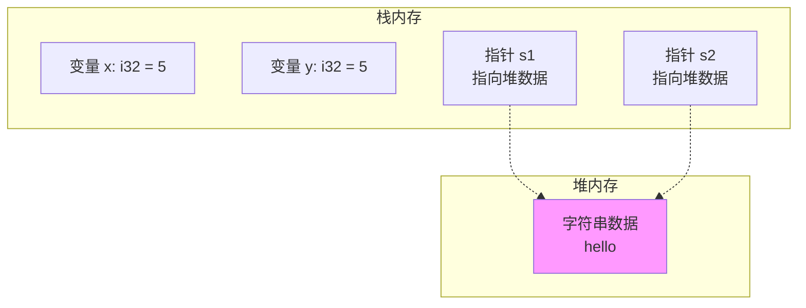
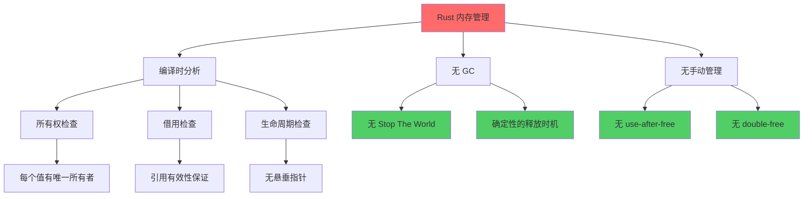
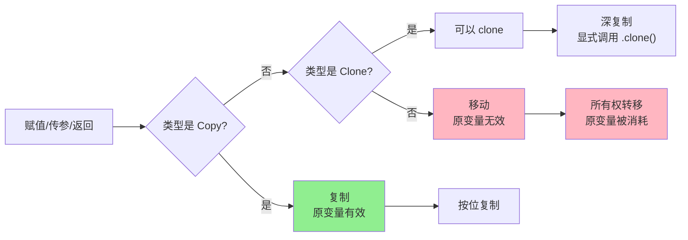
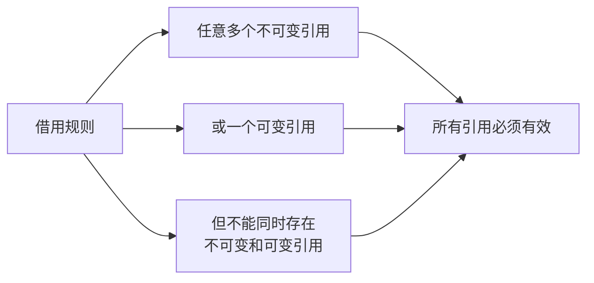
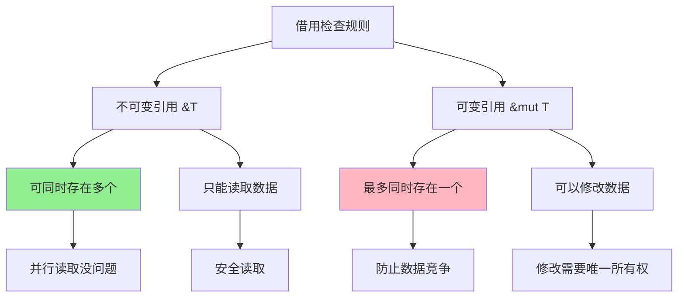
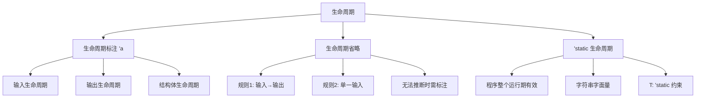
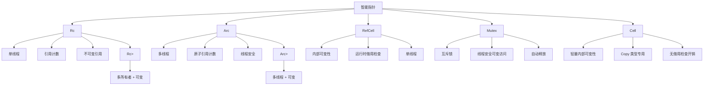
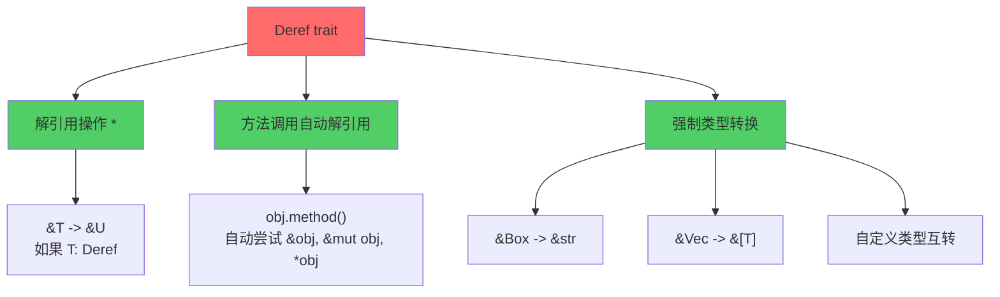

+++
title = "第 2 章 所有权系统"
weight = 20
date = "2026-03-27T17:24:46+08:00"
type = "docs"
description = ""
isCJKLanguage = true
draft = false
+++

# Chapter-02 所有权系统（Ownership）

## 2.1 所有权概述

欢迎来到 Rust 最独特、最核心的概念——**所有权系统**（Ownership System）！

如果说 Rust 是一座大厦，那所有权就是这座大厦的地基。没有它，Rust 就不可能实现"内存安全 + 无 GC + 零成本抽象"的三位一体神话。

想象一下，如果有一个神奇的管家，能在你写代码的时候帮你记住：
- 这块内存是谁的？
- 什么时候该释放这块内存？
- 谁能访问这块内存？

这个管家就是 Rust 的所有权系统！它存在于**编译时**，不需要运行时开销，却能杜绝大多数内存安全问题！

#### 2.1.1 什么是所有权

##### 2.1.1.1 所有权三条规则

Rust 的所有权系统有三条铁律，必须牢记：

```rust
fn main() {
    // 规则1：每个值都有一个所有者（owner）
    let s = String::from("hello"); // s 是这个 String 的所有者
    
    // 规则2：每个值同时只能有一个所有者
    let s2 = s; // 所有权从 s 转移（move）到 s2
    // println!("{}", s); // 编译错误！s 已经无效了！
    println!("{}", s2); // 正确！s2 才是合法所有者
    
    // 规则3：当所有者离开作用域时，值会被丢弃（drop）
    {
        let temp = String::from("临时数据");
        println!("{}", temp);
    } // temp 在这里被自动释放
    // println!("{}", temp); // 编译错误！temp 已经不存在了
}
```

> 简单来说：谁创建，谁拥有，谁负责释放。—— 多么简洁公平的所有制！不像你室友，借了你的薯片，吃完了还假装不知道是谁吃的。

##### 2.1.1.2 所有权与内存管理的关系

传统的内存管理方式有三种：

| 方式 | 代表语言 | 原理 | 优点 | 缺点 |
|------|----------|------|------|------|
| 手动管理 | C/C++ | 程序员手动 malloc/free | 性能极致 | 容易出错、内存泄漏 |
| GC | Java/Go/Python | 运行时自动追踪并回收 | 安全 | 有性能开销、程序停顿 |
| 所有权 | Rust | 编译时分析，编译器插入释放代码 | 安全 + 高效 | 学习曲线陡峭 |

```rust
// Rust 的内存管理：编译器帮你生成释放代码
fn main() {
    let s = String::from("hello");
    // 编译器自动插入：s.drop() 或 free(s)
} // 作用域结束，s 被自动清理
```

##### 2.1.1.3 堆上数据 vs 栈上数据的区别

在 Rust 里，**栈上数据**（如整数、布尔等固定大小的类型）存储在栈内存，**堆上数据**（如 String、Vec 等动态大小的类型）存储在堆内存。

```rust
fn main() {
    // 栈上数据：存储在栈内存，复制成本低
    let x = 5; // i32 是 Copy 类型，值直接复制
    let y = x; // 完整复制了一份
    println!("x = {}, y = {}", x, y); // x = 5, y = 5
    
    // 堆上数据：存储在堆内存，复制成本高
    let s1 = String::from("hello"); // String 存的是指针，在栈上；数据在堆上
    let s2 = s1; // 只是复制了指针（所有权转移），不是整个字符串！
    // 移动后 s1 失效了，编译器保证它不会被用来访问数据，自然不会双重释放
    // println!("{}", s1); // 编译错误！s1 的所有权已转移
    println!("{}", s2); // 正确！
}
```



#### 2.1.2 内存管理方式对比

##### 2.1.2.1 垃圾回收（GC）

```java
// Java/Python：GC 自动回收
public class MemoryExample {
    public static void main(String[] args) {
        String s = new String("hello");
        s = null; // 没人引用了，GC 会回收这块内存
        // 但 GC 什么时候运行是不确定的
        // 而且 GC 会带来"Stop The World"停顿
    }
}
```

GC 的问题：
- **不确定的回收时机**：你不知道内存什么时候被释放
- **运行时开销**：GC 线程持续消耗 CPU
- **内存占用高**：GC 需要堆空间来追踪对象
- **程序停顿**：GC 回收时程序会暂停

##### 2.1.2.2 手动管理

```c
// C：手动管理内存
char* strdup(const char* s) {
    char* p = malloc(strlen(s) + 1); // 分配内存
    if (p) {
        strcpy(p, s); // 复制数据
    }
    return p; // 返回指针
} // 调用者必须记得 free(p)，否则内存泄漏！

void leak_example() {
    char* s = strdup("hello");
    // 忘记 free(s) 就退出了？内存泄漏！
    // 或者 free(s) 之后又访问？悬垂指针！
}
```

手动管理的问题：
- **内存泄漏**：忘记释放
- **悬垂指针**：释放后继续访问
- **双重释放**：同一块内存释放两次
- **数据竞争**：多线程同时访问

##### 2.1.2.3 所有权系统

```rust
// Rust：编译器保证内存安全
fn main() {
    let s = String::from("hello");
    // ... 使用 s ...
} // 作用域结束，s 自动释放
// 没有 GC，没有手动 free，但绝对不会泄漏！

fn dangle() -> &String {
    let s = String::from("hello");
    &s // 编译错误！不能返回局部变量的引用！
} // s 在这里被释放，返回的引用变成悬垂引用
```

Rust 的保证：
- **无内存泄漏**：编译器保证每个值都被正确释放
- **无悬垂指针**：引用必须始终有效
- **无数据竞争**：借用规则保证线程安全
- **零运行时开销**：所有检查都在编译时完成

##### 2.1.2.4 引用计数

```swift
// Swift：自动引用计数（ARC）
class Person {
    let name: String
    init(name: String) {
        self.name = name
    }
    deinit {
        print("\(name) 被释放")
    }
}

var person1: Person? = Person(name: "Alice")
var person2 = person1 // 引用计数 +1
var person3 = person1 // 引用计数 +1

person1 = nil // 引用计数 -1，但还有 person2、person3
person2 = nil // 引用计数 -1，但还有 person3
person3 = nil // 引用计数 -1，变为 0，对象被释放

// ARC 比 GC 轻量，但仍然有运行时开销
// 而且循环引用会导致内存泄漏（需要 weak 打破）
```

引用计数的问题：
- 循环引用会导致内存泄漏
- 维护引用计数有运行时开销
- 不确定何时释放（最后一个引用消失时）

#### 2.1.3 为什么 Rust 选择所有权模型

##### 2.1.3.1 零成本抽象的原则

Rust 的口号是"零成本抽象"——如果你不使用某个特性，就不会有任何开销。

```rust
// 抽象示例
fn sum(numbers: &[i32]) -> i32 {
    numbers.iter().sum()
}

fn main() {
    let arr = [1, 2, 3, 4, 5];
    println!("{}", sum(&arr)); // 15
}
```

这段代码看起来很抽象（使用了迭代器、闭包等），但编译后的性能和手写循环几乎一样！为什么？因为这些抽象都是"零成本"的——编译器会内联并优化掉所有开销。

所有权系统也一样：
- 如果你只使用栈上的 `Copy` 类型，编译器和 C 代码一样高效
- 如果你使用堆上的 `Move` 类型，编译器确保安全释放，没有 GC 开销

##### 2.1.3.2 编译期内存安全检查

```rust
fn main() {
    let s = String::from("hello");
    let s2 = s;
    // println!("{}", s); // 编译错误！所有权已转移
}
```

这个错误是在**编译时**发现的，而不是运行时！这意味着：
- 不会产生运行时开销
- 不会产生安全漏洞
- 不会产生内存泄漏

##### 2.1.3.3 无运行时开销

```rust
fn main() {
    let s = String::from("hello");
    // 编译后相当于 C 代码：
    // char* s = malloc(6);
    // strcpy(s, "hello");
    // ...
    // free(s);
} // 作用域结束，自动释放，没有 GC 暂停！
```

Rust 的目标：**既有 C/C++ 的性能，又有 Python/Java 的安全**。

mermaid


---

### 2.2 移动语义（Move Semantics）

移动语义是 Rust 所有权系统的核心概念之一。当我们把一个值赋给另一个变量、传给函数、或者从函数返回时，所有权可能会"移动"。理解移动语义，是掌握 Rust 的关键！

#### 2.2.1 移动的定义

##### 2.2.1.1 移动语义的概念

移动（Move）意味着**所有权的转移**。当一个值被"移动"后，原来的变量就不再有效了。

```rust
fn main() {
    let s1 = String::from("hello"); // s1 拥有这个字符串
    let s2 = s1; // 所有权从 s1 移动到 s2
    
    // 现在 s1 无效了！
    // println!("{}", s1); // 编译错误！
    
    println!("{}", s2); // 正确！s2 是合法所有者
}
```

> 想象一下：你把房子钥匙给了别人（移动），你自己就没有钥匙了（不能访问）。

##### 2.2.1.2 移动后原变量不可再使用

这是编译器强制保证的：

```rust
fn main() {
    let v = vec![1, 2, 3]; // v 拥有这个向量
    let v2 = v; // 所有权移动到 v2
    
    // v 已经无效，以下代码都会编译错误：
    // println!("{:?}", v); // 错误！
    // v.push(4); // 错误！
    // let v3 = v; // 错误！
    
    println!("{:?}", v2); // 正常！v2 是合法所有者
}
```

#### 2.2.2 移动的触发条件

##### 2.2.2.1 赋值操作中的移动

```rust
fn main() {
    // 基本赋值
    let s1 = String::from("hello");
    let s2 = s1; // 移动！
    
    // println!("{}", s1); // 错误！s1 已无效
    println!("{}", s2); // 正确
    
    // 元组中的移动
    let t1 = (String::from("a"), String::from("b"));
    let t2 = t1; // 整个元组移动
    // println!("{:?}", t1); // 错误！
    println!("{:?}", t2); // 正确
    
    // 解构赋值中的移动
    let t3 = (String::from("x"), String::from("y"));
    let (a, b) = t3; // 解构时移动
    // println!("{:?}", t3); // 错误！
    println!("a = {}, b = {}", a, b); // 正确
}
```

##### 2.2.2.2 函数参数传递中的移动

```rust
fn main() {
    let s = String::from("hello");
    
    take_ownership(s); // s 的所有权移动到函数
    
    // println!("{}", s); // 错误！s 已无效
}

fn take_ownership(text: String) {
    println!("收到了: {}", text);
} // text 在这里被 drop，字符串被释放
```

##### 2.2.2.3 函数返回值中的移动

```rust
fn main() {
    let s = create_string(); // 返回值移动到 s
    
    println!("{}", s); // 正确
}

fn create_string() -> String {
    let s = String::from("hello");
    s // s 的所有权返回给调用者
} // 不需要 drop，因为所有权已经转移
```

##### 2.2.2.4 模式匹配中的移动

```rust
fn main() {
    let option: Option<String> = Some(String::from("hello"));
    
    match option {
        Some(s) => println!("收到了: {}", s),
        None => println!("没有值"),
    }
    
    // option 已经被移动到 match 中，不能再使用
    // println!("{:?}", option); // 错误！
}
```

#### 2.2.3 堆上数据的移动

##### 2.2.3.1 Box<T> 的移动

```rust
fn main() {
    let b1 = Box::new(String::from("hello"));
    let b2 = b1; // Box 的所有权移动
    
    // println!("{}", b1); // 错误！
    println!("{}", b2); // 正确
    
    // Box 是一种智能指针，解引用 *b 访问的是堆上的数据
    println!("解引用: {}", *b2); // 解引用: hello
}
```

##### 2.2.3.2 Vec<T> / String / HashMap 等集合的移动

```rust
fn main() {
    // Vec 的移动
    let v1 = vec![1, 2, 3];
    let v2 = v1; // v1 移动到 v2
    // println!("{:?}", v1); // 错误！
    println!("{:?}", v2); // 正确
    
    // String 的移动
    let s1 = String::from("hello");
    let s2 = s1; // s1 移动到 s2
    // println!("{}", s1); // 错误！
    println!("{}", s2); // 正确
    
    // HashMap 的移动
    use std::collections::HashMap;
    let mut m1 = HashMap::new();
    m1.insert("key", "value");
    let m2 = m1; // 移动
    // println!("{:?}", m1); // 错误！
    println!("{:?}", m2); // 正确
}
```

##### 2.2.3.3 自定义类型（struct / enum）的移动行为

```rust
struct Person {
    name: String,
    age: u32,
}

fn main() {
    let p1 = Person {
        name: String::from("Alice"),
        age: 30,
    };
    let p2 = p1; // 整个结构体移动
    
    // p1 已经无效，访问 p1 的任何字段都会报错
    // println!("{}", p1.name); // 错误！
    println!("{}", p2.name); // 正确
    
    // 枚举的移动行为也一样
    enum Message {
        Text(String),
        Quit,
    }
    
    let msg1 = Message::Text(String::from("hello"));
    let msg2 = msg1; // 移动
    // if let Message::Text(s) = msg1 { } // 错误！
    if let Message::Text(s) = msg2 {
        println!("收到文本: {}", s); // 正确
    }
}
```

##### 2.2.3.4 移动后底层数据重新分配

```rust
fn main() {
    // 移动操作只复制指针，不会重新分配堆数据
    let s1 = String::from("hello");
    let addr1 = s1.as_ptr() as usize; // 记录地址
    
    let s2 = s1;
    let addr2 = s2.as_ptr() as usize;
    
    // 两个字符串指向同一块堆内存
    println!("s1 地址: {:#x}", addr1); // s1 地址: 0x...
    println!("s2 地址: {:#x}", addr2); // s2 地址: 0x...（相同！）
    
    // 移动没有复制数据，只是复制了指针
}
```

#### 2.2.4 栈上数据的复制（Copy Trait）

##### 2.2.4.1 Copy trait 的定义

和移动相反，实现了 `Copy` trait 的类型会**按位复制**，原变量仍然有效：

```rust
fn main() {
    let x = 5;
    let y = x; // x 按位复制到 y，x 仍然有效！
    
    println!("x = {}, y = {}", x, y); // x = 5, y = 5
    
    // 整数类型默认实现了 Copy trait
    let a: i32 = 100;
    let b = a;
    println!("a = {}, b = {}", a, b); // a = 100, b = 100
}
```

##### 2.2.4.2 哪些类型是 Copy

```rust
fn main() {
    // 基本类型都是 Copy
    let a: i8 = 1;
    let b = a; // 复制
    
    let a: i16 = 1;
    let b = a; // 复制
    
    let a: i32 = 1;
    let b = a; // 复制
    
    let a: i64 = 1;
    let b = a; // 复制
    
    let a: i128 = 1;
    let b = a; // 复制
    
    let a: isize = 1;
    let b = a; // 复制
    
    // 无符号整数
    let a: u8 = 1;
    let b = a; // 复制
    
    // 浮点数
    let a: f32 = 1.0;
    let b = a; // 复制
    
    let a: f64 = 1.0;
    let b = a; // 复制
    
    // 布尔
    let a: bool = true;
    let b = a; // 复制
    
    // 字符
    let a: char = 'a';
    let b = a; // 复制
    
    // 单元类型
    let a: () = ();
    let b = a; // 复制
    
    // 元组（如果所有元素都是 Copy）
    let a: (i32, i32) = (1, 2);
    let b = a; // 复制！因为 i32 是 Copy
    
    // 固定大小数组（如果元素都是 Copy）
    let a: [i32; 3] = [1, 2, 3];
    let b = a; // 复制！因为 i32 是 Copy
}
```

##### 2.2.4.3 Copy 与 Clone 的关系

```rust
// 关系：实现了 Copy 的类型，必然也实现了 Clone
// （因为 Clone::clone() 对 Copy 类型来说就是按位复制，没有额外成本）
//
// 区别：Copy 不能自定义，永远是按位复制
//      Clone 可以自定义复制行为（如深复制）

fn main() {
    let s1 = String::from("hello");
    // let s2 = s1; // 移动，因为 String 不是 Copy
    let s2 = s1.clone(); // 克隆（深复制），显式操作
    println!("s1 = {}, s2 = {}", s1, s2); // 都有效！
}
```

##### 2.2.4.4 所有字段都是 Copy 时结构体才是 Copy

```rust
// 所有字段都是 Copy，结构体也是 Copy！
struct Point {
    x: f64, // f64 是 Copy
    y: f64, // f64 是 Copy
}

fn main() {
    let p1 = Point { x: 1.0, y: 2.0 };
    let p2 = p1; // 复制！因为所有字段都是 Copy

    println!("p1.x = {}, p2.x = {}", p1.x, p2.x); // p1 和 p2 都有效！
}

// 但如果有一个字段不是 Copy，那整个结构体就不能是 Copy：
struct Person {
    name: String, // String 不是 Copy，是移动语义！
    age: u32,     // u32 是 Copy
}

fn demonstrate_person_move() {
    let p1 = Person {
        name: String::from("Alice"),
        age: 30,
    };
    let p2 = p1; // 移动！因为 name 不是 Copy

    // println!("{}", p1.name); // 编译错误！p1 已经无效了
    println!("{} 今年 {} 岁", p2.name, p2.age); // 正确！
}

fn main() {
    demonstrate_person_move();
}
```

#### 2.2.5 移动后的使用限制

##### 2.2.5.1 移动后变量不可再使用

```rust
fn main() {
    let v = vec![1, 2, 3];
    
    let v2 = v; // 移动
    
    // 编译错误：use of moved value: `v`
    // println!("{:?}", v);
    
    // 所有这些操作都会导致编译错误：
    // let v3 = v;
    // v.push(4);
    // v.len();
}
```

##### 2.2.5.2 编译器错误示例分析

```rust
fn main() {
    let s = String::from("hello");
    let s2 = s;
    
    // 编译器会报错：
    // error[E0382]: use of moved value: `s`
    // println!("{}", s);
    
    // 错误信息：
    // "value borrowed here after move"
    // "help: consider cloning the value if it is expensive"
    // `s.clone()` 会解决这个问题，但有性能开销
    
    println!("{}", s2); // 这行没问题
}
```

#### 2.2.6 移动与函数参数

##### 2.2.6.1 按值传递与所有权转移

```rust
fn main() {
    let s = String::from("hello");
    
    call_with_move(s); // s 的所有权移动到函数
    
    // s 已经无效
    // println!("{}", s); // 编译错误！
}

fn call_with_move(text: String) {
    println!("收到了: {}", text);
} // text 在这里被 drop
```

##### 2.2.6.2 借用作为替代方案

```rust
fn main() {
    let s = String::from("hello");
    
    call_with_borrow(&s); // 只借用，不获取所有权
    
    // s 仍然有效！
    println!("调用后: {}", s); // 调用后: hello
}

fn call_with_borrow(text: &String) {
    println!("借来的字符串: {}", text);
} // text 是借用，不拥有数据，不负责 drop
```

#### 2.2.7 返回值与所有权转移

##### 2.2.7.1 函数返回值的所有权

```rust
fn main() {
    let s = create_string();
    println!("{}", s); // hello
}

fn create_string() -> String {
    let s = String::from("hello");
    s // 所有权返回给调用者
} // 函数结束时不会 drop，因为所有权已经转移
```

##### 2.2.7.2 所有权模式

函数可以获取并返回所有权：

```rust
fn take_and_return(text: String) -> String {
    // text 在这里获取所有权
    let processed = text.to_uppercase();
    processed // 所有权转移给调用者
}

fn main() {
    let original = String::from("hello");
    let result = take_and_return(original);
    // original 已经被移动到函数中
    
    println!("结果: {}", result); // 结果: HELLO
}
```

##### 2.2.7.3 借用模式

更常见的做法是借用数据，不获取所有权：

```rust
fn calculate_length(text: &String) -> usize {
    text.len()
}

fn main() {
    let s = String::from("hello");
    let len = calculate_length(&s);
    
    println!("'{}' 的长度是 {}", s, len);
    // s 仍然有效！
}
```

mermaid


---

### 2.3 借用（Borrowing）

借用是 Rust 里最重要的概念之一！它让你可以在不获取所有权的情况下访问数据。想象一下：你去图书馆借书，书还是图书馆的，但你有了使用权。看完不还？那可是要被拉黑的——Rust 的借用检查器可比图书馆管理员严格多了。

#### 2.3.1 引用的基本语法

##### 2.3.1.1 引用符号：&

```rust
fn main() {
    let s = String::from("hello");
    
    // 创建引用：用 & 符号
    let r = &s; // r 是 s 的引用，不获取所有权
    
    // 通过引用访问数据
    println!("引用指向的值: {}", r); // hello
    println!("原始值: {}", s); // s 仍然有效！
}
```

##### 2.3.1.2 解引用符号：*

解引用就是通过引用访问它指向的数据：

```rust
fn main() {
    let s = String::from("hello");
    let r = &s;
    
    // 解引用：用 * 符号
    println!("解引用: {}", *r); // hello
    
    // 对于实现了 Copy 的类型，解引用可以直接使用
    let x = 5;
    let r = &x;
    let y = *r; // 解引用得到 i32 值
    println!("x = {}, y = {}", x, y); // x = 5, y = 5
}
```

##### 2.3.1.3 引用作为函数参数

```rust
fn main() {
    let s = String::from("hello");
    
    // 传入引用
    print_string(&s);
    
    // s 仍然有效
    println!("main 中: {}", s); // main 中: hello
}

fn print_string(s: &String) {
    println!("print_string 中: {}", s); // print_string 中: hello
} // s 是引用，不拥有数据，不会触发 drop
```

#### 2.3.2 不可变引用

##### 2.3.2.1 &T 的创建

不可变引用允许你读取数据，但不能修改：

```rust
fn main() {
    let s = String::from("hello");
    
    // 不可变引用：&T
    let r = &s;
    
    // 只能读取
    println!("读取: {}", r);
    println!("读取: {}", s);
    
    // 不能修改
    // r.push_str(" world"); // 编译错误！r 是不可变引用
}
```

##### 2.3.2.2 不可变引用的特性

**可以同时存在任意多个不可变引用！**

```rust
fn main() {
    let s = String::from("hello");
    
    // 多个不可变引用完全OK！
    let r1 = &s;
    let r2 = &s;
    let r3 = &s;
    
    println!("{}, {}, {}", r1, r2, r3);
    
    // 不可变引用可以在同一作用域存在多个
    // 因为没有人会修改数据，所以是安全的
}
```

#### 2.3.3 可变引用

##### 2.3.3.1 &mut T 的创建

可变引用允许你修改数据：

```rust
fn main() {
    let mut s = String::from("hello");
    
    // 可变引用：&mut T
    let r = &mut s;
    
    // 可以修改
    r.push_str(", world");
    println!("修改后: {}", r); // 修改后: hello, world
    
    // 注意：s 本身也是可变的，所以 &mut s 是合法的
}
```

##### 2.3.3.2 可变引用的特性

**同时只能存在一个可变引用！**

```rust
fn main() {
    let mut s = String::from("hello");
    
    let r1 = &mut s;
    // let r2 = &mut s; // 编译错误！不能同时存在两个可变引用
    
    r1.push_str(", world");
    println!("{}", r1); // hello, world
    
    // r1 在这里离开作用域，之后才能创建新的可变引用
}
```

这是为什么？因为多个可变引用可能导致数据竞争（data race）。想象一下你和你的室友同时往冰箱里塞东西——最后冰箱门可能都关不上，数据也是一样。

#### 2.3.4 借用规则

##### 2.3.4.1 借用规则

Rust 的借用规则总结如下：

```rust
fn main() {
    // 规则1：你可以有任意多个不可变引用
    let s = String::from("hello");
    let r1 = &s;
    let r2 = &s;
    let r3 = &s;
    println!("{}, {}, {}", r1, r2, r3);
    
    // 规则2：或者（OR）一个可变引用，但不能同时存在！
    let mut s2 = String::from("hello");
    let r = &mut s2;
    r.push_str("!");
    // let r2 = &s2; // 错误！不能同时有可变引用和不可变引用
    
    // 规则3：引用必须始终有效（不能引用已释放的数据）
}
```

**借用规则总结：**



##### 2.3.4.2 规则二：引用必须始终有效

```rust
fn main() {
    // 悬垂引用：引用了一个已经不存在的值
    // let r = dangle(); // 编译错误！
}

fn dangle() -> &String {
    let s = String::from("hello");
    &s // 返回 s 的引用，但 s 即将被销毁！
} // s 在这里被 drop，返回的引用无效
```

##### 2.3.4.3 违反借用规则的编译错误分析

```rust
fn main() {
    let mut s = String::from("hello");
    
    // 错误示例1：同时存在不可变和可变引用
    let r1 = &s; // 不可变引用
    let r2 = &mut s; // 可变引用！
    // 编译错误：cannot borrow `s` as mutable because it is also borrowed as immutable
    
    println!("{}, {}", r1, r2);
}
```

```rust
fn main() {
    let mut s = String::from("hello");
    
    // 错误示例2：在使用不可变引用之前修改数据
    let r = &s;
    s.push_str(", world"); // 编译错误！
    println!("{}", r);
}
```

```rust
fn main() {
    let mut s = String::from("hello");
    
    // 正确做法：可变引用用完再创建不可变引用
    s.push_str(", world"); // 先修改
    let r = &s; // 再借用
    println!("{}", r); // 最后使用
}
```

#### 2.3.5 借用检查器（Borrow Checker）

##### 2.3.5.1 借用检查器的工作原理

借用检查器是 Rust 编译器的一部分，负责检查所有借用是否合法。它基于**生命周期**（lifetimes）进行分析。

```rust
fn main() {
    let mut s = String::from("hello");
    
    let r = &s; // r 的生命周期从这里开始
    
    // 在 r 的生命周期内，不能修改 s
    // s.push_str(", world"); // 编译错误！
    
    println!("{}", r); // 最后一次使用 r
} // r 的生命周期在这里结束
```

##### 2.3.5.2 NLL（Non-Lexical Lifetimes，Rust 2018）

NLL 是 Rust 2018 引入的重大改进。之前的借用检查器基于**词法作用域**（lexical scope），简单但保守；现在的 NLL 基于**实际使用处**，更聪明也更宽松。——说白了，编译器终于学会"用完就放手"这个道理了。

```rust
// 旧版 Rust（词法作用域）：
fn main() {
    let mut s = String::from("hello");
    
    let r = &s; // r 的作用域从这里开始
    
    if true {
        println!("{}", r); // r 仍然在使用
    }
    
    // r 的作用域到函数结束，但实际上只需要到这里
    s.push_str(", world"); // 旧版编译器报错，新版不报错！
}
```

```rust
// Rust 2018+（NLL）：
fn main() {
    let mut s = String::from("hello");
    
    let r = &s;
    println!("{}", r); // 最后一次使用 r
    
    // 从这里开始，r 的生命周期已经结束
    // 可以安全地修改 s
    s.push_str(", world"); // ✅ NLL 允许这样做！
    println!("{}", s);
}
```

##### 2.3.5.3 NLL 的改进效果

```rust
// 之前的 Rust 版本无法编译这段代码：
fn main() {
    let mut v = vec![1, 2, 3];
    
    let first = &v[0]; // 借用 vec
    println!("第一个元素: {}", first);
    
    v.push(4); // 之前会报错，因为 first 的借用还没结束
    // NLL 之后：first 在 println! 后就不再使用了
    // 所以 push 是安全的
}
```

#### 2.3.6 借用与函数参数

##### 2.3.6.1 借用作为函数参数

借用传参是最常见的用法：

```rust
fn main() {
    let s = String::from("hello");
    
    // 传入不可变引用
    let len = get_length(&s);
    println!("'{}' 的长度是 {}", s, len); // s 仍然有效
    
    // 传入可变引用
    let mut s2 = String::from("hello");
    modify(&mut s2);
    println!("修改后: {}", s2); // 修改后: hello, world!
}

fn get_length(s: &String) -> usize {
    s.len()
}

fn modify(s: &mut String) {
    s.push_str(", world");
}
```

##### 2.3.6.2 从函数返回引用

返回引用时，必须确保返回的引用是有效的：

```rust
fn main() {
    let s = String::from("hello");
    let r = first_char(&s);
    println!("第一个字符: {}", r); // 第一个字符: h
}

// 正确：返回指向函数参数引用的引用
fn first_char(s: &String) -> &char {
    &s.chars().next().unwrap()
}
```

```rust
// 错误：返回指向局部变量的引用
// fn dangle() -> &String {
//     let s = String::from("hello");
//     &s // 错误！s 即将被销毁！
// }
```

---

mermaid


---

### 2.4 生命周期（Lifetime）概述

生命周期是 Rust 最抽象的概念之一，但它其实是让 Rust 实现内存安全的关键！生命周期描述的是**引用有效的作用域**。

#### 2.4.1 什么是生命周期

##### 2.4.1.1 生命周期的概念

每一个引用都有自己的"生命周期"——它是引用有效的代码区域：

```rust
fn main() {
    let r; // 声明一个引用，此时生命周期开始
    
    {
        let x = 5;
        r = &x; // r 引用 x
        println!("r: {}", r); // OK，x 仍然有效
    } // x 在这里被销毁
    
    // println!("r: {}", r); // 错误！r 引用了已销毁的 x！
}
```

##### 2.4.1.2 生命周期与引用的有效性

```rust
fn main() {
    // 场景1：引用在作用域内始终有效
    let s = String::from("hello");
    let r = &s;
    println!("{}", r); // OK，s 仍然有效
    
    // 场景2：引用指向临时值（错误）
    // let r;
    // {
    //     let x = 5;
    //     r = &x;
    // }
    // println!("{}", r); // 错误！x 已经销毁！
}
```

#### 2.4.2 生命周期标注语法

##### 2.4.2.1 'a 语法

生命周期参数用单引号开头：

```rust
// 'a 读作 "tick a"，是生命周期的名字
fn longest<'a>(s1: &'a str, s2: &'a str) -> &'a str {
    if s1.len() > s2.len() {
        s1
    } else {
        s2
    }
}

fn main() {
    let s1 = String::from("hello");
    let result;
    {
        let s2 = String::from("world");
        result = longest(&s1, &s2);
        println!("最长: {}", result); // OK
    }
    // println!("最长: {}", result); // 错误！s2 已经销毁
}
```

##### 2.4.2.2 &'a T 的含义

```rust
// &'a T 表示"生命周期为 'a 的 T 引用"
fn print(s: &'static str) {
    println!("{}", s);
}

fn main() {
    // 字符串字面量有 'static 生命周期
    print("hello"); // "hello" 的生命周期是 'static
}
```

##### 2.4.2.3 多生命周期参数

```rust
fn main() {
    // 多个生命周期参数
    fn multiple<'a, 'b>(s1: &'a str, s2: &'b str) -> &'a str {
        // 返回值的生命周期和 s1 相同
        s1
    }
    
    let s1 = String::from("hello");
    let s2 = String::from("world");
    let r = multiple(&s1, &s2);
    println!("{}", r);
}
```

#### 2.4.3 生命周期省略规则（Elision，三条规则）

很多情况下，生命周期可以省略，因为编译器会自动推断。Rust 有三条生命周期省略规则：

##### 2.4.3.1 输入生命周期省略规则

```rust
// 规则1：如果函数有参数引用，参数引用的生命周期成为输出生命周期
fn first_char(s: &str) -> &char {
    &s.chars().next().unwrap()
}

// 编译器推断后等价于：
fn first_char<'a>(s: &'a str) -> &'a char {
    &s.chars().next().unwrap()
}
```

##### 2.4.3.2 输出生命周期省略规则

```rust
// 规则2：如果函数只有一个输入生命周期参数，它会被赋给所有输出生命周期
// （注意：这是简化说法，实际规则更复杂，但适用于大多数简单情况）
fn get_string(s: &String) -> &String {
    s // 返回的是输入参数本身，不是它的某个部分
}

// 编译器推断后等价于：
fn get_string<'a>(s: &'a String) -> &'a String {
    s
}
```

##### 2.4.3.3 无法省略时的显式标注

```rust
// 当编译器无法推断时，必须显式标注
fn longest<'a>(x: &'a str, y: &str) -> &'a str {
    // 这里返回值的生命周期应该和 x 相同
    // 因为返回的可能是 x（我们只知道 x 的生命周期）
    if x.len() > y.len() { x } else { y }
}

// 无法推断的示例：
// fn ambiguous(x: &str, y: &str) -> &str { ... }
// 编译器不知道返回的是 x 还是 y，所以必须标注生命周期
```

```rust
// 常见编译错误 E0106：
// error[E0106]: missing lifetime specifier
// fn get_first(x: &str, y: &str) -> &str { ... }
//
// 修复：显式标注生命周期
fn get_first<'a>(x: &'a str, _y: &str) -> &'a str {
    x
}
```

#### 2.4.4 结构体中的生命周期

##### 2.4.4.1 struct &'a str

当结构体持有引用时，必须标注生命周期：

```rust
// 结构体持有引用，必须标注生命周期
struct ImportantExcerpt<'a> {
    part: &'a str, // 这个引用的生命周期是 'a
}

fn main() {
    let novel = String::from("Call me Ishmael. Some years ago...");
    let first_sentence = novel.split('.').next().unwrap();
    
    let excerpt = ImportantExcerpt {
        part: first_sentence,
    };
    
    println!("{}", excerpt.part);
}
```

##### 2.4.4.2 多引用字段的生命周期

```rust
struct MultiRefs<'a, 'b> {
    first: &'a str,
    second: &'b str,
}

fn main() {
    let s1 = String::from("hello");
    let s2 = String::from("world");
    
    let multi = MultiRefs {
        first: &s1,
        second: &s2,
    };
    
    println!("{} {}", multi.first, multi.second);
}
```

#### 2.4.5 生命周期子类型

##### 2.4.5.1 'a: 'b

`'a: 'b` 表示"`'a` 至少和 `'b` 一样长"，或者说"`'a` outlives `'b`"：

```rust
// 'a: 'b 意味着 'a 比 'b 活得久
fn longest_valid<'a, 'b>(s1: &'a str, _s2: &'b str) -> &'a str
where
    'a: 'b, // 'a 必须 outlive 'b
{
    s1
}

fn main() {
    let s1 = String::from("hello");
    let result;
    {
        let s2 = String::from("world");
        // result 引用 s1，但 result 的生命周期需要和 s2 比较
        result = longest_valid(&s1, &s2);
    }
    // s2 已经销毁
    println!("{}", result); // OK，因为 s1 仍然有效
}
```

##### 2.4.5.2 生命周期约束

```rust
// 生命周期约束：'a: 'b 表示 'a outlives 'b
struct Context<'a, 'b> {
    name: &'a str,
    data: &'b str,
}

impl<'a, 'b> Context<'a, 'b> {
    fn new(name: &'a str, data: &'b str) -> Self {
        Context { name, data }
    }
    
    // 方法的生命周期约束
    fn get_name(&self) -> &'a str {
        self.name
    }
}

fn main() {
    let ctx = Context::new("Alice", "some data");
    println!("{}", ctx.get_name());
}
```

#### 2.4.6 静态生命周期

##### 2.4.6.1 'static 的含义

`'static` 生命周期意味着"程序整个运行期间都有效"：

```rust
fn main() {
    // 字符串字面量有 'static 生命周期
    let s: &'static str = "我可以在程序任何地方使用";
    println!("{}", s);
}
```

##### 2.4.6.2 字符串字面量的 'static 生命周期

```rust
fn main() {
    // 字符串字面量存储在程序二进制中
    // 所以它们在整个程序运行期间都有效
    let s: &str = "hello";
    print_str(s); // 传入 'static 引用
}

fn print_str(s: &'static str) {
    println!("{}", s);
}
```

##### 2.4.6.3 const / static 变量的隐含 'static

```rust
// const 变量有 'static 生命周期
const PI: f64 = 3.14159;

// static 变量也有 'static 生命周期
static GREETING: &str = "Hello, World!";

fn main() {
    println!("PI: {}", PI);
    println!("GREETING: {}", GREETING);
}
```

##### 2.4.6.4 T: 'static 约束

`T: 'static` 表示"T 不包含任何非 'static 引用"：

```rust
// T: 'static 约束通常用于泛型
fn print_all<T: std::fmt::Display + 'static>(t: T) {
    println!("{}", t);
}

fn main() {
    // 整数是 'static
    print_all(42);
    
    // String 也是 'static（拥有所有权）
    print_all(String::from("hello"));
    
    // 但引用类型需要小心：
    // 如果引用指向非 'static 数据，就不能传给需要 'static 的函数
    let s = String::from("hello");
    // print_all(&s); // 错误！&String 的生命周期是 'a，不是 'static
}
```

mermaid


---

### 2.5 高级所有权主题

这一节我们深入探讨 Rust 所有权系统的高级特性：智能指针。所有权系统配合智能指针，让 Rust 能够优雅地处理复杂的内存管理场景。

#### 2.5.1 Rc<T>：单线程引用计数智能指针

当需要多个所有者时，`Rc<T>`（Reference Counted）就派上用场了！

##### 2.5.1.1 Rc::new 创建引用计数

```rust
use std::rc::Rc;

fn main() {
    // 创建 Rc
    let rc = Rc::new(String::from("hello"));
    println!("初始引用计数: {}", Rc::strong_count(&rc)); // 1
}
```

##### 2.5.1.2 Rc::clone 增加引用计数

```rust
use std::rc::Rc;

fn main() {
    let rc1 = Rc::new(String::from("hello"));
    
    let rc2 = rc1.clone(); // 引用计数 +1
    let rc3 = rc1.clone(); // 引用计数 +1
    
    println!("rc1 引用计数: {}", Rc::strong_count(&rc1)); // 3
    println!("rc2 引用计数: {}", Rc::strong_count(&rc2)); // 3
    println!("rc3 引用计数: {}", Rc::strong_count(&rc3)); // 3
    
    // 所有 Rc 指向同一个数据
    println!("rc1: {}", rc1);
    println!("rc2: {}", rc2);
    println!("rc3: {}", rc3);
} // rc1, rc2, rc3 都离开作用域时，数据才被释放
```

##### 2.5.1.3 Rc::downgrade 创建弱引用

```rust
use std::rc::{Rc, Weak};

fn main() {
    let strong = Rc::new(String::from("hello"));
    let weak: Weak<String> = Rc::downgrade(&strong);
    
    println!("强引用计数: {}", Rc::strong_count(&strong)); // 1
    println!("弱引用计数: {}", Rc::weak_count(&strong)); // 1
    
    // 升级弱引用为强引用
    if let Some(strong_ref) = weak.upgrade() {
        println!("升级成功: {}", strong_ref);
    }
}
```

##### 2.5.1.4 Rc::strong_count / weak_count 查询计数

```rust
use std::rc::Rc;

fn main() {
    let rc = Rc::new(vec![1, 2, 3]);
    
    println!("初始计数: {}", Rc::strong_count(&rc)); // 1
    
    {
        let rc2 = rc.clone();
        println!("clone 后计数: {}", Rc::strong_count(&rc)); // 2
    }
    
    println!("rc2 销毁后计数: {}", Rc::strong_count(&rc)); // 1
}
```

##### 2.5.1.5 Rc<T> 不是 Send + Sync

```rust
use std::rc::Rc;

// Rc 不是线程安全的！
// fn not_thread_safe(rc: Rc<i32>) {
//     // 在多线程中使用 Rc 会导致编译错误
// }

fn main() {
    let rc = Rc::new(42);
    // 只能用于单线程！
}
```

> 如果需要在多线程间共享所有权，使用 `Arc<T>`！

#### 2.5.2 Arc<T>：原子引用计数（线程安全）

`Arc<T>`（Atomic Reference Counted）是 `Rc<T>` 的线程安全版本。

##### 2.5.2.1 Arc::new / Arc::clone

```rust
use std::sync::Arc;

fn main() {
    let arc = Arc::new(vec![1, 2, 3]);
    
    let arc2 = arc.clone();
    let arc3 = arc.clone();
    
    println!("arc 计数: {}", Arc::strong_count(&arc)); // 3
    println!("arc2 计数: {}", Arc::strong_count(&arc2)); // 3
    println!("arc3 计数: {}", Arc::strong_count(&arc3)); // 3
}
```

##### 2.5.2.2 Arc<T> 的 Send + Sync 保证

```rust
use std::sync::Arc;
use std::thread;

fn main() {
    let data = Arc::new(vec![1, 2, 3]);
    
    // 可以在多线程间共享
    let handle = thread::spawn({
        let data = data.clone();
        move || {
            println!("线程中读取: {:?}", data);
        }
    });
    
    println!("主线程读取: {:?}", data);
    
    handle.join().unwrap();
}
```

##### 2.5.2.3 Arc::make_mut（获取可变借用）

```rust
use std::sync::Arc;

fn main() {
    let arc = Arc::new(vec![1, 2, 3]);
    
    // Arc::make_mut 返回 &mut T
    // 如果有多个 Arc 引用，会触发克隆（写时复制）
    let mutable_ref = Arc::make_mut(&mut arc.clone());
    mutable_ref.push(4);
    
    println!("修改后: {:?}", arc);
}
```

##### 2.5.2.4 Arc::downgrade / Weak<T>

```rust
use std::sync::{Arc, Weak};

fn main() {
    let strong = Arc::new(vec![1, 2, 3]);
    let weak: Weak<Vec<i32>> = Arc::downgrade(&strong);
    
    println!("强引用计数: {}", Arc::strong_count(&strong));
    println!("弱引用计数: {}", Arc::weak_count(&strong));
    
    // 升级弱引用
    if let Some(upgraded) = weak.upgrade() {
        println!("升级成功: {:?}", upgraded);
    }
}
```

#### 2.5.3 RefCell<T>：内部可变性（单线程）

`RefCell<T>` 提供了**内部可变性**——在不可变引用的地方提供可变访问。

##### 2.5.3.1 RefCell<T> 的设计目的

```rust
use std::cell::RefCell;

fn main() {
    let data = RefCell::new(5);
    
    // 通过 borrow() 获取不可变引用
    let r = data.borrow();
    println!("当前值: {}", r);
}
```

##### 2.5.3.2 borrow() 返回 Ref<T>

```rust
use std::cell::RefCell;

fn main() {
    let data = RefCell::new(vec![1, 2, 3]);
    
    // borrow() 返回 Ref<T>，类似于 &T
    let r = data.borrow();
    println!("借用: {:?}", r);
    
    // 可以有多个不可变借用
    let r2 = data.borrow();
    println!("同时借用: {:?}, {:?}", r, r2);
    
    // r 和 r2 离开作用域后，借用结束
}
```

##### 2.5.3.3 borrow_mut() 返回 RefMut<T>

```rust
use std::cell::RefCell;

fn main() {
    let data = RefCell::new(vec![1, 2, 3]);
    
    // borrow_mut() 返回 RefMut<T>，类似于 &mut T
    let mut r = data.borrow_mut();
    r.push(4);
    println!("修改后: {:?}", r);
}
```

##### 2.5.3.4 借用冲突时 panic!

```rust
use std::cell::RefCell;

fn main() {
    let data = RefCell::new(5);
    
    let r1 = data.borrow(); // 不可变借用
    let r2 = data.borrow_mut(); // 可变借用冲突！
    // 运行时 panic: already borrowed: BorrowMutError
    
    println!("{}", r1); // 不会执行到这里
}
```

#### 2.5.4 Cell<T>：简单的内部可变性（单线程）

`Cell<T>` 是比 `RefCell<T>` 更轻量的选择，但只适用于 `Copy` 类型。

##### 2.5.4.1 Cell<T> 的设计目的

```rust
use std::cell::Cell;

fn main() {
    let data = Cell::new(5);

    // get() 获取值（按复制）
    println!("当前值: {}", data.get()); // 5

    // set() 设置值（按复制，因为 T 是 Copy）
    data.set(10);
    println!("设置后: {}", data.get()); // 10
}
```

##### 2.5.4.2 Cell<T> vs RefCell<T>

| 特性 | Cell<T> | RefCell<T> |
|------|---------|------------|
| 适用类型 | Copy 类型（简单值） | 任意类型（复杂结构也行） |
| 获取引用 | 不支持（没有 borrow()） | 支持（borrow()/borrow_mut()） |
| 开销 | 极低（只是简单复制） | 略高（运行时借用检查） |
| 适用场景 | 简单标量值的内部可变性 | 需要借用的复杂数据 |

```rust
use std::cell::Cell;

fn main() {
    let counter = Cell::new(0);

    // 每次调用都增加计数器
    fn increment(c: &Cell<i32>) {
        c.set(c.get() + 1);
    }

    increment(&counter);
    increment(&counter);
    increment(&counter);

    println!("计数器: {}", counter.get()); // 3
}
```

##### 2.5.4.3 RefCell<T> vs Cell<T> 怎么选

```rust
use std::cell::{Cell, RefCell};

// 如果你只需要修改 Copy 类型，用 Cell：
let count = Cell::new(0);
count.set(count.get() + 1);

// 如果你需要借用数据（引用），用 RefCell：
let text = RefCell::new(String::from("hello"));
text.borrow_mut().push_str(", world");
println!("{}", text.borrow());

// 如果你需要在多线程间共享，用 Arc<Mutex<T>> 或 Arc<RwLock<T>>
```

> 💡 小技巧：`&Cell<T>` 和 `&RefCell<T>` 都实现了 `Copy`，所以可以轻易地在多个地方共享修改能力！

#### 2.5.5 组合模式：Rc<RefCell<T>> / Arc<Mutex<T>> / Arc<RwLock<T>>

组合使用这些智能指针可以应对各种复杂场景！

##### 2.5.5.1 Rc<RefCell<T>>：单线程多所有权可变数据

```rust
use std::cell::RefCell;
use std::rc::Rc;

fn main() {
    // Rc 允许多个所有者
    // RefCell 允许内部可变性
    let data = Rc::new(RefCell::new(vec![1, 2, 3]));
    
    // 克隆 Rc
    let data2 = data.clone();
    
    // 通过 RefCell 修改数据
    data.borrow_mut().push(4);
    
    println!("data1: {:?}", data.borrow());
    println!("data2: {:?}", data2.borrow());
}
```

##### 2.5.5.2 Arc<Mutex<T>>：多线程多所有权可变数据

```rust
use std::sync::{Arc, Mutex};
use std::thread;

fn main() {
    let data = Arc::new(Mutex::new(vec![1, 2, 3]));
    
    let handles: Vec<_> = (0..3).map(|i| {
        let data = data.clone();
        thread::spawn(move || {
            let mut d = data.lock().unwrap();
            d.push(i);
        })
    }).collect();
    
    for h in handles {
        h.join().unwrap();
    }
    
    println!("最终结果: {:?}", data.lock().unwrap());
}
```

##### 2.5.5.3 Arc<RwLock<T>>：多线程多所有权读共享写独占

```rust
use std::sync::{Arc, RwLock};
use std::thread;

fn main() {
    let data = Arc::new(RwLock::new(vec![1, 2, 3]));
    
    // 多个读线程
    let read_handles: Vec<_> = (0..3).map(|_| {
        let data = data.clone();
        thread::spawn(move || {
            let r = data.read().unwrap();
            println!("读取: {:?}", r);
        })
    }).collect();
    
    // 一个写线程
    let write_handle = {
        let data = data.clone();
        thread::spawn(move || {
            let mut w = data.write().unwrap();
            w.push(4);
        })
    };
    
    for h in read_handles {
        h.join().unwrap();
    }
    write_handle.join().unwrap();
    
    println!("最终: {:?}", data.read().unwrap());
}
```

#### 2.5.6 Mutex<T> 与 RwLock<T>

##### 2.5.6.1 Mutex<T>：互斥锁

```rust
use std::sync::Mutex;

fn main() {
    let m = Mutex::new(5);
    
    {
        // lock() 返回 MutexGuard
        let mut num = m.lock().unwrap();
        *num = 6;
    } // MutexGuard 离开作用域，自动释放锁
    
    println!("修改后的值: {:?}", m);
}
```

##### 2.5.6.2 MutexGuard 的作用域与 Drop

```rust
use std::sync::Mutex;

fn main() {
    let m = Mutex::new(0);
    
    // lock() 返回 Result<MutexGuard<T>, PoisonError>
    let guard = m.lock().unwrap();
    
    // MutexGuard 实现了 Drop，离开作用域时自动释放锁
    // 即使 panic，锁也会被释放（除非锁被 poison）
    
    println!("计数: {}", guard);
} // 锁在这里自动释放
```

##### 2.5.6.3 RwLock<T>：读写锁

```rust
use std::sync::RwLock;

fn main() {
    let lock = RwLock::new(5);
    
    // 读：read()
    {
        let r1 = lock.read().unwrap();
        let r2 = lock.read().unwrap();
        println!("读取: {}, {}", r1, r2); // 可以同时有多个读锁
    }
    
    // 写：write()
    {
        let mut w = lock.write().unwrap();
        *w = 10;
        // write() 是独占的
    }
    
    println!("最终值: {:?}", lock.read().unwrap());
}
```

##### 2.5.6.4 read() / write() 方法

```rust
use std::sync::RwLock;

fn main() {
    let lock = RwLock::new(String::from("hello"));
    
    // 读操作
    {
        let r = lock.read().unwrap();
        println!("读取: {}", r);
    }
    
    // 写操作
    {
        let mut w = lock.write().unwrap();
        w.push_str(", world");
    }
    
    println!("最终: {:?}", lock.read().unwrap());
}
```

#### 2.5.7 循环引用与内存泄漏

##### 2.5.7.1 引用循环的形成

```rust
use std::rc::Rc;
use std::cell::RefCell;

struct Node {
    value: i32,
    next: Option<Rc<RefCell<Node>>>,
    prev: Option<Rc<RefCell<Node>>>,
}

fn main() {
    let node1 = Rc::new(RefCell::new(Node {
        value: 1,
        next: None,
        prev: None,
    }));
    
    let node2 = Rc::new(RefCell::new(Node {
        value: 2,
        next: None,
        prev: None,
    }));
    
    // 创建循环引用
    node1.borrow_mut().next = Some(node2.clone());
    node2.borrow_mut().prev = Some(node1.clone());
    
    // 引用计数永远不会变成 0！
    // Rc::strong_count(&node1) == 2
    // Rc::strong_count(&node2) == 2
}
```

##### 2.5.7.2 Weak<T> 弱引用打破循环

```rust
use std::rc::{Rc, Weak};
use std::cell::RefCell;

struct Node {
    value: i32,
    next: Option<Rc<RefCell<Node>>>,
    prev: Option<Weak<RefCell<Node>>>, // 改用 Weak
}

fn main() {
    let node1 = Rc::new(RefCell::new(Node {
        value: 1,
        next: None,
        prev: Weak::new(),
    }));
    
    let node2 = Rc::new(RefCell::new(Node {
        value: 2,
        next: None,
        prev: Weak::new(),
    }));
    
    // 不增加强引用计数！
    node1.borrow_mut().next = Some(node2.clone());
    node2.borrow_mut().prev = Rc::downgrade(&node1);
    
    // 引用计数：node1 = 1, node2 = 1
    println!("node1 强引用计数: {}", Rc::strong_count(&node1));
    println!("node1 弱引用计数: {}", Rc::weak_count(&node1));
}
```

##### 2.5.7.3 用 Weak 替代强 Rc 环的一部分

```rust
use std::rc::{Rc, Weak};
use std::cell::RefCell;

struct TreeNode {
    value: i32,
    children: Vec<Rc<RefCell<TreeNode>>>,
    parent: Option<Weak<RefCell<TreeNode>>>, // 用 Weak 避免循环
}

fn main() {
    let leaf = Rc::new(RefCell::new(TreeNode {
        value: 3,
        children: vec![],
        parent: Weak::new(),
    }));
    
    let branch = Rc::new(RefCell::new(TreeNode {
        value: 2,
        children: vec![leaf.clone()],
        parent: Weak::new(),
    }));
    
    // leaf 指回 branch，但不增加 branch 的引用计数
    leaf.borrow_mut().parent = Some(Rc::downgrade(&branch));
    
    // 可以通过 parent 访问到 branch
    if let Some(parent) = leaf.borrow().parent.as_ref() {
        if let Some(p) = parent.upgrade() {
            println!("leaf 的父节点值: {}", p.borrow().value);
        }
    }
}
```

##### 2.5.7.4 Rust 不保证无内存泄漏

```rust
// Rust 不能保证完全没有内存泄漏！
// 虽然编译器能防止大部分内存安全问题，但程序员仍然可以主动"泄漏"内存。
// （是的，Rust 给了你一把枪，但要不要对着自己的脚开枪，取决于你）

use std::rc::Rc;
use std::cell::RefCell;

fn main() {
    // 场景1：Rc 循环（内存泄漏）
    // struct A { b: Option<Rc<RefCell<B>>> }
    // struct B { a: Option<Rc<RefCell<A>>> }

    // 场景2：使用 Weak 打破循环（不会泄漏）
    // struct A { b: Option<Weak<RefCell<B>>> }
    // struct B { a: Option<Weak<RefCell<A>>> }

    // 场景3：手动泄漏 —— Box::leak!
    // Box::leak 将 Box 的内容泄漏到堆上，程序整个生命周期都不会释放它
    let leaked = Box::leak(Box::new(String::from("我永远不会释放")));
    println!("泄漏的字符串: {}", leaked); // 可以一直用，但永远不会被 drop

    // 这个手段在某些场景下很有用，比如：
    // - 创建一个程序启动时就创建、程序退出时才销毁的全局变量
    // - 将数据泄漏以获得 'static 生命周期
    // 但大多数时候，这是自找麻烦！除非你真的、真的、真的需要它。
}
```

#### 2.5.8 悬垂引用（Dangling Reference）

##### 2.5.8.1 悬垂引用的定义

悬垂引用是指引用了已释放内存的引用：

```c
// C 语言的悬垂指针
char* dangle() {
    char s[] = "hello";
    return s; // 返回栈上局部变量的地址！
} // s 被销毁，指针指向无效内存
```

##### 2.5.8.2 Rust 如何在编译期避免悬垂引用

```rust
// Rust 在编译时就禁止悬垂引用！
// 比 FBI 查水表还严格——在你犯错之前就把你拦下来
fn dangle() -> &String {
    let s = String::from("hello");
    &s // 编译错误！s 即将被销毁！想跑？门都没有！
}

// 编译器会报错：
// error[E0515]: returns a value referencing local variable `s`
```

---

mermaid


---

### 2.6 Deref 与 DerefMut Trait（解引用多态）

`Deref` 和 `DerefMut` 是 Rust 提供的两个 trait，它们让你的自定义类型可以像指针一样使用。这就是 Rust 零成本抽象的典型例子！

#### 2.6.1 Deref trait

##### 2.6.1.1 Deref::deref(self) -> &Self::Target

```rust
use std::fmt::Display;

struct Wrapper<T> {
    value: T,
}

impl<T: Display> Display for Wrapper<T> {
    fn fmt(&self, f: &mut std::fmt::Formatter<'_>) -> std::fmt::Result {
        write!(f, "{}", self.value)
    }
}

impl<T> Deref for Wrapper<T> {
    type Target = T; // 解引用后得到 T

    fn deref(&self) -> &T {
        &self.value
    }
}

fn main() {
    let wrapper = Wrapper { value: 42 };

    // 通过 Deref 自动解引用：Wrapper -> i32
    // println! 会自动解引用 wrapper 来匹配 Display trait
    println!("wrapper 通过解引用访问: {}", *wrapper); // 42
    println!("wrapper 通过 Display trait: {}", wrapper); // 42
}
```

##### 2.6.1.2 自动解引用规则

Rust 会在方法调用时自动解引用：

```rust
use std::fmt::Display;

struct Wrapper(String);

impl Deref for Wrapper {
    type Target = String;
    
    fn deref(&self) -> &String {
        &self.0
    }
}

fn print_length(s: &str) {
    println!("长度: {}", s.len());
}

fn main() {
    let wrapper = Wrapper(String::from("hello"));
    
    // 自动解引用：Wrapper -> String -> str
    print_length(&wrapper); // 正确！&Wrapper 自动变成 &str
    
    // 方法调用也自动解引用
    println!("{}", wrapper.to_uppercase()); // HELLO
}
```

##### 2.6.1.3 Box<T> 实现 Deref

`Box<T>` 是最典型的 Deref 实现：

```rust
fn main() {
    let boxed = Box::new(String::from("hello"));
    
    // Box<String> 可以自动解引用为 &String
    let s: &String = &boxed;
    
    // 然后 &String 可以解引用为 &str
    let s2: &str = &boxed;
    
    println!("{}", s);
    println!("{}", s2);
}
```

#### 2.6.2 DerefMut trait

##### 2.6.2.1 DerefMut::deref_mut(&mut self) -> &mut Self::Target

```rust
struct MutWrapper<T> {
    value: T,
}

impl<T> Deref for MutWrapper<T> {
    type Target = T;
    
    fn deref(&self) -> &T {
        &self.value
    }
}

impl<T> DerefMut for MutWrapper<T> {
    fn deref_mut(&mut self) -> &mut T {
        &mut self.value
    }
}

fn main() {
    let mut wrapper = MutWrapper { value: 5 };
    
    // 可以通过解引用修改
    *wrapper = 10;
    println!("wrapper: {}", *wrapper); // wrapper: 10
}
```

##### 2.6.2.2 DerefMut 与 Deref 的关系

```rust
// 要实现 DerefMut，必须先实现 Deref
// DerefMut 要求 &mut self 能解引用为 &mut Target
// 而 &mut T 同时也是 &T，所以 DerefMut 包含 Deref 的能力

impl<T> DerefMut for MutWrapper<T> {
    fn deref_mut(&mut self) -> &mut T {
        &mut self.value
    }
} // 隐含 Deref 的实现
```

##### 2.6.2.3 自动解引用的可变规则

```rust
struct Counter {
    count: u32,
}

impl Counter {
    fn increment(&mut self) {
        self.count += 1;
    }
}

impl Deref for Counter {
    type Target = u32;
    
    fn deref(&self) -> &u32 {
        &self.count
    }
}

impl DerefMut for Counter {
    fn deref_mut(&mut self) -> &mut u32 {
        &mut self.count
    }
}

fn main() {
    let mut counter = Counter { count: 0 };
    
    // 自动解引用调用可变方法
    counter.increment();
    println!("count: {}", *counter); // count: 1
}
```

#### 2.6.3 Deref 强制转换（Deref Coercion）

Deref 强制转换是 Rust 的语法糖，让类型可以自动转换：

##### 2.6.3.1 &String → &str

```rust
fn takes_str(s: &str) {
    println!("{}", s);
}

fn main() {
    let s = String::from("hello");
    
    // &String 可以强制转换为 &str
    takes_str(&s);
    
    // 因为 String 实现了 Deref<Target = str>
}
```

##### 2.6.3.2 &Vec<T> → &[T]

```rust
fn takes_slice(s: &[i32]) {
    println!("slice len: {}", s.len());
}

fn main() {
    let v = vec![1, 2, 3];
    
    // &Vec<T> 可以强制转换为 &[T]
    takes_slice(&v);
}
```

##### 2.6.3.3 自定义类型的 Deref 强制转换

```rust
struct MyBox<T>(T);

impl<T> Deref for MyBox<T> {
    type Target = T;
    
    fn deref(&self) -> &T {
        &self.0
    }
}

fn main() {
    let box_str = MyBox(String::from("hello"));
    let box_i32 = MyBox(42);
    
    // 自定义类型也可以 Deref 强制转换
    let s: &String = &box_str; // MyBox<String> -> &String
    let i: &i32 = &box_i32; // MyBox<i32> -> &i32
    
    println!("s: {}, i: {}", s, i);
}
```

---

mermaid


---

## 本章小结

恭喜你完成了第二章"所有权系统"的学习！🎉

在这一章中，我们深入探索了 Rust 最核心的概念：

1. **所有权概述**：了解了所有权三条规则、内存管理方式对比（手动管理 vs GC vs 所有权），以及 Rust 选择所有权模型的原因——零成本抽象、编译期安全、无运行时开销。

2. **移动语义**：掌握了移动的定义、触发条件、Copy trait，以及移动后变量的使用限制。

3. **借用**：深入理解了不可变引用和可变引用的规则，学会了使用 `&` 和 `&mut` 创建引用，以及借用检查器的工作原理。

4. **生命周期**：学会了生命周期标注语法、生命周期省略规则，以及如何在结构体中标注生命周期。

5. **高级所有权主题**：掌握了 `Rc`、`Arc`、`RefCell`、`Mutex`、`RwLock` 等智能指针的使用方法和组合模式。

6. **Deref 与 DerefMut**：理解了 Rust 的解引用多态和 Deref 强制转换。

**下一章预告：**
第三章"复合数据类型"将带你学习 Rust 中的高级数据类型：字符串、元组、数组、结构体和枚举。这些是构建复杂程序的基础！准备好了吗？🚀

