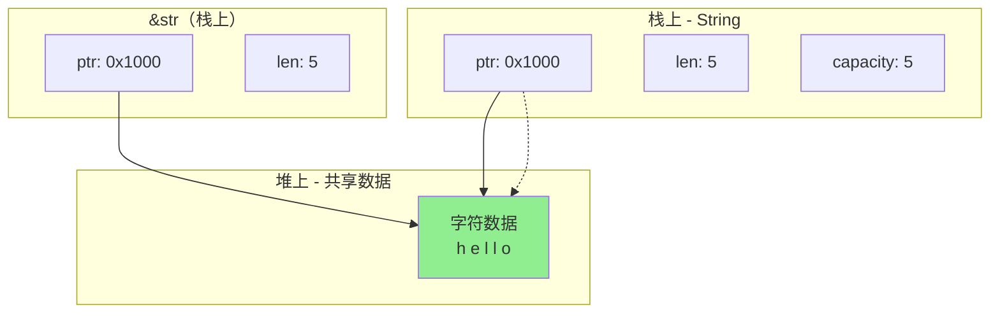
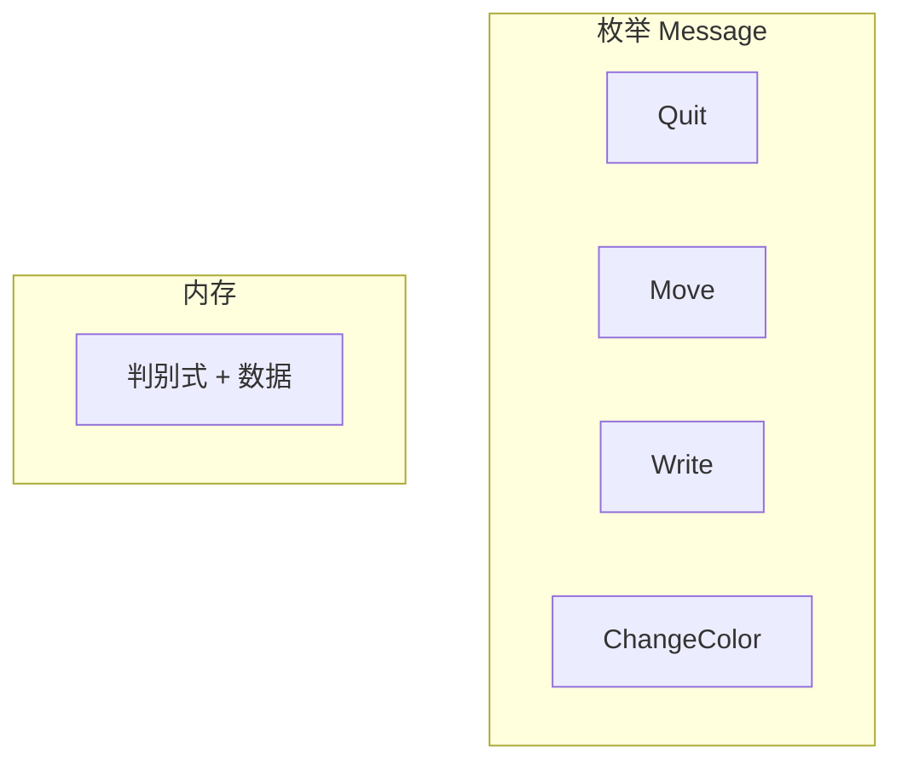
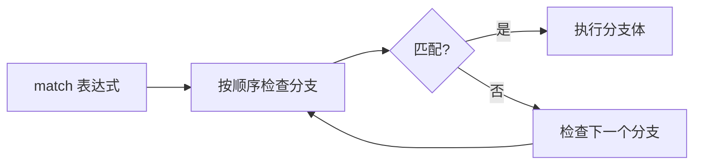

+++
title = "第 3 章 复合数据类型"
weight = 30
date = "2026-03-27T17:24:46+08:00"
type = "docs"
description = ""
isCJKLanguage = true
draft = false
+++

# Chapter-03 复合数据类型

## 3.1 字符串与字符串切片

字符串是编程中最常用的数据类型之一。Rust 的字符串系统有点独特——它区分了 `String` 和 `&str`，这两种类型各有各的用途。理解它们的区别，是掌握 Rust 字符串处理的关键！

#### 3.1.1 String 与 &str 的本质区别

##### 3.1.1.1 String：拥有所有权的动态字符串

`String` 是一个**拥有所有权**的字符串类型，存储在堆上，可以动态增长。它就像一个任性的小朋友——我想变大就变大！

（至于为什么不能缩小...呃，Rust就是这么"记仇"）

```rust
fn main() {
    // 创建 String
    let s = String::from("hello");
    
    // 可以修改
    let mut s2 = String::from("hello");
    s2.push_str(", world");
    println!("{}", s2); // hello, world
    
    // String 的内存布局：
    // 栈上：ptr（指针）+ len（长度）+ capacity（容量）
    // 堆上：实际的字符串数据
}
```

##### 3.1.1.2 &str：借用的字符串切片

`&str` 是一个**借用**的字符串视图，由指向数据的指针和长度组成。它就像是 String 的"身份证复印件"——你可以随便看，但不能据为己有！

```rust
fn main() {
    let s = String::from("hello");
    
    // &str 引用 String
    let r: &str = &s;
    println!("{}", r); // hello
    
    // 字符串字面量本身就是 &str
    let literal: &str = "hello";
    println!("{}", literal); // hello
}
```

##### 3.1.1.3 内存布局对比



```rust
use std::mem;

fn main() {
    // String 的组成
    println!("String 大小: {} 字节", mem::size_of::<String>()); // 24 字节（64位系统）
    // = 8 字节（ptr）+ 8 字节（len）+ 8 字节（capacity）
    
    // &str 的组成
    println!("&str 大小: {} 字节", mem::size_of::<&str>()); // 16 字节
    // = 8 字节（ptr）+ 8 字节（len）
}
```

#### 3.1.2 字符串切片（&str）

##### 3.1.2.1 &str 的创建

```rust
fn main() {
    // 从字符串字面量创建
    let s1: &str = "hello";
    
    // 从 String 借用
    let s2 = String::from("hello");
    let s3: &str = &s2;
    
    // 字符串切片
    let s4 = &s2[0..3]; // "hel"
    let s5 = &s2[..3]; // "hel"
    let s6 = &s2[2..]; // "llo"
    let s7 = &s2[..]; // "hello"
    
    println!("s1: {}, s3: {}, s4: {}", s1, s3, s4);
}
```

##### 3.1.2.2 &str 作为函数参数

```rust
// &str 是最灵活的字符串参数类型
fn print_str(s: &str) {
    println!("{}", s);
}

fn main() {
    let s1 = String::from("hello");
    let s2 = "world";
    
    // 可以接受 String 或字符串字面量
    print_str(&s1);
    print_str(s2);
}
```

##### 3.1.2.3 字符串切片的内存结构

```rust
fn main() {
    let s = String::from("hello");
    let slice = &s[1..4];
    
    // slice 的结构：
    // ptr 指向 'e' 的位置
    // len = 3（'e', 'l', 'l'）
    
    println!("slice: {}", slice); // ell
    
    // 切片必须落在字符边界！
    // 对于纯 ASCII 字符串，每个字符 1 字节，任意字节边界都落在字符边界上
    // let slice = &s[0..2]; // 对于 "hello" 这是有效的，返回 "he"（安全）
    // 但如果用于中文，落在字符中间就会 panic！
}
```

#### 3.1.3 String 的创建与操作

##### 3.1.3.1 String::new() / String::from()

```rust
fn main() {
    // 创建空字符串
    let s1 = String::new();
    let s2 = String::from("hello");
    
    // 两种方式等价
    println!("s1: '{}', s2: '{}'", s1, s2);
    
    // 从 &str 创建 String
    let s3: String = "world".to_string();
    println!("s3: {}", s3);
}
```

##### 3.1.3.2 to_string() / to_owned()

```rust
fn main() {
    let s1 = "hello";
    let s2 = s1.to_string(); // to_string() 方法
    let s3 = s1.to_owned(); // to_owned() 方法
    
    // to_owned() 和 to_string() 几乎等价
    // to_owned() 在某些情况下更符合习惯
    
    println!("s2: {}, s3: {}", s2, s3);
}
```

##### 3.1.3.3 String::with_capacity(capacity)

```rust
fn main() {
    // 预先分配容量，避免多次重新分配
    let mut s = String::with_capacity(100);
    
    println!("初始容量: {}", s.capacity()); // 100
    
    // 快速追加
    s.push_str("hello");
    println!("追加后容量: {}", s.capacity()); // 仍然 100
    println!("内容: {}", s);
}
```

##### 3.1.3.4 String::from_utf8_lossy

```rust
fn main() {
    // 字节到字符串的转换
    let bytes = vec![104, 101, 108, 108, 111]; // "hello" 的 UTF-8 字节
    let s = String::from_utf8(bytes).unwrap();
    println!("从 UTF-8 创建: {}", s);
    
    // 无效 UTF-8 处理
    let invalid_bytes = vec![255, 254, 236, 225]; // 不是有效的 UTF-8
    // from_utf8_lossy 返回 Cow<str>，可以直接使用或转为 String
    let lossy_string = str::from_utf8_lossy(&invalid_bytes);
    println!("lossy 转换: {}", lossy_string); // Cow<str> 实现了 Display
    // 无效字节被替换为 U+FFFD（�）
}
```

#### 3.1.4 字符串常用方法

##### 3.1.4.1 拼接：push_str / push / format!

```rust
fn main() {
    // push_str: 追加 &str
    let mut s1 = String::from("hello");
    s1.push_str(", world");
    println!("push_str: {}", s1); // hello, world
    
    // push: 追加单个字符
    let mut s2 = String::from("hello");
    s2.push('!');
    println!("push: {}", s2); // hello!
    
    // format!: 格式化拼接
    let s3 = format!("{} + {} = {}", 1, 2, 3);
    println!("format: {}", s3); // 1 + 2 = 3
    
    // 字符串拼接
    let s4 = String::from("hello");
    let s5 = String::from(" world");
    let s6 = s4 + &s5; // s4 被移动！
    // println!("s4: {}", s4); // 错误！s4 已移动
    println!("s6: {}", s6); // hello world
}
```

##### 3.1.4.2 查询：len / is_empty / contains / starts_with / ends_with

```rust
fn main() {
    let s = String::from("hello world");
    
    // len(): 字节长度
    println!("len: {}", s.len()); // 11
    
    // is_empty(): 是否为空
    println!("is_empty: {}", s.is_empty()); // false
    
    // contains(): 是否包含子串
    println!("contains 'world': {}", s.contains("world")); // true
    println!("contains 'rust': {}", s.contains("rust")); // false
    
    // starts_with / ends_with
    println!("starts_with 'hello': {}", s.starts_with("hello")); // true
    println!("ends_with 'world': {}", s.ends_with("world")); // true
}
```

##### 3.1.4.3 切片与 UTF-8 边界

```rust
fn main() {
    let s = String::from("hello");
    
    // 切片落在 ASCII 字符边界
    let slice = &s[0..3];
    println!("slice: {}", slice); // hel
    
    // 切片落在 UTF-8 字符边界（中文）
    let chinese = String::from("你好");
    let slice2 = &chinese[0..3]; // "你好" 中每个中文字符占 3 字节，0..3 正好切出第一个字符
    println!("chinese slice: {}", slice2); // 你
    
    // 错误示例：切片落在字符中间
    // let bad = &chinese[0..2]; // panic！因为 '你' 是 3 字节，字节 2 落在字符中间
}
```

##### 3.1.4.4 修剪：trim / trim_start / trim_end / trim_matches

```rust
fn main() {
    let s = "  hello  ";
    
    // trim(): 去除两端空白
    println!("trim: '{}'", s.trim()); // 'hello'
    
    // trim_start / trim_end: 只去除一端
    println!("trim_start: '{}'", s.trim_start()); // 'hello  '
    println!("trim_end: '{}'", s.trim_end()); // '  hello'
    
    // trim_matches: 去除指定的字符
    let s2 = "###hello###";
    println!("trim_matches: '{}'", s2.trim_matches('#')); // hello
}
```

##### 3.1.4.5 大小写：to_lowercase / to_uppercase

```rust
fn main() {
    let s = "Hello World";
    
    // 转大写
    println!("uppercase: {}", s.to_uppercase()); // HELLO WORLD
    
    // 转小写
    println!("lowercase: {}", s.to_lowercase()); // hello world
    
    // 注意：Unicode 大小写不总是对称
    let german = "Straße";
    println!("uppercase: {}", german.to_uppercase()); // STRASSE（ß -> SS）
    
    let turkish = "i";
    println!("Turkish uppercase: {}", turkish.to_uppercase()); // İ（土耳其语特殊规则）
}
```

##### 3.1.4.6 替换：replace / replacen / replace_range

```rust
fn main() {
    let s = String::from("hello world");
    
    // replace: 替换所有出现
    let s2 = s.replace("world", "rust");
    println!("replace: {}", s2); // hello rust
    
    // replacen: 只替换前 n 次
    let s3 = "hello hello hello".replace("hello", "hi");
    println!("replacen (all): {}", s3); // hi hi hi
    
    // replace_range: 替换范围内的内容
    let mut s4 = String::from("hello world");
    s4.replace_range(6..11, "rust");
    println!("replace_range: {}", s4); // hello rust
}
```

##### 3.1.4.7 分割：split / split_once / split_whitespace / lines / split_at

```rust
fn main() {
    let s = "apple,banana,cherry";
    
    // split: 按分隔符分割
    for part in s.split(',') {
        println!("split: {}", part);
    }
    
    // split_once: 只分割第一次
    if let Some((first, rest)) = s.split_once(',') {
        println!("first: {}, rest: {}", first, rest);
    }
    
    // split_whitespace: 按空白分割
    let s2 = "hello   world\nrust";
    for word in s2.split_whitespace() {
        println!("word: {}", word);
    }
    
    // lines: 按行分割
    let s3 = "line1\nline2\nline3";
    for line in s3.lines() {
        println!("line: {}", line);
    }
    
    // split_at: 按位置分割
    let (left, right) = s.split_at(5);
    println!("left: {}, right: {}", left, right); // apple, banana,cherry
}
```

##### 3.1.4.8 解析：parse<T>

```rust
fn main() {
    // 字符串解析为数字
    let num: i32 = "42".parse().unwrap();
    println!("解析 i32: {}", num);
    
    let num2: Result<i64, _> = "100".parse();
    println!("解析 Result: {:?}", num2);
    
    // 解析失败
    let bad = "not a number".parse::<i32>();
    println!("解析失败: {:?}", bad.is_err()); // true
}
```

##### 3.1.4.9 chars().count() vs len()

```rust
fn main() {
    let s = "hello";
    
    // len(): 字节数
    println!("len (bytes): {}", s.len()); // 5
    
    // chars().count(): 字符数
    println!("chars().count(): {}", s.chars().count()); // 5
    
    // 中文字符
    let chinese = "你好";
    println!("len (bytes): {}", chinese.len()); // 6（每个中文字符 3 字节）
    println!("chars().count(): {}", chinese.chars().count()); // 2
    
    // emoji
    let emoji = "😀";
    println!("emoji len: {}", emoji.len()); // 4
    println!("emoji chars: {}", emoji.chars().count()); // 1
}
```

#### 3.1.5 字符串的迭代

##### 3.1.5.1 字符迭代：chars()

```rust
fn main() {
    let s = "hello";
    
    for c in s.chars() {
        println!("char: {}", c);
    }
    
    // 输出：
    // char: h
    // char: e
    // char: l
    // char: l
    // char: o
}
```

##### 3.1.5.2 字节迭代：bytes()

```rust
fn main() {
    let s = "hello";
    
    for b in s.bytes() {
        println!("byte: {}", b);
    }
    
    // 输出：
    // byte: 104
    // byte: 101
    // byte: 108
    // byte: 108
    // byte: 111
}
```

##### 3.1.5.3 Unicode 字符簇迭代

```rust
// Rust 标准库不直接支持 grapheme clusters（字符簇）
// 需要使用第三方 crate如 unicode-segmentation

fn main() {
    let s = "a😀b😀c";
    
    // 使用 chars() 迭代（Unicode 标量值）
    println!("chars 迭代:");
    for c in s.chars() {
        print!("{} ", c);
    }
    println!();
    
    // 使用 bytes() 迭代
    println!("bytes 迭代:");
    for b in s.bytes() {
        print!("{} ", b);
    }
    println!();
}
```

##### 3.1.5.4 迭代与下标访问的区别

```rust
fn main() {
    let s = "hello";
    
    // 下标访问按字节索引
    // s[0] // 编译错误！不能直接下标访问
    
    // 但可以用 get()
    if let Some(c) = s.chars().nth(0) {
        println!("第一个字符: {}", c); // h
    }
    
    // 错误示例：下标落在多字节字符中间
    let chinese = "你好";
    // chinese[0..2] // panic！'你' 是 3 字节
    
    // 正确做法
    if let Some(c) = chinese.chars().nth(0) {
        println!("第一个中文字符: {}", c); // 你
    }
}
```

#### 3.1.6 字符串格式化

##### 3.1.6.1 format! 宏

```rust
fn main() {
    // format! 返回 String
    let s = format!("{} + {} = {}", 1, 2, 3);
    println!("{}", s); // 1 + 2 = 3
    
    // 带格式
    let s2 = format!("{:#?}", vec![1, 2, 3]);
    println!("{}", s2);
}
```

##### 3.1.6.2 print! / println! / eprint! / eprintln!

```rust
fn main() {
    // println! 打印到 stdout 并换行
    println!("hello");
    
    // print! 打印到 stdout 不换行
    print!("hello ");
    println!("world");
    
    // eprintln! 打印到 stderr
    eprintln!("这是错误信息");
    
    // 带格式化
    println!("PI ≈ {:.2}", 3.14159);
}
```

##### 3.1.6.3 write! / writeln!

```rust
use std::io;

fn main() -> io::Result<()> {
    // 写入文件
    use std::fs::File;
    let mut file = File::create("output.txt")?;
    
    writeln!(file, "第一行")?;
    writeln!(file, "第二行: {}", 42)?;
    
    // 写入 String
    let mut s = String::new();
    writeln!(s, "格式化到 String: {}", 100)?;
    println!("{}", s);
    
    Ok(())
}
```

##### 3.1.6.4 format_args!

```rust
fn main() {
    // format_args! 返回一个 Arguments 结构
    let args = format_args!("{} + {} = {}", 1, 2, 3);
    println!("{:?}", args);
    
    // 使用示例
    fn print_args(args: std::fmt::Arguments) {
        print!("{}", args);
    }
    
    print_args(format_args!("Hello, {}!", "world"));
}
```

#### 3.1.7 转义字符

##### 3.1.7.1 \n / \r\n / \t

```rust
fn main() {
    // 换行符
    println!("第一行\n第二行");
    
    // 回车 + 换行（Windows 风格）
    println!("Windows 换行\r\nCRLF");
    
    // 制表符
    println!("列1\t列2\t列3");
}
```

##### 3.1.7.2 \\ / \' / \"

```rust
fn main() {
    // 转义字符
    println!("反斜杠: \\");
    println!("单引号: \\'");
    println!("双引号: \\\"");
    
    // 原始字符串
    let raw = r#"双引号 " 和 ' 都包含在原始字符串中"#;
    println!("原始字符串: {}", raw);
}
```

##### 3.1.7.3 \xNN / \u{NNNNNN}

```rust
fn main() {
    // \xNN: 十六进制字节
    println!("\\x48\\x49: HI"); // \x48 = 72 = 'H', \x49 = 73 = 'I'
    
    // \u{NNNNNN}: Unicode 码点
    println!("\\u{2764}: ❤"); // ❤
    println!("\\u{1F600}: 😀"); // 😀
    
    // 完整的 Unicode 转义
    println!("\\u{4E2D}: {}", '\u{4E2D}'); // 中
}
```

#### 3.1.8 C 风格字符串

##### 3.1.8.1 CStr：来自 C 的字符串

```rust
use std::ffi::CStr;

fn main() {
    // CStr 表示来自 C 的字符串（以 null 结尾）
    let c_string = CStr::from_bytes_with_nul(b"hello\0").unwrap();
    
    println!("CStr: {:?}", c_string);
    println!("转 &str: {}", c_string.to_str().unwrap());
}
```

##### 3.1.8.2 CString：传递给 C 的字符串

```rust
use std::ffi::CString;

fn main() {
    // CString 用于传递给 C 函数
    let c_str = CString::new("hello").unwrap();
    
    // 获取原始指针
    let ptr = c_str.as_ptr();
    println!("CString 指针: {:?}", ptr);
}
```

##### 3.1.8.3 CString::new 与 null 字节处理

```rust
use std::ffi::CString;

fn main() {
    // 正常创建
    let s1 = CString::new("hello").unwrap();
    
    // 包含 null 的处理
    let with_null = b"hello\x00world";
    let s2 = CString::new(&with_null[..]).unwrap();
    println!("包含 null 的 CString: {:?}", s2);
    
    // 空字符串
    let empty = CString::new("").unwrap();
    println!("空 CString: {:?}", empty);
}
```

##### 3.1.8.4 CStr::as_cstr / CStr::to_str / to_bytes

```rust
use std::ffi::CStr;

fn main() {
    let c_str = CStr::from_bytes_with_nul(b"hello\0").unwrap();
    
    // as_cstr: 返回 &CStr
    let _: &CStr = c_str.as_cstr();
    
    // to_str: 转成 &str（可能失败）
    let s: &str = c_str.to_str().unwrap();
    println!("to_str: {}", s);
    
    // to_bytes: 转成 &[u8]（不包含结尾的 \0）
    let bytes: &[u8] = c_str.to_bytes();
    println!("to_bytes: {:?}", bytes); // [104, 101, 108, 108, 111]
}
```

#### 3.1.9 OsStr / OsString（操作系统原生字符串）

##### 3.1.9.1 OsStr：操作系统字符串切片

```rust
use std::ffi::OsStr;

fn main() {
    // OsStr 表示操作系统层面的字符串切片
    // 在 Unix 上可能是 UTF-8 或非 UTF-8 字节
    // 在 Windows 上可能是 UTF-16
    
    let os_str: &OsStr = OsStr::new("hello");
    println!("OsStr: {:?}", os_str);
}
```

##### 3.1.9.2 OsString：拥有所有权的操作系统字符串

```rust
use std::ffi::OsString;

fn main() {
    // OsString 是 OsStr 的拥有版本
    let os_string = OsString::from("hello");
    
    // 可以从 String 或 &str 转换
    let from_string: OsString = String::from("world").into();
    
    println!("OsString: {:?}", os_string);
}
```

##### 3.1.9.3 OsStr 与 str / String 的转换

```rust
use std::ffi::{OsStr, OsString};

fn main() {
    let os_str: &OsStr = OsStr::new("hello");
    
    // OsStr -> &str（可能失败，因为 OsStr 不一定是 UTF-8）
    if let Some(s) = os_str.to_str() {
        println!("OsStr -> str: {}", s);
    }
    
    // OsStr -> &String
    // 没有直接转换，需要 to_str 后 unwrap
    
    // OsString -> String（可能失败）
    let os_string = OsString::from("hello");
    if let Some(s) = os_string.into_string() {
        println!("OsString -> String: {}", s);
    }
}
```

##### 3.1.9.4 std::env::var() 返回 OsString

```rust
use std::env;

fn main() {
    // 环境变量返回 OsString
    if let Ok(home) = env::var("HOME") {
        println!("HOME: {}", home); // String（Linux/Mac）
    }
    
    // Windows 上的环境变量
    // env::var("PATH") 返回 Result<String, ...>
    
    // 使用 OsString 处理更通用的环境变量
    // env::var_os("HOME") 返回 Option<OsString>
    if let Some(home) = env::var_os("HOME") {
        println!("HOME (OsString): {:?}", home);
    }
}
```

---

### 3.2 元组（Tuple）

元组是 Rust 中一种轻量级的复合类型，可以存储不同类型的多个值。它就像一个"固定大小的、轻量级的、不可变的容器"。

#### 3.2.1 元组的创建与访问

##### 3.2.1.1 元组的创建语法

```rust
fn main() {
    // 创建元组
    let t: (i32, f64, u8) = (500, 6.4, 1);
    
    // 类型可以省略，让编译器推导
    let t2 = (500, 6.4, 1);
    
    // 混合类型
    let mixed = ("hello", 42, true, 3.14);
    
    // 空元组（单元类型）
    let empty: () = ();
    
    println!("t: {:?}", t);
    println!("t2: {:?}", t2);
    println!("mixed: {:?}", mixed);
}
```

##### 3.2.1.2 通过索引访问

```rust
fn main() {
    let t = (500, 6.4, 1);
    
    // 通过 .0, .1, .2 ... 访问
    println!("第一个: {}", t.0); // 500
    println!("第二个: {}", t.1); // 6.4
    println!("第三个: {}", t.2); // 1
    
    // 修改元组（如果是 mut 的）
    let mut t2 = (1, 2, 3);
    t2.0 = 10;
    println!("修改后: {:?}", t2); // (10, 2, 3)
}
```

##### 3.2.1.3 元组类型注解

```rust
fn main() {
    // 类型注解放在元组前面
    let pair: (i32, &str) = (42, "hello");
    
    let point: (f64, f64) = (1.0, 2.0);
    
    let complex: (bool, char, i64) = (true, 'x', -100);
    
    println!("pair: {:?}", pair);
    println!("point: {:?}", point);
    println!("complex: {:?}", complex);
}
```

#### 3.2.2 元组作为函数返回值

##### 3.2.2.1 多返回值场景

```rust
fn main() {
    // 元组经常用于返回多个值
    let result = divide(10.0, 3.0);
    println!("商: {}, 余数: {}", result.0, result.1);
    
    // 标准库示例：split_at
    let s = "hello";
    let (left, right) = s.split_at(2);
    println!("left: {}, right: {}", left, right);
}

fn divide(dividend: f64, divisor: f64) -> (f64, f64) {
    let quotient = dividend / divisor;
    let remainder = dividend % divisor;
    (quotient, remainder)
}
```

##### 3.2.2.2 标准库示例

```rust
fn main() {
    // Option::ok_or
    let opt: Option<i32> = Some(42);
    let result: Result<i32, &str> = opt.ok_or("没有值");
    println!("ok_or: {:?}", result);
    
    // split_at
    let arr = [1, 2, 3, 4, 5];
    let (first, rest) = arr.split_at(2);
    println!("first: {:?}", first); // [1, 2]
    println!("rest: {:?}", rest); // [3, 4, 5]
}
```

#### 3.2.3 元组解构

##### 3.2.3.1 let 解构赋值

```rust
fn main() {
    let t = (1, "hello", 3.14);
    
    // 解构赋值
    let (a, b, c) = t;
    println!("a = {}, b = {}, c = {}", a, b, c);
    
    // 可以只解构需要的部分
    let (x, _, z) = t; // 使用 _ 忽略不需要的值
    println!("x = {}, z = {}", x, z);
}
```

##### 3.2.3.2 match 中的元组解构

```rust
fn main() {
    let t = (1, 2, 3);
    
    match t {
        (a, b, c) => println!("({}, {}, {})", a, b, c),
    }
    
    // 带条件的解构
    let t2 = (5, 10);
    match t2 {
        (x, y) if x == y => println!("相等"),
        (x, y) if x + y == 15 => println!("和为15"),
        (x, y) => println!("({}, {})", x, y),
    }
}
```

##### 3.2.3.3 函数参数解构

```rust
fn main() {
    // 函数参数也可以解构
    let result = process((1, 2));
    println!("result: {}", result);
}

fn process((x, y): (i32, i32)) -> i32 {
    x + y
}
```

##### 3.2.3.4 部分解构 + rest

```rust
fn main() {
    let t = (1, 2, 3, 4, 5);
    
    // 解构到第一个和最后一个，中间用 ..
    let (first, .., last) = t;
    println!("first: {}, last: {}", first, last); // first: 1, last: 5
    
    // 解构中间部分
    let (a, .., b) = (10, 20, 30, 40, 50);
    println!("a: {}, b: {}", a, b); // a: 10, b: 50
}
```

---

### 3.3 数组（Array）与切片（Slice）

数组和切片是 Rust 中存储固定和可变数量元素的方式。数组的长度在编译时就确定，切片则是对数组或向量部分数据的引用。

#### 3.3.1 数组的创建与访问

##### 3.3.1.1 数组类型注解

```rust
fn main() {
    // 类型注解：[T; N] - T 是元素类型，N 是长度
    let arr: [i32; 5] = [1, 2, 3, 4, 5];
    
    // 可以省略类型，让编译器推导
    let arr2 = [1, 2, 3, 4, 5];
    
    println!("arr: {:?}", arr);
    println!("arr2: {:?}", arr2);
}
```

##### 3.3.1.2 数组字面量

```rust
fn main() {
    // [value; N] - 创建 N 个相同值的数组
    let arr = [0; 5]; // [0, 0, 0, 0, 0]
    println!("零初始化: {:?}", arr);
    
    // 字符串数组
    let days = ["周一", "周二", "周三", "周四", "周五", "周六", "周日"];
    println!("星期: {:?}", days);
    
    // 字符数组
    let vowels: [char; 5] = ['a', 'e', 'i', 'o', 'u'];
    println!("元音: {:?}", vowels);
}
```

##### 3.3.1.3 数组下标访问

```rust
fn main() {
    let arr = [10, 20, 30, 40, 50];
    
    // 通过下标访问
    println!("第一个: {}", arr[0]); // 10
    println!("第三个: {}", arr[2]); // 30
    println!("最后一个: {}", arr[4]); // 50
    
    // 修改元素
    let mut arr2 = [1, 2, 3];
    arr2[0] = 100;
    println!("修改后: {:?}", arr2); // [100, 2, 3]
    
    // 越界访问：Debug 模式 panic，Release 模式未定义
    // arr[10] // 越界！
}
```

##### 3.3.1.4 数组越界访问

```rust
fn main() {
    let arr = [1, 2, 3];
    
    // 合法下标范围：0 ~ len-1
    // arr[0] OK
    // arr[2] OK
    // arr[3] 越界！
    
    // 边界检查在 Debug 模式下启用
    // let element = arr[10]; // panic!
    
    // 使用 get() 方法安全访问
    match arr.get(10) {
        Some(value) => println!("值: {}", value),
        None => println!("越界！"),
    }
}
```

#### 3.3.2 数组的内存布局

##### 3.3.2.1 栈上连续内存

```rust
fn main() {
    let arr = [1, 2, 3, 4, 5];
    
    // 数组存储在栈上，连续内存
    // 内存布局：
    // [1][2][3][4][5]
    //  ↑           ↑
    // ptr         ptr + 4 * size_of::<i32>()
    
    // 每个 i32 占 4 字节
    println!("i32 大小: {}", std::mem::size_of::<i32>()); // 4
    println!("数组大小: {} 字节", std::mem::size_of::<[i32; 5]>()); // 20
}
```

##### 3.3.2.2 数组大小在编译期确定

```rust
fn main() {
    // 数组大小必须是编译期常量！
    const SIZE: usize = 5;
    let arr = [0; SIZE];
    
    // 不能用变量作为数组大小
    // let n = 5;
    // let arr = [0; n]; // 编译错误！
    
    println!("固定大小数组: {:?}", arr);
}
```

##### 3.3.2.3 数组无法动态增长

```rust
fn main() {
    let arr = [1, 2, 3];
    
    // 数组长度固定，不能添加或删除元素
    // arr.push(4); // 编译错误！数组可不是橡皮筋！
    
    // 如果需要动态数组，用 Vec<T>
    let mut v = vec![1, 2, 3];
    v.push(4);
    println!("Vec: {:?}", v); // [1, 2, 3, 4]
}
```

#### 3.3.3 切片（Slice）作为视图

##### 3.3.3.1 &[T] 切片类型

```rust
fn main() {
    // 切片是对数组部分数据的引用
    let arr = [1, 2, 3, 4, 5];
    
    // 创建切片
    let slice: &[i32] = &arr[1..4]; // [2, 3, 4]
    println!("slice: {:?}", slice);
    
    // 切片不拥有数据，只是视图
    println!("arr 仍然有效: {:?}", arr);
}
```

##### 3.3.3.2 从数组创建切片

```rust
fn main() {
    let arr = [1, 2, 3, 4, 5];
    
    // 完整切片
    let s1 = &arr[..]; // [1, 2, 3, 4, 5]
    
    // 头部切片
    let s2 = &arr[..3]; // [1, 2, 3]
    
    // 尾部切片
    let s3 = &arr[2..]; // [3, 4, 5]
    
    // 中间切片
    let s4 = &arr[1..4]; // [2, 3, 4]
    
    println!("s1: {:?}, s2: {:?}, s3: {:?}, s4: {:?}", s1, s2, s3, s4);
}
```

##### 3.3.3.3 切片的内存布局

```mermaid
graph TB
    subgraph 数组 arr
        A1[1]
        A2[2]
        A3[3]
        A4[4]
        A5[5]
    end
    
    subgraph 切片 slice = &arr[1..4]
        S1[ptr → arr[1]]
        S2[len: 3]
    end
    
    S1 -.-> A2
```

```rust
use std::mem;

fn main() {
    let arr = [1, 2, 3, 4, 5];
    let slice = &arr[1..4];
    
    // 切片大小 = 指针 + 长度
    println!("&[i32] 大小: {} 字节", mem::size_of::<&[i32]>()); // 16 (64位)
    // = 8 字节（ptr）+ 8 字节（len）
    
    // 切片指向原数组
    println!("切片长度: {}", slice.len()); // 3
    println!("切片首元素: {}", slice[0]); // 2
}
```

##### 3.3.3.4 字符串切片 &str 对应字节切片 &[u8]

```rust
fn main() {
    let s = "hello";
    let slice = &s[1..4];
    
    println!("&str 切片: {}", slice); // ell
    
    // &str 底层是 &[u8]
    let bytes: &[u8] = s.as_bytes();
    let byte_slice = &bytes[1..4];
    println!("&[u8] 切片: {:?}", byte_slice); // [101, 108, 108]
    
    // 字符集合切片（注意：这是 Vec<char> 的切片，不是 &str）
    let chars: Vec<char> = s.chars().collect();
    println!("字符切片: {:?}", &chars[1..4]); // ['e', 'l', 'l']
}
```

#### 3.3.4 多维数组

##### 3.3.4.1 [[T; N]; M] 二维数组

```rust
fn main() {
    // [[T; N]; M] - M 行，每行 N 个元素
    let matrix: [[i32; 3]; 2] = [
        [1, 2, 3],
        [4, 5, 6],
    ];
    
    println!("矩阵: {:?}", matrix);
    println!("matrix[0]: {:?}", matrix[0]); // [1, 2, 3]
    println!("matrix[1][2]: {}", matrix[1][2]); // 6
}
```

##### 3.3.4.2 访问方式

```rust
fn main() {
    let arr = [[1, 2, 3], [4, 5, 6]];
    
    // 双下标访问
    for i in 0..2 {
        for j in 0..3 {
            print!("{} ", arr[i][j]);
        }
        println!();
    }
    
    // 输出：
    // 1 2 3
    // 4 5 6
}
```

##### 3.3.4.3 多维数组作为函数参数

```rust
fn main() {
    let matrix = [[1.0, 2.0], [3.0, 4.0]];
    print_matrix(&matrix);
}

fn print_matrix(m: &[[f64; 2]; 2]) {
    for row in m {
        println!("{:?}", row);
    }
}
```

---

### 3.4 结构体（Struct）

结构体是 Rust 中最重要的自定义类型之一。它允许你将多个不同类型的数据组合在一起，形成一个有意义的整体。

#### 3.4.1 命名字段结构体

##### 3.4.1.1 struct 定义语法

```rust
// 定义结构体
struct User {
    name: String,
    email: String,
    age: u32,
    active: bool,
}

fn main() {
    // 创建结构体实例
    let user = User {
        name: String::from("Alice"),
        email: String::from("alice@example.com"),
        age: 30,
        active: true,
    };
    
    println!("用户: {} <{}>", user.name, user.email);
}
```

##### 3.4.1.2 字段访问

```rust
struct Rectangle {
    width: u32,
    height: u32,
}

fn main() {
    let rect = Rectangle { width: 30, height: 50 };
    
    // 通过点号访问字段
    println!("宽: {}, 高: {}", rect.width, rect.height);
    
    // 修改字段（需要 mut）
    let mut rect2 = Rectangle { width: 10, height: 20 };
    rect2.width = 15;
    println!("修改后宽: {}", rect2.width);
}
```

##### 3.4.1.3 字段初始化简写语法

```rust
struct User {
    name: String,
    email: String,
    age: u32,
}

fn main() {
    let name = String::from("Bob");
    let email = String::from("bob@example.com");
    let age = 25;
    
    // 字段初始化简写：变量名和字段名相同时可以省略
    let user = User {
        name, // 等价于 name: name
        email, // 等价于 email: email
        age,
    };
    
    println!("用户: {} <{}>", user.name, user.email);
}
```

##### 3.4.1.4 所有权字段

```rust
struct Person {
    name: String, // 所有权字段
    age: u32,
}

fn main() {
    let p = Person {
        name: String::from("Alice"),
        age: 30,
    };
    
    // name 是 String，拥有所有权
    // 如果把 Person 赋值给另一个变量，name 会被移动
    let p2 = p;
    // println!("{}", p.name); // 编译错误！p.name 已移动到 p2
    
    println!("{}", p2.name);
}
```

#### 3.4.2 元组结构体

##### 3.4.2.1 元组结构体定义

```rust
// 元组结构体：没有字段名，只有类型
struct Color(i32, i32, i32);
struct Point(i32, i32, i32);

fn main() {
    let black = Color(0, 0, 0);
    let origin = Point(0, 0, 0);
    
    // 通过索引访问
    println!("黑色: R={}, G={}, B={}", black.0, black.1, black.2);
    println!("原点: x={}, y={}, z={}", origin.0, origin.1, origin.2);
}
```

##### 3.4.2.2 通过索引访问字段

```rust
struct RGB(u8, u8, u8);

impl RGB {
    fn new(r: u8, g: u8, b: u8) -> Self {
        RGB(r, g, b)
    }
    
    fn brightness(&self) -> u8 {
        (self.0 as f64 * 0.3 + self.1 as f64 * 0.59 + self.2 as f64 * 0.11) as u8
    }
}

fn main() {
    let red = RGB::new(255, 0, 0);
    let green = RGB(0, 255, 0);
    let blue = RGB(0, 0, 255);
    
    println!("红色亮度: {}", red.brightness());
    println!("绿色亮度: {}", green.brightness());
    println!("蓝色亮度: {}", blue.brightness());
}
```

##### 3.4.2.3 何时使用元组结构体

```rust
// 场景1：轻量级聚合
struct Pair(i32, i32);

// 场景2：区分类型
struct Kilometers(i32);
struct Miles(i32);

fn main() {
    let distance_km = Kilometers(100);
    let distance_mi = Miles(62);
    
    // 防止混淆：Kilometers 和 Miles 是不同类型
    // println!("{}", distance_km + distance_mi); // 编译错误！
}
```

#### 3.4.3 单元结构体

##### 3.4.3.1 struct Foo;

```rust
// 单元结构体：没有任何字段
struct Marker;

// 用途1：实现 trait
trait Printable {
    fn print(&self);
}

struct Empty;

impl Printable for Empty {
    fn print(&self) {
        println!("Empty");
    }
}

fn main() {
    let marker = Marker;
    let empty = Empty;
    empty.print();
}
```

##### 3.4.3.2 单元结构体的作用

```rust
// PhantomData：用于标记类型
use std::marker::PhantomData;

struct PhantomTuple<T>(PhantomData<T>);

struct PhantomStruct<T> {
    data: PhantomData<T>,
}

fn main() {
    // PhantomData 不占用实际空间
    let _t: PhantomTuple<i32> = PhantomTuple(PhantomData);
    let _s: PhantomStruct<String> = PhantomStruct { data: PhantomData };
    
    println!("PhantomData 大小: {}", std::mem::size_of::<PhantomData<i32>>());
}
```

#### 3.4.4 结构体更新语法

##### 3.4.4.1 ..default

```rust
#[derive(Default)]
struct Config {
    host: String,
    port: u16,
    debug: bool,
}

fn main() {
    let default_config = Config::default();
    
    // ..default 填充剩余字段
    let config = Config {
        host: String::from("localhost"),
        port: 8080,
        ..Default::default()
    };
    
    println!("配置: {}:{}", config.host, config.port);
}
```

##### 3.4.4.2 ..other_instance

```rust
struct User {
    name: String,
    email: String,
    age: u32,
    active: bool,
}

fn main() {
    let user1 = User {
        name: String::from("Alice"),
        email: String::from("alice@example.com"),
        age: 30,
        active: true,
    };
    
    // 从 user1 获取其余字段，但修改 name
    // 注意：email 是 String（所有权类型），会被移动而不是复制！
    let user2 = User {
        name: String::from("Bob"),
        ..user1 // 其余字段从 user1 获取（email 被移动，age 和 active 被复制）
    };
    
    println!("user1 name: {}", user1.name); // user1.email 已被移动到 user2
    println!("user2: {} <{}>", user2.name, user2.email);
    println!("user2 age: {}", user2.age); // 30（age 是 Copy 类型，从 user1 复制）
}
```

#### 3.4.5 结构体方法

##### 3.4.5.1 impl 块定义方法

```rust
struct Rectangle {
    width: u32,
    height: u32,
}

// 方法放在 impl 块中
impl Rectangle {
    // self 参数
    fn area(&self) -> u32 {
        self.width * self.height
    }
}

fn main() {
    let rect = Rectangle { width: 30, height: 50 };
    println!("面积: {}", rect.area()); // 1500
}
```

##### 3.4.5.2 &self 参数

```rust
struct Counter {
    count: u32,
}

impl Counter {
    fn new() -> Self {
        Counter { count: 0 }
    }
    
    // &self：不可变借用
    fn value(&self) -> u32 {
        self.count
    }
}

fn main() {
    let counter = Counter::new();
    println!("计数器: {}", counter.value()); // 0
}
```

##### 3.4.5.3 &mut self 参数

```rust
struct Counter {
    count: u32,
}

impl Counter {
    fn new() -> Self {
        Counter { count: 0 }
    }
    
    // &mut self：可变借用
    fn increment(&mut self) {
        self.count += 1;
    }
    
    fn value(&self) -> u32 {
        self.count
    }
}

fn main() {
    let mut counter = Counter::new();
    counter.increment();
    counter.increment();
    counter.increment();
    println!("计数器: {}", counter.value()); // 3
}
```

##### 3.4.5.4 self 参数

```rust
struct Person {
    name: String,
}

impl Person {
    fn new(name: &str) -> Self {
        Person { name: String::from(name) }
    }
    
    // self：获取所有权，消耗结构体
    fn into_string(self) -> String {
        self.name
    }
}

fn main() {
    let person = Person::new("Alice");
    let name = person.into_string(); // person 被消耗
    // println!("{}", person.name); // 编译错误！
    println!("名字: {}", name);
}
```

#### 3.4.6 关联函数

##### 3.4.6.1 不带 self 的函数

```rust
struct Point {
    x: f64,
    y: f64,
}

impl Point {
    // 关联函数：不带 self 参数
    fn origin() -> Self {
        Point { x: 0.0, y: 0.0 }
    }
    
    fn new(x: f64, y: f64) -> Self {
        Point { x, y }
    }
    
    fn distance_from_origin(&self) -> f64 {
        (self.x * self.x + self.y * self.y).sqrt()
    }
}

fn main() {
    let p1 = Point::origin();
    let p2 = Point::new(3.0, 4.0);
    
    println!("p1: ({}, {})", p1.x, p1.y);
    println!("p2 到原点距离: {:.2}", p2.distance_from_origin());
}
```

##### 3.4.6.2 构造函数模式

```rust
struct User {
    name: String,
    email: String,
    age: u32,
}

impl User {
    // 构造函数
    fn new(name: &str, email: &str, age: u32) -> Self {
        User {
            name: String::from(name),
            email: String::from(email),
            age,
        }
    }
    
    // 静态工厂方法
    fn with_age_0(name: &str, email: &str) -> Self {
        User {
            name: String::from(name),
            email: String::from(email),
            age: 0,
        }
    }
}

fn main() {
    let user1 = User::new("Alice", "alice@example.com", 30);
    let user2 = User::with_age_0("Bob", "bob@example.com");
    
    println!("user1: {} ({}岁)", user1.name, user1.age);
    println!("user2: {} ({}岁)", user2.name, user2.age);
}
```

##### 3.4.6.3 多 impl 块

```rust
struct Rectangle {
    width: u32,
    height: u32,
}

// 第一块：构造函数
impl Rectangle {
    fn new(width: u32, height: u32) -> Self {
        Rectangle { width, height }
    }
}

// 第二块：只读方法
impl Rectangle {
    fn area(&self) -> u32 {
        self.width * self.height
    }
    
    fn perimeter(&self) -> u32 {
        2 * (self.width + self.height)
    }
}

// 第三块：可变方法
impl Rectangle {
    fn scale(&mut self, factor: u32) {
        self.width *= factor;
        self.height *= factor;
    }
}

fn main() {
    let rect = Rectangle::new(10, 20);
    println!("面积: {}, 周长: {}", rect.area(), rect.perimeter());
}
```

#### 3.4.7 结构体与所有权

##### 3.4.7.1 字段的可变性规则

```rust
struct Counter {
    count: u32,
}

fn main() {
    // 结构体整体是可变的，不是个别字段
    let mut counter = Counter { count: 0 };
    counter.count = 5; // OK
    
    let counter2 = Counter { count: 0 };
    // counter2.count = 5; // 编译错误！counter2 是不可变的
}
```

##### 3.4.7.2 结构体的移动行为

```rust
struct Person {
    name: String,
    age: u32,
}

fn main() {
    let p1 = Person {
        name: String::from("Alice"),
        age: 30,
    };
    
    let p2 = p1; // 整个结构体移动，包括 name
    
    // println!("{}", p1.name); // 编译错误！
    println!("{}", p2.name); // OK
}
```

##### 3.4.7.3 Copy 类型字段的结构体

```rust
#[derive(Copy, Clone)]
struct Point {
    x: f64,
    y: f64,
}

fn main() {
    let p1 = Point { x: 1.0, y: 2.0 };
    let p2 = p1; // Copy！p1 仍然有效
    
    println!("p1: ({}, {})", p1.x, p1.y);
    println!("p2: ({}, {})", p2.x, p2.y);
}
```

---

### 3.5 枚举（Enum）

枚举是 Rust 中表示"一个值可以是几种类型之一"的类型。它比结构体更灵活，因为不同的变体可以携带不同的数据。

#### 3.5.1 枚举的定义与基本使用

##### 3.5.1.1 枚举的定义

```rust
// 定义枚举
enum Direction {
    North,
    South,
    East,
    West,
}

fn main() {
    // 使用枚举值
    let direction = Direction::North;
    
    match direction {
        Direction::North => println!("向北"),
        Direction::South => println!("向南"),
        Direction::East => println!("向东"),
        Direction::West => println!("向西"),
    }
}
```

##### 3.5.1.2 带数据的枚举变体

```rust
enum Message {
    Quit,                      // 无数据
    Move { x: i32, y: i32 }, // 命名字段
    Write(String),             // 单个值
    ChangeColor(i32, i32, i32), // 多个值
}

fn main() {
    let quit = Message::Quit;
    let move_msg = Message::Move { x: 10, y: 20 };
    let write_msg = Message::Write(String::from("hello"));
    let color_msg = Message::ChangeColor(255, 0, 0);
}
```

##### 3.5.1.3 枚举的内存布局



```rust
use std::mem;

fn main() {
    enum Message {
        Quit,
        Move { x: i32, y: i32 },
        Write(String),
        ChangeColor(i32, i32, i32),
    }
    
    // Message 的大小是最大变体的大小 + 判别式
    println!("Message 大小: {} 字节", std::mem::size_of::<Message>());
    
    // 注意：不能直接对枚举变体调用 size_of
    // 但我们可以通过推断知道 Quit 变体本身不占空间
    println!("单元变体大小为 0");
}
```

#### 3.5.2 Option<T> 枚举详解

##### 3.5.2.1 Option::Some / Option::None

```rust
fn main() {
    // Option<T> 定义在标准库中：
    // enum Option<T> {
    //     None,
    //     Some(T),
    // }
    
    let some_value: Option<i32> = Some(42);
    let no_value: Option<i32> = None;
    
    println!("some_value: {:?}", some_value); // Some(42)
    println!("no_value: {:?}", no_value); // None
}
```

##### 3.5.2.2 Option 的设计哲学

```rust
fn main() {
    // Option 替代了其他语言的 null
    // 好处：编译器强制你处理 None 的情况！
    // 再也不会遇到 "thread 'main' panicked at..." 这种让人头秃的错误了！（其他语言的 null 问题，懂的人都懂...）
    
    let names = vec!["Alice", "Bob", "Charlie"];
    
    // 其他语言可能返回 null
    // Rust 返回 Option
    let first = names.get(0);
    println!("第一个名字: {:?}", first); // Some("Alice")
    
    let tenth = names.get(9);
    println!("第十个名字: {:?}", tenth); // None（安全！编译器会提醒你处理）
```

##### 3.5.2.3 unwrap / expect / unwrap_unchecked

```rust
fn main() {
    let some = Some(42);
    
    // unwrap：如果是 Some 返回值，否则 panic
    println!("unwrap: {}", some.unwrap()); // 42
    
    // expect：类似 unwrap，但可以自定义错误信息
    println!("expect: {}", some.expect("应该是 Some")); // 42
    
    // unwrap_unchecked：如果是 Some 返回值，否则未定义行为
    unsafe {
        println!("unwrap_unchecked: {}", some.unwrap_unchecked()); // 42
    }
}
```

##### 3.5.2.4 unwrap_or / unwrap_or_else / unwrap_or_default

```rust
fn main() {
    let some = Some(42);
    let none: Option<i32> = None;
    
    // unwrap_or：有默认值
    println!("some.unwrap_or(0): {}", some.unwrap_or(0)); // 42
    println!("none.unwrap_or(0): {}", none.unwrap_or(0)); // 0
    
    // unwrap_or_else：延迟计算默认值
    println!("none.unwrap_or_else(|| 100): {}", none.unwrap_or_else(|| 100)); // 100
    
    // unwrap_or_default：使用类型的默认值
    println!("none.unwrap_or_default(): {}", none.unwrap_or_default()); // 0
}
```

##### 3.5.2.5 map / and_then / or / or_else / filter / flatten

```rust
fn main() {
    let some = Some(5);
    let none: Option<i32> = None;
    
    // map：转换内部值
    let doubled = some.map(|x| x * 2);
    println!("doubled: {:?}", doubled); // Some(10)
    
    let doubled_none = none.map(|x| x * 2);
    println!("doubled_none: {:?}", doubled_none); // None
    
    // and_then：链式处理
    let result = some.and_then(|x| Some(x * 3));
    println!("and_then: {:?}", result); // Some(15)
    
    // or / or_else：提供默认值或备用计算
    let result = none.or(Some(100));
    println!("or: {:?}", result); // Some(100)
    
    // filter：过滤
    let result = some.filter(|x| x > 10);
    println!("filter (5 > 10): {:?}", result); // None
    
    let result = some.filter(|x| x < 10);
    println!("filter (5 < 10): {:?}", result); // Some(5)
}
```

##### 3.5.2.6 is_some / is_none / as_ref / as_mut

```rust
fn main() {
    let some = Some(42);
    let none: Option<i32> = None;
    
    // is_some / is_none
    println!("some.is_some(): {}", some.is_some()); // true
    println!("none.is_none(): {}", none.is_none()); // true
    
    // as_ref：转换为 &Option<T>
    let some_ref: Option<&i32> = some.as_ref();
    println!("as_ref: {:?}", some_ref); // Some(42)
    
    // as_mut：转换为 &mut Option<T>
    let mut some_mut = Some(42);
    if let Some(value) = some_mut.as_mut() {
        *value = 100;
    }
    println!("as_mut: {:?}", some_mut); // Some(100)
}
```

#### 3.5.3 Result<T, E> 枚举详解

##### 3.5.3.1 Result::Ok / Result::Err

```rust
fn main() {
    // Result<T, E> 定义在标准库中：
    // enum Result<T, E> {
    //     Ok(T),
    //     Err(E),
    // }
    
    let ok: Result<i32, &str> = Ok(42);
    let err: Result<i32, &str> = Err("出错了");
    
    println!("ok: {:?}", ok);
    println!("err: {:?}", err);
}
```

##### 3.5.3.2 unwrap / expect / unwrap_err

```rust
fn main() {
    let ok: Result<i32, &str> = Ok(42);
    let err: Result<i32, &str> = Err("出错了");
    
    // unwrap：Ok 返回值，Err panic
    println!("ok.unwrap(): {}", ok.unwrap()); // 42
    // err.unwrap(); // panic!
    
    // expect：自定义错误信息
    println!("ok.expect(): {}", ok.expect("应该是 Ok")); // 42
    
    // unwrap_err：Ok panic，Err 返回值
    println!("err.unwrap_err(): {}", err.unwrap_err()); // 出错了
}
```

##### 3.5.3.3 unwrap_or / unwrap_or_else / unwrap_or_default

```rust
fn main() {
    let ok: Result<i32, &str> = Ok(42);
    let err: Result<i32, &str> = Err("error");
    
    // unwrap_or
    println!("ok.unwrap_or(0): {}", ok.unwrap_or(0)); // 42
    println!("err.unwrap_or(0): {}", err.unwrap_or(0)); // 0
    
    // unwrap_or_else
    println!("err.unwrap_or_else(|| -1): {}", err.unwrap_or_else(|| -1)); // -1
    
    // unwrap_or_default
    println!("err.unwrap_or_default(): {}", err.unwrap_or_default()); // 0
}
```

##### 3.5.3.4 map / map_err / and_then / or / or_else

```rust
fn main() {
    let ok: Result<i32, &str> = Ok(5);
    let err: Result<i32, &str> = Err("error");
    
    // map：转换 Ok 值
    let doubled = ok.map(|x| x * 2);
    println!("map: {:?}", doubled); // Ok(10)
    
    // map_err：转换 Err 值
    let mapped_err = err.map_err(|e| format!("错误: {}", e));
    println!("map_err: {:?}", mapped_err); // Err("错误: error")
    
    // and_then：链式处理
    let result = ok.and_then(|x| Ok(x * 3));
    println!("and_then: {:?}", result); // Ok(15)
}
```

##### 3.5.3.5 ? 操作符（错误传播）

```rust
use std::num::ParseIntError;

fn parse_and_double(s: &str) -> Result<i32, ParseIntError> {
    let num: i32 = s.parse()?; // ? 操作符
    Ok(num * 2)
}

fn main() {
    let result = parse_and_double("21");
    println!("result: {:?}", result); // Ok(42)
    
    let result = parse_and_double("not a number");
    println!("result: {:?}", result); // Err(ParseIntError)
}
```

##### 3.5.3.6 is_ok / is_err / as_ref / as_mut / as_deref

```rust
fn main() {
    let ok: Result<i32, &str> = Ok(42);
    let err: Result<i32, &str> = Err("error");
    
    // is_ok / is_err
    println!("ok.is_ok(): {}", ok.is_ok()); // true
    println!("err.is_err(): {}", err.is_err()); // true
    
    // as_ref：转换为 &Result<T, E>
    let ok_ref: Result<&i32, &str> = ok.as_ref();
    println!("as_ref: {:?}", ok_ref); // Ok(42)
    
    // as_mut：转换为 &mut Result<T, E>
    let mut ok_mut = Ok(42);
    if let Ok(v) = ok_mut.as_mut() {
        *v = 100;
    }
    println!("as_mut: {:?}", ok_mut); // Ok(100)
}
```

#### 3.5.4 match 与枚举的完整匹配

##### 3.5.4.1 match 穷尽匹配要求

```rust
enum Direction {
    North,
    South,
    East,
    West,
}

fn main() {
    let direction = Direction::North;
    
    // 必须穷尽所有情况！
    match direction {
        Direction::North => println!("向北"),
        Direction::South => println!("向南"),
        Direction::East => println!("向东"),
        Direction::West => println!("向西"),
    }
}
```

##### 3.5.4.2 解构枚举变体

```rust
enum Message {
    Quit,
    Move { x: i32, y: i32 },
    Write(String),
    ChangeColor(i32, i32, i32),
}

fn main() {
    let msg = Message::Move { x: 10, y: 20 };
    
    match msg {
        Message::Quit => println!("退出"),
        Message::Move { x, y } => println!("移动到 ({}, {})", x, y),
        Message::Write(text) => println!("写入: {}", text),
        Message::ChangeColor(r, g, b) => println!("颜色: RGB({}, {}, {})", r, g, b),
    }
}
```

##### 3.5.4.3 if let 简化单分支匹配

```rust
fn main() {
    let msg = Message::Move { x: 10, y: 20 };
    
    // 完整 match
    match msg {
        Message::Move { x, y } => println!("移动到 ({}, {})", x, y),
        _ => println!("其他消息"),
    }
    
    // if let 简化
    if let Message::Move { x, y } = msg {
        println!("移动到 ({}, {})", x, y);
    }
}
```

#### 3.5.5 枚举的方法实现

##### 3.5.5.1 impl enum 块

```rust
enum Direction {
    North,
    South,
    East,
    West,
}

impl Direction {
    fn opposite(&self) -> Direction {
        match self {
            Direction::North => Direction::South,
            Direction::South => Direction::North,
            Direction::East => Direction::West,
            Direction::West => Direction::East,
        }
    }
    
    fn is_vertical(&self) -> bool {
        matches!(self, Direction::North | Direction::South)
    }
}

fn main() {
    println!("North 反向: {:?}", Direction::North.opposite());
    println!("East 是垂直? {}", Direction::East.is_vertical()); // false
}
```

##### 3.5.5.2 #[derive(...)] 在枚举上的行为差异

```rust
#[derive(Debug, Clone, Copy, PartialEq)]
enum Color {
    Red,
    Green,
    Blue,
}

fn main() {
    let c1 = Color::Red;
    let c2 = Color::Red;
    
    // Debug
    println!("{:?}", c1); // Red
    
    // Clone
    let c3 = c1.clone();
    
    // Copy
    let c4 = c1;
    
    // PartialEq
    println!("c1 == c2: {}", c1 == c2); // true
}
```

---

### 3.6 模式匹配（Pattern Matching）

模式匹配是 Rust 最强大的特性之一。它允许你检查一个值是否符合某种"模式"，并解构出其中的数据。

#### 3.6.1 match 完整语法

##### 3.6.1.1 基本 match 表达式

```rust
fn main() {
    let x = 3;
    
    let result = match x {
        1 => "one",
        2 => "two",
        3 => "three",
        _ => "other",
    };
    
    println!("x 是 {}", result); // x 是 three
}
```

##### 3.6.1.2 match 作为表达式

```rust
fn main() {
    // match 是表达式，可以返回值
    let number = 7;
    let description = match number {
        1 => "一",
        2 => "二",
        3 => "三",
        _ => "其他",
    };
    
    println!("数字 {} 是{}", number, description);
}
```

##### 3.6.1.3 match 的求值顺序



```rust
fn main() {
    // Rust 不保证 match 分支的求值顺序
    // 不应该依赖特定的执行顺序
    
    let x = 5;
    match x {
        _ => println!("默认分支"),
    }
}
```

#### 3.6.2 解构模式

##### 3.6.2.1 解构元组

```rust
fn main() {
    let tuple = (1, "hello", 3.14);
    
    let (a, b, c) = tuple;
    println!("a={}, b={}, c={}", a, b, c);
    
    // 部分解构
    let (first, .., last) = tuple;
    println!("first={}, last={}", first, last);
}
```

##### 3.6.2.2 解构结构体

```rust
struct Point {
    x: i32,
    y: i32,
}

fn main() {
    let p = Point { x: 10, y: 20 };
    
    // 解构结构体
    let Point { x, y } = p;
    println!("x={}, y={}", x, y);
    
    // 解构时重命名
    let Point { x: px, y: py } = p;
    println!("px={}, py={}", px, py);
    
    // 解构时忽略字段
    let Point { x, .. } = p;
    println!("x={}", x);
}
```

##### 3.6.2.3 解构枚举

```rust
enum Message {
    Quit,
    Move { x: i32, y: i32 },
    Write(String),
}

fn main() {
    let msg = Message::Move { x: 10, y: 20 };
    
    match msg {
        Message::Quit => println!("退出"),
        Message::Move { x, y } => println!("移动到 ({}, {})", x, y),
        Message::Write(text) => println!("写入: {}", text),
    }
}
```

##### 3.6.2.4 解构嵌套模式

```rust
fn main() {
    let nested = Some(Some(42));
    
    match nested {
        Some(Some(value)) => println!("值: {}", value),
        Some(None) => println!("内层是 None"),
        None => println!("外层是 None"),
    }
}
```

#### 3.6.3 匹配守卫（Match Guard）

##### 3.6.3.1 if 条件附加在分支后

```rust
fn main() {
    let num = Some(7);
    
    match num {
        Some(x) if x > 5 => println!("大于5: {}", x), // 匹配！
        Some(x) if x <= 5 => println!("小于等于5: {}", x),
        None => println!("没有值"),
    }
}
```

##### 3.6.3.2 多条件组合

```rust
fn main() {
    let x = 4;
    let y = true;
    
    match x {
        // x == 4 且 y == true
        4 if y => println!("x 是 4 且 y 为真"),
        // x == 4 且 y == false
        4 if !y => println!("x 是 4 且 y 为假"),
        // x 是其他值
        _ => println!("其他情况"),
    }
}
```

#### 3.6.4 范围与多值匹配

##### 3.6.4.1 范围模式

```rust
fn main() {
    let score = 85;
    
    match score {
        90..=100 => println!("等级: A"),
        80..=89 => println!("等级: B"),
        70..=79 => println!("等级: C"),
        60..=69 => println!("等级: D"),
        _ => println!("等级: F"),
    }
    
    // 字符范围
    let grade = 'C';
    match grade {
        'A'..='C' => println!("通过了！"),
        'D'..='F' => println!("需要补考"),
        _ => println!("无效等级"),
    }
}
```

##### 3.6.4.2 多值匹配

```rust
fn main() {
    let c = 'e';
    
    match c {
        'a' | 'e' | 'i' | 'o' | 'u' => println!("{} 是元音", c),
        'a'..='z' => println!("{} 是辅音", c),
        _ => println!("{} 不是字母", c),
    }
}
```

##### 3.6.4.3 数值范围 vs 字符范围

```rust
fn main() {
    // 数值范围
    match 50 {
        1..=50 => println!("在 1-50 之间"),
        51..=100 => println!("在 51-100 之间"),
        _ => println!("其他"),
    }
    
    // 字符范围
    match 'k' {
        'a'..='j' => println!("a-j 范围"),
        'k'..='t' => println!("k-t 范围"), // 匹配！
        'u'..='z' => println!("u-z 范围"),
        _ => println!("其他"),
    }
}
```

#### 3.6.5 @ 绑定

##### 3.6.5.1 x @ 1..=5

```rust
fn main() {
    let score = 85;
    
    match score {
        // 匹配 80..=89 范围，同时绑定到 grade 变量
        grade @ 80..=89 => println!("等级 B (分数: {})", grade),
        grade @ 90..=100 => println!("等级 A (分数: {})", grade),
        grade => println!("其他分数: {}", grade),
    }
}
```

##### 3.6.5.2 @ 在解构中的使用

```rust
struct Point {
    x: i32,
    y: i32,
}

fn main() {
    let p = Point { x: 5, y: 10 };
    
    match p {
        // 匹配 x 在 0..20 之间，同时绑定整个点
        point @ Point { x: 0..=20, y: _ } => {
            println!("点在左侧区域: ({}, {})", point.x, point.y);
        }
        Point { x, y } => {
            println!("点在右侧区域: ({}, {})", x, y);
        }
    }
}
```

#### 3.6.6 忽略剩余字段

##### 3.6.6.1 .. 忽略结构体剩余字段

```rust
struct Config {
    host: String,
    port: u16,
    debug: bool,
    timeout: u64,
}

fn main() {
    let config = Config {
        host: String::from("localhost"),
        port: 8080,
        debug: true,
        timeout: 30,
    };
    
    match config {
        // 只关心 host 和 port，忽略其他字段
        Config { host, port, .. } => {
            println!("{}:{}", host, port);
        }
    }
}
```

##### 3.6.6.2 .. 在元组和枚举中的使用

```rust
fn main() {
    // 元组中使用 ..
    let triple = (1, 2, 3, 4, 5);
    let (first, .., last) = triple;
    println!("first={}, last={}", first, last); // first=1, last=5
    
    // 枚举中使用 ..
    enum Message {
        Move { x: i32, y: i32, z: i32 },
    }
    
    let msg = Message::Move { x: 1, y: 2, z: 3 };
    
    match msg {
        Message::Move { x, y, .. } => {
            println!("移动到 ({}, {})", x, y);
        }
    }
}
```

#### 3.6.7 if-let 与 while-let

##### 3.6.7.1 if let Some(x) = option

```rust
fn main() {
    let option = Some(42);
    
    // 完整 match
    match option {
        Some(x) => println!("有值: {}", x),
        None => println!("没有值"),
    }
    
    // if let 简化
    if let Some(x) = option {
        println!("有值（if let）: {}", x);
    }
}
```

##### 3.6.7.2 if let...else 变体

```rust
fn main() {
    let option = Some(42);
    
    if let Some(x) = option {
        println!("有值: {}", x);
    } else {
        println!("没有值");
    }
    
    // 带条件的 if let
    let option = Some(100);
    
    if let Some(x) = option if x > 50 {
        println!("大于50的值: {}", x);
    } else {
        println!("小于等于50或没有值");
    }
}
```

##### 3.6.7.3 while let 循环模式

```rust
fn main() {
    let mut stack = vec![1, 2, 3];
    
    // while let 循环
    while let Some(value) = stack.pop() {
        println!("弹出: {}", value);
    }
    
    // 等价的 loop match 写法
    let mut stack = vec![1, 2, 3];
    loop {
        match stack.pop() {
            Some(value) => println!("弹出: {}", value),
            None => break,
        }
    }
}
```

##### 3.6.7.4 matches! 宏

```rust
fn main() {
    // matches! 宏测试值是否匹配模式
    let value = 5;
    
    let is_small = matches!(value, 1..=5);
    println!("is_small: {}", is_small); // true
    
    // 枚举匹配
    enum Color {
        Red,
        Green,
        Blue,
    }
    
    let color = Color::Red;
    let is_primary = matches!(color, Color::Red | Color::Green | Color::Blue);
    println!("is_primary: {}", is_primary); // true
    
    // 带条件的匹配
    let num = 10;
    let is_positive_even = matches!(num, x if x > 0 && x % 2 == 0);
    println!("is_positive_even: {}", is_positive_even); // true
}
```

#### 3.6.8 let 链中的模式匹配（Rust 2024）

##### 3.6.8.1 let Some(x) = opt if condition

```rust
fn main() {
    // Rust 2024 引入的 let 链语法
    // let Some(x) = option if condition
    
    let option: Option<i32> = Some(42);
    
    // 以前要这样写：
    if let Some(x) = option {
        if x > 10 {
            println!("大于10: {}", x);
        }
    }
    
    // Rust 2024 可以合并：
    // let Some(x) = option if x > 10;
    // println!("大于10: {}", x);
}
```

---

## 本章小结

恭喜你完成了第三章"复合数据类型"的学习！🎉

在这一章中，我们深入探索了 Rust 的各种复合类型：

1. **字符串与字符串切片**：掌握了 `String` 和 `&str` 的区别、字符串的各种操作方法，以及 Unicode 处理。以后看到 emoji 再也不会"乱码"了！（大概吧...）

2. **元组**：学会了创建、访问、解构元组，以及元组作为函数返回值的使用。多个返回值？元组帮你打包带走！

3. **数组与切片**：了解了数组的固定大小特性、切片作为数据视图的工作原理，以及多维数组。数组虽"死"（不能动态增长），但切片让它重获新生！

4. **结构体**：掌握了命名字段结构体、元组结构体、单元结构体的定义和使用，以及方法实现。终于可以给数据类型"整容"了！

5. **枚举**：深入学习了枚举的定义、`Option<T>` 和 `Result<T, E>` 这两个标准库最重要的枚举，以及如何为枚举实现方法。告别空指针恐惧症，从 Rust 开始！

6. **模式匹配**：全面了解了 `match`、`if let`、`while let`、`matches!` 宏等模式匹配工具。这是 Rust 最"秀"的部分，好好练！

---

> 💡 **学习建议**：这一章的内容是 Rust 的核心基础，建议动手敲代码验证每一个例子。别光看不练，否则明天就会"战略性遗忘"！

