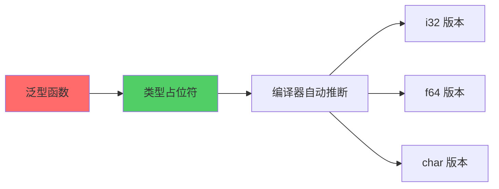
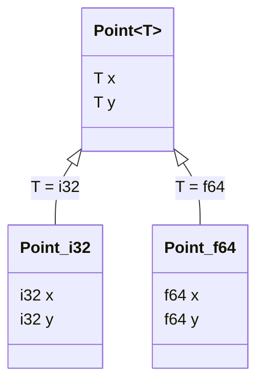
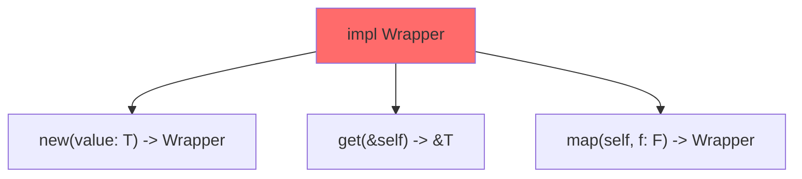
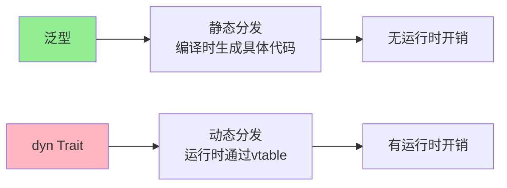
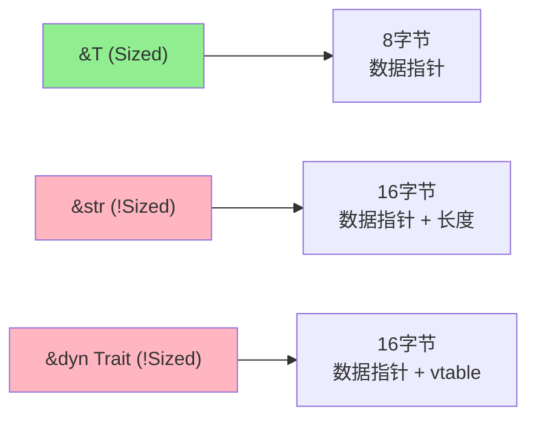

+++
title = "第 4 章 泛型"
weight = 40
date = "2026-03-27T17:24:46+08:00"
type = "docs"
description = ""
isCJKLanguage = true
draft = false
+++

# Chapter-04 泛型（Generics）

## 4.1 泛型基础

### 4.1.1 泛型函数

#### 4.1.1.1 <T> 类型参数声明

想象一下这个场景：你是一个餐厅老板，菜单上写着"可乐"。结果顾客点单时，有人要可口可乐，有人要百事可乐，有人要零度可乐...你总不能给每种可乐都写一道菜吧？

泛型就是 Rust 世界里的"通用菜单"！你只需要写一个函数，`T` 就好像是菜单上的一个占位符，等到真正"点单"（调用函数）的时候，编译器自动帮你填上具体的类型。

```rust
// 这就是泛型函数！<T> 就是那个神奇的占位符
// T 可以是任何实现了 std::cmp::PartialOrd 的类型（能比较大小）
// 注意：Rust 标准库没有 Comparable trait，应该用 PartialOrd！
fn largest<T: std::cmp::PartialOrd>(list: &[T]) -> &T {
    // 这段代码看起来很吓人？别怕，让我一步一步解释！
    // 首先，我们假设第一个元素是最大的
    let mut largest = &list[0];
    
    // 然后遍历剩下的元素
    for item in list {
        // 如果当前元素比 largest 大，就更新它！
        if item > largest {
            largest = item;
        }
    }
    
    // 返回最大的那个
    largest
}

fn main() {
    // 整数列表
    let numbers = vec![34, 50, 25, 100, 65];
    println!("数字列表中最大的: {}", largest(&numbers)); // 100
    
    // 字符列表（字符也可以比大小哦！）
    let chars = vec!['y', 'm', 'a', 'q'];
    println!("字符列表中最大的: {}", largest(&chars)); // y
    
    // 浮点数列表
    let floats = vec![3.14, 2.71, 1.41, 1.73];
    println!("浮点数列表中最大的: {}", largest(&floats)); // 3.14
    
    // 看到了吗？同一个函数，处理了三种不同的类型！
    // 这就是泛型的威力！

> ⚠️ **勘误**：早期版本文档中可能出现 `T: Comparable` 这样的约束，但 Rust 标准库并没有 `Comparable` trait。正确的约束应该是 `T: PartialOrd`（表示可以比较大小）。请读者注意辨别。
}
```

> **小贴士**：`<T>` 中的 T 只是惯例命名，你可以用任何名字，比如 `<Item>`、`<Type>`、`<MyType>`。不过大家都用 T，所以你也用 T 吧，合群很重要！

mermaid


#### 4.1.1.2 多类型参数

一个占位符不够用？没关系！Rust 支持多个类型参数，就像你可以同时点主食+饮料+甜点一样！

```rust
// 两个类型参数：T 和 U
// 这个函数接受两个不同类型的参数，返回一个元组
fn pair<T, U>(first: T, second: U) -> (T, U) {
    // 简单粗暴，直接返回元组
    (first, second)
}

// 三个类型参数也是可以的！
fn trio<T, U, V>(a: T, b: U, c: V) -> (T, U, V) {
    // 把三个东西打包成一个元组
    (a, b, c)
}

// 甚至可以玩出更多花样
fn mixed_output<T, U>(t: T, u: U) -> (String, T, U) {
    // 混合类型返回
    (format!("{:?} and {:?}", t, u), t, u)
}

fn main() {
    // 示例1：整数 + 字符串
    let p = pair(42, "hello");
    println!("pair 结果: {:?}", p); // (42, "hello")
    
    // 示例2：字符串 + 浮点数
    let p2 = pair("π", 3.14159);
    println!("pair 字符串+浮点: {:?}", p2); // ("π", 3.14159)
    
    // 示例3：三个不同类型
    let t = trio(1, "two", 3.0);
    println!("trio 结果: {:?}", t); // (1, "two", 3.0)
    
    // 示例4：各种混搭
    let result = mixed_output(123, vec![1, 2, 3]);
    println!("mixed_output: {:?}", result);
    // ("123 and [1, 2, 3]", 123, [1, 2, 3])
    
    // 看到了吗？泛型让你的函数变得超级灵活！
}
```

> **为什么需要多个类型参数？** 因为现实世界就是这么复杂！比如你想写一个缓存系统，键可能是字符串，值可能是任何类型——这时候就需要两个类型参数了。

#### 4.1.1.3 泛型函数参数的类型推导

你可能会问："调用泛型函数的时候，类型参数怎么填？"

答案是：**编译器比你更聪明！** 它会根据你传入的参数自动推断出 T 应该是什么类型。你什么都不用做！

```rust
// 泛型函数
fn identity<T>(value: T) -> T {
    // 传入什么类型，就返回什么类型
    // 编译器会自动推断 T 的类型
    value
}

// 泛型方法
fn compare_and_return<T, U>(first: T, second: U) -> (T, U)
where
    // 这里的约束表示 T 和 U 可以是任何类型
    T: std::fmt::Debug,
    U: std::fmt::Debug,
{
    println!("first = {:?}", first);
    println!("second = {:?}", second);
    (first, second)
}

fn main() {
    // 类型推导示例
    
    // 1. 自动推导为 i32
    let num = identity(42);
    println!("identity(42) = {}", num); // 42
    
    // 2. 自动推导为 String
    let text = identity(String::from("hello rust"));
    println!("identity(text) = {}", text); // hello rust
    
    // 3. 复杂的类型也能自动推导
    let result = identity(vec![1, 2, 3, 4, 5]);
    println!("identity(vec) = {:?}", result); // [1, 2, 3, 4, 5]
    
    // 4. 多类型参数也会自动推导
    let (a, b) = compare_and_return(100, "一百");
    println!("a = {}, b = {}", a, b); // a = 100, b = 一百
    
    // 5. 有时候需要一点提示
    let numbers: Vec<i32> = identity(vec![1, 2, 3]);
    println!("显式类型: {:?}", numbers); // [1, 2, 3]
}
```

> **编译器推导的原理**：当你调用 `identity(42)` 时，编译器看到传入的是 `i32`，返回值也是 `i32`，所以它推断 `T = i32`。简单吧？

### 4.1.2 泛型结构体

#### 4.1.2.1 单泛型参数

结构体也可以是泛型的！想象一下，你是一个模具工人，做了一个可变大小的盒子模具。这个模具可以生产整数盒子、字符串盒子、甚至嵌套盒子——只需要一个模具就够了！

```rust
// 泛型结构体：Point<T>
// T 就是那个可变类型
struct Point<T> {
    // x 和 y 都是 T 类型
    x: T,
    y: T,
}

fn main() {
    // 整数点
    let int_point = Point { x: 5, y: 10 };
    println!("整数点: ({}, {})", int_point.x, int_point.y);
    // 整数点: (5, 10)
    
    // 浮点数点
    let float_point = Point { x: 1.0, y: 4.0 };
    println!("浮点数点: ({}, {})", float_point.x, float_point.y);
    // 浮点数点: (1.0, 4.0)
    
    // 字符点（对，你没看错，字符也可以！）
    let char_point = Point { x: 'a', y: 'z' };
    println!("字符点: ({}, {})", char_point.x, char_point.y);
    // 字符点: (a, z)
    
    // 但是！x 和 y 必须是相同类型！
    // 下面这行会编译错误：
    // let wrong_point = Point { x: 5, y: 4.0 }; // 错误！类型不匹配
    
    // 正确做法是用多类型参数（下一节会讲）
}
```

> **等等，字符也能当坐标？** 当然！Rust 的 `char` 是 4 字节的 Unicode 标量值，可以是任何字符，包括中文、日文、甚至 emoji！虽然实际编程中不太会用到字符坐标，但这说明了 Rust 泛型的灵活性。

mermaid


#### 4.1.2.2 多泛型参数

一个类型参数不够？那就来两个！甚至三个！这让你可以创建更加灵活的数据结构。

```rust
// 两个类型参数的结构体
// 想象成一个"万能信封"，可以装任何两种东西
struct Pair<T, U> {
    // first 可以是任何类型
    first: T,
    // second 也可以是任何类型
    second: U,
}

// 三个类型参数的结构体
// 更复杂的"万能容器"
struct Triple<T, U, V> {
    first: T,
    second: U,
    third: V,
}

// 还可以有可变数量参数的变体
struct Multi<T> {
    items: Vec<T>,
}

fn main() {
    // 示例1：字符串 + 整数 = 用户信息？
    let user = Pair {
        first: String::from("Alice"),
        second: 30,
    };
    println!("用户: {} ({}岁)", user.first, user.second);
    // 用户: Alice (30岁)
    
    // 示例2：整数 + 浮点数 = 坐标？
    let coordinate = Pair {
        first: 100,
        second: 200.5,
    };
    println!("坐标: ({}, {})", coordinate.first, coordinate.second);
    // 坐标: (100, 200.5)
    
    // 示例3：Triple 三元组
    let record = Triple {
        first: String::from("2024-01-15"),
        second: String::from("北京"),
        third: 38.5,
    };
    println!("记录: 日期={}, 地点={}, 温度={}°C", record.first, record.second, record.third);
    // 记录: 日期=2024-01-15, 地点=北京, 温度=38.5°C
    
    // 示例4：Vec 实现的可变集合
    let numbers = Multi { items: vec![1, 2, 3, 4, 5] };
    println!("数字集合: {:?}", numbers.items);
    // 数字集合: [1, 2, 3, 4, 5]
    
    // 示例5：嵌套泛型
    let nested = Pair {
        first: Pair { first: 1, second: 2 },
        second: Pair { first: 'a', second: 'b' },
    };
    println!("嵌套 Pair: {:?}", nested);
    // 嵌套 Pair: Pair { first: Pair { first: 1, second: 2 }, second: Pair { first: 'a', second: 'b' } }
}
```

> **什么时候用多类型参数？** 当你的数据结构需要包含两个或更多不同类型的成员时。比如你想创建一个"键值对"容器，`Pair<String, i32>` 很合适；或者想创建一个"结果+错误信息"的组合，`Triple<T, U, V>` 就能派上用场。

### 4.1.3 泛型枚举

#### 4.1.3.1 Option<T> 的泛型实现

还记得我们之前用过无数次的 `Option` 吗？它其实就是 Rust 标准库定义的一个泛型枚举！让我们看看它的"真面目"：

```rust
// 这就是标准库中 Option 的定义（简化版）
// enum Option<T> {
//     Some(T),   // 有值
//     None,        // 没值
// }

fn main() {
    // Option<i32>：可以是数字，也可以是"没有"
    let some_number: Option<i32> = Some(5);
    let no_number: Option<i32> = None;
    
    // Option<&str>：可以是字符串引用，也可以是"没有"
    let some_text: Option<&str> = Some("hello");
    let no_text: Option<&str> = None;
    
    // Option<Vec<i32>>：可以是整数向量，也可以是"没有"
    let some_vector: Option<Vec<i32>> = Some(vec![1, 2, 3]);
    let no_vector: Option<Vec<i32>> = None;
    
    // 打印看看
    println!("some_number: {:?}", some_number); // Some(5)
    println!("no_number: {:?}", no_number); // None
    println!("some_text: {:?}", some_text); // Some("hello")
    println!("no_text: {:?}", no_text); // None
    println!("some_vector: {:?}", some_vector); // Some([1, 2, 3])
    println!("no_vector: {:?}", no_vector); // None
}
```

> **Option 的设计哲学**：在很多语言里，函数返回"没有值"可能是返回 `null`、`-1`、空字符串等等。这非常混乱——调用者根本不知道该怎么判断"没有值"。Rust 的 `Option` 强制你处理"没有值"的情况，编译器会检查你是否有 `None` 的处理分支。

#### 4.1.3.2 Result<T, E> 的泛型实现

`Result` 是另一个大名鼎鼎的泛型枚举，专门用来处理可能成功也可能失败的操作：

```rust
// Result<T, E> 的定义（简化版）
// enum Result<T, E> {
//     Ok(T),   // 成功了，有值
//     Err(E),  // 失败了，有错误信息
// }

use std::num::ParseIntError;

// 一个可能失败的函数
fn parse_and_double(s: &str) -> Result<i32, ParseIntError> {
    // str::parse::<i32>() 返回 Result<i32, ParseIntError>
    match s.parse::<i32>() {
        Ok(n) => Ok(n * 2), // 解析成功，翻倍
        Err(e) => Err(e),   // 解析失败，返回错误
    }
}

fn main() {
    // 成功的例子
    let success = parse_and_double("21");
    println!("成功解析 '21': {:?}", success); // Ok(42)
    
    // 失败的例子
    let failure = parse_and_double("oops");
    println!("解析 'oops': {:?}", failure);
    // Err(ParseIntError { kind: InvalidDigit })
    
    // Result 的强大之处：可以链式处理
    let result = Ok::<i32, &str>(10)
        .map(|x| x * 2)         // 翻倍 -> 20
        .map(|x| x + 5)         // 加 5 -> 25
        .map_err(|e| format!("错误: {}", e)); // 保持 Ok
    
    println!("链式处理: {:?}", result); // Ok(25)
}
```

> **为什么要用 Result？** 想象一下，如果没有 Result，你怎么知道一个函数调用是成功了还是失败了？返回 `-1`？但 `-1` 本身也可能是合法返回值！Result 通过类型系统强制你处理错误。如果你想偷懒直接用 `unwrap()`，程序会 panic（恐慌）而不是默默忽略错误——所以你至少会知道哪里出了问题！

#### 4.1.3.3 自定义泛型枚举

现在你已经了解了泛型枚举的秘密，让我们自己动手写一个！

```rust
// 一个"要么...要么..."的枚举
enum Either<T, U> {
    // 要么是左边的 T
    Left(T),
    // 要么是右边的 U
    Right(U),
    // 要么两个都有！
    Both(T, U),
}

use std::fmt;

impl<T: fmt::Debug, U: fmt::Debug> fmt::Debug for Either<T, U> {
    fn fmt(&self, f: &mut fmt::Formatter<'_>) -> fmt::Result {
        match self {
            Either::Left(t) => write!(f, "Left({:?})", t),
            Either::Right(u) => write!(f, "Right({:?})", u),
            Either::Both(t, u) => write!(f, "Both({:?}, {:?})", t, u),
        }
    }
}

fn main() {
    // 只装左边
    let left: Either<i32, &str> = Either::Left(42);
    println!("只装左边: {:?}", left); // Left(42)
    
    // 只装右边
    let right: Either<i32, &str> = Either::Right("hello");
    println!("只装右边: {:?}", right); // Right("hello")
    
    // 两个都装
    let both: Either<i32, &str> = Either::Both(42, "hello");
    println!("两个都装: {:?}", both); // Both(42, "hello")
    
    // 模式匹配！
    match left {
        Either::Left(n) => println!("左边是数字: {}", n),
        Either::Right(s) => println!("右边是字符串: {}", s),
        Either::Both(n, s) => println!("两个都有: {} 和 {}", n, s),
    }
    
    // 实际应用：表示"可选的两种结果"
    fn describe_result<T, U>(e: Either<T, U>) -> String
    where
        T: std::fmt::Display,
        U: std::fmt::Display,
    {
        match e {
            Either::Left(t) => format!("主要结果: {}", t),
            Either::Right(u) => format!("备用结果: {}", u),
            Either::Both(t, _) => format!("完整结果: {}", t),
        }
    }
    
    println!("{}", describe_result(Either::Left(100)));
    println!("{}", describe_result(Either::Right("fallback")));
    println!("{}", describe_result(Either::Both(100, "extra")));
}
```

> **什么时候用自定义泛型枚举？** 当你的数据需要表示"几种互斥的可能"时。比如网络请求结果：成功（带数据）、失败（带错误信息）、或者部分成功部分失败。`Either` 是函数式编程中常用的模式，在 Rust 里用泛型枚举来实现非常优雅。

### 4.1.4 泛型方法

#### 4.1.4.1 impl<T> 结构体<T> 上的方法

泛型结构体也可以有方法！而且方法可以是泛型的，或者针对特定类型有特殊实现。

```rust
// 定义一个泛型结构体
struct Wrapper<T> {
    value: T,
}

// 为泛型 Wrapper<T> 实现方法
impl<T> Wrapper<T> {
    // 这是一个泛型方法
    fn new(value: T) -> Self {
        Wrapper { value }
    }
    
    // 获取内部值的引用
    fn get(&self) -> &T {
        &self.value
    }
    
    // 变换内部值（返回新的 Wrapper）
    fn map<U, F>(self, f: F) -> Wrapper<U>
    where
        F: FnOnce(T) -> U,
    {
        Wrapper { value: f(self.value) }
    }
}

fn main() {
    // 创建 Wrapper
    let w = Wrapper::new(42);
    println!("Wrapper 里的值: {}", w.get()); // 42
    
    // 使用 map 转换
    let w2 = Wrapper::new(10).map(|x| x * 2);
    println!("翻倍后: {}", w2.get()); // 20
    
    // 链式调用
    let result = Wrapper::new(5)
        .map(|x| x + 1)  // 6
        .map(|x| x * 2)  // 12
        .map(|x| x.to_string()); // "12" (Wrapper<String>)
    
    println!("链式结果: {:?}", result.get()); // "12"
}
```

> **为什么要为泛型实现方法？** 因为泛型结构体的方法不一定需要是泛型的。比如 `get()` 方法，`T` 是什么类型不重要，重要的是返回 `&T`。这种"在 impl 中定义方法"的方式让你的 API 更加简洁。

mermaid


#### 4.1.4.2 为特定类型实现方法

这是泛型方法中最有趣的部分——你可以只为特定类型实现方法！

```rust
// 泛型点结构体
struct Point<T> {
    x: T,
    y: T,
}

// 为所有 Point<T> 实现的方法
impl<T> Point<T> {
    fn new(x: T, y: T) -> Self {
        Point { x, y }
    }
}

// 只为 f64 类型的 Point 实现特殊方法！
impl Point<f64> {
    // 只有 Point<f64> 有这个方法
    fn distance_from_origin(&self) -> f64 {
        // 勾股定理：√(x² + y²)
        (self.x.powi(2) + self.y.powi(2)).sqrt()
    }
    
    // 另一个只有浮点数点才有的方法
    fn angle(&self) -> f64 {
        // 计算与 x 轴的夹角（弧度）
        self.y.atan2(self.x)
    }
}

// 只为 i32 类型的 Point 实现另一个特殊方法
impl Point<i32> {
    // 只有整数点有这个方法
    fn manhattan_distance(&self) -> i32 {
        // 曼哈顿距离：|x| + |y|
        self.x.abs() + self.y.abs()
    }
}

fn main() {
    // 整数点
    let int_point = Point::new(3, 4);
    println!("整数点 ({}, {})", int_point.x, int_point.y);
    println!("曼哈顿距离: {}", int_point.manhattan_distance()); // 7
    // println!("距离: {}", int_point.distance_from_origin()); // 编译错误！整数点没有这个方法
    
    // 浮点数点
    let float_point = Point::new(3.0, 4.0);
    println!("浮点数点 ({}, {})", float_point.x, float_point.y);
    println!("欧几里得距离: {:.2}", float_point.distance_from_origin()); // 5.00
    println!("与 x 轴夹角: {:.2} 弧度 ({:.1}°)", float_point.angle(), float_point.angle() * 180.0 / std::f64::consts::PI);
    // 与 x 轴夹角: 0.93 弧度 (53.1°)
    // println!("曼哈顿距离: {}", float_point.manhattan_distance()); // 编译错误！浮点数点没有这个方法
    
    // 看到了吗？不同的类型有不同的"特异功能"！
}
```

> **这是什么魔法？** 其实原理很简单：编译器在编译时知道 `Point<i32>` 和 `Point<f64>` 是不同的类型。所以当你写 `impl Point<f64>` 时，编译器只会为 `Point<f64>` 生成这些方法。这是**针对特定类型的 impl 块**，不是完整的"特化"（specialization）——Rust 目前还不支持完整的特化功能，但这种写法已经能覆盖大多数实用场景！

---

## 4.2 泛型约束（Trait Bound）

### 4.2.1 Trait Bound 基本语法

#### 4.2.1.1 T: Trait

泛型约束（Trait Bound）就像是给泛型参数加上"必须会什么"的限制。

```rust
use std::fmt;

// T: Display 约束表示：T 必须实现 Display trait
// 也就是说，T 必须能够被格式化打印
fn print<T: fmt::Display>(value: T) {
    println!("值为: {}", value);
}

// T: Clone 约束表示：T 必须可以被克隆
fn clone_and_print<T: Clone>(value: &T) -> T {
    let cloned = value.clone();
    println!("克隆前: {:?}", value);
    cloned
}

fn main() {
    // i32 实现了 Display，所以可以
    print(42); // 值为: 42
    
    // String 实现了 Display，所以可以
    print(String::from("hello")); // 值为: hello
    
    // Vec<i32> 没有实现 Display，所以不行
    // print(vec![1, 2, 3]); // 编译错误！
    
    // 但是 Vec<i32> 实现了 Clone
    let v = vec![1, 2, 3];
    let v2 = clone_and_print(&v);
    println!("克隆后: {:?}", v2);
    // 克隆前: [1, 2, 3]
    // 克隆后: [1, 2, 3]
}
```

> **为什么要约束？** 想象一下，如果你写了一个泛型函数需要比较两个值的大小，但你没有加 `PartialOrd` 约束，那么编译器根本不知道这两个值能不能比较！约束就是告诉编译器"这个类型必须会 XXX"。

#### 4.2.1.2 多重约束

一个类型可能需要同时满足多个约束？没问题，用 `+` 连接！

```rust
use std::fmt::{self, Debug};

// T 必须同时实现 Display 和 Debug
fn print_debug<T: fmt::Display + fmt::Debug>(value: T) {
    // Display 格式
    println!("Display: {}", value);
    // Debug 格式
    println!("Debug: {:?}", value);
}

// 更复杂的约束组合
#[derive(Debug)]
struct Person {
    name: String,
    age: u32,
}

impl fmt::Display for Person {
    fn fmt(&self, f: &mut fmt::Formatter<'_>) -> fmt::Result {
        write!(f, "{} ({}岁)", self.name, self.age)
    }
}

fn main() {
    let person = Person {
        name: String::from("张三"),
        age: 30,
    };
    
    // Person 同时实现了 Display 和 Debug
    print_debug(person);
    // Display: 张三 (30岁)
    // Debug: Person { name: "张三", age: 30 }
}
```

> **什么时候需要多重约束？** 当你的泛型函数需要类型同时具备多种能力时。比如上面的 `print_debug`，既要用 `Display` 的 `{}` 格式化，又要用 `Debug` 的 `{:?}` 格式化。

#### 4.2.1.3 约束与类型推导的配合

约束让类型推导更加精确。

```rust
use std::fmt::Display;

// 这个函数要求 T 同时可以比较大小和打印
fn max_and_print<T: PartialOrd + Display>(a: T, b: T) {
    if a > b {
        println!("最大: {}", a);
    } else {
        println!("最大: {}", b);
    }
}

fn main() {
    // 编译器自动推导 T = i32（因为 i32 实现了 PartialOrd 和 Display）
    max_and_print(10, 20); // 最大: 20
    
    // 编译器自动推导 T = f64
    max_and_print(3.14, 2.71); // 最大: 3.14
    
    // 字符串也可以！
    max_and_print("apple", "banana"); // 最大: banana (按字典序比较)
}
```

### 4.2.2 where 子句

#### 4.2.2.1 where T: Trait 替代内联约束

当约束很多很复杂时，内联写法会变得很乱。`where` 子句让代码更清晰。

```rust
use std::fmt;

// 内联写法（约束少的时候还行）
fn inline<T: fmt::Display + fmt::Debug>(value: T) {
    println!("{}", value);
    println!("{:?}", value);
}

// where 子句写法（约束多的时候更清晰）
fn with_where<T>(value: T)
where
    T: fmt::Display + fmt::Debug,
{
    println!("{}", value);
    println!("{:?}", value);
}

fn main() {
    with_where(42);
    with_where("hello");
}
```

#### 4.2.2.2 多重 where 约束

多个类型参数，每个有不同的约束？

```rust
use std::fmt::{self, Debug};
use std::hash::Hash;

// 多个类型参数，每个有不同约束
fn complex_function<T, U>(t: T, u: U) -> String
where
    T: fmt::Display + Debug + Clone,  // T 需要三个约束
    U: fmt::Debug + Hash,              // U 需要两个约束
{
    format!("t = {:?}, u = {:?}", t, u)
}

// 甚至可以约束之间的关系
fn related<T, U>(t: T, u: U)
where
    T: Clone,
    U: Clone + From<T>,  // U 可以从 T 构造
{
    let u2 = U::from(t.clone());
    println!("t = {:?}, u = {:?}", t, u2);
}

fn main() {
    println!("{}", complex_function(42, "hello"));
    // t = 42, u = "hello"
}
```

#### 4.2.2.3 where 子句的阅读顺序

`where` 子句让函数签名更加可读。

```rust
use std::fmt::Display;

// 复杂函数：转换成字符串并添加前缀
fn format_and_label<T, U>(item: T, label: U) -> String
where
    T: Display,  // item 可以被格式化
    U: Into<String> + Clone,  // label 可以转成字符串
{
    let prefix = label.clone().into();
    format!("[{}] {}", prefix, item)
}

fn main() {
    println!("{}", format_and_label(42, "数字"));
    println!("{}", format_and_label("hello", "文本"));
    println!("{}", format_and_label(3.14, "π"));
}
```

### 4.2.3 默认泛型类型参数

#### 4.2.3.1 trait Foo<T = String>

默认类型参数让 trait 更灵活。

```rust
// 定义一个带默认类型的 trait
trait Container<T = i32> {
    fn get(&self) -> T;
    fn len(&self) -> usize;
}

// 使用默认类型（i32）
struct DefaultContainer {
    items: Vec<i32>,
}

impl Container for DefaultContainer {
    // 注意：这里没有 type Item，因为 Container 使用的是泛型参数 T 而不是关联类型
    // 由于 T 有默认值 i32，这里直接实现 Container 即可，get() 返回 i32
    
    fn get(&self) -> i32 {
        self.items.iter().sum()
    }
    
    fn len(&self) -> usize {
        self.items.len()
    }
}

// 指定另一种类型
struct StringContainer {
    items: Vec<String>,
}

impl Container<String> for StringContainer {
    // 指定 T = String，所以 get() 返回 String
    
    fn get(&self) -> String {
        self.items.join(", ")
    }
    
    fn len(&self) -> usize {
        self.items.len()
    }
}

fn main() {
    // DefaultContainer 使用默认的 i32
    let default = DefaultContainer { items: vec![1, 2, 3, 4, 5] };
    println!("默认容器: 和={}, 长度={}", default.get(), default.len());
    // 默认容器: 和=15, 长度=5
    
    // StringContainer 使用指定的 String
    let string = StringContainer {
        items: vec![String::from("hello"), String::from("world")],
    };
    println!("字符串容器: {:?}, 长度={}", string.get(), string.len());
    // 字符串容器: hello, world, 长度=2
}
```

#### 4.2.3.2 默认类型的使用

标准库中有很多使用默认类型的例子。

```rust
// std::error::Error 有一个默认的 Source 类型
// 但你通常不需要关心它

// Another example: Iterator
// trait Iterator {
//     type Item; // 没有默认值
//     fn next(&mut self) -> Option<Self::Item>;
// }

// IntoIterator
// trait IntoIterator {
//     type Item;
//     fn into_iter(self) -> Self::IntoIter;
// }
```

#### 4.2.3.3 默认类型与类型推断的配合

默认类型让调用者可以选择是否指定类型。

```rust
// 默认使用 String
trait Config<T = String> {
    fn value(&self) -> &T;
}

// 简单调用：不指定类型，使用默认
fn simple() -> impl Config {
    // 返回默认的 Config<String>
}

// 复杂调用：指定类型
fn complex() -> impl Config<Vec<i32>> {
    // 返回 Config<Vec<i32>>
}

struct SimpleConfig {
    value: String,
}

impl Config for SimpleConfig {
    fn value(&self) -> &String {
        &self.value
    }
}

struct ComplexConfig {
    value: Vec<i32>,
}

impl Config<Vec<i32>> for ComplexConfig {
    fn value(&self) -> &Vec<i32> {
        &self.value
    }
}

fn main() {
    let simple = SimpleConfig { value: String::from("hello") };
    println!("简单: {}", simple.value()); // hello
    
    let complex = ComplexConfig { value: vec![1, 2, 3] };
    println!("复杂: {:?}", complex.value()); // [1, 2, 3]
}
```

### 4.2.4 泛型条件的优先级规则

#### 4.2.4.1 impl<T> 的条件实现

为特定约束的类型实现特殊方法！

```rust
use std::fmt::Display;

// 泛型结构体
struct Pair<T> {
    first: T,
    second: T,
}

impl<T> Pair<T> {
    fn new(first: T, second: T) -> Self {
        Pair { first, second }
    }
}

// 只有实现了 Clone 的类型才有 clone_self 方法
impl<T: Clone> Pair<T> {
    fn clone_self(&self) -> Self {
        Pair {
            first: self.first.clone(),
            second: self.second.clone(),
        }
    }
}

// 只有实现了 Display 的类型才有 display 方法
impl<T: Display> Pair<T> {
    fn display(&self) {
        println!("Pair({}, {})", self.first, self.second);
    }
}

fn main() {
    let p = Pair::new("hello", "world");
    
    // 都有的方法
    p.display(); // Pair(hello, world)
    
    // Clone 约束的方法
    let p2 = p.clone_self();
    println!("克隆: {:?}", (p2.first, p2.second));
    // 克隆: ("hello", "world")
    
    // 如果 T 没有实现 Clone，就没有 clone_self
    // struct NoClone; // 假设这个类型没实现 Clone
    // let p3 = Pair::new(NoClone, NoClone);
    // p3.clone_self(); // 编译错误！
}
```

#### 4.2.4.2 trait 的条件实现

为一个 trait 为另一个 trait 提供默认实现！

```rust
use std::fmt::{self, Display, Debug};

// 定义一个简单的 trait
trait Printable {
    fn print(&self);
}

// 为所有实现了 Display 的类型提供默认实现
impl<T: Display> Printable for T {
    fn print(&self) {
        println!("{}", self);
    }
}

// 自定义类型
struct Person {
    name: String,
    age: u32,
}

impl Display for Person {
    fn fmt(&self, f: &mut fmt::Formatter<'_>) -> fmt::Result {
        write!(f, "{} ({}岁)", self.name, self.age)
    }
}

// 因为 Person 实现了 Display，所以自动实现了 Printable
impl Printable for Person {
    fn print(&self) {
        // 这里重写了默认实现！
        println!("👤 {} - {}岁", self.name, self.age);
    }
}

fn main() {
    // 整数自动实现了 Printable（因为 i32 实现了 Display）
    42.print(); // 42
    
    // 字符串也一样
    "hello".print(); // hello
    
    // 自定义类型有自己的实现
    let person = Person {
        name: String::from("张三"),
        age: 30,
    };
    person.print(); // 👤 张三 - 30岁
}
```

---

## 4.3 泛型实现

### 4.3.1 泛型与性能

#### 4.3.1.1 单态化（Monomorphization）

泛型代码在编译时会"展开"成具体类型的代码，这就是单态化！

```rust
// 泛型函数
fn largest<T: PartialOrd>(list: &[T]) -> &T {
    let mut largest = &list[0];
    for item in list {
        if item > largest {
            largest = item;
        }
    }
    largest
}

fn main() {
    let nums = vec![1, 2, 3, 4, 5];
    largest(&nums); // 调用 largest_i32
}
```

编译器生成的伪代码（注意保留 trait bound）：

```rust
// 编译器生成的 i32 版本
fn largest_i32(list: &[i32]) -> &i32
where
    i32: PartialOrd,  // 保留原始的 trait bound
{
    let mut largest = &list[0];
    for item in list {
        if item > largest {
            largest = item;
        }
    }
    largest
}

// 编译器生成的 f64 版本
fn largest_f64(list: &[f64]) -> &f64
where
    f64: PartialOrd,  // 保留原始的 trait bound
{
    let mut largest = &list[0];
    for item in list {
        if item > largest {
            largest = item;
        }
    }
    largest
}
```

#### 4.3.1.2 动态分发（dyn Trait）的性能差异

和泛型不同，`dyn Trait` 使用虚表（vtable）动态派发，有运行时开销。

```rust
trait Draw {
    fn draw(&self);
}

struct Circle;
struct Square;

impl Draw for Circle {
    fn draw(&self) { println!("画圆"); }
}

impl Draw for Square {
    fn draw(&self) { println!("画方"); }
}

// 静态分发：编译时决定调用哪个
fn draw_static(shape: &impl Draw) {
    shape.draw();
}

// 动态分发：运行时通过 vtable 决定
fn draw_dynamic(shape: &dyn Draw) {
    shape.draw();
}

fn main() {
    let circle = Circle;
    let square = Square;
    
    draw_static(&circle); // 编译时确定调用 Circle::draw
    draw_dynamic(&circle); // 运行时通过 vtable 调用
}
```

mermaid


#### 4.3.1.3 零成本抽象

Rust 的泛型是真正的零成本抽象！

```rust
// 这个函数看起来很抽象
fn sum<T: Copy + Into<f64>>(values: &[T]) -> f64 {
    values.iter().map(|v| (*v).into()).sum()
}

fn main() {
    let nums = vec![1, 2, 3, 4, 5];
    println!("和: {}", sum(&nums)); // 15.0
    
    // 编译器会为 i32 生成专门的版本
    // 性能等价于手写的:
    // fn sum_i32(values: &[i32]) -> f64 {
    //     values.iter().map(|v| *v as f64).sum()
    // }
}
```

> **Rust 泛型的核心优势**：既有高级语言的抽象能力，又有低级语言的运行效率。这就是"零成本抽象"的含义——你不需要为你使用的抽象付出运行时代价！

---

## 4.4 特殊泛型模式

### 4.4.1 Sized Trait

#### 4.4.1.1 Sized trait 定义

在深入 `?Sized` 之前，让我们先搞清楚 `Sized` 是什么。

```rust
// Sized 是一个"标记 trait"，它没有方法
// 如果一个类型的大小在编译时已知，它就是 Sized
// 大多数类型都是 Sized

fn main() {
    // i32 的大小是固定的 4 字节 -> Sized
    println!("i32 是 Sized，大小: {} 字节", std::mem::size_of::<i32>()); // 4
    
    // str 的大小不固定（字符串有不同长度）-> !Sized
    // 下面这行会编译错误：
    // println!("str 大小: {}", std::mem::size_of::<str>());
    
    // [i32] 也是 !Sized，因为数组长度不确定
    // println!("[i32] 大小: {}", std::mem::size_of::<[i32]>());
    
    // 但是引用的大小是固定的！
    println!("&str 大小: {} 字节", std::mem::size_of::<&str>()); // 16（64位系统）
    println!("&i32 大小: {} 字节", std::mem::size_of::<&i32>()); // 8
}
```

> **Sized 是什么意思？** 翻译成中文就是"有大小"。Rust 里绝大多数类型都是 `Sized`，因为它们的大小在编译时就知道了。只有 `str`（字符串切片）、`[T]`（数组切片）和 `dyn Trait`（trait 对象）这些"动态大小类型"才是 `!Sized`。

#### 4.4.1.2 默认 T 携带隐式 Sized 约束

当你写一个泛型函数时，Rust 默认会给类型参数加上 `Sized` 约束。这意味着你假设 T 的大小在编译时已知。

```rust
// 这两个函数声明是等价的！
fn foo<T>(x: &T) { } // 隐含了 T: Sized
fn foo<T: Sized>(x: &T) { } // 显式写出

// 在实际使用中，&T 总是 Sized
// 因为引用本身的大小是固定的（一个指针）
fn main() {
    let x = 42;
    foo(&x); // 完全 OK
    
    // 引用让 T 可以是 !Sized
    // 因为引用把动态大小的东西"包装"成了固定大小
}
```

#### 4.4.1.3 T: ?Sized 移除约束

有些情况下，你需要处理动态大小类型，这时就可以用 `?Sized` 来移除 `Sized` 约束。

```rust
// ?Sized 允许 T 是动态大小的
// 这个函数可以接受 str 或 [T] 或普通类型
fn print_size<T: ?Sized>(t: &T) {
    // 注意参数是 &T，不是 &mut T
    // 因为我们只需要读取
    println!("大小（通过引用）: {} 字节", std::mem::size_of_val(t));
}

fn main() {
    // 1. 普通类型
    let x: i32 = 42;
    print_size(&x); // 4 字节
    
    // 2. 字符串切片（动态大小！）
    let s: &str = "hello world";
    print_size(&s); // 12 字节（字符串切片的引用）
    
    // 3. 数组切片（动态大小！）
    let arr: &[i32] = &[1, 2, 3, 4, 5];
    print_size(&arr); // 32 字节（数组切片的引用）
    
    // 4. Vec（Vec 本身是 Sized 的，但它的切片不是）
    let v = vec![1, 2, 3];
    print_size(&v); // 24 字节（Vec 的引用）
}
```

> **什么时候用 `?Sized`？** 当你需要编写能够同时处理固定大小和动态大小类型的代码时。比如写一个通用的序列化函数，它既要能序列化 `i32`（Sized），也要能序列化 `str`（!Sized）。

#### 4.4.1.4 T: ?Sized 时的方法调用限制

当你移除了 `Sized` 约束后，有些操作就不能用了。

```rust
// 这个函数接受 ?Sized 类型
fn bad_example<T: ?Sized>(v: &mut T) {
    // 注意：&mut T 本身的大小是固定的（就是一个指针）
    // 但这里我们想做的事（比如移动 v）需要知道 T 的大小
    // let _owned: T = *v; // 错误！无法将 ?Sized 类型移出引用
}

// 正确做法：如果需要修改，应该限制为 Sized
fn good_example<T: Sized>(v: &mut T) {
    // 这里可以对 v 做任何事，因为 T 的大小是已知的
    println!("值: {:?}", v);
}

fn main() {
    let mut x = 42;
    good_example(&mut x); // OK
    
    // 但是注意：引用本身的大小是固定的
    // 所以 &mut T 即使 T 是 !Sized 也是 OK 的
    // 只是引用的内容不能直接操作
}
```

#### 4.4.1.5 指针语义的变化

`Sized` 和 `?Sized` 会影响指针的行为。

```rust
use std::fmt;

fn main() {
    // 1. Sized 类型（普通类型）
    let x: i32 = 42;
    let ptr: &i32 = &x; // &i32 是一个指针，大小固定 8 字节（64位）
    
    // 2. !Sized 类型（str）
    let s: &str = "hello";
    let ptr: &str = s; // &str 是"胖指针"，包含指针 + 长度 = 16 字节
    
    // 3. dyn Trait（trait 对象）
    trait Printable {
        fn print(&self);
    }
    
    impl Printable for i32 {
        fn print(&self) {
            println!("数字: {}", self);
        }
    }
    
    let num = 42i32;
    let obj: &dyn Printable = &num; // &dyn Printable 也是胖指针
    // 胖指针 = 数据指针 + vtable 指针
    
    println!("&i32 大小: {} 字节", std::mem::size_of::<&i32>());
    println!("&str 大小: {} 字节", std::mem::size_of::<&str>());
    println!("&dyn Printable 大小: {} 字节", std::mem::size_of::<&dyn Printable>());
    
    // 在 64 位系统上：
    // &i32 = 8 字节（只有指针）
    // &str = 16 字节（指针 + 长度）
    // &dyn Trait = 16 字节（指针 + vtable 指针）
}
```

mermaid


### 4.4.2 关联类型

#### 4.4.2.1 trait Iterator { type Item; }

关联类型是 trait 定义的一部分，每个实现者只能有一种关联类型。

```rust
// Iterator trait 使用关联类型
trait Iterator {
    // Item 是这个迭代器产生的元素类型
    // 每个实现只能有一个 Item 类型
    type Item;
    
    fn next(&mut self) -> Option<Self::Item>;
}

// 实现 Iterator for Counter
struct Counter {
    current: u32,
    max: u32,
}

impl Counter {
    fn new(max: u32) -> Self {
        Counter { current: 0, max }
    }
}

impl Iterator for Counter {
    type Item = u32; // Counter 的 Item 类型是 u32
    
    fn next(&mut self) -> Option<Self::Item> {
        if self.current < self.max {
            self.current += 1;
            Some(self.current)
        } else {
            None
        }
    }
}

fn main() {
    let mut counter = Counter::new(5);
    
    println!("Counter 产生的数字:");
    while let Some(n) = counter.next() {
        print!("{} ", n); // 1 2 3 4 5
    }
    println!();
}
```

#### 4.4.2.2 关联类型 vs 泛型参数

关联类型和泛型参数都能用于泛型，但适用场景不同。

```rust
// 方法1：泛型参数
trait IteratorGen<T> {
    fn next(&mut self) -> Option<T>;
}

// 方法2：关联类型
trait IteratorAssoc {
    type Item;
    fn next(&mut self) -> Option<Self::Item>;
}

// 泛型参数的优势：一个类型可以实现多次，每次用不同类型
struct MultiIterator {
    int_count: u32,
    str_count: u32,
}

impl IteratorGen<u32> for MultiIterator {
    fn next(&mut self) -> Option<u32> {
        self.int_count += 1;
        Some(self.int_count)
    }
}

impl IteratorGen<String> for MultiIterator {
    fn next(&mut self) -> Option<String> {
        self.str_count += 1;
        Some(format!("string-{}", self.str_count))
    }
}

// 关联类型的优势：一个类型只能实现一次，语义更清晰
struct FixedIterator {
    count: u32,
}

impl IteratorAssoc for FixedIterator {
    type Item = u32; // 只能有一种 Item 类型
    
    fn next(&mut self) -> Option<Self::Item> {
        self.count += 1;
        Some(self.count)
    }
}

fn main() {
    let mut multi = MultiIterator { int_count: 0, str_count: 0 };
    
    // 可以同时用两种迭代器
    let num = <MultiIterator as IteratorGen<u32>>::next(&mut multi);
    let txt = <MultiIterator as IteratorGen<String>>::next(&mut multi);
    println!("泛型: {:?}, {:?}", num, txt);
    
    let mut fixed = FixedIterator { count: 0 };
    println!("关联类型: {:?}", fixed.next());
}
```

> **什么时候用哪个？**
> - 泛型参数：一个类型可以有多重实现，每次用不同的类型参数
> - 关联类型：一个类型只有一种关联类型，语义更明确

#### 4.4.2.3 关联类型的默认类型

关联类型可以有默认值。

```rust
// 带默认类型的 trait
trait IteratorWithDefault {
    type Item = i32; // 默认是 i32
    
    fn next(&mut self) -> Option<Self::Item>;
}

struct DefaultIter;

impl IteratorWithDefault for DefaultIter {
    // 不指定 Item，使用默认的 i32
    fn next(&mut self) -> Option<Self::Item> {
        Some(42)
    }
}

struct StringIter;

impl IteratorWithDefault for StringIter {
    type Item = String; // 覆盖默认类型
    
    fn next(&mut self) -> Option<Self::Item> {
        Some(String::from("hello"))
    }
}

fn main() {
    let default = DefaultIter;
    println!("默认类型: {:?}", default.next()); // Some(42)
    
    let string = StringIter;
    println!("指定类型: {:?}", string.next()); // Some("hello")
}
```

---

## 4.5 const 泛型

### 4.5.1 const 参数

#### 4.5.1.1 [T; N] 与类型级数字

数组的大小现在可以成为类型的一部分！

```rust
fn main() {
    // 数组大小是类型的一部分！
    let arr5: [i32; 5] = [1, 2, 3, 4, 5];
    let arr3: [i32; 3] = [1, 2, 3];
    
    println!("5元素数组: {:?}", arr5);
    println!("3元素数组: {:?}", arr3);
    
    // 重要：不同大小的数组是不同的类型！
    // 下面这行会编译错误：
    // fn compare(a: [i32; 5], b: [i32; 3]) { }
    // 因为 [i32; 5] 和 [i32; 3] 是不同的类型
}
```

#### 4.5.1.2 Generic<'a, const N: usize>

const 泛型参数让你可以写编译期可计算大小的代码。

```rust
// const 泛型参数
struct ArrayWrapper<T, const N: usize> {
    data: [T; N],
}

impl<T, const N: usize> ArrayWrapper<T, N> {
    fn new(data: [T; N]) -> Self {
        ArrayWrapper { data }
    }
    
    fn len(&self) -> usize {
        N // 编译期就知道长度！
    }
    
    fn is_empty(&self) -> bool {
        N == 0
    }
}

fn main() {
    // 创建不同大小的包装器
    let arr3 = ArrayWrapper::new([1, 2, 3]);
    let arr5 = ArrayWrapper::new([1, 2, 3, 4, 5]);
    
    println!("3元素包装器: 长度={}, 空={}", arr3.len(), arr3.is_empty());
    println!("5元素包装器: 长度={}, 空={}", arr5.len(), arr5.is_empty());
    
    // 长度是类型的一部分，编译时就知道！
    // 所以 len() 返回的是编译期常量，没有运行时开销
}
```

### 4.5.2 const Trait

#### 4.5.2.1 const 泛量的运算

const 泛型也支持一些编译期运算！

```rust
// const fn 可以接受类型参数（不是 const 泛型参数），返回类型的值
const fn make_zero<T: From<u8>>() -> T {
    T::from(0)
}

// 更多例子
fn main() {
    // const 泛量可以用于类型声明
    let arr: [i32; 16] = [0; 16]; // 16 个元素的数组
    
    // 编译期计算的大小
    const SIZE: usize = 8;
    let arr2: [i32; SIZE] = [0; SIZE];
    
    println!("arr 大小: {}, arr2 大小: {}", arr.len(), arr2.len());
    
    // const fn 调用
    let zero_i32: i32 = make_zero();
    let zero_u8: u8 = make_zero();
    println!("零值: i32={}, u8={}", zero_i32, zero_u8);
}
```

> **注意**：`const fn` 配合类型参数可以做一些编译期计算，但这里的 `N` 是类型参数而不是 const 泛型参数。真正的 const 泛型参数是 `const N: usize` 这种形式。

#### 4.5.2.2 const 泛量的比较

const 泛量可以比较！

```rust
fn largest_array<const N: usize>() -> usize {
    N
}

fn main() {
    // const 泛量可以在编译期比较
    const A: usize = largest_array::<5>();
    const B: usize = largest_array::<10>();
    
    println!("A = {}, B = {}", A, B);
    println!("A < B = {}", A < B); // true
    
    // 用于数组大小
    let arr: [i32; 5] = [1, 2, 3, 4, 5];
    let arr2: [i32; 10] = [0; 10];
    
    println!("arr 长度: {}, arr2 长度: {}", arr.len(), arr2.len());
}
```

#### 4.5.2.3 [u8; 4] vs [u8; N]

普通数组和 const 泛型数组的区别。

```rust
fn main() {
    // 普通数组：大小是编译期常量
    let fixed: [u8; 4] = [1, 2, 3, 4];
    println!("固定大小数组: {:?}", fixed);
    
    // const 泛型数组：大小是类型参数
    fn process_array<const N: usize>(arr: [u8; N]) {
        println!("处理 {} 个元素", N);
    }
    
    process_array([1, 2, 3, 4]); // N = 4
    process_array([1, 2]); // N = 2
    
    // 两者本质上是一样的，只是写法不同
}
```

---

## 4.6 高级特性

### 4.6.1 特化入门

#### 4.6.1.1 min_specialization feature

特化让你可以为特定类型提供更优的实现。

```rust
// 这是一个实验性功能，需要开启 feature
// #![feature(min_specialization)]

trait Greet {
    fn greet(&self) -> String;
}

// 默认实现
impl<T> Greet for T {
    fn greet(&self) -> String {
        String::from("Hello!")
    }
}

// 特化实现：针对 String
impl Greet for String {
    fn greet(&self) -> String {
        format!("Hello, {}!", self)
    }
}

fn main() {
    // 普通类型用默认实现
    let n = 42;
    println!("数字的问候: {}", <i32 as Greet>::greet(&n));
    // Hello!
    
    // String 用特化实现
    let name = String::from("World");
    println!("字符串的问候: {}", name.greet());
    // Hello, World!
}
```

### 4.6.2 特化与默认实现

#### 4.6.2.1 默认实现 vs 具体实现的冲突

> ⚠️ **警告**：Rust 目前不支持完整的特化（specialization）功能！以下示例需要 `#![feature(min_specialization)]` 才能编译。

特化有规则限制，不能有两个都可能匹配的实现。

```rust
#![feature(min_specialization)]

// 1. 默认实现 (impl<T> Foo for T) —— 所有类型都有的通用实现
// 2. 具体实现 (impl Foo for SpecificType) —— 针对特定类型的实现

// 这两个 impl 块对 SomeType 类型来说都可能匹配：
// impl<T> Foo for T { ... }           // 匹配，因为 SomeType: Foo
// impl Foo for SomeType { ... }        // 也匹配！
// 在 Rust 中，这种重叠是不允许的！

// 正确的做法：确保具体 impl 是默认 impl 的"特化版本"
// 即：具体 impl 的类型集合应该是默认 impl 的子集
```

#### 4.6.2.2 特化的使用场景

```rust
// 特化常用于：
// 1. 为特定类型提供优化实现
// 2. 避免重复计算
// 3. 提供特定类型的边界检查优化

// 注意：这里用英文命名以符合 Rust 编码规范（中文 trait 名虽能编译，但不推荐）
trait EfficientConvert<T> {
    fn convert(&self) -> T;
}

impl<T, U> EfficientConvert<U> for T
where
    T: Clone,
    U: From<T>,
{
    fn convert(&self) -> U {
        U::from(self.clone())
    }
}
```

---

## 本章小结

恭喜你完成了第四章"泛型"的学习！🎉

这一章我们深入探索了 Rust 泛型编程的方方面面：

1. **泛型基础**：泛型函数、多类型参数、类型推导。泛型就像是 Rust 世界里的"万能钥匙"，让你写一次代码，适用于无数种类型。

2. **泛型结构体和枚举**：单泛型参数和多泛型参数的结构体和枚举。`Option<T>` 和 `Result<T, E>` 就是最好的例子！

3. **泛型方法**：为泛型结构体实现方法，以及为特定类型实现特殊方法。这就是 Rust 的"特化"能力。

4. **泛型约束（Trait Bound）**：泛型约束让编译器知道泛型参数必须"会做什么"。多重约束和 `where` 子句让代码更清晰。

5. **默认类型参数**：让 trait 更加灵活，默认类型在大多数情况下就能工作，需要时再指定。

6. **条件实现**：为满足特定约束的类型实现特殊方法，这是零成本抽象的体现。

7. **泛型实现**：理解了单态化、动态分发和零成本抽象的原理。

8. **特殊泛型模式**：理解了动态大小类型（`Sized`、`?Sized`）和编译期大小检测的区别，以及 `?Sized` 如何让我们处理 `str`、`[T]` 这样的动态大小类型。

9. **关联类型**：与泛型参数不同的另一种泛型方式，适用于每个实现只有一种类型的场景。

10. **const 泛型**：让数组大小成为类型的一部分，编译期就可以计算！

11. **高级特性**：特化（specialization）与默认实现（实验性功能，目前需要开启 `min_specialization` feature）。

**下一章预告：**
第五章"Trait（特征）"将带你深入 Rust 的 trait 系统——这是 Rust 实现多态、接口抽象和代码复用的核心机制！准备好了吗？🚀
