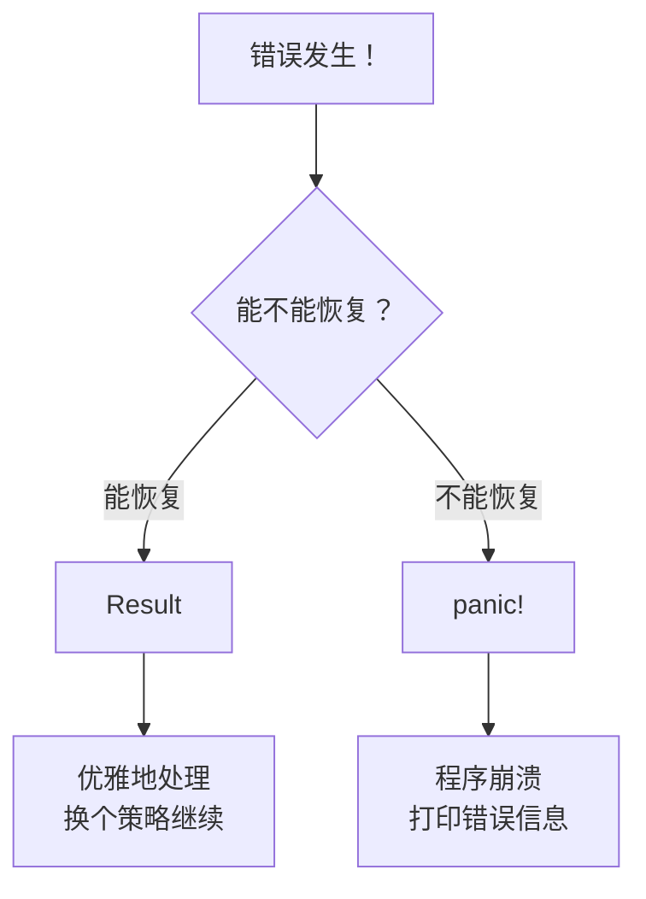
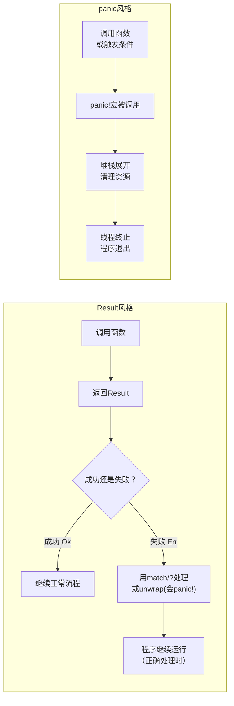
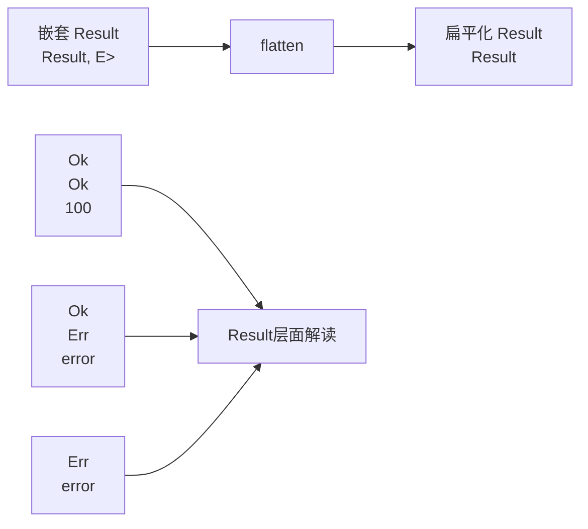
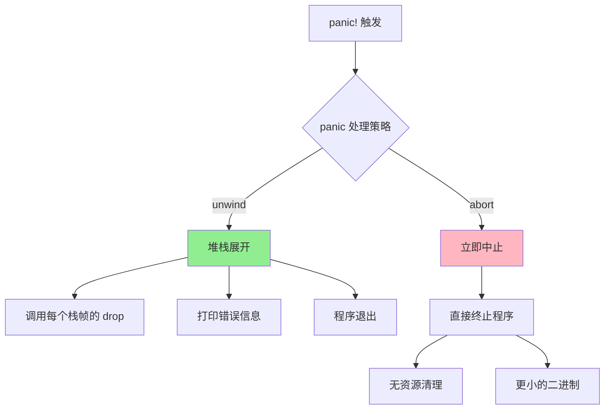
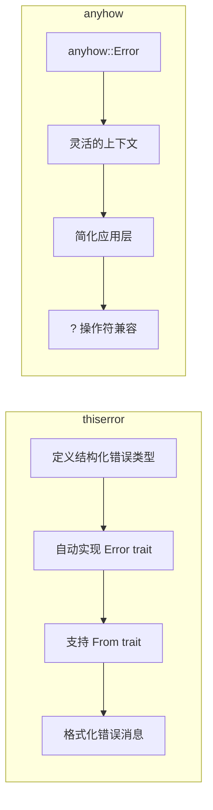

+++
title = "第 7 章 错误处理"
weight = 70
date = "2026-03-27T17:24:46+08:00"
type = "docs"
description = ""
isCJKLanguage = true
draft = false
+++

# Chapter 07 错误处理（Error-Handling）

想象一下，你是一家高级餐厅的服务员。有一天，客人点了一份牛排，你兴冲冲地端着盘子走向餐桌，结果——牛排掉地上了！

这时候你会怎么办？彻底崩溃蹲在原地大哭？还是有条不紊地重新做一份、或者诚实地告诉客人"稍等片刻"？

**恭喜你，你已经理解了 Rust 的错误处理哲学！**

在编程的世界里，错误就像生活中的小挫折一样常见。文件找不到？网络连接失败？用户输入了莫名其妙的数据？这些事情每天都在发生。Rust 的设计者们深知这一点，因此为咱们打造了一套优雅而强大的错误处理机制，让我们在面对程序世界的小灾难时，能够像经验丰富的服务员一样从容不迫。

本章我们将深入探讨 Rust 的错误处理，从哲学理念到实战技巧，从 `Result` 类型到 `panic!` 宏，再到第三方神器 `anyhow` 和 `thiserror`。准备好了吗？让我们开启这场"优雅应对失误"的旅程！

---

## 7.1 错误处理哲学

### 7.1.1 设计哲学

在正式进入代码之前，让我们先来聊聊 Rust 是如何看待错误这件事的。毕竟，磨刀不误砍柴工，理解了设计理念，你才能真正用好这些工具。

#### 7.1.1.1 Rust 的错误分类

Rust 这个世界里，错误被严格地分成了两大阵营：**可恢复错误**（Recoverable）和**不可恢复错误**（Unrecoverable）。这就像是人生中的两类问题——有些问题你可以说声"哎呀，没关系，我们换个方案"，而有些问题你只能说"完了，这下真没救了"。

**可恢复错误**就像是你去图书馆借书，结果那本书被人借走了。你可以：
- 换一本书
- 预约等这本书归还
- 去另一家图书馆找

这种事你可以优雅地处理，程序也可以继续运行，只是换一种方式达成目标。在 Rust 中，这类错误使用 `Result<T, E>` 来表示。

**不可恢复错误**就像是你的程序试图读取一个关键配置文件，结果发现文件不仅不存在，还被一只猫（或者是某个倒霉的实习生）踩键盘给删除了。这个时候，这程序基本上已经没救了——就像没有食谱就做不出蛋糕，没有配置文件程序根本不知道怎么运行。这种情况 Rust 使用 `panic!` 来应对。



Rust 为什么这么设计？因为 Rust 追求的是**安全**。想象一下，如果每次遇到问题都 panic，那程序就像一个随时会爆炸的情绪不稳定的朋友。但如果所有错误都假装没发生，那程序又会在某个意想不到的地方突然爆发，造成的伤害更大。

所以 Rust 的方案是：**让能恢复的错误乖乖返回，让彻底没救的错误直接崩溃**。这样，程序员可以清晰地知道哪种情况需要处理，哪种情况已经无法挽回。

#### 7.1.1.2 错误作为值

这是 Rust 错误处理哲学的核心，也是它与其他语言最大的不同之一。

在其他一些语言（比如某些动态类型语言）中，错误可能通过异常（Exception）来表达。当一个函数"出了点问题"，它会**抛出**一个异常，这个异常会像烫手山芋一样沿着调用栈往上抛，直到有人接住它为止。如果你忘记接住——恭喜你，程序崩溃了，而且你可能根本不知道问题出在哪里。

而 Rust 的做法是：**错误是一个值**。

这意味着什么？意味着错误可以被像普通值一样传递、存储、转换、组合。函数不"抛出"错误，而是**返回**一个可能包含错误的值。就像你点外卖，外卖小哥可能会把外卖送到（成功），也可能会说"路上堵车了"（失败）。但无论哪种情况，你都会得到一个明确的回复，而不是外卖小哥突然消失让你饿肚子。

```rust
// 这是一个可能失败的函数
fn divide(a: f64, b: f64) -> Result<f64, String> {
    if b == 0.0 {
        // 除数不能为零，这是个错误
        // 我们返回一个 Err，里面装着错误原因
        Err("糟糕，除数不能为零！你是在试图制造黑洞吗？".to_string())
    } else {
        // 一切正常，返回计算结果
        Ok(a / b)
    }
}
```

注意看，这里的错误不是被"扔"出来的，而是被**装进**了一个 `Result` 枚举里返回的。调用者必须明确地处理这个返回值——是提取出成功的结果，还是处理那个错误的理由。这种设计强迫程序员正面面对错误，而不是祈祷它自己消失。

把错误当作值的另一个好处是：**错误可以在编译时被检查**。在 Rust 中，如果一个函数返回 `Result`，而你调用它之后不去处理那个 `Result`，编译器会毫不客气地给你一个警告（甚至错误）。这就像是你的编译器变成了一个超级负责任的老师，每次你试图忽略错误的时候都会说："嘿，这里有个错误你还没处理呢！"

#### 7.1.1.3 两种错误处理风格

Rust 虽然主要推崇"错误作为值"的风格，但也提供了另一种处理极端情况的机制——`panic!`。这两种风格就像是医生的两种处方：

**`Result<T, E>` 风格**就像医生说："这个病不要紧，回家多喝水，注意休息。"你可以选择听医生的话好好养病（用 match 或 ? 处理错误），也可以选择作死继续浪（用 unwrap，但小心它会在 Err 时让你 panic！）。`Result` 的好处是，错误是可见的，你可以决定如何处理。

**`panic!` 风格**就像医生说："你这个情况太严重了，我们需要立即手术！"程序会立即进入紧急状态，开始 unwind（展开堆栈，清理资源），然后壮烈牺牲。这通常用于**真正无法恢复**的情况——比如你遇到了一个逻辑上根本不可能发生的bug，或者你的程序已经处于一个完全未定义的状态。



在实际开发中，你应该**优先使用 `Result`**，只有在真正万不得已的情况下才使用 `panic!`。比如：
- 场景一：解析一个你确定格式正确的配置文件时，可以直接 `unwrap()`（因为如果这都失败，说明有人在破坏你的系统）
- 场景二：用户输入验证失败，应该返回 `Result` 而不是 panic（用户输入错误是很正常的）
- 场景三：你的程序进入了一个完全不可能的状态，比如在一个只应该包含 1-100 数字的数组中突然发现了一个 -1，这种情况下 panic 是合理的（这是程序员的错，不是用户的错）

---

## 7.2 Result<T, E> 深入

如果说错误处理是 Rust 世界里的交警，那么 `Result<T, E>` 就是那个最忙碌的交通枢纽。它每天要处理成千上万的"这条路通还是不通"的询问。

### 7.2.1 基本操作

让我们从最基础的操作开始学习 `Result`。想象一下 `Result` 就像一个包裹，里面可能装着你期待的东西（`Ok`），也可能只是一个"不好意思，出问题了"的纸条（`Err`）。

#### 7.2.1.1 unwrap

`unwrap` 是 `Result` 最直接的方法，它的意思是："把这个包裹打开，把里面的东西拿出来。"如果包裹里是 `Ok`，你就能拿到值；如果包裹里是 `Err`……那你的程序就会 panic。

这听起来很危险，为什么还有人用它？因为有时候你就是**非常确定**这个 `Result` 肯定是 `Ok`，比如：

```rust
fn main() {
    // 假设我们从配置文件中读取一个值，配置文件是我们自己生成的
    // 我们"确信"它一定存在
    let config: Result<String, std::io::Error> = Ok("awesome_config".to_string());
    
    // 放心大胆地 unwrap，因为我知道肯定是 Ok
    let value = config.unwrap();
    
    // 打印结果
    println!("配置值是: {}", value); // 输出: 配置值是: awesome_config
}
```

但如果 `Result` 是 `Err`，`unwrap` 会这样崩溃：

```rust
fn main() {
    // 这是一个必定失败的 Result
    let config: Result<String, &str> = Err("配置文件不存在！");
    
    // 尝试 unwrap？程序会 panic！
    let value = config.unwrap();
    
    // 永远不会执行到这里
    println!("配置值是: {}", value);
}
```

运行上面的代码，你会看到类似这样的输出：

```
thread 'main' panicked at src/main.rs:4:19
called `Result::unwrap()` on an `Err` value: "配置文件不存在！"
```

所以，`unwrap` 就像是在说"这个包裹99%是好的，我来直接拆了"。如果你是对的，程序顺利运行；如果你是错的（那1%的情况），程序会当场崩溃并大声抱怨。

> **使用建议**：`unwrap` 适用于那些"理论上不可能失败，但以防万一加个保险"的场景。比如单元测试中，或者处理绝对确信不会出错的内部逻辑时。**不要**在处理用户输入或网络请求时使用 `unwrap`，因为你永远不知道用户会输入什么奇怪的东西，或者网络什么时候会抽风。

#### 7.2.1.2 expect

`expect` 基本上就是 `unwrap` 的"豪华升级版"。它多了一个参数——你可以自定义 panic 时显示的错误信息。这就像是给包裹买保险的时候，顺便加了一段遗言。

```rust
fn main() {
    // 模拟一个可能失败的配置读取
    let config: Result<String, &str> = Err("配置文件被外星人绑架了");
    
    // unwrap 会说："called `Result::unwrap()` on an `Err` value"
    // expect 会说："配置文件被外星人绑架了"，但语气更正式
    let value = config.expect("读取配置文件失败！这可是严重问题！");
    
    println!("配置值是: {}", value);
}
```

输出：

```
thread 'main' panicked at src/main.rs:4:43
读取配置文件失败！这可是严重问题！
```

使用 `expect` 的好处是，当程序 panic 时，你立刻就知道**是什么地方**出了问题，而不是对着一个泛泛的 "called `Result::unwrap()` on an `Err` value" 发呆。

> **使用建议**：在你确实确信不会失败，但又想留个"遗言"以防万一的时候用 `expect`。这比 `unwrap` 更有礼貌——至少当它崩溃的时候，会告诉你为什么。

#### 7.2.1.3 unwrap_or / unwrap_or_else / unwrap_or_default

有时候，你不想让程序在遇到错误时崩溃。你想让程序"优雅地跌倒"——用一个备用值来替代失败的结果。这就是 `unwrap_or`、`unwrap_or_else` 和 `unwrap_or_default` 发挥作用的地方。

**`unwrap_or`**：如果 `Result` 是 `Ok`，返回里面的值；如果是 `Err`，返回你指定的默认值。

```rust
fn main() {
    // 成功的情况
    let good_result: Result<i32, &str> = Ok(42);
    // 如果是 Ok，就返回 42；如果是 Err，就返回 -1
    let value = good_result.unwrap_or(-1);
    println!("成功场景的值: {}", value); // 输出: 成功场景的值: 42
    
    // 失败的情况
    let bad_result: Result<i32, &str> = Err("出了点小问题");
    let value = bad_result.unwrap_or(-1);
    println!("失败场景的值: {}", value); // 输出: 失败场景的值: -1
}
```

这个方法简单粗暴，适合那些"随便给个值就行"的场景。比如你尝试读取用户偏好设置，如果读取失败，就用系统默认设置。

**`unwrap_or_else`**：跟 `unwrap_or` 类似，但默认值是通过一个闭包（closure）生成的。这意味着默认值是"懒加载"的——只有真正需要的时候，才会调用闭包生成默认值。这在默认值需要**昂贵计算**时特别有用。

```rust
fn main() {
    // 模拟一个可能失败的数据库查询
    fn fetch_user_name_from_db(user_id: u32) -> Result<String, &'static str> {
        if user_id == 42 {
            Ok("张三".to_string())
        } else {
            Err("用户不存在！")
        }
    }
    
    // 当查询失败时，才会执行这个闭包
    // 如果查询成功，这个闭包永远不会被调用！
    let name = fetch_user_name_from_db(100)
        .unwrap_or_else(|_| {
            println!("生成默认用户名（这个打印只有失败时才会出现）...");
            "神秘访客".to_string()
        });
    
    println!("用户名是: {}", name); // 输出: 生成默认用户名... 和 用户名是: 神秘访客
    
    // 成功的例子
    let name = fetch_user_name_from_db(42)
        .unwrap_or_else(|_| {
            println!("生成默认用户名...");
            "神秘访客".to_string()
        });
    
    println!("用户名是: {}", name); // 输出: 用户名是: 张三
}
```

输出：

```
生成默认用户名（这个打印只有失败时才会出现）...
用户名是: 神秘访客
用户名是: 张三
```

看，当查询成功时，闭包根本没有被执行。这对于那些创建代价高昂的默认值（比如从磁盘读取文件、发起网络请求等）来说，简直是完美的优化。

**`unwrap_or_default`**：这个方法更懒，它连闭包都不让你写，直接用类型的默认值。对于数值类型，默认值是 0；对于字符串，默认值是空字符串 `""`；对于 `bool`，默认值是 `false`。

```rust
fn main() {
    // 数字类型，默认值是 0
    let a: Result<i32, &str> = Err("错误");
    println!("数字默认值: {}", a.unwrap_or_default()); // 输出: 数字默认值: 0
    
    // 字符串类型，默认值是空字符串
    let b: Result<String, &str> = Err("错误");
    println!("字符串默认值: '{}'", b.unwrap_or_default()); // 输出: 字符串默认值: ''
    
    // 布尔类型，默认值是 false
    let c: Result<bool, &str> = Err("错误");
    println!("布尔默认值: {}", c.unwrap_or_default()); // 输出: 布尔默认值: false
}
```

这个方法适合那些"没有特别要求，null/零/空就行"的场景。

### 7.2.2 链式错误处理

`Result` 的强大之处不仅在于它能表示成功或失败，还在于它提供了一套完整的链式 API，让我们可以像搭积木一样组合各种错误处理逻辑。

#### 7.2.2.1 map

`map` 允许你对 `Result` 中的值进行转换，但只对 `Ok` 生效。如果 `Result` 是 `Err`，`map` 会直接把这个 `Err` 传递过去，**不执行**任何转换。这就像是一个过滤器——成功的结果会被加工，失败的结果直接放行。

```rust
fn main() {
    // 成功的情况：数字会被 map 转换
    let num: Result<i32, &str> = Ok(5);
    let doubled = num.map(|x| x * 2);  // 5 * 2 = 10
    println!("map 成功示例: {:?}", doubled); // 输出: map 成功示例: Ok(10)
    
    // 失败的情况：map 不会执行，错误直接通过
    let bad_num: Result<i32, &str> = Err("数值有问题");
    let doubled = bad_num.map(|x| x * 2);  // 这个闭包根本不会执行！
    println!("map 失败示例: {:?}", doubled); // 输出: map 失败示例: Err("数值有问题")
}
```

`map` 的典型应用场景是**数据类型转换**：比如你从文件读取了一个字符串，但需要把它转换成整数。

```rust
fn main() {
    // 模拟从配置文件读取端口号（字符串形式）
    let port_string: Result<&str, std::io::Error> = Ok("8080");

    // 把字符串转换成数字
    let port: Result<u16, std::io::Error> = port_string
        .map(|s| s.parse::<u16>().unwrap_or(0));  // parse 返回 Result，这里用 unwrap_or(0) 提供默认值（生产环境建议用 ? 或 map_err）

    println!("端口号: {:?}", port); // 输出: 端口号: Ok(8080)
}
```

#### 7.2.2.2 map_err

`map_err` 是 `map` 的"难兄难弟"，只不过它转换的不是成功值，而是**错误值**。当你想要把一个错误类型转换成另一个错误类型时（比如把标准库的 `io::Error` 转成你自己定义的错误类型），`map_err` 就派上用场了。

```rust
fn main() {
    // 假设这是一个文件操作返回的错误
    let io_error: Result<i32, std::io::Error> = Err(std::io::Error::new(
        std::io::ErrorKind::NotFound,
        "文件去火星度假了，暂时找不到"
    ));
    
    // 我们想把 io::Error 转成我们自己定义的错误类型
    #[derive(Debug)]
    enum MyError {
        NotFound(String),
        Other(String),
    }
    
    let custom_error: Result<i32, MyError> = io_error.map_err(|e| {
        MyError::NotFound(e.to_string())
    });
    
    println!("转换后的错误: {:?}", custom_error);
    // 输出: 转换后的错误: Err(NotFound("文件去火星度假了，暂时找不到"))
}
```

`map_err` 常常与 `?` 操作符配合使用，我们后面会详细讲解。

#### 7.2.2.3 and_then

如果说 `map` 是对值进行"一对一变换"，那么 `and_then` 就是对值进行"一对多变换"——它允许你返回一个全新的 `Result`。这在你需要根据成功值执行一个新的可能失败的操作时特别有用。

```rust
fn main() {
    // 模拟：根据用户ID查找用户
    fn find_user(user_id: u32) -> Result<&'static str, &'static str> {
        if user_id == 1 {
            Ok("Alice")
        } else {
            Err("用户不存在！")
        }
    }
    
    // 模拟：根据用户名查找用户的邮箱
    fn find_email(name: &str) -> Result<&'static str, &'static str> {
        match name {
            "Alice" => Ok("alice@example.com"),
            _ => Err("邮箱不存在！"),
        }
    }
    
    // 链式调用：如果找到用户，就继续找邮箱
    let email = find_user(1)
        .and_then(find_email);  // find_user 成功后，find_email 会被调用
    
    println!("Alice 的邮箱: {:?}", email);
    // 输出: Alice 的邮箱: Ok("alice@example.com")
    
    // 失败的例子：find_user 直接返回 Err，不会调用 find_email
    let email = find_user(999)
        .and_then(find_email);

    println!("不存在的用户的邮箱: {:?}", email);
    // 输出: 不存在的用户的邮箱: Err("用户不存在！")
}
```

`and_then` 就像是流水线上的一个质检站——如果产品合格，就进入下一个工序；如果不合格，整个流水线就停止，直接把不合格通知单传下去。

#### 7.2.2.4 or / or_else

`or` 和 `or_else` 是用来处理"备选方案"的。当 `Result` 是 `Err` 时，它们会返回你提供的备选 `Result`。

**`or`**：直接返回一个备选的 `Result`。

```rust
fn main() {
    let fail: Result<i32, &str> = Err("第一次尝试失败了");
    let backup: Result<i32, &str> = Ok(100);  // 备用方案
    
    let result = fail.or(backup);  // 因为 fail 是 Err，所以返回 backup 的 Ok(100)
    println!("or 示例: {:?}", result); // 输出: or 示例: Ok(100)
    
    // 如果第一个是 Ok 呢？
    let success: Result<i32, &str> = Ok(42);
    let backup: Result<i32, &str> = Ok(100);
    
    let result = success.or(backup);  // 第一个已经是 Ok 了，直接返回它
    println!("or 成功示例: {:?}", result); // 输出: or 成功示例: Ok(42)
}
```

**`or_else`**：与 `or` 类似，但备选方案是通过闭包生成的（同样是懒加载）。

```rust
fn main() {
    fn create_backup() -> Result<i32, &'static str> {
        println!("创建备用方案中...");
        Ok(9527)  // 这行只有在真正需要的时候才会执行
    }
    
    // 失败时，闭包会被调用
    let fail: Result<i32, &str> = Err("主方案失败");
    let result = fail.or_else(create_backup);
    println!("or_else 失败示例: {:?}", result);
    // 输出: 创建备用方案中...
    // 输出: or_else 失败示例: Ok(9527)
    
    // 成功时，闭包不会被调用
    let success: Result<i32, &str> = Ok(42);
    let result = success.or_else(create_backup);
    println!("or_else 成功示例: {:?}", result);
    // 输出: or_else 成功示例: Ok(42)  （没有打印"创建备用方案中..."）
}
```

#### 7.2.2.5 flatten

`flatten` 是个稍微有点抽象的方法，但它非常有用。想象一下这个场景：你有一个函数，它返回一个 `Result`，而这个 `Result` 里面的值是**另一个** `Result`。这就像是俄罗斯套娃——一个盒子里面还有一个盒子。`flatten` 的作用就是把这些嵌套的盒子打开，只保留最里面的那个。

```rust
fn main() {
    // 模拟一个可能返回另一个 Result 的函数
    fn get_inner_result(flag: bool) -> Result<Result<i32, &'static str>, &'static str> {
        if flag {
            Ok(Ok(42))  // 成功，里面还是个成功
        } else {
            Ok(Err("内层错误"))  // 外层成功，内层失败
        }
    }
    
    // 嵌套的 Result
    let nested: Result<Result<i32, &str>, &str> = Ok(Ok(100));
    
    // 使用 flatten 去掉一层嵌套
    let flat = nested.flatten();
    println!("flatten 示例: {:?}", flat); // 输出: flatten 示例: Ok(100)
    
    // 失败的例子
    let nested_fail: Result<Result<i32, &str>, &str> = Ok(Err("内部错误"));
    let flat = nested_fail.flatten();
    println!("flatten 失败示例: {:?}", flat); // 输出: flatten 失败示例: Err("内部错误")
    
    // 外层就失败的例子
    let outer_fail: Result<Result<i32, &str>, &str> = Err("外部错误");
    let flat = outer_fail.flatten();
    println!("flatten 外层失败: {:?}", flat); // 输出: flatten 外层失败: Err("外部错误")
}
```

`flatten` 在处理那些返回 `Result` 的异步函数时特别有用，因为有时候你可能会遇到 `Result<Result<T, E>, E>` 这种情况。



### 7.2.3 ? 操作符详解

如果说 `Result` 是错误处理的基石，那么 `?` 操作符就是那块让你**偷懒**的魔法石。它能让你的错误处理代码从一大坨变成一行，而且更易读、更优雅。

#### 7.2.3.1 ? 的展开逻辑

`?` 操作符是 Rust 2018 版本引入的语法糖，它本质上是一个 `match` 表达式的简写。让我来揭示它的"真面目"：

```rust
// 使用 ? 操作符
fn get_name() -> Result<String, &'static str> {
    let name = some_function_that_returns_result()?;  // 简洁！
    Ok(name)
}

// 如果不用 ?，它等价于这样：
fn get_name_ugly() -> Result<String, &'static str> {
    let name = match some_function_that_returns_result() {
        Ok(n) => n,
        Err(e) => return Err(e),  // 错误直接返回
    };
    Ok(name)
}
```

`?` 的工作原理是：
1. 如果 `Result` 是 `Ok`，解包并获取里面的值，继续执行下一行代码
2. 如果 `Result` 是 `Err`，**立即从当前函数返回**这个 `Err`

这就是为什么 `?` 如此强大——它让"处理错误"变成了一件自然发生的事情，而不是一堆嵌套的 `match` 语句。

```rust
fn main() {
    // 模拟一个可能失败的除法函数
    fn safe_divide(a: f64, b: f64) -> Result<f64, &'static str> {
        if b == 0.0 {
            Err("除数不能为零！你是在试图除以虚无吗？")
        } else {
            Ok(a / b)
        }
    }
    
    // 使用 ? 操作符链式计算
    fn calculate(a: f64, b: f64, c: f64) -> Result<f64, &'static str> {
        let result = safe_divide(a, b)?;  // 如果失败，这里直接返回
        let result = safe_divide(result, c)?;  // 如果失败，这里直接返回
        Ok(result)
    }
    
    // 测试成功的例子
    match calculate(100.0, 5.0, 4.0) {
        Ok(v) => println!("(100 / 5) / 4 = {}", v),  // 输出: (100 / 5) / 4 = 5
        Err(e) => println!("出错了: {}", e),
    }
    
    // 测试失败的例子（除以零）
    match calculate(100.0, 0.0, 4.0) {
        Ok(v) => println!("结果: {}", v),
        Err(e) => println!("出错了: {}", e),  // 输出: 出错了: 除数不能为零！你是在试图除以虚无吗？
    }
}
```

#### 7.2.3.2 ? 与 From trait 的配合

`?` 操作符还有一个超级强大的特性：它可以**自动转换错误类型**。这得益于 `std::convert::From` trait。

想象一下这个场景：你的函数返回 `Result<i32, MyError>`，但你调用的库函数返回的是 `Result<i32, std::io::Error>`。这两个错误类型不一样！如果没有自动转换，你就得手动用 `map_err` 转换类型。但有了 `?` 和 `From` trait，Rust 会帮你自动完成这件事——只要这两个错误类型之间可以转换。

```rust
use std::io;
use std::fmt;

// 定义我们自己的错误类型
#[derive(Debug)]
enum MyError {
    IoError(io::Error),
    ParseError(std::num::ParseIntError),
    Custom(String),
}

// 实现 From trait，允许从 io::Error 转换为 MyError
impl From<io::Error> for MyError {
    fn from(error: io::Error) -> Self {
        MyError::IoError(error)
    }
}

// 实现 From trait，允许从 ParseIntError 转换为 MyError
impl From<std::num::ParseIntError> for MyError {
    fn from(error: std::num::ParseIntError) -> Self {
        MyError::ParseError(error)
    }
}

// 这个函数返回 MyError，但我们调用的函数可能返回 io::Error 或 ParseIntError
// ? 操作符会自动帮我们转换！
fn read_and_parse(filename: &str) -> Result<i32, MyError> {
    // read_to_string 返回 Result<..., io::Error>，但 ? 会自动转成 MyError
    let content = std::fs::read_to_string(filename)?;
    
    // trim().parse() 返回 Result<..., ParseIntError>，同样会自动转换
    let number: i32 = content.trim().parse()?;
    
    Ok(number)
}
```

只要为你的错误类型实现了 `From<OtherError>`，`?` 操作符就能自动进行类型转换。这大大简化了错误处理代码。

#### 7.2.3.3 ? 在 main 函数中的使用

通常情况下，`main` 函数的返回类型是 `()`。但 Rust 允许 `main` 函数返回 `Result<(), E>`，这样你就可以在 `main` 函数中使用 `?` 了！当程序正常退出时返回 `Ok(())`，当出错时返回 `Err`。

```rust
use std::fs::File;
use std::io::{self, Read};

fn main() -> Result<(), Box<dyn std::error::Error>> {
    // 打开文件，失败了就直接返回错误
    let mut file = File::open("hello.txt")?;
    
    // 读取内容，失败了就直接返回错误
    let mut content = String::new();
    file.read_to_string(&mut content)?;
    
    // 打印内容
    println!("文件内容: {}", content);
    
    Ok(())  // 正常退出
}
```

注意这里 `main` 的返回类型是 `Result<(), Box<dyn std::error::Error>>`。`Box<dyn std::error::Error>` 是一个**trait 对象**，它可以装下任何实现了 `Error` trait 的错误类型。这给了我们极大的灵活性——无论是 `io::Error` 还是 `fs::Error` 还是你自己定义的错误，都可以塞进这个 `Box` 里。

当你用 `?` 返回错误时，Rust 会自动把具体的错误类型**装箱**（box）成 `Box<dyn Error>`。程序结束时，如果 `main` 返回了 `Err`，Rust 会自动打印出错误信息。

#### 7.2.3.4 ? 在链式调用中的应用

`?` 操作符最优雅的地方在于它可以链式使用，让一系列可能失败的操作看起来像是一气呵成的。

```rust
#[derive(Debug)]
struct User {
    name: String,
    email: String,
}

// 模拟一系列验证步骤
fn validate_name(name: &str) -> Result<String, &'static str> {
    if name.is_empty() {
        Err("名字不能为空！")
    } else if name.len() < 2 {
        Err("名字至少要有2个字符！")
    } else {
        Ok(name.to_string())
    }
}

fn validate_email(email: &str) -> Result<String, &'static str> {
    if !email.contains('@') {
        Err("邮箱格式不对！记得加 @ 哦")
    } else {
        Ok(email.to_string())
    }
}

fn create_user(name: &str, email: &str) -> Result<User, &'static str> {
    // 一长串 ? 操作符，每个失败都会立即返回
    let validated_name = validate_name(name)?;
    let validated_email = validate_email(email)?;
    
    Ok(User {
        name: validated_name,
        email: validated_email,
    })
}

fn main() {
    // 成功的例子
    match create_user("张三", "zhangsan@example.com") {
        Ok(user) => println!("创建用户成功: {} <{}>", user.name, user.email),
        Err(e) => println!("创建失败: {}", e),
    }
    // 输出: 创建用户成功: 张三 <zhangsan@example.com>
    
    // 失败的例子 - 名字太短
    match create_user("张", "zhangsan@example.com") {
        Ok(user) => println!("创建用户成功: {} <{}>", user.name, user.email),
        Err(e) => println!("创建失败: {}", e),
    }
    // 输出: 创建失败: 名字至少要有2个字符！
    
    // 失败的例子 - 邮箱格式错误
    match create_user("李四", "lisi-not-valid") {
        Ok(user) => println!("创建用户成功: {} <{}>", user.name, user.email),
        Err(e) => println!("创建失败: {}", e),
    }
    // 输出: 创建失败: 邮箱格式不对！记得加 @ 哦
}
```

`?` 让代码读起来像是一个流畅的验证流程，而不是嵌套的 `match` 语句。

### 7.2.4 自定义错误类型

在实际项目中，标准库的错误类型（如 `io::Error`、`ParseIntError`）有时候不够用。你可能需要定义自己的错误类型，让错误信息更加语义化，也更方便调用者根据错误类型做出不同的处理。

#### 7.2.4.1 定义枚举错误类型

枚举（enum）是定义自定义错误类型的绝佳方式，因为错误往往有多种" flavors"（种类）。

```rust
use std::fmt;
use std::num::ParseIntError;

// 定义一个全面的错误类型
#[derive(Debug)]
enum AppError {
    // 网络相关错误
    NetworkError(String),  // 附带错误信息
    
    // 数据库相关错误
    DatabaseError(String),
    
    // 用户输入验证错误
    ValidationError(String),
    
    // 资源未找到
    NotFound(String),
    
    // 解析错误（可以包装标准库的错误）
    ParseError(ParseIntError),
}

// 为我们的错误类型实现 Display trait（用于打印）
impl fmt::Display for AppError {
    fn fmt(&self, f: &mut fmt::Formatter<'_>) -> fmt::Result {
        match self {
            AppError::NetworkError(msg) => write!(f, "网络错误: {}", msg),
            AppError::DatabaseError(msg) => write!(f, "数据库错误: {}", msg),
            AppError::ValidationError(msg) => write!(f, "验证错误: {}", msg),
            AppError::NotFound(msg) => write!(f, "未找到: {}", msg),
            AppError::ParseError(e) => write!(f, "解析错误: {}", e),
        }
    }
}

// 实现 Error trait（后面会详细讲）
impl std::error::Error for AppError {}

// 一个使用自定义错误的函数
fn parse_port(port_str: &str) -> Result<u16, AppError> {
    // parse::<u16>() 返回 Result<u16, ParseIntError>
    // 我们用 map_err 把它转换成我们的 AppError
    port_str
        .parse::<u16>()
        .map_err(AppError::ParseError)
}

// 模拟网络请求
fn fetch_data(url: &str) -> Result<String, AppError> {
    if url.starts_with("http://") || url.starts_with("https://") {
        Ok(format!("假装这里是来自 {} 的数据", url))
    } else {
        Err(AppError::NetworkError(format!(
            "无效的URL格式: {}，请记得加 http:// 或 https://", url
        )))
    }
}

fn main() {
    // 测试端口解析
    match parse_port("8080") {
        Ok(port) => println!("端口号解析成功: {}", port),
        Err(e) => println!("端口号解析失败: {}", e),
    }
    // 输出: 端口号解析成功: 8080
    
    match parse_port("这不是一个数字") {
        Ok(port) => println!("端口号: {}", port),
        Err(e) => println!("端口号解析失败: {}", e),
    }
    // 输出: 端口号解析失败: 解析错误: invalid digit found in string
    
    // 测试网络请求
    match fetch_data("https://api.example.com") {
        Ok(data) => println!("获取数据成功: {}", data),
        Err(e) => println!("获取数据失败: {}", e),
    }
    // 输出: 获取数据成功: 假装这里是来自 https://api.example.com 的数据
    
    match fetch_data("ftp://old-protocol.com") {
        Ok(data) => println!("获取数据: {}", data),
        Err(e) => println!("获取数据失败: {}", e),
    }
    // 输出: 获取数据失败: 网络错误: 无效的URL格式: ftp://old-protocol.com...
}
```

使用枚举的好处是，你可以把所有可能的错误类型都集中在一个地方，而且可以根据不同的错误类型做出不同的处理。

#### 7.2.4.2 实现 std::error::Error

如果你想让你的自定义错误类型更加"专业"——比如能够使用 `Box<dyn Error>`、能够使用 `?` 操作符进行自动转换——你需要实现 `std::error::Error` trait。

`Error` trait 定义了以下方法：

```rust
pub trait Error: Debug + Display {
    // 造成这个错误的原始原因（如果没有嵌套原因，返回 None）
    fn source(&self) -> Option<&(dyn Error + 'static)> {
        None  // 默认实现：没有原因
    }
}
```

> **注意**：在现代 Rust（1.56+）中，`Error` trait 只要求实现 `Debug` 和 `Display`。`source()` 有默认实现返回 `None`，无需手动实现。旧版 Rust 中的 `description()` 和 `cause()` 方法已被移除，上表仅供参考（历史版本）。

不过，实际上我们通常只需要实现 `Debug` 和 `Display`，其他方法都有默认实现。`Debug` 用于程序员调试，`Display` 用于向用户展示错误信息。

```rust
use std::fmt;
use std::error::Error;

// 重新定义我们的应用错误，这次实现 Error trait
#[derive(Debug)]
struct AppError {
    message: String,
    error_code: u32,
    // 可能的错误原因（错误链）
    cause: Option<Box<dyn Error>>,
}

impl AppError {
    fn new(message: &str, error_code: u32) -> Self {
        AppError {
            message: message.to_string(),
            error_code,
            cause: None,
        }
    }
    
    // 添加原因的错误构造方法
    fn with_cause(message: &str, error_code: u32, cause: Box<dyn Error>) -> Self {
        AppError {
            message: message.to_string(),
            error_code,
            cause: Some(cause),
        }
    }
}

// 实现 Display trait
impl fmt::Display for AppError {
    fn fmt(&self, f: &mut fmt::Formatter<'_>) -> fmt::Result {
        write!(f, "[错误码 {}] {}", self.error_code, self.message)
    }
}

// 实现 Error trait
impl Error for AppError {
    // 实现 source 方法来支持错误链
    fn source(&self) -> Option<&(dyn Error + 'static)> {
        self.cause.as_ref().map(|e| e.as_ref() as &(dyn Error + 'static))
    }
}

// 模拟一个低层错误
#[derive(Debug)]
struct LowLevelError {
    details: String,
}

impl fmt::Display for LowLevelError {
    fn fmt(&self, f: &mut fmt::Formatter<'_>) -> fmt::Result {
        write!(f, "底层错误: {}", self.details)
    }
}

impl Error for LowLevelError {}

// 模拟一个中层函数，可能包装底层错误
fn middle_layer() -> Result<(), AppError> {
    let low_error = LowLevelError { details: "文件权限不足".to_string() };
    Err(AppError::with_cause(
        "无法读取配置文件",
        1001,
        Box::new(low_error),
    ))
}

// 模拟一个高层函数
fn high_layer() -> Result<(), Box<dyn Error>> {
    middle_layer()?;  // ? 会自动把 AppError 转成 Box<dyn Error>
    Ok(())
}

fn main() {
    // 测试错误链
    match high_layer() {
        Ok(_) => println!("成功！"),
        Err(e) => {
            println!("发生了错误:");
            println!("  主错误: {}", e);
            if let Some(source) = e.source() {
                println!("  原因: {}", source);
            }
        }
    }
    // 输出:
    // 发生了错误:
    //   主错误: [错误码 1001] 无法读取配置文件
    //   原因: 底层错误: 文件权限不足
}
```

实现了 `Error` trait 的错误类型可以：
1. 被放进 `Box<dyn Error>`（这在 `main` 函数中很有用）
2. 使用 `?` 操作符在不同错误类型之间自动转换
3. 支持错误链（通过 `source()` 方法）
4. 被格式化成用户友好的错误信息

---

## 7.3 panic! 与不可恢复错误

有时候，错误严重到根本无法优雅地处理。就像前面说的，如果你去餐厅点牛排，结果厨房告诉你"牛排被厨师拿去喂猫了"——这时候你能怎么办？优雅地换一道菜？还是直接掀桌子走人？

`panic!` 就是 Rust 世界的"掀桌子"。它是面对**不可恢复错误**时的最后手段。

### 7.3.1 panic! 宏

#### 7.3.1.1 panic!

`panic!` 宏会让程序立即终止。当你调用 `panic!` 时，就像是按下了紧急停止按钮——程序会打印出一条错误信息，然后开始清理（unwind）堆栈，最后退出。

```rust
fn main() {
    println!("程序开始了...");
    
    // 这是一个肯定会 panic 的场景
    panic!("糟糕，我触发了 panic！这下完蛋了！");
    
    // 这行永远不会执行
    println!("这行永远不会打印出来");
}
```

运行上面的代码，你会看到类似这样的输出：

```
thread 'main' panicked at src/main.rs:4:5
糟糕，我触发了 panic！这下完蛋了！
```

`panic!` 不仅仅可以在代码中显式调用，当程序遇到**不可恢复的错误**时（比如数组越界访问），Rust 运行时也会自动调用 `panic!`。

```rust
fn main() {
    let v = vec![1, 2, 3];
    
    // 数组越界访问！这会自动触发 panic
    println!("访问第100个元素: {}", v[100]);
}
```

运行结果：

```
thread 'main' panicked at src/main.rs:4:39
index out of bounds: the len is 3 but the index is 100
```

> **什么时候应该使用 panic!？**
>
> 1. **程序进入了未定义状态**：比如你实现了一个函数，它有一个前置条件（precondition），而调用者违反了这个条件
> 2. **测试中的断言失败**：在测试中，你可能希望某个条件必须满足，否则测试就应该失败
> 3. **原型开发阶段**：快速原型时，可以用 panic 暂时"TODO"某些边界情况
> 4. **不可能发生的场景**：比如一个 `match` 语句处理了一个理论上不可能出现的 `enum` 变体

```rust
enum Message {
    Quit,
    Move { x: i32, y: i32 },
    Write(String),
}

fn process(msg: Message) {
    match msg {
        Message::Quit => println!("退出程序"),
        Message::Move { x, y } => println!("移动到 ({}, {})", x, y),
        Message::Write(text) => println!("写入: {}", text),
        // 这个匹配是穷尽的，理论上不会有其他情况
        // 但为了编译通过（Rust 2018 之前的版本），或者为了防御性编程：
        // _ => panic!("收到了未知消息类型！这不应该发生！"),
    }
}
```

#### 7.3.1.2 assert! 系列

`assert!` 系列宏是 `panic!` 的"前置检查员"。它们在**条件不满足**时调用 `panic!`。

**`assert!`**：最基本的断言，如果条件为 `false`，就 panic。

```rust
fn main() {
    let age = -5;
    
    // 年龄不能是负数！
    assert!(age >= 0, "年龄不能是负数，你给的值是 {}", age);
    
    println!("年龄是 {}", age);
}
```

输出：

```
thread 'main' panicked at src/main.rs:4:5
年龄不能是负数，你给的值是 -5
```

**`assert_eq!`**：断言两个值相等，如果不等就 panic。

```rust
fn main() {
    let a = 10;
    let b = 20;
    
    // 断言 a 和 b 相等
    assert_eq!(a, b, "{} 应该等于 {}，但实际上它们不相等！", a, b);
    
    // 正常工作
    let c = 42;
    let d = 42;
    assert_eq!(c, d, "这两个数应该相等");
    println!("assert_eq! 通过了！");
}
```

输出：

```
thread 'main' panicked at src/main.rs:5:5
10 应该等于 20，但实际上它们不相等！
```

**`assert_ne!`**：断言两个值**不**相等，如果相等就 panic。

```rust
fn main() {
    let x = 5;
    let y = 5;
    
    // 断言 x 和 y 不相等
    assert_ne!(x, y, "{} 和 {} 应该不相等", x, y);
    
    // 正常工作
    assert_ne!(x, 10);
    println!("assert_ne! 通过了！");
}
```

输出：

```
thread 'main' panicked at '5 和 5 应该不相等'
```

`assert!` 系列宏在**测试**中特别有用：

```rust
#[cfg(test)]
mod tests {
    #[test]
    fn test_addition() {
        assert_eq!(2 + 2, 4);
    }
    
    #[test]
    fn test_division() {
        // 这个测试会通过
        assert_eq!(10 / 2, 5);
    }
    
    #[test]
    #[should_panic]  // 期望这个测试 panic
    fn test_panic_on_negative() {
        let age = -1;
        assert!(age >= 0, "年龄不能是负数");
    }
}
```

### 7.3.2 unreachable! 与 todo!

#### 7.3.2.1 unreachable!

`unreachable!` 宏用于标记那些**理论上永远不应该执行到**的代码。如果代码执行到了 `unreachable!`，那说明程序已经进入了某种未定义状态——理论上不应该发生的事情发生了。

```rust
enum TrafficLight {
    Red,
    Yellow,
    Green,
}

fn duration(light: &TrafficLight) -> u32 {
    match light {
        TrafficLight::Red => 60,
        TrafficLight::Yellow => 10,
        TrafficLight::Green => 45,
        // 理论上 TrafficLight 只有这三个变体，
        // 所以这个分支永远不应该执行
        other => unreachable!("出现了未知的交通灯: {:?}", other),
    }
}

fn main() {
    println!("红灯时长: {} 秒", duration(&TrafficLight::Red));  // 60
    println!("黄灯时长: {} 秒", duration(&TrafficLight::Yellow));  // 10
    println!("绿灯时长: {} 秒", duration(&TrafficLight::Green));  // 45
}
```

`unreachable!` 有什么用？它是**防御性编程**的好帮手。虽然 Rust 的编译器会确保你处理了所有 `enum` 变体，但有时候：

1. 你可能在后期添加了新的变体，但忘记更新某个函数
2. 你在某个条件下设置了一个不可能的状态
3. 你的代码有逻辑错误

在这些情况下，`unreachable!` 会像一个忠诚的守卫一样，在最意想不到的地方拉响警报。

#### 7.3.2.2 todo!

`todo!` 宏是 Rust 1.50.0 引入的"占位符"宏（它最初在 Rust 1.38.0 以 `unimplemented_only` 的名称出现在 nightly 中，后来正式命名为 `todo!` 并稳定化）。它表示这块代码**还没写完**，留待以后实现。如果你尝试运行包含 `todo!` 的代码，程序会 panic 并显示一条消息："not yet implemented"（还没有实现）。

```rust
fn main() {
    println!("这是一个完整的程序");
    
    // 假设我们计划明天再实现这个函数
    let result = unimplemented_function();
    
    println!("结果是: {}", result);
}

// 这个函数还没实现
fn unimplemented_function() -> i32 {
    todo!()
}
```

运行结果：

```
thread 'main' panicked at src/main.rs:7:23
not yet implemented
```

`todo!` 和 `unimplemented!` 的区别：

- `todo!` 表示"还没写完，但会在将来实现"——代码还在开发中
- `unimplemented!` 表示"这个功能在这个版本/平台上**不会**实现"——比如某些平台不支持的功能

```rust
fn main() {
    let result = unimplemented!("这个功能暂不支持");
    println!("结果是: {}", result);
}
```

运行结果：

```
thread 'main' panicked at src/main.rs:2:39
这个功能暂不支持
```

注意看，`unimplemented!` 会把你写的那句话原封不动地作为 panic 信息吐出来，比 `todo!` 的"not yet implemented"更有表现力——适合在"我知道这块功能不应该被执行到，但你偏偏执行到了"的场景下使用。

```rust
fn platform_specific_feature() -> String {
    #[cfg(target_os = "windows")]
    {
        "这是 Windows 专属功能".to_string()
    }

    #[cfg(not(target_os = "windows"))]
    {
        unimplemented!("这个功能只在 Windows 上可用")
    }
}
```

`todo!` 的好处是：
1. 它能让代码**编译通过**，即使功能还没实现
2. 它是一个明显的标记，提醒开发者这里还有工作要做
3. 如果有人不小心运行了包含 `todo!` 的代码，会立即发现问题

### 7.3.3 panic 的堆栈展开 vs 中止

当 `panic!` 被触发时，Rust 有两种处理方式：**堆栈展开**（unwinding）和**中止**（aborting）。

#### 7.3.3.1 堆栈展开

堆栈展开是默认的处理方式。当 panic 发生时，Rust 会逐层向上遍历调用栈，调用每个函数的 `drop` 析构函数来清理资源，然后程序退出。这就像是一首灾难电影里的撤离场景——每个人（函数）都按顺序离开（清理资源），然后整栋楼（程序）关闭。

```rust
struct Resource {
    name: &'static str,
}

impl Drop for Resource {
    fn drop(&mut self) {
        println!("清理资源: {}", self.name);
    }
}

fn inner() {
    let _r = Resource { name: "内部资源" };
    println!("inner 函数执行中...");
    panic!("故意的 panic！");
}

fn middle() {
    let _r = Resource { name: "中间层资源" };
    println!("middle 函数执行中...");
    inner();
}

fn outer() {
    let _r = Resource { name: "外部资源" };
    println!("outer 函数执行中...");
    middle();
}

fn main() {
    outer();
}
```

输出：

```
outer 函数执行中...
middle 函数执行中...
inner 函数执行中...
清理资源: 内部资源
清理资源: 中间层资源
清理资源: 外部资源
thread 'main' panicked at src/main.rs:7:13
故意的 panic！
```

注意清理的顺序：**后创建的资源先被清理**。这是栈的 LIFO（后进先出）特性决定的。

#### 7.3.3.2 panic 中止

在某些情况下（比如嵌入式系统或性能critical的场景），你可能不希望 Rust 花费时间去展开堆栈。你可以直接中止（abort）程序——就像按下核按钮，立即停止一切，不做任何清理。

要启用 panic 中止，你需要修改 `Cargo.toml`：

```toml
[profile.release]
# 当 panic 发生时，直接中止而不是展开堆栈
panic = 'abort'
```

或者在代码中为特定的 panic 策略设置：

```toml
[profile.dev]
# 开发环境也使用中止策略（更快，但资源可能不会正确清理）
panic = 'abort'
```

中止的好处是：
- **更快**：不需要遍历堆栈调用析构函数
- **生成更小的二进制文件**：因为不需要包含展开的代码
- **适合资源受限的环境**：嵌入式系统通常没有操作系统来收拾残局

中止的坏处：
- **资源泄漏**：打开的文件、网络连接等可能没有正确关闭
- **无法输出清理信息**：调试信息会更少



### 7.3.4 catch_unwind

#### 7.3.4.1 std::panic::catch_unwind

有时候，你可能想要**捕获**一个 panic，而不是任由它蔓延。这在某些场景下很有用，比如：
- 编写插件系统时，插件崩溃不应该让主程序崩溃
- 测试时，想要验证某段代码是否会 panic
- 需要在 panic 和正常返回之间做一个统一的处理

`std::panic::catch_unwind` 允许你"捕获"一个 panic，并把控制权交回给你。

```rust
use std::panic;

fn might_panic(flag: bool) {
    if flag {
        panic!("这个函数 panic 了！");
    }
    println!("函数正常返回");
}

fn main() {
    // 尝试捕获可能 panic 的代码
    
    // 场景1：不会 panic 的情况
    let result = panic::catch_unwind(|| {
        might_panic(false);
        "一切正常".to_string()
    });
    
    match result {
        Ok(value) => println!("捕获成功，返回值: {}", value),
        Err(e) => println!("捕获到 panic: {:?}", e),
    }
    // 输出: 函数正常返回
    // 输出: 捕获成功，返回值: 一切正常
    
    // 场景2：会 panic 的情况
    let result = panic::catch_unwind(|| {
        might_panic(true);
        "这行不会执行".to_string()
    });
    
    match result {
        Ok(value) => println!("捕获成功: {}", value),
        Err(e) => println!("捕获到 panic: 有人 panic 了！"),
    }
    // 输出: 捕获到 panic: 有人 panic 了！
    
    println!("程序继续执行，没有崩溃！");
}
```

`catch_unwind` 只能捕获**显式调用 `panic!`** 或者某些标准库函数触发的 panic。有一些特殊情况它捕获不到：

1. **线程崩溃**：如果是在另一个线程中 panic，`catch_unwind` 捕获不到
2. **`std::process::abort`** 触发的 panic
3. **栈溢出**（stack overflow）触发的 panic

```rust
use std::panic;

fn main() {
    // catch_unwind 可以捕获 panic，但有一些限制：
    
    // 限制1：必须是实现了 UnwindSafe 的类型
    // 大部分类型都实现了 UnwindSafe，但有些特殊类型没有
    
    let result = panic::catch_unwind(|| {
        // 这里可以放任何可能 panic 的代码
        let v = vec![1, 2, 3];
        v[100];  // 数组越界，会 panic
    });
    
    match result {
        Ok(_) => println!("没有 panic"),
        Err(_) => println!("捕获到了 panic！"),
    }
    // 输出: 捕获到了 panic！
}
```

> **注意**：`catch_unwind` 主要用于 FFI（外部函数接口）场景或者需要与不安全代码交互的情况。在常规应用代码中，如果你发现自己需要捕获 panic，那可能说明你的错误处理设计有问题——应该使用 `Result` 而不是 panic。

---

## 7.4 第三方错误处理库

虽然 Rust 标准库提供了强大的错误处理工具，但在实际项目中，有些场景用起来还是会觉得有点"繁琐"。好消息是，Rust 社区为我们提供了两个明星级别的错误处理库：`anyhow` 和 `thiserror`。它们就像是错误处理界的"瑞士军刀"和"定制西装"——一个通用万能，一个量身定制。

### 7.4.1 anyhow

`anyhow` 是那种让你"偷懒"的库——它专门用来处理**应用层**的错误，让你可以快速、简洁地处理错误，而不需要写一堆自定义错误类型。

**核心特性**：
1. `anyhow::Error` 可以装下**任何**实现了 `Error` trait 的错误
2. 提供丰富的上下文信息附加方法
3. 简化了 `?` 操作符的使用

**使用示例**：

首先，在 `Cargo.toml` 中添加依赖：

```toml
[dependencies]
anyhow = "1.0"
```

然后，在代码中使用：

```rust
use anyhow::{Context, Result};
use std::fs::File;
use std::io::Read;

fn read_config(filename: &str) -> Result<String> {
    // File::open 返回 Result<std::fs::File, std::io::Error>
    // ? 操作符会自动转成 anyhow::Error
    let mut file = File::open(filename)
        .with_context(|| format!("无法打开配置文件: {}", filename))?;
    
    let mut contents = String::new();
    file.read_to_string(&mut contents)
        .context("无法读取配置文件内容")?;
    
    Ok(contents)
}

fn main() {
    // 成功的例子
    match read_config("hello.txt") {
        Ok(content) => println!("配置文件内容:\n{}", content),
        Err(e) => {
            // anyhow::Error 会打印出完整的错误链
            println!("读取配置失败:");
            println!("{}", e);
            
            // 使用 source() 可以访问原始错误
            if let Some(source) = e.source() {
                println!("  原始错误: {}", source);
            }
        }
    }
}
```

`with_context` 方法是 `anyhow` 的杀手级功能——它允许你在错误"路过"的时候附加额外的上下文信息，就像是在包裹上贴上越来越详细的快递单。

```rust
use anyhow::{Context, Result};

fn level1() -> Result<()> {
    Err(anyhow::anyhow!("底层错误"))
}

fn level2() -> Result<()> {
    level1().context("level2 出错了")?;
    Ok(())
}

fn level3() -> Result<()> {
    level2().context("level3 调用 level2 时出错")?;
    Ok(())
}

fn main() {
    if let Err(e) = level3() {
        println!("错误链:");
        e.chain().for_each(|err| println!("  - {}", err));
    }
}
```

输出：

```
错误链:
  - level3 调用 level2 时出错
  - level2 出错了
  - 底层错误
```

`anyhow::anyhow!` 宏可以快速创建一个简单的错误：

```rust
use anyhow::{anyhow, Result};

fn validate(age: i32) -> Result<()> {
    if age < 0 {
        Err(anyhow!("年龄不能是负数: {}", age))?;
    }
    if age > 150 {
        Err(anyhow!("年龄太大了: {}，你是在修仙吗？", age))?;
    }
    Ok(())
}

fn main() {
    match validate(200) {
        Ok(_) => println!("验证通过"),
        Err(e) => println!("验证失败: {}", e),
    }
    // 输出: 验证失败: 年龄太大了: 200，你是在修仙吗？
}
```

> **什么时候用 anyhow？**
>
> - 写应用程序的主要逻辑时
> - 不需要定义复杂的自定义错误类型
> - 想要快速原型开发
> - 想要简洁的错误处理代码

### 7.4.2 thiserror

如果说 `anyhow` 是"瑞士军刀"，那么 `thiserror` 就是"定制西装"——它专门用来帮你在库中创建**结构化的、类型安全的**自定义错误类型。

**核心特性**：
1. 简洁的宏 DSL 来定义错误类型
2. 自动实现 `std::error::Error` trait
3. 保持错误的类型安全性

**使用示例**：

首先，添加依赖：

```toml
[dependencies]
thiserror = "1.0"
```

然后，定义你自己的错误类型：

```rust
use thiserror::Error;

// 使用 thiserror 宏定义错误类型
#[derive(Debug, Error)]
enum DatabaseError {
    // 变体没有额外数据
    #[error("数据库连接失败")]
    ConnectionFailed,
    
    // 变体附带一个消息
    #[error("数据库查询失败: {0}")]
    QueryFailed(String),
    
    // 变体附带多个字段
    #[error("记录 {id} 不存在，查询字段: {field}")]
    RecordNotFound { id: u64, field: String },
    
    // 变体包装另一个错误
    #[error(transparent)]
    Other(#[from] Box<dyn std::error::Error + Send + Sync>),
}

// 注意：使用了 #[error(transparent)] 的变体，
// 会自动实现 From trait，可以直接用 ? 操作符
```

`thiserror` 让你用最少的代码写出专业的错误类型：

```rust
use thiserror::Error;
use std::fmt;

// 定义应用错误
#[derive(Debug, Error)]
enum AppError {
    // 用户相关错误
    #[error("用户不存在: {0}")]
    UserNotFound(String),
    
    #[error("用户已存在: {0}")]
    UserAlreadyExists(String),
    
    // 权限相关错误
    #[error("权限不足: 需要 {required} 权限，当前有 {current}")]
    PermissionDenied { required: String, current: String },
    
    // 业务逻辑错误
    #[error("余额不足: 余额 {balance}，需要 {required}")]
    InsufficientBalance { balance: f64, required: f64 },
    
    // 包装其他错误（自动实现 From）
    #[error("内部错误")]
    Internal(#[from] anyhow::Error),  // 可以从 anyhow::Error 转换
}

// 模拟业务逻辑
fn withdraw(user_id: &str, amount: f64) -> Result<f64, AppError> {
    // 模拟用户余额
    let balance = if user_id == "alice" { 100.0 } else { 50.0 };
    
    if amount > balance {
        // 返回 InsufficientBalance 错误
        Err(AppError::InsufficientBalance { balance, required: amount })
    } else {
        Ok(balance - amount)
    }
}

fn main() {
    // 测试提款成功
    match withdraw("alice", 50.0) {
        Ok(new_balance) => println!("提款成功！剩余余额: {}", new_balance),
        Err(e) => println!("提款失败: {}", e),
    }
    // 输出: 提款成功！剩余余额: 50
    
    // 测试余额不足
    match withdraw("alice", 200.0) {
        Ok(new_balance) => println!("提款成功！剩余余额: {}", new_balance),
        Err(e) => println!("提款失败: {}", e),
    }
    // 输出: 提款失败: 余额不足: 余额 100，需要 200
    
    // 测试刚好等于余额的情况（可以全部取出）
    match withdraw("bob", 50.0) {
        Ok(new_balance) => println!("提款成功！剩余余额: {}", new_balance),
        Err(e) => println!("提款失败: {}", e),
    }
    // 输出: 提款成功！剩余余额: 0
}
```

`thiserror` 的 `#[error(...)]` 属性非常强大：
- `{0}`, `{1}` 等占位符对应元组变体的字段
- `{field}` 占位符对应结构体变体的命名字段
- `transparent` 表示直接转发底层错误，不添加额外消息
- `#[from]` 属性自动生成 `From` trait 实现，方便 `?` 操作符

```rust
use thiserror::Error;

// 定义一个包含嵌套错误的类型
#[derive(Debug, Error)]
enum OuterError {
    #[error("外层错误")]
    Outer,
    
    // 这个变体会自动从 InnerError 转换
    #[error("内层错误")]
    Inner(#[from] InnerError),
}

#[derive(Debug, Error)]
enum InnerError {
    #[error("内部问题: {0}")]
    Issue(String),
}

fn inner() -> Result<(), InnerError> {
    Err(InnerError::Issue("数据库连接超时".to_string()))
}

fn outer() -> Result<(), OuterError> {
    // 这里 ? 会自动把 InnerError 转成 OuterError::Inner
    inner()?;
    Ok(())
}

fn main() {
    if let Err(e) = outer() {
        println!("捕获到错误: {}", e);
        if let Some(source) = std::error::Error::source(&e) {
            println!("原始错误: {}", source);
        }
    }
}
```

> **什么时候用 thiserror？**
>
> - 编写库代码时
> - 需要定义结构化、可复用的错误类型时
> - 想要让错误信息格式化得更专业时
> - 需要多个错误类型之间相互转换时



---

## 本章小结

在这一章中，我们深入探索了 Rust 的错误处理机制。让我来回顾一下学到的关键知识：

### 错误处理哲学
Rust 将错误分为**可恢复错误**（使用 `Result<T, E>`）和**不可恢复错误**（使用 `panic!`）。这种设计强迫程序员正面应对可能失败的操作，而不是假装它们不会发生。错误作为值被传递和处理，这让错误处理变得显式且可控。

### Result<T, E> 核心操作
- **unwrap/expect**：解包 `Result`，但失败时会 panic
- **unwrap_or/unwrap_or_else/unwrap_or_default**：提供备用值
- **map/map_err**：转换成功值或错误值
- **and_then/or/or_else**：链式组合多个可能失败的操作
- **flatten**：处理嵌套的 `Result`

### ? 操作符
`?` 是 Rust 错误处理的"魔法糖"，它能让你用一行代码处理 `Result` 的匹配和提前返回。结合 `From` trait，还能自动转换错误类型，大大简化了多层错误处理的代码。

### panic! 与不可恢复错误
- `panic!` 用于程序完全无法继续的场景
- `assert!` 系列用于开发时的断言检查
- `unreachable!` 和 `todo!` 是辅助开发的标记宏
- 堆栈展开（unwind）和中止（abort）是两种 panic 处理策略

### 第三方库
- **anyhow**：让应用层错误处理变得简单快捷
- **thiserror**：帮你定义专业、结构化的自定义错误类型

### 最佳实践
1. 优先使用 `Result` 处理可恢复错误
2. `panic!` 只用于真正无法恢复的情况
3. 善用 `?` 操作符让代码更简洁
4. 库代码推荐使用 `thiserror` 定义结构化错误
5. 应用代码可以使用 `anyhow` 快速处理错误
6. 永远不要忽略编译器关于"未处理 Result"的警告

错误处理可能看起来像是"额外的工作"，但它实际上是让代码更加健壮、更加可靠的关键。记住：**优雅地处理错误，才是真正专业的程序员应该做的事情！**

就像那个餐厅服务员的比喻一样——一个好的服务员不会因为牛排掉在地上就彻底崩溃，他们会优雅地重新做一份，并确保客人最终满意而归。用好 Rust 的错误处理机制，你就能成为那样的程序员！