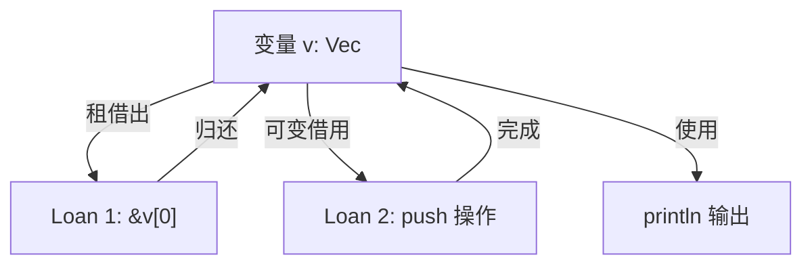

+++
title = "第 9 章 生命周期"
weight = 90
date = "2026-03-27T17:24:46+08:00"
type = "docs"
description = ""
isCJKLanguage = true
draft = false
+++

# 第 9 章 生命周期（深化）

> "在 Rust 的世界里，每一个引用都有自己的保质期，过期的引用就像超市里过期的酸奶——编译器会让你尝到什么叫'酸爽'。"

想象一下，你借了一本书给别人，结果那个人比书还早消失在这个世界上——这在现实生活里可能是个感人的故事，但在 Rust 编译器眼里，这叫"悬空引用"（Dangling Reference），是要被严惩的重罪！

生命周期（Lifetimes）就是 Rust 编译器用来追踪"这个引用到底能活多久"的超级管家。它不像 JavaScript 那样等到运行时才发现引用已经飞升（然后给你一个 null），也不像 C 那样让程序带着悬空指针裸奔到崩溃。Rust 在编译期就把这事儿安排得明明白白——**没有编译通过，你就别想跑起来**。

这一章，我们要把生命周期这个概念翻来覆去、揉碎掰开、嚼烂了再咽下去。准备好了吗？Let's go!

---

## 9.1 生命周期详解

### 9.1.1 生命周期标注规则

#### 9.1.1.1 单生命周期参数：'a

好，我们先从最简单的开始。

在 Rust 里，生命周期参数长得就像一个小尾巴——以单引号开头，后面跟一个名字。就像给你的引用贴上一个"此引用有效期至 X"的标签。

```rust
// 这是一个带生命周期标注的函数签名
fn longest<'a>(x: &'a str, y: &'a str) -> &'a str {
    if x.len() > y.len() {
        x
    } else {
        y
    }
}
```

这里的 `'a` 就是生命周期参数，它的意思是：**返回的引用的生命周期，不会超过输入的两个引用的生命周期中较短的那个**。

> 等等，你可能在想：我能不能不给生命周期标注，让编译器自己推断？答案是——**能，但不是在所有情况下都能**。Rust 有一条"生命周期省略规则"（Elision），可以在某些情况下自动推断。但如果编译器实在推断不出来，它就会友情提示你："嘿，兄弟，这个引用我没法自动推断它的寿命，麻烦你告诉我它能活多久？"

`longest` 函数的例子就属于编译器无法推断的情况，所以我们必须手动标注 `'a`。这个 `'a` 可以理解为一个"生命周期占位符"，它代表了 `x` 和 `y` 这两个输入引用的生命周期中较短的那个。

#### 9.1.1.2 多生命周期参数：'a / 'b / 'c

一个生命周期参数不够用？那就再来几个！

```rust
fn mix_and_match<'a, 'b>(x: &'a str, y: &'b str) -> &'a str {
    println!("混搭一下：{} 和 {}", x, y); // 混搭一下：hello 和 world
    x // 返回 x，所以返回类型只需要 'a
}

fn main() {
    let result = mix_and_match("hello", "world");
    println!("结果是：{}", result); // 结果是：hello
}
```

当你有多个引用，并且它们之间没有直接关系的时候，就需要多个生命周期参数。

```rust
// 三个独立的生命周期，各玩各的
fn three_some<'a, 'b, 'c>(s1: &'a str, s2: &'b str, s3: &'c str) {
    println!("三个独立生命周期：{} / {} / {}", s1, s2, s3);
}

fn main() {
    three_some("a", "b", "c"); // 三个独立生命周期：a / b / c
}
```

不过要注意，**不是用得越多越好**。如果你写了 `'a, 'b, 'c` 但实际上它们都是同一个生命周期，那纯属给自己找麻烦。生命周期参数的选择原则是：**能共用就共用，不能共用再分开**。

#### 9.1.1.3 生命周期约束：T: 'a（T 不含任何生命周期短于 'a 的引用）

生命周期约束听起来很拗口，但其实它是在说：**"T 这个类型里所有的引用，它们活得都得比 'a 久"**。

```rust
// T: 'a 意味着类型 T 中不能有任何生命周期短于 'a 的引用
fn require_static<T>(value: &T) -> &T
where
    T: 'a,
{
    value
}
```

这个约束在泛型编程中超级有用。比如，你想写一个函数，它接受一个结构体，这个结构体里可能有很多引用，但你希望这些引用至少跟你的函数一样"长寿"。

> **小剧场**：如果你写过 Java 或者 Go，这种约束可能会让你想起泛型约束。但是 Rust 的生命周期约束更严格，因为它直接跟内存安全挂钩。你可以把 `T: 'a` 理解为"我要的是那种能活到 'a 的 T"，就像招聘要求里写的"需要能工作到 35 岁"——不过 Rust 没有年龄歧视，它只关心引用。

---

### 9.1.2 多生命周期的场景

#### 9.1.2.1 函数有多于一个生命周期参数

在现实编程中，我们经常会遇到一个函数需要处理多个没有关联的引用。比如：

```rust
// 返回第一个参数，不关心第二个参数的生命周期
fn first_one<'a, 'b>(s1: &'a str, _s2: &'b str) -> &'a str {
    s1
}

fn main() {
    let result = first_one("hello", "world");
    println!("第一个是：{}", result); // 第一个是：hello
}
```

在这个例子里，`'a` 和 `'b` 完全是两个独立的生命周期。编译器会确保 `s1` 的生命周期至少覆盖返回值，而 `s2` 爱活多久活多久，反正我们不用它。

#### 9.1.2.2 生命周期参数之间的关系

有时候，多个生命周期参数之间需要建立联系。比如：

```rust
// 返回值的生命周期跟第二个参数 'b 绑定（因为我们返回的是 y）
fn combine<'a, 'b>(_x: &'a str, y: &'b str) -> &'b str {
    // 注意：这里我们实际上返回的是 y，不是 x
    // 所以返回类型是 &'b，不是 &'a
    y
}

fn main() {
    let result = combine("first", "second");
    println!("结果是：{}", result); // 结果是：second
}
```

如果你的函数有多个返回值引用，而这些返回值分别来自不同的输入参数，那你可能需要仔细考虑它们之间的关系。

> **warning**：别忘了，如果函数返回的是引用，那这个引用必须来自输入参数之一。如果你写的是 `return &some_local_variable`，那你就是在制造悬空引用——这可是 Rust 编译器最讨厌的事情，编译不通过那种！

---

### 9.1.3 生命周期省略规则（Elision）

#### 9.1.3.1 输入生命周期省略规则（参数中的引用自动获得生命周期）

好的，铺垫了这么久，终于到了 Rust 编译器"做好事"的部分了。

**好消息**：Rust 编译器其实挺智能的，它会自动推断一些简单的生命周期，而不需要你手动标注。这就是"生命周期省略规则"（Elision）。

**坏消息**：它不是万能的，有些情况下它推断不出来，就得靠你手动标注。

**更坏的消息**：如果你手动标注错了，编译器会毫不客气地报错——报错信息有时候长得能绕地球三圈。

好了，来看省略规则吧：

**输入生命周期省略规则（Input Lifetime Elision Rules）**：

规则1：如果函数只有一个输入参数，且这个参数是引用，那么该引用的生命周期会自动成为返回引用的生命周期。

```rust
// 编译器自动推断为 fn foo<'a>(x: &'a str) -> &'a str
fn foo(x: &str) -> &str {
    x
}
```

规则2：如果函数有多个输入参数，且其中有 `self` 或 `&self`，那么 `self` 的生命周期会自动成为返回引用的生命周期。

```rust
struct X;

impl X {
    // 编译器自动推断为 fn bar<'a>(&'a self) -> &'a str
    fn bar(&self) -> &str {
        "hello"
    }
}
```

#### 9.1.3.2 输出生命周期省略规则（返回值引用从参数推断）

**输出生命周期省略规则（Output Lifetime Elision Rules）**：

规则3：如果函数只有一个输入引用参数（且满足规则1），那么返回引用的生命周期就是这个输入参数的生命周期。

```rust
// 等价于 fn first_char<'a>(s: &'a str) -> &'a str
fn first_char(s: &str) -> &str {
    &s[..1]
}

fn main() {
    let result = first_char("hello");
    println!("第一个字符是：{}", result); // 第一个字符是：h
}
```

#### 9.1.3.3 无法省略时的显式标注（编译器 E0106 / E0107）

当省略规则无法推断出生命周期时，编译器会给你一个 E0106 或 E0107 错误。这两个错误就像编译器在说："兄弟，我真的猜不出来，你自己告诉我吧！"

```rust
// 这个函数无法省略生命周期标注
// 编译器报错：E0106
fn ambiguous<'a, 'b>(x: &'a str, y: &'b str) -> &str {
    // 编译器不知道返回的是 x 还是 y
    // 所以无法确定返回引用的生命周期
    if x.len() > y.len() {
        x
    } else {
        y
    }
}
```

**正确的写法**：

```rust
fn ambiguous<'a, 'b>(x: &'a str, y: &'b str) -> &'a str {
    // 明确告诉编译器，我们返回的是 x，所以生命周期是 'a
    if x.len() > y.len() {
        x
    } else {
        y // 等等，这里返回的是 y，它的生命周期是 'b，不是 'a！
           // 编译器会报错！因为你承诺了返回 'a，但实际可能返回 'b
    }
}
```

**再正确一点**：

```rust
fn longest_with_announcement<'a, T>(
    x: &'a str,
    y: &'a str,
    ann: T,
) -> &'a str
where
    T: std::fmt::Display,
{
    println!("公告：{}", ann); // 公告：这是一个比较
    if x.len() > y.len() {
        x
    } else {
        y
    }
}

fn main() {
    let result = longest_with_announcement("short", "very_long", "这是一个比较");
    println!("更长的那个是：{}", result); // 更长的那个是：very_long
}
```

---

### 9.1.4 生命周期子类型

#### 9.1.4.1 'a: 'b（'a outlives 'b，'a 不比 'b 短）

终于到了"子类型"这个听起来很高级的概念了。

在 Rust 的生命周期体系里，`'a: 'b` 意思是 **`'a` 至少要活得跟 `'b` 一样久，或者更久**。你可以理解为 `'a` 是 `'b` 的"老子"——`'a` outlives `'b`。

```rust
// 这里 'long 至少要活得跟 'short 一样久
fn longest<'long: 'short, 'short>(
    x: &'long str,
    y: &'short str,
) -> &'short str {
    if x.len() > y.len() {
        x // 警告：返回类型是 &'short，但 x 是 &'long
          // 编译器会报错！因为返回类型和 x 的生命周期参数不匹配
    } else {
        y
    }
}
```

等等，我故意的，这个例子会报错。因为 `longest` 承诺返回 `&'short str`，但 `x` 是 `&'long str`——虽然有 `'long: 'short` 约束保证了 'long 不会比 'short 短，但 Rust 的生命周期系统要求返回引用时必须精确匹配声明的生命周期参数，不能简单地"向下兼容"。如果真的返回了 `x`，那返回的引用可能是个悬空引用！

**正确的用法**：

```rust
// 'long: 'short 意味着 'long 活得至少跟 'short 一样久
// 这样就可以安全地返回 x 了，因为 'long 保证不会比 'short 短
fn safe_return<'long: 'short, 'short>(
    x: &'long str,
    _y: &'short str,
) -> &'short str {
    x // OK！因为 'long 至少是 'short 那么长
}
```

#### 9.1.4.2 生命周期子类型验证

生命周期子类型最常见的应用场景是在结构体里：

```rust
// 'a: 'b 意味着 'a 必须活得比 'b 久（或一样久）
struct Wrapper<'a, 'b>
where
    'a: 'b,
{
    data: &'a str,           // 这个引用活得久
    maybe_shorter: &'b str, // 这个引用可以活得短
}
```

> **生活类比**：把生命周期想成你的银行账户。`'a` 是你的储蓄账户，`'b` 是你的信用卡账户。如果 `'a: 'b`，就意味着你的储蓄账户余额永远不少于你的信用卡欠款——这是一个好习惯！

---

### 9.1.5 生命周期与引用返回

#### 9.1.5.1 返回引用的生命周期必须来自参数

这是 Rust 生命周期规则中最重要的一条：**函数返回的引用，其生命周期必须来自输入参数**。

```rust
// ✓ 正确：返回的生命周期来自输入参数
fn first_word(s: &str) -> &str {
    s.split_whitespace().next().unwrap_or("")
}

// ✗ 错误：制造悬空引用
fn dangling() -> &str {
    let s = String::from("hello");
    &s // 错误！s 是局部变量，函数结束就被销毁了
}
```

编译上述代码，你会得到：

```
error[E0515]: cannot return reference to local variable `s`
```

编译器用一种优雅的方式告诉你："你返回了一个局部变量的引用，这个变量在函数结束时就会去领盒饭（drop），你不能这样做！"

#### 9.1.5.2 输入生命周期与输出生命周期的关系

在实际编码中，我们经常需要决定返回引用的生命周期跟哪个输入参数绑定。

```rust
// 返回第一个参数的生命周期
fn first<'a>(x: &'a str, _y: &str) -> &'a str {
    x
}

// 返回两个参数中较短的生命周期（因为我们不确定返回哪个）
fn longest<'a>(x: &'a str, y: &'a str) -> &'a str {
    if x.len() > y.len() {
        x
    } else {
        y
    }
}

fn main() {
    let s1 = String::from("long string");
    let result;
    {
        let s2 = String::from("xyz");
        result = longest(s1.as_str(), s2.as_str());
        println!("最长的是：{}", result); // 最长的是：long string
    }
    // 注意：result 绑定的是 s1 的引用（"long string"），不是 s2 的引用
    // 因为 "long string".len() > "xyz".len()，longest 返回的是 s1
    // 所以 result 在这里完全可以正常使用
}
```

#### 9.1.5.3 多个参数的生命周期推导

当函数有多个引用参数时，Rust 编译器会根据返回值的来源自动建立关系。

```rust
// 编译器自动推断：
// - 返回值来自 x，所以返回生命周期 = x 的生命周期
// - y 跟返回生命周期无关
fn get_x<'a>(x: &'a str, y: &str) -> &'a str {
    x // 明确返回 x
}

fn main() {
    let result = get_x("hello", "world");
    println!("{}", result); // hello
}
```

---

## 9.2 生命周期与结构体

### 9.2.1 结构体中引用的生命周期

#### 9.2.1.1 struct &'a str（引用字段必须标注生命周期）

结构体里如果有引用字段，那这个结构体就必须标注生命周期。这是因为结构体的寿命取决于它内部引用字段的寿命——结构体不能比它内部的任何一个引用活得更久。

```rust
// 经典例子：ImportantExcerpt 结构体
struct ImportantExcerpt<'a> {
    part: &'a str, // 必须标注生命周期 'a
}

fn main() {
    let novel = String::from("_call me Ishmael. Years ago...");
    let first_sentence = novel.split('.').next().unwrap();
    
    let excerpt = ImportantExcerpt {
        part: first_sentence,
    };
    
    println!("摘录：{}", excerpt.part); // 摘录：_call me Ishmael
}
```

> **敲黑板**：如果你的结构体里有引用字段，**必须**标注生命周期。这是 Rust 的强制要求，不标？编译器会用 E0106 错误码热情地招待你。

#### 9.2.1.2 结构体实例化时必须提供生命周期

当你创建一个包含引用字段的结构体时，你必须确保提供的引用是"活得够久"的。

```rust
struct Holder<'a> {
    data: &'a str,
}

fn main() {
    // 正确：提供活得够久的引用
    let static_string = "我活得很久很久";
    let holder1 = Holder { data: static_string };
    println!("holder1: {}", holder1.data); // holder1: 我活得很久很久
    
    // 错误示范：
    let local_string = String::from("我马上就要被销毁了");
    // let holder2 = Holder { data: &local_string }; // 编译错误！
    // local_string 是局部变量，函数结束就 drop 了
    // 但 Holder 的生命周期不知道有多长，编译器不让你冒险
    
    // 正确示范：在同一个作用域内使用
    {
        let short_lived = String::from("我活不长");
        let holder2 = Holder { data: &short_lived };
        println!("holder2: {}", holder2.data); // holder2: 我活不长
    } // short_lived 和 holder2 在这里一起 drop
    
    println!("holder1 还在：{}", holder1.data); // holder1 还在：我活得很久很久
}
```

---

### 9.2.2 生命周期省略在结构体中的规则

#### 9.2.2.1 结构体方法的省略规则

结构体的方法也有生命周期省略规则，跟函数类似。

```rust
struct Excerpt<'a> {
    part: &'a str,
}

impl<'a> Excerpt<'a> {
    // 这个方法只使用了 self 的引用
    // 编译器自动推断返回生命周期 = self 的生命周期
    fn announce_and_return(&self, announcement: &str) -> &str {
        println!("公告：{}", announcement); // 公告：即将返回
        self.part
    }
}

fn main() {
    let text = String::from("call me Ishmael...");
    let excerpt = Excerpt { part: &text };
    let result = excerpt.announce_and_return("即将返回");
    println!("返回的内容是：{}", result); // 返回的内容是：call me Ishmael...
}
```

---

### 9.2.3 带生命周期的方法

#### 9.2.3.1 impl<'a> Struct<'a>

当你在结构体上 impl 方法时，如果结构体有生命周期参数，你需要在 impl 块中也声明这个生命周期参数。

```rust
struct Parser<'a> {
    input: &'a str,
    position: usize,
}

impl<'a> Parser<'a> {
    // 构造函数
    fn new(input: &'a str) -> Self {
        Parser {
            input,
            position: 0,
        }
    }
    
    // 解析下一个单词
    fn next_word(&mut self) -> Option<&'a str> {
        let start = self.position;
        let bytes = self.input.as_bytes();
        
        while self.position < bytes.len() && !bytes[self.position].is_ascii_whitespace() {
            self.position += 1;
        }
        
        if start == self.position {
            None
        } else {
            Some(&self.input[start..self.position])
        }
    }
    
    // 重置解析器
    fn reset(&mut self) {
        self.position = 0;
    }
}

fn main() {
    let text = "hello world rust";
    let mut parser = Parser::new(text);
    
    println!("第一个词：{:?}", parser.next_word()); // 第一个词：Some("hello")
    println!("第二个词：{:?}", parser.next_word()); // 第二个词：Some("world")
    println!("第三个词：{:?}", parser.next_word()); // 第三个词：Some("rust")
    println!("第四个词：{:?}", parser.next_word()); // 第四个词：None
    
    parser.reset();
    println!("重置后第一个词：{:?}", parser.next_word()); // 重置后第一个词：Some("hello")
}
```

> **小贴士**：`impl<'a> Parser<'a>` 中的 `'a` 是泛型生命周期参数，它告诉 Rust：所有使用 `'a` 的地方都必须是同一个生命周期。这就像在说"这整个 Parser 实例和它的输入字符串是绑在一起的"。

---

## 9.3 生命周期与 Trait

### 9.3.1 Trait 定义中的生命周期

#### 9.3.1.1 trait Foo<'a> { fn bar(&'a str); }

Trait 也可以有生命周期参数！这在设计一些需要引用参数的 API 时非常有用。

```rust
// 定义一个带生命周期参数的 trait
trait Printable<'a> {
    fn print_content(&self, content: &'a str);
}

// 为 i32 实现这个 trait
impl<'a> Printable<'a> for i32 {
    fn print_content(&self, content: &'a str) {
        println!("数字 {} 说：{}", self, content); // 数字 42 说：Hello, Rust!
    }
}

fn main() {
    let num: i32 = 42;
    num.print_content("Hello, Rust!");
}
```

#### 9.3.1.2 带生命周期的 trait 参数

Trait 的方法参数和返回值都可以包含生命周期。

```rust
trait Runner {
    // 返回值的生命周期跟 self 绑定
    fn get_name(&self) -> &str;
}

struct Athlete {
    name: String,
}

impl Runner for Athlete {
    fn get_name(&self) -> &str {
        &self.name
    }
}

fn main() {
    let athlete = Athlete {
        name: String::from("博尔特"),
    };
    println!("运动员名字：{}", athlete.get_name()); // 运动员名字：博尔特
}
```

#### 9.3.1.3 impl<'a> Foo<'a> for Type

实现带生命周期的 trait 时，需要在 impl 声明中带上生命周期参数。

```rust
trait Formatter<'a> {
    fn format(&self, input: &'a str) -> String;
}

struct Uppercase;

impl<'a> Formatter<'a> for Uppercase {
    fn format(&self, input: &'a str) -> String {
        input.to_uppercase()
    }
}

struct Reverse;

impl<'a> Formatter<'a> for Reverse {
    fn format(&self, input: &'a str) -> String {
        input.chars().rev().collect()
    }
}

fn main() {
    let upper = Uppercase;
    let reverse = Reverse;
    
    let text = "hello world";
    
    println!("大写：{}", upper.format(text)); // 大写：HELLO WORLD
    println!("反转：{}", reverse.format(text)); // 反转：dlrow olleh
}
```

---

### 9.3.2 'static 生命周期的特殊含义

#### 9.3.2.1 &'static str（字符串字面量，生命周期整个程序期间）

`static` 是 Rust 中最"长寿"的生命周期，它贯穿整个程序的运行期间。

```rust
fn main() {
    // 字符串字面量是 'static 的，因为它们被硬编码到二进制里
    let s: &'static str = "我是在程序诞生时就存在的！";
    println!("{}", s); // 我是在程序诞生时就存在的！
}
```

所有的字符串字面量（用双引号括起来的）都是 `'static` 生命周期的，因为它们直接存储在你的程序二进制文件中，程序运行多久，它们就活多久。

#### 9.3.2.2 T: 'static 约束（不包含任何非 'static 引用）

当你在泛型上使用 `T: 'static` 约束时，你是在告诉编译器：**"T 这个类型里不能有任何活得比程序短的引用"**。

```rust
// 这个函数接受任何不包含短生命周期引用的类型
fn print_static<T>(value: T)
where
    T: std::fmt::Debug + 'static,
{
    println!("{:?}", value);
}

fn main() {
    // OK：i32 是 'static 的
    print_static(42_i32); // 42
    
    // OK：String 拥有自己的数据，不包含短生命周期引用
    print_static(String::from("hello")); // "hello"
    
    // 错误：&str 可能是非 'static 的（如果是来自局部 String 的引用）
    // let local = String::from("local");
    // print_static(&local); // 编译错误！
    
    // OK：字符串字面量是 'static 的
    print_static(&"可以，因为是字面量"); // "可以，因为是字面量"
}
```

#### 9.3.2.3 'static 与泛型的关系

`T: 'static` 通常跟其他约束一起使用，来表达"这个类型必须是完全自包含的，不能引用任何外部数据"。

```rust
use std::fmt::Display;

fn print_if_static<T>(value: &T)
where
    T: Display + 'static,
{
    println!("这是一个 'static 类型：{}", value);
}

fn main() {
    print_if_static(&42); // 这是一个 'static 类型：42
    print_if_static(&"字符串字面量"); // 这是一个 'static 类型：字符串字面量
    
    // 注意：如果你传入一个局部变量的引用，编译会失败
    // let s = String::from("hello");
    // print_if_static(&s); // 错误！因为 &s 不是 'static
}
```

> **记忆技巧**：把 `'static` 想象成程序员的"铁饭碗"——只要程序还在运行，这个引用就一定还在。字符串字面量就是铁饭碗持有者，而运行时创建的 String 的引用是合同工，作用域结束就"被优化"了。

---

## 9.4 高级生命周期主题

### 9.4.1 PhantomData<T> 与所有权跟踪

#### 9.4.1.1 PhantomData 的作用（标记所有权关系）

`PhantomData<T>` 是 Rust 中的一个"幽灵"类型——它不占用任何实际空间，但它能帮编译器理解那些"看不见"的所有权关系。

```rust
use std::marker::PhantomData;

// 这是一个"拥有" T 的结构体，但实际上 T 并不被存储
// PhantomData<T> 告诉编译器："把这个结构体当作拥有 T 来对待"
struct Owned<T> {
    _marker: PhantomData<T>, // _marker 下划线前缀表示"不会被使用"
}

fn main() {
    let _owned_i32 = Owned::<i32> { _marker: PhantomData };
    let _owned_string = Owned::<String> { _marker: PhantomData };
    println!("幽灵数据创建成功！");
}
```

`PhantomData` 的主要作用是：

1. **让结构体"假装"拥有 T**：即使 T 没有被实际存储，编译器也会认为这个结构体拥有 T 的所有权，这会影响 Drop 检查。
2. **影响 Drop 检查**：如果 T 实现了 `Drop`，那么包含 `PhantomData<T>` 的结构体会被视为"间接"拥有 T。
3. **影响借用检查**：`PhantomData<&'a T>` 会让编译器认为结构体"间接"持有一个 `&'a T` 的引用，这在自引用结构中很有用。

#### 9.4.1.2 泛型所有权的标记

`PhantomData` 在编写一些底层数据结构时特别有用，比如自定义的智能指针。

```rust
use std::marker::PhantomData;

// 自定义 Box，只用于演示 PhantomData 的用法
struct MyBox<T> {
    data: *mut T, // 裸指针，不受借用检查器约束
    _marker: PhantomData<T>, // 标记我们"拥有" T
}

impl<T> MyBox<T> {
    fn new(value: T) -> Self {
        MyBox {
            data: Box::into_raw(Box::new(value)),
            _marker: PhantomData,
        }
    }
    
    fn as_ref(&self) -> &T {
        // 安全：因为 MyBox 拥有 T 的所有权，所以我们可以解引用
        unsafe { &*self.data }
    }
}

impl<T> Drop for MyBox<T> {
    fn drop(&mut self) {
        // 安全释放内存
        unsafe {
            Box::from_raw(self.data);
        }
    }
}

fn main() {
    let box_i32 = MyBox::new(42);
    println!("MyBox 里的值：{}", box_i32.as_ref()); // MyBox 里的值：42
    // drop(box_i32) 会在作用域结束时自动调用 Drop
    println!("作用域结束，MyBox 被正确 drop");
}
```

#### 9.4.1.3 结构体中的所有权语义

`PhantomData` 还能帮助我们表达更复杂的所有权语义。比如，如果你想表达"这个结构体拥有一个指向 T 的引用"，你可以使用 `PhantomData<&'a T>`。

```rust
use std::marker::PhantomData;

struct RefOwner<'a, T> {
    _marker: PhantomData<&'a T>, // 标记我们持有一个 &T
}

fn main() {
    let value = 42;
    let owner = RefOwner::<i32> { _marker: PhantomData };
    println!("RefOwner 创建成功");
    println!("值还在：{}", value); // 值还在：42
}
```

> **面试常问**：为什么 `PhantomData` 要用下划线前缀？答：因为 `PhantomData` 类型的字段本身永远不会被读取（它是"幽灵"），下划线前缀告诉编译器"我知道这个字段没被使用，别警告我"。

---

### 9.4.2 NLL（Non-Lexical Lifetimes）

#### 9.4.2.1 NLL 的改进（借用区域从声明处延伸至实际使用处；编译期从使用处向后（反控）分析求出区域边界）

**NLL**，全称 **Non-Lexical Lifetimes**（非词法生命周期），是 Rust 借用检查器的一次重大升级。

在 NLL 出现之前，Rust 的借用规则是"词法的"——一个引用的生命周期从它被创建的地方开始，到它所在的作用域结束时终止。这意味着，如果你写了：

```rust
let mut v = vec![1, 2, 3];
let first = &v[0]; // 借用开始
println!("{}", first); // 使用引用
v.push(4); // 这里会报错，即使 first 后面不再使用了
```

在 NLL 出现之前，编译器会认为 `first` 的生命周期持续到作用域结束，所以 `v.push(4)` 是不允许的。但有了 NLL 之后，编译器会分析出 `first` 实际上只在这个 `println!` 里使用，之后就可以安全地修改 `v` 了。

```rust
fn main() {
    let mut v = vec![1, 2, 3];
    let first = &v[0]; // 借用开始
    println!("{}", first); // 使用引用
    v.push(4); // NLL: 编译器知道 first 在这之后不再使用，所以允许
    println!("vec 现在是：{:?}", v); // vec 现在是：[1, 2, 3, 4]
}
```

#### 9.4.2.2 NLL vs 传统借用检查（更精确的借用区域）

NLL 的工作原理是：**从引用的使用处向后分析，找出引用的有效区域**。

```rust
fn main() {
    let mut map = std::collections::HashMap::new();
    map.insert("a", 1);
    
    // 在 NLL 之前，这里的借用会持续到作用域结束
    // 在 NLL 之后，编译器知道 get 返回的引用只在这个 if 块里使用
    if let Some(value) = map.get("a") {
        println!("找到了：{}", value); // 找到了：1
    } // 借用在这里结束
    
    // 所以这里可以继续修改 map
    map.insert("b", 2);
    println!("map: {:?}", map); // map: {"a": 1, "b": 2}
}
```

> **小剧场**：想象你借了一本书，你跟图书馆说"我借到期末考试结束就还"。传统做法是你整个学期都得揣着这本书，即使你考完试早就看完了。NLL 就是图书馆聪明了一点，它会追踪你实际用这本书的时间段——你考完最后一门就自动标记为"可以还了"，不需要你特意声明。

---

### 9.4.3 Polonius 项目

#### 9.4.3.1 Polonius 的设计目标（更宽松的所有权规则）

**Polonius** 是 Rust 团队正在开发的一个新的借用检查器实现。它的目标是：在保持内存安全的前提下，让借用规则更宽松一点，减少一些"过度保守"的编译错误。

当前的借用检查器有时候会拒绝一些**实际上安全**的代码。比如经典的"卢瑟福问题"（Rutherford problem）：

```rust
fn main() {
    let mut v = vec![1, 2, 3, 4, 5];
    
    // 如果不使用 first，这段逻辑是正确的（Rust 旧版本会报错）
    let first = &v[0];
    v.push(6);
    // println!("{}", first); // 如果真的使用 first，这里才会报错
    // 因为 first 可能已经变成悬空引用
}
```

Polonius 的目标是识别出"first 虽然存在，但我们不使用它"这种情况，从而允许 push 操作。

#### 9.4.3.2 基于租借（Loan）的分析模型

Polonius 使用一种叫做"基于租借（Loan）的分析模型"。它不再把借用想成"一个变量持有另一个变量的引用"，而是把它想成"一块数据被租借出去了，租借到期就可以归还"。



在 Polonius 模型中，每个 Loan 都有自己的生命周期，只有当所有活跃的 Loan 都"归还"之后，原变量才能被修改或重新借用。

#### 9.4.3.3 Polonius 的开发状态

Polonius 目前还在开发中，预计会在未来的 Rust 版本中作为替代性的借用检查器。你可以通过 `-Zpolonius` 标志来启用它进行测试：

```rust
// 注意：Polonius 还在开发中，你需要使用 nightly 版本的 Rust
// 并添加 -Zpolonius 标志来测试

// 如果你想尝试 Polonius，在命令行运行：
// rustup run nightly cargo build -Zpolonius

fn main() {
    println!("等待 Polonius 稳定...");
}
```

> **预告**：Polonius 的引入可能会让一些目前需要 `unsafe` 或者 RefCell 来绕过的代码变得可以直接用安全代码实现。期待那一天的到来！

---

## 本章小结

这一章我们深入探索了 Rust 的生命周期系统。以下是关键知识点：

1. **生命周期标注**：用 `'a` 这样的语法告诉编译器引用的"保质期"
2. **省略规则**：编译器会自动推断一些简单的生命周期
3. **生命周期约束**：`T: 'a` 意味着类型 T 中所有引用都不能比 `'a` 短
4. **生命周期子类型**：`'a: 'b` 表示 `'a` 至少要活得跟 `'b` 一样久
5. **结构体与生命周期**：包含引用的结构体必须标注生命周期
6. **Trait 与生命周期**：Trait 可以有生命周期参数，实现时也需要声明
7. **`'static`**：程序运行期间一直存在的引用，字符串字面量就是 `'static`
8. **PhantomData**：用来标记"看不见"的所有权关系
9. **NLL**：非词法生命周期，让借用检查更精确
10. **Polonius**：未来的新一代借用检查器，会让规则更宽松

生命周期是 Rust 最独特的特性之一，它在编译期为你的程序加了一道强大的安全锁。虽然有时候写起来会觉得"怎么这么啰嗦"，但当你的程序跑起来稳如老狗的时候，你会感谢这个啰嗦的编译器。

**记住**：在 Rust 的世界里，**没有编译通过的借用都是耍流氓**！

