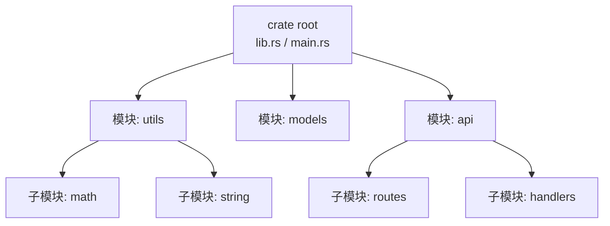

+++
title = "第 10 章 模块系统"
weight = 100
date = "2026-03-27T17:24:46+08:00"
type = "docs"
description = ""
isCJKLanguage = true
draft = false
+++

# 第 10 章 模块系统（Modules）

> "想象一下，如果你把所有的衣服都堆在一个大箱子里，找衣服的时候估计得翻遍整个箱子。Rust 的模块系统就是你的衣柜整理神器——把代码分类放好，想用什么就精准拿什么，再也不用翻箱倒柜了！"

在写代码这条不归路上，我们迟早会遇到一个灵魂拷问：**代码太多了，怎么组织？**

如果你把所有代码都塞进一个文件里，恭喜你，你获得了一个"史诗级巨无霸文件"——这个文件可能比你前任的道歉信还要长，查找起来比在沙漠里找针还难。

Rust 的模块系统就是来解决这个问题的。它让你把代码像整理衣柜一样分类存放：**上衣放一格、裤子放一格、袜子放一格**（虽然袜子可能永远是那只找不到的那只）。

这一章，我们就来学习怎么把 Rust 代码整理得井井有条，让你的代码库从"垃圾堆"升级成"样板间"！

---

## 10.1 模块基础

### 10.1.1 Crate 与 Package 的概念区分

#### 10.1.1.1 Crate：编译单元（lib.rs / main.rs / bin/*.rs）

**Crate** 是 Rust 中的基本编译单元。你可以把它理解为一个"代码包"——当你运行 `rustc` 编译一个 `.rs` 文件时，那个文件及其所有 `mod` 引入的模块，就共同组成了一个 **Crate**。

```bash
# 编译单个文件，产生一个 Crate
rustc main.rs -o main
```

在 Rust 的世界里，Crate 有两种主要类型：

1. **二进制 Crate**（Binary Crate）：可以被编译成可执行文件，有 `main` 函数作为入口
2. **库 Crate**（Library Crate）：被其他 Crate 依赖使用的代码集合，没有 `main` 函数

```rust
// 这是二进制 Crate 的入口
// 文件名通常是 main.rs 或者 src/bin/*.rs

fn main() {
    println!("我是可执行文件！"); // 我是可执行文件！
}
```

```rust
// 这是库 Crate 的入口
// 文件名通常是 lib.rs

pub fn hello() {
    println!("我是库！"); // 我是库！
}
```

#### 10.1.1.2 Package：Cargo.toml 定义的包（可包含多个 crate）

**Package** 是由 Cargo.toml 定义的单位。一个 Package 可以包含**一个或多个 Crate**。

```toml
# Cargo.toml
[package]
name = "my-awesome-project"  # 包的名字
version = "0.1.0"              # 版本号
edition = "2021"               # Rust 版本
authors = ["You <you@example.com>"]

# 这个 Package 包含：
# 1. 一个二进制 Crate（src/main.rs）
# 2. 一个库 Crate（src/lib.rs）
# 3. 多个二进制 Crate（src/bin/*.rs）
```

当你运行 `cargo new project_name` 时，Cargo 会自动创建一个 Package，里面包含一个基础的二进制 Crate。

#### 10.1.1.3 lib.rs / main.rs 的区别（库 vs 二进制入口）

这是 Rust 项目里最经典的一对"欢喜冤家"：

| 文件 | 作用 | 能否被其他 Crate 依赖 |
|------|------|----------------------|
| `lib.rs` | 库 Crate 的入口 | ✅ 可以 |
| `main.rs` | 二进制 Crate 的入口 | ❌ 不行 |

```bash
# 项目结构示例
my_project/
├── Cargo.toml          # Package 描述文件
├── src/
│   ├── main.rs         # 二进制入口
│   ├── lib.rs          # 库入口
│   └── bin/
│       ├── tool_a.rs   # 额外的二进制 Crate
│       └── tool_b.rs   # 另一个额外的二进制 Crate
```

```rust
// src/lib.rs
// 这是库的"广告牌"，在这里 pub 的东西可以被外部访问

pub mod utils;
pub mod models;

pub fn public_function() {
    println!("库里的公开函数！"); // 库里的公开函数！
}

/// 只有在文档注释里的内容才会出现在 cargo doc 中
pub fn documented_function() {
    internal_function(); // 内部函数也可以调用
}

fn internal_function() {
    println!("我是内部函数，外面看不到我"); // 我是内部函数，外面看不到我
}
```

```rust
// src/main.rs
// 这是程序的主入口

use my_awesome_project::utils;
use my_awesome_project::models;

fn main() {
    // 调用库里的公开函数
    utils::helper(); // 调用了工具函数！
    
    let model = models::User::new(String::from("Alice"));
    println!("{:?}", model); // User { name: "Alice" }
}
```

> **小贴士**：如果你不确定该用 `lib.rs` 还是 `main.rs`，记住这个原则：**你想让其他人用的代码放 `lib.rs`，只是你自己运行的代码放 `main.rs`**。库是分享给世界的，程序是给自己跑的。

---

### 10.1.2 mod 声明与模块树

#### 10.1.2.1 mod foo 声明模块（查找 foo.rs 或 foo/mod.rs）

在 Rust 里，`mod` 关键字是用来声明模块的。当你写 `mod foo;` 时，Rust 编译器会做两件事：

1. 在当前目录查找 `foo.rs` 文件
2. 如果没找到，查找 `foo/` 目录下的 `mod.rs` 文件

```rust
// src/main.rs

// 声明一个叫 foo 的模块
// Rust 会去找 src/foo.rs 或者 src/foo/mod.rs
mod foo;

// 也可以声明嵌套模块
mod outer {
    pub mod inner {
        pub fn inner_function() {
            println!("我是 inner 模块的函数！"); // 我是 inner 模块的函数！
        }
    }
    
    pub fn outer_function() {
        println!("我是 outer 模块的函数！"); // 我是 outer 模块的函数！
    }
}

fn main() {
    // 调用模块里的函数
    foo::hello();
    
    // 调用嵌套模块的函数
    outer::outer_function();
    outer::inner::inner_function();
}
```

```rust
// src/foo.rs
// 这是 foo 模块的定义

pub fn hello() {
    println!("Hello from foo module!"); // Hello from foo module!
}
```

#### 10.1.2.2 模块树结构（root → crate → 模块层层嵌套）

Rust 的模块系统是一棵树，**根节点**是你的 Crate（`lib.rs` 或 `main.rs`），所有的模块都是这棵树上的分支。



```rust
// 假设我们有这样一个项目结构：

// src/
//   ├── main.rs (crate root)
//   ├── utils.rs
//   ├── models.rs
//   ├── api/
//   │   ├── mod.rs
//   │   ├── routes.rs
//   │   └── handlers.rs

// src/main.rs
mod utils;    // 加载 src/utils.rs
mod models;   // 加载 src/models.rs
mod api;      // 加载 src/api/mod.rs

fn main() {
    // utils::add(1, 2)
    // models::User::new()
    // api::routes::setup()
}
```

#### 10.1.2.3 父模块与子模块（crate 是根模块）

每个模块都可以有子模块，子模块可以有自己的子模块。**父模块**能看到子模块里 `pub` 的内容，但子模块看不到父模块里的私有内容——这很合理，总不能让儿子随便翻爸爸的抽屉吧。

```rust
// 父模块
mod parent {
    pub fn public() {
        println!("我是公开的！"); // 我是公开的！
        // 子模块可以从这里访问
    }
    
    fn private() {
        println!("我是私有的，谁也别想访问我！"); // 我是私有的，谁也别想访问我！
    }
    
    // 子模块
    pub mod child {
        pub fn child_function() {
            // child 可以调用 parent 的公开函数
            super::public(); // super 指向父模块
            println!("子模块在喊爸爸！"); // 子模块在喊爸爸！
        }
    }
}

fn main() {
    parent::public();    // OK
    parent::child::child_function(); // OK
    // parent::private(); // 错误！private 函数不能从外部访问
}
```

> **super 关键字**：在子模块里，`super` 就像在说"我爸刚才说……"，它允许你访问父模块的内容。这是模块间通信的"后门"。

---

### 10.1.3 文件系统与模块布局

#### 10.1.3.1 现代布局（Rust 2018+）：foo.rs（叶子模块）

从 Rust 2018 开始，模块布局变得更简洁了。你可以直接用 `foo.rs` 来定义叶子模块，不需要再搞 `foo/mod.rs` 这种中间商模式。

```bash
# 现代布局（Rust 2018+）
src/
├── main.rs
├── utils.rs      # mod utils; 加载这个文件
├── models.rs     # mod models; 加载这个文件
└── network.rs     # mod network; 加载这个文件
```

```rust
// src/utils.rs
// 直接定义 utils 模块，不需要子目录

pub fn help() {
    println!("帮助信息"); // 帮助信息
}
```

```rust
// src/main.rs
mod utils;  // 加载 src/utils.rs

fn main() {
    utils::help(); // 帮助信息
}
```

#### 10.1.3.2 目录模块：foo/mod.rs（目录模块的入口）

当你有一个模块需要包含子模块时，可以使用目录结构：

```bash
# 目录模块布局
src/
├── main.rs
├── network/
│   ├── mod.rs      # 入口文件，定义 network 模块
│   ├── tcp.rs      # network::tcp 子模块
│   ├── udp.rs      # network::udp 子模块
│   └── http.rs     # network::http 子模块
```

```rust
// src/network/mod.rs
pub mod tcp;
pub mod udp;
pub mod http;

pub fn connect() {
    println!("建立网络连接！"); // 建立网络连接！
}
```

```rust
// src/network/tcp.rs
pub fn create_tcp_socket() {
    println!("创建 TCP 套接字！"); // 创建 TCP 套接字！
}
```

```rust
// src/network/udp.rs
pub fn create_udp_socket() {
    println!("创建 UDP 套接字！"); // 创建 UDP 套接字！
}
```

```rust
// src/main.rs
mod network;

fn main() {
    network::connect();
    network::tcp::create_tcp_socket();
    network::udp::create_udp_socket();
}
```

#### 10.1.3.3 两种布局的选用（叶子模块用 .rs / 有子模块用目录）

选择恐惧症的福音来了！

**原则很简单**：

- 如果一个模块**没有子模块**，用 `.rs` 文件 → `foo.rs`
- 如果一个模块**有子模块**，用目录 → `foo/mod.rs` + `foo/*.rs`

```bash
# 混合布局示例
src/
├── main.rs
├── utils.rs              # 叶子模块，没子模块，用 .rs
├── config.rs             # 叶子模块，没子模块，用 .rs
│
├── api/                   # 有子模块，用目录
│   ├── mod.rs
│   ├── routes.rs
│   └── handlers.rs
│
└── db/                    # 有子模块，用目录
    ├── mod.rs
    ├── connection.rs
    └── query.rs
```

> **实战建议**：在现代 Rust 项目中，**建议优先使用 `foo.rs` 布局**（没有子模块的情况下）。它更简洁，文件导航也更方便。只有当你确实需要组织子模块时，才使用目录布局。

---

### 10.1.4 use 语句与路径

#### 10.1.4.1 use crate::module::Item（绝对路径，从 crate root 开始）

在 Rust 里，`use` 关键字就像给你的代码发了一张"快速通行证"，让你不用每次都写完整的路径。

**绝对路径**从你的 Crate 根开始，用 `crate::` 开头：

```rust
// src/lib.rs
pub mod utils {
    pub mod math {
        pub fn add(a: i32, b: i32) -> i32 {
            a + b
        }
    }
}

pub struct User {
    pub name: String,
}

// src/main.rs
use crate::utils::math::add;  // 从 crate 根开始找
use crate::User;

fn main() {
    let result = add(1, 2);
    println!("1 + 2 = {}", result); // 1 + 2 = 3
    
    let user = User { name: String::from("Bob") };
    println!("用户：{}", user.name); // 用户：Bob
}
```

#### 10.1.4.2 use super::Item（相对路径，从父模块开始）

**相对路径**从当前模块的位置开始：

```rust
mod outer {
    pub mod inner {
        pub fn inner_fn() {
            println!("inner 函数被调用了！"); // inner 函数被调用了！
        }
    }
    
    pub fn outer_fn() {
        // outer_fn 在 outer 模块里，inner 是 outer 的子模块
        // 同级子模块可以直接通过模块名访问，不需要 super
        inner::inner_fn();
        println!("outer 函数被调用了！"); // outer 函数被调用了！
    }
}

fn main() {
    outer::outer_fn();
}
```

#### 10.1.4.3 self 模块引用：use self::module::Item

`self` 关键字代表**当前模块**，可以简化导入路径：

```rust
mod my_module {
    pub const VALUE: i32 = 42;
    
    pub mod nested {
        pub fn nested_fn() {
            println!("nested 函数！"); // nested 函数！
        }
    }
    
    // 使用 self 来引用当前模块
    pub use self::nested::nested_fn;
}

fn main() {
    // 直接从 my_module 访问 VALUE
    println!("{}", my_module::VALUE); // 42
    // 通过 pub use 导入的 nested_fn
    my_module::nested_fn(); // nested 函数！
}
```

#### 10.1.4.4 pub use（re-export，公开子模块内容）

`pub use` 是一个非常有意思的关键字组合——**重新导出**。它的作用是把一个模块的内容"暴露"出去，即使这些内容原本不在这个模块里。

```rust
// src/lib.rs
pub mod inner {
    pub mod deep {
        pub fn secret_function() {
            println!("这是一个深层秘密函数！"); // 这是一个深层秘密函数！
        }
    }
}

// 把深层模块公开化
pub use inner::deep::secret_function;
```

外部使用：
```rust
// 外部可以直接用顶级模块访问深层函数
// 不需要层层嵌套：my_crate::inner::deep::secret_function()
use my_crate::secret_function;

fn main() {
    secret_function(); // 这是一个深层秘密函数！
}
```

> **实际应用场景**：在编写库的时候，`pub use` 可以帮你设计一个更友好的公共 API，把实现细节藏在层层模块里，但对外提供一个简洁的接口。这就好比餐厅的菜单——你不需要知道厨房里有多少个锅，菜单上写着"宫保鸡丁"就够了。

#### 10.1.4.5 use Item::{A, B, C}（大括号枚举导入）

当你需要从同一个模块导入多个项时，可以使用大括号来批量导入：

```rust
mod utils {
    pub fn add(a: i32, b: i32) -> i32 { a + b }
    pub fn sub(a: i32, b: i32) -> i32 { a - b }
    pub fn mul(a: i32, b: i32) -> i32 { a * b }
    pub fn div(a: i32, b: i32) -> i32 { a / b }
}

// 从 utils 模块导入多个函数
use utils::{add, sub, mul, div};

fn main() {
    let a = 10;
    let b = 3;
    
    println!("{} + {} = {}", a, b, add(a, b)); // 10 + 3 = 13
    println!("{} - {} = {}", a, b, sub(a, b)); // 10 - 3 = 7
    println!("{} * {} = {}", a, b, mul(a, b)); // 10 * 3 = 30
    println!("{} / {} = {}", a, b, div(a, b)); // 10 / 3 = 3
}
```

#### 10.1.4.6 use Item::*（ glob 导入，不推荐）

Glob 导入（`*`）可以导入一个模块里的所有公开项，但是——

```rust
// 警告：glob 导入在大型代码库中可能导致命名冲突
// 不推荐在大项目中使用

mod helpers {
    pub fn say_hi() { println!("Hi!"); }
    pub fn say_bye() { println!("Bye!"); }
    pub const MAX: i32 = 100;
}

use helpers::*;

fn main() {
    say_hi();          // Hi!
    say_bye();         // Bye!
    println!("MAX = {}", MAX); // MAX = 100
}
```

> **警告**：glob 导入虽然方便，但它是一个"隐形的炸弹"。如果两个模块恰好有同名的函数或常量，编译器就会报"命名冲突"错误。所以，在正式项目中，尽量使用精确的导入。

---

### 10.1.5 可见性（Visibility）

#### 10.1.5.1 默认私有（private）

在 Rust 中，**所有内容默认都是私有的**。这是 Rust 的"最小暴露原则"——你不想让外人看到的东西，就藏得严严实实的。

```rust
mod internal {
    fn secret_function() {
        println!("我是私有函数！"); // 我是私有函数！
    }
    
    pub fn public_function() {
        println!("我是公开函数！"); // 我是公开函数！
        secret_function(); // 同模块内可以访问私有函数
    }
}

fn main() {
    internal::public_function(); // OK
    // internal::secret_function(); // 错误！私有函数不能从外部访问
}
```

#### 10.1.5.2 pub（公开）

`pub` 关键字让一个项对所有地方都可见：

```rust
mod public_mod {
    pub struct Secret {
        pub name: String,     // 公开字段
        pub age: u32,        // 公开字段
        secret: String,      // 私有字段，外部无法访问
    }
    
    impl Secret {
        pub fn new(name: &str, age: u32) -> Self {
            Secret {
                name: name.to_string(),
                age,
                secret: String::from("[私有信息]"),
            }
        }
        
        // 只能通过这种方法访问私有字段
        pub fn reveal_secret(&self) -> &str {
            &self.secret
        }
    }
}

fn main() {
    let s = Secret::new("张三", 25);
    println!("名字：{}", s.name); // 名字：张三
    println!("年龄：{}", s.age);   // 年龄：25
    // println!("秘密：{}", s.secret); // 错误！secret 是私有的
    println!("秘密：{}", s.reveal_secret()); // 秘密：[私有信息]
}
```

#### 10.1.5.3 pub(crate)（crate 内可见）

`pub(crate)` 表示"在这个 crate 内部随便用，但外部 crate 休想看到"：

```rust
// src/lib.rs
pub mod outer {
    pub(crate) fn crate_internal() {
        println!("crate 内部都可以调用我！"); // crate 内部都可以调用我！
    }
    
    pub fn public() {
        println!("公开函数！"); // 公开函数！
    }
}

fn main() {
    outer::crate_internal(); // OK：main.rs 和 lib.rs 属于同一个 crate
    outer::public();
}
```

#### 10.1.5.4 pub(super)（父模块可见）

`pub(super)` 表示"只能在我爸那个模块（父模块）里用"：

```rust
mod parent {
    pub mod child {
        pub(super) fn child_only_parent_can_see() {
            println!("只有爸爸能看到我！"); // 只有爸爸能看到我！
        }
        
        pub fn child_everyone_can_see() {
            println!("所有人都能看到我！"); // 所有人都能看到我！
            // 在子模块里调用父模块可见的函数
            super::parent_function();
        }
    }
    
    pub fn parent_function() {
        // 父模块可以看到 child 的 pub(super) 函数
        child::child_only_parent_can_see();
    }
}

fn main() {
    parent::parent_function();
    parent::child::child_everyone_can_see();
    // parent::child::child_only_parent_can_see(); // 错误！外部访问不了
}
```

#### 10.1.5.5 pub(in path)（指定路径可见）

`pub(in path)` 是最精细的控制粒度——你可以指定"只有 path 路径下的模块能访问"：

```rust
mod a {
    pub mod b {
        pub(in crate::a) fn a_b_only_in_a() {
            println!("在 crate::a 范围内都可以访问我！"); // 在 crate::a 范围内都可以访问我！
        }
        
        pub mod c {
            pub fn c_function() {
                // c 是 a::b::c，在 a 的范围内，可以访问 a_b_only_in_a
                super::a_b_only_in_a();
                println!("c 模块的函数！"); // c 模块的函数！
            }
        }
    }
    
    pub fn a_function() {
        // a 可以访问 b 的 pub(in crate::a) 函数
        b::a_b_only_in_a();
        println!("a 模块的函数！"); // a 模块的函数！
    }
}

fn main() {
    a::a_function();
    a::b::c::c_function();
    // a::b::a_b_only_in_a(); // 错误！main 不在 crate::a 范围内
}
```

> **总结**：Rust 的可见性系统就像一层层递进的安保系统：
> - `pub` = 向全世界公开
> - `pub(crate)` = 只在当前 crate 内公开
> - `pub(super)` = 只在父模块公开
> - `pub(in path)` = 只在指定路径内公开
> - 默认（无关键字）= 只能在当前模块内访问

---

## 10.2 包与工作空间

### 10.2.1 Cargo.toml 结构详解

#### 10.2.1.1 [package] 元信息（name / version / edition / authors / description）

`[package]` 是 Cargo.toml 的"个人资料卡"：

```toml
[package]
name = "my-awesome-project"           # 包的名字，全宇宙唯一
version = "0.1.0"                       # 语义化版本号：主版本.次版本.修订号
edition = "2021"                        # Rust 版本，目前推荐 2021
authors = ["张三 <zhangsan@example.com>", "李四 <lisi@example.com>"]
description = "这是一个超级酷的项目！"   # 一句话描述
license = "MIT"                         # 开源许可证
repository = "https://github.com/example/my-awesome-project"  # 代码仓库
keywords = ["utils", "helper", "tool"]  # 关键字，方便在 crates.io 搜索
categories = ["development-tools"]      # 分类
rust-version = "1.70"                    # 最低支持的 Rust 版本
```

#### 10.2.1.2 [dependencies] / [dev-dependencies] / [build-dependencies]

三兄弟，各司其职：

```toml
[dependencies]
# 正式依赖：程序运行和测试都需要
serde = "1.0"           # 序列化库
tokio = { version = "1.0", features = ["full"] }  # 异步运行时
log = "0.4"

[dev-dependencies]
# 开发依赖：仅在 cargo test 时使用
criterion = "0.5"       # 性能基准测试
proptest = "1.0"        # 属性测试
tempfile = "3.0"        # 临时文件

[build-dependencies]
# 构建依赖：仅在 build.rs 脚本中使用
quote = "1.0"
syn = "2.0"
```

```rust
// build.rs 示例
fn main() {
    // build-dependencies 里的依赖只能在这里使用
    println!("cargo:rerun-if-changed=build.rs");
    println!("cargo:rerun-if-changed=src/schema.rs");
}
```

#### 10.2.1.3 [features] 条件编译特性（可选特性）

`[features]` 让你可以"功能模块化"，用户可以根据需要启用或禁用某些功能：

```toml
[features]
default = ["default-utils"]           # 默认启用的特性
default-utils = []                    # 默认工具库
experimental-async = ["tokio/async"] # 实验性异步功能
ssl-support = ["native-tls"]          # SSL 支持
full-features = ["experimental-async", "ssl-support"]  # 全功能模式
```

```rust
// 在代码中根据特性条件编译
#[cfg(feature = "experimental-async")]
pub async fn experimental_function() {
    println!("这是实验性异步功能！"); // 这是实验性异步功能！
}

#[cfg(not(feature = "experimental-async"))]
pub fn experimental_function() {
    println!("这是同步版本的实验功能（因为没开 experimental-async）"); 
}

#[cfg(feature = "ssl-support")]
pub fn secure_connect() {
    println!("启用 SSL 安全连接！"); // 启用 SSL 安全连接！
}

fn main() {
    experimental_function();
    #[cfg(feature = "ssl-support")]
    secure_connect();
}
```

运行方式：

```bash
# 默认编译（启用 default features）
cargo build

# 启用 experimental-async
cargo build --features experimental-async

# 启用多个 features
cargo build --features "experimental-async ssl-support"
```

#### 10.2.1.4 [profile] 编译配置（opt-level / lto / panic）

`[profile]` 让你控制 Rust 编译器的行为：

```toml
[profile.dev]           # 开发模式
opt-level = 0           # 不优化（编译快）
debug = true            # 包含调试信息

[profile.release]       # 发布模式
opt-level = 3           # 最高优化级别
lto = true              # 链接时优化（Link Time Optimization）
codegen-units = 1       # 减少并行编译单元数，提高优化效果
strip = true            # 移除符号表（减小二进制体积）
panic = "abort"         # panic 时直接 abort（减小体积）

[profile.test]          # 测试模式（默认继承 profile.dev 的配置）
# opt-level = 0        # 继承自 dev，无需重复写
# debug = true         # 继承自 dev，无需重复写
```

#### 10.2.1.5 [lib] 库配置（crate 名称 / 路径）

当你的 Package 包含库 Crate 时，用 `[lib]` 配置它：

```toml
[lib]
name = "mylib"                    # 库 Crate 的名字（影响依赖时的引用名称）
crate-type = ["lib", "cdylib"]    # 产生的 Crate 类型
path = "src/lib.rs"               # 库入口文件路径
```

`crate-type` 可以是：
- `lib`：静态库
- `cdylib`：C 兼容的动态库（用于 FFI）
- `rlib`：Rust 专用库格式

#### 10.2.1.6 [[bin]] 多二进制配置

如果你的项目有多个可执行文件，可以用 `[[bin]]` 配置：

```toml
[[bin]]
name = "my-app"              # 可执行文件名
path = "src/main.rs"          # 入口文件
required-features = ["full"] # 需要的 features

[[bin]]
name = "my-tool"
path = "src/bin/tool.rs"
```

---

### 10.2.2 多二进制 Crate

#### 10.2.2.1 [[bin]] 配置（name / path / required-features）

当你有多个二进制入口时：

```toml
# Cargo.toml
[[bin]]
name = "server"
path = "src/bin/server.rs"
required-features = ["server"]

[[bin]]
name = "client"
path = "src/bin/client.rs"

[[bin]]
name = "benchmark"
path = "src/bin/benchmark.rs"
```

#### 10.2.2.2 多个入口文件（src/bin/*.rs）

更简单的方式：直接把文件放到 `src/bin/` 目录下，Cargo 会自动识别它们：

```bash
src/
├── main.rs
└── bin/
    ├── server.rs      # 可执行文件：cargo run --bin server
    ├── client.rs      # 可执行文件：cargo run --bin client
    └── bench.rs       # 可执行文件：cargo run --bin bench
```

```rust
// src/bin/server.rs
fn main() {
    println!("服务器启动中..."); // 服务器启动中...
}
```

```rust
// src/bin/client.rs
fn main() {
    println!("客户端连接中..."); // 客户端连接中...
}
```

```bash
# 运行不同的二进制
cargo run --bin server    # 运行 server
cargo run --bin client    # 运行 client
cargo build --bins        # 构建所有二进制
```

#### 10.2.2.3 二进制命名

二进制文件的名字由 `name` 字段决定（在 `[[bin]]` 中指定），或者默认使用文件名。

```toml
[[bin]]
name = "awesome-tool"    # 构建出的可执行文件叫 awesome-tool（不是 server！）
path = "src/bin/server.rs"
```

---

### 10.2.3 库 Crate

#### 10.2.3.1 [lib] 配置

```toml
[lib]
name = "mylib"           # 库的名字
path = "src/lib.rs"      # 库入口
crate-type = ["lib"]     # 产生的库类型
```

#### 10.2.3.2 lib.rs 入口点

```rust
// src/lib.rs
// 这是库的根模块

pub mod utils;
pub mod models;

pub fn public_api() {
    utils::helper();
    println!("这是库的公开 API！"); // 这是库的公开 API！
}

fn private_api() {
    println!("这是库的私有实现！"); // 这是库的私有实现！
}
```

#### 10.2.3.3 库与二进制共存（同一 package 包含 lib + binary）

这是最常见的项目结构——一个 Package 同时包含库和二进制：

```bash
my_project/
├── Cargo.toml
└── src/
    ├── main.rs          # 二进制入口
    └── lib.rs           # 库入口
```

```rust
// src/lib.rs
pub fn library_function() {
    println!("来自库的功能！"); // 来自库的功能！
}
```

```rust
// src/main.rs
// 使用自己的库
use my_project::library_function;

fn main() {
    library_function(); // 来自库的功能！
}
```

---

### 10.2.4 Cargo 工作空间（Workspace）

#### 10.2.4.1 [workspace] 配置（root package / members）

工作空间让你管理**多个相关的 Package**。想象你有一个"巨型项目"，它由多个独立的小项目组成，工作空间就是把这些小项目组织在一起的管理者。

```toml
# Cargo.toml（根目录）
[workspace]
members = ["crate-a", "crate-b", "my-lib"]
resolver = "2"  # 依赖解析器版本
```

```toml
# crate-a/Cargo.toml
[package]
name = "crate-a"
version = "0.1.0"
edition = "2021"

[dependencies]
# 可以依赖 workspace 的其他成员
my-lib = { path = "../my-lib" }
```

```toml
# crate-b/Cargo.toml
[package]
name = "crate-b"
version = "0.1.0"
edition = "2021"

[dependencies]
crate-a = { path = "../crate-a" }
my-lib = { path = "../my-lib" }
```

#### 10.2.4.2 members 成员列表

```toml
[workspace]
members = [
    "packages/core",
    "packages/utils",
    "packages/cli",
]
exclude = ["packages/deprecated"]  # 排除某些包
```

#### 10.2.4.3 Cargo.lock 在 workspace 根目录（统一版本锁定）

工作空间只有一个 `Cargo.lock` 文件，放在根目录，**统一管理所有成员的依赖版本**。

```bash
my_workspace/
├── Cargo.lock          # 唯一的锁文件，所有成员共享
├── Cargo.toml          # workspace 配置
└── packages/
    ├── core/
    │   ├── Cargo.toml
    │   └── src/
    ├── utils/
    │   ├── Cargo.toml
    │   └── src/
    └── cli/
        ├── Cargo.toml
        └── src/
```

#### 10.2.4.4 workspace 依赖共享（根级别 dependencies）

你可以在 workspace 根目录的 `[dependencies]` 中定义共享依赖，所有成员自动继承：

```toml
# 根目录 Cargo.toml
[workspace]
members = ["crate-a", "crate-b"]

# workspace 级别的依赖，所有成员都可用
[dependencies]
log = "0.4"
serde = { version = "1.0", features = ["derive"] }
tokio = { version = "1.0", features = ["full"] }
```

```toml
# crate-a/Cargo.toml
# 不需要重复声明 log 和 serde，直接用
[package]
name = "crate-a"
version = "0.1.0"

# tokio 已经在 workspace 根级别声明了，这里可以不写
# 但如果你需要特定配置，可以覆盖：
tokio = { version = "1.0", features = ["rt-multi-thread"] }
```

---

### 10.2.5 build.rs 脚本

#### 10.2.5.1 [build-dependencies]（build.rs 的依赖）

`build.rs` 是一个在**编译主程序之前**运行的 Rust 脚本。它可以执行各种构建时任务，比如代码生成、配置检查等。

```toml
[build-dependencies]
quote = "1.0"
syn = "2.0"
```

```rust
// build.rs
use std::env;
use std::fs;
use std::path::Path;

fn main() {
    // 告诉 Cargo："如果 build.rs 或 src/schema.rs 变了，就重新运行 build.rs"
    println!("cargo:rerun-if-changed=build.rs");
    println!("cargo:rerun-if-changed=src/schema.rs");
    println!("cargo:rerun-if-env-changed=API_KEY"); // 环境变量变了也重新运行
    
    // 生成代码
    let out_dir = env::var("OUT_DIR").unwrap();
    let dest_path = Path::new(&out_dir).join("generated.rs");
    
    let generated_code = r#"
        pub fn generated_function() {
            println!("这是构建时生成的代码！");
        }
    "#;
    
    fs::write(&dest_path, generated_code).unwrap();
    
    println!("cargo:rustc-cfg=generated_code"); // 设置条件编译标志
}
```

#### 10.2.5.2 build.rs 的执行时机（编译前运行）

`build.rs` 在**依赖解析和编译之前**运行，它的输出会被 Cargo 用来配置编译过程。


#### 10.2.5.3 build 脚本的输出（rerun-if-changed / rustc-flags）

`build.rs` 通过 `println!` 输出特殊格式的指令给 Cargo：

| 指令 | 作用 |
|------|------|
| `cargo:rerun-if-changed=PATH` | 如果 PATH 变了，重新运行 build.rs |
| `cargo:rerun-if-env-changed=VAR` | 如果环境变量 VAR 变了，重新运行 |
| `cargo:rustc-cfg=FEATURE` | 设置条件编译标志 |
| `cargo:rustc-env=VAR=VALUE` | 设置环境变量，供代码使用 |
| `cargo:rustc-link-arg=FLAG` | 传递链接器参数 |

```rust
// build.rs 示例：生成版本信息
use std::env;
use std::fs;

fn main() {
    let version = env::var("CARGO_PKG_VERSION").unwrap();
    let name = env::var("CARGO_PKG_NAME").unwrap();
    
    // 通过 rustc-env 输出，供代码使用
    println!("cargo:rustc-env=BUILD_VERSION={}", version);
    println!("cargo:rustc-env=BUILD_NAME={}", name);
    
    // 生成代码
    let out_dir = env::var("OUT_DIR").unwrap();
    let dest = std::path::Path::new(&out_dir).join("version.rs");
    
    let code = format!(
        r#"
        pub const VERSION: &str = "{}";
        pub const NAME: &str = "{}";
        pub const BUILD_INFO: &str = "{} (built by build.rs)";
        "#,
        version, name, version
    );
    
    fs::write(&dest, code).unwrap();
}
```

---

## 10.3 条件编译

### 10.3.1 #[cfg(...)] 属性

#### 10.3.1.1 #[cfg(test)]（仅测试编译）

`#[cfg(test)]` 标记的代码**只在运行测试时编译**：

```rust
// src/lib.rs
pub fn add(a: i32, b: i32) -> i32 {
    a + b
}

#[cfg(test)]
mod tests {
    use super::*;
    
    #[test]
    fn test_add() {
        assert_eq!(add(1, 2), 3);
        println!("加法测试通过！"); // 加法测试通过！
    }
}
```

#### 10.3.1.2 #[cfg(feature = "...")]（特性开启时编译）

```rust
#[cfg(feature = "debug")]
pub fn debug_info() {
    println!("调试信息：这是 debug 版本的额外输出！"); // 调试信息：这是 debug 版本的额外输出！
}

#[cfg(not(feature = "debug"))]
pub fn debug_info() {
    // 发布版本不输出调试信息
}
```

```toml
[features]
debug = []
```

```bash
cargo build --features debug  # 启用 debug 特性
```

#### 10.3.1.3 #[cfg(target_os = "linux")]（目标系统）

```rust
#[cfg(target_os = "linux")]
fn get_home_dir() -> String {
    std::env::var("HOME").unwrap()
}

#[cfg(target_os = "windows")]
fn get_home_dir() -> String {
    std::env::var("USERPROFILE").unwrap()
}

#[cfg(target_os = "macos")]
fn get_home_dir() -> String {
    std::env::var("HOME").unwrap()
}

fn main() {
    println!("用户目录：{}", get_home_dir());
}
```

#### 10.3.1.4 #[cfg(target_arch = "x86_64")]（目标架构）

```rust
#[cfg(target_arch = "x86_64")]
fn cpu_info() {
    println!("64位 x86 架构优化已启用"); // 64位 x86 架构优化已启用
}

#[cfg(target_arch = "aarch64")]
fn cpu_info() {
    println!("ARM 64 位架构"); // ARM 64 位架构
}
```

#### 10.3.1.5 #[cfg(unix)] / #[cfg(windows)]（操作系统）

```rust
#[cfg(unix)]
fn clear_screen() {
    print!("{}[2J", 27 as char); // ANSI 清屏
    print!("{}[H", 27 as char);
}

#[cfg(windows)]
fn clear_screen() {
    std::process::Command::new("cmd")
        .args(["/c", "cls"])
        .spawn()
        .ok();
}

fn main() {
    clear_screen();
    println!("跨平台清屏完成！");
}
```

---

### 10.3.2 #[cfg(feature = "...")] Feature Gate

#### 10.3.2.1 [features] 定义（default = ["feature-a"]）

```toml
[features]
default = ["basic"]                # 默认启用的特性
basic = []                          # 基础功能
advanced = []                       # 高级功能
experimental = []                    # 实验性功能
ssl = ["native-tls"]                # SSL 依赖
full = ["basic", "advanced", "ssl"] # 全功能
```

#### 10.3.2.2 optional 依赖：optional = true

```toml
[dependencies]
# 可选依赖，默认不启用
async-runtime = { version = "1.0", optional = true }
json-support = { version = "2.0", optional = true }
```

```toml
[features]
async = ["dep:async-runtime"]      # 使用 dep: 前缀引用可选依赖
json = ["dep:json-support"]
```

#### 10.3.2.3 特性组合：feature = ["dep/feature"]

```toml
[dependencies]
tokio = { version = "1.0", default-features = false, features = ["sync"] }

[features]
full = [
    "tokio/rt-multi-thread",
    "tokio/macros",
    "tokio/sync"
]
```

---

### 10.3.3 cfg_attr 与 cfg! 宏

#### 10.3.3.1 cfg_attr(feature, attr)（特性开启时应用属性）

```rust
#[cfg_attr(feature = "doc-tests", ignore)]
fn hidden_function() {
    println!("这个函数在文档测试中被忽略"); // 这个函数在文档测试中被忽略
}
```

#### 10.3.3.2 cfg! 宏（编译期布尔查询）

`cfg!` 宏在**编译期求值**，展开为 `true` 或 `false` 字面量（而 `#[cfg]` 是在编译期决定代码段是否存在）：

```rust
fn main() {
    // cfg! 在编译期展开为 true 或 false 的常量，运行时直接是个常量分支
    if cfg!(feature = "debug") {
        println!("debug 特性已启用！"); // debug 特性已启用！
    } else {
        println!("这是发布版本");
    }
    
    // 查看目标信息
    println!("目标 OS：{}", if cfg!(target_os = "windows") { "Windows" } else { "非 Windows" });
    println!("调试构建？{}", cfg!(debug_assertions));
}
```

---

## 本章小结

这一章我们全面学习了 Rust 的模块系统。以下是关键知识点：

1. **Crate vs Package**：Crate 是编译单元，Package 是 Cargo.toml 定义的包
2. **lib.rs vs main.rs**：库入口 vs 二进制入口
3. **mod 声明**：告诉 Rust"这里有个模块"，编译器去找对应的 .rs 文件或 mod.rs
4. **模块树**：从 crate root 开始的树形结构
5. **use 语句**：绝对路径（`crate::`）、相对路径（`super::`、`self::`）
6. **pub use**：重新导出，可以简化 API
7. **可见性层级**：`pub` > `pub(crate)` > `pub(super)` > `pub(in path)` > 默认 private
8. **Cargo.toml**：`[package]`、`[dependencies]`、`[features]`、`[profile]`
9. **多二进制**：`[[bin]]` 或 `src/bin/*.rs`
10. **Workspace**：管理多个相关 Package
11. **build.rs**：构建脚本，运行在编译之前
12. **条件编译**：`#[cfg(...)]` 属性在编译期启用/禁用代码

**记住**：好的模块组织就像好的衣柜整理——分类清晰、容易找到、不需要翻箱倒柜。把 Rust 的模块系统玩转了，你的代码库也能从"垃圾堆"升级成"样板间"！

> "在 Rust 的世界里，模块系统就是你的代码整理术。不会整理？编译器会教你做人！"

