+++
title = "第 12 章 元编程：宏"
weight = 120
date = "2026-03-27T17:24:46+08:00"
type = "docs"
description = ""
isCJKLanguage = true
draft = false
+++

# 第 12 章 元编程：宏（Macros）

> "宏是 Rust 世界里的'哆啦A梦口袋'——你想吃什么（输入什么），它就能给你掏出来什么。函数做不到的事，宏能做到；函数能做的事，宏也能做。唯一的代价是——你需要花点时间学会跟它相处。"

在编程的世界里，"元编程"（Metaprogramming）是一个听起来很高大上的词汇。它本质上说的是：**写一段代码，让这段代码去生成别的代码**。

你可能会想：为什么要这么做？

好问题！想象一下，你要写一个 `println!("Hello, {}! You are {} years old.", name, age);` 这样的代码。如果每次都要手写这一长串，那不得累死？但是如果你有一个宏：

```rust
say_hello!(name, age);
```

宏就会自动帮你展开成那串长长的代码。这就是元编程的魅力——**一次定义，无数次使用**。

这一章，我们就要学习 Rust 的宏系统。别担心，我会把它拆解得连你奶奶都能看懂（没有冒犯奶奶的意思）。

---

## 12.1 宏概述

### 12.1.1 宏 vs 函数的本质区别

#### 12.1.1.1 宏在编译期展开，函数在运行时调用

这是宏和函数最核心的区别：

```rust
// 宏：在编译期展开，代码直接替换到调用处
macro_rules! say_hi {
    () => {
        println!("Hi!");
    };
}

fn main() {
    say_hi!(); // 编译时，编译器会把这行替换成 println!("Hi!");
}
```

```rust
// 函数：在运行时被调用
fn say_hi() {
    println!("Hi!");
}

fn main() {
    say_hi(); // 普通函数调用，不用 !
}
```

**时间线对比**：

```mermaid
gantt
    title 编译 vs 运行
    dateFormat X
    section 编译期
    宏展开 : done, 0, 5
    section 运行期
    函数执行 : done, 5, 10
```



#### 12.1.1.2 宏可以生成语法（代码生成），函数不行

宏可以做到一些函数做不到的事：

```rust
macro_rules! create_struct {
    ($name:ident) => {
        struct $name {
            value: i32,
        }
    };
}

create_struct!(MyStruct);  // 展开成 struct MyStruct { value: i32 }

fn main() {
    let s = MyStruct { value: 42 };
    println!("{}", s.value); // 42
}
```

```rust
// 函数能返回类型吗？不能！
// fn create_struct<T>() { ... } // 做不到

// 但宏可以生成任意语法结构
macro_rules! impl_display {
    ($type:ident) => {
        impl std::fmt::Display for $type {
            fn fmt(&self, f: &mut std::fmt::Formatter) -> std::fmt::Result {
                write!(f, "({}, {})", self.0, self.1)
            }
        }
    };
}

impl_display!(Point);

struct Point(i32, i32);

fn main() {
    let p = Point(3, 4);
    println!("{}", p); // (3, 4)
}
```

#### 12.1.1.3 宏可以操纵语法树（ Hygiene / 不 Hygiene）

这个概念比较抽象，但我会尽量解释清楚。

**Hygiene**（卫生宏）指的是：宏展开后的代码不会跟外部代码产生命名冲突。

```rust
macro_rules! hygiene_demo {
    () => {
        let x = 10;
        println!("x = {}", x);
    };
}

fn main() {
    let x = 20; // 外部也有一个 x
    hygiene_demo!(); // 宏内部定义的 x 不会跟外部冲突
    println!("外部的 x = {}", x); // 仍然是 20
}
```

但 `macro_rules!` 有一些"不卫生"的情况（后面会讲）。

#### 12.1.1.4 宏参数可以是标识符 / 表达式 / 类型（函数参数不行）

函数只能接受值作为参数，而宏可以接受**语法元素**：

```rust
macro_rules! inspect_type {
    // 接受一个类型
    ($t:ty) => {
        println!("类型大小：{} bytes", std::mem::size_of::<$t>());
    };
}

macro_rules! inspect_expr {
    // 接受一个表达式
    ($e:expr) => {
        println!("表达式的值是：{}", $e);
    };
}

macro_rules! inspect_ident {
    // 接受一个标识符
    ($i:ident) => {
        println!("标识符：{}", stringify!($i));
    };
}

fn main() {
    inspect_type!(i32);          // 类型大小：4 bytes
    inspect_expr!(2 + 2 * 3);   // 表达式的值是：8
    inspect_expr!([1, 2, 3]);   // 表达式的值是：[1, 2, 3]
    inspect_ident!(my_variable); // 标识符：my_variable
}
```

> **生活类比**：宏就像一个万能厨师，它可以接收"切菜"、"炒菜"、"装盘"这样的指令，然后生成对应的代码。而函数只能接收"胡萝卜丝"这样的具体值。

---

### 12.1.2 声明宏（Declarative Macros）

#### 12.1.2.1 macro_rules! 语法（基于模式匹配的编译期展开）

`macro_rules!` 是 Rust 中最常用的宏定义方式，叫做"声明宏"：

```rust
macro_rules! my_macro {
    // 模式 arm
    ($pattern) => {
        $expansion
    };
}
```

结构就是：**匹配模式 → 展开代码**

```rust
macro_rules! greet {
    // 匹配没有参数的情况
    () => {
        println!("Hello, World!");
    };
    
    // 匹配单个字符串参数
    ($name:expr) => {
        println!("Hello, {}!", $name);
    };
    
    // 匹配两个参数
    ($greeting:expr, $name:expr) => {
        println!("{}, {}!", $greeting, $name);
    };
}

fn main() {
    greet!();                           // Hello, World!
    greet!("Rust");                    // Hello, Rust!
    greet!("Good morning", "Alice");   // Good morning, Alice!
}
```

#### 12.1.2.2 声明宏的两种形式：item macro / expression macro

**Item Macro**：生成完整的 Rust 条目（struct、enum、fn 等）

```rust
macro_rules! create_function {
    ($name:ident) => {
        fn $name() {
            println!("函数 {} 被调用了！", stringify!($name));
        }
    };
}

create_function!(say_hello);
create_function!(say_goodbye);

fn main() {
    say_hello();  // 函数 say_hello 被调用了！
    say_goodbye();  // 函数 say_goodbye 被调用了！
}
```

**Expression Macro**：生成表达式

```rust
macro_rules! square {
    ($x:expr) => {
        $x * $x
    };
}

fn main() {
    let n = 5;
    println!("{} 的平方是 {}", n, square!(n)); // 5 的平方是 25
    println!("3 + 4 的平方是 {}", square!(3 + 4)); // 3 + 4 的平方是 49
}
```

---

### 12.1.3 过程宏（Procedural Macros）

#### 12.1.3.1 函数式宏（function-like macro）

看起来像函数调用，但以 `!` 结尾，实际上是过程宏：

```rust
// 这是标准库提供的宏，看起来像函数调用
println!("Hello, {}!", "world");
vec![1, 2, 3, 4, 5];
panic!("出错了！");
```

#### 12.1.3.2 派生宏（#[derive(...)]）

`#[derive(...)]` 是最常见的过程宏，用于自动实现 trait：

```rust
#[derive(Debug, Clone, PartialEq, Eq)]
struct Point {
    x: i32,
    y: i32,
}

fn main() {
    let p1 = Point { x: 1, y: 2 };
    let p2 = p1.clone();
    
    println!("{:?}", p1); // Point { x: 1, y: 2 }
    println!("p1 == p2: {}", p1 == p2); // p1 == p2: true
}
```

`#[derive]` 宏自动帮你生成了 `Debug`、`Clone`、`PartialEq` 等 trait 的实现代码。

#### 12.1.3.3 属性宏（#[attribute]）

属性宏可以给任何条目附加额外的行为：

```rust
#[my_attribute]
struct Foo { ... }

#[another_attribute]
fn bar() { ... }
```

> **预告**：过程宏的详细内容会在后面的 12.3 节展开。

---

## 12.2 声明宏（macro_rules!）

### 12.2.1 基本语法与匹配规则

#### 12.2.1.1 macro_rules! name { ($pattern) => { $expansion }; }

```rust
// 基本结构
macro_rules! macro_name {
    ( $pattern1 ) => { $expansion1 };
    ( $pattern2 ) => { $expansion2 };
    // 更多 arm...
}
```

#### 12.2.1.2 单分支宏

```rust
macro_rules! say_bye {
    () => {
        println!("再见！");
    };
}

fn main() {
    say_bye!(); // 再见！
}
```

#### 12.2.1.3 多分支宏（按顺序匹配）

```rust
macro_rules! classify {
    // 匹配整数
    ($n:expr) if $n < 0 => {
        println!("{} 是负数", $n);
    };
    ($n:expr) if $n == 0 => {
        println!("{} 是零", $n);
    };
    ($n:expr) if $n > 0 => {
        println!("{} 是正数", $n);
    };
    // 默认分支
    ($n:expr) => {
        println!("{} 不是整数", $n);
    };
}

fn main() {
    classify!(-5);  // -5 是负数
    classify!(0);   // 0 是零
    classify!(42);  // 42 是正数
}
```

> **注意**：带 `if` 守卫（guard）的 arm 必须放在**没有**守卫的 arm **后面**！这是因为 Rust 宏按顺序匹配——没有 guard 的 arm 会匹配一切，把没有 guard 的 arm 放在前面会导致带 guard 的 arm 永远不会被执行。想象一下：相亲的时候，你跟红娘说"先帮我筛选一下低于 30 岁的"，结果红娘直接把所有人的资料都给你了，说"这些都符合你的要求"——你的 guard 条件直接被无视了。

---

### 12.2.2 重复模式

#### 12.2.2.1 $(...)* 零次或多次

```rust
macro_rules! print_all {
    // $( $item:expr )* 会匹配零个或多个表达式
    ( $( $item:expr ),* ) => {
        // 展开时用 $( ... )* 来重复
        $(
            println!("{}", $item);
        )*
    };
}

fn main() {
    print_all!(1, 2, 3);   // 1\n2\n3
    print_all!("a", "b");  // a\nb
    print_all!();          // 什么都不打印
}
```

#### 12.2.2.2 $(...)+ 一次或多次（至少一次）

```rust
macro_rules! sum {
    ( $( $n:expr ),+ ) => {
        // 模式中的 + 表示至少匹配一个表达式
        // 展开时用 $( + $n )* 从第二个开始每个前面加 +
        0 $( + $n )*
    };
}

fn main() {
    println!("1+2 = {}", sum!(1, 2));           // 1+2 = 3
    println!("1+2+3+4 = {}", sum!(1, 2, 3, 4)); // 1+2+3+4 = 10
    // sum!() 编译错误！因为 + 要求至少一个
}
```

#### 12.2.2.3 $(...)? 零次或一次

```rust
macro_rules! optional_debug {
    ($name:expr, debug: $($key:ident),*) => {
        {
            print!("{}: {:?}", stringify!($name), $name);
            $(
                print!(", {}: {:?}", stringify!($key), $key);
            )*
            println!();
        }
    };
    ($name:expr) => {
        println!("{}", $name);
    };
}

fn main() {
    let x = 42;
    let y = "hello";
    
    optional_debug!(x);                      // 42
    optional_debug!(x, debug: x, y);         // x: 42, x: 42, y: "hello"
}
```

---

### 12.2.3 捕获片段

#### 12.2.3.1 $name:expr（表达式）

```rust
macro_rules! eval {
    ($e:expr) => {
        println!("表达式: {:?} = {}", stringify!($e), $e);
    };
}

fn main() {
    eval!(1 + 2);       // 表达式: 1 + 2 = 3
    eval!(2 * 3 + 4);   // 表达式: 2 * 3 + 4 = 10
    eval!("hello");     // 表达式: "hello" = hello
}
```

#### 12.2.3.2 $name:stmt（语句）

```rust
macro_rules! run_statements {
    ( $( $s:stmt );* ) => {
        $(
            $s;
        )*
    };
}

fn main() {
    run_statements! {
        let x = 10;
        let y = 20;
        println!("x + y = {}", x + y); // x + y = 30
    }
}
```

#### 12.2.3.3 $name:ty（类型）

```rust
macro_rules! type_info {
    ($t:ty) => {
        println!("类型: {}", std::any::type_name::<$t>());
        println!("大小: {} bytes", std::mem::size_of::<$t>());
    };
}

fn main() {
    type_info!(i32);       // 类型: i32\n大小: 4 bytes
    type_info!(String);     // 类型: alloc::string::String\n大小: 24 bytes (在64位系统)
    type_info!(Vec<u8>);   // 类型: Vec<u8>\n大小: 24 bytes
}
```

#### 12.2.3.4 $name:pat（模式）

```rust
macro_rules! match_pattern {
    ($p:pat) => {
        let x = 42;
        match x {
            $p => println!("匹配到了！"),
            _ => println!("没匹配到..."),
        }
    };
}

fn main() {
    match_pattern!(42);        // 匹配到了！
    match_pattern!(n);  // 匹配到了！（n 是绑定模式，会匹配任何值，包括 42）
}
```

#### 12.2.3.5 $name:ident（标识符）

```rust
macro_rules! create_var {
    ($name:ident, $value:expr) => {
        let $name = $value;
    };
}

fn main() {
    create_var!(my_number, 100);
    println!("my_number = {}", my_number); // my_number = 100
}
```

#### 12.2.3.6 $name:block（代码块）

```rust
macro_rules! time_it {
    ($block:block) => {{
        let start = std::time::Instant::now();
        let result = $block;
        let elapsed = start.elapsed();
        println!("耗时: {:?}", elapsed);
        result
    }};
}

fn main() {
    let result = time_it! {
        let mut sum = 0;
        for i in 0..1000000 {
            sum += i;
        }
        sum
    };
    println!("结果: {}", result); // 结果: 499999500000
}
```

#### 12.2.3.7 $name:meta（元属性，如 #[attr]）

```rust
macro_rules! with_attrs {
    ( $( #[$attr:meta] )* $item:item ) => {
        $(
            println!("属性: {:?}", stringify!($attr));
        )*
        $item
    };
}

#[with_attrs]
#[derive(Debug)]
struct Point(i32, i32);
// 输出: 属性: Derive(Debug)
```

#### 12.2.3.8 $name:tt（TokenTree，任意 token 树）

```rust
macro_rules! dump_tt {
    ($tt:tt) => {
        println!("TokenTree: {:?}", stringify!($tt));
    };
}

fn main() {
    dump_tt!(foo);         // TokenTree: foo
    dump_tt!(a + b * c);   // TokenTree: a + b * c
    dump_tt!([1, 2, 3]);   // TokenTree: [1, 2, 3]
}
```

#### 12.2.3.9 $name:path（路径，如 std::vec::Vec）

```rust
macro_rules! instantiate {
    ($path:path) => {
        let v: $path<u32> = $path::new();
        v
    };
}

fn main() {
    let vec: Vec<u32> = instantiate!(Vec);
    println!("空 Vec: {:?}", vec); // 空 Vec: []
}
```

#### 12.2.3.10 $name:literal（字面量）

```rust
macro_rules! check_literal {
    ($lit:literal) => {
        println!("字面量: {:?}", $lit);
    };
}

fn main() {
    check_literal!(42);        // 字面量: 42
    check_literal!("hello");    // 字面量: "hello"
    check_literal!('c');        // 字面量: 'c'
}
```

---

### 12.2.4 卫生性（Hygiene）

#### 12.2.4.1 卫生宏的概念（宏展开的标识符不影响周围代码）

卫生宏是 Rust 宏的一个"保镖"特性——它确保宏展开的代码不会意外污染周围的作用域。

```rust
macro_rules! hygienic {
    () => {
        let my_secret = 42; // 这个变量不会跟外部冲突
    };
}

fn main() {
    let my_secret = 100; // 外部也有一个 my_secret
    hygienic!();
    // my_secret 仍然是 100，不会被宏覆盖
    println!("{}", my_secret); // 100
}
```

#### 12.2.4.2 卫生宏的标识符解析（宏内部的变量名不与外部冲突）

```rust
macro_rules! safe_add {
    ($a:expr, $b:expr) => {{
        let temp_a = $a;
        let temp_b = $b;
        temp_a + temp_b
    }};
}

fn main() {
    let temp_a = 999; // 外部也有 temp_a
    let result = safe_add!(1, 2);
    println!("result = {}", result); // result = 3
    println!("temp_a = {}", temp_a); // temp_a = 999，没被影响！
}
```

#### 12.2.4.3 不卫生的情况（macro_rules! 中的特殊变量）

有一些特殊情况会导致"不卫生"：

```rust
macro_rules! non_hygienic {
    ($var:ident) => {
        // 这里使用 $var 时，它会捕获外部的同名变量
        macro_rules! inner {
            () => { $var }
        }
    };
}

fn main() {
    let x = 10;
    non_hygienic!(x);
    println!("{}", inner!()); // 10（捕获了外部的 x）
}
```

#### 12.2.4.4 $crate 宏路径（宏内部访问 crate 内部路径）

`$crate` 是一个特殊的变量，它指向当前 crate 的根：

```rust
// 在 lib.rs 中定义宏
#[macro_export]
macro_rules! use_types {
    () => {
        // 使用 $crate 来引用当前 crate 内部的类型
        let v: $crate::MyType = $crate::MyType::new();
        v
    };
}
```

> **提示**：`#[macro_export]` 将宏导出到 crate 根级别，这样外部代码可以用 `use crate::macro_name;` 或者 `crate_name::macro_name!` 来使用。

---

### 12.2.5 常见声明宏示例

#### 12.2.5.1 vec![] 的简化实现

标准库的 `vec![]` 大致是这样实现的：

```rust
macro_rules! my_vec {
    // vec![1, 2, 3]
    ( $( $elem:expr ),* $(,)? ) => {{
        let mut v = Vec::new();
        $(
            v.push($elem);
        )*
        v
    }};
    
    // vec![value; count] - 用同一个值初始化多个元素
    ( $elem:expr; $count:expr ) => {{
        let v: Vec<_> = std::iter::repeat($elem).take($count).collect();
        v
    }};
}

fn main() {
    let v1 = my_vec![1, 2, 3];
    println!("{:?}", v1); // [1, 2, 3]
    
    let v2 = my_vec![0; 5];
    println!("{:?}", v2); // [0, 0, 0, 0, 0]
}
```

#### 12.2.5.2 println! 的简化实现（可变参数）

```rust
macro_rules! my_println {
    // 匹配没有参数的情况
    () => {
        println!();
    };
    // 匹配有参数的情况
    ($($arg:tt)*) => {
        // 直接转发给标准库的 println!
        println!($($arg)*);
    };
}

fn main() {
    my_println!();                              // 换行
    my_println!("Hello");                       // Hello
    my_println!("Hello, {}", "World");          // Hello, World
    my_println!("{} + {} = {}", 1, 2, 3);    // 1 + 2 = 3
}
```

#### 12.2.5.3 dbg! 的简化实现（调试输出）

```rust
macro_rules! my_dbg {
    // dbg!(expr)
    ( $expr:expr $(,)? ) => {
        // std::dbg! 返回表达式的值，所以它可以被用在任何需要值的地方
        match $expr {
            value => {
                eprintln!("[{}:{}] {} = {:?}",
                    file!(), line!(), stringify!($expr), &value);
                value
            }
        }
    };
}

fn main() {
    let x = 5;
    let y = 10;
    my_dbg!(x + y); // [src/main.rs:6] x + y = 15
}
```

#### 12.2.5.4 panic! 的简化实现

```rust
macro_rules! my_panic {
    // panic!("message")
    ( $msg:expr $(,)? ) => {
        // 使用 std::panic::panic_any 来触发 panic
        std::panic::panic_any(std::borrow::Cow::from($msg))
    };
    
    // panic!("format {}", args...)
    ( $fmt:expr, $( $args:expr ),* $(,)? ) => {
        std::panic::panic_any(std::borrow::Cow::from(format!($fmt, $($args),*)))
    };
}

fn main() {
    // my_panic!("这是一个 panic！"); // 运行时会 panic
}
```

#### 12.2.5.5 concat! / stringify! 的实现

```rust
// concat! 在编译期拼接字符串（这里用运行时实现模拟效果）
macro_rules! my_concat {
    ( $( $s:expr ),* $(,)? ) => {{
        // 模拟 concat! 的效果，实际的 concat! 是编译器内置的
        let mut result = String::new();
        $(
            result.push_str(&$s.to_string());
        )*
        result
    }};
}

// stringify! 把代码转成字符串
macro_rules! my_stringify {
    ( $( $t:tt )* ) => {
        // stringify! 是编译器内置的，这里模拟它的效果
        // 实际上 stringify! 是编译器直接处理的
        concat!( $(stringify!($t)),* )
    };
}

fn main() {
    println!("{}", my_concat!("Hello", " ", "World")); // Hello World
    println!("{}", my_stringify!(fn main() { let x = 1; })); // fn main() { let x = 1; }
}
```

---

## 12.3 过程宏（Procedural Macros）

### 12.3.1 过程宏的工作原理

#### 12.3.1.1 TokenStream → TokenStream（输入 token 流，输出 token 流）

过程宏本质上是一个函数，它接收 **TokenStream**（Token 流），处理后输出另一个 **TokenStream**：

```rust
// 过程宏函数签名
fn process(input: TokenStream) -> TokenStream {
    // input: 输入的 TokenStream
    // output: 输出的 TokenStream
}
```

#### 12.3.1.2 proc_macro crate（定义宏的接口）

`proc_macro` crate 提供了编写过程宏的类型和函数：

```rust
// lib.rs - 过程宏 crate
use proc_macro::TokenStream;

#[proc_macro]
pub fn my_macro(input: TokenStream) -> TokenStream {
    // 你的宏逻辑
    TokenStream::new()
}
```

#### 12.3.1.3 proc_macro2 crate（跨平台 token 表示）

`proc_macro2` 是 `proc_macro` 的"可移植版本"，通常配合 `syn` 和 `quote` 使用：

```toml
# Cargo.toml
[dependencies]
proc-macro2 = "1.0"
syn = { version = "2.0", features = ["full"] }
quote = "1.0"
```

---

### 12.3.2 #[derive(...)] 派生宏

#### 12.3.2.1 #[proc_macro_derive(TraitName, attributes(name = "..."))]

定义一个派生宏：

```rust
// lib.rs
use proc_macro::TokenStream;
use syn::{parse_macro_input, DeriveInput};

#[proc_macro_derive(Hello)]
pub fn hello_derive(input: TokenStream) -> TokenStream {
    let input = parse_macro_input!(input as DeriveInput);
    let name = &input.ident;
    
    // 生成代码
    let expanded = quote::quote! {
        impl #name {
            pub fn hello() {
                println!("Hello from {}!", stringify!(#name));
            }
        }
    };
    
    expanded.into()
}
```

#### 12.3.2.2 DeriveInput 解析（enum / struct 变体）

```rust
use syn::{parse_macro_input, DeriveInput, Data, Generics};

#[proc_macro_derive(MyDerive)]
pub fn my_derive(input: TokenStream) -> TokenStream {
    let input = parse_macro_input!(input as DeriveInput);
    
    match &input.data {
        Data::Struct(data) => {
            println!("这是一个结构体，有 {} 个字段",
                data.fields.len());
        }
        Data::Enum(data) => {
            println!("这是一个枚举，有 {} 个变体",
                data.variants.len());
        }
        Data::Union(data) => {
            println!("这是一个联合体");
        }
    }
    
    TokenStream::new()
}
```

#### 12.3.2.3 生成 trait 实现代码

```rust
// lib.rs
use proc_macro::TokenStream;
use quote::quote;
use syn::{parse_macro_input, DeriveInput, Data};

#[proc_macro_derive(Display)]
pub fn derive_display(input: TokenStream) -> TokenStream {
    let input = parse_macro_input!(input as DeriveInput);
    let name = &input.ident;
    
    // 只有结构体才有字段，这里简化处理
    let fields = match &input.data {
        Data::Struct(data) => {
            &data.fields
        }
        _ => panic!("Display derive 只支持结构体"),
    };
    
    // 生成字段打印的代码
    let field_outputs: Vec<_> = fields.iter().filter_map(|f| {
        let field_name = f.ident.as_ref()?;
        Some(quote! {
            write!(f, "{} = {:?}, ", stringify!(#field_name), self.#field_name)?;
        })
    }).collect();
    
    let expanded = quote! {
        impl std::fmt::Display for #name {
            fn fmt(&self, f: &mut std::fmt::Formatter) -> std::fmt::Result {
                write!(f, "{} {{ ", stringify!(#name))?;
                #(#field_outputs)*
                write!(f, "}}")?;
                Ok(())
            }
        }
    };
    
    expanded.into()
}
```

---

### 12.3.3 #[attribute] 属性宏

#### 12.3.3.1 #[proc_macro_attribute]

```rust
use proc_macro::TokenStream;

#[proc_macro_attribute]
pub fn my_attribute(attr: TokenStream, item: TokenStream) -> TokenStream {
    println!("属性参数: {:?}", attr.to_string());
    println!("被修饰的项: {:?}", item.to_string());
    
    // 可以修改 item 或者直接返回原样
    item
}
```

#### 12.3.3.2 属性宏的输入（TokenStream 属性 + TokenStream 项目）

```rust
// 使用方式
#[my_attribute(key = "value")]
struct Foo { ... }
```

#### 12.3.3.3 路由宏（如 axum 的 #[axum::routes]）

```rust
// 简化版的路由宏
use proc_macro::TokenStream;

#[proc_macro_attribute]
pub fn route(attr: TokenStream, item: TokenStream) -> TokenStream {
    let method = attr.to_string();
    
    quote::quote! {
        #[allow(non_camel_case_types)]
        struct #method;
        
        impl Route for #method {
            fn handler() {
                println!("处理 {} 请求", #method);
            }
        }
        
        #item
    }.into()
}

// 使用
#[route(GET)]
fn get_user() {
    println!("获取用户信息");
}
```

---

### 12.3.4 内置属性

#### 12.3.4.1 #[inline] / #[inline(always)] / #[inline(never)]

```rust
#[inline]                    // 编译器自己决定是否内联
#[inline(always)]          // 强制内联
#[inline(never)]           // 强制不内联

fn hot_function() {
    #[inline]
    let x = 1 + 2;
}
```

#### 12.3.4.2 #[cold]（提示编译器该路径不常执行）

```rust
#[cold]
fn error_handler() {
    // 这个函数不常被调用
    println!("处理错误...");
}
```

#### 12.3.4.3 #[track_caller]（传递调用位置信息）

```rust
fn inner() {
    println!("被调用的位置: {:?}", std::panic::Location::caller());
}

#[track_caller]
fn outer() {
    inner(); // 会打印 outer 的调用位置
}

fn main() {
    outer();
}
```

#### 12.3.4.4 #[allow(...)] / #[warn(...)] / #[deny(...)]（lint 控制）

```rust
#[allow(unused_variables)]
fn maybe_unused() {
    let x = 1; // 不会警告了
}

#[warn(dead_code)]
fn unused_function() {
    // 会有警告
}

#[deny(improper_ctypes)]
extern "C" {
    fn maybe_bad();
}
```

#### 12.3.4.5 #[deprecated] / #[must_use]（未使用时产生警告，应用于函数返回类型）

```rust
#[deprecated(since = "1.0.0", note = "请使用 new_function 代替")]
fn old_function() {}

#[must_use]
fn important_function() -> i32 {
    42
}

fn main() {
    old_function(); // 警告：old_function 已弃用
    important_function(); // 警告：有 must_use 注解但没有使用返回值
}
```

#### 12.3.4.6 #[non_exhaustive]（禁止外部 crate 匹配全部变体，强制使用者依赖未来兼容性）

```rust
#[non_exhaustive]
pub enum Error {
    NotFound,
    Unauthorized,
    Unknown,
}

fn main() {
    let e = Error::NotFound;
    match e {
        Error::NotFound => { /* ... */ }
        // 编译器会强制你添加 _ 分支，因为未来可能添加新的变体
        _ => { /* 必须处理其他情况 */ }
    }
}
```

#### 12.3.4.7 #[repr(...)]（内存布局）

```rust
#[repr(C)]          // C 风格内存布局
#[repr(Rust)]       // Rust 默认布局
#[repr(u8)]         // 用 u8 作为枚举的底层类型
#[repr(align(16))]  // 对齐到 16 字节

struct CStyle {
    a: i32,
    b: i64,
}
```

#### 12.3.4.8 #[link(...)]（链接外部库）

```rust
#[link(name = "ssl")]
extern "C" {
    fn SSL_connect(ssl: *mut SSL) -> c_int;
}
```

#### 12.3.4.9 #[no_mangle]（禁止编译器改名）

```rust
#[no_mangle]
pub extern "C" fn Rust_exported_function() {
    println!("我不会被改名！");
}
```

#### 12.3.4.10 #[export_name]（自定义导出符号名）

```rust
#[export_name = "my_custom_name"]
pub extern "C" fn exported() {
    println!("导出符号名是 my_custom_name");
}
```

#### 12.3.4.11 #[derive(...)]（标准派生宏）

```rust
#[derive(Debug, Clone, Copy, PartialEq, Eq, Default, Hash)]
struct Point {
    x: i32,
    y: i32,
}
```

#### 12.3.4.12 #[cfg(...)]（条件编译）

```rust
#[cfg(target_os = "windows")]
fn windows_only() {
    println!("只在 Windows 上编译");
}
```

#### 12.3.4.13 #[global_allocator]（自定义全局分配器）

```rust
use std::alloc::{GlobalAlloc, System, Layout};

struct MyAllocator;

unsafe impl GlobalAlloc for MyAllocator {
    unsafe fn alloc(&self, layout: Layout) -> *mut u8 {
        System.alloc(layout)
    }
    
    unsafe fn dealloc(&self, ptr: *mut u8, layout: Layout) {
        System.dealloc(ptr, layout)
    }
}

#[global_allocator]
static GLOBAL: MyAllocator = MyAllocator;

fn main() {
    let s = String::from("Hello");
    println!("{}", s); // 使用自定义分配器
}
```

---

### 12.3.5 #[macro_export]

#### 12.3.5.1 宏导出到 crate 根（crate 级别 re-export）

```rust
// lib.rs
#[macro_export]
macro_rules! hello {
    () => {
        println!("Hello!");
    };
}

// 这使得外部可以用 crate::hello!() 调用
```

#### 12.3.5.2 跨 crate 宏调用（use crate::macro_name!）

```rust
// 其他 crate 使用
use my_crate::hello;

fn main() {
    hello!(); // Hello!
}
```

---

## 12.4 syn / quote / proc-macro2

### 12.4.1 syn 解析 Rust 代码为 AST

#### 12.4.1.1 syn::parse_macro_input!（解析 TokenStream）

```rust
use syn::parse_macro_input;

let input = parse_macro_input!(input as DeriveInput);
```

#### 12.4.1.2 DeriveInput 解析（结构体 / 枚举信息）

```rust
use syn::{DeriveInput, Data, Fields};

fn parse_struct(data: &Data) -> String {
    match data {
        Data::Struct(data) => {
            match &data.fields {
                Fields::Named(named) => {
                    let fields: Vec<_> = named.named.iter().map(|f| {
                        f.ident.as_ref().unwrap().to_string()
                    }).collect();
                    format!("结构体字段: {:?}", fields)
                }
                Fields::Unnamed(unnamed) => {
                    format!("元组结构体，有 {} 个字段", unnamed.unnamed.len())
                }
                Fields::Unit => "单元结构体".to_string()
            }
        }
        Data::Enum(e) => format!("枚举有 {} 个变体", e.variants.len()),
        Data::Union(u) => "联合体".to_string(),
    }
}
```

#### 12.4.1.3 Item / Expr / Pat / Type 解析

```rust
use syn::{Item, Expr, Pat, Type};

fn handle_item(item: &Item) {
    match item {
        Item::Fn(func) => println!("函数: {}", func.sig.ident),
        Item::Struct(s) => println!("结构体: {}", s.ident),
        Item::Enum(e) => println!("枚举: {}", e.ident),
        Item::Mod(m) => println!("模块: {}", m.ident),
        _ => println!("其他类型的条目"),
    }
}
```

---

### 12.4.2 quote 将 AST 转换回 Rust 代码

#### 12.4.2.1 quote::quote!（生成 token）

```rust
use quote::quote;

let tokens = quote! {
    fn hello() {
        println!("Hello!");
    }
};
```

#### 12.4.2.2 #var（变量替换）

```rust
let name = "World";
let expanded = quote! {
    fn greet() {
        println!("Hello, #name!");
    }
};
// 展开后：fn greet() { println!("Hello, World!"); }
```

#### 12.4.2.3 #(#var)*（迭代展开）

```rust
let fields = vec!["x", "y", "z"];

let expanded = quote! {
    struct Point {
        #(
            #fields: i32,
        )*
    }
};
// 展开后：
// struct Point {
//     x: i32,
//     y: i32,
//     z: i32,
// }
```

#### 12.4.2.4 #var?（可选展开）

```rust
let maybe_bound: Option<&TokenStream> = Some(quote! { : Clone });

let expanded = quote! {
    fn foo #maybe_bound?() {
        // 如果 maybe_bound 是 Some，就展开 : Clone
        // 如果是 None，就不展开
    }
};
```

---

### 12.4.3 proc-macro2 跨平台支持

#### 12.4.3.1 proc-macro2 的作用（解析后的 token 跨平台表示）

```rust
use proc_macro2::TokenStream;

fn process(tokens: TokenStream) -> TokenStream {
    // proc-macro2 的 TokenStream 在不同平台上有相同的行为
    // 比 proc_macro::TokenStream 更可靠
    tokens
}
```

---

### 12.4.4 编写完整的派生宏

#### 12.4.4.1 proc-macro crate 项目结构

```bash
my-derive-macro/
├── Cargo.toml
├── src/
│   └── lib.rs
```

```toml
# Cargo.toml
[lib]
proc-macro = true  # 标记为过程宏 crate

[dependencies]
syn = { version = "2.0", features = ["full", "derive"] }
quote = "1.0"
proc-macro2 = "1.0"
```

#### 12.4.4.2 解析 DeriveInput

```rust
// src/lib.rs
use proc_macro::TokenStream;
use quote::quote;
use syn::{parse_macro_input, DeriveInput, Data};

#[proc_macro_derive(Hello)]
pub fn hello_derive(input: TokenStream) -> TokenStream {
    let DeriveInput { ident, data, .. } = parse_macro_input!(input);
    
    let name = &ident;
    // data 包含结构体/枚举/联合体的信息
    let _ = match &data {
        Data::Struct(_) => "结构体",
        Data::Enum(_) => "枚举",
        Data::Union(_) => "联合体",
    };
    
    let expanded = quote! {
        impl #name {
            pub fn hello() {
                println!("Hello from #name!");
            }
        }
    };
    
    expanded.into()
}
```

#### 12.4.4.3 生成代码

```rust
#[proc_macro_derive(Getters)]
pub fn derive_getters(input: TokenStream) -> TokenStream {
    let DeriveInput { ident, data, .. } = parse_macro_input!(input);
    
    let getters = match &data {
        Data::Struct(data) => {
            data.fields.iter().filter_map(|f| {
                let name = f.ident.as_ref()?;
                let ty = &f.ty;
                Some(quote! {
                    pub fn #name(&self) -> &#ty {
                        &self.#name
                    }
                })
            }).collect::<Vec<_>>()
        }
        _ => vec![]
    };
    
    let expanded = quote! {
        impl #ident {
            #(#getters)*
        }
    };
    
    expanded.into()
}
```

#### 12.4.4.4 测试派生宏（trybuild / trybuild2 crate）

```toml
# Cargo.toml
[dev-dependencies]
trybuild = "1.0"
```

```rust
// tests/test_my_macro.rs
use my_macro_crate::MyMacro;

#[test]
fn test_macro() {
    let code = r#"
        #[my_macro]
        struct Foo { x: i32 }
    "#;
    
    trybuild::compile_fail(code).unwrap();
}
```

---

## 12.5 内联宏与调试

### 12.5.1 编译期宏

#### 12.5.1.1 stringify!(...)（转字符串）

```rust
fn main() {
    let code = stringify!(let x = 1 + 2;);
    println!("{}", code); // let x = 1 + 2;
}
```

#### 12.5.1.2 std::hint::black_box(b: T)（阻止编译器优化，消除死代码；用于性能测试）

```rust
use std::hint::black_box;

fn expensive_computation() -> i32 {
    let result = (0..1000).sum();
    result
}

fn main() {
    let x = expensive_computation();
    black_box(x); // 告诉编译器"可能使用了 x"，防止优化掉
}
```

#### 12.5.1.3 std::hint::unreachable_()（提示编译器当前代码路径不可达，消除 UB 时编译器警告）

```rust
fn categorize(n: i32) -> &'static str {
    if n < 0 {
        "negative"
    } else if n == 0 {
        "zero"
    } else {
        // 编译器知道这已经覆盖了所有情况
        // 但为了消除"函数可能不返回值"的警告，可以用 unreachable!()
        std::hint::unreachable_();
    }
}
```

#### 12.5.1.4 concat!("a", "b")（编译期拼接）

```rust
fn main() {
    let s = concat!("Hello", ", ", "World", "!");
    println!("{}", s); // Hello, World!
}
```

#### 12.5.1.5 env!("VAR_NAME")（读取环境变量，编译期求值（值运行时存在），不存在则编译错误）

```rust
fn main() {
    let version = env!("CARGO_PKG_VERSION");
    let name = env!("CARGO_PKG_NAME");
    
    println!("{} version {}", name, version);
    // 输出：my-project version 0.1.0
}
```

#### 12.5.1.6 option_env!("VAR_NAME")（读取环境变量，返回 Option，不存在为 None）

```rust
fn main() {
    let git_commit = option_env!("GIT_COMMIT");
    println!("Git commit: {:?}", git_commit); // None 或 Some("abc123...")
}
```

#### 12.5.1.7 file!() / line!() / column!() / module_path!()（源码位置）

```rust
fn main() {
    println!("文件: {}", file!());         // 文件: src/main.rs
    println!("行号: {}", line!());         // 行号: 3
    println!("列号: {}", column!());       // 列号: 22
    println!("模块路径: {}", module_path!()); // 模块路径: test_crate
}
```

---

### 12.5.2 宏的调试技巧

#### 12.5.2.1 cargo expand（展开宏查看结果）

```bash
# 安装
cargo install cargo-expand

# 使用
cargo expand              # 展开所有宏
cargo expand hello       # 展开 hello 模块中的宏
cargo expand --lib       # 只展开 lib 中的宏
cargo expand main        # 只展开 main 函数中的宏
```

#### 12.5.2.2 编译错误追踪

当宏展开出错时，看编译器的错误信息。错误会显示在展开后的代码上，不是在宏定义处：

```rust
macro_rules! bad_macro {
    ($x:expr) => {
        let y: i32 = $x; // 如果 $x 不能转为 i32，这里会报错
    };
}

fn main() {
    bad_macro!("hello"); // 编译错误，展开后类型不匹配
}
```

#### 12.5.2.3 宏调试日志

```rust
macro_rules! debug_macro {
    ( $($x:expr),* ) => {
        $( println!("{:?}", stringify!($x)); )*
    };
}
```

---

### 12.5.3 inline const 表达式（Rust 2024）

#### 12.5.3.1 const { ... } 语法（编译期求值块，Rust 1.79+）

```rust
fn main() {
    // 在编译期求值 const 块
    const VALUE: i32 = const { 1 + 2 + 3 };
    println!("VALUE = {}", VALUE); // VALUE = 6
    
    // 可以在任何需要 const 的地方使用
    static ARR: [i32; const { 10 * 2 }] = [0; const { 10 * 2 }];
    println!("{:?}", ARR); // [0, 0, 0, 0, 0, 0, 0, 0, 0, 0]
}
```

---

## 本章小结

这一章我们全面学习了 Rust 的宏系统：

1. **宏 vs 函数**：宏在编译期展开，函数在运行时调用；宏可以生成语法，函数不能
2. **声明宏 macro_rules!**：基于模式匹配的编译期代码生成
3. **重复模式**：$(...)*（零次或多次）、$(...)+（一次或多次）、$(...)?（零次或一次）
4. **片段捕获**：expr、stmt、ty、pat、ident、block、meta、tt、path、literal
5. **Hygiene**：卫生宏不会污染外部作用域
6. **过程宏**：TokenStream → TokenStream 的转换函数
7. **#[derive(...)]**：派生宏自动实现 trait
8. **属性宏**：给条目附加额外行为
9. **syn / quote / proc-macro2**：过程宏开发三剑客
10. **内置属性**：inline、cold、track_caller、allow/deprecated/must_use 等
11. **内联宏**：stringify!、env!、option_env!、file!、line! 等
12. **cargo expand**：调试宏的利器

**记住**：宏是 Rust 里最强大的特性之一，但也可能是最容易出错的特性。用宏的时候，多用 `cargo expand` 来看看展开后的代码是不是你想要的。写宏一时爽，调试火葬场——这不是吓你，是真的。

> "在 Rust 的世界里，宏就是你的代码生成器。学会用它，你就拥有了'复制粘贴'的超级能力——一次编写，无数次自动生成！"

---

> **温馨提醒**：过程宏的完整项目实践（比如写一个 `#[derive(Getters)]`）需要你创建一个单独的 crate 并且设置 `proc-macro = true`。纸上得来终觉浅，绝知此事要躬行——快去动手试试吧！

