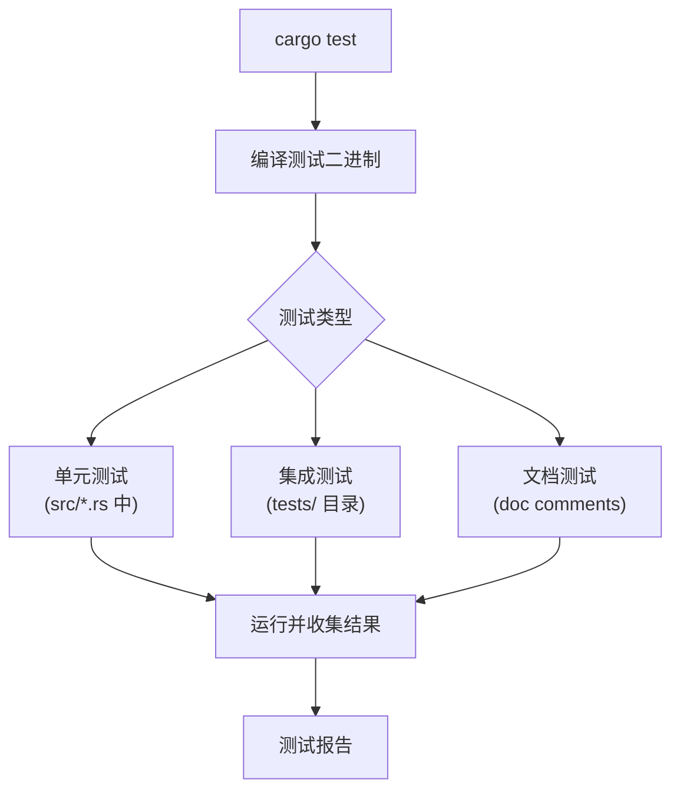
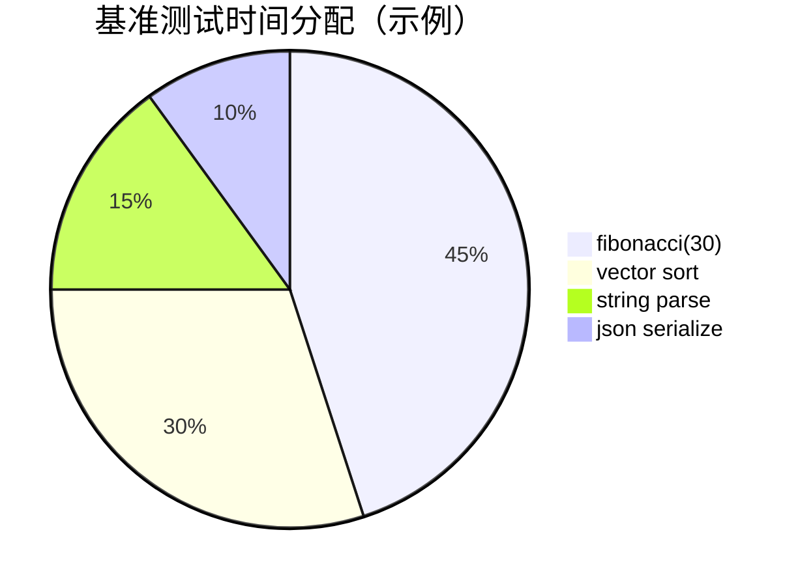
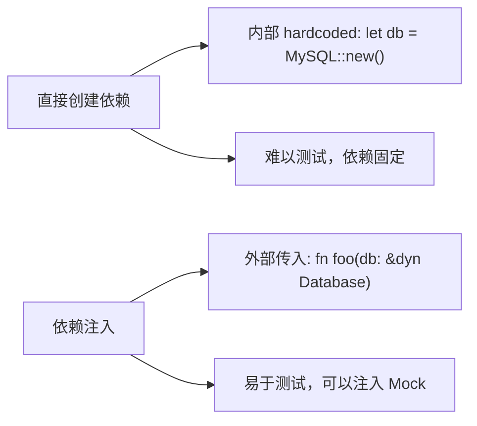
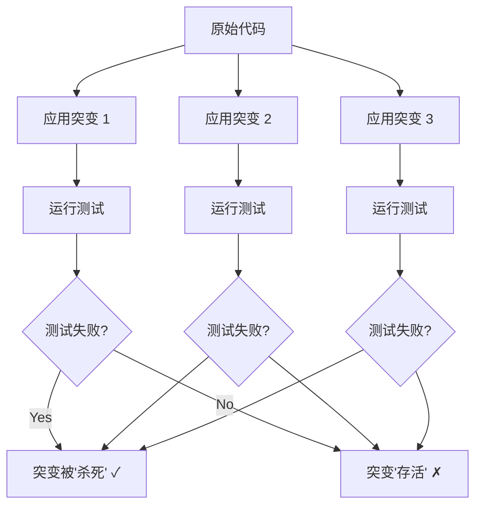

+++
title = "第 15 章 测试"
weight = 150
date = "2026-03-27T17:24:46+08:00"
type = "docs"
description = ""
isCJKLanguage = true
draft = false
+++

# Chapter 15 测试（Testing）

> 想象一下，你是一家餐厅的厨师，你做完一道菜直接端给客人——没尝过、没看过、没闻过。这时候客人吃到了半生不熟的牛排，里面还有头发丝，你猜会发生什么？轻则差评，重则上新闻。程序员的代码也是一样，写完不测试就发布到生产环境，那简直是给用户埋雷，自己踩自己埋的那种。测试，就是代码的"质检部门"，是程序员的"试毒小分队"，是你在凌晨三点发现 bug 之前就把它揪出来的得力助手。Rust 深知测试的重要性，所以它把测试框架内置在语言核心中，让你写测试就像点外卖一样简单——好吧，可能没那么简单，但至少比你想象的简单多了！

本章我们将深入探讨 Rust 的测试世界：从最基础的单元测试，到集成测试，再到文档测试，最后还有一些高级主题如 Mock、快照测试、属性测试和突变测试。学完这一章，你将成为代码质量的守护者，bug 的天敌，队友眼中的"靠谱程序员"（至少在测试覆盖率这件事上）。

<!-- CONTENT_MARKER -->
## 15.1 测试框架

Rust 的测试框架是语言的一等公民，不像某些语言把测试框架当二等公民，需要引入第三方库才能写测试。Rust 直接在编译器层面支持测试，让你可以在同一个文件中写业务代码和测试代码，和谐共处，其乐融融。测试框架的核心由以下几个部分组成：测试二进制的编译和运行基础设施、标准库中的测试宏和属性、以及 `cargo test` 命令提供的统一测试入口。

从哲学角度来看，Rust 的测试理念是**"测试即文档"**（Tests as Documentation）。当你写了一个函数，并且为它写了测试，那么测试本身就成为了函数行为的活文档——比注释强一万倍，因为测试是真正会被执行的，是不会骗人的。Rust 还鼓励你把测试放在**紧邻被测代码**的位置，而不是另外建一个独立的测试目录（虽然那也是可以的）。这样当你修改代码的时候，测试就在眼皮底下，改完顺手跑一下，心理踏实。



如上图所示，`cargo test` 是那个统领全局的大 boss，它会根据配置决定运行哪些测试、怎么运行、结果怎么展示。现在让我们从单元测试开始，一步步揭开 Rust 测试框架的神秘面纱。

### 15.1.1 单元测试

单元测试（Unit Test）是测试的基石，是最小粒度的测试，通常针对一个函数或一个模块进行验证。如果说整个测试体系是一支军队，那单元测试就是每个士兵手里的那把枪——看似简单，实则最重要。没有扎实的单元测试，就像军队人手一把水枪，打仗全靠喊"冲啊"。

#### 15.1.1.1 #[cfg(test)] 模块（仅测试编译）

`#[cfg(test)]` 是 Rust 提供的一个条件编译属性（Conditional Compilation Attribute）。`cfg` 是 "configuration" 的缩写，它允许你根据某些条件决定某段代码是否应该被编译。在测试场景中，`#[cfg(test)]` 修饰的模块只会在运行测试时被编译，在正常的 `cargo build` 或 `cargo release` 过程中，这些代码会被完全忽略，就像不存在一样。

为什么需要这样设计呢？想象一下，你的测试代码可能会引入一些只用于测试的依赖（比如 mock 框架），或者测试代码本身可能不适合在生产环境中存在（比如一些用于探查内部结构的特殊函数）。通过 `#[cfg(test)]`，你可以确保这些"测试专属"的代码只在测试环境中被编译，构建生产二进制时完全不会有它们的踪影。

在 Rust 中，你可以在两个地方放置单元测试：

1. **与被测代码在同一个文件中**：通常放在文件末尾的 `#[cfg(test)]` 模块里
2. **在 `src/` 目录下的 `tests/` 子模块中**：适合测试代码很多，需要更好组织的情况

大多数 Rust 项目采用第一种方式——在每个源文件末尾放一个 `#[cfg(test)]` 模块。这种方式的优点是测试和实现紧邻，修改实现时顺便看一眼测试，非常方便。

```rust
// src/calculator.rs
// 这是一个简单的计算器模块，我们将为它编写单元测试

/// 加法函数：计算两个 i32 整数的和
/// # 示例
/// assert_eq!(add(2, 3), 5);
pub fn add(a: i32, b: i32) -> i32 {
    a + b
}

/// 减法函数：计算两个 i32 整数的差
pub fn subtract(a: i32, b: i32) -> i32 {
    a - b
}

/// 乘法函数：计算两个 i32 整数的积
pub fn multiply(a: i32, b: i32) -> i32 {
    a * b
}

/// 除法函数：计算两个 i32 整数的商
/// 如果除数为零，会 panic（这是一个有争议的设计，但这是一本 Rust 教程，我们假装这是正常的）
pub fn divide(a: i32, b: i32) -> i32 {
    if b == 0 {
        panic!("除数不能为零！你是在玩火知道吗？");
    }
    a / b
}

// 这里是单元测试模块，注意 #[cfg(test)] 属性
#[cfg(test)]
mod tests {
    // 注意：这里我们导入了父模块的项（super）
    // 这样就可以直接使用 add, subtract 等函数，而不需要写 super::add
    use super::*;

    #[test]
    fn test_add() {
        // 测试加法基本功能
        assert_eq!(add(2, 3), 5);
        // 测试负数
        assert_eq!(add(-1, 1), 0);
        // 测试零
        assert_eq!(add(0, 0), 0);
    }

    #[test]
    fn test_subtract() {
        assert_eq!(subtract(5, 3), 2);
        assert_eq!(subtract(3, 5), -2);
    }

    #[test]
    fn test_multiply() {
        assert_eq!(multiply(3, 4), 12);
        assert_eq!(multiply(-2, 5), -10);
    }

    #[test]
    #[should_panic(expected = "除数不能为零")]
    fn test_divide_by_zero() {
        divide(10, 0); // 这应该 panic
    }

    #[test]
    fn test_divide() {
        assert_eq!(divide(10, 2), 5);
        assert_eq!(divide(-10, 2), -5);
    }
}
```

> **为什么使用 `use super::*`？**
> 在 `#[cfg(test)]` 模块内部，`super` 指向包含这个模块的父模块。在这个例子里，`tests` 模块在 `calculator.rs` 文件的顶层模块中，所以 `super` 就是那个顶层模块。通过 `use super::*`，我们把父模块中所有的 `pub`（以及非 `pub` 的，但 Rust 测试允许访问父模块的私有项，这是测试特权！）项都导入进来，这样测试代码就可以像在同一个作用域里一样直接调用 `add()`、`divide()` 等函数了。

运行这个测试，你会看到类似这样的输出：

```
running 5 tests
test tests::test_add ... ok
test tests::test_subtract ... ok
test tests::test_multiply ... ok
test tests::test_divide_by_zero ... ok
test tests::test_divide ... ok

test result: ok. 5 passed; 0 failed; 0 ignored; 0 measured; 0 filtered out; finished in 0.00s
```

全部通过！绿色的小 `ok` 让人心情愉悦，这就是 TDD（Test-Driven Development，测试驱动开发）爱好者们每天的快乐源泉。

#### 15.1.1.2 #[test] 属性（标记测试函数）

如果说 `#[cfg(test)]` 是给测试模块发的"入场券"，那 `#[test]` 就是给每个测试函数贴的"合格证"。只有被 `#[test]` 属性标记的函数才会被测试运行器识别并执行，没有这个属性的函数就算写在 `#[cfg(test)]` 模块里，也会被测试运行器无情忽略，就像班级里那个被老师点名"不计入成绩"的学生。

`#[test]` 属性告诉 Rust 的测试框架："这个函数是一个测试，请把它当作测试来运行"。具体来说，这意味着：
- 这个函数不能接受任何参数（因为测试运行器不知道该传什么）
- 这个函数必须返回 `()`（unit 类型），不能返回其他值
- 如果函数正常返回，说明测试通过
- 如果函数 panic 了，说明测试失败（除非你用了 `#[should_panic]`，那是另一回事）

除了基本的 `#[test]`，Rust 还提供了几个变体：
- `#[test]`: 普通测试，最标准、最常见
- `#[should_panic]`: 预期这个测试会 panic，如果它真的 panic 了，测试就算通过
- `#[ignore]`: 忽略这个测试，运行 `cargo test` 时不会执行它
- `#[should_panic(expected = "some message")]`: 更加精确的 panic 预期

```rust
#[cfg(test)]
mod advanced_tests {
    use super::*;

    // 普通测试：正常情况下应该通过
    #[test]
    fn normal_test() {
        assert!(true, "true 当然是 true，不然呢？");
    }

    // 预期 panic 的测试：除零错误
    #[test]
    #[should_panic(expected = "除数不能为零")]
    fn test_divide_should_panic() {
        divide(1, 0);
    }

    // 被忽略的测试：这只"懒测试"不会被执行
    #[test]
    #[ignore]
    fn test_ignored() {
        // 我被 ignore 了，所以我永远不会运行
        // 也许是因为我太慢了，也许是因为我太难了
        // 也许只是因为写我的人还没想好怎么实现我
        panic!("这个 panic 永远不会发生，因为测试被忽略了");
    }

    // 带超时（需要 nightly）的测试
    // 注意：在稳定版 Rust 中，timeout 需要通过 cargo test 的参数指定
    // 或者使用 testthat crate
}
```

> **小贴士：测试函数命名规范**
> Rust 社区约定俗成的测试函数命名方式是 `test_<what_is_being_tested>` 或 `<describe_the_behavior>`。例如 `test_add_positive_numbers`、`test_queue_is_empty_after_pop`。但说实话，名字取什么都可以，只要它对你和你的团队有意义。不过请**不要**取 `test1`、`test2`、`test3` 这种名字，除非你想在 code review 时被队友的眼神杀死。

#### 15.1.1.3 私有函数的测试（模块内可见）

在大多数编程语言中，测试私有函数是一个"技术活"——你需要借助一些反射、黑科技或者直接打破封装。在 Rust 中，情况稍微不同：**Rust 允许测试访问同一 crate（包）内的私有函数**。这意味着如果你把测试代码写在同一个 crate 里（即使在不同的文件），你就可以测试任何函数，不管它是 `pub` 还是私有的小透明。

为什么 Rust 要这样设计？因为 Rust 的设计哲学认为，测试是代码质量保障的重要手段，而过度保护私有函数反而会阻碍测试。一个模块的公有 API 是对外的契约，需要严格测试；而私有函数是内部实现，理论上外部代码不应该依赖它们，但**测试代码和业务代码在同一个 crate 里的时候，测试代码就是"内部代码"**，理应可以访问一切。

这种设计避免了两种尴尬：
1. 为了测试一个私有函数，强行把它改成 `pub`，结果暴露了不该暴露的 API
2. 为了测试私有函数，引入一堆 `pub(crate)` 或 `pub(super)`，把代码搞得乌烟瘴气

```rust
// src/internal.rs

/// 内部使用的辅助函数，判断一个数是否为正数
/// 注意：这个函数没有 pub，是私有的
fn is_positive(n: i32) -> bool {
    n > 0
}

/// 内部使用的辅助函数，对输入做安全检查
/// 如果输入为负数或零，会返回 None
fn validate_positive(n: i32) -> Option<i32> {
    if n <= 0 {
        None
    } else {
        Some(n)
    }
}

/// 公开 API：计算正整数的阶乘
/// 注意：0! = 1（数学定义），所以这里处理的是非负整数
pub fn factorial(n: i32) -> i32 {
    if n < 0 {
        panic!("阶乘只支持非负整数，你传了个 {} 是想怎样？", n);
    }

    match n {
        0 => 1,  // 0! = 1
        1 => 1,
        _ => n * factorial(n - 1)
    }
}

// 测试模块
#[cfg(test)]
mod tests {
    use super::*;

    // 测试私有函数 is_positive —— 在 Rust 中这是完全合法的！
    #[test]
    fn test_is_positive() {
        assert!(is_positive(42));
        assert!(is_positive(1));
        assert!(!is_positive(0));
        assert!(!is_positive(-1));
        assert!(!is_positive(-999));
    }

    #[test]
    fn test_validate_positive() {
        assert_eq!(validate_positive(5), Some(5));
        assert_eq!(validate_positive(1), Some(1));
        assert_eq!(validate_positive(0), None);
        assert_eq!(validate_positive(-1), None);
        assert_eq!(validate_positive(-100), None);
    }

    // 公有 API 测试
    #[test]
    fn test_factorial() {
        assert_eq!(factorial(0), 1);  // 0! = 1
        assert_eq!(factorial(1), 1);
        assert_eq!(factorial(5), 120);
        assert_eq!(factorial(10), 3628800);
    }

    #[test]
    #[should_panic(expected = "阶乘只支持非负整数")]
    fn test_factorial_negative() {
        factorial(-1);
    }
}
```

> **注意：跨 crate 访问私有函数？不行！**
> Rust 的模块系统有清晰的边界。`pub` 意味着"对其他 crate 可见"，而私有函数只有同一个 crate 内的代码能访问。这意味着**测试必须在同一个 crate 里**才能访问私有函数。集成测试（`tests/` 目录下的测试文件）是一个独立的测试二进制，不属于被测 crate，所以**集成测试无法访问私有函数**。这是一个重要的区别，我们下一节会详细讨论。

### 15.1.2 集成测试

如果说单元测试是检查每个零件的质量，那集成测试就是把所有零件组装在一起，看看这个完整的机器能不能正常运转。集成测试站在更高的视角，从"用户"的角度出发，验证整个系统（或系统的某个子系统）是否按预期工作。

在 Rust 中，集成测试有三种形式：
1. **tests/ 目录下的独立测试文件**：最常见的集成测试形式
2. **针对库 crate 的集成测试**：通过 `lib.rs` 暴露的公共 API 进行测试
3. **tests/ui 目录下的 UI 测试**：测试编译器错误信息是否符合预期

每种形式都有其独特的用途和特点，就像不同的乐器组成一个交响乐团——小提琴有小提琴的音色，大提琴有大提琴的浑厚，只有它们一起演奏，才能创造出完整的音乐。

#### 15.1.2.1 tests/ 目录（集成测试文件）

在 Rust 项目的根目录下，可以有一个 `tests/` 目录（注意是复数，和 `src/test` 不一样）。这个目录专门用来存放集成测试，每个 `.rs` 文件都会被当作一个独立的测试二进制来编译和运行。目录结构大概是这样的：

```
my_project/
├── Cargo.toml
├── src/
│   └── lib.rs (或者 main.rs)
└── tests/
    ├── test_integration.rs      # 集成测试文件 1
    ├── test_api.rs              # 集成测试文件 2
    └── test_edge_cases.rs       # 集成测试文件 3
```

在 `tests/` 目录下的每个文件，就像是一个完全外部的用户代码——它只能访问你 `pub` 出去的内容。打个比方，`tests/` 目录就是"客户体验部"，它们只看你开放给用户的功能，内部实现对它们是完全透明的。

```rust
// tests/test_integration.rs
// 这是一个集成测试文件，它是一个独立的二进制，不是库

// 首先，需要把我们要测试的 crate 引入作用域
// 使用 extern crate（Rust 2018 之前）或直接 use（Rust 2018 之后）
// 这里演示 Rust 2018+ 的写法

use my_project::Calculator; // 假设 lib.rs 导出了 Calculator

#[test]
fn test_calculator_add() {
    let calc = Calculator::new();
    assert_eq!(calc.add(2, 3), 5);
}

#[test]
fn test_calculator_chain() {
    let calc = Calculator::new();
    calc.add(10, 5);
    calc.multiply(3, 4);
    // 假设 Calculator 有 display 方法返回当前值
    assert_eq!(calc.display(), 45); // (10+5) * 3 = 45
}
```

集成测试文件的编写有几个要点：

1. **每个文件独立运行**：每个 `tests/` 下的 `.rs` 文件都会编译成独立的测试二进制。这意味着如果有两个测试文件都定义了 `#[test] fn test_something()`，不会冲突，因为它们在不同的二进制里。

2. **文件即模块名**：测试运行时会用文件名作为测试binary的名字。运行 `cargo test --test test_integration` 就会只运行 `tests/test_integration.rs`。

3. **共享辅助代码**：如果多个集成测试需要共享一些辅助函数，可以放在 `tests/common/mod.rs` 中，然后在测试文件中通过 `mod common;` 引入。

```rust
// tests/common/mod.rs
// 共享的测试辅助代码

/// 创建一个带默认值的计算器，用于测试
pub fn create_default_calculator() -> my_project::Calculator {
    let calc = my_project::Calculator::new();
    calc
}

/// 打印测试分隔线，让输出更美观
pub fn print_test_divider(name: &str) {
    println!("\n{}", "=".repeat(60));
    println!("测试: {}", name);
    println!("{}", "=".repeat(60));
}
```

```rust
// tests/test_integration.rs
// 使用 common 模块中的辅助代码

mod common; // 引入 common 模块

use my_project::Calculator;

#[test]
fn test_with_helper() {
    common::print_test_divider("带辅助函数的测试");
    let calc = common::create_default_calculator();
    assert_eq!(calc.add(1, 1), 2);
}
```

#### 15.1.2.2 库 crate 的集成测试（通过 lib.rs 公开接口）

对于库 crate（使用 `lib.rs` 而不是 `main.rs` 的 crate），集成测试尤为重要，因为库是要被其他项目依赖和使用的。在写库的时候，你不仅需要确保内部代码是正确的，还需要确保**暴露给外部的 API 是好用的、合理的、符合直觉的**。

集成测试是检验公开 API 的最佳场所。通过集成测试，你可以站在"即将使用这个库的开发者"的角度，审视你的 API 设计是否合理。一个好的 API 应该：
- 命名清晰，见名知意
- 参数和返回值类型符合直觉
- 错误处理得当，有意义的错误信息
- 文档和实现一致

```rust
// src/lib.rs
// 库的主入口文件

/// 计算器模块
pub mod calculator {
    /// 一个简单的计算器结构体
    pub struct Calculator {
        value: i32,
    }

    impl Calculator {
        /// 创建新的计算器实例，初始值为 0
        pub fn new() -> Self {
            Calculator { value: 0 }
        }

        /// 加法：将输入的两个数相加，并将结果存储到 value
        pub fn add(&mut self, a: i32, b: i32) -> i32 {
            self.value = a + b;
            self.value
        }

        /// 减法：将输入的两个数相减，并将结果存储到 value
        pub fn sub(&mut self, a: i32, b: i32) -> i32 {
            self.value = a - b;
            self.value
        }

        /// 乘法：将输入的两个数相乘，并将结果存储到 value
        pub fn mul(&mut self, a: i32, b: i32) -> i32 {
            self.value = a * b;
            self.value
        }

        /// 除法：将输入的两个数相除，并将结果存储到 value
        /// 如果除数为零，会 panic
        pub fn div(&mut self, a: i32, b: i32) -> i32 {
            if b == 0 {
                panic!("除数不能为零！你在试图打开通往数学地狱的大门吗？");
            }
            self.value = a / b;
            self.value
        }

        /// 获取当前计算器的值
        pub fn get_value(&self) -> i32 {
            self.value
        }

        /// 重置计算器值为 0
        pub fn reset(&mut self) {
            self.value = 0;
        }
    }

    // 为 Calculator 实现 Default trait，这样可以用 ..Default::default() 来创建
    impl Default for Calculator {
        fn default() -> Self {
            Self::new()
        }
    }
}

#[cfg(test)]
mod tests {
    use super::calculator::Calculator;
    use super::*;

    #[test]
    fn test_calculator_basic() {
        let mut calc = Calculator::new();
        assert_eq!(calc.get_value(), 0);
        
        calc.add(10, 5);
        assert_eq!(calc.get_value(), 15);
        
        calc.reset();
        assert_eq!(calc.get_value(), 0);
    }
}
```

```rust
// tests/calculator_integration.rs
// 集成测试：站在用户角度测试计算器的公开 API

use my_project::calculator::Calculator;

#[test]
fn test_calculator_operations() {
    let mut calc = Calculator::new();
    
    // 测试加法
    let result = calc.add(100, 200);
    assert_eq!(result, 300);
    assert_eq!(calc.get_value(), 300);
    
    // 测试减法
    let result = calc.sub(calc.get_value(), 50);
    assert_eq!(result, 250);
    
    // 测试乘法
    let result = calc.mul(3, 4);
    assert_eq!(result, 12);
    
    // 测试除法
    let result = calc.div(100, 4);
    assert_eq!(result, 25);
}

#[test]
fn test_calculator_chaining() {
    // 测试连续操作
    let mut calc = Calculator::new();
    
    // 连续加法
    calc.add(1, 2); // value = 3
    calc.add(3, 4); // value = 7
    calc.add(5, 6); // value = 11
    
    assert_eq!(calc.get_value(), 11);
}

#[test]
#[should_panic(expected = "除数不能为零")]
fn test_divide_by_zero() {
    let mut calc = Calculator::new();
    calc.div(10, 0); // 这应该 panic
}

#[test]
fn test_default() {
    // 测试 Default 实现
    let calc = Calculator::default();
    assert_eq!(calc.get_value(), 0);
}
```

运行集成测试：

```bash
$ cargo test --test calculator_integration
   Compiling my_project v0.1.0
    Finished test [unoptimized + debuginfo]
     Running tests/calculator_integration.rs

running 4 tests
test test_calculator_operations ... ok
test test_calculator_chaining ... ok
test test_divide_by_zero ... ok
test test_default ... ok

test result: ok. 4 passed; 0 failed; 0 ignored; 0 measured; 0 filtered out
```

> **集成测试 vs 单元测试：什么时候用哪个？**
> 简单来说，单元测试测"零件"，集成测试测"整机"。当你需要测试一个函数的多种输入组合、边界条件、错误处理时，用单元测试（因为可以直接调用私有函数）；当你需要测试多个组件如何协作、公开 API 的组合使用、模拟真实用户场景时，用集成测试。

#### 15.1.2.3 tests/ui（编译期 UI 测试，测试编译器错误）

这是 Rust 最酷的功能之一！UI 测试（也叫 Compile-Fail 测试或 Tryrun Tests）允许你验证编译器在某些情况下产生的错误信息是否符合预期。想象一下，你的库文档说"传入 null 时会报 'Null is not allowed' 错误"，但实际上编译器报的是 'null is not fun'——这就尴尬了。UI 测试就是为了防止这种尴尬而生的。

UI 测试的原理很简单：
1. 你写一个预计会编译失败的 Rust 代码文件
2. 在同目录下放一个 `.stderr` 文件，写上你期望看到的编译器错误输出
3. 运行测试，Rust 会编译那个文件，然后比较实际错误输出和 `.stderr` 文件的内容
4. 如果匹配，测试通过；如果不匹配，测试失败（并显示差异）

```
tests/
└── ui/
    ├── bar.rs           # 测试文件
    ├── bar.stderr      # 期望的编译器错误输出
    ├── baz.rs
    └── baz.stderr
```

```rust
// tests/ui/divide_by_zero.rs
// 这段代码故意写错，预期编译器会报错

// 当尝试编译这段代码时，Rust 编译器会报错
// 因为整数除法需要两个操作数，但我们只给了一个

fn main() {
    let result = 10 / ; // 缺少除数，语法错误！
}
```

```
# tests/ui/divide_by_zero.stderr
error: unexpected token: `;`
 --> tests/ui/divide_by_zero.rs:3:17
  |
3 |     let result = 10 / ;
  |                      ^ expected expression
```

> **注意：UI 测试的文件名约定**
> 在 `tests/ui/` 目录中，如果有一个 `foo.rs` 文件，就应该有对应的 `foo.stderr` 文件。Rust 的测试框架会自动配对它们。如果没有 `.stderr` 文件，测试会通过（表示允许编译失败但不需要验证错误信息）。如果有 `.stderr` 但 `.rs` 文件意外编译成功了，那也会报错。

UI 测试特别适合验证以下场景：
- 文档中声明的行为约束是否被编译器正确执行
- 错误信息是否对开发者友好
- 某种错误用法是否被正确阻止

```rust
// tests/ui/private_field_access.rs
// 测试：尝试直接访问私有字段应该导致编译错误

fn main() {
    // 假设 Temperature 的 fahrenheit 字段是私有的
    // 这段代码应该编译失败，因为外部代码不能直接访问私有字段
    let temp = Temperature { fahrenheit: 98.6 };
    //                    ^^^^^^^^^^^^^^^^^^ 错误：字段 `fahrenheit` 是私有的
}
```

```
# tests/ui/private_field_access.stderr
error[E0451]: field `fahrenheit` of struct `Temperature` is private
 --> tests/ui/private_field_access.rs:3:20
  |
3 |     let temp = Temperature { fahrenheit: 98.6 };
  |                    ^^^^^^^^^^^^^^^^^^^^^^^^ private field
```

> **注意：UI 测试只检查编译错误**
> UI 测试（也叫 compile-fail 测试）只验证**编译时**错误——即代码无法通过编译的情况。上例中 `unwrap()` 的 panic 是**运行时**错误，代码本身可以正常编译，所以不适合用 UI 测试来验证。如果想测试运行时 panic，应该使用 `#[should_panic]` 属性。

运行 UI 测试：

```bash
$ cargo test --test ui divide_by_zero
   Compiling my_project v0.1.0
    Building tests/ui/divide_by_zero.rs

error: compiling my_project v0.1.0 (tests/ui/divide_by_zero.rs) failed

--- stderr
error: unexpected token: `;`
 --> tests/ui/divide_by_zero.rs:3:17
  |
3 |     let result = 10 / ;
  |                      ^ expected expression

---
```

如果实际错误和 `.stderr` 文件内容不匹配，会显示详细差异（diff），就像 code review 一样告诉你哪里不一样。这对于维护文档的准确性来说简直是神器！

### 15.1.3 文档测试

Rust 是最早把"文档即测试"理念做到语言层面的主流语言之一。通过在文档注释中编写示例代码，Rust 不仅能生成漂亮的 API 文档，还能**自动运行这些示例来确保它们是正确的**。想象一下，你更新了代码，文档里的例子过时了，然后 CI 自动告诉你"嘿，你的文档例子跑不通了"——这就是文档测试的魔力。

文档测试的好处多多：
1. **文档永远不会过时**：示例代码会被持续测试
2. **学习成本降低**：用户看到的每个例子都是可运行的
3. **API 契约更加清晰**：写文档的人被迫亲自验证每个例子
4. **回归测试**：防止修改代码时意外破坏文档中的用法

#### 15.1.3.1 /// 示例（rustdoc 自动执行）

在 Rust 中，文档注释有两种形式：
- `///`：为下一个项（函数、结构体、模块等）添加文档
- `//!`：为包含它的项添加文档（常用于模块级别的文档）

文档注释中使用 `///` 的代码块会被 rustdoc（Rust 的文档生成器）识别，并在 `cargo test --doc` 时自动运行。

```rust
// src/lib.rs

/// 计算字符串中单词的数量
///
/// # 示例
///
/// ```
/// use my_project::count_words;
/// assert_eq!(count_words("hello world"), 2);
/// assert_eq!(count_words("Rust 是一门很棒的语言"), 3);
/// ```
///
/// # 参数
/// * `s` - 输入的字符串
///
/// # 返回值
/// 返回单词的数量（以空格分隔）
pub fn count_words(s: &str) -> usize {
    s.split_whitespace().count()
}

/// 判断一个数是否为质数
///
/// # 示例
///
/// ```
/// use my_project::is_prime;
///
/// assert!(is_prime(2));
/// assert!(is_prime(3));
/// assert!(is_prime(5));
/// assert!(!is_prime(4));
/// assert!(!is_prime(1));
/// assert!(!is_prime(0));
/// ```
pub fn is_prime(n: u32) -> bool {
    if n < 2 {
        return false;
    }
    for i in 2..n {
        if n % i == 0 {
            return false;
        }
    }
    true
}

/// 一个表示温度的结构体
///
/// # 示例
///
/// 创建华氏温度并转换为摄氏温度：
///
/// ```
/// use my_project::Temperature;
///
/// let hot = Temperature::from_fahrenheit(98.6);
/// println!("体温是 {} 摄氏度", hot.to_celsius());
/// // 输出类似: 体温是 37 摄氏度
/// ```
#[derive(Debug, Clone, Copy)]
pub struct Temperature {
    fahrenheit: f64,
}

impl Temperature {
    /// 从华氏温度创建温度对象
    ///
    /// # 示例
    ///
    /// ```
    /// use my_project::Temperature;
    ///
    /// let temp = Temperature::from_fahrenheit(32.0);
    /// assert_eq!(temp.to_celsius(), 0.0); // 冰点
    /// ```
    pub fn from_fahrenheit(f: f64) -> Self {
        Temperature { fahrenheit: f }
    }

    /// 转换为摄氏温度
    ///
    /// # 示例
    ///
    /// ```
    /// use my_project::Temperature;
    ///
    /// let temp = Temperature::from_fahrenheit(212.0);
    /// assert!((temp.to_celsius() - 100.0).abs() < 0.001); // 沸点
    /// ```
    pub fn to_celsius(&self) -> f64 {
        (self.fahrenheit - 32.0) * 5.0 / 9.0
    }
}
```

> **文档注释中代码块的类型**
> 文档代码块可以有不同的"隐藏指令"（hidden directives）：
> - **默认**：代码块中的代码会被完整运行
> - `ignore`：代码块会被 rustdoc 忽略，不运行
> - `compile_fail`：代码块应该编译失败（用于测试文档中说的"这样写是错的"）
> - `should_panic`：代码块应该 panic
> - `no_run`：代码块会被检查（编译），但不执行

#### 15.1.3.2 cargo test --doc

运行文档测试非常简单：

```bash
$ cargo test --doc
   Compiling my_project v0.1.0
    Documenting my_project v0.1.0
     Running doctests (examples are compiled and run as tests)

running 5 tests
src/lib.rs:13: count_words ... ok
src/lib.rs:20: is_prime ... ok
src/lib.rs:39: Temperature::from_fahrenheit ... ok
src/lib.rs:48: Temperature::to_celsius ... ok
src/lib.rs:34: Temperature struct ... ok

test result: ok. 5 passed; 0 failed; 0 ignored; 0 measured; 0 filtered out
```

`cargo test --doc` 会：
1. 编译项目并生成文档（`cargo doc` 的功能）
2. 提取所有文档注释中的代码块
3. 将每个代码块作为独立的测试运行

文档测试的一个独特之处是：**文档代码块可以访问被测 crate 的公共 API**。这意味着你可以在文档中写 `use my_project::Temperature;`，Rust 会自动为你注入这个导入。

#### 15.1.3.3 隐藏代码块： ```ignore / ```compile_fail

如前所述，文档代码块有不同的类型来处理不同的测试场景：

**`ignore`**：如果你有一段代码，但不想让 rustdoc 运行它（比如代码太复杂、依赖外部资源、或者只是一个片段），可以使用 `ignore`。

```rust
/// 计算斐波那契数列（忽略此代码块）
///
/// ```ignore
/// // 这个例子太长了，运行时会花费很长时间
/// fn fibonacci(n: u64) -> u64 {
///     match n {
///         0 => 0,
///         1 => 1,
///         _ => fibonacci(n - 1) + fibonacci(n - 2),
///     }
/// }
/// ```
pub fn some_unrelated_function() {}
```

**`compile_fail`**：这个指令表示"这段代码应该编译失败"。这是测试"文档声明的错误用法是否真的被阻止"的好方法。

```rust
/// 正确创建温度的方式：
///
/// ```
/// use my_project::Temperature;
/// let temp = Temperature::from_fahrenheit(25.0);
/// ```
///
/// 错误：直接访问字段是不允许的！
///
/// ```compile_fail
/// let temp = Temperature { fahrenheit: 25.0 }; // 编译错误！字段是私有的
/// ```
pub fn some_function() {}
```

如果某段标记为 `compile_fail` 的代码意外编译成功了，文档测试会失败并报错。这样可以确保你的"这样写是错的"声明是真实有效的。

```rust
/// # 正确的用法
///
/// ```
/// use my_project::counter::Counter;
///
/// let mut c = Counter::new();
/// c.increment();
/// assert_eq!(c.get(), 1);
/// ```
///
/// # 错误的用法
///
/// 这个错误用法会被编译器阻止：
///
/// ```compile_fail,E0603
/// // Counter::value 是私有的，无法直接访问
/// let c = Counter { value: 10 }; // 私有字段不能这样初始化
/// ```
pub mod counter {
    /// 计数器
    pub struct Counter {
        value: i32, // 私有字段
    }

    impl Counter {
        /// 创建新计数器
        pub fn new() -> Self {
            Counter { value: 0 }
        }

        /// 增加计数
        pub fn increment(&mut self) {
            self.value += 1;
        }

        /// 获取当前值
        pub fn get(&self) -> i32 {
            self.value
        }
    }
}
```

> **注意：`compile_fail` 的稳定性**
> `compile_fail` 指令在 Rust 稳定版上可以使用，但有时错误信息的格式可能会随着编译器版本更新而略有变化。为了让测试更稳定，可以在后面加上错误代码，如 `compile_fail,E0603`，这样只检查是否产生了特定的错误码，而不在意错误信息的具体措辞。

### 15.1.4 断言宏

断言（Assertion）是测试的核心。没有断言，测试就只是一堆"执行代码然后什么都不检查"的黑盒子。断言是你告诉测试框架："我期望这里是这个值，如果实际情况不是这样，就给我报错！"

Rust 的标准库提供了一系列强大的断言宏，它们不仅能告诉你测试失败，还能告诉你**实际值和期望值是什么**，大大加速调试过程。Rust 的断言宏设计哲学是：**失败信息应该对人类友好，帮助开发者快速定位问题**。

#### 15.1.4.1 assert! / debug_assert!（条件断言）

`assert!` 是最基本的断言宏。它接受一个布尔表达式，如果表达式值为 `true`，测试继续；如果为 `false`，测试失败并 panic。`debug_assert!` 是它的兄弟版本，区别在于**`debug_assert!` 只在调试构建（debug build）中生效，在发布构建（release build）中被完全忽略**。

为什么要区分这两个？因为有些检查在调试时很重要，但在生产环境中可能性能开销较大，或者根本不可能发生（比如某些内部不变量）。使用 `debug_assert!` 可以在开发时捕获问题，在生产时不引入额外开销。

```rust
#[cfg(test)]
mod tests {
    use super::*;

    #[test]
    fn test_basic_assertion() {
        // 基本 assert! 用法
        let is_even = |x: i32| x % 2 == 0;
        
        assert!(is_even(4), "4 应该是偶数，这条消息在 assert 失败时显示");
        assert!(!is_even(3), "3 不是偶数");
    }

    #[test]
    fn test_debug_assert() {
        // debug_assert! 在 release 模式下会被完全删除
        let value = 42;
        
        debug_assert!(value > 0, "value 应该是正数");
        debug_assert!(value < 100, "value 应该小于 100");
        
        // 这些在 cargo build --release 时不会执行任何检查
        // 但在 cargo build（debug）时会检查
    }

    #[test]
    fn test_assertion_with_formatted_message() {
        let name = "Alice";
        let age = 25;
        
        // assert! 支持格式化消息，和 println! 一样的语法
        assert!(
            age >= 18,
            "用户 {} 年龄是 {}，未满 18 岁，拒绝访问！",
            name, age
        );
    }

    #[test]
    fn test_logic_assertions() {
        // assert! 可以用于复杂的逻辑表达式
        let x = 10;
        let y = 20;
        
        assert!(
            x > 0 && y > 0,
            "两个数都应该是正数: x={}, y={}", x, y
        );
        
        assert!(
            x < y,
            "x({}) 应该小于 y({})", x, y
        );
    }
}
```

> **`assert!` vs `debug_assert!` 的使用场景**
> - **使用 `assert!`**：检查永远不应该失败的条件，比如用户输入验证、公开 API 的契约、测试中的预期结果
> - **使用 `debug_assert!`**：检查内部实现细节，只在开发和调试时有意义，比如"这个 vector 应该是排序的"、"这个循环应该至少执行一次"等

#### 15.1.4.2 assert_eq! / debug_assert_eq!（相等性断言）

`assert_eq!` 可能是 Rust 测试中使用频率最高的宏了。它的作用是断言两个值相等（使用 `==` 比较）。当断言失败时，它不仅会 panic，还会打印出**左边的值（实际值）**和**右边的值（期望值）**，让你一眼就知道哪里出了问题。

```rust
#[cfg(test)]
mod tests {
    #[test]
    fn test_assert_eq_basics() {
        // 数字比较
        assert_eq!(2 + 2, 4);
        
        // 字符串比较
        assert_eq!("hello".to_uppercase(), "HELLO");
        
        // 数组比较
        assert_eq!([1, 2, 3], [1, 2, 3]);
        
        // 布尔比较
        assert_eq!(5 > 3, true);
    }

    #[test]
    fn test_assert_eq_with_vec() {
        let v1 = vec![1, 2, 3];
        let v2 = vec![1, 2, 3];
        
        // Vec 的 assert_eq! 会打印出完整内容
        assert_eq!(v1, v2);
    }

    #[test]
    fn test_assert_eq_failure_output() {
        let actual = 42;
        let expected = 43;
        
        // 当这个 assert 失败时，你会看到类似这样的输出：
        // thread 'test_assert_eq_failure_output' panicked at 'assertion failed: `(left == right)`
        //   left: `42`
        //  right: `43`
        // ', src/lib.rs:XX:XX
        
        // 下面这行会失败，取消注释可以看效果
        // assert_eq!(actual, expected);
    }

    #[test]
    fn test_debug_assert_eq() {
        let x = 100;
        let y = 100;
        
        // debug_assert_eq! 在 release 模式被忽略
        debug_assert_eq!(x, y);
    }
}
```

当 `assert_eq!` 失败时，你会看到这样的输出（这是 Rust 最有用的错误信息之一）：

```
thread 'test_addition' panicked at 'assertion failed: `(left == right)`
  left: `4`
 right: `5`
with an arbitrary additional message
src/lib.rs:42:5
```

`left` 是 `assert_eq!(actual, expected)` 中的第一个参数（实际值），`right` 是第二个参数（期望值）。这个设计让你可以直观地看出"我得到了 4，但我期望 5"。

#### 15.1.4.3 assert_ne! / debug_assert_ne!（不相等断言）

`assert_ne!` 是 `assert_eq!` 的反面——它断言两个值**不相等**。当且仅当两个值不相等时，测试通过；如果相等了，测试失败。这在验证"某个操作确实改变了值"或"这两个值确实是不同的"场景中非常有用。

```rust
#[cfg(test)]
mod tests {
    #[test]
    fn test_assert_ne_basic() {
        // 不相等的值
        assert_ne!(1, 2);
        assert_ne!("apple", "banana");
        assert_ne!(vec![1, 2], vec![3, 4]);
        
        // 逻辑上不相等
        assert_ne!(10 > 5, false); // 10 > 5 是 true，不等于 false
    }

    #[test]
    fn test_value_changed() {
        let mut v = vec![1, 2, 3];
        let original_len = v.len();
        
        v.push(4);
        
        // 确认 push 确实改变了长度
        assert_ne!(v.len(), original_len, "push 后长度应该变化");
        assert_eq!(v.len(), 4);
    }

    #[test]
    fn test_mutation() {
        let mut s = String::from("hello");
        let original = s.clone();
        
        s.push_str(", world");
        
        // 确认字符串确实被修改了
        assert_ne!(s, original, "字符串修改后应该和原来不同");
        assert_eq!(s, "hello, world");
    }

    #[test]
    fn test_assert_ne_failure_message() {
        let a = 10;
        let b = 10;
        
        // 取消注释可以看到失败输出
        // assert_ne!(a, b); // thread panicked: assertion failed: a != b
    }
}
```

#### 15.1.4.4 自定义断言消息（assert!(condition, "message: {}", value)）

这是让测试更加友好的重要技巧。虽然 Rust 的断言宏已经能自动提供很多有用的信息，但有时候你需要在失败时打印一些额外的上下文信息，帮助理解测试失败的原因。

所有标准的断言宏都支持可选的格式化消息作为最后一个参数。

```rust
#[cfg(test)]
mod tests {
    #[derive(Debug, Clone)]
    struct User {
        name: String,
        age: u32,
        email: String,
    }

    impl User {
        fn new(name: &str, age: u32, email: &str) -> Self {
            User {
                name: name.to_string(),
                age,
                email: email.to_string(),
            }
        }
    }

    #[test]
    fn test_user_creation() {
        let user = User::new("Alice", 30, "alice@example.com");
        
        assert_eq!(user.name, "Alice");
        assert_eq!(user.age, 30);
        assert_eq!(user.email, "alice@example.com");
    }

    #[test]
    fn test_validation_with_custom_messages() {
        let age = 15;
        
        // 提供更多上下文信息
        assert!(
            age >= 18,
            "用户未满 18 岁，禁止注册。实际年龄: {}", age
        );
    }

    #[test]
    fn test_order_processing() {
        let cart_total = 150.0;
        let discount_threshold = 100.0;
        let discount_amount = 10.0;
        
        let final_price = if cart_total > discount_threshold {
            cart_total - discount_amount
        } else {
            cart_total
        };
        
        assert_eq!(
            final_price,
            140.0,
            "购物车总价为 {}，超过 {}，应享受 {} 折扣",
            cart_total, discount_threshold, discount_amount
        );
    }

    #[test]
    fn test_complex_assertion_message() {
        let numbers = vec![1, 2, 3, 4, 5];
        let expected_sum = 15;
        let expected_product = 120;
        
        let actual_sum: i32 = numbers.iter().sum();
        let actual_product: i32 = numbers.iter().product();
        
        assert_eq!(
            actual_sum,
            expected_sum,
            "数字 {:?} 的和应该是 {}，实际是 {}", 
            numbers, expected_sum, actual_sum
        );
        
        assert_eq!(
            actual_product,
            expected_product,
            "数字 {:?} 的积应该是 {}，实际是 {}",
            numbers, expected_product, actual_product
        );
    }
}
```

> **最佳实践：写有用的断言消息**
> 断言消息应该回答这个问题："当这个断言失败时，开发者最想知道什么？"好的消息包含：
> - 相关的变量值
> - 操作的目的或意图
> - 期望的行为
> 
> 不好的消息是那种说了等于没说的，比如 "this should not happen" 或 "assertion failed"。尽量让消息能够帮助调试，而不是制造更多困惑。

## 15.2 测试运行与配置

了解测试框架的各个组成部分很重要，但更重要的是知道如何**运行**这些测试，以及如何**配置**测试的行为。Rust 的测试系统提供了丰富的命令行选项和属性配置，让你能够精确控制测试的运行方式：从选择运行哪些测试，到配置并行度，到处理预期失败的测试。

打个比方，如果你把测试套件想象成一支军队，那 `cargo test` 就是最高统帅，它可以下令"让第三营的士兵去执行任务"、"这次演习用真枪"、"士兵们跑快点，并行执行"。而各种 `#[test]` 属性则是每个士兵的特殊技能卡——有的士兵有"金刚不坏"（should_panic），有的士兵有"隐身"（ignore），有的士兵有"快如闪电"（benchmark）。

### 15.2.1 cargo test 命令

`cargo test` 是 Rust 测试系统的中央控制台。它负责编译测试代码、运行测试、收集结果并报告。理解 `cargo test` 的各种选项可以让你更高效地开发和调试测试。

```bash
# 基本用法：运行所有测试（单元测试 + 集成测试 + 文档测试）
$ cargo test

# 只运行单元测试和集成测试（不包括文档测试）
$ cargo test --lib

# 只运行文档测试
$ cargo test --doc

# 运行特定测试（只显示名字匹配的测试）
$ cargo test test_name

# 显示测试输出（默认情况下，测试通过时的 println! 输出被隐藏）
$ cargo test -- --nocapture

# 指定测试线程数（默认是 CPU 核心数）
$ cargo test -- --test-threads=1

# 并行运行测试但显示详细输出
$ cargo test -- --nocapture --test-threads=4
```

#### 15.2.1.1 --lib（仅库测试）

`--lib` 标志告诉 `cargo test` 只运行库中的单元测试（即 `src/lib.rs` 或 `src/` 下其他文件中包含的 `#[cfg(test)]` 模块），不包括集成测试和文档测试。

这个选项在以下场景特别有用：
- 你正在开发一个库项目
- 你只想快速验证核心逻辑是否正确
- 集成测试需要更多环境配置，现在不想运行

```bash
# 运行库中的所有单元测试
$ cargo test --lib

# 运行库中名字匹配 add 的测试
$ cargo test --lib add
```

#### 15.2.1.2 --doc（仅文档测试）

`--doc` 标志只运行文档测试。文档测试会检查你的 `///` 文档注释中的代码示例是否能够正确编译和运行。

```bash
# 只运行文档测试
$ cargo test --doc

# 运行文档测试中匹配某个模式的测试
$ cargo test --doc Temperature
```

#### 15.2.1.3 --test <name>（运行特定集成测试）

`--test` 标志允许你运行指定的集成测试文件（`tests/` 目录下的特定文件）。每个 `.rs` 文件在 `tests/` 目录下都会被编译成一个独立的测试二进制。

```bash
# 运行 tests/integration.rs 这个集成测试
$ cargo test --test integration

# 运行 tests/api.rs
$ cargo test --test api

# 运行同时显示输出
$ cargo test --test integration -- --nocapture
```

#### 15.2.1.4 -- --nocapture（显示 println 输出）

默认情况下，当测试通过时，`println!` 和 `print!` 的输出是**被隐藏**的。这样可以减少测试运行的噪音。但如果你的测试中有 `println!` 用于调试或验证某些输出，`--nocapture` 选项可以让你看到这些输出。

```bash
# 运行测试并显示 stdout 输出
$ cargo test -- --nocapture

# 只对特定测试显示输出
$ cargo test test_with_println -- --nocapture
```

```rust
// 带有打印输出的测试
#[test]
fn test_with_println() {
    let result = vec![1, 2, 3, 4, 5];
    
    println!("测试输入: {:?}", result);
    
    let sum: i32 = result.iter().sum();
    let expected = 15;
    
    println!("计算得到 sum = {}，期望 sum = {}", sum, expected);
    
    assert_eq!(sum, expected);
    
    println!("测试通过！sum = {}", sum);
}
```

#### 15.2.1.5 -- --test-threads=N（并发测试数）

默认情况下，`cargo test` 会**并行运行**所有测试。测试线程数默认设置为 CPU 的逻辑核心数。但有时候你可能想：
- 减少线程数（当测试使用共享资源时）
- 设置为 1（串行运行，方便调试，看输出顺序）
- 增加线程数（如果测试彼此独立且机器性能足够好）

```bash
# 用 1 个线程运行测试（串行，输出更容易阅读）
$ cargo test -- --test-threads=1

# 用 4 个线程运行测试
$ cargo test -- --test-threads=4

# 用尽可能多的线程（unlimited）
$ cargo test -- --test-threads=0
```

> **并行测试的安全性**
> 如果测试同时访问共享资源（如文件、数据库、全局变量），并行运行可能导致竞态条件。使用 `--test-threads=1` 可以避免这个问题，但这会让测试运行得更慢。一个更好的做法是在测试设计时就避免共享状态，或者使用适当的同步机制。

### 15.2.2 测试配置

除了命令行选项，Rust 还提供了一系列**测试属性**（Attributes）来配置测试函数的行为。这些属性放在 `#[test]` 下面，让每个测试函数可以有不同的"个性"。

#### 15.2.2.1 #[should_panic]（预期 panic）

`#[should_panic]` 属性告诉测试框架："这个测试应该 panic"。如果测试函数执行过程中真的 panic 了，测试就通过；如果测试正常返回（没有 panic），测试就失败。

这个属性非常适合测试那些"应该出错的场景"——比如除零、传入非法参数、访问越界等。一个设计良好的 API 应该能够优雅地处理错误，而 `#[should_panic]` 就是验证这种"优雅错误处理"的工具。

```rust
#[cfg(test)]
mod tests {
    use super::*;

    // 正常测试：验证 divide 函数在正常输入时的行为
    #[test]
    fn test_divide_normal() {
        assert_eq!(divide(10, 2), 5);
        assert_eq!(divide(-10, 2), -5);
        assert_eq!(divide(0, 1), 0);
    }

    // 预期 panic 测试：验证除零会导致 panic
    #[test]
    #[should_panic(expected = "除数不能为零")]
    fn test_divide_by_zero_should_panic() {
        divide(10, 0);
    }

    // 预期 panic 测试：验证对负数开平方根会 panic
    #[test]
    #[should_panic(expected = "不能对负数开平方根")]
    fn test_sqrt_negative_should_panic() {
        sqrt(-1.0);
    }

    // 预期 panic 测试：验证空 vector 的 pop 会 panic
    #[test]
    #[should_panic(expected = "pop from empty vector")]
    fn test_pop_empty_should_panic() {
        let v: Vec<i32> = vec![];
        v.pop(); // 应该 panic
    }

    // 预期 panic 测试：验证超出范围索引会 panic
    #[test]
    #[should_panic(expected = "index out of bounds")]
    fn test_vec_index_out_of_bounds_should_panic() {
        let v = vec![1, 2, 3];
        let _ = v[100]; // 应该 panic
    }

    // 预期 panic 测试：验证自定义 panic 消息
    #[test]
    #[should_panic(expected = "账户余额不足")]
    fn test_withdraw_insufficient_funds_should_panic() {
        let mut account = BankAccount::new(100);
        account.withdraw(200); // 应该 panic，消息包含"账户余额不足"
    }
}
```

#### 15.2.2.2 #[should_panic(expected = "msg")]（panic 消息匹配）

`#[should_panic]` 有一个更精确的版本：`#[should_panic(expected = "...")]`。这个版本不仅检查是否 panic，还会检查 panic 的消息是否包含指定的字符串。

这是一个非常有用的增强！想象一下，如果你的代码有多个地方可能 panic，但你想确保测试的是**特定的那个 panic**（而不是意外触发了另一个 panic），`expected` 属性就是你的精确制导武器。

```rust
#[cfg(test)]
mod tests {
    // 假设我们有多种 panic 场景的代码

    // 场景 1：除数不能为零
    #[test]
    #[should_panic(expected = "除数不能为零")]
    fn test_divide_by_zero() {
        divide(10, 0);
    }

    // 场景 2：被除数不能为负数
    #[test]
    #[should_panic(expected = "被除数不能为负数")]
    fn test_divide_negative_dividend() {
        divide(-10, 2);
    }

    // 场景 3：结果溢出
    #[test]
    #[should_panic(expected = "计算结果溢出")]
    fn test_divide_overflow() {
        divide(i32::MAX, 1); // 如果实现有问题可能溢出
    }
}
```

> **编写精确的 expected 消息**
> `expected` 字符串是作为**子字符串匹配**的，只要 panic 消息中包含这个字符串就算匹配。所以你不需要写完整的 panic 消息，只需要写能够唯一标识这个 panic 的那部分即可。例如，如果 panic 消息是 "Error: 除数不能为零（code: 42）"，你只需要写 "除数不能为零" 就够了。

#### 15.2.2.3 #[ignore]（跳过测试）

`#[ignore]` 属性告诉测试框架："这个测试先跳过，不要运行它"。被 `ignore` 的测试不会执行，但在测试报告中会显示为 "ignored"。

这个属性适合以下场景：
- 测试太慢，需要手动触发
- 测试依赖外部资源（如数据库、网络），当前环境不可用
- 测试代码已知有 bug，但暂时没时间修复
- 测试是平台特定的，只在某些 OS 上有意义

```rust
#[cfg(test)]
mod tests {
    use super::*;

    // 普通测试：总是运行
    #[test]
    fn test_quick_operation() {
        assert!(true);
    }

    // 被忽略的测试：不会运行
    #[test]
    #[ignore]
    fn test_slow_database_operation() {
        // 这个测试需要连接真实的数据库，太慢了
        // 平时开发时不运行，只在 CI 或手动验证时运行
        // let db = Database::connect("production-server");
        // assert!(db.query("SELECT * FROM users").is_ok());
    }

    // 被忽略的测试：需要特定条件
    #[test]
    #[ignore]
    fn test_platform_specific_feature() {
        // 这个功能只在 Windows 上有效
        // 在 Linux 上测试没意义
        #[cfg(target_os = "windows")]
        {
            // Windows 特定实现
        }
    }

    // 运行所有测试包括 ignored 的：
    // cargo test -- --ignored
    
    // 注意：cargo test 没有 --ignored-only 这样的标志
    // 如果只想运行 ignored 的测试，可以结合 --ignored 和测试名过滤
    // cargo test -- --ignored <pattern>  # 只运行 ignored 且名字匹配的测试
}
```

#### 15.2.2.4 #[timeout = N]（超时检测）

`#[timeout]` 属性（需要 `cargo test` 配合）允许你为单个测试设置最大执行时间。如果测试运行超过这个时间，就会被视为失败。

这个功能在测试异步代码或可能死锁的代码时特别有用。但需要注意，`#[timeout]` 在 Rust 标准库中不是内置的，需要使用外部 crate 如 `testthat` 或者使用 nightly Rust 的 `#[timeout]` 属性。

```rust
// 使用 testthat crate 实现超时测试

#[cfg(test)]
mod tests {
    use std::time::Duration;
    use std::thread;

    // 简单的手动超时测试
    #[test]
    fn test_with_manual_timeout() {
        let handle = thread::spawn(|| {
            // 模拟一个可能很慢的操作
            expensive_computation()
        });

        // 等待线程完成，最多等 5 秒
        let result = handle.join_timeout(Duration::from_secs(5));
        
        assert!(result.is_ok(), "测试超时！操作执行时间超过 5 秒");
    }

    fn expensive_computation() {
        // 模拟耗时操作
        thread::sleep(Duration::from_millis(100));
    }
}
```

> **Rust Nightly 的内置 timeout**
> 如果你使用的是 Rust nightly，可以直接使用内置的 `#[timeout =_secs]` 属性（注意是 `timeout` 不是 `timeout_secs`，具体取决于 nightly 版本）：

```rust
#![feature(test)]

extern crate test;

#[test]
#[test::timeout(secs = 2)]
fn test_with_timeout() {
    // 如果这个测试运行超过 2 秒，会自动失败
    thread::sleep(Duration::from_secs(3));
}
```

### 15.2.3 性能测试

写代码不仅要"正确"，还要"快"。性能测试（Benchmark Tests）让你能够量化代码的执行速度，从而对比不同实现的优劣、检测性能回归、或简单地满足"我的代码能跑多快"的好奇心。

Rust 曾经有内置的基准测试功能（`#[bench]`），但由于稳定 Rust 不支持，后来被移到了 nightly 中。现在，对于跨平台（稳定 + nightly）的基准测试，推荐使用 `criterion` crate。

#### 15.2.3.1 #[bench] 属性（稳定 nightly）

在 Rust nightly 版本中，可以使用 `#[bench]` 属性来标记基准测试函数。基准测试的运行方式和普通测试类似，但测试框架会**多次运行被测代码**以获得可靠的计时数据。

```rust
#![feature(bench_black_box)]

extern crate test;

use test::Bencher;

#[cfg(test)]
mod benchmarks {
    use super::*;
    use test::black_box;

    #[bench]
    fn bench_simple_addition(b: &mut Bencher) {
        // b.iter 闭包内的代码会被多次运行并计时
        b.iter(|| {
            let mut sum = 0;
            for i in 0..1000 {
                sum += i;
            }
            sum
        });
    }

    #[bench]
    fn bench_vector_creation(b: &mut Bencher) {
        b.iter(|| {
            (0..1000).collect::<Vec<_>>()
        });
    }

    #[bench]
    fn bench_string_concat(b: &mut Bencher) {
        b.iter(|| {
            let mut s = String::new();
            for i in 0..100 {
                s.push_str("hello");
            }
            s
        });
    }
}
```

> **注意：Rust Nightly 的 bench 功能**
> `#[bench]` 在稳定 Rust 上不可用。如果你需要在稳定版本上进行基准测试，请使用 `criterion` crate（见下一节）。 nightly 特性可能会变化，所以生产项目推荐使用跨平台的 `criterion`。

#### 15.2.3.2 criterion crate（跨平台性能基准测试）

`criterion` 是 Rust 生态系统中最流行的基准测试库，它提供了：
- **跨平台支持**：稳定版 Rust 也能用
- **统计分析**：自动计算均值、标准差、置信区间
- **图表生成**：生成基准测试结果的图表（HTML）
- **回归检测**：对比不同版本的性能差异

要使用 `criterion`，需要在 `Cargo.toml` 中添加依赖：

```toml
[dev-dependencies]
criterion = "0.5"

[[bench]]
name = "my_benchmark"
harness = false
```

```rust
// benches/my_benchmark.rs
// 注意：基准测试文件放在 benches/ 目录，不是 tests/

use criterion::{black_box, criterion_group, criterion_main, Criterion};

/// 待测试的函数
fn fibonacci(n: u64) -> u64 {
    match n {
        0 => 0,
        1 => 1,
        _ => fibonacci(n - 1) + fibonacci(n - 2),
    }
}

/// 迭代版本的斐波那契（更高效）
fn fibonacci_iterative(n: u64) -> u64 {
    if n <= 1 {
        return n;
    }
    let mut a = 0;
    let mut b = 1;
    for _ in 2..=n {
        let temp = a + b;
        a = b;
        b = temp;
    }
    b
}

fn bench_fibonacci(c: &mut Criterion) {
    let mut group = c.benchmark_group("fibonacci");
    
    // 测试递归版本（慢）
    group.bench_function("recursive_10", |b| {
        b.iter(|| fibonacci(black_box(10)))
    });
    
    // 测试迭代版本（快）
    group.bench_function("iterative_10", |b| {
        b.iter(|| fibonacci_iterative(black_box(10)))
    });
    
    // 测试更大的输入
    group.bench_function("iterative_40", |b| {
        b.iter(|| fibonacci_iterative(black_box(40)))
    });
    
    group.finish();
}

criterion_group!(benches, bench_fibonacci);
criterion_main!(benches);
```

运行基准测试：

```bash
# 开发时运行基准测试
$ cargo bench

# criterion 会输出类似这样的结果：
# fibonacci/iterative_40
#                         time: [25.123 us 25.456 us 25.789 us]
#                         change: [-1.23% +0.45% +2.10%] (p = 0.23 not significant)
```

#### 15.2.3.3 criterion 图表生成

`criterion` 的一个亮点是它可以生成详细的 HTML 报告，包括：
- 每次测量的原始数据
- 性能分布直方图
- 回归分析图（对比历史数据）
- 噪声分析

这些报告默认生成在 `target/criterion/` 目录下。

```rust
use criterion::{black_box, Criterion};

fn fibonacci_benchmark(c: &mut Criterion) {
    let mut c = c.benchmark_group("fibonacci");
    
    // 配置图表输出
    c.sample_size(100)           // 每个测试采样 100 次
      .noise_threshold(0.05)     // 允许 5% 的噪声
      .warm_up_time(std::time::Duration::from_secs(1)); // 预热 1 秒
    
    c.bench_function("fib_30", |b| {
        b.iter(|| fibonacci_iterative(black_box(30)))
    });
}
```

生成的报告可以通过浏览器打开，让你直观地看到性能数据。



### 15.2.4 模糊测试（Fuzzing）

模糊测试（Fuzzing）是一种自动化测试技术，它会生成大量的随机输入数据来"轰炸"你的程序，试图找到那些会导致崩溃、panic 或其他异常行为的输入。与其手工编写各种边界条件的测试用例，模糊测试让机器帮你"想到想不到的"输入。

模糊测试特别擅长发现：
- 解析器中的边界条件 bug
- 序列化/反序列化问题
- 字符串处理中的特殊字符处理
- 内存安全问题的早期迹象（如 buffer overflow）

#### 15.2.4.1 cargo-fuzz（基于 libfuzzer）

`cargo-fuzz` 是 Rust 官方推荐的模糊测试工具，它基于 LLVM 的 libfuzzer。对于 Rust 项目来说，设置模糊测试非常简单：

```bash
# 安装 cargo-fuzz
$ cargo install cargo-fuzz

# 在项目根目录初始化模糊测试目标
$ cargo fuzz init
```

这会在 `fuzz/` 目录下创建一个或多个模糊测试目标。

#### 15.2.4.2 模糊目标（fuzz target）

模糊目标是一个接受字节输入的函数。当 `cargo-fuzz` 运行时会持续调用这个函数，传入随机生成的字节数据。

```rust
// fuzz/fuzz_targets/fuzz_target_1.rs

#![no_main]
use libfuzzer_sys::fuzz_target;

fuzz_target!(|data: &[u8]| {
    // 将字节数据解析为字符串（可能会失败）
    if let Ok(s) = std::str::from_utf8(data) {
        // 测试字符串处理函数
        let trimmed = s.trim();
        let upper = trimmed.to_uppercase();
        let lower = trimmed.to_lowercase();
        
        // 测试字符串替换
        let replaced = trimmed.replace("a", "b");
        
        // 测试解析为数字（如果可能）
        if let Ok(num) = trimmed.parse::<i64>() {
            // 数字解析成功，测试一些运算
            let _ = num.checked_add(1);
            let _ = num.checked_mul(2);
        }
    }
});
```

运行模糊测试：

```bash
# 运行模糊测试，持续 60 秒
$ cargo fuzz run fuzz_target_1 -- -max_total_time=60

# 运行模糊测试，持续到发现 bug 或 无限时间
$ cargo fuzz run fuzz_target_1

# 查看模糊测试的统计信息
$ cargo fuzz stats
```

#### 15.2.4.3 corpus 语料库

语料库（Corpus）是模糊测试的"教材"。它是一组输入样例，模糊测试器会用这些样例作为起点，生成更多变体。一个好的语料库应该包含：
- 正常输入（有效数据）
- 边界情况输入
- 特殊字符和格式
- 已知会触发 bug 的输入

```bash
# 初始化语料库目录
$ mkdir -p fuzz/corpus

# 添加一些样例文件
$ echo "hello world" > fuzz/corpus/hello.txt
$ echo "12345" > fuzz/corpus/number.txt
$ echo '{"key": "value"}' > fuzz/corpus/json.txt

# 运行模糊测试，会使用 corpus 目录中的文件作为种子
$ cargo fuzz run fuzz_target_1 fuzz/corpus
```

语料库可以手动创建，也可以从真实世界的数据中提取。例如，如果你正在模糊测试一个 JSON 解析器，可以从公开的 JSON 测试集中获取样例。

```bash
# 使用一个现有的语料库（如 JSON 测试集）
$ git clone https://github.com/nst/JSONTestSuite.git fuzz/json_corpus
$ cargo fuzz run json_parser fuzz/json_corpus
```

> **模糊测试的持续时间**
> 模糊测试的"最佳实践"是让它持续运行——几天、几周、几个月都不嫌长。运行时间越长，发现边界情况 bug 的概率越高。对于 CI 环境，通常会设置一个合理的时间限制（如 5-10 分钟），但这只是最低要求。

## 15.3 高级测试主题

基础测试会了，你已经是一个合格的"测试员"了。但要成为测试大师，还需要掌握一些高级技巧。这些高级测试技术帮助你处理更复杂的测试场景：模拟外部依赖、验证大量随机输入、执行快照对比、甚至主动破坏代码来验证测试的有效性。

把基础测试技巧想象成"驾驶基础"，那这些高级主题就是"特技驾驶"、"越野驾驶"、"赛道驾驶"——不是每个人都需要学，但当你需要的时候，那是真的香。

### 15.3.1 Mock 对象

Mock（模拟对象）是一个"假货"——一个看起来像真货、用起来像真货，但实际上不是真货的对象。在测试中，我们用 Mock 替代真实的依赖对象，以便：
- 隔离测试范围，只测试当前代码
- 控制依赖的行为和返回值
- 验证依赖被正确调用（调用次数、参数等）

打个比方，你要测试一辆汽车的"转向"功能。你不需要真正发动引擎、烧汽油、让轮子转动——你可以用一个 Mock 的"方向盘"来测试转向机构是否正确连接到轮子。

#### 15.3.1.1 mockall crate（自动 mock trait）

`mockall` 是 Rust 中最流行的 Mock 框架，它可以通过 `#[mockable]` 宏自动为你的 trait 生成 Mock 实现。

```toml
[dev-dependencies]
mockall = "0.12"
```

```rust
// src/lib.rs

/// 这是一个需要被 Mock 的 trait
pub trait Database {
    /// 连接数据库
    fn connect(&mut self) -> Result<(), String>;
    
    /// 查询用户
    fn query_user(&self, id: u64) -> Result<Option<String>, String>;
    
    /// 插入用户
    fn insert_user(&mut self, name: &str) -> Result<u64, String>;
}
```

#### 15.3.1.2 #[mockable] 宏

`#[mockable]` 宏可以放在 trait 定义上，自动生成一个名为 `MockDatabase` 的 Mock 结构体。

```rust
// src/lib.rs

use mockall::mock;

/// 使用 #[mockable] 标记 trait，mockall 会自动生成 Mock 版本
mock! {
    pub Database {
        fn connect(&mut self) -> Result<(), String>;
        fn query_user(&self, id: u64) -> Result<Option<String>, String>;
        fn insert_user(&mut self, name: &str) -> Result<u64, String>;
    }
}
```

#### 15.3.1.3 expectations（断言调用次数/参数）

Mock 的强大之处在于可以验证依赖的使用情况：
- 调用次数：某个方法被调用了多少次
- 调用参数：调用时传入了什么参数
- 调用顺序：多个方法是否按特定顺序调用

```rust
#[cfg(test)]
mod tests {
    use super::*;
    use mockall::predicate::*; // 使用 * 导入所有匹配器

    #[test]
    fn test_query_existing_user() {
        // 创建 Mock 对象
        let mut mock_db = MockDatabase::new();
        
        // 设置期望：query_user(1) 应该被调用一次，返回 Ok(Some("Alice".to_string()))
        mock_db
            .expect_query_user(1)
            .times(1)  // 期望被调用一次
            .returning(|_| Ok(Some("Alice".to_string())));
        
        // 运行测试代码
        let result = query_user_by_id(&mock_db, 1);
        
        // 验证结果
        assert_eq!(result, Ok(Some("Alice".to_string())));
        
        // MockDatabase 会在 drop 时自动检查所有期望是否满足
        // 如果没有满足，测试会失败
    }

    #[test]
    fn test_query_nonexistent_user() {
        let mut mock_db = MockDatabase::new();
        
        // 设置期望：任何 id 调用 query_user 都返回 None
        mock_db
            .expect_query_user()
            .returning(|_| Ok(None));
        
        let result = query_user_by_id(&mock_db, 999);
        assert_eq!(result, Ok(None));
    }

    #[test]
    fn test_insert_and_query() {
        let mut mock_db = MockDatabase::new();
        
        // 设置 insert_user 的期望
        mock_db
            .expect_insert_user()
            .with(eq("Bob")) // 参数必须是 "Bob"
            .times(1)
            .returning(|_| Ok(42)); // 返回新用户 ID
        
        // 设置 query_user 的期望
        mock_db
            .expect_query_user()
            .with(eq(42))
            .times(1)
            .returning(|_| Ok(Some("Bob".to_string())));
        
        // 执行测试逻辑
        let user_id = insert_user(&mut mock_db, "Bob").unwrap();
        let user = query_user_by_id(&mock_db, user_id).unwrap();
        
        assert_eq!(user, Some("Bob".to_string()));
    }

    // 辅助函数（被测试的目标）
    fn query_user_by_id(db: &dyn Database, id: u64) -> Result<Option<String>, String> {
        db.query_user(id)
    }

    fn insert_user(db: &mut dyn Database, name: &str) -> Result<u64, String> {
        db.insert_user(name)
    }
}
```

> **Mock 的清理机制**
> `mockall` 会在 Mock 对象被 drop 时自动验证所有 expectations 是否被满足。如果某个期望没有被调用（比如你期望调用 3 次但实际只调用了 1 次），测试会失败并给出清晰的错误信息。这确保了你不会意外遗漏测试某个调用路径。

### 15.3.2 依赖注入

依赖注入（Dependency Injection，简称 DI）是一种软件设计模式，它的核心思想是：**不要在内部创建依赖，而是从外部接收依赖**。这样可以让代码更容易测试——因为你可以传入 Mock 的依赖，而不是真实的（可能是复杂的、重型的、不可用的）实现。

依赖注入听起来高大上，其实很简单。看看这个对比：



#### 15.3.2.1 构造器注入（impl MyTrait）

最常见的依赖注入方式是通过构造函数接收依赖（构造器注入）：

```rust
// src/lib.rs

/// 用户服务：处理用户相关的业务逻辑
pub struct UserService<D: Database> {
    // Database 是一个 trait，UserService 持有它的一个引用
    // 这里用泛型，让 UserService 可以和任何实现了 Database trait 的类型配合
    database: D,
}

impl<D: Database> UserService<D> {
    /// 通过构造器注入依赖
    pub fn new(database: D) -> Self {
        UserService { database }
    }

    /// 获取用户信息
    pub fn get_user(&self, id: u64) -> Result<Option<String>, String> {
        self.database.query_user(id)
    }

    /// 创建新用户
    pub fn create_user(&mut self, name: &str) -> Result<u64, String> {
        self.database.insert_user(name)
    }
}
```

```rust
#[cfg(test)]
mod tests {
    use super::*;
    use mockall::mock;

    mock! {
        pub Database {
            fn connect(&mut self) -> Result<(), String>;
            fn query_user(&self, id: u64) -> Result<Option<String>, String>;
            fn insert_user(&mut self, name: &str) -> Result<u64, String>;
        }
    }

    #[test]
    fn test_user_service_with_mock() {
        // 创建 Mock
        let mut mock_db = MockDatabase::new();
        
        // 设置期望
        mock_db
            .expect_insert_user()
            .with(eq("Test User"))
            .returning(|_| Ok(123));
        
        mock_db
            .expect_query_user()
            .with(eq(123))
            .returning(|_| Ok(Some("Test User".to_string())));
        
        // 注入 Mock 到 UserService
        let mut service = UserService::new(mock_db);
        
        // 测试业务逻辑
        let user_id = service.create_user("Test User").unwrap();
        let user = service.get_user(user_id).unwrap();
        
        assert_eq!(user, Some("Test User".to_string()));
    }
}
```

#### 15.3.2.2 trait 作为依赖（解耦测试代码）

使用 trait 作为依赖类型的好处是**解耦**。你的业务代码只关心"有一个能查询用户的东西"，不关心这个"东西"是真实的数据库还是测试用的 Mock。

```rust
/// 发送邮件的服务
pub trait EmailSender {
    /// 发送邮件
    fn send(&self, to: &str, subject: &str, body: &str) -> Result<(), String>;
}

/// 订单服务，需要发送邮件通知
pub struct OrderService<ES: EmailSender> {
    email_sender: ES,
}

impl<ES: EmailSender> OrderService<ES> {
    pub fn new(email_sender: ES) -> Self {
        OrderService { email_sender }
    }

    pub fn place_order(&self, customer_email: &str) -> Result<(), String> {
        // 放置订单的逻辑...
        
        // 发送确认邮件
        self.email_sender.send(
            customer_email,
            "订单确认",
            "您的订单已成功下单！"
        )?;
        
        Ok(())
    }
}
```

```rust
#[cfg(test)]
mod tests {
    use super::*;

    // Mock 邮件发送器
    mock! {
        pub EmailSender {
            fn send(&self, to: &str, subject: &str, body: &str) -> Result<(), String>;
        }
    }

    #[test]
    fn test_place_order_sends_email() {
        let mut mock_sender = MockEmailSender::new();
        
        // 期望发送邮件到指定地址，标题和正文正确
        mock_sender
            .expect_send()
            .with(
                eq("customer@example.com"),
                eq("订单确认"),
                contains("订单已成功") // 正文应该包含这个字符串
            )
            .times(1)
            .returning(|_, _, _| Ok(()));
        
        let service = OrderService::new(&mock_sender);
        let result = service.place_order("customer@example.com");
        
        assert!(result.is_ok());
    }

    #[test]
    fn test_place_order_email_failure() {
        let mut mock_sender = MockEmailSender::new();
        
        // 模拟邮件发送失败
        mock_sender
            .expect_send()
            .returning(|_, _, _| Err("邮件服务器不可用".to_string()));
        
        let service = OrderService::new(&mock_sender);
        let result = service.place_order("customer@example.com");
        
        // 订单应该失败，因为邮件发送失败了
        assert!(result.is_err());
        assert!(result.unwrap_err().contains("邮件服务器"));
    }
}
```

### 15.3.3 快照测试

快照测试（Snapshot Testing），也称为图像回归测试或确认测试，是一种"偷懒"但高效的测试方式。它的核心思想是：**第一次运行测试时，把输出"拍张照"存下来；以后每次运行测试时，和这张照片比较，如果不一样就报错**。

快照测试特别适合：
- 测试复杂的数据结构序列化结果
- 测试 UI 组件的渲染输出
- 测试 CLI 工具的输出格式
- 防止意外的输出变化

#### 15.3.3.1 insta crate（快照测试框架）

`insta` 是 Rust 生态中最流行的快照测试库。它会自动管理快照文件，让快照测试变得非常简单。

```toml
[dev-dependencies]
insta = { version = "0.16", features = ["yaml"] }
```

#### 15.3.3.2 assert_snapshot!（快照断言）

```rust
// src/lib.rs

/// 用户信息的 JSON 序列化
pub fn serialize_user(name: &str, age: u32, email: &str) -> String {
    format!(
        r#"{{"name":"{}","age":{},"email":"{}"}}"#,
        name, age, email
    )
}

/// 格式化用户列表
pub fn format_user_list(users: &[(String, u32)]) -> String {
    let formatted: Vec<String> = users
        .iter()
        .map(|(name, age)| format!("- {} ({}岁)", name, age))
        .collect();
    
    formatted.join("\n")
}
```

```rust
// 使用 insta 进行快照测试

#[cfg(test)]
mod tests {
    use super::*;
    use insta::{assert_snapshot, with_settings};
    use std::path::Path;

    #[test]
    fn test_user_serialization() {
        let output = serialize_user("Alice", 30, "alice@example.com");
        
        // 第一次运行时会创建快照文件，之后会对比
        assert_snapshot!(output);
    }

    #[test]
    fn test_user_list_formatting() {
        let users = vec![
            ("Alice".to_string(), 30),
            ("Bob".to_string(), 25),
            ("Charlie".to_string(), 35),
        ];
        
        let output = format_user_list(&users);
        assert_snapshot!(output);
    }

    #[test]
    fn test_empty_user_list() {
        let users: Vec<(String, u32)> = vec![];
        let output = format_user_list(&users);
        assert_snapshot!(output);
    }
}
```

第一次运行这些测试时，它们会**失败**，因为还没有快照文件。但 `insta` 会告诉你：

```
thread 'test_user_serialization' panicked at 'snapshot `test_user_serialization` does not exist'
run with `INSTA_UPDATE=always` to create the snapshot
```

按照提示更新快照：

```bash
# 使用环境变量更新快照
$ INSTA_UPDATE=always cargo test

# 或者使用 cargo insta test（需要安装 cargo-insta）
$ cargo install cargo-insta
$ cargo insta test --accept
```

`insta` 会在 `snapshots/` 目录下创建快照文件：

```yaml
# snapshots/lib_rs__test_user_serialization.snap
---
source: src/lib.rs
expression: output
---
{"name":"Alice","age":30,"email":"alice@example.com"}
```

之后的每次测试运行，`insta` 会对比新输出和快照文件，如果有变化会报错并显示差异（diff）。

### 15.3.4 基于属性的测试

传统的单元测试是**示例驱动**的：你写一些具体的输入和期望输出，如 `assert_eq!(add(2, 3), 5)`。但这种方法很难覆盖所有边界情况。

基于属性的测试（Property-Based Testing，简称 PBT）是一种**生成测试**的方式：你描述输入应该满足的属性（如"对于任意两个整数 a 和 b，a + b == b + a"），然后测试框架会**自动生成大量随机输入**来验证这个属性。

PBT 的哲学是：与其手工写 100 个测试用例，不如写 1 个属性测试，让机器帮你生成和运行成千上万个测试用例。

#### 15.3.4.1 proptest crate（属性测试）

`proptest` 是 Rust 中最成熟的属性测试库。

```toml
[dev-dependencies]
proptest = "1.0"
```

#### 15.3.4.2 proptest! 宏（生成任意值）

```rust
// 使用 proptest 进行属性测试

#[cfg(test)]
mod tests {
    use proptest::prelude::*;

    // 属性测试：加法交换律
    // "对于任意两个 i32 整数 a 和 b，a + b == b + a"
    proptest! {
        #[test]
        fn test_addition_commutative(a: i32, b: i32) {
            // 如果这个断言失败，proptest 会保存失败的输入
            assert_eq!(a + b, b + a, "加法交换律：{} + {} == {} + {}", a, b, b, a);
        }
    }

    // 属性测试：加法结合律
    // "(a + b) + c == a + (b + c)"
    proptest! {
        #[test]
        fn test_addition_associative(a: i32, b: i32, c: i32) {
            assert_eq!((a + b) + c, a + (b + c));
        }
    }

    // 属性测试：乘法对加法的分配律
    // "a * (b + c) == a * b + a * c"
    proptest! {
        #[test]
        fn test_multiplication_distributive(a: i32, b: i32, c: i32) {
            assert_eq!(a * (b + c), a * b + a * c);
        }
    }

    // 属性测试：reverse-reverse 等于自身
    proptest! {
        #[test]
        fn test_string_double_reverse(input: String) {
            let reversed = input.chars().rev().collect::<String>();
            let double_reversed = reversed.chars().rev().collect::<String>();
            assert_eq!(double_reversed, input);
        }
    }

    // 属性测试：排序后数组的第一个元素是最小值
    proptest! {
        #[test]
        fn test_sorted_array_first_is_min(mut input: Vec<i32>) {
            // 过滤空数组
            if input.is_empty() {
                return Ok(());
            }
            
            input.sort();
            let first = *input.first().unwrap();
            let min = *input.iter().min().unwrap();
            
            assert_eq!(first, min);
        }
    }

    // 属性测试：哈希长度固定
    proptest! {
        #[test]
        fn test_hash_length(input: String) {
            use std::collections::hash_map::DefaultHasher;
            use std::hash::{Hash, Hasher};
            
            let mut hasher = DefaultHasher::new();
            input.hash(&mut hasher);
            let hash = hasher.finish();
            
            // DefaultHasher 生成 64 位哈希，格式化为十六进制字符串是 16 个字符
            // 这是一个简单演示：任意输入的哈希值长度都是固定的
            let hash_str = format!("{:016x}", hash);
            assert_eq!(hash_str.len(), 16); // 64 位的哈希是 16 个十六进制字符
        }
    }
}
```

#### 15.3.4.3 属性的生成策略（Strategy）

`proptest` 提供了各种"生成器"（称为 Strategy）来生成随机测试数据：

```rust
#[cfg(test)]
mod tests {
    use proptest::prelude::*;

    // 使用自定义的生成策略
    proptest! {
        #[test]
        fn test_with_custom_strategies(
            // 只生成正整数
            positive in proptest::num::i32::POSITIVE,
            // 只生成特定范围的整数
            bounded in -1000..=1000i32,
            // 生成符合正则的字符串
            alphanumeric in "[a-zA-Z0-9]{1,20}",
            // 从给定选项中随机选择
            choice in proptest::sample::select(vec![1, 2, 3, 5, 8, 13, 21]),
        ) {
            // 测试正整数确实为正
            assert!(positive > 0, "正整数应该大于 0: {}", positive);
            
            // 测试边界值在范围内
            assert!(bounded >= -1000 && bounded <= 1000);
            
            // 测试字符串只包含字母数字
            assert!(alphanumeric.chars().all(|c| c.is_alphanumeric()));
            
            // 测试 choice 是给定选项之一
            assert!(vec![1, 2, 3, 5, 8, 13, 21].contains(&choice));
        }
    }

    // 自定义复杂类型
    #[derive(Debug, Clone)]
    struct Point {
        x: i32,
        y: i32,
    }

    // 为 Point 实现 Arbitrary trait
    impl Arbitrary for Point {
        type Parameters = ();
        type Strategy = BoxedStrategy<Self>;

        fn arbitrary_with(_: Self::Parameters) -> Self::Strategy {
            // 生成 x 和 y，限制在 -100 到 100 之间
            (any::<i32>(), any::<i32>())
                .prop_map(|(x, y)| Point { x, y })
                .boxed()
        }
    }

    proptest! {
        #[test]
        fn test_point_properties(point: Point) {
            // 任意点都满足的简单属性
            let distance_squared = point.x * point.x + point.y * point.y;
            assert!(distance_squared >= 0, "距离平方应该非负");
        }
    }

    // 使用 filter 过滤不符合条件的生成值
    proptest! {
        #[test]
        fn test_non_zero_division(a: i32, b: i32) {
            // prop_filter! 会在生成值不满足条件时重新生成
            prop_filter!("除数必须非零", b != 0);
            
            let _ = a / b; // 只测试非零除数
        }
    }
}
```

> **属性测试的发现能力**
> 属性测试特别擅长发现那些"大多数情况下正常，边界情况下出错"的 bug。例如：
> - 交换律/结合律是否成立
> - 空输入、单个元素、极值的处理
> - 溢出/下溢的处理
> - 编码问题（Unicode、特殊字符）

### 15.3.5 突变测试

突变测试（Mutation Testing）是一种"反向思考"的测试质量评估方法。它的核心思想是：**故意在代码中植入 bug（称为"突变"），然后运行测试套件。如果测试能检测到这些突变（即测试失败），说明测试是有效的；如果测试没有检测到突变，说明测试可能不够全面**。

这听起来有点疯狂，但逻辑很清晰：
- 好的测试套件应该能够"杀死"大多数突变
- 如果一个突变没有被任何测试检测到，说明要么这个突变不影响行为（可能是"等价突变"），要么测试套件有盲点

#### 15.3.5.1 cargo-mutants（变异测试工具）

`cargo-mutants` 是 Rust 的突变测试工具。它会自动对你的代码进行各种"小手术"（改变运算符、删除代码块、交换参数顺序等），然后运行测试，看看有多少突变被成功检测。

```bash
# 安装 cargo-mutants
$ cargo install cargo-mutants

# 在项目目录运行
$ cargo mutants

# 运行但设置超时
$ cargo mutants --timeout-secs 300

# 只运行不修复（观察模式）
$ cargo mutants --list
```

#### 15.3.5.2 变异测试原理（修改代码验证测试能检测到）

突变测试的过程是这样的：



`cargo-mutants` 会进行以下类型的突变：

| 突变类型 | 原始代码 | 突变后 |
|---------|---------|--------|
| 改变运算符 | `a + b` | `a - b` |
| 删除代码 | `if condition { action(); }` | `// 删除整个 if 块` |
| 交换参数 | `foo(a, b)` | `foo(b, a)` |
| 替换常量 | `let x = 5` | `let x = 0` |
| 改变条件 | `if a == b` | `if a != b` |
| 返回值替换 | `return true` | `return false` |

```rust
// 源代码
pub fn max(a: i32, b: i32) -> i32 {
    if a > b {
        a
    } else {
        b
    }
}
```

`cargo-mutants` 可能会做以下突变：

```rust
// 突变 1：交换 > 为 <
pub fn max(a: i32, b: i32) -> i32 {
    if a < b {  // 突变！
        a
    } else {
        b
    }
}
// 测试应该失败！因为你把逻辑完全反了

// 突变 2：删除 else 分支
pub fn max(a: i32, b: i32) -> i32 {
    if a > b {
        a
    } else {
        // 删除 else，返回硬编码值 0
        0
    }
}
// 测试应该失败！不是真正的最大值

// 突变 3：交换参数
pub fn max(a: i32, b: i32) -> i32 {
    if b > a {  // 实际上比较 b 和 a
        b
    } else {
        a
    }
}
// 这个可能不会导致测试失败，因为 > 是对称的
```

运行 `cargo-mutants` 后，你会看到类似这样的输出：

```
$ cargo mutants
Found 23 mutants in 5 functions
   5 mutants killed (21.7%)
  18 mutants not killed
   0 mutants timeout
   0 mutants instrument error
```

> **突变分数的解读**
> - 50% 以下：测试套件可能需要改进
> - 50-80%：测试套件较好
> - 80% 以上：测试套件优秀
> - 接近 100%：太完美了，可能有冗余测试

## 本章小结

本章我们深入探索了 Rust 的测试宇宙，从"质检部门"的哲学高度，到各种测试技术的具体实践。让我来做一个快速的回顾：

**15.1 测试框架**
- `#[cfg(test)]` 模块确保测试代码只在测试构建时编译，保持生产代码的纯净
- `#[test]` 属性将普通函数标记为测试函数，让测试运行器能够识别并执行它们
- Rust 允许测试访问同一 crate 内的私有函数，这是测试特权
- 集成测试通过 `tests/` 目录组织，模拟外部用户视角
- UI 测试（tests/ui）验证编译器错误信息，让文档的错误声明不会"说谎"
- 文档测试将示例代码嵌入 `///` 注释中，实现"文档即测试"

**15.2 测试运行与配置**
- `cargo test` 是测试命令的中央控制台，支持丰富的子命令和参数
- `--lib`、`--doc`、`--test` 允许你精确选择要运行的测试类型
- `--nocapture` 显示测试中的 `println!` 输出，`--test-threads` 控制并行度
- `#[should_panic]` 和 `#[ignore]` 提供了测试行为的细粒度控制
- 基准测试工具 `criterion` 提供跨平台性能测量和图表生成
- 模糊测试（cargo-fuzz）通过随机输入发现边界条件 bug

**15.3 高级测试主题**
- `mockall` 提供了强大的 Mock 能力，让你可以验证依赖的使用情况
- 依赖注入通过 trait 作为泛型参数，实现测试代码和业务逻辑的解耦
- `insta` 快照测试让你轻松验证复杂输出的变化
- `proptest` 属性测试用随机生成的方式验证代码的数学属性
- `cargo-mutants` 突变测试通过"主动破坏"代码来验证测试套件的有效性

测试不是代码的附加品，而是代码质量的核心保障。一个项目如果有一套完善的测试，你就可以放心地重构、大胆地创新；没有测试的重构是"冒险家"的游戏，有测试的重构是"工程师"的日常工作。Rust 提供了强大的内置测试框架，让写测试变成一件自然而然的事情，而不是负担。

记住那句老话：**"测试你的代码，否则就要向用户解释为什么他们的数据丢失了。"** 祝大家写测试愉快，bug 退散！
