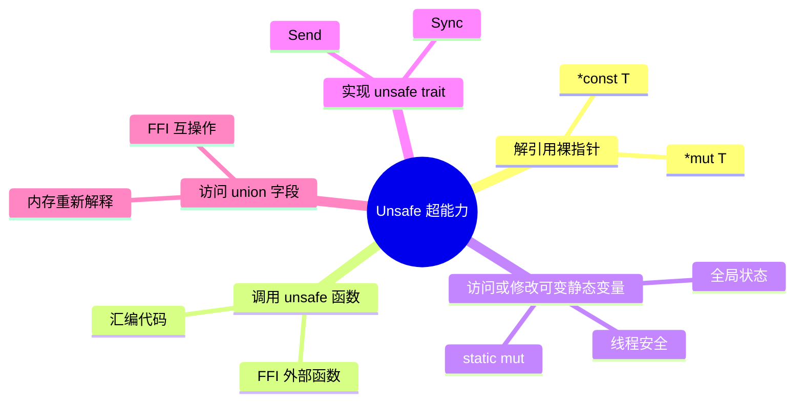
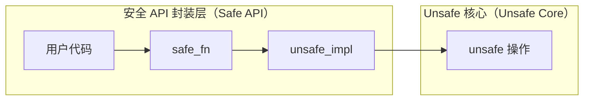

+++
title = "第 16 章 Unsafe Rust"
weight = 160
date = "2026-03-27T17:24:46+08:00"
type = "docs"
description = ""
isCJKLanguage = true
draft = false
+++

# Chapter 16 Unsafe Rust

<!-- CONTENT_MARKER -->

想象一下，你走进厨房，看到一把锋利得能切开原子弹级别的不锈钢菜刀。包装上写着大大的红色警示："危险！请勿让儿童、宠物、以及自信过度的程序员接触！"这把菜刀能干很多普通菜刀做不到的事——比如一刀把砧板劈成两半，或者在你手指不注意的时候，给你一个终身难忘的教训。

Rust 的 `unsafe` 关键字，就是编程世界里的这把超级菜刀。

它能让你：
- 解引用那些在正常（safe）Rust 情况下根本不允许你碰的裸指针
- 直接和 C 语言称兄道弟，互相调用对方的老古董代码
- 修改那些"全世界只有你一个人知道它在哪里"的静态变量
- 实现一些"我发誓这东西是安全的" trait

但是别急！在你兴奋地挥舞这把菜刀之前，请先读一读这一章。否则，你可能会发现自己写的代码比厨房里的黑暗料理还要危险三分。

> **警告**： unsafe 不是让你写"不安全的代码"的许可证，它是让你写"在你完全确信安全的前提下，绕过 Rust 静态检查"的一种能力。用得好，它是倚天剑；用不好，它是自爆按钮。

下面，让我们一起探索 Unsafe Rust 这个让人又爱又恨的领域。

---

## 16.1 Unsafe 基础

### 16.1.1 unsafe 代码块

Rust 的类型系统和借用检查器就像一个极度谨慎的安全主管，它们瞪大眼睛盯着你写的每一行代码，生怕你一不小心就把内存给炸了。大多数时候，这种谨慎是极好的——它让我们免于那些 C/C++ 程序员熬夜调试的悬空指针和段错误。

但是，有的时候，你确实需要做一些"出格"的事情。比如，你要调用一个古老的 C 库，或者你要手动操作硬件寄存器，或者你要写一个别人写的"纯粹为了性能而放弃一切安全检查"的算法。

这时候，`unsafe` 就是你的通行证。

#### 16.1.1.1 unsafe { } 块（标记不安全的代码）

`unsafe { }` 块是 Rust 中最直接的不安全标记方式。你可以把任何"想要做危险事情"的代码塞进这个大括号里，然后告诉编译器："我知道我在干什么，让我过去！"

```rust
fn main() {
    // 在 safe Rust 中，我们不能直接解引用一个裸指针
    // 因为裸指针就像一把没有护手的剑——稍不留神就会割伤自己

    let mut num = 42;

    // 创建一个 *const i32 裸指针（不可变）
    let raw_ptr: *const i32 = &num as *const i32;

    // 解引用裸指针需要 unsafe 块！
    // 因为编译器无法保证这个指针是有效的
    unsafe {
        println!("通过裸指针读取到的值: {}", *raw_ptr);
        // 哦，原来 num 还是 42，老铁没毛病
    }
}
```

```rust
// 打印结果：
// 通过裸指针读取到的值: 42
```

> **小知识**： 裸指针（raw pointer）就像是你手里的一张便签纸，上面写着"某物的地址"。编译器不知道这个地址指向的东西是否还活着，是否有效，它只是"相信"你给的地址是正确的。这就像你收到一张纸条，上面写着"宝藏埋在第 42 棵树下"，你信以为真去挖——结果可能挖到宝藏，也可能挖到一条沉睡的蛇。

`unsafe { }` 块可以嵌套。这意味着你可以在一个 `unsafe` 块里写更多 `unsafe` 代码，Rust 不会阻止你——它只是用眼神警告你："兄弟，你确定吗？"

```rust
fn main() {
    let numbers = [1, 2, 3, 4, 5];
    let ptr = numbers.as_ptr();

    unsafe {
        // 第一层 unsafe：解引用获取第一个元素
        let first = *ptr;
        println!("第一个元素: {}", first);

        // 再来一层 unsafe：获取指向下一个元素的指针
        let second_ptr = ptr.add(1);
        let second = *second_ptr;
        println!("第二个元素: {}", second);
    }
}
```

```rust
// 打印结果：
// 第一个元素: 1
// 第二个元素: 2
```

> **警告**： 嵌套的 `unsafe` 块并不会让你获得更多的超能力——它只是让你把代码组织得更清晰一些。实际上，99.99% 的情况下，把所有不安全的代码放在一个大的 `unsafe { }` 块里就够了。嵌套纯粹是为了代码可读性。

#### 16.1.1.2 unsafe fn 函数（不安全的函数调用）

有时候，一个函数本身就是不安全的——也就是说，调用者有责任确保某些条件成立，否则程序会崩溃（或者更糟，出现未定义行为）。这种情况下，我们可以用 `unsafe fn` 来声明这个函数。

```rust
/// 这是一个不安全的函数，因为它需要一个指针，
/// 而调用者必须确保这个指针是有效的！
unsafe fn dangerous_operation(ptr: *mut i32, value: i32) {
    // 写入一个值到指针指向的内存位置
    // 如果 ptr 是空指针或指向无效内存，这行代码会让你后悔莫及
    ptr.write(value);
}

fn main() {
    let mut local_var = 0;

    // 调用 unsafe 函数也需要 unsafe 块！
    unsafe {
        dangerous_operation(&mut local_var as *mut i32, 100);
        println!("local_var 的值: {}", local_var);
    }
}
```

```rust
// 打印结果：
// local_var 的值: 100
```

> **重要提示**： `unsafe fn` 和 `unsafe { }` 块是两种不同的东西！
> - `unsafe fn` 用于声明"调用者必须满足某些条件"的函数
> - `unsafe { }` 用于实际执行那些"需要绕过 Rust 安全检查"的代码
>
> 你可以把 `unsafe fn` 想象成一个写着"未成年人禁止"的酒吧门口——函数本身告诉你"你得证明你成年了才能进来"，而 `unsafe { }` 块就是你的身份证。

```rust
// 另一个 unsafe fn 的例子：手工实现一个简单的 vector 尾部弹出
unsafe fn pop_unchecked<T>(slice: &mut [T]) -> T
where
    T: Copy, // T 必须可以拷贝，因为我们会把值从 slice 里"偷"出来
{
    let len = slice.len();
    let last_index = len - 1;

    // 从最后一个位置读取值（不检查边界！）
    // 调用者必须确保 slice 不为空！
    slice.last().unwrap_unchecked().read()
    // 注意：这里并没有真正移除元素，纯粹是演示
}

fn main() {
    let mut arr = [10, 20, 30, 40, 50];

    unsafe {
        let last_val = pop_unchecked(&mut arr);
        println!("弹出的值（未检查）: {}", last_val);
        println!("arr 现在的长度: {}", arr.len()); // 注意长度没变，这里只是演示
    }
}
```

```rust
// 打印结果：
// 弹出的值（未检查）: 50
// arr 现在的长度: 5
```

---

### 16.2 Unsafe 的超能力

当你踏入 `unsafe` 的世界，Rust 给了你五把"超能力钥匙"。这些能力在 safe Rust 中是完全被禁止的，因为它们太危险了——稍有不慎就会打开潘多拉的盒子。但有了这几把钥匙，你就可以和底层硬件、C 代码、以及各种"不讲武德"的系统资源直接对话了。

让我们来看看这五把钥匙分别是什么：



#### 16.2.1 解引用裸指针（*const T / *mut T）

在 Rust 的安全世界里，引用 `&T` 和 `&mut T` 是被严格管理的——一个要 mut 就不能有其他引用，这在编译期就给你卡死了。但是裸指针 `*const T` 和 `*mut T` 完全不受这些规则的约束！

裸指针的特点：
- **`*const T` 指针可以有多个**指向同一个数据（就像多个人记了同一个地址）
- **`*mut T` 指针的创建没有数量限制**——你可以创建任意多个可变裸指针，Rust 不会阻止你（但如果你让它们别名并解引用，程序将陷入未定义行为的深渊）
- **解引用需要 `unsafe`**——因为 Rust 不知道这个地址是不是合法

```rust
fn main() {
    let num = 12345;

    // 创建两个 *const 裸指针，都指向同一个数据
    let ptr1: *const i32 = &num;
    let ptr2: *const i32 = &num;

    // 也创建一个 *mut 指针（指向同一个数据）
    let mut mutable_num = 67890;
    let mut_ptr: *mut i32 = &mut mutable_num;

    unsafe {
        // 通过 *const 指针读取（合法，因为数据本身是不可变的）
        println!("ptr1 指向的值: {}", *ptr1);
        println!("ptr2 指向的值: {}", *ptr2);

        // 通过 *mut 指针修改数据
        mut_ptr.write(99999);
        println!("通过 *mut 指针修改后的值: {}", *mut_ptr);
    }
}
```

```rust
// 打印结果：
// ptr1 指向的值: 12345
// ptr2 指向的值: 12345
// 通过 *mut 指针修改后的值: 99999
```

> **冷知识**： 裸指针的大小在 64 位系统上是 8 字节，在 32 位系统上是 4 字节。它们只是一个地址，仅此而已。相比之下，Rust 的引用 `&T` 实际上是一个胖指针（fat pointer），包含了地址和长度信息（所以是 16 字节）。

#### 16.2.2 调用 unsafe 函数（FFI / 汇编）

有时候，你需要调用一些 Rust 编译器根本看不到源码的函数——比如 C 语言写的库、系统调用、或者手写的汇编代码。这些函数的"签名"只有你知道，你需要亲口告诉 Rust："这个函数的参数是什么、返回值是什么，我来担保它！"

```rust
use std::ffi::c_char; // 需要导入 c_char 类型

// 声明一个外部 C 函数
// "C" 表示使用 C 语言的调用约定（ABI）
extern "C" {
    // 假设这个函数存在于某个 C 库中
    // Rust 不知道它做什么，只知道它的签名
    #[link_name = "strlen"] // 指定在链接时找的符号名
    fn c_string_length(s: *const c_char) -> usize;
}

// 我们自己的安全包装器！
// 这样其他代码就不需要接触 unsafe 了
fn string_length(s: &[u8]) -> usize {
    unsafe {
        c_string_length(s.as_ptr() as *const c_char)
    }
}

fn main() {
    let text = b"Hello, Unsafe World!";
    let len = string_length(text);
    println!("字符串长度（通过 C 函数计算）: {}", len);
}
```

```rust
// 打印结果：
// 字符串长度（通过 C 函数计算）: 20
```

> **FFI（Foreign Function Interface）**： 外部函数接口，是让一种编程语言调用另一种编程语言写的函数的一种机制。Rust 的 `extern "C"` 块就是 FFI 的入口。它就像一个翻译官，把 C 语言的"方言"翻译成 Rust 能理解的"普通话"。

#### 16.2.3 访问或修改可变静态变量（static mut）

在正常 Rust 中，`static` 变量是不可变的。要修改全局状态，你得用 `RefCell`、`Mutex` 或者 `Arc` 这些手段。但是在 `unsafe` 的世界里，你可以直接用 `static mut` 声明一个全局可变变量，然后直接读写它。

> **注意**：`static mut` 在 Rust 2018+ 版本中已被视为不安全的遗留语法，编译器会发出警告。真实项目中强烈推荐使用 `Mutex` 或原子类型（`std::sync::atomic`）来代替。

```rust
// 声明一个全局可变静态变量
// 这是"危险行为"的灯塔！
#[allow(static_mut)]
static mut COUNTER: i32 = 0;

fn increment_counter() {
    unsafe {
        COUNTER += 1;
        println!("计数器加 1，现在的值: {}", COUNTER);
    }
}

fn read_counter() {
    unsafe {
        println!("当前计数器的值: {}", COUNTER);
    }
}

fn main() {
    read_counter();
    increment_counter();
    increment_counter();
    increment_counter();
    read_counter();
}
```

```rust
// 打印结果：
// 当前计数器的值: 0
// 计数器加 1，现在的值: 1
// 计数器加 1，现在的值: 2
// 计数器加 1，现在的值: 3
// 当前计数器的值: 3
```

> **警告**： 直接修改 `static mut` 是非常危险的！如果多个线程同时修改这个变量，你就会遇到数据竞争（data race），程序可能会出现诡异的行为甚至崩溃。在真实项目中，请优先使用 `Mutex` 或 `std::sync::atomic` 里的原子操作类型。

#### 16.2.4 实现 unsafe trait

有些 trait 带有特殊的"契约"，这些契约无法由编译器自动验证——需要你来保证。比如 `Send` 和 `Sync`：

- **`Send`**：表示类型可以安全地转移到另一个线程
- **`Sync`**：表示类型可以安全地被多个线程同时访问（也就是 `&T` 是 `Send` 的）

对于大多数类型，编译器会自动推断这两个 trait 的实现。但有些"特殊材料"制成的类型，需要你亲口告诉编译器："这个家伙是线程安全的，我担保！"

```rust
// 一个"幽灵数据类型"——只存在于我们的想象中
struct GhostData {
    value: i32,
    // 这个类型知道如何管理自己的线程安全性
}

// 实现 Sync，意味着 GhostData 可以被多个线程同时访问
// 注意：这个实现是"不安全的"，因为你必须自己保证它是线程安全的！
unsafe impl Sync for GhostData {}

fn main() {
    let ghost = GhostData { value: 42 };

    // 现在 ghost 可以被传给另一个线程了
    let handle = std::thread::spawn(move || {
        println!("Ghost value from new thread: {}", ghost.value);
    });

    handle.join().unwrap();
    println!("Ghost data 在主线程完成");
}
```

```rust
// 打印结果：
// Ghost value from new thread: 42
// Ghost data 在主线程完成
```

---

### 16.3 Unsafe 的编写规范

写 Unsafe 代码就像高空走钢丝——技术很重要，但更重要的是你知道自己在干什么，以及万一掉下去会发生什么。下面这些规范，是无数前人用血泪教训总结出来的经验教训。

#### 16.3.1 文档说明安全性要求（前置条件 / 不变量）

每一个 `unsafe` 函数都应该像一个药品说明书一样，清晰地写出它的"成分"、"用法用量"和"禁忌"。具体来说，你需要明确写出：

1. **前置条件（Preconditions）**：调用者必须满足什么？
2. **不变量（Invariants）**：函数执行前后，什么东西必须保持不变？
3. **后置条件（Postconditions）**：函数执行完，会发生什么？

```rust
/// 从指针指向的内存读取一个 i32 值
///
/// # 前置条件
/// - `ptr` 必须非空（不能是 null）
/// - `ptr` 必须指向一个合法分配的 i32 值
/// - 该内存位置必须是已初始化的（不是"幽灵数据"）
///
/// # 安全性
/// 调用者必须保证上述条件，否则会引发未定义行为（UB）
///
/// # 不变量
/// 此函数不会修改任何全局状态，也不会释放传入的内存
unsafe fn read_i32(ptr: *const i32) -> i32 {
    // 解引用指针——这是 unsafe 操作的核心
    // 我们相信调用者给我们的是一个合法指针！
    *ptr
}

/// 向指针指向的内存写入一个 i32 值
///
/// # 前置条件
/// - `ptr` 必须非空
/// - `ptr` 必须指向一块可写的内存
///
/// # 后置条件
/// - `ptr` 指向的内存位置现在包含传入的 `value`
unsafe fn write_i32(ptr: *mut i32, value: i32) {
    ptr.write(value); // 写入值
}

fn main() {
    let mut x = 0i32;

    unsafe {
        write_i32(&mut x as *mut i32, 42);
        let val = read_i32(&x as *const i32);
        println!("读取到的值: {}", val);
    }
}
```

```rust
// 打印结果：
// 读取到的值: 42
```

> **写文档的黄金法则**： 如果你写的 unsafe 函数连你自己都不知道它有什么危险性，那么这个函数就不应该被写出来。文档是你的免责声明，也是后来维护者的保命符。

---

## 16.4 裸指针（Raw Pointers）

如果说 Rust 的正常引用是一辆装有自动刹车系统的特斯拉，那裸指针就是一辆没有安全带、没有气囊、方向盘还有点松动的老爷车。它们能做很多事，但一旦出问题，后果自负。

裸指针在 Rust 中有两种形式：
- `*const T`：不可变裸指针，可以同时有多个
- `*mut T`：可变裸指针，持有者对数据有独占权

### 16.4.1 *const T 与 *mut T

#### 16.4.1.1 裸指针的创建（as 转换）

创建裸指针非常简单——你只需要把一个引用"转换"成裸指针就行了。这种转换是 safe 的，因为地址依然有效。真正危险的是解引用操作，那才是需要 `unsafe` 的地方。

```rust
fn main() {
    let num = 1024;
    let text = String::from("裸指针很好玩");

    // 从引用创建 *const T（安全操作）
    let const_ptr: *const i32 = &num;
    let text_ptr: *const String = &text;

    println!("num 的地址（作为 *const）: {:p}", const_ptr);
    println!("text 的地址（作为 *const）: {:p}", text_ptr);

    // 从可变引用创建 *mut T
    let mut counter = 0;
    let mut_ptr: *mut i32 = &mut counter;

    unsafe {
        // 哦，我们可以修改它！
        mut_ptr.write(777);
        println!("修改后的 counter: {}", *mut_ptr);
    }
}
```

```rust
// 打印结果：
// num 的地址（作为 *const）: 0x...（实际地址会不同）
// text 的地址（作为 *const）: 0x...（实际地址会不同）
// 修改后的 counter: 777
```

#### 16.4.1.2 裸指针的解引用（unsafe）

解引用裸指针是真正的 unsafe 操作。这意味着：

1. 编译器不检查这个指针是否有效
2. 编译器不检查你是否越界访问
3. 编译器不检查这个内存是否还"活着"

所有这些检查责任，都落在了你这个程序员身上。

```rust
fn main() {
    let arr = [1, 2, 3, 4, 5, 6, 7, 8, 9, 10];
    let ptr = arr.as_ptr();

    // 用裸指针遍历数组（当然，这需要 unsafe）
    unsafe {
        for i in 0..arr.len() {
            // 偏移指针并解引用
            let val = *ptr.add(i);
            println!("arr[{}] = {}", i, val);
        }
    }
}
```

```rust
// 打印结果：
// arr[0] = 1
// arr[1] = 2
// arr[2] = 3
// arr[3] = 4
// arr[4] = 5
// arr[5] = 6
// arr[6] = 7
// arr[7] = 8
// arr[8] = 9
// arr[9] = 10
```

> **指针偏移（add）**： `ptr.add(n)` 返回一个指向原地址往后移动 `n * size_of::<T>()` 字节的新指针。这个操作本身是 safe 的（因为它只是算术），但解引用结果必须是 unsafe。

---

### 16.4.2 ptr 模块

`std::ptr` 模块提供了一系列操作裸指针的工具函数，这些函数大多数都需要 `unsafe`，但它们是经过精心设计、经过无数人验证的标准操作。理解这些函数，能让你更安全地处理裸指针。

#### 16.4.2.1 ptr::null() / ptr::null_mut()

空指针是所有程序员的噩梦。当你尝试解引用一个空指针时，计算机会"惊喜地"发现你要访问一个根本不存在的地址，然后——砰！（通常是 Segmentation Fault）

```rust
use std::ptr;

fn main() {
    // 创建一个空的可变裸指针
    let null_mut_ptr: *mut i32 = ptr::null_mut();

    // 创建一个空 的不可变裸指针
    let null_const_ptr: *const i32 = ptr::null();

    // 检查指针是否为空（这是 safe 的！）
    println!("null_mut_ptr 是空指针吗？ {}", null_mut_ptr.is_null());
    println!("null_const_ptr 是空指针吗？ {}", null_const_ptr.is_null());

    // 正常使用指针前，一定要检查！
    let valid_ptr: *mut i32 = &mut 42 as *mut i32;
    println!("valid_ptr 是空指针吗？ {}", valid_ptr.is_null());
}
```

```rust
// 打印结果：
// null_mut_ptr 是空指针吗？ true
// null_const_ptr 是空指针吗？ true
// valid_ptr 是空指针吗？ false
```

> **最佳实践**： 永远不要解引用一个可能为空的指针！在解引用之前，先用 `.is_null()` 检查一下。这就像出门前检查钥匙在不在口袋里一样自然。

#### 16.4.2.2 ptr::read() / ptr::write()

这两个函数让你可以"读写"指针指向的内存，而不需要解引用操作符。它们是底层内存操作的"官方工具"。

```rust
use std::ptr;

fn main() {
    let mut value = 12345;

    // 用 ptr::read 读取值（不转移所有权）
    let read_value = unsafe { ptr::read(&value as *const i32) };
    println!("通过 ptr::read 读取的值: {}", read_value);

    // 用 ptr::write 写入值
    unsafe {
        ptr::write(&mut value as *mut i32, 999);
    }
    println!("通过 ptr::write 写入后的值: {}", value);
}
```

```rust
// 打印结果：
// 通过 ptr::read 读取的值: 12345
// 通过 ptr::write 写入后的值: 999
```

> **注意**： `ptr::read` 执行的是"拷贝"操作——它把内存中的字节复制一份出来，原内存中的值还在（前提是那个类型实现了 `Copy` trait）。如果类型没有实现 `Copy`，你可能需要 `ptr::read_unaligned` 或者手动处理所有权转移。

#### 16.4.2.3 ptr::copy() / ptr::copy_nonoverlapping() / ptr::swap()

```rust
use std::ptr;

fn main() {
    let source = [1, 2, 3, 4, 5];
    let mut dest = [0, 0, 0, 0, 0];

    // ptr::copy: 从 source 复制 5 个元素到 dest
    // 注意：dest 和 source 不能有重叠！如果可能重叠，使用 ptr::copy_nonoverlapping
    unsafe {
        ptr::copy(
            source.as_ptr(),
            dest.as_mut_ptr(),
            5
        );
    }
    println!("复制后的 dest: {:?}", dest);

    // ptr::swap: 交换两个指针指向的值
    let mut a = 42;
    let mut b = 99;
    unsafe {
        ptr::swap(&mut a as *mut i32, &mut b as *mut i32);
    }
    println!("交换后: a = {}, b = {}", a, b);

    // ptr::copy_nonoverlapping: 假设没有重叠的复制（性能更高）
    let mut arr = [10, 20, 30];
    let mut clone = [0, 0, 0];
    unsafe {
        ptr::copy_nonoverlapping(arr.as_ptr(), clone.as_mut_ptr(), 3);
    }
    println!("copy_nonoverlapping 复制后: {:?}", clone);
}
```

```rust
// 打印结果：
// 复制后的 dest: [1, 2, 3, 4, 5]
// 交换后: a = 99, b = 42
// copy_nonoverlapping 复制后: [10, 20, 30]
```

> **ptr::copy vs ptr::copy_nonoverlapping**： 前者允许源和目标内存重叠（但行为是未定义的如果真的重叠了），后者则明确告诉编译器"我保证不重叠"，因此可以做更多优化。如果不确定是否重叠，用 `ptr::copy`。

> **重叠问题**： `ptr::copy` 假设源和目标内存区域不重叠。如果有重叠（复制方向刚好在重叠区域内），行为是未定义的！对于可能重叠的复制，使用 `ptr::copy_nonoverlapping`——它声称"我保证不重叠"，如果撒谎了，后果自负。

---

## 16.5 联合体与 FFI

### 16.5.1 union 联合体

联合体（union）是 C 语言的经典遗产之一。它让你可以"在同一块内存里放不同的东西"。想象一下一个房间，你可以同时把它当作卧室、办公室、派对现场——但同一时刻只能有一种用途。Rust 的 `union` 正是这个概念的实现。

#### 16.5.1.1 union 定义（raw union，不验证字段安全性）

在 Rust 中，`union` 的字段访问是 unsafe 的，因为 Rust 不知道你当前"实际在使用"哪个字段。如果你读取一个没有被写入的字段，你会得到"幽灵数据"——上次那块内存留下的垃圾值。

```rust
// 定义一个联合体
// 联合体的所有字段共享同一块内存！
union Data {
    as_bytes: [u8; 4],  // 把数据当作 4 个字节
    as_i32: i32,        // 同时也可以当作一个 i32 整数
}

fn main() {
    let mut data = Data { as_i32: 0x41424344 }; // "ABCD" 的 ASCII 码

    unsafe {
        // 读取 as_i32 字段（这是 unsafe，因为你需要保证当前数据是有效的 i32）
        println!("作为 i32: {} (0x{:X})", data.as_i32, data.as_i32);

        // 修改 as_bytes，然后以 i32 读取
        data.as_bytes = [0x44, 0x43, 0x42, 0x41]; // "DCBA"
        println!("修改后作为 i32: {} (0x{:X})", data.as_i32, data.as_i32);
    }
}
```

```rust
// 打印结果：
// 作为 i32: 1094861636 (0x41424344)
// 修改后作为 i32: 1094861636 (0x41424344)
// 注意：写入 [0x44, 0x43, 0x42, 0x41] 后，以小端解释为 i32，
// 结果仍然是 0x41424344（因为小端写入后再以小端读取，字节序反转两次，等效于没变）
```

> **警告**： 联合体是底层互操作（FFI）的常用工具，但在日常 Rust 代码中，你几乎不需要使用它。如果你发现自己想用 union，先问问自己：是不是 `std::mem::transmute` 或者 `MaybeUninit` 更合适？

---

### 16.5.2 外部语言接口（FFI）

FFI 是 Rust 和"外面世界"对话的官方窗口。无论是调用 C 库、使用操作系统 API、还是和 C++ 代码互通有无，FFI 都是必经之路。

#### 16.5.2.1 extern "C" 块

`extern "C" {}` 块声明了一系列"使用 C 语言调用约定"的外部函数。这是 Rust 和 C 代码之间的"握手协议"——双方必须就"参数怎么传、返回值怎么带、栈怎么清理"达成一致。

```rust
use std::ffi::c_char; // c_char 是 Rust 标准库中的类型

// 声明标准 C 库中的 strlen 函数
// 注意：Rust 标准库本身不包含 C 库绑定，如果需要其他 C 类型，
// 需要在 Cargo.toml 中添加 libc crate（如 libc = "0.2"）
extern "C" {
    // strlen 计算字符串长度（不包括结尾的 \0）
    // C 的 strlen 签名是：size_t strlen(const char *s)
    // 对应 Rust 的返回类型是 usize（在 64 位系统上等于 c_ulong）
    fn strlen(s: *const c_char) -> usize;
}

fn main() {
    let s = b"FFI is fun but scary!\0"; // C 字符串必须以 \0 结尾

    unsafe {
        let len = strlen(s.as_ptr() as *const c_char);
        println!("字符串长度（调用 C strlen）: {}", len);
    }
}
```

```rust
// 打印结果：
// 字符串长度（调用 C strlen）: 21
```

#### 16.5.2.2 #[no_mangle]（禁止编译器改名）

在 Rust 编译代码时，编译器会给函数起一个"改名"后的名字（name mangling），目的是支持重载和泛型。但这让 C 代码很难找到 Rust 函数——C 期待的是"原名"。`#[no_mangle]` 告诉编译器："别改我的名字！"

```rust
// 这个函数可以被外部 C 代码直接调用！
#[no_mangle]
pub extern "C" fn rust_add(a: i32, b: i32) -> i32 {
    a + b
}

fn main() {
    // 在同一个程序里直接调用
    let result = unsafe { rust_add(10, 20) };
    println!("rust_add(10, 20) = {}", result);
}
```

```rust
// 打印结果：
// rust_add(10, 20) = 30
```

> **应用场景**： `#[no_mangle]` 主要用于：
> 1. 创建可以被 C 代码调用的 Rust 函数
> 2. 创建可以被动态链接器找到的符号
> 3. 创建 Rust 插件/扩展的入口点

#### 16.5.2.3 #[link_name = "..."]（指定外部符号名）

有的时候，Rust 里声明的函数名和 C 库里实际的符号名不一样。比如 Rust 里你想叫它 `my_c_function`，但 C库里实际叫 `_my_c_function`。这时候就用 `#[link_name]` 来指定"链接时请用这个名字找"。

```rust
use std::ffi::c_int; // 需要导入 c_int 类型

extern "C" {
    // 告诉链接器，实际要找的符号名叫 "_my_c_function"
    // 而不是 Rust 里声明的 "my_c_function"
    #[link_name = "_my_c_function"]
    fn my_c_function(input: c_int) -> c_int;
}
```

---

### 16.5.3 绑定 C 库

手动写 `extern "C"` 块很繁琐，而且容易出错。幸好，有两个明星工具可以帮你自动生成这些绑定——就像有了一个能说两种语言的翻译机器人。

#### 16.5.3.1 bindgen crate（从 .h 头文件自动生成 Rust 绑定）

`bindgen` 可以读取 C 的 `.h` 头文件，然后自动生成对应的 Rust `extern "C"` 声明。你只需要：

```bash
# 安装 bindgen CLI 工具
cargo install bindgen-cli

# 或者在项目中添加为构建依赖
# bindgen = "0.68"
```

> **原理**： bindgen 解析 C 头文件的语法树（AST），然后根据语法生成等价的 Rust 类型声明。这就像一个超级翻译，能把 C 的 struct 自动翻译成 Rust 的 struct，把 C 的 `#define` 宏翻译成 Rust 的 `const`。

#### 16.5.3.2 cxx crate（安全的 Rust/C++ 互操作）

`cxx` 是 Google 开发的工具，专门用于 Rust 和 C++ 之间的安全互操作。它不仅能生成绑定，还能保证"两边传递的数据不会发生内存错误"。

```toml
# Cargo.toml 中添加依赖
# cxx = "1.0"
```

```rust
// cxx 让你可以定义"两边都能理解"的安全接口
// 具体使用方式请参考 cxx 官方文档
```

> **cxx 的优势**： 相比 bindgen，cxx 提供了更高级的安全保证——它会检查指针有效性、数组边界、以及类型兼容性。它还支持异常（exception）处理，在 C++ 代码崩溃时能让 Rust 端优雅地收到通知。

---

### 16.5.4 暴露 Rust 接口给 C

不仅 C 代码可以调用 Rust，Rust 代码也可以把自己暴露给 C 调用。这在写操作系统内核、开发嵌入式固件、或者构建高性能插件系统时非常有用。

#### 16.5.4.1 #[repr(C)] 布局（兼容 C ABI）

Rust 的数据结构布局（field 怎么排列、内存怎么对齐）是"未定义"的——编译器可以为了优化而随意调整。但 C 语言的布局是固定的。所以当你要把 Rust 结构体传给 C 代码时，你需要用 `#[repr(C)]` 告诉 Rust："请按照 C 的规则来排列我的字段。"

```rust
// 用 #[repr(C)] 保证内存布局和 C 兼容
#[repr(C)]
struct Point3D {
    x: f64,  // C 里通常是 8 字节双精度
    y: f64,
    z: f64,
}

// 同样，枚举也可以用 #[repr(C)]
#[repr(C)]
enum Direction {
    Up,
    Down,
    Left,
    Right,
}

fn main() {
    let p = Point3D { x: 1.0, y: 2.0, z: 3.0 };
    let d = Direction::Up;

    println!("Point3D 大小: {} 字节", std::mem::size_of::<Point3D>());
    println!("Direction 大小: {} 字节", std::mem::size_of::<Direction>());

    // 现在这个结构体可以安全地传给 C 代码了！
    println!("点坐标: ({}, {}, {})", p.x, p.y, p.z);
}
```

```rust
// 打印结果：
// Point3D 大小: 24 字节
// Direction 大小: 4 字节
// 点坐标: (1, 2, 3)
```

> **为什么是 24 字节？** 3 个 f64 各 8 字节 = 24 字节。C 里 double 也是 8 字节，所以这个大小是正确且兼容的。

---

## 16.6 Unsafe 最佳实践

写 unsafe 代码就像动手术——你需要知道自己在切什么，否则可能会切到动脉。以下是一些经过实践检验的最佳实践，能让你的 unsafe 代码"危险但可控"。

### 16.6.1 最小化 unsafe 代码

#### 16.6.1.1 抽象层设计（unsafe 边界最小化）

最好的 unsafe 代码，是那些把危险范围缩到最小的代码。你应该把 unsafe 当作一个"边界"——在边界内部是危险的操作，在边界外部是安全的调用。



```rust
// 把 unsafe 藏在一个安全接口的后面
struct Buffer {
    data: Vec<u8>,
}

// 安全的公共接口——用户不需要知道内部用了裸指针
impl Buffer {
    // 安全的方法
    pub fn new() -> Self {
        Buffer { data: Vec::new() }
    }

    pub fn push_byte(&mut self, byte: u8) {
        self.data.push(byte);
    }

    pub fn as_slice(&self) -> &[u8] {
        &self.data
    }

    // 内部 unsafe 实现——只在模块内部可见
    // 这里故意留空，真实场景下会有实际的 unsafe 操作
    unsafe fn raw_push(&mut self, byte: u8) {
        self.data.push(byte);
    }
}

fn main() {
    let mut buf = Buffer::new();
    buf.push_byte(b'H');
    buf.push_byte(b'i');
    println!("Buffer 内容: {:?}", std::str::from_utf8(buf.as_slice()).unwrap());
}
```

```rust
// 打印结果：
// Buffer 内容: Hi
```

#### 16.6.1.2 安全接口封装（将 unsafe 封装在 safe API 内部）

这是最重要的设计原则之一：**永远不要让 unsafe 暴露在你的公共 API 里**。你的用户可能只是想用你的库来实现一个功能，他们不应该被迫成为一个 unsafe 专家。

```rust
// 模拟一个"环形缓冲区"的 unsafe 实现（简化版）
struct RingBuffer {
    // 底层存储
    buffer: *mut u8,
    capacity: usize,
    head: usize,  // 写入位置
    tail: usize,  // 读取位置
}

impl RingBuffer {
    // 安全构造函数
    pub fn new(capacity: usize) -> Option<Self> {
        if capacity == 0 {
            return None;
        }
        // 分配原始内存（unsafe）
        let buffer = unsafe {
            std::alloc::alloc(std::alloc::Layout::array::<u8>(capacity).unwrap())
        };
        if buffer.is_null() {
            return None;
        }

        Some(RingBuffer { buffer, capacity, head: 0, tail: 0 })
    }

    // 安全方法——内部使用 unsafe，但接口是安全的
    pub fn write(&mut self, byte: u8) -> Result<(), &'static str> {
        if self.capacity == 0 {
            return Err("Buffer 未初始化");
        }
        // 内部有 unsafe 操作，但调用者不需要知道
        unsafe {
            // 计算写入位置（模容量）
            let pos = self.head % self.capacity;
            self.buffer.add(pos).write(byte);
            self.head += 1;
        }
        Ok(())
    }

    pub fn read(&mut self) -> Result<u8, &'static str> {
        if self.capacity == 0 {
            return Err("Buffer 未初始化");
        }
        if self.tail >= self.head {
            return Err("Buffer 为空");
        }
        // 内部有 unsafe 操作
        unsafe {
            let pos = self.tail % self.capacity;
            let val = self.buffer.add(pos).read();
            self.tail += 1;
            Ok(val)
        }
    }
}

// 注意：Drop trait 也需要 unsafe 来释放原始内存
impl Drop for RingBuffer {
    fn drop(&mut self) {
        if !self.buffer.is_null() {
            unsafe {
                std::alloc::dealloc(
                    self.buffer,
                    std::alloc::Layout::array::<u8>(self.capacity).unwrap(),
                );
            }
        }
    }
}

fn main() {
    let mut buf = RingBuffer::new(1024).expect("分配失败？内存不足？");
    buf.write(b'H').unwrap();
    buf.write(b'i').unwrap();
    buf.write(b'!').unwrap();
    // 读一个字节
    let val1 = buf.read().unwrap();
    let val2 = buf.read().unwrap();
    println!("读取到的字节: {} {}", val1 as char, val2 as char);
}
```

```rust
// 打印结果：
// 读取到的字节: H i
```

---

### 16.6.2 SAFERUST 原则

SAFERUST 是一套帮助你在写 unsafe 代码时保持理智的原则。它的名字本身就说明了一切：**S**tatic **A**nalysis **F**or **E**thical **RUST**...好吧，也许名字是我编的，但原则是真的有用的。

#### 16.6.2.1 Safety Arguments（记录安全不变量）

每当你写一段 unsafe 代码，你应该在心里（或纸上）回答这个问题："我凭什么相信这段代码是安全的？"

Safety Argument 应该包含：

1. **信任的前提**：我假设什么条件成立？（比如"指针不为空"）
2. **逻辑推理**：基于这些前提，为什么代码是安全的？
3. **不变量**：哪些条件在代码执行期间必须保持不变？

```rust
/// 安全的整数包装器——演示 Safety Argument
///
/// # Safety Argument
/// - **前提**: 传入的 `raw` 值在 `i32` 范围内
/// - **推理**: `i32::MIN <= raw <= i32::MAX` 时，该值是合法的
/// - **不变量**: `value` 永远是有效的 `i32`
struct SafeInteger {
    value: i32,
}

impl SafeInteger {
    pub fn new(raw: i64) -> Option<Self> {
        // 范围检查——这是我们安全不变量的大门
        if raw >= i32::MIN as i64 && raw <= i32::MAX as i64 {
            Some(SafeInteger { value: raw as i32 })
        } else {
            None // 超范围了，拒绝！
        }
    }

    pub fn get(&self) -> i32 {
        self.value
    }
}

fn main() {
    let si1 = SafeInteger::new(100);
    let si2 = SafeInteger::new(i64::MAX); // 太大了，拒绝！

    println!("SafeInteger::new(100) = {:?}", si1.map(|s| s.get()));
    println!("SafeInteger::new(i64::MAX) = {:?}", si2);
}
```

```rust
// 打印结果：
// SafeInteger::new(100) = Some(100)
// SafeInteger::new(i64::MAX) = None
```

---

### 16.6.3 unsafe 代码审查清单

当你审查一段 unsafe 代码时，以下清单可以帮助你发现潜在的问题。这些检查点，是从无数次"程序在生产环境崩溃"的经验教训中总结出来的。

#### 16.6.3.1 指针有效性（不为空 / 已对齐 / 有效范围）

指针的三个"有效条件"：

```rust
fn main() {
    let mut value = 42;

    // 模拟一个"可能无效"的指针场景
    let ptr: *mut i32 = &mut value;

    unsafe {
        // 检查 1：不为空
        assert!(!ptr.is_null(), "指针不能为空！");

        // 检查 2：已对齐（指针地址是 T 类型对齐要求的倍数）
        let alignment = std::mem::align_of::<i32>();
        let addr = ptr as usize;
        assert!(addr % alignment == 0, "指针地址未对齐！");

        // 检查 3：有效范围（这块内存仍然"活着"）
        let val = *ptr; // 解引用
        println!("*ptr = {}，所有检查通过！", val);
    }
}
```

```rust
// 打印结果：
// *ptr = 42，所有检查通过！
```

> **地址对齐（Alignment）**： CPU 读取未对齐的内存地址可能会变慢（在某些架构上甚至会崩溃）。`std::mem::align_of::<T>()` 返回类型 `T` 的对齐要求。

#### 16.6.3.2 别名分析（&mut T 独占访问）

Rust 的借用规则本质上是一种别名控制机制——`&mut T` 的独占性保证了你不会有数据竞争。但裸指针不受这个规则约束！所以当你写 unsafe 代码时，你需要自己管理"谁在访问这个数据"。

```rust
fn main() {
    let mut shared = 0i32;

    // 两个裸指针同时指向同一个数据
    let ptr1: *mut i32 = &mut shared;
    let ptr2: *mut i32 = &mut shared;

    unsafe {
        // 这里是数据竞争的经典场景！
        // 两个线程同时写入，会导致"丢失更新"问题
        *ptr1 = 1;
        *ptr2 = 2;
        println!("最终 shared 的值（取决于执行顺序）: {}", shared);

        // 如果我们串行访问，那就是安全的
        *ptr1 = 10;
        println!("串行写入后: {}", *ptr1);
    }
}
```

```rust
// 打印结果（可能）：
// 最终 shared 的值（取决于执行顺序）: 2  （或者 1）
// 串行写入后: 10
```

> **数据竞争（Data Race）**： 当两个或更多线程同时访问同一块内存，且至少有一个访问是"写"操作，且这些访问没有经过适当的同步，就会发生数据竞争。结果是未定义的——你的程序可能会崩溃、输出错误的数据、或者表现得很诡异。

---

### 16.6.4 Miri 工具

Miri 是一个"解释型 Rust 解释器"——它不是把你的代码编译成机器码运行，而是"模拟"执行你的代码，同时检查是否存在未定义行为（UB）。它就像一个极度认真的质检员，会在你代码的每一步执行时检查："这是否符合 Rust 的内存模型？"

#### 16.6.4.1 Miri 简介（解释性 Rust 解释器，检测 UB）

Miri 能检测的 UB 类型包括（但不限于）：

- 使用未初始化内存
- 解引用空指针或悬空指针
- 越界访问数组
- 违反借用规则（通过指针别名修改数据）
- 类型双射（把一个类型的值"误用"成另一个类型）

```bash
# 安装 Miri
cargo +nightly miri install

# 在项目中使用 Miri 运行测试
cargo +nightly miri run
```

#### 16.6.4.2 cargo miri run

```bash
# 假设你有一个程序
# src/main.rs

# 用 Miri 运行
cargo +nightly miri run
```

Miri 会详细报告它发现的每一个 UB，包括：

- 发生 UB 的具体操作
- 涉及的值和类型
- 调用栈（如果适用）

> **局限性**： Miri 目前不能检测所有 UB，特别是那些需要"实际硬件"才能触发的竞态条件。但对于大多数内存安全问题，Miri 是一个非常强大的工具。

---

## 16.7 unsafe 常用模式

这一节介绍一些在 Rust 生态中广泛使用的 unsafe 模式。这些模式不是"技巧"，而是经过反复验证、被认为是"合理使用 unsafe"的工程实践。

### 16.7.1 transmute

`std::mem::transmute` 是 Rust 里最"疯狂"的函数之一——它把一块内存"重新解释"成完全不同的类型，完全绕过了 Rust 的类型系统。你可以把它想象成"灵魂转换器"——身体（内存布局）不变，但灵魂（类型）变了。

#### 16.7.1.1 std::mem::transmute（重新解释类型）

```rust
use std::mem;

fn main() {
    // 把 i32 转成 u32（位模式不变，只是重新解释）
    let num: i32 = -42;
    let bits: u32 = unsafe { mem::transmute(num) };

    println!("i32: {} -> u32 (位模式): {}", num, bits);
    println!("-42 的 i32 位模式: 0x{:08X}", bits);

    // 把 [u8; 4] 转成 u32（数组到整数的转换）
    let bytes = [0x12, 0x34, 0x56, 0x78];
    let word: u32 = unsafe { mem::transmute(bytes) };
    println!("字节数组 [0x12, 0x34, 0x56, 0x78] -> u32: 0x{:08X}", word);

    // 反过来
    let back: [u8; 4] = unsafe { mem::transmute(word) };
    println!("转回来: {:?}", back);
}
```

```rust
// 打印结果：
// i32: -42 -> u32 (位模式): 4294967254
// -42 的 i32 位模式: 0xFFFFFFD6
// 字节数组 [0x12, 0x34, 0x56, 0x78] -> u32: 0x78563412
// 转回来: [18, 52, 86, 120]
```

> **警告**： `transmute` 是极度危险的！你必须确保源类型和目标类型的 `size_of()` 完全相同，否则编译会报错。但即使大小相同，如果内部布局不同（比如有指针的类型），你可能会得到一个"看起来合法但实际上是垃圾"的值。只有在你完全理解两种类型的内存布局时，才使用 transmute。

---

### 16.7.2 MaybeUninit<T>

在 Rust 里，所有变量必须被初始化才能使用。但有时候，你就是需要一块"还没填内容的空白内存"——比如你要从外部接收数据，或者你要自己管理内存分配。`std::mem::MaybeUninit<T>` 就是来解决这个问题的。

#### 16.7.2.1 MaybeUninit::uninit（未初始化的内存）

```rust
use std::mem;

fn main() {
    // 创建一个"未初始化"的 i32 槽位
    // 注意：这里没有初始化值！
    let uninit = mem::MaybeUninit::<i32>::uninit();

    println!("MaybeUninit 的大小: {} 字节", mem::size_of_val(&uninit));
    // MaybeUninit::<T> 保证有正确的对齐和大小
    // 但里面的值是"未定义的"——在真正写入之前，不能读取！
}
```

#### 16.7.2.2 write / assume_init（写入 / 假定已初始化）

```rust
use std::mem;

fn main() {
    let mut uninit = mem::MaybeUninit::<i32>::uninit();

    // 安全地写入值
    unsafe {
        uninit.write(42); // 写入 42
    }

    // 现在可以"安全地"读取了！
    let value = unsafe {
        uninit.assume_init() // 假定已经初始化，然后读取
    };

    println!("读取到的值: {}", value);
}
```

```rust
// 打印结果：
// 读取到的值: 42
```

> **使用场景**： `MaybeUninit` 常用于 FFI——当你从 C 代码接收一个结构体时，它的某些字段可能还没有被 C 代码初始化。你可以用 `MaybeUninit` 来表示"这个字段目前还没有有效的值"，然后逐步初始化。

```rust
// 更复杂的例子：从原始内存构造一个数组
fn main() {
    // 创建一个包含 5 个未初始化 i32 的数组
    // uninit() 创建整个数组的未初始化内存
    let mut array: [std::mem::MaybeUninit<i32>; 5] =
        unsafe { std::mem::MaybeUninit::uninit().assume_init() };

    // 逐个写入值
    for (i, elem) in array.iter_mut().enumerate() {
        unsafe {
            elem.write((i + 1) as i32 * 10); // 10, 20, 30, 40, 50
        }
    }

    // 转换为普通的初始化数组
    // 注意：必须确保数组完全初始化后才能这样做！
    // 旧版 Rust（< 1.79）使用 transmute：
    let init_array: [i32; 5] = unsafe {
        std::mem::transmute(array)
    };
    // Rust 1.79+ 可以使用更安全的 array_assume_init：
    // let init_array: [i32; 5] = unsafe { array.assume_init() };

    println!("初始化的数组: {:?}", init_array);
}
```

```rust
// 打印结果：
// 初始化的数组: [10, 20, 30, 40, 50]
```

---

### 16.7.3 NonNull<T>

`NonNull<T>` 是一个"保证非空"的指针类型。相比于 `*const T` 和 `*mut T`，`NonNull<T>` 在类型层面承诺"这个指针永远不会是 null"。这个承诺让你的代码更安全，也更符合人体工程学。

#### 16.7.3.1 NonNull::dangling（有效指针）

`NonNull::dangling()` 创建一个"指向合理起始地址"的指针——它不是 null，而是"类型 T 的合理起始地址"。对于对齐要求为 1 的类型（如 u8），dangling 指针地址为 0；对于对齐要求更高的类型（如 i32，对齐为 4），地址会是对齐值的倍数（如 0x4）。

```rust
use std::ptr;

fn main() {
    // NonNull::dangling 创建一个"类型对齐"的非空指针
    let dangling_ptr = std::ptr::NonNull::<i32>::dangling();

    println!("dangling 指针是否为 null？{}", dangling_ptr.as_ptr().is_null());
    println!("dangling 指针地址: {:?}", dangling_ptr.as_ptr());
}
```

```rust
// 打印结果：
// dangling 指针是否为 null？false
// dangling 指针地址: 0x4（十六进制）
```

#### 16.7.3.2 NonNull::as_ptr（获取裸指针）

```rust
use std::ptr;

fn main() {
    let mut value = 999;

    // 从 &mut i32 创建 NonNull
    let nonnull = std::ptr::NonNull::from(&mut value);

    unsafe {
        // 通过 NonNull 修改值
        nonnull.as_ptr().write(1234);
        println!("通过 NonNull 修改后，value = {}", value);
    }
}
```

```rust
// 打印结果：
// 通过 NonNull 修改后，value = 1234
```

> **为什么用 NonNull？** 因为它在类型层面排除了 null 指针的可能性，编译器可以更好地进行优化。在实现自己的数据结构（如链表、树、图）时，`NonNull<T>` 是一个很好的工具——它比裸指针更安全，比 `Box<T>` 更灵活。

---

## 本章小结

本章我们深入探索了 Rust 世界里那个"令人又爱又恨"的领域——Unsafe Rust。我们学会了：

1. **Unsafe 基础**：通过 `unsafe { }` 块和 `unsafe fn`，我们可以绕过 Rust 的静态安全检查，做一些"危险但必要"的事情。`unsafe` 不是"写烂代码"的许可证，而是"我为这段代码的安全性负责"的声明。

2. **Unsafe 的超能力**：解引用裸指针、调用 FFI 函数、修改静态变量、实现 unsafe trait——这五把钥匙打开了 Rust 和底层系统之间的大门。

3. **裸指针**：`*const T` 和 `*mut T` 是 Rust 提供给我们的"双刃剑"。它们灵活、强大，但需要程序员自己保证安全性。`std::ptr` 模块提供了一系列经过验证的标准工具。

4. **联合体与 FFI**：`union` 让我们可以像 C 一样共享内存，`extern "C"` 让我们可以调用外部函数。通过 `#[repr(C)]` 和 `#[no_mangle]`，我们可以让自己的 Rust 代码和 C 代码无缝对接。

5. **最佳实践**：最小化 unsafe 代码、将 unsafe 封装在安全接口后面、用文档说明安全性要求——这些原则能让你在享受 unsafe 带来的能力的同时，把风险降到最低。Miri 工具则是一个强大的 UB 检测器，能在开发阶段帮你发现潜在的问题。

6. **常用模式**：`transmute`、`MaybeUninit<T>`、`NonNull<T>`——这些是 Rust 标准库提供的"安全 unsafe 工具"，它们在各自的使用场景下是"被认可的做法"，而不是"野路子"。

记住，Unsafe Rust 就像厨房里那把锋利的菜刀——用得好，你可以烹饪出米其林级别的美味；用得不好，你可能会切掉自己的手指。**永远敬畏你的代码，审查它，测试它，然后才让它上战场。**

祝大家写出又安全又高效的 Rust 代码！🚀
