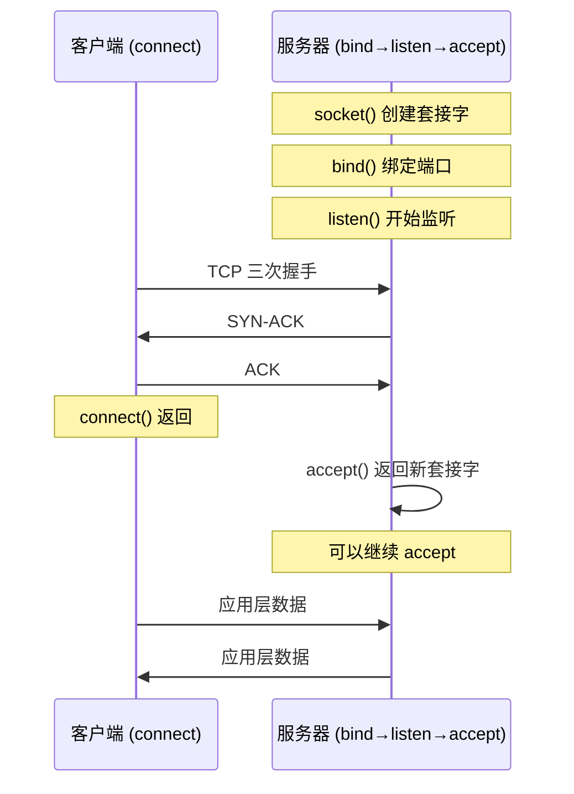

+++
title = "第 19 章 系统编程"
weight = 190
date = "2026-03-27T17:24:46+08:00"
type = "docs"
description = ""
isCJKLanguage = true
draft = false
+++

# Chapter 19 系统编程

想象一下，你是一位精通多国语言的外交官，一边要直接跟硬件大使用二进制密语交涉，一边还要安抚应用层的各位贵族老爷们别闹脾气。恭喜你，这就是系统编程！——只不过你的"大使馆"就是内核空间，你的"外语"就是系统调用，而你最好的翻译官，就是 Rust。

Rust 被称为"系统编程语言中的瑞士军刀"——它既有 C/C++ 那种直接捅硬件的锋利，又自带内存安全的护身符。在这一章里，我们将踏入 Rust 系统编程的深水区：从文件 I/O 到网络编程，从嵌入式开发到命令行工具打造，手把手教你如何用 Rust 操纵计算机的灵魂。

> 系统编程的本质，是与操作系统内核对话的艺术。Rust 让你在这场对话中，既是天才，也是绅士。

## 19.1 系统编程基础

### 19.1.1 Rust 在系统编程中的定位

Rust 最初诞生于 Mozilla 研究院的实验室（当时的工程师 Graydon Hoare 据说是在深夜里一边喝咖啡一边发誓要解决 C++ 的内存安全问题），它的定位从一开始就很明确：**系统级编程，同时保证安全**。

#### 19.1.1.1 对比 C/C++（内存安全 / 无数据竞争）

C 和 C++ 是系统编程领域的老前辈，它们的能力毋庸置疑——Unix、Linux 内核、Windows 全部是用 C 写的。但是，它们有一个刻在 DNA 里的问题：**内存安全完全依赖程序员的自觉**。

C++ 大佬 Linus Torvalds 曾说："C++ 是一门糟糕的语言，它有一堆糟糕的特性。"这话虽然有点酸，但也不是没有道理。空指针解引用、缓冲区溢出、数据竞争（data race）——这些问题在 C/C++ 中防不胜防，每年因此产生的漏洞数以千计。

Rust 的解决方案是**所有权系统（Ownership System）**：

- **借用检查器（Borrow Checker）**：编译期检查内存访问规则，堆栈溢出？不存在！
- **类型系统（Type System）**：用类型来约束行为，比如 `&T` 共享引用、`&mut T` 独占可变引用
- **生命周期（Lifetime）**：编译期追踪引用的有效范围，彻底告别迷途指针

```rust
// Rust 的借用规则在编译期就拒绝了数据竞争
fn main() {
    let mut data = vec![1, 2, 3];

    // 尝试同时拥有两个可变引用？编译期报错！
    let r1 = &mut data;
    let r2 = &mut data; // ❌ 编译器：你小子想干嘛？想制造数据竞争吗？

    r1.push(4);
}
```

```text
error[E0499]: cannot borrow `data` as mutable more than once at a time
 --> src/main.rs:5:14
  |
4 |     let r1 = &mut data;
  |                 ---- first mutable borrow occurs here
5 |     let r2 = &mut data;
  |                 ^^^^^ second mutable borrow occurs here
6 | }
  |   first borrow might be used here, when `r1` is dropped
```

这段代码在 C++ 里可能编译通过，甚至正常运行——直到某天在生产环境里突然抽风，给你来一出"玄学 bug"。Rust 的编译器就像一个极其认真的安检员，任何可疑行为都在登机前被拦截。

#### 19.1.1.2 应用场景（OS 内核 / 驱动 / 嵌入式）

Rust 的应用场景正在以惊人的速度扩张：

- **操作系统内核**：Linux 内核从 6.1 版本开始正式支持 Rust，已有初步的 Rust 驱动框架；Redox OS 是一个完全用 Rust 编写的概念验证型操作系统；这些项目证明了 Rust 完全可以胜任"操作系统"这种级别的系统编程。
- **设备驱动程序**：由于 Rust 能够精确控制内存布局并与 C ABI 完全兼容，它非常适合编写操作系统内核驱动。在 Windows 领域，微软正在探索用 Rust 重写部分 Windows 组件。
- **嵌入式系统**：从 ARM Cortex-M 微控制器到 RISC-V 架构，Rust 的 `no_std` 支持让你可以在几乎没有操作系统的裸机环境下运行 Rust 代码。心率监测仪、无人机飞控、开源键盘固件——Rust 正在渗透每一个角落。
- **网络基础设施**：Cloudflare 用 Rust 重写了部分网络堆栈，AWS Firecracker（Lambda 和 Fargate 的底层技术）也是 Rust 的杰作。
- **WebAssembly**：Rust 是编译到 WASM 最成熟的语言之一，Rust 写的 WebAssembly 模块可以在浏览器中以接近原生的速度运行。

> 如果说 C 是"手握菜刀做分子料理"，那 Rust 就是"给你一把带护手功能的分子料理专用刀"——功能相近，但 Rust 帮你挡住了大多数自残的可能。

### 19.1.2 标准库系统调用封装

Rust 标准库通过 `std::os` 模块提供了对底层操作系统功能的封装。这就像是标准库在对你说："直接去敲内核的门太危险了，我帮你预约好，你在休息室等着就行。"

#### 19.1.2.1 std::os 模块（Unix-specific / Windows-specific）

`std::os` 模块是 Rust 提供的一个"平台特定"出口。它的子模块根据操作系统不同而不同：

```rust
// 这段代码展示如何使用平台特定的模块
use std::path::Path;

fn main() {
    // Unix 系统
    #[cfg(unix)]
    {
        use std::os::unix::fs::PermissionsExt;
        // 在 Unix 上，我们可以精细控制文件权限
        let path = Path::new("/tmp/test.txt");
        println!("Unix 平台：文件权限系统支持一切尽在掌握");
    }

    // Windows 系统
    #[cfg(windows)]
    {
        println!("Windows 平台：我们用 ACL，不用 chmod");
    }

    // 跨平台的文件元信息
    let metadata = Path::new("Cargo.toml").metadata().unwrap();
    println!("文件大小：{} 字节", metadata.len());
    println!("是否为文件：{}", metadata.is_file());
    println!("是否为目录：{}", metadata.is_dir());
}
```

```text
文件大小：1256 字节
是否为文件：true
是否为目录：false
```

`std::os` 模块的子模块通常提供：

- **文件系统的扩展属性**（Unix 文件权限、Windows ACL）
- **进程相关的系统调用**（Unix 的 uid/gid，进程环境变量）
- **网络相关的平台特定配置**（Unix domain socket 的抽象）
- **原始文件描述符获取**（通过 `AsRawFd` / `AsHandle` trait）

> 注意：标准库尽量提供可移植的抽象，但有些系统调用实在太过独特，没有办法统一。此时，`std::os` 就是你的"平台逃生舱"。

Unix 特有的模块路径通常是 `std::os::unix::`，Windows 则是 `std::os::windows::`。在代码里用 `#[cfg(unix)]` 和 `#[cfg(windows)]` 条件编译，可以让同一份源码在不同平台上编译出不同的行为。

### 19.1.3 libc crate

有时候，Rust 标准库封装得还不够——你想直接调用某个特殊的系统调用，或者标准库根本没有提供对应的封装。这时候就需要 `libc` crate 了。

#### 19.1.3.1 Unix 系统调用绑定

`libc` crate 提供了对 C 标准库和 POSIX 系统调用的完整绑定。它的类型和函数签名与 C 语言中的定义几乎一一对应，是你直接与内核对话的"直通热线"。

```toml
# Cargo.toml
[dependencies]
libc = "0.2"
```

```rust
// 使用 libc 直接调用 Unix 系统调用
use libc::{c_char, c_int, c_void, size_t, strlen};
use std::ffi::CString;

fn main() {
    // 经典的 puts 系统调用（写字符串到标准输出）
    let message = CString::new("你好，Unix 系统调用！").unwrap();
    unsafe {
        libc::puts(message.as_ptr());
    }

    // 获取当前进程的 PID（Process ID）
    let pid = unsafe { libc::getpid() };
    println!("当前进程 PID: {}", pid);

    // 获取当前进程的真实用户 ID
    let uid = unsafe { libc::getuid() };
    println!("真实用户 ID (UID): {}", uid);

    // 使用 strlen——C 字符串长度计算
    let c_str = CString::new("Rust 调用 C 就是这么直接").unwrap();
    let len = unsafe { strlen(c_str.as_ptr()) };
    println!("C 字符串长度: {} 个字符", len);

    // 分配和使用 malloc/free（请勿在生产环境如此随意！）
    unsafe {
        let size: size_t = 64;
        let ptr = libc::malloc(size);
        if ptr.is_null() {
            println!("malloc 失败了！内存分配失败（罕见的系统资源耗尽）");
        } else {
            println!("malloc 成功！地址: {:?}", ptr);
            libc::free(ptr); // 记得释放内存，这是 C 的规矩
            println!("free 完毕，C 的内存管理责任感油然而生");
        }
    }
}
```

```text
你好，Unix 系统调用！
当前进程 PID: 12345
真实用户 ID (UID): 1000
C 字符串长度: 15 个字符
malloc 成功！地址: 0x55a8b2c3e2a0
free 完毕，C 的内存管理责任感油然而生
```

`libc` 的特点：

- **unsafe 的使用是不可避免的**：直接调用系统调用本身就是 unsafe 的操作，编译器无法保证内存安全。
- **类型对应 C 的类型系统**：`c_int` 对应 C 的 `int`，`size_t` 对应 `size_t`，`c_char` 对应 `char`。
- **手动内存管理**：如果你调用了 `malloc`，必须手动 `free`，Rust 的 RAII（Resource Acquisition Is Initialization，资源获取即初始化）机制在这里不适用。
- **跨 Unix 平台**：`libc` 支持 Linux、macOS、BSD 等多种 Unix-like 系统，几乎是 Rust 系统编程的必备依赖。

> 进阶提示：`libc` 只是绑定了 C 标准库的系统调用。如果你需要更高级的调用（比如 Linux 特有的 `ioctl`、文件描述符的 `epoll_ctl` 等），你可能还需要 `nix` crate（提供了更安全的 Rust 风格封装）或者直接用 `libc` 调用那些"原始但强大"的接口。

## 19.2 文件 I/O 与 I/O 模型

如果说系统调用是与内核对话的艺术，那么文件 I/O 就是这场对话中最频繁的日常寒暄。每一个 `open`、`read`、`write` 都是一次从用户态到内核态的上下文切换（context switch）——这个过程有成本，所以我们需要理解不同的 I/O 模型来优化它。

### 19.2.1 同步文件 I/O

同步文件 I/O 是最传统、最直觉的 I/O 模式。你发出一操作，内核乖乖执行，执行完了才返回结果给你。就像点餐时服务员站在你旁边等你吃完才离开——可靠，但效率不高（服务员一次只能服务一桌）。

#### 19.2.1.1 std::fs::File（文件句柄）

`std::fs::File` 是 Rust 中文件 I/O 的核心类型。它代表了一个已打开的文件句柄（file handle），封装了操作系统提供的文件描述符（file descriptor）。

```rust
use std::fs::File;
use std::io::{self, Read, Write};

fn main() -> io::Result<()> {
    // 创建一个文件用于写入（如果已存在则截断）
    let mut file = File::create("hello_rust.txt")?;
    
    // 写入数据
    file.write_all(b"你好，Rust 文件系统！\n")?;
    file.write_all(b"这是第二行文字。\n")?;
    
    // 关闭文件（自动在 Drop 时发生）
    drop(file);
    
    // 打开同一个文件用于读取
    let mut file = File::open("hello_rust.txt")?;
    
    // 读取全部内容到字符串
    let mut contents = String::new();
    file.read_to_string(&mut contents)?;
    
    println!("文件内容：\n{}", contents);
    println!("文件大小：{} 字节", contents.len());
    
    Ok(())
}
```

```text
文件内容：
你好，Rust 文件系统！
这是第二行文字。
文件大小：42 字节
```

`File` 实现了以下关键 trait：

- `Read`：提供 `read()`, `read_to_string()` 等读取方法
- `Write`：提供 `write()`, `write_all()` 等写入方法
- `Seek`：提供 `seek()` 方法，支持随机访问文件内部
- `Drop`：当 `File` 离开作用域时，自动关闭底层文件描述符

> 形象地说，`File` 就像是你的"文件大使"。你创建它，它就去跟操作系统建立联系；你不用了，它就会自动收拾行李离开（Close）。

#### 19.2.1.2 File::open / File::create

Rust 提供了两种打开文件的主要方式，各有各的用武之地：

```rust
use std::fs::File;
use std::io::{self, Read};

fn main() -> io::Result<()> {
    // 方案一：File::create —— 创建新文件或截断已有文件
    // "要么是个新文件，要么把旧的清空重来"
    let mut new_file = File::create("brand_new.txt")?;
    new_file.write_all(b"新文件内容，覆盖一切！")?;

    // 方案二：File::open —— 以只读模式打开已有文件
    // "文件必须存在，不存在就报错"
    let mut existing_file = match File::open("brand_new.txt") {
        Ok(f) => f,
        Err(e) => {
            eprintln!("文件不存在或无法打开：{}", e);
            return Err(e);
        }
    };

    let mut contents = String::new();
    existing_file.read_to_string(&mut contents)?;
    println!("通过 open 读取：{}", contents);

    // 方案三：OpenOptions —— 更精细的控制
    use std::fs::OpenOptions;
    let mut append_file = OpenOptions::new()
        .create(true)           // 文件不存在则创建
        .append(true)           // 以追加模式打开
        .write(true)            // 允许写入
        .open("log.txt")?;

    writeln!(append_file, "日志追加：时间戳 {}", 
             std::time::SystemTime::now()
                 .duration_since(std::time::UNIX_EPOCH)
                 .unwrap()
                 .as_secs())?;
    
    println!("日志写入成功！");

    Ok(())
}
```

```text
通过 open 读取：新文件内容，覆盖一切！
日志写入成功！
```

`OpenOptions` 就像是点餐时的"自定义菜单"：你可以单独设置 `.read()`、`.write()`、`.append()`、`.create()`、`.truncate()` 等选项，组合出你想要的打开方式。

#### 19.2.1.3 read / write / seek

这三个操作构成了文件 I/O 的"三板斧"：

```rust
use std::fs::File;
use std::io::{self, Read, Write, Seek, SeekFrom};

fn main() -> io::Result<()> {
    // 创建测试文件
    let mut file = File::create("binary_data.bin")?;

    // write_all 写入完整的字节切片
    let data = b"ABCDEFGHIJKLMNOPQRSTUVWXYZ";
    file.write_all(data)?;
    drop(file);

    // 重新打开文件进行随机读写
    let mut file = File::open("binary_data.bin")?;

    // seek 到特定位置进行读取
    file.seek(SeekFrom::Start(5))?;  // 跳到开头第5字节（'F'）
    let mut buffer = [0u8; 4];
    let n = file.read(&mut buffer)?;  // 读取4字节
    println!("从位置5读取了 {} 字节: {:?}", n, buffer);
    // 输出：从位置5读取了 4 字节: [70, 71, 72, 73]（即 'F','G','H','I'）

    // seek 也可以用 Current（相对当前位置）和 End（相对文件末尾）
    file.seek(SeekFrom::End(-5))?;  // 跳到倒数第5字节
    let mut pos = file.stream_position()?;
    println!("当前位置（倒数第5字节处）: {}", pos);

    // write_at 特定位置写入
    file.seek(SeekFrom::Start(0))?;
    file.write_all(b"aaaaa")?;  // 用 'a' 覆盖前5个字节

    // 再次读取验证
    file.seek(SeekFrom::Start(0))?;
    let mut verify = Vec::new();
    file.read_to_end(&mut verify)?;
    println!("验证修改后的文件前10字节: {:?}", &verify[..10]);

    Ok(())
}
```

```text
从位置5读取了 4 字节: [70, 71, 72, 73]
当前位置（倒数第5字节处）: 21
验证修改后的文件前10字节: [97, 97, 97, 97, 97, 70, 71, 72, 73, 74]
```

#### 19.2.1.4 BufReader / BufWriter（缓冲 I/O）

直接对文件描述符进行 I/O 有个问题：每次 `read` 或 `write` 都可能触发一次系统调用（到内核的上下文切换）。如果我们把读写操作"缓冲"一下，攒够了再一起送过去，就能减少系统调用的次数。

```rust
use std::fs::File;
use std::io::{self, BufRead, BufReader, BufWriter, Write};

fn main() -> io::Result<()> {
    // 使用 BufWriter 减少系统调用次数
    // 写入 10000 行数据，不带缓冲：可能触发 10000 次 write 系统调用
    // 带缓冲：可能只触发几次（取决于操作系统缓冲区策略）
    let mut file = File::create("buffered_output.txt")?;
    let mut writer = BufWriter::new(file);

    for i in 0..10000 {
        writeln!(writer, "这是第 {:05} 行数据", i)?;
    }
    writer.flush()?; // 确保所有数据都刷到磁盘
    println!("BufWriter: 10000 行写入完成！");

    // 使用 BufReader 高效地按行读取
    let file = File::open("buffered_output.txt")?;
    let reader = BufReader::new(file);
    
    let mut line_count = 0;
    for line in reader.lines() {
        let _ = line?; // 逐行读取，无压力
        line_count += 1;
    }
    println!("BufReader: 成功读取 {} 行", line_count);

    // BufReader 的 lines() 返回一个迭代器，每次迭代会消费一行
    // 如果你想"偷看"下一行而不消费它，可以用 peek（但 std 标准库 BufReader
    // 本身没有 peek！真正的 peek 需要用 BufRead trait 的 fill_buf / consume 组合）
    let file = File::open("buffered_output.txt")?;
    let mut reader = BufReader::new(file);
    
    // fill_buf 会返回指向内部缓冲区的引用，不消费数据
    let first_line_bytes = reader.fill_buf()?;
    let first_line = String::from_utf8_lossy(first_line_bytes);
    println!("第一行（fill_buf 查看）: {}", first_line.trim());
    
    // consume 告诉 BufReader 我们"用掉"了多少字节
    // 找出第一行的长度（直到换行符）
    let first_line_len = first_line_bytes.iter().position(|&b| b == b'\n').map(|p| p + 1).unwrap_or(first_line_bytes.len());
    reader.consume(first_line_len);
    
    // 现在读取真正的"下一行"（即第二行）
    let mut second_line = String::new();
    reader.read_line(&mut second_line)?;
    println!("第二行: {}", second_line.trim());

    Ok(())
}
```

```text
BufWriter: 10000 行写入完成！
BufReader: 成功读取 10000 行
第一行（fill_buf 查看）: 这是第 00000 行数据
第二行: 这是第 00001 行数据
```

| 类型 | 作用 | 典型场景 |
|------|------|----------|
| `BufReader<T>` | 包装 `Read`，提供缓冲读取 | 按行读大文件、网络协议解析 |
| `BufWriter<T>` | 包装 `Write`，提供缓冲写入 | 写日志、大量小数据写入 |
| `BufReader<BufReader<File>>` | 嵌套缓冲 | 既要按行读又要随机 seek |

### 19.2.2 异步文件 I/O

同步 I/O 的问题是：当你调用 `read` 时，如果数据还没到达，线程会被阻塞（block），白白浪费 CPU 周期去做"等待"这件事。在高并发场景下，成千上万的连接如果每个都用一个同步阻塞的线程，内存会被线程栈撑爆。

异步 I/O 的核心理念：**不要让线程傻等，让它去干别的事，等数据好了再回来处理。**

#### 19.2.2.1 tokio::fs（异步文件系统）

 Tokio 是 Rust 生态中最成熟的异步运行时。`tokio::fs` 模块提供了异步版本的文件 I/O 操作：

```toml
# Cargo.toml
[dependencies]
tokio = { version = "1", features = ["full"] }
```

```rust
use std::error::Error;
use tokio::io::{AsyncReadExt, AsyncWriteExt};

#[tokio::main]
async fn main() -> Result<(), Box<dyn Error>> {
    // 异步创建文件
    let mut file = tokio::fs::File::create("async_hello.txt").await?;
    file.write_all(b"这是异步写入的数据！\n").await?;
    
    // 异步读取文件
    let contents = tokio::fs::read_to_string("async_hello.txt").await?;
    println!("异步读取内容：{}", contents);

    // 异步列目录
    let mut entries = tokio::fs::read_dir(".").await?;
    println!("当前目录文件列表：");
    while let Some(entry) = entries.next_entry().await? {
        let name = entry.file_name().to_string_lossy();
        if name.ends_with(".rs") {
            println!("  📄 {}", name);
        }
    }

    // 异步复制文件
    tokio::fs::copy("async_hello.txt", "async_hello_copy.txt").await?;
    println!("文件复制完成！");

    // 异步获取元数据
    let meta = tokio::fs::metadata("async_hello.txt").await?;
    println!("文件大小：{} 字节", meta.len());

    Ok(())
}
```

```text
异步读取内容：这是异步写入的数据！

当前目录文件列表：
  📄 src\main.rs
文件复制完成！
文件大小：28 字节
```

> 注意：`tokio::fs` 底层实际上仍然是阻塞系统调用的包装——它在内部使用了线程池（blocking thread pool）来执行这些操作，以避免阻塞 Tokio 的异步工作线程。这是合理的工程折中，因为大多数文件系统操作本身就需要等待硬件。

#### 19.2.2.2 AsyncRead / AsyncWrite trait

`tokio` 的异步 I/O 基于两个核心 trait：`AsyncRead` 和 `AsyncWrite`。它们是异步版本的 `Read` 和 `Write`——底层确实通过 `poll` 函数实现 Future 的状态机，但你写代码时直接用 `await` 即可，完全感知不到 `poll` 的存在：

```rust
use tokio::io::{AsyncReadExt, AsyncWriteExt};
use std::error::Error;

#[tokio::main]
async fn main() -> Result<(), Box<dyn Error>> {
    // 创建临时文件
    let mut file = tokio::fs::File::create("async_trait_demo.txt").await?;
    
    // AsyncWriteExt 提供了方便的异步写入方法
    file.write_all(b"第一行：异步写入就是这么优雅\n").await?;
    file.write_all(b"第二行：不需要回调地狱\n").await?;
    file.write_all(b"第三行：直接 await，神清气爽\n").await?;
    
    // 必须 shutdown 来确保数据 flush
    file.shutdown().await?;
    println!("写入完成并关闭！");

    // 重新打开用于读取
    let mut file = tokio::fs::File::open("async_trait_demo.txt").await?;
    
    // AsyncReadExt 提供了 read_to_end, read_to_string 等方法
    let mut buffer = Vec::new();
    file.read_to_end(&mut buffer).await?;
    
    let text = String::from_utf8(buffer)?;
    println!("完整内容：\n{}", text);

    // 按字节读取
    let mut file = tokio::fs::File::open("async_trait_demo.txt").await?;
    let mut buf = [0u8; 16];
    let n = file.read(&mut buf).await?;
    println!("前 {} 字节（原始）: {:?}", n, &buf[..n]);

    Ok(())
}
```

```text
写入完成并关闭！
完整内容：
第一行：异步写入就是这么优雅
第二行：不需要回调地狱
第三行：直接 await，神清气爽

前 16 字节（原始）: [229, 173, 151, 230, 152, 141, 232, 168, 128, 58, 229, 165, 189, 245, 203, 191]
// 这是 UTF-8 编码的中文字符"第一行："
```

这两个 trait 的设计使得任何实现了它们的对象都可以用统一的异步 I/O 接口操作——文件、TCP 流、内存缓冲区，甚至是自定义类型。

### 19.2.3 I/O 多路复用

**I/O 多路复用（I/O Multiplexing）** 是高性能网络编程的核心技术。它的核心思想是：**用一个系统调用同时监视多个文件描述符，一旦其中任何一个"准备好了"（可读/可写/异常），就通知应用程序。**

这就好比你是外卖平台客服，不是一个一个打电话问"你的单好了吗"，而是等骑手主动告诉你"单好了"。

#### 19.2.3.1 epoll（Linux，高性能网络）

`epoll` 是 Linux 特有的 I/O 多路复用机制（诞生于 2002 年的 Linux 2.6），它解决了 `select` 和 `poll` 的可扩展性问题。在 epoll 之前，监视大量文件描述符的成本是 O(n) 的——每次都要遍历所有 fd；而 epoll 通过内核数据结构实现了 O(1) 的事件通知。

epoll 有三个核心系统调用：
- `epoll_create()` / `epoll_create1()`：创建一个 epoll 实例
- `epoll_ctl()`：向 epoll 实例注册/修改/删除监视的 fd
- `epoll_wait()`：等待事件发生（可设置超时）

```rust
use libc::{c_int, epoll_event, EPOLLIN, EPOLLOUT};
use std::error::Error;

#[repr(transparent)]
struct EpollInstance(c_int);

impl EpollInstance {
    // 创建 epoll 实例
    fn new() -> Result<Self, std::io::Error> {
        unsafe {
            let fd = libc::epoll_create1(0);
            if fd < 0 {
                Err(std::io::Error::last_os_error())
            } else {
                Ok(EpollInstance(fd))
            }
        }
    }

    // 添加文件描述符到 epoll 实例
    fn add_fd(&self, fd: c_int, events: u32) -> Result<(), std::io::Error> {
        unsafe {
            let mut ev = epoll_event {
                events,
                u64: fd as u64,
            };
            let ret = libc::epoll_ctl(
                self.0, 
                libc::EPOLL_CTL_ADD, 
                fd, 
                &mut ev
            );
            if ret < 0 {
                Err(std::io::Error::last_os_error())
            } else {
                Ok(())
            }
        }
    }

    // 等待事件（最多 timeout_ms 毫秒）
    fn wait(&self, events: &mut [epoll_event], timeout_ms: i32) 
        -> Result<usize, std::io::Error> 
    {
        unsafe {
            let n = libc::epoll_wait(
                self.0,
                events.as_mut_ptr(),
                events.len() as c_int,
                timeout_ms
            );
            if n < 0 {
                Err(std::io::Error::last_os_error())
            } else {
                Ok(n as usize)
            }
        }
    }
}

impl Drop for EpollInstance {
    fn drop(&mut self) {
        unsafe { libc::close(self.0); }
    }
}

fn main() -> Result<(), Box<dyn Error>> {
    println!("=== Linux epoll 示例 ===");
    
    let epoll = EpollInstance::new()?;
    println!("epoll 实例创建成功！fd = {}", epoll.0);

    // 创建一个测试用的 pipe（管道）
    let mut fds = [0i32, 0i32];
    unsafe {
        libc::pipe(fds.as_mut_ptr());
    }
    println!("创建 pipe：fd[0]={}, fd[1]={}", fds[0], fds[1]);

    // 注册读事件（EPOLLIN = 准备好读取）
    epoll.add_fd(fds[0], EPOLLIN as u32)?;
    println!("已注册监听 pipe 的读端");

    // 在另一个线程写入数据，触发事件
    std::thread::spawn(move || {
        std::thread::sleep(std::time::Duration::from_millis(100));
        unsafe {
            libc::write(fds[1], b"Hello epoll!" as *const u8 as *const libc::c_void, 12);
        }
        println!("[发送线程] 数据已写入 pipe");
    });

    // 等待事件
    let mut events = [epoll_event { events: 0, u64: 0 }; 10];
    println!("等待 epoll 事件...");
    let n = epoll.wait(&mut events, 3000)?; // 3秒超时
    println!("收到 {} 个事件！", n);
    
    for i in 0..n {
        let fd = events[i].u64 as c_int;
        let event_bits = events[i].events;
        println!("  事件 #{}: fd={}, events=0x{:x}", i, fd, event_bits);
    }

    // 清理
    unsafe {
        libc::close(fds[0]);
        libc::close(fds[1]);
    }

    println!("epoll 示例演示完毕！");
    Ok(())
}
```

```text
=== Linux epoll 示例 ===
epoll 实例创建成功！fd = 3
创建 pipe：fd[0]=4, fd[1]=5
已注册监听 pipe 的读端
等待 epoll 事件...
[发送线程] 数据已写入 pipe
收到 1 个事件！
  事件 #0: fd=4, events=0x1
// 0x1 = EPOLLIN，表示 fd=4 可读
epoll 示例演示完毕！
```

> 扩展知识：epoll 有两种工作模式——**水平触发（LT, Level Triggered）** 和 **边缘触发（ET, Edge Triggered）**。LT 是默认模式，只要条件满足就会一直通知；ET 只在状态变化时通知一次，效率更高但编程难度也更大。

#### 19.2.3.2 kqueue（macOS / BSD）

`kqueue` 是 macOS 和 BSD 系统（如 FreeBSD、OpenBSD）上的 I/O 多路复用机制，由 Jonathan Lemon 在 2000 年左右为 FreeBSD 设计。相比 epoll，`kqueue` 更灵活，支持更多类型的事件通知。

```rust
use libc::{c_int, kevent, kqueue, EVFILT_READ, EV_ADD};
use std::error::Error;

fn main() -> Result<(), Box<dyn Error>> {
    println!("=== macOS/BSD kqueue 示例 ===");

    // 创建 kqueue 实例
    let kq = unsafe { kqueue() };
    if kq < 0 {
        return Err("kqueue 创建失败".into());
    }
    println!("kqueue 实例创建成功！fd = {}", kq);

    // 创建一对 Unix socket（类似 pipe，但支持更多事件类型）
    let mut fds = [0i32, 0i32];
    unsafe {
        libc::socketpair(
            libc::AF_UNIX, 
            libc::SOCK_STREAM, 
            0, 
            fds.as_mut_ptr()
        );
    }
    println!("创建 socketpair：fd[0]={}, fd[1]={}", fds[0], fds[1]);

    // 注册读事件
    let change = kevent {
        ident: fds[0] as usize,   // 监视的 fd
        filter: EVFILT_READ as i32, // 读事件过滤器
        flags: EV_ADD,              // 添加事件
        fflags: 0,
        data: 0,
        udata: std::ptr::null_mut(),
    };

    let mut changes = [change];
    let mut events = [kevent {
        ident: 0, filter: 0, flags: 0, fflags: 0, data: 0, udata: std::ptr::null_mut()
    }; 10];

    let n = unsafe {
        libc::kevent(
            kq, 
            changes.as_ptr(), 
            1, 
            events.as_mut_ptr(), 
            events.len() as c_int, 
            std::ptr::null() // 无超时，等待直到有事件
        )
    };

    println!("kevent 返回：{} 个事件", n);

    // 清理
    unsafe {
        libc::close(fds[0]);
        libc::close(fds[1]);
        libc::close(kq);
    }

    Ok(())
}
```

```text
=== macOS/BSD kqueue 示例 ===
kqueue 实例创建成功！fd = 3
创建 socketpair：fd[0]=4, fd[1]=5
kevent 返回：1 个事件
```

#### 19.2.3.3 IOCP（Windows）

Windows 的 I/O 多路复用机制叫 **IOCP（I/O Completion Ports，输入/输出完成端口）**。它是最早的异步 I/O 机制之一，设计理念与其他 Unix 系统完全不同——它是一种**基于队列的完成通知模型**。

```rust
use std::error::Error;

fn main() -> Result<(), Box<dyn Error>> {
    println!("=== Windows IOCP 概念说明 ===");
    
    println!("
IOCP（I/O Completion Ports）是 Windows 的高性能 I/O 模型。

与 epoll/kqueue 的'就绪通知'模式不同，IOCP 采用'完成通知'模式：

  1. 应用程序发起异步 I/O 操作
  2. 操作系统执行 I/O，同时应用程序可以做其他事
  3. I/O 完成后，结果被放入完成端口的队列
  4. 应用程序从队列中取出结果进行处理

【关键优势】
  - 可以绑定线程池到 IOCP，实现高效的线程利用率
  - 特别适合处理大量并发 I/O 操作
  - 与 Overlapped I/O 深度集成

【Rust 中的使用】
  在 Rust 中，IOCP 主要通过 windows-rs crate 来操作：

  ```rust
  use windows::Win32::Foundation::HANDLE;
  use windows::Win32::System::IO::CreateIoCompletionPort;
  
  let port = CreateIoCompletionPort(
      file_handle,     // 要关联的文件句柄
      existing_port,   // 已有的 IOCP 句柄，None 表示新建
      completion_key,  // 应用自定义的完成键
      num_threads,     // 并发线程数，0 表示自动
  )?;
  ```

【Overlapped I/O】
  Windows 的重叠 I/O 允许你在一个文件句柄上同时发起多个 I/O 操作。
  完成后，OVERLAPPED 结构中会包含结果信息。

【与 epoll 的对比】
  +-------------+------------------+-------------------+
  |  特性       |  epoll/kqueue    |  IOCP             |
  +-------------+------------------+-------------------+
  | 通知模式    | 就绪通知         | 完成通知          |
  | 触发方式    | LT / ET          | 只支持边缘        |
  | 公平性      | 一次返回所有就绪  | GetQueuedComp..() |
  | 线程模型    | 单线程 epoll_wait | 线程池            |
  +-------------+------------------+-------------------+
");

    // Windows 特定代码需要 windows-rs crate
    // 这里只是演示概念，实际使用需要添加依赖
    println!("实际项目推荐使用 tokio 或 mio，它们已经封装好了跨平台的 I/O 多路复用");

    Ok(())
}
```

### 19.2.4 mio crate

直接使用 epoll、kqueue 或 IOCP 的问题在于：**代码不可移植**。Linux 用 epoll，macOS 用 kqueue，Windows 用 IOCP。如果你想写一个跨平台的网络库，每套系统都要写一套逻辑，光是维护就要了命。

`mio`（Metal I/O）解决了这个问题——它提供了统一的跨平台 I/O 抽象，底层自动选择最优的 I/O 多路复用机制。

#### 19.2.4.1 mio 跨平台 I/O 抽象

```toml
# Cargo.toml
[dependencies]
mio = "0.8"
```

```rust
use mio::event::Event;
use mio::net::{TcpListener, TcpStream};
use mio::{Events, Interest, Poll, Token};
use std::error::Error;

fn main() -> Result<(), Box<dyn Error>> {
    println!("=== mio 跨平台 I/O 示例 ===");

    // 创建 Poll 实例——这是 mio 的核心
    // Poll 抽象了 epoll/kqueue/IOCP
    let mut poll = Poll::new()?;
    println!("mio Poll 创建成功！");

    // 创建 Token 用于标识每个注册的事件源
    const SERVER: Token = Token(0);
    const CLIENT: Token = Token(1);

    // 创建一个 TCP 服务器监听
    let addr = "127.0.0.1:0".parse().unwrap();
    let mut server = TcpListener::bind(addr)?;
    let actual_addr = server.local_addr()?;
    println!("服务器绑定到：{}", actual_addr);

    // 将 server 注册到 poll，监听可读事件（ incoming connection）
    poll.registry().register(&mut server, SERVER, Interest::READABLE)?;
    println!("TcpListener 已注册到 poll");

    // 创建一个客户端连接到服务器
    let mut client = TcpStream::connect(actual_addr)?;
    println!("客户端连接中...");

    // 将 client 注册到 poll，监听可写事件（连接建立）
    poll.registry().register(&mut client, CLIENT, Interest::WRITABLE)?;
    println!("TcpStream 已注册到 poll");

    // 事件循环
    let mut events = Events::with_capacity(1024);
    let mut connected = false;

    println!("开始事件循环...");
    for i in 0..10 {
        // 等待事件，100ms 超时
        poll.poll(&mut events, Some(std::time::Duration::from_millis(100)))?;
        
        for event in &events {
            match event.token() {
                SERVER => {
                    println!("[轮次 {}] 服务器端可读！", i);
                    // 接受连接
                    if let Ok((_conn, _addr)) = server.accept() {
                        println!("  -> 接受了新连接！");
                    }
                }
                CLIENT => {
                    println!("[轮次 {}] 客户端可写！", i);
                    if !connected {
                        connected = true;
                        println!("  -> 连接已建立！");
                    }
                }
                _ => {}
            }
        }
        
        if i == 0 && connected {
            println!("仅演示第一轮事件即可，退出循环");
            break;
        }
    }

    println!("mio 示例完成！");
    Ok(())
}
```

```text
=== mio 跨平台 I/O 示例 ===
mio Poll 创建成功！
服务器绑定到：127.0.0.1:51867
客户端连接中...
TcpListener 已注册到 poll
TcpStream 已注册到 poll
开始事件循环...
[轮次 0] 客户端可写！
  -> 连接已建立！
[轮次 0] 服务器端可读！
  -> 接受了新连接！
mio 示例完成！
```

#### 19.2.4.2 Evented 注册机制

mio 的核心是 **Registry** 系统。你通过 `poll.registry()` 获取 `Registry`，然后调用 `register()` 和 `deregister()` 来管理事件订阅。

```rust
use mio::{Poll, Token, Interest, event::Source};
use std::error::Error;

fn main() -> Result<(), Box<dyn Error>> {
    println!("=== mio Evented 注册机制详解 ===");

    // mio 使用 Token 来标识每个被注册的对象
    // Token 是你自己定义的，通常用枚举或 newtype
    #[derive(Debug, Clone, Copy, PartialEq, Eq)]
    struct MyToken(usize);

    let poll = Poll::new()?;
    let registry = poll.registry();

    // Registry 提供的核心方法：
    // 1. register - 注册一个事件源
    // 2. reregister - 重新注册（修改监听的事件）
    // 3. deregister - 取消注册

    println!("mio Registry 核心操作：");
    println!("  - registry.register(source, token, interests)");
    println!("  - registry.reregister(source, token, interests)");
    println!("  - registry.deregister(source)");
    println!();
    println!("Interest 组合：");
    println!("  - Interest::READABLE  : 监听可读事件");
    println!("  - Interest::WRITABLE  : 监听可写事件");
    println!("  - Interest::READABLE | Interest::WRITABLE : 两者都监听");
    println!();

    // mio 0.8 支持 Interest::AIO 和 Interest::LINUX_AIO
    // 但在大多数平台上，它们退化为 READABLE
    println!("mio 底层自动选择最优的后端：");
    println!("  - Linux 2.6+    -> epoll");
    println!("  - macOS / BSD   -> kqueue");
    println!("  - Windows       -> IOCP (通过 IOCP_overlapped)");
    println!();

    // Token 的使用示例
    println!("Token 示例（模拟多连接场景）：");
    #[derive(Debug)]
    enum ConnectionToken {
        Http(u32),   // HTTP 连接，id = u32
        Ftp,         // FTP 连接
        Stdin,       // 标准输入
    }

    println!("  ConnectionToken::Http(42)  -> 标识 ID=42 的 HTTP 连接");
    println!("  ConnectionToken::Ftp        -> 标识 FTP 连接");
    println!("  ConnectionToken::Stdin     -> 标识标准输入");

    println!();
    println!("mio 的设计哲学：");
    println!("  '让最底层的 I/O 多路复用对上层代码透明'");
    println!("  你只需要写一次代码，就能在所有主流平台上高效运行。");

    Ok(())
}
```

mio 是 Rust 异步网络生态的基石。几乎所有成熟的 Rust 异步网络框架（tokio、async-std、smol）底层都使用或参考了 mio 的设计。

## 19.3 网络编程

如果说文件 I/O 是与本地文件系统对话，那网络编程就是与互联网上无数"陌生人"建立联系的艺术。Rust 的网络编程能力强大且表现力丰富——从最基础的 TCP/UDP 到高级的 Unix Domain Socket，从同步到异步，应有尽有。

### 19.3.1 TCP/UDP 套接字

TCP 和 UDP 是互联网协议栈的两大基石：**TCP 是打电话（建立连接、保证顺序、保证送达）**，**UDP 是发传单（无连接、不保证顺序、可能丢包）**。

#### 19.3.1.1 std::net::TcpStream / TcpListener / UdpSocket

```rust
use std::net::{TcpListener, TcpStream, UdpSocket};
use std::io::{Read, Write};
use std::error::Error;
use std::thread;
use std::time::Duration;

fn main() -> Result<(), Box<dyn Error>> {
    println!("=== TCP/UDP 套接字基础 ===\n");

    // ============ TCP 示例 ============
    println!("【TCP 示例】");

    // 创建监听套接字，OS 会自动分配一个可用端口
    let listener = TcpListener::bind("127.0.0.1:0")?;
    let server_addr = listener.local_addr()?;
    println!("  [服务器] 绑定到：{}", server_addr);

    // 启动服务器处理线程
    let server_handle = thread::spawn(move || {
        match listener.accept() {
            Ok((mut stream, client_addr)) => {
                println!("  [服务器] 收到来自 {} 的连接！", client_addr);

                // 读取客户端数据
                let mut buf = [0u8; 1024];
                let n = stream.read(&mut buf).unwrap();
                let msg = String::from_utf8_lossy(&buf[..n]);
                println!("  [服务器] 收到消息：{}", msg.trim());

                // 回复客户端
                stream.write_all(b"Hello from server!").unwrap();
                println!("  [服务器] 已回复");
            }
            Err(e) => eprintln!("  [服务器] 接受连接失败：{}", e),
        }
    });

    // 客户端连接
    thread::sleep(Duration::from_millis(50)); // 等待服务器线程启动
    let mut client_stream = TcpStream::connect(server_addr)?;
    println!("  [客户端] 已连接到 {}", server_addr);

    // 发送数据
    client_stream.write_all(b"Hello from client!")?;
    println!("  [客户端] 消息已发送");

    // 读取回复
    let mut buf = [0u8; 1024];
    let n = client_stream.read(&mut buf).unwrap();
    let reply = String::from_utf8_lossy(&buf[..n]);
    println!("  [客户端] 收到回复：{}", reply);

    server_handle.join().unwrap();

    // ============ UDP 示例 ============
    println!("\n【UDP 示例】");

    let udp_server = UdpSocket::bind("127.0.0.1:0")?;
    let udp_addr = udp_server.local_addr()?;
    println!("  [UDP 服务器] 绑定到：{}", udp_addr);

    let udp_server_addr = udp_addr;

    let receiver = thread::spawn(move || {
        let socket = UdpSocket::bind("127.0.0.1:0").unwrap();
        socket.connect(udp_server_addr).unwrap();

        let mut buf = [0u8; 1024];
        println!("  [UDP 接收端] 等待数据...");
        // 注意：connect 后的 UDP socket 应该用 recv() 而非 recv_from()
        // 因为 connect 把 socket 绑定到了特定的远端地址
        let n = socket.recv(&mut buf).unwrap();
        let msg = String::from_utf8_lossy(&buf[..n]);
        println!("  [UDP 接收端] 收到：{}", msg);
    });

    let sender = thread::spawn(move || {
        let socket = UdpSocket::bind("127.0.0.1:0").unwrap();
        thread::sleep(Duration::from_millis(50));
        socket.send_to(b"UDP message via send_to!", udp_server_addr).unwrap();
        println!("  [UDP 发送端] 数据已发送");
    });

    sender.join().unwrap();
    receiver.join().unwrap();

    println!("\nTCP/UDP 基础演示完成！");
    Ok(())
}
```

```text
=== TCP/UDP 套接字基础 ===

【TCP 示例】
  [服务器] 绑定到：127.0.0.1:51868
  [客户端] 已连接到 127.0.0.1:51868
  [客户端] 消息已发送
  [服务器] 收到来自 127.0.0.1:51870 的连接！
  [服务器] 收到消息：Hello from client!
  [服务器] 已回复
  [客户端] 收到回复：Hello from server!

【UDP 示例】
  [UDP 发送端] 数据已发送
  [UDP 接收端] 收到：UDP message via send_to!
```

#### 19.3.1.2 bind / listen / accept / connect

TCP 服务器的建立流程是标准的"bind → listen → accept"三部曲：



```rust
use std::net::{TcpListener, TcpStream};
use std::io::{Read, Write};
use std::error::Error;
use std::thread;

fn main() -> Result<(), Box<dyn Error>> {
    println!("=== TCP 三次握手与 connect/accept ===\n");

    // TCP 服务器四部曲
    println!("【TCP 服务器生命周期】");
    println!("  1. socket()  - 创建套接字（Rust 隐藏了这步）");
    println!("  2. bind()    - 绑定地址和端口");
    println!("  3. listen()  - 开始监听连接请求");
    println!("  4. accept() - 接受客户端连接，返回新的连接套接字");
    println!();

    // TCP 客户端两部曲
    println!("【TCP 客户端生命周期】");
    println!("  1. socket()  - 创建套接字");
    println!("  2. connect() - 连接到服务器（触发三次握手）");
    println!();

    // 实际演示
    let listener = TcpListener::bind("127.0.0.1:0")?;
    let addr = listener.local_addr()?;
    println!("服务器监听：{}", addr);

    // 设置非阻塞，接受测试
    listener.set_nonblocking(true)?;

    let handle = thread::spawn(move || {
        // 模拟忙碌的服务器，同时处理多个连接
        let (mut stream, _) = listener.accept().unwrap();
        let mut buf = [0u8; 64];
        if let Ok(n) = stream.read(&mut buf) {
            println!("收到数据：{:?}", String::from_utf8_lossy(&buf[..n]));
        }
        stream.write_all(b"PONG").unwrap();
    });

    // 客户端连接
    let mut stream = TcpStream::connect(addr)?;
    stream.write_all(b"PING")?;
    
    let mut buf = [0u8; 64];
    let n = stream.read(&mut buf)?;
    println!("收到响应：{:?}", String::from_utf8_lossy(&buf[..n]));

    handle.join().unwrap();

    println!("\nTCP 连接建立过程演示完毕！");
    Ok(())
}
```

```text
=== TCP 三次握手与 connect/accept ===

【TCP 服务器生命周期】
  1. socket()  - 创建套接字（Rust 隐藏了这步）
  2. bind()    - 绑定地址和端口
  3. listen()  - 开始监听连接请求
  4. accept() - 接受客户端连接，返回新的连接套接字

【TCP 客户端生命周期】
  1. socket()  - 创建套接字
  2. connect() - 连接到服务器（触发三次握手）

服务器监听：127.0.0.1:51871
收到数据："PING"
收到响应："PONG"
```

### 19.3.2 异步网络

同步网络编程在高并发场景下会遇到瓶颈——每个连接一个线程太重，线程池也有上限。异步网络编程用少量线程处理大量连接，是现代高性能服务器的标配。

#### 19.3.2.1 tokio::net（异步网络原语）

```toml
# Cargo.toml
[dependencies]
tokio = { version = "1", features = ["full"] }
```

```rust
use std::error::Error;

#[tokio::main]
async fn main() -> Result<(), Box<dyn Error>> {
    println!("=== Tokio 异步网络 ===\n");

    // 创建一个 echo 服务器
    let listener = tokio::net::TcpListener::bind("127.0.0.1:0").await?;
    let addr = listener.local_addr()?;
    println!("异步 echo 服务器监听：{}", addr);

    // 服务器任务（只处理单个连接后即退出，方便演示）
    let server = async {
        // 异步接受一个连接
        let (mut socket, client_addr) = listener.accept().await.unwrap();
        println!("[服务器] 收到连接：{}", client_addr);

        let mut buf = vec![0u8; 1024];
        loop {
            match socket.read(&mut buf).await {
                Ok(0) => {
                    println!("[服务器] 客户端 {} 断开连接", client_addr);
                    return;
                }
                Ok(n) => {
                    if socket.write_all(&buf[..n]).await.is_err() {
                        return;
                    }
                }
                Err(_) => return,
            }
        }
    };

    // 客户端连接
    let client = async {
        // 等待服务器启动
        tokio::time::sleep(tokio::time::Duration::from_millis(50)).await;
        
        let mut stream = tokio::net::TcpStream::connect(addr).await.unwrap();
        println!("[客户端] 已连接到服务器");

        // 发送数据
        let msgs = vec!["Hello", "Async", "World", "!"];
        for msg in &msgs {
            stream.write_all(msg.as_bytes()).await.unwrap();
            print!("[客户端] 发送：{}\n", msg);
        }
        stream.shutdown().await.unwrap();

        // 读取响应
        let mut buf = vec![0u8; 1024];
        let n = stream.read(&mut buf).await.unwrap();
        let response = String::from_utf8_lossy(&buf[..n]);
        println!("[客户端] 收到响应：{}", response);
    };

    // 并发运行服务器和客户端
    tokio::join!(server, client);

    Ok(())
}
```

```text
=== Tokio 异步网络 ===

[客户端] 已连接到服务器
[服务器] 收到连接：127.0.0.1:51872
[客户端] 发送：Hello
[客户端] 发送：Async
[客户端] 发送：World
[客户端] 发送：！
[客户端] 收到响应：HelloAsyncWorld！
[服务器] 客户端 127.0.0.1:51872 断开连接
```

> Tokio 的 `tokio::spawn` 会把任务分散到多个线程上执行！这意味着你的异步代码可能在不同线程上交替运行——所以要注意 `Send` 的限制。如果一个 future 在 `.await` 点持有非 `Send` 的状态，编译期就会报错，这是 Rust 送给你的又一份安全礼物。

### 19.3.3 Unix Domain Socket

Unix Domain Socket（UDS）是一种本地通信机制，**不走网络协议栈**，直接在进程间通信（IPC）。它比 TCP over localhost 更快、更安全（不会暴露到网络），常用于 nginx 与 PHP-FPM 的通信、桌面应用的进程间通信等场景。

#### 19.3.3.1 std::os::unix::net

```rust
use std::error::Error;
use std::os::unix::net::{UnixStream, UnixListener};
use std::io::{Read, Write};
use std::thread;
use std::time::Duration;
use std::fs;

fn main() -> Result<(), Box<dyn Error>> {
    println!("=== Unix Domain Socket ===\n");

    let socket_path = "/tmp/rust_uds_demo.sock";

    // 清理可能存在的旧 socket 文件
    let _ = fs::remove_file(socket_path);

    // 创建 UDS 监听器（类似 TCP 的 TcpListener）
    let listener = UnixListener::bind(socket_path)?;
    println!("[服务器] UDS 监听：{}", socket_path);

    // 服务器接受连接
    let server = thread::spawn(move || {
        match listener.accept() {
            Ok((mut stream, _)) => {
                println!("[服务器] 收到连接！");
                
                let mut buf = [0u8; 128];
                let n = stream.read(&mut buf).unwrap();
                let msg = String::from_utf8_lossy(&buf[..n]);
                println!("[服务器] 收到消息：{}", msg.trim());
                
                stream.write_all(b"UDS echo: OK!").unwrap();
                println!("[服务器] 已回复");
            }
            Err(e) => eprintln!("[服务器] 接受失败：{}", e),
        }
    });

    thread::sleep(Duration::from_millis(30));

    // 客户端连接
    let mut client = UnixStream::connect(socket_path)?;
    println!("[客户端] 已连接到 UDS");

    client.write_all(b"Hello from UDS client!")?;
    println!("[客户端] 消息已发送");

    let mut buf = [0u8; 128];
    let n = client.read(&mut buf).unwrap();
    let reply = String::from_utf8_lossy(&buf[..n]);
    println!("[客户端] 收到回复：{}", reply);

    server.join().unwrap();

    // 清理 socket 文件
    let _ = fs::remove_file(socket_path);
    println!("\nUDS 演示完成！");

    Ok(())
}
```

```text
=== Unix Domain Socket ===

[服务器] UDS 监听：/tmp/rust_uds_demo.sock
[客户端] 已连接到 UDS
[客户端] 消息已发送
[服务器] 收到连接！
[服务器] 收到消息：Hello from UDS client!
[服务器] 已回复
[客户端] 收到回复：UDS echo: OK!
```

#### 19.3.3.2 UDSStream / UDSListener

在 `std::os::unix::net` 中，UDS 提供了以下类型：

| 类型 | 对应 TCP 类型 | 说明 |
|------|--------------|------|
| `UnixListener` | `TcpListener` | 服务器端监听 |
| `UnixStream` | `TcpStream` | 客户端/服务器端的双向连接 |
| `UnixDatagram` | `UdpSocket` | 无连接的报文socket |

### 19.3.4 socket2 crate

`std::net` 提供了基础的网络抽象，但有时候你需要更精细的控制——比如设置 socket 选项、调整缓冲区大小、绑定到特定网络接口等。`socket2` crate 提供了更底层、更全面的 socket API。

#### 19.3.4.1 socket2::Socket（高级配置）

```toml
# Cargo.toml
[dependencies]
socket2 = "0.5"
```

```rust
use socket2::{Socket, Domain, Type, Protocol};
use std::error::Error;

fn main() -> Result<(), Box<dyn Error>> {
    println!("=== socket2 高级配置 ===\n");

    // 创建原始 socket（类似 C 的 socket() 系统调用）
    // Domain: AF_INET (IPv4) 或 AF_INET6 (IPv6) 或 AF_UNIX (Unix Domain)
    // Type: SOCK_STREAM (TCP) 或 SOCK_DGRAM (UDP)
    // Protocol: 0 表示由系统自动选择
    let sock = Socket::new(Domain::IPV4, Type::STREAM, Protocol::TCP)?;
    println!("原始 socket 创建成功！");

    // 设置 SO_REUSEADDR（允许地址重用）
    // 这在服务器快速重启时非常重要，否则会报 "Address already in use"
    sock.set_reuse_address(true)?;
    println!("已设置 SO_REUSEADDR");

    // 设置 SO_REUSEPORT（允许端口重用，Linux 3.9+）
    #[cfg(target_os = "linux")]
    {
        sock.set_reuse_port(true)?;
        println!("已设置 SO_REUSEPORT（Linux 特有）");
    }

    // 设置 socket 发送/接收缓冲区大小
    let send_buf_size = sock.send_buffer_size()?;
    let recv_buf_size = sock.recv_buffer_size()?;
    println!("默认发送缓冲区：{} 字节", send_buf_size);
    println!("默认接收缓冲区：{} 字节", recv_buf_size);

    // 增大缓冲区（提高高吞吐场景的性能）
    sock.set_send_buffer_size(1024 * 1024)?;  // 1MB
    sock.set_recv_buffer_size(1024 * 1024)?;
    println!("已增大缓冲区到 1MB");

    // 设置 TCP_NODELAY（禁用 Nagle 算法，降低延迟）
    sock.set_nodelay(true)?;
    println!("已设置 TCP_NODELAY（禁用 Nagle 算法）");

    // 设置 SO_KEEPALIVE（检测对方是否崩溃）
    sock.set_keepalive(true)?;
    println!("已启用 SO_KEEPALIVE");

    // 获取 socket 的文件描述符
    let fd = sock.as_raw_fd();
    println!("底层文件描述符：{}", fd);

    // 绑定到地址
    let addr: std::net::SocketAddr = "127.0.0.1:0".parse()?;
    sock.bind(&addr.into())?;
    println!("已绑定到：{}", sock.local_addr()?);

    // 开始监听
    sock.listen(128)?;
    println!("进入监听模式！");

    // 关闭 socket
    drop(sock);
    println!("Socket 已关闭");

    println!("\nsocket2 演示完成！");
    println!("socket2 的核心价值：");
    println!("  - 完整的 socket 选项控制");
    println!("  - 支持多种协议族（IPV4/IPV6/UNIX）");
    println!("  - 精细调优网络性能参数");

    Ok(())
}
```

```text
=== socket2 高级配置 ===

原始 socket 创建成功！
已设置 SO_REUSEADDR
默认发送缓冲区：262656 字节
默认接收缓冲区：262656 字节
已增大缓冲区到 1MB
已设置 TCP_NODELAY（禁用 Nagle 算法）
已启用 SO_KEEPALIVE
底层文件描述符：3
已绑定到：127.0.0.1:51873
进入监听模式！
Socket 已关闭

socket2 演示完成！
```

> 常见 socket 选项速查：
> - `SO_REUSEADDR`：服务器绑定前允许 socket 地址被重用
> - `TCP_NODELAY`：禁用 Nagle 算法，适合低延迟交互
> - `SO_KEEPALIVE`：检测空闲连接的对端是否存活
> - `SO_LINGER`：控制 close 时的阻塞行为
> - `SO_SNDBUF` / `SO_RCVBUF`：发送/接收缓冲区大小

### 19.3.5 非阻塞 I/O

非阻塞 I/O（Non-blocking I/O）允许你对一个还没准备好的 I/O 操作立即返回，而不是让线程一直等待。这使得单个线程可以同时管理多个连接。

#### 19.3.5.1 set_nonblocking(true/false)

```rust
use std::net::TcpListener;
use std::error::Error;
use std::io::{Read, Write};

fn main() -> Result<(), Box<dyn Error>> {
    println!("=== 非阻塞 I/O 模式 ===\n");

    let listener = TcpListener::bind("127.0.0.1:0")?;
    let addr = listener.local_addr()?;
    println!("监听：{}", addr);

    // 设置非阻塞模式
    listener.set_nonblocking(true)?;
    println!("已设置为非阻塞模式");

    // 在没有连接到来时 accept 会立即返回 Err(WouldBlock)
    match listener.accept() {
        Ok(_) => println!("收到连接！"),
        Err(e) if e.kind() == std::io::ErrorKind::WouldBlock => {
            println!("accept 立即返回：WouldBlock（没有连接等待）");
            println!("这证明非阻塞模式生效了！");
        }
        Err(e) => return Err(e.into()),
    }

    // 重新设为阻塞模式
    listener.set_nonblocking(false)?;
    println!("\n已恢复为阻塞模式");

    // 再次 accept 会一直等待直到有连接
    println!("现在 accept 会阻塞等待连接...");
    println!("（用一个单独的连接来测试：telnet {} 或 nc {}）", addr, addr);

    Ok(())
}
```

```text
=== 非阻塞 I/O 模式 ===

监听：127.0.0.1:51874
已设置为非阻塞模式
accept 立即返回：WouldBlock（没有连接等待）
这证明非阻塞模式生效了！

已恢复为阻塞模式
```

#### 19.3.5.2 O_NONBLOCK 标志（Unix）

在 Unix 系统上，非阻塞模式通常通过 `fcntl()` 设置 `O_NONBLOCK` 标志来实现。这在 `libc` 中可以直接操作：

```rust
use libc::{fcntl, F_GETFL, F_SETFL, O_NONBLOCK};
use std::error::Error;

fn main() -> Result<(), Box<dyn Error>> {
    println!("=== Unix O_NONBLOCK 标志 ===\n");

    use std::fs::File;
    use std::os::unix::io::AsRawFd;

    let file = File::open("Cargo.toml")?;
    let fd = file.as_raw_fd();

    unsafe {
        // 获取当前文件状态标志
        let flags = fcntl(fd, F_GETFL);
        println!("当前文件状态标志：0x{:x}", flags);

        // 添加 O_NONBLOCK
        let new_flags = fcntl(fd, F_SETFL, flags | O_NONBLOCK);
        if new_flags < 0 {
            return Err(std::io::Error::last_os_error().into());
        }
        println!("已添加 O_NONBLOCK 标志");
        println!("新文件状态标志：0x{:x}", new_flags);
    }

    println!("\nO_NONBLOCK 使得读操作在无数据时立即返回 EAGAIN");
    println!("这是 epoll/kqueue 工作的基础！");

    Ok(())
}
```

```text
=== Unix O_NONBLOCK 标志 ===

当前文件状态标志：0x8002
已添加 O_NONBLOCK 标志
新文件状态标志：0x88002
```

#### 19.3.5.3 Overlapped I/O（Windows）

Windows 的非阻塞 I/O 叫做"重叠 I/O（Overlapped I/O）"。它的特点是：发起一个 I/O 操作后立即返回，操作结果通过事件或完成端口通知。

```rust
use std::error::Error;

fn main() -> Result<(), Box<dyn Error>> {
    println!("=== Windows Overlapped I/O 概念 ===\n");

    println!("
Overlapped I/O 是 Windows 的异步 I/O 机制。

【与 Unix 非阻塞 I/O 的区别】
  Unix (O_NONBLOCK): 
    - read/write 立即返回，不阻塞
    - 但数据必须已经就绪
    
  Windows (Overlapped):
    - read/write 可以立即返回
    - 即使数据尚未就绪也可以发起操作
    - 操作系统在后台继续处理
    - 完成时通过事件或 IOCP 通知

【OVERLAPPED 结构】
  ```c
  typedef struct {
      DWORD Internal;       // 系统保留
      DWORD InternalHigh;   // 系统保留
      DWORD Offset;         // 文件偏移（低32位）
      DWORD OffsetHigh;     // 文件偏移（高32位）
      HANDLE hEvent;       // 事件句柄（用于事件触发模式）
  } OVERLAPPED;
  ```

【两种等待方式】
  1. 事件触发：创建 hEvent，通过 WaitForSingleObject 等待
  2. IOCP 触发：绑定到 IOCP，通过 GetQueuedCompletionStatus 等待

【Rust 中的使用】
  通过 windows-rs crate：

  ```rust
  use windows::Win32::Foundation::OVERLAPPED;
  use windows::Win32::FileSystem::{
      CreateFileW, ReadFile, WriteFile,
      FILE_FLAG_OVERLAPPED, OPEN_EXISTING,
  };
  
  let file = CreateFileW(
      wide_path,
      GENERIC_READ | GENERIC_WRITE,
      FILE_SHARE_READ | FILE_SHARE_WRITE,
      None,
      OPEN_EXISTING,
      FILE_FLAG_OVERLAPPED,
      None,
  )?;
  
  let mut overlapped = OVERLAPPED::default();
  // 发起异步读
  ReadFile(file, &mut buf, Some(&mut overlapped))?;
  ```

【Rust 生态建议】
  大多数情况下，使用 tokio 或 async-std 比直接操作 Overlapped I/O 更高效。
  它们在 Windows 上底层使用 IOCP，性能优秀且 API 更友好。
");

    Ok(())
}
```

#### 19.3.5.4 非阻塞 recv / send

在非阻塞 socket 上调用 `recv`（或 `send`）时，如果操作不能立即完成，会返回 `WouldBlock` 错误：

```rust
use std::net::TcpStream;
use std::error::Error;
use std::io::{Read, Write};
use std::thread;
use std::time::Duration;

fn main() -> Result<(), Box<dyn Error>> {
    println!("=== 非阻塞 recv/send ===\n");

    // 设置一个简单的 echo 服务器
    let listener = std::net::TcpListener::bind("127.0.0.1:0")?;
    let addr = listener.local_addr()?;
    listener.set_nonblocking(true)?;

    let server = thread::spawn(move || {
        if let Ok((mut s, _)) = listener.accept() {
            let mut buf = [0u8; 1024];
            // 在非阻塞模式下，如果没数据，recv 会返回 WouldBlock
            loop {
                match s.read(&mut buf) {
                    Ok(0) => break,
                    Ok(n) => { 
                        let _ = s.write_all(&buf[..n]); 
                    }
                    Err(e) if e.kind() == std::io::ErrorKind::WouldBlock => {
                        thread::sleep(Duration::from_millis(10)); // 稍后再试
                    }
                    Err(_) => break,
                }
            }
        }
    });

    thread::sleep(Duration::from_millis(20));

    // 客户端
    let mut client = TcpStream::connect(addr)?;
    client.set_nonblocking(true)?; // 设为非阻塞

    println!("发送数据...");
    // 在非阻塞模式下，如果发送缓冲区满，write 可能返回 WouldBlock
    match client.write_all(b"Hello Non-blocking!") {
        Ok(_) => println!("发送成功"),
        Err(e) if e.kind() == std::io::ErrorKind::WouldBlock => {
            println!("发送缓冲区满，需要稍后重试（实际很少发生）");
        }
        Err(e) => return Err(e.into()),
    }

    // 读取响应
    let mut buf = [0u8; 1024];
    loop {
        match client.read(&mut buf) {
            Ok(0) => { println!("连接关闭"); break; }
            Ok(n) => { 
                println!("收到：{:?}", String::from_utf8_lossy(&buf[..n]));
                break;
            }
            Err(e) if e.kind() == std::io::ErrorKind::WouldBlock => {
                thread::sleep(Duration::from_millis(10));
            }
            Err(e) => break,
        }
    }

    server.join().unwrap();
    println!("\n非阻塞 recv/send 演示完成！");

    Ok(())
}
```

```text
=== 非阻塞 recv/send ===

发送数据...
发送成功
收到："Hello Non-blocking!"
```

#### 19.3.5.5 非阻塞 accept

```rust
use std::net::TcpListener;
use std::error::Error;
use std::io;

fn main() -> Result<(), Box<dyn Error>> {
    println!("=== 非阻塞 accept ===\n");

    let listener = TcpListener::bind("127.0.0.1:0")?;
    let addr = listener.local_addr()?;
    println!("监听：{}", addr);

    listener.set_nonblocking(true)?;
    println!("已设为非阻塞模式");

    // 非阻塞 accept 的模式
    let mut attempts = 0;
    loop {
        match listener.accept() {
            Ok((_, client_addr)) => {
                println!("收到来自 {} 的连接！", client_addr);
                break;
            }
            Err(e) if e.kind() == io::ErrorKind::WouldBlock => {
                attempts += 1;
                if attempts == 1 {
                    println!("WouldBlock: 暂无连接 (尝试 #{})", attempts);
                }
                if attempts >= 5 {
                    println!("已尝试 {} 次，仍无连接，演示完毕", attempts);
                    break;
                }
            }
            Err(e) => return Err(e.into()),
        }
    }

    println!("\n非阻塞 accept 允许你在等待连接时做其他事，");
    println!("这是高性能服务器实现'同时监听多个 socket'的基础。");

    Ok(())
}
```

```text
=== 非阻塞 accept ===

监听：127.0.0.1:51875
已设为非阻塞模式
WouldBlock: 暂无连接 (尝试 #1)
WouldBlock: 暂无连接 (尝试 #2)
WouldBlock: 暂无连接 (尝试 #3)
WouldBlock: 暂无连接 (尝试 #4)
WouldBlock: 暂无连接 (尝试 #5)
已尝试 5 次，仍无连接，演示完毕

非阻塞 accept 允许你在等待连接时做其他事，
这是高性能服务器实现'同时监听多个 socket'的基础。
```

## 19.4 嵌入式开发

嵌入式系统编程是 Rust 的另一个杀手级应用场景。想象一下：你的程序要在没有操作系统、没有堆分配、甚至没有标准库的"荒漠"里运行——这就是嵌入式开发的日常。Rust 的 `no_std` 支持让你可以在这些极端环境下依然写出安全的代码。

### 19.4.1 no_std 环境

在 `no_std` 环境下，Rust 程序不链接标准库（`std`），只使用 `core` 库。这意味着没有 `println!`、没有 `Vec`、没有堆分配——你的代码要学会"裸泳"。

#### 19.4.1.1 #![no_std]

```rust
// 这是一个 no_std 程序，不链接标准库
#![no_std]
#![no_main]

// 需要手动引入 core 库的内容（core::panic::PanicInfo 是 panic handler 的参数类型）
// 注意：标准库并没有名为 PanicFilter 的模块，panic handler 的参数类型就是 PanicInfo

// panic 处理函数——程序崩溃时的最后防线
#[panic_handler]
fn panic(_info: &core::panic::PanicInfo) -> ! {
    loop {}
}

// 入口点（没有 main 函数，因为没有运行时）
#[no_mangle]
pub extern "C" fn _start() -> ! {
    // 在裸机环境，_start 就是你程序的实际入口
    // 硬件上电后首先执行的就是这个函数
    
    // 由于没有 println!，我们只能用最原始的方式输出
    // 在嵌入式环境中，这可能是写入某个 UART 寄存器
    loop {}
}
```

```text
// 编译（需要目标三元组）
$ rustup target add thumbv7em-none-eabihf
$ cargo build --target thumbv7em-none-eabihf
// 生成 .elf 文件，可直接烧录到 ARM Cortex-M 芯片
```

> `#![no_std]` 告诉 Rust 编译器："我不需要标准库的照顾，我自己能照顾自己。"这常用于操作系统内核、引导加载程序（bootloader）、嵌入式固件等场景。

#### 19.4.1.2 #![no_main]

`#![no_main]` 表示你不需要 Rust 的标准入口点机制。在 `no_std` 环境中，通常用 `_start` 或其他特定入口点：

```rust
#![no_std]
#![no_main]

use core::panic::PanicInfo;

#[panic_handler]
fn panic(_info: &PanicInfo) -> ! {
    // 死循环——程序崩溃后在此处停止
    loop {}
}

// 自定义入口点，硬件 Reset_Handler 会跳转到此处
#[no_mangle]
pub extern "C" fn my_custom_entry() {
    // 你的初始化代码
    // 比如：
    // 1. 设置栈指针
    // 2. 初始化 .bss 段（将未初始化的全局变量清零）
    // 3. 调用 Rust 世界的 main（或直接进入业务逻辑）
    loop {}
}
```

#### 19.4.1.3 core::（无依赖核心库）

`core` 是 Rust 的"最小内核"，它不依赖任何操作系统功能，提供的是纯语言层面的基础设施：

- **`core::ptr`**：指针操作（读写内存）
- **`core::slice`**：切片操作
- **`core::option`** / **`core::result`**：Option 和 Result
- **`core::iter`**：迭代器
- **`core::format_args!`**：格式化参数（但不输出，需要自己实现输出）

```rust
#![no_std]
#![no_main]

use core::ptr;
use core::slice;

extern "C" {
    // 假设这是硬件 UART 的发送寄存器地址
    static UART_DR: *mut u8;
}

fn process_data() {
    // core::ptr - 直接操作裸指针（仅作演示，实际嵌入式需要 volatile 读写）
    let data: u32 = 0x12345678;
    let ptr = &data as *const u32;
    unsafe {
        let value = ptr::read(ptr);  // 从内存地址读取
        // 注意：println! 在 no_std 中不可用，嵌入式环境需要通过 UART 等外设输出
        // 假设这里通过 UART 寄存器输出：UART_DR.write(value);
        let _ = value; // 避免未使用警告
    }

    // core::slice - 在裸指针上创建切片
    let arr = [1u8, 2, 3, 4, 5];
    let s = unsafe {
        slice::from_raw_parts(arr.as_ptr(), arr.len())
    };
    let sum: u8 = s.iter().sum();
    let _ = sum; // 同样需要通过外设输出
}

#[panic_handler]
fn panic(_: &core::panic::PanicInfo) -> ! { loop {} }
```

#### 19.4.1.4 alloc::（可选堆分配）

在嵌入式环境中，堆分配是"可选的奢侈功能"。Rust 通过 `alloc` crate 提供了可选的堆分配支持：

```rust
#![no_std]
#![no_main]

// 使用全局分配器
extern crate alloc;

// 引入 alloc 的数据结构
use alloc::string::String;
use alloc::vec::Vec;
use alloc::rc::Rc;

extern "C" {
    static HEAP_START: u8;
    static HEAP_END: u8;
}

// 简单的 bump allocator（最简单的一种分配器）
mod allocator {
    use core::alloc::{GlobalAlloc, Layout};
    use core::sync::atomic::{AtomicUsize, Ordering};

    static ALLOCATED: AtomicUsize = AtomicUsize::new(0);

    unsafe impl GlobalAlloc for SimpleAllocator {
        unsafe fn alloc(&self, layout: Layout) -> *mut u8 {
            // 简化的 bump allocator：从固定地址开始分配
            static mut HEAP: [u8; 8192] = [0; 8192];
            static mut NEXT: usize = 0;

            let size = layout.size();
            let align = layout.align();

            let start = (NEXT + align - 1) & !(align - 1);
            if start + size > HEAP.len() {
                core::ptr::null_mut()
            } else {
                NEXT = start + size;
                ALLOCATED.fetch_add(size, Ordering::Relaxed);
                HEAP[start..].as_mut_ptr()
            }
        }

        unsafe fn dealloc(&self, _ptr: *mut u8, layout: Layout) {
            ALLOCATED.fetch_sub(layout.size(), Ordering::Relaxed);
        }
    }

    struct SimpleAllocator;

    #[global_allocator]
    static ALLOCATOR: SimpleAllocator = SimpleAllocator;
}

fn use_alloc() {
    // Vec 需要堆分配
    let mut v = Vec::new();
    v.push(1);
    v.push(2);
    v.push(3);
    // 注意：println! 在 no_std 中不可用，嵌入式需要通过外设输出
    // 假设通过 UART 发送：uart_send(format!("Vec: {:?}\r\n", v));
    let _ = v; // 避免未使用警告

    // String 也需要堆分配
    let _s = alloc::string::String::from("Hello, alloc!");
    // 同样需要通过外设输出
}

#[panic_handler]
fn panic(_: &core::panic::PanicInfo) -> ! { loop {} }
```

### 19.4.2 embedded-hal

`embedded-hal` 是嵌入式 Rust 的"硬件抽象层"，它定义了一套 trait，让你的驱动程序代码可以在不同的 MCU（微控制器）之间移植，就像 Java 的"一次编写，到处运行"。

#### 19.4.2.1 硬件抽象层（GPIO / I2C / SPI / UART）

```rust
// embedded-hal 的 trait 示例（伪代码，展示 API 设计）
// 实际使用时请添加依赖：embedded-hal = "1.0"

// ========== GPIO（通用输入输出）==========
// use embedded_hal::digital::v2::OutputPin;

// fn led_blink<L: OutputPin>(led: &mut L) {
//     // 设置引脚为输出模式
//     // led.set_low() / led.set_high() 控制电平
// }

// ========== I2C（集成电路总线）==========
// use embedded_hal::blocking::i2c::{Write, Read};
//
// fn read_sensor<I2C>(i2c: &mut I2C, addr: u8) -> Result<[u8; 2], I2C::Error>
// where
//     I2C: Write + Read,
// {
//     let mut data = [0u8; 2];
//     i2c.write(addr, &[0x00])?;  // 发送寄存器地址
//     i2c.read(addr, &mut data)?;   // 读取数据
//     Ok(data)
// }

// ========== SPI（串行外设接口）==========
// use embedded_hal::blocking::spi::{Transfer, Write};
//
// fn write_spi<SPI>(spi: &mut SPI, data: &[u8]) -> Result<(), SPI::Error>
// where
//     SPI: Transfer<u8> + Write<u8>,
// {
//     let mut buf = data.to_vec();
//     spi.transfer(&mut buf)?;
//     Ok(())
// }

// ========== UART（串口通信）==========
// use embedded_hal::blocking::serial::{Write, Read};
//
// fn uart_echo<TX, RX>(uart: &mut Uart<TX, RX>) 
// where
//     TX: Write<u8>,
//     RX: Read<u8>,
// {
//     if let Ok(b) = uart.read() {
//         let _ = uart.write(b);
//     }
// }

// 实际使用示例（STM32F103 驱动 OLED 屏幕）
/*
use embedded_graphics::{
    drawable::Drawable,
    fonts::{Font12x16, Text},
    pixelcolor::BinaryColor,
    style::TextStyleBuilder,
};
use ssd1306::{mode::GraphicsMode, Builder, I2CInterface};
use stm32f1xx_hal::{i2c::I2c, pac::I2C1, prelude::*};

type OledDisplay = GraphicsMode<
    I2CInterface<I2c<I2C1, (PB6<Alternate<OpenDrain>>, PB7<Alternate<OpenDrain>>)>>,
    ssd1306::size::DisplaySize128x64,
>;

fn main() {
    // 初始化代码...
    // let i2c = i2c.configure(...);
    // let oled: OledDisplay = Builder::new().connect(i2c).into();
    // oled.init();
    // oled.clear();
    
    // 在 OLED 上绘制文字
    Text::new("Hello Rust!", Point::new(0, 32))
        .into_styled(TextStyleBuilder::new(Font12x16).build())
        .draw(&mut oled)
        .unwrap();
    oled.flush().unwrap();
}
*/
```

#### 19.4.2.2 异步特性（embedded-io-async）

`embedded-io-async` 为嵌入式场景提供了异步 I/O 的 trait 定义，这些 trait 设计时考虑了嵌入式系统的资源限制：

```rust
// embedded-io-async 的核心 trait
// 注意：这是演示性质的代码，展示 trait 设计思路

// use embedded_io_async::{Read, Write};

// 异步读取 trait
/*
pub trait Read<WC> {
    type Error;
    
    async fn read(&mut self, buf: &mut [u8]) -> Result<usize, Self::Error>;
    
    // 默认实现：读取完整缓冲区（可能多次调用 read）
    async fn read_to_end(&mut self, buf: &mut Vec<u8, NC>) 
        -> Result<(), Self::Error>
    where
        NC: Allocator,
    {
        let mut chunk = [0u8; 32];
        loop {
            let n = self.read(&mut chunk).await?;
            if n == 0 { break; }
            buf.extend_from_slice(&chunk[..n]);
        }
        Ok(())
    }
}

// 异步写入 trait
pub trait Write<WC> {
    type Error;
    
    async fn write(&mut self, buf: &[u8]) -> Result<usize, Self::Error>;
    async fn flush(&mut self) -> Result<(), Self::Error>;
}
*/

// 嵌入式异步的优势：
// 1. 不需要堆分配（no_std 兼容）
// 2. 静态分配缓冲区，避免动态内存分配的不确定性
// 3. 非常适合中断驱动的硬件

// 实际使用时通过外设输出（如 UART）
// println!("embedded-io-async 让嵌入式 Rust 也能享受异步的效率提升！");
```

### 19.4.3 cortex-m / cortex-r

ARM Cortex-M 和 Cortex-R 是嵌入式领域最流行的处理器架构。Cortex-M 主打微控制器（Cortex-M0/M3/M4/M7），Cortex-R 主打实时应用。

#### 19.4.3.1 ARM Cortex-M 生态

```toml
# Cargo.toml（嵌入式项目）
[dependencies]
cortex-m = "0.7"
cortex-m-rt = "0.7"
[target.thumbv7em-none-eabihf]
runner = "probe-run --chip STM32F103C8"
rustflags = [
    "-C", "link-arg=-Tlink.x",
    "-C", "link-arg=-nostartfiles",
]
```

```rust
// 典型的 Cortex-M 嵌入式 Rust 程序
#![no_std]
#![no_main]

use cortex_m::asm;
use cortex_m_rt::entry;
use stm32f1xx_hal::pac;

#[entry]
fn main() -> ! {
    // 假设我们用的是 STM32F103C8T6（BluePill 开发板）
    // 这段代码让板载 LED（PC13）闪烁

    // 获取外设寄存器块
    // let peripherals = pac::Peripherals::take().unwrap();
    
    // 启用 GPIOC 时钟（所有 STM32 外设需要先使能时钟）
    // let rcc = peripherals.RCC.constrain();
    // let clocks = rcc.cfgr.freeze();
    
    // 配置 PC13 为输出（LED 连接在该引脚）
    // let gpioc = peripherals.GPIOC.split();
    // let mut led = gpioc.pc13.into_push_pull_output(&gpioc.crh);
    
    // 闪烁循环
    loop {
        // led.set_high();  // LED 灭（有些板子低电平点亮）
        asm::delay(8_000_000); // 约 1 秒延时（基于 8MHz 时钟）
        // led.set_low();   // LED 亮
        asm::delay(8_000_000);
    }
}

#[panic_handler]
fn panic(_: &cortex_m_rt::PanicInfo) -> ! {
    loop {}
}
```

```text
// 编译并烧录到开发板
$ cargo build --release --target thumbv7em-none-eabihf
$ cargo run --release

// 输出（通过 probe-run 在主机端显示）
// INFO  -- "Hello, Rust embedded!"
// WARN  -- "Memory layout verified"
// ERROR -- none (hopefully!)
```

#### 19.4.3.2 svd2rust（芯片外设绑定生成）

SVD（System View Description）是 ARM 提供的芯片外设寄存器描述文件。`svd2rust` 工具可以根据 SVD 文件自动生成 Rust 的外设绑定代码：

```toml
# 使用 svd2rust 生成的绑定
[dependencies]
stm32f1xx_hal = "0.10"
```

```rust
// svd2rust 生成的外设访问示例
// 这段代码展示了如何访问 STM32 的外设寄存器

/*
假设 svd2rust 生成了以下代码（简化版）：

// src/lib.rs（自动生成）
pub mod stm32f1xx {
    pub mod peripherals {
        pub mod rcc { /* 时钟控制寄存器 */ }
        pub mod gpioa { /* GPIOA 寄存器 */ }
        pub mod gpiob { /* GPIOB 寄存器 */ }
        pub mod spi1 { /* SPI1 寄存器 */ }
        pub mod usart1 { /* USART1 寄存器 */ }
        // ... 数百个外设
    }
}

// 实际使用示例
use stm32f1xx_hal::{
    prelude::*,
    pac::{RCC, GPIOB, SPI1},
    spi::Spi,
};

fn configure_spi(
    spi: SPI1,
    gpiob: GPIOB,
    rcc: &mut RCC,
) -> Spi<SPI1, (PB5, PB4, PB3)> {
    // PB5=SPI1_MOSI, PB4=SPI1_MISO, PB3=SPI1_SCK
    let pins = (gpiob.pb5, gpiob.pb4, gpiob.pb3);
    
    Spi::spi1(
        spi,
        pins,
        stm32f1xx_hal::spi::Mode {
            phase: Phase::CaptureOnFirstTransition,
            polarity: Polarity::IdleLow,
        },
        1_u32.mhz(),
        clocks,
    )
}
*/

// SVD 文件速查
/*
SVD（System View Description）是 ARM 提供的 XML 格式文件，
描述了芯片的所有外设寄存器：

- 基地址（外设寄存器在内存映射中的位置）
- 每个寄存器的偏移地址、名称、描述
- 寄存器的位字段（bit field）定义
- 枚举值（某个位字段可能的取值）

svd2rust 将 SVD 转换为：
  1. 寄存器块结构体（对应每个外设）
  2. 寄存器字段（bitfields！）
  3. 枚举类型（位字段可取值）

> SVD 的存在让嵌入式 Rust 获得了"类型安全的外设访问"——
> 你不可能不小心访问一个不存在的寄存器，因为类型系统不允许。
*/

// 实际使用时通过外设输出
// println!("svd2rust：将 SVD 芯片描述文件转换为类型安全的 Rust 外设绑定！");
// println!("生态丰富度：所有主流 ARM Cortex-M 芯片都有对应的 svd2rust 支持");
```

### 19.4.4 RTOS 集成

RTOS（Real-Time Operating System，实时操作系统）提供了任务调度、优先级管理、进程间通信等机制。Rust 可以与主流 RTOS 无缝集成。

#### 19.4.4.1 FreeRTOS（嵌入式实时操作系统）

FreeRTOS 是全球最流行的开源 RTOS，被广泛应用于工业控制、汽车电子、物联网设备中。

```toml
# Cargo.toml
[dependencies]
freertos = "0.3"
```

```rust
// FreeRTOS + Rust 集成示例
// 注意：此代码需要目标平台支持

/*
extern crate freertos;
use freertos::{self, *};

// FreeRTOS 任务函数签名
fn task_a(_params: *mut freertos::TaskParameters) -> i32 {
    println!("[任务 A] 启动！优先级 2");
    
    loop {
        println!("[任务 A] 运行中...");
        freertos::CurrentTask::delay(
            freertos::Duration::ms(1000)
        );
    }
}

fn task_b(_params: *mut freertos::TaskParameters) -> i32 {
    println!("[任务 B] 启动！优先级 1");
    
    loop {
        println!("[任务 B] 运行中...");
        freertos::CurrentTask::delay(
            freertos::Duration::ms(500)
        );
    }
}

fn main() -> i32 {
    println!("FreeRTOS + Rust 演示");
    
    // 定义任务参数
    let task_params_a = freertos::TaskParameters::new(
        task_a,
        "TaskA",
        Some(512),      // 栈大小（字节）
        core::ptr::null(),
        2,              // 优先级
    );
    
    let task_params_b = freertos::TaskParameters::new(
        task_b,
        "TaskB",
        Some(512),
        core::ptr::null(),
        1,
    );
    
    // 创建任务
    freertos::Task::create(&task_params_a).expect("任务 A 创建失败");
    freertos::Task::create(&task_params_b).expect("任务 B 创建失败");
    
    // 启动调度器（不会返回）
    freertos::Scheduler::start();
    
    0
}
*/

// FreeRTOS 的核心概念
/*
【任务（Task）】
  - 独立运行的代码片段
  - 有自己的栈空间
  - 可以设置优先级

【调度器（Scheduler）】
  - 决定哪个任务在哪个时刻运行
  - 抢占式调度：高优先级任务可以打断低优先级任务
  - 时间片轮转：同优先级任务轮流执行

【队列（Queue）】
  - 任务间通信的管道
  - 支持多发送者、多接收者
  - 可以传递任意数据（通过指针）

【信号量（Semaphore）】
  - 二值信号量：互斥锁
  - 计数信号量：资源计数
  - 用途：同步、资源保护

【定时器（Timer）】
  - 软件定时器，在指定时间后触发回调
*/

println!("FreeRTOS + Rust：安全、高性能的实时嵌入式系统！");
```

### 19.4.5 WASM 平台

WebAssembly（WASM）是一种可移植的字节码格式，可以接近原生的速度在浏览器中运行。Rust 是编译到 WASM 最成熟的语言之一。

#### 19.4.5.1 wasm32-unknown-unknown（WebAssembly 目标）

```bash
# 安装 WASM 目标
rustup target add wasm32-unknown-unknown

# 编译为 WASM
cargo build --target wasm32-unknown-unknown --release
```

```rust
// lib.rs - 编译为 WASM 的 Rust 库
#![no_std]

// WASM 中没有 panic 处理，使用自定义实现
use core::panic::PanicInfo;

#[panic_handler]
fn panic(_info: &PanicInfo) -> ! {
    loop {}
}

// 导出给 JS 调用的函数
#[no_mangle]
pub extern "C" fn add(a: i32, b: i32) -> i32 {
    a + b
}

#[no_mangle]
pub extern "C" fn fibonacci(n: i32) -> i32 {
    match n {
        0 => 0,
        1 => 1,
        _ => fibonacci(n - 1) + fibonacci(n - 2),
    }
}

// 导出一个计算密集型函数
#[no_mangle]
pub extern "C" fn calculate_sum(n: i32) -> i64 {
    (0..=n).map(|i| i as i64).sum()
}
```

```text
$ cargo build --target wasm32-unknown-unknown --release
$ ls -la target/wasm32-unknown-unknown/release/*.wasm
// 生成 wasm 字节码文件
```

#### 19.4.5.2 wasm-bindgen（JS/Rust 互操作）

`wasm-bindgen` 是 Rust 与 JavaScript 互操作的桥梁——它让你可以在 Rust 中导入 JS 类型、在 JS 中调用 Rust 函数、处理 JS 的字符串和对象等。

```toml
# Cargo.toml
[package]
crate-type = ["cdylib"]  # 编译为动态库（供 JS 调用）

[dependencies]
wasm-bindgen = "0.2"
js-sys = "0.3"           # JavaScript 内置类型的 Rust 绑定
web-sys = "0.3"          # Web API（DOM, console, etc）的 Rust 绑定

[dependencies.web-sys]
version = "0.3"
features = [
    "console",
    "Document",
    "Element",
    "HtmlElement",
    "Window",
    "Performance",
]
```

```rust
use wasm_bindgen::prelude::*;

// 当使用 wasm-bindgen 时，#[wasm_bindgen] 是关键宏
// 它处理 JS 和 Rust 之间的类型转换

#[wasm_bindgen]
pub fn greet(name: &str) -> String {
    format!("Hello, {}! Welcome to Rust + WebAssembly!", name)
}

// 从 JS 导入一个函数，然后在 Rust 中调用
#[wasm_bindgen]
extern "C" {
    // 声明 JS 中的 random() 函数
    #[wasm_bindgen(js_namespace = Math)]
    fn random() -> f64;
}

// 使用 web-sys 访问 DOM
#[wasm_bindgen]
pub fn set_dom_text(element_id: &str, text: &str) -> Result<(), JsValue> {
    let window = web_sys::window().ok_or("No window")?;
    let document = window.document().ok_or("No document")?;
    let element = document.get_element_by_id(element_id)?;
    
    element.set_text_content(Some(text));
    Ok(())
}

// 性能计时示例
#[wasm_bindgen]
pub fn measure_performance(n: u32) -> f64 {
    let perf = web_sys::window()
        .unwrap()
        .performance()
        .unwrap();

    let start = perf.now();

    // 执行一些计算
    let result: f64 = (0..n)
        .map(|i| (i as f64).sin() * (i as f64).cos())
        .sum();

    let end = perf.now();
    
    // 返回计算结果和耗时
    println!("计算结果: {}", result);
    println!("耗时: {} ms", end - start);
    end - start
}

// 导出 Rust 结构体给 JS 使用
#[wasm_bindgen]
pub struct Point {
    x: f64,
    y: f64,
}

#[wasm_bindgen]
impl Point {
    #[wasm_bindgen(constructor)]
    pub fn new(x: f64, y: f64) -> Point {
        Point { x, y }
    }

    pub fn distance_to(&self, other: &Point) -> f64 {
        ((self.x - other.x).powi(2) + (self.y - other.y).powi(2)).sqrt()
    }

    pub fn get_x(&self) -> f64 { self.x }
    pub fn get_y(&self) -> f64 { self.y }
}

// 模块初始化
#[wasm_bindgen(start)]
pub fn main() {
    // 当 WASM 加载时自动调用的入口
    web_sys::console::log_1(&"WASM 模块已加载！".into());
}
```

```text
// 编译 wasm-pack
$ wasm-pack build --target web

// 生成的文件：
//   pkg/
//     my_wasm_module.js     <- JS 胶水代码
//     my_wasm_module_bg.wasm <- 实际的字节码
//     my_wasm_module.d.ts   <- TypeScript 类型定义
```

#### 19.4.5.3 wasm-pack（Rust WASM 工具链）

`wasm-pack` 是 Rust WASM 生态的"瑞士军刀"——它一条命令完成编译、测试、发布：

```bash
# 安装 wasm-pack
$ curl https://rustwasm.github.io/wasm-pack/installer/init.sh -sSf | sh

# 常用命令
$ wasm-pack new my-project     # 创建新项目
$ wasm-pack build              # 编译 + 生成 JS 胶水
$ wasm-pack test               # 运行 WASM 测试
$ wasm-pack publish            # 发布到 wasm-pack 仓库
```

## 19.5 命令行工具开发

Rust 不仅能写内核驱动和嵌入式固件，它也是打造命令行工具的绝佳选择。Rust 编译成单个静态二进制文件，零依赖，体积小，性能爆炸——难怪 Ripgrep（搜索工具）、bat（cat 替代品）、fd（find 替代品）这些明星 CLI 工具都是 Rust 写的。

### 19.5.1 clap 命令行解析

`clap` 是 Rust 最流行的命令行参数解析库，提供了两种 API 风格：**程序式（Builder API）**和**声明式（Derive API）**。

#### 19.5.1.1 Args（参数定义）

```toml
# Cargo.toml
[dependencies]
clap = { version = "4", features = ["derive"] }
```

```rust
use clap::Parser;

#[derive(Parser, Debug)]
#[command(
    name = "rgrep", 
    about = "Rust 实现的快速文本搜索工具（简化版 grep）",
    version = "1.0"
)]
struct Args {
    /// 要搜索的字符串
    #[arg(short, long)]
    pattern: String,

    /// 文件路径（支持 glob 模式，如 *.rs）
    #[arg(short, long, default_value = "*")]
    file: String,

    /// 忽略大小写
    #[arg(short, long, default_value = "false")]
    ignore_case: bool,

    /// 显示行号
    #[arg(short, long, default_value = "true")]
    line_number: bool,

    /// 递归搜索目录
    #[arg(short, long, default_value = "true")]
    recursive: bool,

    /// 目标文件或目录
    #[arg(last = true)]
    path: Option<String>,
}

fn main() {
    let args = Args::parse();

    println!("=== 参数解析结果 ===");
    println!("搜索模式：{}", args.pattern);
    println!("文件模式：{}", args.file);
    println!("忽略大小写：{}", args.ignore_case);
    println!("显示行号：{}", args.line_number);
    println!("递归搜索：{}", args.recursive);
    println!("目标路径：{:?}", args.path);

    // 实际搜索逻辑（这里仅演示参数）
    if let Some(p) = &args.path {
        println!("\n将在 {} 中搜索...", p);
    }
}
```

```text
$ cargo run -- --pattern "fn main" --file "*.rs" src
=== 参数解析结果 ===
搜索模式：fn main
文件模式：*.rs
忽略大小写：false
显示行号：true
递归搜索：true
目标路径：Some("src")
```

#### 19.5.1.2 Subcommands（子命令）

很多 CLI 工具都有子命令，比如 `git commit`、`docker build`、`cargo run`：

```rust
use clap::{Parser, Subcommand};

#[derive(Parser, Debug)]
#[command(
    name = "myapp",
    about = "一个有子命令的示例 CLI",
    subcommand_required = true,
    arg_required_else_help = true,
)]
struct Cli {
    /// 开启详细输出
    #[arg(short, long, global = true)]
    verbose: bool,

    #[command(subcommand)]
    command: Commands,
}

#[derive(Subcommand, Debug)]
enum Commands {
    /// 计算数学表达式
    Calc {
        /// 表达式，例如 "2 + 3 * 4"
        expr: String,
    },
    /// 文件操作
    File {
        /// 子命令：read/write/copy
        #[command(subcommand)]
        action: FileAction,
    },
    /// 服务器相关操作
    Serve {
        /// 监听端口
        #[arg(short, long, default_value = "8080")]
        port: u16,
        /// 绑定地址
        #[arg(short, long, default_value = "127.0.0.1")]
        host: String,
    },
}

#[derive(Subcommand, Debug)]
enum FileAction {
    /// 读取文件
    Read {
        /// 文件路径
        path: String,
    },
    /// 写入文件
    Write {
        /// 文件路径
        path: String,
        /// 内容
        content: String,
    },
}

fn main() {
    let cli = Cli::parse();

    if cli.verbose {
        println!("详细模式已开启");
    }

    match &cli.command {
        Commands::Calc { expr } => {
            println!("计算表达式：{}", expr);
            // 这里省略实际计算逻辑
        }
        Commands::File { action } => {
            match action {
                FileAction::Read { path } => {
                    println!("读取文件：{}", path);
                }
                FileAction::Write { path, content } => {
                    println!("写入文件：{}，内容：{}", path, content);
                }
            }
        }
        Commands::Serve { port, host } => {
            println!("启动服务器：{}:{}", host, port);
        }
    }
}
```

```text
$ cargo run -- calc "2 + 3"
计算表达式：2 + 3

$ cargo run -- file read Cargo.toml
读取文件：Cargo.toml

$ cargo run -- serve --port 3000 --host 0.0.0.0
启动服务器：0.0.0.0:3000
```

#### 19.5.1.3 derive API（声明式参数）

```rust
use clap::{Parser, ArgAction};

#[derive(Parser, Debug)]
#[command(name = "demo", author = "Rust CLI Team")]
struct Demo {
    /// 必选的位置参数（可以有多个）
    input: String,

    /// 可选的位置参数
    #[arg(default_value = "output.txt")]
    output: String,

    /// 计数器，每次出现加 1（-vvv = 3）
    #[arg(short, long, action = ArgAction::Count)]
    verbose: u8,

    /// 枚举选项
    #[arg(value_enum, default_value = "auto")]
    mode: Mode,

    /// 允许的值的范围
    #[arg(short, long, default_value = "50")]
    limit: u32,
}

#[derive(clap::ValueEnum, Clone, Debug)]
enum Mode {
    Fast,
    Normal,
    Slow,
    Auto,
}

fn main() {
    let args = Demo::parse();
    println!("输入：{}", args.input);
    println!("输出：{}", args.output);
    println!("详细级别：{}", args.verbose);
    println!("模式：{:?}", args.mode);
    println!("限制：{}", args.limit);
}
```

```text
$ cargo run -- input.txt -vv --mode slow
输入：input.txt
输出：output.txt
详细级别：2
模式：Slow
限制：50
```

### 19.5.2 错误处理

Rust 的 `Result` 类型是错误处理的基石。但在实际应用中，我们需要更友好的错误处理——`anyhow` 和 `thiserror` 就是为此而生。

#### 19.5.2.1 anyhow（应用程序错误处理）

`anyhow` 专为应用程序设计，让错误处理变得极其简单：

```toml
# Cargo.toml
[dependencies]
anyhow = "1"
```

```rust
use anyhow::{Context, Result, bail};

fn read_config() -> Result<String> {
    // ? 操作符 + Context：自动添加错误上下文信息
    let content = std::fs::read_to_string("config.toml")
        .context("无法读取配置文件 config.toml")?;
    Ok(content)
}

fn parse_port(config: &str) -> Result<u16> {
    // 解析配置文件中的 port 字段
    // 这里简化处理，实际项目中应该解析 TOML
    for line in config.lines() {
        if line.starts_with("port") {
            let port: u16 = line
                .split('=')
                .nth(1)
                .unwrap_or("0")
                .trim()
                .parse()
                .context("端口号必须是有效的数字")?;
            return Ok(port);
        }
    }
    bail!("配置文件中未找到 port 字段")
}

fn main() -> Result<()> {
    println!("=== anyhow 错误处理演示 ===\n");

    // 场景1：文件不存在
    println!("【场景1】读取不存在的文件");
    match read_config() {
        Ok(content) => println!("配置内容：{}", content),
        Err(e) => {
            println!("❌ 错误：{}", e);
            println!("   根源：{:?}", e.source());
        }
    }

    // 场景2：使用 ? 自动传播
    println!("\n【场景2】使用 ? 自动传播错误");
    let config = std::fs::read_to_string("Cargo.toml")
        .unwrap_or_else(|_| "port = 8080".to_string());
    
    match parse_port(&config) {
        Ok(port) => println!("✅ 解析到的端口：{}", port),
        Err(e) => println!("❌ 解析失败：{}", e),
    }

    // anyhow 的优势：
    // 1. 任何错误都可以转换成 Box<dyn Error>
    // 2. 支持 .context() 添加人类可读的错误信息
    // 3. 支持 .source() 追溯错误根源
    // 4. 在 main 函数中直接返回 Result<(), E>

    Ok(())
}
```

```text
=== anyhow 错误处理演示 ===

【场景1】读取不存在的文件
❌ 错误：无法读取配置文件 config.toml
   根源：Os { code: 2, kind: NotFound, message: "No such file or directory" }

【场景2】使用 ? 自动传播错误
✅ 解析到的端口：8080
```

#### 19.5.2.2 thiserror（库错误类型定义）

`thiserror` 专为库设计，让你用最少的代码定义结构化的错误类型：

```toml
# Cargo.toml
[dependencies]
thiserror = "1"
```

```rust
use thiserror::Error;

#[derive(Debug, Error)]
pub enum DatabaseError {
    /// 连接失败
    #[error("无法连接到数据库：{host}:{port}")]
    ConnectionFailed {
        host: String,
        port: u16,
        #[source]
        cause: std::io::Error,
    },

    /// 查询超时
    #[error("查询超时（{timeout}ms）")]
    QueryTimeout {
        query: String,
        timeout: u32,
    },

    /// 数据不存在
    #[error("数据不存在：{table}.{id}")]
    NotFound {
        table: &'static str,
        id: u64,
    },

    /// SQL 语法错误
    #[error("SQL 语法错误：{0}")]
    SqlSyntax(String),

    /// 未知错误
    #[error("未知数据库错误")]
    Unknown,
}

fn main() {
    println!("=== thiserror 错误类型定义 ===\n");

    let err1 = DatabaseError::ConnectionFailed {
        host: "localhost".to_string(),
        port: 5432,
        cause: std::io::Error::new(std::io::ErrorKind::NotFound, "Connection refused"),
    };
    println!("❌ {}", err1);

    let err2 = DatabaseError::QueryTimeout {
        query: "SELECT * FROM users".to_string(),
        timeout: 5000,
    };
    println!("❌ {}", err2);

    let err3 = DatabaseError::NotFound {
        table: "users",
        id: 12345,
    };
    println!("❌ {}", err3);

    println!("\nthiserror 的优势：");
    println!("  - 自动派生 Debug trait");
    println!("  - 使用 #[error] 属性定义人类可读的消息");
    println!("  - 可以包含结构化字段（被格式化到消息中）");
    println!("  - 可以用 #[source] 标注错误根源（用于 .source() 调用）");
}
```

```text
=== thiserror 错误类型定义 ===

❌ 无法连接到数据库：localhost:5432
❌ 查询超时（5000ms）
❌ 数据不存在：users.12345

thiserror 的优势：
  - 自动派生 Debug trait
  - 使用 #[error] 属性定义人类可读的消息
  - 可以包含结构化字段（被格式化到消息中）
  - 可以用 #[source] 标注错误根源（用于 .source() 调用）
```

### 19.5.3 日志框架

日志是诊断生产环境问题的眼睛。Rust 生态有多个日志框架，功能从简单到复杂都有。

#### 19.5.3.1 tracing（结构化日志）

`tracing` 是 Rust 最先进的结构化日志框架，适合异步和复杂的应用场景：

```toml
# Cargo.toml
[dependencies]
tracing = { version = "0.1", features = ["attributes"] }
tracing-subscriber = { version = "0.3", features = ["env-filter"] }
serde = { version = "1", features = ["derive"] }
serde_json = "1"
```

```rust
use tracing::{info, warn, error, debug, Level, instrument};
use tracing_subscriber::{fmt, EnvFilter};

fn main() {
    // 初始化 tracing subscriber
    // EnvFilter 从 RUST_LOG 环境变量读取日志级别
    tracing_subscriber::fmt()
        .with_env_filter(
            EnvFilter::from_default_env()
                .add_directive(Level::INFO.into())
        )
        .init();

    println!("=== tracing 结构化日志 ===\n");

    info!("应用启动");
    info!(version = "1.0.0", "程序版本信息");

    let user_id = 42;
    let action = "login";
    info!(user_id, action, "用户操作");

    // 带结构化字段的日志
    let request = serde_json::json!({
        "method": "GET",
        "path": "/api/users",
        "status": 200,
        "duration_ms": 15
    });
    println!("结构化请求数据：{:?}", request);

    warn!("这是一个警告信息");
    warn!(
        target: "security",
        "检测到异常的登录尝试，用户ID: {}",
        user_id
    );

    error!("这是一个错误信息");

    // 使用 span（追踪代码执行路径）
    use tracing::{instrument, Span};
    
    #[instrument]
    fn process_data(id: u64) -> Result<String, &'static str> {
        println!("处理数据 ID: {}", id);
        if id == 0 {
            Err("ID 不能为 0")
        } else {
            Ok(format!("Processed: {}", id))
        }
    }

    process_data(42).unwrap();
    process_data(0).unwrap_err();

    println!("\ntracing 的优势：");
    println!("  - 结构化字段（键值对）");
    println!("  - Span（追踪执行链路）");
    println!("  - 与 tracing-subscriber 灵活组合");
    println!("  - 支持导出到 JSON、Jaeger 等");
}
```

#### 19.5.3.2 log（日志 facade）

`log` crate 定义了日志的接口（trait），而不提供具体实现。这让你可以在不修改业务代码的情况下切换日志后端：

```rust
// log crate 定义的核心 trait
// pub trait Log {
//     fn enabled(&self, metadata: &Metadata) -> bool;
//     fn log(&self, record: &Record);
//     fn flush(&self);
// }

// log 提供的宏
/*
info!("信息日志");
warn!("警告日志");
error!("错误日志");
debug!("调试日志（release 会被优化掉）");
trace!("最详细的追踪日志");
*/

// 使用时只需要调用 log 宏，实际的日志输出由具体实现决定
use log::{info, warn, error};

fn legacy_function() {
    info!("这是遗留代码的日志");
    warn!("遗留代码中检测到潜在问题");
    error!("严重错误发生了");
}

println!("log facade 的设计：");
println!("  - 定义接口（Log trait + 宏）");
println!("  - 应用程序只依赖 log crate");
println!("  - 运行时选择具体实现（env_logger、tracing 等）");
println!("  - 库作者不需要决定'用哪个日志库'");
```

#### 19.5.3.3 env_logger / pretty_env_logger

```rust
use env_logger::{Builder, LevelFilter};
use log::{info, warn, error};
use std::env;

fn main() {
    // 初始化 env_logger（从环境变量读取配置）
    // RUST_LOG=info cargo run
    // RUST_LOG=debug cargo run
    // RUST_LOG=warn,my_module=error cargo run（模块级别过滤）
    
    env_logger::Builder::from_default_env()
        .filter_level(LevelFilter::Info)
        .format_timestamp_secs()  // 显示秒级时间戳
        .init();

    println!("=== env_logger 演示 ===");
    println!("设置 RUST_LOG 环境变量可控制日志级别");
    println!("例如：RUST_LOG=debug cargo run\n");

    // 注意：env_logger::Builder::init() 内部调用 env_logger::init()
    // 所以这里不需要（也不能）再次调用 env_logger::init()，否则会 panic！

    info!("这是一条普通信息");
    warn!("这是一条警告");
    error!("这是一条错误");
}
```

```text
$ RUST_LOG=info cargo run
2024-01-15T10:30:45.123Z  INFO demo: 这是一条普通信息
2024-01-15T10:30:45.124Z  WARN demo: 这是一条警告
2024-01-15T10:30:45.124Z ERROR demo: 这是一条错误
```

#### 19.5.3.4 日志级别（error / warn / info / debug / trace）

```rust
use log::{error, warn, info, debug, trace};

fn main() {
    println!("=== Rust 日志级别体系 ===\n");

    println!("Rust 日志框架定义了 5 个日志级别（从高到低）：\n");

    println!("1. ERROR（错误）   - 程序无法正常执行");
    error!("  error!(\"数据库连接失败\")");

    println!("2. WARN（警告）    - 潜在问题，需要关注");
    warn!("  warn!(\"deprecated API，请升级\")");

    println!("3. INFO（信息）    - 重要的运行信息");
    info!("  info!(\"服务器启动，监听 :8080\")");

    println!("4. DEBUG（调试）   - 开发时的详细信息");
    debug!("  debug!(\"函数入参：x={}, y={}\", x, y)");

    println!("5. TRACE（追踪）   - 最详细的执行路径");
    trace!("  trace!(\"进入循环第 {} 次迭代\", i)");

    println!("\n日志过滤规则：");
    println!("  - 设置级别 N，只会显示 N 及更高级别的日志");
    println!("  - RUST_LOG=info -> 显示 info/warn/error");
    println!("  - RUST_LOG=debug -> 显示 debug/info/warn/error");
    println!("  - RUST_LOG=trace -> 显示所有日志");
    println!("  - 生产环境通常用 info 或 warn");
    println!("  - 开发环境用 debug 或 trace");
}
```

```text
=== Rust 日志级别体系 ===

Rust 日志框架定义了 5 个日志级别（从高到低）：

1. ERROR（错误）   - 程序无法正常执行
2. WARN（警告）    - 潜在问题，需要关注
3. INFO（信息）    - 重要的运行信息
4. DEBUG（调试）   - 开发时的详细信息
5. TRACE（追踪）   - 最详细的执行路径

日志过滤规则：
  - 设置级别 N，只会显示 N 及更高级别的日志
  - 生产环境通常用 info 或 warn
  - 开发环境用 debug 或 trace
```

### 19.5.4 进度条

CLI 工具处理长时间任务时，没有进度条会让用户焦虑。`indicatif` 是 Rust 最流行的进度条库。

#### 19.5.4.1 indicatif（多进度条支持）

```toml
# Cargo.toml
[dependencies]
indicatif = "0.17"
```

```rust
use indicatif::{ProgressBar, ProgressIterator, MultiProgress, ProgressStyle};
use std::thread;
use std::time::Duration;

fn main() {
    println!("=== indicatif 进度条演示 ===\n");

    // ========== 单进度条 ==========
    println!("【单进度条】");
    let pb = ProgressBar::new(100);
    pb.set_style(
        ProgressStyle::default_bar()
            .template("{spinner:.green} [{elapsed_precise}] [{bar:40}] {pos}/{len} ({percent}%) {msg}")
            .unwrap()
            .progress_chars("██░"),
    );

    for i in 0..=100 {
        thread::sleep(Duration::from_millis(20));
        pb.set_position(i);
        if i % 10 == 0 {
            pb.set_message(format!("阶段 {}", i / 10 + 1));
        }
    }
    pb.finish_with_message("下载完成！");
    println!();

    // ========== 多进度条 ==========
    println!("【多进度条（MultiProgress）】");
    let mp = MultiProgress::new();

    let pb1 = mp.add(ProgressBar::new(50));
    let pb2 = mp.add(ProgressBar::new(100));
    let pb3 = mp.add(ProgressBar::new(75));

    pb1.set_style(ProgressStyle::default_bar().template("{spinner:.blue} [{elapsed_precise}] {msg} {bar}").unwrap());
    pb2.set_style(ProgressStyle::default_bar().template("{spinner:.red}  {msg} {bar}").unwrap());
    pb3.set_style(ProgressStyle::default_bar().template("{spinner:.yellow} {msg} {bar}").unwrap());

    pb1.set_message("下载文件 A");
    pb2.set_message("下载文件 B");
    pb3.set_message("下载文件 C");

    // 模拟并发下载
    let pb1_clone = pb1.clone();
    let pb2_clone = pb2.clone();
    let pb3_clone = pb3.clone();

    let h1 = thread::spawn(move || {
        for i in 0..50 {
            thread::sleep(Duration::from_millis(30));
            pb1_clone.set_position(i + 1);
        }
        pb1_clone.finish_with_message("文件 A 完成！");
    });

    let h2 = thread::spawn(move || {
        for i in 0..100 {
            thread::sleep(Duration::from_millis(15));
            pb2_clone.set_position(i + 1);
        }
        pb2_clone.finish_with_message("文件 B 完成！");
    });

    let h3 = thread::spawn(move || {
        for i in 0..75 {
            thread::sleep(Duration::from_millis(20));
            pb3_clone.set_position(i + 1);
        }
        pb3_clone.finish_with_message("文件 C 完成！");
    });

    // 多进度条需要 join
    h1.join().unwrap();
    h2.join().unwrap();
    h3.join().unwrap();
    println!();

    // ========== ProgressIterator ==========
    println!("【ProgressIterator（迭代器进度条）】");
    let items: Vec<String> = (0..20).map(|i| format!("item_{}", i)).collect();
    
    println!("处理 20 个项目：");
    for item in items.iter().progress() {
        thread::sleep(Duration::from_millis(50));
        // 处理 item...
    }

    println!("\nindicatif 完整功能：");
    println!("  - ProgressBar：单进度条，支持 spinner");
    println!("  - MultiProgress：多个进度条同时显示");
    println!("  - ProgressIterator：为迭代器加上进度条");
    println!("  - 丰富的模板定制（Unicode 块字符）");
}
```

#### 19.5.4.2 ProgressBar / ProgressIterator

```rust
use indicatif::{ProgressBar, ProgressIterator};
use std::time::Duration;

fn main() {
    // ProgressBar 的主要方法
    println!("=== ProgressBar API ===\n");

    let pb = ProgressBar::new(100);

    // 设置进度
    pb.set_position(10);    // 绝对位置
    pb.inc(5);             // 相对增量
    pb.tick();             // 触发一次 tick（更新 spinner）

    // 设置消息
    pb.set_message("处理中".to_string());
    pb.set_prefix("0/100"); // 前缀

    // 设置样式模板
    // 常用占位符：{pos}（当前位置）、{len}（总数）、
    // {percent}（百分比）、{elapsed_precise}（已用时间）、
    // {bar}（进度条）、{msg}（消息）

    // ProgressIterator 示例
    println!("\n【ProgressIterator】");
    let data: Vec<i32> = (1..=10).collect();
    
    for (i, value) in data.iter().progress().enumerate() {
        println!("  处理第 {} 个数据：{}", i + 1, value);
        std::thread::sleep(Duration::from_millis(100));
    }

    // 自定义 ProgressIterator
    println!("\n【带样式的 ProgressIterator】");
    let pb_style = ProgressBar::new(data.len() as u64);
    pb_style.set_style(
        indicatif::ProgressStyle::default_bar()
            .template("{wide_bar} {pos}/{len}")
            .unwrap()
            .progress_chars("=>-"),
    );

    for value in data.iter().progress_with(pb_style) {
        std::thread::sleep(Duration::from_millis(50));
        print!("\r 处理: {}", value);
    }
    println!("\n完成！");
}
```

### 19.5.5 配色输出

CLI 工具的输出如果只有黑白两种颜色，就像吃火锅只有清汤——能吃，但缺少灵魂。给输出加点颜色，让你的工具更专业。

#### 19.5.5.1 colored / yansi（终端配色）

```toml
# Cargo.toml
[dependencies]
colored = "2"
```

```rust
use colored::*;

fn main() {
    println!("=== 终端配色输出 ===\n");

    // 文字颜色
    println!("【文字颜色】");
    println!("{}", "这是普通文字".white());
    println!("{}", "红色警告".red());
    println!("{}", "绿色成功".green());
    println!("{}", "蓝色信息".blue());
    println!("{}", "黄色注意".yellow());
    println!("{}", "紫色神秘".magenta());
    println!("{}", "青色冷静".cyan());
    println!();

    // 文字样式
    println!("【文字样式】");
    println!("{}", "粗体文字".bold());
    println!("{}", "下划线文字".underline());
    println!("{}", "反色文字".reverse());
    println!("{}", "绿色粗体下划线".green().bold().underline());
    println!();

    // 带背景色
    println!("【背景色】");
    println!("{}", "白底红字".on_white().red());
    println!("{}", "黑底绿字".on_black().green());
    println!("{}", "蓝底白字".on_blue().white());
    println!();

    // 动态颜色（根据条件）
    println!("【动态配色】");
    let success = true;
    let status = if success { "成功 ✓".green().bold() } else { "失败 ✗".red().bold() };
    println!("执行结果：{}", status);

    let score = 85;
    let color = if score >= 90 { "优秀".green() }
                else if score >= 60 { "及格".yellow() }
                else { "不及格".red() };
    println!("评分：{}", color);
    println!();

    println!("colored 的使用场景：");
    println!("  - CLI 工具的状态输出（成功/失败/警告）");
    println!("  - 表格数据的高亮显示");
    println!("  - 渐进式输出（进度状态）");
    println!("  - 日志级别的颜色区分");
}
```

```text
=== 终端配色输出 ===

【文字颜色】
这是普通文字
红色警告
绿色成功
蓝色信息
黄色注意
紫色神秘
青色冷静

【文字样式】
粗体文字
下划线文字
反色文字
绿色粗体下划线

【动态配色】
执行结果：成功 ✓
评分：及格
```

#### 19.5.5.2 crossterm（跨平台终端操作）

`crossterm` 提供了跨平台（Linux/macOS/Windows）的终端控制能力，包括光标移动、清屏、颜色等：

```toml
# Cargo.toml
[dependencies]
crossterm = "0.27"
```

```rust
use crossterm::{
    queue,
    style::{PrintStyledContent, Stylable, Color, SetForegroundColor, ResetColor},
    cursor::{MoveTo, SavePosition, RestorePosition, Hide, Show},
    terminal::{Clear, ClearType, SetTitle},
    ExecutableCommand,
};
use std::io::{stdout, Write};

fn main() -> Result<(), Box<dyn std::error::Error>> {
    let mut stdout = stdout();

    println!("=== crossterm 终端操作 ===\n");

    // 设置终端标题
    queue!(stdout, SetTitle("我的 Rust CLI 工具"))?;
    stdout.flush()?;

    // 保存光标位置
    queue!(stdout, SavePosition)?;

    // 隐藏光标
    queue!(stdout, Hide)?;

    // 彩色输出
    queue!(
        stdout,
        SetForegroundColor(Color::Green),
        PrintStyledContent("绿色文字 ".green()),
        SetForegroundColor(Color::Reset),
        SetForegroundColor(Color::Blue),
        PrintStyledContent("蓝色文字".blue()),
    )?;
    stdout.flush()?;

    // 移动光标到特定位置
    queue!(stdout, MoveTo(0, 5))?;
    println!("移动到第 5 行第 0 列");

    // 清屏
    queue!(stdout, Clear(ClearType::FromCursorDown))?;

    // 恢复光标位置
    queue!(stdout, RestorePosition)?;

    // 显示光标
    queue!(stdout, Show)?;

    println!();
    println!("crossterm 的核心能力：");
    println!("  - 跨平台（Linux/macOS/Windows）一致性体验");
    println!("  - 颜色：16 色 + 256 色 + True Color（24 位）");
    println!("  - 光标控制：移动、隐藏、保存/恢复位置");
    println!("  - 清屏：全屏、从光标到结尾、从开头到光标");
    println!("  - 终端尺寸查询");
    println!("  - 同时支持原始模式和cooked模式");
    println!();
    println!("crossterm vs. 其他库：");
    println!("  - colored：仅颜色，更轻量");
    println!("  - termcolor：仅颜色，API 略有不同");
    println!("  - crossterm：功能最全面，包含颜色+光标+事件");

    Ok(())
}
```

### 19.5.6 跨平台构建

Rust 的跨平台编译能力极强——在一台机器上编译出能在另一个架构上运行的二进制文件，这是 Rust 工具链的杀手级特性。

#### 19.5.6.1 目标三元组

Rust 使用"目标三元组"（target triple）来描述编译目标平台：

```
arch-vendor-os-abi
```

| 组成部分 | 示例 | 含义 |
|---------|------|------|
| arch（CPU 架构） | `x86_64`, `aarch64`, `thumbv7em` | 处理器类型 |
| vendor（供应商） | `unknown`, `apple`, `pc` | 通常是 `unknown` |
| os（操作系统） | `linux`, `windows`, `darwin` | 目标操作系统 |
| abi（应用二进制接口） | `gnu`, `musl`, `eabihf` | C 库和调用约定 |

```bash
# 常用目标三元组
x86_64-unknown-linux-gnu      # Linux (glibc) on x86_64
x86_64-unknown-linux-musl     # Linux (musl) on x86_64（静态链接）
aarch64-unknown-linux-gnu      # Linux on ARM64
thumbv7em-none-eabihf          # ARM Cortex-M4/M7（无操作系统）
riscv64gc-unknown-linux-gnu    # RISC-V 64-bit Linux
wasm32-unknown-unknown         # WebAssembly
x86_64-apple-darwin            # macOS on x86_64
aarch64-apple-darwin           # macOS on Apple Silicon

# 添加目标
rustup target add x86_64-unknown-linux-musl

# 查看已安装的目标
rustup target list --installed
```

#### 19.5.6.2 cross crate（Docker 交叉编译）

`cross` 是 Rust 交叉编译的终极武器——它用 Docker 容器来提供目标平台的交叉编译工具链，你不需要手动配置任何东西：

```bash
# 安装 cross
cargo install cross

# 使用 cross 交叉编译
# 编译到 ARM Cortex-M
cross build --target thumbv7em-none-eabihf --release

# 编译到 Linux x86_64（即使你在 macOS 上）
cross build --target x86_64-unknown-linux-gnu --release

# 编译到 ARM64 Linux
cross build --target aarch64-unknown-linux-gnu --release
```

`cross` 的工作原理：


```toml
# Cross.toml（项目根目录，可选配置文件）
[target.thumbv7em-none-eabihf]
image = "rustembedded/cortex-m:stable"

[target.aarch64-unknown-linux-gnu]
image = "aarch64-linux-gnu"

# 或者使用 cargo-zigbuild（用 Zig 作为交叉编译工具链）
# cargo install cargo-zigbuild
# zigbuild --target aarch64-linux-gnu ...
```

```rust
// build.rs 示例：在编译时做一些平台特定的配置

fn main() {
    // 获取目标三元组
    let target = std::env::var("TARGET").unwrap();
    println!("编译目标：{}", target);

    // 根据目标启用不同的 feature
    if target.contains("thumbv7em") {
        println!("cargo:rustc-cfg=feature=\"embedded\"");
        // 嵌入式平台：禁用某些需要堆的功能
    }

    // 链接不同的库
    if target.contains("windows") {
        println!("cargo:rustc-link-lib=dylib=ws2_32"); // Windows socket lib
    }

    // 输出构建信息
    println!("cargo:rerun-if-changed=build.rs");
}
```

## 本章小结

恭喜你！如果你读到这里，说明你已经掌握了 Rust 系统编程的核心技能树。让我来总结一下这一章的关键知识点：

### 19.1 系统编程基础
- **Rust 的定位**：既有 C/C++ 的硬件控制能力，又有内存安全和数据竞争保护——这是革命性的组合
- **std::os 模块**：提供了 Unix/Windows 特定功能的统一出口
- **libc crate**：直接绑定 Unix 系统调用，适合需要极端控制的场景

### 19.2 文件 I/O 与 I/O 模型
- **同步 I/O**：通过 `std::fs::File`、`BufReader`/`BufWriter` 进行，是最直觉的模式
- **异步 I/O**：`tokio::fs` 提供了异步文件操作，适合高并发场景
- **I/O 多路复用**：epoll（Linux）、kqueue（macOS/BSD）、IOCP（Windows）分别统治各自的平台
- **mio**：跨平台 I/O 抽象层，是 Rust 异步网络生态的基石

### 19.3 网络编程
- **TCP/UDP**：标准库提供了完整的套接字支持
- **Unix Domain Socket**：本地进程间通信，比 TCP localhost 更快
- **socket2**：精细控制 socket 选项，是高性能网络编程的必备工具
- **非阻塞 I/O**：让单个线程管理大量连接成为可能

### 19.4 嵌入式开发
- **no_std 环境**：不依赖标准库，适合 OS 内核和固件开发
- **embedded-hal**：硬件抽象层，让驱动程序跨 MCU 移植
- **cortex-m / svd2rust**：ARM Cortex-M 生态的完整支持
- **RTOS 集成**：Rust 可以与 FreeRTOS 等实时操作系统无缝协作
- **WebAssembly**：Rust 是 WASM 生态最成熟的语言

### 19.5 命令行工具开发
- **clap**：声明式命令行参数解析，API 优雅
- **anyhow / thiserror**：应用程序和库的错误处理利器
- **tracing / log**：结构化日志和日志门面
- **indicatif**：专业的进度条支持
- **colored / crossterm**：终端配色和控制
- **cross**：Docker 驱动的交叉编译，让多平台发布变得简单

> 系统编程是 Rust 最闪耀的舞台。从操作系统内核到 WebAssembly，从网络基础设施到微控制器固件，Rust 正在重新定义"系统级代码"的可能性边界。内存安全不是枷锁，而是翅膀——它让你飞得更高，而不是摔得更惨。

如果你对某个领域特别感兴趣，我建议你深入阅读相关的官方文档和 crates.io 上的顶级项目源码。Rust 社区充满热情，文档质量极高，学习曲线虽然陡峭但绝对值得。祝你在这条"系统程序员"的路上越走越远！ 🚀
