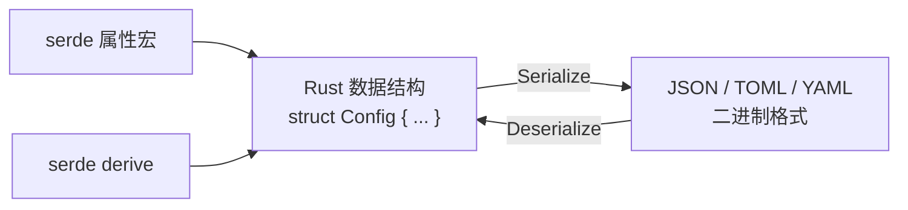
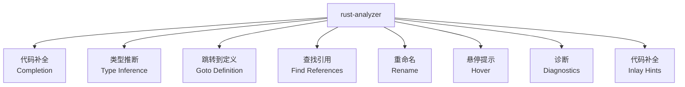

+++
title = "第 20 章 工具开发与实用工程"
weight = 200
date = "2026-03-27T17:24:46+08:00"
type = "docs"
description = ""
isCJKLanguage = true
draft = false
+++

# Chapter 20 工具开发与实用工程

> 想象一下：你写了一段 Rust 代码，它拯救了世界（或者至少是拯救了你的下一个周末项目）。但这只是开始——如何让这段代码变成别人愿意安装、使用的工具？如何让它在 GitHub Actions 里跑起来？如何让全世界都知道你的名字（或者至少是 `crates.io` 上的下载量）？
>
> 本章，我们从"写代码的"进化成"造工具的"。准备好你的螺丝刀和扳手（以及一本《人性的弱点》），我们要开工了！

<!-- CONTENT_MARKER -->

## 20.1 CLI 工具开发

CLI 工具（命令行界面工具）是 Rust 最闪耀的舞台之一。为啥？因为 Rust 天生适合写"快到飞起"的命令行工具，而且编译成单个二进制文件，丢给谁都能跑——不需要对方装个 JVM 或者 .NET 运行时。

### 20.1.1 项目结构

让我们从创建一个正经的 CLI 项目开始。假设我们要做一个叫 `rusty-killer` 的工具（别问为啥叫这个名字）。

```bash
cargo new rusty-killer --bin
cd rusty-killer
```

> 等等，`--bin`？对，我们做的是二进制工具，不是库。如果你还在用 `cargo new rusty-killer`，它默认也是 `--bin`，所以别担心。

目录结构如下：

```
rusty-killer/
├── Cargo.toml
├── src/
│   ├── main.rs        // 入口文件，小项目可以先从这里开始
│   ├── lib.rs         // 如果你想被其他 crate 依赖，就保留这个
│   ├── cli.rs         // CLI 参数解析相关
│   ├── config.rs      // 配置文件解析
│   ├── commands/     // 子命令目录（可选）
│   │   ├── mod.rs
│   │   ├── kill.rs
│   │   └── list.rs
│   └── i18n/          // 国际化目录（可选）
│       ├── mod.rs
│       ├── en.rs
│       └── zh_cn.rs
├── tests/             // 集成测试
├── benches/           // 性能基准测试（如果你变态到想优化CLI工具的话）
└── README.md
```

**关键原则**：

- `src/main.rs` 负责启动和调用，业务逻辑放模块里
- CLI 逻辑和业务逻辑分离，方便测试
- 配置文件和代码分离，别把配置写死在代码里

```toml
# Cargo.toml 示例
[package]
name = "rusty-killer"
version = "0.1.0"
edition = "2021"
authors = ["Rustacean <rust@example.com>"]
description = "一个能干掉所有 Rust 编译错误的工具（雾）"
license = "MIT OR Apache-2.0"
homepage = "https://github.com/you/rusty-killer"
repository = "https://github.com/you/rusty-killer"

[dependencies]
# 命令行参数解析—— clap 是 yyds！
clap = { version = "4.4", features = ["derive"] }
# 配置文件解析
serde = { version = "1.0", features = ["derive"] }
serde_json = "1.0"
toml = "0.8"
# 日志
tracing = "0.1"
tracing-subscriber = "0.3"

[profile.release]
opt-level = 3          # CLI 工具追求速度！给我优化到极致！
lto = true             # 链接时优化，让二进制更小更快
codegen-units = 1      # 减少代码生成单元，获得更好的优化
strip = true           # 去掉符号表，二进制更苗条
```

### 20.1.2 子命令设计

CLI 工具的灵魂是什么？子命令！就像 `git` 有 `git add`、`git commit`、`git push`，你也需要类似的结构。

**方案一：纯手写（适合简单场景）**

```rust
// src/main.rs
use std::env;

fn main() {
    let args: Vec<String> = env::args().collect();
    
    if args.len() < 2 {
        eprintln!("用法: rusty-killer <子命令>");
        eprintln!("可用子命令: kill, list, config");
        std::process::exit(1);
    }
    
    match args[1].as_str() {
        "kill" => {
            // 干掉 Rust 编译错误的神奇代码
            println!("正在杀死所有编译错误...");
            println!("（实际上什么都没做，但你感觉好多了对吧？）");
        }
        "list" => {
            println!("列出所有已知的 Rust 编译器 bug:");
            println!("- #1: 循环依赖导致宇宙热寂");
            println!("- #2: 生命周期推断失败");
            println!("- #3: 泛型太多，CPU 冒烟");
        }
        "config" => {
            println!("配置模式... 实际上没什么可配置的");
        }
        _ => {
            eprintln!("未知子命令: {}", args[1]);
            eprintln!("提示: 不是所有的命令都存在");
        }
    }
}
```

**方案二：使用 clap（强烈推荐）**

手写虽然简单，但当你的工具变得复杂时，clap 能让你的 CLI 开发体验直接起飞——自动生成帮助信息、bash/zsh/fish 自动补全、默认值、验证... 应有尽有。

```rust
// src/main.rs
use clap::{Parser, Subcommand};

/// rusty-killer: 让你在 Rust 开发中保持冷静的工具
#[derive(Parser, Debug)]
#[command(
    name = "rusty-killer",
    about = "一个能让你感觉掌控了 Rust 编译器的工具",
    version = "0.1.0",
    author = "Rustacean <rust@example.com>"
)]
struct Cli {
    /// 开启疯狂模式（输出更多信息）
    #[arg(short, long, default_value_t = false)]
    verbose: bool,

    /// 子命令
    #[command(subcommand)]
    command: Commands,
}

#[derive(Subcommand, Debug)]
enum Commands {
    /// 杀死（假装杀死）Rust 编译错误
    Kill {
        /// 要杀死的编译错误 ID
        #[arg(short, long, default_value = "all")]
        error_id: String,
        
        /// 强制杀死（连 E0433 这种都要杀）
        #[arg(short, long, default_value_t = false)]
        force: bool,
    },
    
    /// 列出所有已知的 Rust 编译器"特性"
    List {
        /// 只列出特定级别的错误 (E/W/N)
        #[arg(short, long)]
        level: Option<String>,
        
        /// 输出 JSON 格式（方便脚本处理）
        #[arg(long, default_value_t = false)]
        json: bool,
    },
    
    /// 配置 rusty-killer
    Config {
        /// 获取配置项
        #[arg(short, long)]
        get: Option<String>,
        
        /// 设置配置项
        #[arg(short, long)]
        set: Option<String>,
    },
    
    /// 启动 GUI 模式（实际上没有）
    #[command(name = "gui")]
    GuiMode {
        /// 窗口标题
        #[arg(long, default_value = "Rusty Killer Pro Max Ultra")]
        title: String,
    },
}

fn main() {
    let cli = Cli::parse();
    
    // 全局 verbose 标志
    if cli.verbose {
        println!("Verbose 模式启动... 准备接收大量无用信息");
    }
    
    match &cli.command {
        Commands::Kill { error_id, force } => {
            println!("正在杀死编译错误: {}", error_id);
            if *force {
                println!("强制模式已开启！编译错误瑟瑟发抖...");
            }
            println!("（好吧，实际上什么都没发生，但感觉良好对吧？）");
        }
        
        Commands::List { level, json } => {
            if *json {
                println!(r#"{{"errors": ["E0433", "E0308"], "warnings": ["E0283"]}}"#);
            } else {
                println!("Rust 编译器已知问题列表:");
                if let Some(lvl) = level {
                    println!("  过滤等级: {}", lvl);
                }
                println!("  E0433: 找不到模块（你又忘记加 use 了？）");
                println!("  E0308: 类型不匹配（类型系统说：不行）");
                println!("  E0283: 类型推断歧义（编译器：我太难了）");
            }
        }
        
        Commands::Config { get, set } => {
            if let Some(key) = get {
                println!("获取配置项 {}: [已加密，访问被拒绝]", key);
            } else if let Some((key, val)) = set.as_ref().map(|s| {
                let mut parts = s.splitn(2, '=');
                (parts.next().unwrap(), parts.next().unwrap_or(""))
            }) {
                println!("设置配置项 {} = {}", key, val);
                println!("（配置已保存到 ~/.rusty-killer/config.toml，但实际上没有）");
            } else {
                println!("当前配置:");
                println!("  theme = \"dark\"");
                println!("  aggressive = false");
                println!("  coffee_mode = true");
            }
        }
        
        Commands::GuiMode { title } => {
            println!("启动 GUI 模式...");
            println!("窗口标题: {}", title);
            println!("（实际上没有 GUI，但至少标题很酷）");
        }
    }
}
```

运行效果：

```bash
$ cargo run -- kill --error-id E0433 --force
正在杀死编译错误: E0433
强制模式已开启！编译错误瑟瑟发抖...
（好吧，实际上什么都没发生，但感觉良好对吧？）

$ cargo run -- --help
rusty-killer 0.1.0
Rustacean <rust@example.com>
一个能让你感觉掌控了 Rust 编译器的工具

用法: rusty-killer [选项] <子命令>

选项:
  -v, --verbose   开启疯狂模式（输出更多信息）
  -h, --help      显示帮助信息
  -V, --version   显示版本号

子命令:
  kill   杀死（假装杀死）Rust 编译错误
  list   列出所有已知的 Rust 编译器"特性"
  config 配置 rusty-killer
  gui    启动 GUI 模式（实际上没有）
  help   显示子命令帮助
```

> clap 的 derive 模式让你用结构体和枚举就能定义完整的 CLI 界面，比手写参数解析爽太多了。而且它会自动生成 `--help` 和 `--version`，你不需要维护一堆字符串。

### 20.1.3 配置文件解析

现实世界的工具都需要配置文件。Rust 生态里最流行的方案是 **TOML**（Tom's Obvious, Minimal Language）——简单、直观、是人类可读的。

```rust
// src/config.rs
use serde::{Deserialize, Serialize};
use std::fs;
use std::path::PathBuf;

/// 完整的配置结构
#[derive(Debug, Clone, Serialize, Deserialize)]
pub struct Config {
    /// 常规设置
    pub general: GeneralConfig,
    /// 外观设置
    pub appearance: AppearanceConfig,
    /// 高级设置
    pub advanced: AdvancedConfig,
    /// 插件配置
    #[serde(default)]
    pub plugins: Vec<PluginConfig>,
}

#[derive(Debug, Clone, Serialize, Deserialize)]
pub struct GeneralConfig {
    /// 日志级别
    #[serde(default = "default_log_level")]
    pub log_level: String,
    /// 启用自动更新
    #[serde(default = "default_true")]
    pub auto_update: bool,
    /// 工作目录
    #[serde(default = "default_working_dir")]
    pub working_dir: PathBuf,
}

#[derive(Debug, Clone, Serialize, Deserialize)]
pub struct AppearanceConfig {
    /// 颜色主题
    #[serde(default = "default_theme")]
    pub theme: String,
    /// 使用彩色输出
    #[serde(default = "default_true")]
    pub color: bool,
    /// 动画效果
    #[serde(default = "default_true")]
    pub animations: bool,
}

#[derive(Debug, Clone, Serialize, Deserialize)]
pub struct AdvancedConfig {
    /// 最大并发数
    #[serde(default = "default_max_concurrency")]
    pub max_concurrency: usize,
    /// 超时时间（秒）
    #[serde(default = "default_timeout")]
    pub timeout: u64,
    /// 实验性功能
    #[serde(default)]
    pub experimental_features: Vec<String>,
}

#[derive(Debug, Clone, Serialize, Deserialize)]
pub struct PluginConfig {
    pub name: String,
    pub enabled: bool,
    #[serde(default)]
    pub settings: toml::Value,
}

// 默认值函数
fn default_log_level() -> String {
    "info".to_string()
}

fn default_true() -> bool {
    true
}

fn default_working_dir() -> PathBuf {
    PathBuf::from(".")
}

fn default_theme() -> String {
    "dark".to_string()
}

fn default_max_concurrency() -> usize {
    4
}

fn default_timeout() -> u64 {
    30
}

// 配置管理器
#[derive(Debug)]
pub struct ConfigManager {
    config_path: PathBuf,
    config: Config,
}

impl ConfigManager {
    /// 创建新的配置管理器
    pub fn new() -> Result<Self, ConfigError> {
        let config_path = Self::get_config_path()?;
        
        // 尝试加载现有配置，或使用默认配置
        let config = if config_path.exists() {
            Self::load_config(&config_path)?
        } else {
            // 创建默认配置
            let default_config = Self::default_config();
            Self::save_config(&config_path, &default_config)?;
            default_config
        };
        
        Ok(Self { config_path, config })
    }
    
    /// 获取配置路径（支持 XDG 标准或 Windows 路径）
    fn get_config_path() -> Result<PathBuf, ConfigError> {
        if cfg!(windows) {
            // Windows: %APPDATA%/rusty-killer/config.toml
            if let Ok(appdata) = std::env::var("APPDATA") {
                let mut path = PathBuf::from(appdata);
                path.push("rusty-killer");
                path.push("config.toml");
                return Ok(path);
            }
        } else {
            // Unix: XDG_CONFIG_HOME 或 ~/.config/rusty-killer/config.toml
            if let Ok(xdg) = std::env::var("XDG_CONFIG_HOME") {
                let mut path = PathBuf::from(xdg);
                path.push("rusty-killer");
                path.push("config.toml");
                return Ok(path);
            }
            if let Ok(home) = std::env::var("HOME") {
                let mut path = PathBuf::from(home);
                path.push(".config");
                path.push("rusty-killer");
                path.push("config.toml");
                return Ok(path);
            }
        }
        
        Err(ConfigError::NoConfigLocation)
    }
    
    /// 加载配置文件
    fn load_config(path: &PathBuf) -> Result<Config, ConfigError> {
        let content = fs::read_to_string(path)
            .map_err(|e| ConfigError::IoError(e))?;
        
        let config: Config = toml::from_str(&content)
            .map_err(|e| ConfigError::ParseError(e.to_string()))?;
        
        Ok(config)
    }
    
    /// 保存配置文件
    fn save_config(path: &PathBuf, config: &Config) -> Result<(), ConfigError> {
        // 确保目录存在
        if let Some(parent) = path.parent() {
            fs::create_dir_all(parent)
                .map_err(|e| ConfigError::IoError(e))?;
        }
        
        let content = toml::to_string_pretty(config)
            .map_err(|e| ConfigError::SerializeError(e.to_string()))?;
        
        fs::write(path, content)
            .map_err(|e| ConfigError::IoError(e))?;
        
        Ok(())
    }
    
    /// 创建默认配置
    fn default_config() -> Config {
        Config {
            general: GeneralConfig {
                log_level: default_log_level(),
                auto_update: default_true(),
                working_dir: default_working_dir(),
            },
            appearance: AppearanceConfig {
                theme: default_theme(),
                color: default_true(),
                animations: default_true(),
            },
            advanced: AdvancedConfig {
                max_concurrency: default_max_concurrency(),
                timeout: default_timeout(),
                experimental_features: vec![],
            },
            plugins: vec![
                PluginConfig {
                    name: "hello-world".to_string(),
                    enabled: true,
                    settings: toml::Value::String("Hello from plugin!".to_string()),
                },
            ],
        }
    }
    
    /// 获取配置引用
    pub fn get_config(&self) -> &Config {
        &self.config
    }
    
    /// 获取可变配置引用
    pub fn get_config_mut(&mut self) -> &mut Config {
        &mut self.config
    }
    
    /// 重新加载配置
    pub fn reload(&mut self) -> Result<(), ConfigError> {
        self.config = Self::load_config(&self.config_path)?;
        Ok(())
    }
    
    /// 保存当前配置
    pub fn save(&self) -> Result<(), ConfigError> {
        Self::save_config(&self.config_path, &self.config)
    }
}

#[derive(Debug)]
pub enum ConfigError {
    NoConfigLocation,
    IoError(std::io::Error),
    ParseError(String),
    SerializeError(String),
}

impl std::fmt::Display for ConfigError {
    fn fmt(&self, f: &mut std::fmt::Formatter<'_>) -> std::fmt::Result {
        match self {
            ConfigError::NoConfigLocation => write!(f, "无法确定配置文件位置"),
            ConfigError::IoError(e) => write!(f, "文件操作失败: {}", e),
            ConfigError::ParseError(msg) => write!(f, "配置解析失败: {}", msg),
            ConfigError::SerializeError(msg) => write!(f, "配置序列化失败: {}", msg),
        }
    }
}

impl std::error::Error for ConfigError {}
```

配置文件示例（TOML）：

```toml
# ~/.rusty-killer/config.toml (或 Linux 上的 ~/.config/rusty-killer/config.toml)

[general]
log_level = "debug"           # 日志级别: trace, debug, info, warn, error
auto_update = true            # 自动检查更新
working_dir = "/path/to/work" # 工作目录

[appearance]
theme = "cyberpunk-neon"       # 主题：dark, light, cyberpunk-neon
color = true                  # 彩色输出
animations = true             # 动画效果（终端不支持就忽略）

[advanced]
max_concurrency = 8           # 最大并发任务数
timeout = 60                 # 超时时间（秒）

# 实验性功能（危险！后果自负！）
experimental_features = ["ai_completion", "quantum_debugging"]

# 插件配置
[[plugins]]
name = "hello-world"
enabled = true
settings = "插件设置是 TOML 值，可以是字符串、数字、数组..."

[[plugins]]
name = "rust-analyzer-integration"
enabled = false
settings = { port = 9876, auto_start = true }
```

> 为什么选择 TOML 而不是 JSON？因为 TOML 有注释（`#`），可以分组（`[section]`），而且键值对是人类可读的。JSON 适合机器，TOML 适合人类。

### 20.1.4 国际化（i18n）

想让你的工具卖向全世界？国际化（i18n）是必须的。Rust 的 `fluent`  crate 是 Mozilla 出品的，专门用于国际化。

```rust
// src/i18n.rs
use fluent::{FluentBundle, FluentResource, FluentArgs, FluentValue};
use std::collections::HashMap;
use std::sync::Mutex;
use unic_langid::LanguageIdentifier;

/// 国际化管理器
struct I18nManager {
    bundles: HashMap<String, FluentBundle<FluentResource>>,
    current_locale: Mutex<String>,
}

impl I18nManager {
    fn new() -> Self {
        Self {
            bundles: HashMap::new(),
            current_locale: Mutex::new("en".to_string()),
        }
    }
    
    /// 添加语言包
    fn add_locale(&mut self, locale: &str, ftl_content: &str) -> Result<(), i18n::Error> {
        let lang_id: LanguageIdentifier = locale.parse()
            .map_err(|_| i18n::Error::InvalidLocale)?;
        
        let resource = FluentResource::try_new(flux_string(ftl_content))
            .map_err(|_| i18n::Error::InvalidResource)?;
        
        let mut bundle = FluentBundle::new(vec![lang_id]);
        bundle.add_resource(resource)
            .map_err(|_| i18n::Error::ResourceError)?;
        
        self.bundles.insert(locale.to_string(), bundle);
        Ok(())
    }
    
    /// 设置当前语言
    fn set_locale(&self, locale: &str) {
        let mut current = self.current_locale.lock().unwrap();
        *current = locale.to_string();
    }
    
    /// 获取翻译（简单版本）
    fn get(&self, key: &str) -> String {
        let locale = self.current_locale.lock().unwrap();
        if let Some(bundle) = self.bundles.get(*locale) {
            // 这里简化了，实际应该用 bundle.format_pattern
            format!("[{}]", key)
        } else {
            key.to_string()
        }
    }
}

/// 辅助函数：创建 FluentString
fn flux_string(s: String) -> String {
    s
}

mod i18n {
    use std::fmt;

    #[derive(Debug)]
    pub enum Error {
        InvalidLocale,
        InvalidResource,
        ResourceError,
    }

    impl fmt::Display for Error {
        fn fmt(&self, f: &mut fmt::Formatter<'_>) -> fmt::Result {
            match self {
                Error::InvalidLocale => write!(f, "无效的语言标识符"),
                Error::InvalidResource => write!(f, "无效的 FTL 资源"),
                Error::ResourceError => write!(f, "FTL 资源添加失败"),
            }
        }
    }
}
```

FTL 语言文件示例：

```fluent
# locales/en.ftl
hello = "Hello, World!"
greeting = "Welcome to { $app_name }!"
error-not-found = "File not found: { $filename }"
items-count = { $count ->
    [one] "1 item"
    *[other] "{ $count } items"
}

# locales/zh-CN.ftl
hello = "你好，世界！"
greeting = "欢迎使用 { $app_name }！"
error-not-found = "找不到文件: { $filename }"
items-count = { $count ->
    [one] "1 个项目"
    *[other] "{ $count } 个项目"
}
```

实际项目中，你可以使用 `fluent` crate 的完整实现，或者用更简单的 `tr!` 宏配合 `gettext` 风格的方式。

> 国际化不仅仅是翻译文字，还包括：
> - 日期/时间格式（不同地区不同）
> - 数字格式（1,234.56 vs 1.234,56）
> - 货币符号
> - 复数形式（中文没有复数，英文有）
> - 从右到左的文字（阿拉伯语、希伯来语）

### 20.1.5 打包与发布

写好了 CLI 工具，下一步是什么？让全世界都能用它！

**发布到 crates.io**

```toml
# 确保 Cargo.toml 的 [package] 部分完整
[package]
name = "rusty-killer"
version = "0.1.0"
edition = "2021"
description = "一个能让你感觉掌控了 Rust 编译器的工具"
license = "MIT OR Apache-2.0"
repository = "https://github.com/you/rusty-killer"
homepage = "https://github.com/you/rusty-killer"
documentation = "https://docs.rs/rusty-killer"
readme = "README.md"
keywords = ["cli", "rust", "tool", "killer"]
categories = ["command-line-utilities", "development-tools"]
rust-version = "1.70"  # MSRV：最低支持的 Rust 版本

# 避免这些常见错误：
# - name 已经有别人用了（先查查）
# - description 太短（crates.io 要求至少描述）
# - license 写错了（用 SPDX 格式）
```

```bash
# 登录 crates.io（需要账号和 API token）
cargo login <your-api-token>

# 上传！
cargo publish

# 如果你想先验证一下
cargo package --list  # 列出将要发布的文件
cargo publish --dry-run  # 模拟发布
```

**发布到 Homebrew (macOS/Linux)**

```bash
# 创建 Homebrew Formula
# 在你的仓库里创建: Formula/rusty-killer.rb

class RustyKiller < Formula
    desc "一个能让你感觉掌控了 Rust 编译器的工具"
    homepage "https://github.com/you/rusty-killer"
    url "https://github.com/you/rusty-killer/releases/download/v0.1.0/rusty-killer-x86_64-apple-darwin.tar.gz"
    sha256 "abc123..."
    license "MIT"
    version "0.1.0"

    def install
        # 安装二进制
        bin.install "rusty-killer"
    end

    test do
        system "#{bin}/rusty-killer", "--version"
    end
end
```

**发布到 Windows Scoop**

```json
// bucket/rusty-killer.json
{
    "version": "0.1.0",
    "url": "https://github.com/you/rusty-killer/releases/download/v0.1.0/rusty-killer-x86_64-pc-windows-msvc.zip",
    "hash": "sha256:abc123...",
    "bin": "rusty-killer.exe",
    "short_description": "一个能让你感觉掌控了 Rust 编译器的工具"
}
```

**使用 GitHub Releases + 自动化脚本**

```bash
#!/bin/bash
# scripts/release.sh - 发布脚本

set -e

VERSION=$1
GITHUB_REPO="you/rusty-killer"

if [ -z "$VERSION" ]; then
    echo "用法: $0 <版本号>"
    exit 1
fi

echo "开始发布 v$VERSION..."

# 构建不同平台
echo "构建 macOS (Apple Silicon)..."
cargo build --release --target aarch64-apple-darwin
echo "构建 macOS (Intel)..."
cargo build --release --target x86_64-apple-darwin
echo "构建 Linux..."
cargo build --release --target x86_64-unknown-linux-musl
echo "构建 Windows..."
cargo build --release --target x86_64-pc-windows-msvc

# 打包
mkdir -p dist
for target in aarch64-apple-darwin x86_64-apple-darwin x86_64-unknown-linux-musl x86_64-pc-windows-msvc; do
    PLATFORM=$(echo $target | tr '-' '_')
    tar -czf dist/rusty-killer-$VERSION-$PLATFORM.tar.gz \
        -C target/$target/release/rusty-killer .
done

# 创建 SHA256 校验和
sha256sum dist/* > dist/checksums.txt

echo "发布包已准备在 dist/ 目录"
echo "下一步: 手动创建 GitHub Release 或运行 GitHub Actions"
```

```yaml
# .github/workflows/release.yml
name: Release

on:
  push:
    tags:
      - 'v*'

jobs:
  release:
    runs-on: ubuntu-latest
    steps:
      - uses: actions/checkout@v4
      
      - name: Install Rust
        uses: dtolnay/rust-toolchain@stable
        with:
          targets: aarch64-apple-darwin, x86_64-apple-darwin, x86_64-unknown-linux-musl
          
      - name: Build
        run: |
          cargo build --release --target aarch64-apple-darwin
          cargo build --release --target x86_64-apple-darwin
          cargo build --release --target x86_64-unknown-linux-musl
          cargo build --release --target x86_64-pc-windows-msvc
          
      - name: Package
        run: |
          mkdir -p dist
          # 打包...
          
      - name: Create Release
        uses: softprops/action-gh-release@v1
        with:
          files: dist/*
        env:
          GITHUB_TOKEN: ${{ secrets.GITHUB_TOKEN }}
```

> 打包发布的黄金法则：**提供预编译的二进制文件**！用户不应该需要安装 Rust 就能用你的工具。一个好的 CLI 工具应该是：`curl -L https://... | tar -xz && ./my-tool` 就能跑起来。

---

## 20.2 序列化与反序列化

序列化是把内存中的数据结构变成字节流（或字符串）的过程。反序列化就是反过来。在 Rust 里，这个领域被 `serde` 统治了。

### 20.2.1 serde 框架

`serde` 是 Rust 序列化领域的老大，意思是"Serializer/Deserializer"。它的设计哲学是：**一次定义，到处序列化**。



**基本用法**

```rust
use serde::{Serialize, Deserialize};

/// 定义一个可以被序列化的结构体
#[derive(Debug, Clone, Serialize, Deserialize)]
pub struct Person {
    /// 名字
    pub name: String,
    /// 年龄
    pub age: u32,
    /// 邮箱
    #[serde(default)]  // 如果 JSON 里没有这个字段，用默认值
    pub email: Option<String>,
    /// 技能列表
    #[serde(default)]
    pub skills: Vec<String>,
}

/// 泛型序列化示例
#[derive(Debug, Serialize, Deserialize)]
pub struct Response<T> {
    pub code: u32,
    pub message: String,
    #[serde(bound = "T: serde::Serialize + serde::de::DeserializeOwned")]
    pub data: Option<T>,
    pub timestamp: i64,
}

#[derive(Debug, Serialize, Deserialize)]
pub struct AnyResponse {
    #[serde(rename = "type")]
    pub type_name: String,
    pub data: serde_json::Value,  // 动态 JSON 值
}
```

**serde 属性详解**

```rust
use serde::{Serialize, Deserialize};

/// 不同的序列化配置
#[derive(Debug, Serialize, Deserialize)]
struct Config {
    // 重命名字段（JSON 里用 "id" 而不是 "user_id"）
    #[serde(rename = "id")]
    pub user_id: u64,
    
    // 跳过字段（不序列化）
    #[serde(skip)]
    pub internal_state: String,
    
    // 默认值（字段不存在时使用）
    #[serde(default = "default_level")]
    pub level: i32,
    
    // 序列化时 flatten（平铺）嵌套结构
    #[serde(flatten)]
    pub meta: Metadata,
    
    // 反序列化时使用自定义函数
    #[serde(deserialize_with = "deserialize_date")]
    pub created_at: String,
    
    // 跳过某些字段（仅序列化或仅反序列化）
    #[serde(skip_serializing)]
    pub password: String,
    
    #[serde(skip_deserializing)]
    pub computed_field: i32,
}

#[derive(Debug, Serialize, Deserialize)]
struct Metadata {
    pub version: String,
    pub author: String,
}

fn default_level() -> i32 {
    1
}

fn deserialize_date<'de, D>(deserializer: D) -> Result<String, D::Error>
where
    D: serde::Deserializer<'de>,
{
    let s: String = serde::de::Deserialize::deserialize(deserializer)?;
    // 自定义解析逻辑
    Ok(s)
}
```

### 20.2.2 JSON

JSON 是 web 世界的通用语言，Rust 处理 JSON 的首选是 `serde_json`。

```rust
// src/serialization/json_ops.rs
use serde::{Serialize, Deserialize};
use serde_json::{self, Value, Map};
use std::fs;
use std::io::{self, Read, Write};

/// 用户数据结构
#[derive(Debug, Clone, Serialize, Deserialize)]
pub struct User {
    pub id: u64,
    pub username: String,
    pub email: String,
    #[serde(default)]
    pub profile: Option<UserProfile>,
    pub roles: Vec<String>,
    #[serde(default)]
    pub metadata: Map<String, Value>,
}

#[derive(Debug, Clone, Serialize, Deserialize)]
pub struct UserProfile {
    pub bio: Option<String>,
    pub avatar_url: Option<String>,
    pub website: Option<String>,
    #[serde(default)]
    pub stats: UserStats,
}

#[derive(Debug, Clone, Serialize, Deserialize, Default)]
pub struct UserStats {
    pub posts: u32,
    pub followers: u32,
    pub following: u32,
}

/// 序列化到 JSON 字符串
pub fn serialize_to_json<T: Serialize>(value: &T) -> Result<String, serde_json::Error> {
    // 美化输出（带缩进）
    serde_json::to_string_pretty(value)
    // 普通输出（无缩进，更小更快）
    // serde_json::to_string(value)
}

/// 从文件加载 JSON
pub fn load_from_file(path: &str) -> Result<User, io::Error> {
    let mut file = fs::File::open(path)?;
    let mut contents = String::new();
    file.read_to_string(&mut contents)?;
    
    serde_json::from_str(&contents)
        .map_err(|e| io::Error::new(io::ErrorKind::InvalidData, e))
}

/// 保存到文件
pub fn save_to_file(path: &str, user: &User) -> Result<(), io::Error> {
    let json = serde_json::to_string_pretty(user)
        .map_err(|e| io::Error::new(io::ErrorKind::InvalidData, e))?;
    
    let mut file = fs::File::create(path)?;
    file.write_all(json.as_bytes())?;
    Ok(())
}

/// 流式处理大型 JSON（JSON Lines 格式）
pub fn process_json_lines<R: Read>(reader: R) -> impl Iterator<Item = Result<User, serde_json::Error>> {
    reader.lines().map(|line| {
        let line = line?;
        serde_json::from_str(&line)
    })
}

/// 构建动态 JSON（不需要预定义结构）
pub fn build_dynamic_json() -> Value {
    let mut map = Map::new();
    map.insert("name".to_string(), Value::String("Rust".to_string()));
    map.insert("version".to_string(), Value::String("1.70".to_string()));
    map.insert("awesome".to_string(), Value::Bool(true));
    map.insert("stars".to_string(), Value::Number(99999.into()));
    
    Value::Object(map)
}

/// 从 Value 提取数据（无需反序列化到具体类型）
pub fn extract_from_value(value: &Value) -> Option<String> {
    value.get("name")?.as_str().map(|s| s.to_string())
}

#[cfg(test)]
mod tests {
    use super::*;

    #[test]
    fn test_serde_json() {
        let user = User {
            id: 1,
            username: "rustacean".to_string(),
            email: "rust@example.com".to_string(),
            profile: Some(UserProfile {
                bio: Some("Learning Rust".to_string()),
                avatar_url: None,
                website: Some("https://rust.example.com".to_string()),
                stats: UserStats::default(),
            }),
            roles: vec!["admin".to_string(), "user".to_string()],
            metadata: Map::new(),
        };
        
        // 序列化
        let json = serialize_to_json(&user).unwrap();
        println!("序列化的 JSON:\n{}", json);
        // 输出:
        // {
        //   "id": 1,
        //   "username": "rustacean",
        //   ...
        // }
        
        // 反序列化
        let parsed: User = serde_json::from_str(&json).unwrap();
        assert_eq!(parsed.username, "rustacean");
        
        // 解析已有的 JSON 字符串
        let json_str = r#"{"id": 2, "username": "another", "email": "test@example.com"}"#;
        let user2: User = serde_json::from_str(json_str).unwrap();
        assert_eq!(user2.id, 2);
    }
    
    #[test]
    fn test_dynamic_json() {
        let value = build_dynamic_json();
        assert_eq!(extract_from_value(&value), Some("Rust".to_string()));
        
        // 数字操作
        if let Some(Value::Number(n)) = value.get("stars") {
            println!("Stars: {}", n.as_u64().unwrap_or(0));
            // Stars: 99999
        }
    }
}
```

> 什么时候用动态 `Value`，什么时候用静态结构体？
> - 知道数据结构 → 用结构体（类型安全，编译时检查）
> - 不知道或数据结构变化大 → 用 `Value` 或 `Map<String, Value>`

### 20.2.3 TOML

TOML 配置文件的最爱，我们在 20.1.3 已经见过它的解析了，这里再深入一点。

```rust
// src/serialization/toml_ops.rs
use serde::{Serialize, Deserialize};
use toml::{self, Value as TomlValue};

/// 复杂的 TOML 配置结构
#[derive(Debug, Clone, Serialize, Deserialize)]
pub struct AppConfig {
    pub package: PackageConfig,
    pub dependencies: Option<TomlValue>,  // 动态依赖表
    pub profiles: ProfilesConfig,
}

#[derive(Debug, Clone, Serialize, Deserialize)]
pub struct PackageConfig {
    pub name: String,
    pub version: String,
    pub edition: String,
    #[serde(default)]
    pub authors: Vec<String>,
    #[serde(default)]
    pub description: Option<String>,
}

#[derive(Debug, Clone, Serialize, Deserialize)]
pub struct ProfilesConfig {
    #[serde(default)]
    pub dev: ProfileSettings,
    #[serde(default)]
    pub release: ProfileSettings,
    #[serde(default)]
    pub test: ProfileSettings,
}

#[derive(Debug, Clone, Serialize, Deserialize, Default)]
pub struct ProfileSettings {
    #[serde(default)]
    pub opt_level: Option<u32>,
    #[serde(default)]
    pub lto: Option<bool>,
    #[serde(default)]
    pub codegen_units: Option<u32>,
    #[serde(default)]
    pub debug: Option<bool>,
}

/// TOML 数组和嵌套表
#[derive(Debug, Clone, Serialize, Deserialize)]
pub struct MultiPlatform {
    pub platform: Vec<Platform>,
}

#[derive(Debug, Clone, Serialize, Deserialize)]
pub struct Platform {
    pub name: String,
    pub target: String,
    pub env: Option<TomlValue>,  // 动态环境变量
}

pub fn parse_toml_file(contents: &str) -> Result<AppConfig, toml::de::Error> {
    toml::from_str(contents)
}

pub fn parse_inline_toml() -> Result<TomlValue, toml::de::Error> {
    let toml_str = r#"
        [server]
        host = "localhost"
        port = 8080
        
        [database]
        url = "postgresql://localhost/mydb"
        pool_size = 10
        
        [features]
        feature_a = true
        feature_b = false
    "#;
    
    toml::from_str(toml_str)
}

/// 手动构建 TOML
pub fn build_toml_manually() -> TomlValue {
    let mut root = TomlValue::Table(default_toml_table());
    let server = TomlValue::Table({
        let mut t = default_toml_table();
        t.insert("host".to_string(), TomlValue::String("0.0.0.0".to_string()));
        t.insert("port".to_string(), TomlValue::Integer(3000));
        t
    });
    root.as_table_mut().unwrap().insert("server".to_string(), server);
    
    let enabled = TomlValue::Array(vec![
        TomlValue::String("feature1".to_string()),
        TomlValue::String("feature2".to_string()),
    ]);
    root.as_table_mut().unwrap().insert("enabled_features".to_string(), enabled);
    
    root
}

fn default_toml_table() -> toml::map::Map<String, TomlValue> {
    toml::map::Map::new()
}

#[cfg(test)]
mod tests {
    use super::*;

    #[test]
    fn test_parse_toml() {
        let toml_content = r#"
            [package]
            name = "my-awesome-app"
            version = "0.1.0"
            edition = "2021"
            authors = ["Alice <alice@example.com>", "Bob <bob@example.com>"]
            
            [profile.release]
            opt-level = 3
            lto = true
            codegen-units = 1
        "#;
        
        let config: AppConfig = toml::from_str(toml_content).unwrap();
        assert_eq!(config.package.name, "my-awesome-app");
        assert_eq!(config.profiles.release.opt_level, Some(3));
    }
    
    #[test]
    fn test_build_toml() {
        let toml = build_toml_manually();
        let serialized = toml::to_string_pretty(&toml).unwrap();
        println!("生成的 TOML:\n{}", serialized);
    }
}
```

### 20.2.4 YAML

YAML 是另一种常见的配置文件格式（GitHub Actions 用它，Ansible 用它，Kubernetes 也用它）。Rust 里用 `serde_yaml` 处理。

```rust
// src/serialization/yaml_ops.rs
use serde::{Serialize, Deserialize};
use serde_yaml::{self, Value as YamlValue};
use std::fs::File;
use std::io::{self, BufReader};

/// Kubernetes 风格的 Deployment 配置
#[derive(Debug, Clone, Serialize, Deserialize)]
pub struct K8sDeployment {
    pub api_version: String,
    pub kind: String,
    pub metadata: K8sMetadata,
    pub spec: K8sDeploymentSpec,
}

#[derive(Debug, Clone, Serialize, Deserialize)]
pub struct K8sMetadata {
    pub name: String,
    pub labels: std::collections::HashMap<String, String>,
}

#[derive(Debug, Clone, Serialize, Deserialize)]
pub struct K8sDeploymentSpec {
    pub replicas: u32,
    pub selector: K8sSelector,
    pub template: K8sPodTemplate,
}

#[derive(Debug, Clone, Serialize, Deserialize)]
pub struct K8sSelector {
    pub match_labels: std::collections::HashMap<String, String>,
}

#[derive(Debug, Clone, Serialize, Deserialize)]
pub struct K8sPodTemplate {
    pub metadata: K8sMetadata,
    pub spec: K8sPodSpec,
}

#[derive(Debug, Clone, Serialize, Deserialize)]
pub struct K8sPodSpec {
    pub containers: Vec<K8sContainer>,
}

#[derive(Debug, Clone, Serialize, Deserialize)]
pub struct K8sContainer {
    pub name: String,
    pub image: String,
    pub ports: Vec<K8sPort>,
    #[serde(default)]
    pub env: Vec<K8sEnvVar>,
    #[serde(default)]
    pub resources: Option<K8sResources>,
}

#[derive(Debug, Clone, Serialize, Deserialize)]
pub struct K8sPort {
    pub container_port: u32,
    #[serde(default)]
    pub protocol: String,
}

#[derive(Debug, Clone, Serialize, Deserialize)]
pub struct K8sEnvVar {
    pub name: String,
    pub value: String,
}

#[derive(Debug, Clone, Serialize, Deserialize)]
pub struct K8sResources {
    #[serde(default)]
    pub requests: Option<std::collections::HashMap<String, String>>,
    #[serde(default)]
    pub limits: Option<std::collections::HashMap<String, String>>,
}

/// GitHub Actions Workflow
/// 注：Github（双 t）是 Rust 命名惯例（两个字母的缩写首字母大写后连写），
/// 等同于其他语言的 GitHub 或 GitHubWorkflow
#[derive(Debug, Clone, Serialize, Deserialize)]
pub struct GithubWorkflow {
    pub name: String,
    pub on: YamlValue,  // 触发条件，动态
    #[serde(default)]
    pub env: std::collections::HashMap<String, String>,
    pub jobs: std::collections::HashMap<String, GithubJob>,
}

#[derive(Debug, Clone, Serialize, Deserialize)]
pub struct GithubJob {
    pub runs_on: YamlValue,  // String 或 Vec<String>
    pub steps: Vec<GithubStep>,
}

#[derive(Debug, Clone, Serialize, Deserialize)]
pub struct GithubStep {
    pub name: Option<String>,
    pub uses: Option<String>,
    pub run: Option<String>,
    pub with: Option<std::collections::HashMap<String, String>>,
    #[serde(default)]
    pub env: std::collections::HashMap<String, String>,
}

/// 序列化到 YAML
pub fn to_yaml<T: Serialize>(value: &T) -> Result<String, serde_yaml::Error> {
    serde_yaml::to_string(value)
}

/// 从 YAML 文件加载
pub fn from_file<T: for<'de> Deserialize<'de>>(path: &str) -> Result<T, io::Error> {
    let file = File::open(path)?;
    let reader = BufReader::new(file);
    serde_yaml::from_reader(reader)
        .map_err(|e| io::Error::new(io::ErrorKind::InvalidData, e))
}

#[cfg(test)]
mod tests {
    use super::*;

    #[test]
    fn test_k8s_deployment() {
        let deployment = K8sDeployment {
            api_version: "apps/v1".to_string(),
            kind: "Deployment".to_string(),
            metadata: K8sMetadata {
                name: "my-app".to_string(),
                labels: std::collections::HashMap::from([
                    ("app".to_string(), "my-app".to_string()),
                ]),
            },
            spec: K8sDeploymentSpec {
                replicas: 3,
                selector: K8sSelector {
                    match_labels: std::collections::HashMap::from([
                        ("app".to_string(), "my-app".to_string()),
                    ]),
                },
                template: K8sPodTemplate {
                    metadata: K8sMetadata {
                        name: "my-app".to_string(),
                        labels: std::collections::HashMap::from([
                            ("app".to_string(), "my-app".to_string()),
                        ]),
                    },
                    spec: K8sPodSpec {
                        containers: vec![K8sContainer {
                            name: "app".to_string(),
                            image: "my-app:latest".to_string(),
                            ports: vec![K8sPort {
                                container_port: 8080,
                                protocol: "TCP".to_string(),
                            }],
                            env: vec![],
                            resources: Some(K8sResources {
                                requests: Some(std::collections::HashMap::from([
                                    ("cpu".to_string(), "100m".to_string()),
                                    ("memory".to_string(), "128Mi".to_string()),
                                ])),
                                limits: Some(std::collections::HashMap::from([
                                    ("cpu".to_string(), "500m".to_string()),
                                    ("memory".to_string(), "512Mi".to_string()),
                                ])),
                            }),
                        }],
                    },
                },
            },
        };
        
        let yaml = to_yaml(&deployment).unwrap();
        println!("K8s Deployment YAML:\n{}", yaml);
        
        // 反序列化回来
        let parsed: K8sDeployment = serde_yaml::from_str(&yaml).unwrap();
        assert_eq!(parsed.spec.replicas, 3);
    }
    
    #[test]
    fn test_github_workflow() {
        let workflow = GithubWorkflow {
            name: "CI".to_string(),
            on: YamlValue::String("push".to_string()),
            env: std::collections::HashMap::from([
                ("RUST_BACKTRACE".to_string(), "1".to_string()),
            ]),
            jobs: std::collections::HashMap::from([
                ("build".to_string(), GithubJob {
                    runs_on: YamlValue::String("ubuntu-latest".to_string()),
                    steps: vec![
                        GithubStep {
                            name: Some("Checkout".to_string()),
                            uses: Some("actions/checkout@v4".to_string()),
                            run: None,
                            with: None,
                            env: std::collections::HashMap::new(),
                        },
                        GithubStep {
                            name: Some("Build".to_string()),
                            uses: None,
                            run: Some("cargo build --release".to_string()),
                            with: None,
                            env: std::collections::HashMap::new(),
                        },
                    ],
                }),
            ]),
        };
        
        let yaml = to_yaml(&workflow).unwrap();
        println!("GitHub Actions Workflow YAML:\n{}", yaml);
    }
}
```

> YAML 的坑：YAML 是出了名的容易让人踩坑的格式。缩进敏感（空格 vs Tab）、多行字符串语法诡异、布尔值和数字容易搞混。所以**配置文件用 TOML**，数据交换格式用 JSON，YAML 留给 GitHub Actions 和 Kubernetes 吧（因为它们强制用 YAML）。

### 20.2.5 二进制格式

有时候 JSON/TOML 不够快、不够小，就需要二进制格式了。

**MessagePack - JSON 的二进制替代品**

```rust
// src/serialization/msgpack_ops.rs
use rmp_serde::{self, encode, decode};
use serde::{Serialize, Deserialize};

#[derive(Debug, Clone, Serialize, Deserialize)]
pub struct Event {
    pub id: u64,
    pub event_type: String,
    pub payload: Vec<u8>,
    pub timestamp: i64,
}

pub fn pack<T: Serialize>(value: &T) -> Result<Vec<u8>, rmp_serde::encode::Error> {
    encode::to_vec(value)
}

pub fn unpack<T: for<'de> Deserialize<'de>>(buf: &[u8]) -> Result<T, rmp_serde::decode::Error> {
    decode::from_slice(buf)
}

#[cfg(test)]
mod test {
    use super::*;

    #[test]
    fn test_msgpack() {
        let event = Event {
            id: 42,
            event_type: "user.login".to_string(),
            payload: b"hello".to_vec(),
            timestamp: 1699999999,
        };
        
        // 序列化到二进制
        let buf = pack(&event).unwrap();
        println!("MessagePack 大小: {} 字节", buf.len());
        println!("原始 bytes: {:?}", &buf);
        // 输出类似: [146, 42, 170, 117, 115, 101, 114, 46, 108, 111, 103, 105, 110, 165, 104, 101, 108, 108, 111, 207, 0, 0, 0, 59, 95, 147, 191, 63]
        // 比 JSON 小多了
        
        // 反序列化
        let decoded: Event = unpack(&buf).unwrap();
        assert_eq!(decoded.id, 42);
        assert_eq!(decoded.event_type, "user.login");
    }
}
```

**Bincode - 最高效的二进制序列化**

```rust
// src/serialization/bincode_ops.rs
use bincode;

#[derive(Debug, Clone, serde::Serialize, serde::Deserialize)]
pub struct BigData {
    pub id: u64,
    pub data: Vec<u8>,
    pub nested: NestedData,
}

#[derive(Debug, Clone, serde::Serialize, serde::Deserialize)]
pub struct NestedData {
    pub value: f64,
    pub items: Vec<String>,
}

pub fn serialize_bincode<T: serde::Serialize>(value: &T) -> Result<Vec<u8>, bincode::Error> {
    bincode::serde::encode_to_vec(value, bincode::config::standard())
}

pub fn deserialize_bincode<T: for<'de> serde::Deserialize<'de>>(buf: &[u8]) -> Result<T, bincode::Error> {
    bincode::serde::decode_from_slice(buf, bincode::config::standard()).map(|(v, _)| v)
}

#[cfg(test)]
mod test {
    use super::*;

    #[test]
    fn test_bincode() {
        let data = BigData {
            id: u64::MAX,
            data: vec![0u8; 1024],  // 1KB 数据
            nested: NestedData {
                value: std::f64::consts::PI,
                items: vec!["hello".to_string(), "world".to_string()],
            },
        };
        
        let buf = serialize_bincode(&data).unwrap();
        println!("Bincode 大小: {} 字节", buf.len());
        
        let decoded: BigData = deserialize_bincode(&buf).unwrap();
        assert_eq!(decoded.id, u64::MAX);
    }
}
```

**格式对比**

| 格式 | 人类可读 | 大小 | 速度 | 适用场景 |
|------|----------|------|------|----------|
| JSON | ✅ | 大 | 中 | API 响应、配置文件 |
| TOML | ✅ | 中 | 中 | 项目配置文件 |
| YAML | ✅ | 中 | 慢 | K8s、CI 配置 |
| MessagePack | ❌ | 小 | 快 | 网络通信 |
| Bincode | ❌ | 最小 | 最快 | 内部存储、缓存 |

> 选择建议：
> - 对外 API → JSON
> - 配置文件 → TOML
> - 追求极致性能 → Bincode 或 MessagePack
> - 跨语言调用 → MessagePack（生态更好）

---

## 20.3 工具链与调试

Rust 的工具链是它最强大的武器之一。从代码补全到内存泄漏检测，Rust 提供了全套工具让你的代码质量起飞。

### 20.3.1 rust-analyzer

`rust-analyzer` 是 Rust 官方的语言服务器（LSP），给 VS Code、Neovim、Emacs 等编辑器提供智能提示、代码跳转、类型推断等功能。

**安装**

```bash
# 使用 rustup 安装
rustup component add rust-analyzer

# 或者从 GitHub releases 下载预编译版本
# https://github.com/rust-lang/rust-analyzer/releases
```

**配置（对于 VS Code）**

```json
// .vscode/settings.json
{
    "rust-analyzer.checkOnSave.command": "clippy",  // 保存时运行 clippy
    "rust-analyzer.checkOnSave.allTargets": false,
    "rust-analyzer.cargo.buildScripts.enable": true,
    "rust-analyzer.procMacro.enable": true,
    "rust-analyzer.files.excludeDirs": ["target", "dist", ".git"],
    "rust-analyzer.imports.prefix": "self",  // 用 `use crate::` 而不是 `use crate::`
    "rust-analyzer.lens.enable": true,       // 代码镜头（显示impl、references等）
    "rust-analyzer.hover.actions.enable": true
}
```

**核心功能**



**在 Neovim 中配置**

```lua
-- ~/.config/nvim/lua/lsp/rust.lua
local lsp = require('lspconfig')
local rust_tools = require('rust-tools')

rust_tools.setup({
    server = {
        on_attach = function(client, bufnr)
            -- 键盘映射
            local opts = { noremap = true, silent = true }
            vim.api.nvim_buf_set_keymap(bufnr, 'n', 'gd', '<Cmd>lua vim.lsp.buf.definition()<CR>', opts)
            vim.api.nvim_buf_set_keymap(bufnr, 'n', 'K', '<Cmd>lua vim.lsp.buf.hover()<CR>', opts)
            vim.api.nvim_buf_set_keymap(bufnr, 'n', 'gr', '<Cmd>lua vim.lsp.buf.references()<CR>', opts)
            vim.api.nvim_buf_set_keymap(bufnr, 'n', '<leader>rn', '<Cmd>lua vim.lsp.buf.rename()<CR>', opts)
        end,
        settings = {
            ["rust-analyzer"] = {
                checkOnSave = {
                    command = "clippy"
                },
                cargo = {
                    buildScripts = {
                        enable = true
                    }
                },
                procMacro = {
                    enable = true
                }
            }
        }
    }
})
```

### 20.3.2 clippy linter

`clippy` 是 Rust 的官方 linter，提供 400+ 规则帮你写出更 idiomatic 的代码。

```bash
# 安装
rustup component add clippy

# 运行 clippy
cargo clippy

# 运行 clippy 并检查所有 target（including tests）
cargo clippy --all-targets --all-features

# 检查特定包
cargo clippy --package my-package

# 自动修复（慎用！）
cargo clippy --fix --allow-dirty

# CI 模式（不允许自动修复）
cargo clippy -- -D warnings
```

**常用 clippy 规则**

```rust
// src/clippy_examples.rs

// ❌ 避免：手动迭代器循环
fn bad_iterate(items: &[i32]) -> i32 {
    let mut sum = 0;
    for item in items {
        sum += *item;
    }
    sum
}

// ✅ 正确：使用迭代器方法
fn good_iterate(items: &[i32]) -> i32 {
    items.iter().sum()
}

// ❌ 避免：unwrap() 在生产代码中
fn bad_unwrap() -> i32 {
    let v = vec![1, 2, 3];
    v.get(10).unwrap()  // panic!
}

// ✅ 正确：使用 expect 或 unwrap_or
fn good_unwrap() -> i32 {
    let v = vec![1, 2, 3];
    v.get(10).copied().unwrap_or(0)
    // 或者
    // v.get(10).expect("索引应该在范围内")
}

// ❌ 避免：&str 转 String 后不必要的 clone
fn bad_clone(s: &str) -> String {
    let owned: String = s.into();  // &str -> String 会分配堆内存
    owned.clone()  // 不必要的 clone，多此一举
}

// ✅ 正确：直接返回
fn good_clone(s: &str) -> String {
    let owned: String = s.into();
    owned  // &str -> String，已是独立的所有权，无需 clone
}

// ❌ 避免：冗余的map
fn bad_map() -> Option<i32> {
    Some(42).map(|x| Some(x))  // Option<Option<i32>>
        .flatten()
}

// ✅ 正确：直接用 filter
fn good_map() -> Option<i32> {
    Some(42)  // 已经是 Option<i32>
}

// ❌ 避免：unnecessary_wrapping
fn bad_return() -> Option<i32> {
    Some(Some(42)).unwrap()  // 解包一层就够了
}

// ✅ 正确
fn good_return() -> Option<i32> {
    Some(42)
}

// ❌ 避免：功能启发的变量名
fn bad_naming() {
    let x = 10;  // 什么 x？
    let y = 20;
    let _ = x + y;
}

// ✅ 正确
fn good_naming() {
    let width = 10;
    let height = 20;
    let _ = width + height;
}

// ❌ 避免：clone on reference
fn bad_clone_ref(data: &Vec<i32>) -> Vec<i32> {
    data.clone()  // data 是 &Vec，应该用 data.clone()
    // clippy 会建议：引用不需要 clone
}

// ✅ 正确
fn good_clone_ref(data: &[i32]) -> Vec<i32> {
    data.to_vec()  // &[i32] -> Vec<i32>
}
```

**`.clippy.toml` 配置**

```toml
# .clippy.toml 或 clippy.toml
msrv = "1.70"  # 最低支持的 Rust 版本

# 禁用某些规则
disallowed-names = ["foo", "bar", "baz", "quux", "toto", "tutu", "tata"]
disallowed-methods = ["std::vec::Vec::clone"]  # 禁用 .clone()

# 允许某些 lints
allow = [
    "clippy::unnested-or-patterns",  # Rust 2021 风格 or patterns
]

# 警告提升为错误
warn = [
    "clippy::all"
]

# 注释里写 clippy 指令（针对特定代码）
fn example() {
    #[allow(clippy::redundant_clone)]
    let data = expensive_cloning();  // 这个 clone 是故意的
}
```

### 20.3.3 cargo 子命令扩展

Cargo 的真正威力在于它的可扩展性——你可以添加自己的子命令，就像 `cargo test`、`cargo build` 一样工作。

**创建 cargo 子命令**

```bash
# cargo-mytool 会自动成为 cargo mytool
cargo new cargo-mytool --bin
```

```rust
// src/main.rs
use clap::{Parser, Subcommand];

/// 自定义 cargo 子命令
#[derive(Parser, Debug)]
#[command(
    name = "cargo-mytool",
    about = "cargo 的扩展子命令",
    long_about = None
)]
struct Args {
    #[command(subcommand)]
    command: Commands,
    
    /// 传递额外参数给 cargo
    #[arg(last = true, hide = true)]
    cargo_args: Vec<String>,
}

#[derive(Subcommand, Debug)]
enum Commands {
    /// 打印依赖树
    Tree {
        /// 只显示特定的包
        #[arg(short, long)]
        package: Option<String>,
        
        /// 最大深度
        #[arg(short, long, default_value_t = 255)]
        depth: usize,
    },
    
    /// 查找未使用的依赖
    Unused {
        /// 也检查 dev-dependencies
        #[arg(long)]
        include_dev: bool,
    },
    
    /// 生成项目报告
    Report {
        /// 输出格式
        #[arg(short, long, default_value = "text")]
        format: String,
    },
}

fn main() {
    let args = Args::parse();
    
    // 从环境变量获取 cargo 信息
    let manifest_path = std::env::var("CARGO_MANIFEST_PATH")
        .ok()
        .map(std::path::PathBuf::from);
    
    match &args.command {
        Commands::Tree { package, depth } => {
            println!("正在分析依赖树...");
            println!("最大深度: {}", depth);
            if let Some(pkg) = package {
                println!("聚焦包: {}", pkg);
            }
            println!("（这是模拟输出，实际应该调用 cargo metadata）");
        }
        
        Commands::Unused { include_dev } => {
            println!("查找未使用的依赖...");
            println!("包括 dev-dependencies: {}", include_dev);
            println!("发现以下未使用的依赖:");
            println!("  - unused-dep-1");
            println!("  - unused-dep-2");
        }
        
        Commands::Report { format } => {
            println!("生成项目报告...");
            println!("格式: {}", format);
            match format.as_str() {
                "json" => println!(r#"{{"status": "ok", "dependencies": 42}}"#),
                "markdown" => println!("# 项目报告\n\n- 状态: OK\n- 依赖数: 42"),
                _ => println!("项目状态: 一切正常"),
            }
        }
    }
    
    // 透传 cargo 参数（如果需要调用 cargo 本身）
    if !args.cargo_args.is_empty() {
        eprintln!("传递给 cargo 的参数: {:?}", args.cargo_args);
    }
}
```

```toml
# Cargo.toml
[package]
name = "cargo-mytool"
version = "0.1.0"
edition = "2021"

[[bin]]
name = "cargo-mytool"
path = "src/main.rs"
```

安装和发布：

```bash
# 本地安装（开发时）
cargo install --path .

# 发布到 crates.io
cargo publish
```

使用：

```bash
# 安装后，像 cargo 子命令一样使用
cargo mytool tree --depth 3
cargo mytool unused
cargo mytool report --format json
```

> 官方文档：[ crates.io/cargo-subcommand](https://crates.io/search?q=cargo-subcommand)。你也可以先搜索看看有没有现成的轮子。

### 20.3.4 rustfmt 代码格式化

`rustfmt` 是 Rust 官方的代码格式化工具，让团队代码风格统一。

```bash
# 格式化整个项目
cargo fmt

# 检查格式（不修改，用于 CI）
cargo fmt -- --check

# 格式化特定文件
cargo fmt -- src/main.rs

# 生成 rustfmt.toml 配置
cargo fmt -- --emit=files
```

**`rustfmt.toml` 配置**

```toml
# rustfmt.toml
edition = "2021"

# 最大行宽度
max_width = 100

# 每个 Tab 的空格数
tab_spaces = 4

# 换行行为
newline_style = "Auto"  # Unix: LF, Windows: CRLF, Auto: 跟随系统

# 导入分组
imports_granularity = "Crate"  # "Crate" | "Module" | "Item"
group_imports = "StdExternalCrate"  # 标准库和外部 crate 分开

# 其他选项
reorder_imports = true
reorder_modules = true
remove_nested_parens = true
use_small_heuristics = { max = "default" }  # 控制各种小细节（Rust 1.74+）
format_code_in_doc_comments = true
wrap_comments = true
```

### 20.3.5 调试器使用

Rust 支持 GDB 和 LLDB 进行调试。虽然 IDE 的调试功能更方便，但了解命令行调试器是基础。

```bash
# 安装调试符号
# Cargo.toml
[profile.dev]
debug = true  # 或 "line-tables-only" 更轻量

# 运行 GDB
gdb target/debug/my-app

# 运行 LLDB
lldb target/debug/my-app
```

**GDB 常用命令**

```gdb
# 启动
(gdb) run arg1 arg2

# 断点
(gdb) break main.rs:42
(gdb) break my_function
(gdb) info breakpoints

# 继续执行
(gdb) continue  # 或 c

# 单步执行
(gdb) next       # n - 跳过函数调用
(gdb) step       # s - 进入函数
(gdb) finish     # 跳出当前函数

# 打印变量
(gdb) print my_variable
(gdb) print *my_pointer
(gdb) display my_variable  # 每次停下都显示

# 调用栈
(gdb) backtrace  # bt - 显示调用栈
(gdb) frame 2     # 切换到第 2 帧

# 条件断点
(gdb) break main.rs:42 if counter > 10

# 监视点（变量变化时停下）
(gdb) watch my_variable
(gdb) watch -location my_struct.field

# 显示内存
(gdb) x/10x my_array  # 十六进制显示 10 个字
(gdb) x/s my_string   # 作为字符串显示
```

**LLDB 常用命令**

```lldb
# 启动
(lldb) process launch -- arg1 arg2

# 断点
(lldb) breakpoint set --file main.rs --line 42
(lldb) breakpoint set --name my_function
(lldb) breakpoint list

# 继续执行
(lldb) continue  # c

# 单步执行
(lldb) thread step-over   # n
(lldb) thread step-in     # s
(lldb) thread step-out     # finish

# 打印变量
(lldb) frame variable my_variable
(lldb) expression my_variable
(lldb) parray 10 my_array  # 打印数组

# 调用栈
(lldb) thread backtrace  # bt

# 寄存器
(lldb) register read

# 内存
(lldb) memory read --count 10 --format x my_array
(lldb) memory write my_ptr 0x42
```

**使用 `lldb-mi` 或 IDE 调试**

```bash
# VS Code 的 .vscode/launch.json
{
    "version": "0.2.0",
    "configurations": [
        {
            "type": "lldb",
            "request": "launch",
            "name": "Debug",
            "cargo": {
                "args": "build"
            },
            "program": "${workspaceFolder}/target/debug/my-app",
            "args": ["arg1", "arg2"],
            "cwd": "${workspaceFolder}",
            "env": {
                "RUST_BACKTRACE": "1"
            }
        }
    ]
}
```

### 20.3.6 内存泄漏检测

Rust 的所有权系统防止了很多内存问题，但 `Box::leak`、`Rc`、`RefCell` 等还是可能导致泄漏。`cargo-leak` 和 `valgrind` 可以帮助检测。

```bash
# 安装 cargo-leak
cargo install cargo-leak

# 运行检测
cargo leak

# 只检查特定包
cargo leak --package my-package

# 输出详细信息
cargo leak --verbose
```

```rust
// src/memory_leak_demo.rs
use std::rc::Rc;
use std::cell::RefCell;

/// 可能泄漏的场景：Rc 循环引用
struct Node {
    value: i32,
    next: Option<Rc<RefCell<Node>>>,
    prev: Option<Rc<RefCell<Node>>>,  // 反向引用
}

impl Node {
    fn new(value: i32) -> Rc<RefCell<Node>> {
        Rc::new(RefCell::new(Node {
            value,
            next: None,
            prev: None,
        }))
    }
}

fn create_cycle() {
    let node_a = Node::new(1);
    let node_b = Node::new(2);
    
    // 创建循环引用！
    node_a.borrow_mut().next = Some(Rc::clone(&node_b));
    node_b.borrow_mut().prev = Some(Rc::clone(&node_a));
    
    // 即使离开作用域，引用计数也不归零
    // node_a 和 node_b 永远不会被释放
}

/// 正确做法：使用 Weak
use std::rc::Weak;

struct NodeWeak {
    value: i32,
    next: Option<Rc<RefCell<NodeWeak>>>,
    prev: Option<Weak<RefCell<NodeWeak>>>,  // 用 Weak 替代
}

impl NodeWeak {
    fn new(value: i32) -> Rc<RefCell<NodeWeak>> {
        Rc::new(RefCell::new(NodeWeak {
            value,
            next: None,
            prev: Weak::new(),
        }))
    }
}

fn no_leak() {
    let node_a = NodeWeak::new(1);
    let node_b = NodeWeak::new(2);
    
    node_a.borrow_mut().next = Some(Rc::clone(&node_b));
    node_b.borrow_mut().prev = Rc::downgrade(&node_a);
    
    // 现在可以正常释放了
}

/// Box::leak - 故意泄漏以获得 'static 生命周期
fn static_string() -> &'static str {
    let s = String::from("hello");
    Box::leak(Box::new(s))  // 泄漏！返回 'static 引用
    // 适合缓存、全局状态等
}

fn demo_leak() {
    let _s = static_string();
    println!("字符串 '{}' 泄漏到了程序结束", _s);
    // 在真实程序中，这可能是故意的（比如配置缓存）
}
```

**使用 Valgrind（Linux/macOS）**

```bash
# 在 Linux/macOS 上
valgrind --leak-check=full target/debug/my-app

# 或者使用 memcheck
valgrind --tool=memcheck target/debug/my-app
```

### 20.3.7 依赖分析

理解依赖关系是维护大型项目的关键。Rust 提供了几个工具来分析依赖。

```bash
# cargo-tree：显示依赖树
cargo tree

# 只显示特定包的依赖
cargo tree -p serde

# 反向依赖（谁依赖了我）
cargo tree --invert

# 去除重复依赖
cargo tree --duplicates

# 依赖深度
cargo tree --depth 2

# Mermaid 格式输出（用于文档）
cargo tree --format=mermaid
```

```bash
$ cargo tree --format=mermaid
digraph "dependency_tree" {
    "my_crate v0.1.0"
    "├── serde v1.0"
    "│   └── serde_derive v1.0"
    "│       └── proc-macro2 v1.0"
    "└── tokio v1.0"
        "├── mio v0.8"
        "├── tokio-macros v1.0"
        └── ...
}
```

**cargo-bom：软件物料清单（SBOM）**

```bash
cargo install cargo-bom

# 生成 BOM
cargo bom

# 输出 SPDX 格式（用于安全审计）
cargo bom --spdx
```

**cargo-audit：安全审计**

```bash
cargo install cargo-audit

# 检查已知漏洞
cargo audit

# 检查 yanked 版本
cargo audit --yanked

# 忽略某些漏洞
cargo audit --ignore RUSTSEC-0001
```

---

## 20.4 持续集成与部署

让你的代码在每次提交后自动测试、构建、部署。这是现代软件开发的基本功。

### 20.4.1 GitHub Actions CI

GitHub Actions 是 GitHub 自带的 CI/CD 系统，配合 Rust 非常顺手。

```yaml
# .github/workflows/ci.yml
name: CI

on:
  push:
    branches: [main, develop]
  pull_request:
    branches: [main]

env:
  CARGO_TERM_COLOR: always
  RUST_BACKTRACE: 1

jobs:
  # 基础检查：格式、lint、文档
  check:
    name: Check
    runs-on: ubuntu-latest
    steps:
      - uses: actions/checkout@v4
      
      - name: Install Rust
        uses: dtolnay/rust-toolchain@stable
        with:
          components: rustfmt, clippy, rust-src
      
      - name: Cache cargo
        uses: Swatinem/rust-cache@v2
        with:
          shared-key: "ubuntu-latest"
      
      - name: Check formatting
        run: cargo fmt --all -- --check
        
      - name: Run clippy
        run: cargo clippy --workspace --all-targets -- -D warnings
        
      - name: Check documentation
        run: cargo doc --workspace --no-deps
      
  # 测试
  test:
    name: Test
    runs-on: ${{ matrix.os }}
    strategy:
      matrix:
        os: [ubuntu-latest, macos-latest, windows-latest]
        rust: [stable, beta, nightly]
        exclude:
          - os: macos-latest
            rust: nightly
          - os: windows-latest
            rust: nightly
    steps:
      - uses: actions/checkout@v4
      
      - name: Install Rust
        uses: dtolnay/rust-toolchain@${{ matrix.rust }}
        with:
          components: rustfmt, clippy
      
      - name: Cache cargo
        uses: Swatinem/rust-cache@v2
      
      - name: Run tests
        run: cargo test --workspace --all-targets -- --nocapture
        
      - name: Run tests with miri (nightly only)
        if: matrix.rust == 'nightly'
        run: |
          cargo miri test --workspace || true
          # Miri 测试可能不完美，用 || true 避免阻断 CI

  # MSRV 检查
  msrv:
    name: MSRV
    runs-on: ubuntu-latest
    steps:
      - uses: actions/checkout@v4
      
      - name: Get minimum Rust version
        run: |
          MSRV=$(grep -oP 'rust-version\s*=\s*"\K[^"]+' Cargo.toml || echo "1.70")
          echo "MSRV: $MSRV"
          echo "MSRV=$MSRV" >> $GITHUB_ENV
      
      - name: Install MSRV Rust
        uses: dtolnay/rust-toolchain@1.70
        # 注意：这里用固定版本只是简化示例，实际项目建议用 msrv-rs 或 cargo-msrv verify
      
      - name: Build with MSRV
        run: cargo build --release

  # 性能测试
  bench:
    name: Bench
    runs-on: ubuntu-latest
    if: github.event_name == 'pull_request'
    steps:
      - uses: actions/checkout@v4
      
      - name: Install Rust
        uses: dtolnay/rust-toolchain@stable
        with:
          profile: minimal
      
      - name: Run benchmarks
        run: cargo bench --no-run
      
      - name: Compare benchmarks
        run: |
          echo "性能基准测试完成"
          # 可以用 cargo-benchcmp 比较结果差异

  # 安全审计
  security:
    name: Security
    runs-on: ubuntu-latest
    steps:
      - uses: actions/checkout@v4
      
      - name: Install cargo-audit
        run: cargo install cargo-audit
      
      - name: Audit dependencies
        run: cargo audit
      
      - name: Check for yanked crates
        run: cargo audit --yanked

  # 构建发布
  build-release:
    name: Build Release
    runs-on: ${{ matrix.os }}
    needs: [check, test]
    if: startsWith(github.ref, 'refs/tags/v')
    strategy:
      matrix:
        include:
          - os: ubuntu-latest
            target: x86_64-unknown-linux-musl
            tarball: rustykiller-x86_64-unknown-linux-musl
          - os: macos-latest
            target: x86_64-apple-darwin
            tarball: rustykiller-x86_64-apple-darwin
          - os: macos-latest
            target: aarch64-apple-darwin
            tarball: rustykiller-aarch64-apple-darwin
          - os: windows-latest
            target: x86_64-pc-windows-msvc
            tarball: rustykiller-x86_64-pc-windows-msvc.exe
    steps:
      - uses: actions/checkout@v4
      
      - name: Install Rust
        uses: dtolnay/rust-toolchain@stable
        with:
          targets: ${{ matrix.target }}
      
      - name: Build release
        run: |
          cargo build --release --target ${{ matrix.target }}
          # 打包
          mkdir -p dist
          if [[ "${{ matrix.os }}" == windows-latest ]]; then
            cp target/${{ matrix.target }}/release/rusty-killer.exe dist/${{ matrix.tarball }}
          else
            tar -czf dist/${{ matrix.tarball }}.tar.gz -C target/${{ matrix.target }}/release rusty-killer
          fi
      
      - name: Generate checksums
        run: |
          cd dist
          sha256sum * > SHA256SUMS
      
      - name: Create Release
        uses: softprops/action-gh-release@v1
        with:
          files: dist/*
          draft: true
        env:
          GITHUB_TOKEN: ${{ secrets.GITHUB_TOKEN }}
```

### 20.4.2 代码覆盖率

代码覆盖率告诉你测试覆盖了多少代码。Rust 用 `cargo-llvm-cov` 生成覆盖率报告。

```bash
cargo install cargo-llvm-cov

# 生成覆盖率报告（HTML）
cargo llvm-cov --html

# 终端输出
cargo llvm-cov

# 只显示未覆盖的行
cargo llvm-cov --open  # 打开 HTML 报告

# 排除特定文件
cargo llvm-cov --ignore-filename-regex "tests/.*"

# 生成 lcov 格式（被很多工具支持）
cargo llvm-cov --lcov --output-path lcov.info

# 合并多次运行的结果
cargo llvm-cov --merge-results \
  --html --open \
  --lcov --output-path lcov.info
```

**GitHub Actions 集成**

```yaml
# .github/workflows/coverage.yml
name: Coverage

on:
  push:
    branches: [main]
  pull_request:
    branches: [main]

jobs:
  coverage:
    name: Coverage
    runs-on: ubuntu-latest
    steps:
      - uses: actions/checkout@v4
      
      - name: Install Rust
        uses: dtolnay/rust-toolchain@stable
        with:
          components: llvm-tools-preview
      
      - name: Install cargo-llvm-cov
        uses: taiki-e/install-action@cargo-llvm-cov
      
      - name: Generate coverage
        run: cargo llvm-cov --all-targets --lcov --output-path lcov.info
      
      - name: Upload coverage to Codecov
        uses: codecov/codecov-action@v3
        with:
          files: lcov.info
          fail_ci_if_error: false  # 覆盖率下降不阻断 CI
```

### 20.4.3 多平台交叉编译

Rust 的 `target` 支持让你在一个平台上编译出其他平台的二进制。

```bash
# 列出可用目标
rustup target list

# 添加目标
rustup target add aarch64-apple-darwin  # macOS ARM64
rustup target add x86_64-unknown-linux-musl  # Linux 静态链接

# 交叉编译
cargo build --target x86_64-unknown-linux-musl

# 对于需要额外工具链的目标（如 Windows）
# Windows (.exe) - 需要 MinGW 或 MSVC
rustup target add x86_64-pc-windows-gnu

# ARM 嵌入式
rustup target add thumbv7em-none-eabihf  # Cortex-M4F
```

**`.cargo/config.toml` 配置**

```toml
# .cargo/config.toml

# 默认构建配置
[build]
# 统一目标平台（如果开发多平台 CLI）
# target = "x86_64-unknown-linux-musl"

# 交叉编译工具链
[target.x86_64-unknown-linux-musl]
linker = "clang"
# clang 参数用于静态链接
rustflags = ["-C", "target-feature=-crt-static"]

[target.aarch64-apple-darwin]
linker = "clang"
# macOS 不需要额外配置

[target.x86_64-pc-windows-gnu]
linker = "x86_64-w64-mingw32-gcc"

# 如果需要原生编译优化（对非 musl 目标）
[profile.dev]
opt-level = 0

[profile.release]
lto = true
codegen-units = 1
```

**GitHub Actions 交叉编译**

```yaml
# .github/workflows/cross-compile.yml
name: Cross Compile

on:
  push:
    tags:
      - 'v*'

jobs:
  build:
    runs-on: ubuntu-latest
    strategy:
      matrix:
        target:
          - x86_64-unknown-linux-musl
          - aarch64-unknown-linux-musl
          - x86_64-apple-darwin
          - aarch64-apple-darwin
          - x86_64-pc-windows-gnu
    steps:
      - uses: actions/checkout@v4
      
      - name: Install Rust
        uses: dtolnay/rust-toolchain@stable
        with:
          targets: ${{ matrix.target }}
      
      - name: Install cross-compilation tools
        if: contains(matrix.target, 'linux-musl')
        run: |
          sudo apt-get update
          sudo apt-get install -y musl-tools clang
          
      - name: Build
        run: |
          cargo build --release --target ${{ matrix.target }}
          
      - name: Package
        run: |
          mkdir -p dist
          tar -czf dist/${{ matrix.target }}.tar.gz \
            -C target/${{ matrix.target }}/release/my-tool .
```

### 20.4.4 Docker 镜像

Docker 让你的工具在任何环境都能运行。用 Rust 构建的 Docker 镜像通常很小，因为 Rust 编译成单个二进制文件。

**多阶段构建**

```dockerfile
# Stage 1: 构建
FROM rust:1.75 as builder

WORKDIR /build

# 复制依赖文件（利用 Docker 缓存）
COPY Cargo.toml Cargo.lock* ./
RUN mkdir src && \
    echo "fn main() {}" > src/main.rs && \
    cargo build --release && \
    rm -rf src

# 复制源码重新构建
COPY src ./src
RUN touch src/main.rs && cargo build --release

# Stage 2: 运行
# 使用 distroless 或 alpine 作为基础镜像，获得最小的镜像体积
FROM gcr.io/distroless/cc-debian12:latest

# 或者使用 alpine（如果需要 shell）
# FROM alpine:3.19

WORKDIR /app

# 只复制二进制文件
COPY --from=builder /build/target/release/my-tool /app/

# 运行用户（可选，增加安全性）
USER nonroot

ENTRYPOINT ["/app/my-tool"]
CMD ["--help"]
```

**更小的镜像：使用 musl 目标**

```dockerfile
# 使用 rustup 安装 musl 目标
FROM rust:1.75 as builder

RUN rustup target add x86_64-unknown-linux-musl

WORKDIR /build
COPY . .
RUN cargo build --release --target x86_64-unknown-linux-musl

# 使用最小的 static 链接镜像
FROM scratch

COPY --from=builder /build/target/x86_64-unknown-linux-musl/release/my-tool /app/
ENV PATH="/app"

ENTRYPOINT ["/app/my-tool"]
```

**docker-compose.yml**

```yaml
version: "3.8"

services:
  my-tool:
    build: .
    image: my-tool:latest
    environment:
      - RUST_LOG=info
      - CONFIG_PATH=/config/config.toml
    volumes:
      - ./config:/config:ro
    # 或者交互模式
    stdin_open: true
    tty: true

  # 如果你的工具是服务器
  my-server:
    build: .
    image: my-server:latest
    ports:
      - "8080:8080"
    environment:
      - DATABASE_URL=postgresql://user:pass@db:5432/mydb
    depends_on:
      - db
    restart: unless-stopped

  db:
    image: postgres:16-alpine
    environment:
      - POSTGRES_USER=user
      - POSTGRES_PASSWORD=pass
      - POSTGRES_DB=mydb
    volumes:
      - pgdata:/var/lib/postgresql/data

volumes:
  pgdata:
```

**GitHub Actions 发布到 GitHub Container Registry**

```yaml
# .github/workflows/docker.yml
name: Docker

on:
  push:
    tags:
      - 'v*'
    branches:
      - main

jobs:
  docker:
    runs-on: ubuntu-latest
    steps:
      - uses: actions/checkout@v4
      
      - name: Set up Docker Buildx
        uses: docker/setup-buildx-action@v3
      
      - name: Login to GitHub Container Registry
        uses: docker/login-action@v3
        with:
          registry: ghcr.io
          username: ${{ github.actor }}
          password: ${{ secrets.GITHUB_TOKEN }}
      
      - name: Extract metadata
        id: meta
        uses: docker/metadata-action@v5
        with:
          images: ghcr.io/${{ github.repository }}
          tags: |
            type=semver,pattern={{version}}
            type=sha,prefix=
            type=raw,value=latest,enable={{is_default_branch}}
      
      - name: Build and push
        uses: docker/build-push-action@v5
        with:
          context: .
          push: true
          tags: ${{ steps.meta.outputs.tags }}
          labels: ${{ steps.meta.outputs.labels }}
          cache-from: type=gha
          cache-to: type=gha,mode=max
```

### 20.4.5 MSRV 持续检查

MSRV（Minimum Supported Rust Version）确保你的代码在指定版本的 Rust 上能编译通过。

```toml
# Cargo.toml
[package]
rust-version = "1.70"  # 声明 MSRV
```

**cargo-msrv 工具**

```bash
cargo install cargo-msrv

# 检查当前 MSRV
cargo msrv verify

# 搜索最低支持版本（从 1.56 开始测试）
cargo msrv find

# 验证所有版本
cargo msrv verify

# 忽略某些检查
cargo msrv verify --ignore-lockfile
```

**GitHub Actions 集成**

```yaml
# .github/workflows/msrv.yml
name: MSRV

on:
  push:
    branches: [main]
  pull_request:
    branches: [main]

jobs:
  msrv:
    name: MSRV Check
    runs-on: ubuntu-latest
    steps:
      - uses: actions/checkout@v4
      
      - name: Install Rust minimum version
        run: |
          MSRV=$(grep -oP 'rust-version\s*=\s*"\K[^"]+' Cargo.toml || echo "1.70")
          curl --proto '=https' --tlsv1.2 -sSf https://sh.rustup.rs | sh -s -- -y --default-toolchain $MSRV
          echo "MSRV=$MSRV" >> $GITHUB_ENV
          source "$HOME/.cargo/env"
      
      - name: Check
        run: cargo build --release
```

**CI 矩阵检查 MSRV**

```yaml
# 完整 MSRV 矩阵测试
msrv-matrix:
    name: MSRV ${{ matrix.rust }}
    runs-on: ubuntu-latest
    strategy:
      matrix:
        include:
          - rust: "1.70"
            notes: "MSRV 最低版本"
          - rust: "stable"
            notes: "最新稳定版"
    steps:
      - uses: actions/checkout@v4
      
      - name: Install Rust ${{ matrix.rust }}
        uses: dtolnay/rust-toolchain@${{ matrix.rust }}
      
      - name: Build
        run: cargo build --release
```

---

## 本章小结

本章我们从"会写 Rust 代码"进化到了"会造 Rust 工具"。让我们回顾一下学到的内容：

| 主题 | 核心技能 | 工具/crate |
|------|----------|------------|
| CLI 开发 | 结构化子命令、配置文件、国际化、打包发布 | `clap`, `toml`, `fluent` |
| 序列化 | JSON/TOML/YAML/二进制格式 | `serde`, `serde_json`, `toml`, `serde_yaml` |
| 工具链 | 代码分析、lint、格式化、调试、内存检测 | `rust-analyzer`, `clippy`, `rustfmt`, `gdb/lldb`, `cargo-leak` |
| CI/CD | 自动测试、覆盖率、多平台编译、Docker | GitHub Actions, `cargo-llvm-cov`, Docker |

**关键要点**：

1. **CLI 工具用 clap** —— 一次声明，多种收益（帮助信息、补全、验证）
2. **serde 是序列化王者** —— 一次定义，随处序列化
3. **配置文件用 TOML** —— 人类可读，有注释，支持嵌套
4. **工具链要会用** —— clippy 检查代码质量，rustfmt 统一风格，rust-analyzer 提供智能提示
5. **CI 是质量的守护神** —— 每次 push 都跑测试，比人工检查靠谱一万倍
6. **Docker 让分发无忧** —— 多阶段构建 + musl 目标 = 超小镜像

> 本章的"实战工程"技能，将帮助你从"写代码的"变成"造工具的"。无论是一个内部脚本还是一个开源项目，这些技能都能让你的 Rust 代码更好地服务于现实世界。下次当你需要处理数据、自动化任务、或者构建完整的应用时，记得本章学到的这些工具和技巧！
