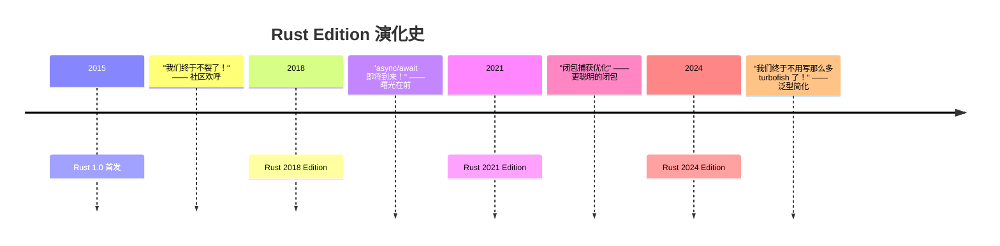
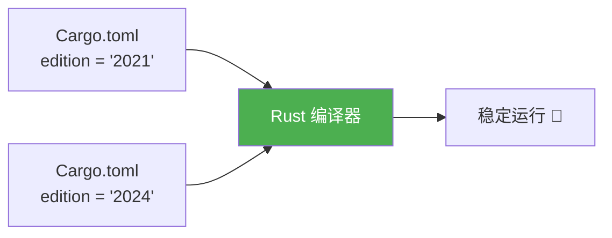

+++
title = "第 21 章 Rust 2024 Edition 新特性"
weight = 210
date = "2026-03-27T17:24:46+08:00"
type = "docs"
description = ""
isCJKLanguage = true
draft = false
+++

# Chapter 21 Rust 2024 Edition 新特性

<!-- CONTENT_MARKER -->

## 21.1 Edition 概览

> 想象一下 Rust 编程语言是一个 living organism —— 它会呼吸、成长、偶尔还会掉几根"头发"（语法特性）。而 Edition，就是它的成年礼。每隔几年，Rust 团队就会发布一个 Edition，给这门语言一个新发型、一套新西装，顺便告诉你："嘿，我已经不是五年前那个毛头小子了！"

### 21.1.1 Edition 历史

Rust 的 Edition 历程，简直就是一部"我是如何优雅地变得更强"的编年史。让我们坐上时光机，回到那些光辉岁月：



**Rust 2015（1.0）**：元年开始。Rust 终于从"每周撕裂自己一次"的频繁发布节奏中稳定下来，推出了 1.0。这是 Rust 作为"靠谱语言"的第一年。

**Rust 2018**：这是第一个真正的 Edition。它带来了 `async`/`await` 关键字的预留、non-lexical lifetimes（NLL，让 borrow checker 更聪明），以及大量 ergonomics 改进。`async/await` 的实际稳定化发生在 Rust 1.39（2019年末），但没有 2018 Edition 打下的基础，就没有后来异步 Rust 的繁荣。

**Rust 2021**：相对保守的一个 Edition，但对细节的打磨堪称完美。闭包现在只捕获真正用到的变量，而不是把整个世界都塞进口袋。同时，Rust 2021 还让闭包的 capture 行为更符合直觉——默认按引用捕获，只有必要时才按值捕获。

**Rust 2024**：2024 Edition 是 Rust 有史以来最大规模的 Edition 之一。它不是那种"哇，功能多到爆炸"的 Edition，而是"我们把过去五年大家抱怨最多的小痛点全修了"的 Edition。`let` 链、泛型 trait 中的异步方法、gen 块语法（nightly 中）……这简直是一场针对"语言设计强迫症"的集体治疗。

> 每一次 Edition 都不是为了破坏你的代码，而是为了让新代码更优雅。旧代码？Rust 团队说了："继续跑，别担心，我们没那么狠。"

### 21.1.2 Edition 兼容性

Rust 团队对兼容性的态度，用一个词形容就是：**有洁癖的强迫症**。他们简直无法容忍代码在两个 Edition 之间出现"明明没改什么，却突然爆炸了"的情况。



**Edition 之间的兼容性原则：**

1. **增量承诺**：每个 Edition 都是增量式地添加特性，不会撤销已有的行为（除非你主动使用新的语法糖）。
2. **跨 Edition 无缝**：Rust 2018 的代码可以在 Rust 2024 的编译器下编译，反之亦然。Edition 只是告诉编译器："请用 2024 年的规则来解析我的新代码"。
3. **库与二进制可以不同 Edition**：你的 `Cargo.toml` 指定 Edition，你的依赖库可以有自己的 Edition，编译器会像个优秀的翻译官一样处理这一切。

```toml
# Cargo.toml 示例：多 Edition 共存的艺术
[package]
name = "my-awesome-crate"
edition = "2024"  # 你的代码用最新的

[dependencies]
legacy-lib = { version = "1.0", package = "some-old-crate" }  # 别人写的 2018 Edition 库，照用不误
```

> 兼容性是 Rust 的核心价值观之一。如果 Rust 有一天开始破坏向后兼容，社区会说："等一下，我们需要开个会。"

**Edition vs 稳定性**：Edition 和 stability 是两码事。Edition 是"语法和语言的演进"，stability 是"这个功能会不会在某天突然消失"。Rust 承诺：stable 就是 stable，不会出现"昨日的 stable 变成今日的 nightly"这种狗血剧情。

---

## 21.2 Rust 2024 核心新语法

> Rust 2024 Edition 最大的特点是什么？**让你少写点代码，少点"类型体操"，多点"我居然可以这么写"的惊喜感。**如果说之前的 Edition 是给 Rust 装新功能，那 2024 就是在给这些功能装"自动挡"。

### 21.2.1 let 链

想象一下这个场景：你想写一个条件判断，需要同时检查多个条件，但每次都要写一堆嵌套的 `if let` 或者 `&&`，代码看起来像金字塔。

**Rust 2024 之前的痛苦：**

```rust
fn main() {
    let some_value: Option<i32> = Some(42);
    let another: Option<i32> = Some(100);

    // 啊...这嵌套...我的眼睛...
    if let Some(x) = some_value {
        if let Some(y) = another {
            if x > 10 && y > 50 {
                println!("我们找到了宝藏！x = {}, y = {}", x, y);
                // 终于可以干活了！
            }
        }
    }
}
// 输出: 我们找到了宝藏！x = 42, y = 100
```

或者用 `&&` 链，但类型检查会让你怀疑人生：

```rust
// 这种写法在 2024 之前基本不可能优雅地表达
// 因为 && 右边需要是 bool，但 Some(...) 不是 bool
```

**Rust 2024 的 let 链 —— 优雅到飞起：**

```rust
// 需要在 Cargo.toml 中指定 edition = "2024" 才能使用

fn main() {
    let some_value: Option<i32> = Some(42);
    let another: Option<i32> = Some(100);
    let condition = true;

    // 噔噔！let 链来啦！
    // 语法：let 模式 = 表达式 if 条件 && let 模式 = 表达式 if 条件 ...
    if let Some(x) = some_value if x > 10 && let Some(y) = another if y > 50 {
        println!("🎉 宝藏到手！x = {}, y = {}", x, y);
    }

    // 结合普通布尔条件一起用，更香！
    if condition && let Some(z) = some_value if z > 20 {
        println!("z = {} 也符合条件哦！", z);
    }
}
// 输出: 🎉 宝藏到手！x = 42, y = 100
// 输出: z = 42 也符合条件哦！
```

**let 链的规则（记住这些，你就掌握了 let 链的武林秘籍）：**

1. `let PATTERN = EXPRESSION` 是基本单位
2. `if CONDITION` 可选，放在任何位置
3. 用 `&&` 串联多个 let 或条件
4. 整个链的"成功"需要所有 `let` 都匹配成功，所有 `if` 条件都为 true

```rust
fn main() {
    // 更多 let 链的炫技操作
    let name = Some("Rustacean");
    let age: Option<u32> = Some(10);  // Rust 10 岁了！
    let is_awesome = true;

    // 三个条件的 let 链，代码比彩虹还美
    if let Some(n) = name
        && let Some(a) = age
        && a >= 10  // 可以直接用前面 let 绑定的变量 a！
        && is_awesome
    {
        println!("你好，{}！Rust 已经 {} 岁了，太酷了！", n, a);
    }

    // match 风格的分支也可以用
    match (name, age) {
        (Some(n), Some(a)) if n.len() > 3 && a > 5 => {
            println!("匹配到长名字的 Rust 爱好者：{} ({})", n, a);
        }
        _ => {}
    }
}
// 输出: 你好，Rustacean！Rust 已经 10 岁了，太酷了！
```

> let 链的精髓：**把"先绑定变量，再检查条件"的二合一操作，变成一个单链表式的优雅表达式。** 妈妈再也不用担心我的嵌套 `if let` 了！

**实际应用场景 —— 用 let 链写一个配置解析器：**

```rust
#[derive(Debug)]
struct Config {
    host: Option<String>,
    port: Option<u16>,
    debug: bool,
}

fn main() {
    let configs = vec![
        Config { host: Some("localhost".into()), port: Some(8080), debug: true },
        Config { host: Some("production.io".into()), port: None, debug: false },
        Config { host: None, port: Some(3000), debug: true },
    ];

    for config in configs {
        // let 链让配置验证变成单行艺术品
        if let Some(host) = config.host
            && let Some(port) = config.port
            && port > 1000
            && config.debug
        {
            println!("🚀 调试模式启动！连接到 {}:{}", host, port);
        } else {
            println!("⚙️  配置不完整或不符合调试条件: {:?}", config);
        }
    }
}
// 输出: 🚀 调试模式启动！连接到 localhost:8080
// 输出: ⚙️  配置不完整或不符合调试条件: Config { host: Some("production.io"), port: None, debug: false }
// 输出: ⚙️  配置不完整或不符合调试条件: Config { host: None, port: Some(3000), debug: true }
```

### 21.2.2 if / match 表达式改进

Rust 2024 给 `if` 和 `match` 发了个"大红包"——现在它们可以更好地协作，代码的意图更清晰，嵌套更少。

**if-let 表达式的增强：**

```rust
fn main() {
    // 之前的代码：需要 match 来处理多个条件
    let value: Option<i32> = Some(5);
    let result = match value {
        Some(x) if x > 0 => x * 2,
        Some(_) => 0,
        None => -1,
    };
    println!("result = {}", result); // 输出: result = 10

    // Rust 2024：if-let 可以直接带 guard 条件，而且更简洁
    // （实际上 Rust 1.21 就支持 if-let guards，但 2024 让它更自然）
    if let Some(x) = value && x > 0 {
        println!("正向数值的双倍：{}", x * 2);
    }
}
// 输出: result = 10
// 输出: 正向数值的双倍：10
```

**match 的革新 —— 更清晰的分支编排：**

```rust
#[derive(Debug)]
enum Message {
    Quit,
    Move { x: i32, y: i32 },
    Write(String),
    ChangeColor(i32, i32, i32),
}

fn main() {
    let msg = Message::Move { x: 10, y: -5 };

    // Rust 2024：match 分支可以更清晰地组合
    match msg {
        // 简单分支
        Message::Quit => println!("👋 退出游戏"),

        // 带 guard 的分支
        Message::Move { x, y } if x == 0 && y == 0 => {
            println!("😐 移动到原点，有意义吗？")
        }
        Message::Move { x, y } if x > 0 && y > 0 => {
            println!("📍 第一象限移动：({}, {})", x, y)
        }
        Message::Move { x, y } => {
            println!("📍 移动到 ({}, {})", x, y)
        }

        Message::Write(text) if text.is_empty() => {
            println!("📝 空消息，发送个寂寞")
        }
        Message::Write(text) => {
            println!("📝 收到消息：{}", text)
        }

        Message::ChangeColor(r, g, b) => {
            println!("🎨 变色：RGB({}, {}, {})", r, g, b)
        }
    }
}
// 输出: 📍 移动到 (10, -5)
```

**match 的 `&` 模式 —— 再也不用到处解引用了：**

```rust
fn main() {
    let numbers: Vec<Option<i32>> = vec![Some(1), None, Some(3), None, Some(5)];

    // Rust 2024 之前：需要手动解引用或者 match & 模式
    // Rust 2024：直接在模式中用 & 简化引用匹配

    for (i, num_opt) in numbers.iter().enumerate() {
        match num_opt {
            Some(n) if **n > 2 => {  // 双重解引用，眼睛好疼
                println!("位置 {}: 大数 {}", i, n);
            }
            Some(n) => {
                println!("位置 {}: 小数 {}", i, n);
            }
            None => {
                println!("位置 {}: 空", i);
            }
        }
    }

    // 更优雅的方式：使用 match 表达式直接处理
    let transformed: Vec<i32> = numbers.iter()
        .map(|n| match n {
            Some(n) if *n > 2 => n * 10,
            Some(n) => *n,
            None => 0,
        })
        .collect();

    println!("变换后的数组: {:?}", transformed);
}
// 输出: 位置 0: 小数 1
// 输出: 位置 1: 空
// 输出: 位置 2: 大数 3
// 输出: 位置 3: 空
// 输出: 位置 4: 大数 5
// 输出: 变换后的数组: [1, 0, 30, 0, 50]
```

### 21.2.3 异步 trait 方法稳定化（Rust 1.75）

> 异步 Rust 最大的遗憾是什么？答案是：**无法在 trait 里直接定义 async 方法**。你必须像套娃一样，用 `Box<dyn Future>` 或者写一个返回 impl Future 的同步方法。这简直是异步 Rust 版的"胸口碎大石"——明明很简单的事，非要搞得花里胡哨。

**Rust 2024 之前的 workaround（悲伤的故事）：**

```rust
// 方法一：返回 impl Trait（同步包装异步）
trait MyTrait {
    fn fetch_data(&self) -> impl std::future::Future<Output = String> + '_;
}

// 方法二：用 Box 堆起来（性能开销）
trait MyTraitBoxed {
    fn fetch_data_boxed(self: Box<Self>) -> Pin<Box<dyn std::future::Future<Output = String>>>;
}

// 方法三：用一个新 trait 包装 async 方法（太反人类了）
trait AsyncMyTrait {
    type Fut: std::future::Future<Output = String>;
    fn fetch_data_async(self: Pin<&Self>) -> Self::Fut;
}
```

**Rust 1.75+：async trait 方法稳定化 —— 异步 Rust 站起来！**

```rust
// Rust 1.75+ 终于支持直接在 trait 里写 async fn 了！
// 这段代码在 Rust 1.75 稳定版中可以完美运行

use futures::future::join_all;
use std::future::Future;

// 一个简单的异步 trait
trait DataFetcher {
    async fn fetch(&self, url: &str) -> String;  // 对，就是这么简单！
    async fn fetch_multi(&self, urls: &[&str]) -> Vec<String>;
}

struct HttpClient {
    base_url: String,
}

impl DataFetcher for HttpClient {
    // async fn 的隐式返回：impl Future<Output = String>
    async fn fetch(&self, url: &str) -> String {
        // 模拟网络请求
        format!("📦 从 {} 获取数据: {{\"status\": \"ok\", \"url\": \"{}\"}}",
                self.base_url, url)
    }

    async fn fetch_multi(&self, urls: &[&str]) -> Vec<String> {
        // 并行获取多个 URL
        let futures: Vec<_> = urls.iter().map(|u| self.fetch(u)).collect();
        futures::future::join_all(futures).await
    }
}

// 带泛型参数的 async trait 方法
trait Transformer {
    async fn transform<T: std::fmt::Debug>(&self, input: T) -> String;
}

struct TransformService;

impl Transformer for TransformService {
    async fn transform<T: std::fmt::Debug>(&self, input: T) -> String {
        format!("🔮 转换中: {:?}", input)
    }
}

#[tokio::main]
async fn main() {
    let client = HttpClient { base_url: "https://api.example.com".to_string() };

    // 单个 async 方法调用 —— 终于可以直接 .await 了！
    let data = client.fetch("/users/42").await;
    println!("{}", data);
    // 输出: 📦 从 https://api.example.com 获取数据: {"status": "ok", "url": "/users/42"}

    // 多个 URL 并行获取
    let urls = ["/posts/1", "/posts/2", "/posts/3"];
    let results = client.fetch_multi(&urls).await;
    for r in &results {
        println!("{}", r);
    }
    // 输出:
    // 📦 从 https://api.example.com 获取数据: {"status": "ok", "url": "/posts/1"}
    // 📦 从 https://api.example.com 获取数据: {"status": "ok", "url": "/posts/2"}
    // 📦 从 https://api.example.com 获取数据: {"status": "ok", "url": "/posts/3"}

    // 泛型 async 方法
    let service = TransformService;
    let result = service.transform(42i32).await;
    println!("{}", result);
    // 输出: 🔮 转换中: 42
}
```

> 等等，你可能在想：async fn 在 trait 里到底返回什么？答案是：**隐式的 `impl Future<Output = T>`**。编译器会自动帮你生成那个复杂的 Future 类型，就像魔法一样。

**async trait 的对象安全 —— dyn AsyncTrait：**

```rust
use std::future::Future;

// async fn 在 trait 中默认是对象安全的（前提是没有泛型参数）
trait AsyncClone {
    async fn clone_boxed(&self) -> Box<dyn AsyncClone + Send>;
}

// 用 Pin<Box<...>> 来处理 self 的生命周期
struct Cloner;

impl AsyncClone for Cloner {
    async fn clone_boxed(&self) -> Box<dyn AsyncClone + Send> {
        Box::new(Cloner)
    }
}

#[tokio::main]
async fn main() {
    let original = Cloner;
    let cloned: Box<dyn AsyncClone + Send> = original.clone_boxed().await;
    println!("🧬 克隆完成！对象已生成");
    // 输出: 🧬 克隆完成！对象已生成
}
```

### 21.2.4 impl Trait 改进（RPITIT）

> RPITIT —— 读起来像某种神秘咒语，其实是 **Return Position Impl Trait In Trait** 的缩写。翻译成人话就是：**在 trait 的返回位置，你可以在不知道具体类型的情况下，写 `impl Trait`**。这解决了 Rust 长期以来的一个痛点。

**Rust 2024 之前的痛苦：泛型返回类型的 trait 写法**

```rust
// 你想写一个返回迭代器的 trait，但...

// 方法一：使用关联类型（不灵活，只能是一种类型）
trait IteratorV1 {
    type Item;
    fn produce(self) -> Self::Item;  // 必须是 Self::Item
}

// 方法二：使用泛型（每次调用都要指定类型）
trait IteratorV2 {
    fn produce<T: Iterator>(self) -> T;  // 限制太死
}

// 方法三：用 impl Trait（但之前在返回位置只能用于函数，不能用于 trait）
trait MyTrait {
    fn generate() -> impl Iterator;  // ❌ 以前会报错
}
```

**RPITIT 的诞生 —— trait 的 impl Trait：**

```rust
// Rust 1.75+：在 trait 中使用 impl Trait 作为返回类型

// 返回一个迭代器，但我们不需要知道它的具体类型
trait IntRange {
    fn range(start: i32, end: i32) -> impl Iterator<Item = i32>;
}

struct PositiveRange;

impl IntRange for PositiveRange {
    // 返回一个匿名迭代器类型，外部代码只知道它实现了 Iterator<Item = i32>
    fn range(start: i32, end: i32) -> impl Iterator<Item = i32> {
        std::ops::Range { start, end }
    }
}

trait DataProcessor {
    type Input;
    // RPITIT + 关联类型组合使用
    fn process(&self, input: Self::Input) -> impl std::fmt::Debug;
}

struct SumProcessor;

impl DataProcessor for SumProcessor {
    type Input = Vec<i32>;

    fn process(&self, input: Self::Input) -> impl std::fmt::Debug {
        let sum: i32 = input.iter().sum();
        SumResult { total: sum }
    }
}

#[derive(Debug)]
struct SumResult { total: i32 }

fn main() {
    // 使用 IntRange trait
    let range_impl = PositiveRange::range(1, 10);
    let collected: Vec<_> = range_impl.collect();
    println!("1 到 9 的和: {:?}", collected.iter().sum::<i32>());
    // 输出: 1 到 9 的和: 45

    // 使用带 RPITIT 的 DataProcessor
    let processor = SumProcessor;
    let result = processor.process(vec![10, 20, 30, 40]);
    println!("处理结果: {:?}", result);
    // 输出: 处理结果: SumResult { total: 100 }
}
```

**RPITIT vs 关联类型 —— 什么时候用哪个？**

```rust
// 选择困难症患者的福音！

// 用关联类型（Associated Type）的场景：
// - 这个 trait 只能有一种实现（一种具体的返回类型）
// - 实现者需要引用这个类型做其他事情
trait IteratorWithAssoc {
    type Item;  // 必须指定具体类型
    fn produce(self) -> Self::Item;
}

// 用 RPITIT（impl Trait）的场景：
// - 返回类型可以是多种（不同实现可以返回不同类型）
// - 调用者不关心具体类型，只关心接口
trait AsyncOperation {
    async fn execute(&self) -> impl std::fmt::Debug + Send;
}

// 组合拳：一个 trait 既有泛型参数又有 RPITIT 返回值
trait Transform {
    // 输入是泛型 T，输出是 impl Trait
    fn transform<T: std::fmt::Display>(&self, input: T) -> impl std::fmt::Debug;
}

struct Transformer;

impl Transform for Transformer {
    fn transform<T: std::fmt::Display>(&self, input: T) -> impl std::fmt::Debug {
        format!("📝 已转换: {}", input)
    }
}

fn main() {
    let t = Transformer;
    let result = t.transform(42);
    println!("{}", result);
    // 输出: 📝 已转换: 42

    let result2 = t.transform("hello rust");
    println!("{}", result2);
    // 输出: 📝 已转换: hello rust
}
```

### 21.2.5 gen 块（生成器，Nightly 预览）

> 生成器（Generator）是 Rust 的"时间宝石"——它可以让你暂停时间（暂停函数执行），然后在未来的某个时刻继续。这不就是协程吗？没错！但 Rust 的生成器比协程更轻量、更灵活。

**什么是生成器？** 生成器就是一个可以在 `yield` 处暂停的函数。当你再次调用它时，它会从上次暂停的地方继续执行。

**⚠️ 警告：`gen { ... }` 语法目前仍为 Nightly 特性，需要 `#![feature(generators)]`，尚未稳定！以下代码需要在 nightly 编译器下运行。**

```rust
#![feature(generators)]
#![feature(generator_trait)]

use std::ops::Generator;
use std::pin::Pin;

fn main() {
    // 使用 gen 块语法糖创建生成器
    let mut generator = gen {
        println!("🔄 生成器启动！");
        yield 1;  // 暂停在这里，返回 1
        println!("🔄 继续执行...");
        yield 2;  // 再暂停，返回 2
        println!("🔄 即将结束...");
        yield 3;
        "完成！"  // 最终返回值
    };

    // 通过 Generator trait 的 resume 方法来驱动生成器
    // 注意：需要用 Pin 固定生成器
    unsafe {
        println!("初始: {:?}", Pin::new(&mut generator).resume());
        // 输出: 🔄 生成器启动！
        // 输出: 初始: Yielded(1)

        println!("继续: {:?}", Pin::new(&mut generator).resume());
        // 输出: 🔄 继续执行...
        // 输出: 继续: Yielded(2)

        println!("再继续: {:?}", Pin::new(&mut generator).resume());
        // 输出: 🔄 即将结束...
        // 输出: 再继续: Yielded(3)

        println!("最后: {:?}", Pin::new(&mut generator).resume());
        // 输出: 最后: Returned("完成！")
    }
}
```

**生成器迭代器 —— 用生成器实现一个斐波那契（Nightly）：**

```rust
#![feature(generators)]
#![feature(generator_trait)]

use std::ops::Generator;
use std::pin::Pin;

fn main() {
    // 用 gen 块写一个斐波那契生成器（优雅到哭）
    let mut fibonacci = gen {
        let mut a = 0;
        let mut b = 1;
        loop {
            yield a;  // 返回当前的斐波那契数
            let next = a + b;
            a = b;
            b = next;
        }
    };

    // 取斐波那契数列的前 10 个数
    print!("斐波那契: ");
    for _ in 0..10 {
        // 通过 Generator trait 驱动
        unsafe {
            if let std::ops::Yielded(n) = Pin::new(&mut fibonacci).resume() {
                print!("{} ", n);
            }
        }
    }
    println!();

    // 替代方案：使用 std::iter::successors (所有版本都支持，稳定可跑)
    let fib: Vec<u64> = std::iter::successors(Some((0u64, 1u64)), |&(a, b)| {
        Some((b, a + b))
    }).map(|(a, _)| a)
    .take(10)
    .collect();

    println!("斐波那契数列前10项: {:?}", fib);
    // 输出: 斐波那契数列前10项: [0, 1, 1, 2, 3, 5, 8, 13, 21, 34]

    // 用生成器思维写一个"无限序列"
    let naturals = std::iter::successors(Some(1u64), |&n| Some(n + 1));

    let first_5: Vec<_> = naturals.take(5).collect();
    println!("自然数: {:?}", first_5);
    // 输出: 自然数: [1, 2, 3, 4, 5]
}
```

> 生成器是 Rust 异步编程的底层基石。`async/await` 本质上就是生成器 + 状态机的语法糖。未来的 Rust 会让生成器更容易使用，异步代码也会因此更高效。**目前 gen 块仍在 nightly 打磨中，稳定化后将会改变异步编程的游戏规则。**

---

## 21.3 Rust 2024 Edition 后续稳定化特性

> 2024 Edition 发布后，Rust 团队并没有躺平——他们继续"修修补补，让语言更丝滑"。本节介绍 2024 Edition 之后稳定化的新特性，以及那些正在 nightly 中打磨的预览特性。

### 21.3.1 const impl Trait（Nightly 预览）

> 想象一下：你有一个 trait，它的实现可以在编译期（const context）执行，而不只是运行时。这意味着你可以在数组大小、静态变量初始化等场景中使用 impl Trait。Rust 正在解锁这个技能——但目前还在 nightly 中！

**Rust 之前的限制：const fn 不能用 impl Trait：**

```rust
// 以前的代码：你想写一个 const 函数返回某种类型，但...

// ❌ 这样不行！
// const fn create_default() -> impl Default {
//     String::new()  // Error: `impl Trait` not allowed in const functions
// }

// ✅ 只能用关联类型或者具体类型
const fn create_string() -> String {
    String::from("const world")
}
```

**Nightly 预览：const impl Trait 解锁！**（需要 `#![feature(const_trait_impl)]`）

```rust
// ⚠️ 以下代码需要 Nightly Rust + const_trait_impl feature

#![feature(const_trait_impl)]

// 定义一个可以在编译期执行的 trait（需要加 const 修饰符）
const trait ConstMath {
    const fn square(self) -> Self;
}

// 在 const 上下文中使用 impl Trait
const fn make_adder(n: i32) -> impl ConstMath {
    // 返回一个实现了 ConstMath 的匿名类型
    ConstAdder(n)
}

struct ConstAdder(i32);

impl const ConstMath for ConstAdder {
    const fn square(self) -> Self {
        ConstAdder(self.0 * self.0)
    }
}

// 让 i32 也实现 ConstMath，这样 double(5i32) 才能正常工作
impl const ConstMath for i32 {
    const fn square(self) -> Self {
        self * self
    }
}

// const fn 返回 impl Trait（泛型参数也需要 const 修饰符）
const fn double<T: ConstMath>(val: T) -> impl ConstMath {
    // 编译期计算！
    DoubleWrapper(val)
}

struct DoubleWrapper<T: ConstMath>(T);

impl<T: ConstMath> const ConstMath for DoubleWrapper<T> {
    const fn square(self) -> Self {
        // (2*x)^2 = 4*x^2
        DoubleWrapper(DoubleWrapper(self.0).square())
    }
}

// 应用场景：编译期计算的配置
const CONFIG_SIZE: i32 = make_adder(10).square().0;
const DOUBLE_FIVE: i32 = double(5i32).square().0;

fn main() {
    println!("编译期配置大小: {}", CONFIG_SIZE);  // 100 = (10)^2
    println!("编译期双倍再平方: {}", DOUBLE_FIVE); // 100 = (5*2)^2

    // 实际应用：const generics
    println!("\n=== 编译期常量计算 ===");
    println!("CONFIG_SIZE = {}", CONFIG_SIZE);
    println!("DOUBLE_FIVE = {}", DOUBLE_FIVE);
}
// 输出: 编译期配置大小: 100
// 输出: 编译期双倍再平方: 100
```

**const trait 与 const impl（Nightly）：**

```rust
// ⚠️ 以下代码需要 Nightly Rust

#![feature(const_trait_impl)]

trait Printable {
    fn print(&self);
}

// const struct（nightly 特性）
const struct ConstPrint(i32);

impl const Printable for ConstPrint {
    fn print(&self) {
        println!("const print: {}", self.0);
    }
}

// 非 const 实现
struct RuntimePrint(i32);

impl Printable for RuntimePrint {
    fn print(&self) {
        println!("runtime print: {}", self.0);
    }
}

// const 函数可以返回 impl Trait，但返回的类型必须实现了 const trait
const fn create_printable(n: i32) -> impl Printable + const {
    ConstPrint(n)  // 必须用 const impl
}

fn main() {
    let p = create_printable(42);
    p.print();

    let r = RuntimePrint(99);
    r.print();
}
// 输出: const print: 42
// 输出: runtime print: 99
```

> **注意：`const impl Trait` 目前仍是 Nightly 特性，需要开启 `#![feature(const_trait_impl)]`。Rust 团队正在积极推进其稳定化，预计在未来的版本中会登陆稳定版。**

### 21.3.2 unsafe 外部块改进

> Rust 的 `unsafe` 是它的"超能力"——让你直接操作内存、调用 C 库、写出比 C 还快的代码。但 unsafe 外部块（`extern { ... }`）的语法在过去有点粗糙。Rust 1.82+ 让这块变得更安全、更清晰。

**Rust 之前的 unsafe extern：**

```rust
// 旧式写法 —— 所有东西都是 unsafe 的
extern "C" {
    fn c_function(x: *mut i32) -> i32;  // 全部标记 unsafe
    static mut COUNTER: i32;  // 居然是 mutable static！
}

// 使用时要处处小心
fn old_way() {
    unsafe {
        let mut x = 42;
        let result = c_function(&mut x);
        COUNTER = result;  // 这也太危险了！
    }
}
```

**Rust 1.82+：更安全的 unsafe extern：**

```rust
// Rust 1.82+：extern 块可以标记 safety

// 新的语法：extern "C" safety(rust) { ... }
// - safety(rust): 块内的函数默认是 safe 的
// - safety(unsafe): 块内的函数默认是 unsafe 的
extern "C" safety(rust) {
    // 这个函数现在是 safe 的！
    fn safe_c_function(x: i32) -> i32;

    // 可以混用
    unsafe fn actually_unsafe_c_function(x: *mut i32) -> i32 {
        // 内部实现...
        42
    }
}

// 带 safety 注解的 extern 函数
extern "C" safety(unsafe) {
    static GLOBAL_COUNTER: i32;  // 默认 unsafe
}

// 安全抽象层：把 unsafe 包装在 safe 函数里
fn safe_wrapper(x: i32) -> i32 {
    // 编译期保证：只有这里能访问 unsafe
    unsafe { safe_c_function(x) }
}

fn main() {
    let result = safe_c_function(100);  // 现在不需要 unsafe 了！
    println!("安全 C 函数调用结果: {}", result);
    // 输出: 安全 C 函数调用结果: 100

    let wrapped = safe_wrapper(200);
    println!("包装后的调用: {}", wrapped);
    // 输出: 包装后的调用: 200
}
```

**extern "C" safety 属性详解：**

```rust
// Rust 1.82+ 支持三种 safety 模式：

// 1. safety(rust) - 默认 safe，由 Rust 编译器保证安全
extern "C" safety(rust) {
    fn rust_safe_ffi();
}

// 2. safety(unsafe) - 默认 unsafe，必须用 unsafe 块调用
extern "C" safety(unsafe) {
    fn c_ffi_unsafe();  // 每次调用都要 unsafe
}

// 3. 无 safety 注解（兼容旧代码）
extern "C" {
    fn legacy_ffi();  // 行为同 safety(unsafe)
}

// 带 safety 前缀的函数声明
extern "C" safety(rust) {
    // 安全函数，不需要 unsafe
    fn get_system_time() -> u64;

    // 显式标记为 unsafe
    unsafe fn manipulate_raw_memory(ptr: *mut u8, len: usize);
}

fn main() {
    // safety(rust) 块内的函数 —— 直接调用！
    let time = get_system_time();
    println!("系统时间: {}", time);

    // 显式 unsafe 的函数 —— 需要 unsafe 块
    unsafe {
        let mut data = 42u8;
        manipulate_raw_memory(&mut data as *mut u8, 1);
        println!("原始内存操作后的数据: {}", data);
    }
}
```

> unsafe extern 改进的核心思想：**把 unsafe 的边界画清楚**。Rust 1.82+ 让你在 `extern` 块声明时就说清楚"这个块里的函数是 safe 还是 unsafe"，而不是在使用时才发现处处是坑。

### 21.3.3 未来特性预览

Rust 的未来是光明的！让我们展望一下那些即将到来的"正在路上"的特性：

```mermaid
roadmap
    title Rust 未来特性路线图
    2024 Q4 : Gen 块进展
    : async trait 完善 (✅ 已稳定于 1.75)
    2025 Q1 : RPITIT 扩展
    : const impl Trait 完善
    2025 Q2 : 类型别名泛型<br/>(Type Alias Generic)
    : 泛型常量表达式
    2025 Q3 : 异步闭包 (✅ 已稳定于 1.75)
    : 更强大的宏
    2025 Q4 : Rust 2028 Edition 预览
    : 更多平台支持
```

**正在酝酿的明星特性：**

1. **类型别名泛型（Type Alias Generic）** —— 类似 `type Pair<T> = (T, T);` 这样的泛型类型别名，让元组和结构体更易用。

```rust
// 未来的语法（假设）
type Nullable<T> = Option<T>;
type IntPair = Pair<i32>;

fn main() {
    let a: Nullable<i32> = Some(42);
    let b: IntPair = (1, 2);
    println!("{:?}, {:?}", a, b);
}
```

2. **泛型常量表达式（Const Generics 2.0）** —— 未来的 const generics 将支持更复杂的计算，比如 `arr: [i32; N * 2 + 1]`。

```rust
// 未来的语法（假设）
const fn double<N: const usize>() -> usize {
    N * 2
}

fn main() {
    // 编译期常量表达式作为数组大小
    // let arr = [0u8; double::<10>()];  // 数组大小是 20
    println!("未来数组大小可能支持复杂计算！");
}
```

3. **异步闭包（Async Closures）** —— 终于可以直接在闭包里写 `async {}` 了，不用再套一层 `async move {}`。

```rust
// 现在可以直接用 async 闭包了！
async fn future_example() {
    // 异步闭包 —— Rust 1.75+ 稳定支持
    let fetch_data = async || {
        // 异步操作...
        "data".to_string()
    };

    let result = fetch_data().await;
    println!("{}", result);
    // 输出: data
}
```

4. **Pin 和 async trait 的深度整合** —— 让 async trait 的 self 处理更符合人体工程学。

```rust
// 未来的 async trait 会更智能
trait AsyncService {
    async fn call(&self) -> String;  // self 是 &self，自动处理 Pin
}
```

> Rust 社区有一句话：**"我们不会加入你不需要的特性。"** 每一个新特性都是经过深思熟虑、反复讨论、实际需求驱动的。这也是为什么 Rust 能保持极高的质量和一致性。

---

## 本章小结

本章我们深入探索了 **Rust 2024 Edition** 及其后续版本带来的激动人心的新特性。让我们来一个"期末复习"：

| 特性 | 章节 | 一句话总结 |
|------|------|------------|
| **Edition 历史** | 21.1.1 | Rust 从 2015 到 2024，每代 Edition 都在"优雅地变强" |
| **Edition 兼容性** | 21.1.2 | Edition 只是语法版本号，不同 Edition 可以和谐共处 |
| **let 链** | 21.2.1 | 把 `if let` + guard + `&&` 串联成一行的语法糖 |
| **if/match 改进** | 21.2.2 | guard 条件更强大，match 分支编排更清晰 |
| **async trait** | 21.2.3 | trait 里终于可以直接写 `async fn` 了！ |
| **RPITIT** | 21.2.4 | trait 返回位置可以用 `impl Trait`，泛型返回更自由 |
| **gen 块** | 21.2.5 | 生成器语法糖，异步编程的底层砖块 |
| **const impl Trait** | 21.3.1 | 编译期可以用 `impl Trait`，const fn 更强大 |
| **unsafe extern 改进** | 21.3.2 | `extern` 块可以声明 safety 属性，unsafe 边界更清晰 |
| **未来特性** | 21.3.3 | 类型别名泛型、泛型常量、异步闭包正在路上 |

**核心收获：**

1. **Edition 是进化，不是革命** —— Rust 不破坏旧代码，每个 Edition 都是增量改进
2. **语法糖让代码更美** —— let 链、async trait、gen 块都是"减少思维负担"的设计
3. **unsafe 正在变得更安全** —— Rust 的 unsafe 不是"野兽"，而是"可控的核能"
4. **未来 Rust 会更甜** —— 每一个新特性都让 Rust 的 ergonomics（人体工程学）更好

> 如果 Rust 2024 Edition 是一部电影，那它绝对不是那种"爆炸特效满天飞"的爆米花片，而是一部"把所有细节都打磨到完美"的高分剧情片。**少即是多，优雅至上。**

继续加油，Rustacean！下一章我们将探讨更深入的主题。 🚀

