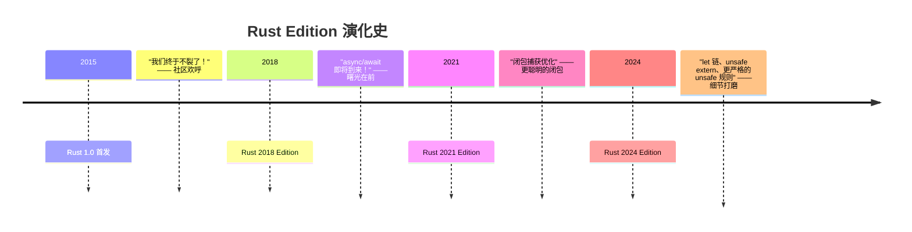
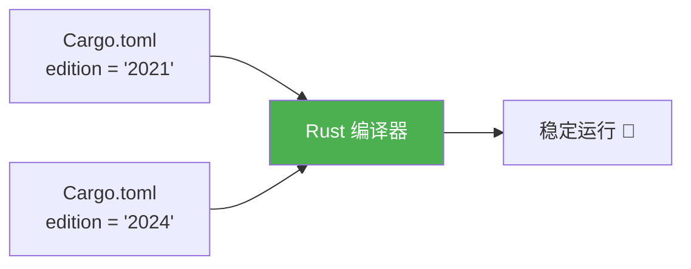
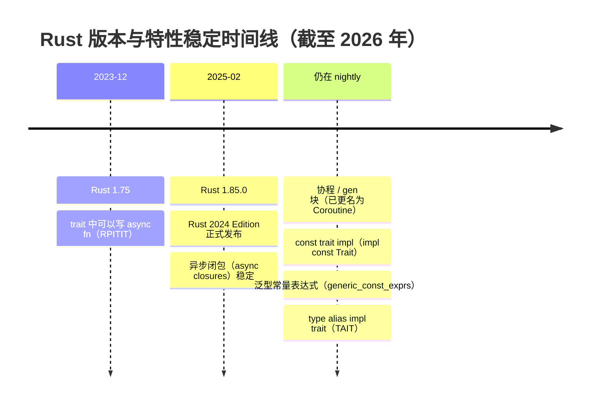

+++
title = "第 21 章 Rust 2024 Edition 新特性"
weight = 210
date = "2026-03-27T17:24:46+08:00"
type = "docs"
description = ""
isCJKLanguage = true
draft = false
+++

# Chapter 21 Rust 2024 Edition 新特性

<!-- CONTENT_MARKER -->

## 21.1 Edition 概览

> 想象一下 Rust 编程语言是一个 living organism —— 它会呼吸、成长、偶尔还会掉几根"头发"（语法特性）。而 Edition，就是它的成年礼。每隔几年，Rust 团队就会发布一个 Edition，给这门语言一个新发型、一套新西装，顺便告诉你："嘿，我已经不是五年前那个毛头小子了！"

### 21.1.1 Edition 历史

Rust 的 Edition 历程，简直就是一部"我是如何优雅地变得更强"的编年史。让我们坐上时光机，回到那些光辉岁月：


```mermaid
timeline
    title Rust Edition 演化史
    2015 : Rust 1.0 首发
           "我们终于不裂了！" —— 社区欢呼
    2018 : Rust 2018 Edition
           "async/await 即将到来！" —— 曙光在前
    2021 : Rust 2021 Edition
           "闭包捕获优化" —— 更聪明的闭包
    2024 : Rust 2024 Edition
             "let 链、unsafe extern、更严格的 unsafe 规则" —— 细节打磨
```

**Rust 2015（1.0）**：元年开始。Rust 终于从"每周撕裂自己一次"的频繁发布节奏中稳定下来，推出了 1.0。这是 Rust 作为"靠谱语言"的第一年。

**Rust 2018**：这是第一个真正的 Edition。它带来了 `async`/`await` 关键字的预留、non-lexical lifetimes（NLL，让 borrow checker 更聪明），以及大量 ergonomics 改进。`async/await` 的实际稳定化发生在 Rust 1.39（2019年末），但没有 2018 Edition 打下的基础，就没有后来异步 Rust 的繁荣。

**Rust 2021**：相对保守的一个 Edition，但对细节的打磨堪称完美。闭包现在只捕获真正用到的变量，而不是把整个世界都塞进口袋。同时，Rust 2021 还让闭包的 capture 行为更符合直觉——默认按引用捕获，只有必要时才按值捕获。

**Rust 2024**：2024 Edition 是 Rust 有史以来规模最大的 Edition 之一。它不是那种"哇，功能多到爆炸"的 Edition，而是"我们把过去五年大家抱怨最多的小痛点全修了"的 Edition：`let` 链、`unsafe extern`、RPIT 生命周期捕获规则调整、`unsafe_op_in_unsafe_fn`、尾表达式的临时值作用域调整……这简直是一场针对"语言设计强迫症"的集体治疗。（提醒：trait 中的 `async fn` 是 Rust 1.75 稳定的语言能力，并不属于 Edition 2024 的专属特性。）

> 每一次 Edition 都不是为了破坏你的代码，而是为了让新代码更优雅。旧代码？Rust 团队说了："继续跑，别担心，我们没那么狠。"

### 21.1.2 Edition 兼容性

Rust 团队对兼容性的态度，用一个词形容就是：**有洁癖的强迫症**。他们简直无法容忍代码在两个 Edition 之间出现"明明没改什么，却突然爆炸了"的情况。


```mermaid
graph LR
    A["Cargo.toml<br/>edition = '2021'"] --> B["Rust 编译器"]
    A1["Cargo.toml<br/>edition = '2024'"] --> B
    B --> C["稳定运行 🛌"]
    style B fill:#4CAF50,color:#fff
```

**Edition 之间的兼容性原则：**

1. **增量承诺**：每个 Edition 都是增量式地添加特性，不会撤销已有的行为（除非你主动使用新的语法糖）。
2. **跨 Edition 无缝**：Rust 2018 的代码可以在 Rust 2024 的编译器下编译，反之亦然。Edition 只是告诉编译器："请用 2024 年的规则来解析我的新代码"。
3. **库与二进制可以不同 Edition**：你的 `Cargo.toml` 指定 Edition，你的依赖库可以有自己的 Edition，编译器会像个优秀的翻译官一样处理这一切。

```toml
# Cargo.toml 示例：多 Edition 共存的艺术
[package]
name = "my-awesome-crate"
edition = "2024"  # 你的代码用最新的

[dependencies]
legacy-lib = { version = "1.0", package = "some-old-crate" }  # 别人写的 2018 Edition 库，照用不误
```

> 兼容性是 Rust 的核心价值观之一。如果 Rust 有一天开始破坏向后兼容，社区会说："等一下，我们需要开个会。"

**Edition vs 稳定性**：Edition 和 stability 是两码事。Edition 是"语法和语言的演进"，stability 是"这个功能会不会在某天突然消失"。Rust 承诺：stable 就是 stable，不会出现"昨日的 stable 变成今日的 nightly"这种狗血剧情。

---

## 21.2 Rust 2024 核心新语法

> Rust 2024 Edition 最大的特点是什么？**让你少写点代码，少点"类型体操"，多点"我居然可以这么写"的惊喜感。**如果说之前的 Edition 是给 Rust 装新功能，那 2024 就是在给这些功能装"自动挡"。

### 21.2.1 let 链

想象一下这个场景：你想写一个条件判断，需要同时检查多个条件，但每次都要写一堆嵌套的 `if let` 或者 `&&`，代码看起来像金字塔。

**Rust 2024 之前的痛苦：**

```rust
fn main() {
    let some_value: Option<i32> = Some(42);
    let another: Option<i32> = Some(100);

    // 啊...这嵌套...我的眼睛...
    if let Some(x) = some_value {
        if let Some(y) = another {
            if x > 10 && y > 50 {
                println!("我们找到了宝藏！x = {}, y = {}", x, y);
                // 终于可以干活了！
            }
        }
    }
}
// 输出: 我们找到了宝藏！x = 42, y = 100
```

或者用 `&&` 链，但类型检查会让你怀疑人生：

```rust
// 这种写法在 2024 之前基本不可能优雅地表达
// 因为 && 右边需要是 bool，但 Some(...) 不是 bool
```

**Rust 2024 的 let 链 —— 优雅到飞起：**

```rust
// 需要在 Cargo.toml 中指定 edition = "2024" 才能使用

fn main() {
    let some_value: Option<i32> = Some(42);
    let another: Option<i32> = Some(100);
    let condition = true;

    // 噔噔！let 链来啦！
    // 语法：let 模式 = 表达式 && 布尔条件 && let 模式 = 表达式 && ...
    // 注意：一个 let 后面如果还想追加条件，接的是 `&&`，不是 `if`。
    if let Some(x) = some_value && x > 10 && let Some(y) = another && y > 50 {
        println!("🎉 宝藏到手！x = {}, y = {}", x, y);
    }

    // 结合普通布尔条件一起用，更香！
    if condition && let Some(z) = some_value && z > 20 {
        println!("z = {} 也符合条件哦！", z);
    }
}
// 输出: 🎉 宝藏到手！x = 42, y = 100
// 输出: z = 42 也符合条件哦！
```

**let 链的规则（记住这些，你就掌握了 let 链的武林秘籍）：**

1. `let PATTERN = EXPRESSION` 是基本单位
2. 各单位之间用 `&&` 串联；`&&` 的左右两侧既可以是 `let` 模式匹配，也可以是普通的布尔表达式
3. let 链必须**以 `let` 开头**——纯布尔条件单独写出来只是普通的 `&&` 表达式，不叫 let 链
4. 整个链"成功"的条件：所有 `let` 都匹配成功，并且所有布尔条件都为 `true`

```rust
fn main() {
    // 更多 let 链的炫技操作
    let name = Some("Rustacean");
    let age: Option<u32> = Some(10);  // Rust 10 岁了！
    let is_awesome = true;

    // 三个条件的 let 链，代码比彩虹还美
    if let Some(n) = name
        && let Some(a) = age
        && a >= 10  // 可以直接用前面 let 绑定的变量 a！
        && is_awesome
    {
        println!("你好，{}！Rust 已经 {} 岁了，太酷了！", n, a);
    }

    // match 风格的分支也可以用
    match (name, age) {
        (Some(n), Some(a)) if n.len() > 3 && a > 5 => {
            println!("匹配到长名字的 Rust 爱好者：{} ({})", n, a);
        }
        _ => {}
    }
}
// 输出: 你好，Rustacean！Rust 已经 10 岁了，太酷了！
```

> let 链的精髓：**把"先绑定变量，再检查条件"的二合一操作，变成一个单链表式的优雅表达式。** 妈妈再也不用担心我的嵌套 `if let` 了！

**实际应用场景 —— 用 let 链写一个配置解析器：**

```rust
#[derive(Debug)]
struct Config {
    host: Option<String>,
    port: Option<u16>,
    debug: bool,
}

fn main() {
    let configs = vec![
        Config { host: Some("localhost".into()), port: Some(8080), debug: true },
        Config { host: Some("production.io".into()), port: None, debug: false },
        Config { host: None, port: Some(3000), debug: true },
    ];

    for config in configs {
        // let 链让配置验证变成单行艺术品
        // 注意：host 是 String（非 Copy），这里用 &config.host 借用，
        // 否则 config 会被部分移动，下面 else 分支里的 {:?} 就用不了了。
        if let Some(host) = &config.host
            && let Some(port) = config.port
            && port > 1000
            && config.debug
        {
            println!("🚀 调试模式启动！连接到 {}:{}", host, port);
        } else {
            println!("⚙️  配置不完整或不符合调试条件: {:?}", config);
        }
    }
}
// 输出: 🚀 调试模式启动！连接到 localhost:8080
// 输出: ⚙️  配置不完整或不符合调试条件: Config { host: Some("production.io"), port: None, debug: false }
// 输出: ⚙️  配置不完整或不符合调试条件: Config { host: None, port: Some(3000), debug: true }
```

### 21.2.2 if / match 表达式改进

Rust 2024 给 `if` 和 `match` 发了个"大红包"——现在它们可以更好地协作，代码的意图更清晰，嵌套更少。

**if-let 表达式的增强：**

```rust
fn main() {
    // 之前的代码：需要 match 来处理多个条件
    let value: Option<i32> = Some(5);
    let result = match value {
        Some(x) if x > 0 => x * 2,
        Some(_) => 0,
        None => -1,
    };
    println!("result = {}", result); // 输出: result = 10

    // Rust 2024：if-let 可以直接带 guard 条件，而且更简洁
    // （实际上 Rust 1.21 就支持 if-let guards，但 2024 让它更自然）
    if let Some(x) = value && x > 0 {
        println!("正向数值的双倍：{}", x * 2);
    }
}
// 输出: result = 10
// 输出: 正向数值的双倍：10
```

**match 的革新 —— 更清晰的分支编排：**

```rust
#[derive(Debug)]
enum Message {
    Quit,
    Move { x: i32, y: i32 },
    Write(String),
    ChangeColor(i32, i32, i32),
}

fn main() {
    let msg = Message::Move { x: 10, y: -5 };

    // Rust 2024：match 分支可以更清晰地组合
    match msg {
        // 简单分支
        Message::Quit => println!("👋 退出游戏"),

        // 带 guard 的分支
        Message::Move { x, y } if x == 0 && y == 0 => {
            println!("😐 移动到原点，有意义吗？")
        }
        Message::Move { x, y } if x > 0 && y > 0 => {
            println!("📍 第一象限移动：({}, {})", x, y)
        }
        Message::Move { x, y } => {
            println!("📍 移动到 ({}, {})", x, y)
        }

        Message::Write(text) if text.is_empty() => {
            println!("📝 空消息，发送个寂寞")
        }
        Message::Write(text) => {
            println!("📝 收到消息：{}", text)
        }

        Message::ChangeColor(r, g, b) => {
            println!("🎨 变色：RGB({}, {}, {})", r, g, b)
        }
    }
}
// 输出: 📍 移动到 (10, -5)
```

**match 的 `&` 模式 —— 再也不用到处解引用了：**

```rust
fn main() {
    let numbers: Vec<Option<i32>> = vec![Some(1), None, Some(3), None, Some(5)];

    // Rust 2024 之前：需要手动解引用或者 match & 模式
    // Rust 2024：直接在模式中用 & 简化引用匹配

    for (i, num_opt) in numbers.iter().enumerate() {
        // num_opt 是 &Option<i32>，匹配 Some(n) 之后 n 是 &i32，解引用一次就够了
        match num_opt {
            Some(n) if *n > 2 => {
                println!("位置 {}: 大数 {}", i, n);
            }
            Some(n) => {
                println!("位置 {}: 小数 {}", i, n);
            }
            None => {
                println!("位置 {}: 空", i);
            }
        }
    }

    // 更优雅的方式：使用 match 表达式直接处理
    let transformed: Vec<i32> = numbers.iter()
        .map(|n| match n {
            Some(n) if *n > 2 => *n * 10,
            Some(n) => *n,
            None => 0,
        })
        .collect();

    println!("变换后的数组: {:?}", transformed);
}
// 输出: 位置 0: 小数 1
// 输出: 位置 1: 空
// 输出: 位置 2: 大数 3
// 输出: 位置 3: 空
// 输出: 位置 4: 大数 5
// 输出: 变换后的数组: [1, 0, 30, 0, 50]
```

### 21.2.3 异步 trait 方法稳定化（Rust 1.75）

> 异步 Rust 最大的遗憾是什么？答案是：**无法在 trait 里直接定义 async 方法**。你必须像套娃一样，用 `Box<dyn Future>` 或者写一个返回 impl Future 的同步方法。这简直是异步 Rust 版的"胸口碎大石"——明明很简单的事，非要搞得花里胡哨。

**Rust 2024 之前的 workaround（悲伤的故事）：**

```rust
// 方法一：返回 impl Trait（同步包装异步）
trait MyTrait {
    fn fetch_data(&self) -> impl std::future::Future<Output = String> + '_;
}

// 方法二：用 Box 堆起来（性能开销）
trait MyTraitBoxed {
    fn fetch_data_boxed(self: Box<Self>) -> Pin<Box<dyn std::future::Future<Output = String>>>;
}

// 方法三：用一个新 trait 包装 async 方法（太反人类了）
trait AsyncMyTrait {
    type Fut: std::future::Future<Output = String>;
    fn fetch_data_async(self: Pin<&Self>) -> Self::Fut;
}
```

**Rust 1.75+：async trait 方法稳定化 —— 异步 Rust 站起来！**

> ⚠️ 本示例依赖 `tokio`（提供 `#[tokio::main]` 运行时）与 `futures`（提供 `join_all`）两个 crate，需要在 `Cargo.toml` 中声明后才能运行，因此标记为 `ignore`。**注意：trait 里写 `async fn` 本身是 Rust 1.75 起就有的标准库能力，与这两个外部依赖无关。**

```rust,ignore
// Rust 1.75+ 终于支持直接在 trait 里写 async fn 了！
// 这段代码需要在 Cargo.toml 中声明 tokio、futures 两个依赖

use futures::future::join_all;
use std::future::Future;

// 一个简单的异步 trait
trait DataFetcher {
    async fn fetch(&self, url: &str) -> String;  // 对，就是这么简单！
    async fn fetch_multi(&self, urls: &[&str]) -> Vec<String>;
}

struct HttpClient {
    base_url: String,
}

impl DataFetcher for HttpClient {
    // async fn 的隐式返回：impl Future<Output = String>
    async fn fetch(&self, url: &str) -> String {
        // 模拟网络请求
        format!("📦 从 {} 获取数据: {{\"status\": \"ok\", \"url\": \"{}\"}}",
                self.base_url, url)
    }

    async fn fetch_multi(&self, urls: &[&str]) -> Vec<String> {
        // 并行获取多个 URL
        let futures: Vec<_> = urls.iter().map(|u| self.fetch(u)).collect();
        futures::future::join_all(futures).await
    }
}

// 带泛型参数的 async trait 方法
trait Transformer {
    async fn transform<T: std::fmt::Debug>(&self, input: T) -> String;
}

struct TransformService;

impl Transformer for TransformService {
    async fn transform<T: std::fmt::Debug>(&self, input: T) -> String {
        format!("🔮 转换中: {:?}", input)
    }
}

#[tokio::main]
async fn main() {
    let client = HttpClient { base_url: "https://api.example.com".to_string() };

    // 单个 async 方法调用 —— 终于可以直接 .await 了！
    let data = client.fetch("/users/42").await;
    println!("{}", data);
    // 输出: 📦 从 https://api.example.com 获取数据: {"status": "ok", "url": "/users/42"}

    // 多个 URL 并行获取
    let urls = ["/posts/1", "/posts/2", "/posts/3"];
    let results = client.fetch_multi(&urls).await;
    for r in &results {
        println!("{}", r);
    }
    // 输出:
    // 📦 从 https://api.example.com 获取数据: {"status": "ok", "url": "/posts/1"}
    // 📦 从 https://api.example.com 获取数据: {"status": "ok", "url": "/posts/2"}
    // 📦 从 https://api.example.com 获取数据: {"status": "ok", "url": "/posts/3"}

    // 泛型 async 方法
    let service = TransformService;
    let result = service.transform(42i32).await;
    println!("{}", result);
    // 输出: 🔮 转换中: 42
}
```

> 等等，你可能在想：async fn 在 trait 里到底返回什么？答案是：**隐式的 `impl Future<Output = T>`**。编译器会自动帮你生成那个复杂的 Future 类型，就像魔法一样。

**async trait 的对象安全 —— dyn AsyncTrait：**

> ⚠️ 这里要先纠正一个非常常见的误解：**trait 里的 `async fn` 默认并不对象安全（dyn compatible）**。
> Rust 1.75 稳定的只是"trait 里可以写 `async fn`"（RPITIT），这类 trait 不能直接写成 `dyn AsyncClone`，
> 编译器会报 `the trait ... is not dyn compatible`。想在 trait 对象上使用异步方法，
> 必须手动把返回类型写成 `Pin<Box<dyn Future<...>>>`——这也是目前唯一稳定的做法：

```rust
use std::future::Future;
use std::pin::Pin;

trait AsyncClone {
    // 手写返回类型后，trait 重新变得对象安全
    fn clone_boxed<'a>(
        &'a self,
    ) -> Pin<Box<dyn Future<Output = Box<dyn AsyncClone + Send + 'a>> + Send + 'a>>;
}

struct Cloner;

impl AsyncClone for Cloner {
    fn clone_boxed<'a>(
        &'a self,
    ) -> Pin<Box<dyn Future<Output = Box<dyn AsyncClone + Send + 'a>> + Send + 'a>> {
        Box::pin(async move { Box::new(Cloner) as Box<dyn AsyncClone + Send> })
    }
}

fn main() {
    let original = Cloner;
    // 这里不接异步运行时，只构造出 Future 验证类型
    let future = original.clone_boxed();
    drop(future);
    println!("🧬 已构造出 Pin<Box<dyn Future<Output = Box<dyn AsyncClone + Send>>>>");
    println!("   真正执行它需要一个异步运行时，例如 tokio 或 futures::executor::block_on");
}
```

### 21.2.4 impl Trait 改进（RPITIT）

> RPITIT —— 读起来像某种神秘咒语，其实是 **Return Position Impl Trait In Trait** 的缩写。翻译成人话就是：**在 trait 的返回位置，你可以在不知道具体类型的情况下，写 `impl Trait`**。这解决了 Rust 长期以来的一个痛点。

**Rust 2024 之前的痛苦：泛型返回类型的 trait 写法**

```rust
// 你想写一个返回迭代器的 trait，但...

// 方法一：使用关联类型（不灵活，只能是一种类型）
trait IteratorV1 {
    type Item;
    fn produce(self) -> Self::Item;  // 必须是 Self::Item
}

// 方法二：使用泛型（每次调用都要指定类型）
trait IteratorV2 {
    fn produce<T: Iterator>(self) -> T;  // 限制太死
}

// 方法三：用 impl Trait（但之前在返回位置只能用于函数，不能用于 trait）
trait MyTrait {
    fn generate() -> impl Iterator;  // ❌ 以前会报错
}
```

**RPITIT 的诞生 —— trait 的 impl Trait：**

```rust
// Rust 1.75+：在 trait 中使用 impl Trait 作为返回类型

// 返回一个迭代器，但我们不需要知道它的具体类型
trait IntRange {
    fn range(start: i32, end: i32) -> impl Iterator<Item = i32>;
}

struct PositiveRange;

impl IntRange for PositiveRange {
    // 返回一个匿名迭代器类型，外部代码只知道它实现了 Iterator<Item = i32>
    fn range(start: i32, end: i32) -> impl Iterator<Item = i32> {
        std::ops::Range { start, end }
    }
}

trait DataProcessor {
    type Input;
    // RPITIT + 关联类型组合使用
    fn process(&self, input: Self::Input) -> impl std::fmt::Debug;
}

struct SumProcessor;

impl DataProcessor for SumProcessor {
    type Input = Vec<i32>;

    fn process(&self, input: Self::Input) -> impl std::fmt::Debug {
        let sum: i32 = input.iter().sum();
        SumResult { total: sum }
    }
}

#[derive(Debug)]
struct SumResult { total: i32 }

fn main() {
    // 使用 IntRange trait
    let range_impl = PositiveRange::range(1, 10);
    let collected: Vec<_> = range_impl.collect();
    println!("1 到 9 的和: {:?}", collected.iter().sum::<i32>());
    // 输出: 1 到 9 的和: 45

    // 使用带 RPITIT 的 DataProcessor
    let processor = SumProcessor;
    let result = processor.process(vec![10, 20, 30, 40]);
    println!("处理结果: {:?}", result);
    // 输出: 处理结果: SumResult { total: 100 }
}
```

**RPITIT vs 关联类型 —— 什么时候用哪个？**

```rust
// 选择困难症患者的福音！

// 用关联类型（Associated Type）的场景：
// - 这个 trait 只能有一种实现（一种具体的返回类型）
// - 实现者需要引用这个类型做其他事情
trait IteratorWithAssoc {
    type Item;  // 必须指定具体类型
    fn produce(self) -> Self::Item;
}

// 用 RPITIT（impl Trait）的场景：
// - 返回类型可以是多种（不同实现可以返回不同类型）
// - 调用者不关心具体类型，只关心接口
trait AsyncOperation {
    async fn execute(&self) -> impl std::fmt::Debug + Send;
}

// 组合拳：一个 trait 既有泛型参数又有 RPITIT 返回值
trait Transform {
    // 输入是泛型 T，输出是 impl Trait
    fn transform<T: std::fmt::Display>(&self, input: T) -> impl std::fmt::Debug;
}

struct Transformer;

impl Transform for Transformer {
    fn transform<T: std::fmt::Display>(&self, input: T) -> impl std::fmt::Debug {
        format!("📝 已转换: {}", input)
    }
}

fn main() {
    let t = Transformer;
    let result = t.transform(42);
    // 返回类型是 impl std::fmt::Debug，所以这里只能用 {:?}
    println!("{:?}", result);
    // 输出: "📝 已转换: 42"（String 的 Debug 输出带引号）

    let result2 = t.transform("hello rust");
    println!("{:?}", result2);
    // 输出: "📝 已转换: hello rust"
}
```

### 21.2.5 gen 块（生成器，Nightly 预览）

> 生成器（Generator）是 Rust 的"时间宝石"——它可以让你暂停时间（暂停函数执行），然后在未来的某个时刻继续。这不就是协程吗？没错！但 Rust 的生成器比协程更轻量、更灵活。

**什么是生成器？** 生成器就是一个可以在 `yield` 处暂停的函数。当你再次调用它时，它会从上次暂停的地方继续执行。

> ⚠️ 警告：生成器（现在官方叫**协程 / Coroutine**）仍是 Nightly 特性，尚未稳定，语法也随时可能变化！
>
> 注意：老的 `#![feature(generators)]`、`std::ops::Generator` 已经被改名并从编译器中**移除**（照抄旧写法会直接报 `feature has been removed`）。现在叫 `#![feature(coroutines)]` / `std::ops::Coroutine`，`gen { ... }` 块也换成了 `#[coroutine] || { ... }` 闭包写法。下面的代码已按当前 nightly 的写法更新，并且标记为 `ignore`。

```rust,ignore
#![feature(coroutines, coroutine_trait, stmt_expr_attributes)]

use std::ops::{Coroutine, CoroutineState};
use std::pin::Pin;

fn main() {
    // 使用 #[coroutine] 闭包创建协程
    let mut generator = #[coroutine] || {
        println!("🔄 生成器启动！");
        yield 1;  // 暂停在这里，返回 1
        println!("🔄 继续执行...");
        yield 2;  // 再暂停，返回 2
        println!("🔄 即将结束...");
        yield 3;
        "完成！"  // 最终返回值
    };

    // 通过 Coroutine trait 的 resume 方法来驱动协程
    // 注意：需要用 Pin 固定协程；当前 nightly 上的 resume 已经不需要 unsafe 了
    println!("初始: {:?}", Pin::new(&mut generator).resume(()));
    // 输出: 🔄 生成器启动！
    // 输出: 初始: Yielded(1)

    println!("继续: {:?}", Pin::new(&mut generator).resume(()));
    // 输出: 🔄 继续执行...
    // 输出: 继续: Yielded(2)

    println!("再继续: {:?}", Pin::new(&mut generator).resume(()));
    // 输出: 🔄 即将结束...
    // 输出: 再继续: Yielded(3)

    println!("最后: {:?}", Pin::new(&mut generator).resume(()));
    // 输出: 最后: Complete("完成！")
}
```

**协程迭代器 —— 用协程实现一个斐波那契（Nightly）：**

```rust,ignore
#![feature(coroutines, coroutine_trait, stmt_expr_attributes)]

use std::ops::{Coroutine, CoroutineState};
use std::pin::Pin;

fn main() {
    // 用 #[coroutine] 闭包写一个斐波那契协程（优雅到哭）
    let mut fibonacci = #[coroutine] || {
        let mut a = 0;
        let mut b = 1;
        loop {
            yield a;  // 返回当前的斐波那契数
            let next = a + b;
            a = b;
            b = next;
        }
    };

    // 取斐波那契数列的前 10 个数
    print!("斐波那契: ");
    for _ in 0..10 {
        // 通过 Coroutine trait 驱动
        if let CoroutineState::Yielded(n) = Pin::new(&mut fibonacci).resume(()) {
            print!("{} ", n);
        }
    }
    println!();

    // 替代方案：使用 std::iter::successors (所有版本都支持，稳定可跑)
    let fib: Vec<u64> = std::iter::successors(Some((0u64, 1u64)), |&(a, b)| {
        Some((b, a + b))
    }).map(|(a, _)| a)
    .take(10)
    .collect();

    println!("斐波那契数列前10项: {:?}", fib);
    // 输出: 斐波那契数列前10项: [0, 1, 1, 2, 3, 5, 8, 13, 21, 34]

    // 用生成器思维写一个"无限序列"
    let naturals = std::iter::successors(Some(1u64), |&n| Some(n + 1));

    let first_5: Vec<_> = naturals.take(5).collect();
    println!("自然数: {:?}", first_5);
    // 输出: 自然数: [1, 2, 3, 4, 5]
}
```

> 生成器是 Rust 异步编程的底层基石。`async/await` 本质上就是生成器 + 状态机的语法糖。未来的 Rust 会让生成器更容易使用，异步代码也会因此更高效。**目前 gen 块仍在 nightly 打磨中，稳定化后将会改变异步编程的游戏规则。**

---

## 21.3 Rust 2024 Edition 后续稳定化特性

> 2024 Edition 发布后，Rust 团队并没有躺平——他们继续"修修补补，让语言更丝滑"。本节介绍 2024 Edition 之后稳定化的新特性，以及那些正在 nightly 中打磨的预览特性。

### 21.3.1 const trait impl（Nightly 预览）

> 想象一下：你有一个 trait，它的方法可以在编译期（const context）执行，而不只是运行时。这意味着你可以在常量求值、静态变量初始化、数组长度等场景里调用 trait 方法。Rust 正在解锁这个技能——但目前还在 nightly 中！

**Rust 之前的限制：const fn 不能用 impl Trait：**

```rust
// 以前的代码：你想写一个 const 函数返回某种类型，但...

// ❌ 这样不行！
// const fn create_default() -> impl Default {
//     String::new()  // Error: `impl Trait` not allowed in const functions
// }

// ✅ 只能用关联类型或者具体类型
const fn create_string() -> String {
    String::from("const world")
}
```

**Nightly 预览：const trait impl**（需要 `#![feature(const_trait_impl)]`）

> 名字先纠正：这个特性的正式名称是 **const trait impl**，而不是 "const impl Trait"。它解决的是"trait 方法能不能在常量上下文里调用"的问题，和 `impl Trait` 没有直接关系。

Rust 目前 nightly 上的语法长这样：

```rust,ignore
// ⚠️ 需要 nightly 编译器
#![feature(const_trait_impl)]

// ① 用 `const trait` 声明一个"可以在常量上下文使用"的 trait。
//    旧版本用的是 `#[const_trait]` 属性，该属性已经被移除，
//    网上残留的 `#[const_trait]` 写法已经过时。
const trait ConstMath {
    fn square(self) -> Self;
}

// ② 实现一侧写 `impl const Trait for Type`
impl const ConstMath for i32 {
    fn square(self) -> Self {
        self * self
    }
}

// ③ 因为实现是 const 的，所以可以在常量求值里调用 trait 方法
const FOUR: i32 = 2i32.square();

fn main() {
    println!("2 的平方（编译期算好）= {}", FOUR); // 4
}
```

> 关于这个特性，有几个容易被"野生教程"带偏的点，务必记牢：
>
> 1. 语法是 `const trait` + `impl const Trait`，**不是** `#[const_trait]`（已被移除），更没有 `const struct` 这种东西；
> 2. `const fn` 目前**不能返回 `impl Trait`**，"const fn 返回 impl Trait"是不成立的；
> 3. 没有 `impl Trait + const` 这种写法，const 约束写在泛型约束的位置（例如 `T: [const] Trait`）；
> 4. 该特性仍在 nightly 打磨（tracking issue #143874），语法随时可能调整，不要用在生产代码里。

**const trait 与 const impl（Nightly）：**

```rust,ignore
// ⚠️ 以下代码需要 nightly 编译器（`#![feature(const_trait_impl)]`）
#![feature(const_trait_impl)]

// const trait：实现在 const 上下文里也能使用
const trait Printable {
    fn describe(self) -> u32;
}

struct ConstPrint(u32);
struct RuntimePrint(u32);

// const 实现：满足 const trait 的要求，可用于常量求值
impl const Printable for ConstPrint {
    fn describe(self) -> u32 {
        self.0
    }
}

// 普通的运行时 trait：只能在运行时调用
trait RuntimePrintable {
    fn print(&self);
}

impl RuntimePrintable for RuntimePrint {
    fn print(&self) {
        println!("runtime print: {}", self.0);
    }
}

// 常量求值中使用 const trait 方法
const VALUE: u32 = ConstPrint(42).describe();

fn main() {
    println!("编译期算出的值 = {}", VALUE);
    RuntimePrint(99).print();
}
```

> 在上面的例子里，`ConstPrint::describe` 是 const 方法，所以 `const VALUE: u32 = ConstPrint(42).describe();` 成立；而 `RuntimePrint::print` 内部调用了 `println!`，依赖运行时，就不具备 const 能力。**const trait 不是"让任意函数都能在编译期跑"，而是让满足 const 约束的实现参与常量求值。**

> **注意：`const impl Trait` 目前仍是 Nightly 特性，需要开启 `#![feature(const_trait_impl)]`。Rust 团队正在积极推进其稳定化，预计在未来的版本中会登陆稳定版。**

### 21.3.2 unsafe 外部块改进

> Rust 的 `unsafe` 是它的"超能力"——让你直接操作内存、调用 C 库、写出比 C 还快的代码。但 unsafe 外部块（`extern { ... }`）的语法在过去有点粗糙。Rust 1.82+ 让这块变得更安全、更清晰。

**Rust 之前的 unsafe extern：**

```rust
// 旧式写法 —— 所有东西都是 unsafe 的
extern "C" {
    fn c_function(x: *mut i32) -> i32;  // 全部标记 unsafe
    static mut COUNTER: i32;  // 居然是 mutable static！
}

// 使用时要处处小心
fn old_way() {
    unsafe {
        let mut x = 42;
        let result = c_function(&mut x);
        COUNTER = result;  // 这也太危险了！
    }
}
```

**Rust 1.82+：unsafe extern 与 `safe fn`：**

> 先纠正一个流传很广的错误：网上（包括本教程的早期版本）出现过
> `extern "C" safety(rust) { ... }` 这种写法，**它不是 Rust 语法，编译会直接报错**。
> Rust 真正稳定的写法只有两种：把块标记为 `unsafe extern`，以及用 `safe fn` 声明块内某个条目的安全性。

```rust
// 现在两种正确写法

// ② Rust 1.82+：块必须标记为 unsafe，块内条目默认 unsafe，调用时需要 unsafe 块
unsafe extern "C" {
    fn getpid() -> i32;
}

// ③ 也可以在块内用 `safe fn` 把个别函数声明为"安全可调用"
unsafe extern "C" {
    safe fn abs(x: i32) -> i32;
}

fn main() {
    // safe fn 声明的函数：直接调用即可
    println!("abs(-3) = {}", abs(-3));

    // 默认 unsafe 的外部函数：需要 unsafe 块
    let pid = unsafe { getpid() };
    println!("当前进程 PID = {}", pid);
}
```

> 在 Rust 2024 Edition 中，①那种不写 `unsafe` 的旧写法已经是**硬错误**（`extern blocks must be unsafe`），必须写成 ② 或 ③ 的形式。

**旧写法与新写法对照：**

```rust,ignore
// ⚠️ 下面 ① 与 ③ 只是"接口声明"，没有对应的 C 实现，
//    单独编译会在链接阶段报"找不到符号"，因此本块不参与编译检查。

// ① 旧写法（Rust 1.82 之前）：extern 块本身不写 unsafe
//    —— 在 Rust 2024 Edition 中这已经是硬错误
extern "C" {
    fn legacy_ffi();
}

// ② unsafe extern：块内条目默认 unsafe，调用时必须包 unsafe
unsafe extern "C" {
    fn c_ffi_unsafe(x: i32) -> i32;
}

// ③ unsafe extern + safe fn：显式声明某个外部函数满足 Rust 的安全约定
unsafe extern "C" {
    safe fn rust_safe_ffi() -> u32;

    // 同一个块里可以混用：这个仍然需要 unsafe 才能调用
    unsafe fn manipulate_raw_memory(ptr: *mut u8, len: usize);
}

fn main() {
    // safe fn 声明的函数 —— 直接调用
    let v = rust_safe_ffi();
    println!("safe fn 返回值: {}", v);

    // 未声明为 safe 的外部函数 —— 需要 unsafe 块
    unsafe {
        let r = c_ffi_unsafe(42);
        let mut data = 42u8;
        manipulate_raw_memory(&mut data as *mut u8, 1);
        legacy_ffi();
        println!("C 函数返回: {}，原始内存操作后的数据: {}", r, data);
    }
}
```

> 一句话总结：**`unsafe extern` 是"这个块里的东西来自外部、默认不可信"，`safe fn` 是"我作为声明者，保证这一个函数是安全的"。** 编译器只检查你有没有说清楚，不负责替你验证——保证 `safe fn` 真的安全，是写出声明的人的义务。

> unsafe extern 改进的核心思想：**把 unsafe 的边界画清楚**。Rust 1.82+ 让你在 `extern` 块声明时就说清楚"这个块里的函数是 safe 还是 unsafe"，而不是在使用时才发现处处是坑。

### 21.3.3 未来特性预览

Rust 的未来是光明的！让我们展望一下那些即将到来的"正在路上"的特性：


```mermaid
timeline
    title Rust 版本与特性稳定时间线（截至 2026 年）
    2023-12 : Rust 1.75
             : trait 中可以写 async fn（RPITIT）
    2025-02 : Rust 1.85.0
             : Rust 2024 Edition 正式发布
             : 异步闭包（async closures）稳定
    仍在 nightly : 协程 / gen 块（已更名为 Coroutine）
                 : const trait impl（impl const Trait）
                 : 泛型常量表达式（generic_const_exprs）
                 : type alias impl trait（TAIT）
```

**正在酝酿的明星特性：**

1. **泛型类型别名** —— 早就稳定了，不用等未来。

> 常见错误：把 `type Pair<T> = (T, T);` 说成"未来特性"。**泛型类型别名从 Rust 1.0 起就已经稳定**，现在就能用。真正还在开发中的是 **type alias impl trait（TAIT）** 与 **惰性类型别名（lazy type aliases）**。

```rust
// 泛型类型别名：稳定特性，立即可用
type Nullable<T> = Option<T>;
type Pair<T> = (T, T);
type IntPair = Pair<i32>;

fn main() {
    let a: Nullable<i32> = Some(42);
    let b: IntPair = (1, 2);
    println!("{:?}, {:?}", a, b);
    // 输出: Some(42), (1, 2)
}
```

```rust,ignore
// 还在 nightly 的 TAIT（type_alias_impl_trait）：类型别名可以直接等于 impl Trait
#![feature(type_alias_impl_trait)]

type Number = impl std::fmt::Debug;

fn make() -> Number {
    42i32
}

fn main() {
    println!("{:?}", make());
}
```

2. **泛型常量表达式（Const Generics 2.0）** —— 一半稳定，一半还在 nightly。

> 稳定版早就支持"const 泛型参数直接当数组长度"（const generics 自 Rust 1.51 起稳定）。**还没稳定的**是在长度中对泛型常量参数做算术，比如 `[u8; N * 2]`，那需要 nightly 的 `generic_const_exprs`。

```rust
// 稳定版：const 泛型参数直接作为数组长度
fn zeros<const N: usize>() -> [u8; N] {
    [0u8; N]
}

// 稳定版：数组长度里可以调用 const fn，也可以使用 const 常量
const fn double(n: usize) -> usize {
    n * 2
}
const LEN: usize = double(10);

fn main() {
    println!("{:?}", zeros::<4>());
    println!("数组长度 = {}", [0u8; LEN].len()); // 20
}
```

```rust,ignore
// 仍然需要 nightly：长度表达式中含"泛型常量参数的算术"
#![feature(generic_const_exprs)]

fn big<const N: usize>() -> [u8; N * 2 + 1] {
    [0u8; N * 2 + 1]
}

fn main() {
    println!("{}", big::<10>().len()); // 21
}
```

3. **异步闭包（Async Closures）** —— 已经稳定，但版本号常被写错。

> 时间线更正：异步闭包是在 **Rust 1.85.0（2025-02-20）** 与 Rust 2024 Edition 一起稳定的，**不是 1.75**。1.75 稳定的只是"trait 里可以写 `async fn`"。

```rust
// Rust 1.85+：闭包本身可以是 async 的，而且可以像普通闭包一样借用环境
async fn future_example() {
    let name = String::from("Rust");

    // async 闭包：调用它得到 Future，再 .await
    let greet = async || format!("hello, {}", name);

    let msg = greet().await;
    println!("{}", msg); // hello, Rust
}

fn main() {
    // 真正执行 future_example 需要一个异步运行时；这里只是引用一下，避免 dead_code 警告
    let _ = future_example;
    println!("异步闭包已稳定（Rust 1.85+）");
}
```

4. **Pin 和 async trait 的深度整合** —— 让 async trait 的 self 处理更符合人体工程学。

```rust
// 未来的 async trait 会更智能
trait AsyncService {
    async fn call(&self) -> String;  // self 是 &self，自动处理 Pin
}
```

> Rust 社区有一句话：**"我们不会加入你不需要的特性。"** 每一个新特性都是经过深思熟虑、反复讨论、实际需求驱动的。这也是为什么 Rust 能保持极高的质量和一致性。

---

## 本章小结

本章我们深入探索了 **Rust 2024 Edition** 及其后续版本带来的激动人心的新特性。让我们来一个"期末复习"：

| 特性 | 章节 | 一句话总结 |
|------|------|------------|
| **Edition 历史** | 21.1.1 | Rust 从 2015 到 2024，每代 Edition 都在"优雅地变强" |
| **Edition 兼容性** | 21.1.2 | Edition 只是语法版本号，不同 Edition 可以和谐共处 |
| **let 链** | 21.2.1 | 把 `if let` + `&&` + 普通条件串联成一行的语法糖（Edition 2024 稳定） |
| **if/match 改进** | 21.2.2 | guard 条件更强大，match 分支编排更清晰 |
| **async trait** | 21.2.3 | trait 里可以写 `async fn`（Rust 1.75 稳定），但它默认**不**是对象安全的 |
| **RPITIT** | 21.2.4 | trait 返回位置可以用 `impl Trait`，泛型返回更自由 |
| **gen 块 / 协程** | 21.2.5 | 生成器语法糖（nightly，名字与语法均已变化：Coroutine） |
| **const trait impl** | 21.3.1 | 让 trait 方法参与常量求值（nightly，特性名不叫 "const impl Trait"） |
| **unsafe extern 改进** | 21.3.2 | `unsafe extern` 块 + `safe fn`，FFI 信任边界更清晰（Rust 1.82 / Edition 2024） |
| **未来特性** | 21.3.3 | 泛型类型别名早已稳定；TAIT、泛型常量表达式、异步闭包的真实状态见正文 |

**核心收获：**

1. **Edition 是进化，不是革命** —— Rust 不破坏旧代码，每个 Edition 都是增量改进
2. **语法糖让代码更美** —— let 链、async trait、gen 块都是"减少思维负担"的设计
3. **unsafe 正在变得更安全** —— Rust 的 unsafe 不是"野兽"，而是"可控的核能"
4. **未来 Rust 会更甜** —— 每一个新特性都让 Rust 的 ergonomics（人体工程学）更好

> 如果 Rust 2024 Edition 是一部电影，那它绝对不是那种"爆炸特效满天飞"的爆米花片，而是一部"把所有细节都打磨到完美"的高分剧情片。**少即是多，优雅至上。**

继续加油，Rustacean！下一章我们将探讨更深入的主题。 🚀
