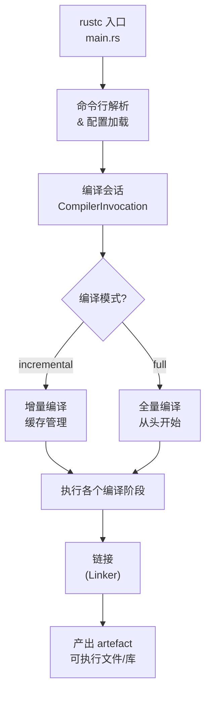
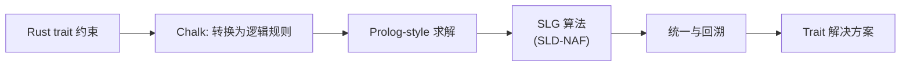
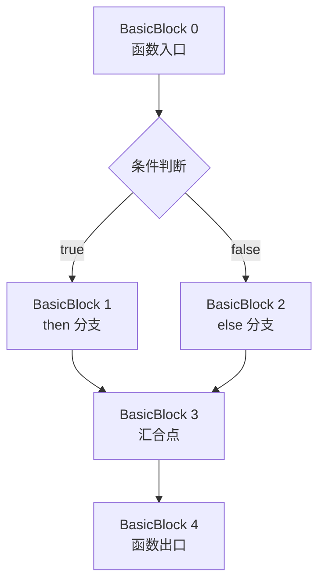
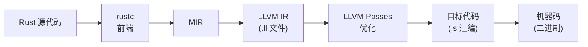
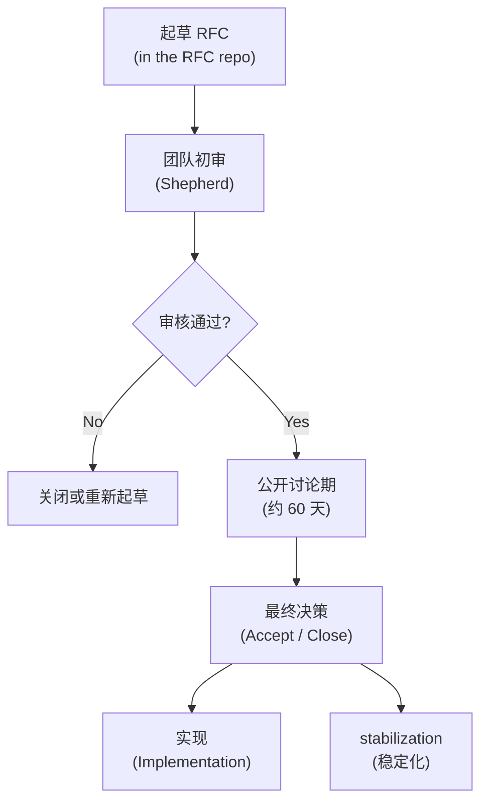

+++
title = "第 22 章 Rust 编译器与语言设计"
weight = 220
date = "2026-03-27T17:24:46+08:00"
type = "docs"
description = ""
isCJKLanguage = true
draft = false
+++

# Chapter 22 Rust 编译器与语言设计

<!-- CONTENT_MARKER -->

> 你有没有想过，当你 `cargo build` 的时候，背后究竟发生了什么？Cargo 悠悠地打印出 "Compiling..."，然后 Rust 编译器（rustc）就像一台精密的瑞士手表一样开始工作——词法分析、语法解析、类型检查、 borrowck、代码生成……每一个步骤都像交响乐团的乐手，各司其职，配合得天衣无缝。本章我们就来拆解这台"编译器交响乐团"的乐器组，聊聊 Rust 编译器架构、语言设计决策背后的哲学，以及你如何参与到这个伟大项目中去。

## 22.1 编译器架构

想象一下，rustc 不是一个单一的巨型怪物，而是一个由多个组件构成的**工具链生态**。从你敲下 `rustc main.rs` 的那一刻起，代码就开始了一场跨越多个阶段（phase）的奇幻漂流。

### 22.1.1 编译工作流程

Rust 编译器的"长征"大致可以分为以下几个阶段：


下面我们逐一拆解每个阶段——别担心，不会枯燥，我保证至少每节有一个段子。

#### 1. 词法分析（Lexing）——文字的"拆快递"阶段

词法分析器（lexer）就像一个拆快递的机器人，它把一整行源代码这个"大包裹"拆成一个个**词素（token）**。例如：

```rust
let x: i32 = 42;
```

lexer 会把它拆成：

```text
KEYWORD("let") IDENT("x") PUNCT(":") IDENT("i32") PUNCT("=") LITERAL_INT(42) PUNCT(";")
```

> 有趣的是，Rust 的 lexer 还有一个隐藏天赋：它会顺手检测到"图方便"写出的 `!=` 和 `==`，并在心里默默记下——这个人类可能想做什么。需要注意的是，lexer 并不知道 `i32` 是个"类型"——它只是把它当作一个标识符（IDENT）来处理。类型注解的身份是 Parser 在后续阶段才赋予它的。

#### 2. 语法解析（Parsing）——把 token 排列成"语法树"

Parser 接收词素序列，将它们组装成一棵 **AST（抽象语法树）**。这时候编译器就开始检查："嗯，`let` 后面应该跟一个模式（pattern），然后是 `:` 类型注解……"

如果你的代码有语法错误，Parser 会以那种"我早就知道你会这样写"的语气报错：

```text
error: expected `;`, found `}`
 --> src/main.rs:3:14
  |
3 |     fn foo() { bar() }
  |              ----^ unexpected `}`
```

#### 3. 名称解析与宏展开

名称解析器负责把所有的标识符（identifier）和它们"真正定义的地方"对上号。宏在这个阶段被展开——所以你写的 `println!("Hello")` 实际上在解析时已经变成了一大堆你从未见过的 AST 节点。

> 宏展开就像魔术师的揭秘时刻：你以为你只写了一行代码，结果编译器给你变出了一整个图书馆。

#### 4. 类型检查——Rust 类型系统的"安检门"

这是 Rust 最引以为傲的部分之一。类型检查器会验证每个表达式的类型是否兼容，每个函数调用的参数是否匹配，每个 trait 约束是否满足。

类型检查主要基于 **AST**（抽象语法树）进行——解析器把 token 组织成 AST 后，类型检查器就在 AST 上施展它的魔法。但 AST 保留了太多源代码的"语法糖"（比如 `for` 循环、`?` 操作符），不方便直接做复杂分析。于是 AST 会被"降级"成 **HIR（High-level Intermediate Representation，高级中间表示）**，去掉那些语法装饰，让后续的借用检查、优化等阶段能更干净地处理 Rust 语义。

#### 5. MIR 生成与 Borrowck

MIR 是 Rust 编译过程中的"中转站"，我们后面会专门讲它。简单说，MIR 把复杂的 Rust 语义简化为一种**控制流图（Control Flow Graph, CFG）**，让 borrowck 和优化阶段能够更方便地"走查"代码逻辑。

#### 6. LLVM 代码生成——最后的"翻译官"

最终，Rust 的"内心世界"需要被翻译成机器能理解的"外语"。Rust 本身并不直接生成机器码，而是委托 **LLVM** 来完成这项工作。LLVM 拿到 Rust 的中间表示后，会做大量优化，最终吐出目标文件（`.o`）或可执行文件。

### 22.1.2 rustc 驱动

`rustc` 不仅仅是一个编译器——它是一个**驱动（driver）**，负责协调上述所有阶段，并根据不同的命令行参数和目标平台来配置编译行为。

#### rustc 的命令行参数体系

```bash
# 最简单的用法
rustc main.rs

# 指定输出文件名
rustc main.rs -o my_program

# 指定编译模式（debug 或 release）
rustc main.rs -C opt-level=3 --crate-type=bin

# 指定目标平台
rustc main.rs --target=x86_64-unknown-linux-gnu

# 显示编译过程的详细信息（-Z 开头的 unstable 选项）
rustc main.rs -Z verbose-internals
```

> `--crate-type` 可能是你见过最灵活的参数之一：它可以是 `bin`（可执行文件）、`lib`（库）、`rlib`（Rust 静态库）、`dylib`（动态库）、甚至 `proc-macro`（过程宏）。

#### 编译器驱动的工作流程

`rustc` 驱动的工作流程大致如下：



#### LTO：链接时优化

`rustc` 还支持一种叫 **LTO（Link-Time Optimization，链接时优化）** 的高级特性。传统编译是"各自为营"——每个编译单元独立优化，不知道其他单元的存在。LTO 则打破了这个壁垒，让链接器在最后关头还能做全局优化。

```bash
# 开启 Thin LTO（轻量级 LTO，编译时间更短）
rustc main.rs -C lto=thin

# 开启 Full LTO（激进优化，编译时间较长）
rustc main.rs -C lto=full
```

> 打个比方：普通编译就像每个厨师各自做菜，不知道其他人做什么；LTO 则是在上菜前让所有厨师再碰个头，统一调整口味，菜与菜之间更加和谐。

## 22.2 编译器内部

如果说 22.1 是"编译器外部看到的风景"，那本节就是"深入 compiler-construction 地下室的探险"。我们要聊的是几个 Rust 编译器内部的核心组件：Chalk、Polonius、MIR、Borrowck 和 LLVM。

> 别被这些名字吓到——它们每一个都是为了解决一个具体问题而诞生的。Rust 能有今天的安全保证，全靠这些"幕后英雄"。

### 22.2.1 Chalk 逻辑编程引擎

**Chalk** 是一个基于逻辑编程（Logic Programming）的 trait 系统求解器。它的名字来自希腊北部地区 **Chalkidiki**（哈尔基季基）——没错，就是亚里士多德的出生地。虽然你可能觉得一个用 Prolog 风格逻辑推理的求解器和一个希腊半岛之间没什么关联，但 Rust 团队给项目起名字的品味就是这么文艺。

#### Chalk 解决的是什么问题？

Rust 的 trait 系统允许非常复杂的约束，比如：

```rust
trait Clone {
    fn clone(&self) -> Self;
}

trait Debug {
    fn fmt(&self, f: &mut std::fmt::Formatter) -> std::fmt::Result;
}

// 约束：T 必须同时满足 Clone 和 Debug
fn print_if_cloneable_debuggable<T: Clone + Debug>(value: &T) {
    println!("{:?}", value.clone());
}
```

Chalk 的工作是：**给定这些 trait 约束，自动推导出 T 需要满足的所有条件**，并且检测是否存在矛盾（比如 `T: Foo + !Foo`）。

#### Chalk 的工作原理

Chalk 把 Rust 的 trait 约束问题转化为一组**逻辑规则**，然后用 SLG（SLD-NAF with Negation as Failure）算法来求解。



简单示例：

```rust
// Chalk 会把下面这段 Rust 代码
// fn foo<T: Clone + Debug>(x: &T) { ... }
// 转换为逻辑规则：
// Clone(T) :- ...
// Debug(T) :- ...
// foo(T) :- Clone(T), Debug(T)
```

#### 在编译器中使用 Chalk

Chalk 最初是一个独立的项目，后来被集成到了 rustc 中作为 **trait solving engine**。当你写了一个泛型函数，rustc 内部就会调用 Chalk 来求解你需要实现的 trait 约束。

> 想象一下，Chalk 就像编译器里的"福尔摩斯"——它根据蛛丝马迹（trait bounds）推理出你到底需要什么类型。

### 22.2.2 Polonius 所有权检查器

**Polonius** 是 rustc 中一个实验性的 **借款检查器（borrow checker）**，它的名字来自莎士比亚《哈姆雷特》中的老臣 Polonius（波洛尼厄斯）——那句著名的"既不要借债，也不要放债"（*Neither a borrower nor a lender be*）正是这位老臣的家训。这个名字对借款检查器来说简直是天作之合：**Polonius 就是来管"借"和"贷"的**。

传统的 borrow checker 在做分析时，只考虑"当前时间点"的状态。但 Polonius 采用了 **基于生命周期区域的分析（liveness-based analysis）**，可以更准确地处理一些复杂的借用模式。

#### 传统 borrowck 的"痛点"

传统 borrowck 基于**词法作用域（lexical scope）**做分析——借用"活多久"取决于它写在哪个代码块里。这种方式简单但粗暴，会误杀很多实际上安全的代码。典型场景包括：在函数内部持有引用的数据结构、嵌套的条件分支中返回引用等。borrowck 会说"这个借用跟那个借用撞了"，但实际上两者在运行时根本不会重叠。

#### Polonius 的解决方案

Polonius 会把借用拆分成多个**区域（regions）**，并跟踪每个区域中哪些借用是活跃的。这样它就能更聪明地判断"这个引用在此时此地是否还活着"——而不是"这个引用在代码的哪个大括号里"。


#### 启用 Polonius

Polonius 目前还在实验阶段，可以通过 nightly Rust 开启：

```bash
# 需要 Rust nightly 版本
rustup default nightly

# 设置 rustc 使用 Polonius
RUSTFLAGS="-Zpolonius" cargo build
```

> Polonius 的目标不是替代现有的 borrow checker，而是成为一个"更聪明的备选方案"。未来如果它足够稳定，可能会成为默认的 borrow checker。

### 22.2.3 MIR（中级中间表示）

**MIR** 是 Rust 编译器的"中转站语言"——它在 HIR（高级中间表示）之后、LLVM 代码生成之前存在。MIR 的全称是 **Mid-level Intermediate Representation**，它的设计目标是让 Rust 的各种分析和优化更容易实现。

#### MIR 的设计动机

HIR 太接近 Rust 源代码，很多优化逻辑难以在上面直接实现。LLVM 的输入又太低层，不适合做 Rust 特有的语义分析。MIR 就在这两者之间找到了一个完美的"甜蜜点"。

#### MIR 的核心概念

MIR 的核心是**控制流图（Control Flow Graph, CFG）**。每个函数被分解成一系列**基本块（Basic Blocks）**，块与块之间通过**控制流边（edges）**连接。



#### 一个实际的 MIR 例子

给一个简单的 Rust 函数：

```rust
fn add(a: i32, b: i32) -> i32 {
    a + b
}
```

它的 MIR 大致如下（简化版）：

```
// bb0 是入口基本块
bb0: {
    _0 = Add(a, b);        // _0 是返回值位置，这里直接对参数做加法
    return = bb0;          // 控制流终止，将 _0 作为返回值传出
}
```

> 严格来说，`copy(a)` 和 `copy(b)` 是 MIR 对"可 Copy 值"的语义标记，表示这里发生了一次隐式复制，但实际的 MIR 语句中通常直接写操作数，不显式调用 `copy()` 函数。

#### MIR 能做什么？

MIR 是很多 Rust 高级特性的基础设施：

- **Borrowck**：用 MIR 做活跃性分析，判断借用是否安全
- **Const eval**：编译时求值（`const` 函数）基于 MIR
- **Unwinding 和 panic 处理**：MIR 记录了每个基本块的终止方式（正常返回 / panic），让 rustc 能正确处理栈展开
- **优化**：基于 MIR 的死代码消除、常量传播等

> 你可以把 MIR 想象成编译器的"通用语言"——不同阶段、不同优化 pass 都围绕着 MIR 展开，就像机场的行李转盘，每个航班都要经过它。

### 22.2.4 Borrowck 原理

**Borrowck**（借用检查器）是 Rust 内存安全保证的核心防线。它的任务是：**确保所有的借用（borrow）都符合 Rust 的借用规则，且没有数据竞争（data race）和悬垂引用（dangling reference）**。

#### Rust 的借用规则（两条铁律）

1. **规则一**：任意时刻，你可以拥有**任意数量的不可变借用**（`&T`），或者**恰好一个可变借用**（`&mut T`），但不能同时拥有可变借用和任何不可变借用。
2. **规则二**：所有借用都必须"活得足够长"——不能超过它所引用的值的生命周期。

#### Borrowck 的工作原理

Borrowck 在 MIR 上进行**数据流分析（Dataflow Analysis）**。它追踪每个引用的"活跃区间"（liveness），并确保：

- `&mut` 借用开始时，之前的 `&` 借用都已结束
- `&` 借用开始时，不存在活跃的 `&mut` 借用
- 引用不会比它指向的值活得更久

#### 生命周期标注——Borrowck 的"提示器"

当 Rust 的自动生命周期推断不够用时，你需要手动标注生命周期参数：

```rust
// 没有生命周期标注，编译器无法推断
// fn longest(x: &str, y: &str) -> &str { ... }

// 添加生命周期参数后，编译器就能工作了
fn longest<'a>(x: &'a str, y: &'a str) -> &'a str {
    if x.len() > y.len() { x } else { y }
}
```

`'a` 读作"生命周期 'a'"，它告诉编译器："返回的引用的生命周期不会超过输入参数中较短的那个"。

#### NLL（Non-Lexical Lifetimes）：Borrowck 的进化

早期的 Rust borrowck 基于**词法作用域**——只要在代码块结束前引用还没被使用就算合法。但这导致很多实际上安全的代码被拒绝。

NLL 是对传统 borrowck 的重大改进，它引入了**非词法生命周期**，只关注引用真正被使用的区域，而不是整个作用域。

```rust
let mut v = vec![1, 2, 3];

// 不可变借用开始（&v[0]）
let first = &v[0];
println!("{}", first); // 不可变借用在这里最后一次被使用
// NLL 知道 &v[0] 从此不再使用，允许 &v 的借用结束
// 于是这里可以开始一个新的可变借用——词法作用域会拒绝这段代码，
// 但 NLL 放它一马
v.push(5);
```

NLL 使得很多"看起来有借用冲突但实际上安全"的代码得以编译通过。

### 22.2.5 LLVM 优化

**LLVM** 是 Rust 编译工具链的"最后一棒运动员"——它接收 Rust 编译器生成的中间表示（IR），然后在目标机器上生成高度优化的机器码。

#### Rust + LLVM 的关系

Rust 并不是简单地把代码扔给 LLVM 就完事了。它和 LLVM 之间有一个复杂的"协商过程"：



#### 常见的 LLVM 优化 Pass

**1. 常量折叠（Constant Folding）**

```rust
// 源代码
const ANSWER: i32 = 2 * 3 * 7; // 编译器在编译时就计算出结果

fn main() {
    let x = ANSWER; // x 在编译时就等于 42
    println!("{}", x);
}
// 输出: 42
```

**2. 内联（Inlining）**

```rust
#[inline] // 建议编译器内联这个函数
fn add(a: i32, b: i32) -> i32 {
    a + b
}

fn main() {
    let result = add(1, 2); // 可能会被内联为 let result = 3;
    println!("{}", result);
}
// 输出: 3
```

**3. 向量化（SIMD）**

```rust
// Rust 的 SIMD  intrinsics
use std::arch::x86_64::*;

unsafe fn simd_add(a: &[f32; 4], b: &[f32; 4]) -> [f32; 4] {
    let a_vec = _mm_loadu_ps(a.as_ptr());
    let b_vec = _mm_loadu_ps(b.as_ptr());
    let result = _mm_add_ps(a_vec, b_vec);
    let mut out = [0f32; 4];
    _mm_storeu_ps(out.as_mut_ptr(), result);
    out
}

fn main() {
    let a = [1.0, 2.0, 3.0, 4.0];
    let b = [5.0, 6.0, 7.0, 8.0];
    let result = unsafe { simd_add(&a, &b) };
    println!("{:?}", result); // [6.0, 8.0, 10.0, 12.0]
}
```

**4. 死代码消除（Dead Code Elimination）**

```rust
fn used_function() {
    println!("I'm alive!");
}

fn unused_function() { // 这个函数永远不会被调用
    println!("You'll never see me!");
}

fn main() {
    used_function();
}
// 输出: I'm alive!
// 注意: unused_function 的代码在 release 模式下会被完全移除
```

#### Cranelift：未来的替代后端

虽然 LLVM 是目前 Rust 的默认后端，但 Rust 团队也在探索其他选择。**Cranelift** 是一个更轻量的代码生成器，编译速度比 LLVM 快得多（有时候快 5-10 倍），但生成的代码质量稍逊。

```bash
# 使用 Cranelift 后端编译
# 需要安装 cargo-zigbuild 或 codegen 参数
RUSTFLAGS="-Zcodegen-backend=cranelift" cargo build --release
```

> Cranelift 的目标是成为 Rust 的"默认开发后端"——你 `cargo build` 时用 Cranelift 飞快，等发布时再用 LLVM 优化到极致。

## 22.3 贡献与语言演进

Rust 不是凭空产生的——它是一个由全球数千名贡献者共同雕琢的艺术品。Rust 的语言演进过程以其**透明度**和**社区驱动**而著称。任何人都可以提出改进建议，但改变一门语言可不是闹着玩的，所以 Rust 有一套严谨的流程来确保每个决策都经过深思熟虑。

> 如果说 Rust 编译器是"用代码写成的哲学"，那么 Rust 的社区治理就是"用共识写成的宪法"。

### 22.3.1 RFC 流程

**RFC** 的全称是 "Request for Comments"（请求评论）。这是 Rust 语言所有重大变更的起点——不管你是想加一个新语法、改一个标准库 API，还是调整编译器的行为，都必须走 RFC 流程。

#### RFC 的生命周期



#### 如何撰写 RFC

RFC 文件存放在 [rust-lang/rfcs](https://github.com/rust-lang/rfcs) 仓库中。每篇 RFC 都有固定格式：

```markdown
---
feature_name: 可选生命周期参数增强
rustforge_issue: #1234
champion: your-github-username
---

## 摘要
简要说明你要解决什么问题，以及你建议的解决方案。

## 动机
为什么需要这个改变？不做行不行？

## 设计文档
详细描述你的方案，包括语法、语义、向后兼容性等。

## 缺点
这个方案有什么代价？会破坏什么？

## 替代方案
还有哪些可能的方案？它们各自有什么优劣？
```

> 写 RFC 就像写论文——你得先说服自己，再说服别人。切忌"我觉得这样好，大家照做就行"的态度。社区的 peer review 是 RFC 流程中最有价值的部分。

#### RFC 的实践案例

比如 Rust 1.55 版本引入的"范围模式"（Range patterns）就是一个 RFC 产物：

```rust
fn classify(c: char) -> &'static str {
    match c {
        'a'..='z' => "小写字母",
        'A'..='Z' => "大写字母",
        '0'..='9' => "数字",
        _ => "其他字符",
    }
}

fn main() {
    println!("{}", classify('R')); // 大写字母
    println!("{}", classify('7')); // 数字
}
```

### 22.3.2 Rust Forge

**Rust Forge**（https://forge.rust-lang.org/）是 Rust 生态的"官方维基百科"，专门收录 Rust 项目的元信息、贡献指南、决策记录和未来计划。

#### Forge 上有哪些宝藏？

**1. 编译器的开发指南**

```bash
# 克隆 rustc 编译器源码
git clone https://github.com/rust-lang/rust.git
cd rust

# 查阅 INSTALL.md 构建指南
cat INSTALL.md
```

**2. 追踪各个子团队的进展**

Rust 编译器由多个**子团队（subteam）** 负责：

| 子团队 | 职责 |
|--------|------|
| @rust-lang/compiler | 编译器核心（borrowck、miri、 MIR、 LLVM 接口）|
| @rust-lang/lang | 语言设计和 RFC 流程 |
| @rust-lang/library | 标准库和核心 traits |
| @rust-lang/tools | Cargo、rustfmt、clippy 等工具 |
| @rust-lang/release | 编译器发布流程 |

**3. 找到"适合新人"的 Issues**

Forge 有一个专门的页面列出 **good first issues**（适合新手的第一个贡献）：

> "别害怕从小的文档修改或测试用例开始。编译器贡献不一定非要懂 LLVM——有时候修一个拼写错误也能让你成为 Rust 贡献者！"

#### 编译 rustc 并运行测试

```bash
# 克隆 rustc 编译器源码（如果你还没克隆的话）
git clone https://github.com/rust-lang/rust.git
cd rust

# Rust 编译器的构建系统是 ./x.py（基于 Python）
# 第一次构建会自动下载 stage0 编译器等依赖

# 完整编译（首次可能需要 1 小时以上！）
./x.py build --stage 1

# 运行测试
./x.py test --stage 1

# 或者只测试某个特定组件（路径请参考 Rustc Dev Guide）
./x.py test --stage 1 <component-path>
```

> 编译 rustc 可能会花很长时间——第一次完整编译可能需要一个小时以上。建议先从单个组件的测试开始，而不是每次都跑全量测试。`./x.py` 是你最好的朋友，敲 `./x.py --help` 可以看到所有可用选项。

### 22.3.3 参与社区

Rust 的社区可能是编程语言世界中最热情、最友善的社区之一。无论你是想提问、分享经验，还是为 Rust 本身做贡献，都能找到属于自己的位置。

#### 几个主要的社区渠道

| 渠道 | 用途 |
|------|------|
| **users.rust-lang.org** | 用户论坛，提问和讨论 |
| **internals.rust-lang.org** | 编译器开发者的内部讨论 |
| **Discord / Zulip** | 实时讨论，氛围轻松 |
| **GitHub** | 代码贡献、Bug 报告、Issue 讨论 |
| **RustConf** | 年度技术大会 |

#### 贡献代码的第一步建议

**1. 从文档开始**

```bash
# 找到一个你觉得"写得不够清楚"的标准库文档
# 编辑它！标准库源码位于 library/ 目录下
vim library/alloc/src/vec.rs

# 提交 PR
git commit -m "docs: 改进 Vec::push 的文档说明"
git push origin my-first-doc-pr
```

**2. 修复一个 Easy Bug**

```bash
# 在 GitHub 上搜索 rust-lang/rust
# 标签为 "E-easy" 或 "E-mentor" 的 issue
# 这些都是标注了"有人会带你做"的入门级 Bug

# 例如：修复一个 rustc 的错误消息
# 找到相关文件（rustc 源码结构较复杂，请参考 Rustc Dev Guide
# https://rustc-dev-guide.rust-lang.org/overview.html#code-overview）
vim <相关源文件>

# 写测试用例确认 Bug 存在
# 修复代码
# 运行测试
./x.py test --stage 1 src/test/ui/...
```

**3. 参与 RFC 讨论**

> 不写代码也可以为 Rust 做贡献！阅读正在讨论中的 RFC，用你的经验和视角给出反馈。很多 RFC 的最终形态都因为社区讨论而得到了改进。

#### 贡献者许可证协议（CLA）

在提交第一个 PR 之前，你需要签署 **Rust 贡献者许可证协议（Contributor License Agreement, CLA）**。这个协议确保你的代码贡献归 Rust 项目所有，并允许项目以 Apache 2.0 / MIT 双重许可证发布。

签署过程是自动化的——当你第一次提交 PR 时，CLA 机器人会引导你完成签署。

#### 保持耐心和谦逊

编译器开发有其特殊性——有时候一个 PR 要花数月才能合并，因为需要考虑向后兼容性、性能影响、与其他特性的交互等。收到 review 意见时，把它们当作学习机会，而不是批评。

> Rust 的 motto 是 "Fearless Concurrency"（无畏并发）。但在贡献 Rust 本身时，你可能需要另一个 motto："Patient Collaboration"（耐心协作）——两者同样重要。

## 本章小结

本章我们从宏观到微观地探索了 Rust 编译器的内部世界：

- **编译器架构**：从词法分析到 LLVM 代码生成，rustc 经历了多个精心设计的阶段。Cargo 作为构建工具协调这一切，而 rustc 驱动则处理各种编译参数和模式。

- **编译器内部组件**：Chalk 用逻辑编程的思维解决 trait 约束问题；Polonius 用活跃性分析重新定义了借用检查的可能性；MIR 作为中间语言连接了 Rust 语义和 LLVM 优化；Borrowck 通过数据流分析守护着 Rust 的内存安全承诺；LLVM 则在最后一步将一切翻译成高效的机器码。

- **参与 Rust 演进**：RFC 流程确保了语言变更的透明和民主；Rust Forge 是贡献者的知识宝库；社区渠道则为所有人提供了参与的可能——不论你是想修 Bug、写文档，还是参与语言设计讨论。

Rust 编译器的复杂性是其能力的体现，而它的开放性则让每一个使用者都有可能成为塑造者。下一章我们将探讨 Rust 在系统编程领域的实际应用，敬请期待！
