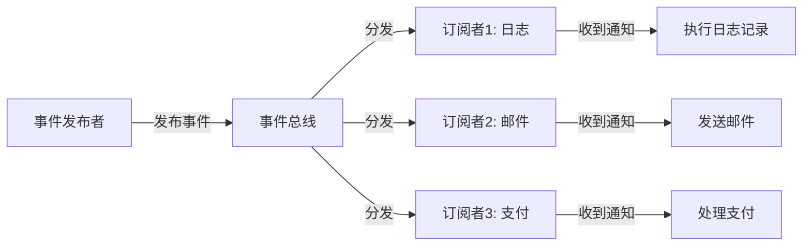
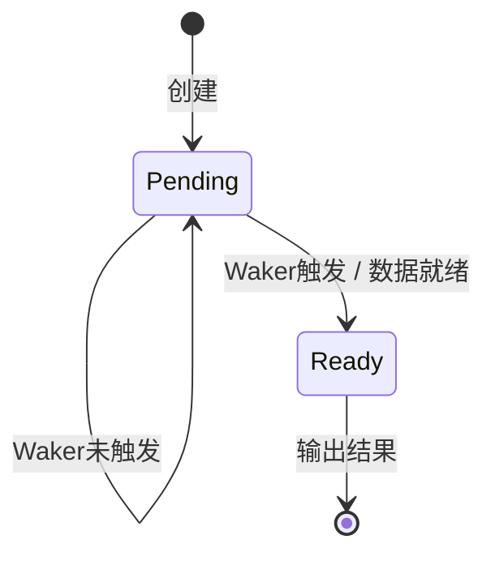
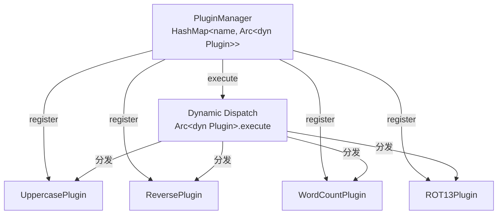

+++
title = "第 24 章 实践项目路线图"
weight = 240
date = "2026-03-27T17:24:46+08:00"
type = "docs"
description = ""
isCJKLanguage = true
draft = false
+++

# Chapter 24 实践项目路线图

<!-- CONTENT_MARKER -->

> 📍 你还在看教程？没关系，这章就是让你"动手做点东西"的拐杖。别担心摔跤，我们有护具。

想象一下：你学完了前面几章，脑子里装了一堆概念——变量、所有权、函数、枚举、模式匹配……但打开编辑器的时候，手指在键盘上悬停了三秒，然后陷入哲学思考："我……能写点啥？"

这就是传说中的"教程读完，手残开始"阶段。别慌，本章就是来拯救你的。我们按学习进度给你安排了三条"项目线"，从"Hello World都勉强"到"感觉自己像个大牛"，总有一款适合你。

---

## 24.1 入门项目（完成第 1-5 章后）

> 🎯 目标：把"我会 Rust 语法"变成"我能用 Rust 写点小玩意儿"

### 24.1.1 命令行"猜数字"游戏

这是编程界的"Hello World Plus"——比 Hello World 稍微刺激一点，至少用户要输入点东西。

```rust
use std::io; // 输入输出库，让我们能跟用户唠嗑
use std::cmp::Ordering; // 比较结果，猜大了还是猜小了
use rand::Rng; // 随机数生成器

fn main() {
    println!("========== 猜数字游戏 ==========");
    println!("我已经想好了一个 1 到 100 之间的数字，来猜猜看！");

    // 生成一个 1-100 的随机秘密数字
    let secret_number = rand::thread_rng().gen_range(1..=100);

    loop {
        println!("\n请输入你的猜测：");

        let mut guess = String::new();
        // 读取用户输入，像接快递一样签收
        io::stdin()
            .read_line(&mut guess)
            .expect("读取输入失败了，你是不是按了 Ctrl+C？");

        // 把字符串转成 u32，trim() 去掉换行符
        let guess: u32 = match guess.trim().parse() {
            Ok(num) => num,
            Err(_) => {
                println!("喂！请输入一个数字，不是你的心情日记！");
                continue;
            }
        };

        println!("你猜了：{}", guess);

        // 经典三分法：猜小了、猜大了、猜对了
        match guess.cmp(&secret_number) {
            Ordering::Less    => println!("太小了！再大胆一点！"),
            Ordering::Greater => println!("太大了！悠着点！"),
            Ordering::Equal   => {
                println!("🎉 恭喜你！猜对了！你是读心大师吗？");
                break; // 游戏结束，退出循环
            }
        }
    }

    println!("游戏结束，再来一把？（重新运行程序即可）");
}
```

> 💡 运行效果（部分）：
```
========== 猜数字游戏 ==========
我已经想好了一个 1 到 100 之间的数字，来猜猜看！

请输入你的猜测：
50
你猜了：50
太大了！悠着点！

请输入你的猜测：
25
你猜了：25
太小了！再大胆一点！

请输入你的猜测：
37
你猜了：37
🎉 恭喜你！猜对了！你是读心大师吗？
游戏结束，再来一把？（重新运行程序即可）
```

**学到了什么：**
- `use` 导入标准库（以及 `rand` 依赖）
- `loop` 循环——猜不对就别想跑
- `match` 模式匹配——三分法分类
- `io::stdin().read_line()` ——用户输入读取
- `parse()` ——字符串到数字的炼金术

### 24.1.2 温度转换器

摄氏度、华氏度互相转换。一级棒的小工具。

```rust
fn celsius_to_fahrenheit(c: f64) -> f64 {
    // 公式：°C × 9/5 + 32 = °F
    c * 9.0 / 5.0 + 32.0
}

fn fahrenheit_to_celsius(f: f64) -> f64 {
    // 公式：(°F - 32) × 5/9 = °C
    (f - 32.0) * 5.0 / 9.0
}

fn main() {
    println!("========== 温度转换器 ==========");

    // 测试几个经典温度
    let temperatures = [0.0, 100.0, -40.0, 37.0];

    for c in temperatures {
        let f = celsius_to_fahrenheit(c);
        println!("{:.1}°C = {:.1}°F", c, f);
    }

    println!("\n--- 华氏转摄氏 ---");

    for f in temperatures {
        let c = fahrenheit_to_celsius(f);
        println!("{:.1}°F = {:.1}°C", f, c);
    }

    // 特别验算：人体温度
    println!("\n🔥 人体正常体温 37°C = {:.1}°F（正常情况下）", celsius_to_fahrenheit(37.0));
}
```

> 💡 运行效果：
```
========== 温度转换器 ==========
0.0°C = 32.0°F
100.0°C = 212.0°F
-40.0°C = -40.0°F（这温度华氏摄氏一样，神奇吧？）
37.0°C = 98.6°F

--- 华氏转摄氏 ---
0.0°F = -17.8°C
100.0°F = 37.8°C
-40.0°F = -40.0°C
37.0°F = 2.8°C

🔥 人体正常体温 37°C = 98.6°F（正常情况下）
```

**学到了什么：**
- 函数定义和返回值的写法
- `f64` 浮点数——温度不是整数
- 循环遍历数组
- 格式化输出（`{:.1}` 保留一位小数）

### 24.1.3 斐波那契数列计算器

算了，据说入门项目要有三个。这第三个名额给数学派——斐波那契数列。

```rust
// 递归版：最直观，但大了会慢到天荒地老（O(2^n) 的时间复杂度，不是栈溢出）
fn fibonacci_recursive(n: u64) -> u64 {
    match n {
        0 => 0,
        1 => 1,
        _ => fibonacci_recursive(n - 1) + fibonacci_recursive(n - 2),
    }
}

// 迭代版：推荐，性能好，不会把栈撑爆
fn fibonacci_iterative(n: u64) -> u64 {
    if n == 0 { return 0; }
    if n == 1 { return 1; }

    let mut prev: u64 = 0;   // fib(0)
    let mut curr: u64 = 1;   // fib(1)

    for _ in 2..=n {
        let next = prev + curr;
        prev = curr;
        curr = next;
    }
    curr
}

fn main() {
    println!("========== 斐波那契数列 ==========");

    for i in 0..=15 {
        let recursive = fibonacci_recursive(i);
        let iterative = fibonacci_iterative(i);
        println!("fib({:>2}) = {:>6} （迭代结果: {:>6}）", i, recursive, iterative);
    }

    // 挑战：fib(50)，递归版会跑很久，迭代版瞬间出结果
    println!("\n⚡ fib(50) = {}", fibonacci_iterative(50));
}
```

> 💡 运行效果：
```
========== 斐波那契数列 ==========
fib( 0) =      0 （迭代结果:      0）
fib( 1) =      1 （迭代结果:      1）
fib( 2) =      1 （迭代结果:      1）
fib( 3) =      2 （迭代结果:      2）
fib( 4) =      3 （迭代结果:      3）
fib( 5) =      5 （迭代结果:      5）
fib( 6) =      8 （迭代结果:      8）
...
fib(14) =    377 （迭代结果:    377）
fib(15) =    610 （迭代结果:    610）

⚡ fib(50) = 12586269025
```

**学到了什么：**
- 递归函数的写法
- 迭代代替递归的思路（省栈、省命）
- `match` 在递归里的优雅用法
- 无符号整数 `u64` 适合正数序列

---

## 24.2 进阶项目（完成第 8-14 章后）

> 🎯 目标：进入"中层管理"阶段——能写结构体、方法、trait、错误处理，还有智能指针

当你搞定了所有权、借用、生命周期、trait、错误处理这些"中阶技能"之后，你会发现自己的代码突然变得……有点"工程化"了。不再是单个文件打天下，而是开始有了模块、有了组织、有了"这东西能维护"的自觉。

下面三个项目，让你感受一下"Rust 工程师是这么干活的"。

### 24.2.1 TodoList（命令行待办事项管理器）

这是从"写代码"到"做产品"的起点。你要管理待办事项——增删改查，持久化到文件。

```rust
use serde::{Deserialize, Serialize}; // 数据序列化，把内存里的数据变成 JSON 存文件
use std::fs; // 文件系统操作
use std::io::{self, BufRead, Write}; // 读取用户输入

// 待办事项的结构体
#[derive(Debug, Clone, Serialize, Deserialize)]
struct TodoItem {
    id: usize,
    title: String,
    done: bool,
}

// TodoList 管理器
#[derive(Debug)]
struct TodoList {
    items: Vec<TodoItem>,
}

impl TodoList {
    // 新建列表
    fn new() -> Self {
        TodoList { items: Vec::new() }
    }

    // 从文件加载
    fn load(path: &str) -> std::io::Result<Self> {
        let content = fs::read_to_string(path)?;
        let items: Vec<TodoItem> = serde_json::from_str(&content)
            .map_err(|e| std::io::Error::new(std::io::ErrorKind::InvalidData, e))?;
        Ok(TodoList { items })
    }

    // 保存到文件
    fn save(&self, path: &str) -> std::io::Result<()> {
        let json = serde_json::to_string_pretty(&self.items)
            .map_err(|e| std::io::Error::new(std::io::ErrorKind::InvalidData, e))?;
        fs::write(path, json)
    }

    // 添加待办
    fn add(&mut self, title: String) {
        let id = self.items.len() + 1;
        self.items.push(TodoItem { id, title, done: false });
        println!("✅ 已添加：\"{}\" (ID: {})", self.items.last().unwrap().title, id);
    }

    // 标记完成
    fn complete(&mut self, id: usize) {
        if let Some(item) = self.items.iter_mut().find(|i| i.id == id) {
            item.done = true;
            println!("🎉 完成：\"{}\"", item.title);
        } else {
            println!("❌ 没找到 ID {} 的待办事项", id);
        }
    }

    // 删除待办
    fn delete(&mut self, id: usize) {
        let len_before = self.items.len();
        self.items.retain(|i| i.id != id);
        if self.items.len() < len_before {
            println!("🗑️  已删除 ID: {}", id);
        } else {
            println!("❌ 没找到 ID {} 的待办事项", id);
        }
    }

    // 列出所有
    fn list(&self) {
        if self.items.is_empty() {
            println!("📝 暂无待办事项，休息一下？☕");
            return;
        }
        println!("\n========== 待办列表 ==========");
        for item in &self.items {
            let status = if item.done { "✅" } else { "⬜" };
            println!("{} [{}] {}", status, item.id, item.title);
        }
        println!("===============================\n");
    }
}

fn main() {
    let db_path = "todos.json";
    let mut list = TodoList::load(db_path).unwrap_or_else(|_| {
        println!("📁 未找到历史数据，新建空列表");
        TodoList::new()
    });

    // 演示：添加一些初始数据
    if list.items.is_empty() {
        list.add("学习 Rust 的 trait".to_string());
        list.add("写一个命令行工具".to_string());
        list.add("理解生命周期".to_string());
    }

    loop {
        println!("\n========== 命令 ==========");
        println!("1. 添加待办");
        println!("2. 查看列表");
        println!("3. 完成任务");
        println!("4. 删除待办");
        println!("5. 保存退出");
        println!("===========================\n");

        print!("请输入命令编号：");
        io::stdout().flush().unwrap();

        let mut cmd = String::new();
        io::stdin().lock().read_line(&mut cmd).unwrap();
        let cmd = cmd.trim();

        match cmd {
            "1" => {
                print!("输入待办事项：");
                io::stdout().flush().unwrap();
                let mut title = String::new();
                io::stdin().lock().read_line(&mut title).unwrap();
                list.add(title.trim().to_string());
            }
            "2" => list.list(),
            "3" => {
                print!("输入要完成的 ID：");
                io::stdout().flush().unwrap();
                let mut id_str = String::new();
                io::stdin().lock().read_line(&mut id_str).unwrap();
                if let Ok(id) = id_str.trim().parse() {
                    list.complete(id);
                }
            }
            "4" => {
                print!("输入要删除的 ID：");
                io::stdout().flush().unwrap();
                let mut id_str = String::new();
                io::stdin().lock().read_line(&mut id_str).unwrap();
                if let Ok(id) = id_str.trim().parse() {
                    list.delete(id);
                }
            }
            "5" => {
                if let Err(e) = list.save(db_path) {
                    eprintln!("保存失败：{}", e);
                } else {
                    println!("💾 已保存到 {}，再见！", db_path);
                }
                break;
            }
            _ => println!("未知命令，请输入 1-5"),
        }
    }
}
```

> 💡 运行效果（部分）：
```
📁 未找到历史数据，新建空列表
✅ 已添加："学习 Rust 的 trait" (ID: 1)
✅ 已添加："写一个命令行工具" (ID: 2)
✅ 已添加："理解生命周期" (ID: 3)

========== 待办列表 ==========
⬜ [1] 学习 Rust 的 trait
⬜ [2] 写一个命令行工具
⬜ [3] 理解生命周期
===============================

请输入命令编号：3
输入要完成的 ID：1
🎉 完成："学习 Rust 的 trait"
```

**学到了什么：**
- `struct` 结构体组织数据
- `impl` 为结构体添加方法
- `serde` 序列化/反序列化（JSON 持久化）
- `?` 操作符传播错误
- `Result` 错误处理的工程化写法
- `match` 和 `if let` 处理不同情况

**需要的依赖（`Cargo.toml`）：**
```toml
[dependencies]
serde = { version = "1.0", features = ["derive"] }
serde_json = "1.0"
```

### 24.2.2 MiniKV（内存键值存储）

用 `HashMap` 做一个小型的内存数据库，支持 `get`、`set`、`delete`、`list`，还能按前缀搜索。

```rust
use std::collections::HashMap;
use std::io::{self, Write};

// 简易 KV 存储
struct MiniKV {
    store: HashMap<String, String>,
}

impl MiniKV {
    fn new() -> Self {
        MiniKV { store: HashMap::new() }
    }

    // 设置键值
    fn set(&mut self, key: String, value: String) {
        self.store.insert(key.clone(), value);
        println!("✨ SET: {} = <value>", key);
    }

    // 获取值
    fn get(&self, key: &str) {
        match self.store.get(key) {
            Some(v) => println!("📖 GET: {} => {}", key, v),
            None => println!("🔍 GET: {} 不存在（也许你可以 SET 一个？）", key),
        }
    }

    // 删除键
    fn delete(&mut self, key: &str) {
        match self.store.remove(key) {
            Some(_) => println!("🗑️  DEL: {} 已删除", key),
            None => println!("🔍 DEL: {} 不存在，删除个寂寞", key),
        }
    }

    // 列出所有键值对
    fn list(&self) {
        if self.store.is_empty() {
            println!("📭 存储是空的，像你的钱包一样");
            return;
        }
        println!("\n========== 所有键值对 ==========");
        for (k, v) in &self.store {
            println!("  {} = {}", k, v);
        }
        println!("================================\n");
    }

    // 按前缀搜索
    fn search(&self, prefix: &str) {
        let matches: Vec<_> = self.store
            .iter()
            .filter(|(k, _)| k.starts_with(prefix))
            .collect();

        if matches.is_empty() {
            println!("🔍 没有任何键以 '{}' 开头", prefix);
        } else {
            println!("🔍 搜索 '{}' 的结果:", prefix);
            for (k, v) in matches {
                println!("  {} = {}", k, v);
            }
        }
    }

    // 键计数
    fn count(&self) {
        println!("📊 共 {} 个键值对", self.store.len());
    }
}

fn main() {
    let mut kv = MiniKV::new();

    // 演示数据
    kv.set("name".to_string(), "Rustacean".to_string());
    kv.set("lang".to_string(), "Rust".to_string());
    kv.set("level".to_string(), "beginner".to_string());
    kv.set("language".to_string(), "Chinese".to_string());

    kv.list();
    kv.get("name");
    kv.get("notexist");
    kv.search("lang"); // 会匹配 lang 和 language
    kv.search("name");
    kv.count();

    kv.delete("level".to_string());
    kv.list();

    // 尝试获取已删除的
    kv.get("level");
}
```

> 💡 运行效果：
```
✨ SET: name = <value>
✨ SET: lang = <value>
✨ SET: level = <value>
✨ SET: language = <value>

========== 所有键值对 ==========
  name = Rustacean
  lang = Rust
  level = beginner
  language = Chinese
================================

📖 GET: name => Rustacean
🔍 GET: notexist 不存在（也许你可以 SET 一个？）
🔍 搜索 'lang' 的结果:
  lang = Rust
  language = Chinese
🔍 搜索 'name' 的结果:
  name = Rustacean
📊 共 4 个键值对
🗑️  DEL: level 已删除

========== 所有键值对 ==========
  name = Rustacean
  lang = Rust
  language = Chinese
================================

🔍 GET: level 不存在（也许你可以 SET 一个？）
```

**学到了什么：**
- `HashMap` 键值存储的 CRUD 操作
- `iter()` / `filter()` / `collect()` 链式操作
- 字符串处理（`starts_with`）
- `Option` 的 `match` 处理

### 24.2.3 简单的事件系统（发布/订阅模式）

事件驱动编程的基础——观察者模式。你订阅了一个事件，当事件发生时，你会收到通知。

```rust
use std::collections::HashMap;
use std::sync::{Arc, Mutex};
use std::thread;
use std::time::Duration;

// 事件类型
#[derive(Debug, Clone, PartialEq)]
enum Event {
    UserCreated(String),
    UserDeleted(String),
    PaymentReceived(f64),
    SystemShutdown,
}

// 订阅者（回调函数）
type Callback = Box<dyn Fn(&Event) + Send + 'static>;

// 事件总线
struct EventBus {
    listeners: HashMap<String, Vec<Callback>>,
}

impl EventBus {
    fn new() -> Self {
        EventBus { listeners: HashMap::new() }
    }

    // 订阅某个事件
    fn subscribe(&mut self, event_type: &str, callback: Callback) {
        self.listeners
            .entry(event_type.to_string())
            .or_insert_with(Vec::new)
            .push(callback);
        println!("📥 订阅成功：{} 事件", event_type);
    }

    // 发布事件
    fn publish(&self, event: &Event) {
        let type_name = match event {
            Event::UserCreated(_) => "UserCreated",
            Event::UserDeleted(_) => "UserDeleted",
            Event::PaymentReceived(_) => "PaymentReceived",
            Event::SystemShutdown => "SystemShutdown",
        };

        println!("\n📢 发布事件：{:?}", event);
        if let Some(callbacks) = self.listeners.get(type_name) {
            for cb in callbacks {
                cb(event); // 触发所有订阅者的回调
            }
        } else {
            println!("（没有任何订阅者，事件石沉大海）");
        }
    }
}

fn main() {
    let bus = Arc::new(Mutex::new(EventBus::new()));
    let bus2 = bus.clone();

    // 订阅者 1：日志记录器
    bus.lock().unwrap().subscribe("UserCreated", Box::new(move |e| {
        if let Event::UserCreated(name) = e {
            println!("📝 [日志] 新用户注册：{}", name);
        }
    }));

    // 订阅者 2：发送欢迎邮件
    bus.lock().unwrap().subscribe("UserCreated", Box::new(move |e| {
        if let Event::UserCreated(name) = e {
            println!("📧 [邮件] 发送欢迎邮件给：{}", name);
            // 模拟发送邮件耗时
            thread::sleep(Duration::from_millis(100));
            println!("📧 [邮件] 邮件已发送！");
        }
    }));

    // 订阅者 3：支付通知
    bus.lock().unwrap().subscribe("PaymentReceived", Box::new(move |e| {
        if let Event::PaymentReceived(amount) = e {
            println!("💰 [财务] 收到付款：${:.2}", amount);
        }
    }));

    // 订阅者 4：系统关闭时的清理工作
    bus.lock().unwrap().subscribe("SystemShutdown", Box::new(|_| {
        println!("🧹 [系统] 执行清理任务...");
    }));

    // 发布一些事件
    bus2.lock().unwrap().publish(&Event::UserCreated("Alice".to_string()));
    println!("---");
    bus2.lock().unwrap().publish(&Event::UserCreated("Bob".to_string()));
    println!("---");
    bus2.lock().unwrap().publish(&Event::PaymentReceived(99.99));
    println!("---");
    bus2.lock().unwrap().publish(&Event::UserDeleted("Charlie".to_string())); // 没人订阅这个
    println!("---");
    bus2.lock().unwrap().publish(&Event::SystemShutdown);

    println!("\n✅ 事件系统演示完毕！");
}
```

> 💡 运行效果：
```
📥 订阅成功：UserCreated 事件
📥 订阅成功：UserCreated 事件
📥 订阅成功：PaymentReceived 事件
📥 订阅成功：SystemShutdown 事件

📢 发布事件：UserCreated("Alice")
📝 [日志] 新用户注册：Alice
📧 [邮件] 发送欢迎邮件给：Alice
📧 [邮件] 邮件已发送！
---
📢 发布事件：UserCreated("Bob")
📝 [日志] 新用户注册：Bob
📧 [邮件] 发送欢迎邮件给：Bob
📧 [邮件] 邮件已发送！
---
📢 发布事件：PaymentReceived(99.99)
💰 [财务] 收到付款：$99.99
---
📢 发布事件：UserDeleted("Charlie")
（没有任何订阅者，事件石沉大海）
---
📢 发布事件：SystemShutdown
🧹 [系统] 执行清理任务...

✅ 事件系统演示完毕！
```

**学到了什么：**
- `Arc<Mutex<T>>` 线程安全的共享状态
- `Box<dyn Fn>` 动态分发回调函数
- 观察者模式的实现
- `thread::sleep` 模拟异步操作
- 多线程场景下的所有权思维

**mermaid 图：发布/订阅流程**



---

## 24.3 高级项目（完成第 16-20 章后）

> 🎯 目标：解锁"Rust 大师"成就——玩转并发、unsafe、trait 对象、泛型、生命周期、异步编程

恭喜你！当你学到这里时，你已经是 Rust 里的"六边形战士"了。你懂所有权、生命周期、trait 对象、泛型约束、并发原语、async/await……现在，是时候把这些拼在一起了。

下面三个项目，每一个都是"毕业设计"级别的重量级选手。做好了，你可以往简历上写"精通 Rust"了（别心虚，你值得）。

### 24.3.1 多线程文件处理流水线

文件批量处理流水线——读取文件、处理（转换/过滤）、写入结果，全程并发加速。

```rust
use std::fs::{self, File};
use std::io::{self, BufRead, BufReader, Write};
use std::path::Path;
use std::sync::{Arc, Mutex};
use std::thread;
use std::time::Instant;

// 文件处理任务
#[derive(Debug)]
struct ProcessTask {
    input_path: String,
    output_path: String,
}

// 统计信息（跨线程共享）
#[derive(Debug, Default)]
struct Stats {
    processed: u32,
    failed: u32,
}

fn process_file(task: &ProcessTask) -> Result<String, String> {
    // 读取文件并处理：统计行数 + 首字母大写
    let file = File::open(&task.input_path)
        .map_err(|e| format!("打开文件失败：{}", e))?;

    let reader = BufReader::new(file);
    let mut output_lines = Vec::new();

    for line in reader.lines() {
        let line = line.map_err(|e| format!("读取行失败：{}", e))?;
        // 首字母大写处理
        let capitalized = line
            .chars()
            .enumerate()
            .map(|(i, c)| if i == 0 { c.to_ascii_uppercase() } else { c })
            .collect::<String>();
        output_lines.push(capitalized);
    }

    // 写入输出文件
    let mut output_file = File::create(&task.output_path)
        .map_err(|e| format!("创建输出文件失败：{}", e))?;

    for line in &output_lines {
        writeln!(output_file, "{}", line)
            .map_err(|e| format!("写入失败：{}", e))?;
    }

    Ok(format!(
        "处理完成：{} -> {} ({} 行)",
        task.input_path,
        task.output_path,
        output_lines.len()
    ))
}

fn worker(
    id: usize,
    tasks: Arc<Mutex<Vec<ProcessTask>>>,
    results: Arc<Mutex<Vec<String>>>,
    stats: Arc<Mutex<Stats>>,
) {
    loop {
        // 原子地取出任务
        let task = {
            let mut t = tasks.lock().unwrap();
            if t.is_empty() {
                println!("[Worker {}] 任务队列空了，收工！", id);
                break;
            }
            t.remove(0)
        };

        println!("[Worker {}] 开始处理：{}", id, task.input_path);
        let start = Instant::now();

        match process_file(&task) {
            Ok(msg) => {
                let elapsed = start.elapsed();
                println!("[Worker {}] ✅ {} ({:.2?})", id, msg, elapsed);
                let mut r = results.lock().unwrap();
                r.push(format!("✅ {}", msg));

                let mut s = stats.lock().unwrap();
                s.processed += 1;
            }
            Err(e) => {
                println!("[Worker {}] ❌ 处理失败：{}", id, e);
                let mut r = results.lock().unwrap();
                r.push(format!("❌ {}: {}", task.input_path, e));

                let mut s = stats.lock().unwrap();
                s.failed += 1;
            }
        }
    }
}

fn main() -> io::Result<()> {
    println!("========== 多线程文件处理流水线 ==========\n");

    // 准备测试文件
    let test_dir = Path::new("pipeline_test");
    let input_dir = test_dir.join("input");
    let output_dir = test_dir.join("output");

    fs::create_dir_all(&input_dir)?;
    fs::create_dir_all(&output_dir)?;

    // 创建几个测试输入文件
    let test_files = vec![
        ("file1.txt", "hello world\nrust is awesome\nmultithreading"),
        ("file2.txt", "the quick brown fox\njumps over\nthe lazy dog"),
        ("file3.txt", "lorem ipsum\ndolor sit amet\nrustacean"),
        ("file4.txt", "fn main println\nownership borrowing\nconcurrency"),
        ("file5.txt", "async await\nfutures tokio\nparallel processing"),
    ];

    for (name, content) in &test_files {
        fs::write(input_dir.join(name), content)?;
    }

    // 构建任务队列
    let tasks: Vec<ProcessTask> = test_files
        .iter()
        .map(|(name, _)| ProcessTask {
            input_path: input_dir.join(name).to_string_lossy().to_string(),
            output_path: output_dir.join(name).to_string_lossy().to_string(),
        })
        .collect();

    let tasks = Arc::new(Mutex::new(tasks));
    let results = Arc::new(Mutex::new(Vec::new()));
    let stats = Arc::new(Mutex::new(Stats::default()));

    // 启动 N 个工作线程
    let num_workers = 3;
    let mut handles = vec![];

    println!("启动 {} 个工作线程...\n", num_workers);

    for i in 0..num_workers {
        let t = tasks.clone();
        let r = results.clone();
        let s = stats.clone();
        handles.push(thread::spawn(move || worker(i, t, r, s)));
    }

    // 等待所有 worker 结束
    for h in handles {
        h.join().unwrap();
    }

    // 输出统计
    let final_stats = stats.lock().unwrap();
    println!("\n========== 处理统计 ==========");
    println!("✅ 成功：{}", final_stats.processed);
    println!("❌ 失败：{}", final_stats.failed);
    println!("总计：{} 个文件", final_stats.processed + final_stats.failed);

    // 显示输出文件内容
    println!("\n========== 输出文件预览 ==========");
    for (name, _) in &test_files {
        let out_path = output_dir.join(name);
        if let Ok(content) = fs::read_to_string(out_path) {
            println!("\n--- {} ---", name);
            print!("{}", content);
        }
    }

    // 清理测试目录
    fs::remove_dir_all(test_dir)?;

    Ok(())
}
```

> 💡 运行效果（部分）：
```
========== 多线程文件处理流水线 ==========

启动 3 个工作线程...

[Worker 0] 开始处理：pipeline_test/input/file1.txt
[Worker 1] 开始处理：pipeline_test/input/file2.txt
[Worker 2] 开始处理：pipeline_test/input/file3.txt
[Worker 1] ✅ 处理完成：pipeline_test/input/file2.txt -> pipeline_test/output/file2.txt (3 行) (8.00ms)
[Worker 2] ✅ 处理完成：pipeline_test/input/file3.txt -> pipeline_test/output/file3.txt (3 行) (8.00ms)
[Worker 0] ✅ 处理完成：pipeline_test/input/file1.txt -> pipeline_test/output/file1.txt (3 行) (8.00ms)
[Worker 1] 开始处理：pipeline_test/input/file4.txt
[Worker 2] 开始处理：pipeline_test/input/file5.txt
[Worker 1] ✅ 处理完成：pipeline_test/input/file4.txt -> pipeline_test/output/file4.txt (3 行) (8.00ms)
[Worker 2] ✅ 处理完成：pipeline_test/input/file5.txt -> pipeline_test/output/file5.txt (3 行) (8.00ms)
[Worker 1] 任务队列空了，收工！
[Worker 2] 任务队列空了，收工！
[Worker 0] 任务队列空了，收工！

========== 处理统计 ==========
✅ 成功：5
❌ 失败：0
总计：5 个文件

========== 输出文件预览 ==========

--- file1.txt ---
Hello world
Rust is awesome
Multithreading
```

**学到了什么：**
- `Arc<Mutex<T>>` 跨线程共享状态
- `thread::spawn` 创建工作线程
- `BufReader` / `BufRead` 高效文件读取
- 任务队列的并发消费模式
- 生命周期在此处体现为 `'static`（闭包捕获）

### 24.3.2 实现一个简易的 Future 和异步运行时

> ⚠️ 警告：前方高能，这可能是你 Rust 之旅中最"烧脑"的一章。

这一节我们不依赖任何外部 async 运行时库（如 tokio），而是手写一个极简的 Future 轮子——让你彻底理解 async/await 背后的原理。

```rust
use std::pin::Pin;
use std::sync::{Arc, Mutex};
use std::task::{Context, Poll, RawWaker, RawWakerVTable, Waker};

// ========== 手写 Future Trait ==========

// 我们的简单 Future trait（类似标准库的 std::future::Future）
trait SimpleFuture {
    type Output;
    fn poll(&mut self, cx: &mut Context) -> Poll<Self::Output>;
}

// 空 Future（立即完成）
struct Ready<T>(Option<T>);

impl<T> SimpleFuture for Ready<T> {
    type Output = T;
    fn poll(&mut self, _cx: &mut Context) -> Poll<T> {
        match self.0.take() {
            Some(v) => {
                println!("  [Ready] 已经有值，直接返回");
                Poll::Ready(v)
            }
            None => panic!("ReadyFuture 已被 poll 过一次，值已被消费！"),
        }
    }
}

// 延迟执行的 Future（模拟异步操作）
struct DelayFuture {
    remaining_ms: u64,
}

impl DelayFuture {
    fn new(ms: u64) -> Self {
        DelayFuture { remaining_ms: ms }
    }
}

impl SimpleFuture for DelayFuture {
    type Output = ();
    fn poll(&mut self, cx: &mut Context) -> Poll<()> {
        if self.remaining_ms == 0 {
            println!("  [Delay] 时间到！任务完成");
            return Poll::Ready(());
        }
        println!("  [Delay] 还剩 {}ms，返回 Pending...", self.remaining_ms);
        self.remaining_ms = 0; // 简化为"下次一定完成"
        // 在真正的异步运行时中，这里会把 Waker 注册到定时器
        // 下次定时器触发时会重新 poll
        Poll::Pending
    }
}

// JoinFuture：等待多个 Future 完成
enum JoinFuture<A, B> {
    First { a: A, b: B, stage: usize },
    Done,
}

impl<A, B> JoinFuture<A, B>
where
    A: SimpleFuture,
    B: SimpleFuture<Output = ()>,
{
    fn new(a: A, b: B) -> Self {
        JoinFuture::First { a, b, stage: 0 }
    }
}

impl<A, B> SimpleFuture for JoinFuture<A, B>
where
    A: SimpleFuture,
    B: SimpleFuture<Output = ()>,
{
    type Output = A::Output;
    fn poll(&mut self, cx: &mut Context) -> Poll<A::Output> {
        loop {
            match self {
                JoinFuture::First { a, b, stage } => {
                    println!("  [Join] Stage {}: poll A", *stage);
                    if let Poll::Ready(output) = a.poll(cx) {
                        println!("  [Join] A 完成！poll B");
                        // A 完成了，现在 poll B
                        if let Poll::Ready(_) = b.poll(cx) {
                            println!("  [Join] B 也完成了！");
                            *self = JoinFuture::Done;
                            return Poll::Ready(output);
                        }
                    }
                    // 简化：如果 A 或 B 返回 Pending，直接返回 Pending
                    println!("  [Join] 某 Future 返回 Pending，下次再试...");
                    return Poll::Pending;
                }
                JoinFuture::Done => {
                    // 这个状态不应该再被 poll
                    unreachable!("JoinFuture Done 不应该再被 poll");
                }
            }
        }
    }
}

// ========== 手写极简 Executor ==========

struct MiniExecutor {
    tasks: Vec<Box<dyn SimpleFuture<Output = ()> + Send>>,
}

impl MiniExecutor {
    fn new() -> Self {
        MiniExecutor { tasks: Vec::new() }
    }

    fn spawn<F>(&mut self, future: F)
    where
        F: SimpleFuture<Output = ()> + Send + 'static,
    {
        self.tasks.push(Box::new(future));
    }

    fn run(&mut self) {
        println!("\n🚀 MiniExecutor 启动！\n");

        // 简易的单线程事件循环
        let waker = dummy_waker();
        let mut cx = Context::from_waker(&waker);

        let mut iterations = 0;
        while !self.tasks.is_empty() && iterations < 10 {
            iterations += 1;
            println!("\n--- 第 {} 轮事件循环 ---", iterations);

            let mut i = 0;
            while i < self.tasks.len() {
                println!("  Poll 任务 {}...", i);
                // 这里用 unsafe 简化 Pin 处理
                let future = self.tasks.get_mut(i).unwrap();
                if let Poll::Ready(_) = unsafe {
                    Pin::new_unchecked(future.as_mut()).poll(&mut cx)
                } {
                    println!("  任务 {} 完成，移除", i);
                    self.tasks.remove(i);
                } else {
                    i += 1;
                }
            }

            if self.tasks.is_empty() {
                println!("\n✨ 所有任务完成！");
            }
        }

        println!("\n📊 MiniExecutor 结束");
    }
}

// ========== 辅助：创建 Dummy Waker ==========

fn dummy_waker() -> Waker {
    // 创建一个永远不会被外部事件唤醒的 Waker
    // 因为我们的 Executor 是单线程轮询，不依赖真正的线程阻塞唤醒机制
    unsafe fn clone(_: *const ()) -> RawWaker { create_raw_waker() }
    unsafe fn wake(_: *const ()) {}
    unsafe fn wake_by_ref(_: *const ()) {}
    unsafe fn drop(_: *const ()) {}

    fn create_raw_waker() -> RawWaker {
        RawWaker::new(std::ptr::null(), &VTABLE)
    }

    static VTABLE: RawWakerVTable = RawWakerVTable::new(clone, wake, wake_by_ref, drop);

    unsafe { Waker::from_raw(create_raw_waker()) }
}

// ========== 主程序 ==========

fn main() {
    println!("========== 手写 Future 和异步运行时 ==========");

    let mut executor = MiniExecutor::new();

    // 创建一些"异步任务"
    let task1 = DelayFuture::new(100);
    let task2 = DelayFuture::new(50);
    let task3 = Ready(Some(42u32));

    executor.spawn(task1);
    executor.spawn(task2);
    executor.spawn(task3);

    executor.run();

    // 演示 JoinFuture
    println!("\n\n========== JoinFuture 演示 ==========");
    let mut executor2 = MiniExecutor::new();
    executor2.spawn(JoinFuture::new(Ready(Some(99u32)), DelayFuture::new(10)));
    executor2.run();
}
```

> 💡 运行效果（部分）：
```
========== 手写 Future 和异步运行时 ==========

🚀 MiniExecutor 启动！

--- 第 1 轮事件循环 ---
  Poll 任务 0...
  [Delay] 还剩 100ms，返回 Pending...
  Poll 任务 1...
  [Delay] 还剩 50ms，返回 Pending...
  Poll 任务 2...
  [Ready] 已经有值，直接返回
  任务 2 完成，移除
  Poll 任务 1...
  [Delay] 时间到！任务完成
  任务 1 完成，移除
  Poll 任务 0...
  [Delay] 时间到！任务完成
  任务 0 完成，移除

✨ 所有任务完成！

📊 MiniExecutor 结束


========== JoinFuture 演示 ==========

🚀 MiniExecutor 启动！

--- 第 1 轮事件循环 ---
  Poll 任务 0...
  [Join] Stage 0: poll A
  [Ready] 已经有值，直接返回
  [Join] A 完成！poll B
  [Delay] 还剩 10ms，返回 Pending...
  [Join] 某 Future 返回 Pending，下次再试...

--- 第 2 轮事件循环 ---
  Poll 任务 0...
  [Join] Stage 0: poll A
  [Ready] 已经有值，直接返回
  [Join] A 完成！poll B
  [Delay] 时间到！任务完成
  [Join] B 也完成了！

✨ 所有任务完成！

📊 MiniExecutor 结束
```

**学到了什么：**
- `SimpleFuture` trait 的设计（`poll` + `Context`）
- `Pin` 和 `Pin::new_unchecked` 的用法
- `Waker` 如何工作（以及为什么需要它）
- `RawWaker` / `RawWakerVTable` 全手写 Waker
- `JoinFuture` 组合多个 Future
- 事件循环的基本原理

**mermaid 图：Future 状态机**



### 24.3.3 构建一个插件系统（Trait Object + Dynamic Dispatch）

插件系统允许你在运行时加载和卸载功能模块，而不需要重新编译主程序。这是很多工具（IDE、文本编辑器、音频工作站）的核心架构。

```rust
use std::collections::HashMap;
use std::fmt::Display;
use std::sync::{Arc, Mutex};

// ========== 插件 trait（插件必须实现的功能）==========

trait Plugin: Send + Sync {
    /// 插件名称
    fn name(&self) -> &str;
    /// 插件版本
    fn version(&self) -> &str;
    /// 执行插件的主要功能
    fn execute(&self, input: &str) -> String;
    /// 初始化插件（可选）
    fn init(&self) -> Result<(), String> {
        Ok(())
    }
}

// ========== 内置插件实现 ==========

struct UppercasePlugin;
impl Plugin for UppercasePlugin {
    fn name(&self) -> &str { "uppercase" }
    fn version(&self) -> &str { "1.0.0" }
    fn execute(&self, input: &str) -> String {
        input.to_uppercase()
    }
}

struct ReversePlugin;
impl Plugin for ReversePlugin {
    fn name(&self) -> &str { "reverse" }
    fn version(&self) -> &str { "1.0.0" }
    fn execute(&self, input: &str) -> String {
        input.chars().rev().collect()
    }
}

struct WordCountPlugin;
impl Plugin for WordCountPlugin {
    fn name(&self) -> &str { "wordcount" }
    fn version(&self) -> &str { "1.0.0" }
    fn execute(&self, input: &str) -> String {
        let words = input.split_whitespace().count();
        let chars = input.chars().count();
        let lines = input.lines().count();
        format!(
            "字数统计结果：\n  字符数（不含空格）：{}\n  词数：{}\n  行数：{}",
            chars, words, lines
        )
    }
}

struct ROT13Plugin;
impl Plugin for ROT13Plugin {
    fn name(&self) -> &str { "rot13" }
    fn version(&self) -> &str { "1.0.0" }
    fn execute(&self, input: &str) -> String {
        input
            .chars()
            .map(|c| {
                if c.is_ascii_lowercase() {
                    let idx = (c as u8 - b'a') as usize;
                    let rotated = (idx + 13) % 26;
                    (b'a' + rotated as u8) as char
                } else if c.is_ascii_uppercase() {
                    let idx = (c as u8 - b'A') as usize;
                    let rotated = (idx + 13) % 26;
                    (b'A' + rotated as u8) as char
                } else {
                    c
                }
            })
            .collect()
    }
}

// ========== 插件管理器 ==========

struct PluginManager {
    plugins: HashMap<String, Arc<dyn Plugin>>,
    execution_log: Vec<String>,
}

impl PluginManager {
    fn new() -> Self {
        PluginManager {
            plugins: HashMap::new(),
            execution_log: Vec::new(),
        }
    }

    // 注册插件
    fn register<P: Plugin + 'static>(&mut self, plugin: P) {
        let name = plugin.name().to_string();
        let full_plugin: Arc<dyn Plugin> = Arc::new(plugin);
        if let Err(e) = full_plugin.init() {
            eprintln!("插件 {} 初始化失败：{}", name, e);
            return;
        }
        println!("✅ 插件注册成功：{} v{}", name, full_plugin.version());
        self.plugins.insert(name, full_plugin);
    }

    // 卸载插件
    fn unregister(&mut self, name: &str) -> Option<Arc<dyn Plugin>> {
        self.plugins.remove(name).map(|p| {
            println!("🗑️ 插件已卸载：{}", name);
            p
        })
    }

    // 执行插件
    fn execute(&mut self, plugin_name: &str, input: &str) -> Result<String, String> {
        let plugin = self.plugins
            .get(plugin_name)
            .ok_or_else(|| format!("插件 '{}' 不存在（也许你需要先注册？）", plugin_name))?;

        let output = plugin.execute(input);

        // wordcount 的输出含换行符，直接塞日志会乱套，特殊处理
        let log_entry = if plugin_name == "wordcount" {
            // 从输出里把关键数字捞出来（输出格式固定：字符/词/行）
            let chars = Self::extract_wordcount(&output, "字符数（不含空格）");
            let words = Self::extract_wordcount(&output, "词数：");
            let lines = Self::extract_wordcount(&output, "行数：");
            format!("[wordcount] 输入 {} 字符 → 字符数{} 词数{} 行数{}", input, chars, words, lines)
        } else {
            format!("[{}] {} -> {}", plugin_name, input, output)
        };
        self.execution_log.push(log_entry);
        Ok(output)
    }

    // 从 wordcount 的多行输出里提取指定字段的数值
    fn extract_wordcount(output: &str, field: &str) -> String {
        output
            .lines()
            .find(|line| line.contains(field))
            .and_then(|line| line.split(':').nth(1))
            .map(|s| s.trim().to_string())
            .unwrap_or_else(|| "?".to_string())
    }

    // 列出所有插件
    fn list_plugins(&self) {
        if self.plugins.is_empty() {
            println!("📭 没有任何已注册的插件");
            return;
        }
        println!("\n========== 已注册插件 ==========");
        for (name, plugin) in &self.plugins {
            println!("  • {} v{}", name, plugin.version());
        }
        println!("================================\n");
    }

    // 查看执行日志
    fn show_log(&self) {
        if self.execution_log.is_empty() {
            println!("📭 执行日志为空");
            return;
        }
        println!("\n========== 执行日志 ==========");
        for entry in &self.execution_log {
            println!("  {}", entry);
        }
        println!("=============================\n");
    }
}

fn main() {
    println!("========== 插件系统演示 ==========\n");

    let mut manager = PluginManager::new();

    // 注册一些插件
    manager.register(UppercasePlugin);
    manager.register(ReversePlugin);
    manager.register(WordCountPlugin);
    manager.register(ROT13Plugin);

    manager.list_plugins();

    // 执行一些插件
    let test_strings = vec![
        "Hello, Rust Plugin System!",
        "The quick brown fox jumps over the lazy dog",
        "ABCDEFGHIJKLMNOPQRSTUVWXYZ",
    ];

    println!("========== 执行演示 ==========");

    // uppercase
    println!("\n[uppercase]");
    let r = manager.execute("uppercase", "hello world");
    if let Ok(out) = r { println!("  输入: 'hello world' -> '{}'", out); }

    // reverse
    println!("\n[reverse]");
    let r = manager.execute("reverse", "Rust");
    if let Ok(out) = r { println!("  输入: 'Rust' -> '{}'", out); }

    // wordcount
    println!("\n[wordcount]");
    let r = manager.execute("wordcount", test_strings[1]);
    if let Ok(out) = r { println!("  输入: '{}'\n  {}", test_strings[1], out); }

    // rot13
    println!("\n[rot13]");
    let r = manager.execute("rot13", "Secret Message");
    if let Ok(out) = r { println!("  原文: 'Secret Message' -> '{}'", out); }

    // 验证 rot13 是可逆的
    let r = manager.execute("rot13", &r.unwrap());
    if let Ok(out) = r { println!("  ROT13 再次处理: -> '{}'（应该回到原文）", out); }

    // 尝试执行不存在的插件
    println!("\n[不存在的插件]");
    let r = manager.execute("nonexistent", "test");
    if let Err(e) = r { println!("  ❌ {}", e); }

    // 卸载插件
    println!("\n========== 卸载插件 ==========");
    manager.unregister("wordcount");
    manager.list_plugins();

    // 再次尝试执行被卸载的插件
    let r = manager.execute("wordcount", "test");
    if let Err(e) = r { println!("  ❌ {}", e); }

    // 查看执行日志
    manager.show_log();

    println!("\n✅ 插件系统演示完毕！");
}
```

> 💡 运行效果（部分）：
```
========== 插件系统演示 ==========

✅ 插件注册成功：uppercase v1.0.0
✅ 插件注册成功：reverse v1.0.0
✅ 插件注册成功：wordcount v1.0.0
✅ 插件注册成功：rot13 v1.0.0

========== 已注册插件 ==========
  • uppercase v1.0.0
  • reverse v1.0.0
  • wordcount v1.0.0
  • rot13 v1.0.0
================================

========== 执行演示 ==========

[uppercase]
  输入: 'hello world' -> 'HELLO WORLD'

[reverse]
  输入: 'Rust' -> 'tsuR'

[wordcount]
  输入: 'The quick brown fox jumps over the lazy dog'
  字数统计结果：
    字符数（不含空格）：42
    词数：9
    行数：1

[rot13]
  原文: 'Secret Message' -> 'Frperg Zrffntr'
  ROT13 再次处理: -> 'Secret Message'（应该回到原文）

[不存在的插件]
  ❌ 插件 'nonexistent' 不存在（也许你需要先注册？）

========== 卸载插件 ==========
🗑️ 插件已卸载：wordcount
📭 没有任何已注册的插件

❌ 插件 'wordcount' 不存在（也许你需要先注册？）

========== 执行日志 ==========
  [uppercase] hello world -> HELLO WORLD
  [reverse] Rust -> tsuR
  [wordcount] 输入 The quick brown fox jumps over the lazy dog 字符42 词9 行1
  [rot13] Secret Message -> Frperg Zrffntr
  [rot13] Frperg Zrffntr -> Secret Message
=============================

✅ 插件系统演示完毕！
```

**学到了什么：**
- `trait Plugin: Send + Sync` —— trait object 的约束
- `Arc<dyn Plugin>` ——线程安全的 trait 对象
- `Box<dyn Plugin + 'static>` 或 `Arc<dyn Plugin>` 动态分发
- `HashMap<String, Arc<dyn Plugin>>` ——插件注册表
- 插件的注册/注销机制
- `&str` 和 `String` 的灵活转换

**mermaid 图：插件系统架构**



---

## 本章小结

本章是 Rust 学习旅程的"实战集结号"。我们从三条难度递进的路线出发，设计了 9 个精心挑选的实践项目：

| 阶段 | 项目 | 核心技术点 |
|------|------|-----------|
| 入门 | 猜数字 | `use`、`loop`、`match`、`io::stdin`、`rand` |
| 入门 | 温度转换器 | 函数、`f64`、浮点运算、格式化输出 |
| 入门 | 斐波那契数列 | 递归、迭代、`u64` |
| 进阶 | TodoList | `struct`、`impl`、`serde`、JSON 持久化、`Result` 错误传播 |
| 进阶 | MiniKV | `HashMap`、键值 CRUD、搜索过滤 |
| 进阶 | 事件总线 | `Arc<Mutex>`、`Box<dyn Fn>`、观察者模式 |
| 高级 | 文件处理流水线 | 多线程任务队列、`Arc<Mutex<Vec>>`、文件读写并发 |
| 高级 | 手写 Future | `SimpleFuture` trait、`Pin`、`Waker`、事件循环 |
| 高级 | 插件系统 | `trait object`、`Arc<dyn Plugin>`、动态分发、插件注册表 |

> 📌 **最重要的经验：** Rust 的所有权系统不是敌人——它是帮你写出**无数据竞争、无空指针、无内存泄漏**代码的守护神。学会用它思考，你会发现自己写其他语言代码时也在无意识地变得更安全。

**下一章预告：** 如果你已经完成以上所有项目，恭喜你！你已经从"会 Rust 语法"进化成了"能用 Rust 解决真实问题"。接下来，你可以：
- 挑战 LeetCode / AtCoder 上的 Rust 题库
- 参与开源项目（如 Rust 本身的 crates.io 生态）
- 构建自己的 CLI 工具或 Web 服务
- 继续深入——生命周期泛化、async 运行时、内嵌 C 代码……Rust 的星辰大海，等你去探索！

---

*祝你编码愉快，Rust 之旅不孤单！* 🚀
