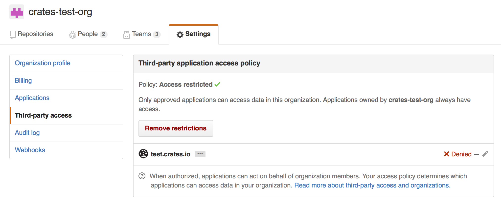

+++
title = "09-发布到 crates.io"
date = 2026-07-30T14:49:00+08:00
weight = 29
type = "docs"
description = "将包发布到 crates.io 的流程与注意事项"
isCJKLanguage = true
draft = false

+++

> 译文 · 基于 [The Cargo Book](https://doc.rust-lang.org/cargo/)

# 发布到 crates.io


> 原文链接: [https://doc.rust-lang.org/cargo/reference/publishing.html](https://doc.rust-lang.org/cargo/reference/publishing.html)


一旦你有了想与世界分享的库，就可以把它发布到 [crates.io]！发布 crate 是指将特定版本上传并托管在 [crates.io] 上。

发布 crate 时请谨慎，因为发布[通常是永久性的](https://crates.io/policies#package-ownership)。版本永远无法被覆盖，代码也无法删除。不过，可以发布的版本数量没有限制。

## 首次发布之前 {#before-your-first-publish}
首先，你需要一个 [crates.io] 账户来获取 API token。为此，[访问首页][crates.io]并通过 GitHub 账户登录（目前必须）。你还需要在[账户设置](https://crates.io/settings/profile)页面提供并验证邮箱地址。完成后[创建 API token](https://crates.io/settings/tokens)，务必复制它。一旦离开该页面，你将无法再次看到它。

然后运行 [`cargo login`] 命令。

```console
$ cargo login
```

在提示处粘贴指定的 token。
```console
please paste the API Token found on https://crates.io/me below
abcdefghijklmnopqrstuvwxyz012345
```

该命令会告知 Cargo 你的 API token，并将其本地存储在 `~/.cargo/credentials.toml` 中。注意，此 token 是**机密**，不应与任何人共享。若因任何原因泄露，应立即撤销。

> **注意**：可以使用 [`cargo logout`] 命令从 `credentials.toml` 中移除 token。若本地机器不再需要存储它，这会很有用。

## 发布新 crate 之前 {#before-publishing-a-new-crate}
请记住，[crates.io] 上的 crate 名称按先到先得分配。一旦名称被占用，就不能用于另一个 crate。

查看可在 `Cargo.toml` 中[指定的元数据](../../cargo-reference/the-manifest-format/)，以确保你的 crate 更容易被发现！发布前，请确保已填写以下字段：

- [`license` 或 `license-file`]
- [`description`]
- [`homepage`]
- [`repository`]
- [`readme`]

最好也包含一些 [`keywords`] 与 [`categories`]，尽管它们不是必需的。

若你发布的是库，可能还想参考 [Rust API 指南]。

### 打包 crate {#packaging-a-crate}
下一步是打包你的 crate 并上传到 [crates.io]。为此我们将使用 [`cargo publish`] 子命令。该命令执行以下步骤：

1. 对包执行一些验证检查。
2. 将源代码压缩为 `.crate` 文件。
3. 将 `.crate` 文件解压到临时目录并验证它能编译。
4. 将 `.crate` 文件上传到 [crates.io]。
5. 注册表会在添加之前对上传的包执行一些额外检查。

建议先运行 `cargo publish --dry-run`（或等价的 [`cargo package`]），以确保发布前没有警告或错误。这会执行上面列出的前三个步骤。

```console
$ cargo publish --dry-run
```

你可以在 `target/package` 目录中检查生成的 `.crate` 文件。[crates.io] 目前对 `.crate` 文件有 10MB 大小限制。你可能想检查 `.crate` 文件的大小，以确保没有意外打包构建包所不需要的大型资源，例如测试数据、网站文档或代码生成内容。可用以下命令检查包含了哪些文件：

```console
$ cargo package --list
```

打包时，Cargo 会自动忽略版本控制系统忽略的文件，但若想指定额外要忽略的文件集，可在清单中使用 [`exclude` 键](../../cargo-reference/the-manifest-format/#the-exclude-and-include-fields)：

```toml
[package]
# ...
exclude = [
    "public/assets/*",
    "videos/*",
]
```

若你更愿意显式列出要包含的文件，Cargo 也支持 [`include` 键](../../cargo-reference/the-manifest-format/#the-exclude-and-include-fields)，一旦设置，会覆盖 `exclude` 键：

```toml
[package]
# ...
include = [
    "**/*.rs",
]
```

## 上传 crate {#uploading-the-crate}
准备好发布时，使用 [`cargo publish`] 命令上传到 [crates.io]：

```console
$ cargo publish
```

就是这样，你已经发布了第一个 crate！

## 发布已有 crate 的新版本 {#publishing-a-new-version-of-an-existing-crate}
要发布新版本，请更改 `Cargo.toml` 清单中指定的[`version` 值](../../cargo-reference/the-manifest-format/#the-version-field)。请记住提供兼容性变更指南的 [SemVer 规则](../../cargo-reference/13-semver-compatibility/)。然后按上文所述运行 [`cargo publish`] 上传新版本。

> **建议：** 考虑完整的发布流程，并尽可能自动化。
>
> 每个版本应包含：
> - 变更日志条目，最好[人工整理](https://keepachangelog.com/en/1.0.0/)，不过自动生成也总比没有好
> - 指向已发布提交的 [git 标签](https://git-scm.com/book/en/v2/Git-Basics-Tagging)
>
> 代表不同工作流的第三方工具示例包括（按字母顺序）：
> - [cargo-release](https://crates.io/crates/cargo-release)
> - [cargo-smart-release](https://crates.io/crates/cargo-smart-release)
> - [release-plz](https://crates.io/crates/release-plz)
>
> 更多内容参见 [crates.io](https://crates.io/search?q=cargo%20release)。

## 管理基于 crates.io 的 crate {#managing-a-cratesio-based-crate}
crate 的管理主要通过命令行 `cargo` 工具完成，而不是 [crates.io] Web 界面。为此，有几个子命令用于管理 crate。

### `cargo yank` {#cargo-yank}
有时你发布的某个版本最终因某种原因损坏（语法错误、忘记包含某个文件等）。对于这类情况，Cargo 支持对 crate 的某个版本进行「yank（撤回）」。

```console
$ cargo yank --version 1.0.1
$ cargo yank --version 1.0.1 --undo
```

yank **不会**删除任何代码。此功能并非用于删除意外上传的密钥等。若发生这种情况，你必须立即重置这些密钥。

被 yank 版本的语义是：不能再针对该版本创建新依赖，但所有现有依赖继续有效。[crates.io] 的主要目标之一是作为不随时间变化的 crate 永久归档，允许删除版本会与此目标相悖。本质上，yank 意味着所有带有 `Cargo.lock` 的包不会损坏，而未来生成的任何 `Cargo.lock` 文件都不会列出被 yank 的版本。

### `cargo owner` {#cargo-owner}
crate 通常由不止一人开发，或者主要维护者可能随时间变化！crate 的所有者是唯一允许发布新版本的人，但所有者可以指定额外所有者。

```console
$ cargo owner --add github-handle
$ cargo owner --remove github-handle
$ cargo owner --add github:rust-lang:owners
$ cargo owner --remove github:rust-lang:owners
```

传给这些命令的所有者 ID 必须是 GitHub 用户名或 GitHub 团队。

若向 `--add` 给出用户名，该用户会被邀请为「具名」所有者，拥有对该 crate 的完整权限。除了能够发布或 yank 版本外，他们还有能力添加或移除所有者，*包括*让*他们*成为所有者的那个所有者。毋庸置疑，你不应让不完全信任的人成为具名所有者。要成为具名所有者，用户必须之前已登录过 [crates.io]。

若向 `--add` 给出团队名，该团队会被邀请为「团队」所有者，对 crate 的权限受限。虽然他们有权发布或 yank 版本，但*没有*添加或移除所有者的能力。除了更便于管理所有者群体外，团队在所有者变得恶意时也稍更安全一些。

团队的语法目前是 `github:org:team`（见上面的例子）。要邀请团队成为所有者，必须是该团队的成员。移除团队所有者则无此限制。

## GitHub 权限 {#github-permissions}
团队成员身份不是 GitHub 提供简单公开访问的内容，使用时你很可能会遇到如下消息：

> It looks like you don’t have permission to query a necessary property from
GitHub to complete this request. You may need to re-authenticate on [crates.io]
to grant permission to read GitHub org memberships.

这基本上是「你试图查询团队，而五层成员访问控制中的某一层拒绝了此请求」的统称。这并非夸张。GitHub 对团队访问控制的支持是企业级的。

最可能的原因只是你上次登录发生在该功能添加之前。我们最初在验证用户时向 GitHub 请求了*零*权限，因为实际上除了登录外从未使用过用户的 token。但为了代你查询团队成员身份，我们现在需要 [`read:org` 作用域][oauth-scopes]。

你可以自由拒绝该作用域，团队引入之前能工作的一切仍会继续工作。但你将永远无法把团队添加为所有者，或以团队所有者身份发布 crate。若你尝试这样做，会得到上面的错误。若你尝试发布一个你根本不拥有、但恰好有团队的 crate，也可能看到此错误。

若你改变主意，或只是不确定 [crates.io] 是否有足够权限，可以随时前往 <https://crates.io/> 重新认证，若 [crates.io] 尚未拥有它想要的全部作用域，系统会提示你授权。

查询 GitHub 的另一个障碍是组织可能主动拒绝第三方访问。要检查这一点，可以访问：

```text
https://github.com/organizations/:org/settings/oauth_application_policy
```

其中 `:org` 是组织名称（例如 `rust-lang`）。你可能看到类似：



你可以选择显式将 [crates.io] 从组织的黑名单中移除，或直接按「Remove Restrictions」按钮以允许所有第三方应用访问此数据。

或者，当 [crates.io] 请求 `read:org` 作用域时，你可以通过按名称旁的「Grant Access」按钮，显式白名单允许 [crates.io] 查询相关组织：


### 排查 GitHub 团队访问错误 {#troubleshooting-github-team-access-errors}
尝试将 GitHub 团队添加为 crate 所有者时，你可能看到如下错误：

```text
error: failed to invite owners to crate <crate_name>: api errors (status 200 OK): could not find the github team org/repo
```
此时，你应前往 [GitHub 应用设置页面]，检查 crates.io 是否列在 `Authorized OAuth Apps` 选项卡中。若没有，应前往 <https://crates.io/> 进行授权。然后回到 GitHub 上的应用设置页面，点击列表中的 crates.io 应用，确保你或你的组织在「Organization access」列表中带有绿色对勾。若有标为 `Grant` 或 `Request` 的按钮，你应授予访问权限，或请求组织所有者这样做。

[Rust API Guidelines]: https://rust-lang.github.io/api-guidelines/
[Rust API 指南]: https://rust-lang.github.io/api-guidelines/
[`cargo login`]: ../../cargo-commands/publishing-commands/01-cargo-login/
[`cargo logout`]: ../../cargo-commands/publishing-commands/02-cargo-logout/
[`cargo package`]: ../../cargo-commands/publishing-commands/04-cargo-package/
[`cargo publish`]: ../../cargo-commands/publishing-commands/05-cargo-publish/
[`categories`]: ../../cargo-reference/the-manifest-format/#the-categories-field
[`description`]: ../../cargo-reference/the-manifest-format/#the-description-field
[`documentation`]: ../../cargo-reference/the-manifest-format/#the-documentation-field
[`homepage`]: ../../cargo-reference/the-manifest-format/#the-homepage-field
[`keywords`]: ../../cargo-reference/the-manifest-format/#the-keywords-field
[`license` or `license-file`]: ../../cargo-reference/the-manifest-format/#the-license-and-license-file-fields
[`license` 或 `license-file`]: ../../cargo-reference/the-manifest-format/#the-license-and-license-file-fields
[`readme`]: ../../cargo-reference/the-manifest-format/#the-readme-field
[`repository`]: ../../cargo-reference/the-manifest-format/#the-repository-field
[crates.io]: https://crates.io/
[oauth-scopes]: https://developer.github.com/apps/building-oauth-apps/understanding-scopes-for-oauth-apps/
[the GitHub Application settings page]: https://github.com/settings/applications
[GitHub 应用设置页面]: https://github.com/settings/applications
