+++
title = "Rust 语言速查表"
date = 2026-08-22T08:00:00+08:00
weight = 1
type = "docs"
description = "Rust Language Cheat Sheet（cheats.rs）中文译本"
isCJKLanguage = true
draft = false
+++

> 基于 [Rust Language Cheat Sheet](https://cheats.rs/) 翻译

> 原文：[https://cheats.rs/](https://cheats.rs/)

# Rust 语言速查表

面向偏好**高信息密度**读者的单页 Rust 速查表。便于在代码中辨认语法结构、发现不熟悉的语言特性，并在已有编程经验时快速总览 Rust。

在线原文：[https://cheats.rs/](https://cheats.rs/)

上游仓库：[ralfbiedert/cheats.rs](https://github.com/ralfbiedert/cheats.rs)

---

## 图例

**可点击符号**

- [BK](https://doc.rust-lang.org/book/) The Book（《Rust 程序设计语言》）
- [EX](https://doc.rust-lang.org/rust-by-example/) Rust by Example（《通过例子学 Rust》）
- [STD](https://doc.rust-lang.org/std/) Standard Library（标准库）
- [NOM](https://doc.rust-lang.org/nomicon/) Nomicon（《Rust 秘典》）
- [REF](https://doc.rust-lang.org/reference/) Reference（《Rust 参考手册》）
- 🔗 互联网；↑ 本页上方；↓ 本页下方

**其他符号**

- 🗑️ 基本已弃用；🚧 需要 Rust nightly（或不完整）；🛑 故意写错的示例或陷阱
- 🝖 略偏冷门；🔥 实用价值突出；↪ 展开为…；💭 带主观倾向；? 缺少合适链接或说明

---

## 你好，Rust!

如果你是 Rust 新手，或想动手试下面的内容：



{}

```rust
fn main() {
    println!("Hello, world!");
}
```

由 [play.rust-lang.org 🔗](https://play.rust-lang.org/) 提供服务

{}

{}

**Rust 经衡量确实出色的方面**

- 编译后代码性能[与 C / C++ 大致相当](https://benchmarksgame-team.pages.debian.net/benchmarksgame/box-plot-summary-charts.html)，内存与能耗效率优秀。
- 可[避免 C / C++ 中约 70% 的安全问题](https://www.chromium.org/Home/chromium-security/memory-safety)，以及大多数内存问题。
- 强类型系统防止[数据竞争](https://doc.rust-lang.org/nomicon/races.html)，带来[“无畏并发”](https://blog.rust-lang.org/2015/04/10/Fearless-Concurrency.html)（以及其他好处）。
- 与 C 无缝互操作，并[支持数十个平台](https://doc.rust-lang.org/rustc/platform-support.html)（基于 LLVM）。
- 连续 ~~4~~ ~~5~~ ~~6~~ ~~7~~ 8 年获评[“最受喜爱或最受钦佩的语言”](https://survey.stackoverflow.co/2023/#section-admired-and-desired-programming-scripting-and-markup-languages)。🤷‍♀️
- 现代化工具链：`cargo`（构建*就是能用*）、`clippy`（700+ 条代码质量检查）、`rustup`（轻松管理工具链）。

{}

{}

**你可能会碰到的问题**

- 学习曲线陡峭；<sup>1</sup> 编译器强制执行（尤其是内存方面）在别处往往只是“最佳实践”的规则。
- 某些领域、目标平台（尤其是嵌入式）缺少原生 Rust 库，以及 IDE 功能。<sup>1</sup>
- 编译时间比其他语言中“类似”的代码更长。<sup>1</sup>
- 库中（对 `unsafe` 的）随意使用可能在暗中破坏安全保证。
- ~~没有正式的语言规范~~，[🔗](https://spec.ferrocene.dev/) ~~可能妨碍在某些领域（航空、医疗等）的合法使用~~。[🔗](https://ferrous-systems.com/ferrocene/)
- Rust Foundation 可能以进攻性方式运用其知识产权影响 *'Rust'* 相关项目（例如禁止名称、强加政策）。[🔗](https://devclass.com/2023/04/11/dont-call-it-rust-community-complains-about-draft-trademark-policy-restricting-use-of-word-marks/)[🔗](https://web.archive.org/web/20230413161930/https://old.reddit.com/r/rust/comments/12e7tdb/rust_trademark_policy_feedback_form/)<sup>2</sup>

<sup>1</sup> 参见 [Rust Survey](https://blog.rust-lang.org/2020/04/17/Rust-survey-2019.html#why-not-use-rust)。

<sup>2</sup> 避免使用其商标（例如在名称、URL、标志、服饰中）通常就足够了。

{}

{}

**下载**
- 从 [**rustup.rs**](https://rustup.rs/) 获取安装器（强烈推荐）🔥

**IDE**
- [**Rust Rover**](https://www.jetbrains.com/rust/)（非商业用途免费）
- [Visual Studio Code](https://code.visualstudio.com/) 配合 [**rust-analyzer**](https://rust-analyzer.github.io/)（免费）

{}

{}

**模块化初学者资源**
- [**Tour of Rust**](https://tourofrust.com/TOC_en.html) — 实时代码与说明并排呈现。
- [**Rust in Easy English**](https://dhghomon.github.io/easy_rust/Chapter_3.html) — 60+ 个概念，简易英语，示例驱动。
- [**Rust for the Polyglot Programmer**](https://www.chiark.greenend.org.uk/~ianmdlvl/rust-polyglot/index.html) — 面向有经验程序员的指南。

此外可考虑 **The Book**，[BK](https://doc.rust-lang.org/book/) **Rust by Example**，[EX](https://doc.rust-lang.org/rust-by-example/) **Standard Library**，[STD](https://doc.rust-lang.org/std) 以及 **Learn Rust**。[🔗](https://github.com/ImplFerris/LearnRust)

> **看法** 💭 — 若你从未见过或用过任何 Rust，继续之前最好先访问上面某个链接；否则下一章可能会显得有些简略。

{}



### 数据结构 {#data-structures}

通过关键字定义的数据类型与内存位置。

| 示例 | 说明 |
|---------|-------------|
| `struct S<T> {}` | 定义带命名字段的 **struct**（结构体）[BK](https://doc.rust-lang.org/book/ch05-00-structs.html) [EX](https://doc.rust-lang.org/rust-by-example/custom_types/structs.html) [STD](https://doc.rust-lang.org/std/keyword.struct.html) [REF](https://doc.rust-lang.org/reference/expressions/struct-expr.html)。 |
| &nbsp;&nbsp;&nbsp;&nbsp;`struct S { x: T }` | 定义带命名字段 `x`（类型为 `T`）的结构体。 |
| &nbsp;&nbsp;&nbsp;&nbsp;`struct S` &#8203;`(T);` | 定义“元组式”结构体，编号字段 `.0` 类型为 `T`。 |
| &nbsp;&nbsp;&nbsp;&nbsp;`struct S;` | 定义**零大小** [NOM](https://doc.rust-lang.org/nomicon/exotic-sizes.html#zero-sized-types-zsts) 单元结构体。不占空间，会被优化掉。 |
| `enum E {}` | 定义 **enum**（枚举），[BK](https://doc.rust-lang.org/book/ch06-01-defining-an-enum.html) [EX](https://doc.rust-lang.org/rust-by-example/custom_types/enum.html#enums) [REF](https://doc.rust-lang.org/reference/items/enumerations.html) 参见 [代数数据类型](https://en.wikipedia.org/wiki/Algebraic_data_type)、[带标签联合](https://en.wikipedia.org/wiki/Tagged_union)。 |
| &nbsp;&nbsp;&nbsp;&nbsp;`enum E { A, B`&#8203;`(), C {} }` | 定义枚举变体；可以是单元式 `A`、元组式 `B` &#8203;`()` 和结构体式 `C{}`。 |
| &nbsp;&nbsp;&nbsp;&nbsp;`enum E { A = 1 }` | 带显式**判别值**的枚举，[REF](https://doc.rust-lang.org/reference/items/enumerations.html#custom-discriminant-values-for-fieldless-enumerations) 例如用于 FFI。 |
| &nbsp;&nbsp;&nbsp;&nbsp;`enum E {}` | 无变体的枚举是**不可居住的**，[REF](https://doc.rust-lang.org/reference/glossary.html#uninhabited) 无法创建，参见 'never' [↓](#miscellaneous) 🝖 |
| `union U {}` | 不安全的类 C **union**（联合体）[REF](https://doc.rust-lang.org/reference/items/unions.html)，用于 FFI 兼容。🝖 |
| `static X: T = T();`  | **全局变量** [BK](https://doc.rust-lang.org/book/ch19-01-unsafe-rust.html#accessing-or-modifying-a-mutable-static-variable) [EX](https://doc.rust-lang.org/rust-by-example/custom_types/constants.html#constants) [REF](https://doc.rust-lang.org/reference/items/static-items.html#static-items)，具有 `'static` 生命周期，单一 🛑 内存位置。 |
| `const X: T = T();`  | 定义**常量**，[BK](https://doc.rust-lang.org/book/ch03-01-variables-and-mutability.html#constants) [EX](https://doc.rust-lang.org/rust-by-example/custom_types/constants.html) [REF](https://doc.rust-lang.org/reference/items/constant-items.html) 使用时复制到临时值中。 |
| `let x: T;`  | 在栈上分配 `T` 字节并绑定为 `x`。可赋值一次，不可变。 |
| `let mut x: T;`  | 类似 `let`，但允许**可变性** [BK](https://doc.rust-lang.org/book/ch03-01-variables-and-mutability.html) [EX](https://doc.rust-lang.org/rust-by-example/variable_bindings/mut.html) 与可变借用。 |
| &nbsp;&nbsp;&nbsp;&nbsp;`x = y;` | 将 `y` 移动到 `x`；若 `T` 不是 **`Copy`** [STD](https://doc.rust-lang.org/std/marker/trait.Copy.html) 则使 `y` 失效，否则复制 `y`。 |

<sup>1</sup> 在*库*中，根据 crate 的导入方式，你可能在不知不觉中得到多个 `X` 实例。[🔗](https://doc.rust-lang.org/cargo/reference/resolver.html#version-incompatibility-hazards)

<sup>2</sup> **绑定变量** [BK](https://doc.rust-lang.org/book/ch03-01-variables-and-mutability.html) [EX](https://doc.rust-lang.org/rust-by-example/variable_bindings.html) [REF](https://doc.rust-lang.org/reference/variables.html) 在同步代码中位于栈上。在 `async {}` 中它们成为 async 状态机的一部分，可能驻留在堆上。

<sup>3</sup> 严格来说*可变*与*不可变*用词不当。不可变绑定或共享引用仍可能包含 Cell [STD](https://doc.rust-lang.org/std/cell/index.html)，从而具备*内部可变性*。

创建与访问数据结构；以及更多*符记式*类型。

| 示例 | 说明 |
|---------|-------------|
| `S { x: y }` | 创建 `struct S {}` 或已 `use` 的 `enum E::S {}`，字段 `x` 设为 `y`。 |
| `S { x }` | 同上，但用局部变量 `x` 填充字段 `x`。 |
| `S { ..s }` | 用 `s` 填充其余字段，尤其适合配合 `Default::default()`。[STD](https://doc.rust-lang.org/std/default/trait.Default.html) |
| `S { 0: x }` | 类似下方的 `S` &#8203;`(x)`，但用结构体语法设置字段 `.0`。 |
| `S`&#8203; `(x)` | 创建 `struct S` &#8203;`(T)` 或已 `use` 的 `enum E::S`&#8203; `()`，字段 `.0` 设为 `x`。 |
| `S` | 若 `S` 是单元 `struct S;` 或已 `use` 的 `enum E::S`，则创建 `S` 的值。 |
| `E::C { x: y }` | 创建枚举变体 `C`。上面其他方法也同样适用。 |
| `()` | 空元组，既是字面量也是类型，又称 **unit**（单元）。[STD](https://doc.rust-lang.org/std/primitive.unit.html) |
| `(x)` | 带括号的表达式。 |
| `(x,)` | 单元素**元组**表达式。[EX](https://doc.rust-lang.org/rust-by-example/primitives/tuples.html) [STD](https://doc.rust-lang.org/std/primitive.tuple.html) [REF](https://doc.rust-lang.org/reference/expressions/tuple-expr.html) |
| `(S,)` | 单元素元组类型。 |
| `[S]` | 长度未指定的数组类型，即 **slice**（切片）。[EX](https://doc.rust-lang.org/rust-by-example/primitives/array.html) [STD](https://doc.rust-lang.org/std/primitive.slice.html) [REF](https://doc.rust-lang.org/reference/types/slice.html) 不能放在栈上。 |
| `[S; n]` | 固定长度 `n`、元素类型为 `S` 的**数组类型** [EX](https://doc.rust-lang.org/rust-by-example/primitives/array.html)  [STD](https://doc.rust-lang.org/std/primitive.array.html) [REF](https://doc.rust-lang.org/reference/types/array.html)。 |
| `[x; n]` | 含 `n` 个 `x` 副本的**数组实例** [REF](https://doc.rust-lang.org/reference/expressions/array-expr.html)（表达式）。 |
| `[x, y]` | 含给定元素 `x` 与 `y` 的数组实例。 |
| `x[0]` | 集合索引，此处用 `usize`。通过 [**Index**](https://doc.rust-lang.org/std/ops/trait.Index.html)、[**IndexMut**](https://doc.rust-lang.org/std/ops/trait.IndexMut.html) 实现。 |
| &nbsp;&nbsp;&nbsp;&nbsp;`x[..]` | 同上，通过范围（此处为*完整范围*），还有 `x[a..b]`、`x[a..=b]` 等，参见下方。 |
| `a..b` | **右开区间** [STD](https://doc.rust-lang.org/std/ops/struct.Range.html) [REF](https://doc.rust-lang.org/reference/expressions/range-expr.html) 的创建，例如 `1..3` 表示 `1, 2`。 |
| `..b` | 无起点的右开**到某点的区间** [STD](https://doc.rust-lang.org/std/ops/struct.RangeTo.html)。 |
| `..=b` | 无起点的**到某点的闭区间** [STD](https://doc.rust-lang.org/std/ops/struct.RangeToInclusive.html)。 |
| `a..=b` | **闭区间**，[STD](https://doc.rust-lang.org/std/ops/struct.RangeInclusive.html) `1..=3` 表示 `1, 2, 3`。 |
| `a..` | 无终点的**从某点起的区间** [STD](https://doc.rust-lang.org/std/ops/struct.RangeFrom.html)。 |
| `..` | **完整区间**，[STD](https://doc.rust-lang.org/std/ops/struct.RangeFull.html) 通常表示*整个集合*。 |
| `s.x` | 命名**字段访问**，[REF](https://doc.rust-lang.org/reference/expressions/field-expr.html) 若 `x` 不属于类型 `S`，可能尝试 [Deref](https://doc.rust-lang.org/std/ops/trait.Deref.html)。 |
| `s.0` | 编号字段访问，用于元组类型 `S` &#8203;`(T)`。 |

<sup>*</sup> 目前，[RFC](https://rust-lang.github.io/rfcs/1909-unsized-rvalues.html) 尚待 [跟踪问题](https://github.com/rust-lang/rust/issues/48055) 完成。

### 引用与指针

授予对非自有内存的访问。另见「泛型与约束」一节。

| 示例 | 说明 |
|---------|-------------|
| `&S` | 共享**引用** [BK](https://doc.rust-lang.org/book/ch04-02-references-and-borrowing.html) [STD](https://doc.rust-lang.org/std/primitive.reference.html) [NOM](https://doc.rust-lang.org/nomicon/references.html) [REF](https://doc.rust-lang.org/reference/types.html#pointer-types)（类型；可容纳*任意* `&s` 的空间）。 |
| &nbsp;&nbsp;&nbsp;&nbsp;`&[S]` | 特殊的切片引用，包含（`addr`，`count`）。 |
| &nbsp;&nbsp;&nbsp;&nbsp;`&str` | 特殊的字符串切片引用，包含（`addr`，`byte_len`）。 |
| &nbsp;&nbsp;&nbsp;&nbsp;`&mut S` | 允许可变性的独占引用（还有 `&mut [S]`、`&mut dyn S` 等）。 |
| &nbsp;&nbsp;&nbsp;&nbsp;`&dyn T` | 特殊的**特质对象** [BK](https://doc.rust-lang.org/book/ch17-02-trait-objects.html#using-trait-objects-that-allow-for-values-of-different-types) [REF](https://doc.rust-lang.org/reference/types/trait-object.html) 引用，形式为（`addr`，`vtable`）；`T` 必须是 **dyn 兼容**的 [REF](https://doc.rust-lang.org/reference/items/traits.html#dyn-compatibility) |
| `&s` | 共享**借用** [BK](https://doc.rust-lang.org/book/ch04-02-references-and-borrowing.html) [EX](https://doc.rust-lang.org/rust-by-example/scope/borrow.html) [STD](https://doc.rust-lang.org/std/borrow/trait.Borrow.html)（例如*此* `s` 的地址、长度、vtable 等，如 `0x1234`）。 |
| &nbsp;&nbsp;&nbsp;&nbsp;`&mut s` | 允许**可变性**的独占借用。[EX](https://doc.rust-lang.org/rust-by-example/scope/borrow/mut.html) |
| `*const S` | 不可变**原始指针类型** [BK](https://doc.rust-lang.org/book/ch19-01-unsafe-rust.html#dereferencing-a-raw-pointer) [STD](https://doc.rust-lang.org/std/primitive.pointer.html) [REF](https://doc.rust-lang.org/reference/types.html#raw-pointers-const-and-mut)，无内存安全保证。 |
| &nbsp;&nbsp;&nbsp;&nbsp;`*mut S` | 可变原始指针类型，无内存安全保证。 |
| &nbsp;&nbsp;&nbsp;&nbsp;`&raw const s` | 创建原始指针而不经过引用；参见 `ptr:addr_of!()` [STD](https://doc.rust-lang.org/std/ptr/macro.addr_of.html) 🝖 |
| &nbsp;&nbsp;&nbsp;&nbsp;`&raw mut s` | 同上，但是可变的。🚧 用于未对齐、packed 字段时需要。🝖 |
| `ref s` | **按引用绑定**，[EX](https://doc.rust-lang.org/rust-by-example/scope/borrow/ref.html) 使绑定成为引用类型。🗑️|
| &nbsp;&nbsp;&nbsp;&nbsp;`let ref r = s;` | 等价于 `let r = &s`。 |
| &nbsp;&nbsp;&nbsp;&nbsp;`let S { ref mut x } = s;` | 可变引用绑定（`let x = &mut s.x`），简写解构 [↓](#pattern-matching) 形式。 |
| `*r` | **解引用** [BK](https://doc.rust-lang.org/book/ch15-02-deref.html) [STD](https://doc.rust-lang.org/std/ops/trait.Deref.html) [NOM](https://doc.rust-lang.org/nomicon/vec-deref.html) 引用 `r`，以访问其指向的内容。 |
| &nbsp;&nbsp;&nbsp;&nbsp;`*r = s;` | 若 `r` 是可变引用，则将 `s` 移动或复制到目标内存。 |
| &nbsp;&nbsp;&nbsp;&nbsp;`s = *r;` | 若 `r` 引用的内容是 `Copy`，则使 `s` 成为其副本。 |
| &nbsp;&nbsp;&nbsp;&nbsp;`s = *r;` | 若 `*r` 不是 `Copy` 则无效 🛑，因为那会移动并留下空位。 |
| &nbsp;&nbsp;&nbsp;&nbsp;`s = *my_box;` | **`Box`**[STD](https://doc.rust-lang.org/std/boxed/index.html) 的特例[🔗](https://web.archive.org/web/20230130111147/https://old.reddit.com/r/rust/comments/b4so6i/what_is_exactly/ej8xwg8/)，可移出被装箱且非 `Copy` 的内容。 |
| `'a`  | **生命周期参数**，[BK](https://doc.rust-lang.org/book/ch10-00-generics.html) [EX](https://doc.rust-lang.org/rust-by-example/scope/lifetime.html) [NOM](https://doc.rust-lang.org/nomicon/lifetimes.html) [REF](https://doc.rust-lang.org/reference/items/generics.html#type-and-lifetime-parameters) 静态分析中某条数据流的持续时长。 |
| &nbsp;&nbsp;&nbsp;&nbsp;`&'a S`  | 只接受某个 `s` 的地址；该地址存在时间至少为 `'a`。 |
| &nbsp;&nbsp;&nbsp;&nbsp;`&'a mut S`  | 同上，但允许更改地址所指内容。 |
| &nbsp;&nbsp;&nbsp;&nbsp;`struct S<'a> {}`  | 表示此 `S` 将包含生命周期为 `'a` 的地址。`S` 的创建者决定 `'a`。 |
| &nbsp;&nbsp;&nbsp;&nbsp;`trait T<'a> {}` | 表示任何 `impl T for S` 的 `S` 可能包含地址。 |
| &nbsp;&nbsp;&nbsp;&nbsp;`fn f<'a>(t: &'a T)`  | 表示此函数处理某个地址。调用者决定 `'a`。 |
| `'static`  | 持续整个程序执行期的特殊生命周期。 |

### 函数与行为 {#functions-behavior}

定义代码单元及其抽象。

| 示例 | 说明 |
|---------|-------------|
| `trait T {}`  | 定义 **trait**（特质）；[BK](https://doc.rust-lang.org/book/ch10-02-traits.html) [EX](https://doc.rust-lang.org/rust-by-example/trait.html) [REF](https://doc.rust-lang.org/reference/items/traits.html) 类型可遵循的共同行为。 |
| `trait T : R {}` | `T` 是**超特质** [BK](https://doc.rust-lang.org/book/ch19-03-advanced-traits.html#using-supertraits-to-require-one-traits-functionality-within-another-trait) [EX](https://doc.rust-lang.org/rust-by-example/trait/supertraits.html) [REF](https://doc.rust-lang.org/reference/items/traits.html#supertraits) `R` 的子特质。任何 `S` 必须先 `impl R` 才能 `impl T`。 |
| `impl S {}`  | 为类型 `S` **实现** [REF](https://doc.rust-lang.org/reference/items/implementations.html) 功能，例如方法。 |
| `impl T for S {}`  | 为类型 `S` 实现特质 `T`；规定 `S` *究竟如何* 表现得像 `T`。 |
| `impl !T for S {}` | 禁用自动派生的 **auto trait**。[NOM](https://doc.rust-lang.org/nomicon/send-and-sync.html) [REF](https://doc.rust-lang.org/reference/special-types-and-traits.html#auto-traits) 🚧 🝖 |
| `fn f() {}`  | 定义**函数**；[BK](https://doc.rust-lang.org/book/ch03-03-how-functions-work.html)  [EX](https://doc.rust-lang.org/rust-by-example/fn.html) [REF](https://doc.rust-lang.org/reference/items/functions.html) 若在 `impl` 内则为关联函数。 |
| &nbsp;&nbsp;&nbsp;&nbsp;`fn f() -> S {}`  | 同上，返回类型为 S 的值。 |
| &nbsp;&nbsp;&nbsp;&nbsp;`fn f(&self) {}`  | 定义**方法**，[BK](https://doc.rust-lang.org/book/ch05-03-method-syntax.html)  [EX](https://doc.rust-lang.org/rust-by-example/fn/methods.html)  [REF](https://doc.rust-lang.org/reference/items/associated-items.html#methods)  例如在 `impl S {}` 内。 |
| `struct S` &#8203;`(T);` | 更隐晦地，*也*[↑](#data-structures) 定义了 `fn S(x: T) -> S` **构造函数**。[RFC](https://rust-lang.github.io/rfcs/1506-adt-kinds.html#tuple-structs) 🝖 |
| `const fn f() {}`  | 可在编译期使用的常量 `fn`，例如 `const X: u32 = f(Y)`。[REF](https://doc.rust-lang.org/reference/const_eval.html#const-functions) `'18`|
| &nbsp;&nbsp;&nbsp;&nbsp;`const { x }`  | 在函数内使用，确保 `{ x }` 在编译期求值。[REF](https://doc.rust-lang.org/reference/expressions/block-expr.html#const-blocks) |
| `async fn f() {}`  | **Async** [REF](https://doc.rust-lang.org/reference/items/functions.html#async-functions) `'18` 函数变换，[↓](#async-await-101) 使 `f` 返回 `impl` **`Future`**。[STD](https://doc.rust-lang.org/std/future/trait.Future.html) |
| &nbsp;&nbsp;&nbsp;&nbsp;`async fn f() -> S {}`  | 同上，但使 `f` 返回 `impl Future<Output=S>`。 |
| &nbsp;&nbsp;&nbsp;&nbsp;`async { x }`  | 在函数内使用，使 `{ x }` 成为 `impl Future<Output=X>`。[REF](https://doc.rust-lang.org/reference/expressions/block-expr.html#async-blocks) |
| &nbsp;&nbsp;&nbsp;&nbsp;`async move { x }`  | 将捕获的变量移入 future，参见 move 闭包。[REF](https://doc.rust-lang.org/reference/expressions/block-expr.html#capture-modes) [↓](#functions-behavior) |
| `fn() -> S`  | **函数引用**，<sup>1</sup> [BK](https://doc.rust-lang.org/book/ch19-05-advanced-functions-and-closures.html#function-pointers) [STD](https://doc.rust-lang.org/std/primitive.fn.html) [REF](https://doc.rust-lang.org/reference/types.html#function-pointer-types) 保存可调用对象地址的内存。 |
| `Fn() -> S`  | **可调用特质** [BK](https://doc.rust-lang.org/book/ch19-05-advanced-functions-and-closures.html#returning-closures) [STD](https://doc.rust-lang.org/std/ops/trait.Fn.html)（还有 `FnMut`、`FnOnce`），由闭包、函数等实现。 |
| `AsyncFn() -> S`  | **可调用 async 特质** [STD](https://doc.rust-lang.org/std/ops/trait.AsyncFn.html)（还有 `AsyncFnMut`、`AsyncFnOnce`），由 async 闭包等实现。 |
| <code>\|\| {}</code> | **闭包** [BK](https://doc.rust-lang.org/book/ch13-01-closures.html) [EX](https://doc.rust-lang.org/rust-by-example/fn/closures.html) [REF](https://doc.rust-lang.org/reference/expressions/closure-expr.html)，借用其**捕获**，[↓](#closures-data) [REF](https://doc.rust-lang.org/reference/types/closure.html#capture-modes)（例如局部变量）。 |
| &nbsp;&nbsp;&nbsp;&nbsp;<code>\|x\| {}</code> | 接受一个名为 `x` 的参数的闭包，函数体为块表达式。 |
| &nbsp;&nbsp;&nbsp;&nbsp;<code>\|x\| x + x</code> | 同上，无块表达式；只能由单个表达式构成。 |
| &nbsp;&nbsp;&nbsp;&nbsp;<code>move \|x\| x + y</code> | **Move 闭包** [REF](https://doc.rust-lang.org/reference/types/closure.html#capture-modes)，取得所有权；即 `y` 被转移进闭包。 |
| &nbsp;&nbsp;&nbsp;&nbsp;<code>async \|x\| x + x</code> | **Async 闭包**。[REF](https://doc.rust-lang.org/reference/expressions/closure-expr.html#async-closures) 将其结果转换为 `impl Future<Output=X>`。 |
| &nbsp;&nbsp;&nbsp;&nbsp;<code>async move \|x\| x + y</code> | **Async move 闭包**。上述二者的组合。 |
| &nbsp;&nbsp;&nbsp;&nbsp;<code>return \|\| true</code> | 闭包有时看起来像逻辑或（此处：返回一个闭包）。 |
| `unsafe` | 若你享受调试段错误；**不安全代码**。[↓](#unsafe-unsound-undefined) [BK](https://doc.rust-lang.org/book/ch19-01-unsafe-rust.html#unsafe-superpowers) [EX](https://doc.rust-lang.org/rust-by-example/unsafe.html#unsafe-operations) [NOM](https://doc.rust-lang.org/nomicon/meet-safe-and-unsafe.html) [REF](https://doc.rust-lang.org/reference/unsafe-blocks.html#unsafe-blocks) |
| &nbsp;&nbsp;&nbsp;&nbsp;`unsafe fn f() {}` | 表示“*调用可能造成 UB，[↓](#unsafe-unsound-undefined) **你必须检查**前置条件*”。 |
| &nbsp;&nbsp;&nbsp;&nbsp;`unsafe trait T {}` | 表示“*对 `T` 的草率实现可能造成 UB*；**实现者必须检查**”。 |
| &nbsp;&nbsp;&nbsp;&nbsp;`unsafe { f(); }` | 向编译器保证“***我已检查**前置条件，请相信我*”。 |
| &nbsp;&nbsp;&nbsp;&nbsp;`unsafe impl T for S {}` | 保证 *`S` 在 `T` 方面行为正确*；他人可安全地对 `S` 使用 `T`。 |
| &nbsp;&nbsp;&nbsp;&nbsp;`unsafe extern "abi" {}` | 从 Rust 2024 起，`extern "abi" {}` 块 [↓](#organizing-code) 必须是 `unsafe`。 |
| &nbsp;&nbsp;&nbsp;&nbsp;`pub safe fn f();`  | 在 `unsafe extern "abi" {}` 内，标记 `f` 实际可安全调用。[RFC](https://rust-lang.github.io/rfcs/3484-unsafe-extern-blocks.html) |

<sup>1</sup> 多数文档称之为函数**指针**，但函数**引用**可能更贴切[🔗](https://users.rust-lang.org/t/why-are-function-pointers-special-no-null/87990/16)，因为它们不能为 `null` 且必须指向有效目标。

### 控制流

控制函数内的执行。

| 示例 | 说明 |
|---------|-------------|
| `while x {}`  | **循环**，[REF](https://doc.rust-lang.org/reference/expressions/loop-expr.html#predicate-loops) 在表达式 `x` 为真时运行。 |
| `loop {}`  | **无限循环** [REF](https://doc.rust-lang.org/reference/expressions/loop-expr.html#infinite-loops) 直到 `break`。可用 `break x` 产生值。 |
| `for x in collection {}` | 遍历**迭代器**的语法糖。[BK](https://doc.rust-lang.org/book/ch13-02-iterators.html) [STD](https://doc.rust-lang.org/std/iter/index.html) [REF](https://doc.rust-lang.org/reference/expressions/loop-expr.html#iterator-loops) |
| &nbsp;&nbsp;&nbsp;&nbsp;↪  `collection.into_iter()`  | 实质上先将任何 **`IntoIterator`** [STD](https://doc.rust-lang.org/std/iter/trait.IntoIterator.html) 类型转换为真正的迭代器。 |
| &nbsp;&nbsp;&nbsp;&nbsp;↪  `iterator.next()`  | 在真正的 **`Iterator`** [STD](https://doc.rust-lang.org/std/iter/trait.Iterator.html) 上执行 `x = next()`，直到耗尽（首次 `None`）。 |
| `if x {} else {}`  | **条件分支** [REF](https://doc.rust-lang.org/reference/expressions/if-expr.html)，表达式为真时执行。 |
| `'label: {}` | **块标签**，[RFC](https://rust-lang.github.io/rfcs/2046-label-break-value.html) 可与 `break` 配合以跳出此块。`1.65+` |
| `'label: loop {}` | 类似的**循环标签**，[EX](https://doc.rust-lang.org/rust-by-example/flow_control/loop/nested.html) [REF](https://doc.rust-lang.org/reference/expressions/loop-expr.html#loop-labels) 对嵌套循环中的流程控制很有用。 |
| `break`  | **break 表达式** [REF](https://doc.rust-lang.org/reference/expressions/loop-expr.html#break-expressions)，退出带标签的块或循环。 |
| &nbsp;&nbsp;&nbsp;&nbsp;`break 'label x`  | 跳出名为 `'label` 的块或循环，并以 `x` 作为其值。 |
| &nbsp;&nbsp;&nbsp;&nbsp;`break 'label`  | 同上，但不产生任何值。 |
| &nbsp;&nbsp;&nbsp;&nbsp;`break x`  | 使 `x` 成为最内层循环的值（仅在真正的 `loop` 中）。 |
| `continue `  | **continue 表达式** [REF](https://doc.rust-lang.org/reference/expressions/loop-expr.html#continue-expressions)，进入本循环的下一次迭代。 |
| `continue 'label`  | 同上，但针对标记为 'label 的外层循环，而非本循环。 |
| `x?` | 若 `x` 是 [Err](https://doc.rust-lang.org/std/result/enum.Result.html#variant.Err) 或 [None](https://doc.rust-lang.org/std/option/enum.Option.html#variant.None)，则**返回并传播**。[BK](https://doc.rust-lang.org/book/ch09-02-recoverable-errors-with-result.html#propagating-errors) [EX](https://doc.rust-lang.org/rust-by-example/error/result/enter_question_mark.html) [STD](https://doc.rust-lang.org/std/result/index.html#the-question-mark-operator-) [REF](https://doc.rust-lang.org/reference/expressions/operator-expr.html#the-question-mark-operator) |
| `x.await` | **获取 future、轮询、让出** 的语法糖。[REF](https://doc.rust-lang.org/reference/expressions/await-expr.html#await-expressions) `'18` 仅在 `async` 内。 |
| &nbsp;&nbsp;&nbsp;&nbsp;↪ `x.into_future()`   | 实质上先将任何 **`IntoFuture`** [STD](https://doc.rust-lang.org/std/future/trait.IntoFuture.html) 类型转换为真正的 future。 |
| &nbsp;&nbsp;&nbsp;&nbsp;↪ `future.poll()`  | 在真正的 **`Future`** [STD](https://doc.rust-lang.org/std/future/trait.Future.html) 上 `poll()`，若为 **`Poll::Pending`** [STD](https://doc.rust-lang.org/std/task/enum.Poll.html) 则让出执行流。 |
| `return x`  | 从函数**提前返回** [REF](https://doc.rust-lang.org/reference/expressions/return-expr.html)。更惯用的做法是以表达式结尾。 |
| &nbsp;&nbsp;&nbsp;&nbsp;`{ return }`  | 在普通 `{}` 块内，`return` 退出外围函数。 |
| &nbsp;&nbsp;&nbsp;&nbsp;<code>\|\| { return }</code>  | 在闭包内，`return` 仅退出该闭包，即闭包如同独立函数。 |
| &nbsp;&nbsp;&nbsp;&nbsp;`async { return }`  | 在 `async` 内，`return` **仅** [REF](https://doc.rust-lang.org/reference/expressions/block-expr.html#control-flow-operators) 🛑 退出该 `{}`，即 `async {}` 如同独立函数。 |
| `f()` | 调用可调用对象 `f`（例如函数、闭包、函数指针、`Fn` 等）。 |
| `x.f()` | 调用成员函数，要求 `f` 以 `self`、`&self` 等作为第一个参数。 |
| &nbsp;&nbsp;&nbsp;&nbsp;`X::f(x)` | 同 `x.f()`。除非 `impl Copy for X {}`，否则 `f` 只能调用一次。 |
| &nbsp;&nbsp;&nbsp;&nbsp;`X::f(&x)` | 同 `x.f()`。 |
| &nbsp;&nbsp;&nbsp;&nbsp;`X::f(&mut x)` | 同 `x.f()`。 |
| &nbsp;&nbsp;&nbsp;&nbsp;`S::f(&x)` | 若 `X` [解引用](https://doc.rust-lang.org/std/ops/trait.Deref.html) 到 `S`，则同 `x.f()`，即 `x.f()` 会找到 `S` 的方法。 |
| &nbsp;&nbsp;&nbsp;&nbsp;`T::f(&x)` | 若 `X impl T`，则同 `x.f()`，即在作用域内时 `x.f()` 会找到 `T` 的方法。 |
| `X::f()` | 调用关联函数，例如 `X::new()`。 |
| &nbsp;&nbsp;&nbsp;&nbsp;`<X as T>::f()` | 调用为 `X` 实现的特质方法 `T::f()`。 |

### 组织代码 {#organizing-code}

将项目拆成更小单元并尽量减少依赖。

| 示例 | 说明 |
|---------|-------------|
| `mod m {}`  | 定义**模块**，[BK](https://doc.rust-lang.org/book/ch07-02-defining-modules-to-control-scope-and-privacy.html) [EX](https://doc.rust-lang.org/rust-by-example/mod.html#modules) [REF](https://doc.rust-lang.org/reference/items/modules.html#modules) 从 `{}` 内取得定义。[↓](#project-anatomy) |
| `mod m;`  | 定义模块，从 `m.rs` 或 `m/mod.rs` 取得定义。[↓](#project-anatomy)|
| `a::b` | 命名空间**路径** [EX](https://doc.rust-lang.org/rust-by-example/mod/use.html) [REF](https://doc.rust-lang.org/reference/paths.html)，指向 `a`（`mod`、`enum` 等）内的元素 `b`。 |
| &nbsp;&nbsp;&nbsp;&nbsp;`::b` | 在**crate 根** `'15` [REF](https://doc.rust-lang.org/reference/glossary.html#crate) 或**外部 prelude**；`'18` [REF](https://doc.rust-lang.org/reference/names/preludes.html#extern-prelude) 中搜索 `b`，即**全局路径**。[REF](https://doc.rust-lang.org/reference/paths.html#path-qualifiers) 🗑️ |
| &nbsp;&nbsp;&nbsp;&nbsp;`crate::b` | 在 crate 根中搜索 `b`。`'18` |
| &nbsp;&nbsp;&nbsp;&nbsp;`self::b`  | 在当前模块中搜索 `b`。 |
| &nbsp;&nbsp;&nbsp;&nbsp;`super::b`  | 在父模块中搜索 `b`。 |
| `use a::b;`  | **Use** [EX](https://doc.rust-lang.org/rust-by-example/mod/use.html#the-use-declaration) [REF](https://doc.rust-lang.org/reference/items/use-declarations.html) 在此作用域直接使用 `b`，不再需要 `a`。 |
| `use a::{b, c};` | 同上，但将 `b` 与 `c` 引入作用域。 |
| `use a::b as x;`  | 将 `b` 引入作用域但命名为 `x`，例如 `use std::error::Error as E`。 |
| `use a::b as _;`  | 将 `b` 匿名引入作用域，适用于名称冲突的特质。 |
| `use a::*;`  | 引入 `a` 中的一切，仅当 `a` 是某种 **prelude** 时才建议。[STD](https://doc.rust-lang.org/std/prelude/index.html#other-preludes)  [🔗](https://stackoverflow.com/questions/36384840/what-is-the-prelude) |
| `pub use a::b;`  | 将 `a::b` 引入作用域并从此处再导出。 |
| `pub T`  | 对 `T`：“若父路径公开则公开”的**可见性** [BK](https://doc.rust-lang.org/book/ch07-02-defining-modules-to-control-scope-and-privacy.html) [REF](https://doc.rust-lang.org/reference/visibility-and-privacy.html)。 |
| &nbsp;&nbsp;&nbsp;&nbsp;`pub(crate) T` | 最多<sup>1</sup>在当前 crate 内可见。 |
| &nbsp;&nbsp;&nbsp;&nbsp;`pub(super) T`  | 最多<sup>1</sup>在父模块内可见。 |
| &nbsp;&nbsp;&nbsp;&nbsp;`pub(self) T`  | 最多<sup>1</sup>在当前模块内可见（默认，与无 `pub` 相同）。 |
| &nbsp;&nbsp;&nbsp;&nbsp;`pub(in a::b) T`  | 最多<sup>1</sup>在祖先 `a::b` 内可见。 |
| `extern crate a;` | 声明对外部 **crate** 的依赖；[BK](https://doc.rust-lang.org/book/ch02-00-guessing-game-tutorial.html#using-a-crate-to-get-more-functionality) [REF](https://doc.rust-lang.org/reference/items/extern-crates.html#extern-crate-declarations) 🗑️ 在 `'18` 中直接用 `use a::b` 即可。 |
| `extern "C" {}`  | *声明*来自 **FFI** 的外部依赖与 ABI（例如 `"C"`）。[BK](https://doc.rust-lang.org/book/ch19-01-unsafe-rust.html#using-extern-functions-to-call-external-code) [EX](https://doc.rust-lang.org/rust-by-example/std_misc/ffi.html#foreign-function-interface) [NOM](https://doc.rust-lang.org/nomicon/ffi.html#calling-foreign-functions) [REF](https://doc.rust-lang.org/reference/items/external-blocks.html#external-blocks) |
| `extern "C" fn f() {}`  | *定义*以 ABI（例如 `"C"`）导出到 FFI 的函数。 |

<sup>1</sup> 子模块中的项总能访问任何项，无论是否 `pub`。

### 类型别名与强制转换

类型的简写名称，以及将一种类型转换为另一种的方法。

| 示例 | 说明 |
|---------|-------------|
| `type T = S;`  | 创建**类型别名**，[BK](https://doc.rust-lang.org/book/ch19-04-advanced-types.html#creating-type-synonyms-with-type-aliases) [REF](https://doc.rust-lang.org/reference/items/type-aliases.html#type-aliases) 即 `S` 的另一个名字。 |
| `Self`  | **实现类型**的类型别名，[REF](https://doc.rust-lang.org/reference/types.html#self-types) 例如 `fn new() -> Self`。 |
| `self`  | `fn f(self) {}` 中的**方法主体** [BK](https://doc.rust-lang.org/book/ch05-03-method-syntax.html#method-syntax) [REF](https://doc.rust-lang.org/reference/items/associated-items.html#methods)，例如类似于 `fn f(self: Self) {}`。 |
| &nbsp;&nbsp;&nbsp;&nbsp;`&self`  | 同上，但以借用方式指代 self，等同于 `f(self: &Self)`|
| &nbsp;&nbsp;&nbsp;&nbsp;`&mut self`  | 同上，但可变借用，等同于 `f(self: &mut Self)` |
| &nbsp;&nbsp;&nbsp;&nbsp;`self: Box<Self>`  | [**任意 self 类型**](https://github.com/withoutboats/rfcs/blob/arbitray-receivers/text/0000-century-of-the-self-type.md)，为智能指针添加方法（`my_box.f_of_self()`）。 |
| `<S as T>`  | **消歧** [BK](https://doc.rust-lang.org/book/ch19-03-advanced-traits.html#fully-qualified-syntax-for-disambiguation-calling-methods-with-the-same-name) [REF](https://doc.rust-lang.org/reference/expressions/call-expr.html#disambiguating-function-calls) 将类型 `S` 视为特质 `T`，例如 `<S as T>::f()`。 |
| `a::b as c`  | 在 `use` 符号时，将 `S` 导入为 `R`，例如 `use a::S as R`。 |
| `x as u32`  | 原始**强制转换**，[EX](https://doc.rust-lang.org/rust-by-example/types/cast.html#casting) [REF](https://doc.rust-lang.org/reference/expressions/operator-expr.html#type-cast-expressions) 可能截断，结果可能有些出人意料。<sup>1</sup> [NOM](https://doc.rust-lang.org/nomicon/casts.html) |

<sup>1</sup> 参见下方 [**类型转换**](#type-conversions)，了解类型之间转换的所有方式。

### 宏与属性

在实际编译之前展开的代码生成构造。

| 示例 | 说明 |
|---------|---------|
| `m!()` |  **宏** [BK](https://doc.rust-lang.org/book/ch19-06-macros.html) [STD](https://doc.rust-lang.org/std/index.html#macros) [REF](https://doc.rust-lang.org/reference/macros.html) 调用，还有 `m!{}`、`m![]`（取决于宏）。 |
| `#[attr]`  | 外部**属性**，[EX](https://doc.rust-lang.org/rust-by-example/attribute.html) [REF](https://doc.rust-lang.org/reference/attributes.html) 标注紧随其后的项。 |
| `#![attr]` | 内部属性，标注*上层*、外围的项。 |


| 宏内部 <sup>1</sup> | 说明 |
|---------|---------|
| `$x:ty`  | 宏捕获，`:ty` **片段说明符** [REF](https://doc.rust-lang.org/reference/macros-by-example.html#metavariables) <sup>,2</sup> 声明 `$x` 可以是什么。 |
| `$x` |  宏替换，例如使用上方捕获的 `$x:ty`。 |
| `$(x),*` | 宏**重复** [REF](https://doc.rust-lang.org/reference/macros-by-example.html#repetitions)，*零次或多次*。|
| &nbsp;&nbsp;&nbsp;&nbsp;`$(x),+` | 同上，但*一次或多次*。 |
| &nbsp;&nbsp;&nbsp;&nbsp;`$(x)?` | 同上，但*零次或一次*（分隔符不适用）。 |
| &nbsp;&nbsp;&nbsp;&nbsp;`$(x)<<+` | 实际上除 `,` 以外的分隔符也可接受。此处为 `<<`。 |

<sup>1</sup> 适用于 **'macros by example'（示例宏）**。[REF](https://doc.rust-lang.org/reference/macros-by-example.html)

<sup>2</sup> 参见下方 [**工具指令**](#tooling-directives) 了解所有片段说明符。

### 模式匹配 {#pattern-matching}

出现在 `match` 或 `let` 表达式，或函数参数中的构造。

| 示例 | 说明 |
|---------|-------------|
| `match m {}` | 发起**模式匹配**，[BK](https://doc.rust-lang.org/book/ch06-02-match.html) [EX](https://doc.rust-lang.org/rust-by-example/flow_control/match.html) [REF](https://doc.rust-lang.org/reference/expressions/match-expr.html) 然后使用 match 分支，参见下一表。 |
| `let S(x) = get();`  | 值得注意的是，`let` 也会**解构** [EX](https://doc.rust-lang.org/rust-by-example/flow_control/match/destructuring.html)，类似下表。 |
| &nbsp;&nbsp;&nbsp;&nbsp;`let S { x } = s;` | 只有 `x` 会绑定到值 `s.x`。 |
| &nbsp;&nbsp;&nbsp;&nbsp;`let (_, b, _) = abc;` | 只有 `b` 会绑定到值 `abc.1`。 |
| &nbsp;&nbsp;&nbsp;&nbsp;`let (a, ..) = abc;` | 忽略“其余部分”也可以。 |
| &nbsp;&nbsp;&nbsp;&nbsp;`let (.., a, b) = (1, 2);` | 具体绑定优先于“其余部分”，此处 `a` 为 `1`，`b` 为 `2`。 |
| &nbsp;&nbsp;&nbsp;&nbsp;`let s @ S { x } = get();`  | 将 `s` 绑定到 `S`，同时 `x` 绑定到 `s.x`，即**模式绑定**，[BK](https://doc.rust-lang.org/book/ch18-03-pattern-syntax.html#-bindings) [EX](https://doc.rust-lang.org/rust-by-example/flow_control/match/binding.html#binding) [REF](https://doc.rust-lang.org/reference/patterns.html#identifier-patterns) 参见下方 🝖 |
| &nbsp;&nbsp;&nbsp;&nbsp;`let w @ t @ f = get();`  | 将 `get()` 结果的 3 个副本分别存入 `w`、`t`、`f`。🝖 |
| &nbsp;&nbsp;&nbsp;&nbsp;<code>let (\|x\| x) = get();</code> | 病态的或模式，[↓](#pattern-matching) **不是**闭包。🛑 等同于 `let x = get();` 🝖 |
| `let Ok(x) = f();` | 若模式可被**反驳**则**无效** 🛑，[REF](https://doc.rust-lang.org/reference/expressions/if-expr.html#if-let-expressions) 请改用 `let else` 或 `if let`。 |
| `let Ok(x) = f();` | 但若备选不可居住则可工作，例如 `f` 返回 `Result<T, !>` `1.82+` |
| `let Ok(x) = f() else {};`  | 尝试赋值 [RFC](https://rust-lang.github.io/rfcs/3137-let-else.html)；若进入 `else {}`，其中必须 `break`、`return`、`panic!` 等。`1.65+` 🔥 |
| `if let Ok(x) = f() {}`  | 若模式可被赋值则分支（例如 `enum` 变体），语法糖。<sup>*</sup>|
| `if let … && let … { }`  | **Let 链**，[REF](https://doc.rust-lang.org/reference/expressions/if-expr.html#r-expr.if.chains.bindings) 无需嵌套即可使用多个绑定。`'24`|
| `while let Ok(x) = f() {}`  | 等价；此处持续调用 `f()`，只要*模式*可被赋值就运行 `{}`。 |
| `fn f(S { x }: S)`  | 函数参数也像 `let` 一样工作，此处 `x` 绑定到 `f(s)` 的 `s.x`。🝖 |

<sup>*</sup> 脱糖为 `match get() { Some(x) => {}, _ => () }`。

`match` 表达式中的模式匹配分支。这些分支左侧也可出现在 `let` 表达式中。

| Match 分支内 | 说明 |
|---------|-------------|
| `E::A => {}` | 匹配枚举变体 `A`，参见**模式匹配**。[BK](https://doc.rust-lang.org/book/ch06-02-match.html) [EX](https://doc.rust-lang.org/rust-by-example/flow_control/match.html) [REF](https://doc.rust-lang.org/reference/expressions/match-expr.html) |
| `E::B ( .. ) => {}` | 匹配枚举元组变体 `B`，忽略任何下标。 |
| `E::C { .. } => {}` | 匹配枚举结构体变体 `C`，忽略任何字段。 |
| `S { x: 0, y: 1 } => {}` | 匹配具有特定值的结构体（仅 `s.x` 为 `0` 且 `s.y` 为 `1` 的 `s`）。 |
| `S { x: a, y: b } => {}` | 匹配具有*任意* 🛑 值的结构体，并将 `s.x` 绑定为 `a`、`s.y` 绑定为 `b`。 |
| &nbsp;&nbsp;&nbsp;&nbsp;`S { x, y } => {}` | 同上，但是简写，分别将 `s.x` 与 `s.y` 绑定为 `x` 与 `y`。 |
| `S { .. } => {}` | 匹配具有任意值的结构体。 |
| `D => {}` | 若 `D` 已 `use`，则匹配枚举变体 `E::D`。 |
| `D => {}` | 匹配任何内容，绑定 `D`；若 `D` 未 `use`，可能是 `E::D` 的假朋友 🛑。 |
| `_ => {}` | 正确的通配符，匹配任何内容 / “其余全部”。 |
| <code>0 \| 1 => {}</code> | 模式备选，**或模式**。[RFC](https://rust-lang.github.io/rfcs/2535-or-patterns.html)|
| &nbsp;&nbsp;&nbsp;&nbsp;<code>E::A \| E::Z => {}</code> | 同上，但用于枚举变体。 |
| &nbsp;&nbsp;&nbsp;&nbsp;<code>E::C {x} \| E::D {x} => {}</code> | 同上，但若所有变体都有 `x` 则绑定 `x`。 |
| &nbsp;&nbsp;&nbsp;&nbsp;<code>Some(A \| B) => {}</code> | 同上，也可匹配深层嵌套的备选。 |
| &nbsp;&nbsp;&nbsp;&nbsp;<code>\|x\| x => {}</code> | **病态或模式**，[↑](#pattern-matching)🛑 前导 <code>\|</code> 被忽略，实际是 <code>x \| x</code>，因此即 `x`。🝖 |
| &nbsp;&nbsp;&nbsp;&nbsp;<code>\|x => {}</code> | 类似，前导 <code>\|</code> 被忽略。🝖 |
| `(a, 0) => {}` | 匹配元组，`a` 为任意值，第二项为 `0`。 |
| `[a, 0] => {}` | **切片模式**，[REF](https://doc.rust-lang.org/reference/patterns.html#slice-patterns) [🔗](https://doc.rust-lang.org/edition-guide/rust-2018/slice-patterns.html) 匹配数组，`a` 为任意值，第二项为 `0`。 |
| &nbsp;&nbsp;&nbsp;&nbsp;`[1, ..] => {}` | 匹配以 `1` 开头、其余任意的数组；**子切片模式**。[REF](https://doc.rust-lang.org/reference/patterns.html#rest-patterns) [RFC](https://rust-lang.github.io/rfcs/2359-subslice-pattern-syntax.html) |
| &nbsp;&nbsp;&nbsp;&nbsp;`[1, .., 5] => {}` | 匹配以 `1` 开头、以 `5` 结尾的数组。 |
| &nbsp;&nbsp;&nbsp;&nbsp;`[1, x @ .., 5] => {}` | 同上，同时将中间切片绑定为 `x`（参见模式绑定）。 |
| &nbsp;&nbsp;&nbsp;&nbsp;`[a, x @ .., b] => {}` | 同上，但首尾任意，分别绑定为 `a`、`b`。 |
| `1 .. 3 => {}` | **范围模式**，[BK](https://doc.rust-lang.org/book/ch18-03-pattern-syntax.html#matching-ranges-of-values-with-) [REF](https://doc.rust-lang.org/reference/patterns.html#range-patterns) 此处匹配 `1` 与 `2`；部分不稳定。🚧 |
| &nbsp;&nbsp;&nbsp;&nbsp;`1 ..= 3 => {}` | 闭区间模式，匹配 `1`、`2` 与 `3`。 |
| &nbsp;&nbsp;&nbsp;&nbsp;`1 .. => {}` | 开区间模式，匹配 `1` 及任何更大的数。 |
| `x @ 1..=5 => {}` | 将匹配结果绑定为 `x`；**模式绑定**，[BK](https://doc.rust-lang.org/book/ch18-03-pattern-syntax.html#-bindings) [EX](https://doc.rust-lang.org/rust-by-example/flow_control/match/binding.html#binding) [REF](https://doc.rust-lang.org/reference/patterns.html#identifier-patterns) 此处 `x` 会是 `1` … `5`。 |
| &nbsp;&nbsp;&nbsp;&nbsp;`Err(x @ Error {..}) => {}` | 也可嵌套使用，此处 `x` 绑定到 `Error`，尤其适合配合下方的 `if`。 |
| `S { x } if x > 10 => {}`  | 模式**匹配守卫**，[BK](https://doc.rust-lang.org/book/ch18-03-pattern-syntax.html#extra-conditionals-with-match-guards) [EX](https://doc.rust-lang.org/rust-by-example/flow_control/match/guard.html#guards) [REF](https://doc.rust-lang.org/reference/expressions/match-expr.html#match-guards) 条件也必须为真才能匹配。 |

### 泛型与约束

泛型与类型构造器、特质和函数结合，为使用者提供更大灵活性。

| 示例 | 说明 |
|---------|-------------|
| `struct S<T> …`  | 带类型参数的**泛型** [BK](https://doc.rust-lang.org/book/ch10-01-syntax.html) [EX](https://doc.rust-lang.org/rust-by-example/generics.html) 类型（此处 `T` 为占位符）。 |
| `S<T> where T: R`  | **特质约束**，[BK](https://doc.rust-lang.org/book/ch10-02-traits.html#using-trait-bounds-to-conditionally-implement-methods) [EX](https://doc.rust-lang.org/rust-by-example/generics/bounds.html) [REF](https://doc.rust-lang.org/reference/trait-bounds.html#trait-and-lifetime-bounds) 限制允许的 `T`，保证 `T` 具有特质 `R`。 |
| &nbsp;&nbsp;&nbsp;&nbsp;`where T: R, P: S`  | **独立特质约束**，此处一个针对 `T`，一个针对（未显示的）`P`。|
| &nbsp;&nbsp;&nbsp;&nbsp;`where T: R, S`  | 编译错误，🛑 你可能想要下方的复合约束 `R + S`。 |
| &nbsp;&nbsp;&nbsp;&nbsp;`where T: R + S`  | **复合特质约束**，[BK](https://doc.rust-lang.org/book/ch10-02-traits.html#specifying-multiple-trait-bounds-with-the--syntax) [EX](https://doc.rust-lang.org/rust-by-example/generics/multi_bounds.html) `T` 必须满足 `R` 与 `S`。 |
| &nbsp;&nbsp;&nbsp;&nbsp;`where T: R + 'a`  | 同上，但带生命周期。`T` 必须满足 `R`；若 `T` 有生命周期，必须长于 `'a`。 |
| &nbsp;&nbsp;&nbsp;&nbsp;`where T: ?Sized` | 退出预定义的特质约束，此处为 `Sized`；见下文 **?Sized**。 |
| &nbsp;&nbsp;&nbsp;&nbsp;`where T: 'a` | 类型**生命周期约束**；[EX](https://doc.rust-lang.org/rust-by-example/scope/lifetime/lifetime_bounds.html) 若 T 有引用，它们必须长于 `'a`。 |
| &nbsp;&nbsp;&nbsp;&nbsp;`where T: 'static` | 同上；*并不*表示值 `t` *会* 🛑 存活 `'static`，仅表示它*可以*。 |
| &nbsp;&nbsp;&nbsp;&nbsp;`where 'b: 'a` | 生命周期 `'b` 必须至少与 `'a` 一样长（即*长于*）约束。 |
| &nbsp;&nbsp;&nbsp;&nbsp;`where u8: R<T>`  | 也可对*其他*类型做出条件陈述。🝖 |
| `S<T: R>`  | 简写约束，与上方几乎相同，写起来更短。 |
| `S<const N: usize>` | **泛型常量约束**；[REF](https://doc.rust-lang.org/reference/items/generics.html#const-generics) 类型 `S<const N: usize>` 的使用者可提供常量值 `N`。 |
| &nbsp;&nbsp;&nbsp;&nbsp;`S<10>` | 使用处可将常量约束以原始值提供。 |
| &nbsp;&nbsp;&nbsp;&nbsp;`S<{5+5}>` | 表达式必须放在花括号中。 |
| `S<T = R>` | **默认参数**；[BK](https://doc.rust-lang.org/book/ch19-03-advanced-traits.html#default-generic-type-parameters-and-operator-overloading) 使 `S<T = R>` 更易用，同时保持灵活。 |
| &nbsp;&nbsp;&nbsp;&nbsp;`S<const N: u8 = 0>` | 常量的默认参数；例如在 `f(x: S) {}` 中参数 `N` 为 `0`。 |
| &nbsp;&nbsp;&nbsp;&nbsp;`S<T = u8>` | 类型的默认参数，例如在 `f(x: S) {}` 中参数 `T` 为 `u8`。 |
| `S<'_>` | 推断的**匿名生命周期**；在显而易见时请编译器*'自行推断'*。 |
| `S<_>` | 推断的**匿名类型**，例如 `let x: Vec<_> = iter.collect()` |
| `S::<T>` | **Turbofish** [STD](https://doc.rust-lang.org/std/iter/trait.Iterator.html#method.collect) 调用点类型消歧，例如 `f::<u32>()`。 |
| &nbsp;&nbsp;&nbsp;&nbsp;`E::<T>::A` | 泛型枚举可在其类型 `E` 上接收类型参数 … |
| &nbsp;&nbsp;&nbsp;&nbsp;`E::A::<T>` | … 或在变体（此处为 `A`）上；允许 `Ok::<R, E>(r)` 等形式。 |
| `trait T<X> {}`  | 对 `X` 泛型的特质。可有多个 `impl T for S`（每个 `X` 一个）。 |
| `trait T { type X; }`  | 定义**关联类型** [BK](https://doc.rust-lang.org/book/ch19-03-advanced-traits.html#specifying-placeholder-types-in-trait-definitions-with-associated-types) [REF](https://doc.rust-lang.org/reference/items/associated-items.html#associated-types) [RFC](https://rust-lang.github.io/rfcs/0195-associated-items.html) `X`。只能有一个 `impl T for S`。 |
| `trait T { type X<G>; }`  | 定义**泛型关联类型**（GAT），[RFC](https://rust-lang.github.io/rfcs/1598-generic_associated_types.html) `X` 可以是泛型 `Vec<>`。 |
| `trait T { type X<'a>; }`  | 定义对生命周期泛型的 GAT。 |
| &nbsp;&nbsp;&nbsp;&nbsp;`type X = R;`  | 在 `impl T for S { type X = R; }` 内设置关联类型。 |
| &nbsp;&nbsp;&nbsp;&nbsp;`type X<G> = R<G>;`  | GAT 同样如此，例如 `impl T for S { type X<G> = Vec<G>; }`。 |
| `impl<T> S<T> {}`  | 为 `S` 中任意 `T` ***泛型地*** [REF](https://doc.rust-lang.org/reference/items/implementations.html#generic-implementations) 实现 `fn`，此处 `T` 为类型参数。 |
| `impl S<T> {}`  | 恰好为 `S` ***固有地*** [REF](https://doc.rust-lang.org/reference/items/implementations.html#inherent-implementations) 实现 `fn`，此处 `T` 为具体类型，例如 `u8`。 |
| `fn f() -> impl T`  | **存在类型**（又称 [_RPIT_](https://santiagopastorino.com/2022/10/20/what-rpits-rpitits-and-afits-and-their-relationship/)），[BK](https://doc.rust-lang.org/book/ch10-02-traits.html#returning-types-that-implement-traits) 返回调用者未知、但 `impl T` 的 `S`。 |
| &nbsp;&nbsp;&nbsp;&nbsp;`-> impl T + 'a`  | 表示隐藏类型至少存活到 `'a`。[RFC](https://rust-lang.github.io/rfcs/3498-lifetime-capture-rules-2024.html#capturing-lifetimes) |
| &nbsp;&nbsp;&nbsp;&nbsp;`-> impl T + use<'a>`  | 转而表示隐藏类型捕获了生命周期 `'a`，即 **use 约束**。[🔗](https://blog.rust-lang.org/2024/09/05/impl-trait-capture-rules.html) |
| &nbsp;&nbsp;&nbsp;&nbsp;`-> impl T + use<'a, R>`  | 也表示隐藏类型可能捕获了来自 `R` 的生命周期。 |
| &nbsp;&nbsp;&nbsp;&nbsp;`-> S<impl T>`  | `impl T` 部分也可用于类型参数内部。 |
| `fn f(x: &impl T)`  | 通过“**impl traits**”的特质约束，[BK](https://doc.rust-lang.org/book/ch10-02-traits.html#trait-bound-syntax) 类似于下方的 `fn f(x: &S)`。 |
| `fn f(x: &dyn T)`  | 通过**动态分发**调用 `f`，[BK](https://doc.rust-lang.org/book/ch17-02-trait-objects.html#using-trait-objects-that-allow-for-values-of-different-types) [REF](https://doc.rust-lang.org/reference/types.html#trait-objects) 不会为 `x` 实例化 `f`。 |
| `fn f<X: T>(x: X)`  | 对 `X` 泛型的函数，`f` 会为每个 `X` 实例化（'[单态化](https://en.wikipedia.org/wiki/Monomorphization)'）。 |
| `fn f() where Self: R;`  | 在 `trait T {}` 中，仅当类型已知也 `impl R` 时才可访问 `f`。 |
| &nbsp;&nbsp;&nbsp;&nbsp;`fn f() where Self: Sized;`  | 使用 `Sized` 可使 `f` 退出特质对象 vtable，从而支持 `dyn T`。 |
| &nbsp;&nbsp;&nbsp;&nbsp;`fn f() where Self: R {}`  | 其他 `R` 对默认函数有用（非默认函数无论如何都需要实现）。 |

### 高阶项 🝖 {#higher-ranked-items}

*实际的*类型与特质，对某事物抽象，通常是生命周期。

| 示例 | 说明 |
|---------|-------------|
| `for<'a>` | **高阶约束**的标记。[NOM](https://doc.rust-lang.org/nomicon/hrtb.html) [REF](https://doc.rust-lang.org/reference/trait-bounds.html#higher-ranked-trait-bounds) 🝖 |
| &nbsp;&nbsp;&nbsp;&nbsp;`trait T: for<'a> R<'a> {}` | 任何 `impl T` 的 `S` 也必须对任意生命周期满足 `R`。 |
| `fn(&'a u8)` | 函数指针类型，保存可用**特定**生命周期 `'a` 调用的函数。 |
| `for<'a> fn(&'a u8)` | **高阶类型**<sup>1</sup> [🔗](https://github.com/rust-lang/rust/issues/56105)，保存可用**任意**生命周期调用的函数；是上方的子类型[↓](#type-conversions)。 |
| &nbsp;&nbsp;&nbsp;&nbsp;`fn(&'_ u8)` | 同上；自动展开为类型 `for<'a> fn(&'a u8)`。 |
| &nbsp;&nbsp;&nbsp;&nbsp;`fn(&u8)` | 同上；自动展开为类型 `for<'a> fn(&'a u8)`。 |
| `dyn for<'a> Fn(&'a u8)` | 高阶（特质对象）类型，工作方式类似上方的 `fn`。 |
| &nbsp;&nbsp;&nbsp;&nbsp;`dyn Fn(&'_ u8)` | 同上；自动展开为类型 `dyn for<'a> Fn(&'a u8)`。 |
| &nbsp;&nbsp;&nbsp;&nbsp;`dyn Fn(&u8)` | 同上；自动展开为类型 `dyn for<'a> Fn(&'a u8)`。 |

 <sup>1</sup> 是的，`for<>` 是类型的一部分，因此你会写成下方的 `impl T for for<'a> fn(&'a u8)`。

| 实现特质 | 说明 |
|---------|-------------|
| `impl<'a> T for fn(&'a u8) {}` | 对调用接受**特定**生命周期 `'a` 的函数指针，实现特质 `T`。|
| `impl T for for<'a> fn(&'a u8) {}` | 对调用接受**任意**生命周期的函数指针，实现特质 `T`。 |
| &nbsp;&nbsp;&nbsp;&nbsp;`impl T for fn(&u8) {}` | 同上，简写形式。 |

### 字符串与字符

Rust 有多种创建文本值的方式。

| 示例 | 说明 |
|--------|-------------|
| `"..."` | **字符串字面量**，[REF](https://doc.rust-lang.org/reference/tokens.html#string-literals)<sup>, 1</sup> UTF-8 的 `&'static str`，[STD](https://doc.rust-lang.org/std/primitive.str.html) 支持这些转义： |
| &nbsp;&nbsp;&nbsp;&nbsp;`"\n\r\t\0\\"` | **常用转义** [REF](https://doc.rust-lang.org/reference/tokens.html#ascii-escapes)，例如 `"\n"` 变为*换行*。 |
| &nbsp;&nbsp;&nbsp;&nbsp;`"\x36"` | **ASCII 转义** [REF](https://doc.rust-lang.org/reference/tokens.html#ascii-escapes)，最高到 `7f`，例如 `"\x36"` 会变成 `6`。 |
| &nbsp;&nbsp;&nbsp;&nbsp;`"\u{7fff}"` | **Unicode 转义** [REF](https://doc.rust-lang.org/reference/tokens.html#unicode-escapes)，最多 6 位数字，例如 `"\u{7fff}"` 变为 `翿`。 |
| `r"..."` | **原始字符串字面量**。[REF](https://doc.rust-lang.org/reference/tokens.html#raw-string-literals)<sup>, 1</sup>UTF-8，但不解释上方任何转义。 |
| `r#"..."#` | 原始字符串字面量，UTF-8，但也可包含 `"`。`#` 的数量可变。|
| `c"..."` | **C 字符串字面量**，[REF](https://doc.rust-lang.org/reference/tokens.html#c-string-literals) 以 NUL 结尾的 `&'static CStr`，[STD](https://doc.rust-lang.org/std/ffi/struct.CStr.html) 用于 FFI。`1.77+` |
| `cr"..."`、`cr#"..."#` | 原始 C 字符串字面量，与上方类似的组合。|
| `b"..."` | **字节字符串字面量**；[REF](https://doc.rust-lang.org/reference/tokens.html#byte-and-byte-string-literals)<sup>, 1</sup> 构造仅含 ASCII 的 `&'static [u8; N]`。 |
| `br"..."`、`br#"..."#` | 原始字节字符串字面量，与上方类似的组合。|
| `b'x'` | ASCII **字节字面量**，[REF](https://doc.rust-lang.org/reference/tokens.html#byte-literals) 单个 `u8` 字节。 |
| `'🦀'` | **字符字面量**，[REF](https://doc.rust-lang.org/reference/tokens.html#character-and-string-literals) 固定 4 字节的 Unicode '**char**'。[STD](https://doc.rust-lang.org/std/primitive.char.html) |

<sup>1</sup> 开箱即支持多行。只需注意 `Debug`[↓](#string-output)（例如 `dbg!(x)` 与 `println!("{x:?}")`）可能将它们渲染为 `\n`，而 `Display`[↓](#string-output)（例如 `println!("{x}")`）会*正确*渲染。

### 文档

调试器恨他。用这一招怪招避免 bug。

| 示例 | 说明 |
|--------|-------------|
| `///` | 外部行**文档注释**，<sup>1</sup> [BK](https://doc.rust-lang.org/book/ch14-02-publishing-to-crates-io.html#making-useful-documentation-comments) [EX](https://doc.rust-lang.org/rust-by-example/meta/doc.html#documentation) [REF](https://doc.rust-lang.org/reference/comments.html#doc-comments) 用于类型、特质、函数等。 |
| `//!` | 内部行文档注释，多用于文件顶部。 |
| `//` | 行注释，用于记录代码流程或*内部实现*。 |
| `/* … */` | 块注释。<sup>2</sup> 🗑️ |
| `/** … */` | 外部块文档注释。<sup>2</sup> 🗑️ |
| `/*! … */` | 内部块文档注释。<sup>2</sup> 🗑️ |

<sup>1</sup> [工具指令](#tooling-directives) 概述了文档注释内可做之事。

<sup>2</sup> 因用户体验不佳，一般不鼓励。若可能，请改用带 IDE 支持的等价行注释。

### 杂项 {#miscellaneous}

这些符记未归入其他类别，但仍然值得了解。

| 示例 | 说明 |
|---------|-------------|
| `!` | 始终为空的 **never 类型**。[BK](https://doc.rust-lang.org/book/ch19-04-advanced-types.html#the-never-type-that-never-returns) [EX](https://doc.rust-lang.org/rust-by-example/fn/diverging.html#diverging-functions) [STD](https://doc.rust-lang.org/std/primitive.never.html) [REF](https://doc.rust-lang.org/reference/types.html#never-type) |
| &nbsp;&nbsp;&nbsp;&nbsp;`fn f() -> ! {}` | 永不返回的函数；与任何类型兼容，例如 `let x: u8 = f();` |
| &nbsp;&nbsp;&nbsp;&nbsp;`fn f() -> Result<(), !> {}` | 必须返回 `Result` 但表示永远不会 `Err` 的函数。🚧 |
| &nbsp;&nbsp;&nbsp;&nbsp;`fn f(x: !) {}` | 存在但永远无法被调用的函数。不太有用。🝖 🚧 |
| `_` | 未命名的**通配符** [REF](https://doc.rust-lang.org/reference/patterns.html#wildcard-pattern) 变量绑定，例如 <code>\|x, _\| {}</code>。|
| &nbsp;&nbsp;&nbsp;&nbsp;`let _ = x;`  | 未命名赋值是空操作，**不会** 🛑 移出 `x` 或保留作用域！ |
| &nbsp;&nbsp;&nbsp;&nbsp;`_ = x;`  | 无需 `let` 即可将*任何内容*赋给 `_`，即 `_ = ignore_rval();` 🔥 |
| `_x` | 不会触发*未使用变量*警告的变量绑定。 |
| `1_234_567` | 用于视觉清晰度的数字分隔符。 |
| `1_u8` | **数字字面量** [EX](https://doc.rust-lang.org/rust-by-example/types/literals.html#literals) [REF](https://doc.rust-lang.org/reference/tokens.html#number-literals) 的类型说明符（还有 `i8`、`u16` 等）。 |
| `0xBEEF`、`0o777`、`0b1001`  | 十六进制（`0x`）、八进制（`0o`）与二进制（`0b`）整数字面量。 |
| `12.3e4`、`1E-8`  | 浮点字面量的**科学记数法**。[REF](https://doc.rust-lang.org/reference/tokens.html#floating-point-literals) |
| `r#foo` | 用于版本兼容性的**原始标识符** [BK](https://doc.rust-lang.org/book/appendix-01-keywords.html#raw-identifiers) [EX](https://doc.rust-lang.org/rust-by-example/compatibility/raw_identifiers.html#raw-identifiers)。🝖 |
| `'r#a` | 用于版本兼容性的**原始生命周期标签**。[REF](https://doc.rust-lang.org/reference/identifiers.html#lifetimes) 🝖 |
| `x;` | **语句** [REF](https://doc.rust-lang.org/reference/statements.html) 终止符，参见**表达式** [EX](https://doc.rust-lang.org/rust-by-example/expression.html) [REF](https://doc.rust-lang.org/reference/expressions.html) |

### 常用运算符

Rust 支持你预期的大多数运算符（`+`、`*`、`%`、`=`、`==` 等），包括**重载**。[STD](https://doc.rust-lang.org/std/ops/index.html) 由于它们在 Rust 中的行为并无不同，此处不一一列出。

---
## 幕后机制

一些可能颠覆你认知的奥秘知识，强烈推荐。

### 抽象机

与 `C` 和 `C++` 一样，Rust 基于一台 *抽象机*。



{}


除极少数例外，你从未被「允许」就真实 CPU 进行推理。你为 *抽象化* 的 CPU 编写代码。Rust 随后（在某种程度上）理解你的意图，并将其翻译成实际的 RISC-V / x86 / … 机器码。

这台 *抽象机*
- 不是运行时，也没有任何运行时开销，而是一种 *计算模型抽象*，
- 包含内存区域（*栈*、…）、执行语义等概念，
- *知道* 且 *看见* 你的 CPU 可能并不关心的事情，
- 事实上是你与编译器之间的契约，
- 并 **利用上述一切进行优化**。

{}

{}

左侧是若 Rust 直接以 CPU 为目标，人们可能误以为 *可以侥幸得逞* 的事。右侧是若你违反抽象机契约，实际上会干扰到的事。

| 无抽象机 | 有抽象机 |
|---------|-------------|
| `0xffff_ffff` 会是合法的 `char`。 🛑 | 抽象机可能利用 *「无效」* 位模式来打包无关数据。  |
| `0xff` 与 `0xff` 是同一指针。 🛑 | 抽象机指针可具有用于优化的 **来源（provenance）** [STD](https://doc.rust-lang.org/std/ptr/index.html#provenance)。  |
| 对指针 `0xff` 的任意读/写总是没问题。 🛑 | 抽象机可能发出对缓存友好的操作，因为 *「不可能发生读」*。  |
| 读未初始化内存只是得到随机值。 🛑 | 抽象机 *「知道」* 读不可能发生，可能删掉所有相关代码。  |
| 数据竞争只是得到随机值。 🛑 | 抽象机可能拆分读/写，产生 *不可能* 的值。[↓](#atomics-cache)  |
| 空引用只是某个寄存器里的 `0x0`。 🛑 | 在引用中持有 `0x0` 会召唤克苏鲁。  |

> 本表仅用于勾勒抽象机的作用。与 C 或 C++ 不同，除非你用 `unsafe` 强行为之，Rust 从不让你做错事。[↓](#unsafe-unsound-undefined)

{}



### 语言糖 {#language-sugar}

若有些东西「细想起来本不该能用」却能用，可能是因为下列之一。

| 名称 | 说明 |
|--------| -----------|
| **强制转换（Coercions）** [NOM](https://doc.rust-lang.org/nomicon/coercions.html) | *弱化* 类型以匹配签名，例如 `&mut T` 到 `&T`；对照 *类型转换*。[↓](#type-conversions)  |
| **解引用（Deref）** [NOM](https://doc.rust-lang.org/nomicon/vec-deref.html) [🔗](https://stackoverflow.com/questions/28519997/what-are-rusts-exact-auto-dereferencing-rules) | 对 `x: T` 进行 [解引用](https://doc.rust-lang.org/std/ops/trait.Deref.html)，直到 `*x`、`**x`、… 与某个目标 `S` 兼容。 |
| **前奏（Prelude）** [STD](https://doc.rust-lang.org/std/prelude/index.html) | 自动导入基础项，例如 `Option`、`drop()`、… |
| **再借用（Reborrow）** [🔗](https://quinedot.github.io/rust-learning/st-reborrow.html) | 由于 `x: &mut T` 不能复制；改为移动新的 `&mut *x`。 |
| **生命周期省略** [BK](https://doc.rust-lang.org/book/ch10-03-lifetime-syntax.html#lifetime-elision) [NOM](https://doc.rust-lang.org/nomicon/lifetime-elision.html#lifetime-elision) [REF](https://doc.rust-lang.org/reference/lifetime-elision.html#lifetime-elision) | 允许你写 `f(x: &T)`，而不必写 `f<'a>(x: &'a T)`，以求简短。 |
| **生命周期延长** [🔗](https://blog.m-ou.se/super-let/)  [REF](https://doc.rust-lang.org/reference/destructors.html#temporary-lifetime-extension) | 在 `let x = &tmp().f` 及类似写法中，将临时值保留到该行之后。 |
| **方法解析** [REF](https://doc.rust-lang.org/reference/expressions/method-call-expr.html) | 对 `x` 解引用或借用，直到 `x.f()` 可用。 |
| **匹配人体工学** [RFC](https://rust-lang.github.io/rfcs/2005-match-ergonomics.html) | 反复解引用 [被匹配表达式（scrutinee）](https://doc.rust-lang.org/stable/reference/glossary.html#scrutinee)，并为绑定添加 `ref` 与 `ref mut`。 |
| **右值静态提升** [RFC](https://rust-lang.github.io/rfcs/1414-rvalue_static_promotion.html)  🝖 | 使对常量的引用成为 `'static`，例如 `&42`、`&None`、`&mut []`。 |
| **双重定义** [RFC](https://rust-lang.github.io/rfcs/1506-adt-kinds.html#tuple-structs) 🝖 | 定义其一（例如 `struct S(u8)`）会隐式定义另一项（例如 `fn S`）。  |
| **Drop 隐式流程** [REF](https://doc.rust-lang.org/reference/destructors.html) 🝖 | 在块 `{ ... }` 结束或 `_` 赋值时，可能调用 `T::drop()`。[STD](https://doc.rust-lang.org/std/ops/trait.Drop.html) |
| **Drop 不可显式调用** [STD](https://doc.rust-lang.org/std/ops/trait.Drop.html) 🝖 | 编译器禁止显式调用 `T::drop()`，必须使用 `mem::drop()`。[STD](https://doc.rust-lang.org/std/mem/fn.drop.html) |
| **自动 trait** [REF](https://doc.rust-lang.org/reference/special-types-and-traits.html#auto-traits) | 只要可能，总会为你的类型、闭包、future 实现。 |

> **观点** 💭 — 这些特性让 *使用* Rust 更轻松，却妨碍 *学习* 它。若想形成 *真正的理解*，值得多花些时间探究它们。

### 内存与生命周期 {#memory-lifetimes}

关于移动、引用与生命周期的图解指南。



{}


#### 应用程序内存

- 在底层，应用程序内存只是字节数组。
- 运行环境通常会将其划分（其中包括）为：
    - **栈**（小、低开销的内存，<sup>1</sup> 大多数 *变量* 放在这里），
    - **堆**（大、灵活的内存，但总是通过栈上的代理如 `Box` 来使用），
    - **静态区**（最常作为 `&str` 中 `str` 部分的安身之处），
    - **代码区**（存放你函数的机器码）。
- 最棘手的部分与 **栈如何演化** 有关，而这正是 **我们关注的重点**。

<sup>1</sup> 对固定大小的值，栈管理很直接：*需要时多占几字节，离开后即丢弃*。然而，给出指向这些 *短暂* 位置的指针，恰恰构成了 *生命周期* 存在的本质；也是本章其余部分的主题。


#### 变量

```rust
let t = S(1);
```

- 预留一块名为 `t`、类型为 `S` 的内存位置，并将值 `S(1)` 存入其中。
- 若用 `let` 声明，该位置位于栈上。<sup>1</sup>
- 注意术语 ***变量*** 的 **语言歧义**，它可以指：
    1. 源文件中该位置的 **名称**（「给那个变量改名」），
    1. 已编译程序中的 **位置**，`0x7`（「告诉我那个变量的地址」），
    1. 其中所含的 **值**，`S(1)`（「把那个变量加一」）。
- 对编译器而言，`t` 既可以指 `t` 的 **位置**，此处为 `0x7`，也可以指 `t` 内的 **值**，此处为 `S(1)`。

<sup>1</sup> 对照上文，[↑](#data-structures) 对完全同步的代码成立，但 `async` 栈帧可能由运行时将其放在堆上。


#### 移动语义

```rust
let a = t;
```

- 这会将 `t` 内的值 **移动** 到 `a` 的位置；若 `S` 是 `Copy`，则复制。
- 移动之后，位置 `t` 变为 **无效**，不能再读取。
    - 严格来说，该位置上的位并非真的 *空*，而是 *未定义*。
    - 若你仍能访问 `t`（通过 `unsafe`），它们或许仍 *看起来* 像合法的 `S`，但
    任何试图把它们当作合法 `S` 使用的行为都是未定义行为。[↓](#unsafe-unsound-undefined)
- 此处不单独讨论 `Copy` 类型。它们会稍微改变规则，但不多：
    - 它们不会被 drop。
    - 它们从不在身后留下「空」的变量位置。


#### 类型安全

```rust
let c: S = M::new();
```

- **变量的类型** 有多重重要用途，它：
    1. 规定底层位应如何解释，
    1. 只允许对这些位进行定义良好的操作，
    1. 阻止随意的其他值或位被写入该位置。
- 此处赋值无法通过编译，因为 `M::new()` 的字节无法转换成类型 `S` 的形式。
- 一般而言，**类型之间的转换总会失败**，**除非有显式规则允许**（强制转换、强制转型、…）。


#### 作用域与 Drop

```rust
{
    let mut c = S(2);
    c = S(3);  // <- 赋值前对 `c` 调用 Drop。
    let t = S(1);
    let a = t;
}   // <- `a`、`t`、`c` 的作用域在此结束，对 `a`、`c` 调用 drop。
```

- 一旦非空变量的「名称」离开（drop-）**作用域**，其中所含的值就会被 **drop**。
    - 经验法则：执行到达该变量名所在 `{}` 块结束的位置
    - 细节更复杂，尤其是临时值等，…
- 将新值赋给已有变量位置时，也会触发 drop。
- 此时会对那个值所在的位置调用 **`Drop::drop()`**。
    - 在上例中，对 `a` 调用一次 `drop()`，对 `c` 调用两次，但不对 `t` 调用。
- 大多数非 `Copy` 值在大多数时候都会被 drop；例外包括 `mem::forget()`、`Rc` 循环、`abort()`。

{}

{}


#### 栈帧

```rust
fn f(x: S) { … }

let a = S(1); // <- 我们在这里
f(a);
```

- 当**函数被调用**时，会在栈上为参数（以及返回值）预留内存。<sup>1</sup>
- 此处在调用 `f` 之前，`a` 中的值被移动到栈上「约定好」的位置，并在 `f` 执行期间像局部变量 `x` 一样工作。

<sup>1</sup> 实际位置取决于调用约定，实际上可能根本不在栈上，但这并不改变心智模型。


#### 嵌套函数

```rust
fn f(x: S) {
    if once() { f(x) } // <- 我们在这里（递归之前）
}

let a = S(1);
f(a);
```

- **递归调用**函数，或调用其他函数，同样会扩展栈帧。
- 嵌套调用过多（尤其是无界递归）会使栈增长，最终溢出，导致程序终止。


#### 变量的有效性

```rust
fn f(x: S) {
    if once() { f(x) }
    let m = M::new() // <- 我们在这里（递归之后）
}

let a = S(1);
f(a);
```

- 先前持有某类型的栈内存，会在函数之间（甚至函数内部）被重新用途。
- 此处对 `f` 的递归产生了第二个 `x`，递归返回后这部分内存又部分被 `m` 复用。

> 到目前为止的关键要点是：先前持有某类型合法值的内存位置，有多种方式会在此期间不再如此。
> 我们很快会看到，这对指针有影响。

{}


{}


#### 引用类型

```rust
let a = S(1);
let r: &S = &a;
```

- **引用类型** 如 `&S` 或 `&mut S` 可以持有某个 `s` 的 **位置**。
- 此处类型 `&S`，绑定为名称 `r`，持有变量 `a` 的 *位置*（`0x3`），该位置必须是类型 `S`，通过 `&a` 获得。
- 若把变量 `c` 想成 *特定位置*，则引用 **`r` 是 *位置的交换机***。
- 与所有其他类型一样，引用的类型常可被推断，因此下文可能省略：
    ```rust
    let r: &S = &a;
    let r = &a;
    ```


#### （可变）引用

```rust
let mut a = S(1);
let r = &mut a;
let d = r.clone();  // 从 r 的目标克隆（或复制）是合法的。
*r = S(2);          // 向 r 的目标写入新的 S 值是合法的。
```

- 引用可以 **读取**（`&S`）也可以 **写入**（`&mut S`）它们所指向的位置。
- *解引用* `*r` 表示使用 **`r` 所指向的位置**（*不是* `r` 自身的 *位置* 或 *其中的值*）
- 在示例中，从 `*r` 创建克隆 `d`，并将 `S(2)` 写入 `*r`。
    - 我们假定 `S` 实现了 `Clone`，且 `r.clone()` 克隆的是 `r` 的目标，而非 `r` 本身。
    - 赋值 `*r = …` 时，该位置上的旧值也会被 drop（上图未显示）。


#### 引用守护被引用者

```rust
let mut a = …;
let r = &mut a;
let d = *r;       // 移出值不合法，`a` 会变空。
*r = M::new();    // 存入非 S 值不合法，说不通。
```

- 绑定保证始终 *持有* 合法数据，而引用保证始终 *指向* 合法数据。
- 尤其是 `&mut T` 必须提供与变量相同的保证，以及更多保证，因为它们不能「瓦解」目标：
    - 它们 **不允许写入无效** 数据。
    - 它们 **不允许移出** 数据（会在所有者不知情的情况下让目标变空）。


#### 原始指针

```rust
let p: *const S = questionable_origin();
```

- 与引用不同，指针几乎不提供任何保证。
- 它们可能指向无效或不存在的数据。
- 解引用它们是 `unsafe`，把无效的 `*p` 当作合法来用是未定义行为。[↓](#unsafe-unsound-undefined)

{}

{}


#### 事物的「生命周期」

- 程序中的每个实体都有某种（时间 / 空间上的）范围，在其中它是相关的，即 *存活* 的。
- 粗略地说，这段 *存活时间* 可以是<sup>1</sup>
    1. 某个 **项可用** 的那些 **代码行（LOC）**（例如模块名）。
    1. 某个 *位置* 用值 **初始化** 到该位置被 **废弃** 之间的那些 **代码行**。
    1. 某个位置首次以 **某种方式被使用** 到该 **使用停止** 之间的那些 **代码行**。
    1. 某个 *值* 被创建到该值被 drop 之间的那些 **代码行（或实际时间）**。
- 在本节其余部分，我们将把上述各项分别称为：
    1. 该项的 **作用域**，此处无关。
    1. 该变量或位置的 **作用域**。
    1. 该次使用的 **生命周期**<sup>2</sup>。
    1. 该值的 **生命周期**，讨论打开的文件描述符时或许有用，但此处也无关。
- 同理，代码中的生命周期参数，例如 `r: &'a S`，关心的是
    - `r` 所 *指向* 的任意 **位置** 需要可访问或被锁定的那些代码行；
    - 与 `r` 自身的「存在时间」（按代码行计）无关（嗯，它需要存在得更短，仅此而已）。
- `&'static S` 表示地址必须在 *所有代码行期间* 都 *有效*。

> <sup>1</sup> 文档中区分各种 *作用域* 与 *生命周期* 时有时存在歧义。
> 我们在此尽量务实，也欢迎建议。
>
> <sup>2</sup> *存活行（Live lines）* 或许是更贴切的术语 …


#### r: &'c S 的含义

- 假定你从某处得到 `r: &'c S`，这意味着：
    - `r` 持有某个 `S` 的地址，
    - `r` 指向的任意地址必须且将会至少存在 `'c` 这么久，
    - 变量 `r` 自身不能比 `'c` 活得更久。


#### 生命周期的类类型性

```rust
{
    let b = S(3);
    {
        let c = S(2);
        let r: &'c S = &c;      // 并不完全可行，因为我们无法在函数体中
        {                       // 为局部变量的生命周期命名，但完全相同的原理
            let a = S(0);       // 适用于下一页的函数。

            r = &a;             // `a` 的位置存活的代码行不够多 -> 不行。
            r = &b;             // `b` 的位置覆盖 `c` 的所有代码行且更长 -> 可以。
        }
    }
}
```

- 假定你从某处得到 `mut r: &mut 'c S`。
    - 也就是说，一个可变位置，可以持有一个可变引用。
- 如前所述，该引用必须守护目标内存。
- 然而，**`'c` 部分** 像类型一样，也 **守护允许进入 `r` 的内容**。
- 此处将 `&b`（`0x6`）赋给 `r` 是合法的，但 `&a`（`0x3`）不行，因为只有 `&b` 的存活时间等于或长于 `&c`。


#### 借用状态

```rust
let mut b = S(0);
let r = &mut b;

b = S(4);   // 会失败，因为 `b` 处于借用状态。

print_byte(r);
```

- 一旦通过 `&b` 或 `&mut b` 取得变量的地址，该变量就被标记为 **已借用**。
- 在借用期间，不能再通过原始绑定 `b` 修改该地址上的内容。
- 一旦通过 `&b` 或 `&mut b` 取得的地址停止被使用（按代码行计），原始绑定 `b` 又可以工作了。

{}

{}


#### 函数参数

```rust
fn f(x: &S, y:&S) -> &u8 { … }

let b = S(1);
let c = S(2);

let r = f(&b, &c);
```

- 调用接受并返回引用的函数时，会发生两件有趣的事：
    - 所用的局部变量被置于借用状态，
    - 但在编译时不知道将返回哪个地址。


#### 「借用」传播问题

```rust
let b = S(1);
let c = S(2);

let r = f(&b, &c);

let a = b;   // 我们被允许这样做吗？
let a = c;   // 哪一个 *真正* 被借用了？

print_byte(r);
```

- 由于 `f` 只能返回一个地址，并非在所有情况下 `b` 和 `c` 都需要保持锁定。
- 在许多情况下我们可以获得使用体验上的改进。
    - 尤其是当我们知道某个参数 *不可能* 再被用在返回值中时。


#### 生命周期传播借用状态

```rust
fn f(x: &'b S, y: &'c S) -> &'c u8 { … }

let b = S(1);
let c = S(2);

let r = f(&b, &c); // 我们知道返回的引用基于 `c`，它必须保持锁定，
                   // 而 `b` 可以自由移动。

let a = b;

print_byte(r);
```

- 签名中的生命周期参数，如上面的 `'c`，解决了该问题。
- 它们的主要用途是：
    - **在函数外部**，说明输出地址可能基于哪个输入地址生成，
    - **在函数内部**，保证只赋给至少存活 `'c` 的地址。
- 实际的生命周期 `'b`、`'c` 由编译器在 **调用点** 根据开发者给出的被借用变量透明选定。
- 它们 **不等于** `b` 或 `c` 的 *作用域*（那会是从初始化到销毁的代码行），而只是其作用域中称为 *生命周期* 的一个最小子集，即基于 `b` 与 `c` 需要被借用多久以完成此次调用并使用所得结果的最小代码行集合。
- 在某些情况下，例如若 `f` 有 `'c: 'b`，我们仍无法区分，两者都需要保持锁定。


#### 解锁

```rust
let mut c = S(2);

let r = f(&c);
let s = r;
                    // <- 不是这里，`s` 延长了对 `c` 的锁定。

print_byte(s);

let a = c;          // <- 而是这里，不再使用 `r` 或 `s`。

```
- 一旦任何可能指向某变量位置的引用的最后一次使用结束，该位置就再次被 *解锁*。

{}

{}

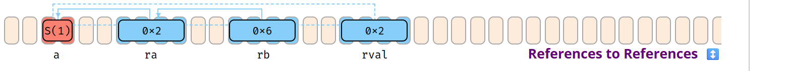

#### 引用的引用

```rust
// 返回短（'b）引用
fn f1sr(rb: &'b     &'a     S) -> &'b     S { *rb }
fn f2sr(rb: &'b     &'a mut S) -> &'b     S { *rb }
fn f3sr(rb: &'b mut &'a     S) -> &'b     S { *rb }
fn f4sr(rb: &'b mut &'a mut S) -> &'b     S { *rb }

// 返回短（'b）可变引用。
// f1sm(rb: &'b     &'a     S) -> &'b mut S { *rb } // M
// f2sm(rb: &'b     &'a mut S) -> &'b mut S { *rb } // M
// f3sm(rb: &'b mut &'a     S) -> &'b mut S { *rb } // M
fn f4sm(rb: &'b mut &'a mut S) -> &'b mut S { *rb }

// 返回长（'a）引用。
fn f1lr(rb: &'b     &'a     S) -> &'a     S { *rb }
// f2lr(rb: &'b     &'a mut S) -> &'a     S { *rb } // L
fn f3lr(rb: &'b mut &'a     S) -> &'a     S { *rb }
// f4lr(rb: &'b mut &'a mut S) -> &'a     S { *rb } // L

// 返回长（'a）可变引用。
// f1lm(rb: &'b     &'a     S) -> &'a mut S { *rb } // M
// f2lm(rb: &'b     &'a mut S) -> &'a mut S { *rb } // M
// f3lm(rb: &'b mut &'a     S) -> &'a mut S { *rb } // M
// f4lm(rb: &'b mut &'a mut S) -> &'a mut S { *rb } // L

// 现在假定某处有一个 `ra`
let mut ra: &'a mut S = …;

let rval = f1sr(&&*ra);       // OK
let rval = f2sr(&&mut *ra);
let rval = f3sr(&mut &*ra);
let rval = f4sr(&mut ra);

//  rval = f1sm(&&*ra);       // 会出问题，因为 rval 会是可变
//  rval = f2sm(&&mut *ra);   // 引用，却来自断裂的可变性
//  rval = f3sm(&mut &*ra);   // 链。
let rval = f4sm(&mut ra);

let rval = f1lr(&&*ra);
//  rval = f2lr(&&mut *ra);   // 若这能通过，我们就会有 `rval` 和 `ra` …
let rval = f3lr(&mut &*ra);
//  rval = f4lr(&mut ra);     // … 现在在下方的 compute 中（可变地）别名同一个 `S`。

//  rval = f1lm(&&*ra);       // 同上，因可变链原因失败。
//  rval = f2lm(&&mut *ra);   //                    "
//  rval = f3lm(&mut &*ra);   //                    "
//  rval = f4lm(&mut ra);     // 同上，因别名原因失败。

// 某处虚构的地方，我们同时使用 `ra` 和 `rval`，二者都存活。
compute(ra, rval);
```

此处（`M`）表示因可变性错误而编译失败，（`L`）表示生命周期错误。
另外，解引用 `*rb` 并非严格必要，仅为清晰起见而添加。

- `f_sr` 情况总是可行，短引用（仅存活 `'b`）总能产生。
- `f_sm` 情况通常失败，只因返回 `&mut S` 需要通往 `S` 的 *可变链*。
- `f_lr` 情况可能失败，因为从 `&'a mut S` 向调用者返回 `&'a S` 意味着此时会存在两个指向同一 `S` 的引用（其中一个可变），这是非法的。
- `f_lm` 情况总是因上述原因的组合而失败。

> 注意：本例关注的是 `f` 函数，而非 `compute`。你可以假定
> 它定义为 `fn compute(x: &S, y: &S) {}`。那样的话，`ra` 参数会自动
> 从 `&mut S` 强制转换 [↓](#type-conversions) 为 `&S`，因为你不能对同一目标同时持有
> 共享引用和可变引用。


#### Drop 与 _

```rust
{
    let f = |x, y| (S(x), S(y)); // 返回两个「可 Drop」值的函数。

    let (    x1, y) = f(1, 4);  // S(1) - 作用域   S(4) - 作用域
    let (    x2, _) = f(2, 5);  // S(2) - 作用域   S(5) - 立即
    let (ref x3, _) = f(3, 6);  // S(3) - 作用域   S(6) - 作用域

    println!("…");
}
```

此处 `作用域` 表示所含值存活到作用域结束，即越过 `println!()`。

- 产生可移动值的函数或表达式必须由调用方处理。
- 存入「普通」绑定的值会保留到作用域结束，然后被 drop。
- 存入 `_` 绑定的值通常立刻被 drop。
- 然而，有时引用（例如 `ref x3`）会让值（例如元组 `(S(3), S(6))`）存活更久，因此作为该元组一部分的 `S(6)` 只能在对其兄弟 `S(3)` 的引用消失后才能被 drop。

{}



↕️ 点击可展开示例。

---
## 内存布局

常见类型的字节表示。

### 基本类型

语言核心内置的基本类型。

#### 布尔类型 [REF](https://doc.rust-lang.org/reference/types/boolean.html) 与数值类型 [REF](https://doc.rust-lang.org/reference/types/numeric.html) {#numeric-types}




{}

|类型|最大值|
|---|---|
| `u8`| `255` |
| `u16` | `65_535` |
| `u32`| `4_294_967_295` |
| `u64`| `18_446_744_073_709_551_615` |
| `u128`| `340_282_366_920_938_463_463_374_607_431_768_211_455` |
| `usize`| 取决于平台指针大小，与 `u16`、`u32` 或 `u64` 相同。 |

{}

{}

|类型 |最大值|
|---|---|
| `i8`| `127` |
| `i16` | `32_767` |
| `i32`| `2_147_483_647` |
| `i64`| `9_223_372_036_854_775_807` |
| `i128`| `170_141_183_460_469_231_731_687_303_715_884_105_727` |
| `isize`| 取决于平台指针大小，与 `i16`、`i32` 或 `i64` 相同。 |


|类型 |最小值|
|---|---|
| `i8`| `-128` |
| `i16` | `-32_768` |
| `i32`| `-2_147_483_648` |
| `i64`| `-9_223_372_036_854_775_808` |
| `i128`| `-170_141_183_460_469_231_731_687_303_715_884_105_728` |
| `isize`| 取决于平台指针大小，与 `i16`、`i32` 或 `i64` 相同。 |

{}

{}

| 类型 | 最大值 | 最小正值 | 最大无损整数<sup>1</sup> |
|---|---|---| ---|
| `f16` 🚧 | 65504.0 | 6.10 ⋅ 10 <sup>-5</sup> | `2048`  |
| `f32` | 3.40 ⋅ 10 <sup>38</sup> | 3.40 ⋅ 10 <sup>-38</sup> | `16_777_216` |
| `f64` | 1.79 ⋅ 10 <sup>308</sup> | 2.23 ⋅ 10 <sup>-308</sup> | `9_007_199_254_740_992` |
| `f128` 🚧 | 1.19 ⋅ 10 <sup>4932</sup>  |  3.36 ⋅ 10 <sup>-4932</sup> | 2.07 ⋅ 10 <sup>34</sup> |

<sup>1</sup> 最大整数 `M`，使得所有其他整数 `0 <= X <= M` 都能在该类型中无损表示。换言之，可能仍有更大的整数可以无损表示（例如 `f16` 的 `65504`），但在该值之前，无损表示是有保证的。

> 浮点值经近似以便视觉呈现。负向极限为乘以 -1 后的值。

{}

{}

`f32` 的示例位表示<sup>*</sup>：

说明：

| f32 | S (1) | E (8) | F (23) | 值 |
|------| ---------| ---------| ---------| ---------|
| 规格化数 | ± | 1 to 254 | any | ±(1.F)2 * 2<sup>E-127</sup>  |
| 非规格化数 | ± | 0 | non-zero | ±(0.F)2 * 2<sup>-126</sup>  |
| 零 | ± | 0 | 0 | ±0  |
| 无穷 | ± | 255 | 0 | ±∞  |
| NaN | ± | 255 | non-zero | NaN  |

类似地，对于 `f64` 类型则如下：

| f64 | S (1) | E (11) | F (52) | 值 |
|------| ---------| ---------| ---------| ---------|
| 规格化数 | ± | 1 to 2046 | any | ±(1.F)2 * 2<sup>E-1023</sup>  |
| 非规格化数 | ± | 0 | non-zero | ±(0.F)2 * 2<sup>-1022</sup>  |
| 零 | ± | 0 | 0 | ±0  |
| 无穷 | ± | 2047 | 0 | ±∞  |
| NaN | ± | 2047 | non-zero | NaN  |

<sup>*</sup> 浮点类型遵循 [IEEE 754-2008](https://en.wikipedia.org/wiki/IEEE_754-2008_revision)，并取决于平台字节序。

{}

{}

<a id="numeric-types-ref"></a>

| 转换<sup>1</sup> | 结果 | 说明 |
| --- | --- | --- |
| `3.9_f32 as u8` | `3` | 截断，可考虑先用 `x.round()`。 |
| `314_f32 as u8` | `255` | 取最接近的可用数。 |
| `f32::INFINITY as u8` | `255` | 同上，将 `INFINITY` 视为*非常*大的数。|
| `f32::NAN as u8` | `0` | - |
| `_314 as u8` | `58` | 截断多余位。 |
| `_257 as i8` | `1` | 截断多余位。 |
| `_200 as i8` | `-56` | 截断多余位，之后最高位也可能表示负数。 |

{}

{}

| 运算<sup>1</sup> | 结果 | 说明 |
| --- | --- | --- |
| `200_u8 / 0_u8` | 编译错误。 | - |
| `200_u8 / _0` <sup>d, r</sup> | 恐慌。 | 常规数学可能恐慌；此处：除以零。 |
| `200_u8 + 200_u8` |  编译错误。 | - |
| `200_u8 + _200` <sup>d</sup> | 恐慌。 | 可考虑改用 `checked_`、`wrapping_` 等。[STD](https://doc.rust-lang.org/std/primitive.isize.html#method.checked_add)|
| `200_u8 + _200` <sup>r</sup> | `144` | 在 release 模式下会溢出。 |
| `-128_i8 * -1` | 编译错误。 | 会溢出（不存在 `128_i8`）。 |
| `-128_i8 * _1neg` <sup>d</sup> | 恐慌。 | - |
| `-128_i8 * _1neg` <sup>r</sup> | `-128` | 在 release 模式下溢出回 `-128`。 |
| `1_u8 / 2_u8` | `0` | 其他整数除法也会截断。 |
| `0.8_f32 + 0.1_f32` | `0.90000004` | - |
| `1.0_f32 / 0.0_f32` | `f32::INFINITY` | - |
| `0.0_f32 / 0.0_f32` | `f32::NAN` | - |
| `x < f32::NAN` | `false` | `NAN` 的比较总是返回 false。 |
| `x > f32::NAN` | `false` | `NAN` 的比较总是返回 false。 |
| `f32::NAN == f32::NAN` | `false` | 改用 `f32::is_nan()` [STD](https://doc.rust-lang.org/std/primitive.f32.html#method.is_nan)。 |

{}



<sup>1</sup> 表达式 `_100` 表示任何可能包含值 `100` 的东西，例如 `100_i32`，但对编译器不透明。

<sup>d</sup> Debug 构建。

<sup>r</sup> Release 构建。

#### 文本类型 [REF](https://doc.rust-lang.org/reference/types/textual.html)




{}

| 类型 | 说明 |
|---------|-------------|
| `char` | 始终为 4 字节，且只保存单个 Unicode **标量值** [🔗](https://www.unicode.org/glossary/#unicode_scalar_value)。 |
| `str` | 长度未知的 `u8` 数组，保证保存 **UTF-8 编码的码点**。 |

{}

{}

| 字符 | 说明 |
|---------|-------------|
| `let c = 'a';` | 一个 `char`（Unicode 标量）往往可以与你对*字符*的直觉相符。 |
| `let c = '❤';` | 它也能保存许多 Unicode 符号。 |
| `let c = '❤️';` | 但并非总是如此。给定的 emoji 是**两个** `char`（见 Encoding），且**不能** 🛑 由 `c` 保存。<sup>1</sup> |
| `c = 0xffff_ffff;` | 此外，char **不允许** 🛑 保存任意位模式。 |

    <sup>1</sup> 有趣的是，由于 [零宽连接符](https://en.wikipedia.org/wiki/Zero-width_joiner)（⨝），用户<i>感知为字符</i>的内容可能更加不可预测：👨‍👩‍👧 实际上是 5 个 char 👨⨝👩⨝👧，渲染引擎可以按能力选择将它们显示为一个整体，或分开显示为三个。

| 字符串 | 说明 |
|---------|-------------|
| `let s = "a";` | `str` 通常从不直接持有，而是以 `&str` 形式持有，如此处的 `s`。 |
| `let s = "❤❤️";` | 它可以保存任意文本，每个 *c.* 长度可变，且难以按索引访问。 |

{}

{}

`let s = "I ❤ Rust"; ` 

`let t = "I ❤️ Rust";`

| 变体 | 内存表示<sup>2</sup> |
|---------|-------------|
| `s.as_bytes()` | `49` `20` <b>`e2 9d a4`</b>  `20 52 75 73 74` <sup>3</sup> |
| `t.as_bytes()` | `49` `20` <b>`e2 9d a4`</b>  <b>`ef b8 8f`</b> `20 52 75 73 74` <sup>4</sup> |
| `s.chars()`<sup>1</sup> | `49 00 00 00 20 00 00 00` <b>`64 27 00 00` </b> `20 00 00 00 52 00 00 00 75 00 00 00 73 00` … |
| `t.chars()`<sup>1</sup> | `49 00 00 00 20 00 00 00` <b>`64 27 00 00`</b> <b>`0f fe 00 00`</b> `20 00 00 00 52 00 00 00 75 00` … |

    <sup>1</sup> 结果随后收集到数组并转写为字节，[在此比较](https://play.rust-lang.org/?version=stable&mode=debug&edition=2024&gist=4303e6e40f3e971901409552bae88ac0)。
    
    <sup>2</sup> 值为十六进制，基于 x86。
    
    <sup>3</sup> 注意 `❤` 的 [Unicode 码点 (U+2764)](https://codepoints.net/U+2764) 在 `char` 内表示为 <b>64 27 00 00</b>，但在 `str` 中被 [UTF-8 编码为](https://en.wikipedia.org/wiki/UTF-8#Description) <b>e2 9d a4</b>。
    
    <sup>4</sup> 还可观察到 emoji [红心 `❤️`](https://emojipedia.org/red-heart/) 是 `❤` 与 [U+FE0F 变体选择符-16](https://codepoints.net/U+FE0F) 的组合，因此 `t` 的 char 数量比 `s` 更多。

> <sup>⚠️</sup> 似乎是浏览器 bug，Safari 和 Edge 在脚注 3 和 4 中错误地渲染了心形，尽管它们能在上面的 `s` 和 `t` 中正确区分。

{}



### 自定义类型

用户可定义的基本类型。实际的 <b>布局</b> [REF](https://doc.rust-lang.org/reference/type-layout.html) 受 <b>表示</b> 约束；[REF](https://doc.rust-lang.org/reference/type-layout.html#representations) 可能存在填充。


另请注意，两个类型 `A(X, Y)` 与 `B(X, Y)` 即便字段完全相同，布局仍可能不同；在没有表示保证时切勿 `transmute()` [STD](https://doc.rust-lang.org/std/mem/fn.transmute.html)。

这些 **和类型** 保存其子类型之一的值：


### 引用与指针 {#references-pointers-ui}

引用提供对第三方内存的安全访问，原始指针提供 `unsafe` 访问。
对应的 `mut` 类型与其不可变对应物具有相同的数据布局。


#### 指针元数据 {#pointer-meta}

许多引用与指针类型可以携带一个额外字段，即 **指针元数据**。[STD](https://doc.rust-lang.org/nightly/std/ptr/trait.Pointee.html#pointer-metadata)
它可以是目标的元素长度或字节长度，或指向 *vtable* 的指针。带有元数据的指针称为 **胖指针**，否则称为 **瘦指针**。


### 闭包 {#closures-data}

带有自动管理数据块的即用函数，会**捕获** [REF](https://doc.rust-lang.org/reference/types/closure.html#capture-modes)<sup>, 1</sup>
定义闭包时所在环境。例如，若你有：

```rust
let y = ...;
let z = ...;

with_closure(move |x| x + y.f() + z); // y and z are moved into closure instance (of type C1)
with_closure(     |x| x + y.f() + z); // y and z are pointed at from closure instance (of type C2)
```

则传给 `with_closure()` 的生成匿名闭包类型 `C1` 与 `C2` 会如下所示：


还会生成匿名 `fn`，例如 `fc1(C1, X)` 或 `fc2(&C2, X)`。细节取决于根据被捕获类型的属性所支持的是 `FnOnce`、`FnMut`、`Fn` ……中的哪一种。

<sup>1</sup> 稍作简化，闭包是一种便于书写的「迷你函数」，它接受参数，*但同时也*需要一些局部变量才能完成工作。因此它既是一个类型（包含所需局部变量），又是一个函数。*「捕获环境」* 是一种花哨的说法，用来描述闭包类型如何持有这些局部变量，要么*按移动的值*，要么*按指针*。各种影响见 **API 中的闭包** [↓](#closures-in-apis)。

### 标准库类型

Rust 的标准库将上述原始类型组合成具有特殊语义的实用类型，例如：


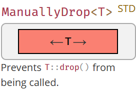


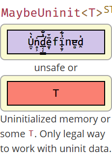

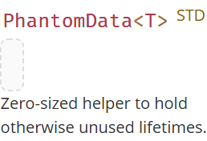

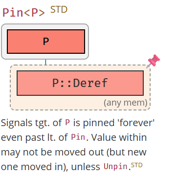

> 🛑 所有图示仅供 **示意**。
> 这些字段在最新的 `stable` 中应当存在，但 Rust 不对其布局作任何保证，除非文档允许，否则不得尝试*不安全地*访问任何内容。

#### Cells


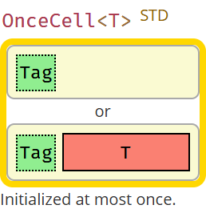

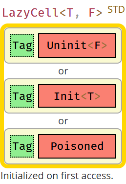

#### 保序集合


<spacer>
</spacer>

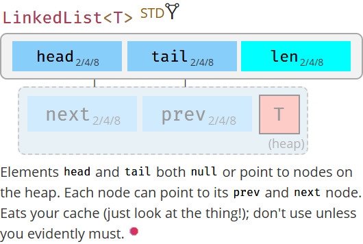

<spacer>
</spacer>

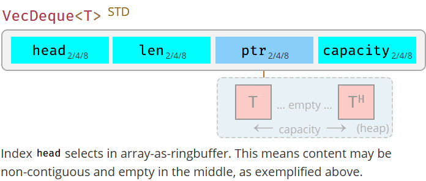

#### 其他集合

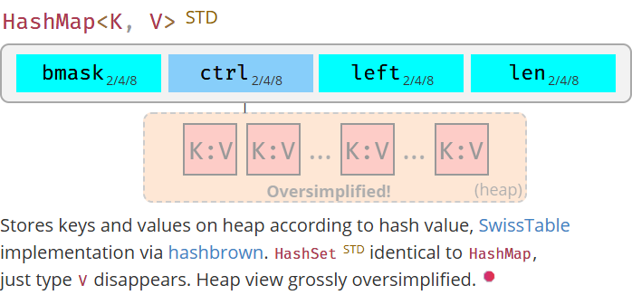

<spacer>
</spacer>

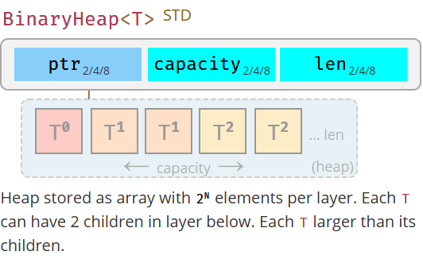

#### 拥有所有权的字符串


<spacer>
</spacer>


<spacer>
</spacer>


<spacer>
</spacer>


#### 共享所有权

若类型不包含用于 `T` 的 `Cell`，这些类型常与上述某个 `Cell` 类型组合，以实现事实上的共享可变性。


<spacer>
</spacer>
<spacer>
</spacer>

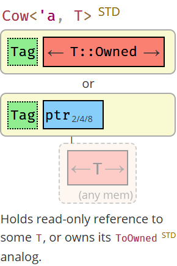

---
## 标准库

### 单行速查

常见但容易忘记的片段。更多内容见 **Rust Cookbook** [🔗](https://rust-lang-nursery.github.io/rust-cookbook/)。



{}

| 意图 | 片段 |
|---------|-------------|
| 拼接字符串（任意实现 `Display`[↓](#string-output) 的类型）。  [STD](https://doc.rust-lang.org/std/fmt/index.html) <sup>1</sup>  `'21` | `format!("{x}{y}")` |
| 追加字符串（任意 `Display` 到任意 `Write`）。  `'21` [STD](https://doc.rust-lang.org/std/fmt/index.html#write) | `write!(x, "{y}")` |
| 按分隔符模式拆分。[STD](https://doc.rust-lang.org/std/str/pattern/trait.Pattern.html) [🔗](https://stackoverflow.com/a/38138985) | `s.split(pattern)` |
| &nbsp;&nbsp;&nbsp;&nbsp;… 使用 `&str` | `s.split("abc")` |
| &nbsp;&nbsp;&nbsp;&nbsp;… 使用 `char` | `s.split('/')` |
| &nbsp;&nbsp;&nbsp;&nbsp;… 使用闭包 | `s.split(char::is_numeric)`|
| 按空白拆分。  [STD](https://doc.rust-lang.org/std/primitive.str.html#method.split_whitespace) | `s.split_whitespace()` |
| 按换行拆分。  [STD](https://doc.rust-lang.org/std/primitive.str.html#method.lines)  | `s.lines()` |
| 按正则表达式拆分。[🔗](https://docs.rs/regex/latest/regex/struct.Regex.html#method.split) <sup>2</sup> | ` Regex::new(r"\s")?.split("one two three")` |

<sup>1</sup> 会分配内存；若之后不再使用 `x` 或 `y`，可考虑用 `write!` 或 `std::ops::Add`。

<sup>2</sup> 需要 [regex](https://crates.io/crates/regex) crate。

{}

{}

| 意图 | 片段 |
|---------|-------------|
| 创建新文件 [STD](https://doc.rust-lang.org/std/fs/struct.File.html#method.open) | `File::create(PATH)?`  |
| &nbsp;&nbsp;&nbsp;&nbsp;同上，通过 OpenOptions | `OpenOptions::new().create(true).write(true).truncate(true).open(PATH)?` |
| 将文件读为 `String` [STD](https://doc.rust-lang.org/std/fs/fn.read_to_string.html) | `read_to_string(path)?` |

{}

{}

| 意图 | 片段 |
|---------|-------------|
| 可变参数宏 | `macro_rules! var_args { ($($args:expr),*) =>  }` |
| &nbsp;&nbsp;&nbsp;&nbsp;使用 `args`，例如多次调用 `f`。 |  ` $( f($args); )*` |

{}

{}

| 起始类型 | 资源 |
|---------|-------------|
| `Option<T> -> …` | 见 [Type-Based Cheat Sheet](https://upsuper.github.io/rust-cheatsheet/) |
| `Result<T, R> -> …` | 见 [Type-Based Cheat Sheet](https://upsuper.github.io/rust-cheatsheet/) |
| `Iterator<Item=T> -> …` | 见 [Type-Based Cheat Sheet](https://upsuper.github.io/rust-cheatsheet/) |
| `&[T] -> …` | 见 [Type-Based Cheat Sheet](https://upsuper.github.io/rust-cheatsheet/) |
| `Future<T> -> …` | 见 [Futures Cheat Sheet](https://rufflewind.com/img/rust-futures-cheatsheet.html) |

{}

{}

| 意图 | 片段 |
|---------|-------------|
| 更干净的闭包捕获 | <code>wants_closure({ let c = outer.clone(); move \|\| use_clone(c) })</code> |
| 修复 '`try`' 闭包中的类型推断 | <code>iter.try_for_each(\|x\| { Ok::<(), Error>(()) })?;</code> |
| 在 `T` 为 Copy 时迭代 *并* 编辑 `&mut [T]`。 | `Cell::from_mut(mut_slice).as_slice_of_cells()` |
| 按长度取子切片。 | `&original_slice[offset..][..length]` |
| 金丝雀检测，确保 trait `T` 是 **dyn compatible**。[REF](https://doc.rust-lang.org/reference/items/traits.html#dyn-compatibility) | `const _: Option<&dyn T> = None;` |
| *Semver trick* 以统一类型。[🔗](https://github.com/dtolnay/semver-trick) | 在 `Cargo.toml` 中写 `my_crate = "next.version"` + 再导出类型。 |
| 在本 crate 内使用宏。[🔗](https://users.rust-lang.org/t/use-macro-inside-proc-macro-crate/61095/4) | `macro_rules! internal_macro {}` 配合 `pub(crate) use internal_macro;` |

{}



### 线程安全 {#thread-safety}

假设你在线程 1 中持有一些变量，并想把它们 **move** 到线程 2，或把它们的 **引用** 传给线程 3。
是否允许分别由 **`Send`**[STD](https://doc.rust-lang.org/std/marker/trait.Send.html) 与 **`Sync`**[STD](https://doc.rust-lang.org/std/marker/trait.Sync.html) 决定：

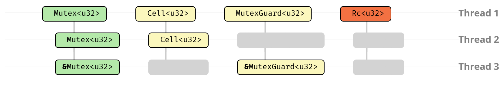

| 示例 | 说明 |
| --- | --- |
| **`Mutex<u32>`** | 既是 `Send` 也是 `Sync`。可以安全地传给或借给另一线程。 |
| **`Cell<u32>`** | `Send`，不是 `Sync`。可移动，但其引用会允许并发的非原子写入。 |
| **`MutexGuard<u32>`** | `Sync`，但不是 `Send`。锁与线程绑定，但通过引用使用不会造成数据竞争。 |
| **`Rc<u32>`** | 两者都不是，因为它是带非原子计数器、易于克隆的堆代理。 |


| Trait | `Send` | `!Send` |
| --- | --- | --- |
| `Sync` | *大多数类型* … `Arc<T>`<sup>1,2</sup>、`Mutex<T>`<sup>2</sup> | `MutexGuard<T>`<sup>1</sup>、`RwLockReadGuard<T>`<sup>1</sup> |
| `!Sync` | `Cell<T>`<sup>2</sup>、`RefCell<T>`<sup>2</sup> | `Rc<T>`、`&dyn Trait`、`*const T`<sup>3</sup> |

<sup>1</sup> 若 `T` 是 `Sync`。

<sup>2</sup> 若 `T` 是 `Send`。

<sup>3</sup> 若需要发送裸指针，创建 newtype `struct Ptr(*const u8)` 并 `unsafe impl Send for Ptr {}`。只需确保你 *可以* 发送它。


| 何时 … | … 是 Send？ |
| --- | --- |
| `T` | 所有包含的字段都是 `Send`，或已 `unsafe` 实现。 |
| &nbsp;&nbsp;&nbsp;&nbsp;`struct S { ... }` | 所有字段都是 `Send`，或已 `unsafe` 实现。 |
| &nbsp;&nbsp;&nbsp;&nbsp;`struct S<T> { ... }` | 所有字段都是 `Send` 且 `T` 是 `Send`，或已 `unsafe` 实现。 |
| &nbsp;&nbsp;&nbsp;&nbsp;`enum E { ... }` | 所有变体中的所有字段都是 `Send`，或已 `unsafe` 实现。 |
| `&T` | 若 `T` 是 `Sync`。 |
| <code>\|\| {}</code> | 若所有 *捕获* 都是 `Send`，则闭包是 `Send`。 |
| &nbsp;&nbsp;&nbsp;&nbsp;<code>\|x\| { }</code> | `Send`，与 `x` 无关。 |
| &nbsp;&nbsp;&nbsp;&nbsp;<code>\|x\| { Rc::new(x) }</code> | `Send`，因为仍未捕获任何东西，尽管 `Rc` 不是 `Send`。 |
| &nbsp;&nbsp;&nbsp;&nbsp;<code>\|x\| { x + y }</code> | 仅当 `y` 是 `Send` 时才是 `Send`。 |
| <code>async { }</code> | 若在 `.await` 点之上没有持有 `!Send`，则 Future 是 `Send`。 |
| &nbsp;&nbsp;&nbsp;&nbsp;<code>async { Rc::new() }</code> | `Future` 是 `Send`，因为 `!Send` 类型 `Rc` 未跨过 `.await` 持有。 |
| &nbsp;&nbsp;&nbsp;&nbsp;<code>async { rc; x.await; rc; }</code> <sup>1</sup> | `Future` 是 `!Send`，因为 `Rc` 跨过了 `.await` 点使用。 |
| <code>async \|\| { }</code> 🚧 | 异步 *闭包*。若所有捕获都是 `Send` 则闭包 `Send`；若内部也无 `!Send`，则结果 `Future` 也是。 |
| &nbsp;&nbsp;&nbsp;&nbsp;<code>async \|x\| { x  + y }</code> 🚧 | 若 `y` 是 `Send` 则异步闭包 `Send`。若 `x` 和 `y` 都是 `Send` 则 Future `Send`。 |

<sup>1</sup> 这是一点伪代码以说明要点：思路是在 `.await` 点之前有一个 `Rc`，并在该点之后继续使用它。

### 原子与缓存 🝖 {#atomics-cache}

CPU 缓存、内存写入，以及原子操作如何影响它们。


现代 CPU 并不直接访问内存，只访问其缓存。每个 CPU 有自己的缓存，比 RAM 快约 100 倍，但小得多。它以 **cache lines**（缓存行）[🔗](https://stackoverflow.com/questions/3928995/how-do-cache-lines-work) 组织——某种字节的 *切片* 窗口，并跟踪其对主存是独占 (E)、共享 (S) 还是已修改 (M) 的视图 [🔗](https://en.wikipedia.org/wiki/MESI_protocol)。缓存之间会通信以确保 **一致性（coherence）**，[🔗](https://gfxcourses.stanford.edu/cs149/fall20content/media/cachecoherence/10_coherence.pdf)
即「足够小」的数据会「立即」被所有其他 CPU 看到，但这可能让 CPU 停顿。


左：编译器 *和* CPU 都可以自由 **重排序** [🔗](https://en.wikipedia.org/wiki/Memory_ordering) 并拆分读/写内存访问。即便你显式写了 `write(1); write(23); write(4)`，编译器也可能认为先写 `23` 更好；此外你的 CPU 可能坚持拆分写入，先做 `3` 再做 `2`。这些步骤中的每一步都可能被 CPU2 通过 `unsafe` *数据竞争* 观察到（甚至是 *不可能的* `O3`）。重排序对锁也是致命的。

右：半相关地，即便两个 CPU 并不试图访问彼此的数据（例如更新 2 个独立变量），若底层内存映射到 2 条缓存行（**伪共享 / false sharing**），它们仍可能遭遇显著性能损失。[🔗](https://docs.kernel.org/kernel-hacking/false-sharing.html)


原子操作通过两件事解决上述问题，它们

- 通过临时锁定其他 CPU 中的缓存行，确保读 / 写 / 更新不会被部分观察到，
- 强制编译器和 CPU 都不要围绕它重排序 *「无关」* 的访问（即充当 **栅栏 / fence** [STD](https://doc.rust-lang.org/std/sync/atomic/fn.fence.html)）。确保多个 CPU 就这些其他操作的相对顺序达成一致称为 **一致性（consistency）**。[🔗](https://gfxcourses.stanford.edu/cs149/winter19content/lectures/09_consistency/09_consistency_slides.pdf) 这也会以错过性能优化为代价。

> **注意** — 以上内容大幅简化。虽然一致性（coherence）与一致性（consistency）问题是普遍的，但不同 CPU 架构在缓存与原子实现方式及其性能影响上差异很大。

|  原子排序  | 说明 |
| --- | --- |
| **`Relaxed`** [STD](https://doc.rust-lang.org/std/sync/atomic/enum.Ordering.html#variant.Relaxed) | 完全可重排序。无关的读/写可围绕原子操作自由打乱。 |
| **`Release`** [STD](https://doc.rust-lang.org/std/sync/atomic/enum.Ordering.html#variant.Release)<sup>, 1</sup> | 写入时，确保第三方 `Acquire` 加载的其他数据在此写入之后才可见。 |
| **`Acquire`** [STD](https://doc.rust-lang.org/std/sync/atomic/enum.Ordering.html#variant.Acquire)<sup>, 1</sup> | 读取时，确保第三方 `Release` 之前写入的其他数据在此读取之后才可见。 |
| **`SeqCst`** [STD](https://doc.rust-lang.org/std/sync/atomic/enum.Ordering.html#variant.SeqCst) | 原子操作周围不可重排序。所有无关的读和写都留在正确一侧。 |

<sup>1</sup> 说清楚：当用 2+ 个 CPU 同步内存访问时，*所有* 一方都必须使用 `Acquire` 或 `Release`（或更强）。写者必须确保希望 *释放* 到内存的所有其他数据都放在原子信号之前，而希望 *获取* 这些数据的读者必须确保其其他读取只在原子信号之后进行。

### 迭代器 {#iterators}

处理集合中的元素。



{}

广义上说，集合迭代有四种 *风格*：

| 风格 | 描述 |
| --- | --- |
| `for x in c { ... }` | *命令式*，适合有副作用、相互依赖，或需要提前打断流程时。  |
| `c.iter().map().filter()` | *函数式*，当只关心结果时通常更干净。 |
| `c_iter.next()` | *底层*，通过显式调用 `Iterator::next()` [STD](https://doc.rust-lang.org/std/iter/trait.Iterator.html#tymethod.next)。 🝖 |
| `c.get(n)` | *手动*，绕过正式的迭代机制。 |

> **看法** 💭 — 函数式风格通常最易跟读，但若你的 `.iter()` 链变得杂乱，别犹豫使用 `for`。实现容器时最好支持迭代器，但赶时间时，有时实现 `.len()` 和 `.get()` 然后继续干活更实际。

{}

{}

**基础**

假设你有类型为 `C` 的集合 `c` 想要使用：

* **`c.into_iter()`**<sup>1</sup>  — 将集合 `c` 变成 **`Iterator`** [STD](https://doc.rust-lang.org/std/iter/trait.Iterator.html) `i` 并 **消耗**<sup>2</sup> `c`。获取迭代器的 *标准* 方式。
* **`c.iter()`** — **部分** 集合提供的便捷方法，返回 **借用** 迭代器，不消耗 `c`。
* **`c.iter_mut()`** — 同上，但是 **可变借用** 迭代器，允许修改集合。

**迭代器**

一旦你有了 `i`：

* **`i.next()`** — 返回 `c` 提供的下一个元素 `Some(x)`，若结束则返回 `None`。

**For 循环**

* **`for x in c {}`** — 语法糖，调用 `c.into_iter()` 并循环 `i` 直到 `None`。

<sup>1</sup> 要求为 `C` 实现 **`IntoIterator`** [STD](https://doc.rust-lang.org/std/iter/trait.IntoIterator.html)。元素类型取决于 `C` 是什么。

<sup>2</sup> 若看起来像没有消耗 `c`，那是因为类型是 `Copy`。例如，若调用 `(&c).into_iter()`，会对 `&c` 调用 `.into_iter()`（会消耗引用的 *副本* 并变成迭代器），但原始的 `c` 保持不变。

{}

{}

**要点**

假设你编写了 `struct Collection<T> {}`。你还应实现：

* **`struct IntoIter<T> {}`** — 创建一个结构体保存值迭代的状态（例如索引）。
* **`impl Iterator for IntoIter<T> {}`** — 实现 `Iterator::next()`，使其能产生元素。


> 至此你有了能充当 **Iterator** [STD](https://doc.rust-lang.org/std/iter/trait.Iterator.html) 的东西，但还没有实际获取它的方式。见下一页签了解通常如何做到。

{}

{}

**原生循环支持**

许多用户会期望你的集合在 `for<'a>` 循环中 *直接可用*。你需要实现：

* **`impl IntoIterator for Collection<T> {}`** — 现在 `for x in c {}` 可用。
* **`impl IntoIterator for &Collection<T> {}`** — 现在 `for x in &c {}` 可用。
* **`impl IntoIterator for &mut Collection<T> {}`** — 现在 `for x in &mut c {}` 可用。


> 如你所见，**IntoIterator** [STD](https://doc.rust-lang.org/std/iter/trait.IntoIterator.html) trait 才是把你的集合与上一页签创建的 **IntoIter** 结构体真正连接起来的。**IntoIter** 的两个兄弟（**Iter** 与 **IterMut**）在下一页签讨论。

{}

{}

**共享与可变迭代器**

此外，若希望集合在被借用时也有用，应实现：

* **`struct Iter<T> {}`** — 创建持有 `&Collection<T>` 状态的结构体，用于共享迭代。
* **`struct IterMut<T> {}`** — 类似，但持有 `&mut Collection<T>` 状态，用于可变迭代。
* **`impl Iterator for Iter<T> {}`** — 实现共享迭代。
* **`impl Iterator for IterMut<T> {}`** — 实现可变迭代。

你可能还想添加便捷方法：

- `Collection::iter(&self) -> Iter`，
- `Collection::iter_mut(&mut self) -> IterMut`。


> 借用迭代器支持的代码基本上只是前几步的重复，类型略有不同，例如 `&T` 与 `T`。

{}

{}

**迭代器互操作**

要允许 **第三方迭代器**「收集进」你的集合，实现：

* **`impl FromIterator for Collection {}`** — 现在 `some_iter.collect::>()` 可用。
* **`impl Extend for Collection<T> {}`** — 现在 `c.extend(other)` 可用。

此外，也可考虑把 **`std::iter`** [STD](https://doc.rust-lang.org/std/iter/index.html#) 中的额外 trait 加到你之前的结构体上：

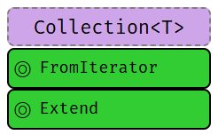

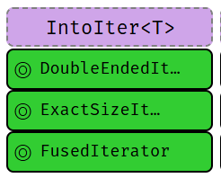

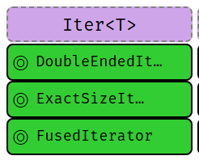

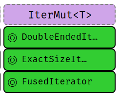

> 编写集合可能很费功夫。好消息是，若你完成了所有这些步骤，你的集合会感觉像 *一等公民*。

{}



### 数值转换

当前尽可能 <b style="">正确</b> 的数值转换。

| ↓ 已有 / 想要 → | `u8` … `i128` |  `f32` / `f64` | String |
| --- | --- |  --- |--- |
| `u8` … `i128` | `u8::try_from(x)?` <sup>1</sup> |  `x as f32` <sup>3</sup> | `x.to_string()` |
| `f32` / `f64` | `x as u8` <sup>2</sup> |  `x as f32` | `x.to_string()` |
| `String` | `x.parse::<u8>()?` | `x.parse::<u8>()?` | `x` |

<sup>1</sup> 若类型是真子集，可直接用 `from()`，例如 `u32::from(my_u8)`。 

<sup>2</sup> 会截断（`11.9_f32 as u8` 得到 `11`）并饱和（`1024_f32 as u8` 得到 `255`）；*参见* 下文。 

<sup>3</sup> 可能误表示数值（`u64::MAX as f32`）或产生 `Inf`（`u128::MAX as f32`）。

> 另见上文 [**类型转换陷阱**](#numeric-types) 与 [**算术陷阱**](#numeric-types)，了解处理数值时还可能出什么问题。

### 字符串转换 {#string-conversions}

若你 **想要** 某种类型的字符串 …



{}

| 若你 **已有** 类型为 … 的 `x`| 使用这个 … |
| --- | --- |
| `String`|`x`|
| `CString`|`x.into_string()?` |
| `OsString`|`x.to_str()?.to_string()`|
| `PathBuf`|`x.to_str()?.to_string()`|
| `Vec<u8>` <sup>1</sup> |`String::from_utf8(x)?`|
| `&str`|`x.to_string()` <sup>i</sup> |
| `&CStr`|`x.to_str()?.to_string()` |
| `&OsStr`|`x.to_str()?.to_string()`|
| `&Path`|`x.to_str()?.to_string()`|
| `&[u8]` <sup>1</sup> |`String::from_utf8_lossy(x).to_string()`|

{}

{}

| 若你 **已有** 类型为 … 的 `x`| 使用这个 … |
| --- | --- |
| `String`|`CString::new(x)?`|
| `CString`|`x`|
| `OsString` |`CString::new(x.to_str()?)?`|
| `PathBuf`|`CString::new(x.to_str()?)?`|
| `Vec<u8>` <sup>1</sup> |`CString::new(x)?`|
| `&str`|`CString::new(x)?`|
| `&CStr`|`x.to_owned()` <sup>i</sup> |
| `&OsStr` |`CString::new(x.to_os_string().into_string()?)?`|
| `&Path`|`CString::new(x.to_str()?)?`|
| `&[u8]` <sup>1</sup> |`CString::new(Vec::from(x))?`|
| `*mut c_char` <sup>2</sup> |`unsafe { CString::from_raw(x) }`|

{}

{}

| 若你 **已有** 类型为 … 的 `x`| 使用这个 … |
| --- | --- |
| `String`|`OsString::from(x)` <sup>i</sup> |
| `CString`|`OsString::from(x.to_str()?)`|
| `OsString`|`x`|
| `PathBuf`|`x.into_os_string()`|
| `Vec<u8>` <sup>1</sup> |`unsafe { OsString::from_encoded_bytes_unchecked(x) }`|
| `&str`|`OsString::from(x)` <sup>i</sup>|
| `&CStr`|`OsString::from(x.to_str()?)`|
| `&OsStr`|`OsString::from(x)` <sup>i</sup>|
| `&Path`|`x.as_os_str().to_owned()`|
| `&[u8]` <sup>1</sup> |`unsafe { OsString::from_encoded_bytes_unchecked(x.to_vec()) }`|

{}

{}

| 若你 **已有** 类型为 … 的 `x`| 使用这个 … |
| --- | --- |
| `String`|`PathBuf::from(x)` <sup>i</sup>|
| `CString`|`PathBuf::from(x.to_str()?)`|
| `OsString`|`PathBuf::from(x)` <sup>i</sup>|
| `PathBuf`|`x`|
| `Vec<u8>` <sup>1</sup> |`unsafe { PathBuf::from(OsString::from_encoded_bytes_unchecked(x)) }` |
| `&str`|`PathBuf::from(x)` <sup>i</sup>|
| `&CStr`|`PathBuf::from(x.to_str()?)`|
| `&OsStr`|`PathBuf::from(x)` <sup>i</sup>|
| `&Path`|`PathBuf::from(x)` <sup>i</sup>|
| `&[u8]` <sup>1</sup> |`unsafe { PathBuf::from(OsString::from_encoded_bytes_unchecked(x.to_vec())) }` |

{}

{}

| 若你 **已有** 类型为 … 的 `x`| 使用这个 … |
| --- | --- |
| `String`|`x.into_bytes()`|
| `CString`|`x.into_bytes()`|
| `OsString`|`x.into_encoded_bytes()`|
| `PathBuf`|`x.into_os_string().into_encoded_bytes()`|
| `Vec<u8>` <sup>1</sup> |`x`|
| `&str`|`Vec::from(x.as_bytes())`|
| `&CStr`|`Vec::from(x.to_bytes_with_nul())`|
| `&OsStr`|`Vec::from(x.as_encoded_bytes())`|
| `&Path`|`Vec::from(x.as_os_str().as_encoded_bytes())`|
| `&[u8]` <sup>1</sup> |`x.to_vec()`|

{}

{}

| 若你 **已有** 类型为 … 的 `x`| 使用这个 … |
| --- | --- |
| `String`|`x.as_str()`|
| `CString`|`x.to_str()?`|
| `OsString`|`x.to_str()?`|
| `PathBuf`|`x.to_str()?`|
| `Vec<u8>` <sup>1</sup> |`std::str::from_utf8(&x)?`|
| `&str`|`x`|
| `&CStr`|`x.to_str()?`|
| `&OsStr`|`x.to_str()?`|
| `&Path`|`x.to_str()?`|
| `&[u8]` <sup>1</sup> |`std::str::from_utf8(x)?`|

{}

{}

| 若你 **已有** 类型为 … 的 `x`| 使用这个 … |
| --- | --- |
| `String`|`CString::new(x)?.as_c_str()`|
| `CString`|`x.as_c_str()`|
| `OsString`|`x.to_str()?`|
| `PathBuf`| —<sup>,3</sup> |
| `Vec<u8>` <sup>1</sup><sup>,4</sup> |`CStr::from_bytes_with_nul(&x)?`|
| `&str`| —<sup>,3</sup> |
| `&CStr`|`x`|
| `&OsStr` | —<sup>,3</sup> |
| `&Path`| —<sup>,3</sup> |
| `&[u8]` <sup>1</sup><sup>,4</sup> |`CStr::from_bytes_with_nul(x)?`|
| `*const c_char` <sup>1</sup> |`unsafe { CStr::from_ptr(x) }`|

{}

{}

| 若你 **已有** 类型为 … 的 `x`| 使用这个 … |
| --- | --- |
| `String`|`OsStr::new(&x)`|
| `CString`| — |
| `OsString`|`x.as_os_str()`|
| `PathBuf`|`x.as_os_str()`|
| `Vec<u8>` <sup>1</sup> |`unsafe { OsStr::from_encoded_bytes_unchecked(&x) }`|
| `&str`|`OsStr::new(x)`|
| `&CStr`| — |
| `&OsStr`|`x`|
| `&Path`|`x.as_os_str()`|
| `&[u8]` <sup>1</sup> | `unsafe { OsStr::from_encoded_bytes_unchecked(x) }` |

{}

{}

| 若你 **已有** 类型为 … 的 `x`| 使用这个 … |
| --- | --- |
| `String`|`Path::new(x)` <sup>r</sup>|
| `CString`|`Path::new(x.to_str()?)` |
| `OsString`|`Path::new(x.to_str()?)` <sup>r</sup>|
| `PathBuf`|`Path::new(x.to_str()?)` <sup>r</sup>|
| `Vec<u8>` <sup>1</sup> |`unsafe { Path::new(OsStr::from_encoded_bytes_unchecked(&x)) }`|
| `&str`|`Path::new(x)` <sup>r</sup>|
| `&CStr`|`Path::new(x.to_str()?)` |
| `&OsStr`|`Path::new(x)` <sup>r</sup>|
| `&Path`|`x`|
| `&[u8]` <sup>1</sup> |`unsafe { Path::new(OsStr::from_encoded_bytes_unchecked(x)) }` |

{}

{}

| 若你 **已有** 类型为 … 的 `x`| 使用这个 … |
| --- | --- |
| `String`|`x.as_bytes()`|
| `CString`|`x.as_bytes()`|
| `OsString`|`x.as_encoded_bytes()`|
| `PathBuf`|`x.as_os_str().as_encoded_bytes()`|
| `Vec<u8>` <sup>1</sup> |`&x`|
| `&str`|`x.as_bytes()`|
| `&CStr`|`x.to_bytes_with_nul()`|
| `&OsStr`|`x.as_encoded_bytes()`|
| `&Path`|`x.as_os_str().as_encoded_bytes()`|
| `&[u8]` <sup>1</sup> |`x`|

{}

{}

| 你 **想要** | 且 **已有** `x` | 使用这个 … |
| --- | --- | --- |
| <b>`*const c_char`</b>|<b>`CString`</b>|`x.as_ptr()`|

{}



<sup>i</sup> 若类型可推断，可用短形式 `x.into()`。 

<sup>r</sup> 若类型可推断，可用短形式 `x.as_ref()`。

<sup>1</sup> 你必须确保 `x` 带有该字符串类型的有效表示（例如 `String` 需要 UTF-8 数据）。

<sup>2</sup> 该 `c_char` **必须** 来自先前的 `CString`。若来自 FFI，见 `&CStr`。

<sup>3</sup> 无已知简写，因为 `x` 会缺少终止的 `0x0`。最好的办法可能是经由 `CString`。

<sup>4</sup> 必须确保 `x` 确实以 `0x0` 结尾。

### 字符串输出 {#string-output}

如何把类型转换成 `String`，或输出它们。



{}

Rust 有（除其他外）这些把类型转为字符串化输出的 API，统称 *format* 宏：

| 宏 | 输出 | 说明 |
| --- | --- | --- |
| `format!(fmt)` | `String` | 日常「转成 `String`」的主力。 |
| `print!(fmt)`| 控制台 | 写入标准输出。 |
| `println!(fmt)`| 控制台 | 写入标准输出。 |
| `eprint!(fmt)`| 控制台 | 写入标准错误。 |
| `eprintln!(fmt)`| 控制台 | 写入标准错误。 |
| `write!(dst, fmt)` | 缓冲区 | 别忘了还要 `use std::io::Write;` |
| `writeln!(dst, fmt)` | 缓冲区 | 别忘了还要 `use std::io::Write;` |


| 方法 | 说明 |
| --- | --- |
| `x.to_string()` [STD](https://doc.rust-lang.org/std/string/trait.ToString.html) | 产生 `String`，为任意 `Display` 类型实现。 |

这里 `fmt` 是诸如 `"hello {}"` 的字符串字面量，指定输出（对照「格式化」页签）以及额外参数。

{}

{}

在 `format!` 及其同类中，类型通过 trait `Display` `"{}"` [STD](https://doc.rust-lang.org/std/fmt/trait.Display.html) 或 `Debug` `"{:?}"` [STD](https://doc.rust-lang.org/std/fmt/trait.Debug.html) 转换，非穷尽列表：

| 类型 | 实现 |  |
| --- | --- | --- |
| `String`| `Debug, Display` | |
| `CString`| `Debug` | |
| `OsString`| `Debug` | |
| `PathBuf`| `Debug` |  |
| `Vec<u8>` | `Debug` | |
| `&str`|`Debug, Display` | |
| `&CStr`|`Debug` | |
| `&OsStr`| `Debug` | |
| `&Path`| `Debug` | |
| `&[u8]` |`Debug` | |
| `bool` |`Debug, Display` | |
| `char` |`Debug, Display` | |
| `u8` … `i128` |`Debug, Display` | |
| `f32`, `f64` |`Debug, Display` | |
| `!` |`Debug, Display` | |
| `()` |`Debug` | |

简言之，几乎一切都是 `Debug`；更 *特殊* 的类型可能需要特殊处理或转换 [↑](#string-conversions) 到 `Display`。

{}

{}

format 宏中每个参数指示符要么是空的 `{}`、`{argument}`，要么遵循基本 [**语法**](https://doc.rust-lang.org/std/fmt/index.html#syntax)：

```text
{ [argument] ':' [[fill] align] [sign] ['#'] [width [$]] ['.' precision [$]] [type] }
```

| 元素 |  含义 |
|---------| ---------|
| `argument` |  数字（`0`、`1`、…）、变量 `'21` 或名称，`'18` 例如 `print!("{x}")`。 |
| `fill` | 若指定了 `width`，用于填充空白的字符（例如 `0`）。 |
| `align` | 若指定了宽度：左（`<`）、中（`^`）或右（`>`）。 |
| `sign` | 可为 `+`，表示始终打印符号。 |
| `#` | [备用格式](https://doc.rust-lang.org/std/fmt/index.html#sign0)，例如美化 `Debug`[STD](https://doc.rust-lang.org/std/fmt/trait.Debug.html) 格式器 `?`，或给十六进制加 `0x` 前缀。 |
| `width` | 最小宽度（≥ 0），用 `fill` 填充（默认空格）。若以 `0` 开头则零填充。 |
| `precision` | 数值的小数位数（≥ 0），或非数值的最大宽度。 |
| `$` | 将 `width` 或 `precision` 解释为参数标识符，以允许动态格式化。 |
| **`type`** | `Debug`[STD](https://doc.rust-lang.org/std/fmt/trait.Debug.html)（`?`）格式、十六进制（`x`）、二进制（`b`）、八进制（`o`）、指针（`p`）、指数（`e`）… [见更多](https://doc.rust-lang.org/std/fmt/index.html#traits)。 |


| 格式示例 | 说明 |
|---------|-------------|
| `{}` | 用 `Display`[STD](https://doc.rust-lang.org/std/fmt/trait.Display.html) 打印下一个参数。 |
| `{x}` | 同上，但使用作用域中的变量 `x`。 `'21` |
| `{:?}` | 用 `Debug`[STD](https://doc.rust-lang.org/std/fmt/trait.Debug.html) 打印下一个参数。 |
| `{2:#?}` | 用 `Debug`[STD](https://doc.rust-lang.org/std/fmt/trait.Debug.html) 美化打印第 3 个参数。 |
| `{val:^2$}` | 居中命名参数 `val`，宽度由第 3 个参数指定。 |
| `{:<10.3}` | 左对齐，宽度 10，精度 3。|
| `{val:#x}` | 将 `val` 参数格式化为十六进制，带前导 `0x`（`x` 的备用格式）。 |


| 完整示例 | 说明 |
|---------|-------------|
| `println!("{}", x)` | 用 `Display`[STD](https://doc.rust-lang.org/std/fmt/trait.Display.html) 在标准输出打印 `x` 并追加换行。 `'15` 🗑️ |
| `println!("{x}")` | 同上，但使用作用域中的变量 `x`。 `'21`  |
| `format!("{a:.3} {b:?}")` | 将 `a` 转为 3 位小数，加空格，`b` 用 `Debug` [STD](https://doc.rust-lang.org/std/fmt/trait.Debug.html)，返回 `String`。  `'21` |

{}



---
## 工具链

### 项目结构 {#project-anatomy}

`cargo` 使用的基本项目布局，以及常见文件与文件夹。[↓](#cargo)

| 条目 | 说明 |
|--------| ---- |
| 📁 `.cargo/` | **项目本地的 cargo 配置**，可包含 **`config.toml`**。[🔗](https://doc.rust-lang.org/cargo/reference/config.html) 🝖 |
| 📁 `benches/` | 你 crate 的基准测试，通过 **`cargo bench`** 运行，默认需要 nightly。<sup>*</sup> 🚧 |
| 📁 `examples/` | 如何使用你 crate 的示例；它们像外部用户一样看待你的 crate。  |
| &nbsp;&nbsp;&nbsp;&nbsp;`my_example.rs` | 单独的示例可像 **`cargo run --example my_example`** 这样运行。 |
| 📁 `src/` | 项目的实际源代码。 |
| &nbsp;&nbsp;&nbsp;&nbsp;`main.rs` | 应用程序的默认入口点，这就是 **`cargo run`** 所使用的。 |
| &nbsp;&nbsp;&nbsp;&nbsp;`lib.rs` | 库的默认入口点。对 `my_crate::f()` 的查找从这里开始。 |
| 📁 `src/bin/` | 额外二进制文件的位置，即便在库项目中也可以。 |
| &nbsp;&nbsp;&nbsp;&nbsp;`extra.rs` | 额外的二进制，用 `cargo run --bin extra` 运行。 |
| 📁 `tests/` | 集成测试放在这里，通过 **`cargo test`** 调用。单元测试通常留在 `src/` 文件中。 |
| `.rustfmt.toml` | 若要[**自定义**](https://rust-lang.github.io/rustfmt/) **`cargo fmt`** 的行为。 |
| `.clippy.toml` | 某些 [**clippy lint**](https://rust-lang.github.io/rust-clippy/master/index.html) 的特殊配置，通过 **`cargo clippy`** 使用  🝖 |
| `build.rs` |  **预构建脚本**，[🔗](https://doc.rust-lang.org/cargo/reference/build-scripts.html) 在编译 C / FFI 等时有用。 |
| <code class="ignore-auto language-bash">Cargo.toml</code> | 主要的 **项目清单**，[🔗](https://doc.rust-lang.org/cargo/reference/manifest.html) 定义依赖、产物等。 |
| <code class="ignore-auto language-bash">Cargo.lock</code> | 用于可复现构建。应用应加入 git，库则通常考虑不加入。💭 [🔗](https://blog.rust-lang.org/2023/08/29/committing-lockfiles.html) [🔗](https://web.archive.org/web/20240108203227/https://old.reddit.com/r/rust/comments/164qfjm/change_in_guidance_on_committing_lockfiles_rust/jya8ouf/) |
| `rust-toolchain.toml` |  为此项目定义 **工具链覆盖**[🔗](https://rust-lang.github.io/rustup/overrides.html)（channel、components、targets）。 |

<sup>*</sup> 在 stable 上可考虑 [Criterion](https://github.com/bheisler/criterion.rs)。

各类入口点的 **最小示例** 可能如下：



{}

```rust
// src/main.rs (default application entry point)

fn main() {
    println!("Hello, world!");
}
```

{}

{}

```rust
// src/lib.rs (default library entry point)

pub fn f() {}      // Is a public item in root, so it's accessible from the outside.

mod m {
    pub fn g() {}  // No public path (`m` not public) from root, so `g`
}                  // is not accessible from the outside of the crate.
```

{}

{}

```rust
// src/my_module.rs (any file of your project)

fn f() -> u32 { 0 }

#[cfg(test)]
mod test {
    use super::f;           // Need to import items from parent module. Has
                            // access to non-public members.
    #[test]
    fn ff() {
        assert_eq!(f(), 0);
    }
}
```

{}

{}

```rust
// tests/sample.rs (sample integration test)

#[test]
fn my_sample() {
    assert_eq!(my_crate::f(), 123); // Integration tests (and benchmarks) 'depend' to the crate like
}                                   // a 3rd party would. Hence, they only see public items.
```

{}

{}

```rust
// benches/sample.rs (sample benchmark)

#![feature(test)]   // #[bench] is still experimental

extern crate test;  // Even in '18 this is needed for … reasons.
                    // Normally you don't need this in '18 code.

use test::{black_box, Bencher};

#[bench]
fn my_algo(b: &mut Bencher) {
    b.iter(|| black_box(my_crate::f())); // `black_box` prevents `f` from being optimized away.
}
```

{}

{}

```rust
// build.rs (sample pre-build script)

fn main() {
    // You need to rely on env. vars for target; `#[cfg(…)]` are for host.
    let target_os = env::var("CARGO_CFG_TARGET_OS");
}
```

<sup>*</sup>[参见此处列表](https://doc.rust-lang.org/cargo/reference/environment-variables.html#environment-variables-cargo-sets-for-build-scripts)了解所设置的环境变量。

{}

{}

```rust
// src/lib.rs (default entry point for proc macros)

extern crate proc_macro;  // Apparently needed to be imported like this.

use proc_macro::TokenStream;

#[proc_macro_attribute]   // Crates can now use `#[my_attribute]`
pub fn my_attribute(_attr: TokenStream, item: TokenStream) -> TokenStream {
    item
}
```

```toml
// Cargo.toml

[package]
name = "my_crate"
version = "0.1.0"

[lib]
proc-macro = true
```

{}



模块树与导入：



{}

**模块** [BK](https://doc.rust-lang.org/book/ch07-02-defining-modules-to-control-scope-and-privacy.html) [EX](https://doc.rust-lang.org/rust-by-example/mod.html#modules) [REF](https://doc.rust-lang.org/reference/items/modules.html#modules) 与 **源文件** 的工作方式如下：

- **模块树** 需要显式定义，**不会** 从 **文件系统树** 隐式构建。[🔗](http://www.sheshbabu.com/posts/rust-module-system/)
- **模块树根** 等于库、应用等入口点（例如 `lib.rs`）。

实际的 **模块定义** 工作方式如下：
- **`mod m {}`** 在文件内定义模块，而 **`mod m;`** 会读取 `m.rs` 或 `m/mod.rs`。
- 基于 `.rs` 的路径取决于 **嵌套**，例如 `mod a { mod b { mod c; }}}` 要么是 `a/b/c.rs`，要么是 `a/b/c/mod.rs`。
- 未通过某个 `mod m;` 从模块树根接上路径的文件，编译器不会理会！🛑

{}

{}

Rust 有三种 **命名空间**：

<table>
    <thead>
        <tr>
            <th>命名空间 <i>类型</i></th>
            <th>命名空间 <i>函数</i></th>
            <th>命名空间 <i>宏</i></th>
        </tr>
    </thead>
    <tbody>
        <tr>
            <td>`mod X {}`</td>
            <td>`fn X() {}`</td>
            <td>`macro_rules! X { … }`</td>
        </tr>
        <tr>
            <td>`X` (crate)</td>
            <td>`const X: u8 = 1;`</td>
            <td>``</td>
        </tr>
        <tr>
            <td>`trait X {}`</td>
            <td>`static X: u8 = 1;`</td>
            <td>``</td>
        </tr>
        <tr>
            <td>`enum X {}`</td>
            <td>``</td>
            <td>``</td>
        </tr>
        <tr>
            <td>`union X {}`</td>
            <td>``</td>
            <td>``</td>
        </tr>
        <tr>
            <td>`struct X {}`</td>
            <td>``</td>
            <td>``</td>
        </tr>
        <tr>
            <td colspan="2" style="text-align: center; padding-right: 50px;"> ← `struct X;`<sup>1</sup> → </td>
            <td></td>
        </tr>
        <tr>
            <td colspan="2" style="text-align: center; padding-right: 50px;"> ← `struct X();`<sup>2</sup> → </td>
            <td></td>
        </tr>
    </tbody>
</table>

<sup>1</sup> 计入 <i>类型</i> 与 <i>函数</i>，定义类型 `X` *以及* 常量 `X`。 

<sup>2</sup> 计入 <i>类型</i> 与 <i>函数</i>，定义类型 `X` *以及* 函数 `X`。

- 在任意给定作用域中（例如模块内），每个命名空间只能有一个同名项，例如：
    - `enum X {}` 与 `fn X() {}` 可以共存
    - `struct X;` 与 `const X` 不能共存
- 使用 `use my_mod::X;` 时，所有名为 `X` 的项都会被导入。

> 由于命名约定（例如 `fn` 与 `mod` 按约定为小写）以及 *常识*（多数开发者不会把所有东西都叫 `X`），在大多数情况下你不必担心这些 *种类*。不过在设计宏时，它们可能成为一个因素。

{}



### Cargo {#cargo}

值得了解的命令与工具。

| 命令 | 说明 |
|--------| ---- |
| `cargo init` | 为最新 edition 创建一个新项目。 |
| `cargo build` | 以 debug 模式构建项目（`--release` 启用全部优化）。 |
| `cargo check` | 检查项目是否能编译（快得多）。 |
| `cargo test` | 运行项目的测试。 |
| `cargo doc --no-deps --open` | 在本地为你的代码生成文档。 |
| `cargo run` | 若产出二进制（main.rs），则运行你的项目。 |
| &nbsp;&nbsp;&nbsp;&nbsp;`cargo run --bin b` | 运行二进制 `b`。会与其他依赖方统一 feature（可能令人困惑）。 |
| &nbsp;&nbsp;&nbsp;&nbsp;`cargo run --package w` | 运行子 workspace `w` 的 main。对 feature 的处理更合理。 |
| `cargo … --timings` | 显示哪些 crate 导致构建耗时过长。🔥 |
| `cargo tree` | 显示依赖图，项目传递使用的所有 crate。 |
| &nbsp;&nbsp;&nbsp;&nbsp;`cargo tree -i foo` | 反向依赖查找，解释为何使用 `foo`。 |
| `cargo info foo` | 显示 `foo` 的 crate 元数据（默认针对本项目所用版本）。 |
| `cargo +{nightly, stable} …`  | 对该命令使用给定工具链，例如用于「仅 nightly」工具。 |
| `cargo +1.85.0 …`  | 也直接接受特定版本。 |
| `cargo +nightly …` | 某些仅 nightly 的命令（用下方命令替换 `…`） |
| &nbsp;&nbsp;&nbsp;&nbsp;`rustc -- -Zunpretty=expanded` |  显示展开后的宏。🚧 |
| `rustup doc` | 打开离线 Rust 文档（含各书籍），坐飞机时很有用！ |

这里 `cargo build` 表示你可以输入 `cargo build`，也可以只输入 `cargo b`；而 `--release` 表示可用 `-r` 代替。

这些是可选的 `rustup` 组件。
用 `rustup component add [tool]` 安装它们。

| 工具 | 说明 |
|--------| ---- |
| `cargo clippy` | 额外的（[lints](https://rust-lang.github.io/rust-clippy/master/)），捕捉常见的 API 误用与不地道的代码。[🔗](https://github.com/rust-lang/rust-clippy) |
| `cargo fmt` | 自动代码格式化器（`rustup component add rustfmt`）。[🔗](https://github.com/rust-lang/rustfmt) |

大量额外的 cargo 插件可在[**此处找到**](https://crates.io/categories/development-tools::cargo-plugins?sort=downloads)。

### 交叉编译

🔘 检查[目标是否受支持](https://doc.rust-lang.org/rustc/platform-support.html)。

🔘 通过 **`rustup target install aarch64-linux-android`** 安装目标（举例）。

🔘 安装原生工具链（*链接* 所需，取决于目标）。

从目标厂商获取（Google、Apple 等），并非所有主机上都可用（例如 Windows 上没有 iOS 工具链）。

**某些工具链需要额外的构建步骤**（例如 Android 的 `make-standalone-toolchain.sh`）。

🔘 像这样更新 **`~/.cargo/config.toml`**：

```toml
[target.aarch64-linux-android]
linker = "[PATH_TO_TOOLCHAIN]/aarch64-linux-android/bin/aarch64-linux-android-clang"
```

   或

```toml
[target.aarch64-linux-android]
linker = "C:/[PATH_TO_TOOLCHAIN]/prebuilt/windows-x86_64/bin/aarch64-linux-android21-clang.cmd"
```

🔘 设置 **环境变量**（可选，等到编译器抱怨后再设置）：

```bat
set CC=C:\[PATH_TO_TOOLCHAIN]\prebuilt\windows-x86_64\bin\aarch64-linux-android21-clang.cmd
set CXX=C:\[PATH_TO_TOOLCHAIN]\prebuilt\windows-x86_64\bin\aarch64-linux-android21-clang.cmd
set AR=C:\[PATH_TO_TOOLCHAIN]\prebuilt\windows-x86_64\bin\aarch64-linux-android-ar.exe
…
```

是否设置取决于编译器如何抱怨，不一定全部都需要。

> 某些平台 / 配置对路径的写法（例如 `\` 与 `/`）以及引号 **极其敏感**。

✔️ 用 **`cargo build --target=aarch64-linux-android`** 编译

### 工具指令 {#tooling-directives}

嵌入在源代码中、供工具或预处理使用的特殊记号。



{}

在 **声明式** [BK](https://doc.rust-lang.org/book/ch19-06-macros.html#declarative-macros-with-macro_rules-for-general-metaprogramming) **示例宏** [BK](https://doc.rust-lang.org/book/ch19-06-macros.html) [EX](https://doc.rust-lang.org/rust-by-example/macros.html#macro_rules) [REF](https://doc.rust-lang.org/reference/macros-by-example.html) `macro_rules!` 实现中，这些 **片段说明符** [REF](https://doc.rust-lang.org/reference/macros-by-example.html#metavariables) 可用：

| 宏内 |  说明 |
|---------|---------|
| `$x:ty`  | 宏捕获（此处 `$x` 是捕获，`ty` 表示 `x` 必须是类型）。 |
| &nbsp;&nbsp;&nbsp;&nbsp;`$x:block`   | 语句或表达式的块 `{}`，例如 `{ let x = 5; }` |
| &nbsp;&nbsp;&nbsp;&nbsp;`$x:expr`    | 表达式，例如 `x`、`1 + 1`、`String::new()` 或 `vec![]` |
| &nbsp;&nbsp;&nbsp;&nbsp;`$x:expr_2021` | 匹配 Rust '21 行为的表达式 [RFC](https://rust-lang.github.io/rfcs/3531-macro-fragment-policy.html) |
| &nbsp;&nbsp;&nbsp;&nbsp;`$x:ident`   | 标识符，例如在 `let x = 0;` 中标识符是 `x`。 |
| &nbsp;&nbsp;&nbsp;&nbsp;`$x:item`    | 项，如函数、结构体、模块等。 |
| &nbsp;&nbsp;&nbsp;&nbsp;`$x:lifetime` | 生命周期（例如 `'a`、`'static` 等）。 |
| &nbsp;&nbsp;&nbsp;&nbsp;`$x:literal` | 字面量（例如 `3`、`"foo"`、`b"bar"` 等）。 |
| &nbsp;&nbsp;&nbsp;&nbsp;`$x:meta`    | 元项；放在 `#[…]` 与 `#![…]` 属性内的内容。 |
| &nbsp;&nbsp;&nbsp;&nbsp;`$x:pat`     | 模式，例如 `Some(x)`、`(17, 'a')` 或 <code>x\|x</code>。 |
| &nbsp;&nbsp;&nbsp;&nbsp;`$x:pat_param` | 不含顶层 \| 的模式子集，例如 `Some(x)` 或 `x`。 |
| &nbsp;&nbsp;&nbsp;&nbsp;`$x:path`    | 路径（例如 `foo`、`::std::mem::replace`、`transmute::<_, int>`）。 |
| &nbsp;&nbsp;&nbsp;&nbsp;`$x:stmt`    | 语句，例如 `let x = 1 + 1;`、`String::new();` 或 `vec![];` |
| &nbsp;&nbsp;&nbsp;&nbsp;`$x:tt`      | 单个 token tree，[详见此处](https://stackoverflow.com/a/40303308)。 |
| &nbsp;&nbsp;&nbsp;&nbsp;`$x:ty`      | 类型，例如 `String`、`usize` 或 `Vec<u8>`。 |
| &nbsp;&nbsp;&nbsp;&nbsp;`$x:vis`    | 可见性修饰符；`pub`、`pub(crate)` 等。 |
| `$crate` | 特殊卫生变量；展开为宏定义所在 crate 的路径。 |

{}

{}

在 **文档注释** [BK](https://doc.rust-lang.org/book/ch14-02-publishing-to-crates-io.html#making-useful-documentation-comments) [EX](https://doc.rust-lang.org/rust-by-example/meta/doc.html#documentation) [REF](https://doc.rust-lang.org/reference/comments.html#doc-comments) 中，这些可用：

| 文档注释内 | 说明 |
|--------|-------------|
| ` ```…``` ` | 包含一个 [**文档测试**](https://doc.rust-lang.org/rustdoc/documentation-tests.html)（在 `cargo test` 时运行的文档代码）。 |
| ` ```X,Y …``` ` | 同上，并包含可选配置；其中 `X`、`Y` 为 … |
| &nbsp;&nbsp;&nbsp;&nbsp;<code style="color: gray;">rust</code> | 明确标明测试以 Rust 编写；由 Rust 工具隐含。 |
| &nbsp;&nbsp;&nbsp;&nbsp;<code style="color: gray; opacity: 0.3;">-</code> | 编译测试。运行测试。若 panic 则失败。**默认行为**。 |
| &nbsp;&nbsp;&nbsp;&nbsp;<code style="color: gray;">should_panic</code> | 编译测试。运行测试。执行应 panic。否则测试失败。 |
| &nbsp;&nbsp;&nbsp;&nbsp;<code style="color: gray;">no_run</code> | 编译测试。若代码无法编译则失败；不运行测试。 |
| &nbsp;&nbsp;&nbsp;&nbsp;<code style="color: gray;">compile_fail</code> | 编译测试，但若代码 *能* 编译则测试失败。 |
| &nbsp;&nbsp;&nbsp;&nbsp;<code style="color: gray;">ignore</code> | 不编译。不运行。更推荐使用上面的选项。 |
| &nbsp;&nbsp;&nbsp;&nbsp;<code style="color: gray;">edition2018</code> | 以 Rust '18 执行代码；默认为 '15。 |
| `#` | 在文档中隐藏该行（` ```   # use x::hidden; ``` `）。 |
| `[&#96;S&#96;]` | 创建指向结构体、枚举、trait、函数等 `S` 的链接。 |
| `[&#96;S&#96;]&#40;crate::S&#41;` | 也可以使用路径，形式为 markdown 链接。 |

{}

{}

影响整个 crate 或应用的属性：

| 选择退出 | On | 说明 |
|--------|---| ----------|
| `#![no_std]` | `C` | 不要（自动）导入 **`std`**[STD](https://doc.rust-lang.org/std/)；改用 **`core`**[STD](https://doc.rust-lang.org/core/)。[REF](https://doc.rust-lang.org/reference/names/preludes.html#the-no_std-attribute) |
| `#![no_implicit_prelude]` | `CM` | 不添加 **`prelude`**[STD](https://doc.rust-lang.org/std/prelude/index.html)，需手动导入 `None`、`Vec` 等。[REF](https://doc.rust-lang.org/reference/names/preludes.html#the-no_implicit_prelude-attribute) |
| `#![no_main]` |  `C` | 若你自己提供，则不要在应用中发出 `main()`。[REF](https://doc.rust-lang.org/reference/crates-and-source-files.html#the-no_main-attribute)|


| 选择加入 | On | 说明 |
|--------|---| ----------|
| `#![feature(a, b, c)]` | `C` | 依赖可能不会稳定的特性，*参见* [**Unstable Book**](https://doc.rust-lang.org/unstable-book/the-unstable-book.html)。🚧 |


| 构建 | On | 说明 |
|--------|---| ----------|
| `#![crate_name = "x"]` | `C`  | 指定当前 crate 名称，例如未使用 `cargo` 时。[REF](https://doc.rust-lang.org/reference/crates-and-source-files.html#the-crate_name-attribute) 🝖 |
| `#![crate_type = "bin"]` | `C`  | 指定当前 crate 类型（`bin`、`lib`、`dylib`、`cdylib` 等）。[REF](https://doc.rust-lang.org/reference/linkage.html) 🝖 |
| `#![recursion_limit = "123"]` | `C` | 设置 deref、宏等的 *编译期* 递归限制。[REF](https://doc.rust-lang.org/reference/attributes/limits.html#the-recursion_limit-attribute) 🝖 |
| `#![type_length_limit = "456"]` | `C` | 限制类型替换的最大次数。[REF](https://doc.rust-lang.org/reference/attributes/limits.html#the-type_length_limit-attribute) 🝖 |
| `#![windows_subsystem = "x"]` | `C` | 在 Windows 上，做成 `console` 或 `windows` 应用。[REF](https://doc.rust-lang.org/reference/runtime.html#the-windows_subsystem-attribute) 🝖 |


| 处理器 | On | 说明 |
|--------|---|----------|
| `#[alloc_error_handler]` | `F` | 将某个 `fn(Layout) -> !` 设为 **分配失败处理器**。[🔗](https://github.com/rust-lang/rust/issues/51540) 🚧 |
| `#[global_allocator]` | `S` | 将实现 `GlobalAlloc` [STD](https://doc.rust-lang.org/alloc/alloc/trait.GlobalAlloc.html) 的 static 项设为 **全局分配器**。[REF](https://doc.rust-lang.org/reference/runtime.html#the-global_allocator-attribute)|
| `#[panic_handler]` | `F` | 将某个 `fn(&PanicInfo) -> !` 设为应用的 **panic 处理器**。[REF](https://doc.rust-lang.org/reference/runtime.html#the-panic_handler-attribute) |

{}

{}

主要控制所生成代码的属性：

| 开发者体验 | On | 说明 |
|-------|---|-------------|
| `#[non_exhaustive]` | `T` | 面向未来的 `struct` 或 `enum`；提示将来可能扩展。[REF](https://doc.rust-lang.org/reference/attributes/type_system.html#the-non_exhaustive-attribute)|
| `#[path = "x.rs"]` | `M` | 从非标准文件获取模块。[REF](https://doc.rust-lang.org/reference/items/modules.html#the-path-attribute)|
| `#[diagnostic::on_unimplemented]` | `X` | 当 trait 未实现时给出更好的错误信息。[RFC](https://rust-lang.github.io/rfcs/3368-diagnostic-attribute-namespace.html)|


| 代码生成 | On | 说明 |
|-------|---|-------------|
| `#[cold]` | `F` | 提示该函数大概不会被调用。[REF](https://doc.rust-lang.org/reference/attributes/codegen.html#the-cold-attribute)|
| `#[inline]` | `F` | 客气地建议编译器在调用处内联该函数。[REF](https://doc.rust-lang.org/reference/attributes/codegen.html#the-inline-attribute)|
| `#[inline(always)]` | `F` | 强硬地威胁编译器必须内联调用，否则后果自负。[REF](https://doc.rust-lang.org/reference/attributes/codegen.html#the-inline-attribute)|
| `#[inline(never)]` | `F` | 指示编译器若仍内联该函数会感到难过。[REF](https://doc.rust-lang.org/reference/attributes/codegen.html#the-inline-attribute) |
| `#[repr(X)]`<sup>1</sup>  | `T`  | 使用非默认 **`rust`** [REF](https://doc.rust-lang.org/reference/type-layout.html#the-default-representation) 的另一种表示： |
| `#[target_feature(enable="x")]` | `F` | 为 `unsafe fn` 的代码启用 CPU 特性（例如 `avx2`）。[REF](https://doc.rust-lang.org/reference/attributes/codegen.html#the-target_feature-attribute)|
| `#[track_caller]` | `F` | 允许 `fn` 查找 **`caller`**[STD](https://doc.rust-lang.org/core/panic/struct.Location.html#method.caller) 以获得更好的 panic 信息。[REF](https://doc.rust-lang.org/reference/attributes/codegen.html#the-track_caller-attribute)|
| &nbsp;&nbsp;&nbsp;&nbsp;`#[repr(C)]` | `T`  | 使用与 C 兼容（便于 FFI）、可预测（便于 `transmute`）的布局。[REF](https://doc.rust-lang.org/reference/type-layout.html#the-c-representation)|
| &nbsp;&nbsp;&nbsp;&nbsp;`#[repr(C, u8)]` | `enum`  | 给 `enum` 判别式指定类型。[REF](https://doc.rust-lang.org/reference/type-layout.html#the-c-representation)|
| &nbsp;&nbsp;&nbsp;&nbsp;`#[repr(transparent)]` | `T`  | 使单字段类型与所含字段具有相同布局。[REF](https://doc.rust-lang.org/reference/type-layout.html#the-transparent-representation)|
| &nbsp;&nbsp;&nbsp;&nbsp;`#[repr(packed(1))]` | `T`  | 降低结构体及其字段的对齐，略有 UB 风险。[REF](https://doc.rust-lang.org/reference/type-layout.html#the-alignment-modifiers)|
| &nbsp;&nbsp;&nbsp;&nbsp;`#[repr(align(8))]` | `T`  | 将结构体对齐提高到给定值，例如用于 SIMD 类型。[REF](https://doc.rust-lang.org/reference/type-layout.html#the-alignment-modifiers)|

<sup>1</sup> 某些表示修饰符可以组合，例如 `#[repr(C, packed(1))]`。

| 链接 | On | 说明 |
|-------|---|-------------|
| `#[unsafe(no_mangle)]` | `*` | 直接使用项名作为符号名，而不进行名称修饰。[REF](https://doc.rust-lang.org/reference/abi.html#the-no_mangle-attribute)|
| `#[unsafe(export_name = "foo")]` | `FS` | 以不同名称导出 `fn` 或 `static`。[REF](https://doc.rust-lang.org/reference/abi.html#the-export_name-attribute)|
| `#[unsafe(link_section = ".x")]` | `FS`  | 项应放入目标文件的哪个节名。[REF](https://doc.rust-lang.org/reference/abi.html#the-link_section-attribute)|
| `#[link(name="x", kind="y")]` | `X`  | 查找符号时要链接的原生库。[REF](https://doc.rust-lang.org/reference/items/external-blocks.html#the-link-attribute)|
| `#[link_name = "foo"]` | `F`  | 解析 `extern fn` 时要搜索的符号名。[REF](https://doc.rust-lang.org/reference/items/external-blocks.html#the-link_name-attribute)|
| `#[no_link]` | `X` | 仅需要宏时不要链接 `extern crate`。[REF](https://doc.rust-lang.org/reference/items/extern-crates.html#the-no_link-attribute)|
| `#[used]` | `S`  | 即使看起来未使用，也不要优化掉 `static` 变量。[REF](https://doc.rust-lang.org/reference/abi.html#the-used-attribute)|

{}

{}

Rust 工具用于提升代码质量的属性：

| 代码模式 | On | 说明 |
|-------|---|-------------|
| `#[allow(X)]` | `*` | 指示 `rustc` / `clippy` 忽略 `X` 类可能的问题。[REF](https://doc.rust-lang.org/reference/attributes/diagnostics.html#lint-check-attributes) |
| `#[expect(X)]` <sup>1</sup> | `*` | 若 lint 未触发则警告。[REF](https://doc.rust-lang.org/reference/attributes/diagnostics.html#lint-check-attributes) |
| `#[warn(X)]` <sup>1</sup> | `*` |  … 发出警告，与 `clippy` lint 搭配良好。🔥 [REF](https://doc.rust-lang.org/reference/attributes/diagnostics.html#lint-check-attributes) |
| `#[deny(X)]` <sup>1</sup> | `*` |  … 编译失败。[REF](https://doc.rust-lang.org/reference/attributes/diagnostics.html#lint-check-attributes) |
| `#[forbid(X)]` <sup>1</sup> | `*` | … 编译失败，并阻止后续的 `allow` 覆盖。[REF](https://doc.rust-lang.org/reference/attributes/diagnostics.html#lint-check-attributes) |
| `#[deprecated = "msg"]` | `*` | 让用户知道你犯了一个设计错误。[REF](https://doc.rust-lang.org/reference/diagnostics.html#the-deprecated-attribute)|
| `#[must_use = "msg"]` | `FTX` |  让编译器检查返回值是否被调用方 *处理*。🔥 [REF](https://doc.rust-lang.org/reference/attributes/diagnostics.html#the-must_use-attribute)|

<sup>1</sup> 💭 关于哪种最能保证高质量 crate 存在一些争论。积极维护、多人协作的 crate 可能受益于更激进的 `deny` 或 `forbid` lint；更新不那么频繁的，可能更适合保守地使用 `warn`（因为未来的编译器或 `clippy` 更新可能突然让原本能工作的代码因小问题而失败）。

| 测试 | On | 说明 |
|-------|---|-------------|
| `#[test]` | `F` | 将函数标记为测试，用 `cargo test` 运行。🔥 [REF](https://doc.rust-lang.org/reference/attributes/testing.html#the-test-attribute)|
| `#[ignore = "msg"]` | `F` | 编译但不执行某个 `#[test]`（暂时）。[REF](https://doc.rust-lang.org/reference/attributes/testing.html#the-ignore-attribute)|
| `#[should_panic]` | `F` | 测试必须 `panic!()` 才算真正成功。[REF](https://doc.rust-lang.org/reference/attributes/testing.html#the-ignore-attribute)|
| `#[bench]` | `F` | 将 `bench/` 中的函数标记为 `cargo bench` 的基准测试。🚧 [REF](https://doc.rust-lang.org/reference/)|


| 格式化 | On | 说明 |
|-------|---|-------------|
| `#[rustfmt::skip]` |  `*` | 阻止 `cargo fmt` 整理该项。[🔗](https://github.com/rust-lang/rustfmt)|
| `#![rustfmt::skip::macros(x)]` |  `CM` | … 阻止整理宏 `x`。[🔗](https://github.com/rust-lang/rustfmt)|
| `#![rustfmt::skip::attributes(x)]` |  `CM` | … 阻止整理属性 `x`。[🔗](https://github.com/rust-lang/rustfmt)|


| 文档 | On | 说明 |
|-------|---|-------------|
| `#[doc = "Explanation"]` | `*` | 等同于添加 `///` 文档注释。[🔗](https://doc.rust-lang.org/rustdoc/the-doc-attribute.html) |
| `#[doc(alias = "other")]` | `*` | 为文档搜索提供其他名称。[🔗](https://github.com/rust-lang/rust/issues/50146) |
| `#[doc(hidden)]` | `*` | 阻止该项出现在文档中。[🔗](https://doc.rust-lang.org/rustdoc/write-documentation/the-doc-attribute.html#hidden) |
| `#![doc(html_favicon_url = "")]` | `C` | 设置文档的 `favicon`。[🔗](https://doc.rust-lang.org/rustdoc/write-documentation/the-doc-attribute.html#html_favicon_url)|
| `#![doc(html_logo_url  = "")]` | `C` | 文档中使用的 logo。[🔗](https://doc.rust-lang.org/rustdoc/write-documentation/the-doc-attribute.html#html_logo_url)|
| `#![doc(html_playground_url  = "")]` | `C` | 生成 `Run` 按钮并使用给定服务。[🔗](https://doc.rust-lang.org/rustdoc/write-documentation/the-doc-attribute.html#html_playground_url)|
| `#![doc(html_root_url  = "")]` | `C` | 指向外部 crate 链接的基础 URL。[🔗](https://doc.rust-lang.org/rustdoc/write-documentation/the-doc-attribute.html#html_root_url)|
| `#![doc(html_no_source)]` | `C` | 阻止源码被包含在文档中。[🔗](https://doc.rust-lang.org/rustdoc/write-documentation/the-doc-attribute.html#html_no_source)|

{}

{}

与宏的创建和使用相关的属性：

| 示例宏 | On | 说明 |
|-------|---|-------------|
| `#[macro_export]` |  `!` | 将 `macro_rules!` 作为 crate 级 `pub` 导出 [REF](https://doc.rust-lang.org/reference/macros-by-example.html#path-based-scope)|
| `#[macro_use]` | `MX` | 让宏在模块结束后仍可用；或从 `extern crate` 导入。[REF](https://doc.rust-lang.org/reference/macros-by-example.html#the-macro_use-attribute)|


| 过程宏 | On | 说明 |
|-------|---|-------------|
| `#[proc_macro]` | `F`  | 将 `fn` 标记为 **类函数** 过程 *宏*，可如 `m!()` 调用。[REF](https://doc.rust-lang.org/reference/procedural-macros.html#function-like-procedural-macros)|
| `#[proc_macro_derive(Foo)]` | `F`  | 将 `fn` 标记为 **派生宏**，可用于 `#[derive(Foo)]`。[REF](https://doc.rust-lang.org/reference/procedural-macros.html#derive-macros)|
| `#[proc_macro_attribute]` | `F`  | 将 `fn` 标记为 **属性宏**，用于新的 `#[x]`。[REF](https://doc.rust-lang.org/reference/procedural-macros.html#attribute-macros)|


| 派生 | On | 说明 |
|-------|---|-------------|
| `#[derive(X)]` | `T` | 让某个过程宏为 `trait X` 提供还不错的 `impl`。🔥 [REF](https://doc.rust-lang.org/reference/)|

{}

{}

控制条件编译的属性：

| 配置属性 | On | 说明 |
|-------|---|-------------|
| `#[cfg(X)]` | `*` | 若配置 `X` 成立则包含该项。[REF](https://doc.rust-lang.org/reference/conditional-compilation.html#the-cfg-attribute)|
| `#[cfg(all(X, Y, Z))]` | `*` | 若所有选项都成立则包含该项。[REF](https://doc.rust-lang.org/reference/conditional-compilation.html#conditional-compilation)|
| `#[cfg(any(X, Y, Z))]` | `*` | 若至少一个选项成立则包含该项。[REF](https://doc.rust-lang.org/reference/conditional-compilation.html#conditional-compilation)|
| `#[cfg(not(X))]` | `*` | 若 `X` 不成立则包含该项。[REF](https://doc.rust-lang.org/reference/conditional-compilation.html#conditional-compilation)|
| `#[cfg_attr(X, foo = "msg")]` | `*` | 若配置 `X` 成立则应用 `#[foo = "msg"]`。[REF](https://doc.rust-lang.org/reference/conditional-compilation.html#the-cfg_attr-attribute)|

> ⚠️ 注意，选项一般可以设置多次，即同一键可以出现多个值。可以预期 `#[cfg(target_feature = "avx")]` **和** `#[cfg(target_feature = "avx2")]` 同时为真。

| 已知选项 | On | 说明 |
|-------|---|-------------|
| `#[cfg(debug_assertions)]` | `*` | `debug_assert!()` 等是否会 panic。[REF](https://doc.rust-lang.org/reference/conditional-compilation.html#debug_assertions)|
| `#[cfg(feature = "foo")]` | `*` | 当你的 crate 以 *feature* `foo` 编译时。🔥 [REF](https://doc.rust-lang.org/reference/conditional-compilation.html#conditional-compilation)|
| `#[cfg(target_arch = "x86_64")]` | `*` | crate 所编译面向的 CPU 架构。[REF](https://doc.rust-lang.org/reference/conditional-compilation.html#target_arch)|
| `#[cfg(target_env = "msvc")]` | `*` | 在该 OS 上如何与 DLL 和函数交互。[REF](https://doc.rust-lang.org/reference/conditional-compilation.html#target_env)|
| `#[cfg(target_endian = "little")]` | `*` | 你那新的零成本协议失败的主要原因。[REF](https://doc.rust-lang.org/reference/conditional-compilation.html#target_endian)|
| `#[cfg(target_family = "unix")]` | `*` | 操作系统所属的族。[REF](https://doc.rust-lang.org/reference/conditional-compilation.html#target_family)|
| `#[cfg(target_feature = "avx")]` | `*` | 某一类指令是否可用。[REF](https://doc.rust-lang.org/reference/conditional-compilation.html#target_feature)|
| `#[cfg(target_os = "macos")]` | `*` | 你的代码将运行其上的操作系统。[REF](https://doc.rust-lang.org/reference/conditional-compilation.html#target_os)|
| `#[cfg(target_pointer_width = "64")]` | `*` | 指针、`usize` 与字有多少位。[REF](https://doc.rust-lang.org/reference/conditional-compilation.html#target_pointer_width)|
| `#[cfg(target_vendor = "apple")]` | `*` |  目标的制造商。[REF](https://doc.rust-lang.org/reference/conditional-compilation.html#target_vendor)|
| `#[cfg(panic = "unwind")]` | `*` | panic 时是 `unwind` 还是 `abort`。[REF](https://doc.rust-lang.org/reference/conditional-compilation.html#panic) |
| `#[cfg(proc_macro)]` | `*` | crate 是否作为过程宏编译。[REF](https://doc.rust-lang.org/reference/conditional-compilation.html#proc_macro)|
| `#[cfg(test)]` | `*` | 是否以 `cargo test` 编译。🔥 [REF](https://doc.rust-lang.org/reference/conditional-compilation.html#test)|

{}

{}

与预构建脚本相关的环境变量与输出。可考虑改用 **build-rs**[🔗](https://docs.rs/build-rs/0.1.2/build/)。

| 输入环境 | 说明 [🔗](https://doc.rust-lang.org/cargo/reference/environment-variables.html) |
|-------|-------------|
| `CARGO_FEATURE_X` |  为每个激活的 feature `x` 设置的环境变量。  |
| &nbsp;&nbsp;&nbsp;&nbsp;`CARGO_FEATURE_SOMETHING` |  若启用了 feature `something`。 |
| &nbsp;&nbsp;&nbsp;&nbsp;`CARGO_FEATURE_SOME_FEATURE` | 若启用了 *feature* `some-feature`；短横线 `-` 转换为 `_`。 |
| `CARGO_CFG_X` | 暴露 cfg；用 `,` 连接多个选项，并将 `-` 转为 `_`。|
| &nbsp;&nbsp;&nbsp;&nbsp;`CARGO_CFG_TARGET_OS=macos` |  若 `target_os` 设为 `macos`。 |
| &nbsp;&nbsp;&nbsp;&nbsp;`CARGO_CFG_TARGET_FEATURE=avx,avx2` |  若 `target_feature` 设为 `avx` 与 `avx2`。 |
| `OUT_DIR` |  输出应放置的位置。 |
| `TARGET` |  正在编译的目标三元组。 |
| `HOST` |  主机三元组（运行此构建脚本）。 |
| `PROFILE` |  可以是 `debug` 或 `release`。 |

在 `build.rs` 中可通过 `env::var()?` 获取。列表并非穷尽。

| 输出字符串 | 说明 [🔗](https://doc.rust-lang.org/cargo/reference/build-scripts.html) |
|-------|-------------|
| `cargo::rerun-if-changed=PATH` | （仅）当 `PATH` 改变时再次运行此 `build.rs`。 |
| `cargo::rerun-if-env-changed=VAR` | （仅）当环境变量 `VAR` 改变时再次运行此 `build.rs`。 |
| `cargo::rustc-cfg=KEY[="VALUE"]` | 发出给定 `cfg` 选项，供后续编译使用。 |
| `cargo::rustc-cdylib-link-arg=FLAG ` | 构建 `cdylib` 时，传递链接器标志。 |
| `cargo::rustc-env=VAR=VALUE ` | 发出可在编译期间通过 crate 中 `env!()` 访问的变量。 |
| `cargo::rustc-flags=FLAGS` | 向编译器添加特殊标志。 |
| `cargo::rustc-link-lib=[KIND=]NAME` | 如同通过 `-l` 选项链接原生库。 |
| `cargo::rustc-link-search=[KIND=]PATH` | 如同通过 `-L` 选项设置原生库搜索路径。 |
| `cargo::warning=MESSAGE` | 发出编译器警告。 |

从 `build.rs` 通过 `println!()` 发出。列表并非穷尽。

{}



关于属性中的 *On* 列： 

`C` 表示在 crate 级（通常在顶层文件中写作 `#![my_attr]`）。 

`M` 表示在模块上。 

`F` 表示在函数上。 

`S` 表示在 static 上。 

`T` 表示在类型上。 

`X` 表示某种特殊情况。 

`!` 表示在宏上。 

`*` 表示几乎可用于任何项。 

---
## 处理类型

### 类型、Trait、泛型

允许用户*自带类型*，并避免代码重复。



{}

**类型**


- 具有给定语义、布局……的值的集合

**类型等价与转换**


- 或许显而易见，但 `u8`、`&u8`、`&mut u8` 彼此完全不同
- 任何 `t: T` 只接受恰好来自 `T` 的值，例如：
    - 不能用 `f(&0_u8)` 调用 `f(0_u8)`，
    - 不能用 `f(&my_u8)` 调用 `f(&mut my_u8)`，
    - 不能用 `f(0_i8)` 调用 `f(0_u8)`。

>  是的，在类型层面，`0 != 0`（在数学意义上）！在语言意义上，运算 `==(0u8, 0u16)` 根本未被定义，以防“快乐的小意外”。

- 不过，Rust 有时会帮忙**在类型之间转换**<sup>1</sup>
    - **强制转换（casts）** 手动转换类型的值，`0_i8 as u8`
    - **强制隐式转换（coercions）** [↑](#language-sugar) 在安全时自动转换类型<sup>2</sup>，`let x: &u8 = &mut 0_u8;`

<sup>1</sup> Casts 与 coercions 把值从一种集合（例如 `u8`）转换到另一种（例如 `u16`），为此可能插入 CPU 指令；这与**子类型（subtyping）**不同——子类型意味着类型与子类型属于同一集合（例如 `u8` 是 `u16` 的子类型，且 `0_u8` 与 `0_u16` 相同），此时转换纯粹是编译期检查。Rust 对普通类型不使用子类型（且 `0_u8` *确实*不同于 `0_u16`），但对生命周期则有点类似。[🔗](https://featherweightmusings.blogspot.com/2014/03/subtyping-and-coercion-in-rust.html)

<sup>2</sup> 这里的“安全”不仅是物理概念（例如 `&u8` 不能被 coerce 成 `&u128`），还包括“历史表明此类转换会导致编程错误”与否。

**实现 — `impl S { }`**


```rust
impl Port {
    fn f() { … }
}
```

- 类型通常带有**固有实现（inherent implementations）**，[REF](https://doc.rust-lang.org/reference/items/implementations.html#inherent-implementations) 例如 `impl Port {}`，即与类型*相关*的行为：
    - **关联函数** `Port::new(80)`
    - **方法** `port.close()`

> 何谓*相关*更多是哲学问题而非技术问题；除了品味之外，没有什么能阻止出现 `u8::play_sound()`。

**Trait — `trait T { }`**


- **Trait** …
    - 是“抽象”行为的方式，
    - trait 作者在语义上声明*该 trait 意味着 X*，
    - 其他人可以为自己的类型实现（“订阅”）该行为。
- 可以把 trait 想成类型的“成员名单”：

- **凡在该成员名单中的，都将遵守该名单的行为。**
- Trait 也可以包含关联方法、函数……

```rust
trait ShowHex {
    // Must be implemented according to documentation.
    fn as_hex() -> String;

    // Provided by trait author.
    fn print_hex() {}
}
```


```rust
trait Copy { }
```

- 没有方法的 trait 常称为**标记 trait（marker traits）**。
- `Copy` 就是标记 trait 的例子，含义是*内存可以按位复制*。


- 有些 trait 完全不在显式控制之下
- `Sized` 由编译器为*已知大小*的类型提供；要么是，要么不是

**为类型实现 Trait — `impl T for S { }`**

```rust
impl ShowHex for Port { … }
```
- Trait 会在“某个时刻”为类型实现。
- 实现 `impl A for B` 会把类型 `B` 加入该 trait 的成员名单：

- 直观上，可以想象类型获得一枚表示其成员资格的“徽章”：


**Trait 与接口**


**接口**

- 在 **Java** 中，Alice 创建接口 `Eat`。
- 当 Bob 编写 `Venison` 时，他必须决定 `Venison` 是否实现 `Eat`。
- 换言之，所有成员资格都必须在类型定义时穷尽声明。
- 使用 `Venison` 时，Santa 可以利用 `Eat` 提供的行为：

```rust
// Santa imports `Venison` to create it, can `eat()` if he wants.
import food.Venison;

new Venison("rudolph").eat();
```


**Trait**

- 在 **Rust** 中，Alice 创建 trait `Eat`。
- Bob 创建类型 `Venison`，并决定不实现 `Eat`（他甚至可能不知道 `Eat`）。
- 之后有人<sup>*</sup>认为给 `Venison` 加上 `Eat` 会是个好主意。
- 使用 `Venison` 时，Santa 必须单独导入 `Eat`：

```rust
// Santa needs to import `Venison` to create it, and import `Eat` for trait method.
use food::Venison;
use tasks::Eat;

// Ho ho ho
Venison::new("rudolph").eat();
```

<sup>*</sup> 为防止两人以不同方式实现 `Eat`，Rust 把该选择限制为 Alice 或 Bob；也就是说，`impl Eat for Venison` 只能出现在 `Venison` 的 crate 或 `Eat` 的 crate 中。详情见 [一致性（coherence）](https://doc.rust-lang.org/reference/special-types-and-traits.html#coherence)。

{}

{}

**类型构造器 — `Vec<>`**


- `Vec<u8>` 是类型“字节向量”；`Vec<char>` 是类型“字符向量”，但 `Vec<>` 是什么？


- `Vec<>` 不是类型，不占内存，甚至无法翻译成代码。
- `Vec<>` 是**类型构造器**，一种“模板”或“创建类型的配方”
    - 允许第三方通过参数构造具体类型，
    - 只有那时这个 `Vec<UserType>` 才会本身成为真正的类型。

**泛型参数 — `<T>`**


- `Vec<>` 的参数常命名为 `T`，因此是 `Vec<T>`。
- `T` 是用户可填入具体内容的“类型变量名”，`Vec<f32>`、`S<u8>`……

```rust
// S<> is type constructor with parameter T; user can supply any concrete type for T.
struct S<T> {
    x: T
}

// Within 'concrete' code an existing type must be given for T.
fn f() {
    let x: S<f32> = S::new(0_f32);
}

```

**常量泛型 — `[T; N]` 与 `S<const N: usize>`**


- 有些类型构造器不仅接受特定类型，还接受**特定常量**。
- `[T; n]` 构造容纳 `n` 个 `T` 类型的数组类型。
- 自定义类型声明为 `MyArray<T, const N: usize>`。

```rust
let x: [u8; 4]; // "array of 4 bytes"
let y: [f32; 16]; // "array of 16 floats"

// `MyArray` is type constructor requiring concrete type `T` and
// concrete usize `N` to construct specific type.
struct MyArray {
    data: [T; N],
}
```

**约束（简单）— `where T: X`**


- 若 `T` 可以是任意类型，我们如何对这样的 `Num<T>` *进行推理*（编写代码）？
- 参数**约束（bounds）**：
    - 限制允许哪些类型（**trait 约束**）或值（**常量约束**，例如 `const N: usize`），
    - 我们现在可以利用这些限制！
- Trait 约束充当“成员资格检查”：

我们在此处给 struct 添加约束。实践中更好的是把约束加到相应的 impl 块上，见本节后文。

**约束（复合）— `where T: X + Y`**


```rust
struct S
where
    T: Absolute + Dim + Mul + DirName + TwoD
{ … }
```

- 很长的 trait 约束可能看起来吓人。
- 实际上，约束上每多一个 `+ X`，只是进一步缩小合格类型的空间。

**实现一族 — `impl<>`**

当我们写：
```rust
impl S where T: Absolute + Dim + Mul {
    fn f(&self, x: T) { … };
}
```
可以读作：
- 这里是对任意类型 `T` 的实现配方（`impl <T>` 部分），
- 该类型必须是 `Absolute + Dim + Mul` 这些 trait 的成员，
- 你可以为类型族 `S<>` 添加一个实现块，
- 其中包含这些方法……

可以把这类 `impl<T> … {} ` 代码想成**抽象地实现一族行为**。[REF](https://doc.rust-lang.org/reference/items/implementations.html#generic-implementations) 最值得注意的是，它们允许第三方透明地物化实现，方式类似于类型构造器物化类型：

```rust
// If compiler encounters this, it will
// - check `0` and `x` fulfill the membership requirements of `T`
// - create two new version of `f`, one for `char`, another one for `u32`.
// - based on "family implementation" provided
s.f(0_u32);
s.f('x');
```

**覆盖实现 — `impl<T> X for T { … }`**

也可以编写「族实现」，使 trait 适用于许多类型：

```rust
// 若某类型已实现 ToHex，则也为其实现 Serialize
impl<T> Serialize for T where T: ToHex { … }
```

这些称为**覆盖实现（blanket implementations）**。

→  左表中有什么，就可以按下列配方（`impl<>`）加入右表 →

若外部类型只需实现另一个接口，它们可以成为以模块化方式为外部类型赋予功能的巧妙手段。

{}

{}

**Trait 参数 — `Trait<In> { type Out; } `**

注意有些 trait 可以“挂接”多次，而有些只能一次？


为什么会这样？

- Trait 本身可以对两种**参数种类**泛型：
    - `trait From {}`
    - `trait Deref { type O; }`
- 还记得我们说 trait 是类型的“成员名单”，并把该名单称为 `Self` 吗？
- 原来，参数 `I`（**输入**）和 `O`（**输出**）只是该 trait 名单上更多的*列*：

```rust
impl From for u16 {}
impl From for u32 {}
impl Deref for Port { type O = u8; }
impl Deref for String { type O = str; }
```

关键在这里：
- **任何输出参数 `O` 必须由输入参数 `I` 唯一确定**，
- （就像关系 `X Y` 表示一个函数那样），
- `Self` 算作输入。

更复杂的例子：

```rust
trait Complex {
    type O1;
    type O2;
}
```

- 这创建了名为 `Complex` 的类型关系，
- 有 3 个输入（`Self` 始终是其中一个）和 2 个输出，且满足 `(Self, I1, I2) => (O1, O2)`

**Trait 编写考量（抽象）**


- 参数选择（输入 vs. 输出）也决定谁可以被允许添加成员：
    - `I` 参数允许把“实现族”转发给用户（Santa），
    - `O` 参数必须由 trait 实现者（Alice 或 Bob）确定。

```rust
trait A { }
trait B { type O; }

// Implementor adds (X, u32) to A.
impl A for X { }

// Implementor adds family impl. (X, …) to A, user can materialze.
impl A for Y { }

// Implementor must decide specific entry (X, O) added to B.
impl B for X { type O = u32; }
```

**Trait 编写考量（示例）**


参数选择与 trait 要填补的用途相一致。

<hr>

**无额外参数**

```rust
trait Query {
    fn search(&self, needle: &str);
}

impl Query for PostgreSQL { … }
impl Query for Sled { … }

postgres.search("SELECT …");
```


Trait 作者假定：
- 实现者与用户都不需要定制 API。

<hr>

**输入参数**

```rust
trait Query {
    fn search(&self, needle: I);
}

impl Query<&str> for PostgreSQL { … }
impl Query for PostgreSQL { … }
impl Query for Sled where T: ToU8Slice { … }

postgres.search("SELECT …");
postgres.search(input.to_string());
sled.search(file);
```


Trait 作者假定：
- 实现者会为同一 `Self` 类型以多种方式定制 API，
- 用户可能希望能决定对哪些 `I` 类型应具备该行为。

<hr>

**输出参数**

```rust
trait Query {
    type O;
    fn search(&self, needle: Self::O);
}

impl Query for PostgreSQL { type O = String; …}
impl Query for Sled { type O = Vec<u8>; … }

postgres.search("SELECT …".to_string());
sled.search(vec![0, 1, 2, 4]);
```


Trait 作者假定：
- 实现者会为 `Self` 类型定制 API（但只有一种方式），
- 用户不需要、也不应具备影响特定 `Self` 定制的能力。

> 正如这里所见，术语**输入**或**输出**与 `I` 或 `O` 是否是实际函数的输入或输出**并不**（必然）有关！

<hr>

**多个输入与输出参数**

```rust
trait Query {
    type O;
    fn search(&self, needle: I) -> Self::O;
}

impl Query<&str> for PostgreSQL { type O = String; … }
impl Query for PostgreSQL { type O = CString; … }
impl Query for Sled where T: ToU8Slice { type O = Vec<u8>; … }

postgres.search("SELECT …").to_uppercase();
sled.search(&[1, 2, 3, 4]).pop();
```


与上面的例子类似，尤其是 trait 作者假定：
- 用户可能希望能决定对哪些 `I` 类型应具备该能力，
- 对给定输入，实现者应决定结果输出类型。

**动态 / 零大小类型**


- 若在编译期已知类型 `T` 占用多少字节，则它是 **`Sized`** [STD](https://doc.rust-lang.org/std/marker/trait.Sized.html)，`u8` 与 `&[u8]` 是，`[u8]` 不是。
- 是 `Sized` 意味着 `impl Sized for T {}` 成立。这会自动发生，且不能由用户实现。
- 不是 `Sized` 的类型称为**动态大小类型** [BK](https://doc.rust-lang.org/book/ch19-04-advanced-types.html#dynamically-sized-types-and-the-sized-trait) [NOM](https://doc.rust-lang.org/nomicon/exotic-sizes.html#dynamically-sized-types-dsts)  [REF](https://doc.rust-lang.org/reference/dynamically-sized-types.html#dynamically-sized-types)（DSTs），有时也叫 **unsized**。
- 没有数据的类型称为**零大小类型** [NOM](https://doc.rust-lang.org/nomicon/exotic-sizes.html#zero-sized-types-zsts)（ZSTs），不占空间。

| 示例 | 说明 |
|---------|-------------|
| `struct A { x: u8 }` | 类型 `A` 是 sized，即 `impl Sized for A` 成立，这是“常规”类型。 |
| `struct B { x: [u8] }` | 由于 `[u8]` 是 DST，`B` 也因此成为 DST，即不 `impl Sized`。 |
| `struct C<T> { x: T }` | 类型参数**带有**隐式 `T: Sized` 约束，例如 `C` 有效，`C` 无效。 |
| `struct D<T: ?Sized> { x: T }` | 使用 **`?Sized`** [REF](https://doc.rust-lang.org/reference/trait-bounds.html#sized) 可退出该约束，即 `D` 也有效。 |
| `struct E;` | 类型 `E` 是零大小的（同时也是 sized），不会消耗内存。 |
| `trait F { fn f(&self); }` | Trait **没有**隐式 `Sized` 约束，即 `impl F for B {}` 有效。  |
| &nbsp;&nbsp;&nbsp;&nbsp;`trait F: Sized {}` | 不过 trait 可以通过超 trait 选择加入 `Sized`。[↑](#functions-behavior) |
| `trait G { fn g(self); }` | 对类似 `Self` 的参数，DST 的 `impl` 仍可能失败，因为参数不能上栈。  |

**`?Sized`**


```rust
struct S { … }
```

- `T` 可以是任意具体类型。
- 然而存在不可见的默认约束 `T: Sized`，因此开箱即用不支持 `S<str>`。
- 相反，我们必须加上 `T : ?Sized` 来退出该约束：


```rust
struct S where T: ?Sized { … }
```

**泛型与生命周期 — `<'a>`**


- 生命周期*充当*类型参数：
    - 用户必须提供具体的 `'a` 来实例化类型（编译器会在方法内帮忙），
    - `S<'p>` 与 `S<'q>` 是不同的类型，就像 `Vec<f32>` 与 `Vec<u8>` 一样
    - 这意味着你不能把类型为 `S<'a>` 的值直接赋给期望 `S<'b>` 的变量（例外：生命周期的子类型关系，即 `'a` 活得比 `'b` 久）。


- `'static` 是生命周期这一*种类*中唯一全局可用的类型。

```rust
// `'a is free parameter here (user can pass any specific lifetime)
struct S<'a> {
    x: &'a u32
}

// In non-generic code, 'static is the only nameable lifetime we can explicitly put in here.
let a: S<'static>;

// Alternatively, in non-generic code we can (often must) omit 'a and have Rust determine
// the right value for 'a automatically.
let b: S;
```

<sup>*</sup> 有细微差别，例如你可以创建类型 `u32` 的显式实例 `0`，但除了 `'static` 之外，你并不能真正创建一个生命周期，例如“第 80–100 行”，编译器会替你完成。[🔗](https://medium.com/nearprotocol/understanding-rust-lifetimes-e813bcd405fa)

{}



点击可展开示例。

### 外部类型与 Trait

你的 crate 与上游中类型与 trait 的可视化概览。


Trait 与类型的示例，以及你可以为哪种类型实现哪些 trait。

### 类型转换 {#type-conversions}

当你有 `A` 时，如何得到 `B`？



{}

```rust
fn f(x: A) -> B {
    // How can you obtain B from A?
}
```

| 方法 | 说明 |
|--------| -----------|
| **恒等（Identity）** | 平凡情形，`B` **恰好就是** `A`。 |
| **计算（Computation）** | 通过**编写代码**变换数据，创建并操作 `B` 的实例。 |
| **强制转换（Casts）** | 类型之间**按需**转换，需谨慎。 |
| **强制隐式转换（Coercions）** | 在*'弱化规则集'*内**自动**转换。<sup>1</sup> |
| **子类型（Subtyping）** | 在*'相同布局、不同生命周期规则集'*内**自动**转换。<sup>1</sup> |

<sup>1</sup> 虽然两者都把 `A` 转成 `B`，但 **coercions** 通常连到一个*无关的* `B`（一种“人们可以合理预期会有不同方法”的类型），
而 **subtyping** 连到的 `B` 仅在生命周期上不同。

{}

{}

```rust
fn f(x: A) -> B {
    x.into()
}
```

从 `A` 得到 `B` 的*家常便饭*方式。一些 trait 提供规范的、可由用户计算的类型关系：

| Trait | 示例 | Trait 意味着…… |
|--------| -----------|-----------|
| `impl From for B {}` | `a.into()` | *显然*、始终有效的关系。 |
| `impl TryFrom for B {}` | `a.try_into()?` | *显然*、有时有效的关系。 |
| `impl Deref for A {}` | `*a` | `A` 是携带 `B` 的智能指针；也启用 coercions。  |
| `impl AsRef for A {}` | `a.as_ref()` | `A` 可以*被看作* `B`。 |
| `impl AsMut for A {}` | `a.as_mut()` | `A` 可以可变地被看作 `B`。 |
| `impl Borrow for A {}` | `a.borrow()` | `A` 有借用*对应物* `B`（在 `Eq` 等下行为相同）。 |
| `impl ToOwned for A { … }` | `a.to_owned()` | `A` 有拥有权对应物 `B`。 |

{}

{}

```rust
fn f(x: A) -> B {
    x as B
}
```

若转换*相对明显*但**可能出问题**，可用关键字 **`as`** 转换类型。[NOM](https://doc.rust-lang.org/nomicon/casts.html)

|  A | B | 示例 | 说明 |
|----|----| ----| -----------|
| `Pointer` | `Pointer` | `device_ptr as *const u8` | 若 `*A`、`*B` 是 `Sized`。 |
| `Pointer` | `Integer` | `device_ptr as usize` |  |
| `Integer` | `Pointer` | `my_usize as *const Device` |  |
| `Number` | `Number` | `my_u8 as u16` | 行为常常出人意料。[↑](#numeric-types-ref) |
| 无字段的 `enum` | `Integer` | `E::A as u8` |  |
| `bool` | `Integer` | `true as u8` |  |
| `char` | `Integer` | `'A' as u8` |  |
| `&[T; N]` | `*const T` | `my_ref as *const u8` |  |
| `fn(…)` | `Pointer` | `f as *const u8` | 若 `Pointer` 是 `Sized`。  |
| `fn(…)` | `Integer` | `f as usize` |  |

其中 `Pointer`、`Integer`、`Number` 仅为简写，实际含义是：
- `Pointer` 任意 `*const T` 或 `*mut T`；
- `Integer` 任意可计数的 `u8` … `i128`；
- `Number` 任意 `Integer`、`f32`、`f64`。

> **观点** 💭 — Casts，尤其是 `Number - Number`，很容易出错。
> 若你关心正确性，请考虑改用更显式的方法。

{}

{}

```rust
fn f(x: A) -> B {
    x
}
```

自动把类型 `A` **弱化**为 `B`；类型可以有*实质*<sup>1</sup>差异。[NOM](https://doc.rust-lang.org/nomicon/coercions.html)

|  A | B |  说明 |
|----|----| -----------|
| `&mut T` | `&T` | **指针弱化**。 |
| `&mut T` | `*mut T` | - |
| `&T` | `*const T` | - |
| `*mut T` | `*const T` | - |
| `&T` | `&U` | **Deref**，若 `impl Deref<Target=U> for T`。 |
| `T` | `U` | **去尺寸化（Unsizing）**，若 `impl CoerceUnsized for T`。<sup>2</sup> 🚧 |
| `T` | `V` | **传递性**，若 `T` coerce 到 `U` 且 `U` coerce 到 `V`。 |
| <code>\|x\| x + x</code> | `fn(u8) -> u8` | **非捕获闭包**，到等价的 `fn` 指针。 |

<sup>1</sup> *实质*意味着人们通常可以预期 coercion 结果 `B` 是与原始类型 `A` *完全不同的类型*（即有完全不同的方法）。

<sup>2</sup> 在上面的例子中并不能完全成立，因为 unsized 不能上栈；请改想 `f(x: &A) -> &B`。Unsizing 默认对以下情况有效：
- `[T; n]` 到 `[T]`
- `T` 到 `dyn Trait`，若 `impl Trait for T {}`。
- `Foo<…, T, …>` 到 `Foo<…, U, …>`，在晦涩的 [🔗](https://doc.rust-lang.org/nomicon/coercions.html) 情形下。

{}

{}

```rust
fn f(x: A) -> B {
    x
}
```

对**仅在生命周期上不同**的类型，自动把 `A` 转成 `B` [NOM](https://doc.rust-lang.org/nomicon/subtyping.html) — 子类型**示例**：

| A<sup>（子类型）</sup>  | B<sup>（超类型）</sup> | 说明 |
|--------| -----------| -----------|
| `&'static u8` | `&'a u8` | 有效，*永久*指针也是*短暂*指针。 |
| `&'a u8` | `&'static u8` | 🛑 无效，短暂不应变成永久。 |
| `&'a &'b u8` | `&'a &'b u8` | 有效，同一回事。**但事情开始有趣了。请继续读。** |
| `&'a &'static u8` | `&'a &'b u8` | 有效，`&'static u8` 也是 `&'b u8`；在 `&` 内**协变**。  |
| `&'a mut &'static u8` | `&'a mut &'b u8` | 🛑 无效且出人意料；在 `&mut` 内**不变**。 |
| `Box<&'static u8>` | `Box<&'a u8>` | 有效，带永久的 `Box` 也是带短暂的 box；协变。 |
| `Box<&'a u8>` | `Box<&'static u8>` | 🛑 无效，带短暂的 `Box` 不能变成带永久的。 |
| `Box<&'a mut u8>` | `Box<&'a u8>` | 🛑 <sup>⚡</sup> 无效，见下表，`&mut u8` 从来不是 `&u8`。 |
| `Cell<&'static u8>` | `Cell<&'a u8>` | 🛑 无效，`Cell` **从不**变成别的；不变。 |
| `fn(&'static u8)` | `fn(&'a u8)` | 🛑 若 `fn` 需要永久，短暂可能令它窒息；**逆变**。|
| `fn(&'a u8)` | `fn(&'static u8)` |  但吃短暂的东西**可以是**(!)吃永久的东西。 |
| `for<'r> fn(&'r u8)` | `fn(&'a u8)` | 高阶类型 `for<'r> fn(&'r u8)` 也是 `fn(&'a u8)`。 |

相比之下，这些**不是**🛑子类型的例子：

|  A | B |  说明 |
|----|----| -----------|
| `u16` | `u8` | 🛑 **显然无效**；`u16` 绝不应该自动变成 `u8`。 |
| `u8` | `u16` | 🛑 **故意**无效；即使数据不同的类型*可以*，也从不子类型化。 |
| `&'a mut u8` | `&'a u8` | 🛑 特洛伊木马，不是子类型；而是 coercion（仍然有效，只是不是子类型）。 |

{}

{}

```rust
fn f(x: A) -> B {
    x
}
```

对**仅在生命周期上不同**的类型，自动把 `A` 转成 `B` [NOM](https://doc.rust-lang.org/nomicon/subtyping.html) — 子类型**变性规则**：

- 比更短的 `'b` 活得更久的生命周期 `'a` 是 `'b` 的子类型。
- 这意味着 `'static` 是所有其他生命周期 `'a` 的子类型。
- 带参数的类型（例如 `&'a T`）彼此是否为子类型，则使用下表的变性规则：

| 构造<sup>1</sup> | `'a` | `T` | `U` |
|--------| -----------| -------| -------|
| `&'a T` | 协变 | 协变 |  |
| `&'a mut T` | 协变 | 不变 |  |
| `Box<T>` |  | 协变 |  |
| `Cell<T>` |  | 不变 |  |
| `fn(T) -> U` |  | **逆**变 | 协变 |
| `*const T` |  | 协变 |  |
| `*mut T` |  | 不变 |  |

**协变（Covariant）** 意味着若 `A` 是 `B` 的子类型，则 `T[A]` 是 `T[B]` 的子类型。 

**逆变（Contravariant）** 意味着若 `A` 是 `B` 的子类型，则 **`T[B]`** 是 `T[A]` 的子类型。 

**不变（Invariant）** 意味着即使 `A` 是 `B` 的子类型，`T[A]` 与 `T[B]` 彼此都不会是对方的子类型。

<sup>1</sup> 像 `struct S<T> {}` 这样的复合类型通过其字段获得变性，若混合多种变性通常会变成不变。

> 💡 **换言之**，‘常规’类型彼此从不是子类型（例如 `u8` 不是 `u16` 的子类型），
> 且一个 `Box<T>` 也从不会是任何东西的子类型或超类型。
> 然而，一般而言，若 `A` 是 `B` 的子类型，则一个 `Box<A>` *可以*是另一个 `Box<B>` 的子类型（通过协变），而这只有在 `A` 与 `B` 是‘某种只在生命周期上不同的同一类型’时才会发生，例如 `A` 是 `&'static u32` 而 `B` 是 `&'a u32`。

{}



---
## 编码指南

### 惯用 Rust

如果你习惯了 Java 或 C，请考虑这些。

| 惯用法 | 代码 |
|--------| ---- |
| **用表达式思考** | `y = if x { a } else { b };` |
| | `y = loop { break 5 };`  |
| | `fn f() -> u32 { 0 }`  |
| **用迭代器思考** | `(1..10).map(f).collect()` |
| | <code>names.iter().filter(\|x\| x.starts_with("A"))</code> |
| **用 `?` 检验缺失** | `y = try_something()?;` |
| | `get_option()?.run()?` |
| **使用强类型** | `enum E { Invalid, Valid { … } }` 优于 `ERROR_INVALID = -1` |
| | `enum E { Visible, Hidden }` 优于 `visible: bool` |
| | `struct Charge(f32)` 优于 `f32` |
| **非法状态：不可能** | `my_lock.write().unwrap().guaranteed_at_compile_time_to_be_locked = 10;` <sup>1</sup>|
| | <code>thread::scope(\|s\| { /* Threads can't exist longer than scope() */ });</code> |
| **避免 *全局* 状态** | 被多个版本依赖时，可能悄悄复制静态量。🛑 [🔗](https://doc.rust-lang.org/cargo/reference/resolver.html#version-incompatibility-hazards) |
| **提供构建器** | `Car::builder().name("Model T").hp(20).build();` |
| **尽量 Const** | 可能时给函数标 `const`；可行时在 `const {}` 内运行代码。 |
| **不要 Panic** | Panic *不是* 异常，它们意味着立即中止进程！ |
| | 仅在编程错误时 panic；否则使用 `Option<T>`[STD](https://doc.rust-lang.org/std/option/enum.Option.html) 或 `Result<T,E>`[STD](https://doc.rust-lang.org/std/result/enum.Result.html)。 |
| | 若明显由用户请求，例如调用 `obtain()` 而非 `try_obtain()`，panic 也可以。 |
| | 在 `const { NonZero::new(1).unwrap() }` 内，panic 会变成编译错误，也可以。 |
| **适度使用泛型** | 简单的约束（例如 `AsRef`）可以让 API 更好用。  |
| | 复杂的约束会让人无法跟上。有疑虑时，不要在 *泛型* 上发挥创意。  |
| **拆分实现** | 像 `Point` 这样的泛型可以为某些特化按 `T` 分开 `impl`。 |
| | `impl<T> Point<T> { /* Add common methods here */ }` |
| | `impl Point<f32> { /* Add methods only relevant for Point<f32> */ }` |
| **Unsafe** | 避免 `unsafe {}`，[↓](#unsafe-unsound-undefined) 往往有更安全、更快且无需它的方案。 |
| **实现 Trait** | `#[derive(Debug, Copy, …)]`，并在需要时自定义 `impl`。 |
| **工具链** | 定期运行 [**clippy**](https://github.com/rust-lang/rust-clippy) 以显著提升代码质量。 🔥 |
| | 用 [**rustfmt**](https://github.com/rust-lang/rustfmt) 格式化代码以保持一致性。 🔥 |
| | 添加 **单元测试** [BK](https://doc.rust-lang.org/book/ch11-01-writing-tests.html)（`#[test]`）以确保代码可用。 |
| | 添加 **文档测试** [BK](https://doc.rust-lang.org/book/ch14-02-publishing-to-crates-io.html)（` ``` my_api::f() ``` `）以确保文档与代码一致。 |
| **文档** | 用文档注释标注 API，使其能出现在 [**docs.rs**](https://docs.rs)。 |
| | 别忘了包含 **摘要句** 和 **Examples** 标题。 |
| | 适用时还包括：**Panics**、**Errors**、**Safety**、**Abort** 和 **Undefined Behavior**。 |

<sup>1</sup> 大多数情况下应优先使用 `?` 而非 `.unwrap()`。但对锁而言，返回的 [**`PoisonError`**](https://doc.rust-lang.org/stable/std/sync/struct.PoisonError.html) 表示另一线程中发生了 panic，因此对其 unwrap（从而传播 panic）往往更好。

> 🔥 我们 **强烈** 建议你同时遵循
> [**API Guidelines**](https://rust-lang.github.io/api-guidelines/) 与
> [**Pragmatic Rust Guidelines**](https://microsoft.github.io/rust-guidelines/)  🔥

### 性能提示 {#performance-tips}

移植微基准到 Rust，或完成性能分析后，有时会出现「我的代码很慢」。

| 评级 | 名称 | 说明 |
| --- | --- |--- |
| 🚀🍼 | **发布模式** [BK](https://doc.rust-lang.org/book/ch01-03-hello-cargo.html) 🔥 |  始终用 `cargo build --release` 以获得大幅加速。 |
| <span style="opacity:0%">🚀</span>🍼<span style="opacity:0%">🚀</span>⚠️ | **面向本机 CPU** [🔗](https://doc.rust-lang.org/rustc/codegen-options/index.html#target-cpu) | 在 `config.toml` 中加入 `rustflags = ["-Ctarget-cpu=native"]`。[↑](#project-anatomy) |
| <span style="opacity:0%">🚀</span>🍼⚖️ | **代码生成单元** [🔗](https://doc.rust-lang.org/rustc/codegen-options/index.html#codegen-units) | 代码生成单元为 `1` 可能产生更快的代码，但编译更慢。 |
| <span style="opacity:0%">🚀</span>🍼 | **预留容量** [STD](https://doc.rust-lang.org/std/?search=with_capacity)  | 预分配集合可降低分配压力。 |
| <span style="opacity:0%">🚀</span>🍼 | **复用集合** [STD](https://doc.rust-lang.org/std/index.html?search=clear) | 调用 `x.clear()` 并复用 `x` 可避免分配。 |
| <span style="opacity:0%">🚀</span>🍼 | **追加到字符串** [STD](https://doc.rust-lang.org/std/macro.write.html) | 使用 `write!(&mut s, "{}")` 可避免额外分配。 |
| <span style="opacity:0%">🚀</span>🍼⚖️ | **全局分配器** [STD](https://doc.rust-lang.org/std/alloc/index.html#the-global-allocator-attribute) | 在某些平台上，外部分配器（例如 **mimalloc** [🔗](https://crates.io/crates/mimalloc)）更快。 |
|  | **Bump 分配** [🔗](https://docs.rs/bumpalo/latest/bumpalo/) | 廉价获得 *临时* 动态内存，尤其在热循环中。 |
|  | **批量 API** | 设计 API 以一次处理多个相似元素，例如切片。 |
| <span style="opacity:0%">🚀🚀</span>⚖️ | **SoA** / **AoSoA** [🔗](https://web.archive.org/web/20240815193855/https://www.rustsim.org/blog/2020/03/23/simd-aosoa-in-nalgebra/) | 此外还可考虑 *结构体数组*（SoA）及类似布局。 |
| 🚀<span style="opacity:0%">🚀</span>⚖️ | **SIMD** [STD](https://doc.rust-lang.org/std/simd/index.html) 🚧 | 在（计算密集的）批量 API 内使用 SIMD 可获得 2x–8x 提升。 |
|  | **减小数据尺寸**  | 小类型（例如 `u8` vs `u32`、niche 优化）与数据有更好的缓存利用率。 |
|  | **保持数据临近** [🔗](https://en.wikipedia.org/wiki/Data-oriented_design) | 将常用数据存放在 *附近* 可改善内存访问时间。 |
|  | **按大小传参** [🔗](https://github.com/isocpp/CppCoreGuidelines/blob/master/CppCoreGuidelines.md#reason-45) | 小（2–3 个字）结构体最好按值传递，较大的按引用。 |
| <span style="opacity:0%">🚀🚀</span>⚖️ | **Async-Await** [🔗](https://rust-lang.github.io/async-book/01_getting_started/01_chapter.html) | 若 *并行等待* 很常见（例如服务器 I/O），`async` 是好主意。 |
|  | **线程** [STD](https://doc.rust-lang.org/std/thread/index.html) | 线程让你能对多个项目同时进行 *并行工作*。 |
| 🚀 | ... **在应用中** | 对应用往往很好，因为更短的等待意味着更好的 UX。 |
| <span style="opacity:0%">🚀🚀</span>⚖️ | ... **在库内部** | 在库 *内部* 不透明地使用 *线程* 往往不是好主意，可能过于主观。 |
| 🚀<span style="opacity:0%">🚀</span> | ... **为库调用方** | 不过，允许 *你的用户* 并行处理 *你* 是极好的主意。 |
| <span style="opacity:0%">🚀🚀</span>⚖️ | **避免锁**| 多线程代码中的锁会扼杀并行性。  |
| <span style="opacity:0%">🚀🚀</span>⚖️ | **避免原子操作**| 不必要的原子（例如 `Arc` vs `Rc`）会影响其他内存访问。 |
| <span style="opacity:0%">🚀🚀</span>⚖️ | **避免伪共享** [🔗](https://en.wikipedia.org/wiki/False_sharing)| 确保不同 CPU 读写的数据至少相隔 64 字节。[🔗](https://igoro.com/archive/gallery-of-processor-cache-effects/)  |
| 🚀🍼 | **缓冲 I/O** [STD](https://doc.rust-lang.org/std/io/index.html#bufreader-and-bufwriter) 🔥 | 无缓冲时原始 `File` I/O 效率极低。 |
| <span style="opacity:0%">🚀</span>🍼<span style="opacity:0%">🚀</span>⚠️ | **更快的 Hasher** [🔗](https://lib.rs/crates/seahash) | 默认 `HashMap` [STD](https://doc.rust-lang.org/std/collections/struct.HashMap.html) hasher 抗 DoS 攻击但较慢。 |
| <span style="opacity:0%">🚀</span>🍼<span style="opacity:0%">🚀</span>⚠️ | **更快的 RNG**  | 若使用密码学 RNG，可考虑换成非密码学的。 |
| <span style="opacity:0%">🚀🚀</span>⚖️ | **避免 Trait 对象** [🔗](https://stackoverflow.com/questions/28621980/what-are-the-actual-runtime-performance-costs-of-dynamic-dispatch) | Trait 对象减小代码体积，但增加内存间接性。 |
| <span style="opacity:0%">🚀🚀</span>⚖️ | **延迟 Drop** [🔗](https://abrams.cc/rust-dropping-things-in-another-thread) | 在倾倒线程中 drop *重型* 对象可解放当前线程。 |
| <span style="opacity:0%">🚀</span>🍼<span style="opacity:0%">🚀</span>⚠️ | **Unchecked API**  [STD](https://doc.rust-lang.org/std/?search=unchecked) | 若你 100% 确信，`unsafe { unchecked_ }` 可跳过检查。 |

标有 🚀 的条目常带来巨大（> 2x）性能提升，🍼 即使事后也容易实现，⚖️ 可能有高昂副作用（例如内存、复杂度），⚠️ 有特殊风险（例如安全、正确性）。

> **性能分析提示** 💭
>
> 性能分析器对识别代码热点不可或缺。为获得最佳体验，请把以下内容加入你的 <code class="ignore-auto language-bash">Cargo.toml</code>：
> ```cargo
> [profile.release]
> debug = true
> ```
> 然后执行 `cargo build --release`，并用 [**Superluminal**](https://superluminal.eu/rust/)（Windows）或 [**Instruments**](https://en.wikipedia.org/wiki/Instruments_%28software%29)（macOS）运行结果。
> 不过，许多性能机会分析器找不到，而需要在设计时 *内建*。

### Async-Await 入门 {#async-await-101}

如果你熟悉 C# 或 TypeScript 中的 async / await，有些事需要牢记：



{}

| 构造 | 说明 |
|---------|-------------|
| `async`  | 任何声明为 `async` 的东西总是返回 `impl Future<Output=_>`。[STD](https://doc.rust-lang.org/std/future/trait.Future.html) |
| &nbsp;&nbsp;&nbsp;&nbsp;`async fn f() {}`  | 函数 `f` 返回 `impl Future<Output=()>`。 |
| &nbsp;&nbsp;&nbsp;&nbsp;`async fn f() -> S {}`  | 函数 `f` 返回 `impl Future<Output=S>`。 |
| &nbsp;&nbsp;&nbsp;&nbsp;`async { x }`  | 将 `{ x }` 转换为 `impl Future<Output=X>`。 |
| `let sm = f();   ` | 调用 `async` 的 `f()` **不会** 执行 `f`，而是产生状态机 `sm`。   |
| &nbsp;&nbsp;&nbsp;&nbsp;`sm = async { g() };`  | 同样，**不会** 执行 `{ g() }` 块；产生状态机。 |
| `runtime.block_on(sm);`  | 在 `async {}` 之外，调度 `sm` 实际运行。会执行 `g()`。  |
| `sm.await` | 在 `async {}` 之内，运行 `sm` 直至完成。若 `sm` 未就绪则让出给运行时。 |

<sup>1</sup> 技术上，`async` 将后续代码转换为匿名的、由编译器生成的状态机类型；`f()` 实例化该机器。 

<sup>2</sup> 状态机总是 `impl Future`，可能还有 `Send` 等，取决于 `async` 内使用的类型。 

<sup>3</sup> 状态机由工作线程通过运行时直接调用 `Future::poll()`，或通过父级 `.await` 间接驱动。 

<sup>4</sup> Rust 不自带运行时，需要外部 crate，例如 [tokio](https://crates.io/crates/tokio)。另外，[futures crate](https://github.com/rust-lang-nursery/futures-rs) 中有更多辅助工具。

{}

{}

在每个 `x.await` 处，状态机将控制权交给从属状态机 `x`。某个通过 `.await` 调用的底层状态机可能尚未就绪。此时工作线程会一路返回到运行时，以便驱动另一个 Future。稍后运行时：
- **可能** 恢复执行。通常会恢复，除非 `sm` / `Future` 被 drop。
- **可能** 在先前的工作线程 **或另一** 工作线程上恢复（取决于运行时）。

写在 `async` 块内代码的简化示意：

```rust
       consecutive_code();           consecutive_code();           consecutive_code();
START --------------------> x.await --------------------> y.await --------------------> READY
// ^                          ^     ^                               Future ready -^
// Invoked via runtime        |     |
// or an external .await      |     This might resume on another thread (next best available),
//                            |     or NOT AT ALL if Future was dropped.
//                            |
//                            Execute `x`. If ready: just continue execution; if not, return
//                            this thread to runtime.
```

{}

{}

结合上述执行流程，在 `async` 构造内写代码时需注意：

| 构造  | 说明 |
|---------|-------------|
| `sleep_or_block();` | 绝对不好 🛑，切勿阻塞当前线程，会堵住执行器。 |
| `set_TL(a); x.await; TL();` | 绝对不好 🛑，`await` 可能从其他线程返回，[线程局部](https://doc.rust-lang.org/std/macro.thread_local.html) 失效。 |
| `s.no(); x.await; s.go();` | 可能不好 🛑，若在等待时 `Future` 被 drop，`await` 将 [不会返回](http://www.randomhacks.net/2019/03/09/in-nightly-rust-await-may-never-return/)。  |
| `Rc::new(); x.await; rc();` | 非 `Send` 类型会阻止 `impl Future` 成为 `Send`；兼容性更差。 |

<sup>1</sup> 这里假设 `s` 是任何可能暂时处于无效状态的非局部量；
`TL` 是任何线程局部存储，且包含该代码的 `async {}` 在编写时
未假定执行器的具体行为。 

<sup>2</sup> 由于 `Future` 被 drop 时无论如何都会运行 [Drop](https://doc.rust-lang.org/std/ops/trait.Drop.html)，若必须在 `.await` 点之间留下糟糕状态，可考虑使用 drop guard 来清理 / 修复应用状态。

{}



### API 中的闭包 {#closures-in-apis}

存在子 trait 关系 `Fn` : `FnMut` : `FnOnce`。这意味着实现 `Fn` [STD](https://doc.rust-lang.org/std/ops/trait.Fn.html) 的闭包
也实现 `FnMut` 和 `FnOnce`。同样，实现
`FnMut` [STD](https://doc.rust-lang.org/std/ops/trait.FnMut.html) 的闭包也实现 `FnOnce`。[STD](https://doc.rust-lang.org/std/ops/trait.FnOnce.html)

从调用点角度看：

| 签名 | 函数 `g` 可以调用 … |  函数 `g` 接受 … |
|--------| -----------| -----------|
| `g<F: FnOnce()>(f: F)`  | … `f()` 至多一次。 |  `Fn`、`FnMut`、`FnOnce`  |
| `g<F: FnMut()>(mut f: F)`  | … `f()` 多次。 | `Fn`、`FnMut` |
| `g<F: Fn()>(f: F)`  | … `f()` 多次。  | `Fn` |

注意：**要求** 函数接受 `Fn` 闭包对调用方限制最严；
但作为调用方 **拥有** `Fn` 闭包时，与任何函数的兼容性最好。

从定义闭包的人的角度看：

| 闭包 | 实现<sup>*</sup> | 说明 |
|--------| -----------| --- |
| <code>\|\| { moved_s; }</code> | `FnOnce` | 调用方必须放弃 `moved_s` 的所有权。 |
| <code>\|\| { &mut s; }</code> | `FnOnce`、`FnMut` | 允许 `g()` 改变调用方的局部状态 `s`。 |
| <code>\|\| { &s; }</code> | `FnOnce`、`FnMut`、`Fn` | 不可变更状态；但可共享并复用 `s`。 |

<sup>*</sup> Rust [优先按引用捕获](https://doc.rust-lang.org/stable/reference/expressions/closure-expr.html)
（从调用方视角产生最「兼容」的 `Fn` 闭包），但可通过
`move || {}` 语法强制按复制或移动捕获环境。

由此带来如下优缺点：

| 要求 | 优点 | 缺点 |
|--------| -----------| -----------|
| `F: FnOnce`  | 作为调用方易于满足。 | 仅能单次使用，`g()` 可能只调用 `f()` 一次。 |
| `F: FnMut`  | 允许 `g()` 改变调用方状态。 | 在 `g()` 期间调用方可能无法复用捕获。 |
| `F: Fn`  | 可同时存在多个。 | 对调用方最难产生。 |

### Unsafe、Unsound 与未定义行为 {#unsafe-unsound-undefined}

Unsafe 导致 unsound。Unsound 导致 undefined。Undefined 通向原力黑暗面。



{}

**Safe 代码**

- 在 Rust 中 *Safe* 含义很窄，大致是「对未定义行为（UB）的 *内在* 防护」。
- 内在意味着语言不允许你用 *语言本身* 造成 UB。
- 让飞机坠毁或删除数据库不是 UB，因此从 Rust 角度看是「安全」的。
- 写入 `/proc/[pid]/mem` 以自修改代码也是「安全」的，由此产生的 UB 并非 *内在* 造成。

```rust
let y = x + x;  // Safe Rust only guarantees the execution of this code is consistent with
print(y);       // 'specification' (long story …). It does not guarantee that y is 2x
                // (X::add might be implemented badly) nor that y is printed (Y::fmt may panic).
```

{}

{}

**Unsafe 代码**

- 标为 `unsafe` 的代码有特殊权限，例如解引用原始指针，或调用其他 `unsafe` 函数。
- 随之而来的是作者 *必须* 向编译器 **兑现的特殊承诺**，而编译器 *会* 信任你。
- `unsafe` 代码本身并不坏，但危险，且对 FFI 或奇特数据结构是必要的。

```rust
// `x` must always point to race-free, valid, aligned, initialized u8 memory.
unsafe fn unsafe_f(x: *mut u8) {
    my_native_lib(x);
}
```

{}

{}

**未定义行为（UB）**
- 如前所述，`unsafe` 代码意味着对编译器的 [特殊承诺](https://doc.rust-lang.org/stable/reference/behavior-considered-undefined.html)（否则就不必是 `unsafe`）。
- 未能兑现任何承诺会使编译器产生谬误代码，其执行导致 UB。
- 触发未定义行为后，*任何事* 都可能发生。阴险的是，影响可能 1) 微妙，2) 表现在远离违规处，或 3) 仅在特定条件下可见。
- 看似 *正常工作* 的程序（包括任意数量的单元测试）并不能证明有 UB 的代码不会心血来潮地失败。
- 有 UB 的代码客观上危险、无效，且绝不应当存在。

```rust
if maybe_true() {
    let r: &u8 = unsafe { &*ptr::null() };   // Once this runs, ENTIRE app is undefined. Even if
} else {                                     // line seemingly didn't do anything, app might now run
    println!("the spanish inquisition");     // both paths, corrupt database, or anything else.
}
```

{}

{}

**Unsound 代码**
- 任何 *安全* Rust 若（哪怕仅理论上）可能对任意用户输入产生 UB，则始终是 **unsound** 的。
- 自行违反上述承诺从而可能引发 UB 的 `unsafe` 代码亦然。
- Unsound 代码是稳定性与安全风险，并违背许多 Rust 用户的基本假设。

```rust
fn unsound_ref(x: &T) -> &u128 {      // Signature looks safe to users. Happens to be
    unsafe { mem::transmute(x) }         // ok if invoked with an &u128, UB for practically
}                                        // everything else.
```

{}



>
> **负责任地使用 Unsafe** 💭
>
> - 除非绝对必要，否则不要使用 `unsafe`。
> - 遵循 [Nomicon](https://doc.rust-lang.org/nightly/nomicon/)、[Unsafe Guidelines](https://rust-lang.github.io/unsafe-code-guidelines/)，**始终** 遵循 **所有** 安全规则，且 **绝不** 引发 [UB](https://doc.rust-lang.org/stable/reference/behavior-considered-undefined.html)。
> - 尽量减少 `unsafe` 的使用，并将其封装在小而 sound、易于审查的模块中。
> - 切勿创建 unsound 抽象；若无法正确封装 `unsafe`，就不要做。
> - 每个 `unsafe` 单元都应附带说明其安全性的纯文本推理。

### 对抗性代码 🝖

*对抗性* 代码是可编译的 *安全* 第 3<sup>方</sup> 代码，但不遵循 API *期望*，并可能干扰你自己的（安全）保证。

| 你编写 | 用户代码可能 … |
|---------|---------|
| `fn g<F: Fn()>(f: F) { … }` | 意外 panic。 |
| `struct S<X: T> { … }` | 拙劣地实现 `T`，例如误用 `Deref`，… |
| `macro_rules! m { … }` | 做以上全部；调用点可能有 *怪异* 作用域。 |


| 风险模式 | 说明 |
|---------|---------|
| `#[repr(packed)]` |  紧凑对齐可使引用 `&s.x` 无效。 |
| `impl std::… for S {}`  | 任何 trait `impl`，尤其是 `std::ops`，都可能坏掉。特别是 … |
| &nbsp;&nbsp;&nbsp;&nbsp;`impl Deref for S {}` | 可能随机 `Deref`，例如 `s.x != s.x`，或 panic。  |
| &nbsp;&nbsp;&nbsp;&nbsp;`impl PartialEq for S {}` | 可能违反相等规则；panic。  |
| &nbsp;&nbsp;&nbsp;&nbsp;`impl Eq for S {}`  | 可能导致 `s != s`；panic；不得在 `HashMap` 等中使用 `s`。 |
| &nbsp;&nbsp;&nbsp;&nbsp;`impl Hash for S {}`  | 可能违反哈希规则；panic；不得在 `HashMap` 等中使用 `s`。 |
| &nbsp;&nbsp;&nbsp;&nbsp;`impl Ord for S {}`  | 可能违反排序规则；panic；不得在 `BTreeMap` 等中使用 `s`。 |
| &nbsp;&nbsp;&nbsp;&nbsp;`impl Index for S {}` | 可能随机索引，例如 `s[x] != s[x]`；panic。 |
| &nbsp;&nbsp;&nbsp;&nbsp;`impl Drop for S {}` | 可能在作用域 `{}` 结束时、赋值 `s = new_s` 期间运行代码或 panic。 |
| `panic!()` | 用户代码可在 *任何* 时候 panic，导致 abort 或 unwind。 |
| <code>catch_unwind(\|\| s.f(panicky))</code> |  此外，调用方可能强制观察 `s` 中的破损状态。  |
| `let … = f();` | 变量名可影响 `Drop` 执行顺序。<sup>1</sup> 🛑  |

<sup>1</sup> 特别是，当你把变量从 `_x` 重命名为 `_` 时，也会改变 Drop 行为，因为语义变了。名为 `_x` 的变量会在其作用域结束时执行 `Drop::drop()`，名为 `_` 的变量可在「表面上的」赋值时立即执行（「表面上」是因为名为 `_` 的绑定意味着 **通配符** [REF](https://doc.rust-lang.org/reference/patterns.html#wildcard-pattern) *丢弃这个*，会在可行时尽快发生，往往立刻）！

> **影响**
>
> - 若安全性依赖于类型在大多数（`std::`）trait 上的协作，泛型代码 **不可能安全**。
> - 若需要类型协作，必须使用 `unsafe` trait（可能要自己实现）。
> - 你必须考虑在意外位置的随机代码执行（例如重新赋值、作用域结束）。
> - 在最坏情况的 panic 之后，你仍可能可被观察。
>
> 作为推论，*安全* 但致命的代码（例如 `airplane_speed<T>()`）大概也应遵循这些指南。

### API 稳定性

更新 API 时，这些变更可能破坏客户端代码。[RFC](https://rust-lang.github.io/rfcs/1105-api-evolution.html) 重大变更（🔴）**肯定破坏兼容**，而次要变更（🟡）**可能破坏兼容**：

| Crates |
|---------|
| 🔴 使先前可在 *stable* 上编译的 crate 需要 *nightly*。 |
| 🔴 移除 Cargo features。 |
| 🟡 更改现有 Cargo features。 |


| Modules |
|---------|
| 🔴 重命名 / 移动 / 移除任何公共项。 |
| 🟡 添加新的公共项，因为这可能破坏使用 `use your_crate::*` 的代码。 |


| Structs |
|---------|
| 🔴 在当前字段均为公共时添加私有字段。 |
| 🔴 在不存在私有字段时添加公共字段。 |
| 🟡 在变更前后至少已有一个私有字段时，添加或移除私有字段。 |
| 🟡 从所有字段均为私有（且至少有一个字段）的元组结构体变为普通结构体，或反之。 |


| Enums |
|---------|
| 🔴 添加新变体；可用尽早的 `#[non_exhaustive]` [REF](https://doc.rust-lang.org/reference/attributes/type_system.html#the-non_exhaustive-attribute) 缓解 |
| 🔴 向变体添加新字段。 |


| Traits |
|---------|
| 🔴 添加无默认实现的项，会破坏所有现有的 `impl T for S {}`。 |
| 🔴 对项签名的任何非平凡更改，都会影响消费者或实现者。 |
| 🔴 实现任何「fundamental」trait，因为 *未* 实现 fundamental trait 本身已是一种承诺。 |
| 🟡 添加有默认实现的项；可能与其他现有 trait 产生分派歧义。 |
| 🟡 添加有默认值的类型参数。 |
| 🟡 实现任何非 fundamental trait；也可能导致分派歧义。 |


| Inherent Implementations |
|---------|
| 🟡 添加任何固有项；可能使客户端更偏好它而非 trait 函数并产生编译错误。 |


| Signatures in Type Definitions |
|---------|
| 🔴 收紧约束（例如 `<T>` 到 `<T: Clone>`）。 |
| 🟡 放宽约束。 |
| 🟡 添加有默认值的类型参数。 |
| 🟡 泛化为泛型。 |


| Signatures in Functions |
|---------|
| 🔴 添加 / 移除参数。 |
| 🟡 引入新的类型参数。 |
| 🟡 泛化为泛型。 |


| Behavioral Changes |
|---------|
| 🔴 / 🟡 *改变语义可能不会导致编译错误，但可能使客户端做错事。* |

---
## 杂项

### 链接与服务

专题书籍，另见 [Little Book of Rust Books](https://lborb.github.io/book/title-page.html)。

| 主题 ️📚  | 说明 |
|--------| -----------|
| [API Guidelines](https://rust-lang.github.io/api-guidelines/) | 如何编写地道且可复用的 Rust。 |
| [Asynchronous Programming](https://rust-lang.github.io/async-book/)  🚧 | 讲解 `async` 代码、`Futures`…… |
| [Cargo](https://doc.rust-lang.org/cargo/) | 如何使用 `cargo` 并编写 `Cargo.toml`。 |
| [CLIs](https://rust-lang-nursery.github.io/cli-wg/) | 关于创建 CLI 工具的信息。 |
| [Cookbook](https://rust-lang-nursery.github.io/rust-cookbook/) | 展示良好实践的简单示例合集。 |
| [Design Patterns](https://rust-unofficial.github.io/patterns//) | 惯用法、模式、反模式。 |
| [Edition Guide](https://doc.rust-lang.org/nightly/edition-guide/) | 使用 Rust 2015、Rust 2018 及之后版本。  |
| [Embedded](https://docs.rust-embedded.org/book/intro/index.html) | 嵌入式与 `#![no_std]` 设备开发。 |
| [Functional Jargon](https://github.com/JasonShin/functional-programming-jargon.rs) 🝖 | 用 Rust 解释的函数式编程术语合集。  |
| [Guide to Rustc Development](https://rustc-dev-guide.rust-lang.org/index.html) 🝖 | 讲解编译器内部如何工作。 |
| [Little Book of Rust Macros](https://veykril.github.io/tlborm/introduction.html) | 社区关于 Rust 宏的集体知识。 |
| [Performance](https://nnethercote.github.io/perf-book/) | 提升速度与内存使用的技巧。 |
| [Pragmatic Rust Guidelines](https://microsoft.github.io/rust-guidelines/) | 可扩展的地道 Rust 实用设计指南。 |
| [RFCs](https://rust-lang.github.io/rfcs/) 🝖 | 查阅已接受的 RFC 及其如何改变语言。 |
| [Rustdoc](https://doc.rust-lang.org/stable/rustdoc/) | 如何自定义 `cargo doc` 与 `rustdoc` 的技巧。 |
| [Unsafe Code Guidelines](https://rust-lang.github.io/unsafe-code-guidelines/) 🚧 | 关于编写 `unsafe` 代码的简明信息。 |
| [Unstable](https://doc.rust-lang.org/unstable-book/index.html)  🝖 | 关于不稳定项的信息，例如 `#![feature(…)]`。  |

常用组件的综合查阅表。

| 表格 📋| 说明 |
|--------| -----------|
| [Rust Forge](https://forge.rust-lang.org/) | 列出发布火车及面向编译器贡献者的链接。 |
| &nbsp;&nbsp;&nbsp;&nbsp;[Supported Platforms](https://doc.rust-lang.org/rustc/platform-support.html) | 所有受支持平台及其层级。 |
| &nbsp;&nbsp;&nbsp;&nbsp;[Component History](https://rust-lang.github.io/rustup-components-history/) 🚧 | 查看某平台上各类 Rust 工具的 **nightly** 状态。 |
| [Clippy Lints](https://rust-lang.github.io/rust-clippy/master/) | 你可能感兴趣的全部 [**clippy**](https://github.com/rust-lang/rust-clippy) lint。 |
| [Rustfmt Config](https://rust-lang.github.io/rustfmt/) | 可在 `.rustfmt.toml` 中使用的全部 [**rustfmt**](https://github.com/rust-lang/rustfmt) 选项。 |

提供信息或工具的在线服务。

| 服务 ⚙️ | 说明 |
|--------| -----------|
| [Rust Playground](https://play.rust-lang.org/) | 试用并分享 Rust 代码片段。 |
| [crates.io](https://crates.io/) | 所有 Rust 第 3<sup>方</sup> 库。 |
| [lib.rs](https://lib.rs/) | 优质 Rust 库与应用的非官方概览。 |
| [blessed.rs](https://blessed.rs/) <a class="tooltip" title="Opinionated."><sup>💬</sup></a> | 一份非官方的 Rust 生态指南，观点更为鲜明。 |
| [std.rs](https://std.rs/) | `std` 文档快捷入口。 |
| [stdrs.dev](https://stdrs.dev/)  🝖 | `std` 文档快捷入口，含编译器内部模块。 |
| [docs.rs](https://docs.rs/) | 第 3<sup>方</sup> 库的文档，由源码自动生成。 |
| [releases.rs](https://releases.rs/) | 以往与即将发布版本的发行说明。 |

### 打印与 PDF

> 想要这份 Rust 速查表的 PDF？在此下载 [最新 PDF（A4）](https://cheats.rs/dl/rust_cheat_sheet_a4.pdf) 以及 [Letter](https://cheats.rs/dl/rust_cheat_sheet_letter.pdf) 版。或者自行通过 <i>文件 > 打印</i> 再选择“另存为 PDF”生成（在 Chrome 中效果很好，Firefox 中有一些问题）。
