+++
title = "Rust 语言速查表"
date = 2026-08-20T22:00:00+08:00
weight = 1
type = "docs"
description = "Rust Language Cheat Sheet（cheats.rs）中文译本"
isCJKLanguage = true
draft = false
+++

> 译文 · 基于 [Rust Language Cheat Sheet](https://cheats.rs/)

> 原文链接: [https://cheats.rs/](https://cheats.rs/)

> 中文参考：[kingfree/cheats.rs](https://github.com/kingfree/cheats.rs)

# Rust 语言速查表

面向喜欢**高信息密度**的读者的单页 Rust 速查资源。可用于识别代码中的构造、发现可能不熟悉的语言特性，以及在已有编程经验时快速了解 Rust。

在线原文：[https://cheats.rs/](https://cheats.rs/)

上游仓库：[ralfbiedert/cheats.rs](https://github.com/ralfbiedert/cheats.rs)

---

## 图例说明

**可点击符号**

- [BK](https://doc.rust-lang.org/book/) 《Rust 程序设计语言》
- [EX](https://doc.rust-lang.org/rust-by-example/) 《通过例子学 Rust》
- [STD](https://doc.rust-lang.org/std/) 标准库文档
- [NOM](https://doc.rust-lang.org/nomicon/) 《Rust 秘典》
- [REF](https://doc.rust-lang.org/reference/) 《Rust 参考手册》
- 🔗 外部链接；↑ 参见上文；↓ 参见下文

**其他符号**

- 🗑️ 基本已废弃；🚧 需要 nightly / 不完整；🛑 错误示例或陷阱
- 🝖 较深奥；🔥 特别实用；↪ 展开为…；💭 作者见解；? 缺链接/说明

---

## 你好, Rust!

如果你是 Rust 新手, 或者你想试点什么, 可以在下面尝试运行一下: 



{}

```rust
fn main() {
    println!("Hello, world!");
}
```

服务由 <a href="https://play.rust-lang.org/" target="_blank" rel="noopener">play.rust-lang.org <sup>🔗</sup></a> 提供

{}

{}

**Rust 擅长此事**

- 编译后的代码拥有与 C/C++ [几乎同样的性能](https://benchmarksgame-team.pages.debian.net/benchmarksgame/box-plot-summary-charts.html) , 在[内存和能效](https://dl.acm.org/doi/10.1145/3136014.3136031)方面甚至更强.
- 可以避免 C/C++ 存在 [70% 的安全问题](https://www.chromium.org/Home/chromium-security/memory-safety)和绝大多数内存问题.
- 强类型系统可防止[数据竞争](https://doc.rust-lang.org/nomicon/races.html), 带来[「无畏并发」](https://blog.rust-lang.org/2015/04/10/Fearless-Concurrency.html) (以及更多).
- 与 C 无缝衔接, [支持数十个平台](https://doc.rust-lang.org/rustc/platform-support.html) (基于 LLVM).
- 连续 6 年[「最喜爱的语言」](https://insights.stackoverflow.com/survey/2021#technology-most-loved-dreaded-and-wanted).
- 现代工具链: `cargo` (构建工作 *正好能用*), `clippy` (450+ 代码质量 lints), `rustup` (易用的工具链管理)).

{}

{}

**你可能会遇到的问题**

- 学习曲线陡峭<sup>1</sup>. 其他场合下的“最佳实践”往往会被编译器教训一通(特别是内存方面).
- 缺少某些领域的 Rust-native 库, 目标平台(尤其是嵌入式)以及 IDE 功能.<sup>1</sup>
- 比起其他语言中“类似的”代码编译时间更长.<sup>1</sup>
- 没有正式语言规范, 影响在某些领域(如航空, 医疗等)的合法使用.
- 内部使用了 `unsafe` 的第三方库有可能会破坏安全性保证.

<sup>1</sup> 参见该 [Rust 调查结果](https://blog.rust-lang.org/2020/04/17/Rust-survey-2019.html#why-not-use-rust).

{}

{}

**下载**
- 从 [**rustup.rs**](https://rustup.rs/) 获取安装程序 (推荐用于任何平台) 

**IDE 编辑器**
- [IntelliJ](https://www.jetbrains.com/idea/)  (免费) 或者带有 [**IntelliJ Rust**](https://intellij-rust.github.io/) 功能的 [CLion](https://www.jetbrains.com/clion/)  (收费). 
- 安装了 [**rust-analyzer**](https://rust-analyzer.github.io/) 插件的 [Visual Studio Code](https://code.visualstudio.com/).

{}

{}

**模块化初学者资源**
- [《Rust 语言之旅》(中文)](https://tourofrust.com/TOC_zh-cn.html) - 一边讲解, 一边实时编码.
- [Rust in Easy English](https://dhghomon.github.io/easy_rust/Chapter_3.html) - 用若干个例子和简单的英语解释了 60 多个概念. 可以用来练习英语.

另可参考常用文档. [BK](https://doc.rust-lang.org/book/) [EX](https://doc.rust-lang.org/rust-by-example/) [STD](https://doc.rust-lang.org/std)

> **作者按** 💭 &mdash; 如果你从来没用过 Rust 最好还是先看看上面的教程, 本文后续章节对相关概念仅作简要说明, 不会深入讲解.

{}



### 数据结构 {#data-structures}

数据类型和内存位置由关键字定义。

| 示例 | 说明 |
|---------|-------------|
| `struct S {}` | 定义包含命名字段的**结构体**[BK](https://doc.rust-lang.org/book/ch05-00-structs.html) [EX](https://doc.rust-lang.org/rust-by-example/custom_types/structs.html) [STD](https://doc.rust-lang.org/std/keyword.struct.html) [REF](https://doc.rust-lang.org/reference/expressions/struct-expr.html)。 |
| `struct S { x: T }` | 定义包含 `T` 类型命名字段 `x` 的结构体。 |
| `struct S` &#8203;`(T);` | 定义带编号字段 `.0`（类型为 `T`）的“元组”结构体。 |
| `struct S;` | 定义一个**零大小**[NOM](https://doc.rust-lang.org/nomicon/exotic-sizes.html#zero-sized-types-zsts)的单元结构体。不占空间，会被优化掉。 |
| `enum E {}` | 定义**枚举**[BK](https://doc.rust-lang.org/book/ch06-01-defining-an-enum.html) [EX](https://doc.rust-lang.org/rust-by-example/custom_types/enum.html#enums) [REF](https://doc.rust-lang.org/reference/items/enumerations.html)，即[代数数据类型](https://en.wikipedia.org/wiki/Algebraic_data_type)、[标签联合](https://en.wikipedia.org/wiki/Tagged_union)。 |
| `enum E { A, B`&#8203;`(), C {} }` | 定义枚举变体；可以是单元式 `A`、元组式 `B` &#8203;`()`，或结构体式 `C{}`。 |
| `enum E { A = 1 }` | 带显式**判别值**的枚举[REF](https://doc.rust-lang.org/reference/items/enumerations.html#custom-discriminant-values-for-fieldless-enumerations)，例如用于 FFI。 |
| `enum E {}` | 无变体的枚举是**不可居住的**[REF](https://doc.rust-lang.org/reference/glossary.html#uninhabited)，无法构造；参见「never」[↓](#miscellaneous)。🝖 |
| `union U {}` | 不安全的 C 风格**联合体**[REF](https://doc.rust-lang.org/reference/items/unions.html)，用于 FFI 兼容。🝖 |
| `static X: T = T();` | 具有 `'static` 生命周期的**全局变量**[BK](https://doc.rust-lang.org/book/ch19-01-unsafe-rust.html#accessing-or-modifying-a-mutable-static-variable) [EX](https://doc.rust-lang.org/rust-by-example/custom_types/constants.html#constants) [REF](https://doc.rust-lang.org/reference/items/static-items.html#static-items)，对应单一内存位置。<sup>1</sup> |
| `const X: T = T();` | 定义**常量**[BK](https://doc.rust-lang.org/book/ch03-01-variables-and-mutability.html#constants) [EX](https://doc.rust-lang.org/rust-by-example/custom_types/constants.html) [REF](https://doc.rust-lang.org/reference/items/constant-items.html)，使用时会复制到临时值中。 |
| `let x: T;` | 在栈上分配 `T` 字节并绑定为 `x`<sup>2</sup>。可赋值一次，但不可变。 |
| `let mut x: T;` | 类似 `let`，但允许**可变性**[BK](https://doc.rust-lang.org/book/ch03-01-variables-and-mutability.html) [EX](https://doc.rust-lang.org/rust-by-example/variable_bindings/mut.html)与可变借用。<sup>3</sup> |
| `x = y;` | 将 `y` 移动到 `x`；若 `T` 不是 **`Copy`**[STD](https://doc.rust-lang.org/std/marker/trait.Copy.html)，则 `y` 失效，否则复制 `y`。 |

<footnotes>

<sup>1</sup> 在*库*中，取决于 crate 如何被导入，你可能在不知情的情况下得到多个 `X` 实例。[🔗](https://doc.rust-lang.org/cargo/reference/resolver.html#version-incompatibility-hazards)<br>
<sup>2</sup> **绑定变量**[BK](https://doc.rust-lang.org/book/ch03-01-variables-and-mutability.html) [EX](https://doc.rust-lang.org/rust-by-example/variable_bindings.html) [REF](https://doc.rust-lang.org/reference/variables.html)在同步代码中位于栈上。在 `async {}` 中会成为异步状态机的一部分，可能驻留在堆上。<br>
<sup>3</sup> 严格来说，「可变 / 不可变」用词并不精确。不可变绑定或共享引用仍可能包含 Cell[STD](https://doc.rust-lang.org/std/cell/index.html)，从而具有*内部可变性*。

</footnotes>

下面列出如何构造与访问数据结构，以及一些更具*符号感*的类型。

| 示例 | 说明 |
|---------|-------------|
| `S { x: y }` | 构造 `struct S {}`，或已 `use` 的 `enum E::S {}`，并把字段 `x` 设为 `y`。 |
| `S { x }` | 同上，但用局部变量 `x` 填充字段 `x`。 |
| `S { ..s }` | 用 `s` 填充剩余字段；常与 `Default::default()`[STD](https://doc.rust-lang.org/std/default/trait.Default.html) 搭配。 |
| `S { 0: x }` | 类似下面的 `S` &#8203;`(x)`，但用结构体语法设置字段 `.0`。 |
| `S`&#8203; `(x)` | 创建 `struct S` &#8203;`(T)`，或已 `use` 的 `enum E::S` &#8203; `()`，并把字段 `.0` 设为 `x`。 |
| `S` | 若 `S` 是单元 `struct S;`，或已 `use` 的 `enum E::S`，则创建该值。 |
| `E::C { x: y }` | 创建枚举变体 `C`。上面其它写法同样适用。 |
| `()` | 空元组，既是字面量也是类型，又称**单元**。[STD](https://doc.rust-lang.org/std/primitive.unit.html) |
| `(x)` | 括号表达式。 |
| `(x,)` | 单元素**元组**表达式。[EX](https://doc.rust-lang.org/rust-by-example/primitives/tuples.html) [STD](https://doc.rust-lang.org/std/primitive.tuple.html) [REF](https://doc.rust-lang.org/reference/expressions/tuple-expr.html) |
| `(S,)` | 单元素元组类型。 |
| `[S]` | 长度未指定的数组类型，即**切片**。[EX](https://doc.rust-lang.org/rust-by-example/primitives/array.html) [STD](https://doc.rust-lang.org/std/primitive.slice.html) [REF](https://doc.rust-lang.org/reference/types/slice.html) 不能驻留在栈上。<sup>*</sup> |
| `[S; n]` | 元素类型为 `S`、定长为 `n` 的**数组类型**。[EX](https://doc.rust-lang.org/rust-by-example/primitives/array.html) [STD](https://doc.rust-lang.org/std/primitive.array.html) [REF](https://doc.rust-lang.org/reference/types/array.html) |
| `[x; n]` | 由 `n` 个 `x` 的副本构成的**数组实例**。[REF](https://doc.rust-lang.org/reference/expressions/array-expr.html) |
| `[x, y]` | 由给定元素 `x` 与 `y` 构成的数组实例。 |
| `x[0]` | 集合下标访问（此处下标为 `usize`）。通过 [**Index**](https://doc.rust-lang.org/std/ops/trait.Index.html)、[**IndexMut**](https://doc.rust-lang.org/std/ops/trait.IndexMut.html) 实现。 |
| `x[..]` | 同上，但通过范围（此处为*全范围*）；也见 `x[a..b]`、`x[a..=b]` 等。 |
| `a..b` | **左闭右开区间**[STD](https://doc.rust-lang.org/std/ops/struct.Range.html) [REF](https://doc.rust-lang.org/reference/expressions/range-expr.html)，如 `1..3` 表示 `1, 2`。 |
| `..b` | 无起点的**右开区间**[STD](https://doc.rust-lang.org/std/ops/struct.RangeTo.html)。 |
| `..=b` | 无起点的**右闭区间**[STD](https://doc.rust-lang.org/std/ops/struct.RangeToInclusive.html)。 |
| `a..=b` | **闭区间**[STD](https://doc.rust-lang.org/std/ops/struct.RangeInclusive.html)，`1..=3` 表示 `1, 2, 3`。 |
| `a..` | 无终点的**左闭区间**[STD](https://doc.rust-lang.org/std/ops/struct.RangeFrom.html)。 |
| `..` | **全范围**[STD](https://doc.rust-lang.org/std/ops/struct.RangeFull.html)，通常表示*整个集合*。 |
| `s.x` | 命名**字段访问**[REF](https://doc.rust-lang.org/reference/expressions/field-expr.html)；若 `x` 不是类型 `S` 的字段，可能会尝试 [Deref](https://doc.rust-lang.org/std/ops/trait.Deref.html)。 |
| `s.0` | 编号字段访问，用于元组类型 `S` &#8203;`(T)`。 |

<footnotes>

<sup>*</sup> 目前尚待完成，见 [RFC](https://rust-lang.github.io/rfcs/1909-unsized-rvalues.html) 与[跟踪问题](https://github.com/rust-lang/rust/issues/48055)。

</footnotes>

### 引用 & 指针 {#references-pointers}

为非所有者内存赋予访问权限. 另请参见 [泛型 & 约束](#generics-constraints). 

| 示例 | 说明 |
|---------|-------------|
| `&S` | 共享 **引用** [BK](https://doc.rust-lang.org/book/ch04-02-references-and-borrowing.html) [STD](https://doc.rust-lang.org/std/primitive.reference.html) [NOM](https://doc.rust-lang.org/nomicon/references.html) [REF](https://doc.rust-lang.org/reference/types.html#pointer-types) (用于存储*任意*`&s`). |
|  `&[S]` | 特殊的切片引用, 包含地址和长度 (`address`, `length`). |
|  `&str` | 特殊的字符串引用, 包含地址和长度 (`address`, `length`). |
|  `&mut S` | 允许修改的独占引用 (参见 `&mut [S]`, `&mut dyn S`, &hellip;). |
|  `&dyn T` | 特殊的 **trait 对象** [BK](https://doc.rust-lang.org/book/ch17-02-trait-objects.html#using-trait-objects-that-allow-for-values-of-different-types) 引用, 包含地址和虚表 (`address`, `vtable`). |
| `&s` | 共享**借用** [BK](https://doc.rust-lang.org/book/ch04-02-references-and-borrowing.html) [EX](https://doc.rust-lang.org/rust-by-example/scope/borrow.html) [STD](https://doc.rust-lang.org/std/borrow/trait.Borrow.html) (*该* `s` 的地址, 长度, 虚表等, 如 `0x1234`). |
|  `&mut s` | 具有**可变性**的独占借用. [EX](https://doc.rust-lang.org/rust-by-example/scope/borrow/mut.html) |
| `*const S` | 不可变的**裸指针类型** [BK](https://doc.rust-lang.org/book/ch19-01-unsafe-rust.html#dereferencing-a-raw-pointer) [STD](https://doc.rust-lang.org/std/primitive.pointer.html) [REF](https://doc.rust-lang.org/reference/types.html#raw-pointers-const-and-mut), 内存不安全 |
|  `*mut S` | 可变的裸指针类型, 内存不安全. |
|  `&raw const s` | 不通过引用创建裸指针, 见 `ptr:addr_of!()` [STD](https://doc.rust-lang.org/std/ptr/macro.addr_of.html) 🚧 🝖  |
|  `&raw mut s` | 同上, 但可变. 🚧 裸指针可用于未对齐的包装字段. 🝖 |
| `ref s` | **引用绑定**, [EX](https://doc.rust-lang.org/rust-by-example/scope/borrow/ref.html) 创建绑定的引用类型. 🗑️|
|  `let ref r = s;` | 等价于 `let r = &s`. |
|  `let S { ref mut x } = s;` | 可变引用绑定 (`let x = &mut s.x`), 解构[↓](#pattern-matching)的简写. |
| `*r` | **解引用** [BK](https://doc.rust-lang.org/book/ch15-02-deref.html) [STD](https://doc.rust-lang.org/std/ops/trait.Deref.html) [NOM](https://doc.rust-lang.org/nomicon/vec-deref.html) 引用 `r` 以访问指针指向的内容. |
|  `*r = s;` | 如果 `r` 是一个可变引用, 则将 `s` 移动或复制到目标内存.  |
|  `s = *r;` | 如果 `r` 可 `Copy`, 则将 `r` 引用的内容复制到 `s`.  |
|  `s = *my_box;` | `Box` 有一个特例[🔗](https://www.reddit.com/r/rust/comments/b4so6i/what_is_exactly/ej8xwg8), 即便它不可 `Copy`, 也仍会从 Box 里面移动出来. |
| `'a`  | **生命周期参数**, [BK](https://doc.rust-lang.org/book/ch10-00-generics.html) [EX](https://doc.rust-lang.org/rust-by-example/scope/lifetime.html) [NOM](https://doc.rust-lang.org/nomicon/lifetimes.html) [REF](https://doc.rust-lang.org/reference/items/generics.html#type-and-lifetime-parameters), 为静态分析声明一块代码的持续时间. |
|   `&'a S`  | 仅支持生存时间不短于 `'a` 的地址 `s` . |
|   `&'a mut S`  | 同上, 但允许改变地址指向的内容. |
|   `struct S<'a> {}`  | 表明 `S` 包含一个生命周期为 `'a` 的地址.由 `S` 的创建者决定 `'a`. |
|  `trait T<'a> {}` | 表明一个实现了 `impl T for S` 的 `S` 可能会包含地址. |
|   `fn f<'a>(t: &'a T)`  | 同上, 用于函数.调用者决定 `'a`. |
| `'static`  | 特殊的生命周期, 生存在程序的整个执行过程中.  |

###  函数 & 行为 {#functions-behavior}

定义代码单元及其抽象. 

| 示例 | 说明 |
|---------|-------------|
| `trait T {}`  | 定义 **trait** [BK](https://doc.rust-lang.org/book/ch10-02-traits.html) [EX](https://doc.rust-lang.org/rust-by-example/trait.html) [REF](https://doc.rust-lang.org/reference/items/traits.html), 它是一系列可被实现的通用行为. |
| `trait T : R {}` | `T` 是**父 trait** [REF](https://doc.rust-lang.org/reference/items/traits.html#supertraits) `R` 的子 trait.任何要 `impl T` 的 `S` 都必须先 `impl R`. |
| `impl S {}`  | 类型 `S` 的函数**实现** [REF](https://doc.rust-lang.org/reference/items/implementations.html), 如方法. |
| `impl T for S {}`  | 为类型 `S` 实现 trait `T`. |
| `impl !T for S {}` | 禁用自动推导的 **auto trait**. [NOM](https://doc.rust-lang.org/nomicon/send-and-sync.html) [REF](https://doc.rust-lang.org/reference/special-types-and-traits.html#auto-traits) 🚧 🝖 |
| `fn f() {}`  | 定义一个**函数**[BK](https://doc.rust-lang.org/book/ch03-03-how-functions-work.html)  [EX](https://doc.rust-lang.org/rust-by-example/fn.html) [REF](https://doc.rust-lang.org/reference/items/functions.html), 或在 `impl` 里关联一个函数. |
|  `fn f() -> S {}`  | 同上, 但会返回一个 `S` 类型的值. |
|  `fn f(&self) {}`  | 定义一个方法.[BK](https://doc.rust-lang.org/book/ch05-03-method-syntax.html)  [EX](https://doc.rust-lang.org/rust-by-example/fn/methods.html)例如, 在 `impl S {}` 中. |
| `const fn f() {}`  | 编译期常量函数 `fn`.如 `const X: u32 = f(Y)`. `'18`|
| `async fn f() {}`  | **异步** [REF](https://doc.rust-lang.org/reference/items/functions.html#async-functions) `'18` 函数转写[↓](#async-await-101). 令 `f` 返回一个 `impl` **`Future`**. [STD](https://doc.rust-lang.org/std/future/trait.Future.html) |
|  `async fn f() -> S {}`  | 同上, 但令 `f` 返回 `impl Future<Output=S>`. |
|  `async { x }`  | 用在函数内部, 使 `{ x }` 变得 `impl Future<Output=X>`. |
| `fn() -> S`  | **函数指针**[BK](https://doc.rust-lang.org/book/ch19-05-advanced-functions-and-closures.html#function-pointers) [STD](https://doc.rust-lang.org/std/primitive.fn.html) [REF](https://doc.rust-lang.org/reference/types.html#function-pointer-types), 内存存放的可调用地址. |
| `Fn() -> S`  | **可调用 Trait**[BK](https://doc.rust-lang.org/book/ch19-05-advanced-functions-and-closures.html#returning-closures) [STD](https://doc.rust-lang.org/std/ops/trait.Fn.html)(又见 `FnMut` 和 `FnOnce`), 可由闭包或函数等实现. |
| <code>&vert;&vert; {} </code> | **闭包** [BK](https://doc.rust-lang.org/book/ch13-01-closures.html) [EX](https://doc.rust-lang.org/rust-by-example/fn/closures.html) [REF](https://doc.rust-lang.org/reference/expressions/closure-expr.html) , 将会借用它所有的**捕获**.[↓](#closures-data) [REF](https://doc.rust-lang.org/reference/types/closure.html#capture-modes)  (如局部变量). |
|  <code>&vert;x&vert; {}</code> | 有传入参数 `x` 的闭包. |
|  <code>&vert;x&vert; x + x</code> | 没有块表达式的闭包, 仅可由单个表达式组成. |
|  <code>move &vert;x&vert; x + y </code> | 闭包, 将会获取它所有捕获的所有权. |
|  <code> return &vert;&vert; true </code> | 闭包, 看起来像是逻辑或, 但这里表示返回一个闭包. |
| `unsafe` | **不安全代码**.[↓](#unsafe-unsound-undefined) [BK](https://doc.rust-lang.org/book/ch19-01-unsafe-rust.html#unsafe-superpowers) [EX](https://doc.rust-lang.org/rust-by-example/unsafe.html#unsafe-operations) [NOM](https://doc.rust-lang.org/nomicon/meet-safe-and-unsafe.html) [REF](https://doc.rust-lang.org/reference/unsafe-blocks.html#unsafe-blocks) . 如果你喜欢在周五晚上调试段错误的话~ |
|  `unsafe fn f() {}` | 意味着“调用会导致 UB[↓](#unsafe-unsound-undefined), **必须检查**依赖.” |
|  `unsafe trait T {}` | 意味着“不完善的 `impl T` 会导致 UB, **必需检查实现**.”  |
|  `unsafe { f(); }` | 向编译器保证“**我已检查过**依赖, 请相信我.”  |
|  `unsafe impl T for S {}` | 保证“`S` 的行为确实符合 `T`”, 在 `S` 上使用 `T` 是安全的.  |

### 控制流程 {#control-flow}

在函数中控制执行. 

| 示例 | 说明 |
|---------|-------------|
| `while x {}`  | **循环**[REF](https://doc.rust-lang.org/reference/expressions/loop-expr.html#predicate-loops), 当表达式 `x` 为真时运行. |
| `loop {}`  | **无限循环**[REF](https://doc.rust-lang.org/reference/expressions/loop-expr.html#infinite-loops)直到 `break`. 可以用 `break x` 来 yield 一个值出来. |
| `for x in iter {}` | 在**迭代器**上循环的语法糖.[BK](https://doc.rust-lang.org/book/ch13-02-iterators.html) [STD](https://doc.rust-lang.org/std/iter/index.html) [REF](https://doc.rust-lang.org/reference/expressions/loop-expr.html#iterator-loops) |
| `if x {} else {}`  | **条件分支** [REF](https://doc.rust-lang.org/reference/expressions/if-expr.html). 如果表达式为真则...否则... |
| `'label: loop {}` | **循环标签** [EX](https://doc.rust-lang.org/rust-by-example/flow_control/loop/nested.html) [REF](https://doc.rust-lang.org/reference/expressions/loop-expr.html#loop-labels), 用于嵌套循环的流程控制. |
| `break`  | **Break 表达式** [REF](https://doc.rust-lang.org/reference/expressions/loop-expr.html#break-expressions), 用于退出循环. |
|  `break x`  | 同上, 但将 `x` 作为循环表达式的值(仅在 `loop` 中有效). |
|  `break 'label`  | 不单单退出的是当前循环, 而是最近一个标记有 `'label` 的循环. |
|  `break 'label x`  |  同上, 但返回 `x` 作为闭包循环 `'label` 的值. |
| `continue `  | **Continue 表达式** [REF](https://doc.rust-lang.org/reference/expressions/loop-expr.html#continue-expressions), 用于继续该循环的下一次迭代. |
| `continue 'label`  | 同上, 但继续的是最近标记有 `'label` 的循环迭代. |
| `x?` | 如果 `x` 是 [Err](https://doc.rust-lang.org/std/result/enum.Result.html#variant.Err) 或 [None](https://doc.rust-lang.org/std/option/enum.Option.html#variant.None), **返回并向上传播**.[BK](https://doc.rust-lang.org/book/ch09-02-recoverable-errors-with-result.html#propagating-errors) [EX](https://doc.rust-lang.org/rust-by-example/error/result/enter_question_mark.html) [STD](https://doc.rust-lang.org/std/result/index.html#the-question-mark-operator-) [REF](https://doc.rust-lang.org/reference/expressions/operator-expr.html#the-question-mark-operator) |
| `x.await` | 仅在 `async` 中可用. yield 当前控制流直到 **`Future`** [STD](https://doc.rust-lang.org/std/future/trait.Future.html) 或流 `x` 已就绪. [REF](https://doc.rust-lang.org/reference/expressions/await-expr.html#await-expressions) `'18` |
| `return x`  | 从函数中提前返回.然而以表达式结束的方式更惯用. |
| `f()` | 调用 `f`(如函数, 闭包, 函数指针或 `Fn` 等). |
| `x.f()` | 调用成员函数(方法), 要求 `f` 以 `self`, `&self` 等作为第一个参数. |
|  `X::f(x)` | 同 `x.f()`.除非 `impl Copy for X {}`, 否则 `f` 仅可调用一次. |
|  `X::f(&x)` | 同 `x.f()`. |
|  `X::f(&mut x)` | 同 `x.f()`. |
|  `S::f(&x)` | 同 `x.f()`, 仅当 `X` 实现了对 `S` 的 [Deref](https://doc.rust-lang.org/std/ops/trait.Deref.html).这里 `x.f()` 会去找 `S` 的方法. |
|  `T::f(&x)` | 同 `x.f()`, 仅当 `X impl T`. 这里 `x.f()` 会去找作用域内 `T` 的方法. |
| `X::f()` | 调用关联函数, 比如 `X::new()`. |
|  `<X as T>::f()` | 调用为 `X` 实现了的 trait 方法 `T::f(). |

### 代码组织 {#organizing-code}

将项目分割成更小的单元并最大限度地减少依赖关系. 

| 示例 | 说明 |
|---------|-------------|
| `mod m {}`  | 定义**模块**[BK](https://doc.rust-lang.org/book/ch07-02-defining-modules-to-control-scope-and-privacy.html) [EX](https://doc.rust-lang.org/rust-by-example/mod.html#modules) [REF](https://doc.rust-lang.org/reference/items/modules.html#modules), 其中的定义在 `{}` 内. [↓](#project-anatomy) |
| `mod m;`  | 定义模块, 其中的定义在 `m.rs` 或 `m/mod.rs`. [↓](#project-anatomy)|
| `a::b` | 命名空间**路径**[EX](https://doc.rust-lang.org/rust-by-example/mod/use.html) [REF](https://doc.rust-lang.org/reference/paths.html), 表示 `a`(`mod` 或 `enum` 等) 里面的元素 `b`. |
|  `::b` | 相对于当前 crate 根下搜索 `b` .🗑️ |
|  `crate::b` | 相对于当前 crate 根下搜索 `b`.`'18` |
|  `self::b`  | 相对于当前模块下搜索 `b`. |
|  `super::b`  | 相对于父级模块下搜索 `b`. |
| `use a::b;`  | **Use** [EX](https://doc.rust-lang.org/rust-by-example/mod/use.html#the-use-declaration) [REF](https://doc.rust-lang.org/reference/items/use-declarations.html) 声明, 将 `b` 直接引入到当前作用域, 以后就不需要再加 `a` 前缀了. |
| `use a::{b, c};` | 同上, 但同时将 `b` 和 `c` 都引入. |
| `use a::b as x;`  | 将 `b` 引入作用域但命名为 `x`. 比如 `use std::error::Error as E`. |
| `use a::b as _;`  | 将 `b` 匿名的引入作用域, 用于含有冲突名称的 trait. |
| `use a::*;`  | 将 `a` 里面的所有元素都引入作用域.仅推荐在 `a` 为 **prelude** 的情况下使用.[🔗](https://stackoverflow.com/questions/36384840/what-is-the-prelude) |
| `pub use a::b;`  | 将 `a::b` 引入作用域, 并再次从当前位置导出. |
| `pub T`  | 控制 `T` 的**可见性** [BK](https://doc.rust-lang.org/book/ch07-02-defining-modules-to-control-scope-and-privacy.html).「如果父级路径公开, 我也公开」. |
|  `pub(crate) T` | 可见性仅<sup>1</sup>在当前 crate 内. |
|  `pub(super) T`  | 可见性仅<sup>1</sup>在父级以下.  |
|  `pub(self) T`  | 可见性仅<sup>1</sup>在当前模块内.  |
|  `pub(in a::b) T`  | 可见性仅<sup>1</sup>在 `a::b` 内. |
| `extern crate a;` | 声明依赖一个外部 **crate** [BK](https://doc.rust-lang.org/book/ch02-00-guessing-game-tutorial.html#using-a-crate-to-get-more-functionality) [EX](https://doc.rust-lang.org/rust-by-example/crates/link.html#extern-crate) [REF](https://doc.rust-lang.org/reference/items/extern-crates.html#extern-crate-declarations) 🗑️. 换用 `use a::b` `'18`.  |
| `extern "C" {}`  | *声明* **FFI** 的外部依赖和 ABI(如 `"C"`)[BK](https://doc.rust-lang.org/book/ch19-01-unsafe-rust.html#using-extern-functions-to-call-external-code) [EX](https://doc.rust-lang.org/rust-by-example/std_misc/ffi.html#foreign-function-interface) [NOM](https://doc.rust-lang.org/nomicon/ffi.html#calling-foreign-functions) [REF](https://doc.rust-lang.org/reference/items/external-blocks.html#external-blocks).  |
| `extern "C" fn f() {}`  | *定义* FFI 导出成 ABI(如 `"C"`)的函数.  |

<footnotes>

<sup>1</sup> 子模块中的总是可以访问所有项目, 与其是否是 `pub` 无关. 

</footnotes>

### 类型别名和转换 {#type-aliases-and-casts}

类型名称的简写, 以及转为其他类型的方法. 

| 示例 | 说明 |
|---------|-------------|
| `type T = S;`  | 创建**类型别名**[BK](https://doc.rust-lang.org/book/ch19-04-advanced-types.html#creating-type-synonyms-with-type-aliases) [REF](https://doc.rust-lang.org/reference/items/type-aliases.html?highlight=alias#type-aliases). 这里表示 `S` 的另一个名字. |
| `Self`  | **当前实现类型**[REF](https://doc.rust-lang.org/reference/types.html#self-types) 的别名. 如 `fn new() -> Self`. |
| `self`  | `fn f(self) {}` 的方法主体. 同 `fn f(self: Self) {}`. |
|    `&self`  | 同上, 但将借用指向自己的引用. 同 `f(self: &Self)`. |
|    `&mut self`  | 同上, 但是可变借用. 同 `f(self: &mut Self)`. |
|    `self: Box<Self>`  | [任意自型](https://github.com/withoutboats/rfcs/blob/arbitray-receivers/text/0000-century-of-the-self-type.md), 为智能指针增加方法 (`my_box.f_of_self()`). |
| `S as T`  | **消歧义**[BK](https://doc.rust-lang.org/book/ch19-03-advanced-traits.html#fully-qualified-syntax-for-disambiguation-calling-methods-with-the-same-name) [REF](https://doc.rust-lang.org/reference/expressions/call-expr.html#disambiguating-function-calls), 将类型 `S` 作为 trait `T` 看待. 比如 `<X as T>::f()`. |
| `S as R`  | 在 `use` 里, 将 `S` 导入为 `R`.如 `use a::b as x`. |
| `x as u32`  | 裸**转换**[EX](https://doc.rust-lang.org/rust-by-example/types/cast.html#casting) [REF](https://doc.rust-lang.org/reference/expressions/operator-expr.html#type-cast-expressions), 会发生截断和一些比特上的意外.<sup>1</sup> [NOM](https://doc.rust-lang.org/nomicon/casts.html) |

<footnotes>

<sup>1</sup> 关于在类型之间转换的所有方法, 请参见下面的[类型转换](#type-conversions). 

</footnotes>

### 宏 & 属性 {#macros-attributes}

实际编译前的代码预展开. 

| 示例 |  说明 |
|---------|---------|
| `m!()` |  **宏** [BK](https://doc.rust-lang.org/book/ch19-06-macros.html) [STD](https://doc.rust-lang.org/std/index.html#macros) [REF](https://doc.rust-lang.org/reference/macros.html) 咒语, 也作 `m!{}`, `m![]` (取决于宏本身)  |
| `#[attr]`  | 外部**属性**[EX](https://doc.rust-lang.org/rust-by-example/attribute.html) [REF](https://doc.rust-lang.org/reference/attributes.html), 注解接下来的内容.  |
| `#![attr]` | 内部属性, 注解*上部*, 周边的内容.  |

| 宏内写法 |  说明 |
|---------|---------|
| `$x:ty`  | 宏捕获 (此处表示捕获一个类型), 详见**工具链命令**[↓](#tooling-directives). |
| `$x` |  宏替换, 如使用上面的 `$x:ty` 捕获. |
| `$(x),*` | 宏重复“零次或若干次”. |
|  `$(x),?` | 宏重复“零次或一次”. |
|  `$(x),+` | 宏重复“一次或若干次”. |
|  `$(x)<<+` | 分隔符可以不是逗号“`,`”. 比如这里用 `<<` 作为分割符. |

### 模式匹配 {#pattern-matching}

函数参数, `match` 或 `let` 表达式中的构造. 

| 示例 | 说明 |
|---------|-------------|
| `match m {}` | **模式匹配**[BK](https://doc.rust-lang.org/book/ch06-02-match.html) [EX](https://doc.rust-lang.org/rust-by-example/flow_control/match.html) [REF](https://doc.rust-lang.org/reference/expressions/match-expr.html), 下面跟匹配分支. 参见下表. |
| `let S(x) = get();`  | 显然, `let` 也和下表的模式匹配类似. |
|   `let S { x } = s;` | 仅将 `x` 绑定到值 `s.x`. |
|   `let (_, b, _) = abc;` | 仅将 `b` 绑定到值 `abc.1`. |
|   `let (a, ..) = abc;` | 也可以将「剩余的」都忽略掉. |
|   `let (.., a, b) = (1, 2);` | 忽略前面「剩余的」, 这里 `a` 是 `1`, `b` 是 `2`. |
|   `let s @ S { x } = get();`  | 将 `s` 绑定到 `S` 并将 `x` 绑定到 `s.x`, **模式绑定**, [BK](https://doc.rust-lang.org/book/ch18-03-pattern-syntax.html#-bindings) [EX](https://doc.rust-lang.org/rust-by-example/flow_control/match/binding.html#binding) [REF](https://doc.rust-lang.org/reference/patterns.html#identifier-patterns) 见下 🝖 |
|   `let w @ t @ f = get();`  | 存储 3 份 `get()` 结果的拷贝分别到 `w`, `t`, `f`. 🝖 |
|   `let Some(x) = get();` | **不可用**🛑, 因为模式可能会**不匹配**[REF](https://doc.rust-lang.org/reference/expressions/if-expr.html#if-let-expressions). 换用 `if let`. |
| `if let Some(x) = get() {}`  | 如果模式匹配则执行该分支(如某个 `enum` 变体). 语法糖<sup>*</sup>.  |
| `while let Some(x) = get() {}`  | 等效; 这里继续调用 `get()`, 只要可以分配模式就运行 `{}`.  |
| `fn f(S { x }: S)`  | 类似于 `let`, 模式匹配也可用在函数参数上. 这里 `f(s)` 的 `x` 被绑定到 `s.x`.🝖|

<footnotes>

<sup>*</sup> 展开后是 `match get() { Some(x) => {}, _ => () }`.

</footnotes>

`match` 表达式的模式匹配分支. 左列的分支也可用于 `let` 表达式. 

| 匹配分支 | 说明 |
|---------|-------------|
|  `E::A => {}` | 匹配枚举变体 `A`. 参见**模式匹配**.[BK](https://doc.rust-lang.org/book/ch06-02-match.html) [EX](https://doc.rust-lang.org/rust-by-example/flow_control/match.html) [REF](https://doc.rust-lang.org/reference/expressions/match-expr.html) |
|  `E::B ( .. ) => {}` | 匹配枚举元组变体 `B`, 通配所有下标. |
|  `E::C { .. } => {}` | 匹配枚举结构变体 `C`, 通配所有字段. |
|  `S { x: 0, y: 1 } => {}` | 匹配含特定值的结构体(仅匹配 `s` 的 `s.x` 为 `0` 且 `s.y` 为 `1` 的情况). |
|  `S { x: a, y: b } => {}` | 匹配为**任意**(!)值的该类型结构体, 并绑定 `s.x` 到 `a`, 绑定 `s.y` 到 `b`. |
|   `S { x, y } => {}` | 同上, 但将 `s.x` 和 `s.y` 分别简写地绑定为 `x` 和 `y`. |
|  `S { .. } => {}` | 匹配任意值的该类型结构体. |
|  `D => {}` | 匹配枚举变体 `E::D`.仅当 `D` 已由 `use` 引入. |
|  `D => {}` | 匹配任意事物并绑定到 `D`.如果 `D` 没被 `use` 进来, 怕不是个 `E::D` 的假朋友.🛑 |
|  `_ => {}` | 通配所有, 或者所有剩下的. |
| <code>0 &vert; 1 => {}</code> | 可选模式列表, **或模式**. [RFC](https://rust-lang.github.io/rfcs/2535-or-patterns.html)|
|   <code>E::A &vert; E::Z </code> | 同上, 但为枚举变体. |
|   <code>E::C {x} &vert; E::D {x}</code> | 同上, 但如果所有变体都有 `x` 则绑定. |
|   <code>Some(A &vert; B)</code> | 同上, 可以嵌套匹配. |
|  `(a, 0) => {}` | 匹配元组, 绑定第一个值到 `a`, 要求第二个是 `0`. |
|  `[a, 0] => {}` | **切片模式**[REF](https://doc.rust-lang.org/reference/patterns.html?highlight=slice,pattern#slice-patterns) [🔗](https://doc.rust-lang.org/edition-guide/rust-2018/slice-patterns.html). 绑定第一个值到 `a`, 要求第二个是 `0`. |
|   `[1, ..] => {}` | 匹配以 `1` 开始的数组, 剩下的不管. **子切片模式**.? |
|   `[1, .., 5] => {}` | 匹配以 `1` 开始以 `5` 结束的数组. |
|   `[1, x @ .., 5] => {}` | 同上, 但将 `x` 绑定到中间部分的切片上(见匹配绑定)  |
|   `[a, x @ .., b] => {}` | 同上, 但可以指定任意上下界 `a`, `b`.  |
|  `1 .. 3 => {}` | **范围模式**, [BK](https://doc.rust-lang.org/book/ch18-03-pattern-syntax.html#matching-ranges-of-values-with-) [REF](https://doc.rust-lang.org/reference/patterns.html#range-patterns) 这里匹配 `1` 和 `2`. 尚不稳定. 🚧 |
|   `1 ..= 3 => {}` | 闭区间范围模式, 匹配 `1`, `2` 和 `3`. |
|   `1 .. => {}` | 开区间范围模式, 匹配 `1` 和更大的数字.  |
| `x @ 1..=5 => {}` | 绑定匹配到 `x`, 即**模式绑定**[BK](https://doc.rust-lang.org/book/ch18-03-pattern-syntax.html#-bindings) [EX](https://doc.rust-lang.org/rust-by-example/flow_control/match/binding.html#binding) [REF](https://doc.rust-lang.org/reference/patterns.html#identifier-patterns). 这里 `x` 可以是 `1`, `2` 直到 `5`.  |
|  `Err(x @ Error {..}) => {}` | 嵌套使用, 这里 `x` 绑定到 `Error`, 下常跟 `if`. |
| `S { x } if x > 10 => {}`  | 模式**匹配条件**[BK](https://doc.rust-lang.org/book/ch18-03-pattern-syntax.html#extra-conditionals-with-match-guards) [EX](https://doc.rust-lang.org/rust-by-example/flow_control/match/guard.html#guards) [REF](https://doc.rust-lang.org/reference/expressions/match-expr.html#match-guards). 该匹配会要求这个条件也为真. |

### 泛型 & 约束 {#generics-constraints}

泛型使得类型构造, trait 和函数更加可扩展. 

| 示例 | 说明 |
|---------|-------------|
| `S<T>`  | **泛型**[BK](https://doc.rust-lang.org/book/ch10-01-syntax.html) [EX](https://doc.rust-lang.org/rust-by-example/generics.html), 类型参数 `T` 是占位符. |
| `S<T: R>`  | 类型短 **trait 约束**[BK](https://doc.rust-lang.org/book/ch10-02-traits.html#using-trait-bounds-to-conditionally-implement-methods) [EX](https://doc.rust-lang.org/rust-by-example/generics/bounds.html)说明. (`R` *必须* 是个实际的 trait). |
|  `T: R, P: S`  | **独立 trait 约束**(这里一个对 `T`, 一个对 `P`). |
|  `T: R, S`  | 编译错误🛑. 可以用下面的 `R + S` 代替. |
|  `T: R + S`  | **合并 trait 约束**[BK](https://doc.rust-lang.org/book/ch10-02-traits.html#specifying-multiple-trait-bounds-with-the--syntax) [EX](https://doc.rust-lang.org/rust-by-example/generics/multi_bounds.html). `T` 必须同时满足 `R` 和 `S`. |
|  `T: R + 'a`  | 同上, 但有生命周期. `T` 必须满足 `R`; 如果 `T` 有生命周期, 则必须长于 `'a`. |
|  `T: ?Sized` | 指定一个预定义的 trait 绑定, 如这里是 `Sized`. ? |
|  `T: 'a` | 类型**生命周期约束**[EX](https://doc.rust-lang.org/rust-by-example/scope/lifetime/lifetime_bounds.html). `T` 应长于 `'a`. |
|  `T: 'static` | 同上. 但 *不* 意味着值 `t` *会* 🛑 活在 `'static` 上, 仅在它可以的时候才行. |
|  `'b: 'a` | 生命周期 `'b` 必须至少活得和 `'a` 一样长. |
| `S<const N: usize>` | **泛型常量绑定**. ? 使用类型 `S` 可提供常量值 `N`. |
|  `S<10>` | 可以指定字面量. |
|  `S<{5+5}>` | 表达式需要用花括号包起来. |
| `S<T> where T: R`  | 几乎等同于 `S<T: R>`, 但对于比较长的约束更容易阅读. |
|  `S<T> where u8: R<T>`  | 还允许您创建涉及其他类型的条件语句.  |
| `S<T = R>` | **默认参数**. [BK](https://doc.rust-lang.org/book/ch19-03-advanced-traits.html#default-generic-type-parameters-and-operator-overloading) 保持扩展性的同时更易于使用. |
|  `S<const N: u8 = 0>` | 常量默认参数. 如 `f(x: S) {}` 中参数 `N` 为 `0`. |
|  `S<T = u8>` | 类型默认参数. 如 `f(x: S) {}` 中参数 `T` 为 `u8`. |
| `S<'_>` | 推断**匿名生命周期**. 让编译器 *“想办法”* 明确生命周期.  |
| `S<_>` | 推断**匿名类型**. 比如 `let x: Vec<_> = iter.collect()`  |
| `S::<T>` | **Turbofish**[STD](https://doc.rust-lang.org/std/iter/trait.Iterator.html#method.collect) 消歧义类型调用. 如 `f::<u32>()` |
| `trait T<X> {}`  | `X` 的 trait 泛型.可以有多个 `impl T for S`(每个 `X` 一个). |
| `trait T { type X; }`  | 定义**关联类型**[BK](https://doc.rust-lang.org/book/ch19-03-advanced-traits.html#specifying-placeholder-types-in-trait-definitions-with-associated-types) [REF](https://doc.rust-lang.org/reference/items/associated-items.html#associated-types) `X`. 仅可有一个 `impl T for S` . |
|  `type X = R;`  | 设置关联类型. 仅在 `impl T for S { type X = R; }` 内. |
| `impl<T> S<T> {}`  | 实现 `S<T>` 任意类型 `T` 的功能. |
| `impl S<T> {}`  | 实现确定 `S<T>` 的功能. 如 `S<u32>`. |
| `fn f() -> impl T`  | **存在类型** [BK](https://doc.rust-lang.org/book/ch10-02-traits.html#returning-types-that-implement-traits)。返回某个对调用者未知、但实现了 `T` 的 `S`。 |
| `fn f(x: &impl T)`  | Trait 约束, 「**impl trait**」[BK](https://doc.rust-lang.org/book/ch10-02-traits.html#trait-bound-syntax).和 `fn f<S:T>(x: &S)` 有点类似. |
| `fn f(x: &dyn T)`  | **动态分发**标记[BK](https://doc.rust-lang.org/book/ch17-02-trait-objects.html#using-trait-objects-that-allow-for-values-of-different-types) [REF](https://doc.rust-lang.org/reference/types.html#trait-objects). `f` 不再单态. |
| `fn f() where Self: R`  | 在 `trait T {}` 中标记 `f` 仅可由实现了 `impl R` 的类型访问. |
|  `fn f() where Self: Sized;`  | 使用 `Sized` 可以指定 `f` 对于 `dyn T` 的 trait 对象对应的虚表. |
|  `fn f() where Self: R {}`  | 其他 `R` 约束对带**默认方法**的情形也有用（非默认方法本来就得实现）。 |

### 高阶项目 🝖 {#higher-ranked-items}

*实际的* 类型和 trait, 某些事物的抽象以及常用生命周期. 

| 示例 | 说明 |
|---------|-------------|
| `for<'a>` | **高阶绑定**[NOM](https://doc.rust-lang.org/nomicon/hrtb.html) [REF](https://doc.rust-lang.org/reference/trait-bounds.html#higher-ranked-trait-bounds)表记. 🝖 |
|  `trait T: for<'a> R<'a> {}` | 在任意生命周期下, 任意实现了 `impl T` 的 `S` 都应满足 `R`. |
| `fn(&'a u8)` | *函数指针* 类型, 持有可调用 fn 以及**指定的**生命周期 `'a`. |
| `for<'a> fn(&'a u8)` | **高阶类型**<sup>1</sup> [🔗](https://github.com/rust-lang/rust/issues/56105) 持有可调用 fn  **任意** *小于* 上述生命周期的参数; 上面的子类型. |
|  `fn(&'_ u8)` | 同上, 自动展开为类型 `for<'a> fn(&'a u8)`. |
|  `fn(&u8)` | 同上, 自动展开为类型 `for<'a> fn(&'a u8)`. |
| `dyn for<'a> Fn(&'a u8)` | 高阶 (trait 对象) 类型, 行为如上 `fn`. |
|  `dyn Fn(&'_ u8)` | 同上, 自动展开为类型 `dyn for<'a> Fn(&'a u8)`. |
|  `dyn Fn(&u8)` | 同上, 自动展开为类型 `dyn for<'a> Fn(&'a u8)`. |

<footnotes>

 <sup>1</sup> 没错, `for<>` 是类型的一部分, 这会导致你下面会写出来 `impl T for for<'a> fn(&'a u8)` 这样的代码.

</footnotes>

| Trait 实现 | 说明 |
|---------|-------------|
| `impl<'a> T for fn(&'a u8) {}` | For fn 指针, 调用接受**指定** *小于* `'a` 的参数, impl trait `T`.|
| `impl T for for<'a> fn(&'a u8) {}` | For fn 指针, 调用接受**任意** *小于* 的参数, impl trait `T`. |
|  `impl T for fn(&u8) {}` | 同上, 简写. |

### 字符串 & 字符 {#strings-chars}

Rust 提供了若干种创建字符串和字符字面量的办法. 

| 示例 | 说明 |
|--------|-------------|
| `"..."` | UTF-8 **字符串字面量**[REF](https://doc.rust-lang.org/reference/tokens.html#string-literals)<sup>, 1</sup>.会将 `\n` 等看作换行 `0xA` 等. |
| `r"..."` | UTF-8 **裸字符串字面量**[REF](https://doc.rust-lang.org/reference/tokens.html#raw-string-literals)<sup>, 1</sup>. 不会处理 `\n` 等. |
| `r#"..."#` 等 | UTF-8 裸字符串字面量. 但可以包含 `"`. |
| `b"..."` | **字节串字面量**[REF](https://doc.rust-lang.org/reference/tokens.html#byte-and-byte-string-literals)<sup>, 1</sup>, 由 ASCII `[u8]` 组成. 并不是字 *符* 串. |
| `br"..."`, `br#"..."#` 等 | 裸字节串字面量, ASCII `[u8]`. 说明见上. |
| `'🦀'` | **字符字面量**[REF](https://doc.rust-lang.org/reference/tokens.html#character-and-string-literals), 固定的 4 字节 Unicode '**字符**'.[STD](https://doc.rust-lang.org/std/primitive.char.html) |
| `b'x'` | ASCII **字节字面量**.[REF](https://doc.rust-lang.org/reference/tokens.html#byte-literals) |

<footnotes>

<sup>1</sup> 均支持多行字符串. 但要注意 `Debug`[↓](#string-output) (例如 `dbg!(x)` 和 `println!("{x:?}")`) 会将换行符渲染成 `\n`, 而 `Display`[↓](#string-output) (例如 `println!("{x}")`) 则会输出换行.

</footnotes>

### 文档 {#documentation}

调试器的天敌. 这玩意儿能避免 Bug.

| 示例 | 说明 |
|--------|-------------|
| `///` | 外部行级**文档注释**, [BK](https://doc.rust-lang.org/book/ch14-02-publishing-to-crates-io.html#making-useful-documentation-comments) [EX](https://doc.rust-lang.org/rust-by-example/meta/doc.html#documentation) [REF](https://doc.rust-lang.org/reference/comments.html#doc-comments) 用于类型, trait, 函数等. |
| `//!` | 内部行级文档注释, 多用于文档模块的文件头部. |
| `//` | 行内注释. 用于文档代码流内或 *内部组件*. |
| `/*...*/` | 块级注释. |
| `/**...*/` | 外部块级文档注释. |
| `/*!...*/` | 内部块级文档注释. |

<footnotes>

工具链命令[↓](#tooling-directives)告诉你可以在文档注释中做什么.

</footnotes>

### 杂项 {#miscellaneous}

这些小技巧不属于其他分类但最好了解一下. 

| 示例 | 说明 |
|---------|-------------|
| `!` | 永远为空的 **never 类型**.🚧 [BK](https://doc.rust-lang.org/book/ch19-04-advanced-types.html#the-never-type-that-never-returns) [EX](https://doc.rust-lang.org/rust-by-example/fn/diverging.html#diverging-functions) [STD](https://doc.rust-lang.org/std/primitive.never.html) [REF](https://doc.rust-lang.org/reference/types.html#never-type) |
| `_` | 无名变量绑定.如 <code>&vert;x, _&vert; {}</code>.|
|  `let _ = x;`  | 匿名赋值等于无操作 (no-op), **不会**🛑将 `x` 移出当前作用域! |
| `_x` | 变量绑定, 明确标记该变量未使用. |
| `1_234_567` | 为了易读加入的数字分隔符. |
| `1_u8` | **数字字面量**的类型说明符.[EX](https://doc.rust-lang.org/rust-by-example/types/literals.html#literals) [REF](https://doc.rust-lang.org/reference/tokens.html#number-literals) (又见 `i8`, `u16`等). |
| `0xBEEF`, `0o777`, `0b1001`  | 十六进制(`0x`), 八进制(`0o`)和二进制(`0b`) 整型字面量. |
| `r#foo` | **原始标识符** [BK](https://doc.rust-lang.org/book/appendix-01-keywords.html#raw-identifiers) [EX](https://doc.rust-lang.org/rust-by-example/compatibility/raw_identifiers.html#raw-identifiers). 用于版本兼容. 🝖 |
| `x;` | **语句**[REF](https://doc.rust-lang.org/reference/statements.html)终止符. 见**表达式**[EX](https://doc.rust-lang.org/rust-by-example/expression.html) [REF](https://doc.rust-lang.org/reference/expressions.html). |

### 通用运算符 {#common-operators}

Rust 支持大部分其他语言也有的通用操作符(`+`, `*`, `%`, `=`, `==`...). 因为这在 Rust 里没什么太大差别所以这里不列出来了. Rust 也支持**运算符重载**.[STD](https://doc.rust-lang.org/std/ops/index.html)

---

<magic>

# 增强设施

可能会导致你的脑子爆炸的神秘知识点, 超级推荐.
## 抽象层 {#the-abstract-machine}

同 `C`/`C++`, Rust 基于一个 *抽象层*.



{}

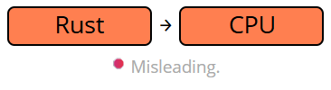

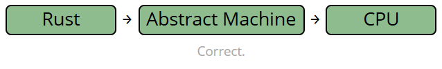

抽象层 (AM)
- 并非运行时, 并不会有任何运行时开销, 但它是一个 *计算模型的抽象*,
- 包含如内存分配(*栈*, ...)和运行语义等概念,
- *了解* 和 *看到* 你 CPU 并不关心的东西,
- 构建了程序员到机器之间的一道契约,
- 并且**综合上述内容进行优化**.

{}

{}

如果 Rust 直接发送给 CPU, 人们可能会错误地认为他们 *应该逃脱惩罚* , 然而 *更加正确* 的做法是:

| 无抽象层 | 有抽象层 |
|---------|-------------|
| `0xffff_ffff` 会产生一个有效的 `char`. 🛑 | 只是内存中的一段比特.  |
| `0xff` 和 `0xff` 是相同的指针. 🛑 | 指针可以来自不同的 *域*.  |
| 在 `0xff` 的任意读写都是可行的. 🛑 | 不能同时读写同一引用.  |
| 某些寄存器直接把 `0x0` 当做 null. 🛑 | 在引用中保存 `0x0` 简直是克苏鲁.  |

{}



## 语法糖 {#language-sugar}

如果有什么东西让你觉得, “不该能用的啊”, 那可能就是这里的原因. 

| 名称 | 说明 |
|--------| -----------|
| **强转** [NOM](https://doc.rust-lang.org/nomicon/coercions.html) | *隐式转换* 类型以匹配签名, 如 `&mut T` 转为 `&T`. 见 *类型转换*. [↓](#type-conversions)  |
| **解引用** [NOM](https://doc.rust-lang.org/nomicon/vec-deref.html) [🔗](https://stackoverflow.com/questions/28519997/what-are-rusts-exact-auto-dereferencing-rules) | 连续[解引用](https://doc.rust-lang.org/std/ops/trait.Deref.html) `x: T` 直到 `*x`, `**x`, &hellip; 满足目标类型 `S`. |
| **Prelude** [STD](https://doc.rust-lang.org/std/prelude/index.html) | 自动导入基本项目, 如 `Option`, `drop`, ...
| **重新借用** | 即便 `x: &mut T` 不能复制, 也可以移动一个新的 `&mut *x` 代替. |
| **生命周期省略** [BK](https://doc.rust-lang.org/book/ch10-03-lifetime-syntax.html#lifetime-elision) [NOM](https://doc.rust-lang.org/nomicon/lifetime-elision.html#lifetime-elision) [REF](https://doc.rust-lang.org/reference/lifetime-elision.html#lifetime-elision) | 自动将 `f(x: &T)` 标注为 `f<'a>(x: &'a T)`.|
| **方法重解析** [REF](https://doc.rust-lang.org/reference/expressions/method-call-expr.html) | 解引用或借用 `x` 直到 `x.f()` 可用. |
| **匹配引用简写** [RFC](https://rust-lang.github.io/rfcs/2005-match-ergonomics.html) | 重复应用解引用到各个[选择肢](https://doc.rust-lang.org/stable/reference/glossary.html#scrutinee)上并添加 `ref` 和 `ref mut` 到绑定. |
| **右值静态提升** [RFC](https://rust-lang.github.io/rfcs/1414-rvalue_static_promotion.html) | 使引用满足 `'static`, 如 `&42`, `&None`, `&mut []`. |

> **作者按** 💭 &mdash; 上述功能会让你活得轻松些, 但却会扰乱你的理解. 如果任意有类型相关的操作让你觉得 *有些反常*, 那可能就是这里的语法糖在作怪了.

## 内存和生命周期 {#memory-lifetimes}

移动, 引用和生命周期到底是咋回事.



{}


#### 应用程序内存

- 应用程序内存在底层就是一个字节数组.
- 操作系统经常将其划分为若干分区:
    - **栈区** (空间小, 低成本内存,<sup>1</sup> 多数 *变量* 都在这里),
    - **堆区** (空间大, 可扩展内存, 但总会由类似 `Box<T>` 的栈代理来指向),
    - **静态区** (多用于存储组成 `&str` 的字符串 `str`),
    - **代码区** (你的函数二进制代码的存储区域).
- 这里面最富挑战的莫过于**栈的增长**, 这是我们关注的**重点**.

<sup>1</sup> 对于固定大小的值, 栈的管理非常细致: *你需要的时候马上生成, 不需要的时候马上离开*. 然而这些 *短暂* 分配的指针却是导致生命周期存在的 *本质* 原因, 也是主导了本章后续所有内容.


#### 变量

```
let t = S(1);
```

- 分配内存空间, 名为 `t`, 类型为 `S`, 里面存储的值为 `S(1)`.
- 如果声明了 `let` 那空间将会分配在栈上. <sup>1</sup>
- 注意**语义歧义**,<sup>2</sup> 术语**变量**可能指的是:
    1. 源文件中定义的**名称** (“重命名某变量”),
    1. 已编译程序中的**位置**, `0x7` (“告诉我某变量的地址”),
    1. 里面包含的**值**, `S(1)` (“增加某变量”).
- 特别地, 对于编译器来说 `t` 指的是 `t` 的**位置** (这里是 `0x7`) 和 `t` 里面的 **值** (这里是 `S(1)`).

<sup>1</sup> 上述[↑](#data-structures)比较中仅针对于同步代码, 而 `async` 异步栈帧有可能被运行时放在堆上.


#### 移动语义

```
let a = t;
```

- 操作将**移动** `t` 里面的值到 `a` 的位置, 如果 `S` 是可 `Copy` 的则复制一份.
- `t` 的位置移动后将会**失效**且不能再被读取.
    - 技术上该位置的比特位并非完全置为 *空*, 但 *未定义*.
    - 如果你仍然通过 `unsafe` 访问 `t` 的话它仍有可能 *看起来* 像是个有效的 `S`, 
    但任何把它当成有效 `S` 的操作都是未定义行为 (UB). [↓](#unsafe-unsound-undefined)
- 这里没有提到 `Copy` 的影响, 虽然它会轻微影响上述规则:
    - 它们不会被析构.
    - '空'变量的位置永远不会离开作用域.


#### 类型安全

```
let c: S = M::new();
```

- **变量的类型**指出了许多重要的期望, 它:
    1. 规定了如何解释底层的比特位,
    1. 仅允许被友好定义的操作去操作这些比特位,
    1. 防止其他随机变量或比特写到这个位置.
- 这里赋值语句将会编译失败, 因为 `M::new()` 的字节无法被有效地转换为 `S` 类型.
- **类型之间的直接转换 *总会* 失败.** 但通常**允许某些例外** (强转或 `as` 转换等).

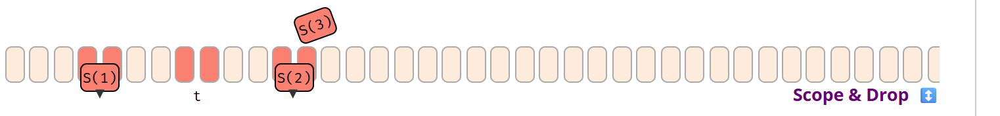

#### 域 & 析构

```
{
    let mut c = S(2);
    c = S(3);  // <- 赋值前将会对 `c` 进行析构.
    let t = S(1);
    let a = t;
}   // <- 这里退出了 `a`, `t`, `c` 的作用域, 将调用 `a`, `c` 的析构方法.
```

- 一旦一个未腾出空间的“变量名”离开其**作用域**, 其包含的值将被**析构**.
    - 首要规则: 当变量名离开其定义的 `{}` 块时执行,
    - 临时变量等尤为如此.
- 当新值赋值给已有变量位置时也会触发析构.
- 当调用了值对应位置的 **`Drop::drop()`** 时.
    - 上例中 `drop()` 在 `a` 上调用了一次, 在 `c` 上调用了两次, 但没有在 `t` 上调用过.
- 多数非 `Copy` 的值都在此时发生析构, 除非使用了 `mem::forget()`, `Rc` 之类或者 `abort()`.

{}

{}


#### 栈帧

```
fn f(x: S) { ... }

let a = S(1); // <- 在这里
f(a);
```

- 当**函数被调用**, 参数和返回值的内存将会保存在栈上.<sup>1</sup>
- 这里当调用 `f` 之前, `a` 中的值将会移动到“商量”好的栈位置, 当 `f` 执行时作为“局部变量” `x`.

<sup>1</sup> 实际的位置取决于调用时的转换, 可能根本不会分配在栈上, 但这不影响此处的心智模型.


#### 嵌套函数

```
fn f(x: S) {
    if once() { f(x) } // <- 递归前在这里
}

let a = S(1);
f(a);
```

- 函数的**递归调用**, 或由其他函数调用, 都将会扩展栈帧.
- 过多的嵌套调用 (比如无限递归) 会使得栈不断增长, 以至于溢出并导致程序终止.


#### 变量有效性

```
fn f(x: S) {
    if once() { f(x) }
    let m = M::new() // <- 递归后在这里
}

let a = S(1);
f(a);
```

- 之前保有确定类型的栈将由函数或内部函数重新定义此处的用途.
- 这里 `f` 的递归产生的第二个 `x`, 将会在后续的递归里由 `m` 重新利用.

> 关键点在于, 有很多种方法来保证之前保有一个确定类型有效值内存位置在此期间不被使用.
> 简单来说就是实现了指针.

{}

{}


#### 引用类型

```
let a = S(1);
let r: &S = &a;
```

- 类似 `&S` 或 `&mut S` 这样的**引用类型**持有某个 `s` 的**位置**.
- 这里类型 `&S` 绑定到了名称 `r`, 持有变量 `a` (`0x3`) 的 *位置*, 它的类型为 `S`, 通过 `&a` 获取.
- 如果你将变量 `c` 视为 *指定位置*, 引用 **`r` 就是 *位置的接入点***.
- 引用的类型与其他类型类似, 通常可以被推断出来, 所以可以省略不写:
    ```
    let r: &S = &a;
    let r = &a;
    ```
    <!-- - References on their own are **never** concerned with the *value within* the location they point to. -->


#### (可变) 引用

```
let mut a = S(1);
let r = &mut a;
let d = r.clone();  // 从 r 指向目标克隆或拷贝.
*r = S(2);          // 将 r 指向目标设置为新值 S.
```

- 引用可以**读取自**  (`&S`) 或**写入到** (`&mut S`) 它们指向的位置.
- *解引用* `*r` 表示既不使用 `r` 的 *位置* 也不使用其包含的 *值*, 而是使用**位置 `r` 指向的目标**.
- 上例中, 克隆 `d` 是由 `*r` 创建的, 并且 `S(2)` 写入到了 `*r`.
    - 方法 `Clone::clone(&T)` 期望传入其自身的引用, 这就是我们使用 `r` 而非 `*r` 的原因.
    - 赋值语句 `*r = ...` 中的旧值也会被析构 (图中未说明).

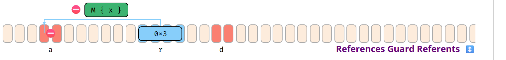

#### 引用对象保护

```
let mut a = ...;
let r = &mut a;
let d = *r;       // 无法移出值, 否则 `a` 将为空.
*r = M::new();    // 无法存储非 S 类型值, 毫无意义.
```

- 当绑定保证总是 *持有* 有效值时, 引用也总是保证一定 *指向* 有效数据.
- 特别是 `&mut T` 必须和变量一样提供保证, 要知道它们并不能让指向的目标消失:
    - **不允许写无效**数据.
    - **不允许移出**数据 (否则会留下一个不知道所有者的空目标).


#### 裸指针

```
let p: *const S = questionable_origin();
```

- 与引用不同, 指针不提供任何保证.
- 指针有可能指向无效数据或者不存在的数据.
- 解引用指针是 `unsafe` 的, 将无效的 `*p` 作为有效值来操作是未定义行为 (UB). [↓](#unsafe-unsound-undefined)

{}

{}


#### 事物的“生命周期”

- 程序中的每个实体都有其相关的临时或者长期的空间, 即 *生存*.
- 宽松地说, *生存时间* 可以是<sup>1</sup>
    1. **项目可用**的**代码行** (LOC). (如模块名).
    1. 从 *位置* 的**初始化**到位置被**丢弃**之间的**代码行**.
    1. 从位置第一次**确定性使用**到**停止使用**之间的**代码行**.
    1. 从创建 *值* 到该值被析构之间的**代码行 (或实际时间)**.
- 本节剩余部分会将上面的项目分别称为:
    1. 项目**作用域**, 不重要.
    1. 变量或位置的**作用域**.
    1. 用法的**生命周期**<sup>2</sup>.
    1. 值的**生命周期**, 当和文件描述符打交道时非常有用, 但这里也不重要.
- 同样地, 代码中的生命周期参数 `r: &'a S`
    - 任意**位置 r *指向*** 的代码行导致的未确定态都要求可访问或被锁定;
    - 与 `r` 本身作为代码行的“存在时间”并无关联 (它只要存在得更短就行了).
- `&'static S` 意味着地址必须 *在所有代码行中有效*.

> <sup>1</sup> 文档中的 *作用域* 和 *生命周期* 有时存在歧义.
> 这里尝试作一定的区分, 但如果有更好的意见也欢迎提出.
>
> <sup>2</sup> *生存行* 可能是个更好的说法...


#### r: &'c S 的含义

- 假设你从哪里看到 `r: &'c S`, 它表示:
    - `r` 持有某个 `S` 的地址,
    - `r` 指向的任意地址会至少存在在 `'c` 期间,
    - 变量 `r` 本身不能活得比 `'c` 长.

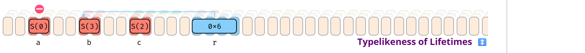

#### 生命周期与类型的相似性

```
{
    let b = S(3);
    {
        let c = S(2);
        let r: &'c S = &c;      // 不能如愿运行
        {                       // 因为函数体中的局部变量无法命名生命周期
            let a = S(0);       // 函数中的规则也类似

            r = &a;             // `a` 的位置在很多行都不存在 -> 不行.
            r = &b;             // `b` 的位置活在比 `c` 更大的范围 -> 可以.
        }
    }
}
```

- 假设你在哪里看到了 `mut r: &mut 'c S`.
    - 它表示一个可以持有一个可变引用的可变地址.
- 如上述, 引用必须保证目标内存有效.
- **`'c` 部分**和类型一样**限制了赋值到 `r` 的操作**.
- 将 `&b` (`0x6`) 赋值到 `r` 是有效的, 但 `&a` (`0x3`) 无效, 就因为 `&b` 生存时间大于等于 `&c`.


#### 借用态

```
let mut b = S(0);
let r = &mut b;

b = S(4);   // 无效. 因为 `b` 处于借用态.

print_byte(r);
```

- 一旦变量地址被 `&b` 或 `&mut b` 捕获, 变量就会被标记为**已借用**.
- 借用时, 就不能再通过原始绑定 `b` 修改地址的内容.
- 一旦捕获了地址的 `&b` 或 `&mut b` 在上下文中不再使用, 原始绑定 `b` 将会恢复可用.

{}

{}


#### 函数参数

```
fn f(x: &S, y:&S) -> &u8 { ... }

let b = S(1);
let c = S(2);

let r = f(&b, &c);
```

- 调用函数时会捕获返回的引用, 这里将会发生两件趣事:
    - 用到的局部变量将会置为借用态,
    - 但编译期间并不知道返回值的地址.


#### “借用态”传播的问题

```
let b = S(1);
let c = S(2);

let r = f(&b, &c);

let a = b;   // 这样做可行吗?
let a = c;   // 谁才是真正被借用的?

print_byte(r);
```

- 因为 `f` 只能返回一个地址, 所以并不是所有情况下 `b` 和 `c` 都需要保持锁定态.
- 多数情况下我们是有更好的办法解决这个问题的.
    - 特别是当我们知道一个参数 *不能* 再被用于返回值的时候.

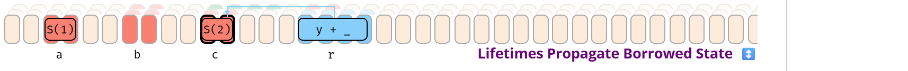

#### 借用态传播生命周期

```
fn f<'b, 'c>(x: &'b S, y: &'c S) -> &'c u8 { ... }

let b = S(1);
let c = S(2);

let r = f(&b, &c); // 我们知道返回的引用是基于 `c` 的, 它必须保持锁定;
                   // 然而 `b` 却是可以自由移动的.

let a = b;

print_byte(r);
```

- 解决这个问题的办法就是签名中的生命周期参数 (比如上面的 `'c`).
- 它们的主要作用是:
    - **函数外**会用于描述生成的结果基于哪个输入地址和输出地址,
    - **函数内**来保证只有生存时间低于 `'c` 的地址允许被赋值.
- 实际的生命周期 `'b`, `'c` 会基于开发者给出的借用态变量被编译器透明地指派给**调用方**.
- 它并**不等同于** `b` 或 `c` 的 *作用域* (可能是从初始化到结束之间的代码行), 但仅有一个最小子集可以作为该作用域的 *生命周期*, 即基于 `b` 和 `c` 需要借用于该调用和保存结果的最少代码行.
- 某些如 `f` 被 `'c: 'b` 替代, 仍不能区分出来的情况下, 两个都会保持锁定.

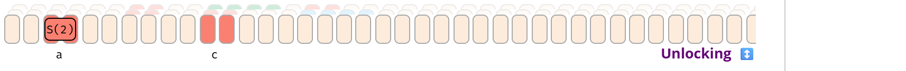

#### { let r = ... }

```
let mut c = S(2);

let r = f(&c);
let s = r;
                    // <- 不是这里, `s` 会延长 `c` 的锁定时间.

print_byte(s);

let a = c;          // <- 是这里, 不再使用 `r` 和 `s`.

```
- 一旦任意引用最后指向了结束, 变量位置将会再次 *解锁*.

{}



<footnotes>

↕️ 点击展开用例

</footnotes>

</magic>

---

# 数据类型

通用数据类型的内存表示. 

## 基本类型 {#basic-types}

语言核心内建的必要类型. 

#### 数字类型 [REF](https://doc.rust-lang.org/reference/types/numeric.html)

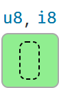

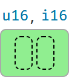

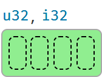


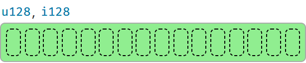

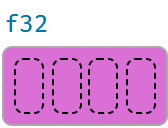


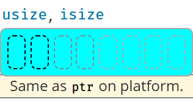

<br/>



{}

| 类型 | 最大值 |
|---|---|
|`u8`| `255` |
|`u16` | `65_535` |
|`u32`| `4_294_967_295` |
|`u64`| `18_446_744_073_709_551_615` |
|`u128`| `340_282_366_920_938_463_463_374_607_431_768_211_455` |
|`usize`| 取决于平台指针大小, 可以是 `u16`, `u32`, 或 `u64`. |

{}

{}

| 类型 | 最大值 |
|---|---|
|`i8`| `127` |
|`i16` | `32_767` |
|`i32`| `2_147_483_647` |
|`i64`| `9_223_372_036_854_775_807` |
|`i128`| `170_141_183_460_469_231_731_687_303_715_884_105_727` |
|`isize`| 取决于平台指针大小, 可以是 `i16`, `i32`, 或 `i64`. |

| 类型 | 最小值 |
|---|---|
|`i8`| `-128` |
|`i16` | `-32_768` |
|`i32`| `-2_147_483_648` |
|`i64`| `-9_223_372_036_854_775_808` |
|`i128`| `-170_141_183_460_469_231_731_687_303_715_884_105_728` |
|`isize`| 取决于平台指针大小, 可以是 `i16`, `i32`, 或 `i64`. |

{}

{}

`f32` 的位表示<sup>*</sup>: 

说明: 

| f32 | S (1) | E (8) | F (23) | 值 |
|------| ---------| ---------| ---------| ---------|
| 规格化数 | ± | 1 to 254 | 任意 | ±(1.F)<sub>2</sub> * 2<sup>E-127</sup>  |
| 非规格化数 | ± | 0 | 非零 | ±(0.F)<sub>2</sub> * 2<sup>-126</sup>  |
| 零 | ± | 0 | 0 | ±0  |
| 无穷大 | ± | 255 | 0 | ±∞  |
| NaN | ± | 255 | 非零 | NaN  |

同样, 对于 <code>f64</code> 类型, 这将类似于: 

| f64 | S (1) | E (11) | F (52) | 值 |
|------| ---------| ---------| ---------| ---------|
| 规格化数 | ± | 1 to 2046 | 任意 | ±(1.F)<sub>2</sub> * 2<sup>E-1023</sup>  |
| 非规格化数 | ± | 0 | 非零 | ±(0.F)<sub>2</sub> * 2<sup>-1022</sup>  |
| 零 | ± | 0 | 0 | ±0  |
| 无穷大 | ± | 2047 | 0 | ±∞  |
| NaN | ± | 2047 | 非零 | NaN  |

<footnotes>
    <sup>*</sup> 浮点类型遵循 <a href="https://en.wikipedia.org/wiki/IEEE_754-2008_revision">IEEE 754-2008</a> 规范, 并取决于平台大小端序. 
</footnotes>

{}

{}

| 转换<sup>1</sup> | 结果 | 说明 |
| --- | --- | --- |
| `3.9_f32 as u8` | `3` | 截断, 请优先使用 `x.round()`. |
| `314_f32 as u8` | `255` | 采用最接近的可用数字.  |
| `f32::INFINITY as u8` | `255` | 同上, 但会把 `INFINITY` 当做一个 *真正的* 大数.|
| `f32::NAN as u8` | `0` | - |
| `_314 as u8` | `58` | 截断多余的位.  |
| `_200 as i8` | `56` | - |
| `_257 as i8` | `-1` | - |

{}

{}

| 操作<sup>1</sup> | 结果 | 说明 |
| --- | --- | --- |
| `200_u8 / 0_u8` | 编译错误. | - |
| `200_u8 / _0` <sup>d</sup> | Panic. | 由于除以 0, 该计算会 panic. |
| `200_u8 / _0` <sup>r</sup> | Panic. | 同上. |
| `200_u8 + 200_u8` |  编译错误. | - |
| `200_u8 + _200` <sup>d</sup> | Panic. | 考虑换用 `checked_`, `wrapping_` 等方法 [STD](https://doc.rust-lang.org/std/primitive.isize.html#method.checked_add)|
| `200_u8 + _200` <sup>r</sup> | `144` | 在 release 模式下会溢出. |
| `1_u8 / 2_u8` | `0` | 整数除法会截断. |
| `0.8_f32 + 0.1_f32` | `0.90000004` | - |
| `1.0_f32 / 0.0_f32` | `f32::INFINITY` | - |
| `0.0_f32 / 0.0_f32` | `f32::NAN` | - |
| `x < f32::NAN` | `false` | `NAN` 的比较结果永远为假. |
| `x > f32::NAN` | `false` | - |
| `f32::NAN == f32::NAN` | `false` | - |

{}



<footnotes>

<sup>1</sup>表达式 `_100` 表示可能包含 `100` 值的任何内容, 例如 `100_i32`, 但对编译器是不透明的. <br/>
<sup>d</sup> 调试版本. <br/>
<sup>r</sup> 发布版本. <br/>

</footnotes>

#### 文本类型 [REF](https://doc.rust-lang.org/reference/types/textual.html)

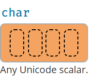

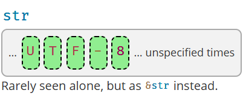



{}

| 类型 | 描述 |
|---------|-------------|
| `char` | 总是为 4 字节, 且仅包含一个 Unicode **标量值**[🔗](https://www.unicode.org/glossary/#unicode_scalar_value).  |
| `str` | 未知长度的 `u8` 数组保证保存 **UTF-8 编码的码位**.  |

{}

{}

| 字符 | 描述 |
|---------|-------------|
| `let c = 'a';` | 通常一个 `char` (Unicode 标量) 就是你直觉上认为的 *字符*. |
| `let c = '❤';` | 它可以持有很多 Unicode 符号. |
| `let c = '❤️';` | 但并不总是如此. 比如一个 emoji 是由**两个** `char` (参见编码) 组成的, **并不能**🛑存在 `c` 里.<sup>1</sup> |
| `c = 0xffff_ffff;` | 字符也**不允许**🛑用一个随便的比特模式就表示了. |

<footnotes>
    <sup>1</sup> 有趣的是, <a href="https://zh.wikipedia.org/wiki/%E9%9B%B6%E5%AE%BD%E8%BF%9E%E5%AD%97">零宽连字</a> (⨝) 会让用户把这些连起来<i>看起来像个字符</i>: 👨‍👩‍👧 实际上是由 👨⨝👩⨝👧 这 5 个字符组成的, 渲染引擎也可以把它们显示成一个字符, 也可以分开显示成三个, 这取决于平台的能力.
</footnotes>

| 字符串 | 描述 |
|---------|-------------|
| `let s = "a";` | 通常并不会直接使用 `str`, 而是像这里的 `s` 一样通过 `&str` 访问. |
| `let s = "❤❤️";` | 可以存储任意长度的文本, 但很难进行索引. |

{}

{}

`let s = "I ❤ Rust"; ` <br>
`let t = "I ❤️ Rust";`

| 变体 | 内存表示<sup>2<sup> |
|---------|-------------|
| `s.as_bytes()` | `49` `20` <b>`e2 9d a4`</b>  `20 52 75 73 74` <sup>3<sup> |
| `s.chars()`<sup>1<sup> | `49 00 00 00 20 00 00 00` <b>`64 27 00 00` </b> `20 00 00 00 52 00 00 00 75 00 00 00 73 00` &hellip; |
| `t.as_bytes()` | `49` `20` <b>`e2 9d a4`</b>  <b>`ef b8 8f`</b> `20 52 75 73 74` <sup>4<sup> |
| `t.chars()`<sup>1<sup> | `49 00 00 00 20 00 00 00` <b>`64 27 00 00`</b> <b>`0f fe 01 00`</b> `20 00 00 00 52 00 00 00 75 00` &hellip; |

<footnotes>
    <sup>1</sup> 结果会转为字节数组.<br>
    <sup>2</sup> 在 x86 平台上的十六进制表示.<br>
    <sup>3</sup> 注意 <code>❤</code> 对应一个 <a href="https://codepoints.net/U+2764">Unicode 代码点 (U+2764)</a>, 它在 <code>char</code> 中被表示为 <b>64 27 00 00</b>, 但在 <code>str</code> 中则被表示为 <a href="https://zh.wikipedia.org/wiki/UTF-8#%E7%BB%93%E6%9E%84">UTF-8 编码</a> <b>e2 9d a4</b>.<br>
    <sup>4</sup> 注意 emoji <a href="https://emojipedia.org/red-heart/">红心 <code>❤️</code></a> 其实是由心形 <code>❤</code> 和 <a href="https://codepoints.net/U+FE0F">U+FE0F Variation Selector</a> 组成的, 可以看到 <code>t</code> 比 <code>s</code> 拥有更多字符.
</footnotes>

<footnotes>

> <sup>💬</sup> 尽管上面的 `s` 和 `t` 是不一样的, 但 Safari 和 Edge 都有把脚注 3 和 4 的心形符号渲染错误的 Bug.

</footnotes>

{}



## 自定义类型 {#custom-types}

用户定义的基本类型. 它实际的<b>内存布局</b>[REF](https://doc.rust-lang.org/reference/type-layout.html)取决于<b>表示法</b>[REF](https://doc.rust-lang.org/reference/type-layout.html#representations), 还有对齐. 

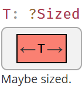

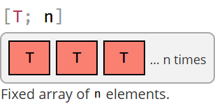

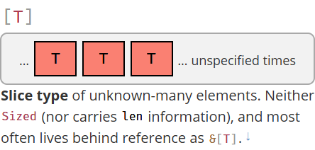

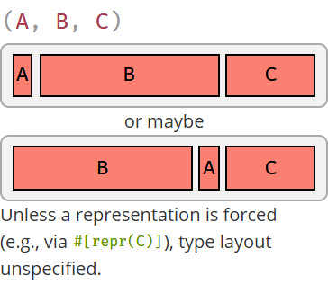

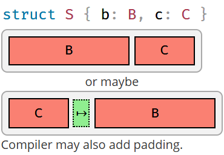

<footnotes>

还需注意, 具有完全相同字段的两种类型 `A(X, Y)` 和 `B(X, Y)` 仍然可以具有不同的布局. 在没有使用 `#[repr()]` 限制其布局表示的情况下, 绝不能使用 `transmute()` 进行类型转换. 

</footnotes>

这些**合并类型**存有其一种子类型的值: 

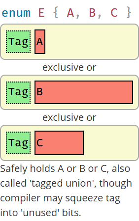

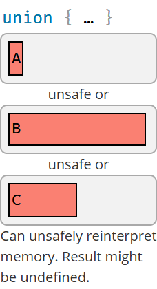

## 引用 & 指针 {#references-pointers-ui}

引用授权了对其他内存空间的安全访问. 裸指针则是不安全 `unsafe` 的访问. 
各自的 `mut` 类型是相同的. 

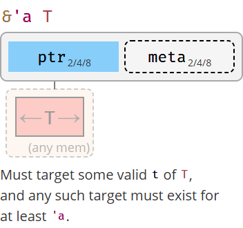

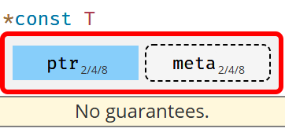

<br/>

### 元指针 {#pointer-meta}

许多引用和指针类型可以携带一个额外的字段, 即**元数据指针**[STD](https://doc.rust-lang.org/nightly/std/ptr/trait.Pointee.html#pointer-metadata). 
它可以是目标的元素长度或字节长度, 也可以是指向 <i>vtable</i> 的指针. 带有元数据的指针称为**胖指针**, 否则称为**瘦指针**. 

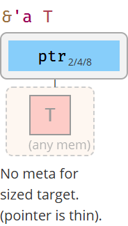

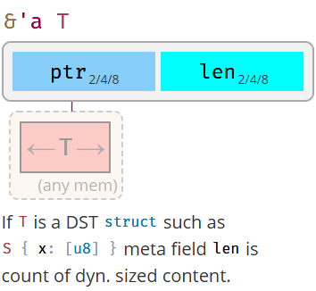

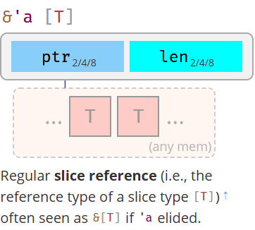

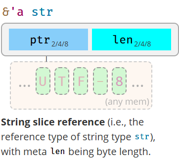

<br>

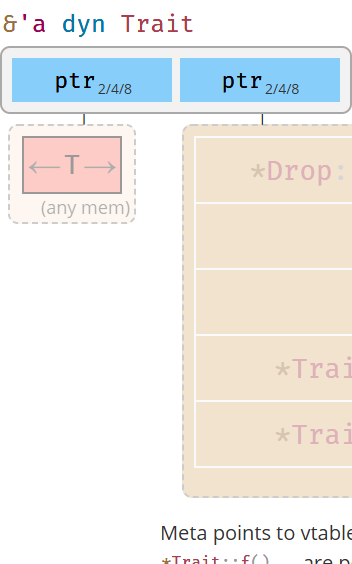

## 闭包 {#closures-data}

闭包是一个临时函数, 定义闭包时, 它会自动管理数据**捕获**[REF](https://doc.rust-lang.org/reference/types/closure.html#capture-modes)环境中访问的内容. 例如: 

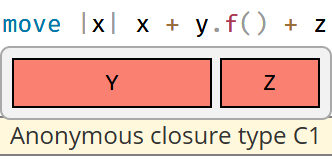

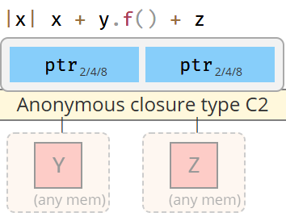

<footnotes>

生成匿名函数 <code>fn</code> 如 <code>f<sub>c1</sub>(C1, X)</code> or <code>f<sub>c2</sub>(&C2, X)</code>. 具体细节取决于捕获类型的属性支持 <code>FnOnce</code>, <code>FnMut</code> 还是 <code>Fn</code> .等.

</footnotes>

## 标准库类型 {#standard-library-types}

Rust 标准库为上面提到的基本类型扩展了更多有用的类型, 并定义了一些特殊的语义. 一些通用类型如下: 

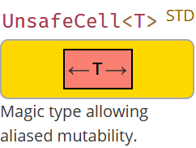

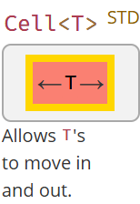

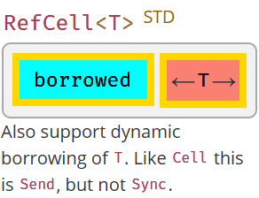

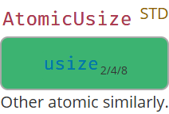

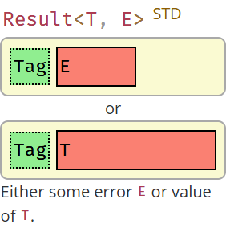

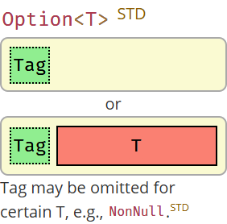

#### 通用堆存储器

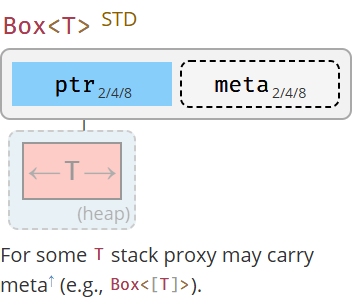

<spacer>
</spacer>

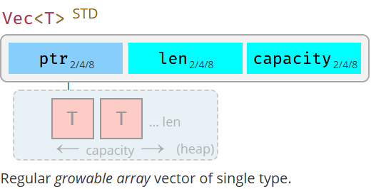

#### 所有字符串

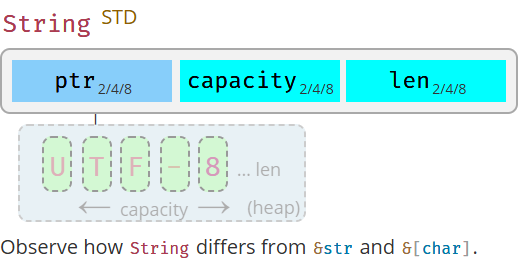

<spacer>
</spacer>

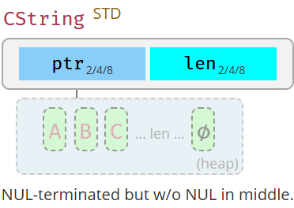

<spacer>
</spacer>

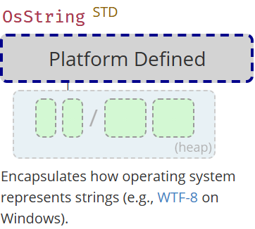

<spacer>
</spacer>

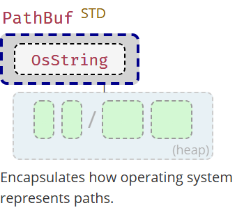

#### 共享所有权

如果类型 `T` 不包含 `Cell`, 那它也会包含以下 `Cell` 类型的变体以允许共享实际可变性.

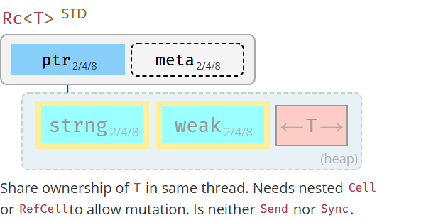

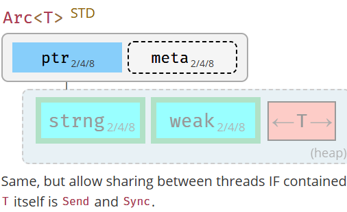

<br>

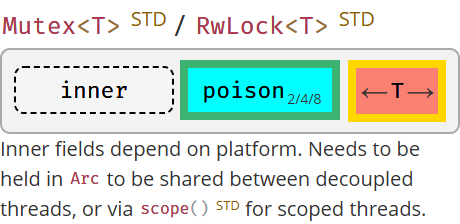

---

# 标准库

## 基本准则 {#one-liners}

这些代码片段很通用但经常容易忘. 详情可以参考 **Rust Cookbook** [🔗](https://rust-lang-nursery.github.io/rust-cookbook/).



{}

| 用途 | 代码 |
|---------|-------------|
| 连接字符串 (任何实现了 `Display`[↓](#string-output) 的类型). <sup>1</sup>  `'21` | `format!("{x}{y}")` |
| 以给定匹配分割字符串. [STD](https://doc.rust-lang.org/std/str/pattern/trait.Pattern.html) [🔗](https://stackoverflow.com/a/38138985) | `s.split(pattern)` |
|  ... 以 `&str` | `s.split("abc")` |
|  ... 以 `char` | `s.split('/')` |
|  ... 以闭包 | `s.split(char::is_numeric)`|
| 以空白分割. | `s.split_whitespace()` |
| 以换行分割. | `s.lines()` |
| 以正则表达式分割.<sup>2</sup> | ` Regex::new(r"\s")?.split("one two three")` |

<footnotes>

<sup>1</sup> 会产生内存分配. 如果 `x` 已经是 `String` 的情况下可能不是性能的最优解.<br>
<sup>2</sup> 依赖 [regex](https://crates.io/crates/regex) crate.

</footnotes>

{}

{}

| 用途 | 代码 |
|---------|-------------|
| 创建新文件 | `File::create(PATH)?` |
|   同上, 但给出选项 | `OpenOptions::new().create(true).write(true).truncate(true).open(PATH)?` |

{}

{}

| 用途 | 代码 |
|---------|-------------|
| 具有变量参数的宏 | `macro_rules! var_args { ($($args:expr),*) =>  }` |
|  应用 `args`, 如多次调用 `f`. |  ` $( f($args); )*` |

{}

{}

| 用途 | 代码 |
|---------|-------------|
| 清理闭包捕获 | <code>wants_closure({ let c = outer.clone(); move &vert;&vert; use_clone(c) })</code> |
| 修复 '`try`' 闭包内的类型推断 | <code>iter.try_for_each(&vert;x&vert; { Ok::<(), Error>(()) })?;</code> |
| 当 `T` 满足 Copy 时, 迭代 *并* 修改 `&mut [T]` | `Cell::from_mut(mut_slice).as_slice_of_cells()` |
| 给定长度的切片 | `&original_slice[offset..][..length]` |
| 确保 trait `T` 是对象安全的写法 | `const _: Option<&dyn T> = None;` |

{}



## 线程安全 {#thread-safety}

假设你在线程 1 持有一些变量，想把它们**移动**到线程 2，或把它们的**引用**传给线程 3。
这分别由 **`Send`**[STD](https://doc.rust-lang.org/std/marker/trait.Send.html) 与 **`Sync`**[STD](https://doc.rust-lang.org/std/marker/trait.Sync.html) 决定：

<table class="sendsync">
    <thead>
        <tr><th>例</th><th><code>Send</code><sup>*</sup></th><th><code>!Send</code></th></tr>
    </thead>
    <tbody>
        <tr><td><code>Sync</code><sup>*</sup></td><td><i>多数类型</i> ... <code>Mutex&lt;T&gt;</code>, <code>Arc&lt;T&gt;</code><sup>1,2</sup></td><td><code>MutexGuard&lt;T&gt;</code><sup>1</sup>, <code>RwLockReadGuard&lt;T&gt;</code><sup>1</sup></td></tr>
        <tr><td><code>!Sync</code></td><td><code>Cell&lt;T&gt;</code><sup>2</sup>, <code>RefCell&lt;T&gt;</code><sup>2</sup></td><td><code>Rc&lt;T&gt;</code>, <code>&dyn Trait</code>, <code>*const T</code><sup>3</sup>, <code>*mut T</code><sup>3</sup></td></tr>
    </tbody>
</table>

<footnotes>

<sup>*</sup> **`T: Send`** 表示实例 `t` 可以移动到另一个线程; **`T: Sync`** 表示 `&t` 可以移动到另一个线程.<br>
<sup>1</sup> 如果 `T` 为 `Sync`. <br>
<sup>2</sup> 如果 `T` 为 `Send`.<br>
<sup>3</sup> 如果你要发送一个裸指针, 建议创建新类型 `struct Ptr(*const u8)` 并 `unsafe impl Send for Ptr {}`. 用来保证你 *可能* 会发送它 (到其他线程).

</footnotes>

## 原子与缓存 {#atomics-cache}

CPU 缓存、内存写入，以及原子操作如何影响它们。🝖

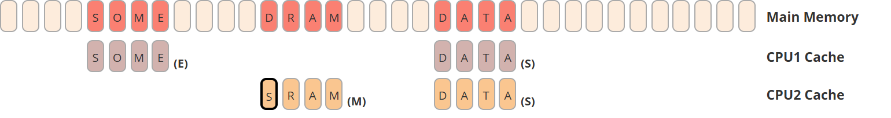

<footnotes>

现代 CPU 并不直接访问内存，只访问自己的缓存。每个 CPU 有自己的缓存，比 RAM 快约 100 倍，但小得多。缓存以**缓存行**为单位，[🔗](https://stackoverflow.com/questions/3928995/how-do-cache-lines-work) 即一段被“切开”的字节窗口，并跟踪它相对主存是独占 (E)、共享 (S) 还是已修改 (M)。[🔗](https://en.wikipedia.org/wiki/MESI_protocol) 各缓存彼此通信以保证**一致性 (coherence)**，[🔗](https://gfxcourses.stanford.edu/cs149/fall20content/media/cachecoherence/10_coherence.pdf) 即“足够小”的数据会被所有其他 CPU “立刻”看见，但可能让 CPU 停顿。

</footnotes>

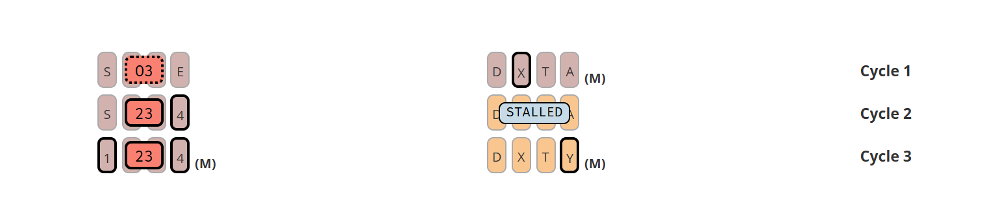

<footnotes>

左：编译器**与** CPU 都可以**重排**[🔗](https://en.wikipedia.org/wiki/Memory_ordering)并拆分对内存的读/写。即便你显式写了 `write(1); write(23); write(4)`，编译器也可能认为先写 `23` 更好；此外 CPU 还可能坚持拆分写入，先写 `3` 再写 `2`。其中每一步都可能被 CPU2 通过 `unsafe` *数据竞争* 观察到（甚至是“不可能”的 `O3`）。重排对锁来说也是致命的。

右：半相关地，即便两个 CPU 并不试图访问彼此的数据（例如更新两个独立变量），若底层内存被映射到同一缓存行（**伪共享**），仍可能出现显著性能损失。[🔗](https://docs.kernel.org/kernel-hacking/false-sharing.html)

</footnotes>

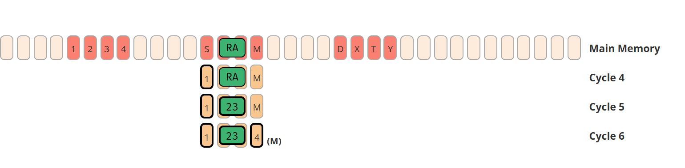

<footnotes>

原子操作通过两件事解决上述问题：

- 通过暂时锁定其他 CPU 上的缓存行，确保一次读/写/更新不会被部分观察到；
- 强制编译器与 CPU 不要围绕它重排“无关”的访问（即充当**栅栏 / fence**）[STD](https://doc.rust-lang.org/std/sync/atomic/fn.fence.html)。确保多个 CPU 就这些其他操作的相对顺序达成一致，称为**一致性 (consistency)**。[🔗](https://gfxcourses.stanford.edu/cs149/winter19content/lectures/09_consistency/09_consistency_slides.pdf) 这也会以错过性能优化为代价。

</footnotes>

> **说明** &mdash; 以上内容大幅简化。虽然一致性与连贯性问题普遍存在，但各 CPU 架构在缓存与原子的实现及性能影响上差异很大。

| 原子排序 | 说明 |
| --- | --- |
| **`Relaxed`** [STD](https://doc.rust-lang.org/std/sync/atomic/enum.Ordering.html#variant.Relaxed) | 可充分重排。无关的读/写可自由绕过该原子操作。 |
| **`Release`** [STD](https://doc.rust-lang.org/std/sync/atomic/enum.Ordering.html#variant.Release)<sup>, 1</sup> | 写入时：确保第三方 `Acquire` 加载的其他数据在这次写入之后才被看见。 |
| **`Acquire`** [STD](https://doc.rust-lang.org/std/sync/atomic/enum.Ordering.html#variant.Acquire)<sup>, 1</sup> | 读取时：确保第三方 `Release` 之前写入的其他数据在这次读取之后才被看见。 |
| **`SeqCst`** [STD](https://doc.rust-lang.org/std/sync/atomic/enum.Ordering.html#variant.SeqCst) | 原子操作周围不可重排。所有无关读写都留在正确的一侧。 |

<footnotes>

<sup>1</sup> 说清楚：用 2+ 个 CPU 同步访存时，*各方* 都必须使用 `Acquire` 或 `Release`（或更强）。写者必须把希望 *释放* 到内存的其他数据放在原子信号之前；希望 *获取* 这些数据的读者必须确保其其他读取只在原子信号之后进行。

</footnotes>


## 迭代器 {#iterators}



{}

**基础**

假设有一个元素类型都为 `C` 的集合 `c`:

* **`c.into_iter()`** &mdash; 将集合 `c` 转为一个**`Iterator`** [STD](https://doc.rust-lang.org/std/iter/trait.Iterator.html) `i` 并**消费掉**<sup>*</sup> `c`. 要求实现 `C` 的 **`IntoIterator`** [STD](https://doc.rust-lang.org/std/iter/trait.IntoIterator.html), 其元素类型取决于 `C`. 这是获取迭代器的“标准方式”.
* **`c.iter()`** &mdash; 对**某些**集合更友好的方法, 返回一个**借用**迭代器而不消费掉 `c`.
* **`c.iter_mut()`** &mdash; 同上, 但返回一个允许修改集合元素的**可变借用**迭代器.

**迭代**

一旦你获得了一个 `i`:

* **`i.next()`** &mdash; 如果下一个元素 `c` 存在则返回 `Some(x)`, 否则返回 `None` 表示结束.

**循环**

* **`for x in c {}`** &mdash; 语法糖, 相当于调用 `c.into_iter()` 并且循环 `i` 直到它变为 `None`.

<footnotes>

<sup>*</sup> 当类型是 `Copy` 的时, 迭代器会看起来并没有消费掉 `c`。比如, 调用 `(&c).into_iter()` 会在 `&c` 上调用 `.into_iter()` (会消费掉该引用并返回一个迭代器), 但本质上并没有去访问 `c`.

</footnotes>

{}

{}

**基础**

假设有一集合 `struct Collection<T> {}`.

* **`struct IntoIter<T> {}`** &mdash; 创建一个持有自定义迭代状态 (比如下标) 的结构体.
* **`impl Iterator for IntoIter {}`** &mdash; 实现能够产生元素的 `Iterator::next()`.

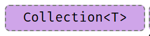


---

**共享和可变迭代器**

* **`struct Iter<T> {}`** &mdash; 创建一个持有 `&Collection<T>` 的结构体用于共享迭代.
* **`struct IterMut<T> {}`** &mdash; 类似地, 但持有 `&mut Collection<T>` 用于可变迭代.
* **`impl Iterator for Iter<T> {}`** &mdash; 实现共享迭代.
* **`impl Iterator for IterMut<T> {}`** &mdash; 实现可变迭代.

另外, 建议实现如下方法以获取对应迭代器:

- `Collection::iter(&self) -> Iter`,
- `Collection::iter_mut(&mut self) -> IterMut`.


---

**实现循环**
* **`impl IntoIterator for Collection {}`** &mdash; 使得 `for x in c {}` 可用.
* **`impl IntoIterator for &Collection {}`** &mdash; 使得 `for x in &c {}` 可用.
* **`impl IntoIterator for &mut Collection {}`** &mdash; 使得 `for x in &mut c {}` 可用.


{}



## 数字转换 {#number-conversions}

目前<b style="">正确</b>的数字转换.

| ↓ 原始 / 目标 → | `u8` &hellip; `i128` |  `f32` / `f64` | String |
| --- | --- |  --- |--- |
| `u8` &hellip; `i128` | `u8::try_from(x)?` <sup>1</sup> |  `x as f32` <sup>3</sup> | `x.to_string()` |
| `f32` / `f64` | `x as u8` <sup>2</sup> |  `x as f32` | `x.to_string()` |
| `String` | `x.parse::<u8>()?` | `x.parse::<f32>()?` | `x` |

<footnotes>

<sup>1</sup> 如果是其类型的真子集, `from()` 将会直接转换, 比如 `u32::from(my_u8)`. <br/>
<sup>2</sup> 见下, 这些转换将会截断 (`11.9_f32 as u8` 得到 `11`) 或缩容 (`1024_f32 as u8` 得到 `255`). <br/>
<sup>3</sup> 转换后会重新用二进制位表示 (`u64::MAX as f32`) 或产生无穷大 `Inf` (`u128::MAX as f32`).

</footnotes>

## 字符串转换 {#string-conversions}

下面列出要转换到**目标**字符串类型的方法:



{}

| **原始**类型 `x`| 转换方法 |
| --- | --- |
|`String`|`x`|
|`CString`|`x.into_string()?` |
|`OsString`|`x.to_str()?.to_string()`|
|`PathBuf`|`x.to_str()?.to_string()`|
|`Vec<u8>` <sup>1</sup> |`String::from_utf8(x)?`|
|`&str`|`x.to_string()` <sup>`i`</sup> |
|`&CStr`|`x.to_str()?.to_string()` |
|`&OsStr`|`x.to_str()?.to_string()`|
|`&Path`|`x.to_str()?.to_string()`|
|`&[u8]` <sup>1</sup> |`String::from_utf8_lossy(x).to_string()`|

{}

{}

| **原始**类型 `x`| 转换方法 |
| --- | --- |
|`String`|`CString::new(x)?`|
|`CString`|`x`|
|`OsString` <sup>2</sup>|`CString::new(x.to_str()?)?`|
|`PathBuf`|`CString::new(x.to_str()?)?`|
|`Vec<u8>` <sup>1</sup> |`CString::new(x)?`|
|`&str`|`CString::new(x)?`|
|`&CStr`|`x.to_owned()` <sup>`i`</sup> |
|`&OsStr` <sup>2</sup> |`CString::new(x.to_os_string().into_string()?)?`|
|`&Path`|`CString::new(x.to_str()?)?`|
|`&[u8]` <sup>1</sup> |`CString::new(Vec::from(x))?`|
|`*mut c_char` <sup>3</sup> |`unsafe { CString::from_raw(x) }`|

{}

{}

| **原始**类型 `x`| 转换方法 |
| --- | --- |
|`String`|`OsString::from(x)` <sup>`i`</sup> |
|`CString`|`OsString::from(x.to_str()?)`|
|`OsString`|`x`|
|`PathBuf`|`x.into_os_string()`|
|`Vec<u8>` <sup>1</sup> | ? |
|`&str`|`OsString::from(x)` <sup>`i`</sup>|
|`&CStr`|`OsString::from(x.to_str()?)`|
|`&OsStr`|`OsString::from(x)` <sup>`i`</sup>|
|`&Path`|`x.as_os_str().to_owned()`|
|`&[u8]` <sup>1</sup> | ? |

{}

{}

| **原始**类型 `x`| 转换方法 |
| --- | --- |
|`String`|`PathBuf::from(x)` <sup>`i`</sup>|
|`CString`|`PathBuf::from(x.to_str()?)`|
|`OsString`|`PathBuf::from(x)` <sup>`i`</sup>|
|`PathBuf`|`x`|
|`Vec<u8>` <sup>1</sup> | ? |
|`&str`|`PathBuf::from(x)` <sup>`i`</sup>|
|`&CStr`|`PathBuf::from(x.to_str()?)`|
|`&OsStr`|`PathBuf::from(x)` <sup>`i`</sup>|
|`&Path`|`PathBuf::from(x)` <sup>`i`</sup>|
|`&[u8]` <sup>1</sup> | ? |

{}

{}

| **原始**类型 `x`| 转换方法 |
| --- | --- |
|`String`|`x.into_bytes()`|
|`CString`|`x.into_bytes()`|
|`OsString`| ? |
|`PathBuf`| ? |
|`Vec<u8>` <sup>1</sup> |`x`|
|`&str`|`Vec::from(x.as_bytes())`|
|`&CStr`|`Vec::from(x.to_bytes_with_nul())`|
|`&OsStr`| ? |
|`&Path`| ? |
|`&[u8]` <sup>1</sup> |`x.to_vec()`|

{}

{}

| **原始**类型 `x`| 转换方法 |
| --- | --- |
|`String`|`x.as_str()`|
|`CString`|`x.to_str()?`|
|`OsString`|`x.to_str()?`|
|`PathBuf`|`x.to_str()?`|
|`Vec<u8>` <sup>1</sup> |`std::str::from_utf8(&x)?`|
|`&str`|`x`|
|`&CStr`|`x.to_str()?`|
|`&OsStr`|`x.to_str()?`|
|`&Path`|`x.to_str()?`|
|`&[u8]` <sup>1</sup> |`std::str::from_utf8(x)?`|

{}

{}

| **原始**类型 `x`| 转换方法 |
| --- | --- |
|`String`|`CString::new(x)?.as_c_str()`|
|`CString`|`x.as_c_str()`|
|`OsString` <sup>2</sup>|`x.to_str()?`|
|`PathBuf`| ?<sup>,4</sup> |
|`Vec<u8>` <sup>1</sup><sup>,5</sup> |`CStr::from_bytes_with_nul(&x)?`|
|`&str`| ?<sup>,4</sup> |
|`&CStr`|`x`|
|`&OsStr` <sup>2</sup>| ? |
|`&Path`| ? |
|`&[u8]` <sup>1</sup><sup>,5</sup> |`CStr::from_bytes_with_nul(x)?`|
|`*const c_char` <sup>1</sup> |`unsafe { CStr::from_ptr(x) }`|

{}

{}

| **原始**类型 `x`| 转换方法 |
| --- | --- |
|`String`|`OsStr::new(&x)`|
|`CString`| ? |
|`OsString`|`x.as_os_str()`|
|`PathBuf`|`x.as_os_str()`|
|`Vec<u8>` <sup>1</sup> | ? |
|`&str`|`OsStr::new(x)`|
|`&CStr`| ? |
|`&OsStr`|`x`|
|`&Path`|`x.as_os_str()`|
|`&[u8]` <sup>1</sup> | ? |

{}

{}

| **原始**类型 `x`| 转换方法 |
| --- | --- |
|`String`|`Path::new(x)` <sup>`r`</sup>|
|`CString`|`Path::new(x.to_str()?)` |
|`OsString`|`Path::new(x.to_str()?)` <sup>`r`</sup>|
|`PathBuf`|`Path::new(x.to_str()?)` <sup>`r`</sup>|
|`Vec<u8>` <sup>1</sup> | ? |
|`&str`|`Path::new(x)` <sup>`r`</sup>|
|`&CStr`|`Path::new(x.to_str()?)` |
|`&OsStr`|`Path::new(x)` <sup>`r`</sup>|
|`&Path`|`x`|
|`&[u8]` <sup>1</sup> | ? |

{}

{}

| **原始**类型 `x`| 转换方法 |
| --- | --- |
|`String`|`x.as_bytes()`|
|`CString`|`x.as_bytes()`|
|`OsString`| ? |
|`PathBuf`| ? |
|`Vec<u8>` <sup>1</sup> |`&x`|
|`&str`|`x.as_bytes()`|
|`&CStr`|`x.to_bytes_with_nul()`|
|`&OsStr`| `x.as_bytes()` <sup>2</sup> |
|`&Path`| ? |
|`&[u8]` <sup>1</sup> |`x`|

{}

{}

| **目标**类型 | **原始**类型 `x` | 转换方法 |
| --- | --- | --- |
|<b>`*const c_char`</b>|<b>`CString`</b>|`x.as_ptr()`|

{}



<footnotes>

<sup>i</sup> 如果可以推断出类型则可简写为 `x.into()`. <br>
<sup>r</sup> 如果可以推断出类型则可简写为 `x.as_ref()`.

<sup>1</sup> 该调用应当也必然为 `unsafe` 的, 请确保原始数据是对应字符串类型的有效表示 (比如 `String` 必须是 UTF-8 编码). [🔗](https://people.gnome.org/~federico/blog/correctness-in-rust-reading-strings.html)

<sup>2</sup> 仅在某些平台上 `std::os::<your_os>::ffi::OsStrExt` 支持通过辅助方法获取底层 `OsStr` 的原始 `&[u8]` 表示. 例如:

```
use std::os::unix::ffi::OsStrExt;
let bytes: &[u8] = my_os_str.as_bytes();
CString::new(bytes)?
```

<sup>3</sup> `c_char` **必须**由前一个 `CString` 生成. 如果是从 FFI 来的则换用 `&CStr`.

<sup>4</sup> 如果没有结尾 `0x0` 的话是没法简单地转换为 `x` 的. 最好的办法是通过 `CString` 转一道.

<sup>5</sup> 必须保证数组以 `0x0` 结束.

</footnotes>

## 字符串输出 {#string-output}

将类型转换为 `String` 或输出出来.



{}

Rust 拥有一系列将类型转化为字符串输出的 API, 统称为 *格式化* 宏:

| 宏 | 输出 | 说明 |
| --- | --- | --- |
|`format!(fmt)` | `String` | 全功能的“转为 `String`”. |
|`print!(fmt)`| 控制台 | 写到标准输出. |
|`println!(fmt)`| 控制台 | 写到标准输出. |
|`eprint!(fmt)`| 控制台 | 写到标准错误输出. |
|`eprintln!(fmt)`| 控制台 | 写到标准错误输出. |
|`write!(dst, fmt)` | 缓冲区 | 别忘了要引入 `use std::io::Write;` |
|`writeln!(dst, fmt)` | 缓冲区 | 别忘了要引入 `use std::io::Write;` |

| 方法 | 说明 |
| --- | --- |
|`x.to_string()` [STD](https://doc.rust-lang.org/std/string/trait.ToString.html) | 产生 `String`, 对每个 `Display` 类型都作了实现. |

这里 `fmt` 是个类似于 `"hello {}"` 字符串字面量, 它可以指定输出 (参见“格式化”) 和附加参数.

{}

{}

这里列出了在 `format!` 和类似命令中, 通过 trait `Display` `"{}"` [STD](https://doc.rust-lang.org/std/fmt/trait.Display.html) 或 `Debug` `"{:?}"` [STD](https://doc.rust-lang.org/std/fmt/trait.Debug.html) 实现的类型转换 (并不全面):

| 类型 | 实现 |  |
| --- | --- | --- |
|`String`| `Debug, Display` | |
|`CString`| `Debug` | |
|`OsString`| `Debug` | |
|`PathBuf`| `Debug` |  |
|`Vec<u8>` | `Debug` | |
|`&str`|`Debug, Display` | |
|`&CStr`|`Debug` | |
|`&OsStr`| `Debug` | |
|`&Path`| `Debug` | |
|`&[u8]` |`Debug` | |
|`bool` |`Debug, Display` | |
|`char` |`Debug, Display` | |
|`u8` &hellip; `i128` |`Debug, Display` | |
|`f32`, `f64` |`Debug, Display` | |
|`!` |`Debug, Display` | |
|`()` |`Debug` | |

简而言之, `Debug` 打印出详细信息; 而 *特殊* 类型需要特别指定如何转换到 [↑](#string-conversions) `Display`.

{}

{}

格式化宏中的各参数指示器可以是 `{}`, `{argument}` 或后续下述基本[**语法**](https://doc.rust-lang.org/std/fmt/index.html#syntax):

```
{ [argument] ':' [[fill] align] [sign] ['#'] [width [$]] ['.' precision [$]] [type] }
```

| 元素 |  说明 |
|---------| ---------|
| `argument` |  数字 (`0`, `1`, ...), 参数 `'21` 或名称,`'18` 如 `print!("{x}")`. |
| `fill` | 当指定 `width` 时该字符串将用于填充空白 (如 `0`). |
| `align` | 当指定宽度时表示左 (`<`), 中 (`^`), 右 (`>`). |
| `sign` | 可为 `+`，表示始终打印符号。 |
| `#` | [增强格式化](https://doc.rust-lang.org/std/fmt/index.html#sign0), 如更美观的 `Debug`[STD](https://doc.rust-lang.org/std/fmt/trait.Debug.html) 格式化 `?` 或十六进制前导符 `0x`. |
| `width` | 最小宽度 (&geq; 0), 用 `fill` 填充 (默认为空格). 如果以 `0` 开头则用 0 填充. |
| `precision` | 数字类型的十进制位数 (&geq; 0), 或非数值类型的最大宽度. |
| `$` | 将 `width` 或 `precision` 解释为参数标识符以允许动态格式化. |
| **`type`** | `Debug`[STD](https://doc.rust-lang.org/std/fmt/trait.Debug.html) (`?`) 格式化, 十六进制 (`x`), 二进制 (`b`), 八进制 (`o`), 指针 (`p`), 科学计数法 (`e`)... [见此](https://doc.rust-lang.org/std/fmt/index.html#traits). |

| 格式举例 | 说明 |
|---------|-------------|
| `{}` | 使用 `Display` 打印下一个参数.[STD](https://doc.rust-lang.org/std/fmt/trait.Display.html) |
| `{x}` | 同上, 但使用作用域中的 `x`. `'21` |
| `{:?}` | 使用 `Debug` 打印下一个参数.[STD](https://doc.rust-lang.org/std/fmt/trait.Debug.html) |
| `{2:#?}` | 用 `Debug`[STD](https://doc.rust-lang.org/std/fmt/trait.Debug.html) 格式化美观打印第三个参数. |
| `{val:^2$}` | 将参数 `val` 居中, 其宽度由第三个参数指定. |
| `{:<10.3}` | 以宽度 10 进行左对齐, 小数位数是 3.|
| `{val:#x}` | 用十六进制格式化 `val` 参数, 并带有前导 `0x` (`x` 的增强格式). |

| 用法举例 | 说明 |
|---------|-------------|
| `println!("{}", x)` | 用 `Display`[STD](https://doc.rust-lang.org/std/fmt/trait.Display.html) 打印 `x` 到标准输出并换行. `'15` |
| `println!("{x}")` | 同上, 但使用作用域的 `x`. `'21`  |
| `format!("{a:.3} {b:?}")` | 将 `PI` 转为小数点后 3 位, 中间加一个空格后, 用 `Debug` [STD](https://doc.rust-lang.org/std/fmt/trait.Debug.html) 打印 `b`, 返回 `String`.  `'21` |

{}



---

# 工具链

## 项目结构 {#project-anatomy}

基本项目布局, 以及 `cargo` 常用的文件和目录. [↓](#cargo)

| 项目 | 代码 |
|--------| ---- |
| 📁 `.cargo/` | **项目本地 cargo 配置**, 可以包含 **`config.toml`**. [🔗](https://doc.rust-lang.org/cargo/reference/config.html) 🝖 |
| 📁 `benches/` | 存放该 crate 的性能测试, 通过 **`cargo bench`** 运行, 默认要求 nightly. <sup>*</sup> 🚧 |
| 📁 `examples/` | 使用该 crate 的例程, 其中的代码视该 crate 层级如用户.  |
|  `my_example.rs` | 每个独立的例程可以通过 **`cargo run --example my_example`** 来运行. |
| 📁 `src/` | 项目实际源代码. |
|  `main.rs` | 应用程序默认入口, 即 **`cargo run`** 运行的内容. |
|  `lib.rs` | 库默认入口. 即 `my_crate::f()` 对应查找的内容. |
| 📁 `src/bin/` | 额外的二进制程序, 在库项目中也可以有. |
|  `x.rs` | 二进制程序可通过 `cargo run --bin x` 来运行. |
| 📁 `tests/` | 集成测试, 通过 **`cargo test`** 调用. 单元测试则通常直接放在 `src/` 的文件里. |
| `.rustfmt.toml` | [**自定义**](https://rust-lang.github.io/rustfmt/) **`cargo fmt`** 的运行方式. |
| `.clippy.toml` | 对特定 [**clippy lint**](https://rust-lang.github.io/rust-clippy/master/index.html) 的特殊配置, 通过 **`cargo clippy`** 调用  🝖 |
| `build.rs` |  **预编译脚本**, [🔗](https://doc.rust-lang.org/cargo/reference/build-scripts.html) 当编译 C/FFI 等时常用. |
| <code class="ignore-auto language-bash">Cargo.toml</code> | 主**项目清单**, [🔗](https://doc.rust-lang.org/cargo/reference/manifest.html) 定义了依赖和架构等. |
| <code class="ignore-auto language-bash">Cargo.lock</code> | 用于可重复构建的依赖详情, 对于应用程序建议加入 `git` 版本控制, 但库不需要. |
| `rust-toolchain.toml` |  定义项目的**工具链覆盖**[🔗](https://rust-lang.github.io/rustup/overrides.html) (频道, 组件, 目标). |

<footnotes>

<sup>*</sup> stable 可以考虑 [Criterion](https://github.com/bheisler/criterion.rs).

</footnotes>

各种不同入口的**最简单样例**如下:



{}

```
// src/main.rs (默认应用程序入口点)

fn main() {
    println!("Hello, world!");
}
```

{}

{}

```
// src/lib.rs (默认库入口点)

pub fn f() {}      // 根下的公共条目, 可被外部访问.

mod m {
    pub fn g() {}  // 根下非公开 (`m` 不公开), 
}                  // 所以 crate 外不可访问.
```

{}

{}

```
// src/my_module.rs (项目中任意文件)

fn f() -> u32 { 0 }

#[cfg(test)]
mod test {
    use super::f;           // 需要从父模块导入.
                            // 可以访问非公共成员.
    #[test]
    fn ff() {
        assert_eq!(f(), 0);
    }
}
```

{}

{}

```
// tests/sample.rs (例程测试样例)

#[test]
fn my_sample() {
    assert_eq!(my_crate::f(), 123); // 集成和性能测试对 crate 的依赖
}                                   // 与依赖第三方库是一样的. 因此仅可访问公开项.
```

{}

{}

```
// benches/sample.rs (性能测试样例)

#![feature(test)]   // #[bench] 依然是实验性的

extern crate test;  // 出于某些原因在 '18 版本仍需要.
                    // 虽然通常情况下可能不需要.

use test::{black_box, Bencher};

#[bench]
fn my_algo(b: &mut Bencher) {
    b.iter(|| black_box(my_crate::f())); // `black_box` 防止 `f` 被优化掉.
}
```

{}

{}

```
// build.rs (预编译脚本样例)

fn main() {
    // 通过 env 环境变量获取编译目标; 也可使用 `#[cfg(...)]`.
    let target_os = env::var("CARGO_CFG_TARGET_OS");
}
```

<sup>*</sup>环境变量详见[该表](https://doc.rust-lang.org/cargo/reference/environment-variables.html#environment-variables-cargo-sets-for-build-scripts).

{}

{}

```
// src/lib.rs (过程宏默认入口)

extern crate proc_macro;  // 需要显式引入.

use proc_macro::TokenStream;

#[proc_macro_attribute]   // 此时可以通过 `#[my_attribute]` 使用
pub fn my_attribute(_attr: TokenStream, item: TokenStream) -> TokenStream {
    item
}
```

```
// Cargo.toml

[package]
name = "my_crate"
version = "0.1.0"

[lib]
proc-macro = true
```

{}



模块树和导入规则:



{}

**模块**[BK](https://doc.rust-lang.org/book/ch07-02-defining-modules-to-control-scope-and-privacy.html) [EX](https://doc.rust-lang.org/rust-by-example/mod.html#modules) [REF](https://doc.rust-lang.org/reference/items/modules.html#modules)和**源文件**行为如下:

- **模块树**要求显式定义, **无法**被隐式地从**文件系统树**中构建. [🔗](http://www.sheshbabu.com/posts/rust-module-system/)
- **模块树根**等同于库或应用程序的入口点 (如 `lib.rs`).

实际的**模块定义**行为如下:
- 一个 **`mod m {}`** 会定义一个文件内模块, 而当使用 **`mod m;`** 时则会读取 `m.rs` 或 `m/mod.rs`.
- `.rs` 的路径取决于**嵌套层级**, 如 `mod a { mod b { mod c; }}}` 指向 `a/b/c.rs` 或 `a/b/c/mod.rs`.
- 未从模块树根经由某个 `mod m;` 接上路径的文件, **不会**被编译器碰触! 🛑

{}

{}

Rust 有如下三种**命名空间**:

<table>
    <thead>
        <tr>
            <th>命名空间 <i>类型</i></th>
            <th>命名空间 <i>函数</i></th>
            <th>命名空间 <i>宏</i></th>
        </tr>
    </thead>
    <tbody>
        <tr>
            <td><code>mod X {}</code></td>
            <td><code>fn X() {}</code></td>
            <td><code>macro_rules! X { … }</code></td>
        </tr>
        <tr>
            <td><code>X</code> (crate)</td>
            <td><code>const X: u8 = 1;</code></td>
            <td><code></code></td>
        </tr>
        <tr>
            <td><code>trait X {}</code></td>
            <td><code>static X: u8 = 1;</code></td>
            <td><code></code></td>
        </tr>
        <tr>
            <td><code>enum X {}</code></td>
            <td><code></code></td>
            <td><code></code></td>
        </tr>
        <tr>
            <td><code>union X {}</code></td>
            <td><code></code></td>
            <td><code></code></td>
        </tr>
        <tr>
            <td><code>struct X {}</code></td>
            <td><code></code></td>
            <td><code></code></td>
        </tr>
        <tr>
            <td colspan="2" style="text-align: center; padding-right: 50px;"> <span style="opacity: 50%">←</span> <code>struct X;</code><sup>1</sup> <span style="opacity: 50%">→</span> </td>
            <td></td>
        </tr>
        <tr>
            <td colspan="2" style="text-align: center; padding-right: 50px;"> <span style="opacity: 50%">←</span> <code>struct X();</code><sup>2</sup> <span style="opacity: 50%">→</span> </td>
            <td></td>
        </tr>
    </tbody>
</table>

<footnotes>

<sup>1</sup> 同时计入 <i>类型</i> 与 <i>函数</i> 命名空间：定义类型 `X`，**并且**定义常量 `X`。<br>
<sup>2</sup> 同时计入 <i>类型</i> 与 <i>函数</i> 命名空间：定义类型 `X`，**并且**定义函数 `X`。

</footnotes>

- 在给定作用域中（例如某个模块内），每个命名空间下只能有一个同名项，例如：
    - `enum X {}` 与 `fn X() {}` **可以共存**
    - `struct X;` 与 `const X` **不能共存**
- 使用 `use my_mod::X;` 时，所有名为 `X` 的项都会被导入。

> 由于命名惯例（例如按惯例 `fn` 与 `mod` 用小写）以及 *常识*（多数开发者不会把所有东西都叫 `X`），多数情况下你不必担心这些 *种类*。但在设计宏时，它们可能成为影响因素。

{}



## Cargo

值得掌握的命令与工具。

| 命令 | 说明 |
|--------| ---- |
| `cargo init` | 按最新 edition 创建新项目。 |
| `cargo build` / `cargo b` | 以调试模式构建（`--release` / `-r` 开启全部优化）。 |
| `cargo check` / `cargo c` | 检查项目能否编译（比完整构建快得多）。 |
| `cargo test` / `cargo t` | 运行项目测试。 |
| `cargo doc --no-deps --open` / `cargo d …` | 仅为你的代码生成本地文档并打开。 |
| `cargo run` / `cargo r` | 若生成了二进制（main.rs）则运行项目。 |
| `cargo run --bin b` | 运行二进制 `b`。会与其他依赖统一 feature（可能令人困惑）。 |
| `cargo run --package w` / `cargo run -p w` | 运行子 workspace `w` 的主程序。对 feature 的处理更正常。 |
| `cargo … --timings` | 显示哪些 crate 拖慢了构建。🔥 |
| `cargo tree` | 显示依赖图（项目传递依赖的所有 crate）。 |
| `cargo tree -i foo` | 反向依赖查询：解释为何用到 `foo`。 |
| `cargo info foo` | 显示 `foo` 的 crate 元数据（默认对本项目所用版本）。 |
| `cargo +{nightly, stable} …` | 用给定工具链执行命令，例如仅 nightly 可用的工具。 |
| `cargo +1.85.0 …` | 也可直接指定具体版本。 |
| `cargo +nightly …` | 某些仅 nightly 的命令（用下方命令替换 `…`） |
| `rustc -- -Zunpretty=expanded` | 显示宏展开。🚧 |
| `rustup doc` | 打开离线 Rust 文档（含官方手册），适合飞行途中！ |

<footnotes>

这里 `cargo build` 也可写成 `cargo b`；`--release` 也可写成 `-r`。

</footnotes>

可选的 `rustup` 组件。
用 `rustup component add [tool]` 安装。

| 工具 | 说明 |
|--------| ---- |
| `cargo clippy` | 额外 ([lints](https://rust-lang.github.io/rust-clippy/master/))，捕捉常见 API 误用与非惯用写法。[🔗](https://github.com/rust-lang/rust-clippy) |
| `cargo fmt` | 自动代码格式化（`rustup component add rustfmt`）。[🔗](https://github.com/rust-lang/rustfmt) |

大量额外 cargo 插件见[**这里**](https://crates.io/categories/development-tools::cargo-plugins?sort=downloads)。


## 交叉编译 {#cross-compilation}

🔘 检查[目标是否支持](https://doc.rust-lang.org/rustc/platform-support.html).

🔘 安装目标依赖: **`rustup target install X`**.

🔘 安装本地工具链(取决于目标可能需要**链接**).

应从目标供应商(Google, Apple 等)获取这些资源.也可能不支持本地宿主环境(比如, Windows 不支持 iOS 工具链).

**某些工具链需要额外的构建步骤** (比如 Android 的 `make-standalone-toolchain.sh`).

🔘 修改 **`~/.cargo/config.toml`** 如下: 

```
[target.aarch64-linux-android]
linker = "[PATH_TO_TOOLCHAIN]/aarch64-linux-android/bin/aarch64-linux-android-clang"
```

   或者

```
[target.aarch64-linux-android]
linker = "C:/[PATH_TO_TOOLCHAIN]/prebuilt/windows-x86_64/bin/aarch64-linux-android21-clang.cmd"
```

🔘 设置**环境变量** (可选, 编译器不报错则可以跳过):

```
set CC=C:\[PATH_TO_TOOLCHAIN]\prebuilt\windows-x86_64\bin\aarch64-linux-android21-clang.cmd
set CXX=C:\[PATH_TO_TOOLCHAIN]\prebuilt\windows-x86_64\bin\aarch64-linux-android21-clang.cmd
set AR=C:\[PATH_TO_TOOLCHAIN]\prebuilt\windows-x86_64\bin\aarch64-linux-android-ar.exe
...
```

如何设置取决于编辑器提示, 并非所有步骤都是必须的.

> 某些平台和配置可能对路径表示**极其敏感** (比如) `\` 和 `/`).

✔️ 通过 **`cargo build --target=X`** 编译.

## 工具链命令 {#tooling-directives}

源代码中用于工具链或预处理的内嵌的特殊标识符.



{}

**声明**[BK](https://doc.rust-lang.org/book/ch19-06-macros.html#declarative-macros-with-macro_rules-for-general-metaprogramming)**宏** [BK](https://doc.rust-lang.org/book/ch19-06-macros.html) [EX](https://doc.rust-lang.org/rust-by-example/macros.html#macro_rules) [REF](https://doc.rust-lang.org/reference/macros-by-example.html) 使用 `macro_rules!`:

| 写法 |  说明 |
|---------|---------|
| `$x:ty`  | 宏捕获 (此处捕获一个类型). |
|  `$x:item`    | 项, 比如一个函数, 结构体或模块等. |
|  `$x:block`   | 语句或表达式块 `{}`, 如 `{ let x = 5; }` |
|  `$x:stmt`    | 语句, 如 `let x = 1 + 1;`, `String::new();` 或 `vec![];` |
|  `$x:expr`    | 表达式, 如 `x`, `1 + 1`, `String::new()` 或 `vec![]` |
|  `$x:pat`     | 模式, 如 `Some(t)`, `(17, 'a')` 或 `_`. |
|  `$x:ty`      | 类型, 如 `String`, `usize` 或 `Vec<u8>`. |
|  `$x:ident`   | 标识符, 比如在 `let x = 0;` 中标识符是 `x`. |
|  `$x:path`    | 路径 (如 `foo`, `::std::mem::replace`, `transmute::<_, int>`). |
|  `$x:literal` | 字面量 (如 `3`, `"foo"`, `b"bar"` 等.). |
|  `$x:lifetime` | 生命周期 (如 `'a`, `'static` 等.). |
|  `$x:meta`    | 元项; 用在 `#[...]` 和 `#![...]` 属性声明里. |
|  `$x:vis`    | 可见修饰符;  `pub`, `pub(crate)` 等. |
|  `$x:tt`      | 单个 token 树, 详情[见此](https://stackoverflow.com/a/40303308). |
| `$crate` | 特殊保留变量, 宏定义所在的 crate. ? |

{}

{}

**文档注释**[BK](https://doc.rust-lang.org/book/ch14-02-publishing-to-crates-io.html#making-useful-documentation-comments) [EX](https://doc.rust-lang.org/rust-by-example/meta/doc.html#documentation) [REF](https://doc.rust-lang.org/reference/comments.html#doc-comments)中的写法如下:

| 写法 | 说明 |
|--------|-------------|
| ` ```...``` ` | 包含一个[**文档测试**](https://doc.rust-lang.org/rustdoc/documentation-tests.html) (文档代码通过 `cargo test` 运行). |
| ` ```X,Y ...``` ` | 同上, 但包含可选项 `X`, `Y` 如下 ... |
|  <code style="color: gray;">rust</code> | 明确该测试是由 Rust 编写的; 可以通过 Rust 工具链解析. |
|  <code style="color: gray; opacity: 0.3;">-</code> | 编译测试. 运行测试. 当 panic 时失败. **默认行为**. |
|  <code style="color: gray;">should_panic</code> | 编译测试. 运行测试. 执行应当 panic. 否则测试失败. |
|  <code style="color: gray;">no_run</code> | 编译测试. 编译失败则测试失败, 不会运行测试. |
|  <code style="color: gray;">compile_fail</code> | 编译测试. 但如果代码 *能够* 通过编译则失败. |
|  <code style="color: gray;">ignore</code> | 不要编译. 不要运行. 忽略. |
|  <code style="color: gray;">edition2018</code> | 在 Rust '18 版本下运行; 默认是 '15. |
| `#` | 文档中注释某行 (` ```   # use x::hidden; ``` `). |
| <code>[&#96;S&#96;]</code> | 创建一个链接指向结构体, 枚举, trait, 函数, &hellip; 的 `S`. |
| <code>[&#96;S&#96;]&#40;crate::S&#41;</code> | 可以使用 Markdown 语法指定链接路径. |

{}

{}

这些属性对整个 crate 或应用程序都生效:

| 外部可选项   | 作用 | 说明 |
|--------|---| ----------|
| `#![no_std]` | `C` | 不自动引入 **`std`**[STD](https://doc.rust-lang.org/std/) ; 而使用 **`core`**[STD](https://doc.rust-lang.org/core/) . [REF](https://doc.rust-lang.org/reference/names/preludes.html#the-no_std-attribute) |
| `#![no_implicit_prelude]` | `CM` | 不添加 **`prelude`**[STD](https://doc.rust-lang.org/std/prelude/index.html), 需要手动引入 `None`, `Vec` 等 [REF](https://doc.rust-lang.org/reference/names/preludes.html#the-no_implicit_prelude-attribute) |
| `#![no_main]` |  `C` | 不触发应用程序中的 `main()`, 允许自定义启动. [REF](https://doc.rust-lang.org/reference/crates-and-source-files.html#the-no_main-attribute)|

| 内部可选项   | 作用 | 说明 |
|--------|---| ----------|
| `#![feature(a, b, c)]` | `C` | 依赖于某个永远无法被稳定下来的特性, *参见* [**Unstable Book**](https://doc.rust-lang.org/unstable-book/the-unstable-book.html). 🚧 |

| 构建选项   | 作用 | 说明 |
|--------|---| ----------|
| `#![windows_subsystem = "x"]` | `C` | 在 Windows 上创建 `console` 或 `windows` 应用程序. [REF](https://doc.rust-lang.org/reference/runtime.html#the-windows_subsystem-attribute) 🝖 |
| `#![crate_name = "x"]` | `C`  | 当不使用 `cargo` 时指定当前 crate 名. ? [REF](https://doc.rust-lang.org/reference/crates-and-source-files.html#the-crate_name-attribute) 🝖 |
| `#![crate_type = "bin"]` | `C`  | 指定当前 crate 类型 (`bin`, `lib`, `dylib`, `cdylib`, ...). [REF](https://doc.rust-lang.org/reference/linkage.html) 🝖 |
| `#![recursion_limit = "123"]` | `C` | 设置解引用和宏展开等的 *编译期* 递归限制 [REF](https://doc.rust-lang.org/reference/attributes/limits.html#the-recursion_limit-attribute) 🝖 |
| `#![type_length_limit = "456"]` | `C` | 限制类型替换的最大数量. [REF](https://doc.rust-lang.org/reference/attributes/limits.html#the-type_length_limit-attribute) 🝖 |

| Handler   | 作用 | 说明 |
|--------|---|----------|
| `#[panic_handler]` | `F` | 使函数 `fn f(&PanicInfo) -> !` 作为 **panic handler**. [REF](https://doc.rust-lang.org/reference/runtime.html#the-panic_handler-attribute) |
| `#[global_allocator]` | `S` | 标记静态实例. `GlobalAlloc` [STD](https://doc.rust-lang.org/alloc/alloc/trait.GlobalAlloc.html) **全局分配器**. [REF](https://doc.rust-lang.org/reference/runtime.html#the-global_allocator-attribute)|

{}

{}

这些属性主要用于控制相关代码:

| 开发者体验 | 作用 | 说明 |
|-------|---|-------------|
| `#[non_exhaustive]` | `T` | 标记 `struct` 或 `enum` 未来有可能发生变更. [REF](https://doc.rust-lang.org/reference/attributes/type_system.html#the-non_exhaustive-attribute)|
| `#[path = "x.rs"]` | `M` | 从非标准文件中获取模块. [REF](https://doc.rust-lang.org/reference/items/modules.html#the-path-attribute)|

| 代码生成 | 作用 | 声明 |
|-------|---|-------------|
| `#[inline]` | `F` | 建议编译器将函数调用编译为内嵌代码. [REF](https://doc.rust-lang.org/reference/attributes/codegen.html#the-inline-attribute)|
| `#[inline(always)]` | `F` | 要求编译器必须将此函数调用内嵌. [REF](https://doc.rust-lang.org/reference/attributes/codegen.html#the-inline-attribute)|
| `#[inline(never)]` | `F` | 告诉编译器即便该函数可以内嵌也不要这么做. [REF](https://doc.rust-lang.org/reference/attributes/codegen.html#the-inline-attribute) |
| `#[cold]` | `F` | 标记该函数可能并不需要被调用. [REF](https://doc.rust-lang.org/reference/codegen.html#the-cold-attribute)|
| `#[target_feature(enable="x")]` | `F` | 启用 `unsafe fn` 下支持的某些 CPU 特性 (如 `avx2`). [REF](https://doc.rust-lang.org/reference/attributes/codegen.html#the-target_feature-attribute)|
| `#[track_caller]` | `F` | 允许 `fn` 追溯调用者 **`caller`**[STD](https://doc.rust-lang.org/core/panic/struct.Location.html#method.caller)  已获得更详细的 panic 信息. [REF](https://doc.rust-lang.org/reference/attributes/codegen.html#the-track_caller-attribute)|
| `#[repr(X)]`<sup>1</sup>  | `T`  | 用另一种指定的表示法来替换 **`rust`** [REF](https://doc.rust-lang.org/reference/type-layout.html#the-default-representation) 默认的: |
|  `#[repr(C)]` | `T`  | 使用兼容 C (当 FFI) 且可预测的 (当 `transmute`) 内存布局. [REF](https://doc.rust-lang.org/reference/type-layout.html#the-c-representation)|
|  `#[repr(C, u8)]` | `enum`  | 使得该 `enum` 变体以指定类型表示. [REF](https://doc.rust-lang.org/reference/type-layout.html#the-c-representation)|
|  `#[repr(transparent)]` | `T`  | 使得单元素类型内存布局与其内部字段一致. [REF](https://doc.rust-lang.org/reference/type-layout.html#the-transparent-representation)|
|  `#[repr(packed(1))]` | `T`  | 结构体及其字段向低位对齐, 可能会 UB. [REF](https://doc.rust-lang.org/reference/type-layout.html#the-alignment-modifiers)|
|  `#[repr(align(8))]` | `T`  | 结构体对齐提升, 比如用于 SIMD 类型. [REF](https://doc.rust-lang.org/reference/type-layout.html#the-alignment-modifiers)|

<footnotes>

<sup>1</sup> 某些标识装饰器可以合并在一起写, 如 `#[repr(C, packed(1))]`.

</footnotes>

| 链接 | 作用 | 说明 |
|-------|---|-------------|
| `#[no_mangle]` | `*` | 使该项编译后如其名, 不添加乱七八糟的字符.  [REF](https://doc.rust-lang.org/reference/abi.html#the-no_mangle-attribute)|
| `#[no_link]` | `X` | 当仅使用宏时不链接 `extern crate`. [REF](https://doc.rust-lang.org/reference/items/extern-crates.html#the-no_link-attribute)|
| `#[link(name="x", kind="y")]` | `X`  | 链接本地库, 表明符号表将从这里查找. [REF](https://doc.rust-lang.org/reference/items/external-blocks.html#the-link-attribute)|
| `#[link_name = "foo"]` | `F`  | 结息 `extern fn` 用的符号名. [REF](https://doc.rust-lang.org/reference/items/external-blocks.html#the-link_name-attribute)|
| `#[link_section = ".sample"]` | `FS`  | 指定对象文件的段名. [REF](https://doc.rust-lang.org/reference/abi.html#the-link_section-attribute)|
| `#[export_name = "foo"]` | `FS` | 将 `fn` 或 `static` 以别名导出. [REF](https://doc.rust-lang.org/reference/abi.html#the-export_name-attribute)|
| `#[used]` | `S`  | 不要优化掉看似未使用过的 `static` 变量. [REF](https://doc.rust-lang.org/reference/abi.html#the-used-attribute)|

{}

{}

Rust 工具链利用这些属性提升代码质量:

| 代码模式 | 作用 | 说明 |
|-------|---|-------------|
| `#[allow(X)]` | `*` | 让 `rustc` 或 `clippy` ... 允许 `X` 可能导致的警告. [REF](https://doc.rust-lang.org/reference/attributes/diagnostics.html#lint-check-attributes) |
| `#[warn(X)]` <sup>1</sup> | `*` |  ... 产生警告, 结合 `clippy` lint. 🔥 [REF](https://doc.rust-lang.org/reference/attributes/diagnostics.html#lint-check-attributes) |
| `#[deny(X)]` <sup>1</sup> | `*` |  ... 编译失败. [REF](https://doc.rust-lang.org/reference/attributes/diagnostics.html#lint-check-attributes) |
| `#[forbid(X)]` <sup>1</sup> | `*` | ... 编译失败并禁用后续的 `allow` 声明. [REF](https://doc.rust-lang.org/reference/attributes/diagnostics.html#lint-check-attributes) |
| `#[deprecated = "msg"]` | `*` | 让用户知道你曾经犯了个错误. [REF](https://doc.rust-lang.org/reference/diagnostics.html#the-deprecated-attribute)|
| `#[must_use = "msg"]` | `FTX` |  让编译器检查返回值确被调用者 *处理过* 了. 🔥 [REF](https://doc.rust-lang.org/reference/attributes/diagnostics.html#the-must_use-attribute)|

<footnotes>

<sup>1</sup> 关于在 crate 中什么是 *最佳实践* 上有过不少争论. 通常多人活跃维护的 crate 可能会提供更激进的 `deny` 或 `forbid` lint; 不定期更新的项目则可能只标记一个 `warn` (不保证未来的编译器或者 `clippy` 不会突然对此产生警告).

</footnotes>

| 测试 | 作用 | 说明 |
|-------|---|-------------|
| `#[test]` | `F` | 标记该函数为测试, 通过 `cargo test` 运行. 🔥 [REF](https://doc.rust-lang.org/reference/attributes/testing.html#the-test-attribute)|
| `#[ignore = "msg"]` | `F` | 编译但目前不运行某些 `#[test]`. [REF](https://doc.rust-lang.org/reference/attributes/testing.html#the-ignore-attribute)|
| `#[should_panic]` | `F` | 该测试必须 `panic!()` 才算成功. [REF](https://doc.rust-lang.org/reference/attributes/testing.html#the-ignore-attribute)|
| `#[bench]` | `F` | 在 `bench/` 中标记该函数为性能测试, 通过 `cargo bench` 运行. 🚧 [REF](https://doc.rust-lang.org/reference/)|

| 格式化 | 作用 | 说明 |
|-------|---|-------------|
| `#[rustfmt::skip]` |  `*` | 防止 `cargo fmt` 自动清理该项. [🔗](https://github.com/rust-lang/rustfmt)|
| `#![rustfmt::skip::macros(x)]` |  `CM` | ... 防止自动清理宏 `x`. [🔗](https://github.com/rust-lang/rustfmt)|
| `#![rustfmt::skip::attributes(x)]` |  `CM` | ... 防止自动清理属性 `x`. [🔗](https://github.com/rust-lang/rustfmt)|

| 文档 | 作用 | 说明 |
|-------|---|-------------|
| `#[doc = "Explanation"]` | `*` | 与 `///` 文档注释效果相同. [🔗](https://doc.rust-lang.org/rustdoc/the-doc-attribute.html) |
| `#[doc(alias = "other")]` | `*` | 让用户用该别名也能在文档中搜索到该项. [🔗](https://github.com/rust-lang/rust/issues/50146) |
| `#[doc(hidden)]` | `*` | 在文档中隐藏. [🔗](https://doc.rust-lang.org/rustdoc/the-doc-attribute.html#dochidden) |
| `#![doc(html_favicon_url = "")]` | `C` | 设置文档图标 `favicon`. [🔗](https://doc.rust-lang.org/rustdoc/the-doc-attribute.html#html_favicon_url)|
| `#![doc(html_logo_url  = "")]` | `C` | 设置文档 Logo. [🔗](https://doc.rust-lang.org/rustdoc/the-doc-attribute.html#html_logo_url)|
| `#![doc(html_playground_url  = "")]` | `C` | 用给定服务生成 `运行` 按钮. [🔗](https://doc.rust-lang.org/rustdoc/the-doc-attribute.html#html_playground_url)|
| `#![doc(html_root_url  = "")]` | `C` | 外部 crate 的基础链接. [🔗](https://doc.rust-lang.org/rustdoc/the-doc-attribute.html#html_root_url)|
| `#![doc(html_no_source)]` | `C` | 生成的文档中不要包含源代码. [🔗](https://doc.rust-lang.org/rustdoc/the-doc-attribute.html#html_no_source)|

{}

{}

这些属性用于创建或者修饰宏:

| 声明宏 | 作用 | 说明 |
|-------|---|-------------|
| `#[macro_export]` |  `!` | 将 `macro_rules!` 导出为 `pub` 到 crate 层级 [REF](https://doc.rust-lang.org/reference/macros-by-example.html#path-based-scope)|
| `#[macro_use]` | `MX` | 让宏得以运行在模块里; 或从 `extern crate` 导入. [REF](https://doc.rust-lang.org/reference/macros-by-example.html#the-macro_use-attribute)|

| 过程宏 | 作用 | 说明 |
|-------|---|-------------|
| `#[proc_macro]` | `F`  | 标记 `fn` 为 **函数式** 过程宏, 调用方式如 `m!()`. [REF](https://doc.rust-lang.org/reference/procedural-macros.html#function-like-procedural-macros)|
| `#[proc_macro_derive(Foo)]` | `F`  | 标记 `fn` 为 **Derive 宏**, 调用方式如 `#[derive(Foo)]`. [REF](https://doc.rust-lang.org/reference/procedural-macros.html#derive-macros)|
| `#[proc_macro_attribute]` | `F`  | 标记 `fn` 为 **属性宏**, 调用方式如一个新的 `#[x]`. [REF](https://doc.rust-lang.org/reference/procedural-macros.html#attribute-macros)|

| Derive | 作用 | 说明 |
|-------|---|-------------|
| `#[derive(X)]` | `T` | 通过某些过程宏提供 `trait X` 的 `impl` . 🔥 [REF](https://doc.rust-lang.org/reference/)|

{}

{}

这些属性用于条件编译:

| 配置属性 | 作用 | 说明 |
|-------|---|-------------|
| `#[cfg(X)]` | `*` | 如果提供了配置 `X` 则编译. [REF](https://doc.rust-lang.org/reference/conditional-compilation.html#the-cfg-attribute)|
| `#[cfg(all(X, Y, Z))]` | `*` | 如果提供了所有配置则编译. [REF](https://doc.rust-lang.org/reference/conditional-compilation.html#conditional-compilation)|
| `#[cfg(any(X, Y, Z))]` | `*` | 如果提供了任意配置则编译. [REF](https://doc.rust-lang.org/reference/conditional-compilation.html#conditional-compilation)|
| `#[cfg(not(X))]` | `*` | 如果未提供 `X` 则编译. [REF](https://doc.rust-lang.org/reference/conditional-compilation.html#conditional-compilation)|
| `#[cfg_attr(X, foo = "msg")]` | `*` | 如果提供了 `X` 则标记 `#[foo = "msg"]`. [REF](https://doc.rust-lang.org/reference/conditional-compilation.html#the-cfg_attr-attribute)|

> ⚠️ 注意：选项通常可设置多次，即同一键可出现多个值。可以预期 `#[cfg(target_feature = "avx")]` **与** `#[cfg(target_feature = "avx2")]` 同时为真。

| 已知选项 | 作用 | 说明 |
|-------|---|-------------|
| `#[cfg(target_arch = "x86_64")]` | `*` | 指定编译目标 CPU 架构. [REF](https://doc.rust-lang.org/reference/conditional-compilation.html#target_arch)|
| `#[cfg(target_feature = "avx")]` | `*` | 判断某类指令集是否可用. [REF](https://doc.rust-lang.org/reference/conditional-compilation.html#target_feature)|
| `#[cfg(target_os = "macos")]` | `*` | 运行的目标操作系统. [REF](https://doc.rust-lang.org/reference/conditional-compilation.html#target_os)|
| `#[cfg(target_family = "unix")]` | `*` | 运行的某一类目标操作系统. [REF](https://doc.rust-lang.org/reference/conditional-compilation.html#target_family)|
| `#[cfg(target_env = "msvc")]` | `*` | 指定如何让操作系统链接 DLL 和函数. [REF](https://doc.rust-lang.org/reference/conditional-compilation.html#target_env)|
| `#[cfg(target_endian = "little")]` | `*` | 你优秀的无开销自定义协议失败的主要原因. [REF](https://doc.rust-lang.org/reference/conditional-compilation.html#target_endian)|
| `#[cfg(target_pointer_width = "64")]` | `*` | 指针位数, 即 `usize` 和 CPU 字长. [REF](https://doc.rust-lang.org/reference/conditional-compilation.html#target_pointer_width)|
| `#[cfg(target_vendor = "apple")]` | `*` |  目标设备制造商. [REF](https://doc.rust-lang.org/reference/conditional-compilation.html#target_vendor)|
| `#[cfg(debug_assertions)]` | `*` | 标记为 `debug_assert!()` 的和类似调试语句将会 panic. [REF](https://doc.rust-lang.org/reference/conditional-compilation.html#debug_assertions)|
| `#[cfg(proc_macro)]` | `*` | 当 crate 编译为过程宏时. [REF](https://doc.rust-lang.org/reference/conditional-compilation.html#proc_macro)|
| `#[cfg(test)]` | `*` | 当 `cargo test` 时编译. 🔥 [REF](https://doc.rust-lang.org/reference/conditional-compilation.html#test)|
| `#[cfg(feature = "serde")]` | `*` | 当 crate 启用了编译选项 `serde` 时. 🔥 [REF](https://doc.rust-lang.org/reference/conditional-compilation.html#conditional-compilation)|

{}

{}

预编译脚本可用的环境变量和输出配置.

| 输入环境 | 说明 [🔗](https://doc.rust-lang.org/cargo/reference/environment-variables.html) |
|-------|-------------|
| `CARGO_FEATURE_X` |  每个启用的 `x` 都将设置一个这样的环境变量.  |
|  `CARGO_FEATURE_SERDE` |  如果启用了 `serde` 特性. |
|  `CARGO_FEATURE_SOME_FEATURE` | 如果启用了 `some-feature` 特性; 横线 `-` 会转为下划线 `_`. |
| `CARGO_CFG_X` | 暴露 cfg；多个选项用 `,` 连接，并将 `-` 转为 `_`。|
|  `CARGO_CFG_TARGET_OS=macos` |  如果 `target_os` 为 `macos`. |
|  `CARGO_CFG_TARGET_FEATURE=avx,avx2` |  如果 `target_feature` 设置为了 `avx` 和 `avx2`. |
| `OUT_DIR` |  输出目录. |
| `TARGET` |  编译结果目录. |
| `HOST` |  指定运行该构建脚本的编译器. |
| `PROFILE` |  可以是 `debug` 或者 `release`. |

<footnotes>

在 `build.rs` 通过 `env::var()?` 可以访问. 列表不完整.

</footnotes>

| 输出字符串 | 说明 [🔗](https://doc.rust-lang.org/cargo/reference/build-scripts.html) |
|-------|-------------|
| `cargo:rerun-if-changed=PATH` | (仅当) `PATH` 变化时运行 `build.rs`. |
| `cargo:rerun-if-env-changed=VAR` | (仅当) 环境 `VAR` 变化时运行 `build.rs`. |
| `cargo:rustc-link-lib=[KIND=]NAME` | 通过 `-l` 选项链接到本地库. |
| `cargo:rustc-link-search=[KIND=]PATH` | 通过 `-L` 选项设置本地库搜索路径. |
| `cargo:rustc-flags=FLAGS` | 为编译器添加自定义标识. ? |
| `cargo:rustc-cfg=KEY[="VALUE"]` | 声明给定 `cfg` 选项以用于后续编译. |
| `cargo:rustc-env=VAR=VALUE ` | 声明在 crate 编译期间可以通过 `env!()` 访问的变量. |
| `cargo:rustc-cdylib-link-arg=FLAG ` | 当构建 `cdylib` 时的连接器标识. |
| `cargo:warning=MESSAGE` | 产生编译器警告. |

<footnotes>

在 `build.rs` 通过 `println!()` 调用. 列表不完整.

</footnotes>

{}



<footnotes>

表格列 *作用* 说明如下: <br>
`C` 标识作用在 crate 层级上 (常在顶级文件中声明作 `#![my_attr]`). <br>
`M` 标识作用在模块上. <br>
`F` 标识作用在函数上. <br>
`S` 标识作用在静态区上. <br>
`T` 标识作用在类型上. <br>
`X` 标识某些特殊场景上. <br>
`!` 标识作用在宏上. <br>
`*` 标识作用在任意项上. <br>

</footnotes>

---

# 与类型打交道

## 类型, Trait, 泛型 {#types-traits-generics}

允许用户 *自定义类型* 并减少代码重复.



{}

**类型**


- 具有给定语义、布局等的一组值。

| 类型 |   值 |
| --- | --- |
| `u8`  |  <code>{ 0<sub>u8</sub>, 1<sub>u8</sub>, ..., 255<sub>u8</sub> }</code> |
| `char`  | `{ 'a', 'b', ... '🦀' }` |
| `struct S(u8, char)`  | <code>{ (0<sub>u8</sub>, 'a'), ... (255<sub>u8</sub>, '🦀') }</code> |

*样例类型和值*

**类型等价与转换**


- 或许显而易见，但 `u8`、`&u8`、`&mut u8` 彼此完全不同。
- 任意 `t: T` 仅接受精确类型 `T` 的值, 如:
    - `f(0_u8)` 不能以 `f(&0_u8)` 调用,
    - `f(&mut my_u8)` 不能以 `f(&my_u8)` 调用,
    - `f(0_u8)` 不能以 `f(0_i8)` 调用.

>  确实, 作为类型而言, `0 != 0` (在数学层面)! 在语言层面, 并没有为了你愉快地使用而定义了这样一个相等比较 <code>==(0<sub>u8</sub>, 0<sub>u16</sub>)</code>.

| 类型 | 值 |
| --- | --- |
| `u8`  | <code>{ 0<sub>u8</sub>, 1<sub>u8</sub>, ..., 255<sub>u8</sub> }</code> |
| `u16`  | <code>{ 0<sub>u16</sub>, 1<sub>u16</sub>, ..., 65_535<sub>u16</sub> }</code> |
| `&u8`  | <code>{ 0xffaa<sub>&u8</sub>, 0xffbb<sub>&u8</sub>, ... }</code> |
| `&mut u8`  | <code>{ 0xffaa<sub>&mut u8</sub>, 0xffbb<sub>&mut u8</sub>, ... }</code> |

*值和类型的不同*

- 不过在某些情况下, Rust 可能会帮忙做 **类型转换**<sup>1</sup>
    - **强转 (cast)**：手动转换类型的值, `0_i8 as u8`
    - **强制转换 (coercion)** [↑](#language-sugar)：在安全时自动转换类型<sup>2</sup>, `let x: &u8 = &mut 0_u8;`

<footnotes>

<sup>1</sup> 强转与强制转换会把一类值（如 `u8`）变成另一类（如 `u16`），过程中可能增加 CPU 指令；这不同于**子类型**：子类型意味着类型与子类型属于同一集合（例如若 `u8` 是 `u16` 的子类型，则 `0_u8` 与 `0_u16` 是同一事物），那种转换只需编译期检查。Rust 对普通类型不做子类型（因此 `0_u8` *确实* 不同于 `0_u16`），但对生命周期有点类似。[🔗](https://featherweightmusings.blogspot.com/2014/03/subtyping-and-coercion-in-rust.html)

<sup>2</sup> “安全”不单是物理上说得通（例如 <code>&u8</code> 不能变成 <code>&u128</code>），也包括“历史经验表明这样转很容易写出程序错误”。

</footnotes>

**实现 — `impl S { }`**


```
impl Port {
    fn f() { ... }
}
```

- 类型通常带有**固有实现** [REF](https://doc.rust-lang.org/reference/items/implementations.html#inherent-implementations)，例如 `impl Port {}`，即与类型 *相关* 的行为：
    - **关联函数** `Port::new(80)`
    - **方法** `port.close()`

> 何谓 *相关* 更偏哲学而非技术；除了品味之外，没什么能阻止你写出 `u8::play_sound()`。

**Trait — `trait T { }`**


- **Trait**
    - 是一种“抽象”行为,
    - trait 作者语义上声明了 *该 trait 意为 X*,
    - 别人也可以为其他类型实现相关行为 (“特化”).
- 可以认为 trait 是类型的一种“成员列表”:

<table>
    <thead>
        <tr style=""><th>Copy Trait</th></tr>
        <tr class="subheader"><th><code>Self</code></th></tr>
    </thead>
    <tbody>
        <tr><td><code>u8</code></td></tr>
        <tr><td><code>u16</code></td></tr>
        <tr><td><code>...</code></td></tr>
    </tbody>
</table>

<table>
    <thead>
        <tr style=""><th>Clone Trait</th></tr>
        <tr class="subheader"><th><code>Self</code></th></tr>
    </thead>
    <tbody>
        <tr><td><code>u8</code></td></tr>
        <tr><td><code>String</code></td></tr>
        <tr><td><code>...</code></td></tr>
    </tbody>
</table>

<table>
    <thead>
        <tr style=""><th>Sized Trait</th></tr>
        <tr class="subheader"><th><code>Self</code></th></tr>
    </thead>
    <tbody>
        <tr><td><code>char</code></td></tr>
        <tr><td><code>Port</code></td></tr>
        <tr><td><code>...</code></td></tr>
    </tbody>
</table>

*Trait 作为成员列表, Self 指向其包含的类型.*

- **无论谁是该成员列表的一部分, 都将遵守列表的行为.**
- Trait 也可以包含关联方法和函数等.

```
trait ShowHex {
    // 要求按文档描述实现.
    fn as_hex() -> String;

    // 由 trait 作者提供.
    fn print_hex() {}
}
```


```
trait Copy { }
```

- 无方法 Trait 通常叫做 **标记 trait**.
- `Copy` 是一种标记 trait, 表示 *内存可以被按位复制*.


- 某些 trait 完全不在你的显式掌控之内。
- `Sized` 由编译器为 *大小已知* 的类型提供；类型要么大小已知，要么未知。

**为类型实现 Trait — `impl T for S { }`**

```
impl ShowHex for Port { ... }
```
- 实现“某些”类型上的 Trait。
- 写 `impl A for B` 会把类型 `B` 加入该 Trait 的成员列表：

<table>
    <thead>
        <tr style=""><th>ShowHex Trait</th></tr>
        <tr class="subheader"><th><code>Self</code></th></tr>
    </thead>
    <tbody>
        <tr><td><code>Port</code></td></tr>
    </tbody>
</table>

- 你也可以把类型想成被打上了不同的“标签”：


**Trait 与接口**


**接口 (Interface)**

- 在 **Java** 中, Alice 创建了接口 `Eat`.
- 当 Bob 实现 `Venison` 时, 他需要决定是否为 `Venison` 实现 `Eat`.
- 换言之, 所有关系必须显式地在类型定义时就表明.
- 当使用 `Venison` 时, Santa 才可以使用由 `Eat` 定义的行为:

```
// Santa 导入 `Venison` 创建的对象可以 `eat()`.
import food.Venison;

new Venison("rudolph").eat();
```


**Trait**

- 在 **Rust** 中, Alice 创建了 trait `Eat`.
- Bob 创建了类型 `Venison` 并决定暂不实现 `Eat` (他甚至不知道有 `Eat` 这么个东西).
- 某人<sup>*</sup> 后来觉得为 `Venison` 添加 `Eat` 是个好主意.
- 那么当 Santa 使用 `Venison` 时需要另外导入 `Eat`:

```
// Santa 需要导入 `Venison` 用于创建, 并导入 `Eat` 用于调用 trait 方法.
use food::Venison;
use tasks::Eat;

// 吼吼吼
Venison::new("rudolph").eat();
```

<footnotes>

<sup>*</sup> 为避免两个人实现不同的 `Eat`, Rust 限制了 Alice 和 Bob 能做的事情; 即, 一个 `impl Eat for Venison` 仅能在 `Venison` 所在的 crate 或 `Eat` 所在的 crate 中实现. 这被称作 trait 实现的“孤儿原则”.

</footnotes>

{}

{}

**类型构造器 — `Vec<>`**


- `Vec<u8>` 是“字节向量”类型; `Vec<char>` 是“字符向量”类型, 但 `Vec<>` 是什么?

| 构造 |   值 |
| --- | --- |
| `Vec<u8>`  |  `{ [], [1], [1, 2, 3], ... }` |
| `Vec<char>`  |  `{ [], ['a'], ['x', 'y', 'z'], ... }` |
| `Vec<>`  |  - |

*类型和类型构造*


- `Vec<>` 为非类型, 不占内存, 也不会生成代码.
- `Vec<>` 为 **类型构造器**, 是“模板”或者“创建类型的表单”
    - 允许第三方通过参数构造特定类型,
    - 仅当声明 `Vec<UserType>` 时才成为真正的类型.

**泛型参数 — `<T>`**


- `Vec<>` 的参数常作 `T` 故有 `Vec<T>`.
- `T` “类型的变量名”可以特化为 `Vec<f32>`, `S<u8>`, &hellip;

| 类型构造器 |  产生一类 |
| --- | --- |
| `struct Vec<T> {}`  |  `Vec<u8>`, `Vec<f32>`, `Vec<Vec<u8>>`, ... |
| `[T; 128]`  |  `[u8; 128]`, `[char; 128]`, `[Port; 128]` ... |
| `&T`  |  `&u8`, `&u16`, `&str`,  ... |

*类型和类型构造器*

```
// S<> 是个带有参数 T 的类型构造器; 用户可以提供 T 的任意实际类型.
struct S<T> {
    x: T
}

// 实际使用中必须为 T 指定实际类型.
fn f() {
    let x: S<f32> = S::new(0_f32);
}

```

**常量泛型 — `[T; N]` 与 `S<const N: usize>`**


- 某些类型构造器不仅接受指定类型, 还接受 **指定常量**.
- `[T; n]` 构造出一个有 `n` 个 `T` 类型元素的数组.
- 自定义类型可声明为 `MyArray<T, const N: usize>`.

| 类型构造器 |  产生一类 |
| --- | --- |
| `[u8; N]`  |  `[u8; 0]`, `[u8; 1]`, `[u8; 2]`, ... |
| `struct S<const N: usize> {}`  |  `S<1>`, `S<6>`, `S<123>`,  ... |

*基于常量的类型构造器*

```
let x: [u8; 4]; // "4 字节数组"
let y: [f32; 16]; // "16 浮点数组"

// `MyArray` 是个需要特定类型 `T` 和特定大小 `N` 的类型构造器.
struct MyArray<T, const N: usize> {
    data: [T; N],
}
```

**约束（简单）— `where T: X`**


- 如果 `T` 可以为任意类型, 那我们怎么确定能为它实现这么一个 `Num<T>`?
- 参数**约束**:
    - 限制了允许什么样的类型 (**trait 约束**) 或值 (**常量约束** ?),
    - 然后就可以应用这些限制了!
- Trait 约束像是一种“行为检查”:

```
// 类型仅能由某些实现了 `Absolute` 的 `T` 实现.
struct Num<T> where T: Absolute {
    ...
}

```

<table>
    <thead>
        <tr style=""><th>Absolute Trait</th></tr>
        <tr class="subheader"><th><code>Self</code></th></tr>
    </thead>
    <tbody>
        <tr><td><code>u8</code></td></tr>
        <tr><td><code>u16</code></td></tr>
        <tr><td><code>...</code></td></tr>
    </tbody>
</table>

<footnotes>

此处我们为该结构体添加了约束. 实践中则最好在 impl 块中添加约束, 详见下文.

</footnotes>

**约束（复合）— `where T: X + Y`**


```
struct S<T>
where
    T: Absolute + Dim + Mul + DirName + TwoD
{ ... }
```

- 过长的 trait 约束像是一种威胁.
- 实践中, 每个 `+ X` 声明都会减少这里能用的类型.

**为一类类型实现 — `impl<>`**

```
impl<T> S<T> where T: Absolute + Dim + Mul {
    fn f(&self, x: T) { ... };
}
```
可以读作:
- 这里是对任意类型 `T` 一个实现 (即 `impl <T>` 部分),
- 该类型必须同时满足 `Absolute + Dim + Mul` 这些 Trait 约束,
- 可以添加一个实现块 `S<T>`,
- 以及包含更多方法 ...

可以将类如 `impl<T> ... {} ` 的代码看作**对一类行为的抽象实现**. 尤其使得第三方透明地实例化与类型构造器如何实例化类似:

```
// 当编译器遇到如下代码时将会
// - 检查 `0` 和 `x` 是否满足 `T` 的要求
// - 创建两个版本的 `f`, 一个给 `char`, 另一个给 `u32`.
// - 并基于“一类实现”来提供
s.f(0_u32);
s.f('x');
```

**一揽子实现 — `impl<T> X for T { … }`**

也可以针对多种类型编写针对某“一类的实现”:

```
// 为任意已经实现过 ToHex 的类型实现 Serialize
impl<T> Serialize for T where T: ToHex { ... }
```

这称为**一揽子实现**.

<table>
    <thead>
        <tr style=""><th>ToHex</th></tr>
        <tr class="subheader"><th><code>Self</code></th></tr>
    </thead>
    <tbody>
        <tr><td><code>Port</code></td></tr>
        <tr><td><code>Device</code></td></tr>
        <tr><td><code>...</code></td></tr>
    </tbody>
</table>

→  左边的类型总能根据该 `impl` 实现到右边 →

<table>
    <thead>
        <tr style=""><th>Serialize Trait</th></tr>
        <tr class="subheader"><th><code>Self</code></th></tr>
    </thead>
    <tbody>
        <tr><td><code>u8</code></td></tr>
        <tr><td><code>Port</code></td></tr>
        <tr><td><code>...</code></td></tr>
    </tbody>
</table>

这样可以用一种模块化的方法为已经实现了其他接口的给定外部类型提供一种优雅的实现.

{}

{}

**Trait 参数 — `Trait<In> { type Out; }`**

注意某些 Trait 会被“附加”多次, 而有些又只有一次?


为什么?

- Trait 本身可以对两类 **参数** 做泛型：
    - `trait From<I> {}`
    - `trait Deref { type O; }`
- 还记得我们说过 Trait 是类型的“成员列表”，并把该列叫做 `Self` 吗？
- 由此看来，参数 `I`（**输入**）和 `O`（**输出**）不过是该 Trait 列表上更多的 *列*：

```
impl From<u8> for u16 {}
impl From<u16> for u32 {}
impl Deref for Port { type O = u8; }
impl Deref for String { type O = str; }
```

<table>
    <thead>
        <tr style=""><th colspan="2">From</th></tr>
        <tr class="subheader"><th><code>Self</code></th><th><code>I</code></th></tr>
    </thead>
    <tbody>
        <tr><td><code>u16</code></td><td><code>u8</code></td></tr>
        <tr><td><code>u32</code></td><td><code>u16</code></td></tr>
        <tr><td colspan="2"><code>...</code></td></tr>
    </tbody>
</table>

<table>
    <thead>
        <tr style=""><th colspan="2">Deref</th></tr>
        <tr class="subheader"><th><code>Self</code></th><th><code>O</code></th></tr>
    </thead>
    <tbody>
        <tr><td><code>Port</code></td><td><code>u8</code></td></tr>
        <tr><td><code>String</code></td><td><code>str</code></td></tr>
        <tr><td colspan="2"><code>...</code></td></tr>
    </tbody>
</table>

*输入和输出参数*

这里会有点绕,
- **任意输出 `O` 参数必须由输入参数 `I` 唯一确定**,
- (同样地, 关系 `X Y` 会表现为一个函数),
- `Self` 作为输入.

一个更复杂的样例:

```
trait Complex<I1, I2> {
    type O1;
    type O2;
}
```

- 此处创建了一个具有关联类型的 `Complex`,
- 它有 3 个输入 (`Self` 也是输入) 和 2 两个输出, 可以表示为 `(Self, I1, I2) => (O1, O2)`

<table>
    <thead>
        <tr style=""><th colspan="5">Complex</th></tr>
        <tr class="subheader"><th><code>Self [I]</code></th><th><code>I1</code></th><th><code>I2</code></th><th><code>O1</code></th><th><code>O2</code></th></tr>
    </thead>
    <tbody>
        <tr><td><code>Player</code></td><td><code>u8</code></td><td><code>char</code></td><td><code>f32</code></td><td><code>f32</code></td></tr>
        <tr><td><code>EvilMonster</code></td><td><code>u16</code></td><td><code>str</code></td><td><code>u8</code></td><td><code>u8</code></td></tr>
        <tr><td><code>EvilMonster</code></td><td><code>u16</code></td><td><code>String</code></td><td><code>u8</code></td><td><code>u8</code></td></tr>
        <tr><td><code>NiceMonster</code></td><td><code>u16</code></td><td><code>String</code></td><td><code>u8</code></td><td><code>u8</code></td></tr>
        <tr><td><code>NiceMonster</code><sup>🛑</sup></td><td><code>u16</code></td><td><code>String</code></td><td><code>u8</code></td><td><code>u16</code></td></tr>
    </tbody>
</table>

*各种 Trait 实现。最后一个对 `(NiceMonster, u16, String)` 无效，因为该输入组合已经唯一确定了输出。*

**Trait 设计考量（抽象）**


- 参数的选择 (输入还是输出) 仍然决定了谁会被允许加入成员:
    - `I` 参数允许“一类实现”转发给用户 (Santa),
    - `O` 参数必须由 Trait 实现者确定 (Alice 或 Bob).

```
trait A<I> { }
trait B { type O; }

// 实现者将 (X, u32) 添加到 A.
impl A<u32> for X { }

// 实现者将一类 impl (X, ...) 添加到 A, 用户则可以特化之.
impl<T> A<T> for Y { }

// 实现者必须决定将指定入口 (X, O) 添加到 B.
impl B for X { type O = u32; }
```

<table>
    <thead>
        <tr style=""><th colspan="2">A</th></tr>
        <tr class="subheader"><th><code>Self</code></th><th><code>I</code></th></tr>
    </thead>
    <tbody>
        <tr><td><code>X</code></td><td><code>u32</code></td></tr>
        <tr><td><code>Y</code></td><td><code>...</code></td></tr>
    </tbody>
</table>

*Santa 通过提供他自己类型为 T 添加更多成员.*

<table>
    <thead>
        <tr style=""><th colspan="2">B</th></tr>
        <tr class="subheader"><th><code>Self</code></th><th><code>O</code></th></tr>
    </thead>
    <tbody>
        <tr><td><code>Player</code></td><td><code>String</code></td></tr>
        <tr><td><code>X</code></td><td><code>u32</code></td></tr>
    </tbody>
</table>

*给定输入集合 (此处为 Self), 实现者必须预先选择 O.*

**Trait 设计考量（示例）**


参数选择取决于 Trait 的作用.

<hr>

**无额外参数**

```
trait Query {
    fn search(&self, needle: &str);
}

impl Query for PostgreSQL { ... }
impl Query for Sled { ... }

postgres.search("SELECT ...");
```


Trait 作者假设:
- 实现者和用户都不允许自定义 API.

<hr>

**输入参数**

```
trait Query<I> {
    fn search(&self, needle: I);
}

impl Query<&str> for PostgreSQL { ... }
impl Query<String> for PostgreSQL { ... }
impl<T> Query<T> for Sled where T: ToU8Slice { ... }

postgres.search("SELECT ...");
postgres.search(input.to_string());
sled.search(file);
```


Trait 作者假设:
- 实现者可以为相同的 `Self` 类型提供多个自定义 API 实现,
- 用户来决定哪种 `I` 类型行为可用.

<hr>

**输出参数**

```
trait Query {
    type O;
    fn search(&self, needle: Self::O);
}

impl Query for PostgreSQL { type O = String; ...}
impl Query for Sled { type O = Vec<u8>; ... }

postgres.search("SELECT ...".to_string());
sled.search(vec![0, 1, 2, 4]);
```


Trait 作者假设:
- 实现者可以为 `Self` 类型自定义 API (但只有一种办法),
- 用户不需要也不应该能够影响指定 `Self` 的自定义.

> 如你所见, 对于函数而言 **输入** 或 **输出** 项都 **不一定** (除非有必要) 是 `I` 或 `O`!

<hr>

**多个输入输出参数**

```
trait Query<I> {
    type O;
    fn search(&self, needle: I) -> Self::O;
}

impl Query<&str> for PostgreSQL { type O = String; ... }
impl Query<CString> for PostgreSQL { type O = CString; ... }
impl<T> Query<T> for Sled where T: ToU8Slice { type O = Vec<u8>; ... }

postgres.search("SELECT ...").to_uppercase();
sled.search(&[1, 2, 3, 4]).pop();
```


如上例, 通常 Trait 作者假设:
- 用户来决定哪种 `I` 类型行为可用,
- 对于给定的输入, 实现者需要自己确定输出类型.

**动态大小 / 零大小类型**


- 如果编译期能够知道用多少个字节表示, 那么类型 `T` 就是 **`Sized`** [STD](https://doc.rust-lang.org/std/marker/trait.Sized.html) 的, `u8` 和 `&[u8]` 是有大小的, `[u8]` 则不是.
- 有大小 `Sized` 意味着存在 `impl Sized for T {}`. 这个会自动实现且也不能由用户实现.
- 非 `Sized` 的类型称为 **动态大小类型** [BK](https://doc.rust-lang.org/book/ch19-04-advanced-types.html#dynamically-sized-types-and-the-sized-trait) [NOM](https://doc.rust-lang.org/nomicon/exotic-sizes.html#dynamically-sized-types-dsts)  [REF](https://doc.rust-lang.org/reference/dynamically-sized-types.html#dynamically-sized-types) (DST), 有时是 **无大小的**.
- 无数据的类型称为 **零大小类型** [NOM](https://doc.rust-lang.org/nomicon/exotic-sizes.html#zero-sized-types-zsts) (ZST), 不分配空间.

| 示例 | 说明 |
|---------|-------------|
| `struct A { x: u8 }` | 类型 `A` 有大小, 即存在 `impl Sized for A`, 是最“规则”的类型. |
| `struct B { x: [u8] }` | 因为 `[u8]` 是 DST, `B` 就会变成 DST, 即不存在 `impl Sized`. |
| `struct C<T> { x: T }` | 类型参数 **具有** 隐式的 `T: Sized` 约束, 如 `C<A>` 有效, `C<B>` 无效. |
| `struct D<T: ?Sized> { x: T }` | 使用 **`?Sized`** [REF](https://doc.rust-lang.org/reference/trait-bounds.html#sized) 会取消大小约束, 即 `D<B>` 也是有效的. |
| `struct E;` | 类型 `E` 是零大小的 (也是有确定大小的 `Sized`) 且不会耗费内存. |
| `trait F { fn f(&self); }` | Trait **没有** 隐式声明 `Sized` 约束, 即 `impl F for B {}` 有效.  |
|  `trait F: Sized {}` | Trait 具有 `Sized` 父 Trait.[↑](#functions-behavior) |
| `trait G { fn g(self); }` | 对 `Self` 类似参数 DST `impl` 仍无效, 因为参数不能进栈.  |

**`?Sized`**


```
struct S<T> { ... }
```

- `T` 可为任意确定类型.
- 然而这里存在隐式约束 `T: Sized`, 故 `S<str>` 不可用.
- 可以改为 `T : ?Sized` 以取消该默认约束:


```
struct S<T> where T: ?Sized { ... }
```

**泛型与生命周期 — `<'a>`**


- 生命周期与类型参数使用方法<sup>*</sup>类似:
    - 用户必须为特定类型指定 `'a` (编译器会在方法中提供帮助),
    - 由于 `Vec<f32>` 和 `Vec<u8>` 是不同的类型, 故记为 `S<'p>` 和 `S<'q>`,
    - 这意味着你不能仅分配类型 `S<'a>` 的值而不管 `S<'b>` (异常: 生命周期的“子类型”关系, 如 `'a` 长于 `'b`).


- `'static` 是仅有的 *类型空间* 中的具名生命周期.

```
// `'a 是这里的自由参数 (用户可以在任意生命周期上使用)
struct S<'a> {
    x: &'a u32
}

// 非泛型代码中, 'static 是这里仅有的能使用的具名声明周期.
let a: S<'static>;

// 非泛型代码中我们无需指定 'a 并使得 Rust 通过右值自动推断出 'a.
let b: S;
```

<footnotes>

<sup>*</sup> 这里有些微妙的不同, 比如显式地创建一个类型为 `u32` 的实例 `0`, 但由于 `'static` 的例外你并不能创建一个生命周期, 比如 "lines 80 - 100", 编译器会自动帮你完成这些工作. [🔗](https://medium.com/nearprotocol/understanding-rust-lifetimes-e813bcd405fa)

</footnotes>

> 备忘 / TODO：这个类比似乎有点问题——若 `S<'a>` 之于 `S<'static>` 就像 `S<T>` 之于 `S<u32>`，那 `'static` 就会是一种 *类型*；可那种类型的值又是什么？

{}


<footnotes>

点击展开样例.

</footnotes>

## 外部类型与 Trait {#foreign-types-and-traits}

对 crate 内与上游中的类型和 trait 的可视化概览。


<footnotes>

在你的应用中（可能）存在的类型、trait 与实现的丛林漫步。

</footnotes>

## 类型转换 {#type-conversions}

当你有 `A` 时，如何得到 `B`？



{}

```
fn f(x: A) -> B {
    // 如何从 A 得到 B？
}
```

| 方式 | 说明 |
|--------| -----------|
| **同一** | 平凡情形：`B` **就是** `A`。 |
| **计算** | 通过**编写代码**变换数据，创建并操作 `B` 的实例。 |
| **强转 (Cast)** | **按需**在类型间转换，需谨慎。 |
| **强制转换 (Coercion)** | 在 *「弱化规则集」* 内**自动**转换。<sup>1</sup> |
| **子类型 (Subtyping)** | 在 *「布局相同、生命周期不同」* 规则集内**自动**转换。<sup>1</sup> |

<footnotes>

<sup>1</sup> 虽都把 `A` 转成 `B`，**强制转换**通常连到一个 *无关的* `B`（一个「可以合理预期会有不同方法」的类型），而**子类型**连到的 `B` 仅在生命周期上不同。

</footnotes>

{}

{}

```
fn f(x: A) -> B {
    x.into()
}
```

从 `A` 得到 `B` 最常用的方式。一些 trait 提供了规范的、可由用户计算的类型关系：

| Trait | 示例 | Trait 含义 … |
|--------| -----------|-----------|
| `impl From<A> for B {}` | `a.into()` | *显然*、始终有效的关系。 |
| `impl TryFrom<A> for B {}` | `a.try_into()?` | *显然*、有时有效的关系。 |
| `impl Deref for A {}` | `*a` | `A` 是携带 `B` 的智能指针；也启用强制转换。 |
| `impl AsRef<B> for A {}` | `a.as_ref()` | `A` 可被 *视为* `B`。 |
| `impl AsMut<B> for A {}` | `a.as_mut()` | `A` 可被可变地视为 `B`。 |
| `impl Borrow<B> for A {}` | `a.borrow()` | `A` 有借用的同类物 `B`（在 `Eq` 等下行为一致）。 |
| `impl ToOwned for A { … }` | `a.to_owned()` | `A` 有拥有型同类物 `B`。 |

{}

{}

```
fn f(x: A) -> B {
    x as B
}
```

若转换 *相对明显* 但**可能出问题**，可用关键字 **`as`** 转换类型。[NOM](https://doc.rust-lang.org/nomicon/casts.html)

|  A | B | 示例 | 说明 |
|----|----| ----| -----------|
| `Pointer` | `Pointer` | `device_ptr as *const u8` | 若 `*A`、`*B` 为 `Sized`。 |
| `Pointer` | `Integer` | `device_ptr as usize` |  |
| `Integer` | `Pointer` | `my_usize as *const Device` |  |
| `Number` | `Number` | `my_u8 as u16` | 行为常出人意料。[↑](#numeric-types-ref) |
| 无字段 `enum` | `Integer` | `E::A as u8` |  |
| `bool` | `Integer` | `true as u8` |  |
| `char` | `Integer` | `'A' as u8` |  |
| `&[T; N]` | `*const T` | `my_ref as *const u8` |  |
| `fn(…)` | `Pointer` | `f as *const u8` | 若 `Pointer` 为 `Sized`。 |
| `fn(…)` | `Integer` | `f as usize` |  |

<footnotes>

此处 `Pointer`、`Integer`、`Number` 仅为简写，实际含义为：
- `Pointer`：任意 `*const T` 或 `*mut T`；
- `Integer`：任意可计数整数 `u8` … `i128`；
- `Number`：任意 `Integer`、`f32`、`f64`。

</footnotes>

> **见解** 💭 &mdash; 强转（尤其是 `Number` → `Number`）很容易出错。若你在意正确性，请改用更显式的方法。

{}

{}

```
fn f(x: A) -> B {
    x
}
```

自动把类型 `A` **弱化**为 `B`；类型可以 *实质上*<sup>1</sup> 不同。[NOM](https://doc.rust-lang.org/nomicon/coercions.html)

|  A | B |  说明 |
|----|----| -----------|
| `&mut T` | `&T` | **指针弱化**。 |
| `&mut T` | `*mut T` | - |
| `&T` | `*const T` | - |
| `*mut T` | `*const T` | - |
| `&T` | `&U` | **解引用**，若 `impl Deref<Target=U> for T`。 |
| `T` | `U` | **去尺寸化 (Unsizing)**，若 `impl CoerceUnsized<U> for T`。<sup>2</sup> 🚧 |
| `T` | `V` | **传递性**：若 `T` 可强制到 `U` 且 `U` 可强制到 `V`。 |
| <code>&vert;x&vert; x + x</code> | `fn(u8) -> u8` | **无捕获闭包** → 等价 `fn` 指针。 |

<footnotes>

<sup>1</sup> *实质上* 指：通常可以预期强制结果 `B` 是一个 *完全不同的类型*（即方法集也完全不同），不同于原始类型 `A`。

<sup>2</sup> 上例不能直接成立，因为非固定大小类型不能放在栈上；可设想 `f(x: &A) -> &B`。默认支持的去尺寸化包括：
- `[T; n]` → `[T]`
- `T` → `dyn Trait`（若 `impl Trait for T {}`）
- `Foo<…, T, …>` → `Foo<…, U, …>`（在一些偏门条件下）[🔗](https://doc.rust-lang.org/nomicon/coercions.html)

</footnotes>

{}

{}

```
fn f(x: A) -> B {
    x
}
```

对**仅生命周期不同**的类型，自动把 `A` 转为 `B`。[NOM](https://doc.rust-lang.org/nomicon/subtyping.html) — 子类型**示例**：

| A<sup>（子类型）</sup>  | B<sup>（超类型）</sup> | 说明 |
|--------| -----------| -----------|
| `&'static u8` | `&'a u8` | 合法：*永久* 指针也是 *短暂* 指针。 |
| `&'a u8` | `&'static u8` | 🛑 不合法：短暂不应变成永久。 |
| `&'a &'b u8` | `&'a &'b u8` | 合法，同一事物。**但接下来会更有趣。** |
| `&'a &'static u8` | `&'a &'b u8` | 合法：`&'static u8` 也是 `&'b u8`；在 `&` 内**协变**。 |
| `&'a mut &'static u8` | `&'a mut &'b u8` | 🛑 不合法且出人意料；在 `&mut` 内**不变**。 |
| `Box<&'static u8>` | `Box<&'a u8>` | 合法：含永久的 box 也是含短暂的 box；协变。 |
| `Box<&'a u8>` | `Box<&'static u8>` | 🛑 不合法：含短暂的 box 不可当作含永久。 |
| `Box<&'a mut u8>` | `Box<&'a u8>` | 🛑 <sup>⚡</sup> 不合法，见下表：`&mut u8` 从来不是 `&u8`。 |
| `Cell<&'static u8>` | `Cell<&'a u8>` | 🛑 不合法：`Cell` **从不**变成别的东西；不变。 |
| `fn(&'static u8)` | `fn(&'a u8)` | 🛑 若 `fn` 需要永久，短暂可能不够；**逆变**。 |
| `fn(&'a u8)` | `fn(&'static u8)` | 能吃短暂的东西**可以是**(!) 能吃永久的东西。 |
| `for<'r> fn(&'r u8)` | `fn(&'a u8)` | 高阶类型 `for<'r> fn(&'r u8)` 也是 `fn(&'a u8)`。 |

相对地，这些**不是**🛑 子类型示例：

|  A | B |  说明 |
|----|----| -----------|
| `u16` | `u8` | 🛑 **显然不合法**；`u16` 不应自动变成 `u8`。 |
| `u8` | `u16` | 🛑 **设计上**不合法；即便数据上「能」转，不同数据的类型也不做子类型。 |
| `&'a mut u8` | `&'a u8` | 🛑 特洛伊木马：不是子类型，而是强制转换（仍可用，只是不是子类型）。 |

{}

{}

```
fn f(x: A) -> B {
    x
}
```

对**仅生命周期不同**的类型自动转换。[NOM](https://doc.rust-lang.org/nomicon/subtyping.html) — 子类型的**方差规则**：

- 较长生命周期 `'a`（长于较短的 `'b`）是 `'b` 的子类型。
- 因此 `'static` 是所有其他生命周期 `'a` 的子类型。
- 带参数的类型（如 `&'a T`）是否互为子类型，按下表方差判断：

| 构造<sup>1</sup> | `'a` | `T` | `U` |
|--------| -----------| -------| -------|
| `&'a T` | 协变 | 协变 |  |
| `&'a mut T` | 协变 | 不变 |  |
| `Box<T>` |  | 协变 |  |
| `Cell<T>` |  | 不变 |  |
| `fn(T) -> U` |  | **逆**变 | 协变 |
| `*const T` |  | 协变 |  |
| `*mut T` |  | 不变 |  |

<footnotes>

**协变**：若 `A` 是 `B` 的子类型，则 `T[A]` 是 `T[B]` 的子类型。<br>
**逆变**：若 `A` 是 `B` 的子类型，则 **`T[B]`** 是 `T[A]` 的子类型。<br>
**不变**：即便 `A` 是 `B` 的子类型，`T[A]` 与 `T[B]` 也不互为子类型。<br>

<sup>1</sup> 如 `struct S<T> {}` 这类复合类型通过字段获得方差；多种方差混用时通常变为不变。<br>

</footnotes>

> 💡 **换句话说**，「普通」类型彼此从不是子类型（例如 `u8` 不是 `u16` 的子类型），`Box<u32>` 也不会是任何东西的子/超类型。但一般而言，若 `A` 是 `B` 的子类型，则 `Box<A>` *可以*（经由协变）是 `Box<B>` 的子类型——而这只会在 `A` 与 `B`「几乎是同一种类型、仅生命周期不同」时发生，例如 `A` 为 `&'static u32`、`B` 为 `&'a u32`。

{}



---

# 编码指南

## Rust 惯用法 {#idiomatic-rust}

若你习惯 Java 或 C，请考虑这些写法。

| 习语 | 代码 |
|--------| ---- |
| **用表达式思考** | `y = if x { a } else { b };` |
|  | `y = loop { break 5 };`  |
|  | `fn f() -> u32 { 0 }`  |
| **用迭代器思考** | `(1..10).map(f).collect()` |
|  | <code>names.iter().filter(&vert;x&vert; x.starts_with("A"))</code> |
| **用 `?` 检验缺失** | `y = try_something()?;` |
|  | `get_option()?.run()?` |
| **使用强类型** | 用 `enum E { Invalid, Valid { … } }` 而非 `ERROR_INVALID = -1` |
|  | 用 `enum E { Visible, Hidden }` 而非 `visible: bool` |
|  | 用 `struct Charge(f32)` 而非裸 `f32` |
| **非法状态不可表示** | `my_lock.write().unwrap().guaranteed_at_compile_time_to_be_locked = 10;` <sup>1</sup>|
|  | <code>thread::scope(&vert;s&vert; { /* 线程不能比 scope() 活得更久 */ });</code> |
| **避免 *全局* 状态** | 被多版本依赖时可能悄悄复制静态量。🛑 [🔗](https://doc.rust-lang.org/cargo/reference/resolver.html#version-incompatibility-hazards) |
| **提供构建器** | `Car::builder().name("Model T").hp(20).build();` |
| **尽量 Const** | 尽可能把函数标成 `const`；可行时在 `const {}` 里跑代码。 |
| **不要 Panic** | Panic **不是**异常，它暗示应立即中止进程！ |
|  | 仅在编程错误时 panic；否则用 `Option<T>`[STD](https://doc.rust-lang.org/std/option/enum.Option.html) 或 `Result<T,E>`[STD](https://doc.rust-lang.org/std/result/enum.Result.html)。 |
|  | 若用户明确请求（如 `obtain()` 相对 `try_obtain()`），panic 也可接受。 |
|  | 在 `const { NonZero::new(1).unwrap() }` 中会变成编译错误，也可接受。 |
| **泛型要适度** | 简单的 `<T: Bound>`（如 `AsRef<Path>`）能让 API 更好用。 |
| | 复杂约束会让人看不懂。拿不准就别在泛型上耍花活。 |
| **拆分实现** | 如 `Point<T>` 可对每个 `T` 写单独 `impl` 做特化。 |
|   | `impl<T> Point<T> { /* 通用方法 */ }` |
|   | `impl Point<f32> { /* 仅 Point<f32> 相关方法 */ }` |
| **Unsafe** | 尽量避免 `unsafe {}`，[↓](#unsafe-unsound-undefined) 常有更安全、更快的方案。 |
| **实现 Trait** | `#[derive(Debug, Copy, …)]`，并按需自定义 `impl`。 |
| **工具链** | 定期跑 [**clippy**](https://github.com/rust-lang/rust-clippy) 显著提升代码质量。🔥 |
|  | 用 [**rustfmt**](https://github.com/rust-lang/rustfmt) 格式化以保持一致。🔥 |
|  | 添加**单元测试** [BK](https://doc.rust-lang.org/book/ch11-01-writing-tests.html)（`#[test]`）确保代码可用。 |
|  | 添加**文档测试** [BK](https://doc.rust-lang.org/book/ch14-02-publishing-to-crates-io.html)（文档代码块示例）确保文档与代码一致。 |
| **文档** | 用文档注释注解 API，以便出现在 [**docs.rs**](https://docs.rs)。 |
|  | 别忘了**摘要句**和 **Examples** 标题。 |
|  | 适用时补充：**Panics（恐慌）**、**Errors（错误）**、**Safety（安全性）**、**Abort** 与 **Undefined Behavior（未定义行为）**。 |

<footnotes>

<sup>1</sup> 多数情况下应优先用 `?` 而非 `.unwrap()`。但对锁而言，返回的 [**H2**](https://doc.rust-lang.org/stable/std/sync/struct.PoisonError.html) 表示另一线程已 panic，此时 unwrap（从而传播 panic）往往更合适。

</footnotes>

> 🔥 我们**强烈**建议同时遵循
> [**API Guidelines**](https://rust-lang.github.io/api-guidelines/) 与
> [**Pragmatic Rust Guidelines**](https://microsoft.github.io/rust-guidelines/) 🔥

## 性能提示 {#performance-tips}

移植微基准到 Rust，或分析性能后，常会听到「我的代码好慢」。

| 评级 | 名称 | 说明 |
| --- | --- |--- |
| 🚀🍼 | **Release 模式** [BK](https://doc.rust-lang.org/book/ch01-03-hello-cargo.html) 🔥 | 永远用 `cargo build --release`，速度提升巨大。 |
| <span style="opacity:0%">🚀</span>🍼<span style="opacity:0%">🚀</span>⚠️ | **目标本机 CPU** [🔗](https://doc.rust-lang.org/rustc/codegen-options/index.html#target-cpu) | 在 `config.toml` 加 `rustflags = ["-Ctarget-cpu=native"]`。[↑](#project-anatomy) |
| <span style="opacity:0%">🚀</span>🍼⚖️ | **Codegen Units** [🔗](https://doc.rust-lang.org/rustc/codegen-options/index.html#codegen-units) | `codegen-units = 1` 可能更快，但编译更慢。 |
| <span style="opacity:0%">🚀</span>🍼 | **预留容量** [STD](https://doc.rust-lang.org/std/?search=with_capacity) | 集合预分配可降低分配压力。 |
| <span style="opacity:0%">🚀</span>🍼 | **复用集合** [STD](https://doc.rust-lang.org/std/index.html?search=clear) | 调用 `x.clear()` 并复用 `x` 可避免再分配。 |
| <span style="opacity:0%">🚀</span>🍼 | **追加字符串** [STD](https://doc.rust-lang.org/std/macro.write.html) | 用 `write!(&mut s, "{}")` 可避免额外分配。 |
| <span style="opacity:0%">🚀</span>🍼⚖️ | **全局分配器** [STD](https://doc.rust-lang.org/std/alloc/index.html#the-global_allocator-attribute) | 部分平台上外部分配器（如 **mimalloc** [🔗](https://crates.io/crates/mimalloc)）更快。 |
|  | **Bump 分配** [🔗](https://docs.rs/bumpalo/latest/bumpalo/) | 廉价获取*临时*动态内存，尤其热循环中。 |
|  | **批量 API** | 设计一次处理多个相似元素的 API，例如切片。 |
| <span style="opacity:0%">🚀🚀</span>⚖️ | **SoA / AoSoA** [🔗](https://web.archive.org/web/20240815193855/https://www.rustsim.org/blog/2020/03/23/simd-aosoa-in-nalgebra/) | 进一步可考虑结构体数组（SoA）等布局。 |
| 🚀<span style="opacity:0%">🚀</span>⚖️ | **SIMD** [STD](https://doc.rust-lang.org/std/simd/index.html) 🚧 | 在（计算密集的）批量 API 内用 SIMD 可有 2x–8x 提升。 |
|  | **减小数据尺寸** | 小类型（如 `u8` vs `u32`、niche）与紧凑数据更利缓存。 |
|  | **数据放近** [🔗](https://en.wikipedia.org/wiki/Data-oriented_design) | 常用数据就近存放可改善访存。 |
|  | **按尺寸传参** [🔗](https://github.com/isocpp/CppCoreGuidelines/blob/master/CppCoreGuidelines.md#reason-45) | 小结构（约 2–3 字）宜按值传，大者宜按引用。 |
| <span style="opacity:0%">🚀🚀</span>⚖️ | **Async-Await** [🔗](https://rust-lang.github.io/async-book/01_getting_started/01_chapter.html) | 若*并行等待*很多（如服务器 I/O），`async` 很合适。 |
|  | **多线程** [STD](https://doc.rust-lang.org/std/thread/index.html) | 线程可对多项工作做*并行计算*。 |
| 🚀 | … **在应用中** | 对应用常有益：等待更短通常体验更好。 |
| <span style="opacity:0%">🚀🚀</span>⚖️ | … **在库内部** | 库内部用不透明线程往往不合适，过于主观。 |
| 🚀<span style="opacity:0%">🚀</span> | … **给库调用方** | 但允许*用户*并行处理*你的数据*通常是好主意。 |
| <span style="opacity:0%">🚀🚀</span>⚖️ | **避免锁** | 多线程代码里的锁会扼杀并行。 |
| <span style="opacity:0%">🚀🚀</span>⚖️ | **避免原子** | 无谓原子（如 `Arc` vs `Rc`）会影响其他访存。 |
| <span style="opacity:0%">🚀🚀</span>⚖️ | **避免伪共享** [🔗](https://en.wikipedia.org/wiki/False_sharing) | 确保不同 CPU 读写的数据至少相隔 64 字节。[🔗](https://igoro.com/archive/gallery-of-processor-cache-effects/) |
| 🚀🍼 | **缓冲 I/O** [STD](https://doc.rust-lang.org/std/io/index.html#bufreader-and-bufwriter) 🔥 | 无缓冲的原始 `File` I/O 效率极低。 |
| <span style="opacity:0%">🚀</span>🍼<span style="opacity:0%">🚀</span>⚠️ | **更快 Hasher** [🔗](https://lib.rs/crates/seahash) | 默认 `HashMap`[STD](https://doc.rust-lang.org/std/collections/struct.HashMap.html) hasher 抗 DoS 但慢。 |
| <span style="opacity:0%">🚀</span>🍼<span style="opacity:0%">🚀</span>⚠️ | **更快 RNG** | 若用了密码学 RNG，可考虑换成非密码学的。 |
| <span style="opacity:0%">🚀🚀</span>⚖️ | **避免 Trait 对象** [🔗](https://stackoverflow.com/questions/28621980/what-are-the-actual-runtime-performance-costs-of-dynamic-dispatch) | Trait 对象减小代码体积，但增加间接访存。 |
| <span style="opacity:0%">🚀🚀</span>⚖️ | **延迟 Drop** [🔗](https://abrams.cc/rust-dropping-things-in-another-thread) | 在倾倒线程里 drop *沉重* 对象可解放当前线程。 |
| <span style="opacity:0%">🚀</span>🍼<span style="opacity:0%">🚀</span>⚠️ | **Unchecked API** [STD](https://doc.rust-lang.org/std/?search=unchecked) | 若你 100% 确信，`unsafe { unchecked_ }` 可跳过检查。 |

<footnotes>

标 🚀 的项常带来大幅（>2x）提升；🍼 事后也易落地；⚖️ 可能有代价（内存、复杂度等）；⚠️ 有特殊风险（安全、正确性等）。

</footnotes>

> **性能剖析提示** 💭
>
> 剖析器对找热点不可或缺。为获得最佳体验，在 `Cargo.toml` 中加入：
> ```toml
> [profile.release]
> debug = true
> ```
> 然后 `cargo build --release`，并用 [**Superluminal**](https://superluminal.eu/rust/)（Windows）或 [**Instruments**](https://en.wikipedia.org/wiki/Instruments_%28software%29)（macOS）运行结果。
> 不过许多性能机会剖析器找不到，必须在*设计时*就埋进去。

## Async-Await 入门 {#async-await-101}

若你熟悉 C# 或 TypeScript 的 async / await，请记住这些差异：



{}

| 构造 | 说明 |
|---------|-------------|
| `async`  | 任何声明为 `async` 的东西总是返回 `impl Future<Output=_>`。[STD](https://doc.rust-lang.org/std/future/trait.Future.html) |
|  `async fn f() {}`  | 函数 `f` 返回 `impl Future<Output=()>`。 |
|  `async fn f() -> S {}`  | 函数 `f` 返回 `impl Future<Output=S>`。 |
|  `async { x }`  | 把 `{ x }` 变成 `impl Future<Output=X>`。 |
| `let sm = f();   ` | 调用 `async` 的 `f()` **不会**执行 `f`，而是生成状态机 `sm`。<sup>1</sup> <sup>2</sup> |
|  `sm = async { g() };`  | 同样，**不会**执行 `{ g() }` 块，只生成状态机。 |
| `runtime.block_on(sm);`  | 在 `async {}` 外，调度 `sm` 真正运行；会执行 `g()`。<sup>3</sup> <sup>4</sup> |
| `sm.await` | 在 `async {}` 内运行 `sm` 直到完成；若未就绪则让出给运行时。 |

<footnotes>

<sup>1</sup> 技术上，`async` 把后续代码变成匿名的、编译器生成的状态机类型；`f()` 实例化该机器。<br>
<sup>2</sup> 状态机总是 `impl Future`，是否 `Send` 等取决于 `async` 内使用的类型。<br>
<sup>3</sup> 状态机由工作线程通过运行时直接调用 `Future::poll()`，或经父级 `.await` 间接驱动。<br>
<sup>4</sup> Rust 不自带运行时，需外部 crate，例如 [tokio](https://crates.io/crates/tokio)。更多辅助见 [futures crate](https://github.com/rust-lang-nursery/futures-rs)。

</footnotes>

{}

{}

在每个 `x.await`，状态机会把控制权交给下属状态机 `x`。有时经 `.await` 调用的底层状态机尚未就绪，此时工作线程会一直返回到运行时，以便驱动另一个 Future。稍后运行时：
- **可能**恢复执行。通常会，除非 `sm` / `Future` 已被析构。
- **可能**用原先的工作线程恢复，**也可能换另一个**（取决于运行时）。

写在 `async` 块内的代码可简化为：

```
       consecutive_code();           consecutive_code();           consecutive_code();
START --------------------> x.await --------------------> y.await --------------------> READY
// ^                          ^     ^                               Future<Output=X> 就绪 -^
// 由运行时调用                 |     |
// 或由外部 .await 调用         |     可能在另一线程恢复（下一个可用的），
//                            |     若 Future 已析构则根本不会执行。
//                            |
//                            执行 `x`。若已就绪则继续；若未就绪，
//                            把当前线程交还运行时。
```

{}

{}

结合执行流，在 `async` 构造内写代码时注意：

| 构造<sup>1</sup> | 说明 |
|---------|-------------|
| `sleep_or_block();` | 绝对错误🛑：切勿阻塞当前线程，会堵死执行器。 |
| `set_TL(a); x.await; TL();` | 绝对错误🛑：`await` 可能从其他线程返回，[thread local](https://doc.rust-lang.org/std/macro.thread_local.html) 失效。 |
| `s.no(); x.await; s.go();` | 可能错误🛑：等待期间若 `Future` 被析构，`await` [不会返回](http://www.randomhacks.net/2019/03/09/in-nightly-rust-await-may-never-return/)。<sup>2</sup> |
| `Rc::new(); x.await; rc();` | 非 `Send` 类型会阻止 `impl Future` 成为 `Send`，兼容性更差。 |

<footnotes>

<sup>1</sup> 此处假设 `s` 是任何可能暂时处于无效状态的非局部状态；`TL` 是任意线程局部存储；且包含该代码的 `async {}` 不依赖特定执行器细节。<br/>
<sup>2</sup> 由于 `Future` 被 drop 时总会跑 [Drop](https://doc.rust-lang.org/std/ops/trait.Drop.html)，若跨 `.await` 必须留下糟糕状态，可考虑用 drop guard 清理/修复应用状态。

</footnotes>

{}



## 闭包 API {#closures-in-apis}

存在子 trait 关系 `Fn` : `FnMut` : `FnOnce`。也就是说，实现了 `Fn`[STD](https://doc.rust-lang.org/std/ops/trait.Fn.html) 的闭包也实现 `FnMut` 与 `FnOnce`；实现了 `FnMut`[STD](https://doc.rust-lang.org/std/ops/trait.FnMut.html) 的闭包也实现 `FnOnce`。[STD](https://doc.rust-lang.org/std/ops/trait.FnOnce.html)

从**调用点**看意味着：

| 签名 | 函数 `g` 可以调用 … | 函数 `g` 接受 … |
|--------| -----------| -----------|
| `g<F: FnOnce()>(f: F)`  | … `f()` 至多一次。 |  `Fn`、`FnMut`、`FnOnce`  |
| `g<F: FnMut()>(mut f: F)`  | … `f()` 多次。 | `Fn`、`FnMut` |
| `g<F: Fn()>(f: F)`  | … `f()` 多次。  | `Fn` |

<footnotes>

注意：作为函数**要求** `Fn` 闭包，对调用者最严格；但作为调用者**拥有** `Fn` 闭包，则对任意函数最兼容。

</footnotes>

从**定义闭包**的一方看：

| 闭包 | 实现<sup>*</sup> | 说明 |
|--------| -----------| --- |
| <code> &vert;&vert; { moved_s; } </code> | `FnOnce` | 调用者必须放弃 `moved_s` 的所有权。 |
| <code> &vert;&vert; { &mut s; } </code> | `FnOnce`、`FnMut` | 允许 `g()` 改变调用者的局部状态 `s`。 |
| <code> &vert;&vert; { &s; } </code> | `FnOnce`、`FnMut`、`Fn` | 不可突变状态；但可共享并复用 `s`。 |

<sup>*</sup> Rust [默认按引用捕获](https://doc.rust-lang.org/stable/reference/expressions/closure-expr.html)（从调用者视角得到最「兼容」的 `Fn` 闭包），但可用 `move || {}` 强制按复制或移动捕获环境。

于是有如下利弊：

| 要求 | 优势 | 劣势 |
|--------| -----------| -----------|
| `F: FnOnce`  | 调用者容易满足。 | 只能用一次，`g()` 至多调用一次 `f()`。 |
| `F: FnMut`  | 允许 `g()` 改变调用者状态。 | 调用者在 `g()` 期间可能无法复用捕获。 |
| `F: Fn`  | 可同时存在多个。 | 调用者最难产出。 |

## Unsafe、Unsound 与 Undefined {#unsafe-unsound-undefined}

Unsafe 导致 unsound，unsound 导致 undefined，undefined 通往原力的黑暗面。



{}

**Safe 代码**

- 在 Rust 中 *safe* 含义很窄，大致是「*从语言机制上* 阻止未定义行为 (UB）」。
- 「从语言机制上」指：语言不允许你用*语言本身*造成 UB。
- 让飞机坠毁或删掉数据库不是 UB，因此从 Rust 角度看仍是「safe」的。
- 向 `/proc/[pid]/mem` 写入以自修改代码也是「safe」的——由此产生的 UB 并非由语言*内在*造成。

```rust
let y = x + x;  // Safe Rust 只保证这段代码的执行与「规范」一致（说来话长…）。
print(y);       // 它不保证 y 是 2x（X::add 可能实现得很烂），也不保证 y 会被打印（Y::fmt 可能 panic）。
```

{}

{}

**Unsafe 代码**

- 标为 `unsafe` 的代码有特殊权限，例如解引用裸指针，或调用其他 `unsafe` 函数。
- 随之而来的是**作者必须向编译器履行的特殊承诺**，而编译器*会*信任你。
- `unsafe` 本身并非邪恶，但危险，且对 FFI 或奇特数据结构是必要的。

```rust
// `x` 必须始终指向无数据竞争、有效、对齐、已初始化的 u8 内存。
unsafe fn unsafe_f(x: *mut u8) {
    my_native_lib(x);
}
```

{}

{}

**未定义行为 (UB)**

- 如前所述，`unsafe` 代码意味着对编译器的[特殊承诺](https://doc.rust-lang.org/stable/reference/behavior-considered-undefined.html)（否则就不必是 `unsafe`）。
- 任一承诺未兑现，编译器会生成谬误代码，执行之即导致 UB。
- 触发未定义行为后，**任何事**都可能发生。其影响可能 1）隐蔽，2）远离违规现场，或 3）仅在某些条件下显现。
- 一个表面*能跑*的程序（含任意数量单元测试）并不能证明含 UB 的代码不会因一时兴起而失败。
- 含 UB 的代码客观上危险、无效，根本不应存在。

```rust
if maybe_true() {
    let r: &u8 = unsafe { &*ptr::null() };   // 一旦运行，整个应用都进入未定义状态。即便
} else {                                     // 这行看似什么都没做，程序现在可能两条路径
    println!("the spanish inquisition");     // 都跑、破坏数据库，或任何别的事。
}
```

{}

{}

**Unsound 代码**

- 任何（即便仅理论上）可因用户输入使 *safe* Rust 产生 UB 的代码，都是 **unsound**（不健全）的。
- 自行违背上述承诺而可能引发 UB 的 `unsafe` 代码亦然。
- Unsound 代码是稳定与安全风险，并违背许多 Rust 用户的基本假设。

```rust
fn unsound_ref<T>(x: &T) -> &u128 {      // 对用户签名看似安全。碰巧在传入 &u128 时
    unsafe { mem::transmute(x) }         // 可用，但对几乎其他一切都是 UB。
}
```

{}



>
> **负责任地使用 Unsafe** 💭
>
> - 除非绝对必要，不要使用 `unsafe`。
> - 遵循 [Nomicon](https://doc.rust-lang.org/nightly/nomicon/)、[Unsafe Guidelines](https://rust-lang.github.io/unsafe-code-guidelines/)，**始终**遵守**所有**安全规则，**永不**触发 [UB](https://doc.rust-lang.org/stable/reference/behavior-considered-undefined.html)。
> - 最小化 `unsafe` 用量，并封装进小而健全、易于评审的模块。
> - 永不创建 unsound 抽象；若无法正确封装 `unsafe`，就别做。
> - 每个 `unsafe` 单元都应附有说明其安全性的纯文本论证。

## 对抗性代码 {#adversarial-code}

*对抗性 (Adversarial)* 代码是能编译、但不遵循 API *期望* 的 *safe* 第三方代码，并且可能干扰你自己的（安全）保证。

| 你编写 | 用户代码可能 … |
|---------|---------|
| `fn g<F: Fn()>(f: F) { … }` | 意外 panic。 |
| `struct S<X: T> { … }` | 糟糕地实现 `T`，例如滥用 `Deref`，… |
| `macro_rules! m { … }` | 以上皆可；调用点作用域可能很*怪异*。 |

| 风险模式 | 说明 |
|---------|---------|
| `#[repr(packed)]` | 紧凑对齐可使引用 `&s.x` 无效。 |
| `impl std::… for S {}`  | 任何 trait `impl`，尤其是 `std::ops`，都可能被写坏。特别是 … |
|  `impl Deref for S {}` | 可能随机 `Deref`，例如 `s.x != s.x`，或 panic。 |
|  `impl PartialEq for S {}` | 可能违反相等规则；panic。 |
|  `impl Eq for S {}`  | 可能导致 `s != s`；panic；切勿把 `s` 放进 `HashMap` 等。 |
|  `impl Hash for S {}`  | 可能违反哈希规则；panic；切勿把 `s` 放进 `HashMap` 等。 |
|  `impl Ord for S {}`  | 可能违反排序规则；panic；切勿把 `s` 放进 `BTreeMap` 等。 |
|  `impl Index for S {}` | 可能随机索引，例如 `s[x] != s[x]`；panic。 |
|  `impl Drop for S {}` | 可能在作用域 `{}` 结束或赋值 `s = new_s` 时跑代码或 panic。 |
| `panic!()` | 用户代码可随时 panic，导致 abort 或 unwind。 |
| <code>catch_unwind(&vert;&vert; s.f(panicky))</code> | 此外，调用方可能被迫观察到 `s` 的损坏状态。 |
| `let … = f();` | 变量名可影响 `Drop` 执行顺序。<sup>1</sup> 🛑 |

<footnotes>

<sup>1</sup> 尤其是把变量从 <code>*x</code> 改名为 <code>*</code> 时，也会改变 Drop 行为，因为语义变了。名为 <code>*x</code> 的变量会在作用域结束时执行 <code>Drop::drop()</code>；名为 <code>*</code> 的绑定表示**通配** [REF](https://doc.rust-lang.org/reference/patterns.html#wildcard-pattern)（*丢弃这个*），会尽快执行，往往是立刻！

</footnotes>

> **含义**
>
> - 若安全性依赖类型对多数（`std::`）trait 的「配合」，则泛型代码**无法**保证安全。
> - 若需要类型配合，必须使用 `unsafe` trait（多半要自建）。
> - 必须考虑在意外位置的随机代码执行（如重新赋值、作用域结束）。
> - 最坏情况 panic 之后，你的状态仍可能被观察到。
>
> 推论：*safe* 但致命的代码（如 `airplane_speed<T>()`）大概也应遵循这些指南。

## API 稳定性 {#api-stability}

更新 API 时，这些变更可能破坏客户端代码。[RFC](https://rust-lang.github.io/rfcs/1105-api-evolution.html) 主变更（🔴）**一定破坏兼容**，次变更（🟡）**可能破坏兼容**：

| Crate |
|---------|
| 🔴 原先可在 *stable* 编译的 crate 改为需要 *nightly*。 |
| 🔴 移除 Cargo feature。 |
| 🟡 改动已有 Cargo feature。 |

| 模块 |
|---------|
| 🔴 重命名 / 移动 / 移除任何公开项。 |
| 🟡 添加新公开项，因为 `use your_crate::*` 可能破坏现有代码。 |

| 结构体 |
|---------|
| 🔴 当前字段全为公开时添加私有字段。 |
| 🔴 不存在私有字段时添加公开字段。 |
| 🟡 在至少已有一个私有字段时（变更前后皆然）添加或移除私有字段。 |
| 🟡 在所有字段均为私有（且至少有一个字段）的元组结构体与普通结构体之间转换，或反之。 |

| 枚举 |
|---------|
| 🔴 添加新变体；可尽早用 `#[non_exhaustive]` 缓解。[REF](https://doc.rust-lang.org/reference/attributes/type_system.html#the-non_exhaustive-attribute) |
| 🔴 给变体添加新字段。 |

| Trait |
|---------|
| 🔴 添加无默认实现的项，会破坏所有已有 `impl T for S {}`。 |
| 🔴 对项签名的任何非平凡修改，都会影响使用者或实现方。 |
| 🔴 实现任何「基本」trait——**不**实现某基本 trait 本身已是一种承诺。 |
| 🟡 添加有默认实现的项；可能与另一 trait 产生分发歧义。 |
| 🟡 添加有默认值的类型参数。 |
| 🟡 实现任何非基本 trait；也可能造成分发歧义。 |

| 固有实现 |
|---------|
| 🟡 添加任何固有项；可能使客户端优先调用它而非 trait fn，从而导致编译错误。 |

| 类型定义中的签名 |
|---------|
| 🔴 收紧约束（如 `<T>` → `<T: Clone>`）。 |
| 🟡 放宽约束。 |
| 🟡 添加有默认值的类型参数。 |
| 🟡 泛化为泛型。 |

| 函数签名 |
|---------|
| 🔴 添加 / 移除参数。 |
| 🟡 引入新的类型参数。 |
| 🟡 泛化为泛型。 |

| 行为变更 |
|---------|
| 🔴 / 🟡 **改变语义可能不会导致编译错误，但可能让客户端做错事。** |

---

# 附录

## 外链与服务 {#links-services}

专题书籍，另见 [Little Book of Rust Books](https://lborb.github.io/book/title-page.html)。

| 主题 📚 | 说明 |
|--------| -----------|
| [API Guidelines](https://rust-lang.github.io/api-guidelines/) | 如何编写惯用、可复用的 Rust。 |
| [Asynchronous Programming](https://rust-lang.github.io/async-book/) 🚧 | 解释 `async` 代码、`Futures` 等。 |
| [Cargo](https://doc.rust-lang.org/cargo/) | 如何使用 `cargo` 与编写 `Cargo.toml`。 |
| [CLIs](https://rust-lang-nursery.github.io/cli-wg/) | 创建 CLI 工具相关信息。 |
| [Cookbook](https://rust-lang-nursery.github.io/rust-cookbook/) | 演示良好实践的简单示例集。 |
| [Design Patterns](https://rust-unofficial.github.io/patterns//) | 惯用法、模式与反模式。 |
| [Edition Guide](https://doc.rust-lang.org/nightly/edition-guide/) | 使用 Rust 2015、2018 及之后版本。 |
| [Embedded](https://docs.rust-embedded.org/book/intro/index.html) | 嵌入式与 `#![no_std]`。 |
| [Functional Jargon](https://github.com/JasonShin/functional-programming-jargon.rs) 🝖 | 用 Rust 解释的函数式编程术语集。 |
| [Guide to Rustc Development](https://rustc-dev-guide.rust-lang.org/index.html) 🝖 | 解释编译器内部如何工作。 |
| [Little Book of Rust Macros](https://veykril.github.io/tlborm/introduction.html) | 社区对 Rust 宏的集体知识。 |
| [Performance](https://nnethercote.github.io/perf-book/) | 提升速度与内存使用的技术。 |
| [Pragmatic Rust Guidelines](https://microsoft.github.io/rust-guidelines/) | 可扩展的惯用 Rust 实用设计指南。 |
| [RFCs](https://rust-lang.github.io/rfcs/) 🝖 | 查阅已接受 RFC 及其对语言的影响。 |
| [Rustdoc](https://doc.rust-lang.org/stable/rustdoc/) | 自定义 `cargo doc` / `rustdoc` 的技巧。 |
| [Unsafe Code Guidelines](https://rust-lang.github.io/unsafe-code-guidelines/) 🚧 | 编写 `unsafe` 代码的简明信息。 |
| [Unstable](https://doc.rust-lang.org/unstable-book/index.html) 🝖 | 关于不稳定项的信息，例如 `#![feature(…)]`。 |

常见组件的综合查找表。

| 表 📋 | 说明 |
|--------| -----------|
| [Rust Forge](https://forge.rust-lang.org/) | 发布列车与编译器贡献者相关链接。 |
| [Supported Platforms](https://doc.rust-lang.org/rustc/platform-support.html) | 所有支持平台及其 Tier。 |
| [Component History](https://rust-lang.github.io/rustup-components-history/) 🚧 | 查看各平台工具在 **nightly** 上的状态。 |
| [Clippy Lints](https://rust-lang.github.io/rust-clippy/master/) | 你可能关心的全部 [**clippy**](https://github.com/rust-lang/rust-clippy) lint。 |
| [Rustfmt Config](https://rust-lang.github.io/rustfmt/) | `.rustfmt.toml` 中可用的全部 [**rustfmt**](https://github.com/rust-lang/rustfmt) 选项。 |

提供信息或工具的在线服务。

| 服务 ⚙️ | 说明 |
|--------| -----------|
| [Rust Playground](https://play.rust-lang.org/) | 试用并分享 Rust 代码片段。 |
| [crates.io](https://crates.io/) | Rust 的全部第三方库。 |
| [lib.rs](https://lib.rs/) | 优质 Rust 库与应用的非官方概览。 |
| [blessed.rs](https://blessed.rs/) | 更主观的 Rust 生态指南。💭 |
| [std.rs](https://std.rs/) | `std` 文档快捷入口。 |
| [stdrs.dev](https://stdrs.dev/) 🝖 | 含编译器内部模块的 `std` 文档快捷入口。 |
| [docs.rs](https://docs.rs/) | 第三方库文档，由源码自动生成。 |
| [releases.rs](https://releases.rs/) | 既往与即将发布版本的发行说明。 |

## 打印与 PDF {#printing-pdf}

> 可用浏览器的「打印 → 另存为 PDF」生成本页 PDF（Chrome / Edge 通常可用；Firefox 可能有问题）。上游 PDF 发行见 [cheats.rs releases](https://github.com/ralfbiedert/cheats.rs/releases/)。

