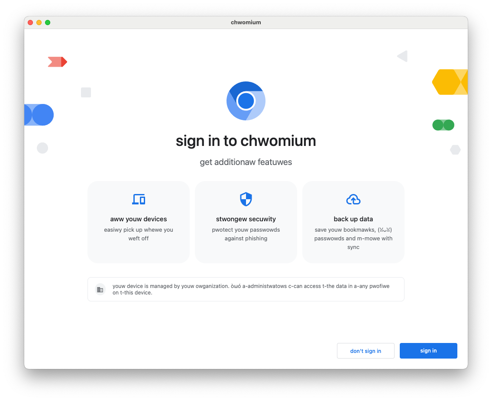

+++
title = "9 综合练习"
date = 2026-08-11T11:30:00+08:00
weight = 291
type = "docs"
description = "05-综合练习 — Comprehensive Rust"
isCJKLanguage = true
draft = false
rust_edition = "2024"

+++

> 译文 · 基于 [Comprehensive Rust](https://google.github.io/comprehensive-rust/)

> 原文链接: [https://google.github.io/comprehensive-rust/exercises/chromium/bringing-it-together.html](https://google.github.io/comprehensive-rust/exercises/chromium/bringing-it-together.html)

# 9 综合练习

在本练习中，你将添加一个全新的 Chromium 功能，把已学内容整合起来。

## 来自产品管理的简报

在遥远的雨林中发现了一个小精灵（pixie）社区。尽快把 Chromium for Pixies 交付给他们非常重要。

需求是把 Chromium 的所有 UI 字符串翻译成小精灵语。

没时间等正式翻译，幸好小精灵语与英语非常接近，而且碰巧有一个 Rust crate 能做这种翻译。

事实上，你在[上一个练习中已经导入了那个 crate][0]。

（显然，Chrome 的真正翻译需要极其认真与勤勉。不要把这个发上线！）

## 步骤

修改 `ResourceBundle::MaybeMangleLocalizedString`，使它在显示前对所有字符串做 uwuify。在这个特殊构建的 Chromium 中，无论 `mangle_localized_strings_` 如何设置，都应始终这样做。

如果你在所有这些练习中都做对了，恭喜，你应该已经做出了给小精灵用的 Chrome！

> 学员在这里很可能需要一些提示。提示包括：
>
> - UTF-16 与 UTF-8。学员应知道 Rust 字符串始终是 UTF-8，通常会决定最好在 C++ 一侧用 `base::UTF16ToUTF8` 做转换再转回来。
> - 若学员决定在 Rust 一侧做转换，他们需要考虑 [`String::from_utf16`][1]、错误处理，以及哪些 [CXX 支持的类型可以传递许多 u16][2]。
> - 学员可能以多种不同方式设计 C++/Rust 边界，例如按值接受并返回字符串，或接受对字符串的可变引用。若使用可变引用，CXX 很可能会告诉学员他们需要使用 [`Pin`][3]。你可能需要解释 `Pin` 做什么，以及为何 CXX 对指向 C++ 数据的可变引用需要它：答案是 C++ 数据不能像 Rust 数据那样移动，因为它可能包含自引用指针。
> - 包含 `ResourceBundle::MaybeMangleLocalizedString` 的 C++ 目标需要依赖一个 `rust_static_library` 目标。学员很可能已经做过。
> - `rust_static_library` 目标需要依赖 `//third_party/rust/uwuify/v0_2:lib`。

[0]: https://crates.io/crates/uwuify
[1]: https://doc.rust-lang.org/std/string/struct.String.html#method.from_utf16
[2]: https://cxx.rs/binding/slice.html
[3]: https://doc.rust-lang.org/std/pin/
