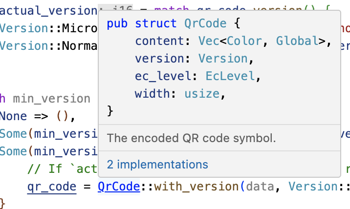

+++
title = "5.3 Visual Studio Code"
date = 2026-08-11T11:30:00+08:00
weight = 263
type = "docs"
description = "03-Visual Studio Code — Comprehensive Rust"
isCJKLanguage = true
draft = false
rust_edition = "2024"

+++

> 译文 · 基于 [Comprehensive Rust](https://google.github.io/comprehensive-rust/)

> 原文链接: [https://google.github.io/comprehensive-rust/chromium/build-rules/vscode.html](https://google.github.io/comprehensive-rust/chromium/build-rules/vscode.html)

# 5.3 Visual Studio Code

Rust 代码中类型常被省略，这使好用的 IDE 比在 C++ 中更有价值。Visual Studio Code 在 Chromium 中写 Rust 效果很好。用法如下：

- 确保 VSCode 安装了 `rust-analyzer` 扩展，而不是更早的 Rust 支持形式
- `gn gen out/Debug --export-rust-project`（或对你的输出目录使用等价命令）
- `ln -s out/Debug/rust-project.json rust-project.json`

> 若听众对 IDE 天然持怀疑态度，演示 rust-analyzer 的一些代码标注与探索功能可能有益。
>
> 以下步骤可能有助于演示（但也可以改用你最熟悉的一段与 Chromium 相关的 Rust）：
>
> - 打开 `components/qr_code_generator/qr_code_generator_ffi_glue.rs`
> - 将光标放在 `qr_code_generator_ffi_glue.rs` 中约第 26 行的 `QrCode::new` 调用上
> - 演示 **显示文档**（常见绑定：vscode = ctrl k i；vim/CoC = K）。
> - 演示 **转到定义**（常见绑定：vscode = F12；vim/CoC = g d）。（这会带你到 `//third_party/rust/.../qr_code-.../src/lib.rs`。）
> - 演示 **大纲** 并导航到 `QrCode::with_bits` 方法（约第 164 行；大纲在 vscode 的文件资源管理器窗格中；常见 vim/CoC 绑定 = space o）
> - 演示 **类型标注**（`QrCode::with_bits` 方法中有不少不错的例子）
>
> 值得指出：在编辑 `BUILD.gn` 文件后（本环节练习中我们会做几次），需要重新运行 `gn gen ... --export-rust-project`。

