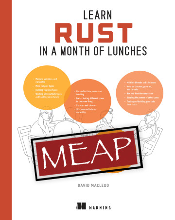
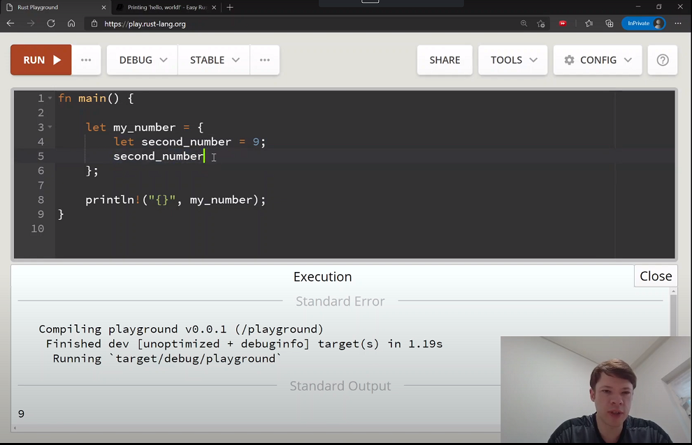

+++
title = "01-更新"
date = 2026-08-21T12:46:00+08:00
weight = 2
type = "docs"
description = "更新 — Easy Rust 中文译本"
isCJKLanguage = true
draft = false
+++

> 译文 · 基于 [Easy Rust](https://dhghomon.github.io/easy_rust/)

> 原文链接: [https://dhghomon.github.io/easy_rust/Chapter_0.html](https://dhghomon.github.io/easy_rust/Chapter_0.html)

> 中文参考：[kumakichi/easy_rust_chs](https://kumakichi.github.io/easy_rust_chs/)

# 更新

2023 年 1 月 19 日：[Learn Rust in a Month of Lunches](https://www.manning.com/books/learn-rust-in-a-month-of-lunches) 已在 Manning 上架。该书基于原版 Easy Rust，并根据读者反馈做了更新、改进与扩充（篇幅大约翻倍）。

2022 年 10 月 31 日：[已有西班牙语版本](https://www.jmgaguilera.com/rust_facil/)

2021 年 5 月 23 日：感谢 [Ariandy](https://github.com/ariandy)/[1kb](https://1kilobyte.github.io/)，[已有印度尼西亚语版本](https://github.com/ariandy/easy-rust-indonesia)。

2021 年 4 月 2 日：添加了 [BuyMeACoffee 链接](https://www.buymeacoffee.com/mithridates)，方便想请作者喝咖啡的读者。

2021 年 2 月 1 日：[已上线 YouTube！](https://www.youtube.com/playlist?list=PLfllocyHVgsRwLkTAhG0E-2QxCf-ozBkk) 两个月后（2021 年 4 月 1 日）全部录完，共 186 个视频（略超过 23 小时）。

2020 年 12 月 22 日：mdBook 版本见 [这里](https://dhghomon.github.io/easy_rust)。

2020 年 11 月 28 日：感谢 [kumakichi](https://github.com/kumakichi)，[已有简体中文版本](https://github.com/kumakichi/easy_rust_chs)！

2021 年 11 月 27 日：[Easy Rust 的韩语视频也开始录制了！](https://www.youtube.com/watch?v=W9DO6m8JSSs&list=PLfllocyHVgsSJf1zO6k6o3SX2mbZjAqYE) 한국어판 비디오도 녹화 시작!

