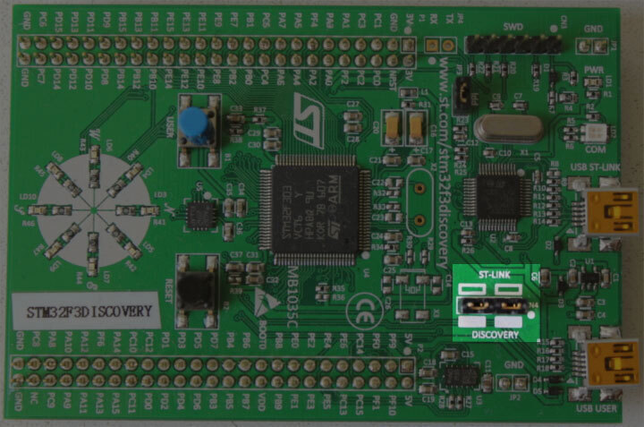

+++
title = "04-验证安装"
date = 2026-08-01T10:38:00+08:00
weight = 28
type = "docs"
description = "验证安装（Verify Installation）"
isCJKLanguage = true
draft = false

+++

> 译文 · 基于 [The Embedded Rust Book](https://doc.rust-lang.org/stable/embedded-book/)

# 验证安装 {#verify-installation}


> 原文链接: [https://doc.rust-lang.org/stable/embedded-book/intro/install/verify.html](https://doc.rust-lang.org/stable/embedded-book/intro/install/verify.html)


本节检查部分所需工具/驱动是否已正确安装与配置。

用 Mini-USB 数据线将笔记本/PC 连接到 Discovery 开发板。
Discovery 开发板有两个 USB 连接器；请使用位于板边中央、标有 “USB ST-LINK” 的那个。

同时检查 ST-LINK 排针是否已焊好（populated）。见下图；ST-LINK 排针已高亮标出。

<p align="center">

</p>

现在运行以下命令：

``` console
openocd -f interface/stlink.cfg -f target/stm32f3x.cfg
```

> **注意**：较旧版本的 openocd（包括 2017 年的 0.10.0 发行版）不包含新的（且更推荐的）`interface/stlink.cfg` 文件；你可能需要改用 `interface/stlink-v2.cfg` 或 `interface/stlink-v2-1.cfg`。

你应得到如下输出，且程序会阻塞控制台：

``` text
Open On-Chip Debugger 0.10.0
Licensed under GNU GPL v2
For bug reports, read
        http://openocd.org/doc/doxygen/bugs.html
Info : auto-selecting first available session transport "hla_swd". To override use 'transport select <transport>'.
adapter speed: 1000 kHz
adapter_nsrst_delay: 100
Info : The selected transport took over low-level target control. The results might differ compared to plain JTAG/SWD
none separate
Info : Unable to match requested speed 1000 kHz, using 950 kHz
Info : Unable to match requested speed 1000 kHz, using 950 kHz
Info : clock speed 950 kHz
Info : STLINK v2 JTAG v27 API v2 SWIM v15 VID 0x0483 PID 0x374B
Info : using stlink api v2
Info : Target voltage: 2.919881
Info : stm32f3x.cpu: hardware has 6 breakpoints, 4 watchpoints
```

内容不必完全一致，但你应看到关于 breakpoints 与 watchpoints 的最后一行。若看到了，请终止 OpenOCD 进程并前往[下一节]。

[下一节]: ../../../start/

若没有得到 “breakpoints” 那一行，请尝试下列命令之一。

``` console
openocd -f interface/stlink-v2.cfg -f target/stm32f3x.cfg
```

``` console
openocd -f interface/stlink-v2-1.cfg -f target/stm32f3x.cfg
```

若其中一条命令可用，说明你拿到的是 Discovery 开发板的旧硬件版本。这不会有问题，但请记住这一点，因为稍后你需要稍作不同配置。你可以前往[下一节]。

若在普通用户下没有任何命令可用，请尝试以 root 权限运行（例如 `sudo openocd ..`）。若以 root 权限可用，请检查 [udev 规则]是否已正确设置。

[udev 规则]: ../01-linux/#udev-rules

若你已到这一步而 OpenOCD 仍不可用，请提交[一个 issue]，我们会帮助你！

[一个 issue]: https://github.com/rust-embedded/book/issues
