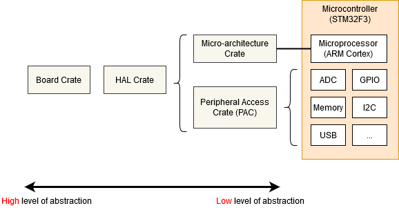

+++
title = "03-内存映射寄存器"
date = 2026-08-01T10:38:00+08:00
weight = 41
type = "docs"
description = "内存映射寄存器（Memory-mapped Registers）"
isCJKLanguage = true
draft = false

+++

> 译文 · 基于 [The Embedded Rust Book](https://doc.rust-lang.org/stable/embedded-book/)

# 内存映射寄存器 {#memory-mapped-registers}


> 原文链接: [https://doc.rust-lang.org/stable/embedded-book/start/registers.html](https://doc.rust-lang.org/stable/embedded-book/start/registers.html)


嵌入式系统仅靠执行普通 Rust 代码并在 RAM 中搬移数据，能走的路并不远。若我们想把任何信息送入或送出系统（无论是闪烁 LED、检测按键，还是通过某种总线与片外外设通信），就必须踏入外设（peripheral）及其“内存映射寄存器（memory mapped registers）”的世界。

你很可能会发现，访问微控制器外设所需的代码已经写好了，位于以下某一层：
<p align="center">

</p>

* 微架构 crate（Micro-architecture Crate）——这类 crate 处理你所用处理器内核通用的有用例程，以及使用该类型处理器内核的所有微控制器共有的外设。例如 [cortex-m] crate 提供启用与禁用中断的函数，这对所有基于 Cortex-M 的微控制器都相同。它也让你能访问所有基于 Cortex-M 的微控制器都包含的 “SysTick” 外设。
* 外设访问 crate（Peripheral Access Crate，PAC）——这类 crate 是对你所用特定料号微控制器所定义的各类内存映射寄存器的薄封装。例如面向 Texas Instruments Tiva-C TM4C123 系列的 [tm4c123x]，或面向 ST-Micro STM32F30x 系列的 [stm32f30x]。在这里，你将直接与寄存器交互，并遵循微控制器技术参考手册中给出的各外设操作说明。
* HAL crate——这些 crate 为你的特定处理器提供更友好的 API，通常通过实现 [embedded-hal] 中定义的一些通用 trait。例如，该 crate 可能提供 `Serial` 结构体，其构造函数接受一组合适的 GPIO 引脚与波特率，并提供某种 `write_byte` 函数用于发送数据。关于 [embedded-hal] 的更多信息，见[可移植性]章节。
* 板级 crate（Board Crate）——这些 crate 比 HAL crate 更进一步，预先配置各种外设与 GPIO 引脚，以适配你所用的特定开发套件或开发板，例如面向 STM32F3DISCOVERY 板的 [stm32f3-discovery]。

[cortex-m]: https://crates.io/crates/cortex-m
[tm4c123x]: https://crates.io/crates/tm4c123x
[stm32f30x]: https://crates.io/crates/stm32f30x
[embedded-hal]: https://crates.io/crates/embedded-hal
[可移植性]: ../portability/
[stm32f3-discovery]: https://crates.io/crates/stm32f3-discovery
[Discovery]: https://rust-embedded.github.io/discovery/

## 板级 crate {#board-crate}

若你是嵌入式 Rust 新手，板级 crate 是完美的起点。它们很好地抽象了初学时可能令人不知所措的硬件细节，并使点亮或熄灭 LED 等标准任务变得容易。它暴露的功能在不同开发板之间差异很大。由于本书旨在保持硬件无关，板级 crate 不会被本书覆盖。

若你想用 STM32F3DISCOVERY 开发板做实验，强烈建议看看 [stm32f3-discovery] 板级 crate，它提供闪烁板载 LED、访问指南针、蓝牙等功能。[Discovery] 一书对板级 crate 的使用有很好的介绍。

但若你使用的系统尚无专用板级 crate，或你需要现有 crate 未提供的功能，请继续阅读——我们将从底层的微架构 crate 开始。

## 微架构 crate {#micro-architecture-crate}

让我们看看所有基于 Cortex-M 的微控制器都共有的 SysTick 外设。我们可以在 [cortex-m] crate 中找到相当底层的 API，并像这样使用它：

```rust,ignore
#![no_std]
#![no_main]
use cortex_m::peripheral::{syst, Peripherals};
use cortex_m_rt::entry;
use panic_halt as _;

#[entry]
fn main() -> ! {
    let peripherals = Peripherals::take().unwrap();
    let mut systick = peripherals.SYST;
    systick.set_clock_source(syst::SystClkSource::Core);
    systick.set_reload(1_000);
    systick.clear_current();
    systick.enable_counter();
    while !systick.has_wrapped() {
        // 循环
    }

    loop {}
}
```
`SYST` 结构体上的函数与 ARM 技术参考手册为该外设定义的功能相当接近。这个 API 里没有“延迟 X 毫秒”之类的东西——我们必须用 `while` 循环粗略地自己实现。注意，在调用 `Peripherals::take()` 之前我们无法访问 `SYST` 结构体——这是一个特殊例程，保证整个程序中只有一个 `SYST` 结构。更多内容见[外设]一节。

[外设]: ../peripherals/

## 使用外设访问 crate（PAC） {#using-a-peripheral-access-crate-pac}

若我们把自己限制在每个 Cortex-M 都包含的基本外设上，嵌入式软件开发走不了多远。到某个时候，我们需要编写针对所用特定微控制器的代码。在本例中，假设我们有一颗 Texas Instruments TM4C123——一颗中等水平的 80MHz Cortex-M4，带 256 KiB Flash。我们将引入 [tm4c123x] crate 来使用这颗芯片。

```rust,ignore
#![no_std]
#![no_main]

use panic_halt as _; // panic 处理

use cortex_m_rt::entry;
use tm4c123x;

#[entry]
pub fn init() -> (Delay, Leds) {
    let cp = cortex_m::Peripherals::take().unwrap();
    let p = tm4c123x::Peripherals::take().unwrap();

    let pwm = p.PWM0;
    pwm.ctl.write(|w| w.globalsync0().clear_bit());
    // Mode = 1 => 向上/向下计数模式
    pwm._2_ctl.write(|w| w.enable().set_bit().mode().set_bit());
    pwm._2_gena.write(|w| w.actcmpau().zero().actcmpad().one());
    // 528 个周期（向上向下各 264）= 每视频行 4 个循环（2112 个周期）
    pwm._2_load.write(|w| unsafe { w.load().bits(263) });
    pwm._2_cmpa.write(|w| unsafe { w.compa().bits(64) });
    pwm.enable.write(|w| w.pwm4en().set_bit());
}

```

我们访问 `PWM0` 外设的方式与之前访问 `SYST` 外设完全相同，只是调用了 `tm4c123x::Peripherals::take()`。由于该 crate 用 [svd2rust] 自动生成，寄存器字段的访问函数接受闭包，而不是数值参数。虽然看起来代码很多，但 Rust 编译器可用它为我们执行一堆检查，然后生成相当接近手写汇编的机器码！当自动生成的代码无法确定某个访问器函数的所有可能参数都有效时（例如，SVD 把寄存器定义为 32 位，但未说明其中某些 32 位值是否有特殊含义），该函数会被标为 `unsafe`。我们可以在上面设置 `load` 与 `compa` 子字段时使用 `bits()` 函数处看到这一点。

### 读取 {#reading}

`read()` 函数返回一个对象，它对该寄存器内由制造商为本芯片提供的 SVD 文件所定义的各子字段给出只读访问。你可以在 [tm4c123x 文档][tm4c123x documentation R]中找到该特定芯片、该特定外设、该特定寄存器的特殊 `R` 返回类型上可用的全部函数。

```rust,ignore
if pwm.ctl.read().globalsync0().is_set() {
    // 做某事
}
```

### 写入 {#writing}

`write()` 函数接受带单个参数的闭包。我们通常称该参数为 `w`。然后该参数对该寄存器内由制造商为本芯片提供的 SVD 文件所定义的各子字段给出读写访问。同样，你可以在 [tm4c123x 文档][tm4c123x Documentation W]中找到该特定芯片、该特定外设、该特定寄存器上 “w” 可用的全部函数。注意：我们未设置的所有子字段都会被设为默认值——寄存器中任何已有内容都会丢失。

```rust,ignore
pwm.ctl.write(|w| w.globalsync0().clear_bit());
```

### 修改 {#modifying}

若我们只想更改该寄存器中的某一个子字段，而让其它子字段保持不变，可以使用 `modify` 函数。该函数接受带两个参数的闭包——一个用于读，一个用于写。我们通常分别称它们为 `r` 与 `w`。`r` 参数可用于检查寄存器的当前内容，`w` 参数可用于修改寄存器内容。

```rust,ignore
pwm.ctl.modify(|r, w| w.globalsync0().clear_bit());
```

`modify` 函数在这里真正展现了闭包的力量。在 C 中，我们必须读入某个临时值，修改正确的位，再把值写回。这意味着有相当大的出错空间：

```C
uint32_t temp = pwm0.ctl.read();
temp |= PWM0_CTL_GLOBALSYNC0;
pwm0.ctl.write(temp);
uint32_t temp2 = pwm0.enable.read();
temp2 |= PWM0_ENABLE_PWM4EN;
pwm0.enable.write(temp); // 糟糕！写错了变量！
```

[svd2rust]: https://crates.io/crates/svd2rust
[tm4c123x documentation R]: https://docs.rs/tm4c123x/0.7.0/tm4c123x/pwm0/ctl/struct.R.html
[tm4c123x documentation W]: https://docs.rs/tm4c123x/0.7.0/tm4c123x/pwm0/ctl/struct.W.html

## 使用 HAL crate {#using-a-hal-crate}

芯片的 HAL crate 通常通过对 PAC 暴露的原始结构体实现自定义 Trait 来工作。该 trait 常为单个外设定义名为 `constrain()` 的函数，或为带多个引脚的 GPIO 端口等定义 `split()`。该函数会消费底层原始外设结构体，并返回带更高层 API 的新对象。该 API 还可能做这样的事：让串口的 `new` 函数要求借用某个 `Clock` 结构体，而该结构体只能通过调用配置 PLL 并设置所有时钟频率的函数来生成。这样，在静态上就不可能在未先配置时钟频率的情况下创建串口对象，也不可能让串口对象错误地把波特率换算成时钟节拍。有些 crate 甚至为每个 GPIO 引脚可处的状态定义特殊 trait，要求用户在把引脚传入外设之前先把它置于正确状态（例如通过选择合适的 Alternate Function Mode）。而这一切都没有运行时成本！

让我们看一个例子：

```rust,ignore
#![no_std]
#![no_main]

use panic_halt as _; // panic 处理

use cortex_m_rt::entry;
use tm4c123x_hal as hal;
use tm4c123x_hal::prelude::*;
use tm4c123x_hal::serial::{NewlineMode, Serial};
use tm4c123x_hal::sysctl;

#[entry]
fn main() -> ! {
    let p = hal::Peripherals::take().unwrap();
    let cp = hal::CorePeripherals::take().unwrap();

    // 把 SYSCTL 结构体包装成带更高层 API 的对象
    let mut sc = p.SYSCTL.constrain();
    // 选择振荡设置
    sc.clock_setup.oscillator = sysctl::Oscillator::Main(
        sysctl::CrystalFrequency::_16mhz,
        sysctl::SystemClock::UsePll(sysctl::PllOutputFrequency::_80_00mhz),
    );
    // 用这些设置配置 PLL
    let clocks = sc.clock_setup.freeze();

    // 把 GPIO_PORTA 结构体包装成带更高层 API 的对象。
    // 注意它需要借用 `sc.power_control`，以便能自动为 GPIO
    // 外设上电。
    let mut porta = p.GPIO_PORTA.split(&sc.power_control);

    // 激活 UART。
    let uart = Serial::uart0(
        p.UART0,
        // 发送引脚
        porta
            .pa1
            .into_af_push_pull::<hal::gpio::AF1>(&mut porta.control),
        // 接收引脚
        porta
            .pa0
            .into_af_push_pull::<hal::gpio::AF1>(&mut porta.control),
        // 不需要 RTS 或 CTS
        (),
        (),
        // 波特率
        115200_u32.bps(),
        // 输出处理
        NewlineMode::SwapLFtoCRLF,
        // 我们需要时钟频率来计算波特率分频
        &clocks,
        // 我们需要它来为 UART 外设上电
        &sc.power_control,
    );

    loop {
        writeln!(uart, "Hello, World!\r\n").unwrap();
    }
}
```
