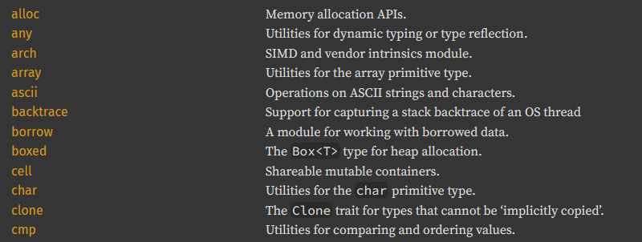
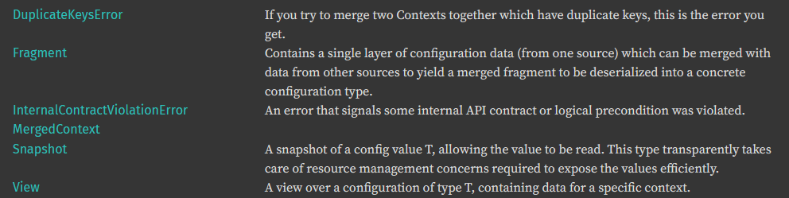
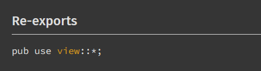

+++
title = "第9章 文档"
date = 2026-08-18T18:10:00+08:00
weight = 110
type = "docs"
description = "文档指南 — Pragmatic Rust Guidelines"
isCJKLanguage = true
draft = false
+++

> 译文 · 基于 [Pragmatic Rust Guidelines](https://microsoft.github.io/rust-guidelines/)

> 原文链接: [https://microsoft.github.io/rust-guidelines/guidelines/docs/index.html](https://microsoft.github.io/rust-guidelines/guidelines/docs/index.html)

# 文档

## 首句一行，约 15 个英文词 (M-FIRST-DOC-SENTENCE) {#M-FIRST-DOC-SENTENCE}

<a id="M-DOC-FIRST-SENTENCE"></a>

*本条守护：易于扫读的 API 文档。*

为条目编写文档时，第一句会成为「摘要句」，被提取并显示在模块摘要中：

```rust
/// 这是摘要句，会显示在模块摘要中。
///
/// 这是其他文档。仅在该条目的详情视图中显示。
/// 这里的句子可以任意长，不会造成任何问题。
fn some_item() { }
```

由于 Rust API 文档以固定最大宽度渲染，存在一个自然的首选句长；为在大多数屏幕上保持整洁，你不应超出该长度。

若把内容保持在一行内，文档就会易于扫读。例如，对比标准库：



否则，可能出现「孤行」（_widows_），阅读体验整体不佳：



经验法则是：首句不应超过 **15 个英文词**。

## 具备完备的模块文档 (M-MODULE-DOCS) {#M-MODULE-DOCS}

*本条守护：便捷的 API 文档导航。*

任何公开的库模块都必须有 `//!` 模块文档，且首句必须遵循 [M-DOC-FIRST-SENTENCE]。

```rust
pub mod ffi {
    //! 包含 FFI 抽象。

    pub struct String {};
}
```

模块文档的其余部分应当完备，即覆盖所含条目最相关的技术方面，包括

- 模块包含什么
- 何时应当使用，以及可能何时不该使用
- 示例
- 子系统规格（例如，`std::fmt` [也描述了其格式化语言](https://doc.rust-lang.org/stable/std/fmt/index.html#formatting-parameters)）
- 可观察的副作用，以及关于这些副作用有哪些保证（如有）
- 相关实现细节，例如所用的系统 API

优秀示例包括：

- [`std::fmt`](https://doc.rust-lang.org/stable/std/fmt/index.html)
- [`std::pin`](https://doc.rust-lang.org/stable/std/pin/index.html)
- [`std::option`](https://doc.rust-lang.org/stable/std/option/index.html)

这并不意味着每个模块都应包含上述全部内容。但如果需要说明所含类型之间的交互，
模块文档就是合适的位置。

[M-DOC-FIRST-SENTENCE]: ./#M-DOC-FIRST-SENTENCE

## 文档包含规范章节 (M-CANONICAL-DOCS) {#M-CANONICAL-DOCS}

*本条守护：既定的 Rust 文档惯例。*

公开的库条目必须包含规范文档章节。摘要句必须始终存在。强烈鼓励提供扩展文档与示例。
其余章节（`# Examples`、`# Errors`、`# Panics`、`# Safety`、`# Abort`）在适用时必须存在。这些英文小节名是编译器能识别的规范 rustdoc 标题，应保持英文。

```rust
/// 摘要句，少于 15 个英文词。
///
/// 自由形式的扩展文档。
///
/// # Examples
/// 一个或多个展示 API 用法的示例，如下所示。
///
/// # Errors
/// 若函数返回 `Result`，列出已知错误条件
///
/// # Panics
/// 若函数可能 panic，列出何时会发生
///
/// # Safety
/// 若函数是 `unsafe` 或可能造成 UB，本节必须列出
/// 调用方必须满足的全部条件。
///
/// # Abort
/// 若函数可能中止进程，列出何时会发生。
pub fn foo() {}
```

与其他语言不同，你不应创建参数表。参数的用法应在正文中说明。换言之，不要写成

```rust
/// 复制文件。
///
/// # 参数
/// - src: 源。
/// - dst: 目标。
fn copy(src: File, dst: File) {}
```

而应写成：

```rust
/// 将文件从 `src` 复制到 `dst`。
fn copy(src: File, dst: File) {}
```

### 相关阅读

- 函数文档应包含错误、panic 与安全性考量（[C-FAILURE](https://rust-lang.github.io/api-guidelines/documentation.html#c-failure)）

## 为 `pub use` 项标记 `#[doc(inline)]` (M-DOC-INLINE) {#M-DOC-INLINE}

*本条守护：与同级项融为一体的再导出项。*

通过 `pub use foo::Foo` 或 `pub use foo::*` 公开再导出 crate 条目时，它们会显示在不透明的再导出块中。多数情况下，这对读者并无帮助：



相反，你应在 `use` 处用 `#[doc(inline)]` 标注它们，使其自然内联：

```rust
# pub(crate) mod foo { pub struct Foo; }
#[doc(inline)]
pub use foo::*;

// 或

#[doc(inline)]
pub use foo::Foo;
```


这不适用于 `std` 或第三方类型；这些类型应始终不内联地再导出，以明确它们是外部的。

> ### ⚠️ 仍然避免 glob 导出
>
> 上述 `#[doc(inline)]` 技巧并不改变 [M-NO-GLOB-REEXPORTS]；通常仍不应通过通配符再导出条目。

[M-NO-GLOB-REEXPORTS]: ../libraries/03-resilience/#M-NO-GLOB-REEXPORTS
