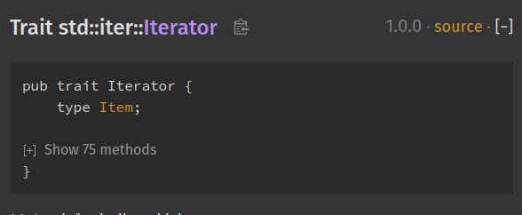
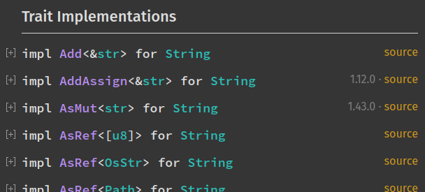

+++
title = "01-文档内设置"
date = 2026-08-01T07:35:00+08:00
weight = 31
type = "docs"
description = "rustdoc 生成页面中的文档内设置"
isCJKLanguage = true
draft = false

+++

> 译文 · 基于 [The rustdoc book](https://doc.rust-lang.org/rustdoc/)

# 文档内设置 {#in-doc-settings}

> 原文链接: [https://doc.rust-lang.org/rustdoc/read-documentation/in-doc-settings.html](https://doc.rust-lang.org/rustdoc/read-documentation/in-doc-settings.html)

rustdoc 的 HTML 输出包含一个设置菜单，本章说明该菜单中各项设置的作用。

点击右上角的齿轮按钮
（<i class="fas fa-gear" aria-hidden="true"></i>）即可打开。

## 更改显示主题 {#changing-displayed-theme}

可以更改主题。如果选择 “system preference”（系统偏好），你会看到两个新的子菜单：“Preferred light theme”（首选浅色主题）和 “Preferred dark theme”（首选深色主题）。这意味着：如果系统偏好设为 “light”，那么 rustdoc 会使用你在 “Preferred light theme” 中选择的主题。

## 对大型项自动隐藏项内容 {#auto-hide-item-contents-for-large-items}

如果类型定义包含超过 12 个项，且启用了此设置，默认会将它们折叠。你可以通过点击 `[+]` 按钮展开查看。

此设置的一个很好的例子可以在
[`Iterator`](https://doc.rust-lang.org/stable/std/iter/trait.Iterator.html) 文档
页面中看到：

## 自动隐藏项方法的文档 {#auto-hide-item-methods-documentation}

如果启用，此设置会折叠所有 trait 实现块。如果你只想概览所有可用方法，这会很方便。你仍可通过展开来查看某个方法的文档。

## 自动隐藏 trait 实现文档 {#auto-hide-trait-implementation-documentation}

如果启用，此设置会折叠所有 trait 实现块（可在 “Trait Implementations” 一节中看到）。如果你只想概览类型上实现的所有 trait，这会很方便。你仍可通过展开来查看某个 trait 实现的关联项。

示例：

## 搜索仅有一个结果时直接跳转到该项 {#directly-go-to-item-in-search-if-there-is-only-one-result}

如果启用此设置，当你的搜索只返回一个元素时，会直接进入结果页。如果你确切知道要找什么，并希望直接到达而不浪费时间去选择唯一的搜索结果，这会很有用。

## 在代码示例上显示行号 {#show-line-numbers-on-code-examples}

如果启用，此设置会为文档中的代码示例添加行号。它为阅读代码提供视觉辅助。

## 禁用键盘快捷键 {#disable-keyboard-shortcuts}

如果启用此设置，键盘快捷键将被禁用。如果你正在使用的某个网页扩展已经占用了其中一些快捷键，这会很有用。

要查看 rustdoc 键盘快捷键的完整列表，可以打开帮助菜单（设置菜单按钮左侧带问号的按钮）。
