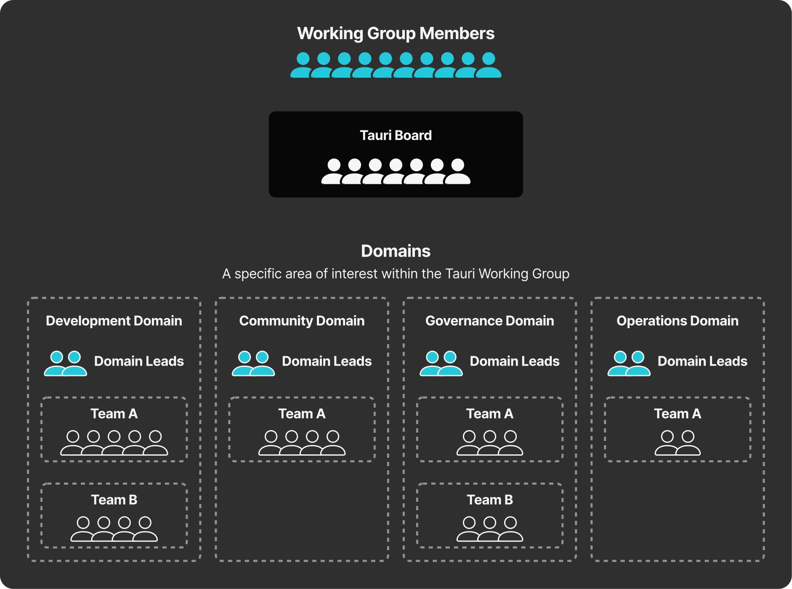

+++
title = "4 Tauri 治理"
date = 2026-09-25T21:31:08+08:00
weight = 4
type = "docs"
description = ""
isCJKLanguage = true
draft = false
+++

> 原文链接: [https://tauri.app/about/governance/](https://tauri.app/about/governance/)

Tauri 组织结构的主要目标之一，是保证我们忠于自身的开源价值观并可持续地践行它，同时尊重贡献者的健康与福祉。[Commons Conservancy 中的 Tauri 项目](https://dracc.commonsconservancy.org/0035/)正是为承诺这些价值观而设立，并在 Tauri 及其附属资料未来的整个开发过程中，促成开放、透明、高效的治理流程。

## Tauri 工作组

Tauri 工作组是为实现这一治理流程而建立的集体框架。它由以下部分组成：

- 工作组成员
- Tauri 董事会与董事
- 领域与领域负责人
- 团队

### 工作组成员

构成 Tauri 工作组的全体个人。

### Tauri 董事会与董事

Tauri 董事会是 Tauri 项目的核心决策机构，负责 Tauri 项目的整体健康与稳定。董事会对项目内的重大决策以及工作组提出的议题进行表决。

董事会中的单个董事可能是技术贡献者，可能是 Tauri 未来的利益相关方，可能分享行业经验，也可能对开源中的监管与法律事务充满热情。

### 领域与领域负责人

领域是代表 Tauri 内某个关注方向的组织单元。

领域负责人是 Tauri 社区中受信任的贡献者，在他们所负责的领域具备专业能力。他们负责设定方向、监督并支持该领域内的活动。

当前的领域与领域负责人列在 [GitHub 上的治理与指导仓库](https://github.com/tauri-apps/governance-and-guidance)中。

### 团队

团队是由贡献者组成的小组，负责支持或维护 Tauri 项目的特定区域。它们是 Tauri 执行较长期任务与目标的手段，尤其是在临时性贡献无法达到同样效果的时候。

## 参与其中

如果你有兴趣成为 Tauri 董事或领域负责人，这些职位的选举全年都有：领域负责人的选举在春季和秋季进行，董事的选举在夏季进行。在相应选举之前，如何申请的说明会发布到 [Tauri 博客](https://tauri.app/blog/)。

## 附加资源

- [治理与指导仓库](https://github.com/tauri-apps/governance-and-guidance)：关于 Tauri 治理以及当前领域与领域负责人的更详细信息
- [社会契约](https://github.com/tauri-apps/governance-and-guidance/blob/main/SOCIAL_CONTRACT.md)：社会契约指导我们的决策与组织方式
- [行为准则](https://github.com/tauri-apps/governance-and-guidance/blob/main/CODE_OF_CONDUCT.md)
- [Tauri 项目章程](https://dracc.commonsconservancy.org/0035/)
