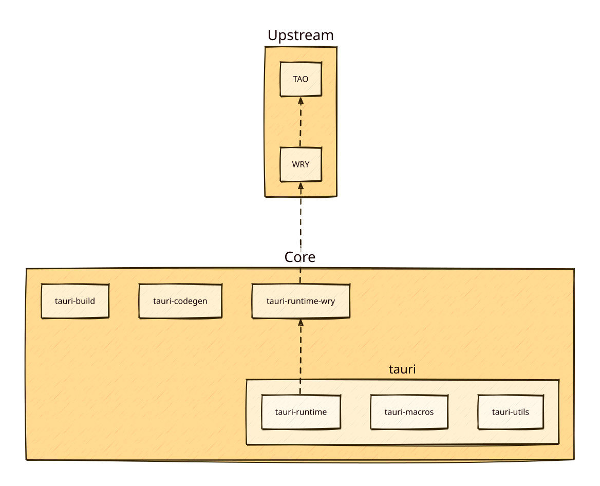

+++
title = "2 Tauri 架构"
date = 2026-09-25T21:31:08+08:00
weight = 2
type = "docs"
description = ""
isCJKLanguage = true
draft = false
+++

> 原文链接: [https://tauri.app/concept/architecture/](https://tauri.app/concept/architecture/)

## 简介

Tauri 是一个多语言、通用的工具包，可组合性很强，能让工程师构建各种各样的应用。它用于构建桌面应用，方式是组合使用 Rust 工具与在 Webview 中渲染的 HTML。用 Tauri 构建的应用可以按需附带 JS API 和 Rust API 的任意部分，使 webview 能通过消息传递控制系统。开发者可以用自己的功能扩展默认 API，轻松地在 Webview 与基于 Rust 的后端之间建立桥接。

Tauri 应用可以拥有[托盘类界面](../../learn/4-systemtray/)。它们可以[更新](../../plugin/28-updater/)，并由用户的操作系统按预期管理。因为使用操作系统的 webview，它们的体积非常小。它们不附带运行时，因为最终二进制文件由 Rust 编译而来。这使得[逆向 Tauri 应用并非易事](../../security/1-overview/)。

### Tauri 不是什么

Tauri 不是轻量的内核封装。它直接使用 [WRY](#wry) 和 [TAO](#tao)，由它们承担向操作系统发起系统调用的重活。

Tauri 不是虚拟机或虚拟化环境。它是一个应用工具包，用来构建基于 Webview 的操作系统应用。

## 核心生态

*图：Tauri 架构的简化表示。*

### tauri

[在 GitHub 上查看](https://github.com/tauri-apps/tauri/tree/dev/crates/tauri)

这是把所有东西整合在一起的主要 crate。它把运行时、宏、工具和 API 汇成一个最终产品。它在编译期读取 [`tauri.conf.json`](https://tauri.app/reference/config/) 文件，以启用特性并完成应用的实际配置（甚至包括项目文件夹中的 `Cargo.toml` 文件）。它在运行时处理脚本注入（用于 polyfill／原型修订），承载用于系统交互的 API，甚至管理更新流程。

### tauri-runtime

[在 GitHub 上查看](https://github.com/tauri-apps/tauri/tree/dev/crates/tauri-runtime)

Tauri 自身与更底层 webview 库之间的胶水层。

### tauri-macros

[在 GitHub 上查看](https://github.com/tauri-apps/tauri/tree/dev/crates/tauri-macros)

借助 [`tauri-codegen`](https://github.com/tauri-apps/tauri/tree/dev/crates/tauri-codegen) crate 为 context、handler 和命令创建宏。

### tauri-utils

[在 GitHub 上查看](https://github.com/tauri-apps/tauri/tree/dev/crates/tauri-utils)

在许多地方复用的通用代码，提供诸如解析配置文件、检测平台三元组、注入 CSP 和管理资源等实用工具。

### tauri-build

[在 GitHub 上查看](https://github.com/tauri-apps/tauri/tree/dev/crates/tauri-build)

在构建期应用宏，为 `cargo` 装配一些所需的特殊特性。

### tauri-codegen

[在 GitHub 上查看](https://github.com/tauri-apps/tauri/tree/dev/crates/tauri-codegen)

嵌入、哈希并压缩资源，包括应用图标和系统托盘图标。在编译期解析 [`tauri.conf.json`](https://tauri.app/reference/config/) 并生成 Config 结构体。

### tauri-runtime-wry

[在 GitHub 上查看](https://github.com/tauri-apps/tauri/tree/dev/crates/tauri-runtime-wry)

这个 crate 专门为 WRY 开放直接的系统级交互，例如打印、显示器检测以及其它与窗口相关的任务。

## Tauri 工具链

### API（JavaScript / TypeScript）

[在 GitHub 上查看](https://github.com/tauri-apps/tauri/tree/dev/packages/api)

一个 TypeScript 库，生成 `cjs` 和 `esm` 两种 JavaScript 入口，供你导入前端框架，让 Webview 能够调用并监听后端活动。它也提供纯 TypeScript 版本，因为对某些框架来说那样更合适。它借助 webview 与宿主之间的消息传递工作。

### Bundler（Rust / Shell）

[在 GitHub 上查看](https://github.com/tauri-apps/tauri/tree/dev/crates/tauri-bundler)

一个库，用于为它检测到或被指定的平台构建 Tauri 应用。目前支持 macOS、Windows 和 Linux，不久的将来也会支持移动平台。它也可以在 Tauri 项目之外使用。

### cli.rs（Rust）

[在 GitHub 上查看](https://github.com/tauri-apps/tauri/tree/dev/crates/tauri-cli)

这个 Rust 可执行文件为 CLI 所必需的全部操作提供了完整接口。它可在 macOS、Windows 和 Linux 上运行。

### cli.js（JavaScript）

[在 GitHub 上查看](https://github.com/tauri-apps/tauri/tree/dev/packages/cli)

使用 [`napi-rs`](https://github.com/napi-rs/napi-rs) 对 [`cli.rs`](https://github.com/tauri-apps/tauri/blob/dev/crates/tauri-cli) 的封装，为各平台生成 npm 包。

### create-tauri-app（JavaScript）

[在 GitHub 上查看](https://github.com/tauri-apps/create-tauri-app)

一个工具包，让工程团队可以用自己选择的前端框架（只要已配置好）快速搭建新的 `tauri-apps` 项目。

## 上游 crate

Tauri-Apps 组织维护着 Tauri 的两个“上游” crate：用于创建和管理应用窗口的 TAO，以及用于与窗口内 Webview 交互的 WRY。

### TAO

[在 GitHub 上查看](https://github.com/tauri-apps/tao)

Rust 编写的跨平台应用窗口创建库，支持 Windows、macOS、Linux、iOS 和 Android 等所有主流平台。它用 Rust 编写，是 [winit](https://github.com/rust-windowing/winit) 的分支，我们为自身需求（例如菜单栏和系统托盘）做了扩展。

### WRY

[在 GitHub 上查看](https://github.com/tauri-apps/wry)

WRY 是一个 Rust 编写的跨平台 WebView 渲染库，支持 Windows、macOS 和 Linux 等所有主流桌面平台。
Tauri 使用 WRY 作为抽象层，由它决定使用哪个 webview（以及如何进行交互）。

## 其它工具

### tauri-action

[在 GitHub 上查看](https://github.com/tauri-apps/tauri-action)

为所有平台构建 Tauri 二进制文件的 GitHub workflow。即使尚未配置 Tauri，也能创建（非常基础的）Tauri 应用。

### tauri-vscode

[在 GitHub 上查看](https://github.com/tauri-apps/tauri-vscode)

该项目为 Visual Studio Code 界面增强了若干实用功能。

## 插件

[Tauri 插件指南](../../develop/plugins/1-overview/)

一般来说，插件由第三方编写（尽管也可能有官方支持的插件）。一个插件通常做 3 件事：

1. 让 Rust 代码能够“做某件事”。
2. 提供接口胶水，便于集成到应用中。
3. 提供与 Rust 代码交互的 JavaScript API。

下面是一些 Tauri 插件的例子：

- [tauri-plugin-fs](https://github.com/tauri-apps/tauri-plugin-fs)
- [tauri-plugin-sql](https://github.com/tauri-apps/tauri-plugin-sql)
- [tauri-plugin-stronghold](https://github.com/tauri-apps/tauri-plugin-stronghold)

## 许可证

Tauri 本身以 MIT 或 Apache-2.0 授权。如果你重新打包并修改了任何源代码，你有责任确认自己遵守了所有上游许可证。Tauri 按“原样”提供，不对任何用途的适用性作明确声明。

你也可以在这里查看我们的[软件物料清单](https://app.fossa.com/projects/git%2Bgithub.com%2Ftauri-apps%2Ftauri)。
