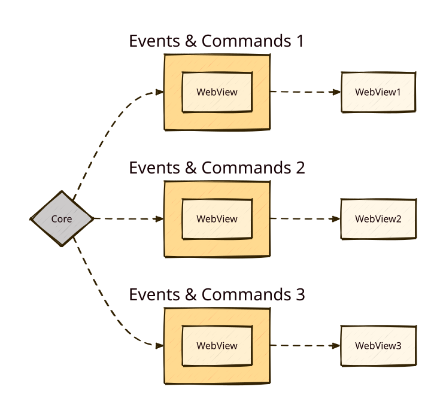

+++
title = "3 进程模型"
date = 2026-09-25T21:31:08+08:00
weight = 3
type = "docs"
description = ""
isCJKLanguage = true
draft = false
+++

> 原文链接: [https://tauri.app/concept/process-model/](https://tauri.app/concept/process-model/)

Tauri 采用类似 Electron 或许多现代 Web 浏览器的多进程架构。本指南探讨这一设计选择背后的原因，以及它为何是编写安全应用的关键。

## 为什么要多进程？

在 GUI 应用的早期，通常用一个进程来完成计算、绘制界面并响应用户输入。你可能已经猜到了，这意味着一个长时间运行的高开销计算会让用户界面失去响应，更糟的是，某个应用组件出错会导致整个应用崩溃。

人们逐渐认识到需要更具韧性的架构，于是应用开始把不同组件放到不同进程中运行。这样能更好地利用现代多核 CPU，也让应用安全得多：某个组件崩溃不再影响整个系统，因为组件被隔离在不同的进程中。如果某个进程进入无效状态，我们可以轻松重启它。

我们还可以通过只给每个进程分配最小权限（刚好够它完成工作）来限制潜在漏洞的影响范围。这种模式称为[最小权限原则](https://en.wikipedia.org/wiki/Principle_of_least_privilege)，现实世界中随处可见它的影子。如果你请园丁来修剪树篱，你会给他花园的钥匙，而**不会**把房子的钥匙给他；他为什么需要进房子呢？同样的道理适用于计算机程序：我们给它们的访问权限越少，它们被攻破时能造成的危害就越小。

## 核心进程

每个 Tauri 应用都有一个核心进程，它充当应用的入口点，并且是唯一对操作系统拥有完整访问权限的组件。

核心的主要职责是利用这种访问权限创建并编排应用窗口、系统托盘菜单或通知。Tauri 实现了必要的跨平台抽象，让这一切变得简单。它还会把所有的[进程间通信](../inter-process-communication/1-overview/)都经由核心进程转发，使你可以在一个中心位置拦截、过滤和操纵) IPC 消息。

核心进程还应负责管理全局状态，例如设置或数据库连接。这样你就可以轻松地在多个窗口之间同步状态，并保护业务敏感数据不被前端的窥探者获取。

我们选择用 Rust 实现 Tauri，是因为它的[所有权](https://doc.rust-lang.org/book/ch04-01-what-is-ownership.html)概念在保证内存安全的同时仍具备出色的性能。

*图：Tauri 进程模型的简化表示。单个核心进程管理一个或多个 WebView 进程。*

## WebView 进程

核心进程本身不渲染实际的用户界面（UI），而是启动 WebView 进程，由它们使用操作系统提供的 WebView 库。WebView 是一个类浏览器环境，会执行你的 HTML、CSS 和 JavaScript。

这意味着传统 Web 开发中的大部分技巧和工具都可以用来创建 Tauri 应用。例如，许多 Tauri 示例就是用 [Svelte](https://svelte.dev/) 前端框架和 [Vite](https://vitejs.dev/) 打包工具编写的。

安全最佳实践同样适用：例如，你必须始终对用户输入做净化处理，绝不在前端处理密钥，并且最好把尽可能多的业务逻辑交给核心进程，以缩小攻击面。

与其它类似方案不同，WebView 库**不会**被打包进你的最终可执行文件，而是在运行时动态链接[^1]。这让你的应用体积**显著**变小，但也意味着你必须像传统 Web 开发那样留意平台差异。

[^1]:
目前，Tauri 在 Windows 上使用 [Microsoft Edge WebView2](https://docs.microsoft.com/en-us/microsoft-edge/webview2/)，在 macOS 上使用 [WKWebView](https://developer.apple.com/documentation/webkit/wkwebview)，在 Linux 上使用 [webkitgtk](https://webkitgtk.org)。
