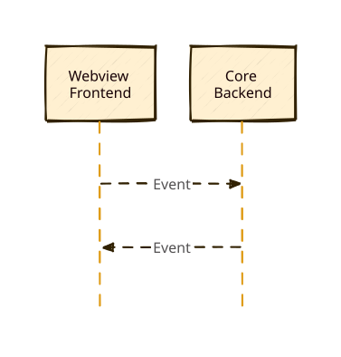
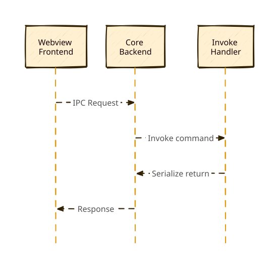

+++
title = "1 进程间通信概述"
date = 2026-09-25T21:31:08+08:00
weight = 1
type = "docs"
description = ""
isCJKLanguage = true
draft = false
+++

> 原文链接: [https://tauri.app/concept/inter-process-communication/](https://tauri.app/concept/inter-process-communication/)

进程间通信（IPC）让相互隔离的进程能够安全地通信，是构建更复杂应用的关键。

关于具体的 IPC 模式，请参阅以下指南：

- [Brownfield](../2-brownfieldpattern/)
- [Isolation](../3-isolationpattern/)

Tauri 使用一种特定风格的进程间通信，称为[异步消息传递](https://en.wikipedia.org/wiki/Message_passing#Asynchronous_message_passing)。进程之间交换用某种简单数据表示序列化后的**请求**和**响应**。有 Web 开发经验的人对消息传递应该不陌生，因为互联网上的客户端—服务器通信就采用这种范式。

消息传递比共享内存或直接函数调用更安全，因为接收方可以按自己的判断拒绝或丢弃请求。例如，如果 Tauri 核心进程判定某个请求是恶意的，它只需丢弃该请求，绝不执行对应的函数。

下面我们更详细地说明 Tauri 的两种 IPC 原语——`事件（Events）`和`命令（Commands）`。

## 事件

事件是“即发即忘”的单向 IPC 消息，最适合用于传递生命周期事件和状态变化。与[命令](#命令)不同，事件既可以由前端发出，**也可以**由 Tauri 核心发出。

*图：在核心与 webview 之间发送的事件。*

在底层，事件仍然使用命令实现，而对事件 API 的访问由[事件权限](https://tauri.app/reference/acl/core-permissions/#event)控制。

## 命令

Tauri 还在 IPC 消息之上提供了类似[外部函数接口](https://en.wikipedia.org/wiki/Foreign_function_interface)的抽象[^1]。主要 API 是 `invoke`，它与浏览器的 `fetch` API 类似，让前端可以调用 Rust 函数、传递参数并接收数据。

由于该机制在底层使用类似 [JSON-RPC](https://www.jsonrpc.org) 的协议来序列化请求和响应，所有参数和返回数据都必须能序列化为 JSON。

*图：一次命令调用涉及的 IPC 消息。*

[^1]: 由于命令在底层仍然使用消息传递，它们并不具备真实 FFI 接口那样的安全隐患。
