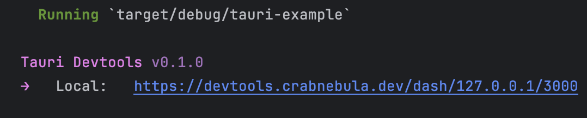

+++
title = "2 CrabNebula DevTools"
date = 2026-09-25T21:31:08+08:00
weight = 12
type = "docs"
description = ""
isCJKLanguage = true
draft = false
+++

> 原文链接: [https://tauri.app/develop/debug/crabnebula-devtools/](https://tauri.app/develop/debug/crabnebula-devtools/)

[CrabNebula](https://crabnebula.dev/) 作为与 Tauri 项目合作的一部分，为 Tauri 提供了一个免费的 [DevTools](https://crabnebula.dev/devtools/) 应用。该应用可以对你的 Tauri 应用进行插桩：捕获其内嵌资源、Tauri 配置文件、日志与 span，并提供一个 Web 前端来实时无缝地可视化这些数据。

有了 CrabNebula DevTools，你可以检查应用的日志事件（包括来自依赖的日志）、追踪命令调用的性能以及整体 Tauri API 使用情况，还有一个专门针对 Tauri 事件与命令的界面，包含负载、响应、内部日志和执行 span。

要启用 CrabNebula DevTools，请安装 devtools crate：

```sh
cargo add tauri-plugin-devtools@2.0.0
```

并在 main 函数中尽可能早地初始化该插件：

```rust
fn main() {
    // 这应当在应用执行过程中尽可能早地调用
    #[cfg(debug_assertions)] // 仅在开发构建中启用插桩
    let devtools = tauri_plugin_devtools::init();

    let mut builder = tauri::Builder::default();

    #[cfg(debug_assertions)]
    {
        builder = builder.plugin(devtools);
    }

    builder
        .run(tauri::generate_context!())
        .expect("error while running tauri application");
}
```

然后照常运行你的应用，如果一切配置正确，devtools 会打印如下消息：



{}
在这个例子中我们只为调试应用初始化 devtools 插件，这也是推荐做法。
{}

更多信息请参阅 [CrabNebula DevTools](https://docs.crabnebula.dev/devtools/get-started/) 文档。
