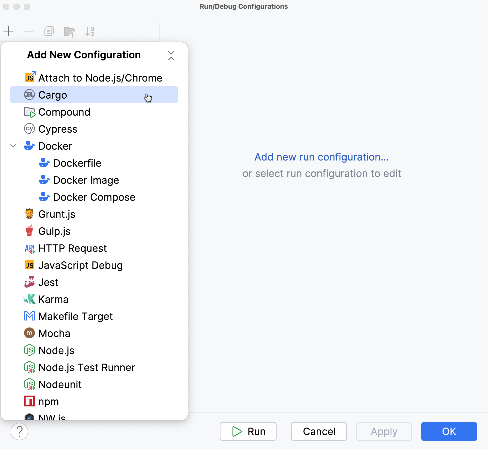
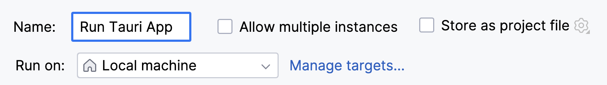
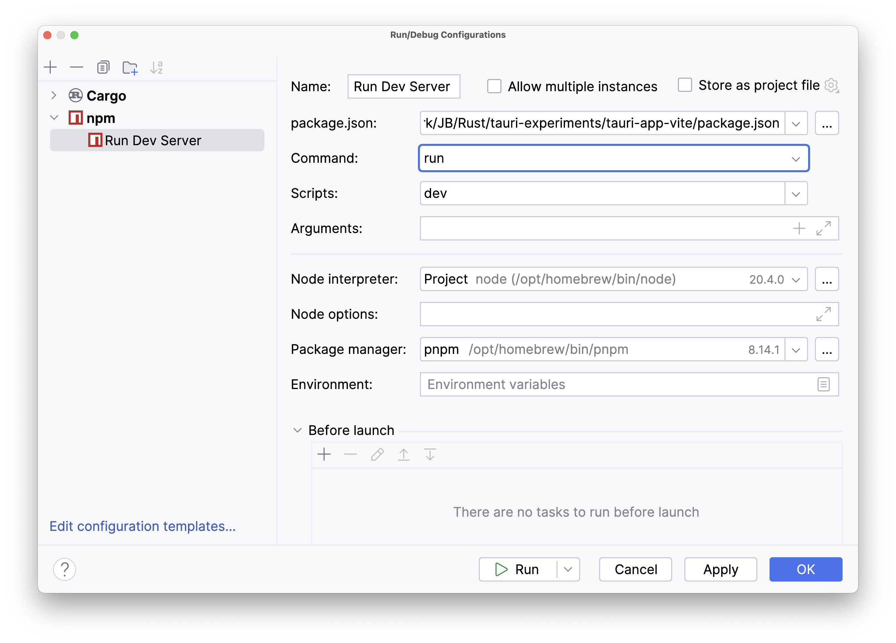
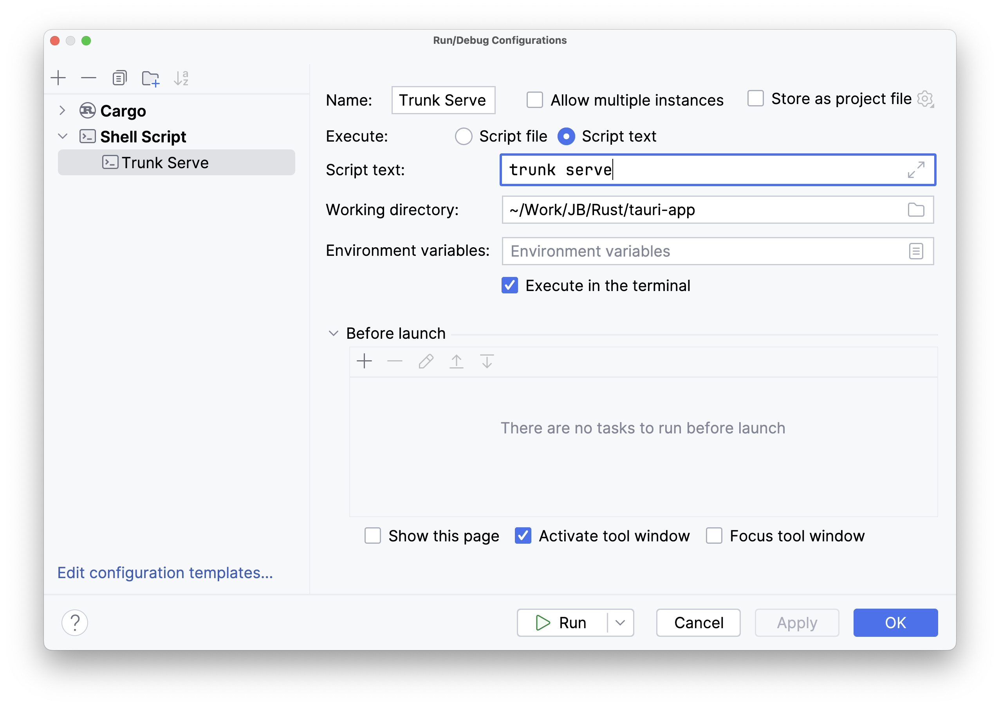
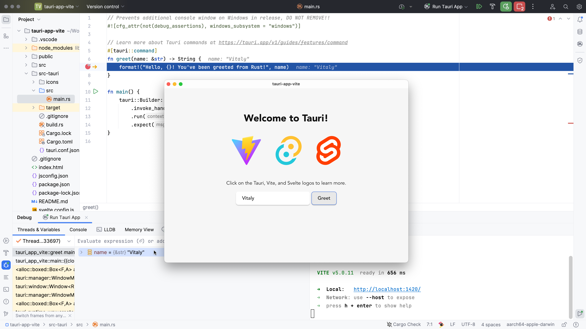

+++
title = "4 在 JetBrains IDE 中调试"
date = 2026-09-25T21:31:08+08:00
weight = 14
type = "docs"
description = ""
isCJKLanguage = true
draft = false
+++

> 原文链接: [https://tauri.app/develop/debug/rustrover/](https://tauri.app/develop/debug/rustrover/)

在本指南中，我们将配置 JetBrains RustRover 来调试 [Tauri 应用的核心进程](../../concept/3-processmodel/#核心进程)。其中大部分内容也适用于 IntelliJ 和 CLion。

## 设置 Cargo 项目

取决于项目使用的前端技术栈，项目目录可能是也可能不是 Cargo 项目。默认情况下，Tauri 把 Rust 项目放在名为 `src-tauri` 的子目录中。只有当 Rust 也用于前端开发时，它才会在根目录创建 Cargo 项目。

如果顶层没有 `Cargo.toml` 文件，你需要手动挂载该项目。打开 Cargo 工具窗口（主菜单 **View | Tool Windows | Cargo**），点击工具栏上的 **+**（**Attach Cargo Project**），然后选择 `src-tauri/Cargo.toml` 文件。

或者，你也可以通过在项目根目录添加以下文件来手动创建顶层 Cargo 工作区：

```toml
members = ["src-tauri"]
```

继续之前，请确保项目已完全加载。如果 Cargo 工具窗口显示了工作区的所有模块和目标，就可以开始了。

## 设置运行配置

你需要设置两个独立的 Run/Debug 配置：

- 一个用于在调试模式下启动 Tauri 应用，
- 另一个用于运行你所选的前端开发服务器。

### Tauri 应用

1. 在主菜单中进入 **Run | Edit Configurations**。
2. 在 **Run/Debug Configurations** 对话框中：

- 要创建新配置，点击工具栏上的 **+** 并选择 **Cargo**。



创建之后，我们需要配置 RustRover，让它指示 Cargo 在不启用任何默认特性的情况下构建应用。这会告诉 Tauri 使用你的开发服务器，而不是从磁盘读取资源。通常这个标志由 Tauri CLI 传入，但由于这里我们完全绕过了 CLI，需要手动传入。


现在我们可以选择把该 Run/Debug 配置改成一个更好记的名字，在这个示例中我们把它叫做 “Run Tauri App”，但你也可以随意命名。



### 开发服务器

上面的配置会直接使用 Cargo 构建 Rust 应用并把调试器附加到它上面。这意味着我们完全绕过了 Tauri CLI，因此 `beforeDevCommand` 和 `beforeBuildCommand` 之类的特性**不会**被执行。我们需要通过手动运行开发服务器来处理这一点。

要创建对应的 Run 配置，你需要确认实际使用的开发服务器。查看 `src-tauri/tauri.conf.json` 文件并找到下面这一行：

```json
    "beforeDevCommand": "pnpm dev"
```

对于 `npm`、`pnpm` 或 `yarn`，你可以使用 **npm** Run 配置，例如：



确保 **Command**、**Scripts** 和 **Package Manager** 字段中的取值正确。

如果你的开发服务器是用于基于 Rust 的 WebAssembly 前端框架的 `trunk`，可以使用通用的 **Shell Script** Run 配置：



## 启动调试会话

要启动调试会话，你需要先运行开发服务器，然后点击 Run Configurations Switcher 旁的 **Debug** 按钮开始调试 Tauri 应用。RustRover 会自动识别项目内任何 Rust 文件中设置的断点，并在命中的第一个断点处停下。



从这时起，你可以查看变量的值、进一步单步执行代码，并详细检查运行时的状况。
