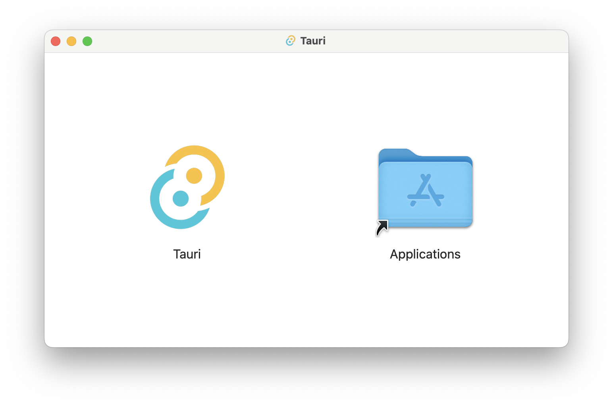

+++
title = "8 DMG"
date = 2026-09-25T21:31:08+08:00
weight = 8
type = "docs"
description = ""
isCJKLanguage = true
draft = false
+++

> 原文链接: [https://tauri.app/distribute/dmg/](https://tauri.app/distribute/dmg/)

DMG（Apple Disk Image）是常见的 macOS 安装包格式，它把你们的 [App Bundle](../10-macosapplicationbundle/) 包装进一个用户友好的安装窗口。

安装窗口包含你的应用图标和“应用程序”文件夹图标，用户需要把应用图标拖到“应用程序”文件夹图标上以完成安装。
这是在 App Store 之外分发 macOS 应用最常见的安装方式。

本指南只涵盖使用 DMG 格式在 App Store 之外分发应用的细节。
关于 macOS 分发选项与配置的更多信息，请参阅 [App Bundle 分发指南](../10-macosapplicationbundle/)。
要把 macOS 应用分发到 App Store，请参阅 [App Store 分发指南](../3-appstore/)。

要为你的应用创建 Apple Disk Image，你可以在 Mac 电脑上使用 Tauri CLI 运行 `tauri build` 命令：

**包管理器**



{}

```sh
npm run tauri build -- --bundles dmg
```

{}

{}

```sh
yarn tauri build --bundles dmg
```

{}

{}

```sh
pnpm tauri build --bundles dmg
```

{}

{}

```sh
deno task tauri build --bundles dmg
```

{}

{}

```sh
bun tauri build --bundles dmg
```

{}

{}

```sh
cargo tauri build --bundles dmg
```

{}





{}

macOS 和 Linux 上的 GUI 应用不会从你的 shell dotfile（`.bashrc`、`.bash_profile`、`.zshrc` 等）继承 `$PATH`。请查看 Tauri 的 [fix-path-env-rs](https://github.com/tauri-apps/fix-path-env-rs) crate 来修复这个问题。

{}

## 窗口背景

你可以用 [`tauri.conf.json > bundle > macOS > dmg > background`](https://tauri.app/reference/config/#background) 配置项为 DMG 安装窗口设置自定义背景图：

```json
{
  "bundle": {
    "macOS": {
      "dmg": {
        "background": "./images/"
      }
    }
  }
}
```

例如，你的 DMG 背景图可以包含一个箭头，提示用户必须把应用图标拖到“应用程序”文件夹。

## 窗口尺寸与位置

默认窗口尺寸是 660x400。如果你需要不同尺寸以适配自定义背景图，请设置 [`tauri.conf.json > bundle > macOS > dmg > windowSize`](https://tauri.app/reference/config/#windowsize)：

```json
{
  "bundle": {
    "macOS": {
      "dmg": {
        "windowSize": {
          "width": 800,
          "height": 600
        }
      }
    }
  }
}
```

此外，你还可以通过 [`tauri.conf.json > bundle > macOS > dmg > windowPosition`](https://tauri.app/reference/config/#windowposition) 设置窗口的初始位置：

```json
{
  "bundle": {
    "macOS": {
      "dmg": {
        "windowPosition": {
          "x": 400,
          "y": 400
        }
      }
    }
  }
}
```

## 图标位置

你可以分别通过 [appPosition](https://tauri.app/reference/config/#appposition) 和 [applicationFolderPosition](https://tauri.app/reference/config/#applicationfolderposition) 配置值修改应用图标与*应用程序文件夹*图标的位置：

```json
{
  "bundle": {
    "macOS": {
      "dmg": {
        "appPosition": {
          "x": 180,
          "y": 220
        },
        "applicationFolderPosition": {
          "x": 480,
          "y": 220
        }
      }
    }
  }
}
```

{}
由于一个已知问题，在 CI/CD 平台上创建 DMG 时图标尺寸与位置不会生效。
更多信息见 [tauri-apps/tauri#1731](https://github.com/tauri-apps/tauri/issues/1731)。
{}
