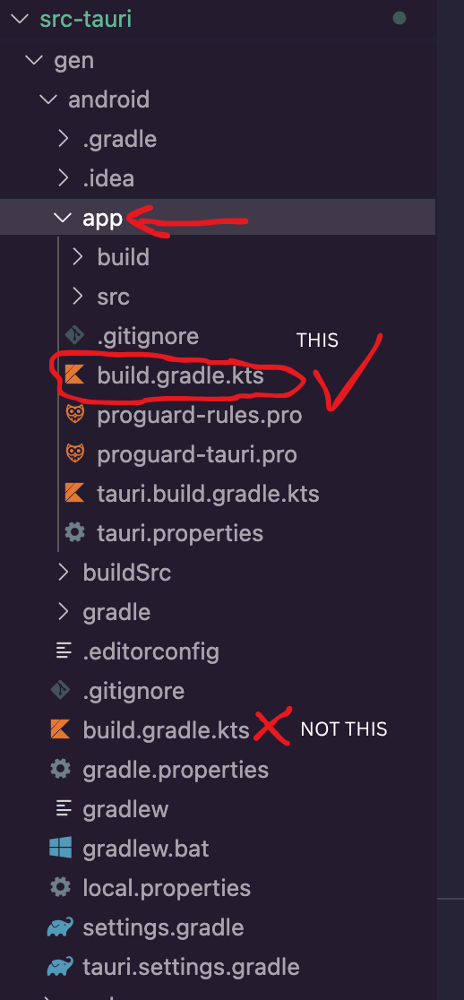

+++
title = "5 Android"
date = 2026-09-25T21:31:08+08:00
weight = 5
type = "docs"
description = ""
isCJKLanguage = true
draft = false
+++

> 原文链接: [https://tauri.app/distribute/sign/android/](https://tauri.app/distribute/sign/android/)

要在 Play Store 上发布，你需要用数字证书为应用签名。

Android App Bundle 和 APK 在上传分发之前必须先签名。

Google 还为在 Play Store 中分发的 Android App Bundle 提供了额外的签名机制。
更多信息请参阅 [Play 应用签名官方文档](https://support.google.com/googleplay/android-developer/answer/9842756?hl=en&visit_id=638549803861403647-3347771264&rd=1)。

## 创建 keystore 与上传密钥

Android 签名需要一个 Java Keystore 文件，可以用官方 `keytool` CLI 生成：

**操作系统**



{}

```
keytool -genkey -v -keystore ~/upload-keystore.jks -keyalg RSA -keysize 2048 -validity 10000 -alias upload
```

{}

{}

```
keytool -genkey -v -keystore $env:USERPROFILE\upload-keystore.jks -storetype JKS -keyalg RSA -keysize 2048 -validity 10000 -alias upload
```

{}



该命令会把 `upload-keystore.jks` 文件存放在你的主目录中。
如果你想把它存到别处，请修改传给 `-keystore` 参数的值。

{}

- `keytool` 命令可能不在你的 PATH 中。
  你可能会在 Android Studio 附带的 JDK 中找到它：

**操作系统**



{}

```sh
/opt/android-studio/jbr/bin/keytool ...args
```

**Android Studio 的目录路径取决于你的 Linux 发行版**

{}

{}

```sh
/Applications/Android\ Studio.app/Contents/jbr/Contents/Home/bin/keytool ...args
```

{}

{}

```sh
C:\\Program Files\\Android\\Android Studio\\jbr\\bin\\keytool.exe ...args
```

{}



{}

{}

请把 `keystore` 文件保密；不要把它提交到公开的源代码管理中！

{}

更多信息请参阅[官方文档](https://developer.android.com/studio/publish/app-signing#generate-key)。

## 配置签名密钥

创建一个名为 `[project]/src-tauri/gen/android/keystore.properties` 的文件，其中包含对你的 keystore 的引用：

```
password=<执行 keytool 时定义的密码>
keyAlias=upload
storeFile=<keystore 文件的位置，例如 /Users/<user name>/upload-keystore.jks 或 C:\\Users\\<user name>\\upload-keystore.jks>
```

{}
请把 `keystore.properties` 文件保密；不要把它提交到公开的源代码管理中。
{}

你通常会在 CI/CD 平台生成这个文件。下面的片段包含一个 GitHub Actions 的示例 job 步骤：

```yml
- name: setup Android signing
  run: |
    cd src-tauri/gen/android
    echo "keyAlias=${{ secrets.ANDROID_KEY_ALIAS }}" > keystore.properties
    echo "password=${{ secrets.ANDROID_KEY_PASSWORD }}" >> keystore.properties
    base64 -d <<< "${{ secrets.ANDROID_KEY_BASE64 }}" > $RUNNER_TEMP/keystore.jks
    echo "storeFile=$RUNNER_TEMP/keystore.jks" >> keystore.properties
```

在这个示例中，keystore 通过 `base64 -i /path/to/keystore.jks` 导出为 base64，并设置为 `ANDROID_KEY_BASE64` secret。

### 配置 Gradle 使用签名密钥

通过编辑 `[project]/src-tauri/gen/android/app/build.gradle.kts` 文件，配置 gradle 在 release 模式下构建应用时使用你的上传密钥。

{}

典型的 Android 项目中有多个不同的 `build.gradle.kts` 文件。如果没有 `buildTypes` 块，那你看的就是错的文件。你需要的那一个位于上一步 keystore 文件相对的 `app/` 目录中。

<details>
  <summary>
    点击这里查看在典型文件树中其位置的截图。
  </summary>



</details>

{}

1. 在文件开头添加所需的 import：

   ```kotlin
   import java.io.FileInputStream
   ```

2. 在 `buildTypes` 块之前添加 `release` 签名配置：

   ```kotlin
   signingConfigs {
       create("release") {
           val keystorePropertiesFile = rootProject.file("keystore.properties")
           val keystoreProperties = Properties()
           if (keystorePropertiesFile.exists()) {
               keystoreProperties.load(FileInputStream(keystorePropertiesFile))
           }

           keyAlias = keystoreProperties["keyAlias"] as String
           keyPassword = keystoreProperties["password"] as String
           storeFile = file(keystoreProperties["storeFile"] as String)
           storePassword = keystoreProperties["password"] as String
       }
   }

   buildTypes {
       ...
   }
   ```

3. 在 `buildTypes` 块的 `release` 配置中使用新的 `release` 签名配置：

   ```kotlin
   buildTypes {
       getByName("release") {
           signingConfig = signingConfigs.getByName("release")
       }
   }
   ```

现在你的应用 release 构建就会自动签名了。
