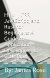

+++
title = "1 学习概述"
date = 2026-09-25T21:31:08+08:00
weight = 1
type = "docs"
description = ""
isCJKLanguage = true
draft = false
+++

> 原文链接: [https://tauri.app/learn/](https://tauri.app/learn/)

学习（Learning）分类旨在围绕某个 Tauri 相关主题提供端到端的学习体验。

这些教程会带你走过一个特定主题，并帮助你应用来自指南和参考文档中的知识。

对于安全相关主题，你可以了解权限系统。你会获得关于如何使用它、扩展它以及编写自己的权限的实践性认识。

- [使用插件权限](../security/1-usingpluginpermissions/)
- [针对不同窗口和平台的能力](../security/2-capabilitiesforwindowsandplatforms/)
- [编写插件权限](../security/3-writingpluginpermissions/)

要了解如何编写自己的启动画面、把 node.js 用作 sidecar，或配置移动端功能，请看：

- [启动画面](../3-splashscreen/)
- [把 Node.js 用作 Sidecar](../2-sidecarnodejs/)
- [移动端多窗口](../7-mobilemultiwindow/)
- [移动端文件关联](../8-mobilefileassociations/)

## 更多资源

本节包含社区创建的、并非托管在本网站上的学习资源。

[有东西想分享？](https://github.com/tauri-apps/awesome-tauri/pulls)：提交 PR 向我们展示你的优秀资源。

### 书籍

**HTML, CSS, JavaScript, and Rust for Beginners: A Guide to Application Development with Tauri**（面向初学者的 HTML、CSS、JavaScript 和 Rust：Tauri 应用开发指南）

作者：James Alexander Rose

- 亚马逊平装版：[在此购买](https://www.amazon.com/dp/B0DR6KZVVW)
- 免费 PDF 版：[下载（PDF 4MB）](https://tauri.app/assets/learn/community/HTML_CSS_JavaScript_and_Rust_for_Beginners_A_Guide_to_Application_Development_with_Tauri.pdf)

### 指南与教程

社区贡献的指南与教程列表请见 [Awesome Tauri](https://github.com/tauri-apps/awesome-tauri)。

#### 视频指南

社区贡献的视频指南列表请见 [Awesome Tauri](https://github.com/tauri-apps/awesome-tauri)。
