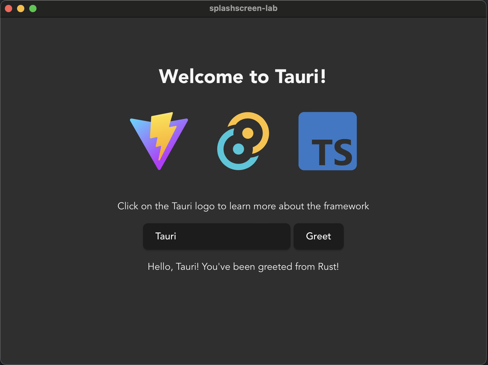
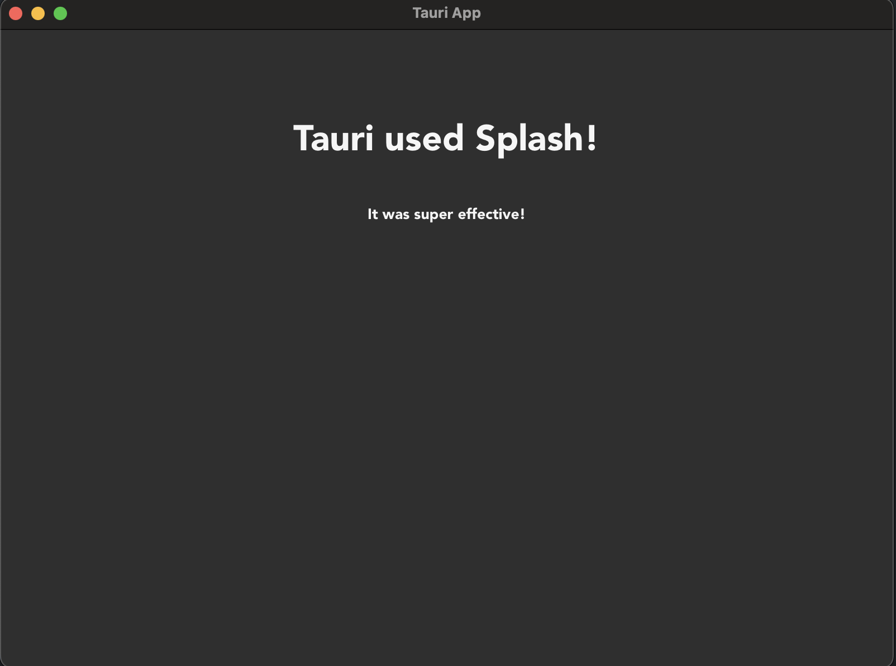

+++
title = "3 启动画面"
date = 2026-09-25T21:31:08+08:00
weight = 3
type = "docs"
description = ""
isCJKLanguage = true
draft = false
+++

> 原文链接: [https://tauri.app/learn/splashscreen/](https://tauri.app/learn/splashscreen/)

在这个实验中，我们将在 Tauri 应用中实现一个基础的启动画面（splashscreen）功能。实现起来相当直接：
启动画面本质上就是创建一个新窗口，在应用执行繁重的初始化相关任务期间显示一些内容，然后在初始化完成后把它关掉。

## 前置条件

{}

如果你不是高级用户，**强烈建议**你使用这里给出的选项和框架。它只是一个实验，做完之后你可以把项目删掉。

- 项目名：`splashscreen-lab`
- 选择前端使用哪种语言：`Typescript / Javascript`
- 选择包管理器：`pnpm`
- 选择 UI 模板：`Vanilla`
- 选择 UI 风格：`Typescript`

{}

## 步骤

### 1. 安装依赖并运行项目

开始开发任何项目之前，先构建并运行初始模板很重要，这能验证你的配置是否按预期工作。

<details>
<summary>查看答案</summary>

```sh
cd splashscreen-lab
# 安装依赖
pnpm install
# 构建并运行应用
pnpm tauri dev
```



</details>

### 2. 在 `tauri.conf.json` 中注册新窗口

添加新窗口最简单的方式是直接把它们加到 `tauri.conf.json` 中。你也可以在启动时动态创建它们，
但为简单起见，我们直接注册它们。请确保有一个标签为 `main` 的窗口被创建为隐藏窗口，以及一个标签为 `splashscreen` 的窗口被创建为直接显示。其它选项都可以保持默认值，或按喜好调整。

<details>
<summary>查看答案</summary>

```json
{
    "windows": [
        {
            "label": "main",
            "visible": false
        },
        {
            "label": "splashscreen",
            "url": "/splashscreen"
        }
    ]
}
```

</details>

### 3. 创建一个新页面来承载启动画面

开始之前你需要有一些内容可以展示。如何开发新页面取决于你选择的框架，大多数框架都有处理页面导航的“路由”概念，它在 Tauri 中应当能正常工作，那样你只需创建一个新的启动画面页面。或者像我们这里要做的，创建一个新的 `splashscreen.html` 文件来承载内容。

这里重要的是你能导航到 `/splashscreen` URL 并看到你想要的启动画面内容。这一步之后试着再运行一次应用！

<details>
<summary>查看答案</summary>

```html
<!doctype html>
<html lang="en">
<head>
    <meta charset="UTF-8" />
    <link rel="stylesheet" href="/src/styles.css" />
    <meta name="viewport" content="width=device-width, initial-scale=1.0" />
    <title>Tauri App</title>
</head>
<body>
    <div class="container">
        <h1>Tauri used Splash!</h1>
        <div class="row">
            <h5>It was super effective!</h5>
        </div>
    </div>
</body>
</html>
```



</details>

### 4. 启动一些初始化任务

由于启动画面通常是为了掩盖繁重的初始化相关任务，让我们假装给应用一些繁重的工作，一部分在前端，一部分在后端。

为了在前端假装繁重初始化，我们将使用一个简单的 `setTimeout` 函数。

在后端假装繁重操作最简单的方式是使用 Tokio crate，它是 Tauri 在后端用来提供异步运行时的 Rust crate。虽然 Tauri 提供了该运行时，但其中有许多工具 Tauri 并未重新导出，因此我们需要把这个 crate 加入项目才能访问它们。这在 Rust 生态中是完全正常的做法。

不要在异步函数中使用 `std::thread::sleep`，它们是在并发环境而非并行环境中协作式运行的。这意味着如果你 sleep 的是线程而不是 Tokio 任务，就会让调度到该线程上的所有任务都无法执行，导致应用冻结。

<details>
<summary>查看答案</summary>

```sh
cd src-tauri
# 添加 Tokio crate
cargo add tokio -F time
# 可选：回到顶层文件夹继续开发
# `tauri dev` 会自动判断在哪里运行
cd ..
```

```javascript
// 这些内容可以粘贴在已有代码下面，不要替换整个文件！！

// 在 TypeScript 中实现 sleep 函数的工具函数
function sleep(seconds: number): Promise<void> {
    return new Promise(resolve => setTimeout(resolve, seconds * 1000));
}

// 初始化函数
async function setup() {
    // 假装执行一些非常繁重的初始化任务
    console.log('Performing really heavy frontend setup task...')
    await sleep(3);
    console.log('Frontend setup task complete!')
    // 把前端任务标记为已完成
    invoke('set_complete', {task: 'frontend'})
}

// 实际上相当于 JavaScript 的 main 函数
window.addEventListener("DOMContentLoaded", () => {
    setup()
});
```

```rust
// 导入我们将要使用的功能
use std::sync::Mutex;
use tauri::async_runtime::spawn;
use tauri::{AppHandle, Manager, State};
use tokio::time::{sleep, Duration};

// 创建一个结构体，用于跟踪初始化相关任务的完成情况
struct SetupState {
    frontend_task: bool,
    backend_task: bool,
}

// 版本 2 中兼容移动端应用的主入口点
#[cfg_attr(mobile, tauri::mobile_entry_point)]
pub fn run() {
    // 不要在 Tauri 启动之前写代码，请写在 setup 钩子里！
    tauri::Builder::default()
        // 注册一个由 Tauri 托管的 `State`
        // 我们需要对它进行写访问，因此用 `Mutex` 包裹
        .manage(Mutex::new(SetupState {
            frontend_task: false,
            backend_task: false,
        }))
        // 添加一个可用于检查的命令
        .invoke_handler(tauri::generate_handler![greet, set_complete])
        // 使用 setup 钩子执行初始化相关任务
        // 它在主循环之前运行，因此此时还没有创建任何窗口
        .setup(|app| {
            // 把初始化作为非阻塞任务启动，这样在它执行期间
            // 窗口仍能被创建和运行
            spawn(setup(app.handle().clone()));
            // 该钩子期望返回 Ok 结果
            Ok(())
        })
        // 运行应用
        .run(tauri::generate_context!())
        .expect("error while running tauri application");
}

#[tauri::command]
fn greet(name: String) -> String {
    format!("Hello {name} from Rust!")
}

// 用于设置某个初始化任务状态的自定义命令
#[tauri::command]
async fn set_complete(
    app: AppHandle,
    state: State<'_, Mutex<SetupState>>,
    task: String,
) -> Result<(), ()> {
    // 锁定 state（不带写权限的锁定）
    let mut state_lock = state.lock().unwrap();
    match task.as_str() {
        "frontend" => state_lock.frontend_task = true,
        "backend" => state_lock.backend_task = true,
        _ => panic!("invalid task completed!"),
    }
    // 检查两个任务是否都已完成
    if state_lock.backend_task && state_lock.frontend_task {
        // 初始化完成，我们可以关闭启动画面
        // 并取消隐藏主窗口！
        let splash_window = app.get_webview_window("splashscreen").unwrap();
        let main_window = app.get_webview_window("main").unwrap();
        splash_window.close().unwrap();
        main_window.show().unwrap();
    }
    Ok(())
}

// 一个执行某些繁重初始化任务的异步函数
async fn setup(app: AppHandle) -> Result<(), ()> {
    // 假装执行某些繁重操作 3 秒钟
    println!("Performing really heavy backend setup task...");
    sleep(Duration::from_secs(3)).await;
    println!("Backend setup task completed!");
    // 把后端任务标记为已完成
    // 只要你自己处理好输入参数，命令就可以像普通函数一样调用
    set_complete(
        app.clone(),
        app.state::<Mutex<SetupState>>(),
        "backend".to_string(),
    )
    .await?;
    Ok(())
}
```

</details>

### 5. 运行应用

现在你应该会看到一个启动画面窗口弹出，前端和后端都会各自执行 3 秒钟的繁重初始化任务，随后启动画面消失，主窗口显示出来！

## 讨论

##### 你应该使用启动画面吗？

一般来说，使用启动画面等于承认失败：你无法让应用加载得足够快，以至于不需要它。事实上，直接进入主窗口、然后在某个角落显示一个小转圈提示用户后台仍有初始化任务在进行，往往会更好。

不过话说回来，使用启动画面也可能是一种风格选择，或者你有某些非常特殊的需求，使得在完成某些任务之前应用无法启动。使用启动画面绝对不算*错误*，只是它往往并非必要，而且可能让用户觉得应用优化得不太好。
