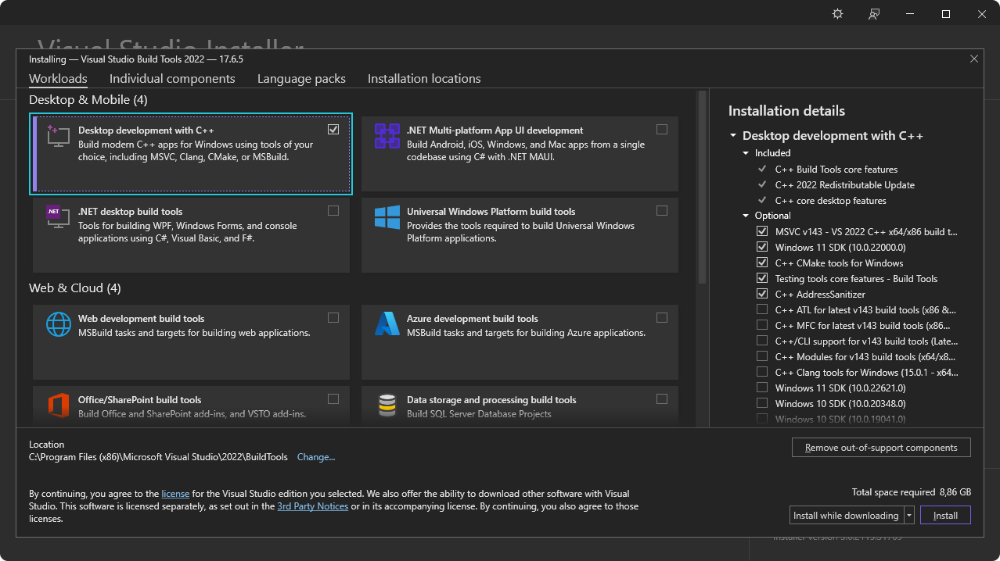

+++
title = "2 前置条件"
date = 2026-09-25T21:31:08+08:00
weight = 2
type = "docs"
description = ""
isCJKLanguage = true
draft = false
+++

> 原文链接: [https://tauri.app/start/prerequisites/](https://tauri.app/start/prerequisites/)

要开始使用 Tauri 构建项目，你需要先安装一些依赖：

1. [系统依赖](#系统依赖)
2. [Rust](#rust)
3. [配置移动端目标](#配置移动端目标)（仅在为移动端开发时需要）

## 系统依赖

请按各自的操作系统点击对应链接开始：

- [Linux](#linux)（具体发行版见下文）
- [macOS Catalina (10.15) 及更高版本](#macos)
- [Windows 7 及更高版本](#windows)

### Linux

在 Linux 上开发 Tauri 需要各种系统依赖。它们可能因发行版而异，下面列出了一些流行的发行版来帮助你完成配置。

**发行版**


{}

```sh
sudo apt install libwebkit2gtk-4.1-dev \
  build-essential \
  curl \
  wget \
  file \
  libxdo-dev \
  libssl-dev \
  libayatana-appindicator3-dev \
  librsvg2-dev
```

{}

{}

```sh
sudo pacman -S --needed \
  webkit2gtk-4.1 \
  base-devel \
  curl \
  wget \
  file \
  openssl \
  appmenu-gtk-module \
  libappindicator-gtk3 \
  librsvg \
  xdotool
```

{}

{}

```sh
sudo dnf install webkit2gtk4.1-devel \
  openssl-devel \
  curl \
  wget \
  file \
  libappindicator-gtk3-devel \
  librsvg2-devel \
  libxdo-devel
sudo dnf group install "c-development"
```

{}

{}

```sh
  net-libs/webkit-gtk:4.1 \
  dev-libs/libayatana-appindicator \
  net-misc/curl \
  net-misc/wget \
  sys-apps/file
```

{}

{}

```sh
  openssl-devel \
  curl \
  wget \
  file \
  libappindicator-gtk3-devel \
  librsvg2-devel \
  libxdo-devel \
  gcc \
  gcc-c++ \
  make
sudo systemctl reboot
```

{}

{}

```sh
sudo zypper in webkit2gtk3-devel \
  libopenssl-devel \
  curl \
  wget \
  file \
  libappindicator3-1 \
  librsvg-devel
sudo zypper in -t pattern devel_basis
```

{}

{}

```sh
  build-base \
  webkit2gtk-4.1-dev \
  curl \
  wget \
  file \
  openssl \
  libayatana-appindicator-dev \
  librsvg
```

{}

{}

{}
Nix/NixOS 的安装说明可在 [NixOS Wiki](https://wiki.nixos.org/wiki/Tauri) 中找到。
{}

{}


> 注意：Alpine Linux 容器默认不包含任何字体。为确保 Tauri 应用中的文本能正确渲染，请至少安装一个字体包（例如 `font-dejavu`）。

> 注意：Alpine 面向 musl C 库，因此 Rust 构建会静态链接若干系统库。如果 `cargo`/`pnpm tauri build` 因链接错误而失败，提示缺少 `pkg-config` 报告为存在的库中的符号，请在上面 `-dev` 包之外再安装对应的 `*-static` 包：
>
> ```sh
> sudo apk add --no-cache \
>   openssl-libs-static \
>   cairo-static \
>   harfbuzz-static \
>   glib-static \
>   wayland-static \
>   zlib-static
> ```
>
> 并非 Tauri 引入的所有依赖在 Alpine 上都有 `*-static` 打包版本；遇到这种情况，你可能需要从源码构建缺失的静态库。

如果你的发行版不在上面的列表中，可以到 [GitHub 上的 Awesome Tauri](https://github.com/tauri-apps/awesome-tauri#guides) 看看是否已有人编写了指南。

下一步：[安装 Rust](#rust)

### macOS

Tauri 使用 [Xcode](https://developer.apple.com/xcode/resources/) 以及各种 macOS 和 iOS 开发依赖。

请从以下位置之一下载并安装 Xcode：

- [Mac App Store](https://apps.apple.com/gb/app/xcode/id497799835?mt=12)
- [Apple 开发者网站](https://developer.apple.com/xcode/resources/)

安装完成后请务必启动 Xcode，以便它完成初始化设置。

<details>
<summary>只为桌面端目标开发？</summary>

如果你只打算开发桌面应用、不以 iOS 为目标，那么可以改为安装 Xcode 命令行工具：

```sh
xcode-select --install
```

</details>

下一步：[安装 Rust](#rust)

### Windows

Tauri 在 Windows 上开发时使用 Microsoft C++ 生成工具以及 Microsoft Edge WebView2。二者都是在 Windows 上开发的必备项。

请按以下步骤安装所需的依赖。

#### Microsoft C++ 生成工具

1. 下载 [Microsoft C++ 生成工具](https://visualstudio.microsoft.com/visual-cpp-build-tools/)安装程序并打开，开始安装。
2. 安装过程中勾选“使用 C++ 的桌面开发”选项。



下一步：[安装 WebView2](#webview2)。

#### WebView2

{}
Windows 10（自 1803 版起）及更高版本的 Windows 已内置 WebView2。如果你在这些版本上开发，可以跳过这一步，直接[安装 Rust](#rust)。
{}

Tauri 在 Windows 上使用 Microsoft Edge WebView2 渲染内容。

请访问 [WebView2 运行时下载页面](https://developer.microsoft.com/en-us/microsoft-edge/webview2/#download-section)安装 WebView2。下载 “Evergreen Bootstrapper” 并安装。

下一步：[检查 VBSCRIPT](#vbscript用于-msi-安装包)

#### VBSCRIPT（用于 MSI 安装包）

{}
仅当你打算构建 MSI 安装包时才需要（`tauri.conf.json` 中的 `"targets": "msi"` 或 `"targets": "all"`）。
{}

在 Windows 上构建 MSI 包需要启用 VBSCRIPT 可选功能。大多数 Windows 安装中该功能默认启用，但某些系统上可能已被禁用。

如果在构建 MSI 包时遇到类似 `failed to run light.exe` 的错误，你可能需要启用 VBSCRIPT 功能：

1. 打开 **设置** → **应用** → **可选功能** → **更多 Windows 功能**
2. 在列表中找到 **VBSCRIPT** 并确认它已勾选
3. 点击 **下一步**，如有提示则重启计算机

**注意：** 目前大多数 Windows 安装都默认启用 VBSCRIPT，但它[正被弃用](https://techcommunity.microsoft.com/blog/windows-itpro-blog/vbscript-deprecation-timelines-and-next-steps/4148301)，未来的 Windows 版本中可能会被禁用。

下一步：[安装 Rust](#rust)

## Rust

Tauri 使用 [Rust](https://www.rust-lang.org) 构建，开发时也需要它。请使用以下方法之一安装 Rust。更多安装方法请见 https://www.rust-lang.org/tools/install 。

**操作系统**


{}

使用以下命令通过 [`rustup`](https://github.com/rust-lang/rustup) 安装：

```sh
curl --proto '=https' --tlsv1.2 https://sh.rustup.rs -sSf | sh
```

{}
我们已经审计过这个 bash 脚本，它确实按声称的那样执行。尽管如此，在盲目地 curl 并执行一个脚本之前，先看一眼它总是明智的。

脚本的纯文本形式见：[rustup.sh](https://sh.rustup.rs/)
{}

{}

{}

访问 https://www.rust-lang.org/tools/install 安装 `rustup`。

或者，你可以在 PowerShell 中使用 `winget` 安装 rustup：

```powershell
winget install --id Rustlang.Rustup
```

{}

为了完整支持 Tauri 以及 [`trunk`](https://trunk-rs.github.io/trunk/) 之类的工具，请确保在安装程序对话框中选择 MSVC Rust 工具链作为 `default host triple`。根据你的系统，它应该是 `x86_64-pc-windows-msvc`、`i686-pc-windows-msvc` 或 `aarch64-pc-windows-msvc`。

如果你已经安装了 Rust，可以运行以下命令来确认安装了正确的工具链：

```powershell
rustup default stable-msvc
```

{}

{}


**请务必重启终端（某些情况下还需重启系统），这些更改才会生效。**

下一步：如果你想为 Android 和 iOS 构建，请[配置移动端目标](#配置移动端目标)；如果你想使用 JavaScript 框架，请[安装 Node](#nodejs)。否则请[创建项目](../3-createaproject/)。

## Node.js

{}
仅当你打算使用 JavaScript 前端框架时。
{}

1. 前往 [Node.js 网站](https://nodejs.org)，下载长期支持（LTS）版本并安装。
2. 运行以下命令检查 Node 是否安装成功：

```sh
# v20.10.0
npm -v
# 10.2.3
```

重启终端很重要，这样才能确保它识别到新的安装。某些情况下，你可能需要重启计算机。

虽然 npm 是 Node.js 的默认包管理器，你也可以使用 pnpm 或 yarn 等其它包管理器。要启用它们，请在终端中运行 `corepack enable`。这一步是可选的，仅当你偏好使用 npm 之外的包管理器时才需要。

下一步：[配置移动端目标](#配置移动端目标)或[创建项目](../3-createaproject/)。

## 配置移动端目标

如果你想把应用定位到 Android 或 iOS，还需要安装一些额外的依赖：

- [Android](#android)
- [iOS](#ios)

### Android

1. 从 Android 开发者网站下载并安装 [Android Studio](https://developer.android.com/studio)
2. 设置 `JAVA_HOME` 环境变量：

**操作系统**


{}

```sh
export JAVA_HOME=/opt/android-studio/jbr
```

{}

{}

```sh
export JAVA_HOME="/Applications/Android Studio.app/Contents/jbr/Contents/Home"
```

{}

{}

```ps
[System.Environment]::SetEnvironmentVariable("JAVA_HOME", "C:\Program Files\Android\Android Studio\jbr", "User")
```

{}


3. 使用 Android Studio 中的 SDK Manager 安装以下内容：

- Android SDK Platform
- Android SDK Platform-Tools
- NDK (Side by side)
- Android SDK Build-Tools
- Android SDK Command-line Tools

在 SDK Manager 中勾选 “Show Package Details” 即可安装旧版本包。仅在必要时安装旧版本，因为它们可能引入兼容性问题或安全风险。

4. 设置 `ANDROID_HOME` 和 `NDK_HOME` 环境变量。


{}

```sh
export ANDROID_HOME="$HOME/Android/Sdk"
export NDK_HOME="$ANDROID_HOME/ndk/$(ls -1 $ANDROID_HOME/ndk)"
```

{}

{}

```sh
export ANDROID_HOME="$HOME/Library/Android/sdk"
export NDK_HOME="$ANDROID_HOME/ndk/$(ls -1 $ANDROID_HOME/ndk)"
```

{}

{}

```ps
[System.Environment]::SetEnvironmentVariable("ANDROID_HOME", "$env:LocalAppData\Android\Sdk", "User")
$VERSION = Get-ChildItem -Name "$env:LocalAppData\Android\Sdk\ndk" | Select-Object -Last 1
[System.Environment]::SetEnvironmentVariable("NDK_HOME", "$env:LocalAppData\Android\Sdk\ndk\$VERSION", "User")
```

{}
大多数应用不会自动刷新环境变量。为了让它们获取这些更改，你可以重启终端和 IDE，或者在当前 PowerShell 会话中执行以下命令刷新：

```ps
[System.Environment]::GetEnvironmentVariables("User").GetEnumerator() | % { Set-Item -Path "Env:\$($_.key)" -Value $_.value }
```

{}

{}


5. 使用 `rustup` 添加 Android 目标：

```sh
rustup target add aarch64-linux-android armv7-linux-androideabi i686-linux-android x86_64-linux-android
```

下一步：[配置 iOS](#ios) 或[创建项目](../3-createaproject/)。

### iOS

{}
iOS 开发需要 Xcode，且仅在 macOS 上可用。请确认你安装的是 Xcode，而不是 Xcode 命令行工具，参见 [macOS 系统依赖部分](#macos)。
{}

1. 在终端中使用 `rustup` 添加 iOS 目标：

```sh
rustup target add aarch64-linux-android armv7-linux-androideabi i686-linux-android x86_64-linux-android
```

2. 安装 [Homebrew](https://brew.sh)：

```sh
rustup target add aarch64-linux-android armv7-linux-androideabi i686-linux-android x86_64-linux-android
```

3. 使用 Homebrew 安装 [Cocoapods](https://cocoapods.org)：

```sh
rustup target add aarch64-linux-android armv7-linux-androideabi i686-linux-android x86_64-linux-android
```

下一步：[创建项目](../3-createaproject/)。

## 故障排除

如果在安装过程中遇到任何问题，请务必查看[故障排除指南](../../develop/10-debug/)，或到 [Tauri Discord](https://discord.com/invite/tauri) 寻求帮助。

现在你已经安装好全部前置条件，可以[创建你的第一个 Tauri 项目](../3-createaproject/)了！
