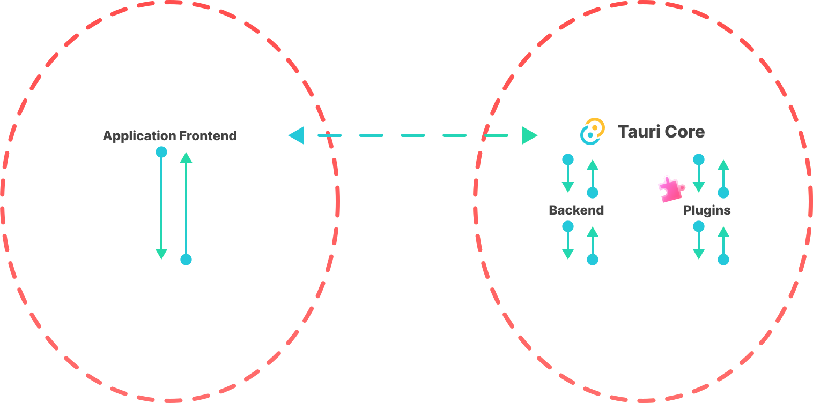
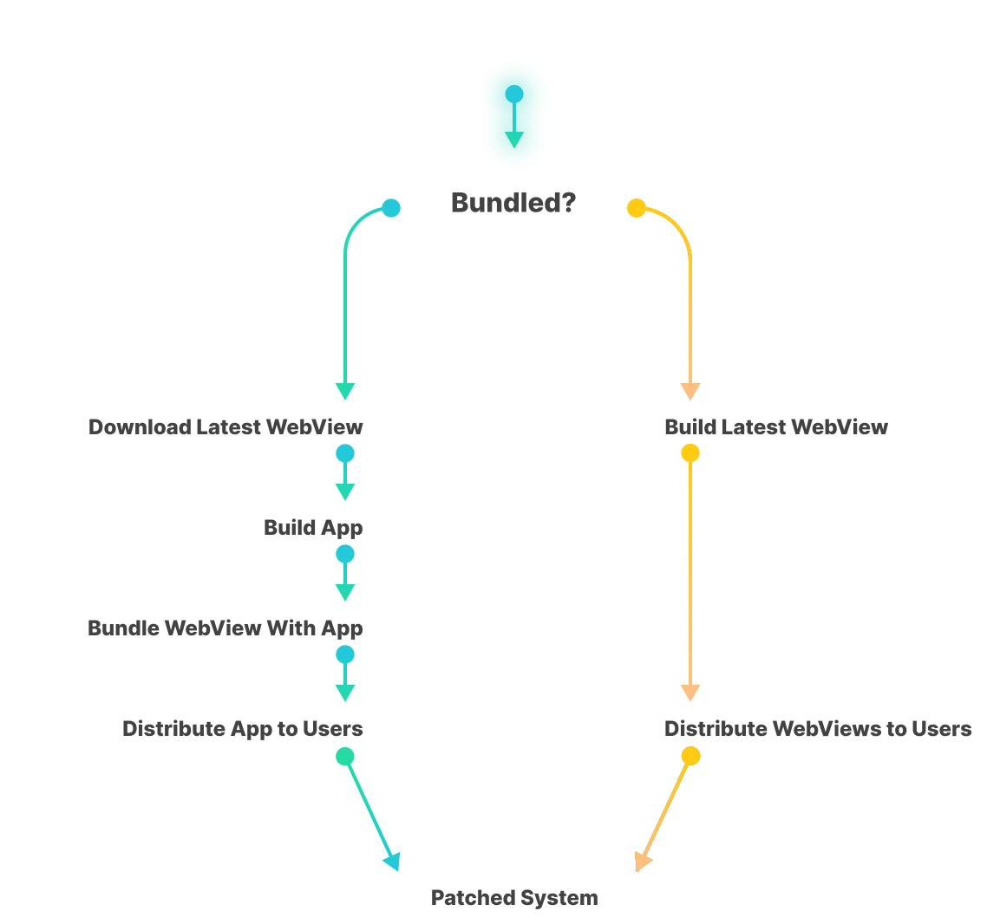

+++
title = "1 安全概述"
date = 2026-09-25T21:31:08+08:00
weight = 1
type = "docs"
description = ""
isCJKLanguage = true
draft = false
+++

> 原文链接: [https://tauri.app/security/](https://tauri.app/security/)

本页旨在解释 Tauri 设计与生态核心中的高层概念和安全特性，它们让你、你的应用以及你的用户默认就更安全。

页面中还包含最佳实践建议、如何向我们报告漏洞，以及详细概念说明的链接。

{}

务必记住：你的 Tauri 应用的安全性，是 Tauri 自身、所有 Rust 与 npm 依赖、你的代码，以及运行最终应用的设备这几方面安全性的总和。
Tauri 团队尽力做好自己那份，安全社区做好他们那份，而你也应当遵循一些重要的最佳实践。

{}

## 信任边界

> 信任边界是计算机科学与安全领域的一个术语，用来描述程序数据或执行过程改变其“信任”级别的边界，
> 或者两个拥有不同能力的主体交换数据或命令的边界。
> [^wikipedia-trust-boundary]

[^wikipedia-trust-boundary]: [https://en.wikipedia.org/wiki/Trust_boundary](https://en.wikipedia.org/wiki/Trust_boundary)。

Tauri 的安全模型区分了为应用核心编写的 Rust 代码，以及用系统 WebView 能理解的任意框架或语言编写的前端代码。

检查并严格定义跨边界传递的所有数据，对防止信任边界被破坏非常重要。
如果数据在跨越这些边界时没有访问控制，攻击者就很容易提权并滥用权限。

[IPC 层](../../concept/inter-process-communication/1-overview/)是这两个信任群体之间通信的桥梁，确保边界不被破坏。

插件或应用核心执行的任何代码都拥有对全部可用系统资源的完整访问权限，不受限制。

在 WebView 中执行的任何代码，只能通过定义良好的 IPC 层访问被暴露的系统资源。对核心应用命令的访问由应用配置中定义的能力（capabilities）进行配置和限制。各个命令的实现还会执行能力配置中定义的可选细粒度访问级别。

要进一步了解各个组件以及边界的具体执行方式：

- [权限](../2-permissions/)
- [作用域](../3-scope/)
- [能力](../4-capabilities/)
- [运行时权限](../11-runtimeauthority/)

Tauri 允许开发者选择自己的前端技术栈和框架。
这意味着我们无法为每一种前端技术栈提供加固指南，但 Tauri 提供了通用特性来控制并收敛攻击面。

- [内容安全策略（CSP）](../6-csp/)
- [Isolation 模式](../../concept/inter-process-communication/3-isolationpattern/)

## （不）打包 WebView

Tauri 的做法是依赖操作系统的 WebView，而不把 WebView 打包进应用二进制文件。

这样做有许多原因，但从安全角度看最重要的原因是：WebView 发布安全补丁版本后推送到应用最终用户手上的平均时间。

我们观察到，平均而言，WebView 包维护者和操作系统包维护者打补丁并推送已修复安全问题的 WebView 版本，明显快于把 WebView 直接打包进自己应用的开发者。

这一观察也有例外，理论上两条路径可以在相近的时间范围内完成，但那样每个应用都需要更庞大的基础设施开销。

打包也有其在 Tauri 应用开发体验上的缺点。我们并不认为它本身不安全，但当前的设计是一种取舍，能显著减少现实中已知的漏洞。

## 生态

Tauri 组织提供并维护的不只是 Tauri 这一个仓库。为确保我们提供一个合理安全的多平台应用框架，我们特意多做了不少工作。

要进一步了解我们如何保障开发流程的安全、你可以借鉴和实现什么、你的应用可能面临哪些已知威胁，以及我们计划在未来改进或加固什么，可以查看以下文档：

- [生态安全](../9-ecosystem/)
- [应用生命周期威胁](../10-lifecycle/)
- [未来工作](../12-future/)

## 协同披露

如果你认为 Tauri 或我们组织中的其它仓库存在安全隐患或问题，**请不要公开发表你的发现**。
请直接联系我们的安全团队。

首选的披露方式是在受影响的仓库上使用 [GitHub 漏洞披露](https://docs.github.com/en/code-security/security-advisories/guidance-on-reporting-and-writing-information-about-vulnerabilities/privately-reporting-a-security-vulnerability#privately-reporting-a-security-vulnerability)。
我们的大多数仓库都启用了该功能；如有疑问，请通过 [Tauri 仓库](https://github.com/tauri-apps/tauri/security/advisories/new)提交。

或者，你也可以通过电子邮件联系我们：[security@tauri.app](mailto:security@tauri.app)。

尽管我们目前没有安全赏金预算，但在某些情况下，我们会考虑用有限的资源奖励协同披露。
