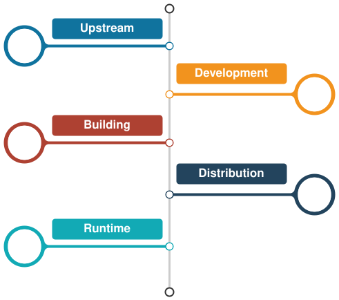

+++
title = "10 应用生命周期威胁"
date = 2026-09-25T21:31:08+08:00
weight = 10
type = "docs"
description = ""
isCJKLanguage = true
draft = false
+++

> 原文链接: [https://tauri.app/security/lifecycle/](https://tauri.app/security/lifecycle/)

Tauri 应用由许多部分构成，它们在应用生命周期的不同阶段发挥作用。
这里我们描述一些经典威胁，以及你**应当**如何应对。

所有这些不同的步骤将在下面各节中说明。

{}
应用生命周期中最薄弱的一环基本上决定了你的安全性。每个步骤都可能破坏其后所有步骤的前提与完整性，因此始终看清全局非常重要。
{}

## 上游威胁

Tauri 是你项目的直接依赖，我们对提交、评审、PR 和发布保持严格的作者控制。
我们尽力保持依赖为最新，并采取措施更新，或者 fork 并修复。其它项目可能维护得没那么好，甚至从未被审计过。

集成它们时请考虑其健康状况，否则你可能在浑然不觉中背上了架构债务。

### 保持应用为最新

当你把应用发布到外部时，同时也发布了包含 Tauri 的打包产物。影响 Tauri 的漏洞可能影响你应用的安全性。把 Tauri 更新到最新版本，就能确保关键漏洞已经修补，不会在你的应用中被利用。同时也要确保编译器（`rustc`）和转译器（`nodejs`）保持最新，因为常有安全问题被修复。你的开发系统整体上也是如此。

### 评估你的依赖

虽然 npm 和 Crates.io 提供了许多方便的包，但选择值得信赖的第三方库是你的责任——或者用 Rust 重写它们。如果你确实使用了受已知漏洞影响或已无人维护的过时库，你的应用安全与安稳睡眠都可能受到威胁。

请使用 [`npm audit`](https://docs.npmjs.com/cli/v10/commands/npm-audit) 和 [`cargo audit`](https://crates.io/crates/cargo-audit) 之类的工具来自动化这一过程，并借助安全社区的重要工作。

Rust 生态近期的趋势，例如 [`cargo-vet`](https://github.com/mozilla/cargo-vet) 或 [`cargo crev`](https://github.com/crev-dev/cargo-crev)，可以帮助进一步降低供应链攻击的可能性。想弄清你到底站在谁的肩膀上，可以使用 [`cargo supply chain`](https://github.com/rust-secure-code/cargo-supply-chain) 工具。

我们强烈推荐的一个做法是：关键依赖只从 git 获取，最好用哈希版本，其次是用具名标签。Rust 和 Node 生态都是如此。

## 开发期威胁

我们假设你作为开发者会关心自己的开发环境。确保你的操作系统、构建工具链和相关依赖保持最新且有合理的安全防护，是你自己的责任。

我们所有人面临的一个真实风险是所谓的“供应链攻击”，通常被认为是对项目直接依赖的攻击。然而，现实中有一类不断增长的攻击直接针对开发机器，你最好正面应对它。

### 开发服务器

Tauri 应用的前端可以用多种 Web 框架开发。这些框架通常各自带有开发服务器，会通过一个开放的端口把前端资源暴露给本地系统或网络。这让前端可以在 WebView 或浏览器中热重载和调试。

实践中，这种连接默认往往既不加密也不做身份认证。内置的 Tauri 开发服务器也是如此，它会把你的前端和资源暴露到局域网。此外，这还允许攻击者把他们的前端代码推送到与攻击者同一网络中的开发设备上。取决于暴露了哪些功能，最坏情况下可能导致设备被攻破。

你只应在可以安全暴露开发设备的可信网络中开发。如果做不到，你**必须**确保开发服务器与开发设备之间的连接使用**双向**认证和加密（例如 mTLS）。

{}
内置的 Tauri 开发服务器目前不支持双向认证和传输加密，不应在不受信任的网络中使用。
{}

### 加固开发机器

加固开发系统取决于多种因素和你的个人威胁模型，但我们建议遵循一些通用建议：

- 绝不要用管理员账号做编码之类的日常工作
- 绝不要在开发机器上使用生产环境的密钥
- 防止密钥被提交到源代码版本控制中
- 使用安全硬件令牌等来降低系统被攻破的影响
- 保持系统最新
- 把安装的应用保持在最少数量

更实用的一套流程可以在这份[优秀的安全加固合集](https://github.com/decalage2/awesome-security-hardening)中找到。

你当然可以虚拟化开发环境来阻挡攻击者，但这无法防护针对你项目（而不只是机器）的攻击。

### 确保源代码控制的认证与授权

如果你和大多数开发者一样，那么在开发过程中使用源代码版本控制工具和服务提供商是必不可少的一步。

为确保源代码不会被未授权方修改，理解并正确配置源代码版本控制系统的访问控制非常重要。

此外，考虑要求所有（常规）贡献者对其提交签名，以避免恶意提交被归咎于未被攻破或并无恶意的贡献者。

## 构建期威胁

现代组织使用 CI/CD 来制造二进制产物。

你必须能够完全信任这些远程（且由第三方拥有）的系统，因为它们能访问源代码、密钥，并且能够修改构建产物，而你无法可验证地证明产出的二进制文件与你本地的代码一致。这意味着你要么信任信誉良好的提供商，要么把这些系统托管在自己可控的硬件上。

在 Tauri，我们提供了一个用于多平台构建的 GitHub Workflow。如果你自己搭建 CI/CD 并依赖第三方工具，请警惕那些你没有明确锁定版本的 action。

你应当为要发布的平台签署二进制文件。虽然这可能比较复杂且搭建成本不低，但最终用户期望你的应用可以可验证地证明来自你。

如果密码学密钥妥善存放在硬件令牌上，被攻破的构建系统无法泄露相关签名密钥，但仍可能用它们来签署恶意发布版本。

### 可复现构建

为了对抗构建期的后门注入，你需要构建是可复现的，这样你才能验证在本地或在另一个独立提供商处构建时，产物完全一致。

第一个问题是，Rust 默认并不能完全**可靠**地产生可复现构建。它在理论上支持这一点，但仍存在 bug，而且最近在一个版本上出现了问题。

你可以在 Rust 项目的[公开 bug 跟踪器](https://github.com/rust-lang/rust/labels/A-reproducibility)中跟踪当前状态。

接下来你会遇到的另一个问题是，许多常见的前端打包工具同样不会产生可复现的输出，因此打包后的资源也可能破坏可复现构建。

这意味着你无法默认完全依赖可复现构建，遗憾的是你必须完全信任你的构建系统。

## 分发威胁

我们已经尽力让应用的热更新分发尽可能直接和安全。
然而，一旦你失去对清单服务器、构建服务器或二进制托管服务的控制，一切就都无从谈起了。

如果你自己搭建系统，请咨询专业的 OPS 架构师并正确地构建它。

如果你在为 Tauri 应用寻找另一个可信的分发方案，我们的合作伙伴 CrabNebula 提供了相关服务：[https://crabnebula.dev/cloud](https://crabnebula.dev/cloud)

## 运行时威胁

我们假设 webview 是不安全的，这使 Tauri 在加载不受信任的用户态内容时，针对 webview 访问系统 API 实现了多项防护。

使用[内容安全策略](../6-csp/)可以锁定 Webview 能够发起的通信类型。
此外，[能力](../4-capabilities/)可以阻止不受信任的内容或脚本访问 Webview 内的 API。

我们还建议建立一种简单、安全的方式来报告漏洞，类似[我们的流程](../1-overview/#协同披露)。
