+++
title = "11 运行时权限"
date = 2026-09-25T21:31:08+08:00
weight = 11
type = "docs"
description = ""
isCJKLanguage = true
draft = false
+++

> 原文链接: [https://tauri.app/security/runtime-authority/](https://tauri.app/security/runtime-authority/)

运行时权限（runtime authority）是 Tauri 核心的一部分。
它在运行时持有所有权限、能力和作用域，以强制决定哪个窗口可以访问哪个命令，并把作用域传递给命令。

每当从 webview 调用一个 Tauri 命令时，运行时权限会接收该 invoke 请求，确认该来源确实被允许使用所请求的命令，检查该来源是否属于某些能力，以及命令是否定义了作用域；如果适用，就把作用域注入该 invoke 请求，然后再把它传给对应的 Tauri 命令。

如果该来源不被允许调用该命令，运行时权限会拒绝该请求，对应的 Tauri 命令永远不会被调用。

