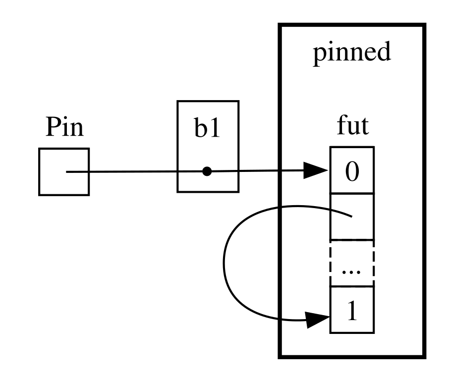

+++
title = "17.5 深入了解异步相关 Trait"
date = 2026-08-05T08:44:00+08:00
weight = 84
type = "docs"
description = "深入 Future、Pin、Unpin 与 Stream trait，理解轮询与自引用"
isCJKLanguage = true
draft = false
rust_version = "1.97.1"

+++

> 译文 · 基于 [The Rust Programming Language](https://doc.rust-lang.org/stable/book/)（rustc 1.97.1）

# 深入了解异步相关 Trait {#trait}


> 原文链接: [https://doc.rust-lang.org/stable/book/ch17-05-traits-for-async.html](https://doc.rust-lang.org/stable/book/ch17-05-traits-for-async.html)


## 更仔细地看看异步相关 Trait

　　整章中我们以各种方式使用了 `Future`、`Stream` 与 `StreamExt` trait。不过到目前为止，我们避免深入它们如何工作或如何拼在一起的细节——这在日常 Rust 工作中多数时候没问题。但有时你会遇到需要再多了解这些 trait 一些细节的情形，连同 `Pin` 类型与 `Unpin` trait。本节我们会挖到刚好够用的深度以应对那些场景，而把*真正*深入的内容留给其他文档。

### `Future` Trait

　　我们先更仔细地看看 `Future` trait 如何工作。Rust 这样定义它：

```rust
use std::pin::Pin;
use std::task::{Context, Poll};

pub trait Future {
    type Output;

    fn poll(self: Pin<&mut Self>, cx: &mut Context<'_>) -> Poll<Self::Output>;
}
```

　　这个 trait 定义包含一堆新类型，也有一些我们尚未见过的语法，因此我们逐部分走一遍定义。

　　首先，`Future` 的关联类型 `Output` 说明 Future 最终解析为什么。这类似于 `Iterator` trait 的关联类型 `Item`。其次，`Future` 有 `poll` 方法，其 `self` 参数是特殊的 `Pin` 引用，还有对 `Context` 类型的可变引用，并返回 `Poll<Self::Output>`。我们稍后会更多讨论 `Pin` 与 `Context`。现在先关注该方法返回的 `Poll` 类型：

```rust
pub enum Poll<T> {
    Ready(T),
    Pending,
}
```

　　这个 `Poll` 类型类似 `Option`。它有一个带值的变体 `Ready(T)`，以及一个不带值的变体 `Pending`。不过 `Poll` 的含义与 `Option` 相当不同！`Pending` 变体表示 Future 仍有工作要做，因此调用方稍后需要再检查。`Ready` 变体表示该 `Future` 已完成其工作，且 `T` 值可用。

> 注意：很少需要直接调用 `poll`，但若需要，请记住：对大多数 Future，在 Future 返回 `Ready` 之后，调用方不应再次调用 `poll`。许多 Future 在就绪后再被轮询会 panic。可以安全再次轮询的 Future 会在文档中明确说明。这与 `Iterator::next` 的行为类似。

　　当你看到使用 `await` 的代码时，Rust 在编译时会将其转换为调用 `poll` 的代码。若回头看示例 17-4——我们在单个 URL 解析后打印页面标题——Rust 会把它编译成某种（虽不完全相同但）类似下面的东西：

```rust
match page_title(url).poll() {
    Ready(page_title) => match page_title {
        Some(title) => println!("The title for {url} was {title}"),
        None => println!("{url} had no title"),
    }
    Pending => {
        // But what goes here?
    }
}
```

　　当 Future 仍为 `Pending` 时我们该做什么？我们需要某种方式一再尝试，直到 Future 最终就绪。换句话说，我们需要一个循环：

```rust
let mut page_title_fut = page_title(url);
loop {
    match page_title_fut.poll() {
        Ready(value) => match page_title {
            Some(title) => println!("The title for {url} was {title}"),
            None => println!("{url} had no title"),
        }
        Pending => {
            // continue
        }
    }
}
```

　　不过若 Rust 把它精确编译成那样的代码，每个 `await` 都会变成阻塞——这正好与我们的目标相反！相反，Rust 确保该循环可以把控制权交给某个东西：它可以暂停对这个 Future 的工作去处理其他 Future，稍后再回来检查这个。正如我们所见，那个东西就是异步运行时，而这种调度与协调工作正是其主要职责之一。

　　在[「用消息传递在两个任务间发送数据」][message-passing]一节中，我们描述了等待 `rx.recv`。`recv` 调用返回一个 Future，等待该 Future 就会轮询它。我们指出，运行时会暂停该 Future，直到它以 `Some(message)` 就绪，或在通道关闭时以 `None` 就绪。有了对 `Future` trait、尤其是 `Future::poll` 更深入的理解，我们可以看清这如何工作。当 Future 返回 `Poll::Pending` 时，运行时知道它尚未就绪。相反，当 `poll` 返回 `Poll::Ready(Some(message))` 或 `Poll::Ready(None)` 时，运行时知道 Future *已*就绪并推进它。

　　运行时具体如何做到这一点超出了本书范围，但关键是看清 Future 的基本机制：运行时*轮询*它所负责的每个 Future，在尚未就绪时把 Future 放回休眠。

### `Pin` 类型与 `Unpin` Trait

　　回到示例 17-13，我们用 `trpl::join!` 宏等待了三个 Future。不过，常见情况是有一个向量这类集合，其中包含直到运行时才知道数量的若干 Future。我们把示例 17-13 改成示例 17-23 中的代码：把三个 Future 放进向量，并改为调用 `trpl::join_all` 函数——目前还不能编译。

**文件名：`src/main.rs`**
```rust
        let tx_fut = async move {
            // --snip--

        };

        let futures: Vec<Box<dyn Future<Output = ()>>> =
            vec![Box::new(tx1_fut), Box::new(rx_fut), Box::new(tx_fut)];

        trpl::join_all(futures).await;
```

**示例 17-23：等待集合中的 Future**

　　我们把每个 Future 放进 `Box` 做成*trait 对象*，就像第 12 章「从 `run` 返回错误」一节中那样。（我们将在第 18 章详细介绍 trait 对象。）使用 trait 对象让我们可以把这些类型产生的各个匿名 Future 当作同一类型对待，因为它们都实现了 `Future` trait。

　　这或许令人意外。毕竟，这些异步块都不返回任何东西，因此每一个都产生 `Future<Output = ()>`。不过要记住 `Future` 是一个 trait，而且编译器会为每个异步块创建唯一的枚举，即便它们有相同的输出类型。正如你不能把两个不同的手写结构体放进同一个 `Vec`，你也不能混用编译器生成的枚举。

　　然后我们把 Future 集合传给 `trpl::join_all` 函数并等待结果。不过这无法编译；下面是错误信息中相关的部分。


```text
error[E0277]: `dyn Future<Output = ()>` cannot be unpinned
  --> src/main.rs:48:33
   |
48 |         trpl::join_all(futures).await;
   |                                 ^^^^^ the trait `Unpin` is not implemented for `dyn Future<Output = ()>`
   |
   = note: consider using the `pin!` macro
           consider using `Box::pin` if you need to access the pinned value outside of the current scope
   = note: required for `Box<dyn Future<Output = ()>>` to implement `Future`
note: required by a bound in `futures_util::future::join_all::JoinAll`
  --> file:///home/.cargo/registry/src/index.crates.io-1949cf8c6b5b557f/futures-util-0.3.30/src/future/join_all.rs:29:8
   |
27 | pub struct JoinAll<F>
   |            ------- required by a bound in this struct
28 | where
29 |     F: Future,
   |        ^^^^^^ required by this bound in `JoinAll`
```

　　这条错误信息中的说明告诉我们应使用 `pin!` 宏来*固定*（pin）这些值，意思是把它们放进 `Pin` 类型中，该类型保证值不会在内存中移动。错误信息说需要固定，因为 `dyn Future<Output = ()>` 需要实现 `Unpin` trait，而它目前没有。

　　`trpl::join_all` 函数返回名为 `JoinAll` 的结构体。该结构体对类型 `F` 泛型，且 `F` 被约束为实现 `Future` trait。用 `await` 直接等待 Future 时会隐式固定该 Future。这就是为何我们不必在每个想等待 Future 的地方都使用 `pin!`。

　　不过这里我们并不是直接等待一个 Future。相反，我们通过把 Future 集合传给 `join_all` 函数来构造一个新的 Future——`JoinAll`。`join_all` 的签名要求集合中各项的类型都实现 `Future` trait，而 `Box<T>` 只有在它所包装的 `T` 是实现了 `Unpin` trait 的 Future 时才实现 `Future`。

　　要消化的内容很多！要真正理解它，让我们再深入一点 `Future` trait 的实际工作方式，尤其是围绕固定。再看一遍 `Future` trait 的定义：

```rust
use std::pin::Pin;
use std::task::{Context, Poll};

pub trait Future {
    type Output;

    // Required method
    fn poll(self: Pin<&mut Self>, cx: &mut Context<'_>) -> Poll<Self::Output>;
}
```

　　`cx` 参数及其 `Context` 类型，是运行时如何在保持惰性的同时知道何时检查任意给定 Future 的关键。同样，其工作细节超出本章范围，你通常只有在编写自定义 `Future` 实现时才需要考虑这些。我们改为聚焦 `self` 的类型，因为这是我们第一次看到 `self` 带有类型注解的方法。对 `self` 的类型注解与对其他函数参数的类型注解类似，但有两个关键差异：

- 它告诉 Rust 要调用该方法时 `self` 必须是什么类型。
- 它不能是任意类型，只能是定义该方法的类型本身、该类型的引用或智能指针，或是包装了这类引用的 `Pin`。

　　我们将在[第 18 章][ch-18]看到更多关于这一语法的内容。目前只要知道：若要轮询一个 Future 以检查它是 `Pending` 还是 `Ready(Output)`，我们就需要一个包在 `Pin` 中的对该类型的可变引用。

　　`Pin` 是对类似指针的类型（如 `&`、`&mut`、`Box` 与 `Rc`）的包装。（严格说，`Pin` 适用于实现了 `Deref` 或 `DerefMut` trait 的类型，但这实际上等价于只与引用和智能指针打交道。）`Pin` 本身不是指针，也不像 `Rc` 与 `Arc` 那样自带引用计数之类的行为；它纯粹是编译器用来强制约束指针用法的工具。

　　回想起 `await` 是用对 `poll` 的调用实现的，这开始解释我们先前看到的错误信息，但那是就 `Unpin` 而言，而不是 `Pin`。那么 `Pin` 与 `Unpin` 究竟如何相关，以及为何 `Future` 需要 `self` 处于 `Pin` 类型中才能调用 `poll`？

　　记住本章前面说过：Future 中的一系列 await 点会被编译成状态机，编译器确保该状态机遵循 Rust 围绕安全性的全部正常规则，包括借用与所有权。为使这能工作，Rust 会查看从一个 await 点到下一个 await 点或异步块结束之间需要哪些数据。然后它在编译出的状态机中创建对应的变体。每个变体都会获得对该段源代码中将要使用的数据所需的访问权，无论是取得该数据的所有权，还是获得对其的可变或不可变引用。

　　到目前为止都很好：若我们在给定异步块中把所有权或引用搞错了，借用检查器会告诉我们。但当我们想搬动与该块对应的 Future——比如把它移入 `Vec` 再传给 `join_all`——事情就更棘手了。

　　当我们移动一个 Future——无论是把它推进数据结构以便作为迭代器配合 `join_all` 使用，还是从函数返回它——实际上意味着移动 Rust 为我们创建的状态机。与 Rust 中大多数其他类型不同，Rust 为异步块创建的 Future 可能最终在任意给定变体的字段中带有对自身的引用，如图 17-4 的简化示意所示。

<figure>


<figcaption>图 17-4：自引用数据类型</figcaption>

</figure>

　　不过默认情况下，任何带有对自身引用的对象移动起来都不安全，因为引用总是指向它们所引用之物的实际内存地址（见图 17-5）。若你移动数据结构本身，那些内部引用会仍指向旧位置。然而该内存位置现在已无效。一方面，你对数据结构做改动时它的值不会被更新。另一方面——更重要的是——计算机现在可以自由把那块内存挪作他用！你之后可能读到完全无关的数据。

<figure>


<figcaption>图 17-5：移动自引用数据类型的不安全结果</figcaption>

</figure>

　　理论上，Rust 编译器可以在对象每次被移动时尝试更新每一处引用，但这可能增加大量性能开销，尤其是当需要更新整张引用网时。若我们能改为确保所讨论的数据结构*不在内存中移动*，就不必更新任何引用。这正是 Rust 借用检查器的用途：在安全代码中，它阻止你移动任何仍有活跃引用指向它的项。

　　`Pin` 建立在此之上，给出我们恰好需要的保证。当我们通过把指向某值的指针包在 `Pin` 中来*固定*该值时，它就不能再移动。因此，若你有 `Pin<Box<SomeType>>`，你实际固定的是 `SomeType` 值，*而不是* `Box` 指针。图 17-6 说明了这一过程。

<figure>



<figcaption>图 17-6：固定一个指向自引用 Future 类型的 `Box`</figcaption>

</figure>

　　实际上，`Box` 指针仍可自由移动。记住：我们关心的是确保最终被引用的数据保持在原地。若指针四处移动，*但它指向的数据*仍在同一位置，如图 17-7，就没有潜在问题。（作为独立练习，查看这些类型以及 `std::pin` 模块的文档，试着弄清如何用包装 `Box` 的 `Pin` 做到这一点。）关键是自引用类型本身不能移动，因为它仍被固定。

<figure>


<figcaption>图 17-7：移动一个指向自引用 Future 类型的 `Box`</figcaption>

</figure>

　　不过，大多数类型即使碰巧位于 `Pin` 指针之后，移动起来也完全安全。我们只有在项有内部引用时才需要考虑固定。像数字与布尔值这样的原始值显然没有任何内部引用，因而是安全的。你在 Rust 中通常打交道的大多数类型也是如此。例如，你可以移动 `Vec` 而不必担心。就我们目前所见，若你有 `Pin<Vec<String>>`，即便在没有其他引用指向它时 `Vec<String>` 移动总是安全的，你也必须通过 `Pin` 提供的安全但受限的 API 做一切事。我们需要一种方式告诉编译器：在这类情况下移动值是安全的——`Unpin` trait 正是为此而设。

　　`Unpin` 是一个标记 trait，类似于我们在第 16 章见过的 `Send` 与 `Sync` trait，因而本身没有任何功能。标记 trait 的存在只是为了告诉编译器：在特定上下文中使用实现了给定 trait 的类型是安全的。`Unpin` 通知编译器：给定类型*不必*维持关于所讨论的值是否可安全移动的任何保证。


　　正如 `Send` 与 `Sync`，编译器会在能证明安全时为所有类型自动实现 `Unpin`。一个特例——同样类似 `Send` 与 `Sync`——是类型*没有*实现 `Unpin`。其记法是 <code>impl !Unpin for <em>SomeType</em></code>，其中 <code><em>SomeType</em></code> 是在把指向该类型的指针用于 `Pin` 时*需要*维持那些保证才安全的类型名。

　　换句话说，关于 `Pin` 与 `Unpin` 的关系有两点要记住。第一，`Unpin` 是“正常”情形，`!Unpin` 是特例。第二，类型实现 `Unpin` 还是 `!Unpin` *只有*在你使用指向该类型的固定指针（如 <code>Pin<&mut <em>SomeType</em>></code>）时才重要。

　　说得具体些，想想 `String`：它有长度以及构成它的 Unicode 字符。我们可以把 `String` 包在 `Pin` 中，如图 17-8。不过 `String` 会自动实现 `Unpin`，就像 Rust 中大多数其他类型一样。

<figure>


<figcaption>图 17-8：固定一个 `String`；虚线表示该 `String` 实现了 `Unpin` trait，因而并未被钉住</figcaption>

</figure>

　　结果是，我们可以做一些若 `String` 实现的是 `!Unpin` 就会非法的事，例如在内存中完全相同的位置用另一个字符串替换它，如图 17-9。这并不违反 `Pin` 契约，因为 `String` 没有使移动不安全的内部引用。这正是它实现 `Unpin` 而非 `!Unpin` 的原因。

<figure>


<figcaption>图 17-9：在内存中用完全不同的 `String` 替换原来的 `String`</figcaption>

</figure>

　　现在我们有足够知识理解示例 17-23 中那个 `join_all` 调用所报告的错误了。我们最初试图把异步块产生的 Future 移入 `Vec<Box<dyn Future<Output = ()>>>`，但正如所见，那些 Future 可能有内部引用，因此它们不会自动实现 `Unpin`。一旦我们固定它们，就可以把得到的 `Pin` 类型传入 `Vec`，确信 Future 中的底层数据*不会*被移动。示例 17-24 展示了如何通过在定义三个 Future 时调用 `pin!` 宏并调整 trait 对象类型来修复代码。

```rust
use std::pin::{Pin, pin};

// --snip--


        let tx1_fut = pin!(async move {
            // --snip--

        });


        let rx_fut = pin!(async {
            // --snip--

        });

        let tx_fut = pin!(async move {
            // --snip--

        });

        let futures: Vec<Pin<&mut dyn Future<Output = ()>>> =
            vec![tx1_fut, rx_fut, tx_fut];
```

**示例 17-24：固定 Future 以便能把它们移入向量**

　　这个例子现在可以编译并运行，而且我们可以在运行时向向量添加或移除 Future，并把它们全部 join。

　　`Pin` 与 `Unpin` 主要对构建更底层的库、或你在构建运行时本身时重要，而非日常 Rust 代码。不过当你在错误信息中看到这些 trait 时，现在你会对如何修复代码有更好的想法！

> 注意：`Pin` 与 `Unpin` 的这一组合，使安全实现一整类否则会因自引用而颇具挑战的复杂类型成为可能。如今需要 `Pin` 的类型最常出现在异步 Rust 中，但偶尔你也可能在其他上下文中见到它们。
>
> `Pin` 与 `Unpin` 如何工作以及它们必须维持的规则，在 `std::pin` 的 API 文档中有详尽覆盖；若你想了解更多，那是很好的起点。
>
> 若你想更细致地理解底层如何工作，请参阅 [*Asynchronous Programming in Rust*][async-book] 的[第 2 章][under-the-hood]与[第 4 章][pinning]。

### `Stream` Trait

　　既然你对 `Future`、`Pin` 与 `Unpin` trait 有了更深入的把握，我们可以把注意力转向 `Stream` trait。正如你在本章前面所学，流类似于异步迭代器。不过与 `Iterator` 和 `Future` 不同，截至撰写时标准库中尚无 `Stream` 的定义，但 `futures` crate 有一个在整个生态中广泛使用的非常常见的定义。

　　在看 `Stream` trait 可能如何把它们合并之前，我们先回顾 `Iterator` 与 `Future` trait 的定义。从 `Iterator` 我们得到序列的概念：其 `next` 方法提供 `Option<Self::Item>`。从 `Future` 我们得到随时间就绪的概念：其 `poll` 方法提供 `Poll<Self::Output>`。为表示随时间就绪的项的序列，我们定义一个把这些特性合在一起的 `Stream` trait：

```rust
use std::pin::Pin;
use std::task::{Context, Poll};

trait Stream {
    type Item;

    fn poll_next(
        self: Pin<&mut Self>,
        cx: &mut Context<'_>
    ) -> Poll<Option<Self::Item>>;
}
```

　　`Stream` trait 定义了名为 `Item` 的关联类型，表示流产生的项的类型。这类似于 `Iterator`——可能有零到多个项——而不同于 `Future`——总有单个 `Output`，即便它是单元类型 `()`。

　　`Stream` 还定义了获取这些项的方法。我们称之为 `poll_next`，以清楚表明它以与 `Future::poll` 相同的方式轮询，并以与 `Iterator::next` 相同的方式产生项的序列。其返回类型把 `Poll` 与 `Option` 组合起来。外层类型是 `Poll`，因为它必须像 Future 一样被检查是否就绪。内层类型是 `Option`，因为它需要像迭代器一样标明是否还有更多消息。

　　非常类似的定义很可能会最终成为 Rust 标准库的一部分。在此期间，它是大多数运行时工具包的一部分，因此你可以依赖它，而我们接下来讲的内容一般也都适用！

　　不过在[「Stream：序列中的 Future」][streams]一节的例子中，我们并未使用 `poll_next` *或* `Stream`，而是使用了 `next` 与 `StreamExt`。我们当然可以手工编写自己的 `Stream` 状态机，直接用 `poll_next` API 工作，就像我们可以直接通过 `poll` 方法使用 Future。不过使用 `await` 要惬意得多，而 `StreamExt` trait 提供了 `next` 方法，使我们正好可以这样做：

```rust
trait StreamExt: Stream {
    async fn next(&mut self) -> Option<Self::Item>
    where
        Self: Unpin;

    // other methods...
}
```


> 注意：我们本章前面实际使用的定义与这略有不同，因为它支持尚不支持在 trait 中使用异步函数的 Rust 版本。因此它看起来像这样：
>
> ```rust
> fn next(&mut self) -> Next<'_, Self> where Self: Unpin;
> ```
>
> 那个 `Next` 类型是一个实现了 `Future` 的 `struct`，并允许我们用 `Next<'_, Self>` 为对 `self` 的引用命名生命周期，以便 `await` 能与该方法配合工作。

　　`StreamExt` trait 也是所有可与流一起使用的有趣方法的所在地。`StreamExt` 会为每个实现了 `Stream` 的类型自动实现，但这些 trait 分开定义，是为了让社区能在不影响基础 trait 的情况下迭代便利 API。

　　在 `trpl` crate 所用的 `StreamExt` 版本中，该 trait 不仅定义了 `next` 方法，还提供了正确处理调用 `Stream::poll_next` 细节的 `next` 默认实现。这意味着即便你需要编写自己的流式数据类型，也*只需*实现 `Stream`，然后任何使用你数据类型的人都可以自动对其使用 `StreamExt` 及其方法。

　　关于这些 trait 的底层细节，我们就讲到这里。作为收尾，让我们考虑 Future（包括流）、任务与线程如何拼在一起！

[message-passing]: ../02-concurrency-with-async/#sending-data-between-two-tasks-using-message-passing
[ch-18]: ../../oop/
[async-book]: https://rust-lang.github.io/async-book/
[under-the-hood]: https://rust-lang.github.io/async-book/02_execution/01_chapter.html
[pinning]: https://rust-lang.github.io/async-book/04_pinning/01_chapter.html
[first-async]: ../01-futures-and-syntax/#our-first-async-program
[any-number-futures]: ../03-more-futures/#working-with-any-number-of-futures
[streams]: ../04-streams/
