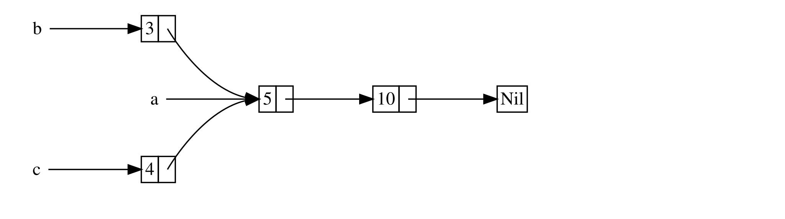

+++
title = "15.4 Rc<T>：引用计数智能指针"
date = 2026-08-05T08:44:00+08:00
weight = 71
type = "docs"
description = "用 Rc<T> 实现单线程场景下的多重所有权"
isCJKLanguage = true
draft = false
rust_version = "1.97.1"

+++

> 译文 · 基于 [The Rust Programming Language](https://doc.rust-lang.org/stable/book/)（rustc 1.97.1）

# Rc<T>：引用计数智能指针 {#rc-t}


> 原文链接: [https://doc.rust-lang.org/stable/book/ch15-04-rc.html](https://doc.rust-lang.org/stable/book/ch15-04-rc.html)


## `Rc<T>`：引用计数智能指针

　　多数情况下，所有权很清晰：你确切知道哪个变量拥有某个值。但也有单个值可能有多个所有者的情形。例如在图数据结构中，多条边可能指向同一节点，而该节点在概念上由所有指向它的边共同拥有。除非没有任何边再指向它、因而没有所有者，否则不应清理该节点。

　　要显式启用多重所有权，需要使用 Rust 类型 `Rc<T>`，它是**引用计数**（reference counting）的缩写。`Rc<T>` 跟踪指向某个值的引用数量，以判断该值是否仍在使用。若指向某个值的引用数为零，就可以清理该值，而不会使任何引用失效。

　　可以把 `Rc<T>` 想象成客厅里的电视机。有人进房看电视时打开电视；其他人也可以进来一起看。最后一个人离开时关掉电视，因为不再有人使用。若有人在别人还在看时关掉电视，剩下的观众就会抗议！

　　当我们想在堆上分配一些数据供程序多个部分读取，又无法在编译期确定哪一部分最后用完数据时，就使用 `Rc<T>`。若知道哪一部分会最后用完，就可以直接让那一部分成为数据的所有者，编译期强制的常规所有权规则就会生效。

　　注意：`Rc<T>` 只适用于单线程场景。第 16 章讨论并发时，我们会介绍如何在多线程程序中做引用计数。

### 共享数据

　　回到示例 15-5 中的 cons list。当时我们用 `Box<T>` 定义它。这次要创建两个列表，它们共享第三个列表的所有权。概念上类似图 15-3。



<span class="caption">图 15-3：两个列表 `b` 与 `c` 共享第三个列表 `a` 的所有权</span>

　　我们先创建包含 `5` 再包含 `10` 的列表 `a`。然后创建另外两个列表：以 `3` 开头的 `b`，以及以 `4` 开头的 `c`。`b` 和 `c` 随后都会接到第一个包含 `5` 与 `10` 的 `a` 列表上。换句话说，两个列表共享包含 `5` 与 `10` 的那一个列表。

　　若用带 `Box<T>` 的 `List` 定义来实现这一场景，将无法工作，如示例 15-17 所示。

**文件名：`src/main.rs`**

```rust
enum List {
    Cons(i32, Box<List>),
    Nil,
}

use crate::List::{Cons, Nil};

fn main() {
    let a = Cons(5, Box::new(Cons(10, Box::new(Nil))));
    let b = Cons(3, Box::new(a));
    let c = Cons(4, Box::new(a));
}
```

**示例 15-17**


　　编译这段代码会得到如下错误：

```console
$ cargo run
   Compiling cons-list v0.1.0 (file:///projects/cons-list)
error[E0382]: use of moved value: `a`
  --> src/main.rs:11:30
   |
 9 |     let a = Cons(5, Box::new(Cons(10, Box::new(Nil))));
   |         - move occurs because `a` has type `List`, which does not implement the `Copy` trait
10 |     let b = Cons(3, Box::new(a));
   |                              - value moved here
11 |     let c = Cons(4, Box::new(a));
   |                              ^ value used here after move
   |
note: if `List` implemented `Clone`, you could clone the value
  --> src/main.rs:1:1
   |
 1 | enum List {
   | ^^^^^^^^^ consider implementing `Clone` for this type
...
10 |     let b = Cons(3, Box::new(a));
   |                              - you could clone this value

For more information about this error, try `rustc --explain E0382`.
error: could not compile `cons-list` (bin "cons-list") due to 1 previous error
```

　　`Cons` 变体拥有它们所持有的数据，因此创建 `b` 列表时，`a` 被移动进 `b`，由 `b` 拥有 `a`。之后创建 `c` 时再想使用 `a` 就不允许了，因为 `a` 已被移动。

　　可以把 `Cons` 的定义改为持有引用，但那样就必须指定生命周期参数。指定生命周期参数意味着：列表中每个元素的存活时间至少与整个列表一样长。这对示例 15-17 中的元素与列表成立，但并非每种场景都如此。

　　因此，我们把 `List` 的定义改为用 `Rc<T>` 代替 `Box<T>`，如示例 15-18 所示。每个 `Cons` 变体现在保存一个值，以及一个指向 `List` 的 `Rc<T>`。创建 `b` 时，我们不再取得 `a` 的所有权，而是克隆 `a` 所持有的 `Rc<List>`，从而把引用数从 1 增到 2，让 `a` 与 `b` 共享该 `Rc<List>` 中的数据。创建 `c` 时同样克隆 `a`，把引用数从 2 增到 3。每次调用 `Rc::clone`，指向 `Rc<List>` 内数据的引用数都会增加；除非引用数变为零，否则不会清理数据。

**文件名：`src/main.rs`**

```rust
enum List {
    Cons(i32, Rc<List>),
    Nil,
}

use crate::List::{Cons, Nil};
use std::rc::Rc;

fn main() {
    let a = Rc::new(Cons(5, Rc::new(Cons(10, Rc::new(Nil)))));
    let b = Cons(3, Rc::clone(&a));
    let c = Cons(4, Rc::clone(&a));
}
```

**示例 15-18**


　　需要添加 `use` 语句导入 `Rc<T>`，因为它不在 prelude 中。在 `main` 中，我们创建保存 `5` 与 `10` 的列表，并把它存进新的 `Rc<List>`，赋给 `a`。然后创建 `b` 与 `c` 时，调用 `Rc::clone`，并把对 `a` 中 `Rc<List>` 的引用作为参数传入。

　　也可以调用 `a.clone()` 而不是 `Rc::clone(&a)`，但 Rust 约定在这种情况下使用 `Rc::clone`。`Rc::clone` 的实现不会像多数类型的 `clone` 那样对全部数据做深拷贝；调用 `Rc::clone` 只增加引用计数，耗时很少。深拷贝可能很耗时。通过用 `Rc::clone` 做引用计数，我们可以从视觉上区分深拷贝式克隆与增加引用计数的克隆。排查性能问题时，只需关注深拷贝克隆，可以忽略对 `Rc::clone` 的调用。

### 克隆以增加引用计数

　　我们修改示例 15-18 中可工作的例子，以便在创建与丢弃对 `a` 中 `Rc<List>` 的引用时，看到引用计数的变化。

　　在示例 15-19 中，我们改写 `main`，在列表 `c` 外加一个内部作用域；这样就能看到 `c` 离开作用域时引用计数如何变化。

**文件名：`src/main.rs`**
```rust
// --snip--

fn main() {
    let a = Rc::new(Cons(5, Rc::new(Cons(10, Rc::new(Nil)))));
    println!("count after creating a = {}", Rc::strong_count(&a));
    let b = Cons(3, Rc::clone(&a));
    println!("count after creating b = {}", Rc::strong_count(&a));
    {
        let c = Cons(4, Rc::clone(&a));
        println!("count after creating c = {}", Rc::strong_count(&a));
    }
    println!("count after c goes out of scope = {}", Rc::strong_count(&a));
}
```

**示例 15-19：打印引用计数**

　　在程序中引用计数发生变化的每一点，我们都打印引用计数；计数通过调用 `Rc::strong_count` 获得。函数名叫 `strong_count` 而不是 `count`，是因为 `Rc<T>` 还有 `weak_count`；我们会在[「用 `Weak<T>` 防止引用循环」](/trpl/smart-pointers/06-reference-cycles/#preventing-reference-cycles-turning-an-rct-into-a-weakt)中看到 `weak_count` 的用途。

　　这段代码打印：

```console
$ cargo run
   Compiling cons-list v0.1.0 (file:///projects/cons-list)
    Finished `dev` profile [unoptimized + debuginfo] target(s) in 0.45s
     Running `target/debug/cons-list`
count after creating a = 1
count after creating b = 2
count after creating c = 3
count after c goes out of scope = 2
```

　　可以看到，`a` 中的 `Rc<List>` 初始引用计数为 1；每次调用 `clone`，计数加 1。当 `c` 离开作用域时，计数减 1。我们不必像增加引用计数时调用 `Rc::clone` 那样，再调用某个函数来减少引用计数：当 `Rc<T>` 值离开作用域时，`Drop` 特征的实现会自动减少引用计数。

　　本例中看不到的是：在 `main` 结束时 `b` 与随后的 `a` 离开作用域后，计数变为 0，`Rc<List>` 被完全清理。使用 `Rc<T>` 可让单个值拥有多个所有者，而计数确保只要任一所有者仍存在，该值就保持有效。

　　通过不可变引用，`Rc<T>` 允许程序多个部分只读地共享数据。若 `Rc<T>` 也允许多个可变引用，就可能违反第 4 章讨论的借用规则之一：对同一处的多个可变借用可能导致数据竞争与不一致。但能够修改数据非常有用！下一节我们会讨论内部可变性模式，以及可与 `Rc<T>` 配合使用、以应对这种不可变限制的 `RefCell<T>` 类型。

[preventing-ref-cycles]: /trpl/smart-pointers/06-reference-cycles/#preventing-reference-cycles-turning-an-rct-into-a-weakt
