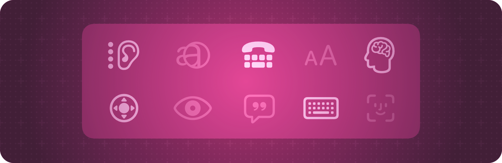

+++
title = "1 辅助功能基础"
date = 2026-09-12T12:47:47+08:00
weight = 1
type = "docs"
description = ""
isCJKLanguage = true
draft = false
+++

> 原文链接: [https://developer.apple.com/documentation/swiftui/accessibility-fundamentals](https://developer.apple.com/documentation/swiftui/accessibility-fundamentals)

# 1 辅助功能基础

让你的 SwiftUI 应用对所有人（包括残障人士）都可用。

## 概述 {#Overview}

与所有 Apple 用户界面框架一样，SwiftUI 自带辅助功能支持。框架会审视导航视图、列表、文本输入框、滑块、按钮等常见元素，并在默认情况下提供基本的辅助功能标签和值。你无需做任何额外工作就能启用这些标准辅助功能。

SwiftUI 还提供了一些工具，帮助你增强应用的辅助功能。要弄清需要哪些增强，可以试着在开启 VoiceOver、语音控制、切换控制等辅助功能的情况下使用你的应用，或者从经常使用这些功能的应用用户那里获取反馈。然后，使用 SwiftUI 提供的辅助功能视图修饰符来改善体验。例如，你可以用 [accessibilityLabel(_:)](https://developer.apple.com/documentation/swiftui/view/accessibilitylabel(_:)) 或 [accessibilityValue(_:)](https://developer.apple.com/documentation/swiftui/view/accessibilityvalue(_:)) 视图修饰符，为界面中的元素显式添加辅助功能标签。

请针对应用所运行的每个平台定制你对辅助功能修饰符的使用。例如，对于与 iOS 应用共享同一套代码基础的 Apple Watch 配套应用，你可能需要调整其辅助功能元素。如果你在 SwiftUI 中集成 AppKit 或 UIKit 控件，请暴露它们的辅助功能标签，并让它们可以从你的 [NSViewRepresentable](https://developer.apple.com/documentation/swiftui/nsviewrepresentable) 或 [UIViewRepresentable](https://developer.apple.com/documentation/swiftui/uiviewrepresentable) 视图中访问；如果底层辅助功能标签不可用，则提供自定义的辅助功能信息。

关于设计指导，请参阅 Human Interface Guidelines 中的 [辅助功能](https://developer.apple.com/design/human-interface-guidelines/accessibility)。

## 基础 {#Essentials}

- [创建无障碍视图](1.1-CreatingAccessibleViews/) — 通过为 SwiftUI 视图应用辅助功能修饰符，让你的应用对所有人都可用。

## 创建无障碍元素 {#Creating-accessible-elements}

- [accessibilityElement(children:)](https://developer.apple.com/documentation/swiftui/view/accessibilityelement(children:)) — 创建一个新的辅助功能元素，或者修改现有辅助功能元素的 [AccessibilityChildBehavior](https://developer.apple.com/documentation/swiftui/accessibilitychildbehavior)。
- [accessibilityChildren(children:)](https://developer.apple.com/documentation/swiftui/view/accessibilitychildren(children:)) — 用一到多个新的合成辅助功能元素替换现有辅助功能元素的子元素。
- [accessibilityRepresentation(representation:)](https://developer.apple.com/documentation/swiftui/view/accessibilityrepresentation(representation:)) — 用新的辅助功能元素替换该视图的一到多个辅助功能元素。
- [AccessibilityChildBehavior](https://developer.apple.com/documentation/swiftui/accessibilitychildbehavior) — 定义新父元素各子元素的行为。

## 标识元素 {#Identifying-elements}

- [accessibilityIdentifier(_:)](https://developer.apple.com/documentation/swiftui/view/accessibilityidentifier(_:)) — 使用你指定的字符串来标识该视图。
- [accessibilityIdentifier(_:isEnabled:)](https://developer.apple.com/documentation/swiftui/view/accessibilityidentifier(_:isenabled:)) — 使用你指定的字符串来标识该视图。

## 隐藏元素 {#Hiding-elements}

- [accessibilityHidden(_:)](https://developer.apple.com/documentation/swiftui/view/accessibilityhidden(_:)) — 指定是否对系统辅助功能隐藏该视图。
- [accessibilityHidden(_:isEnabled:)](https://developer.apple.com/documentation/swiftui/view/accessibilityhidden(_:isenabled:)) — 指定是否对系统辅助功能隐藏该视图。

## 支持类型 {#Supporting-types}

- [AccessibilityTechnologies](https://developer.apple.com/documentation/swiftui/accessibilitytechnologies) — 系统可用的辅助功能技术。
- [AccessibilityAttachmentModifier](https://developer.apple.com/documentation/swiftui/accessibilityattachmentmodifier) — 一种为视图添加辅助功能属性的视图修饰符
